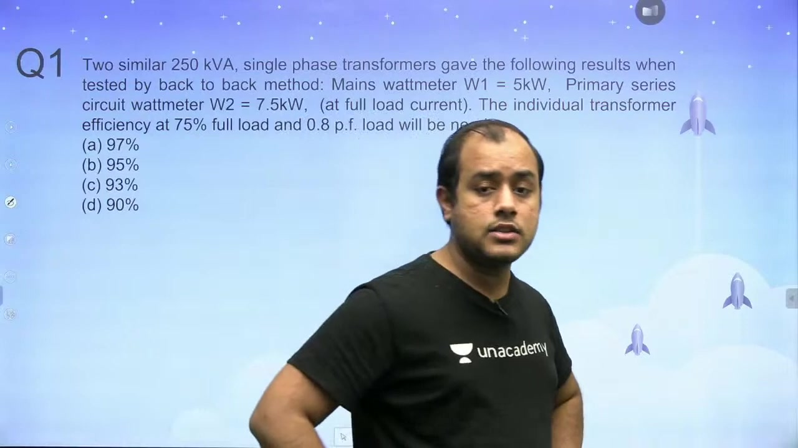
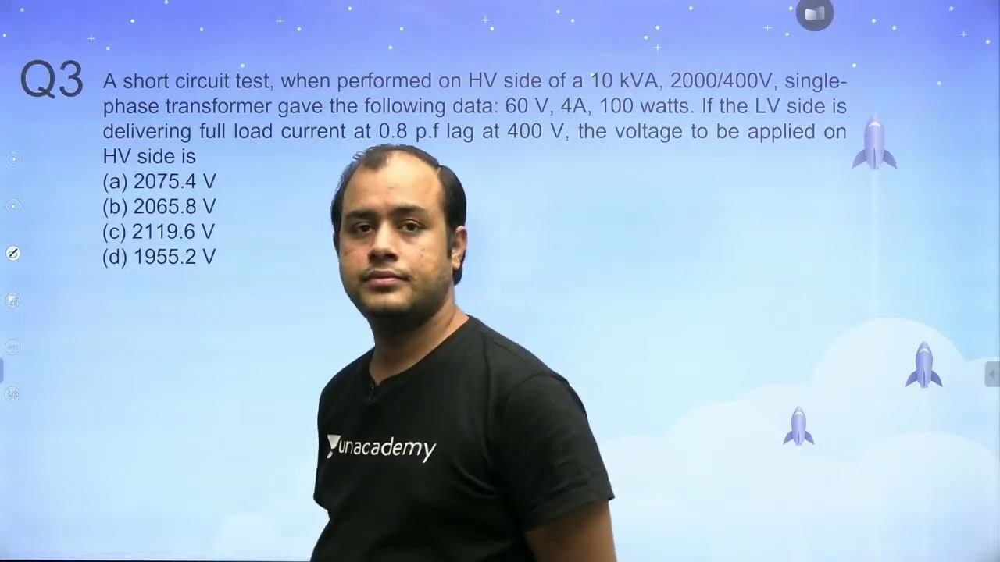
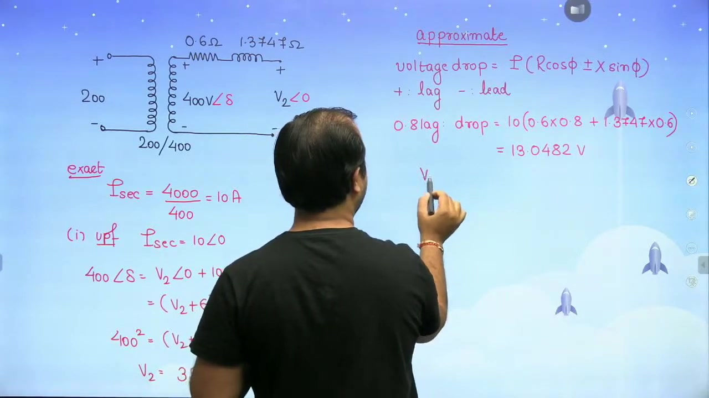
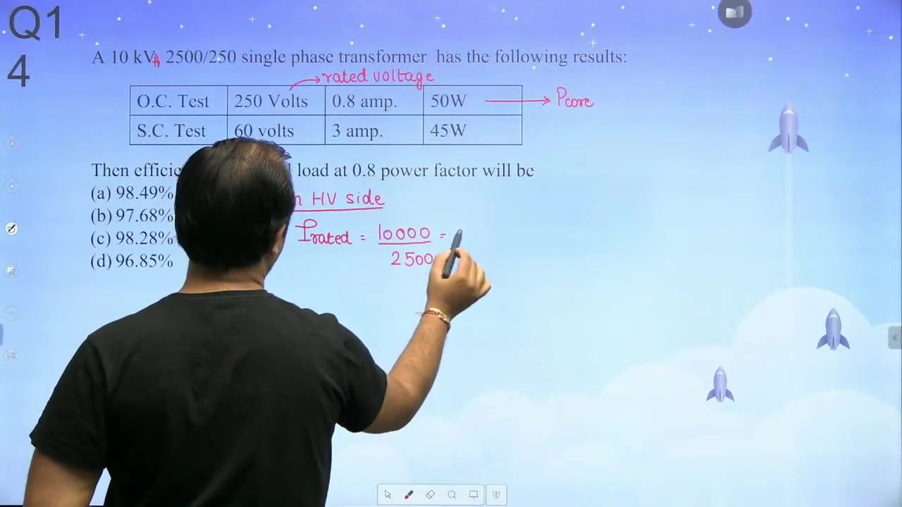

[← Lec 022: Testing of Transformer Part 2](Lecture_022_Testing_of_Transformer_Part_2.md) | [🏠 Index](00_yt_study_guide.md) | [Lec 024: Losses and Efficiency Part 1 →](Lecture_024_Losses_and_Efficiency_Part_1.md)

---

# Problems Based on Testing of Transformer | L7 | Electrical Machines | GATE 2022

- **Source**: https://www.youtube.com/watch?v=K-6LaXFVYBI
- **Duration**: 01:14:06
- **Compiled**: 2026-09-19

---

## Overview

This problem-solving lecture focuses on experimental testing of single-phase and three-phase transformers. It covers the open-circuit test, the short-circuit test, and Sumpner's back-to-back test. The problems establish direct referral of raw instrument readings across windings without separate impedance calculations. The lecture links measured test data directly to voltage regulation, load terminal voltage, and operating efficiency.

## Contents

- [[#Sumpner's Test: Efficiency Calculation|Sumpner's Test: Efficiency Calculation]]
- [[#Maximum Voltage Regulation and Power Factor|Maximum Voltage Regulation and Power Factor]]
- [[#Short-Circuit Parameters and Load Voltage Calculation|Short-Circuit Parameters and Load Voltage Calculation]]
- [[#Equivalent Circuit Parameter Extraction|Equivalent Circuit Parameter Extraction]]
- [[#Exact vs Approximate Terminal Voltage Calculation|Exact vs Approximate Terminal Voltage Calculation]]
- [[#Three-Phase Transformer Testing|Three-Phase Transformer Testing]]
- [[#Non-Rated Short-Circuit Testing and Loss Scaling|Non-Rated Short-Circuit Testing and Loss Scaling]]

---

## Sumpner's Test: Efficiency Calculation
_(00:16 - 05:08)_

> [!example] Problem
> Two identical $250\text{ kVA}$ transformers tested via Sumpner's method:
> - Mains wattmeter: $W_1 = 5.0\text{ kW}$
> - Series wattmeter: $W_2 = 7.5\text{ kW}$ (at rated current)
> 
> Find the efficiency of each transformer at $75\%$ full load, $0.8$ pf lagging.

1. **Extract Losses for One Unit**:
   - Core Loss: $P_i = W_1 / 2 = 2.5\text{ kW}$.
   - Full-Load Cu Loss: $P_{\text{cu,fl}} = W_2 / 2 = 3.75\text{ kW}$.
2. **Calculate Output Power ($x = 0.75$)**:
   - $P_{\text{out}} = x S \cos\phi = 0.75 \times 250 \times 0.8 = 150\text{ kW}$.
3. **Scale Copper Loss**:
   - $P_{\text{cu}} = x^2 P_{\text{cu,fl}} = (0.75)^2 \times 3.75 = 2.1094\text{ kW}$.
4. **Calculate Efficiency**:
   - $\eta = \frac{150}{150 + 2.5 + 2.1094} \times 100\% = 97.02\%$.

## Maximum Voltage Regulation and Power Factor
_(05:09 - 15:30)_

Maximum voltage regulation occurs at a lagging power factor equal to the internal series impedance angle ($\theta$):
$$\cos\phi = \cos\theta_{\text{sc}} = \frac{P_{\text{sc}}}{V_{\text{sc}} I_{\text{sc}}}$$

> [!example] Problem
> OC Test (LV): $250\text{ V}, 1.4\text{ A}, 105\text{ W}$.
> SC Test (HV): $104\text{ V}, 8\text{ A}, 320\text{ W}$.
> Determine load pf for maximum voltage regulation.

- **Solution**: The shunt branch (OC test) has no bearing on voltage regulation. Use SC test data directly:
  $$\cos\phi = \frac{320}{104 \times 8} = 0.384\text{ lag}$$

## Short-Circuit Parameters and Load Voltage Calculation
_(15:33 - 20:30)_

> [!example] Problem
> $10\text{ kVA}, 2000/400\text{ V}$. SC Test (HV): $60\text{ V}, 4\text{ A}, 100\text{ W}$.
> Find applied HV voltage to deliver rated current at $0.8$ pf lagging on LV side ($400\text{ V}$).

1. **Extract Series Parameters on HV Side**:
   - $Z_{01} = 60/4 = 15\ \Omega$.
   - $R_{01} = 100/4^2 = 6.25\ \Omega$.
   - $X_{01} = \sqrt{15^2 - 6.25^2} = 13.6358\ \Omega$.
2. **Reflect Load to Primary**:
   - $V_2' = a V_2 = (2000/400) \times 400 = 2000 \angle 0^\circ\text{ V}$.
   - $I_1' = 5 \angle -36.87^\circ\text{ A}$.
3. **KVL**:
   - $V_1 = 2000 \angle 0^\circ + (5 \angle -36.87^\circ)(6.25 + j13.6358)$.
   - $V_1 \approx 2065.8\text{ V}$.

## Equivalent Circuit Parameter Extraction
_(20:33 - 30:23)_

> [!example] Problem
> $4\text{ kVA}, 200/400\text{ V}$.
> OC (LV): $200\text{ V}, 0.7\text{ A}, 70\text{ W}$.
> SC (HV): $15\text{ V}, 10\text{ A}, 80\text{ W}$.
> Find parameters referred to LV side.

1. **Shunt Parameters (Already on LV)**:
   - $R_0 = 200^2 / 70 = 571.43\ \Omega$.
   - $I_w = 70 / 200 = 0.35\text{ A}$.
   - $I_\mu = \sqrt{0.7^2 - 0.35^2} = 0.6062\text{ A}$.
   - $X_0 = 200 / 0.6062 = 330\ \Omega$.
2. **Transfer SC Data to LV**:
   - $V_{\text{sc,LV}} = 15 / 2 = 7.5\text{ V}$.
   - $I_{\text{sc,LV}} = 10 \times 2 = 20\text{ A}$.
   - $W_{\text{sc}} = 80\text{ W}$ (Invariant).
3. **Series Parameters (LV)**:
   - $Z_t = 7.5 / 20 = 0.375\ \Omega$.
   - $R_t = 80 / 20^2 = 0.20\ \Omega$.
   - $X_t = \sqrt{0.375^2 - 0.2^2} = 0.3172\ \Omega$.

## Exact vs Approximate Terminal Voltage Calculation
_(30:41 - 46:16)_

Given $R_{02} = 0.6\ \Omega, X_{02} = 1.3747\ \Omega$, $I_2 = 10\text{ A}$, $E_2 = 400\text{ V}$.
- **Approximate Formula**: $\Delta V \approx I_2 (R_{02} \cos\phi \pm X_{02} \sin\phi)$ (+ for lag, - for lead).
- **At UPF**: $\Delta V \approx 10(0.6 \times 1) = 6\text{ V}$. $V_2 = 394\text{ V}$. (Exact method yields $393.76\text{ V}$; error $< 0.1\%$).
- **At $0.8$ Lag**: $\Delta V \approx 10(0.6 \times 0.8 + 1.3747 \times 0.6) = 13.05\text{ V}$. $V_2 = 386.95\text{ V}$.
- **At $0.8$ Lead**: $\Delta V \approx 10(0.6 \times 0.8 - 1.3747 \times 0.6) = -3.45\text{ V}$. $V_2 = 403.45\text{ V}$ (Voltage Rise).

## Three-Phase Transformer Testing
_(46:19 - 61:34)_

> [!example] Problem
> $100\text{ kVA}, 10000/500\text{ V}, \Delta\text{-Y}$.
> OC (LV Star): $V_L = 500\text{ V}, I_L = 10\text{ A}, P_0 = 1.6\text{ kW}$.
> SC (HV Delta): $V_L = 400\text{ V}, I_{\text{rated}}, P_{\text{sc}} = 2.0\text{ kW}$.
> Find parameters referred to HV side.

1. **Shunt Parameters (Transfer to HV Delta)**:
   - $V_{L,\text{HV}} = 500 \times 20 = 10000\text{ V}$.
   - $I_{L,\text{HV}} = 10 / 20 = 0.5\text{ A}$.
   - $P_{\text{ph}} = 1600 / 3 = 533.33\text{ W}$.
   - $R_c = V_{\text{ph}}^2 / P_{\text{ph}} = 10000^2 / 533.33 = 187.5\text{ k}\Omega$.
2. **Series Parameters (On HV Delta)**:
   - $I_{\text{ph}} = \frac{100\text{kVA}}{3 \times 10000\text{ V}} = 3.33\text{ A}$.
   - $R_{01} = \frac{2000/3}{3.33^2} = 60\ \Omega$.
   - $Z_{01} = 400 / 3.33 = 120\ \Omega$.
   - $X_{01} = \sqrt{120^2 - 60^2} = 103.92\ \Omega$.

## Non-Rated Short-Circuit Testing and Loss Scaling
_(66:31 - 71:19)_

If the SC test is performed at $I_{\text{sc}} \neq I_{\text{rated}}$, the copper loss must be scaled to full load:
$$P_{\text{cu,fl}} = P_{\text{sc}} \times \left(\frac{I_{\text{rated}}}{I_{\text{sc}}}\right)^2$$

> [!example] Problem
> $10\text{ kVA}, 2500/250\text{ V}$. SC Test (HV): $3\text{ A}, 45\text{ W}$.
> $I_{\text{rated,HV}} = 10000 / 2500 = 4\text{ A}$.
> $P_{\text{cu,fl}} = 45 \times (4/3)^2 = 80\text{ W}$.

---

## Summary and Key Takeaways

- In Sumpner's back-to-back test on two identical units, the mains wattmeter measures total core loss $2 P_i$, while the series wattmeter measures total full-load copper loss $2 P_{\text{cu,fl}}$.
- Maximum voltage regulation occurs at a lagging load power factor where the load angle equals the transformer series impedance angle, satisfying $\cos\phi = \cos\theta_{\text{sc}} = P_{\text{sc}} / (V_{\text{sc}} I_{\text{sc}})$.
- Raw short-circuit test data transfers directly across windings by scaling voltage by $N_1/N_2$ and current by $N_2/N_1$, while active power remains invariant.
- When calculating terminal voltage on load, the approximate drop formula $\Delta V \approx I_2 (R_{\text{eq}} \cos\phi \pm X_{\text{eq}} \sin\phi)$ yields numerical accuracy within $0.1\%$ of the exact quadratic method.
- At leading power factors the internal voltage drop becomes negative, producing a voltage rise where secondary terminal voltage exceeds no-load voltage.
- When a short-circuit test operates below rated current, full-load copper loss scales by the square of the current ratio: $P_{\text{cu,fl}} = P_{\text{sc}} (I_{\text{fl}} / I_{\text{sc}})^2$.
- For three-phase transformers, circuit parameters must be derived on a per-phase basis using appropriate star or delta winding relations.
- The open-circuit test is conducted on the low-voltage side to minimize voltage requirements, while the short-circuit test is conducted on the high-voltage side to minimize test current.

---

[← Lec 022: Testing of Transformer Part 2](Lecture_022_Testing_of_Transformer_Part_2.md) | [🏠 Index](00_yt_study_guide.md) | [Lec 024: Losses and Efficiency Part 1 →](Lecture_024_Losses_and_Efficiency_Part_1.md)
