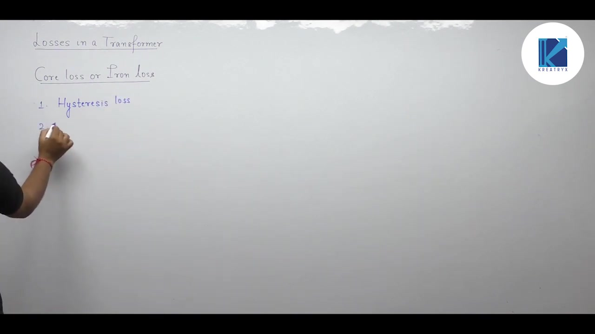
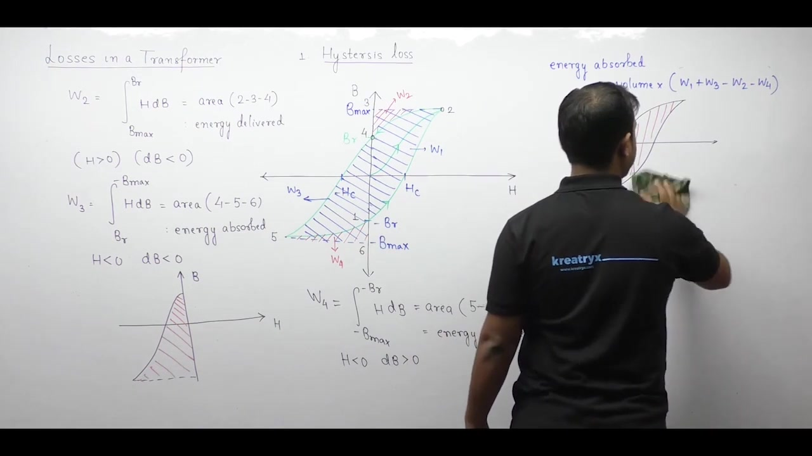
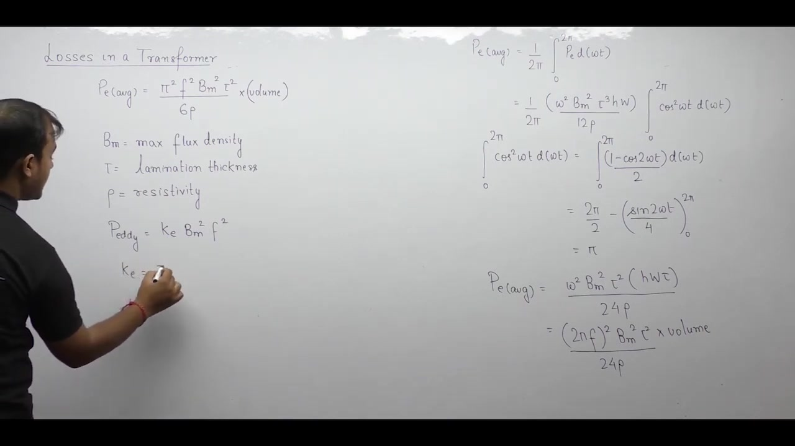

[← Lec 023: Problems Based on Testing of Transformer](Lecture_023_Problems_Based_on_Testing_of_Transformer.md) | [🏠 Index](00_yt_study_guide.md) | [Lec 025: Losses and Efficiency Part 2 →](Lecture_025_Losses_and_Efficiency_Part_2.md)

---

# Electrical Machines | Lec 17 | Losses & Efficiency (Part 1) | GATE Electrical Engineering

- **Source**: https://www.youtube.com/watch?v=qv9uu6GFCP4
- **Duration**: 01:02:06
- **Compiled**: 2026-09-20

---

## Overview

This lecture establishes the physical origin and mathematical formulation of core losses in electrical transformers. It analyzes hysteresis loss by tracking dipole friction and evaluating net magnetic energy over the closed $B\text{-}H$ magnetization loop. The discussion then derives eddy current loss from Maxwell-Faraday electrodynamics within laminated magnetic sheets. Finally, it develops voltage and frequency scaling laws and details the method to separate both losses experimentally.

## Contents

- [[#Hysteresis Loss: Physical Mechanism and Energy Loop|Hysteresis Loss: Physical Mechanism and Energy Loop]]
- [[#Hysteresis Power Formula and Frequency Dependence|Hysteresis Power Formula and Frequency Dependence]]
- [[#Eddy Current Loss: Physical Mechanism and Formula|Eddy Current Loss: Physical Mechanism and Formula]]
- [[#Scaling of Core Losses|Scaling of Core Losses]]
- [[#Experimental Separation of Core Losses|Experimental Separation of Core Losses]]

---

## Hysteresis Loss: Physical Mechanism and Energy Loop
_(00:34 - 28:46)_

### Origin of Hysteresis
Core loss (iron loss) consists of hysteresis and eddy current losses.
- Ferromagnetic domains (dipoles) align with the applied alternating magnetic field.
- Reversing these dipoles every half-cycle encounters "magnetic friction" from neighboring dipoles, dissipating energy as heat.
- In DC (constant field), dipoles do not flip, so hysteresis loss is zero.

### Energy Density and the $B\text{-}H$ Loop
The electrical energy consumed per unit volume over one cycle evaluates to the enclosed area of the $B\text{-}H$ loop.
- **Energy Absorbed ($W > 0$)**: When $H$ and $dB$ have the same sign (moving away from $B$-axis).
- **Energy Delivered ($W < 0$)**: When $H$ and $dB$ have opposite signs (returning to $B$-axis).
- **Net Energy**: The enclosed area of the hysteresis loop gives the net energy dissipated per cycle per unit volume.
  $$w_{\text{net}} = \oint H \, dB$$

## Hysteresis Power Formula and Frequency Dependence
_(28:46 - 38:11)_

Hysteresis power loss $P_h$ is the energy lost per unit time (multiplied by frequency $f$).
$$P_h = \text{Volume} \times (\text{Area of } B\text{-}H \text{ loop}) \times f$$

### Steinmetz Empirical Formula
$$P_h = k_h B_m^x f$$
- $k_h$: Hysteresis coefficient (depends on volume and material).
- $B_m$: Peak flux density.
- $x$: Steinmetz exponent (commonly taken as $2$ if not specified, historically $1.6$).

## Eddy Current Loss: Physical Mechanism and Formula
_(38:12 - 54:27)_

Alternating flux induces local circulating currents (eddy currents) within the conducting iron core. These closed current loops dissipate $I^2R$ heat.

### Mathematical Derivation (Thin Lamination)
By modeling a thin rectangular filament inside a lamination of thickness $\tau$:
- Induced EMF $e(t) \propto \omega B_m$.
- Power dissipated $dP_e = e^2 / dR$.
- Integrating across the thickness yields the average power loss:
  $$P_e = \frac{\pi^2 f^2 B_m^2 \tau^2}{6\rho} \times \text{Volume}$$
  $$P_e = k_e B_m^2 f^2$$

### Significance of Lamination Thickness ($\tau$)
Eddy current loss scales strictly with $\tau^2$. Slicing a solid core into thinner insulated sheets drastically reduces this loss.

## Scaling of Core Losses
_(54:29 - 56:10)_

Since $B_m \propto \frac{V}{f}$, core losses scale according to the operating condition.

- **Case 1: $V/f = \text{constant}$**: $B_m$ is constant.
  - $P_h \propto f$
  - $P_e \propto f^2$
- **Case 2: $V/f \neq \text{constant}$**: $B_m$ changes.
  - $P_h \propto \left(\frac{V}{f}\right)^x f = V^x f^{1-x}$
  - $P_e \propto \left(\frac{V}{f}\right)^2 f^2 \propto V^2$ (independent of frequency).

## Experimental Separation of Core Losses
_(56:11 - 61:59)_

The standard open-circuit test gives total core loss $W = P_h + P_e$. To separate them:
1. Conduct OC tests at varying frequencies while keeping $V/f$ constant.
2. Since $B_m$ is constant:
   $$W = K_1 f + K_2 f^2$$
3. Divide by $f$:
   $$\frac{W}{f} = K_1 + K_2 f$$
4. Plot $W/f$ vs $f$. This is a straight line $y = mx + c$:
   - **Y-intercept ($c$)**: $K_1$ (Hysteresis coefficient).
   - **Slope ($m$)**: $K_2$ (Eddy current coefficient).

---

## Summary and Key Takeaways

- Total core loss in a ferromagnetic core equals the sum of hysteresis loss and eddy current loss: $P_i = P_h + P_e$.
- Net magnetic energy absorbed per unit volume over one full alternating cycle equals the area enclosed by the $B\text{-}H$ loop: $w_{\text{net}} = \oint H \, dB$.
- Total hysteresis power loss is given by Steinmetz's empirical relation $P_h = k_h B_m^x f V_{\text{core}}$, where the Steinmetz exponent $x$ typically ranges from $1.5$ to $2.5$.
- Eddy current power loss in a lamination of thickness $\tau$ is proportional to the square of thickness, frequency, and peak flux density: $P_e = \frac{\pi^2 B_m^2 f^2 \tau^2}{6\rho} V_{\text{core}} = k_e B_m^2 f^2$.
- Lamination of the core reduces eddy current loss by a factor of $n^2$ when a solid core is divided into $n$ insulated sheets of identical total volume.
- When the voltage-to-frequency ratio $V/f$ is held constant, peak flux density $B_m$ remains constant, so hysteresis loss scales as $P_h \propto f$ and eddy loss scales as $P_e \propto f^2$.
- When supply voltage $V$ is held constant while frequency $f$ varies, peak flux density varies as $B_m \propto 1/f$, resulting in $P_h \propto f^{1-x}$ and constant eddy loss $P_e \propto V^2$.
- Core losses can be separated experimentally at constant $V/f$ by plotting $P_i/f$ against frequency $f$, where the vertical intercept yields the hysteresis coefficient $K_1$ and the slope yields the eddy coefficient $K_2$ in $P_i/f = K_1 + K_2 f$.

---

[← Lec 023: Problems Based on Testing of Transformer](Lecture_023_Problems_Based_on_Testing_of_Transformer.md) | [🏠 Index](00_yt_study_guide.md) | [Lec 025: Losses and Efficiency Part 2 →](Lecture_025_Losses_and_Efficiency_Part_2.md)
