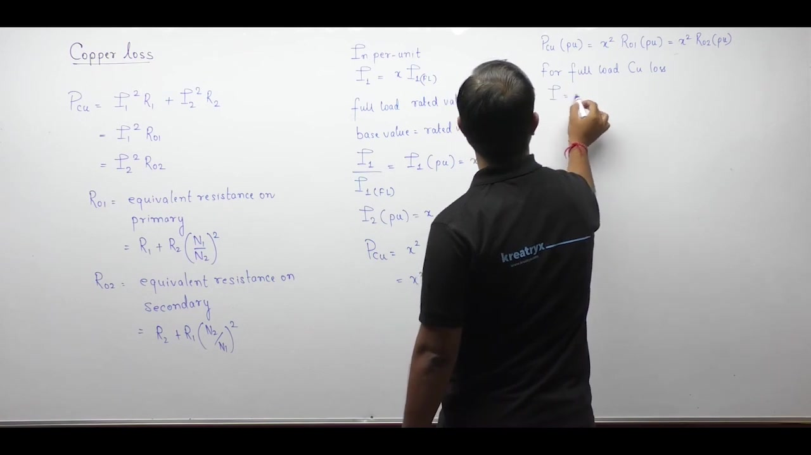
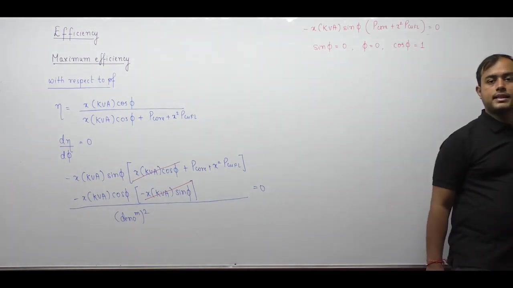

[← Lec 024: Losses and Efficiency Part 1](Lecture_024_Losses_and_Efficiency_Part_1.md) | [🏠 Index](00_yt_study_guide.md) | [Lec 026: Problems Based on Losses and Efficiency in Transformers →](Lecture_026_Problems_Based_on_Losses_and_Efficiency_in_Transformers.md)

---

# Electrical Machines | Lec 18 | Losses & Efficiency (Part 2)| GATE Electrical Engineering | Ankit Sir

- **Source**: https://www.youtube.com/watch?v=zjYFMkBac0Y
- **Duration**: 00:59:19
- **Compiled**: 2026-09-20

---

## Overview

This lecture completes the analysis of transformer losses by examining copper loss, stray load loss, and dielectric loss. It establishes the mathematical formulation of commercial efficiency in both actual and per-unit values under varying load conditions. The discussion derives the dual conditions for maximum efficiency with respect to load power factor and loading fraction. Finally, it contrasts power and distribution transformers and formulates the 24-hour all-day energy efficiency metric.

## Contents

- [[#Copper Loss and Per-Unit Resistance|Copper Loss and Per-Unit Resistance]]
- [[#Stray Load Loss and Dielectric Loss|Stray Load Loss and Dielectric Loss]]
- [[#Commercial Efficiency and its Optimization|Commercial Efficiency and its Optimization]]
- [[#All-Day Efficiency for Distribution Transformers|All-Day Efficiency for Distribution Transformers]]

---

## Copper Loss and Per-Unit Resistance
_(00:13 - 12:53)_

### Definition and Scaling
Copper loss is the ohmic $I^2 R$ power dissipation in the transformer windings.
- Actual copper loss depends quadratically on the loading fraction $x = I/I_{\text{rated}}$:
  $$P_{\text{cu}} = x^2 P_{\text{cu,fl}}$$

### Per-Unit Equivalence
In the per-unit system, the full-load copper loss is numerically equal to the per-unit equivalent resistance.
- $$P_{\text{cu,fl,pu}} = R_{\text{pu}}$$
- Because per-unit values are identical on primary and secondary sides, $R_{01\text{pu}} = R_{02\text{pu}} = R_{\text{pu}}$.

## Stray Load Loss and Dielectric Loss
_(12:59 - 25:13)_

### Stray Load Loss
- **Cause**: Leakage flux escaping the core induces eddy currents in adjacent external metallic structures (like the tank or clamping bolts).
- **Stray Iron Loss**: Eddy currents in the iron tank/frame (larger).
- **Stray Copper Loss**: Additional eddy currents inside the thick winding conductors (smaller).
- **Mitigation**: Use non-magnetic tanks (aluminum) and stranded winding conductors.
- **Magnitude**: ~0.5% of rating; usually neglected.

### Dielectric Loss
- **Cause**: Energy dissipated when electric dipoles in insulating materials (oil, paper) continuously reverse under alternating electric fields (electrostatic analog of hysteresis).
- **Magnitude**: ~0.2% of rating; usually neglected.

### Classification Summary
- **Constant Losses (Voltage-dependent)**: Core loss, Dielectric loss.
- **Variable Losses (Current-dependent)**: Copper loss, Stray load loss.

## Commercial Efficiency and its Optimization
_(25:18 - 47:24)_

Commercial efficiency is the ratio of output real power to input real power:
$$\eta = \frac{P_{\text{out}}}{P_{\text{out}} + P_{\text{loss}}} = \frac{x \cdot \text{kVA} \cdot \cos\phi_L}{x \cdot \text{kVA} \cdot \cos\phi_L + P_{\text{core}} + x^2 P_{\text{cu,fl}}}$$

### Condition 1: Maximizing wrt Power Factor
By differentiating $\eta$ with respect to $\phi_L$ and setting to zero, we find:
- Efficiency is maximized when $\cos\phi_L = 1$ (Unity Power Factor).
- At UPF, load current is entirely active, minimizing $I^2R$ waste from reactive current.

### Condition 2: Maximizing wrt Load Fraction ($x$)
By dividing the numerator and denominator by $x$ and minimizing the denominator wrt $x$, we find:
- Maximum efficiency occurs when:
  $$x^2 P_{\text{cu,fl}} = P_{\text{core}} \implies x = \sqrt{\frac{P_{\text{core}}}{P_{\text{cu,fl}}}}$$
- **Rule**: $\text{Variable Loss} = \text{Constant Loss}$

## All-Day Efficiency for Distribution Transformers
_(47:29 - 59:11)_

### Power vs Distribution Transformers
- **Power Transformers**: Operate near full load ($x \approx 1$) constantly. Designed for peak efficiency near full load.
- **Distribution Transformers**: Load ($x$) fluctuates heavily over 24 hours. Designed for peak efficiency at ~50-70% load.

### Energy-Based Efficiency Metric
Because load varies continuously for distribution transformers, commercial efficiency is meaningless. We use 24-hour integrated energy (all-day efficiency):
$$\eta_{\text{all-day}} = \frac{\text{Energy Output in 24 hours}}{\text{Energy Input in 24 hours}}$$

- **Core Energy Loss**: $E_{\text{core}} = 24 \times P_{\text{core}}$. (Constant 24/7).
- **Copper Energy Loss**: $E_{\text{cu}} = \sum x_i^2 P_{\text{cu,fl}} \cdot t_i$. (Evaluated piece-wise over varying load periods).

---

## Summary and Key Takeaways

- Total copper loss at any loading fraction $x = I/I_{\text{rated}}$ scales quadratically with load: $P_{\text{cu}} = x^2 P_{\text{cu,fl}}$.
- In the per-unit system, the equivalent winding resistance numerically equals the full-load copper loss: $P_{\text{cu,fl,pu}} = R_{\text{pu}}$.
- Stray load loss originates from time-varying leakage flux inducing eddy currents in external metallic structures such as the transformer tank.
- Transformer losses divide into constant losses ($P_{\text{core}}$, $P_{\text{dielectric}}$) that depend on voltage and variable losses ($P_{\text{cu}}$, $P_{\text{stray}}$) that scale with current squared.
- Commercial efficiency is given by $\eta = \frac{x \cdot \text{kVA} \cdot \cos\phi_L}{x \cdot \text{kVA} \cdot \cos\phi_L + P_{\text{core}} + x^2 P_{\text{cu,fl}}}$.
- For any given load fraction, maximum efficiency occurs at unity power factor ($\cos\phi_L = 1$).
- Maximum efficiency with respect to load occurs when variable copper loss equals constant core loss: $x^2 P_{\text{cu,fl}} = P_{\text{core}}$, yielding $x = \sqrt{P_{\text{core}}/P_{\text{cu,fl}}}$.
- All-day efficiency evaluates distribution transformers over a 24-hour cycle using the ratio of energy output to energy input: $\eta_{\text{all-day}} = \frac{E_{\text{out}}}{E_{\text{out}} + 24 P_{\text{core}} + \sum x_i^2 P_{\text{cu,fl}} t_i}$.

---

[← Lec 024: Losses and Efficiency Part 1](Lecture_024_Losses_and_Efficiency_Part_1.md) | [🏠 Index](00_yt_study_guide.md) | [Lec 026: Problems Based on Losses and Efficiency in Transformers →](Lecture_026_Problems_Based_on_Losses_and_Efficiency_in_Transformers.md)
