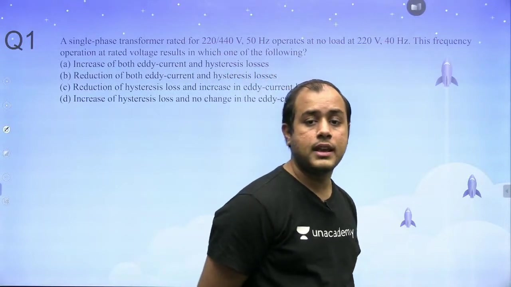
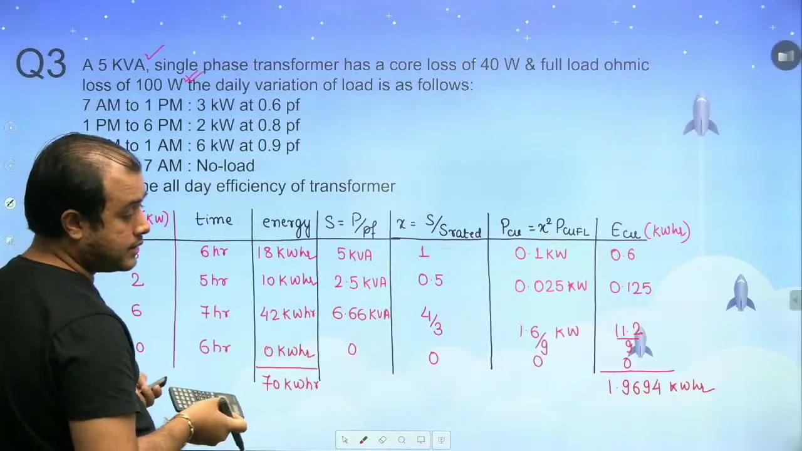

[← Lec 025: Losses and Efficiency Part 2](Lecture_025_Losses_and_Efficiency_Part_2.md) | [🏠 Index](00_yt_study_guide.md) | [Lec 027: Voltage Regulation →](Lecture_027_Voltage_Regulation.md)

---

# Problems Based on Losses and Efficiency in Transformers | L 8 | Electrical Machines | GATE 2022

- **Source**: https://www.youtube.com/watch?v=EnBlUwhov4A
- **Duration**: 01:14:58
- **Compiled**: 2026-09-20

---

## Overview

This lecture solves advanced problems on transformer losses, efficiency, and magnetic circuit principles. It covers constant voltage frequency changes, loss separation from efficiency data, and all-day efficiency calculations. The discussion analyzes core loss separation into hysteresis and eddy current components under constant $V/f$ ratios. It also examines non-sinusoidal voltages, Sumpner back-to-back testing, and test conversions across different supply frequencies.

## Contents

- [[#Problem 1: Frequency Variation at Rated Voltage|Problem 1: Frequency Variation at Rated Voltage]]
- [[#Problem 2 & 5: Loss Separation from Efficiency Points|Problem 2 & 5: Loss Separation from Efficiency Points]]
- [[#Problem 3: All-Day Efficiency Tabular Method|Problem 3: All-Day Efficiency Tabular Method]]
- [[#Problem 4 & 10: Maximum Efficiency Parameters|Problem 4 & 10: Maximum Efficiency Parameters]]
- [[#Problem 6: Core Loss Separation at Constant V/f|Problem 6: Core Loss Separation at Constant V/f]]
- [[#Problem 7: Efficiency vs Load and Power Factor|Problem 7: Efficiency vs Load and Power Factor]]
- [[#Problem 8: Non-Sinusoidal Applied Voltage|Problem 8: Non-Sinusoidal Applied Voltage]]
- [[#Problem 9: Sumpner's Back-to-Back Test|Problem 9: Sumpner's Back-to-Back Test]]
- [[#Problem 11-14: Conceptual Questions on Losses|Problem 11-14: Conceptual Questions on Losses]]
- [[#Problem 15: Referring OC and SC Tests Across Frequencies|Problem 15: Referring OC and SC Tests Across Frequencies]]

---

## Problem 1: Frequency Variation at Rated Voltage
_(00:10 - 05:08)_

> [!example] Problem 1
> A transformer operates at no load at rated voltage $V$, but frequency decreases from $50\text{ Hz}$ to $40\text{ Hz}$. What happens to core losses?

- **Analysis**:
  - $B_m \propto V/f$. Since $V$ is constant, decreasing $f$ increases $B_m$.
  - **Hysteresis Loss** ($P_h \propto B_m^x f \propto (V/f)^x f \propto 1/f^{x-1}$): Increases as $f$ drops.
  - **Eddy Current Loss** ($P_e \propto B_m^2 f^2 \propto V^2$): Remains unchanged.
- **Result**: Hysteresis loss increases; eddy current loss remains unchanged.

## Problem 2 & 5: Loss Separation from Efficiency Points
_(05:08 - 14:43, 24:56 - 35:21)_

> [!example] Problem 2
> A $20\text{ kVA}$ transformer has $98\%$ efficiency at full load (UPF) and half load (UPF). Find $P_i$ and $P_{\text{cu,fl}}$.

- **Approach**: Set up two equations using $\eta = \frac{x S \cos\phi}{x S \cos\phi + P_i + x^2 P_{\text{cu,fl}}}$.
  1. $x=1$: $0.98 = \frac{20}{20 + P_i + P_{\text{cu,fl}}} \implies P_i + P_{\text{cu,fl}} = 408.16\text{ W}$
  2. $x=0.5$: $0.98 = \frac{10}{10 + P_i + 0.25 P_{\text{cu,fl}}} \implies P_i + 0.25 P_{\text{cu,fl}} = 204.08\text{ W}$
- **Result**: $P_{\text{cu,fl}} = 272.11\text{ W}$, $P_i = 136.05\text{ W}$.
- **Per-Unit Resistance**: $R_{\text{pu}} = P_{\text{cu,fl,pu}} = 272.11 / 20000 = 0.0136\text{ pu}$.

*(Problem 5 uses the same methodology but with different load and pf parameters, yielding similar simultaneous equations).*

## Problem 3: All-Day Efficiency Tabular Method
_(14:46 - 19:36)_

> [!example] Problem 3
> $5\text{ kVA}$, $P_i = 40\text{ W}$, $P_{\text{cu,fl}} = 100\text{ W}$. Calculate all-day efficiency for a given 24h load cycle.

- **Approach**: Create a table mapping intervals $t$, active power $P$, $\cos\phi$, load fraction $x$, output energy ($E_{\text{out}} = Pt$), and copper loss energy ($E_{\text{cu}} = x^2 P_{\text{cu,fl}} t$).
- **Core Energy**: $E_{\text{core}} = 40\text{ W} \times 24\text{ h} = 960\text{ Wh} = 0.96\text{ kWh}$.
- **Result**: Summing columns yields $\eta_{\text{all-day}} = \frac{\sum E_{\text{out}}}{\sum E_{\text{out}} + E_{\text{core}} + \sum E_{\text{cu}}} = 95.98\%$.

## Problem 4 & 10: Maximum Efficiency Parameters
_(20:05 - 24:54, 54:19 - 61:05)_

> [!example] Problem 4
> $300\text{ kVA}$, $P_i = 1.5\text{ kW}$, $P_{\text{cu,fl}} = 4.5\text{ kW}$. Find load for maximum efficiency and its value at UPF.

- **Load for $\eta_{\text{max}}$**: $x = \sqrt{\frac{P_i}{P_{\text{cu,fl}}}} = \sqrt{\frac{1.5}{4.5}} = 0.577$ ($57.74\%$ load).
- **Maximum Efficiency Value**: At $x=0.577$, $P_{\text{out}} = x S \cos\phi = 173.2\text{ kW}$. Losses = $2 P_i = 3.0\text{ kW}$.
  $\eta_{\text{max}} = \frac{173.2}{173.2 + 3.0} = 98.297\%$.

## Problem 6: Core Loss Separation at Constant V/f
_(32:26 - 40:01)_

> [!example] Problem 6
> Given OC test readings across various frequencies while keeping $V/f = 4.0\text{ V/Hz}$ constant. Find $P_h$ and $P_e$.

- **Approach**: Plot $P_i/f = K_1 + K_2 f$.
  - From $50\text{ Hz}$ data ($55\text{ W}$): $1.10 = K_1 + 50 K_2$
  - From $25\text{ Hz}$ data ($23\text{ W}$): $0.92 = K_1 + 25 K_2$
- **Result**: Solving gives $K_1 = 0.74$, $K_2 = 0.0072$.
  - At $50\text{ Hz}$: $P_h = 37\text{ W}$, $P_e = 18\text{ W}$.

## Problem 7: Efficiency vs Load and Power Factor
_(41:01 - 46:31)_

- **Takeaway**: Shows that for a transformer with $P_i = 1\text{ kW}, P_{\text{cu,fl}} = 1\text{ kW}$:
  1. Efficiency always peaks at $100\%$ load ($x=1$) because $P_i = P_{\text{cu,fl}}$.
  2. Operating at lower power factors strictly reduces efficiency because useful power $P_{\text{out}}$ drops while total losses stay constant for a given load current.

## Problem 8: Non-Sinusoidal Applied Voltage
_(45:46 - 51:20)_

> [!example] Problem 8
> $v(t) = 200\sin(\omega t) - 50\sin(3\omega t)$. Find flux and change in $P_e$ if the harmonic is removed.

- **Flux**: $\phi = \frac{1}{N}\int v\,dt = \frac{0.8}{\omega}\cos(\omega t) - \frac{1}{15\omega}\cos(3\omega t)$.
- **Eddy Loss ($P_e \propto V^2$)**: $P_{e1} \propto (200^2 + 50^2) = 42500$. Without harmonic: $P_{e2} \propto 200^2 = 40000$.
- **Result**: Removing the 3rd harmonic reduces eddy loss by $5.88\%$.

## Problem 9: Sumpner's Back-to-Back Test
_(51:37 - 55:59)_

> [!example] Problem 9
> In Sumpner's test on two $200\text{ kVA}$ transformers, $W_1 = 5\text{ kW}$ (supply side), $W_2 = 5\text{ kW}$ (secondary series loop).

- **Analysis**:
  - $W_1$ measures total core loss for *both* units: $P_i = 5/2 = 2.5\text{ kW}$ per unit.
  - $W_2$ measures total full-load copper loss for *both* units: $P_{\text{cu,fl}} = 5/2 = 2.5\text{ kW}$ per unit.
- **Result**: $\eta_{\text{fl}} = 97.56\%$.

## Problem 11-14: Conceptual Questions on Losses
_(59:08 - 65:59)_

- **Prob 11**: Max efficiency kVA multiplier is $\sqrt{P_i / P_{sc}}$.
- **Prob 12**: If max efficiency occurs at $75\%$ load ($x=0.75$), then $P_i / P_{\text{cu,fl}} = x^2 = 9/16$.
- **Prob 13**: Air-core transformer hysteresis loss is identically zero (linear $B\text{-}H$ loop, zero area).
- **Prob 14**: If $V$ increases but $V/f$ is constant, $B_m$ remains constant (so $I_\mu$ is constant). However, $f$ must increase, so both $P_h \propto f$ and $P_e \propto f^2$ increase, causing total core loss to increase.

## Problem 15: Referring OC and SC Tests Across Frequencies
_(66:04 - 74:56)_

> [!example] Problem 15
> $50\text{ Hz}$ Tests: OC (LV) $100\text{ V}, 20\text{ W}$ ($P_h=10, P_e=10$); SC (HV) $5\text{ A}, 25\text{ W}$. Find readings for $40\text{ Hz}$ tests: OC (HV) at $160\text{ V}$ ($W_1$), SC (LV) at $10\text{ A}$ ($W_2$).

- **SC Test ($W_2$)**: Refer $50\text{ Hz}$ HV test to LV ($5\text{ A} \rightarrow 10\text{ A}$). Since current matches $40\text{ Hz}$ test conditions, copper loss is unchanged ($W_2 = 25\text{ W}$). Frequency has negligible impact on ohmic resistance.
- **OC Test ($W_1$)**: Refer $50\text{ Hz}$ LV test to HV ($100\text{ V} \rightarrow 200\text{ V}$). Check $V/f$ ratio: $200/50 = 4.0$, and $160/40 = 4.0$. Since $V/f$ is constant, scale $P_h \propto f$ and $P_e \propto f^2$:
  - $P_{h2} = 10 \times (40/50) = 8.0\text{ W}$
  - $P_{e2} = 10 \times (40/50)^2 = 6.4\text{ W}$
- **Result**: $W_1 = 14.4\text{ W}$, $W_2 = 25\text{ W}$.

---

## Summary and Key Takeaways

- Operating at constant voltage with reduced frequency increases maximum flux density $B_m \propto V/f$, causing hysteresis loss to increase while eddy current loss remains constant.
- The per-unit equivalent resistance of a transformer numerically equals the full-load copper loss in per unit: $R_{\text{pu}} = P_{\text{cu,fl,pu}}$.
- All-day efficiency is evaluated on a 24-hour energy basis where core loss acts continuously and copper loss scales as $x^2 P_{\text{cu,fl}} t$.
- Maximum efficiency occurs when variable copper loss equals constant iron loss ($x^2 P_{\text{cu,fl}} = P_i$), and it always peaks at unity power factor.
- Under constant $V/f$ ratio, core loss separates into linear and quadratic frequency terms: $P_i / f = K_1 + K_2 f$.
- For non-sinusoidal voltages, eddy current loss depends on the sum of squared harmonic voltages by superposition: $P_e \propto \sum V_n^2$.
- In Sumpner's test, the supply-side wattmeter measures total core loss for both units, while the secondary wattmeter measures total full-load copper loss.
- Air-core transformers have zero hysteresis loss because air has a linear $B\text{-}H$ characteristic with zero loop area.
- Referring open-circuit and short-circuit tests to target winding sides allows direct frequency scaling of losses using constant $V/f$ relations.

---

[← Lec 025: Losses and Efficiency Part 2](Lecture_025_Losses_and_Efficiency_Part_2.md) | [🏠 Index](00_yt_study_guide.md) | [Lec 027: Voltage Regulation →](Lecture_027_Voltage_Regulation.md)
