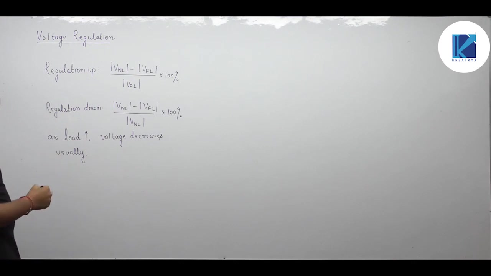
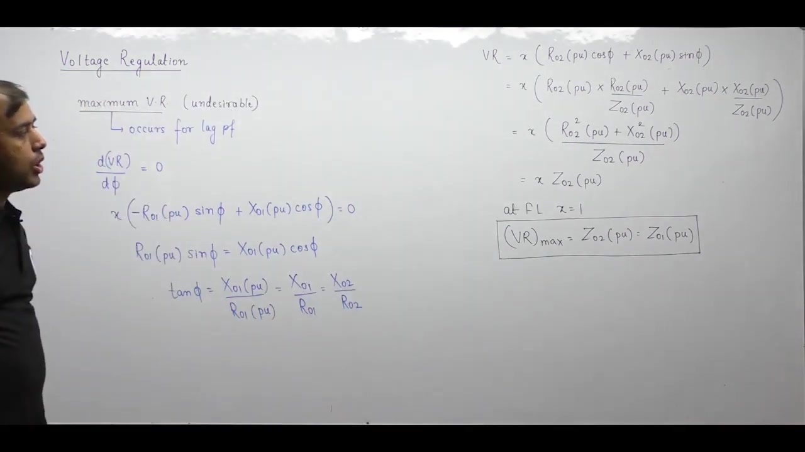

[← Lec 026: Problems Based on Losses and Efficiency in Transformers](Lecture_026_Problems_Based_on_Losses_and_Efficiency_in_Transformers.md) | [🏠 Index](00_yt_study_guide.md) | [Lec 028: Problems based on Voltage Regulation of Transformer →](Lecture_028_Problems_based_on_Voltage_Regulation_of_Transformer.md)

---

# Voltage Regulation | Electrical Machines | Lec 19 | GATE/ESE (EE, ECE) | Ankit Goyal

- **Source**: https://www.youtube.com/watch?v=rnehcEm07Fk
- **Duration**: 01:16:37
- **Compiled**: 2026-09-20

---

## Overview

This lecture develops the theory, derivation, and design methods for voltage regulation in transformers. It begins with the fundamental definitions of regulation up and regulation down before deriving the approximate per-unit regulation formula from phasor geometry. The lecture establishes operating conditions for maximum and zero voltage regulation along with their characteristic curves. Finally, it presents practical core and winding construction techniques used to minimize leakage flux and improve voltage regulation.

## Contents

- [[#Concept and Definition of Voltage Regulation|Concept and Definition of Voltage Regulation]]
- [[#Phasor Diagram and Approximate Voltage Drop|Phasor Diagram and Approximate Voltage Drop]]
- [[#Per-Unit Formulation and General Formula|Per-Unit Formulation and General Formula]]
- [[#Maximum and Zero Voltage Regulation Conditions|Maximum and Zero Voltage Regulation Conditions]]
- [[#Voltage Regulation Curve|Voltage Regulation Curve]]
- [[#Design Methods to Reduce Voltage Regulation|Design Methods to Reduce Voltage Regulation]]

---

## Concept and Definition of Voltage Regulation
_(00:13 - 19:54)_

### Physical Meaning
Voltage regulation measures a transformer's ability to maintain a constant terminal voltage under varying loads. As load current increases, the internal series impedance ($R_{\text{eq}} + jX_{\text{eq}}$) creates a voltage drop, reducing output voltage. Ideally, regulation should be zero.

### Formal Definitions
- **Regulation Up**: $\frac{|V_{\text{NL}}| - |V_{\text{FL}}|}{|V_{\text{FL}}|} \times 100\%$
- **Regulation Down**: $\frac{|V_{\text{NL}}| - |V_{\text{FL}}|}{|V_{\text{NL}}|} \times 100\%$

> [!success] Standard Formula for Transformers
> Always divide by the **rated voltage**:
> $$\text{VR} = \frac{|V_{\text{NL}}| - |V_{\text{FL}}|}{|V_{\text{rated}}|} \times 100\%$$

Calculations on primary or secondary sides yield identical results because the turns ratio cancels out.

### Application Importance
- **Distribution Transformers**: Feed consumers directly. Must have very low regulation to prevent appliance-damaging voltage sags.
- **Power Transformers**: Feed the grid, where operators regulate voltage actively. Internal regulation is less critical.

## Phasor Diagram and Approximate Voltage Drop
_(20:00 - 34:22)_

For a lagging power factor, we relate the primary (no-load) voltage $V_1'$ to the load voltage $V_2$ using KVL:
$\bar{V}_1' = \bar{V}_2 + \bar{I}_2 R_{02} + j\bar{I}_2 X_{02}$

Projecting the impedance drops onto the horizontal axis aligned with $\bar{V}_2$:
- **Resistive projection**: $I_2 R_{02} \cos\phi$
- **Reactive projection**: $I_2 X_{02} \sin\phi$

By neglecting a tiny perpendicular residual segment (valid for transformers because $\delta$ is very small, unlike synchronous machines), the scalar voltage difference is:
$$|V_1'| - |V_2| \approx I_2 (R_{02} \cos\phi + X_{02} \sin\phi)$$

## Per-Unit Formulation and General Formula
_(34:22 - 44:56)_

Dividing the voltage drop by $V_{2,\text{rated}}$ gives the per-unit voltage regulation. Defining load fraction $x = I_2 / I_{2,\text{rated}}$:

> [!success] General Approximate Formula
> $$\text{VR} = x (R_{\text{pu}} \cos\phi \pm X_{\text{pu}} \sin\phi)$$
> - **$+$ (Plus)**: For Lagging power factor.
> - **$-$ (Minus)**: For Leading power factor.

**Alternative Textbook Notation ($\epsilon_R, \epsilon_X$)**:
- $\epsilon_R = x R_{\text{pu}}$ (per-unit resistive drop)
- $\epsilon_X = x X_{\text{pu}}$ (per-unit reactive drop)
- $\%\text{VR} = (\%\epsilon_R \cos\phi \pm \%\epsilon_X \sin\phi)$

## Maximum and Zero Voltage Regulation Conditions
_(45:01 - 59:47)_

### Maximum Voltage Regulation (Lagging Only)
Differentiating $\text{VR} = x (R_{\text{pu}} \cos\phi + X_{\text{pu}} \sin\phi)$ with respect to $\phi$ and setting to zero yields:
- **Condition**: $\tan\phi = \frac{X_{\text{pu}}}{R_{\text{pu}}} \implies \phi = \theta_{\text{eq}}$
  *(Load impedance angle = Transformer internal impedance angle)*
- **Power Factor**: $\cos\phi = R/Z$ (lagging)
- **Magnitude**: $\text{VR}_{\max} = x Z_{\text{pu}}$ (At full load, $\text{VR}_{\max} = Z_{\text{pu}}$).

### Zero Voltage Regulation (Leading Only)
Setting $\text{VR} = x (R_{\text{pu}} \cos\phi - X_{\text{pu}} \sin\phi) = 0$ yields:
- **Condition**: $\tan\phi = \frac{R_{\text{pu}}}{X_{\text{pu}}} \implies \phi = 90^\circ - \theta_{\text{eq}}$
- **Power Factor**: $\cos\phi = X/Z$ (leading)

## Voltage Regulation Curve
_(59:47 - 65:13)_

Plotting VR against power factor:
- **Lagging Region**: VR is positive, peaking at $\cos\phi = R/Z$.
- **Unity PF**: VR = $x R_{\text{pu}}$.
- **Leading Region**: VR drops, crossing zero at $\cos\phi = X/Z$.
- **Negative VR**: For power factors more leading than $X/Z$, VR becomes negative. A negative VR means the load terminal voltage *exceeds* the no-load voltage (Ferranti-like capacitive boost).

## Design Methods to Reduce Voltage Regulation
_(65:19 - 76:25)_

Because $X \gg R$, reducing leakage reactance $X_l$ is the key to improving voltage regulation. To reduce leakage flux ($\Phi_l = \text{MMF} / \mathcal{R}_l$), we must increase the reluctance of the leakage path:

1. **Increase Window Height**: At constant window area, increasing height $H$ makes the coil taller and narrower, lengthening the leakage path through air ($\mathcal{R}_l \uparrow, X_l \downarrow$). Ratio limited to $H/W \le 4$.
2. **Concentric Windings (Core-type)**: Split turns across both limbs ($N/2$ per limb), halving the local MMF driving leakage flux. Place LV inside, HV outside.
3. **Sandwich Windings**: Interleave HV and LV disc sections along the limb (LV-HV-LV) to drastically reduce the localized MMF.
4. **Shell-Type Construction**: Outer iron limbs provide a low-reluctance path for core flux but tightly confine leakage paths, generally offering better regulation than core-type.

---

## Summary and Key Takeaways

- Voltage regulation is defined as $\text{VR} = \frac{|V_{\text{NL}}| - |V_{\text{FL}}|}{|V_{\text{rated}}|} \times 100\%$, using the rated voltage of the evaluated side in the denominator.
- The approximate per-unit voltage regulation formula is $\text{VR} = x (R_{\text{pu}} \cos\phi \pm X_{\text{pu}} \sin\phi)$, where the plus sign applies to lagging loads and the minus sign applies to leading loads.
- In terms of percentage voltage drops, regulation is written as $\%\text{VR} = (\%\epsilon_R \cos\phi \pm \%\epsilon_X \sin\phi)$, where $\epsilon_R = x R_{\text{pu}}$ and $\epsilon_X = x X_{\text{pu}}$.
- Maximum voltage regulation occurs at a lagging power factor of $\cos\phi = R/Z$, where the load $X/R$ ratio equals the transformer internal $X/R$ ratio.
- The magnitude of maximum voltage regulation equals $x Z_{\text{pu}}$, which simplifies to the per-unit impedance $Z_{\text{pu}}$ at full rated load.
- Zero voltage regulation occurs only at a leading power factor of $\cos\phi = X/Z$, where $\tan\phi = R/X$ and the load angle satisfies $\phi = 90^\circ - \theta$.
- For leading power factors with $\cos\phi < X/Z$, voltage regulation becomes negative, meaning the full-load terminal voltage exceeds the no-load voltage.
- Leakage reactance dominates voltage regulation, so regulation is reduced by increasing window height at constant window area with $H/W \le 4$.
- Concentric windings with split turns, interleaved sandwich windings, and shell-type core geometries reduce leakage flux and minimize voltage regulation.

---

[← Lec 026: Problems Based on Losses and Efficiency in Transformers](Lecture_026_Problems_Based_on_Losses_and_Efficiency_in_Transformers.md) | [🏠 Index](00_yt_study_guide.md) | [Lec 028: Problems based on Voltage Regulation of Transformer →](Lecture_028_Problems_based_on_Voltage_Regulation_of_Transformer.md)
