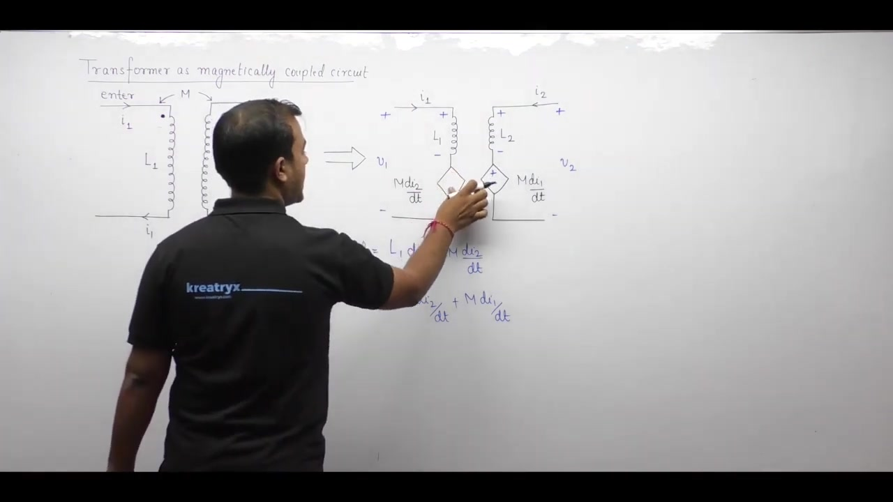
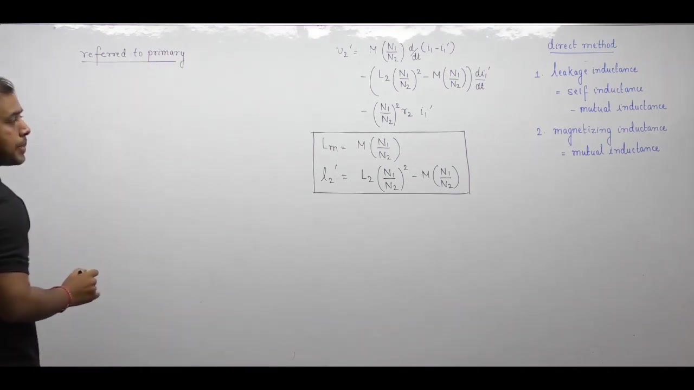
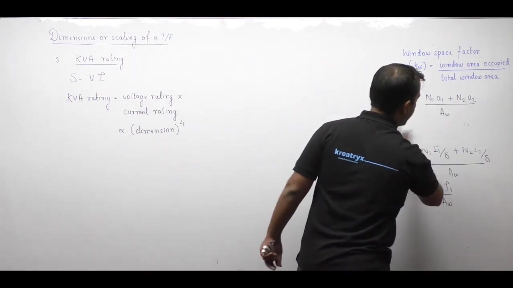

[← Lec 028: Problems based on Voltage Regulation of Transformer](Lecture_028_Problems_based_on_Voltage_Regulation_of_Transformer.md) | [🏠 Index](00_yt_study_guide.md) | [Lec 030: Important Concepts in Electrical Machines 2 →](Lecture_030_Important_Concepts_in_Electrical_Machines_2.md)

---

# Electrical Machines | Lec 20 | Important Concepts in Electrical Machines - 1| GATE Electrical Engg

- **Source**: https://www.youtube.com/watch?v=qEpFybbOpvo
- **Duration**: 00:57:11
- **Compiled**: 2026-09-20

---

## Overview

This lecture links magnetically coupled circuits to the practical transformer equivalent circuit. It establishes exact mathematical relationships between self and mutual inductances and transformer leakage and magnetizing parameters. The discussion then introduces dimensional scaling laws for electrical machines under constant maximum flux density. These scaling relations show how machine ratings, losses, temperature rise, and excitation currents scale when linear dimensions grow.

## Contents

- [[#Coupled Circuits and Inductance Relationships|Coupled Circuits and Inductance Relationships]]
- [[#Direct Inspection Rules for Transformer Inductances|Direct Inspection Rules for Transformer Inductances]]
- [[#Dimensional Scaling Laws (Constant Flux Density)|Dimensional Scaling Laws (Constant Flux Density)]]

---

## Coupled Circuits and Inductance Relationships
_(00:13 - 28:17)_

A transformer is fundamentally a pair of magnetically coupled coils operating in **subtractive coupling** (primary and secondary fluxes oppose each other). 

### Coupled Circuit Equations (Subtractive)
Let $L_1, L_2$ be self-inductances and $M$ be mutual inductance.
- **Primary Loop**: $v_1 = i_1 R_1 + L_1 \frac{di_1}{dt} - M \frac{di_2}{dt}$
- **Secondary Loop**: $v_2 = -i_2 R_2 - L_2 \frac{di_2}{dt} + M \frac{di_1}{dt}$

### Equivalent Circuit Derivation
By substituting $i_2 = a i_1'$ (where $a = N_1/N_2$) and forcing the equations into the format of the transformer T-equivalent circuit ($l_1, L_m, l_2'$), we extract the exact relationships:

> [!success] Derivation Results
> - **Primary Leakage Inductance**: $l_1 = L_1 - a M$
> - **Magnetizing Inductance**: $L_{m1} = a M$
> - **Secondary Leakage Inductance (Referred to Primary)**: $l_2' = a^2 L_2 - a M$

## Direct Inspection Rules for Transformer Inductances
_(28:20 - 34:20)_

Instead of deriving KVL equations, use these direct inspection rules to find transformer equivalent parameters from coupled circuit parameters:

1. **Leakage Inductance** = Self Inductance $-$ Mutual Inductance.
2. **Magnetizing Inductance** = Mutual Inductance.

### Referral Rules for Inductances
- **Self-Inductance** is referred using the **square of the turns ratio** (e.g., $l_2' = a^2 l_2$).
- **Mutual Inductance** is referred using the **single power of the turns ratio** (e.g., $L_{m1} = a M$).

**Referred to Primary ($a = N_1/N_2$)**:
- $l_1 = L_1 - M(N_1/N_2)$
- $L_m = M(N_1/N_2)$
- $l_2' = (N_1/N_2)^2 L_2 - M(N_1/N_2)$

## Dimensional Scaling Laws (Constant Flux Density)
_(34:24 - 57:03)_

When a machine's linear dimensions (length, width, height) are scaled by a factor $x$, and maximum flux density $B_m$, current density $J$, and frequency $f$ are kept constant, the following proportionalities hold:

### Voltage, Current, and Power
- **Voltage ($V$)**: $V \propto A_c$ (core area). Therefore, $V \propto x^2$.
- **Current ($I$)**: $I \propto A_w$ (window area) assuming constant current density $J$ and window space factor $K_w$. Therefore, $I \propto x^2$.
- **Apparent Power (kVA)**: $\text{kVA} = V \times I \propto x^2 \times x^2 = x^4$. 
  *A machine twice as large can handle 16 times the power.*

### Losses, Efficiency, and Cooling
- **Core and Copper Losses**: Both depend on volume. Therefore, $P_{\text{loss}} \propto x^3$.
- **Efficiency**: Since power scales as $x^4$ and losses as $x^3$, the percentage loss ($P_{\text{loss}} / \text{kVA}$) scales as $1/x$. Larger machines are inherently more efficient.
- **Cooling Area**: Surface area available for cooling scales as $A_{\text{cool}} \propto x^2$.
- **Temperature Rise ($\Delta \theta$)**: $\Delta \theta \propto P_{\text{loss}} / A_{\text{cool}} \propto x^3 / x^2 = x$.
  *Larger machines run hotter and require advanced cooling (e.g., forced air/oil) rather than natural convection.*

### Excitation and Mechanics
- **No-Load Current ($I_0$)**: $I_w \propto x$ and $I_\mu \propto x$ (because magnetic path length $l_c \propto x$). Therefore, absolute $I_0 \propto x$.
- **Per-Unit No-Load Current**: $I_{0,\text{pu}} = I_0 / I_{\text{rated}} \propto x / x^2 = 1/x$.
- **Moment of Inertia ($J$)**: $J = \frac{1}{2} M r^2$. Mass scales as $x^3$, $r^2$ scales as $x^2$. Therefore, $J \propto x^5$.

> [!summary] Master Scaling Table ($x = \text{linear scaling factor}$)
> | Parameter | Scales As |
> | :--- | :--- |
> | Areas ($A_c, A_w, A_{\text{cool}}$) | $x^2$ |
> | Volume, Mass | $x^3$ |
> | Voltage ($V$), Current ($I$) | $x^2$ |
> | Power Rating (kVA) | $x^4$ |
> | Losses ($P_c, P_{cu}$) | $x^3$ |
> | Temperature Rise ($\Delta \theta$) | $x$ |
> | Moment of Inertia ($J$) | $x^5$ |

---

## Summary and Key Takeaways

- In coupled circuits, mutual inductance is represented by a dependent voltage source where current enters the positive terminal for additive coupling and the negative terminal for subtractive coupling.
- Operating transformers exhibit subtractive magnetic coupling because secondary current produces flux that opposes the primary flux.
- Primary leakage inductance equals primary self-inductance minus mutual inductance referred to primary: $l_1 = L_1 - M (N_1/N_2)$.
- Secondary leakage inductance referred to primary is $l_2' = (N_1/N_2)^2 L_2 - M (N_1/N_2)$, while magnetizing inductance is $L_m = M (N_1/N_2)$.
- Self-inductance scales by the square of the turns ratio, but mutual inductance scales by the single power of the turns ratio.
- Under constant flux density and fixed frequency, transformer voltage rating scales as the square of linear dimensions: $V \propto x^2$.
- Conductor cross section scales with window area under constant current density, yielding a current rating scaling of $I \propto x^2$.
- Transformer apparent power rating scales as the fourth power of linear dimensions ($\text{kVA} \propto x^4$), while total losses scale as $x^3$.
- Because losses scale as $x^3$ while heat dissipation area scales as $x^2$, temperature rise increases linearly with size ($\Delta \theta \propto x$).

---

[← Lec 028: Problems based on Voltage Regulation of Transformer](Lecture_028_Problems_based_on_Voltage_Regulation_of_Transformer.md) | [🏠 Index](00_yt_study_guide.md) | [Lec 030: Important Concepts in Electrical Machines 2 →](Lecture_030_Important_Concepts_in_Electrical_Machines_2.md)
