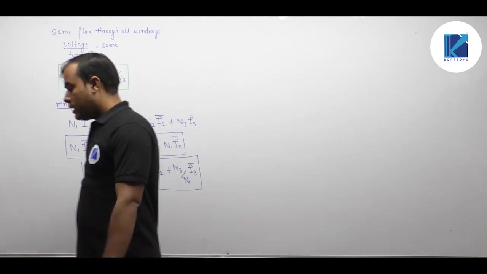
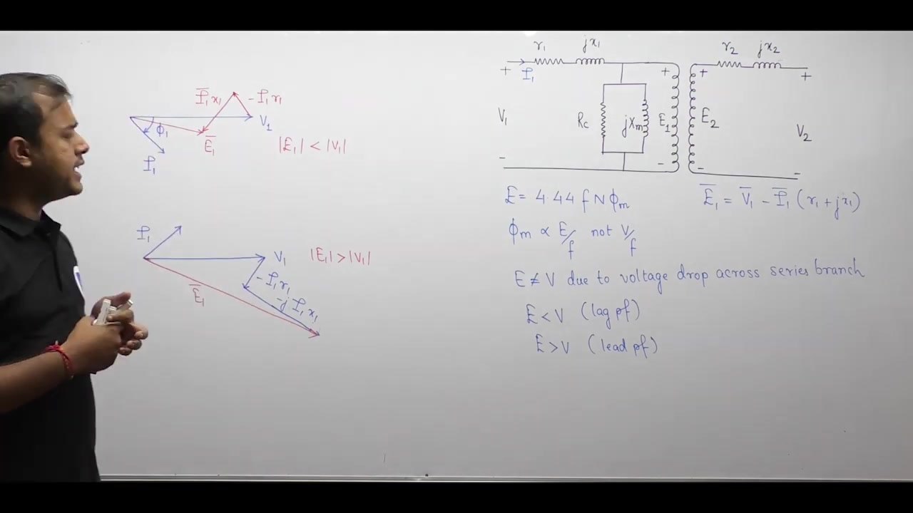

[← Lec 029: Important Concepts in Electrical Machines 1](Lecture_029_Important_Concepts_in_Electrical_Machines_1.md) | [🏠 Index](00_yt_study_guide.md) | [Lec 031: Transformer and Magnetically Coupled Circuits →](Lecture_031_Transformer_and_Magnetically_Coupled_Circuits.md)

---

# Electrical Machines | Lec 21 | Important Concepts in Electrical Machines - 2| GATE Electrical Engg

- **Source**: https://www.youtube.com/watch?v=lMFoAAAXK_o
- **Duration**: 01:03:42
- **Compiled**: 2026-09-20

---

## Overview

This lecture examines comparative transformer design, multi-winding systems, and non-ideal core behavior. It contrasts power transformers with distribution transformers across voltage ratings, efficiency targets, and fault protection. It establishes the governing laws for three-winding transformers and examines tertiary winding functions. The lecture also investigates square-wave excitation, load power factor effects on internal flux, and multi-winding circuit analysis.

## Contents

- [[#Power Transformers vs Distribution Transformers|Power Transformers vs Distribution Transformers]]
- [[#Three-Winding Transformers|Three-Winding Transformers]]
- [[#Square-Wave Excitation & Core Saturation|Square-Wave Excitation & Core Saturation]]
- [[#Effect of Power Factor on Core Flux and Efficiency|Effect of Power Factor on Core Flux and Efficiency]]
- [[#Problem: Multi-Winding Impedance Matching|Problem: Multi-Winding Impedance Matching]]

---

## Power Transformers vs Distribution Transformers
_(00:12 - 26:48)_

| Feature | Power Transformer | Distribution Transformer |
| :--- | :--- | :--- |
| **Location** | Generator to transmission line | Transmission line to consumer load |
| **Voltage** | Very high (e.g., $400\text{ kV}$) | Low/Medium (e.g., $440\text{ V}$) |
| **Insulation & Reactance** | Thick insulation $\implies$ High leakage $X$ ($\approx 0.10\text{ pu}$). Limits fault currents. | Thin insulation $\implies$ Low leakage $X$ ($\approx 0.01\text{ pu}$). Keeps voltage regulation low. |
| **Load Profile** | Steady, continuous near full load | Fluctuates heavily over 24h |
| **Efficiency Target** | **Commercial Efficiency**: Optimized to peak at full load ($x=1$) | **All-Day Efficiency**: Optimized to peak at typical average load ($x=0.5$ to $0.7$) |
| **Core & Losses** | Runs near saturation knee (high $B_m$) to shrink core size. $P_{cu} \gg P_c$. Focus: Minimize Copper Loss. | Runs in linear region (low $B_m$) to limit continuous 24h iron loss. $P_{cu}$ drops at light loads. Focus: Minimize Core Loss. |

## Three-Winding Transformers
_(26:51 - 36:09)_

A core with three separate windings (Primary, Secondary, Tertiary).
Governing rules:
1. **Constant Voltage per Turn**: $\frac{V_1}{N_1} = \frac{V_2}{N_2} = \frac{V_3}{N_3}$
2. **MMF Balance**: $N_1 I_1 = N_1 I_0 + N_2 I_2 + N_3 I_3$ (where $I_2, I_3$ are load currents)
3. **Power Conservation**: $S_1 = S_0 + S_2 + S_3$

### Purpose of a Tertiary Winding
- Connects three different voltage levels (e.g., $400\text{ kV} / 220\text{ kV} / 33\text{ kV}$).
- Supplies local substation auxiliary loads ($415\text{ V}$).
- Connects static capacitors for reactive power compensation at lower, safer voltages.
- **Delta Tertiary in Star-Star Transformers**: Traps zero-sequence 3rd harmonic currents, eliminating severe neutral potential oscillations.

## Square-Wave Excitation & Core Saturation
_(36:10 - 48:05)_

If a square-wave voltage $v_1(t)$ is applied to the primary:
- **Ideal Transformer**: Core flux $\Phi(t)$ integrates into a pure triangular wave. The secondary voltage $v_2(t) \propto d\Phi/dt$ emerges as a **perfect square wave**.
- **Practical Transformer (with Saturation)**: The triangular flux clips flat at $\Phi_{\text{sat}}$. During clipping, $d\Phi/dt = 0$, so $v_2(t) = 0$. During transitions, $d\Phi/dt = \pm C$. The secondary voltage emerges as an **alternating pulse train** separated by zero-voltage gaps.

## Effect of Power Factor on Core Flux and Efficiency
_(48:09 - 57:41)_

A practical transformer is **not strictly a constant-flux device**. The internal induced EMF $E_1 = V_1 - I_1(R_1 + jX_1)$ varies with load current and power factor:
- **Lagging PF**: Vector subtraction pulls $E_1$ inward ($|E_1| < |V_1|$). Core flux **decreases**.
- **Leading PF**: Vector subtraction pushes $E_1$ outward ($|E_1| > |V_1|$). Core flux **increases**.

**Efficiency Implication**:
Because core loss $P_c \propto B_m^2 \propto \Phi_m^2$, a leading power factor increases core losses compared to a lagging power factor.
$\implies \eta_{\text{lead}} < \eta_{\text{lag}}$ (for the same load current magnitude and numerical PF).

## Problem: Multi-Winding Impedance Matching
_(57:46 - 63:34)_

> [!example] Problem
> $N_1:N_2:N_3 = 4:1:2$. $V_1 = 16\text{ V}$. $R_2 = 30\,\Omega$, $R_3 = 15\,\Omega$. Find primary power $P_1$ and primary current $I_1$ (UPF).

- **Method 1 (Power Conservation)**:
  - $V_2 = 16 \times (1/4) = 4\text{ V}$. $P_2 = 4^2/30 = 0.533\text{ W}$.
  - $V_3 = 16 \times (2/4) = 8\text{ V}$. $P_3 = 8^2/15 = 4.267\text{ W}$.
  - Total $P_1 = P_2 + P_3 = 4.8\text{ W}$.
  - $I_1 = P_1 / V_1 = 4.8 / 16 = 0.3\text{ A}$.
- **Method 2 (Impedance Referral)**:
  - $R_2' = 30(4/1)^2 = 480\,\Omega$. $R_3' = 15(4/2)^2 = 60\,\Omega$.
  - $R_{\text{eq}} = 480 \parallel 60 = 53.33\,\Omega$.
  - $I_1 = V_1 / R_{\text{eq}} = 16 / 53.33 = 0.3\text{ A}$.
- **Method 3 (MMF Balance)**:
  - $I_2 = 4/30\text{ A}$, $I_3 = 8/15\text{ A}$.
  - $I_1 = I_2(N_2/N_1) + I_3(N_3/N_1) = (4/30)(1/4) + (8/15)(2/4) = 0.3\text{ A}$.

All methods yield identical results; power conservation is often fastest.

---

## Summary and Key Takeaways

- Power transformers operate near the saturation knee point and achieve maximum commercial efficiency at full load, while distribution transformers operate in the linear magnetic region and maximize all-day energy efficiency at $50\% - 70\%$ load.
- Higher per-unit leakage reactance in power transformers ($X_{\text{pu}} \approx 0.10\text{ pu}$) limits short-circuit fault currents, whereas distribution transformers use low reactance ($X_{\text{pu}} \approx 0.01\text{ pu}$) to minimize voltage regulation drops.
- Three-winding transformers on a common core satisfy constant volts per turn $\frac{V_1}{N_1} = \frac{V_2}{N_2} = \frac{V_3}{N_3}$, MMF balance $N_1 I_1 = N_1 I_0 + N_2 I_2 + N_3 I_3$, and complex power conservation $S_1 = S_0 + S_2 + S_3$.
- A delta-connected tertiary winding provides a closed circulating path for third-harmonic zero-sequence currents, which prevents neutral point oscillation in star-star systems.
- Exciting an ideal transformer with a square-wave voltage produces a triangular core flux and a square-wave secondary voltage, whereas core saturation in a practical transformer produces an alternating pulse train.
- A practical transformer is not strictly a constant-flux device because internal leakage impedance causes $|E_1| < |V_1|$ at lagging power factor and $|E_1| > |V_1|$ at leading power factor.
- Operating at a leading power factor increases internal core flux density, which raises iron losses $P_c \propto B_m^2$ and yields lower efficiency than operating at the same numerical lagging power factor.
- Multi-winding transformer circuits can be solved via power conservation, primary impedance referral, or ampere-turn balance, with power conservation providing the fastest calculation.

---

[← Lec 029: Important Concepts in Electrical Machines 1](Lecture_029_Important_Concepts_in_Electrical_Machines_1.md) | [🏠 Index](00_yt_study_guide.md) | [Lec 031: Transformer and Magnetically Coupled Circuits →](Lecture_031_Transformer_and_Magnetically_Coupled_Circuits.md)
