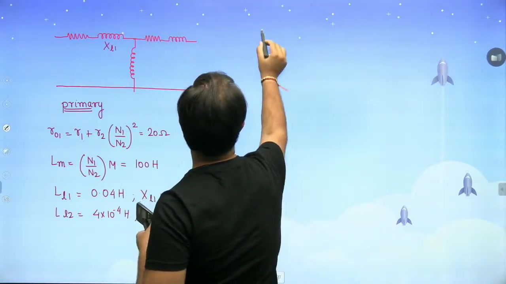
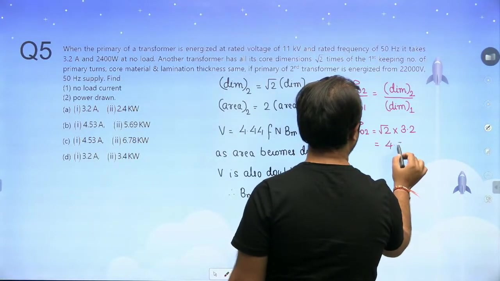
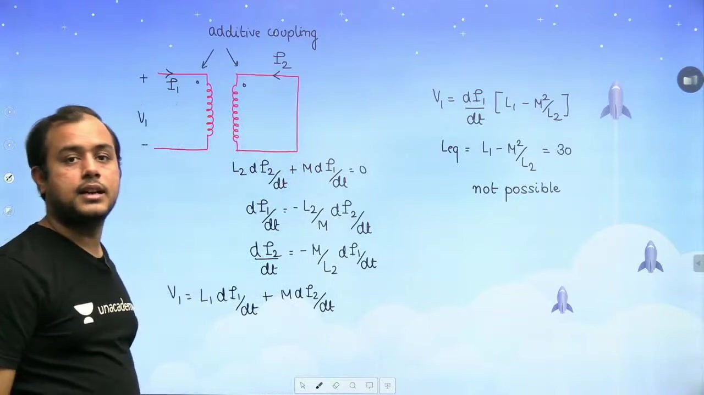

[← Lec 030: Important Concepts in Electrical Machines 2](Lecture_030_Important_Concepts_in_Electrical_Machines_2.md) | [🏠 Index](00_yt_study_guide.md) | [Lec 032: Auto Transformer 1 →](Lecture_032_Auto_Transformer_1.md)

---

# Transformer and Magnetically Coupled Circuits | L 10 | Electrical Machines | GATE 2022 | #AnkitGoyal

- **Source**: https://www.youtube.com/watch?v=traXYvejLxE
- **Duration**: 00:51:00
- **Compiled**: 2026-09-20

---

## Overview

This lecture connects magnetic circuit concepts with transformer equivalent circuit models. It begins by examining transformer ratings and parameter referrals for coupled inductors. The discussion develops equivalent T-network and $\pi$-network representations for coupled coils. It also analyzes dimensional scaling rules for transformer ratings and losses. Finally, worked numerical problems show how to determine inductances, impedance matching, and terminal voltage under load.

## Contents

- [[#Coupled Circuit to Equivalent Circuit Parameter Referral|Coupled Circuit to Equivalent Circuit Parameter Referral]]
- [[#Numerical Problem: Equivalent Parameters|Numerical Problem: Equivalent Parameters]]
- [[#Impedance Matching Problem|Impedance Matching Problem]]
- [[#Dimensional Scaling Problem|Dimensional Scaling Problem]]
- [[#Coupled Coils in Series, Parallel, and Short-Circuit|Coupled Coils in Series, Parallel, and Short-Circuit]]

---

## Coupled Circuit to Equivalent Circuit Parameter Referral
_(00:13 - 10:07)_

When mapping a coupled circuit ($L_1, L_2, M$) to a transformer equivalent circuit (referred to primary with turns ratio $a = N_1/N_2$):

1. **Primary Leakage Inductance**: $L_{l1} = L_1 - a M$
2. **Referred Secondary Leakage**: $L_{l2}' = a^2 L_2 - a M$
3. **Referred Magnetizing Inductance**: $L_m = a M$

*Note on Equipment Rating*: A transformer's rating (e.g., $10\text{ kVA}$) represents its continuous maximum capability based on heating limits. Operating at half load changes the operating point but does not change the equipment's rated capability.

## Numerical Problem: Equivalent Parameters
_(10:14 - 20:32)_

> [!example] Problem
> $10\text{ kVA}$, $2300/230\text{ V}$, $50\text{ Hz}$ transformer.
> $R_1 = 10\,\Omega$, $L_{l1} = 40\text{ mH}$, $R_2 = 0.1\,\Omega$, $L_{l2} = 0.4\text{ mH}$, $M = 10\text{ H}$.
> Find equivalent parameters referred to primary and secondary.

- **Turns Ratio**: $a = 2300/230 = 10$.
- **Referred to Primary**:
  - $R_{01} = R_1 + a^2 R_2 = 10 + 10^2(0.1) = 20\,\Omega$
  - $X_{01} = \omega L_{l1} + a^2 (\omega L_{l2}) = 100\pi(0.04) + 100(100\pi \times 0.0004) = 12.56 + 12.56 = 25.13\,\Omega$
  - $X_m = \omega (aM) = 100\pi (10 \times 10) = 31415.9\,\Omega$ *(Note: if $M=10\text{H}$ is mutual inductance, then referred is $aM$. The video uses $X_m = \omega M$ directly, implying $M$ given was already the magnetizing inductance)*
- **Referred to Secondary**:
  - $R_{02} = R_{01}/a^2 = 20/100 = 0.2\,\Omega$
  - $X_{02} = X_{01}/a^2 = 25.13/100 = 0.2513\,\Omega$

## Impedance Matching Problem
_(20:36 - 29:50)_

> [!example] Problem
> Source: $V_s = 4\text{ V}$, $R_s = 2000\,\Omega$. Load: $R_L = 50\,\Omega$. Find optimal turns ratio $a$ for maximum power transfer.

- **Solution**: For maximum power transfer, $R_L' = R_s \implies a^2 R_L = R_s$.
- $a = \sqrt{R_s/R_L} = \sqrt{2000/50} = \sqrt{40} \approx 6.325$.

## Dimensional Scaling Problem
_(29:59 - 34:54)_

> [!example] Problem
> Transformer 1: $11\text{ kV}$, $50\text{ Hz}$. No-load current $I_0 = 3.2\text{ A}$, core loss $P_c = 2400\text{ W}$.
> Transformer 2: All linear dimensions scaled by factor $k = \sqrt{2}$. Same turns and frequency. Energized at $22\text{ kV}$.
> Find $I_{0,2}$ and $P_{c,2}$.

- **Flux Density Check**: $V \propto B_m A_c$. Area scales as $k^2 = (\sqrt{2})^2 = 2$. Voltage scales from 11 to 22 (factor of 2). Since both $V$ and $A_c$ double, $B_m$ remains **constant**.
- **No-Load Current**: $I_0 \propto \text{magnetic path length} \propto k$.
  - $I_{0,2} = \sqrt{2} \times 3.2 = 4.53\text{ A}$.
- **Core Loss**: $P_c \propto \text{Volume} \propto k^3$.
  - $P_{c,2} = (\sqrt{2})^3 \times 2400 = 2\sqrt{2} \times 2400 = 6788\text{ W}$.

## Coupled Coils in Series, Parallel, and Short-Circuit
_(39:39 - 50:50)_

### Series and Parallel Coil Combinations
For two identical coils ($L_1 = L_2 = L$) with mutual inductance $M$:
- **Series Additive**: $L_{eq} = 2L + 2M = 20\text{ mH}$
- **Series Subtractive**: $L_{eq} = 2L - 2M = 12\text{ mH}$
- *Solving gives*: $L = 8\text{ mH}$, $M = 2\text{ mH}$.
- **Parallel (Maximum)**: $L_{eq} = \frac{L^2 - M^2}{2L - 2M} = \frac{64 - 4}{16 - 4} = 5\text{ mH}$.

### Two-Port Short-Circuit Inductance Validity
> [!example] Problem Check
> Port 1-2 open-circuit inductance = $15\text{ H}$. Short-circuit inductance = $30\text{ H}$. Is this valid?

- **Open-Circuit Inductance**: $L_{\text{oc}} = L_1 = 15\text{ H}$.
- **Short-Circuit Inductance**: By KVL ($v_1 = L_1 \frac{di_1}{dt} + M \frac{di_2}{dt}$, $0 = L_2 \frac{di_2}{dt} + M \frac{di_1}{dt}$), $L_{\text{sc}} = L_1 - \frac{M^2}{L_2}$.
- **Validity Test**: Since $M^2/L_2 > 0$, $L_{\text{sc}}$ must be **less than or equal to** $L_1$.
- Measured $30\text{ H}$ > $15\text{ H}$ is physically impossible.

---

## Summary and Key Takeaways

- A transformer rating denotes its continuous operational capability, and operating at partial load does not change this rated value.
- Mutual inductance referred to the primary side is $M' = a M$, where $a = N_1 / N_2$ is the turns ratio.
- Primary and secondary leakage inductances are given by $L_{l1} = L_1 - a M$ and $L_{l2}' = L_2' - a M$.
- Maximum power transfer occurs when the load resistance referred to the primary matches the internal source resistance $R_L' = R_s$.
- Linear machine scaling by factor $d$ makes current and voltage ratings scale as $d^2$, while kVA rating scales as $d^4$ and core loss scales as $d^3$.
- Two coupled coils with equal self-inductance $L$ have series inductances $2L \pm 2M$, from which $L$ and $M$ are directly calculated.
- The equivalent input inductance of a two-port coupled network with shorted secondary is $L_{\text{sc}} = L_1 - M^2 / L_2$, which is strictly less than or equal to $L_1$.

---

[← Lec 030: Important Concepts in Electrical Machines 2](Lecture_030_Important_Concepts_in_Electrical_Machines_2.md) | [🏠 Index](00_yt_study_guide.md) | [Lec 032: Auto Transformer 1 →](Lecture_032_Auto_Transformer_1.md)
