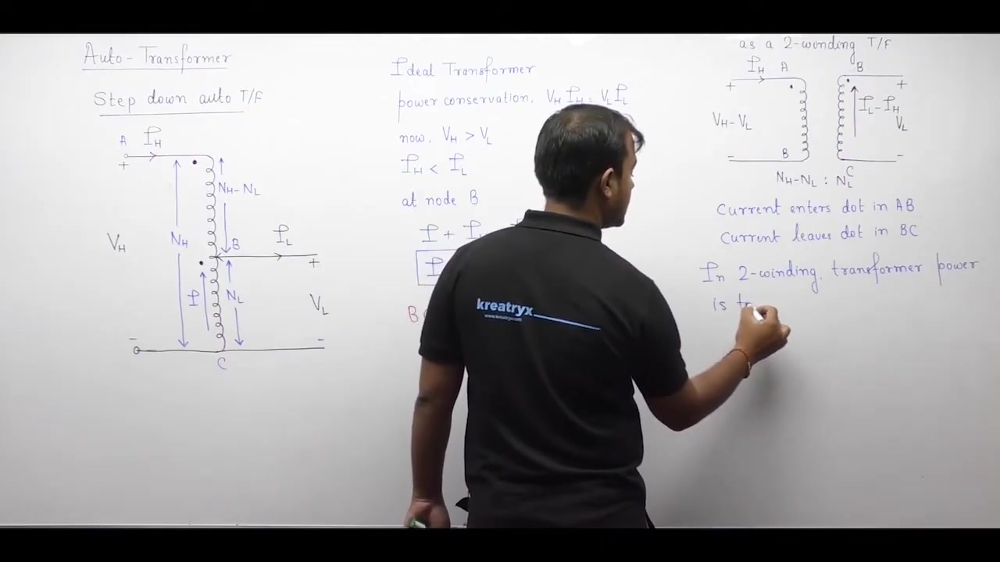
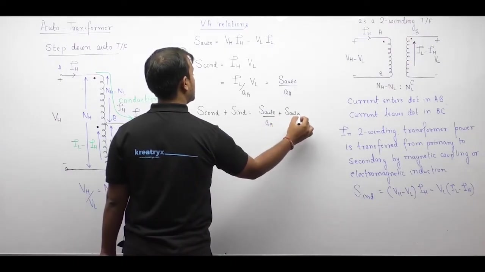

[← Lec 031: Transformer and Magnetically Coupled Circuits](Lecture_031_Transformer_and_Magnetically_Coupled_Circuits.md) | [🏠 Index](00_yt_study_guide.md) | [Lec 033: Auto Transformer in Hindi 2 →](Lecture_033_Auto_Transformer_in_Hindi_2.md)

---

# Auto Transformer - 1 | Electrical Machines | Lec 22 | | GATE & ESE (EE, ECE) | Ankit Goyal

- **Source**: https://www.youtube.com/watch?v=pOkxh0EH1qo
- **Duration**: 00:42:43
- **Compiled**: 2026-09-20

---

## Overview

This lecture introduces the operational principles and circuit models of autotransformers. It explores physical construction on toroidal cores and examines both step-down and step-up connections. The discussion derives the fundamental division of transferred power into electromagnetic induction and electrical conduction. It also demonstrates the substantial apparent power rating advantage of autotransformers over equivalent two-winding transformers.

## Contents

- [[#Introduction and Two-Winding Equivalence|Introduction and Two-Winding Equivalence]]
- [[#Transformation Ratio and MMF Balance|Transformation Ratio and MMF Balance]]
- [[#Power Transfer Mechanisms: Induction and Conduction|Power Transfer Mechanisms: Induction and Conduction]]
- [[#Step-Up Autotransformer Configuration|Step-Up Autotransformer Configuration]]

---

## Introduction and Two-Winding Equivalence
_(00:14 - 13:21)_

An **autotransformer** uses a single continuous winding on a magnetic core. Both the input and output circuits share portions of this single winding, meaning there is no electrical isolation.
- **Series Winding ($AB$)**: The portion of the winding carrying only the high-voltage current $I_H$. (Turns: $N_H - N_L$)
- **Common Winding ($BC$)**: The tapped portion shared by both primary and secondary circuits. It carries the difference between load and source currents: $I_L - I_H$. (Turns: $N_L$)

An autotransformer can be modeled exactly as a two-winding transformer consisting of the Series Winding and the Common Winding. Power transfers between these two sections purely through magnetic induction.

## Transformation Ratio and MMF Balance
_(13:24 - 18:57)_

The autotransformer transformation ratio ($a_{\text{auto}}$) is defined as the high-voltage to low-voltage ratio (always > 1):
$$a_{\text{auto}} = \frac{V_H}{V_L} = \frac{N_H}{N_L} = \frac{I_L}{I_H} > 1$$

### MMF Balance
Treating the autotransformer as a two-winding transformer, the MMF of the series winding must balance the MMF of the common winding:
$$(N_H - N_L) I_H = N_L (I_L - I_H)$$
Expanding this yields $N_H I_H = N_L I_L$, which confirms the current ratio $\frac{I_L}{I_H} = \frac{N_H}{N_L} = a_{\text{auto}}$.

## Power Transfer Mechanisms: Induction and Conduction
_(18:57 - 31:21)_

In an autotransformer, total apparent power ($S_{\text{auto}} = V_H I_H = V_L I_L$) transfers to the load via two parallel mechanisms:
1. **Electromagnetic Induction ($S_{\text{ind}}$)**: Power magnetically coupled from the series winding to the common winding. This equals the physical rating of the internal core.
2. **Electrical Conduction ($S_{\text{cond}}$)**: Power transferred directly through the copper wire, bypassing magnetic transformation.

### 1. Induced Power ($S_{\text{ind}}$)
Calculated as the power of the series winding (or common winding):
$$S_{\text{ind}} = V_{AB} I_{AB} = (V_H - V_L) I_H = V_H I_H - V_L I_H$$
Substitute $V_H I_H = S_{\text{auto}}$ and $V_L = V_H/a_{\text{auto}}$:
$$S_{\text{ind}} = S_{\text{auto}} \left(1 - \frac{1}{a_{\text{auto}}}\right)$$

### 2. Conducted Power ($S_{\text{cond}}$)
The primary current $I_H$ flows directly into the load at load voltage $V_L$.
$$S_{\text{cond}} = V_L I_H$$
Substitute $I_H = I_L/a_{\text{auto}}$:
$$S_{\text{cond}} = \frac{V_L I_L}{a_{\text{auto}}} = \frac{S_{\text{auto}}}{a_{\text{auto}}}$$

**Total Power**: $S_{\text{total}} = S_{\text{ind}} + S_{\text{cond}} = S_{\text{auto}}$.

> [!info] The Autotransformer Advantage
> A 100 MVA autotransformer with $a_{\text{auto}} = 1.25$ only requires a core sized for $S_{\text{ind}} = 100(1 - 1/1.25) = 20\text{ MVA}$. The remaining 80 MVA is conducted directly. This yields massive savings in core size, weight, and cost compared to a 100 MVA two-winding transformer.

## Step-Up Autotransformer Configuration
_(31:24 - 42:36)_

To step up voltage, the source is connected across the tapped common winding ($N_L$ turns), and the load connects across the entire winding ($N_H$ turns).

The exact same power division formulas apply universally:
> [!success] Universal Autotransformer Formulas
> - $S_{\text{ind}} = S_{\text{auto}}\left(1 - \frac{1}{a_{\text{auto}}}\right)$
> - $S_{\text{cond}} = \frac{S_{\text{auto}}}{a_{\text{auto}}}$

**Current Direction Rule**:
1. Current leaves the positive terminal of the source.
2. Current enters the positive terminal of the load.
3. Apply KCL at the tapping node to find the current in the common winding ($|I_L - I_H|$).

---

## Summary and Key Takeaways

- An autotransformer uses a single tapped continuous winding to serve both primary and secondary circuits without electrical isolation.
- The transformation ratio is defined as $a_{\text{auto}} = V_H / V_L = N_H / N_L = I_L / I_H > 1$.
- Current in the common winding equals the difference of the load and source currents, $|I_L - I_H|$.
- An autotransformer can be modeled as an equivalent two-winding transformer consisting of a series winding with $N_H - N_L$ turns and a common winding with $N_L$ turns.
- The apparent power transferred by electromagnetic induction is $S_{\text{ind}} = S_{\text{auto}}(1 - 1/a_{\text{auto}})$.
- The apparent power transferred by direct electrical conduction is $S_{\text{cond}} = S_{\text{auto}} / a_{\text{auto}}$.
- Total apparent power equals the sum of conducted and induced components: $S_{\text{auto}} = S_{\text{cond}} + S_{\text{ind}}$.
- When the transformation ratio $a_{\text{auto}}$ is close to unity, conducted power dominates, allowing a much higher kVA rating for a given core size.

---

[← Lec 031: Transformer and Magnetically Coupled Circuits](Lecture_031_Transformer_and_Magnetically_Coupled_Circuits.md) | [🏠 Index](00_yt_study_guide.md) | [Lec 033: Auto Transformer in Hindi 2 →](Lecture_033_Auto_Transformer_in_Hindi_2.md)
