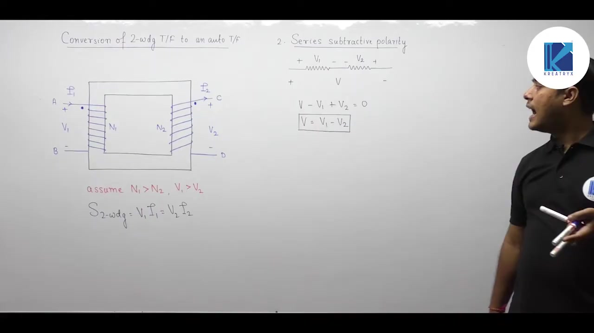

[← Lec 032: Auto Transformer 1](Lecture_032_Auto_Transformer_1.md) | [🏠 Index](00_yt_study_guide.md) | [Lec 034: Auto Transformer in Hindi 3 →](Lecture_034_Auto_Transformer_in_Hindi_3.md)

---

# Electrical Machines | Lec 23 | Auto Transformer in Hindi - 2| GATE Electrical Engineering Lecture

- **Source**: https://www.youtube.com/watch?v=KBen4Tojy80
- **Duration**: 01:06:30
- **Compiled**: 2026-09-20

---

## Overview

This lecture explains how to convert a four-terminal two-winding transformer into a three-terminal autotransformer. It examines the differences between additive and subtractive series connections through circuit diagrams and dot polarity analysis. The lecture details power division into transformed and conducted components while demonstrating why operational efficiency increases. It works through a comprehensive numerical example for both connection types under rated and specified load conditions. Finally, the lecture derives the scaling factors for per-unit impedance, voltage regulation, losses, and short-circuit current.

## Contents

- [[#Converting a Two-Winding Transformer to an Autotransformer|Converting a Two-Winding Transformer to an Autotransformer]]
- [[#Additive vs Subtractive Polarity|Additive vs Subtractive Polarity]]
- [[#Efficiency and Loss Invariance|Efficiency and Loss Invariance]]
- [[#Numerical Example: 20 kVA Reconnection|Numerical Example: 20 kVA Reconnection]]
- [[#Parameter Scaling Rules (Additive Polarity)|Parameter Scaling Rules (Additive Polarity)]]

---

## Converting a Two-Winding Transformer to an Autotransformer
_(00:12 - 05:47)_

A standard two-winding transformer ($V_1/V_2$, $I_1/I_2$) has four terminals. To convert it into an autotransformer, connect one terminal of the primary winding in series with one terminal of the secondary winding, creating a shared three-terminal device.

> [!success] Core Principle
> When creating an autotransformer from a two-winding transformer, the power transferred by magnetic induction always equals the original two-winding transformer rating:
> $$S_{\text{trans}} = S_{\text{2-wdg}}$$

## Additive vs Subtractive Polarity
_(05:52 - 28:22)_

When connecting the windings in series, two configurations are possible:

### 1. Additive Polarity
- **Connection**: Connect opposite polarities (dot to undotted).
- **Voltage**: Voltages add. $V_{\text{out}} = V_1 + V_2$.
- **Power Rating Shortcut**: 
  $$S_{\text{auto}} = \frac{S_{\text{2-wdg}}}{1 - 1/a_{\text{auto}}}$$ 
  (where $a_{\text{auto}} = \frac{V_1 + V_2}{V_1}$ or $\frac{V_1 + V_2}{V_2}$ depending on step-up/down)

### 2. Subtractive Polarity
- **Connection**: Connect identical polarities (dot to dot, or undotted to undotted).
- **Voltage**: Voltages subtract. $V_{\text{out}} = V_1 - V_2$ (assuming $V_1 > V_2$).
- **Power Rating**: Must be calculated directly from circuit currents and node voltages. **Do not use the $a_{\text{auto}}$ shortcut formula.**

> [!info] Step-Up/Down vs Polarity
> Additive or subtractive polarity determines the available voltage levels ($V_1 \pm V_2$). Whether the autotransformer acts as a step-up or step-down depends strictly on which terminals the source and load are connected to. It is independent of the polarity connection.

## Efficiency and Loss Invariance
_(12:07 - 18:33, 42:39 - 47:20)_

When converting a two-winding transformer into an autotransformer, the physical core and winding resistances are unchanged. The windings continue to operate at their rated voltages ($V_1, V_2$) and rated currents ($I_1, I_2$).

Therefore:
- **Core Loss ($P_c$)**: Remains constant (same voltage/flux).
- **Copper Loss ($P_{cu}$)**: Remains constant (same current).

Since the total apparent power capability ($S_{\text{auto}}$) increases dramatically due to conducted power, but the physical losses in Watts remain constant, the **efficiency of the autotransformer is strictly higher** than the two-winding transformer.

## Numerical Example: 20 kVA Reconnection
_(28:30 - 42:36)_

> [!example] Problem
> A $20\text{ kVA}$, $2000/200\text{ V}$ transformer has $98\%$ efficiency at full load UPF. Reconnect it as:
> 1. $2000/2200\text{ V}$ autotransformer
> 2. $2000/1800\text{ V}$ autotransformer (load = $110\text{ kVA}$)

**Base Values**:
$I_{\text{HV}} = 20\text{k}/2000 = 10\text{ A}$. $I_{\text{LV}} = 20\text{k}/200 = 100\text{ A}$.
Losses at 98% eff: $P_{\text{loss}} = 20/0.98 - 20 = 0.408\text{ kW}$.

**Case 1: $2000/2200\text{ V}$ (Additive)**
- $2200 = 2000 + 200$ (Additive polarity).
- $a_{\text{auto}} = 2200/2000 = 1.1$.
- Rating: $S_{\text{auto}} = 20 / (1 - 1/1.1) = 220\text{ kVA}$.
- Efficiency: $\eta = \frac{220 \times 1}{220 + 0.408} = 99.81\%$.

**Case 2: $2000/1800\text{ V}$ (Subtractive)**
- $1800 = 2000 - 200$ (Subtractive polarity).
- The specified load is $110\text{ kVA}$.
- Load current $I_H = 110\text{k}/2200 = 50\text{ A}$.
- Power balance: $2000 \times I_L = 2200 \times 50 \implies I_L = 55\text{ A}$.
- The windings are operating well below their $10\text{ A}/100\text{ A}$ limits.
- Maximum rating (using rated currents): $1800\text{ V} \times 100\text{ A} = 180\text{ kVA}$.

## Parameter Scaling Rules (Additive Polarity)
_(47:32 - 66:18)_

When a two-winding transformer is reconnected in **additive polarity**, the base apparent power rating increases. Because the physical Ohmic impedance and Watt losses remain constant, their per-unit (PU) values scale inversely with the rating increase.

Let the scaling factor be $K = \left(1 - \frac{1}{a_{\text{auto}}}\right)$. Note that $K < 1$.

| Parameter | 2-Winding Value | Autotransformer Value |
| :--- | :--- | :--- |
| **Apparent Power** | $S_{\text{2-wdg}}$ | $S_{\text{auto}} = S_{\text{2-wdg}} / K$ |
| **PU Impedance** | $Z_{\text{pu, 2-wdg}}$ | $Z_{\text{pu, auto}} = K \cdot Z_{\text{pu, 2-wdg}}$ |
| **Voltage Regulation**| $\text{VR}_{\text{2-wdg}}$ | $\text{VR}_{\text{auto}} = K \cdot \text{VR}_{\text{2-wdg}}$ |
| **PU Copper Loss** | $P_{\text{cu, pu, 2-wdg}}$ | $P_{\text{cu, pu, auto}} = K \cdot P_{\text{cu, pu, 2-wdg}}$ |
| **PU Core Loss** | $P_{c,\text{pu, 2-wdg}}$ | $P_{c,\text{pu, auto}} = K \cdot P_{c,\text{pu, 2-wdg}}$ |
| **PU Short-Circuit Current** | $I_{\text{sc, pu, 2-wdg}}$ | $I_{\text{sc, pu, auto}} = I_{\text{sc, pu, 2-wdg}} / K$ |

> [!warning] Disadvantage
> Because the PU impedance decreases, the PU short-circuit fault current ($1/Z_{\text{pu}}$) increases significantly. This imposes severe mechanical stress on the windings during a fault.

---

## Summary and Key Takeaways

- Connecting opposite polarity terminals yields additive polarity with output voltage $V_1 + V_2$, while connecting identical polarity terminals yields subtractive polarity with output voltage $V_1 - V_2$.
- The power transferred by electromagnetic induction in an autotransformer always equals the original two-winding transformer apparent power rating: $S_{\text{trans}} = S_{\text{2-wdg}}$.
- In additive polarity, the total apparent power rating increases to $S_{\text{auto}} = \frac{S_{\text{2-wdg}}}{1 - 1/a_{\text{auto}}}$, where $a_{\text{auto}} = \frac{V_H}{V_L} = 1 + \frac{N_2}{N_1}$.
- Because actual winding voltages and currents remain at their original rated values, physical core and copper losses remain constant, causing operating efficiency to increase significantly.
- Whether an autotransformer functions as step-up or step-down depends strictly on source and load connections and is completely independent of additive or subtractive polarity.
- For subtractive polarity, do not use the direct transformation ratio formula; always calculate ratings and power values directly from terminal voltages and winding currents.
- In additive polarity, per-unit impedance, voltage regulation, per-unit copper loss, and per-unit core loss all scale by the factor $(1 - 1/a_{\text{auto}})$.
- Per-unit short-circuit current increases by the factor $\frac{1}{1 - 1/a_{\text{auto}}}$, which increases fault severity and mechanical stress during short circuits.

---

[← Lec 032: Auto Transformer 1](Lecture_032_Auto_Transformer_1.md) | [🏠 Index](00_yt_study_guide.md) | [Lec 034: Auto Transformer in Hindi 3 →](Lecture_034_Auto_Transformer_in_Hindi_3.md)
