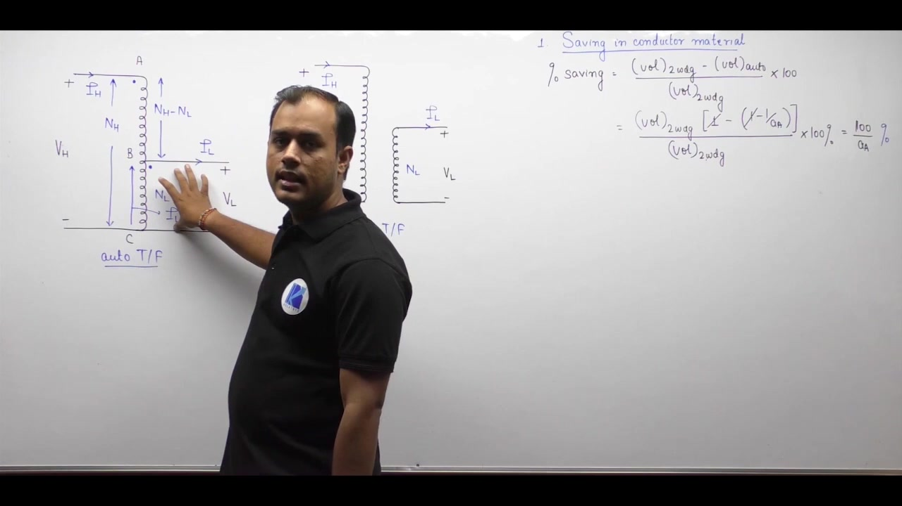

[← Lec 033: Auto Transformer in Hindi 2](Lecture_033_Auto_Transformer_in_Hindi_2.md) | [🏠 Index](00_yt_study_guide.md) | [Lec 035: Problems based on Auto Transformer →](Lecture_035_Problems_based_on_Auto_Transformer.md)

---

# Electrical Machines | Lec 24 | Auto Transformer in Hindi - 3| GATE Electrical Engineering Lecture

- **Source**: https://www.youtube.com/watch?v=zSCNNJFrVvA
- **Duration**: 00:33:38
- **Compiled**: 2026-09-20

---

## Overview

This lecture compares an autotransformer with a two-winding transformer designed for the exact same voltage and power rating. We derive the reduction in conductor material and explain how this saving scales with the auto transformation ratio. The discussion shows how smaller winding volumes reduce core dimensions, lower total operating losses, and improve electrical efficiency. We examine key operational limitations including the loss of galvanic isolation and high fault currents. Finally we develop the equivalent circuit referred to the series winding and highlight practical applications in power grids, motor starters, and laboratory supplies.

## Contents

- [[#Conductor and Core Material Savings|Conductor and Core Material Savings]]
- [[#Efficiency Gains|Efficiency Gains]]
- [[#Major Disadvantages of Autotransformers|Major Disadvantages of Autotransformers]]
- [[#Equivalent Circuit Analysis|Equivalent Circuit Analysis]]
- [[#Practical Applications|Practical Applications]]

---

## Conductor and Core Material Savings
_(00:13 - 18:23)_

When comparing a two-winding transformer and an autotransformer **designed from scratch for the exact same voltage and kVA rating**, the autotransformer uses significantly less material.

### 1. Copper (Conductor) Savings
The volume of copper required for any winding is directly proportional to its rated Ampere-Turns (MMF), i.e., $\text{Volume} \propto NI$.

By summing the $NI$ products for the two-winding transformer ($V_{\text{2w}}$) and the autotransformer ($V_{\text{auto}}$), the ratio of copper volumes is:
$$\frac{V_{\text{auto}}}{V_{\text{2w}}} = 1 - \frac{1}{a_{\text{auto}}}$$

The fractional saving in conductor material is:
$$\text{Saving} = \frac{1}{a_{\text{auto}}}$$

> [!info] The "Close to Unity" Advantage
> The economic saving is massive when $a_{\text{auto}}$ is close to 1. For example, if $a_{\text{auto}} = 1.1$, you save nearly 91% of the copper. If $a_{\text{auto}} = 10$, you only save 10%. This is why autotransformers are primarily used when the primary and secondary voltages are close.

### 2. Core (Iron) Savings
Because the copper volume is smaller, the required window area ($A_w$) in the core is smaller. A smaller window area reduces the mean length of the magnetic path around the limbs and yokes, directly reducing the total volume, weight, and cost of the core steel.

## Efficiency Gains
_(14:02 - 18:23)_

Because both the active copper volume and the active core volume are smaller, the physical losses decrease:
- **Copper Loss ($P_{\text{cu}}$)**: Drops by the factor $(1 - 1/a_{\text{auto}})$ due to reduced copper volume.
- **Core Loss ($P_i$)**: Drops due to reduced core volume.

Since the total rating remains the same while the losses decrease, the **autotransformer achieves a higher efficiency** than an identical-rating two-winding design.

## Major Disadvantages of Autotransformers
_(18:42 - 26:09)_

Despite high efficiency and material savings, autotransformers have three severe drawbacks:

1. **Loss of Galvanic Isolation**: The primary and secondary are electrically connected. Any surge, fault, or noise on the high-voltage side passes directly into the low-voltage side.
2. **Open-Circuit Hazard**: In step-down mode, if the common winding connection breaks (open circuit), no load current flows, meaning zero voltage drops across the series winding. The full high-voltage $V_H$ appears immediately across the low-voltage terminals, destroying connected equipment.
3. **High Short-Circuit Currents**: The direct sharing of windings causes the leakage reactance to be very low. Consequently, the per-unit short-circuit fault current ($1/Z_{\text{pu}}$) is extremely high, causing severe mechanical and thermal stresses.

## Equivalent Circuit Analysis
_(26:12 - 31:11)_

An autotransformer can be modeled as a two-winding transformer. To simplify analysis, refer the common winding impedance ($R_2, X_2$) to the series winding ($R_1, X_1$).

The effective turns ratio between the series section ($N_H - N_L$) and common section ($N_L$) is:
$$a' = \frac{N_H - N_L}{N_L} = a_{\text{auto}} - 1$$

The equivalent impedance referred to the series winding is:
$$Z_{1,\text{eq}} = \left[R_1 + (a_{\text{auto}} - 1)^2 R_2\right] + j\left[X_1 + (a_{\text{auto}} - 1)^2 X_2\right]$$

Applying KVL to the high-voltage loop:
$$V_H - I_H Z_{1,\text{eq}} = E_H$$
Where $E_H$ is the total induced EMF across the entire winding. The output voltage is simply $V_L = E_L = E_H / a_{\text{auto}}$.

## Practical Applications
_(31:11 - 33:31)_

Autotransformers are best used when $a_{\text{auto}} < 2$:
1. **Power Grid Interconnection**: Linking grids with similar voltages (e.g., $400\text{ kV}/220\text{ kV}$).
2. **Feeder Voltage Boosters**: Placed at the end of long distribution lines to correct voltage drops (boosting voltage by 10-20%).
3. **Induction Motor Starters**: Provides reduced voltage taps (e.g., 50%, 65%, 80%) to limit heavy inrush currents during startup.
4. **Variacs**: Laboratory variable AC supplies using a sliding carbon brush on a toroidal core for smooth voltage control.

---

## Summary and Key Takeaways

- Conductor volume is directly proportional to the rated ampere-turns of the winding, so material savings follow the reduction in total required MMF.
- The conductor volume ratio between an autotransformer and an identical-rating two-winding transformer equals $(1 - 1/a_{\text{auto}})$, yielding a percentage copper saving of $100/a_{\text{auto}}\%$.
- Material savings are greatest when the transformation ratio $a_{\text{auto}}$ is close to unity, making autotransformers highly economical for small voltage differences.
- Decreased conductor volume reduces the core window area, shrinking the magnetic path and lowering total core weight.
- Because both copper and iron losses drop for the same power rating, the autotransformer achieves higher operational efficiency than an equivalent two-winding design.
- Direct physical continuity eliminates galvanic isolation between circuits, allowing primary voltage disturbances to pass straight into the secondary network.
- An open circuit on the common winding during step-down operation exposes the low-voltage terminals to full high-voltage line potential.
- Lower per-unit leakage impedance causes significantly larger short-circuit currents under fault conditions.
- An autotransformer is modeled as a two-winding unit by referring common winding impedance to the series winding through the factor $(a_{\text{auto}} - 1)^2$.

---

[← Lec 033: Auto Transformer in Hindi 2](Lecture_033_Auto_Transformer_in_Hindi_2.md) | [🏠 Index](00_yt_study_guide.md) | [Lec 035: Problems based on Auto Transformer →](Lecture_035_Problems_based_on_Auto_Transformer.md)
