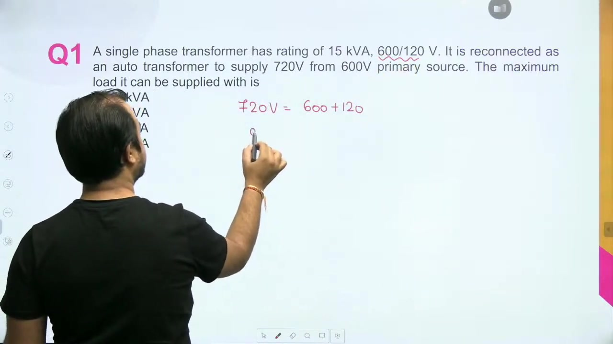
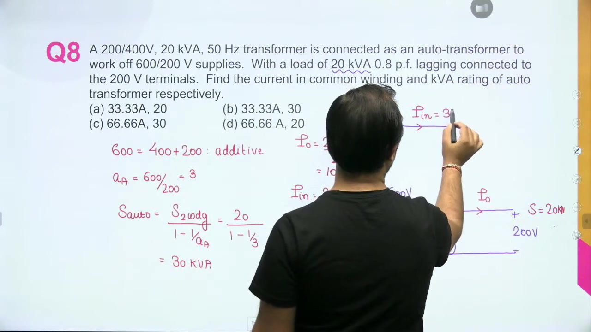

[← Lec 034: Auto Transformer in Hindi 3](Lecture_034_Auto_Transformer_in_Hindi_3.md) | [🏠 Index](00_yt_study_guide.md) | [Lec 036: Problems based on Three Winding Transformer →](Lecture_036_Problems_based_on_Three_Winding_Transformer.md)

---

# Problems based on Auto-Transformer | L 12 | Electrical Machines | GATE 2022 | #AnkitGoyal

- **Source**: https://www.youtube.com/watch?v=xx0hJsQWPRs
- **Duration**: 00:55:52
- **Compiled**: 2026-09-20

---

## Overview

This problem-solving session works through fourteen exam questions on single-phase autotransformers. We solve reconnection problems for additive and subtractive polarities and compute upgraded kVA ratings. The session shows how full-load operating losses remain invariant between two-winding and autotransformer modes, yielding substantial efficiency improvements. We calculate branch and common winding currents for diverse load conditions and multi-tapped potential dividers. Finally we derive the split between conductively and inductively transferred power and deduce original winding parameters from polarity test data.

## Contents

- [[#Rating and Connection Polarity Questions|Rating and Connection Polarity Questions]]
- [[#Efficiency and Losses Calculation|Efficiency and Losses Calculation]]
- [[#Current Distribution and Load Analysis|Current Distribution and Load Analysis]]
- [[#Theory and Conceptual Questions|Theory and Conceptual Questions]]

---

## Rating and Connection Polarity Questions
_(00:07 - 15:16, 40:37 - 50:50, 50:55 - 55:44)_

### Additive Polarity Rating
> [!example] Problem 1
> A $15\text{ kVA}$, $600/120\text{ V}$ two-winding transformer is reconnected as an autotransformer to supply $720\text{ V}$ from a $600\text{ V}$ source. What is the maximum load it can supply?
> 
> **Solution**:
> Output $720\text{ V} = 600\text{ V} + 120\text{ V}$ (Additive). 
> $a_{\text{auto}} = 720/600 = 1.2$.
> $S_{\text{auto}} = \frac{15}{1 - 1/1.2} = 90\text{ kVA}$. (Option A)

### Subtractive Polarity Rating
> [!example] Problem 9 (Case 2)
> A $25\text{ kVA}$, $2000/200\text{ V}$ transformer connects in subtractive polarity to a $2000\text{ V}$ supply. What is the autotransformer rating?
>
> **Solution**:
> Output $V_{\text{out}} = 2000 - 200 = 1800\text{ V}$.
> The $200\text{ V}$ secondary can safely carry $I_2 = 25\text{kVA} / 200\text{V} = 125\text{ A}$.
> Since this winding is in series with the load, $I_{\text{out,max}} = 125\text{ A}$.
> Rating $S_{\text{auto}} = 1800\text{ V} \times 125\text{ A} = 225\text{ kVA}$. 
> *(Do not use the $a_{\text{auto}}$ shortcut for subtractive polarity)*

### Retrieving Original Winding Ratings
> [!example] Problem 13
> An autotransformer has secondary voltages of $2640\text{ V}$ (additive) and $2160\text{ V}$ (subtractive). What was the original turns ratio?
>
> **Solution**:
> $V_1 + V_2 = 2640$
> $V_1 - V_2 = 2160$
> Adding: $2V_1 = 4800 \implies V_1 = 2400\text{ V}$.
> Subtracting: $2V_2 = 480 \implies V_2 = 240\text{ V}$.
> Ratio = $2400/240 = 10:1$. (Option C)

## Efficiency and Losses Calculation
_(05:15 - 20:00)_

Because physical windings operate at identical rated voltage and current in both configurations, the full-load losses in Watts (core + copper) remain identical. 

> [!example] Problem 4
> A $400/100\text{ V}$, $5\text{ kVA}$ transformer has $95\%$ efficiency at full load, 0.8 PF lagging. Find the maximum possible efficiency as an autotransformer.
>
> **Solution**:
> 1. **Find Losses**:
>    Output $P_{\text{out}} = 5 \times 0.8 = 4\text{ kW}$.
>    $0.95 = 4 / (4 + P_{\text{loss}}) \implies P_{\text{loss}} = 4/19\text{ kW}$.
> 2. **Maximize Rating**:
>    Additive polarity yields the largest rating ($400/500\text{ V}$, $a_{\text{auto}}=1.25$).
>    $S_{\text{auto}} = 5 / (1 - 1/1.25) = 25\text{ kVA}$.
> 3. **New Efficiency**:
>    New output $P_{\text{out,auto}} = 25 \times 0.8 = 20\text{ kW}$.
>    Losses stay $4/19\text{ kW}$.
>    $\eta_{\text{auto}} = \frac{20}{20 + 4/19} = 98.96\%$. (Option D)

## Current Distribution and Load Analysis
_(20:00 - 40:34)_

When analyzing current in autotransformers, use **actual connected load** rather than rated capacity, unless rated load is explicitly specified.

### Determining Branch Currents
> [!example] Problem 7
> A $200/400\text{ V}$, $20\text{ kVA}$ transformer connects to a $600\text{ V}$ supply and feeds a **$20\text{ kVA}$** load at $200\text{ V}$. Find the current in the common winding.
>
> **Solution**:
> Although the max rating is $30\text{ kVA}$ (additive $600/200$), the *actual load* is $20\text{ kVA}$.
> Load current $I_0 = 20\text{kVA} / 200\text{V} = 100\text{ A}$.
> Source current $I_{\text{in}} = 20\text{kVA} / 600\text{V} = 33.33\text{ A}$.
> Common winding current $I_{\text{common}} = I_0 - I_{\text{in}} = 100 - 33.33 = 66.67\text{ A}$. (Option C)

### Multi-Tapped Divider Analysis
> [!example] Problem 8
> A $400\text{ V}$ source feeds two $200\ \Omega$ loads tapped at $300\text{ V}$ and $100\text{ V}$. Find the supply current and branch currents.
>
> **Solution**:
> Load 1 (300V): $P_1 = 300^2/200 = 450\text{ W}$. Current = $1.5\text{ A}$.
> Load 2 (100V): $P_2 = 100^2/200 = 50\text{ W}$. Current = $0.5\text{ A}$.
> Total Power $P_{\text{in}} = 500\text{ W}$.
> Supply Current $I_p = 500/400 = 1.25\text{ A}$.
> 
> *Currents by KCL:*
> Top section (400V to 300V): $1.25\text{ A}$ down.
> Mid section (300V to 100V): $1.5 - 1.25 = 0.25\text{ A}$ up.
> Bottom section (100V to Gnd): $0.25 + 0.5 = 0.75\text{ A}$ down.

## Theory and Conceptual Questions
_(46:03 - 55:44)_

> [!example] Problem 10: Which statements are true?
> 1. Requires less copper than 2-winding transformer. (True)
> 2. Provides galvanic isolation. (False)
> 3. Has lower leakage flux. (True)
> 
> **Result**: 1 and 3 are correct. (Option C)

> [!example] Problem 12: Efficiency Comparison
> An autotransformer has higher efficiency than a two-winding transformer of the exact same power rating, because it requires less copper and a smaller core, reducing total losses. (Option C)

> [!example] Problem 14: Modes of Power Transfer
> Power is transferred in an autotransformer by **both** induction (magnetic flux) and conduction (direct electrical connection) simultaneously.

---

## Summary and Key Takeaways

- In additive polarity, the secondary terminal voltage equals the sum of individual winding ratings ($V_H = V_1 + V_2$), enabling a rating multiplication factor of $1 / (1 - 1/a_{\text{auto}})$.
- For subtractive polarity, the direct scaling formula does not apply, requiring ratings to be determined from individual winding current limits.
- Full-load losses remain invariant when reconnecting a two-winding unit as an autotransformer, leading to higher efficiency at larger output power ratings.
- Apparent power splits into an inductively coupled component $S_{\text{ind}} = S_{\text{auto}}(1 - 1/a_{\text{auto}})$ and a directly conducted component $S_{\text{cond}} = S_{\text{auto}} / a_{\text{auto}}$.
- Unless rated or full-load operation is explicitly specified, branch currents must be calculated from actual connected load demand.
- In tapped autotransformers supplying multiple loads, individual winding currents are evaluated by applying power balancing and Kirchhoff's current law at each node.
- Reconnecting a $1:1$ two-winding transformer in additive polarity doubles its continuous kVA rating.
- Original winding ratings are retrieved from polarity measurements using $V_1 = (V_{\text{add}} + V_{\text{sub}}) / 2$ and $V_2 = (V_{\text{add}} - V_{\text{sub}}) / 2$.

---

[← Lec 034: Auto Transformer in Hindi 3](Lecture_034_Auto_Transformer_in_Hindi_3.md) | [🏠 Index](00_yt_study_guide.md) | [Lec 036: Problems based on Three Winding Transformer →](Lecture_036_Problems_based_on_Three_Winding_Transformer.md)
