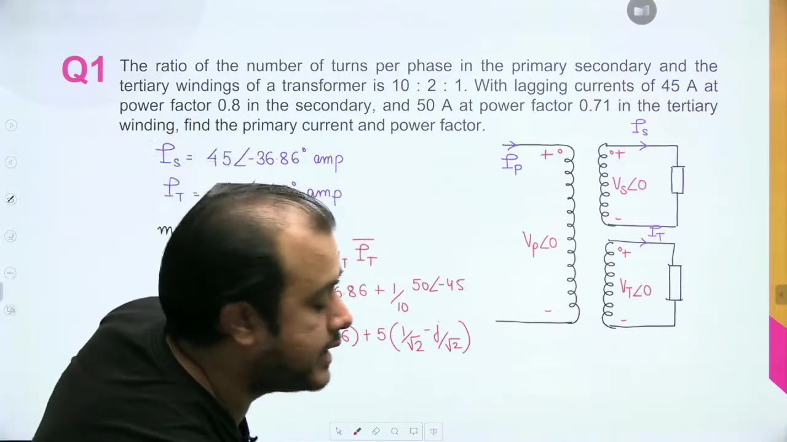
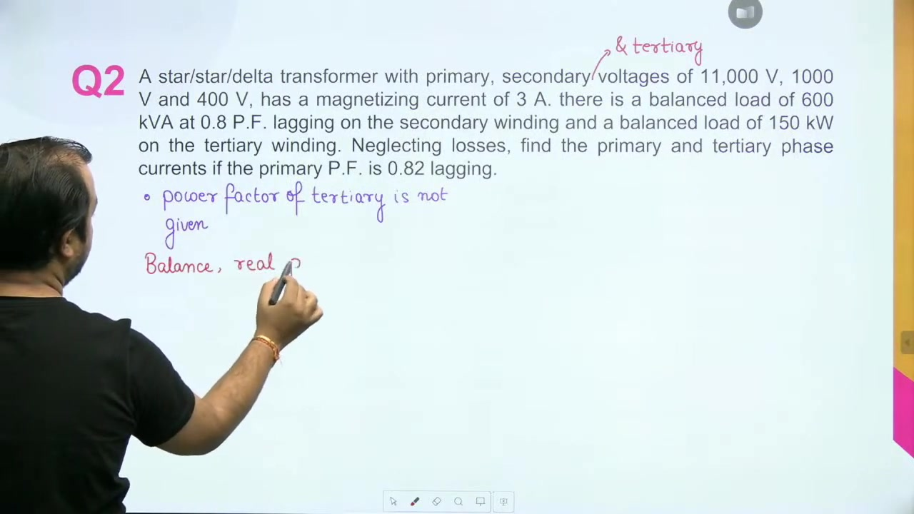
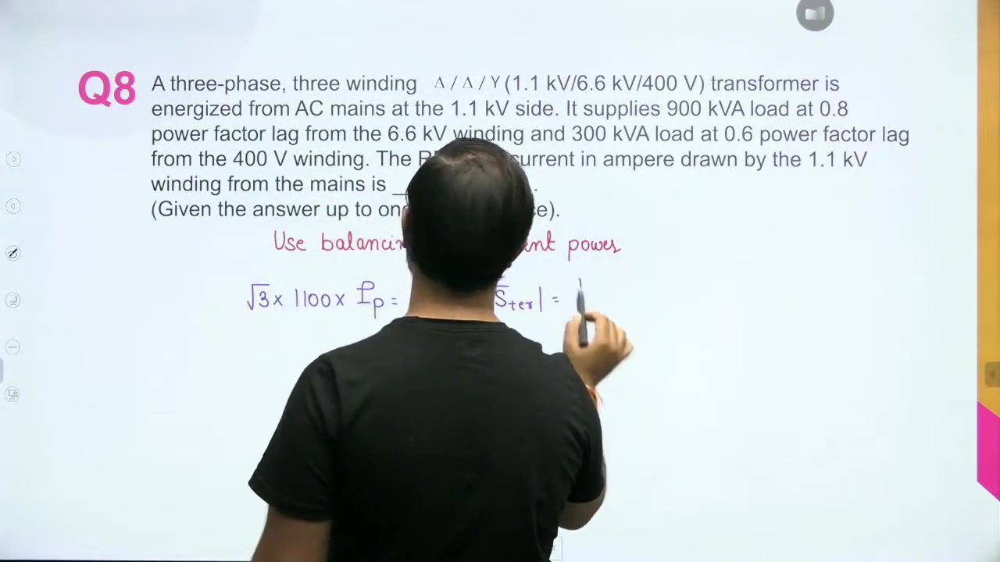
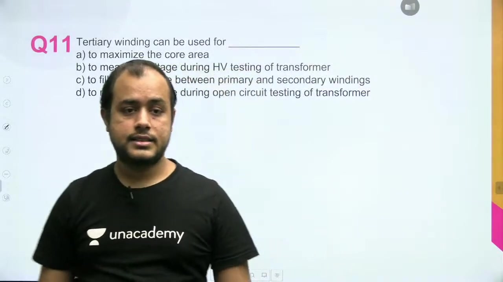

[← Lec 035: Problems based on Auto Transformer](Lecture_035_Problems_based_on_Auto_Transformer.md) | [🏠 Index](00_yt_study_guide.md) | [Lec 037: Three Phase Transformer 1 →](Lecture_037_Three_Phase_Transformer_1.md)

---

# Problems based on Three Winding Transformer | L 11 | Electrical Machines | GATE 2022 | #AnkitGoyal

- **Source**: https://www.youtube.com/watch?v=ZALfIKb0YPk
- **Duration**: 00:58:18
- **Compiled**: 2026-09-20

---

## Overview

This lecture focuses on problem solving for three-winding transformers and three-phase transformer banks. It develops three analytical strategies: Ampere-turn MMF balancing, active power conservation, and complex apparent power addition. It also analyzes equivalent circuits for single-phase transformers interconnected in three-phase delta-star configurations with transmission feeder impedances. Finally, the lecture explains how closed delta tertiary windings suppress third-harmonic voltages and stabilize neutral potentials.

## Contents

- [[#Analytical Strategies for Three-Winding Transformers|Analytical Strategies for Three-Winding Transformers]]
- [[#Strategy 1: MMF Balancing (Phasor Addition)|Strategy 1: MMF Balancing (Phasor Addition)]]
- [[#Strategy 2: Active Power Balancing|Strategy 2: Active Power Balancing]]
- [[#Strategy 3: Complex Power Balancing|Strategy 3: Complex Power Balancing]]
- [[#Three-Phase Bank and Feeder Analysis|Three-Phase Bank and Feeder Analysis]]
- [[#Core Functions of a Tertiary Winding|Core Functions of a Tertiary Winding]]

---

## Analytical Strategies for Three-Winding Transformers
_(00:12 - 55:23)_

A three-winding transformer has a primary, secondary, and tertiary winding. Solving for the primary input current depends on the given load information. There are three core strategies:

1. **MMF Balancing**: Use when individual secondary and tertiary current phasors are known.
2. **Active Power Balancing**: Use when load active powers are known and the primary power factor is explicitly given.
3. **Complex Power Balancing**: Use when loads are given at different power factors and primary power factor is unknown.

### Strategy 1: MMF Balancing (Phasor Addition)
_(05:16 - 10:26)_

Assuming negligible excitation current, the net magnetomotive force on the core balances to zero:
$$N_P I_P = N_S I_S + N_T I_T$$
$$I_P = \left(\frac{N_S}{N_P}\right)I_S + \left(\frac{N_T}{N_P}\right)I_T$$
*Application*: Convert given secondary and tertiary load currents into complex phasors relative to a reference terminal voltage, then sum them using the turns ratios.

### Strategy 2: Active Power Balancing
_(10:35 - 16:04, 35:44 - 40:15)_

The core magnetizing branch draws zero average active power. Therefore, primary input real power equals the sum of secondary and tertiary real load powers:
$$P_{\text{primary}} = P_{\text{secondary}} + P_{\text{tertiary}}$$

*Application*: If the primary power factor ($\cos \phi_1$) is known, you can find the primary line current directly:
$$P_{\text{primary}} = \sqrt{3} V_{L1} I_P \cos\phi_1$$
Equate this to $(P_2 + P_3)$ and solve for $I_P$.

### Strategy 3: Complex Power Balancing
_(40:44 - 55:23)_

When the primary power factor is unknown, sum the complex apparent power ($S = P + jQ$) of all loads.
$$S_{\text{total}} = S_2 + S_3$$
*Application*:
1. Convert each load into complex form: $S_i = |S_i|(\cos\phi_i + j\sin\phi_i)$.
2. Sum the real parts to get $P_{\text{total}}$ and imaginary parts to get $Q_{\text{total}}$.
3. Find the magnitude $|S_{\text{total}}| = \sqrt{P_{\text{total}}^2 + Q_{\text{total}}^2}$.
4. Find primary current: $I_P = \frac{|S_{\text{total}}|}{\sqrt{3} V_{L1}}$ (or $I_P = \frac{|S_{\text{total}}|}{V_P}$ for single-phase).

## Three-Phase Bank and Feeder Analysis
_(20:59 - 35:40)_

When single-phase transformers are banked to form a 3-phase Delta-Star ($\Delta$-Y) unit and fed by a transmission line, convert the primary Delta into an equivalent Star to create a single-phase series equivalent circuit.

**Procedure**:
1. **Delta-to-Star Impedance Conversion**: $Z_Y = \frac{Z_\Delta}{3}$.
2. **Equivalent Impedance**: Add the transformed transformer impedance to the feeder impedance: $Z_{\text{eq}} = Z_{\text{feeder}} + Z_Y = R_{\text{eq}} + jX_{\text{eq}}$.
3. **Primary Current**: Compute $I_P = \frac{S_{\text{total}}}{\sqrt{3}V_{L1}}$ (assuming rated voltage at the primary terminals).
4. **Voltage Drop**: Calculate the approximate phase voltage drop: $\Delta V \approx I_P (R_{\text{eq}} \cos\phi + X_{\text{eq}} \sin\phi)$.
5. **Sending End Voltage**: Add $\Delta V$ to the rated primary phase voltage, then multiply by $\sqrt{3}$ to get the sending-end line voltage.

## Core Functions of a Tertiary Winding
_(55:23 - 58:11)_

A tertiary winding is often connected in a **closed delta** inside star-star power transformers. It serves four key functions:

1. **Third-Harmonic Suppression**: Sinusoidal core flux requires a third-harmonic component in the magnetizing current. In an isolated star-star connection, co-phasal third-harmonic currents cannot flow, leading to flat-topped flux and distorted, peaked phase voltages. A closed delta tertiary provides a local circulating path for these third-harmonic currents, keeping the flux and induced voltages purely sinusoidal.
2. **Neutral Stabilization**: Under unbalanced loads, a closed delta tertiary allows zero-sequence fault currents to circulate locally, stabilizing the neutral point voltage.
3. **Auxiliary Supply**: It provides a convenient intermediate voltage to supply local substation loads.
4. **Safe Testing**: During open-circuit tests on EHV transformers, a voltmeter can be safely connected across the low-voltage tertiary terminals instead of the high-voltage terminals.

---

## Summary and Key Takeaways

- In three-winding transformers with zero excitation current, primary Ampere-turns balance the phasor sum of secondary and tertiary Ampere-turns: $N_P I_P = N_S I_S + N_T I_T$.
- When secondary and tertiary loads are known and the primary power factor is specified, balancing active power $P_{\text{primary}} = P_{\text{secondary}} + P_{\text{tertiary}}$ yields the primary line current directly because the purely reactive magnetizing current consumes zero active power.
- When the primary power factor is unknown, summing complex load powers as $S_{\text{total}} = S_2 + S_3 = P_{\text{total}} + jQ_{\text{total}}$ allows direct computation of input apparent power and primary line current.
- Converting a balanced delta-connected primary into an equivalent star divides the delta branch impedance by three: $Z_{\text{Y}} = Z_{\Delta} / 3$.
- In three-phase systems supplying rated secondary voltage, the sending-end voltage is obtained by adding the feeder and transformer series impedance drops: $\Delta V \approx I_P (R_{\text{eq}}\cos\phi + X_{\text{eq}}\sin\phi)$.
- A closed delta tertiary winding allows co-phasal third-harmonic magnetizing currents to circulate locally, ensuring that the core magnetic flux and induced phase voltages remain purely sinusoidal.
- Delta tertiary windings stabilize the neutral point in star-star systems under unbalanced loads and allow safe voltage measurements during open-circuit testing.

---

[← Lec 035: Problems based on Auto Transformer](Lecture_035_Problems_based_on_Auto_Transformer.md) | [🏠 Index](00_yt_study_guide.md) | [Lec 037: Three Phase Transformer 1 →](Lecture_037_Three_Phase_Transformer_1.md)
