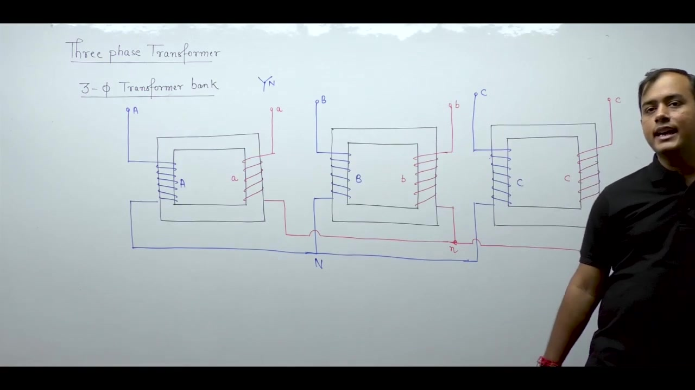
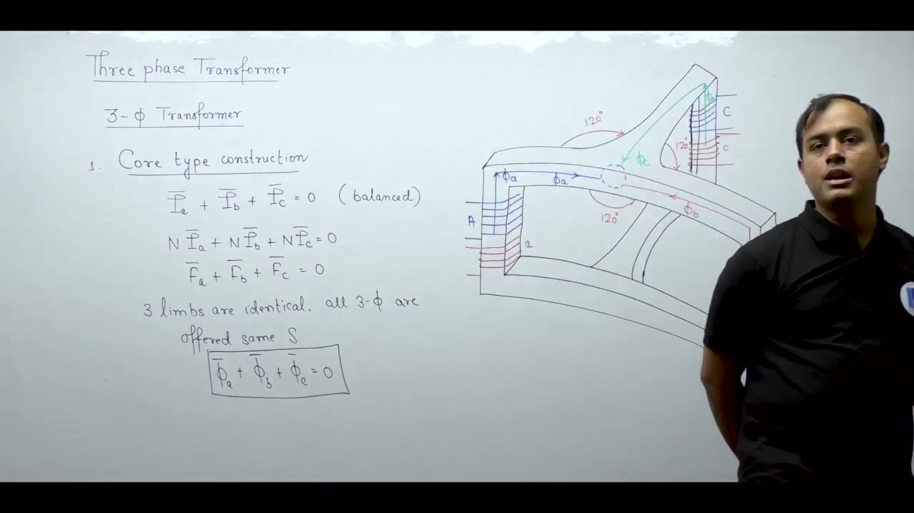
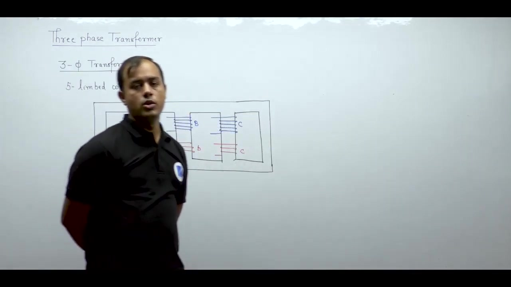

[← Lec 036: Problems based on Three Winding Transformer](Lecture_036_Problems_based_on_Three_Winding_Transformer.md) | [🏠 Index](00_yt_study_guide.md) | [Lec 038: Three Phase Transformer 2 →](Lecture_038_Three_Phase_Transformer_2.md)

---

# Electrical Machines | Lec 25 | Three Phase Transformer - 1 | GATE/ESE Electrical Engineering Lecture

- **Source**: https://www.youtube.com/watch?v=KhApv0b7zLw
- **Duration**: 01:08:18
- **Compiled**: 2026-09-21

---

## Overview

This lecture introduces three-phase transformers and compares transformer banks with integrated three-phase units. It examines core-type and shell-type constructions alongside three-limbed, five-limbed, and three-dimensional magnetic circuits. The discussion explains how balanced three-phase fluxes return through adjacent limbs without needing a return core leg. Finally, it analyzes magnetic reluctance asymmetry in planar cores and compares operational trade-offs across transformer designs.

## Contents

- [[#Three-Phase Advantages and Transformer Banks|Three-Phase Advantages and Transformer Banks]]
- [[#Three-Phase Core-Type Transformer Construction|Three-Phase Core-Type Transformer Construction]]
- [[#Three-Phase Shell-Type Transformer Construction|Three-Phase Shell-Type Transformer Construction]]
- [[#Comparative Analysis: Bank vs Core-Type vs Shell-Type|Comparative Analysis: Bank vs Core-Type vs Shell-Type]]

---

## Three-Phase Advantages and Transformer Banks
_(00:13 - 18:37)_

### Why Three-Phase?
Three-phase systems are preferred for bulk power transmission because:
1. They deliver three times the power of a single-phase system ($P_{3\phi} = 3 P_{1\phi}$).
2. They guarantee identical frequency across phases (synchronism).
3. They use less conductor material (3 wires instead of 6).
4. Instantaneous power $p(t)$ is constant, preventing mechanical torque pulsations.

### Transformer Banks
A **three-phase transformer bank** uses three separate single-phase transformers interconnected externally. 
- **Advantage**: Fault recovery is cheaper; you only need one single-phase unit as a spare (33.3% rating).
- **Disadvantage**: Triplication of parts (3 tanks, 3 cores, 3 breathers), larger floor space, and 12 bushings (4 per unit) increasing cost.

## Three-Phase Core-Type Transformer Construction
_(18:52 - 40:34)_

An integrated **three-phase transformer** places all windings on a single magnetic core structure, saving core material, tank volume, and floor space.

### Magnetic Flux Balance
Under balanced operation, the instantaneous sum of the three-phase fluxes is zero:
$$\phi_a(t) + \phi_b(t) + \phi_c(t) = 0$$
This means the flux of any one phase returns through the limbs of the other two phases. No central return leg is needed (analogous to KCL in a 3-wire electrical circuit).

### Planar Core Reluctance Asymmetry
In a practical 3-limbed planar core (all limbs in one flat plane):
- The central limb (Phase B) has a shorter magnetic path to the other limbs.
- Equivalent reluctance is lower for the central limb: $S_{\text{eq},B} = 2.5S$ compared to $S_{\text{eq},A} = S_{\text{eq},C} = 3.75S$.
- **Consequence**: The central phase requires slightly less magnetizing current ($I_{\mu,B} < I_{\mu,A} = I_{\mu,C}$). This causes a slight imbalance in no-load exciting currents, though the effect on full load is negligible.

## Three-Phase Shell-Type Transformer Construction
_(40:43 - 59:56)_

A **three-phase shell-type** unit is essentially three single-phase shell units stacked vertically or horizontally.

### Flux Phasor Addition and Core Sizing
The outer limbs carry half the flux of a single phase ($0.5\phi$).
The intermediate sections between phases carry fluxes from two adjacent phases simultaneously. Because these phases are displaced by $120^\circ$, their phasor difference in the shared yoke is:
$$\phi_{\text{inner}} = 2 \times \frac{\phi}{2} \cos(60^\circ / 2) = \frac{\sqrt{3}}{2}\phi \approx 0.866\phi$$

To maintain uniform maximum flux density ($B_{\max}$), the core cross-sectional area must scale proportionally:
- Main limbs: $A_{\text{main}}$
- Outer limbs/yokes: $0.5 A_{\text{main}}$
- Inner intermediate yokes: $0.866 A_{\text{main}}$

### Five-Limbed Cores
A five-limbed core consists of three wound central limbs and two unwound outer limbs. The outer limbs provide additional return paths for flux (especially zero-sequence and harmonic fluxes), which allows the yoke height to be reduced. This is useful for large high-voltage units restricted by transport height limits.

## Comparative Analysis: Bank vs Core-Type vs Shell-Type
_(59:59 - 68:10)_

| Feature | Transformer Bank | Core-Type (Integrated) | Shell-Type (Integrated) |
| :--- | :--- | :--- | :--- |
| **Capital Cost / Weight** | Highest (3 of everything) | Lowest (shared core/tank) | Moderate |
| **Standby Requirement** | 1 single-phase unit ($33.3\%$) | 1 three-phase unit ($100\%$) | 1 three-phase unit ($100\%$) |
| **Core Losses / Efficiency** | Higher losses / Lower efficiency | Lower losses / Higher efficiency | Lower losses / Higher efficiency |
| **Mechanical Support** | Moderate | Moderate (concentric coils) | High (sandwich coils inside core) |
| **Third-Harmonic Flux** | N/A | Must return through air/oil (high reluctance path $\implies$ suppressed) | Returns through outer core limbs (low reluctance path) |
| **Phase Voltage EMF** | Sinusoidal | Sinusoidal (due to suppressed 3rd harmonic flux) | Distorted (unless closed delta winding used) |

---

## Summary and Key Takeaways

- A three-phase system delivers three times the power of a single-phase system with $P_{3\phi} = 3 P_{1\phi}$, but requires only $1.5$ times the copper volume for three-wire transmission.
- Under balanced sinusoidal excitation, the sum of instantaneous phase fluxes is zero ($\phi_a(t) + \phi_b(t) + \phi_c(t) = 0$), so each phase flux returns through the other two limbs.
- Planar three-limbed core-type transformers are magnetically asymmetrical because the outer limbs experience higher reluctance than the central limb ($R_{\text{outer}} > R_{\text{central}}$).
- Asymmetrical core reluctance causes unequal magnetizing currents among the three phases with $I_{ma} = I_{mc} > I_{mb}$, while phase voltages remain balanced.
- In three-phase shell-type transformers, reversing the central phase winding polarity shifts its flux by $180^\circ$ and reduces the yoke flux from $\sqrt{3}\phi$ to $\phi$.
- Reversing the central phase winding reduces required yoke cross-sectional area and core material by $42.3\%$.
- Five-limbed cores provide dedicated return paths through unwound outer limbs, allowing reduced yoke height for transport in large high-voltage units.
- A three-phase transformer bank offers higher reliability and lower spare capacity costs, whereas an integrated three-phase unit saves $15\%$ in cost and weight.

---

[← Lec 036: Problems based on Three Winding Transformer](Lecture_036_Problems_based_on_Three_Winding_Transformer.md) | [🏠 Index](00_yt_study_guide.md) | [Lec 038: Three Phase Transformer 2 →](Lecture_038_Three_Phase_Transformer_2.md)
