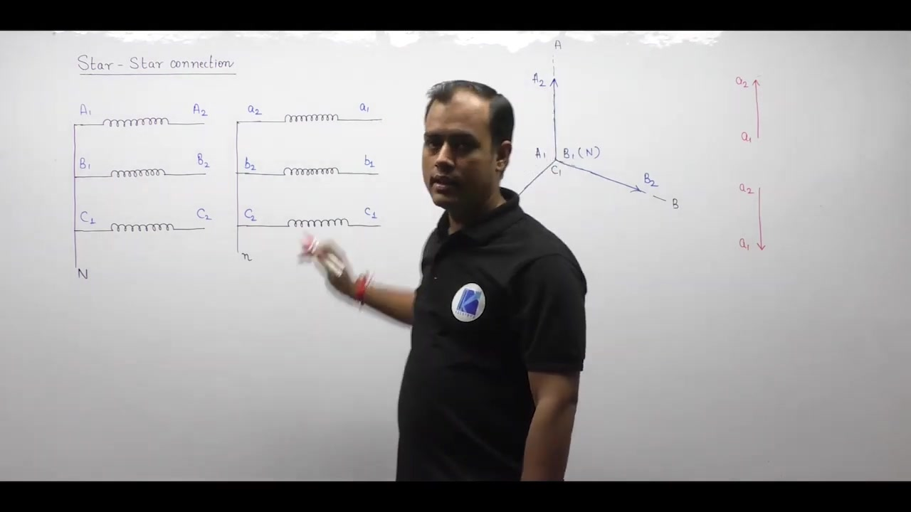
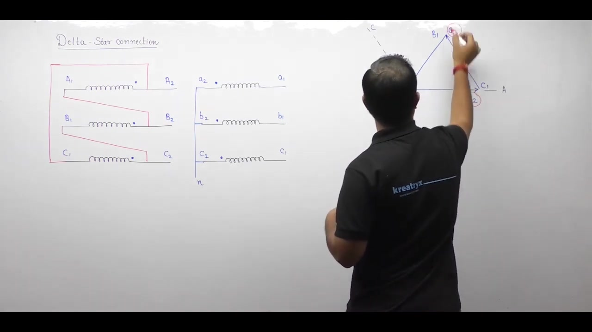

[← Lec 038: Three Phase Transformer 2](Lecture_038_Three_Phase_Transformer_2.md) | [🏠 Index](00_yt_study_guide.md) | [Lec 040: Three Phase Transformer 4 →](Lecture_040_Three_Phase_Transformer_4.md)

---

# Electrical Machines | Lec 27 | Three Phase Transformer - 3 | GATE/ESE Electrical Engineering Lecture

- **Source**: https://www.youtube.com/watch?v=QE2YCIbpFvU
- **Duration**: 00:54:27
- **Compiled**: 2026-09-21

---

## Overview

This lecture examines phase shift determination and phasor diagrams for three-phase transformers. It begins by solving non-standard delta-delta connections using both full geometric phasors and terminal voltage relations. Next, it introduces the star-star connection and derives the Yy0 and Yy6 phasor groups. The discussion then analyzes the delta-star configuration in detail. It proves how four distinct clock groups arise from winding reversals and compares their voltage ratios and harmonic performance.

## Contents

- [[#Terminal Voltage Method for Phase Shifts|Terminal Voltage Method for Phase Shifts]]
- [[#Star-Star (Y-Y) Connection|Star-Star (Y-Y) Connection]]
- [[#Delta-Star (D-y) Connection|Delta-Star (D-y) Connection]]
- [[#Delta-Star Features and Voltage Ratios|Delta-Star Features and Voltage Ratios]]

---

## Terminal Voltage Method for Phase Shifts
_(00:12 - 13:03)_

Drawing full delta triangles can be tedious. A faster way to determine phase shift is to compare the terminal voltages directly using star reference axes.

**Procedure**:
1. Draw standard reference star axes for primary (A, B, C) and secondary (a, b, c) phase voltages.
2. Determine which winding terminals are connected to the line terminals.
3. Express line voltage $V_{AB}$ as the potential difference between terminals: $V_{AB} = V_A - V_B$.
4. Represent this as a phasor on the axes (e.g., if A connects to $B_1$ and B connects to $B_2$, then $V_{AB} = V_{B1} - V_{B2}$, so the phasor points from $B_2$ to $B_1$).
5. Repeat for the secondary line voltage $V_{ab}$.
6. Compare the angle between the resulting primary and secondary line voltage phasors.

## Star-Star (Y-Y) Connection
_(13:03 - 28:10)_

In a Star-Star connection, one end of each phase winding connects to a common neutral point, and the other end connects to the line.

### Phasor Groups
Like Delta-Delta, Star-Star only allows two standard phase shifts:
- **Yy0 ($0^\circ$)**: Formed when the primary and secondary neutrals are made at corresponding ends (e.g., all unmarked ends $A_1, B_1, C_1$ and $a_1, b_1, c_1$).
- **Yy6 ($180^\circ$)**: Formed when the secondary neutral is made at the opposite ends (e.g., $A_1, B_1, C_1$ on primary, but $a_2, b_2, c_2$ on secondary).

### Key Features
- **Voltage Ratio**: The line voltage ratio perfectly matches the turns ratio.
  $$\frac{V_{L(HV)}}{V_{L(LV)}} = \frac{\sqrt{3} V_{ph(HV)}}{\sqrt{3} V_{ph(LV)}} = \frac{N_H}{N_L}$$
- **Harmonics**: Because the neutral is usually isolated, third-harmonic currents cannot circulate. This leads to a flat-topped core flux and distorted, peaked phase voltages.

## Delta-Star (D-y) Connection
_(28:13 - 54:19)_

The Delta-Star connection is the most common for step-down distribution transformers. It yields **four** possible phasor groups by altering the delta loop or the star neutral.

### The Four Phasor Groups
1. **Dy11 ($+30^\circ$ lead)**: Standard connection.
2. **Dy5 ($-150^\circ$ lag)**: Derived from Dy11 by moving the secondary neutral to the opposite winding ends.
3. **Dy1 ($-30^\circ$ lag)**: Derived from Dy11 by reversing the primary delta loop sequence.
4. **Dy7 ($+150^\circ$ lead)**: Derived from Dy1 by moving the secondary neutral to the opposite winding ends.

## Delta-Star Features and Voltage Ratios
_(45:19 - 54:19)_

### 1. Voltage Ratio
Unlike Star-Star or Delta-Delta, the line voltage ratio in Delta-Star is **not** equal to the turns ratio.
- Primary (Delta): $V_{L(HV)} = V_{ph(HV)}$
- Secondary (Star): $V_{L(LV)} = \sqrt{3} V_{ph(LV)}$
- Ratio: 
  $$\frac{V_{L(HV)}}{V_{L(LV)}} = \frac{V_{ph(HV)}}{\sqrt{3} V_{ph(LV)}} = \frac{1}{\sqrt{3}} \frac{N_H}{N_L}$$
*Note: Nameplate ratings are always line-to-line voltages.*

### 2. Harmonic Suppression
The primary delta winding provides a closed loop for third-harmonic currents. This keeps the core flux sinusoidal, ensuring that induced phase and line voltages remain clean and undistorted.

### 3. Neutral Availability
The secondary star winding provides a neutral terminal. This allows the transformer to simultaneously supply three-phase loads (across lines) and single-phase loads (between line and neutral).

---

## Summary and Key Takeaways

- In arbitrary delta-delta connections, terminal voltage relations $V_{XY} = V_X - V_Y$ determine line voltage phase shifts without drawing full mesh triangles.
- The star-star transformer yields two standard clock positions, namely Yy0 for $0^\circ$ displacement and Yy6 for $180^\circ$ displacement.
- In a star-star bank, the line voltage ratio equals the turns ratio: $V_{L(HV)} / V_{L(LV)} = N_H / N_L$.
- Star windings experience a phase voltage of $V_L / \sqrt{3} \approx 0.577 V_L$, which reduces insulation requirements and conductor turns.
- The delta-star configuration produces four standard clock groups: Dy11 ($+30^\circ$), Dy1 ($-30^\circ$), Dy7 ($+150^\circ$), and Dy5 ($-150^\circ$).
- In a delta-star transformer, the line voltage ratio is $V_{L(HV)} / V_{L(LV)} = N_H / (\sqrt{3} N_L)$, which is smaller than the turns ratio.
- A primary delta winding provides a closed circulating loop for third harmonic currents, keeping core flux and induced EMF sinusoidal.
- Accessible secondary neutral terminals in star connections enable simultaneous supply of three-phase and single-phase loads in distribution networks.

---

[← Lec 038: Three Phase Transformer 2](Lecture_038_Three_Phase_Transformer_2.md) | [🏠 Index](00_yt_study_guide.md) | [Lec 040: Three Phase Transformer 4 →](Lecture_040_Three_Phase_Transformer_4.md)
