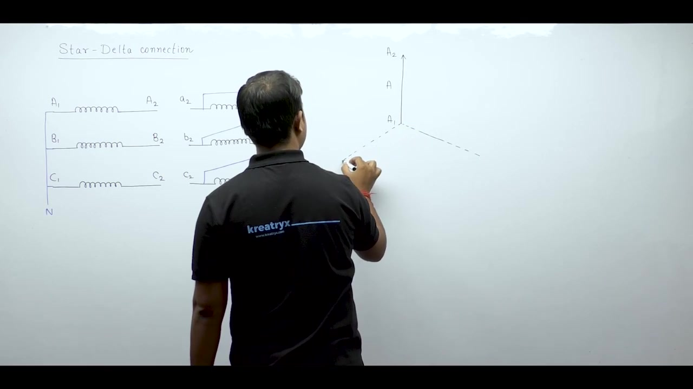

[← Lec 039: Three Phase Transformer 3](Lecture_039_Three_Phase_Transformer_3.md) | [🏠 Index](00_yt_study_guide.md) | [Lec 041: Problems Based on Three Phase Transformers 1 →](Lecture_041_Problems_Based_on_Three_Phase_Transformers_1.md)

---

# Electrical Machines | Lec 28 | Three Phase Transformer - 4 | GATE/ESE Electrical Engineering Lecture

- **Source**: https://www.youtube.com/watch?v=Sg2qwYC0SKY
- **Duration**: 00:47:12
- **Compiled**: 2026-09-21

---

## Overview

This lecture completes the analysis of basic three-phase transformer connections by exploring the star-delta configuration. It derives all four star-delta clock groups including Yd1, Yd11, Yd5, and Yd7 using rigorous phasor diagrams. The discussion investigates line voltage transformation ratios and highlights third-harmonic current circulation in delta windings. Finally, it presents a shortcut method using Kirchhoff's Voltage Law to compute phase shifts under both positive and negative sequence excitation.

## Contents

- [[#Star-Delta (Y-d) Connection|Star-Delta (Y-d) Connection]]
- [[#The Four Star-Delta Phasor Groups|The Four Star-Delta Phasor Groups]]
- [[#Star-Delta Features and Voltage Ratio|Star-Delta Features and Voltage Ratio]]
- [[#Phase Shift Sequence and the Shortcut Method|Phase Shift Sequence and the Shortcut Method]]

---

## Star-Delta (Y-d) Connection
_(00:12 - 05:26)_

In a Star-Delta (Y-d) transformer, the High Voltage (HV) side is star-connected, and the Low Voltage (LV) side is delta-connected.

- **Primary (Star)**: One end of each winding connects to a common neutral (N). The other ends connect to the lines.
- **Secondary (Delta)**: Windings are connected in a closed mesh. The finish of one phase connects to the start of the next phase.

## The Four Star-Delta Phasor Groups
_(05:32 - 21:25)_

Like the delta-star configuration, star-delta can produce four standard clock positions depending on how the neutral is formed and how the delta is closed:

1. **Yd1 ($-30^\circ$ lag, 1 o'clock)**: Formed with standard connection ($A_1, B_1, C_1$ neutral; $a_1 \to b_2$, $b_1 \to c_2$, $c_1 \to a_2$).
2. **Yd11 ($+30^\circ$ lead, 11 o'clock)**: Formed by reversing the secondary delta loop ($a_2 \to b_1$, $b_2 \to c_1$, $c_2 \to a_1$).
3. **Yd5 ($-150^\circ$ lag, 5 o'clock)**: Formed by changing the primary neutral to the other ends ($A_2, B_2, C_2$ neutral).
4. **Yd7 ($+150^\circ$ lead, 7 o'clock)**: Formed by applying both the primary neutral change and the secondary loop reversal.

## Star-Delta Features and Voltage Ratio
_(21:28 - 26:13)_

### 1. Voltage Transformation Ratio
Because of the mixed configuration, the line voltage ratio does not match the turns ratio:
- Primary (Star): $V_{L(HV)} = \sqrt{3} V_{ph(HV)}$
- Secondary (Delta): $V_{L(LV)} = V_{ph(LV)}$
- Ratio:
  $$\frac{V_{L(HV)}}{V_{L(LV)}} = \frac{\sqrt{3} V_{ph(HV)}}{V_{ph(LV)}} = \sqrt{3} \left(\frac{N_H}{N_L}\right)$$

This $\sqrt{3}$ multiplier makes the star-delta configuration ideal for stepping down voltages at the receiving end of transmission lines.

### 2. Third-Harmonic Suppression
The closed secondary delta winding provides a natural loop for third-harmonic zero-sequence currents to circulate. This ensures the core flux remains sinusoidal, preventing third-harmonic voltage distortion.

## Phase Shift Sequence and the Shortcut Method
_(26:16 - 47:05)_

### Reversing Phase Sequence
A fundamental rule exists for reversing the supply phase sequence (from positive A-B-C to negative A-C-B) without altering the physical winding connections:

> [!info] Sequence Reversal Rule
> If a connection yields a phase shift of $+\theta$ (lead) under positive sequence, it will yield a phase shift of $-\theta$ (lag) under negative sequence. The magnitude remains identical.

### The Shortcut Method (KVL Approach)
To find phase displacement quickly without drawing full polygons:
1. Label all winding ends with dot markings ($2$ at dot, $1$ at undotted).
2. Draw radial star axes for primary and secondary.
3. Express line voltages using Kirchhoff's Voltage Law ($V_{AB} = V_A - V_B$).
4. Look at the circuit diagram to see which winding terminals connect to the lines. For example, if A connects to $B_1$ and B connects to $B_2$, then $V_{AB} = V_{B1} - V_{B2}$, which is represented by a phasor pointing from $B_2$ to $B_1$.
5. Evaluate $V_{AB}$ and $V_{ab}$ on the radial axes using vector addition/subtraction.
6. Measure the angle between the resulting line voltage phasors.

This method is faster and less error-prone for competitive exam problems.

---

## Summary and Key Takeaways

- Star-delta connections produce four distinct clock groups: Yd1 ($-30^\circ$), Yd11 ($+30^\circ$), Yd5 ($-150^\circ$), and Yd7 ($-210^\circ$).
- Both star-delta and delta-star configurations yield identical phase shifts and belong to the same phasor groups.
- The line voltage transformation ratio for a star-delta bank is $V_{L(HV)} / V_{L(LV)} = \sqrt{3} (N_H / N_L)$, which exceeds that of star-star and delta-delta banks.
- Circulating third-harmonic currents inside the closed delta winding maintain sinusoidal core flux and induced voltages.
- Phase shift in any three-phase transformer is defined strictly between primary and secondary line voltages, while phase voltages on identical limbs remain in phase.
- Reversing the supply sequence from positive to negative preserves the angular magnitude of phase shift but flips its nature from leading to lagging.
- The direct shortcut method computes line voltage displacement directly via $V_{XY} = V_X - V_Y$ without requiring closed delta phasor polygons.

---

[← Lec 039: Three Phase Transformer 3](Lecture_039_Three_Phase_Transformer_3.md) | [🏠 Index](00_yt_study_guide.md) | [Lec 041: Problems Based on Three Phase Transformers 1 →](Lecture_041_Problems_Based_on_Three_Phase_Transformers_1.md)
