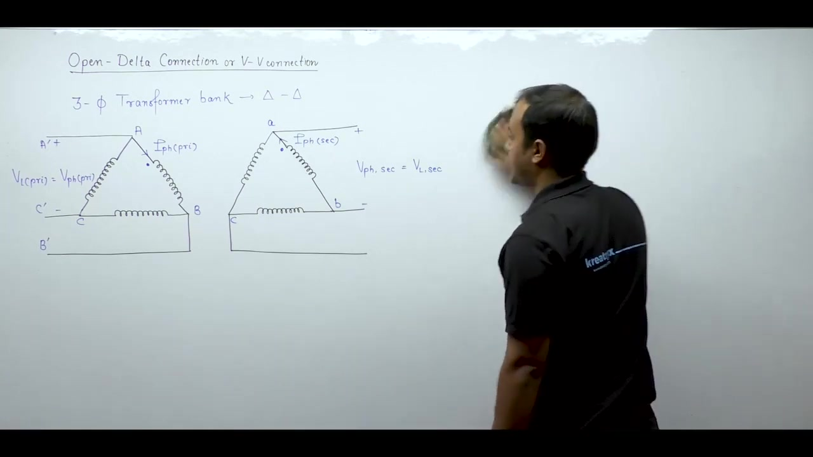

[← Lec 042: Problems Based on Three Phase Transformers 2](Lecture_042_Problems_Based_on_Three_Phase_Transformers_2.md) | [🏠 Index](00_yt_study_guide.md) | [Lec 044: Three Phase Transformer 6 →](Lecture_044_Three_Phase_Transformer_6.md)

---

# Electrical Machines | Lec 29 | Three Phase Transformer - 5 | GATE/ESE Electrical Engineering Lecture

- **Source**: https://www.youtube.com/watch?v=nKhhMbYe6LY
- **Duration**: 01:11:53
- **Compiled**: 2026-09-21

---

## Overview

This lecture analyzes the open-delta or V-V connection formed by removing one single-phase unit from a delta-delta transformer bank. It proves mathematically that balanced line voltages are preserved across all three secondary phases despite the missing transformer. The lecture derives the voltage and current constraints, establishing a capacity ratio of 57.7% and a transformer utilization factor of 86.6%. Detailed phasor analyses are carried out for resistive and inductive loads to show how the two transformers operate at different power factors. Finally, the lecture discusses practical utility applications and compiles essential formulas for engineering examinations.

## Contents

- [[#Delta-Delta to Open-Delta (V-V) Transition|Delta-Delta to Open-Delta (V-V) Transition]]
- [[#Verification of Balanced Secondary Voltages|Verification of Balanced Secondary Voltages]]
- [[#Voltage, Current, and Power Ratings in V-V|Voltage, Current, and Power Ratings in V-V]]
- [[#Capacity Ratio and Utilization Factor|Capacity Ratio and Utilization Factor]]
- [[#V-V Bank Supplying Resistive Load|V-V Bank Supplying Resistive Load]]
- [[#V-V Bank Supplying Inductive Load|V-V Bank Supplying Inductive Load]]
- [[#Operating Power Factor Regimes|Operating Power Factor Regimes]]

---

## Delta-Delta to Open-Delta (V-V) Transition
_(00:12 - 10:46)_

A three-phase delta-delta bank uses three single-phase transformers.
- In delta-delta, total apparent power is $S_{\Delta\Delta} = 3 V_{ph} I_{ph} = \sqrt{3} V_L I_L$.
- Each single-phase transformer carries phase voltage $V_{ph}$ and phase current $I_{ph}$, providing capacity $S_{\text{unit}} = V_{ph} I_{ph}$.

If one unit is removed due to damage, the remaining two transformers form an **open-delta (V-V) connection**. The remaining two transformers continue to supply a three-phase load, but at a reduced capacity.

## Verification of Balanced Secondary Voltages
_(10:49 - 22:11)_

Does the V-V connection still provide balanced three-phase voltages? Yes.
Assume a balanced primary supply: $V_{AB} = V \angle 0^\circ, V_{BC} = V \angle -120^\circ, V_{CA} = V \angle 120^\circ$.
Transformer 1 is between A and C ($V_{AC} = -V_{CA} = V \angle -60^\circ$).
Transformer 2 is between B and C ($V_{BC} = V \angle -120^\circ$).

On the secondary side (with turns ratio $V' = V \frac{N_2}{N_1}$):
- $V_{ac} = V' \angle -60^\circ \implies V_{ca} = V' \angle 120^\circ$
- $V_{bc} = V' \angle -120^\circ$

Apply KVL across the open terminals $a$ and $b$:
$$V_{ab} = V_{ac} - V_{bc} = V' \angle -60^\circ - V' \angle -120^\circ$$
$$V_{ab} = V' \left[\left(\frac{1}{2} - j\frac{\sqrt{3}}{2}\right) - \left(-\frac{1}{2} - j\frac{\sqrt{3}}{2}\right)\right] = V'(1) = V' \angle 0^\circ$$

The open-terminal line voltage exactly completes the balanced three-phase set: $V_{ab} = V' \angle 0^\circ$, $V_{bc} = V' \angle -120^\circ$, $V_{ca} = V' \angle 120^\circ$.

## Voltage, Current, and Power Ratings in V-V
_(22:12 - 27:01)_

Removing one transformer does not change the physical construction (voltage/current ratings) of the remaining units.
- **Voltage rating**: Remains $V_{ph}$. Thus, Line voltage $V_L = V_{ph}$.
- **Current rating**: In V-V, the line connects directly in series with the winding. Line current cannot exceed winding current: $I_L = I_{ph}$.

Total three-phase apparent power delivered by V-V bank:
$$S_{VV} = \sqrt{3} V_L I_L = \sqrt{3} V_{ph} I_{ph}$$

## Capacity Ratio and Utilization Factor
_(27:04 - 37:24)_

### Capacity Ratio
The ratio of V-V bank capacity to the original $\Delta$-$\Delta$ bank capacity is:
$$\frac{S_{VV}}{S_{\Delta\Delta}} = \frac{\sqrt{3} V_{ph} I_{ph}}{3 V_{ph} I_{ph}} = \frac{1}{\sqrt{3}} \approx 0.577$$

Removing 33.3% of the equipment results in a 42.3% loss in power delivery capacity. The bank delivers 57.7% of its original capacity.

### Transformer Utilization Factor (TUF)
TUF measures how effectively the installed transformer capacity is used:
$$\text{TUF} = \frac{\text{Actual Delivered Capacity}}{\text{Total Installed Capacity}}$$
In an open-delta bank, 2 units are installed ($2 V_{ph} I_{ph}$), but they deliver $\sqrt{3} V_{ph} I_{ph}$.
$$\text{TUF}_{VV} = \frac{\sqrt{3} V_{ph} I_{ph}}{2 V_{ph} I_{ph}} = \frac{\sqrt{3}}{2} \approx 0.866 = 86.6\%$$

## V-V Bank Supplying Resistive Load
_(37:24 - 53:49)_

When supplying a purely resistive load, the two transformers do not operate at UPF.
By drawing the phasor diagram of a star or delta connected resistive load:
- $I_A$ leads $V_{AC}$ by $30^\circ$. Unit 1 apparent power: $S_1 = V_{ph} I_{ph} \angle -30^\circ$ (leading pf).
- $I_B$ lags $V_{BC}$ by $30^\circ$. Unit 2 apparent power: $S_2 = V_{ph} I_{ph} \angle +30^\circ$ (lagging pf).

$$S_{\text{total}} = S_1 + S_2 = V_{ph}I_{ph}(\cos30^\circ - j\sin30^\circ + \cos30^\circ + j\sin30^\circ) = \sqrt{3}V_{ph}I_{ph}$$
The reactive powers ($0.5 V_{ph} I_{ph}$) circulate between the two transformers.

## V-V Bank Supplying Inductive Load
_(53:49 - 62:57)_

For a general load impedance with power factor angle $\phi$ (lagging):
- Current $I_A$ lags $V_{AN}$ by $\phi$. The angle between $V_{AC}$ and $I_A$ becomes $30^\circ - \phi$.
- Current $I_B$ lags $V_{BN}$ by $\phi$. The angle between $V_{BC}$ and $I_B$ becomes $30^\circ + \phi$.

> [!info] Individual Transformer Power Factors
> - Unit 1: $S_1 = V_{ph} I_{ph} \angle -(30^\circ - \phi)$ $\implies$ pf $= \cos(30^\circ - \phi)$
> - Unit 2: $S_2 = V_{ph} I_{ph} \angle +(30^\circ + \phi)$ $\implies$ pf $= \cos(30^\circ + \phi)$
>
> Active Powers: $P_1 = V_{ph} I_{ph} \cos(30^\circ - \phi)$ and $P_2 = V_{ph} I_{ph} \cos(30^\circ + \phi)$.
> Total Power: $P = P_1 + P_2 = \sqrt{3} V_{ph} I_{ph} \cos \phi$.

## Operating Power Factor Regimes
_(63:01 - 71:46)_

The operating conditions of the two units depend on $\phi$:
1. **$\phi < 30^\circ$ ($\text{pf} > 0.866$ lag):** Unit 1 operates at leading pf. Unit 2 operates at lagging pf.
2. **$\phi = 30^\circ$ ($\text{pf} = 0.866$ lag):** Unit 1 operates at UPF ($\cos 0^\circ = 1$). Unit 2 operates at $0.5$ lag ($\cos 60^\circ = 0.5$).
3. **$\phi > 30^\circ$ ($\text{pf} < 0.866$ lag):** Both units operate at lagging pf.

---

## Summary and Key Takeaways

- An open-delta or V-V connection consists of two single-phase transformers supplying a three-phase load after removing one unit from a delta-delta bank.
- Kirchhoff's Voltage Law ensures that balanced line voltages $V_{ab}$, $V_{bc}$, and $V_{ca}$ appear at the secondary terminals when balanced primary voltages are applied.
- The maximum permissible line current in open-delta equals the rated phase current $I_{ph}$ of an individual winding to prevent thermal overload.
- The total apparent power delivered by an open-delta bank is $S_{VV} = \sqrt{3} V_{ph} I_{ph}$, which is $57.7\%$ of the closed delta-delta rating $3 V_{ph} I_{ph}$.
- The transformer utilization factor of the open-delta connection is $\text{TUF}_{VV} = \sqrt{3}/2 \approx 86.6\%$, indicating that the two units cannot be fully loaded to their combined nameplate capacity.
- For a balanced resistive load, the two transformers operate at equal apparent power $V_{ph} I_{ph}$ with power factors of $\cos 30^\circ$ leading and $\cos 30^\circ$ lagging.
- For a general inductive load of impedance angle $\phi$, the two units operate at power factors of $\cos(30^\circ - \phi)$ leading and $\cos(30^\circ + \phi)$ lagging.
- When the load power factor angle exceeds $30^\circ$ ($\phi > 30^\circ$, or $\text{pf} < 0.866$ lag), both transformers operate at lagging power factors.

---

[← Lec 042: Problems Based on Three Phase Transformers 2](Lecture_042_Problems_Based_on_Three_Phase_Transformers_2.md) | [🏠 Index](00_yt_study_guide.md) | [Lec 044: Three Phase Transformer 6 →](Lecture_044_Three_Phase_Transformer_6.md)
