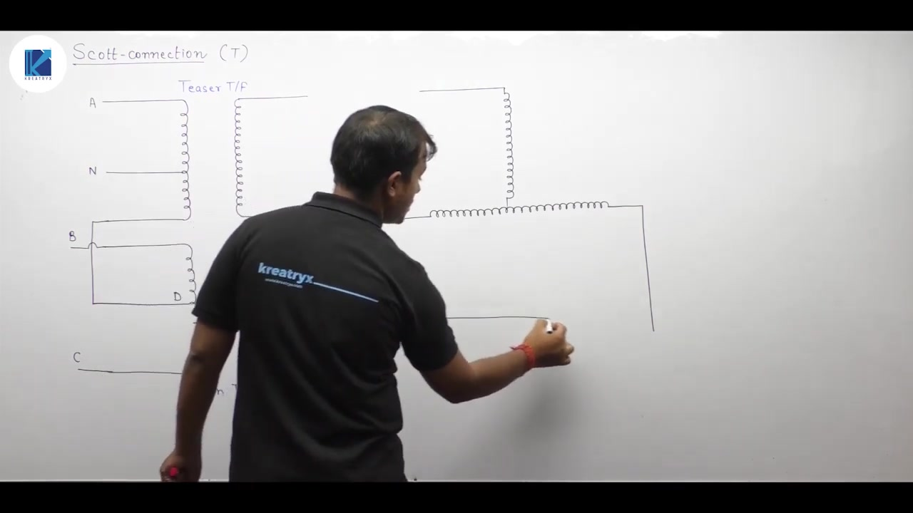

[← Lec 044: Three Phase Transformer 6](Lecture_044_Three_Phase_Transformer_6.md) | [🏠 Index](00_yt_study_guide.md) | [Lec 046: Problems Based on Three Phase Transformers 3 →](Lecture_046_Problems_Based_on_Three_Phase_Transformers_3.md)

---

# Electrical Machines | Lec 31 | Three Phase Transformer - 7 | GATE/ESE Electrical Engineering Lecture

- **Source**: https://www.youtube.com/watch?v=VvIk1qmbf7E
- **Duration**: 01:12:58
- **Compiled**: 2026-09-21

---

## Overview

This lecture covers the theory, construction, and analytical performance of the Scott connection for three-phase to two-phase conversion. It explains why directly using two phases of a three-phase supply violates two-phase balancing and how the teaser and main transformer interconnection creates a 90-degree phase shift. The discussion establishes turns ratios, locates the primary neutral terminal, and analyzes MMF cancellation in the main winding. It derives primary current balancing and operating power factors under balanced and unbalanced loading. Finally, the lecture evaluates the volt-ampere ratings and determines the transformer utilization factor for both custom and identical transformer configurations.

## Contents

- [[#Scott Connection: Principle and Construction|Scott Connection: Principle and Construction]]
- [[#Phasor and Voltage Analysis|Phasor and Voltage Analysis]]
- [[#Primary Neutral Point Verification|Primary Neutral Point Verification]]
- [[#Current Balancing and MMF Analysis|Current Balancing and MMF Analysis]]
- [[#Operating Power Factors|Operating Power Factors]]
- [[#Transformer Utilization Factor (TUF)|Transformer Utilization Factor (TUF)]]

---

## Scott Connection: Principle and Construction
_(00:14 - 12:21)_

A balanced two-phase supply requires two voltages of equal magnitude displaced by exactly $90^\circ$. A three-phase system has $120^\circ$ phase displacements, so tapping any two phases yields a $120^\circ$ shift, not $90^\circ$. The Scott connection (or T-connection) uses two single-phase transformers to convert 3-phase to 2-phase.

**Construction**:
- **Main Transformer**: Primary connects across lines B and C. It has a center tap D dividing the primary winding into two halves ($N_1/2$ turns each).
- **Teaser Transformer**: Primary connects between line A and the center tap D of the main transformer.

## Phasor and Voltage Analysis
_(12:24 - 24:06)_

**Primary Voltages**:
Assume a balanced 3-phase supply. Line voltage $V_{BC} = V_L \angle 0^\circ$.
The main primary receives $V_{BC} = V_L \angle 0^\circ$.
The voltage at the center tap D is $V_{BD} = (V_L/2) \angle 0^\circ$.
Applying KVL, the teaser primary voltage is:
$$V_{AD} = V_{AB} + V_{BD} = V_L \angle 120^\circ + (V_L/2) \angle 0^\circ = j\frac{\sqrt{3}}{2}V_L = 0.866 V_L \angle 90^\circ$$
The teaser primary voltage leads the main primary voltage by exactly $90^\circ$.

**Turns Ratio**:
To obtain equal secondary voltages $V_2$ on both transformers:
- Main primary turns: $N_1$
- Teaser primary turns must be $0.866 N_1 = (\sqrt{3}/2) N_1$.
- Thus, the turns ratios are $N_1:N_2$ (Main) and $0.866N_1:N_2$ (Teaser).

## Primary Neutral Point Verification
_(24:06 - 29:11)_

The neutral point N for the 3-phase supply lies on the teaser primary winding.
The phase-to-neutral voltage is $V_L/\sqrt{3}$.
The ratio of $V_{AN}$ to the total teaser voltage $V_{AD}$ is:
$$\frac{V_{AN}}{V_{AD}} = \frac{V_L / \sqrt{3}}{(\sqrt{3}/2) V_L} = \frac{2}{3}$$
Thus, the neutral tap N divides the teaser primary into two-thirds ($0.577 N_1$ turns from A) and one-third ($0.288 N_1$ turns from D).
This neutral point N correctly balances the phase voltages $V_{AN}, V_{BN}, V_{CN}$ with $120^\circ$ separation.

## Current Balancing and MMF Analysis
_(29:11 - 46:28)_

When the secondary draws balanced 2-phase load currents ($I_2$):
1. **Teaser**: Primary current $I_A = \frac{2}{\sqrt{3}}\left(\frac{N_2}{N_1}\right) I_2 = 1.155\left(\frac{N_2}{N_1}\right) I_2$.
2. **Main**: Mesh current $I_{BC} = \left(\frac{N_2}{N_1}\right) I_2$.

At the center tap D, teaser current $I_A$ splits into two equal halves ($I_A/2$) flowing in opposite directions through the two halves of the main primary.
- The net MMF produced by $I_A/2$ in the main core is zero: $(I_A/2)(N_1/2) - (I_A/2)(N_1/2) = 0$.
- The main primary line currents are $I_B = I_{BC} - I_A/2$ and $I_C = -I_{BC} - I_A/2$.

**Primary Current Balance**:
Under a balanced load, $I_A, I_B, I_C$ all have equal magnitudes of $1.155\left(\frac{N_2}{N_1}\right) I_2$ and are mutually separated by $120^\circ$. A balanced 2-phase load draws perfectly balanced 3-phase currents.

## Operating Power Factors
_(46:34 - 57:18)_

Under a balanced 2-phase load with power factor $\cos \phi$:
1. **Teaser Transformer**: Operates at the load power factor $\cos \phi$.
2. **Main Transformer**:
   - The BD section (half) operates at $\cos(30^\circ + \phi)$.
   - The CD section (half) operates at $\cos(30^\circ - \phi)$ (leading for $\phi < 30^\circ$, lagging for $\phi > 30^\circ$).
This behavior matches the open-delta ($V\text{-}V$) transformer bank.

## Transformer Utilization Factor (TUF)
_(57:21 - 72:51)_

1. **Custom Transformers**:
   - Main transformer primary VA rating must support the line current $1.155 I_2 (N_2/N_1)$, not just the mesh current. Rating = $1.155 V_2 I_2$.
   - The average VA rating of the main transformer is $1.078 V_2 I_2$.
   - Teaser rating is $V_2 I_2$. Total rated VA = $2.078 V_2 I_2$.
   - $\text{TUF} = \frac{2 V_2 I_2}{2.078 V_2 I_2} = 96.25\%$.
2. **Identical Transformers**:
   - If two identical transformers are used ($N_1$ turns, tapped at $86.6\%$), both are rated for $1.078 V_2 I_2$.
   - Total rated VA = $2.156 V_2 I_2$.
   - $\text{TUF} = \frac{2 V_2 I_2}{2.156 V_2 I_2} = 92.8\%$.

---

## Summary and Key Takeaways

- A balanced two-phase system requires two voltages of equal magnitude displaced by $90^\circ$, which cannot be obtained by directly tapping two phases of a three-phase line.
- The Scott connection main transformer connects across lines B and C, while the teaser transformer connects between line A and the main center tap D.
- The teaser primary voltage is $V_{AD} = 0.866 V_L \angle 90^\circ$, which leads the main primary voltage $V_{BC} = V_L \angle 0^\circ$ by $90^\circ$.
- To obtain equal secondary voltages $V_2$, the teaser primary must have $0.866 N_1$ turns when the main primary has $N_1$ turns.
- The primary neutral tap N is located on the teaser primary at two-thirds turns ($0.577 N_1$) from the top terminal A.
- The teaser current $I_A$ splits equally at center tap D, producing equal and opposite currents in the two halves of the main primary that cancel in net MMF.
- Under balanced secondary loading, the primary draws balanced three-phase line currents of magnitude $1.155 (N_2 / N_1) I_2$.
- For a secondary load of power factor $\cos \phi$, the teaser operates at $\cos \phi$, while the main winding halves operate at $\cos(30^\circ + \phi)$ and $\cos(30^\circ - \phi)$.
- The transformer utilization factor is $96.25\%$ with a custom teaser winding, and $92.8\%$ when using two identical transformers.

---

[← Lec 044: Three Phase Transformer 6](Lecture_044_Three_Phase_Transformer_6.md) | [🏠 Index](00_yt_study_guide.md) | [Lec 046: Problems Based on Three Phase Transformers 3 →](Lecture_046_Problems_Based_on_Three_Phase_Transformers_3.md)
