# Chapter 1: Introduction to Machinery Principles

> **Instructor's Manual to accompany *Electric Machinery Fundamentals*, Fourth Edition**  
> Stephen J. Chapman, BAE SYSTEMS Australia  
> Digitized solutions for **ECE 2207: Electrical Machines-I**

---

<!-- Page 1 (PDF Page 7) -->

## Problem 1-1

A motor’s shaft is spinning at a speed of $3000\text{ r/min}$. What is the shaft speed in radians per second?

### Solution

The speed in radians per second is:

$$\omega = (3000\text{ r/min}) \left( \frac{1\text{ min}}{60\text{ s}} \right) \left( \frac{2\pi\text{ rad}}{1\text{ r}} \right) = 314.2\text{ rad/s}$$

---

## Problem 1-2

A flywheel with a moment of inertia of $2\text{ kg}\cdot\text{m}^2$ is initially at rest. If a torque of $5\text{ N}\cdot\text{m}$ (counterclockwise) is suddenly applied to the flywheel, what will be the speed of the flywheel after $5\text{ s}$? Express that speed in both radians per second and revolutions per minute.

### Solution

The speed in radians per second is:

$$\omega = \alpha t = \left( \frac{\tau}{J} \right) t = \frac{5\text{ N}\cdot\text{m}}{2\text{ kg}\cdot\text{m}^2} (5\text{ s}) = 12.5\text{ rad/s}$$

The speed in revolutions per minute is:

$$n = (12.5\text{ rad/s}) \left( \frac{1\text{ r}}{2\pi\text{ rad}} \right) \left( \frac{60\text{ s}}{1\text{ min}} \right) = 119.4\text{ r/min}$$

---

## Problem 1-3

A force of $5\text{ N}$ is applied to a cylinder, as shown in Figure P1-1. What are the magnitude and direction of the torque produced on the cylinder? What is the angular acceleration $\alpha$ of the cylinder?

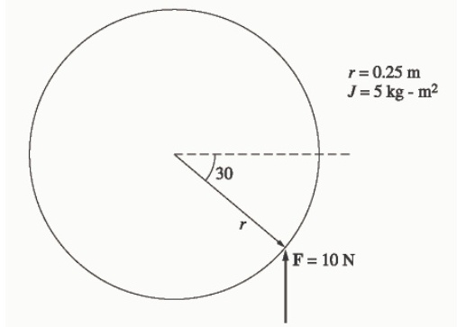

### Solution

The magnitude and the direction of the torque on this cylinder is:

$$\tau_{\text{ind}} = rF \sin\theta\text{, CCW}$$

$$\tau_{\text{ind}} = (0.25\text{ m})(10\text{ N}) \sin 30^\circ = 1.25\text{ N}\cdot\text{m}\text{, CCW}$$

The resulting angular acceleration is:

$$\alpha = \frac{\tau}{J} = \frac{1.25\text{ N}\cdot\text{m}}{5\text{ kg}\cdot\text{m}^2} = 0.25\text{ rad/s}^2$$

---

## Problem 1-4

A motor is supplying $60\text{ N}\cdot\text{m}$ of torque to its load. If the motor’s shaft is turning at $1800\text{ r/min}$, what is the mechanical power supplied to the load in watts? In horsepower?

### Solution

The mechanical power supplied to the load is:

$$P = \tau \omega = (60\text{ N}\cdot\text{m}) (1800\text{ r/min}) \left( \frac{1\text{ min}}{60\text{ s}} \right) \left( \frac{2\pi\text{ rad}}{1\text{ r}} \right) = 11,310\text{ W}$$

<!-- Page 2 (PDF Page 8) -->

$$P = (11,310\text{ W}) \left( \frac{1\text{ hp}}{746\text{ W}} \right) = 15.2\text{ hp}$$

---

## Problem 1-5

A ferromagnetic core is shown in Figure P1-2. The depth of the core is $5\text{ cm}$. The other dimensions of the core are as shown in the figure. Find the value of the current that will produce a flux of $0.005\text{ Wb}$. With this current, what is the flux density at the top of the core? What is the flux density at the right side of the core? Assume that the relative permeability of the core is $1000$.

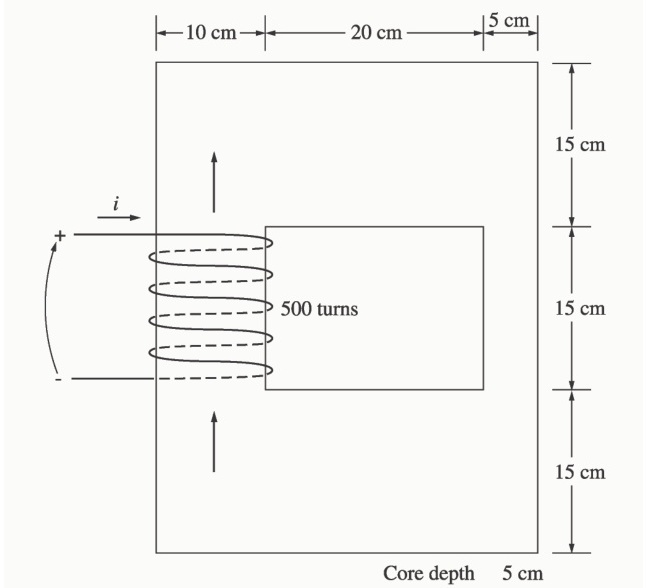

### Solution

There are three regions in this core. The top and bottom form one region, the left side forms a second region, and the right side forms a third region. If we assume that the mean path length of the flux is in the center of each leg of the core, and if we ignore spreading at the corners of the core, then the path lengths are $l_1 = 2(27.5\text{ cm}) = 55\text{ cm}$, $l_2 = 30\text{ cm}$, and $l_3 = 30\text{ cm}$. The reluctances of these regions are:

$$\mathcal{R}_1 = \frac{l}{\mu A} = \frac{l}{\mu_r \mu_0 A} = \frac{0.55\text{ m}}{(1000)(4\pi \times 10^{-7}\text{ H/m})(0.05\text{ m})(0.15\text{ m})} = 58.36\text{ kA}\cdot\text{t/Wb}$$

$$\mathcal{R}_2 = \frac{l}{\mu A} = \frac{l}{\mu_r \mu_0 A} = \frac{0.30\text{ m}}{(1000)(4\pi \times 10^{-7}\text{ H/m})(0.05\text{ m})(0.10\text{ m})} = 47.75\text{ kA}\cdot\text{t/Wb}$$

$$\mathcal{R}_3 = \frac{l}{\mu A} = \frac{l}{\mu_r \mu_0 A} = \frac{0.30\text{ m}}{(1000)(4\pi \times 10^{-7}\text{ H/m})(0.05\text{ m})(0.05\text{ m})} = 95.49\text{ kA}\cdot\text{t/Wb}$$

The total reluctance is thus:

$$\mathcal{R}_{\text{TOT}} = \mathcal{R}_1 + \mathcal{R}_2 + \mathcal{R}_3 = 58.36 + 47.75 + 95.49 = 201.6\text{ kA}\cdot\text{t/Wb}$$

and the magnetomotive force required to produce a flux of $0.005\text{ Wb}$ is:

$$\mathcal{F} = \phi \mathcal{R} = (0.005\text{ Wb})(201.6\text{ kA}\cdot\text{t/Wb}) = 1008\text{ A}\cdot\text{t}$$

and the required current is:

$$i = \frac{\mathcal{F}}{N} = \frac{1008\text{ A}\cdot\text{t}}{400\text{ t}} = 2.52\text{ A}$$

The flux density on the top of the core is:

$$B = \frac{\phi}{A} = \frac{0.005\text{ Wb}}{(0.15\text{ m})(0.05\text{ m})} = 0.67\text{ T}$$

<!-- Page 3 (PDF Page 9) -->

The flux density on the right side of the core is:

$$B = \frac{\phi}{A} = \frac{0.005\text{ Wb}}{(0.05\text{ m})(0.05\text{ m})} = 2.0\text{ T}$$

---

## Problem 1-6

A ferromagnetic core with a relative permeability of $1500$ is shown in Figure P1-3. The dimensions are as shown in the diagram, and the depth of the core is $7\text{ cm}$. The air gaps on the left and right sides of the core are $0.070$ and $0.020\text{ cm}$, respectively. Because of fringing effects, the effective area of the air gaps is $5$ percent larger than their physical size. If there are $400$ turns[^1] in the coil wrapped around the center leg of the core and if the current in the coil is $1.0\text{ A}$, what is the flux in each of the left, center, and right legs of the core? What is the flux density in each air gap?

[^1]: In the first printing, this value was given incorrectly as 300.

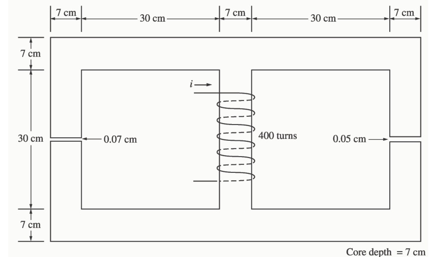

### Solution

This core can be divided up into five regions. Let $\mathcal{R}_1$ be the reluctance of the left-hand portion of the core, $\mathcal{R}_2$ be the reluctance of the left-hand air gap, $\mathcal{R}_3$ be the reluctance of the right-hand portion of the core, $\mathcal{R}_4$ be the reluctance of the right-hand air gap, and $\mathcal{R}_5$ be the reluctance of the center leg of the core. Then the total reluctance of the core is:

$$\mathcal{R}_{\text{TOT}} = \mathcal{R}_5 + \frac{(\mathcal{R}_1 + \mathcal{R}_2)(\mathcal{R}_3 + \mathcal{R}_4)}{\mathcal{R}_1 + \mathcal{R}_2 + \mathcal{R}_3 + \mathcal{R}_4}$$

$$\mathcal{R}_1 = \frac{l_1}{\mu_r \mu_0 A_1} = \frac{1.11\text{ m}}{(2000)(4\pi \times 10^{-7}\text{ H/m})(0.07\text{ m})(0.07\text{ m})} = 90.1\text{ kA}\cdot\text{t/Wb}$$

$$\mathcal{R}_2 = \frac{l_2}{\mu_0 A_2} = \frac{0.0007\text{ m}}{(4\pi \times 10^{-7}\text{ H/m})(0.07\text{ m})(0.07\text{ m})(1.05)} = 108.3\text{ kA}\cdot\text{t/Wb}$$

$$\mathcal{R}_3 = \frac{l_3}{\mu_r \mu_0 A_3} = \frac{1.11\text{ m}}{(2000)(4\pi \times 10^{-7}\text{ H/m})(0.07\text{ m})(0.07\text{ m})} = 90.1\text{ kA}\cdot\text{t/Wb}$$

$$\mathcal{R}_4 = \frac{l_4}{\mu_0 A_4} = \frac{0.0005\text{ m}}{(4\pi \times 10^{-7}\text{ H/m})(0.07\text{ m})(0.07\text{ m})(1.05)} = 77.3\text{ kA}\cdot\text{t/Wb}$$

$$\mathcal{R}_5 = \frac{l_5}{\mu_r \mu_0 A_5} = \frac{0.37\text{ m}}{(2000)(4\pi \times 10^{-7}\text{ H/m})(0.07\text{ m})(0.07\text{ m})} = 30.0\text{ kA}\cdot\text{t/Wb}$$

<!-- Page 4 (PDF Page 10) -->

The total reluctance is:

$$\mathcal{R}_{\text{TOT}} = \mathcal{R}_5 + \frac{(\mathcal{R}_1 + \mathcal{R}_2)(\mathcal{R}_3 + \mathcal{R}_4)}{\mathcal{R}_1 + \mathcal{R}_2 + \mathcal{R}_3 + \mathcal{R}_4} = 30.0 + \frac{(90.1 + 108.3)(90.1 + 77.3)}{90.1 + 108.3 + 90.1 + 77.3} = 120.8\text{ kA}\cdot\text{t/Wb}$$

The total flux in the core is equal to the flux in the center leg:

$$\phi_{\text{center}} = \phi_{\text{TOT}} = \frac{\mathcal{F}}{\mathcal{R}_{\text{TOT}}} = \frac{(400\text{ t})(1.0\text{ A})}{120.8\text{ kA}\cdot\text{t/Wb}} = 0.0033\text{ Wb}$$

The fluxes in the left and right legs can be found by the “flux divider rule”, which is analogous to the current divider rule.

$$\phi_{\text{left}} = \frac{(\mathcal{R}_3 + \mathcal{R}_4)}{\mathcal{R}_1 + \mathcal{R}_2 + \mathcal{R}_3 + \mathcal{R}_4} \phi_{\text{TOT}} = \frac{(90.1 + 77.3)}{90.1 + 108.3 + 90.1 + 77.3} (0.0033\text{ Wb}) = 0.00193\text{ Wb}$$

$$\phi_{\text{right}} = \frac{(\mathcal{R}_1 + \mathcal{R}_2)}{\mathcal{R}_1 + \mathcal{R}_2 + \mathcal{R}_3 + \mathcal{R}_4} \phi_{\text{TOT}} = \frac{(90.1 + 108.3)}{90.1 + 108.3 + 90.1 + 77.3} (0.0033\text{ Wb}) = 0.00229\text{ Wb}$$

The flux density in the air gaps can be determined from the equation $\phi = BA$:

$$B_{\text{left}} = \frac{\phi_{\text{left}}}{A_{\text{eff}}} = \frac{0.00193\text{ Wb}}{(0.07\text{ cm})(0.07\text{ cm})(1.05)} = 0.375\text{ T}$$

$$B_{\text{right}} = \frac{\phi_{\text{right}}}{A_{\text{eff}}} = \frac{0.00229\text{ Wb}}{(0.07\text{ cm})(0.07\text{ cm})(1.05)} = 0.445\text{ T}$$

---

## Problem 1-7

A two-legged core is shown in Figure P1-4. The winding on the left leg of the core ($N_1$) has $400\text{ turns}$, and the winding on the right ($N_2$) has $300\text{ turns}$. The coils are wound in the directions shown in the figure. If the dimensions are as shown, then what flux would be produced by currents $i_1 = 0.5\text{ A}$ and $i_2 = 0.75\text{ A}$? Assume $\mu_r = 1000$ and constant.

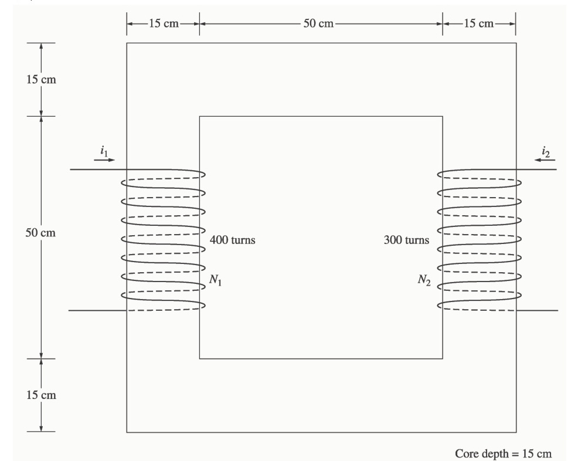

<!-- Page 5 (PDF Page 11) -->

### Solution

The two coils on this core are wound so that their magnetomotive forces are additive, so the total magnetomotive force on this core is:

$$\mathcal{F}_{\text{TOT}} = N_1 i_1 + N_2 i_2 = (400\text{ t})(0.5\text{ A}) + (300\text{ t})(0.75\text{ A}) = 425\text{ A}\cdot\text{t}$$

The total reluctance in the core is:

$$\mathcal{R}_{\text{TOT}} = \frac{l}{\mu_r \mu_0 A} = \frac{2.60\text{ m}}{(1000)(4\pi \times 10^{-7}\text{ H/m})(0.15\text{ m})(0.15\text{ m})} = 92.0\text{ kA}\cdot\text{t/Wb}$$

and the flux in the core is:

$$\phi = \frac{\mathcal{F}_{\text{TOT}}}{\mathcal{R}_{\text{TOT}}} = \frac{425\text{ A}\cdot\text{t}}{92.0\text{ kA}\cdot\text{t/Wb}} = 0.00462\text{ Wb}$$

---

## Problem 1-8

A core with three legs is shown in Figure P1-5. Its depth is $5\text{ cm}$, and there are $200\text{ turns}$ on the leftmost leg. The relative permeability of the core can be assumed to be $1500$ and constant. What flux exists in each of the three legs of the core? What is the flux density in each of the legs? Assume a $4\%$ increase in the effective area of the air gap due to fringing effects.

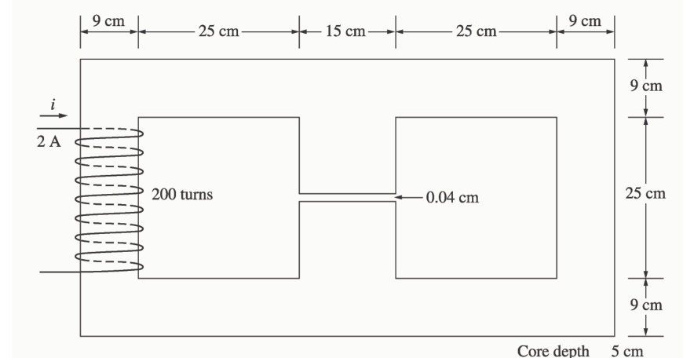

### Solution

This core can be divided up into four regions. Let $\mathcal{R}_1$ be the reluctance of the left-hand portion of the core, $\mathcal{R}_2$ be the reluctance of the center leg of the core, $\mathcal{R}_3$ be the reluctance of the center air gap, and $\mathcal{R}_4$ be the reluctance of the right-hand portion of the core. Then the total reluctance of the core is:

$$\mathcal{R}_{\text{TOT}} = \mathcal{R}_1 + \frac{(\mathcal{R}_2 + \mathcal{R}_3)\mathcal{R}_4}{\mathcal{R}_2 + \mathcal{R}_3 + \mathcal{R}_4}$$

$$\mathcal{R}_1 = \frac{l_1}{\mu_r \mu_0 A_1} = \frac{1.08\text{ m}}{(1500)(4\pi \times 10^{-7}\text{ H/m})(0.09\text{ m})(0.05\text{ m})} = 127.3\text{ kA}\cdot\text{t/Wb}$$

$$\mathcal{R}_2 = \frac{l_2}{\mu_r \mu_0 A_2} = \frac{0.34\text{ m}}{(1500)(4\pi \times 10^{-7}\text{ H/m})(0.15\text{ m})(0.05\text{ m})} = 24.0\text{ kA}\cdot\text{t/Wb}$$

$$\mathcal{R}_3 = \frac{l_3}{\mu_0 A_3} = \frac{0.0004\text{ m}}{(4\pi \times 10^{-7}\text{ H/m})(0.15\text{ m})(0.05\text{ m})(1.04)} = 40.8\text{ kA}\cdot\text{t/Wb}$$

$$\mathcal{R}_4 = \frac{l_4}{\mu_r \mu_0 A_4} = \frac{1.08\text{ m}}{(1500)(4\pi \times 10^{-7}\text{ H/m})(0.09\text{ m})(0.05\text{ m})} = 127.3\text{ kA}\cdot\text{t/Wb}$$

<!-- Page 6 (PDF Page 12) -->

The total reluctance is:

$$\mathcal{R}_{\text{TOT}} = \mathcal{R}_1 + \frac{(\mathcal{R}_2 + \mathcal{R}_3)\mathcal{R}_4}{\mathcal{R}_2 + \mathcal{R}_3 + \mathcal{R}_4} = 127.3 + \frac{(24.0 + 40.8)127.3}{24.0 + 40.8 + 127.3} = 170.2\text{ kA}\cdot\text{t/Wb}$$

The total flux in the core is equal to the flux in the left leg:

$$\phi_{\text{left}} = \phi_{\text{TOT}} = \frac{\mathcal{F}}{\mathcal{R}_{\text{TOT}}} = \frac{(200\text{ t})(2.0\text{ A})}{170.2\text{ kA}\cdot\text{t/Wb}} = 0.00235\text{ Wb}$$

The fluxes in the center and right legs can be found by the “flux divider rule”, which is analogous to the current divider rule:

$$\phi_{\text{center}} = \frac{\mathcal{R}_4}{\mathcal{R}_2 + \mathcal{R}_3 + \mathcal{R}_4} \phi_{\text{TOT}} = \frac{127.3}{24.0 + 40.8 + 127.3} (0.00235\text{ Wb}) = 0.00156\text{ Wb}$$

$$\phi_{\text{right}} = \frac{\mathcal{R}_2 + \mathcal{R}_3}{\mathcal{R}_2 + \mathcal{R}_3 + \mathcal{R}_4} \phi_{\text{TOT}} = \frac{24.0 + 40.8}{24.0 + 40.8 + 127.3} (0.00235\text{ Wb}) = 0.00079\text{ Wb}$$

The flux density in the legs can be determined from the equation $\phi = BA$:

$$B_{\text{left}} = \frac{\phi_{\text{left}}}{A} = \frac{0.00235\text{ Wb}}{(0.09\text{ cm})(0.05\text{ cm})} = 0.522\text{ T}$$

$$B_{\text{center}} = \frac{\phi_{\text{center}}}{A} = \frac{0.00156\text{ Wb}}{(0.15\text{ cm})(0.05\text{ cm})} = 0.208\text{ T}$$

$$B_{\text{right}} = \frac{\phi_{\text{left}}}{A} = \frac{0.00079\text{ Wb}}{(0.09\text{ cm})(0.05\text{ cm})} = 0.176\text{ T}$$

---

## Problem 1-9

A wire is shown in Figure P1-6 which is carrying $5.0\text{ A}$ in the presence of a magnetic field. Calculate the magnitude and direction of the force induced on the wire.

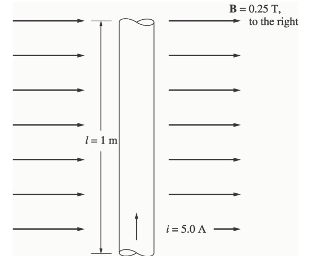

### Solution

The force on this wire can be calculated from the equation:

$$\mathbf{F} = i(\mathbf{l} \times \mathbf{B}) = ilB = (5\text{ A})(1\text{ m})(0.25\text{ T}) = 1.25\text{ N, into the page}$$

---

<!-- Page 7 (PDF Page 13) -->

## Problem 1-10

The wire is shown in Figure P1-7 is moving in the presence of a magnetic field. With the information given in the figure, determine the magnitude and direction of the induced voltage in the wire.

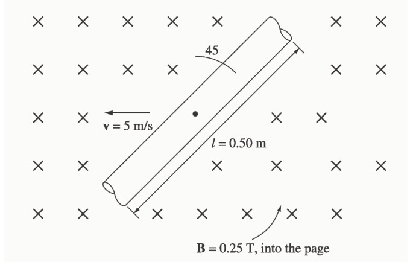

### Solution

The induced voltage on this wire can be calculated from the equation shown below. The voltage on the wire is positive downward because the vector quantity $\mathbf{v} \times \mathbf{B}$ points downward.

$$e_{\text{ind}} = (\mathbf{v} \times \mathbf{B}) \cdot \mathbf{l} = vBl \cos 45^\circ = (5\text{ m/s})(0.25\text{ T})(0.50\text{ m}) \cos 45^\circ = 0.442\text{ V, positive down}$$

---

## Problem 1-11

Repeat Problem 1-10 for the wire in Figure P1-8.

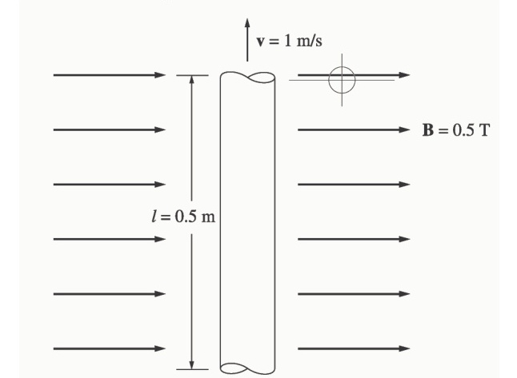

### Solution

The induced voltage on this wire can be calculated from the equation shown below. The total voltage is zero, because the vector quantity $\mathbf{v} \times \mathbf{B}$ points into the page, while the wire runs in the plane of the page.

$$e_{\text{ind}} = (\mathbf{v} \times \mathbf{B}) \cdot \mathbf{l} = vBl \cos 90^\circ = (1\text{ m/s})(0.5\text{ T})(0.5\text{ m}) \cos 90^\circ = 0\text{ V}$$

---

## Problem 1-12

The core shown in Figure P1-4 is made of a steel whose magnetization curve is shown in Figure P1-9. Repeat Problem 1-7, but this time do *not* assume a constant value of $\mu_r$. How much flux is produced in the core by the currents specified? What is the relative permeability of this core under these conditions? Was the assumption in Problem 1-7 that the relative permeability was equal to $1000$ a good assumption for these conditions? Is it a good assumption in general?

<!-- Page 8 (PDF Page 14) -->

### Solution

The magnetization curve for this core is shown below:

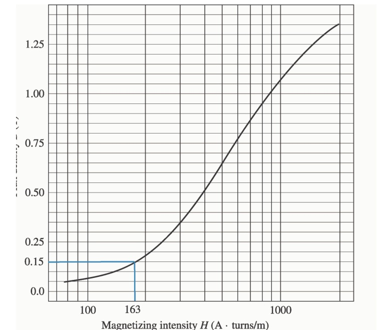

The two coils on this core are wound so that their magnetomotive forces are additive, so the total magnetomotive force on this core is:

$$\mathcal{F}_{\text{TOT}} = N_1 i_1 + N_2 i_2 = (400\text{ t})(0.5\text{ A}) + (300\text{ t})(0.75\text{ A}) = 425\text{ A}\cdot\text{t}$$

Therefore, the magnetizing intensity $H$ is:

<!-- Page 9 (PDF Page 15) -->

$$H = \frac{\mathcal{F}}{l_c} = \frac{425\text{ A}\cdot\text{t}}{2.60\text{ m}} = 163\text{ A}\cdot\text{t/m}$$

From the magnetization curve,

$$B = 0.15\text{ T}$$

and the total flux in the core is:

$$\phi_{\text{TOT}} = BA = (0.15\text{ T})(0.15\text{ m})(0.15\text{ m}) = 0.0033\text{ Wb}$$

The relative permeability of the core can be found from the reluctance as follows:

$$\mathcal{R} = \frac{\mathcal{F}_{\text{TOT}}}{\phi_{\text{TOT}}} = \frac{l}{\mu_r \mu_0 A}$$

Solving for $\mu_r$ yields:

$$\mu_r = \frac{\phi_{\text{TOT}} l}{\mathcal{F}_{\text{TOT}} \mu_0 A} = \frac{(0.0033\text{ Wb})(2.6\text{ m})}{(425\text{ A}\cdot\text{t})(4\pi \times 10^{-7}\text{ H/m})(0.15\text{ m})(0.15\text{ m})} = 714$$

The assumption that $\mu_r = 1000$ is not very good here. It is not very good in general.

---

## Problem 1-13

A core with three legs is shown in Figure P1-10. Its depth is $8\text{ cm}$, and there are $400\text{ turns}$ on the center leg. The remaining dimensions are shown in the figure. The core is composed of a steel having the magnetization curve shown in Figure 1-10c. Answer the following questions about this core:

*(a)* What current is required to produce a flux density of $0.5\text{ T}$ in the central leg of the core?  
*(b)* What current is required to produce a flux density of $1.0\text{ T}$ in the central leg of the core? Is it twice the current in part *(a)*?  
*(c)* What are the reluctances of the central and right legs of the core under the conditions in part *(a)*?  
*(d)* What are the reluctances of the central and right legs of the core under the conditions in part *(b)*?  
*(e)* What conclusion can you make about reluctances in real magnetic cores?

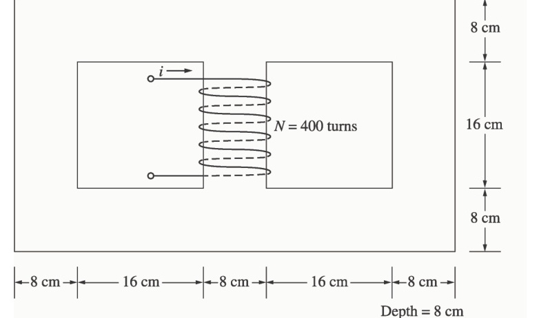

<!-- Page 10 (PDF Page 16) -->

### Solution

The magnetization curve for this core is shown below:

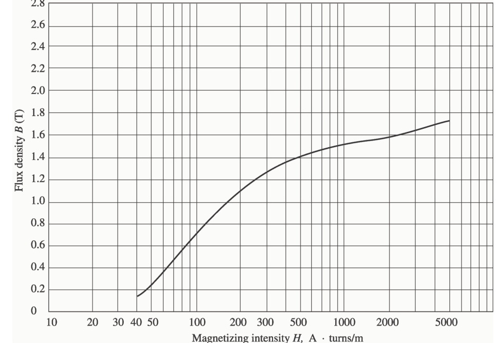

**(a)** A flux density of $0.5\text{ T}$ in the central core corresponds to a total flux of:

$$\phi_{\text{TOT}} = BA = (0.5\text{ T})(0.08\text{ m})(0.08\text{ m}) = 0.0032\text{ Wb}$$

By symmetry, the flux in each of the two outer legs must be $\phi_1 = \phi_2 = 0.0016\text{ Wb}$, and the flux density in the other legs must be:

$$B_1 = B_2 = \frac{0.0016\text{ Wb}}{(0.08\text{ m})(0.08\text{ m})} = 0.25\text{ T}$$

The magnetizing intensity $H$ required to produce a flux density of $0.25\text{ T}$ can be found from Figure 1-10c. It is $50\text{ A}\cdot\text{t/m}$. Similarly, the magnetizing intensity $H$ required to produce a flux density of $0.50\text{ T}$ is $70\text{ A}\cdot\text{t/m}$. Therefore, the total MMF needed is:

$$\mathcal{F}_{\text{TOT}} = H_{\text{center}} l_{\text{center}} + H_{\text{outer}} l_{\text{outer}}$$

$$\mathcal{F}_{\text{TOT}} = (70\text{ A}\cdot\text{t/m})(0.24\text{ m}) + (50\text{ A}\cdot\text{t/m})(0.72\text{ m}) = 52.8\text{ A}\cdot\text{t}$$

and the required current is:

$$i = \frac{\mathcal{F}_{\text{TOT}}}{N} = \frac{52.8\text{ A}\cdot\text{t}}{400\text{ t}} = 0.13\text{ A}$$

**(b)** A flux density of $1.0\text{ T}$ in the central core corresponds to a total flux of:

$$\phi_{\text{TOT}} = BA = (1.0\text{ T})(0.08\text{ m})(0.08\text{ m}) = 0.0064\text{ Wb}$$

By symmetry, the flux in each of the two outer legs must be $\phi_1 = \phi_2 = 0.0032\text{ Wb}$, and the flux density in the other legs must be:

$$B_1 = B_2 = \frac{0.0032\text{ Wb}}{(0.08\text{ m})(0.08\text{ m})} = 0.50\text{ T}$$

<!-- Page 11 (PDF Page 17) -->

The magnetizing intensity $H$ required to produce a flux density of $0.50\text{ T}$ can be found from Figure 1-10c. It is $70\text{ A}\cdot\text{t/m}$. Similarly, the magnetizing intensity $H$ required to produce a flux density of $1.00\text{ T}$ is about $160\text{ A}\cdot\text{t/m}$. Therefore, the total MMF needed is:

$$\mathcal{F}_{\text{TOT}} = H_{\text{center}} l_{\text{center}} + H_{\text{outer}} l_{\text{outer}}$$

$$\mathcal{F}_{\text{TOT}} = (160\text{ A}\cdot\text{t/m})(0.24\text{ m}) + (70\text{ A}\cdot\text{t/m})(0.72\text{ m}) = 88.8\text{ A}\cdot\text{t}$$

and the required current is:

$$i = \frac{\phi_{\text{TOT}}}{N} = \frac{88.8\text{ A}\cdot\text{t}}{400\text{ t}} = 0.22\text{ A}$$

This current is *less* than twice the current in part *(a)*.

**(c)** The reluctance of the central leg of the core under the conditions of part *(a)* is:

$$\mathcal{R}_{\text{cent}} = \frac{\mathcal{F}_{\text{TOT}}}{\phi_{\text{TOT}}} = \frac{(70\text{ A}\cdot\text{t/m})(0.24\text{ m})}{0.0032\text{ Wb}} = 5.25\text{ kA}\cdot\text{t/Wb}$$

The reluctance of the right leg of the core under the conditions of part *(a)* is:

$$\mathcal{R}_{\text{right}} = \frac{\mathcal{F}_{\text{TOT}}}{\phi_{\text{TOT}}} = \frac{(50\text{ A}\cdot\text{t/m})(0.72\text{ m})}{0.0016\text{ Wb}} = 22.5\text{ kA}\cdot\text{t/Wb}$$

**(d)** The reluctance of the central leg of the core under the conditions of part *(b)* is:

$$\mathcal{R}_{\text{cent}} = \frac{\mathcal{F}_{\text{TOT}}}{\phi_{\text{TOT}}} = \frac{(160\text{ A}\cdot\text{t/m})(0.24\text{ m})}{0.0064\text{ Wb}} = 6.0\text{ kA}\cdot\text{t/Wb}$$

The reluctance of the right leg of the core under the conditions of part *(b)* is:

$$\mathcal{R}_{\text{right}} = \frac{\mathcal{F}_{\text{TOT}}}{\phi_{\text{TOT}}} = \frac{(70\text{ A}\cdot\text{t/m})(0.72\text{ m})}{0.0032\text{ Wb}} = 15.75\text{ kA}\cdot\text{t/Wb}$$

**(e)** The reluctances in real magnetic cores are not constant.

---

## Problem 1-14

A two-legged magnetic core with an air gap is shown in Figure P1-11. The depth of the core is $5\text{ cm}$, the length of the air gap in the core is $0.06\text{ cm}$, and the number of turns on the coil is $1000$. The magnetization curve of the core material is shown in Figure P1-9. Assume a $5\text{ percent}$ increase in effective air-gap area to account for fringing. How much current is required to produce an air-gap flux density of $0.5\text{ T}$? What are the flux densities of the four sides of the core at that current? What is the total flux present in the air gap?

<!-- Page 12 (PDF Page 18) -->

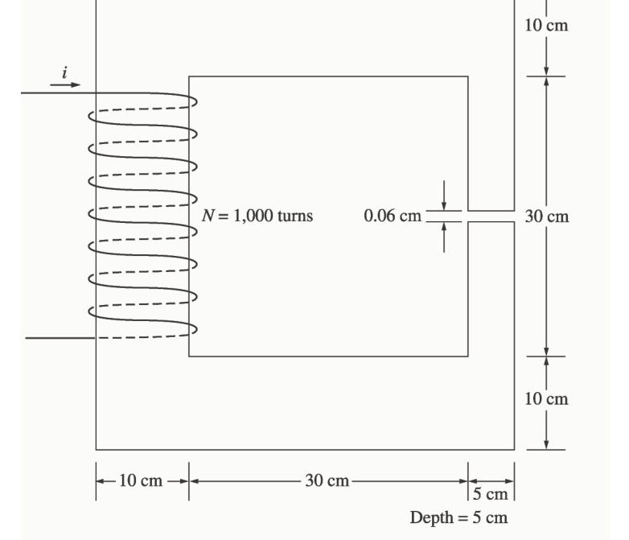

### Solution

The magnetization curve for this core is shown below:

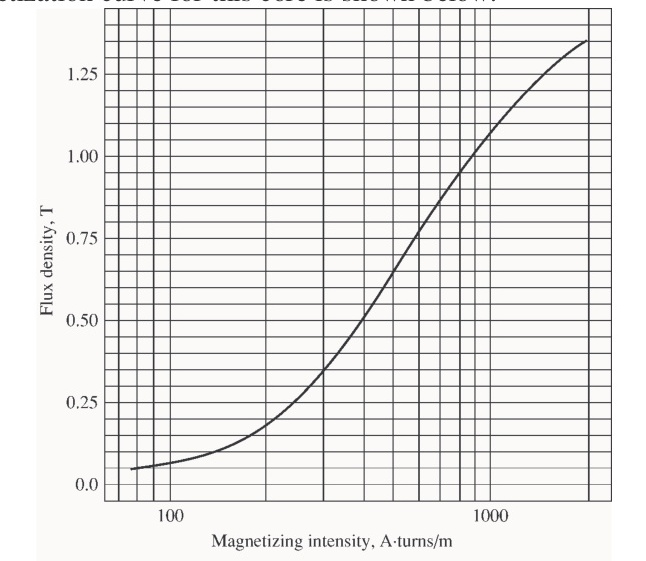

An air-gap flux density of $0.5\text{ T}$ requires a total flux of:

$$\phi = B A_{\text{eff}} = (0.5\text{ T})(0.05\text{ m})(0.05\text{ m})(1.05) = 0.00131\text{ Wb}$$

This flux requires a flux density in the right-hand leg of:

$$B_{\text{right}} = \frac{\phi}{A} = \frac{0.00131\text{ Wb}}{(0.05\text{ m})(0.05\text{ m})} = 0.524\text{ T}$$

The flux density in the other three legs of the core is:

$$B_{\text{top}} = B_{\text{left}} = B_{\text{bottom}} = \frac{\phi}{A} = \frac{0.00131\text{ Wb}}{(0.10\text{ m})(0.05\text{ m})} = 0.262\text{ T}$$

<!-- Page 13 (PDF Page 19) -->

The magnetizing intensity required to produce a flux density of $0.5\text{ T}$ in the air gap can be found from the equation $B_{\text{ag}} = \mu_0 H_{\text{ag}}$:

$$H_{\text{ag}} = \frac{B_{\text{ag}}}{\mu_0} = \frac{0.5\text{ T}}{4\pi \times 10^{-7}\text{ H/m}} = 398\text{ kA}\cdot\text{t/m}$$

The magnetizing intensity required to produce a flux density of $0.524\text{ T}$ in the right-hand leg of the core can be found from Figure P1-9 to be:

$$H_{\text{right}} = 410\text{ A}\cdot\text{t/m}$$

The magnetizing intensity required to produce a flux density of $0.262\text{ T}$ in the top, left, and bottom legs of the core can be found from Figure P1-9 to be:

$$H_{\text{top}} = H_{\text{left}} = H_{\text{bottom}} = 240\text{ A}\cdot\text{t/m}$$

The total MMF required to produce the flux is:

$$\mathcal{F}_{\text{TOT}} = H_{\text{ag}} l_{\text{ag}} + H_{\text{right}} l_{\text{right}} + H_{\text{top}} l_{\text{top}} + H_{\text{left}} l_{\text{left}} + H_{\text{bottom}} l_{\text{bottom}}$$

$$\mathcal{F}_{\text{TOT}} = (398\text{ kA}\cdot\text{t/m})(0.0006\text{ m}) + (410\text{ A}\cdot\text{t/m})(0.40\text{ m}) + 3(240\text{ A}\cdot\text{t/m})(0.40\text{ m})$$

$$\mathcal{F}_{\text{TOT}} = 278.6 + 164 + 288 = 691\text{ A}\cdot\text{t}$$

and the required current is:

$$i = \frac{\mathcal{F}_{\text{TOT}}}{N} = \frac{691\text{ A}\cdot\text{t}}{1000\text{ t}} = 0.691\text{ A}$$

The flux densities in the four sides of the core and the total flux present in the air gap were calculated above.

---

## Problem 1-15

A transformer core with an effective mean path length of $10\text{ in}$ has a $300\text{-turn}$ coil wrapped around one leg. Its cross-sectional area is $0.25\text{ in}^2$, and its magnetization curve is shown in Figure 1-10c. If current of $0.25\text{ A}$ is flowing in the coil, what is the total flux in the core? What is the flux density?

<!-- Page 14 (PDF Page 20) -->

### Solution

The magnetizing intensity applied to this core is:

$$H = \frac{\mathcal{F}}{l_c} = \frac{Ni}{l_c} = \frac{(300\text{ t})(0.25\text{ A})}{(10\text{ in})(0.0254\text{ m/in})} = 295\text{ A}\cdot\text{t/m}$$

From the magnetization curve, the flux density in the core is:

$$B = 1.27\text{ T}$$

The total flux in the core is:

$$\phi = BA = (1.27\text{ T})(0.25\text{ in}^2) \left( \frac{0.0254\text{ m}}{1\text{ in}} \right)^2 = 0.000205\text{ Wb}$$

---

## Problem 1-16

The core shown in Figure P1-2 has the flux $\phi$ shown in Figure P1-12. Sketch the voltage present at the terminals of the coil.

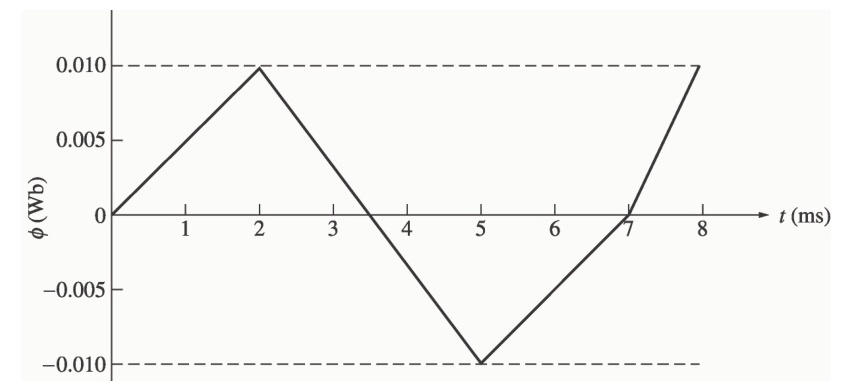

### Solution

By Lenz’ Law, an increasing flux in the direction shown on the core will produce a voltage that tends to oppose the increase. This voltage will be the same polarity as the direction shown on the core, so it will be positive. The induced voltage in the core is given by the equation:

$$e_{\text{ind}} = N \frac{d\phi}{dt}$$

so the voltage in the windings will be:

<!-- Page 15 (PDF Page 21) -->

| Time | $N \frac{d\phi}{dt}$ | $e_{\text{ind}}$ |
| :--- | :--- | :--- |
| $0 < t < 2\text{ s}$ | $(500\text{ t}) \frac{0.010\text{ Wb}}{2\text{ s}}$ | $2.50\text{ V}$ |
| $2 < t < 5\text{ s}$ | $(500\text{ t}) \frac{-0.020\text{ Wb}}{3\text{ s}}$ | $-3.33\text{ V}$ |
| $5 < t < 7\text{ s}$ | $(500\text{ t}) \frac{0.010\text{ Wb}}{2\text{ s}}$ | $2.50\text{ V}$ |
| $7 < t < 8\text{ s}$ | $(500\text{ t}) \frac{0.010\text{ Wb}}{1\text{ s}}$ | $5.00\text{ V}$ |

The resulting voltage is plotted below:

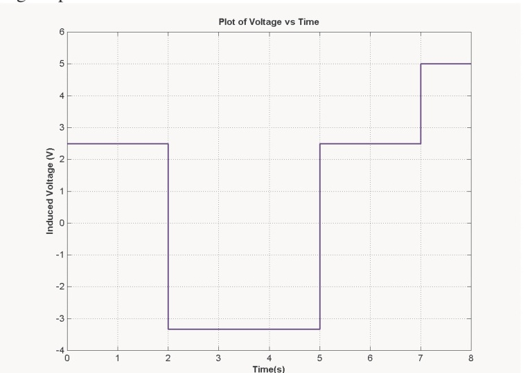

---

## Problem 1-17

Figure P1-13 shows the core of a simple dc motor. The magnetization curve for the metal in this core is given by Figure 1-10c and d. Assume that the cross-sectional area of each air gap is $18\text{ cm}^2$ and that the width of each air gap is $0.05\text{ cm}$. The effective diameter of the rotor core is $4\text{ cm}$.

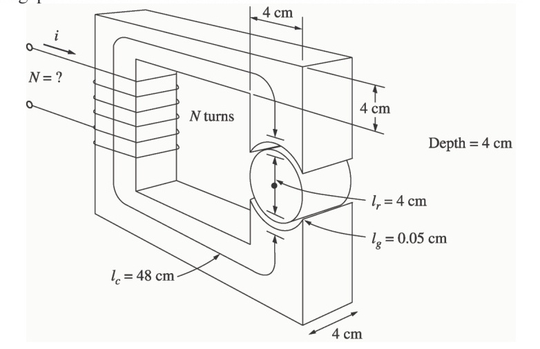

<!-- Page 16 (PDF Page 22) -->

### Solution

The magnetization curve for this core is shown below:

The relative permeability of this core is shown below:

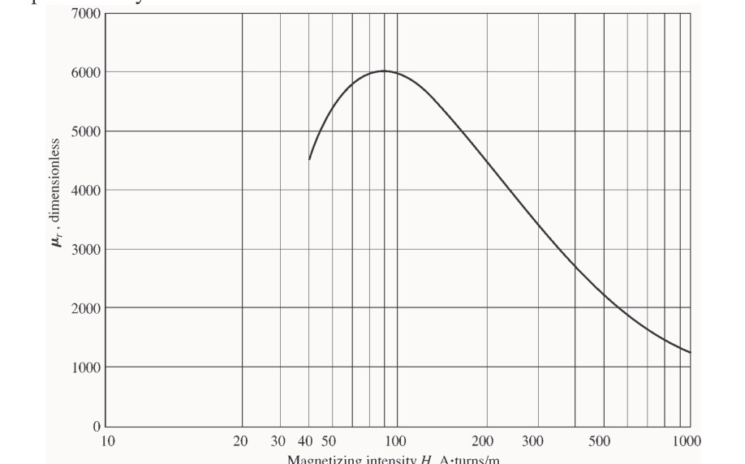

> [!NOTE]
> This is a design problem, and the answer presented here is not unique. Other values could be selected for the flux density in part *(a)*, and other numbers of turns could be selected in part *(c)*. These other answers are also correct if the proper steps were followed, and if the choices were reasonable.

**(a)** From Figure 1-10c, a reasonable maximum flux density would be about $1.2\text{ T}$. Notice that the saturation effects become significant for higher flux densities.

**(b)** At a flux density of $1.2\text{ T}$, the total flux in the core would be:

$$\phi = BA = (1.2\text{ T})(0.04\text{ m})(0.04\text{ m}) = 0.00192\text{ Wb}$$

**(c)** The total reluctance of the core is:

<!-- Page 17 (PDF Page 23) -->

$$\mathcal{R}_{\text{TOT}} = \mathcal{R}_{\text{stator}} + \mathcal{R}_{\text{air gap 1}} + \mathcal{R}_{\text{rotor}} + \mathcal{R}_{\text{air gap 2}}$$

At a flux density of $1.2\text{ T}$, the relative permeability $\mu_r$ of the stator is about $3800$, so the stator reluctance is:

$$\mathcal{R}_{\text{stator}} = \frac{l_{\text{stator}}}{\mu_{\text{stator}} A_{\text{stator}}} = \frac{0.48\text{ m}}{(3800)(4\pi \times 10^{-7}\text{ H/m})(0.04\text{ m})(0.04\text{ m})} = 62.8\text{ kA}\cdot\text{t/Wb}$$

At a flux density of $1.2\text{ T}$, the relative permeability $\mu_r$ of the rotor is $3800$, so the rotor reluctance is:

$$\mathcal{R}_{\text{rotor}} = \frac{l_{\text{rotor}}}{\mu_{\text{stator}} A_{\text{rotor}}} = \frac{0.04\text{ m}}{(3800)(4\pi \times 10^{-7}\text{ H/m})(0.04\text{ m})(0.04\text{ m})} = 5.2\text{ kA}\cdot\text{t/Wb}$$

The reluctance of both air gap 1 and air gap 2 is:

$$\mathcal{R}_{\text{air gap 1}} = \mathcal{R}_{\text{air gap 2}} = \frac{l_{\text{air gap}}}{\mu_{\text{air gap}} A_{\text{air gap}}} = \frac{0.0005\text{ m}}{(4\pi \times 10^{-7}\text{ H/m})(0.0018\text{ m}^2)} = 221\text{ kA}\cdot\text{t/Wb}$$

Therefore, the total reluctance of the core is:

$$\mathcal{R}_{\text{TOT}} = \mathcal{R}_{\text{stator}} + \mathcal{R}_{\text{air gap 1}} + \mathcal{R}_{\text{rotor}} + \mathcal{R}_{\text{air gap 2}}$$

$$\mathcal{R}_{\text{TOT}} = 62.8 + 221 + 5.2 + 221 = 510\text{ kA}\cdot\text{t/Wb}$$

The required MMF is:

$$\mathcal{F}_{\text{TOT}} = \phi \mathcal{R}_{\text{TOT}} = (0.00192\text{ Wb})(510\text{ kA}\cdot\text{t/Wb}) = 979\text{ A}\cdot\text{t}$$

Since $\mathcal{F} = Ni$, and the current is limited to $1\text{ A}$, one possible choice for the number of turns is $N = 1000$.

---

## Problem 1-18

Assume that the voltage applied to a load is $\mathbf{V} = 208\angle -30^\circ\text{ V}$ and the current flowing through the load is $\mathbf{I} = 5\angle 15^\circ\text{ A}$.

*(a)* Calculate the complex power $\mathbf{S}$ consumed by this load.  
*(b)* Is this load inductive or capacitive?  
*(c)* Calculate the power factor of this load?  
*(d)* Calculate the reactive power consumed or supplied by this load. Does the load consume reactive power from the source or supply it to the source?

### Solution

**(a)** The complex power $\mathbf{S}$ consumed by this load is:

$$\mathbf{S} = \mathbf{V}\mathbf{I}^* = (208\angle -30^\circ\text{ V})(5\angle 15^\circ\text{ A})^* = (208\angle -30^\circ\text{ V})(5\angle -15^\circ\text{ A})$$

$$\mathbf{S} = 1040\angle -45^\circ\text{ VA}$$

**(b)** This is a capacitive load.

**(c)** The power factor of this load is:

$$\text{PF} = \cos(-45^\circ) = 0.707\text{ leading}$$

**(d)** This load supplies reactive power to the source. The reactive power of the load is:

$$Q = VI \sin\theta = (208\text{ V})(5\text{ A}) \sin(-45^\circ) = -735\text{ var}$$

---

## Problem 1-19

Figure P1-14 shows a simple single-phase ac power system with three loads. The voltage source is $\mathbf{V} = 120\angle 0^\circ\text{ V}$, and the three loads are:

$$\mathbf{Z}_1 = 5\angle 30^\circ\ \Omega \qquad \mathbf{Z}_2 = 5\angle 45^\circ\ \Omega \qquad \mathbf{Z}_3 = 5\angle -90^\circ\ \Omega$$

<!-- Page 18 (PDF Page 24) -->

Answer the following questions about this power system.

*(a)* Assume that the switch shown in the figure is open, and calculate the current $\mathbf{I}$, the power factor, and the real, reactive, and apparent power being supplied by the source.  
*(b)* Assume that the switch shown in the figure is closed, and calculate the current $\mathbf{I}$, the power factor, and the real, reactive, and apparent power being supplied by the source.  
*(c)* What happened to the current flowing from the source when the switch closed? Why?

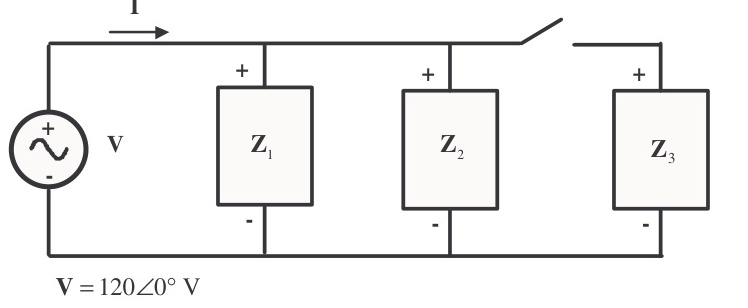

### Solution

**(a)** With the switch open, only loads 1 and 2 are connected to the source. The current $\mathbf{I}_1$ in Load 1 is:

$$\mathbf{I}_1 = \frac{120\angle 0^\circ\text{ V}}{5\angle 30^\circ\ \Omega} = 24\angle -30^\circ\text{ A}$$

The current $\mathbf{I}_2$ in Load 2 is:

$$\mathbf{I}_2 = \frac{120\angle 0^\circ\text{ V}}{5\angle 45^\circ\ \Omega} = 24\angle -45^\circ\text{ A}$$

Therefore the total current from the source is:

$$\mathbf{I} = \mathbf{I}_1 + \mathbf{I}_2 = 24\angle -30^\circ\text{ A} + 24\angle -45^\circ\text{ A} = 47.59\angle -37.5^\circ\text{ A}$$

The power factor supplied by the source is:

$$\text{PF} = \cos\theta = \cos(-37.5^\circ) = 0.793\text{ lagging}$$

The real, reactive, and apparent power supplied by the source are:

$$P = VI \cos\theta = (120\text{ V})(47.59\text{ A}) \cos(-37.5^\circ) = 4531\text{ W}$$

$$Q = VI \cos\theta = (120\text{ V})(47.59\text{ A}) \sin(-37.5^\circ) = -3477\text{ var}$$

$$S = VI = (120\text{ V})(47.59\text{ A}) = 5711\text{ VA}$$

**(b)** With the switch open, all three loads are connected to the source. The current in Loads 1 and 2 is the same as before. The current $\mathbf{I}_3$ in Load 3 is:

$$\mathbf{I}_3 = \frac{120\angle 0^\circ\text{ V}}{5\angle -90^\circ\ \Omega} = 24\angle 90^\circ\text{ A}$$

Therefore the total current from the source is:

$$\mathbf{I} = \mathbf{I}_1 + \mathbf{I}_2 + \mathbf{I}_3 = 24\angle -30^\circ\text{ A} + 24\angle -45^\circ\text{ A} + 24\angle 90^\circ\text{ A} = 38.08\angle -7.5^\circ\text{ A}$$

The power factor supplied by the source is:

$$\text{PF} = \cos\theta = \cos(-7.5^\circ) = 0.991\text{ lagging}$$

The real, reactive, and apparent power supplied by the source are:

$$P = VI \cos\theta = (120\text{ V})(38.08\text{ A}) \cos(-7.5^\circ) = 4531\text{ W}$$

<!-- Page 19 (PDF Page 25) -->

$$Q = VI \cos\theta = (120\text{ V})(38.08\text{ A}) \sin(-7.5^\circ) = -596\text{ var}$$

$$S = VI = (120\text{ V})(38.08\text{ A}) = 4570\text{ VA}$$

**(c)** The current flowing *decreased* when the switch closed, because most of the reactive power being consumed by Loads 1 and 2 is being supplied by Load 3. Since less reactive power has to be supplied by the source, the total current flow decreases.

---

## Problem 1-20

Demonstrate that Equation (1-59) can be derived from Equation (1-58) using simple trigonometric identities:

$$p(t) = v(t) i(t) = 2VI \cos \omega t \cos(\omega t - \theta) \tag{1-58}$$

$$p(t) = VI \cos\theta (1 + \cos 2\omega t) + VI \sin\theta \sin 2\omega t \tag{1-59}$$

### Solution

The first step is to apply the following identity:

$$\cos\alpha \cos\beta = \frac{1}{2} \cos(\alpha - \beta) + \frac{1}{2} \cos(\alpha + \beta)$$

The result is:

$$p(t) = v(t) i(t) = 2VI \cos \omega t \cos(\omega t - \theta)$$

$$p(t) = 2VI \left[ \frac{1}{2} \cos(\omega t - \omega t + \theta) + \frac{1}{2} \cos(\omega t + \omega t - \theta) \right]$$

$$p(t) = VI \cos\theta + VI \cos(2\omega t - \theta)$$

Now we must apply the angle addition identity to the second term:

$$\cos(\alpha - \beta) = \cos\alpha \cos\beta + \sin\alpha \sin\beta$$

The result is:

$$p(t) = VI [\cos\theta + \cos 2\omega t \cos\theta + \sin 2\omega t \sin\theta]$$

Collecting terms yields the final result:

$$p(t) = VI \cos\theta (1 + \cos 2\omega t) + VI \sin\theta \sin 2\omega t$$

---

## Problem 1-21

A linear machine has a magnetic flux density of $0.5\text{ T}$ directed into the page, a resistance of $0.25\ \Omega$, a bar length $l = 1.0\text{ m}$, and a battery voltage of $100\text{ V}$.

*(a)* What is the initial force on the bar at starting? What is the initial current flow?  
*(b)* What is the no-load steady-state speed of the bar?  
*(c)* If the bar is loaded with a force of $25\text{ N}$ opposite to the direction of motion, what is the new steady-state speed? What is the efficiency of the machine under these circumstances?

<!-- Page 20 (PDF Page 26) -->

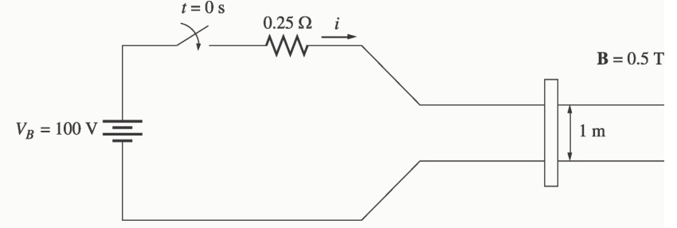

### Solution

**(a)** The current in the bar at starting is:

$$i = \frac{V_B}{R} = \frac{100\text{ V}}{0.25\ \Omega} = 400\text{ A}$$

Therefore, the force on the bar at starting is:

$$\mathbf{F} = i(\mathbf{l} \times \mathbf{B}) = (400\text{ A})(1\text{ m})(0.5\text{ T}) = 200\text{ N, to the right}$$

**(b)** The no-load steady-state speed of this bar can be found from the equation:

$$V_B = e_{\text{ind}} = vBl$$

$$v = \frac{V_B}{Bl} = \frac{100\text{ V}}{(0.5\text{ T})(1\text{ m})} = 200\text{ m/s}$$

**(c)** With a load of $25\text{ N}$ opposite to the direction of motion, the steady-state current flow in the bar will be given by:

$$F_{\text{app}} = F_{\text{ind}} = ilB$$

$$i = \frac{F_{\text{app}}}{Bl} = \frac{25\text{ N}}{(0.5\text{ T})(1\text{ m})} = 50\text{ A}$$

The induced voltage in the bar will be:

$$e_{\text{ind}} = V_B - iR = 100\text{ V} - (50\text{ A})(0.25\ \Omega) = 87.5\text{ V}$$

and the velocity of the bar will be:

$$v = \frac{V_B}{Bl} = \frac{87.5\text{ V}}{(0.5\text{ T})(1\text{ m})} = 175\text{ m/s}$$

The *input* power to the linear machine under these conditions is:

$$P_{\text{in}} = V_B i = (100\text{ V})(50\text{ A}) = 5000\text{ W}$$

The *output* power from the linear machine under these conditions is:

$$P_{\text{out}} = V_B i = (87.5\text{ V})(50\text{ A}) = 4375\text{ W}$$

Therefore, the efficiency of the machine under these conditions is:

$$\eta = \frac{P_{\text{out}}}{P_{\text{in}}} \times 100\% = \frac{4375\text{ W}}{5000\text{ W}} \times 100\% = 87.5\%$$

---

## Problem 1-22

A linear machine has the following characteristics:

$$B = 0.33\text{ T into page} \qquad R = 0.50\ \Omega$$

<!-- Page 21 (PDF Page 27) -->

$$l = 0.5\text{ m} \qquad V_B = 120\text{ V}$$

*(a)* If this bar has a load of $10\text{ N}$ attached to it opposite to the direction of motion, what is the steady-state speed of the bar?  
*(b)* If the bar runs off into a region where the flux density falls to $0.30\text{ T}$, what happens to the bar? What is its final steady-state speed?  
*(c)* Suppose $V_B$ is now decreased to $80\text{ V}$ with everything else remaining as in part *(b)*. What is the new steady-state speed of the bar?  
*(d)* From the results for parts *(b)* and *(c)*, what are two methods of controlling the speed of a linear machine (or a real dc motor)?

### Solution

**(a)** With a load of $10\text{ N}$ opposite to the direction of motion, the steady-state current flow in the bar will be given by:

$$F_{\text{app}} = F_{\text{ind}} = ilB$$

$$i = \frac{F_{\text{app}}}{Bl} = \frac{10\text{ N}}{(0.33\text{ T})(0.5\text{ m})} = 60.5\text{ A}$$

The induced voltage in the bar will be:

$$e_{\text{ind}} = V_B - iR = 120\text{ V} - (60.5\text{ A})(0.50\ \Omega) = 89.75\text{ V}$$

and the velocity of the bar will be:

$$v = \frac{e_{\text{ind}}}{Bl} = \frac{89.75\text{ V}}{(0.33\text{ T})(0.5\text{ m})} = 544\text{ m/s}$$

**(b)** If the flux density drops to $0.30\text{ T}$ while the load on the bar remains the same, there will be a speed transient until $F_{\text{app}} = F_{\text{ind}} = 10\text{ N}$ again. The new steady state current will be:

$$F_{\text{app}} = F_{\text{ind}} = ilB$$

$$i = \frac{F_{\text{app}}}{Bl} = \frac{10\text{ N}}{(0.30\text{ T})(0.5\text{ m})} = 66.7\text{ A}$$

The induced voltage in the bar will be:

$$e_{\text{ind}} = V_B - iR = 120\text{ V} - (66.7\text{ A})(0.50\ \Omega) = 86.65\text{ V}$$

and the velocity of the bar will be:

$$v = \frac{e_{\text{ind}}}{Bl} = \frac{86.65\text{ V}}{(0.30\text{ T})(0.5\text{ m})} = 577\text{ m/s}$$

**(c)** If the battery voltage is decreased to $80\text{ V}$ while the load on the bar remains the same, there will be a speed transient until $F_{\text{app}} = F_{\text{ind}} = 10\text{ N}$ again. The new steady state current will be:

$$F_{\text{app}} = F_{\text{ind}} = ilB$$

$$i = \frac{F_{\text{app}}}{Bl} = \frac{10\text{ N}}{(0.30\text{ T})(0.5\text{ m})} = 66.7\text{ A}$$

The induced voltage in the bar will be:

<!-- Page 22 (PDF Page 28) -->

$$e_{\text{ind}} = V_B - iR = 80\text{ V} - (66.7\text{ A})(0.50\ \Omega) = 46.65\text{ V}$$

and the velocity of the bar will be:

$$v = \frac{e_{\text{ind}}}{Bl} = \frac{46.65\text{ V}}{(0.30\text{ T})(0.5\text{ m})} = 311\text{ m/s}$$

**(d)** From the results of the two previous parts, we can see that there are two ways to control the speed of a linear dc machine. *Reducing* the flux density $B$ of the machine *increases* the steady-state speed, and *reducing* the battery voltage $V_B$ *decreases* the steady-state speed of the machine. Both of these speed control methods work for real dc machines as well as for linear machines.
