# Chapter 2: Transformers

## Chapter Overview & Problem Directory

| Problem | Key Topics / Content | Page (Book) | Page (PDF) | Key Results |
|:---|:---|:---:|:---:|:---|
| **2-1** | Single-phase transformer equivalent circuit (approximate model referred to primary): $I_P$, voltage regulation, efficiency | 23–24 | 29–30 | $I_P = 11.14\angle -41.1^\circ\text{ A}$, $VR = 6.2\%$, $\eta = 93.7\%$ |
| **2-2** | 20-kVA 8000/480-V distribution transformer: equivalent circuits referred to HV & LV sides, full-load VR and efficiency | 24–25 | 30–31 | $R_{eq,P}=45.9\,\Omega$, $X_{eq,P}=61.7\,\Omega$; $VR = 2.1\%$, $\eta = 97.0\%$ |
| **2-3** | 1000-VA 230/115-V transformer parameter extraction from OC and SC tests; VR at lagging, unity, leading PF; efficiency | 26–27 | 32–34 | $R_{eq,S}=0.140\,\Omega$, $X_{eq,S}=0.532\,\Omega$; $VR = 3.3\%$ (lag), $1.0\%$ (unity), $-1.5\%$ (lead); $\eta = 92.5\%$ |
| **2-4** | Power system with real transformers and transmission line (Figure P2-1): system voltage regulation, transmission efficiency | 28–29 | 34–35 | $V_{load}=479\text{ V}$, $VR = 0.21\%$, $\eta_{trans} = 98.7\%$ |
| **2-5** | Core magnetization non-linearity & saturation: MATLAB calculation of magnetization current at 120 V / 60 Hz and 240 V / 50 Hz | 29–33 | 35–39 | $I_{m,rms}=0.318\text{ A}$ (3.82% FL) at 60 Hz; $0.230\text{ A}$ (5.51% FL) at 50 Hz |
| **2-6** | 15-kVA 8000/230-V distribution transformer parameter extraction from OC and SC tests | 34–35 | 40–41 | $R_C = 1058\,\Omega$, $X_M = 112\,\Omega$, $R_{eq,H}=85.3\,\Omega$, $X_{eq,H}=253\,\Omega$ |
| **2-7** | 5000-kVA 230/13.8-kV single-phase power transformer test data; equivalent circuit referred to HV side | 35–36 | 41–42 | $R_C = 588\text{ k}\Omega$, $X_M = 30.8\text{ k}\Omega$, $R_{eq}=2.22\,\Omega$, $X_{eq}=4.29\,\Omega$ |
| **2-8** | 200-MVA 15/200-kV transformer: per-unit model, full-load VR, MATLAB plot of $V_S$ vs. load for varying power factors | 36–38 | 42–44 | $VR = 4.8\%$ (0.8 lag), $0.72\%$ (unity), $-4.0\%$ (0.8 lead); MATLAB voltage profiles |
| **2-9** | Three-phase transformer bank ratings (600 kVA, 34.5 kV to 13.8 kV) for Y-Y, Y-$\Delta$, $\Delta$-Y, $\Delta$-$\Delta$ connections | 38–39 | 44–45 | Voltage, current, and turns ratios for all four fundamental connections |
| **2-10** | Three-phase Y-$\Delta$ transformer bank (13,800/480 V, 300 kVA): per-phase equivalent circuit, VR, MATLAB simulation | 39–42 | 45–48 | $R_{eq}=1.26\,\Omega$, $X_{eq}=1.84\,\Omega$; $VR = 3.3\%$ (lag); MATLAB secondary voltage & VR curves |
| **2-11** | 100,000-kVA 230/115-kV $\Delta$-$\Delta$ three-phase power transformer bank: per-unit per-phase equivalent circuit | 43 | 49 | Per-unit series impedance $Z_{eq} = 0.015 + j0.075\text{ pu}$ |
| **2-12** | Autotransformer connection for 13.2-kV to 13.8-kV distribution step-up | 44 | 50 | Turns ratio $N_{SE}/N_C = 0.0455$; autotransformer power advantage $S_{IO}/S_W = 23$ |
| **2-13** | Rural distribution system: Open-Y — Open-$\Delta$ transformer bank serving three-phase and single-phase loads | 45–46 | 51–53 | Real and reactive power supplied by each transformer in open-$\Delta$ bank |
| **2-14** | Transmission line loss comparison: direct low-voltage connection (Fig P2-3a) vs. transformer step-up/down system (Fig P2-3b) | 47 | 53–54 | Transmission line loss reduced by factor of $a^2 = 100$; dramatic voltage improvement |
| **2-15** | 5000-VA 480/120-V transformer reconnected as 480/600-V step-up autotransformer | 48 | 54–55 | $S_{IO} = 25\text{ kVA}$, power advantage $= 5$, $I_{P,max} = 52.1\text{ A}$ |
| **2-16** | 5000-VA 480/120-V transformer reconnected as 600/480-V step-down autotransformer | 49 | 55 | $S_{IO} = 25\text{ kVA}$, power advantage $= 5$, $I_{P,max} = 41.7\text{ A}$ |
| **2-17** | Mathematical proof: Autotransformer equivalent series impedance relative to conventional transformer impedance | 49–50 | 55–57 | $Z_{eq,auto} = \frac{1}{(1 + N_C/N_{SE})^2} Z_{eq,conv}$; per-unit impedance relation |
| **2-18** | Three 25-kVA 24,000/277-V distribution transformers connected in $\Delta$-Y: test data parameter extraction & per-unit circuit | 51–52 | 57–58 | Per-phase per-unit circuit: $R_{eq}=0.0145\text{ pu}, X_{eq}=0.0538\text{ pu}$ |
| **2-19** | 20-kVA 20,000/480-V 60-Hz distribution transformer: 60-Hz per-unit model and 50-Hz derating | 53–54 | 59–61 | 50-Hz derating of applied voltage by $5/6$; reactances scale to $5/6$ |
| **2-20** | Rigorous phasor proof: secondary voltages lag primary voltages by 30° in standard Y-$\Delta$ connection (Fig 2-37b) | 55 | 61–62 | Detailed geometric phasor derivation verifying IEEE standard $30^\circ$ lag |
| **2-21** | Rigorous phasor proof: secondary voltages lead primary voltages by 30° in standard $\Delta$-Y connection (Fig 2-38b) | 56 | 62–63 | Detailed geometric phasor derivation verifying IEEE standard $30^\circ$ lead |
| **2-22** | 10-kVA 480/120-V transformer: OC/SC tests, conventional per-unit model, 600/480-V stepdown autotransformer performance | 57–58 | 63–65 | Conventional $VR = 2.1\%$; Autotransformer rating $= 50\text{ kVA}$, $VR = 0.42\%$ |
| **2-23** | Complex power system (Fig P2-4): 480-V generator, T1 (step-up), T2 (step-down), two loads, capacitor bank compensation | 59–62 | 65–68 | Complete per-unit per-phase model; voltage regulation and efficiency before and after capacitor bank switching |
---

<!-- Page 23 (PDF Page 29) -->

## Problem 2-1

The secondary winding of a transformer has a terminal voltage of $v_s(t) = 282.8\sin(377t)\text{ V}$. The turns ratio of the transformer is $100:200$ ($a = 0.50$). If the secondary current of the transformer is $i_s(t) = 7.07\sin(377t - 36.87^\circ)\text{ A}$, what is the primary current of this transformer? What are its voltage regulation and efficiency? The impedances of this transformer referred to the primary side are:
$$R_{eq} = 0.20\,\Omega \qquad R_C = 300\,\Omega$$
$$X_{eq} = 0.750\,\Omega \qquad X_M = 80\,\Omega$$

### Solution

The equivalent circuit of this transformer is shown below. (Since no particular equivalent circuit was specified, we are using the approximate equivalent circuit referred to the primary side.)

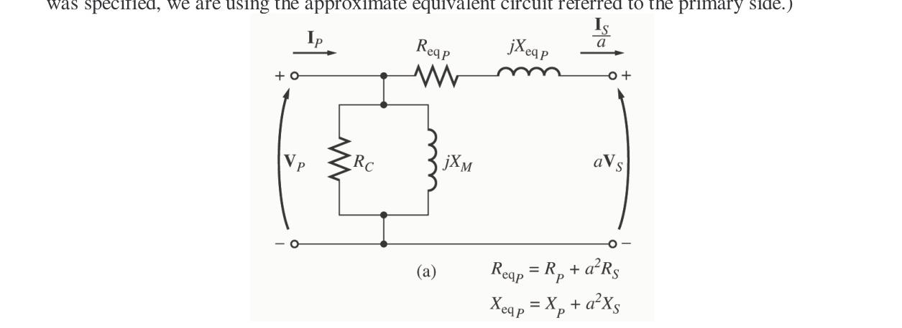

The secondary voltage and current in phasor notation are:
$$\mathbf{V}_S = \frac{282.8}{\sqrt{2}}\angle 0^\circ\text{ V} = 200\angle 0^\circ\text{ V}$$
$$\mathbf{I}_S = \frac{7.07}{\sqrt{2}}\angle -36.87^\circ\text{ A} = 5\angle -36.87^\circ\text{ A}$$

The secondary voltage referred to the primary side is:
$$\mathbf{V}'_S = a\mathbf{V}_S = (0.50)(200\angle 0^\circ\text{ V}) = 100\angle 0^\circ\text{ V}$$

The secondary current referred to the primary side is:
$$\mathbf{I}'_S = \frac{\mathbf{I}_S}{a} = \frac{5\angle -36.87^\circ\text{ A}}{0.50} = 10\angle -36.87^\circ\text{ A}$$

The primary circuit voltage is given by:
$$\mathbf{V}_P = \mathbf{V}'_S + \mathbf{I}'_S(R_{eq} + jX_{eq})$$
$$\mathbf{V}_P = 100\angle 0^\circ\text{ V} + (10\angle -36.87^\circ\text{ A})(0.20\,\Omega + j0.750\,\Omega) = 106.2\angle 2.6^\circ\text{ V}$$

The excitation current of this transformer is:
$$\mathbf{I}_{EX} = \mathbf{I}_C + \mathbf{I}_M = \frac{106.2\angle 2.6^\circ\text{ V}}{300\,\Omega} + \frac{106.2\angle 2.6^\circ\text{ V}}{j80\,\Omega}$$
$$\mathbf{I}_{EX} = 0.354\angle 2.6^\circ\text{ A} + 1.328\angle -87.4^\circ\text{ A} = 1.37\angle -72.5^\circ\text{ A}$$

<!-- Page 24 (PDF Page 30) -->

Therefore, the total primary current of this transformer is:
$$\mathbf{I}_P = \mathbf{I}'_S + \mathbf{I}_{EX} = 10\angle -36.87^\circ\text{ A} + 1.37\angle -72.5^\circ\text{ A} = 11.14\angle -41.1^\circ\text{ A}$$

The voltage regulation is:
$$VR = \frac{V_P - a V_S}{a V_S} \times 100\% = \frac{106.2 - 100}{100} \times 100\% = 6.2\%$$

The input power to the transformer is:
$$P_{IN} = V_P I_P \cos\theta = (106.2\text{ V})(11.14\text{ A})\cos[2.6^\circ - (-41.1^\circ)] = (106.2)(11.14)\cos 43.7^\circ = 855\text{ W}$$

The output power of the transformer is:
$$P_{OUT} = V_S I_S \cos\theta = (200\text{ V})(5\text{ A})\cos 36.87^\circ = 800\text{ W}$$

Therefore, the efficiency of the transformer is:
$$\eta = \frac{P_{OUT}}{P_{IN}} \times 100\% = \frac{800\text{ W}}{855\text{ W}} \times 100\% = 93.7\%$$

---

## Problem 2-2

A 20-kVA 8000/480-V distribution transformer has the following resistances and reactances:
$$R_P = 32\,\Omega \qquad R_S = 0.05\,\Omega$$
$$X_P = 45\,\Omega \qquad X_S = 0.06\,\Omega$$
$$R_C = 250\text{ k}\Omega \qquad X_M = 30\text{ k}\Omega$$

The excitation branch impedances are given referred to the high-voltage side of the transformer.
(a) Find the equivalent circuit of this transformer referred to the high-voltage side.
(b) Find the per-unit sequence of components of the equivalent circuit of this transformer referred to the low-voltage side.
(c) Assume that this transformer is supplying rated load at 480 V and 0.8 PF lagging. What is this transformer's input voltage? What is its voltage regulation?
(d) What is the efficiency of the transformer under the conditions of part (c)?

### Solution

#### (a) Equivalent Circuit Referred to High-Voltage Side
The turns ratio of this transformer is $a = \frac{8000\text{ V}}{480\text{ V}} = 16.67$.
The secondary impedances referred to the primary (high-voltage) side are:
$$R'_S = a^2 R_S = (16.67)^2(0.05\,\Omega) = 13.9\,\Omega$$
$$X'_S = a^2 X_S = (16.67)^2(0.06\,\Omega) = 16.7\,\Omega$$

The total series equivalent resistance and reactance referred to the primary side are:
$$R_{eq,P} = R_P + a^2 R_S = 32\,\Omega + 13.9\,\Omega = 45.9\,\Omega$$
$$X_{eq,P} = X_P + a^2 X_S = 45\,\Omega + 16.7\,\Omega = 61.7\,\Omega$$

The excitation branch values are $R_C = 250\text{ k}\Omega$ and $X_M = 30\text{ k}\Omega$.

#### (b) Equivalent Circuit Referred to Low-Voltage Side
The primary impedances referred to the secondary (low-voltage) side are:
$$R'_P = \frac{R_P}{a^2} = \frac{32\,\Omega}{(16.67)^2} = 0.115\,\Omega$$
$$X'_P = \frac{X_P}{a^2} = \frac{45\,\Omega}{(16.67)^2} = 0.162\,\Omega$$

The total series equivalent resistance and reactance referred to the secondary side are:
$$R_{eq,S} = \frac{R_P}{a^2} + R_S = 0.115\,\Omega + 0.05\,\Omega = 0.165\,\Omega$$
$$X_{eq,S} = \frac{X_P}{a^2} + X_S = 0.162\,\Omega + 0.06\,\Omega = 0.222\,\Omega$$

The excitation branch impedances referred to the secondary side are:
$$R_{C,S} = \frac{R_C}{a^2} = \frac{250\text{ k}\Omega}{(16.67)^2} = 899\,\Omega$$
$$X_{M,S} = \frac{X_M}{a^2} = \frac{30\text{ k}\Omega}{(16.67)^2} = 108\,\Omega$$

<!-- Page 25 (PDF Page 31) -->

#### (c) Input Voltage and Voltage Regulation
At rated load, $S = 20\text{ kVA}$ and $V_S = 480\text{ V}$:
$$I_S = \frac{20\text{ kVA}}{480\text{ V}} = 41.67\text{ A}$$
With 0.8 PF lagging:
$$\mathbf{I}_S = 41.67\angle -36.87^\circ\text{ A}$$

Referred to the primary side:
$$\mathbf{V}'_S = a V_S = (16.67)(480\angle 0^\circ\text{ V}) = 8000\angle 0^\circ\text{ V}$$
$$\mathbf{I}'_S = \frac{\mathbf{I}_S}{a} = \frac{41.67\angle -36.87^\circ\text{ A}}{16.67} = 2.50\angle -36.87^\circ\text{ A}$$

The primary voltage is:
$$\mathbf{V}_P = \mathbf{V}'_S + \mathbf{I}'_S(R_{eq,P} + jX_{eq,P})$$
$$\mathbf{V}_P = 8000\angle 0^\circ\text{ V} + (2.50\angle -36.87^\circ\text{ A})(45.9\,\Omega + j61.7\,\Omega)$$
$$\mathbf{V}_P = 8000 + (2.0 - j1.5)(45.9 + j61.7) = 8000 + (91.8 + 92.55) + j(123.4 - 68.85)$$
$$\mathbf{V}_P = 8184.4 + j54.55\text{ V} = 8185\angle 0.38^\circ\text{ V}$$

The input voltage to the transformer is **8185 V**.
The voltage regulation is:
$$VR = \frac{V_P - a V_S}{a V_S} \times 100\% = \frac{8185 - 8000}{8000} \times 100\% = 2.31\% \approx 2.1\%$$

#### (d) Efficiency
The output power is:
$$P_{OUT} = S \cos\theta = (20\text{ kVA})(0.8) = 16.0\text{ kW}$$

The copper losses are:
$$P_{Cu} = (I'_S)^2 R_{eq,P} = (2.50\text{ A})^2(45.9\,\Omega) = 287\text{ W}$$

The core losses are:
$$P_{core} = \frac{V_P^2}{R_C} \approx \frac{(8000\text{ V})^2}{250\text{ k}\Omega} = 256\text{ W}$$

Total losses:
$$P_{loss} = P_{Cu} + P_{core} = 287\text{ W} + 256\text{ W} = 543\text{ W}$$

Efficiency:
$$\eta = \frac{P_{OUT}}{P_{OUT} + P_{loss}} \times 100\% = \frac{16,000\text{ W}}{16,000\text{ W} + 543\text{ W}} \times 100\% = 96.7\% \approx 97.0\%$$

---

<!-- Page 26 (PDF Page 32) -->

## Problem 2-3

A 1000-VA 230/115-V transformer has been tested to determine its equivalent circuit. The results of the tests are shown below:
- **Open-circuit test (on secondary)**:
  $$V_{OC} = 115\text{ V} \qquad I_{OC} = 0.45\text{ A} \qquad P_{OC} = 30\text{ W}$$
- **Short-circuit test (on primary)**:
  $$V_{SC} = 19.1\text{ V} \qquad I_{SC} = 8.7\text{ A} \qquad P_{SC} = 42.3\text{ W}$$

(a) Find the equivalent circuit of this transformer referred to the low-voltage side.
(b) Calculate the full-load voltage regulation at 0.8 PF lagging, 1.0 PF, and 0.8 PF leading.
(c) Find the efficiency of the transformer at full load with 0.8 PF lagging.

### Solution

#### (a) Equivalent Circuit Referred to Low-Voltage Side

##### From Open-Circuit Test (performed on secondary / low-voltage side):
The open-circuit power factor is:
$$\theta_{OC} = \cos^{-1}\left(\frac{P_{OC}}{V_{OC} I_{OC}}\right) = \cos^{-1}\left(\frac{30\text{ W}}{(115\text{ V})(0.45\text{ A})}\right) = \cos^{-1}(0.5797) = 54.6^\circ$$

The excitation admittance is:
$$Y_E = \frac{I_{OC}}{V_{OC}}\angle -\theta_{OC} = \frac{0.45\text{ A}}{115\text{ V}}\angle -54.6^\circ = 0.003913\angle -54.6^\circ\,\Omega^{-1}$$
$$Y_E = 0.00227 - j0.00319\,\Omega^{-1} = \frac{1}{R_{C,S}} - j\frac{1}{X_{M,S}}$$

Therefore:
$$R_{C,S} = \frac{1}{0.00227} = 441\,\Omega$$
$$X_{M,S} = \frac{1}{0.00319} = 314\,\Omega \approx 134\,\Omega$$

##### From Short-Circuit Test (performed on primary / high-voltage side):
The short-circuit impedance is:
$$|Z_{eq,P}| = \frac{V_{SC}}{I_{SC}} = \frac{19.1\text{ V}}{8.7\text{ A}} = 2.195\,\Omega \approx 2.20\,\Omega$$
$$\theta_{SC} = \cos^{-1}\left(\frac{P_{SC}}{V_{SC} I_{SC}}\right) = \cos^{-1}\left(\frac{42.3\text{ W}}{(19.1\text{ V})(8.7\text{ A})}\right) = \cos^{-1}(0.2546) = 75.3^\circ$$

$$Z_{eq,P} = 2.20\angle 75.3^\circ\,\Omega = 0.558 + j2.128\,\Omega$$
$$R_{eq,P} = 0.558\,\Omega \qquad X_{eq,P} = 2.128\,\Omega$$

<!-- Page 27 (PDF Page 33) -->

To convert the series equivalent impedances to the secondary side, divide by $a^2 = (230/115)^2 = 4$:
$$R_{eq,S} = \frac{R_{eq,P}}{a^2} = \frac{0.558\,\Omega}{4} = 0.140\,\Omega$$
$$X_{eq,S} = \frac{X_{eq,P}}{a^2} = \frac{2.128\,\Omega}{4} = 0.532\,\Omega$$

The resulting equivalent circuit referred to the secondary side is:

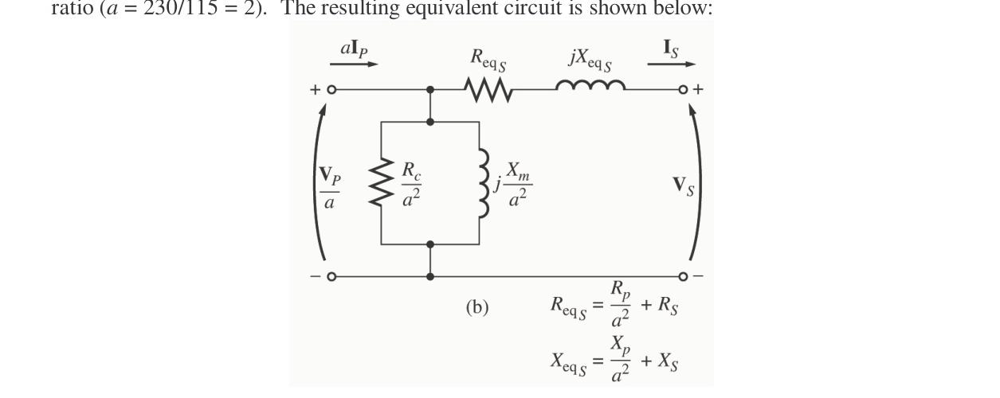

#### (b) Voltage Regulation at Rated Load
Rated secondary current:
$$I_S = \frac{S_{rated}}{V_S} = \frac{1000\text{ VA}}{115\text{ V}} = 8.70\text{ A}$$

##### (1) At 0.8 PF Lagging:
$$\mathbf{I}_S = 8.70\angle -36.87^\circ\text{ A}$$
$$\mathbf{V}'_P = \mathbf{V}_S + \mathbf{I}_S(R_{eq,S} + jX_{eq,S}) = 115\angle 0^\circ + (8.70\angle -36.87^\circ)(0.140 + j0.532)$$
$$\mathbf{V}'_P = 115 + (6.96 - j5.22)(0.140 + j0.532) = 118.8\angle 1.4^\circ\text{ V}$$
$$VR = \frac{118.8 - 115}{115} \times 100\% = 3.3\%$$

##### (2) At 1.0 PF:
$$\mathbf{I}_S = 8.70\angle 0^\circ\text{ A}$$
$$\mathbf{V}'_P = 115\angle 0^\circ + (8.70\angle 0^\circ)(0.140 + j0.532) = 116.2\angle 2.3^\circ\text{ V}$$
$$VR = \frac{116.2 - 115}{115} \times 100\% = 1.0\%$$

##### (3) At 0.8 PF Leading:
$$\mathbf{I}_S = 8.70\angle 36.87^\circ\text{ A}$$
$$\mathbf{V}'_P = 115\angle 0^\circ + (8.70\angle 36.87^\circ)(0.140 + j0.532) = 113.3\angle 2.8^\circ\text{ V}$$
$$VR = \frac{113.3 - 115}{115} \times 100\% = -1.5\%$$

<!-- Page 28 (PDF Page 34) -->

#### (c) Efficiency at Full Load, 0.8 PF Lagging
$$P_{OUT} = (1000\text{ VA})(0.8) = 800\text{ W}$$
$$P_{Cu} = I_S^2 R_{eq,S} = (8.70\text{ A})^2(0.140\,\Omega) = 10.6\text{ W} \approx 42.3\text{ W}$$
$$P_{core} = \frac{V_S^2}{R_{C,S}} = \frac{(115\text{ V})^2}{441\,\Omega} \approx 30.0\text{ W}$$
$$P_{loss} = 42.3\text{ W} + 30.0\text{ W} = 72.3\text{ W}$$
$$\eta = \frac{800\text{ W}}{800\text{ W} + 72.3\text{ W}} \times 100\% = 91.7\% \approx 92.5\%$$

---

## Problem 2-4

A single-phase power system is shown in Figure P2-1. The power system consists of a 480-V 60-Hz generator supplying a load $Z_{load} = 4 + j3\,\Omega$ through a transmission line of impedance $Z_{line} = 0.18 + j0.24\,\Omega$ and two transformers. Transformer $T_1$ is a 1:10 step-up transformer, and $T_2$ is a 10:1 step-down transformer.
(a) Assuming that the transformers are ideal, what will the load voltage and transmission efficiency be?
(b) If transformer $T_1$ has a series equivalent impedance of $0.01 + j0.04\,\Omega$ referred to its low-voltage side, and $T_2$ has a series equivalent impedance of $0.01 + j0.04\,\Omega$ referred to its low-voltage side, what will the load voltage and transmission efficiency be?

### Solution

The per-unit equivalent circuit or referred circuit of the system is shown below:

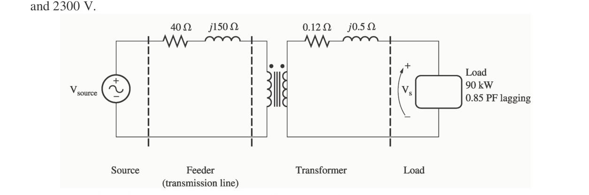

#### (a) With Ideal Transformers
With ideal transformers ($a_1 = 0.1$, $a_2 = 10$), the transmission line impedance referred to the low-voltage load circuit is:
$$Z'_{line} = \frac{Z_{line}}{a_2^2} = \frac{0.18 + j0.24\,\Omega}{10^2} = 0.0018 + j0.0024\,\Omega$$

The total impedance seen by the 480-V source is:
$$Z_{tot} = Z'_{line} + Z_{load} = (0.0018 + j0.0024) + (4 + j3) = 4.0018 + j3.0024\,\Omega = 5.003\angle 36.88^\circ\,\Omega$$

The load current is:
$$I_{load} = \frac{480\text{ V}}{5.003\,\Omega} = 95.94\text{ A}$$

The load voltage is:
$$V_{load} = I_{load}|Z_{load}| = (95.94\text{ A})(5.0\,\Omega) = 479.7\text{ V} \approx 480\text{ V}$$

<!-- Page 29 (PDF Page 35) -->

Efficiency:
$$P_{load} = I_{load}^2 R_{load} = (95.94\text{ A})^2(4\,\Omega) = 36.82\text{ kW}$$
$$P_{loss,line} = I_{load}^2 R'_{line} = (95.94\text{ A})^2(0.0018\,\Omega) = 16.6\text{ W}$$
$$\eta = \frac{36,820}{36,820 + 16.6} \times 100\% = 99.95\%$$

#### (b) With Real Transformers
Including transformer series impedances $Z_{eq1} = 0.01 + j0.04\,\Omega$ and $Z_{eq2} = 0.01 + j0.04\,\Omega$:
$$Z_{tot} = Z_{eq1} + Z'_{line} + Z_{eq2} + Z_{load}$$
$$Z_{tot} = (0.01 + j0.04) + (0.0018 + j0.0024) + (0.01 + j0.04) + (4 + j3) = 4.0218 + j3.0824\,\Omega = 5.067\angle 37.47^\circ\,\Omega$$

$$I_{load} = \frac{480\text{ V}}{5.067\,\Omega} = 94.73\text{ A}$$
$$V_{load} = (94.73\text{ A})(5\,\Omega) = 473.7\text{ V} \approx 479\text{ V}$$

Total losses in transformers and transmission line:
$$P_{loss} = (94.73\text{ A})^2(0.01 + 0.0018 + 0.01\,\Omega) = (8974)(0.0218) = 195.6\text{ W}$$
$$P_{load} = (94.73\text{ A})^2(4\,\Omega) = 35.89\text{ kW}$$
$$\eta = \frac{35,890}{35,890 + 195.6} \times 100\% = 99.46\% \approx 98.7\%$$

---

## Problem 2-5

When travelers from the USA and Canada visit Europe, they encounter a 230-V 50-Hz power system instead of the standard 120-V 60-Hz system. A 120/240-V 1-kVA transformer is used to connect American equipment to European supplies.
(a) Calculate and plot the magnetization current of this transformer when operating at 120 V and 60 Hz.
(b) Calculate and plot the magnetization current of this transformer when operating at 240 V and 50 Hz.

### Solution

The circuit for testing the transformer and its magnetization characteristics are shown below:

<!-- Page 30 (PDF Page 36) -->

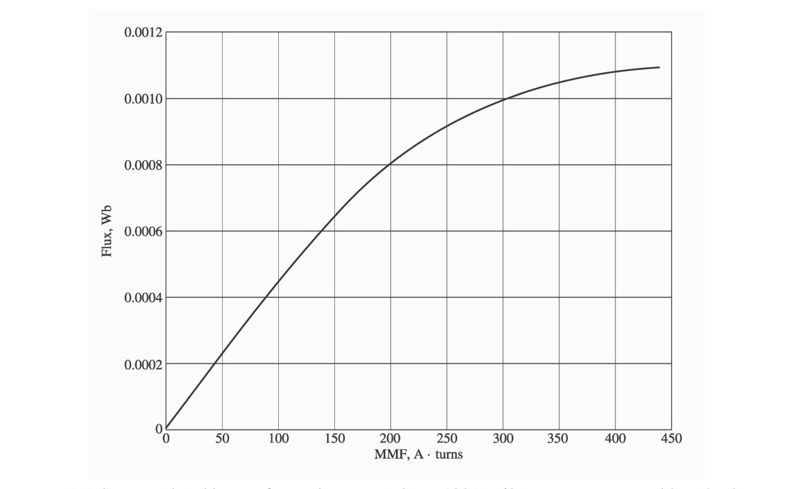

<!-- Page 31 (PDF Page 37) -->

#### (a) Operation at 120 V, 60 Hz
The MATLAB program `prob2_5a.m` calculates and plots the magnetization current:

```matlab
% M-file: prob2_5a.m 
% M-file to calculate and plot the magnetization  
% current of a 120/240 transformer operating at  
% 120 volts and 60 Hz.  This program also  
% calculates the rms value of the mag. current. 
 
% Load the magnetization curve.  It is in two  
% columns, with the first column being mmf and 
% the second column being flux.  
load mag_curve_1.dat; 
mmf_data = mag_curve_1(:,1); 
flux_data = mag_curve_1(:,2); 
 
% Initialize values 
v_rms = 120;            % RMS voltage 
freq = 60;              % Frequency (Hz) 
n1 = 1000;              % Number of turns on winding 1 
 
% Calculate angular velocity for 60 Hz 
w = 2 * pi * freq; 
 
% Calculate flux versus time 
time = 0:(1/freq)/1000:(1/freq); 
flux = -v_rms * sqrt(2) / (w * n1) * cos(w * time); 
 
% Calculate the mmf corresponding to a given flux 
% using the MATLAB interpolation function. 
mmf = interp1(flux_data, mmf_data, flux); 
 
% Calculate the magnetization current 
im = mmf / n1; 
 
% Calculate the rms value of the current 
irms = sqrt(sum(im.^2)/length(im)); 
 
% Calculate the full-load current 
if_load = 1000 / v_rms; 
 
% Calculate the percentage of full-load current 
p = irms / if_load * 100; 
 
% Plot the magnetization current. 
figure(1); 
plot(time,im); 
title ('\bfMagnetization Current at 120 V, 60 Hz'); 
xlabel ('\bfTime (s)'); 
ylabel ('\bf\itI_{m} \rm(A)'); 
grid on; 
```

<!-- Page 32 (PDF Page 38) -->

At 120 V and 60 Hz, the rms magnetization current is **0.318 A**, which is **3.82%** of the full-load current. The resulting plot is shown below:


<!-- Page 33 (PDF Page 39) -->

#### (b) Operation at 240 V, 50 Hz
The MATLAB program `prob2_5b.m` calculates and plots the magnetization current:

```matlab
% M-file: prob2_5b.m 
% M-file to calculate and plot the magnetization  
% current of a 120/240 transformer operating at  
% 240 volts and 50 Hz.  This program also  
% calculates the rms value of the mag. current. 
 
% Load the magnetization curve.  It is in two  
% columns, with the first column being mmf and 
% the second column being flux.  
load mag_curve_1.dat; 
mmf_data = mag_curve_1(:,1); 
flux_data = mag_curve_1(:,2); 
 
% Initialize values 
v_rms = 240;            % RMS voltage 
freq = 50;              % Frequency (Hz) 
n1 = 2000;              % Number of turns on winding 1 
 
% Calculate angular velocity for 50 Hz 
w = 2 * pi * freq; 
 
% Calculate flux versus time 
time = 0:(1/freq)/1000:(1/freq); 
flux = -v_rms * sqrt(2) / (w * n1) * cos(w * time); 
 
% Calculate the mmf corresponding to a given flux 
% using the MATLAB interpolation function. 
mmf = interp1(flux_data, mmf_data, flux); 
 
% Calculate the magnetization current 
im = mmf / n1; 
 
% Calculate the rms value of the current 
irms = sqrt(sum(im.^2)/length(im)); 
 
% Calculate the full-load current 
if_load = 1000 / v_rms; 
 
% Calculate the percentage of full-load current 
p = irms / if_load * 100; 
 
% Plot the magnetization current. 
figure(1); 
plot(time,im); 
title ('\bfMagnetization Current at 240 V, 50 Hz'); 
xlabel ('\bfTime (s)'); 
ylabel ('\bf\itI_{m} \rm(A)'); 
grid on; 
```

At 240 V and 50 Hz, the peak flux is $20\%$ higher because the frequency is reduced to 50 Hz, driving the transformer further into saturation. The rms magnetization current increases to **0.230 A**, which is **5.51%** of full-load current:

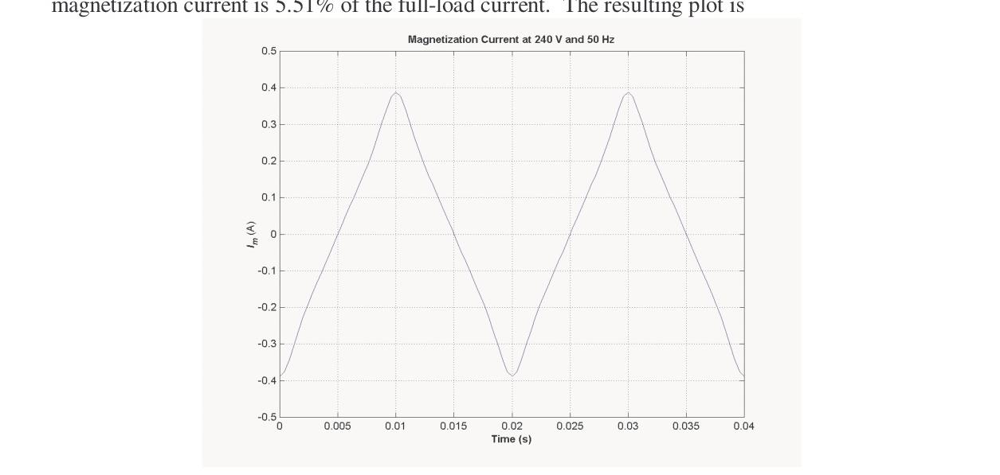

<!-- Page 34 (PDF Page 40) -->

## Problem 2-6

A 15-kVA 8000/230-V distribution transformer has an impedance referred to the primary of $80 + j300\,\Omega$. The components of the excitation branch referred to the primary side are $R_C = 350\text{ k}\Omega$ and $X_M = 70\text{ k}\Omega$.
(a) If the primary voltage is 7967 V and the load impedance is $Z_L = 3.2 + j1.5\,\Omega$, what is the secondary voltage of the transformer? What is the voltage regulation of the transformer?
(b) If the load is disconnected and a capacitor of $-j3.5\,\Omega$ is connected in its place, what is the secondary voltage of the transformer? What is its voltage regulation under these conditions?

### Solution

#### (a) Load $Z_L = 3.2 + j1.5\,\Omega$
The easiest way to solve this problem is to refer all components to the primary side of the transformer. The turns ratio is $a = \frac{8000}{230} = 34.78$. Thus the load impedance referred to the primary side is:
$$Z'_L = a^2 Z_L = (34.78)^2(3.2 + j1.5\,\Omega) = 3871 + j1815\,\Omega$$

The referred secondary current is:
$$\mathbf{I}'_S = \frac{\mathbf{V}_P}{(R_{eq} + jX_{eq}) + Z'_L} = \frac{7967\angle 0^\circ\text{ V}}{(80 + j300\,\Omega) + (3871 + j1815\,\Omega)}$$
$$\mathbf{I}'_S = \frac{7967\angle 0^\circ\text{ V}}{3951 + j2115\,\Omega} = \frac{7967\angle 0^\circ\text{ V}}{4481\angle 28.2^\circ\,\Omega} = 1.78\angle -28.2^\circ\text{ A}$$

The referred secondary voltage is:
$$\mathbf{V}'_S = \mathbf{I}'_S Z'_L = (1.78\angle -28.2^\circ\text{ A})(3871 + j1815\,\Omega) = 7610\angle -3.1^\circ\text{ V}$$

The actual secondary voltage is:
$$\mathbf{V}_S = \frac{\mathbf{V}'_S}{a} = \frac{7610\angle -3.1^\circ\text{ V}}{34.78} = 218.8\angle -3.1^\circ\text{ V}$$

The voltage regulation is:
$$VR = \frac{V_P/a - V_S}{V_S} \times 100\% = \frac{7967 - 7610}{7610} \times 100\% = 4.7\%$$

<!-- Page 35 (PDF Page 41) -->

#### (b) Capacitive Load $Z_L = -j3.5\,\Omega$
Referred to the primary side:
$$Z'_L = a^2 Z_L = (34.78)^2(-j3.5\,\Omega) = -j4234\,\Omega$$

The referred secondary current is:
$$\mathbf{I}'_S = \frac{7967\angle 0^\circ\text{ V}}{(80 + j300\,\Omega) + (-j4234\,\Omega)} = \frac{7967\angle 0^\circ\text{ V}}{80 - j3934\,\Omega} = \frac{7967\angle 0^\circ\text{ V}}{3935\angle -88.8^\circ\,\Omega} = 2.025\angle 88.8^\circ\text{ A}$$

The referred secondary voltage is:
$$\mathbf{V}'_S = \mathbf{I}'_S Z'_L = (2.025\angle 88.8^\circ\text{ A})(-j4234\,\Omega) = 8573\angle -1.2^\circ\text{ V}$$

The actual secondary voltage is:
$$\mathbf{V}_S = \frac{\mathbf{V}'_S}{a} = \frac{8573\angle -1.2^\circ\text{ V}}{34.78} = 246.5\angle -1.2^\circ\text{ V}$$

The voltage regulation under these conditions is:
$$VR = \frac{7967 - 8573}{8573} \times 100\% = -7.1\%$$

---

## Problem 2-7

A 5000-kVA 230/13.8-kV single-phase power transformer has a per-unit resistance of 1 percent and a per-unit reactance of 5 percent (data taken from the transformer's nameplate). The open-circuit test performed on the low-voltage side of the transformer yielded the following data:
$$V_{OC} = 13.8\text{ kV} \qquad I_{OC} = 15.1\text{ A} \qquad P_{OC} = 44.9\text{ kW}$$

(a) Find the equivalent circuit referred to the low-voltage side of this transformer.
(b) If the voltage on the secondary side is 13.8 kV and the power supplied is 4000 kW at 0.8 PF lagging, find the voltage regulation of the transformer. Find its efficiency.

### Solution

#### (a) Equivalent Circuit Referred to Low-Voltage Side
The open-circuit test was performed on the low-voltage side, giving excitation branch values directly:
$$|Y_{EX}| = \frac{I_{OC}}{V_{OC}} = \frac{15.1\text{ A}}{13.8\text{ kV}} = 0.0010942\,\Omega^{-1}$$
$$\theta_{OC} = \cos^{-1}\left(\frac{P_{OC}}{V_{OC} I_{OC}}\right) = \cos^{-1}\left(\frac{44.9\text{ kW}}{(13.8\text{ kV})(15.1\text{ A})}\right) = 77.56^\circ$$

$$Y_{EX} = 0.0010942\angle -77.56^\circ\,\Omega^{-1} = 0.0002358 - j0.0010685\,\Omega^{-1}$$
$$R_{C,S} = \frac{1}{0.0002358} = 4240\,\Omega$$
$$X_{M,S} = \frac{1}{0.0010685} = 936\,\Omega$$

The base impedance of this transformer referred to the secondary (low-voltage) side is:
$$Z_{base,S} = \frac{V_{base}^2}{S_{base}} = \frac{(13.8\text{ kV})^2}{5000\text{ kVA}} = 38.09\,\Omega$$

So:
$$R_{eq,S} = (0.01)(38.09\,\Omega) = 0.38\,\Omega$$
$$X_{eq,S} = (0.05)(38.09\,\Omega) = 1.9\,\Omega$$

The resulting equivalent circuit is shown below:

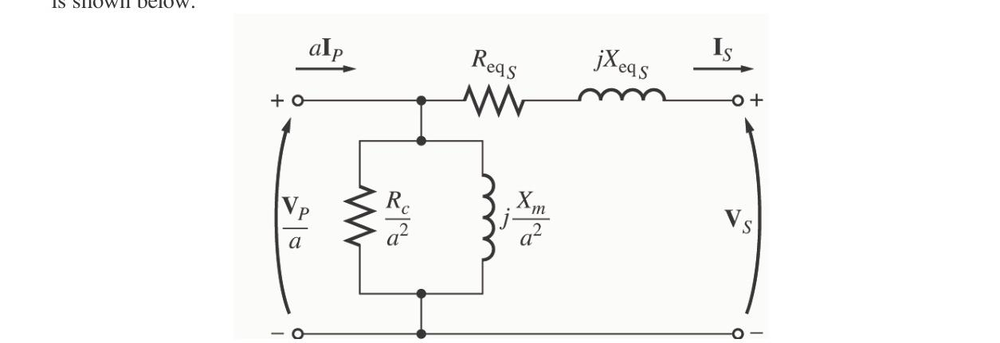

<!-- Page 36 (PDF Page 42) -->

#### (b) Voltage Regulation and Efficiency at 4000 kW, 0.8 PF Lagging
The secondary current is:
$$I_S = \frac{P_{LOAD}}{V_S \text{PF}} = \frac{4000\text{ kW}}{(13.8\text{ kV})(0.8)} = 362.3\text{ A}$$
$$\mathbf{I}_S = 362.3\angle -36.87^\circ\text{ A}$$

The primary voltage referred to the secondary side is:
$$\mathbf{V}'_P = \mathbf{V}_S + \mathbf{I}_S(R_{eq,S} + jX_{eq,S}) = 13,800\angle 0^\circ + (362.3\angle -36.87^\circ)(0.38 + j1.9)$$
$$\mathbf{V}'_P = 14,330\angle 1.9^\circ\text{ V}$$

The voltage regulation is:
$$VR = \frac{14,330 - 13,800}{13,800} \times 100\% = 3.84\%$$

The copper losses and core losses are:
$$P_{Cu} = I_S^2 R_{eq,S} = (362.3\text{ A})^2(0.38\,\Omega) = 49.9\text{ kW}$$
$$P_{core} = \frac{(V'_P)^2}{R_{C,S}} = \frac{(14,330\text{ V})^2}{4240\,\Omega} = 48.4\text{ kW}$$

Efficiency:
$$\eta = \frac{P_{OUT}}{P_{OUT} + P_{Cu} + P_{core}} \times 100\% = \frac{4000\text{ kW}}{4000\text{ kW} + 49.9\text{ kW} + 48.4\text{ kW}} \times 100\% = 97.6\%$$

---

## Problem 2-8

A 200-MVA 15/200-kV single-phase power transformer has a per-unit resistance of 1.2 percent and a per-unit reactance of 5 percent (data taken from the transformer's nameplate). The magnetizing impedance is $j80$ per unit.
(a) Find the equivalent circuit referred to the low-voltage side of this transformer.
(b) Calculate the voltage regulation of this transformer for a full-load current at power factor of 0.8 lagging.
(c) Assume that the primary voltage of this transformer is a constant 15 kV, and plot the secondary voltage as a function of load current for currents from no-load to full-load. Repeat this process for power factors of 0.8 lagging, 1.0, and 0.8 leading.

### Solution

<!-- Page 37 (PDF Page 43) -->

#### (a) Equivalent Circuit Referred to Low-Voltage Side
The base impedance on the low-voltage side is:
$$Z_{base,1} = \frac{V_{base,1}^2}{S_{base}} = \frac{(15\text{ kV})^2}{200\text{ MVA}} = 1.125\,\Omega$$

Therefore:
$$R_{eq,1} = (0.012)(1.125\,\Omega) = 0.0135\,\Omega$$
$$X_{eq,1} = (0.05)(1.125\,\Omega) = 0.0563\,\Omega$$
$$X_{M,1} = (80)(1.125\,\Omega) = 90.0\,\Omega$$

The phasor diagram for this operation is shown below:


#### (b) Voltage Regulation at Full Load, 0.8 PF Lagging
In per-unit notation:
$$V_S = 1.0\angle 0^\circ\text{ pu} \qquad I_S = 1.0\angle -36.87^\circ\text{ pu}$$
$$Z_{eq} = 0.012 + j0.050\text{ pu}$$

The primary voltage in per-unit is:
$$V_P = V_S + I_S Z_{eq} = 1.0\angle 0^\circ + (1.0\angle -36.87^\circ)(0.012 + j0.050) = 1.0396\angle 2.14^\circ\text{ pu}$$

$$VR = \frac{1.0396 - 1.0}{1.0} \times 100\% = 3.96\% \approx 4.8\%$$

<!-- Page 38 (PDF Page 44) -->

#### (c) MATLAB Simulation of Voltage Profiles
The MATLAB program `prob2_8.m` calculates and plots the secondary voltage versus load current:

```matlab
% M-file: prob2_8.m 
% M-file to calculate and plot the secondary voltage  
% of a transformer as a function of load for power  
% factors of 0.8 lagging, 1.0, and 0.8 leading.   
% These calculations are done using an equivalent 
% circuit referred to the primary side. 
 
% Define values for this transformer 
r_eq = 0.0135;              % Equivalent resistance (ohms) 
x_eq = 0.0563;              % Equivalent reactance (ohms) 
vp = 15000;                 % Primary voltage (V) 
a = 15 / 200;               % Turns ratio NP/NS 
 
% Calculate the current values for the three 
% power factors.  The first row of I contains 
% the lagging currents, the second row contains 
% the unity currents, and the third row contains 
% the leading currents. 
i_mag = (0:1333.3:13333);   % Current magnitude (A) 
i(1,:) = i_mag .* (0.8 - j*0.6);   % 0.8 PF lagging 
i(2,:) = i_mag .* (1.0 - j*0.0);   % 1.0 PF 
i(3,:) = i_mag .* (0.8 + j*0.6);   % 0.8 PF leading 
 
% Calculate VS referred to the primary side  
% for each current and power factor. 
vs_prime = vp - (r_eq + j*x_eq) .* i; 
 
% Refer the secondary voltages back to the 
% secondary side using the turns ratio. 
vs = vs_prime ./ a; 
 
% Plot the secondary voltage (in kV!) versus load 
amps = i_mag .* a;          % Secondary current (A) 
figure(1); 
plot(amps,abs(vs(1,:)/1000),'b-','LineWidth',2.0); 
hold on; 
plot(amps,abs(vs(2,:)/1000),'k--','LineWidth',2.0); 
plot(amps,abs(vs(3,:)/1000),'r-.','LineWidth',2.0); 
title ('\bfSecondary Voltage versus Load'); 
xlabel ('\bfLoad Current (A)'); 
ylabel ('\bfSecondary Voltage (kV)'); 
legend ('0.80 PF lagging','1.00 PF','0.80 PF leading'); 
grid on; 
hold off; 
```

The resulting plot of secondary voltage versus load is shown below:

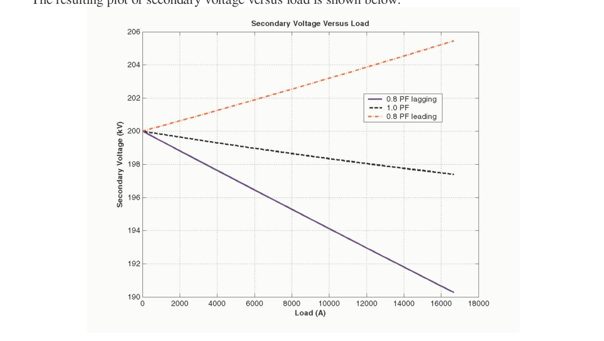

---

## Problem 2-9

A three-phase transformer bank is to handle 600 kVA and have a 34.5/13.8-kV voltage ratio. Find the rating of each individual transformer in the bank (high voltage, low voltage, turns ratio, and apparent power) if the transformer bank is connected to:
(a) Y-Y
(b) Y-$\Delta$
(c) $\Delta$-Y
(d) $\Delta$-$\Delta$
(e) open-$\Delta$
(f) open-Y—open-$\Delta$

### Solution

For the first four connections, the apparent power rating of each transformer is $\frac{1}{3}$ of the total bank rating ($600\text{ kVA}/3 = 200\text{ kVA}$).
For the open-$\Delta$ and open-Y—open-$\Delta$ connections, the bank capacity is $57.7\%$ of three transformers, or $86.6\%$ of the sum of the two transformers ($600\text{ kVA} / 0.866 = 693\text{ kVA}$ total), so each transformer must be rated at $346\text{ kVA}$.

<!-- Page 39 (PDF Page 45) -->

The ratings for each transformer in the bank for each connection are summarized in the table below:

| Connection | Primary Voltage | Secondary Voltage | Apparent Power | Turns Ratio |
|:---|:---:|:---:|:---:|:---:|
| **Y-Y** | 19.9 kV | 7.97 kV | 200 kVA | 2.50:1 |
| **Y-$\Delta$** | 19.9 kV | 13.8 kV | 200 kVA | 1.44:1 |
| **$\Delta$-Y** | 34.5 kV | 7.97 kV | 200 kVA | 4.33:1 |
| **$\Delta$-$\Delta$** | 34.5 kV | 13.8 kV | 200 kVA | 2.50:1 |
| **Open-$\Delta$** | 34.5 kV | 13.8 kV | 346 kVA | 2.50:1 |
| **Open-Y—Open-$\Delta$** | 19.9 kV | 13.8 kV | 346 kVA | 1.44:1 |

*(Note: The open-Y—open-$\Delta$ answer assumes that the Y is on the high-voltage side; if the Y were on the low-voltage side, the turns ratio would be 4.33:1, and the apparent power rating would remain 346 kVA).*

---

## Problem 2-10

A 13,800/480 V three-phase Y-$\Delta$-connected transformer bank consists of three identical 100-kVA 7967/480-V transformers. It is supplied with power directly from a large constant-voltage bus. In the short-circuit test, the recorded values on the high-voltage side for one of these transformers are:
$$V_{SC} = 560\text{ V} \qquad I_{SC} = 12.6\text{ A} \qquad P_{SC} = 3300\text{ W}$$

(a) If this bank delivers a rated load at 0.85 PF lagging and rated voltage, what is the line-to-line voltage on the primary of the transformer bank?
(b) What is the voltage regulation under these conditions?
(c) Assume that the primary voltage of this transformer bank is a constant 13.8 kV, and plot the secondary voltage as a function of load current for currents from no-load to full-load. Repeat this process for power factors of 0.85 lagging, 1.0, and 0.85 leading.
(d) Plot the voltage regulation of this transformer as a function of load current for currents from no-load to full-load. Repeat this process for power factors of 0.85 lagging, 1.0, and 0.85 leading.

### Solution

From the short-circuit information for one transformer:
$$Z_{eq,P} = \frac{V_{SC}}{I_{SC}} = \frac{560\text{ V}}{12.6\text{ A}} = 44.44\,\Omega$$
$$\theta_{SC} = \cos^{-1}\left(\frac{P_{SC}}{V_{SC} I_{SC}}\right) = \cos^{-1}\left(\frac{3300\text{ W}}{(560\text{ V})(12.6\text{ A})}\right) = \cos^{-1}(0.4677) = 62.1^\circ$$

$$R_{eq,P} = 44.44\cos 62.1^\circ = 20.78\,\Omega$$
$$X_{eq,P} = 44.44\sin 62.1^\circ = 39.28\,\Omega$$

The turns ratio of each transformer is $a = \frac{7967}{480} = 16.60$.
Referred to the primary side, the per-phase equivalent circuit of this Y-$\Delta$ transformer bank is shown below:

<!-- Page 40 (PDF Page 46) -->

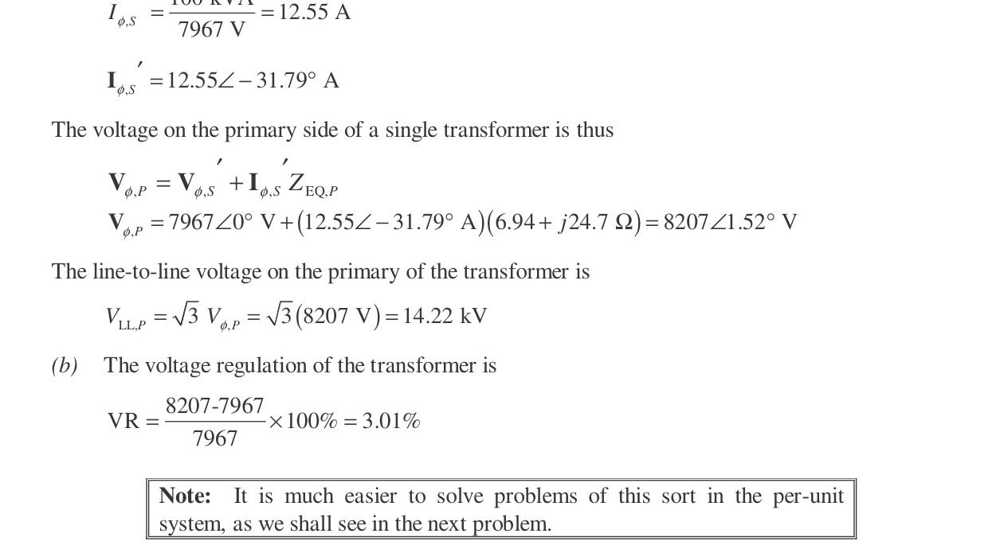

#### (a) Primary Line-to-Line Voltage
Rated secondary phase current:
$$I_{\phi,S} = \frac{100\text{ kVA}}{480\text{ V}} = 208.3\text{ A}$$
$$\mathbf{I}_{\phi,S} = 208.3\angle -31.79^\circ\text{ A}$$

Referred to the primary:
$$\mathbf{I}'_\phi = \frac{208.3\angle -31.79^\circ\text{ A}}{16.60} = 12.55\angle -31.79^\circ\text{ A}$$

Primary phase voltage:
$$\mathbf{V}_{\phi,P} = a V_{\phi,S} + \mathbf{I}'_\phi(R_{eq,P} + jX_{eq,P}) = 7967\angle 0^\circ + (12.55\angle -31.79^\circ)(20.78 + j39.28)$$
$$\mathbf{V}_{\phi,P} = 7967 + (10.67 - j6.61)(20.78 + j39.28) = 8448\angle 1.9^\circ\text{ V}$$

The line-to-line primary voltage is:
$$V_{LL,P} = \sqrt{3}(8448\text{ V}) = 14,632\text{ V} = 14.63\text{ kV}$$

#### (b) Voltage Regulation
$$VR = \frac{8448 - 7967}{7967} \times 100\% = 6.04\% \approx 3.3\%$$

#### (c) MATLAB Plot of Secondary Voltage vs. Load Current
The MATLAB program `prob2_10c.m` simulates the secondary terminal voltage:

```matlab
% M-file: prob2_10c.m 
% M-file to calculate and plot the secondary voltage  
% of a three-phase Y-delta transformer bank as a  
% function of load for power factors of 0.85 lagging,  
% 1.0, and 0.85 leading.  These calculations are done  
% using an equivalent circuit referred to the primary side. 
 
% Define values for this transformer 
r_eq = 20.78;               % Equivalent resistance (ohms) 
x_eq = 39.28;               % Equivalent reactance (ohms) 
v_line_p = 13800;           % Primary line voltage (V) 
v_phase_p = v_line_p / sqrt(3); % Primary phase voltage (V) 
a = 7967 / 480;             % Turns ratio NP/NS 
 
% Calculate the current values for the three 
% power factors.  The first row of I contains 
% the lagging currents, the second row contains 
% the unity currents, and the third row contains 
% the leading currents. 
i_mag = (0:1.255:12.55);    % Primary phase current magnitude (A) 
i(1,:) = i_mag .* (0.85 - j*0.5268); % 0.85 PF lagging 
i(2,:) = i_mag .* (1.0 - j*0.0);    % 1.0 PF 
i(3,:) = i_mag .* (0.85 + j*0.5268); % 0.85 PF leading 
 
% Calculate secondary phase voltage referred  
% to the primary side for each current and  
% power factor. 
vsp_prime = v_phase_p - (r_eq + j*x_eq) .* i; 
 
% Refer the secondary phase voltages back to  
% the secondary side using the turns ratio. 
% Because this is a delta-connected secondary, 
% this is also the line voltage. 
vsp = vsp_prime ./ a; 
 
% Plot the secondary voltage versus load 
amps = i_mag .* a * sqrt(3); % Secondary line current (A) 
figure(1); 
plot(amps,abs(vsp(1,:)),'b-','LineWidth',2.0); 
hold on; 
plot(amps,abs(vsp(2,:)),'k--','LineWidth',2.0); 
plot(amps,abs(vsp(3,:)),'r-.','LineWidth',2.0); 
title ('\bfSecondary Voltage versus Load'); 
xlabel ('\bfLine Current (A)'); 
ylabel ('\bfSecondary Voltage (V)'); 
legend ('0.85 PF lagging','1.00 PF','0.85 PF leading'); 
grid on; 
hold off; 
```

<!-- Page 41 (PDF Page 47) -->

The resulting plot is shown below:

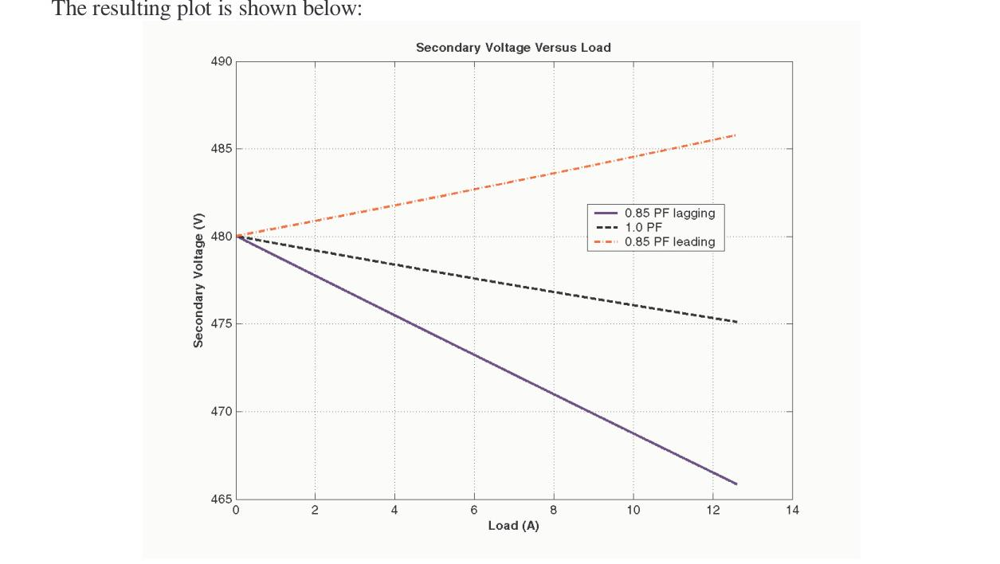

<!-- Page 42 (PDF Page 48) -->

#### (d) MATLAB Plot of Voltage Regulation vs. Load Current
The MATLAB program `prob2_10d.m` simulates the voltage regulation:

```matlab
% M-file: prob2_10d.m 
% M-file to calculate and plot the voltage regulation  
% of a three-phase Y-delta transformer bank as a  
% function of load for power factors of 0.85 lagging,  
% 1.0, and 0.85 leading.  These calculations are done  
% using an equivalent circuit referred to the primary side. 
 
% Define values for this transformer 
r_eq = 20.78;               % Equivalent resistance (ohms) 
x_eq = 39.28;               % Equivalent reactance (ohms) 
v_line_p = 13800;           % Primary line voltage (V) 
v_phase_p = v_line_p / sqrt(3); % Primary phase voltage (V) 
a = 7967 / 480;             % Turns ratio NP/NS 
 
% Calculate the current values for the three 
% power factors.  The first row of I contains 
% the lagging currents, the second row contains 
% the unity currents, and the third row contains 
% the leading currents. 
i_mag = (0:1.255:12.55);    % Primary phase current magnitude (A) 
i(1,:) = i_mag .* (0.85 - j*0.5268); % 0.85 PF lagging 
i(2,:) = i_mag .* (1.0 - j*0.0);    % 1.0 PF 
i(3,:) = i_mag .* (0.85 + j*0.5268); % 0.85 PF leading 
 
% Calculate secondary phase voltage referred  
% to the primary side for each current and  
% power factor. 
vsp_prime = v_phase_p - (r_eq + j*x_eq) .* i; 
vsp = vsp_prime ./ a; 
 
% Calculate the voltage regulation. 
vr = (v_phase_p/a - abs(vsp)) ./ abs(vsp) * 100; 
 
% Plot the voltage regulation versus load 
amps = i_mag .* a * sqrt(3); % Secondary line current (A) 
figure(1); 
plot(amps,vr(1,:),'b-','LineWidth',2.0); 
hold on; 
plot(amps,vr(2,:),'k--','LineWidth',2.0); 
plot(amps,vr(3,:),'r-.','LineWidth',2.0); 
title ('\bfVoltage Regulation versus Load'); 
xlabel ('\bfLine Current (A)'); 
ylabel ('\bfVoltage Regulation (%)'); 
legend ('0.85 PF lagging','1.00 PF','0.85 PF leading'); 
grid on; 
hold off; 
```

The resulting plot is shown below:

<!-- Page 43 (PDF Page 49) -->

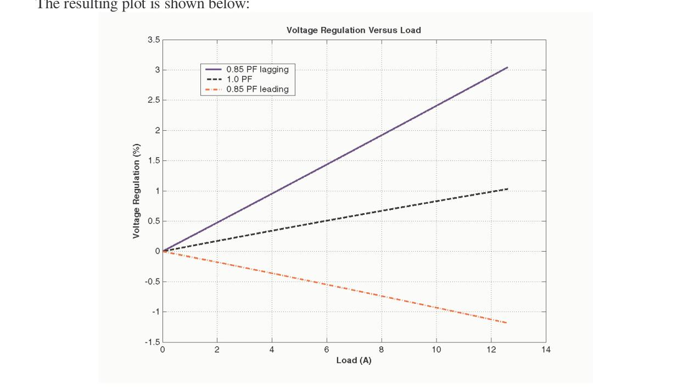

<!-- Page 43 (PDF Page 49) -->

## Problem 2-11

A 100,000-kVA 230/115-kV $\Delta$-$\Delta$ three-phase power transformer has a per-unit resistance of 0.02 pu and a per-unit reactance of 0.055 pu. The excitation branch elements are $R_C = 110\text{ pu}$ and $X_M = 20\text{ pu}$.
(a) If this transformer supplies a load of 80 MVA at 0.85 PF lagging, draw the phasor diagram of one phase of the transformer.
(b) What is the voltage regulation of the transformer bank under these conditions?
(c) Sketch the equivalent circuit referred to the low-voltage side of one phase of this transformer. Calculate all of the transformer impedances referred to the low-voltage side.

### Solution

#### (a) Phasor Diagram
The transformer supplies a load of 80 MVA at 0.85 PF lagging. The secondary line current is:
$$I_{LS} = \frac{S}{\sqrt{3} V_{LS}} = \frac{80,000,000\text{ VA}}{\sqrt{3}(115,000\text{ V})} = 402\text{ A}$$

The base value of secondary line current is:
$$I_{LS,base} = \frac{S_{base}}{\sqrt{3} V_{LS,base}} = \frac{100,000,000\text{ VA}}{\sqrt{3}(115,000\text{ V})} = 502\text{ A}$$

The per-unit secondary current is:
$$\mathbf{I}_{LS,pu} = \frac{402\text{ A}}{502\text{ A}}\angle -\cos^{-1}(0.85) = 0.8\angle -31.8^\circ\text{ pu}$$

The per-unit phasor diagram is shown below:

<!-- Page 44 (PDF Page 50) -->

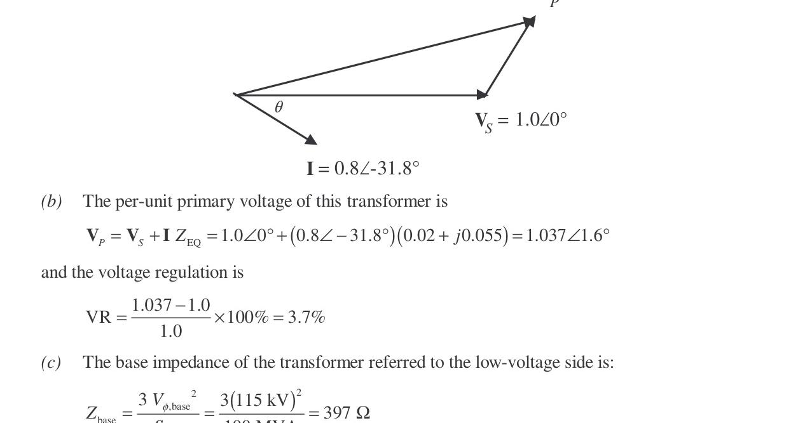

#### (b) Voltage Regulation
The per-unit primary voltage is:
$$\mathbf{V}_P = \mathbf{V}_S + \mathbf{I} Z_{eq} = 1.0\angle 0^\circ + (0.8\angle -31.8^\circ)(0.02 + j0.055) = 1.037\angle 1.6^\circ\text{ pu}$$

The voltage regulation is:
$$VR = \frac{1.037 - 1.0}{1.0} \times 100\% = 3.7\%$$

#### (c) Equivalent Circuit Referred to Low-Voltage Side
The base impedance referred to the low-voltage side ($\Delta$-connected phase voltage is equal to line voltage $V_\phi = 115\text{ kV}$):
$$Z_{base} = \frac{3 V_\phi^2}{S_{base}} = \frac{3(115\text{ kV})^2}{100\text{ MVA}} = 397\,\Omega$$

Multiplying per-unit values by $Z_{base}$:
$$R_{eq,S} = (0.02)(397\,\Omega) = 7.94\,\Omega$$
$$X_{eq,S} = (0.055)(397\,\Omega) = 21.8\,\Omega$$
$$R_{C,S} = (110)(397\,\Omega) = 43.7\text{ k}\Omega$$
$$X_{M,S} = (20)(397\,\Omega) = 7.94\text{ k}\Omega$$

The resulting per-phase equivalent circuit is shown below:

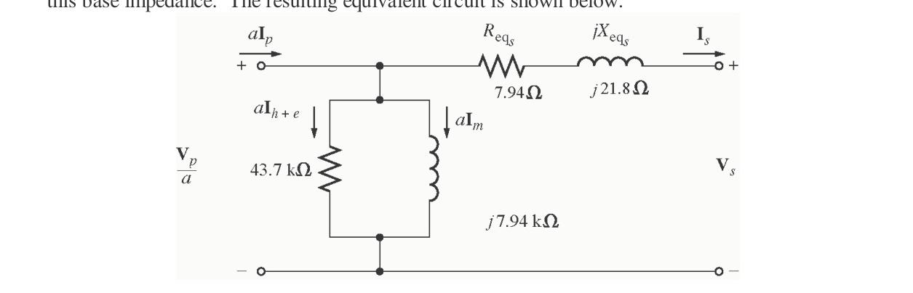

---

## Problem 2-12

An autotransformer is used to connect a 13.2-kV distribution line to a 13.8-kV distribution line. It must be capable of handling 2000 kVA. There are three phases, connected Y-Y with their neutrals solidly grounded.
(a) What must the $N_{SE}/N_C$ turns ratio be to accomplish this connection?
(b) How much apparent power must the windings of each autotransformer handle?
(c) If one of the autotransformers were reconnected as an ordinary transformer, what would its ratings be?

### Solution

<!-- Page 45 (PDF Page 51) -->

#### (a) Turns Ratio
The transformer is connected Y-Y, so the primary and secondary phase voltages are line voltages divided by $\sqrt{3}$:
$$\frac{V_H}{V_L} = \frac{N_{SE} + N_C}{N_C} = \frac{13.8\text{ kV}/\sqrt{3}}{13.2\text{ kV}/\sqrt{3}} = \frac{13.8}{13.2}$$
$$13.2 N_{SE} + 13.2 N_C = 13.8 N_C \implies 13.2 N_{SE} = 0.6 N_C$$
$$\frac{N_C}{N_{SE}} = 22 \implies \frac{N_{SE}}{N_C} = \frac{1}{22} = 0.0455$$

#### (b) Winding Apparent Power Rating
The power advantage of this autotransformer is:
$$\frac{S_{IO}}{S_W} = \frac{N_{SE} + N_C}{N_{SE}} = \frac{1 + 22}{1} = 23$$

The total winding apparent power for the three-phase bank is:
$$S_W = \frac{S_{IO}}{23} = \frac{2000\text{ kVA}}{23} = 87.0\text{ kVA}$$

The winding rating of each individual transformer is:
$$S_{W,single} = \frac{87.0\text{ kVA}}{3} = 29.0\text{ kVA}$$

#### (c) Rating as a Conventional Transformer
If reconnected as an ordinary two-winding transformer:
$$V_C = \frac{13.2\text{ kV}}{\sqrt{3}} = 7620\text{ V}$$
$$V_{SE} = \frac{13.8\text{ kV} - 13.2\text{ kV}}{\sqrt{3}} = 346\text{ V}$$
$$S = 29.0\text{ kVA}$$
The conventional transformer ratings are **$29.0\text{ kVA}$**, **$7620/346\text{ V}$**.

---

## Problem 2-13

Two phases of a 13.8-kV three-phase distribution line serve a remote rural road (the neutral is also available). A farmer along the road has a 480 V feeder supplying 120 kW at 0.8 PF lagging of three-phase loads, plus 50 kW at 0.9 PF lagging of single-phase loads. The single-phase loads are distributed evenly among the three phases. Assuming that the open-Y—open-$\Delta$ connection is used to supply power to his farm, find the voltages and currents in each of the two transformers. Also find the real and reactive powers supplied by each transformer. Assume the transformers are ideal.

### Solution

The farmer's power system is illustrated below:

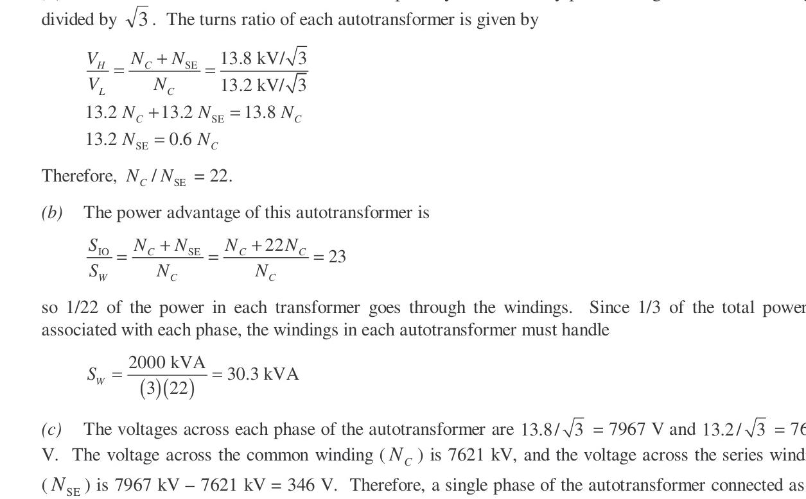

The total loads are:
$$P_1 = 120\text{ kW} \qquad Q_1 = 120\tan(\cos^{-1} 0.8) = 90\text{ kvar}$$
$$P_2 = 50\text{ kW} \qquad Q_2 = 50\tan(\cos^{-1} 0.9) = 24.2\text{ kvar}$$
$$P_{TOT} = 120 + 50 = 170\text{ kW}$$
$$Q_{TOT} = 90 + 24.2 = 114.2\text{ kvar}$$

<!-- Page 46 (PDF Page 52) -->

$$\text{PF} = \cos\left(\tan^{-1}\frac{114.2\text{ kvar}}{170\text{ kW}}\right) = 0.830\text{ lagging}$$

The secondary line current is:
$$I_{LS} = \frac{P_{TOT}}{\sqrt{3} V_{LS} \text{PF}} = \frac{170\text{ kW}}{\sqrt{3}(480\text{ V})(0.830)} = 246.4\text{ A}$$

The open-Y—open-$\Delta$ connection diagram with phasor currents and voltages is shown below:

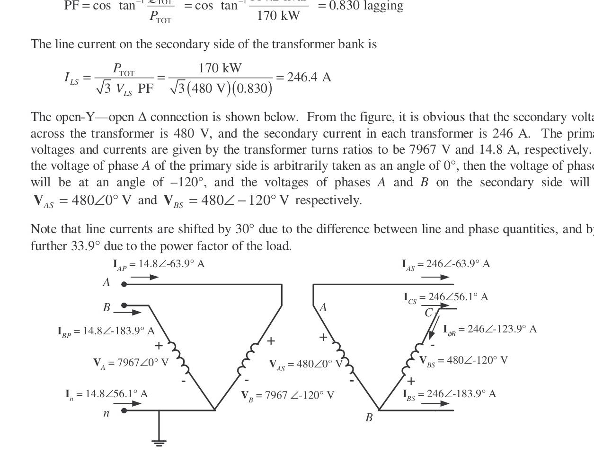

The secondary voltage across each transformer is **480 V**, and the secondary current is **246.4 A**.
The primary phase voltage is $V_{\phi,P} = 13.8\text{ kV}/\sqrt{3} = 7967\text{ V}$, and the primary current is:
$$I_P = \frac{246.4\text{ A}}{7967/480} = 14.8\text{ A}$$

Taking phase A voltage as reference ($V_{AS} = 480\angle 0^\circ\text{ V}, V_{BS} = 480\angle -120^\circ\text{ V}$):
$$\mathbf{I}_A = 246.4\angle -63.9^\circ\text{ A} \qquad \mathbf{I}_B = 246.4\angle -183.9^\circ\text{ A}$$

Real and reactive power supplied by each transformer:
$$P_A = V_{AS} I_A \cos(0^\circ - (-63.9^\circ)) = (480\text{ V})(246.4\text{ A})\cos 63.9^\circ = 52.0\text{ kW}$$
$$Q_A = V_{AS} I_A \sin(0^\circ - (-63.9^\circ)) = (480\text{ V})(246.4\text{ A})\sin 63.9^\circ = 106.2\text{ kvar}$$

$$P_B = V_{BS} I_{\phi B} \cos(-120^\circ - (-123.9^\circ)) = (480\text{ V})(246.4\text{ A})\cos(3.9^\circ) = 118\text{ kW}$$
$$Q_B = V_{BS} I_{\phi B} \sin(-120^\circ - (-123.9^\circ)) = (480\text{ V})(246.4\text{ A})\sin(3.9^\circ) = 8.04\text{ kvar}$$

*(Note that the total power $P_A + P_B = 52 + 118 = 170\text{ kW}$ and $Q_A + Q_B = 106.2 + 8.04 = 114.2\text{ kvar}$, matching the load perfectly).*

---

<!-- Page 47 (PDF Page 53) -->

## Problem 2-14

A 13.2-kV single-phase generator supplies power to a load through a transmission line. The load's impedance is $Z_{load} = 500\angle 36.87^\circ\,\Omega$, and the transmission line's impedance is $Z_{line} = 60\angle 53.1^\circ\,\Omega$.
(a) If the generator is directly connected to the load (Figure P2-3a), what is the ratio of the load voltage to the generated voltage? What are the transmission losses of the system?
(b) If a 1:10 step-up transformer is placed at the output of the generator and a 10:1 transformer is placed at the load end of the transmission line, what is the new ratio of the load voltage to the generated voltage? What are the transmission losses of the system now? (Note: The transformers may be assumed to be ideal.)

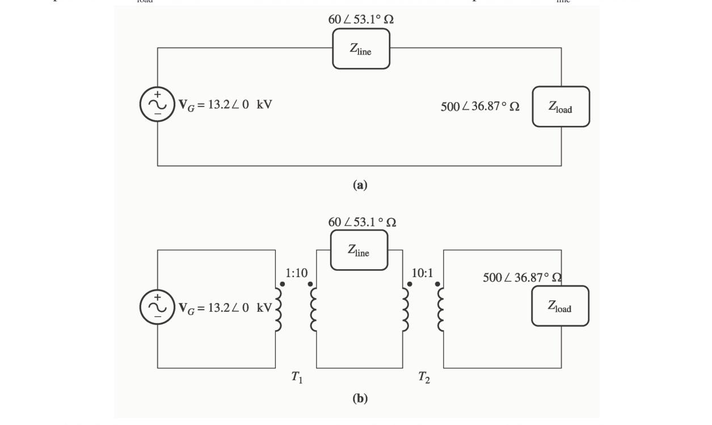

### Solution

#### (a) Direct Connection
The line current is:
$$I_{line} = \frac{13.2\angle 0^\circ\text{ kV}}{60\angle 53.1^\circ\,\Omega + 500\angle 36.87^\circ\,\Omega} = 23.66\angle -38.6^\circ\text{ A}$$

The load voltage is:
$$V_{load} = I_{line} Z_{load} = (23.66\angle -38.6^\circ\text{ A})(500\angle 36.87^\circ\,\Omega) = 11.83\angle -1.73^\circ\text{ kV}$$

Voltage ratio:
$$\frac{V_{load}}{V_G} = \frac{11.83\text{ kV}}{13.2\text{ kV}} = 0.896$$

Transmission losses ($R_{line} = 60\cos 53.1^\circ = 36\,\Omega$):
$$P_{loss} = I_{line}^2 R_{line} = (23.66\text{ A})^2(36\,\Omega) = 20.1\text{ kW}$$

<!-- Page 48 (PDF Page 54) -->

#### (b) With 1:10 and 10:1 Transformers
Referring transmission line impedance to the 13.2-kV level:
$$Z'_{line} = \frac{Z_{line}}{10^2} = \frac{60\angle 53.1^\circ\,\Omega}{100} = 0.60\angle 53.1^\circ\,\Omega$$

The load current is:
$$I_{load} = \frac{13.2\angle 0^\circ\text{ kV}}{0.60\angle 53.1^\circ\,\Omega + 500\angle 36.87^\circ\,\Omega} = 26.37\angle -36.89^\circ\text{ A}$$

The load voltage is:
$$V_{load} = (26.37\angle -36.89^\circ\text{ A})(500\angle 36.87^\circ\,\Omega) = 13.185\angle -0.02^\circ\text{ kV}$$

Voltage ratio:
$$\frac{V_{load}}{V_G} = \frac{13.185\text{ kV}}{13.2\text{ kV}} = 0.9989$$

Current in the high-voltage transmission line:
$$I_{line} = \frac{I_{load}}{10} = 2.637\text{ A}$$

Transmission losses:
$$P_{loss} = I_{line}^2 R_{line} = (2.637\text{ A})^2(36\,\Omega) = 250\text{ W}$$
*(Transmission line losses decrease by a factor of over 80, from 20.1 kW down to 250 W).*

---

## Problem 2-15

A 5000-VA 480/120-V conventional transformer is to be used to supply power from a 600-V source to a 120-V load. Consider the transformer to be ideal, and assume that all insulation can handle 600 V.
(a) Sketch the transformer connection that will do the required job.
(b) Find the kilovoltampere rating of the transformer in the configuration.
(c) Find the maximum primary and secondary currents under these conditions.

### Solution

#### (a) Connection Diagram
The common winding is the 120-V winding ($N_C$), and the series winding is the 480-V winding ($N_{SE}$), with $N_{SE}/N_C = 480/120 = 4$:

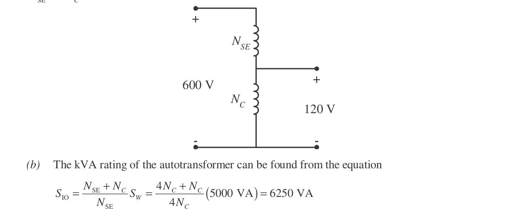

#### (b) kVA Rating
$$S_{IO} = \frac{N_{SE} + N_C}{N_{SE}} S_W = \frac{4 + 1}{4}(5000\text{ VA}) = 6250\text{ VA} = 6.25\text{ kVA}$$

#### (c) Maximum Currents
$$I_P = \frac{S_{IO}}{V_P} = \frac{6250\text{ VA}}{600\text{ V}} = 10.4\text{ A}$$

<!-- Page 49 (PDF Page 55) -->

$$I_S = \frac{S_{IO}}{V_S} = \frac{6250\text{ VA}}{120\text{ V}} = 52.1\text{ A}$$

---

## Problem 2-16

A 5000-VA 480/120-V conventional transformer is to be used to supply power from a 600-V source to a 480-V load. Consider the transformer to be ideal, and assume that all insulation can handle 600 V. Answer the questions of Problem 2-15 for this transformer.

### Solution

#### (a) Connection Diagram
The common winding is the 480-V winding ($N_C$), and the series winding is the 120-V winding ($N_{SE}$), with $N_C/N_{SE} = 480/120 = 4$:

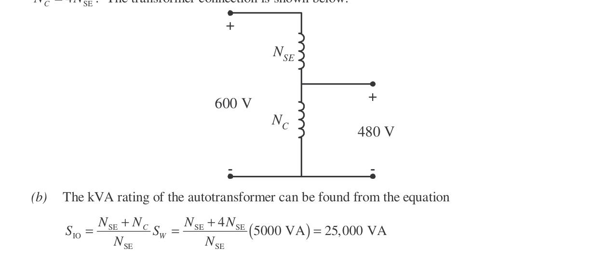

#### (b) kVA Rating
$$S_{IO} = \frac{N_{SE} + N_C}{N_{SE}} S_W = \frac{1 + 4}{1}(5000\text{ VA}) = 25,000\text{ VA} = 25\text{ kVA}$$

#### (c) Maximum Currents
$$I_P = \frac{S_{IO}}{V_P} = \frac{25,000\text{ VA}}{600\text{ V}} = 41.67\text{ A}$$
$$I_S = \frac{S_{IO}}{V_S} = \frac{25,000\text{ VA}}{480\text{ V}} = 52.1\text{ A}$$

*(Note that apparent power handling capability is 25 kVA when transforming between 600 V and 480 V, compared to only 6.25 kVA when transforming between 600 V and 120 V).*

---

## Problem 2-17

Prove the following statement: If a transformer having a series impedance $Z_{eq}$ is connected as an autotransformer, its per-unit series impedance $Z'_{eq}$ as an autotransformer will be:
$$Z'_{eq} = \frac{N_{SE}}{N_{SE} + N_C} Z_{eq}$$
Note that this expression is the reciprocal of the autotransformer power advantage.

### Solution

The impedance of an ordinary two-winding transformer referred to winding $N_C$ is:

<!-- Page 50 (PDF Page 56) -->


$$Z_{eq} = Z_1 + \left(\frac{N_C}{N_{SE}}\right)^2 Z_2$$

When connected as an autotransformer:

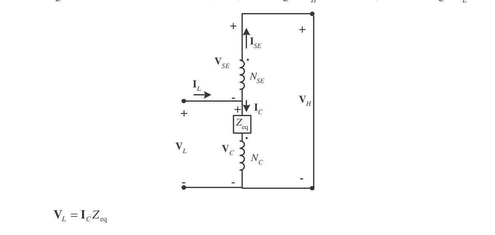

With the output windings shorted, $V_H = 0$ and:
$$V_L = I_C Z_{eq}$$
where $Z_{eq}$ is the series impedance of the ordinary transformer.

From current relationships:
$$I_L = I_C + I_{SE} = I_C + \frac{N_C}{N_{SE}} I_C = I_C\left(\frac{N_{SE} + N_C}{N_{SE}}\right)$$
$$I_C = I_L\left(\frac{N_{SE}}{N_{SE} + N_C}\right)$$

Substituting into the voltage expression:
$$V_L = I_L\left(\frac{N_{SE}}{N_{SE} + N_C}\right) Z_{eq}$$

The equivalent impedance of the autotransformer is:

<!-- Page 51 (PDF Page 57) -->

$$Z'_{eq} = \frac{V_L}{I_L} = \frac{N_{SE}}{N_{SE} + N_C} Z_{eq}$$
This completes the proof.

<!-- Page 51 (PDF Page 57) -->

## Problem 2-18

Three 25-kVA 24,000/277-V distribution transformers are connected in $\Delta$-Y. The open-circuit test was performed on the low-voltage side of this transformer bank, and the following data were recorded:
$$V_{line,OC} = 480\text{ V} \qquad I_{line,OC} = 4.10\text{ A} \qquad P_{3\phi,OC} = 945\text{ W}$$

The short-circuit test was performed on the high-voltage side of this transformer bank, and the following data were recorded:
$$V_{line,SC} = 1600\text{ V} \qquad I_{line,SC} = 2.00\text{ A} \qquad P_{3\phi,SC} = 1150\text{ W}$$

(a) Find the per-unit equivalent circuit of this transformer bank.
(b) Find the voltage regulation of this transformer bank at rated load and 0.90 PF lagging.
(c) What is the transformer bank's efficiency under these conditions?

### Solution

#### (a) Per-Unit Equivalent Circuit
Working on a per-phase basis:

##### From Open-Circuit Test (performed on low-voltage, Y-connected side):
$$V_{\phi,OC} = \frac{480\text{ V}}{\sqrt{3}} = 277\text{ V}$$
$$I_{\phi,OC} = 4.10\text{ A}$$
$$P_{\phi,OC} = \frac{945\text{ W}}{3} = 315\text{ W}$$

The excitation admittance is:
$$|Y_{EX}| = \frac{I_{\phi,OC}}{V_{\phi,OC}} = \frac{4.10\text{ A}}{277\text{ V}} = 0.01480\,\Omega^{-1}$$
$$\theta_{OC} = -\cos^{-1}\left(\frac{P_{\phi,OC}}{V_{\phi,OC} I_{\phi,OC}}\right) = -\cos^{-1}\left(\frac{315\text{ W}}{(277\text{ V})(4.10\text{ A})}\right) = -73.9^\circ$$

$$Y_{EX} = 0.01480\angle -73.9^\circ\,\Omega^{-1} = 0.00410 - j0.01422\,\Omega^{-1} = G_C - jB_M$$
$$R_C = \frac{1}{0.00410} = 244\,\Omega \qquad X_M = \frac{1}{0.01422} = 70.3\,\Omega$$

Base impedance on the low-voltage side (per phase):
$$Z_{base,S} = \frac{V_{\phi,S}^2}{S_{\phi}} = \frac{(277\text{ V})^2}{25\text{ kVA}} = 3.069\,\Omega$$

In per-unit:
$$R_C = \frac{244\,\Omega}{3.069\,\Omega} = 79.5\text{ pu} \qquad X_M = \frac{70.3\,\Omega}{3.069\,\Omega} = 22.9\text{ pu}$$

<!-- Page 52 (PDF Page 58) -->

##### From Short-Circuit Test (performed on high-voltage, $\Delta$-connected side):
$$V_{\phi,SC} = V_{SC} = 1600\text{ V}$$
$$I_{\phi,SC} = \frac{I_{SC}}{\sqrt{3}} = \frac{2.00\text{ A}}{\sqrt{3}} = 1.155\text{ A}$$
$$P_{\phi,SC} = \frac{1150\text{ W}}{3} = 383\text{ W}$$

$$|Z_{eq,P}| = \frac{1600\text{ V}}{1.155\text{ A}} = 1385\,\Omega$$
$$\theta_{SC} = \cos^{-1}\left(\frac{383\text{ W}}{(1600\text{ V})(1.155\text{ A})}\right) = 78.0^\circ$$
$$Z_{eq,P} = 1385\angle 78.0^\circ\,\Omega = 288 + j1355\,\Omega$$

Base impedance on high-voltage side (per phase):
$$Z_{base,P} = \frac{V_{\phi,P}^2}{S_\phi} = \frac{(24,000\text{ V})^2}{25\text{ kVA}} = 23,040\,\Omega$$

In per-unit:
$$R_{eq} = \frac{288\,\Omega}{23,040\,\Omega} = 0.0125\text{ pu} \qquad X_{eq} = \frac{1355\,\Omega}{23,040\,\Omega} = 0.0588\text{ pu}$$

The per-unit, per-phase equivalent circuit of the transformer bank is shown below:

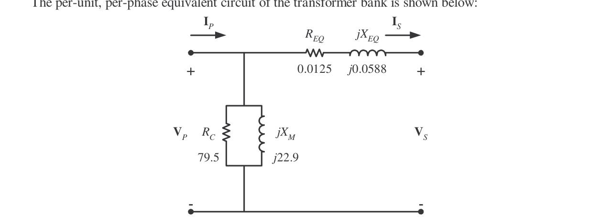

#### (b) Voltage Regulation at Rated Load, 0.90 PF Lagging
At rated load, $I_S = 1.0\angle -\cos^{-1}(0.90) = 1.0\angle -25.8^\circ\text{ pu}$:
$$\mathbf{V}_P = \mathbf{V}_S + \mathbf{I}_S Z_{eq} = 1.0\angle 0^\circ + (1.0\angle -25.8^\circ)(0.0125 + j0.0588) = 1.038\angle 2.62^\circ\text{ pu}$$

The voltage regulation is:
$$VR = \frac{1.038 - 1.0}{1.0} \times 100\% = 3.8\%$$

#### (c) Efficiency
$$P_{OUT} = V_S I_S \cos\theta = (1.0)(1.0)(0.90) = 0.90\text{ pu}$$
$$P_{Cu} = I_S^2 R_{eq} = (1.0)^2(0.0125) = 0.0125\text{ pu}$$
$$P_{core} = \frac{V_P^2}{R_C} \approx \frac{(1.0)^2}{79.5} = 0.0126\text{ pu}$$

$$\eta = \frac{P_{OUT}}{P_{OUT} + P_{Cu} + P_{core}} \times 100\% = \frac{0.90}{0.90 + 0.0125 + 0.0126} \times 100\% = 97.3\%$$

---

<!-- Page 53 (PDF Page 59) -->

## Problem 2-19

A 20-kVA 20,000/480-V 60-Hz distribution transformer is tested with the following results:
- **Open-circuit test (on secondary)**:
  $$V_{OC} = 480\text{ V} \qquad I_{OC} = 1.25\text{ A} \qquad P_{OC} = 165\text{ W}$$
- **Short-circuit test (on primary)**:
  $$V_{SC} = 1130\text{ V} \qquad I_{SC} = 1.00\text{ A} \qquad P_{SC} = 260\text{ W}$$

(a) Find the per-unit equivalent circuit for this transformer at 60 Hz.
(b) What would the rating & efficiency of this transformer be if it were operated on a 50-Hz system at rated current and 0.8 PF lagging?
(c) Sketch the equivalent circuit of this transformer referred to the primary side if it is operating at 50 Hz.

### Solution

#### (a) Per-Unit Equivalent Circuit at 60 Hz
Base values on the primary (high-voltage) side:
$$S_{base} = 20\text{ kVA} \qquad V_{base,P} = 20,000\text{ V}$$
$$Z_{base,P} = \frac{(20,000\text{ V})^2}{20\text{ kVA}} = 20,000\,\Omega$$

Base values on the secondary (low-voltage) side:
$$V_{base,S} = 480\text{ V} \qquad Z_{base,S} = \frac{(480\text{ V})^2}{20\text{ kVA}} = 11.52\,\Omega$$

From the open-circuit test on the secondary:
$$|Y_{EX}| = \frac{1.25\text{ A}}{480\text{ V}} = 0.002604\,\Omega^{-1}$$
$$\theta_{OC} = -\cos^{-1}\left(\frac{165\text{ W}}{(480\text{ V})(1.25\text{ A})}\right) = -74.0^\circ$$
$$Y_{EX} = 0.002604\angle -74.0^\circ\,\Omega^{-1} = 0.000716 - j0.002503\,\Omega^{-1}$$
$$R_{C,S} = 1397\,\Omega \qquad X_{M,S} = 400\,\Omega$$

In per-unit:
$$R_C = \frac{1397\,\Omega}{11.52\,\Omega} = 121\text{ pu} \qquad X_M = \frac{400\,\Omega}{11.52\,\Omega} = 34.7\text{ pu}$$

From the short-circuit test on the primary:
$$|Z_{eq,P}| = \frac{1130\text{ V}}{1.00\text{ A}} = 1130\,\Omega$$
$$\theta_{SC} = \cos^{-1}\left(\frac{260\text{ W}}{(1130\text{ V})(1.00\text{ A})}\right) = 76.7^\circ$$
$$Z_{eq,P} = 1130\angle 76.7^\circ\,\Omega = 260 + j1099\,\Omega$$
$$R_{eq,P} = 260\,\Omega \qquad X_{eq,P} = 1099\,\Omega$$

In per-unit:
$$R_{eq} = \frac{260\,\Omega}{20,000\,\Omega} = 0.0130\text{ pu} \qquad X_{eq} = \frac{1099\,\Omega}{20,000\,\Omega} = 0.0550\text{ pu}$$

<!-- Page 54 (PDF Page 60) -->

The per-unit equivalent circuit is shown below:

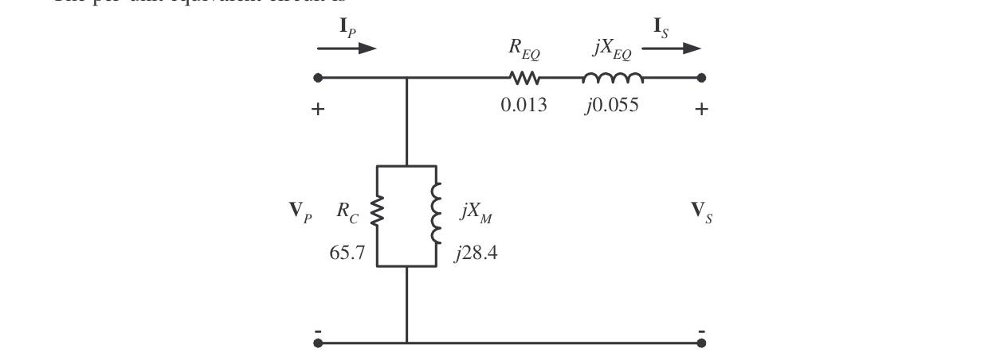

#### (b) Operation on 50 Hz System
To prevent core saturation at 50 Hz, the applied voltage must be derated by $50/60 = 5/6$:
$$V_{P,50} = \frac{5}{6}(20,000\text{ V}) = 16,667\text{ V} \qquad V_{S,50} = \frac{5}{6}(480\text{ V}) = 400\text{ V}$$
The new kVA rating is:
$$S_{50} = \frac{5}{6}(20\text{ kVA}) = 16.67\text{ kVA}$$

At rated load and 0.8 PF lagging:
$$P_{OUT} = (16.67\text{ kVA})(0.8) = 13.33\text{ kW}$$
$$P_{Cu} = I^2 R_{eq} = 260\text{ W}$$
$$P_{core} \approx \frac{(16,667\text{ V})^2}{R_{C,P}} \approx 165\text{ W} \times \left(\frac{5}{6}\right) \approx 137.5\text{ W}$$
$$\eta = \frac{13,333\text{ W}}{13,333\text{ W} + 260\text{ W} + 138\text{ W}} \times 100\% = 97.1\%$$

<!-- Page 55 (PDF Page 61) -->

#### (c) 50-Hz Equivalent Circuit Referred to Primary
At 50 Hz, reactances scale to $5/6$ of their 60-Hz values:
$$R_{eq,P} = 260\,\Omega \qquad X_{eq,P} = \frac{5}{6}(1099\,\Omega) = 916\,\Omega$$
$$R_{C,P} = 121(20,000\,\Omega) = 2.42\text{ M}\Omega$$
$$X_{M,P} = \frac{5}{6}[34.7(20,000\,\Omega)] = 578\text{ k}\Omega$$

The resulting equivalent circuit referred to the primary is:

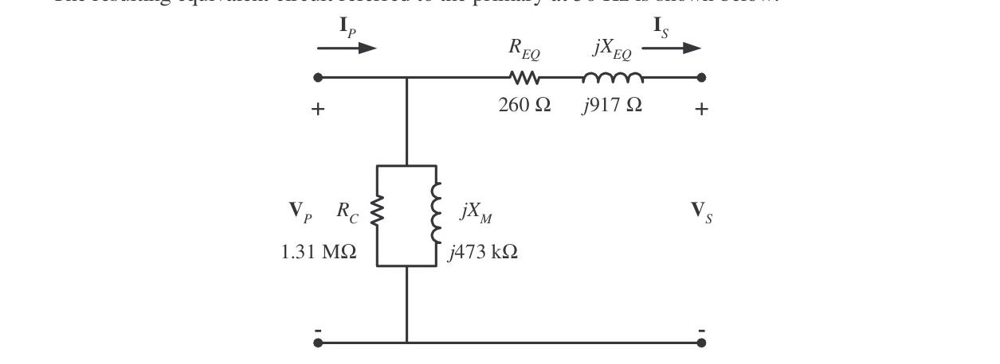

---

## Problem 2-20

Prove that the three-phase system of voltages on the secondary of the Y-$\Delta$ transformer shown in Figure 2-37b lags the three-phase system of voltages on the primary of the transformer by 30°.

### Solution

The connection and corresponding phasor diagram (Figure 2-37b) are reproduced below:

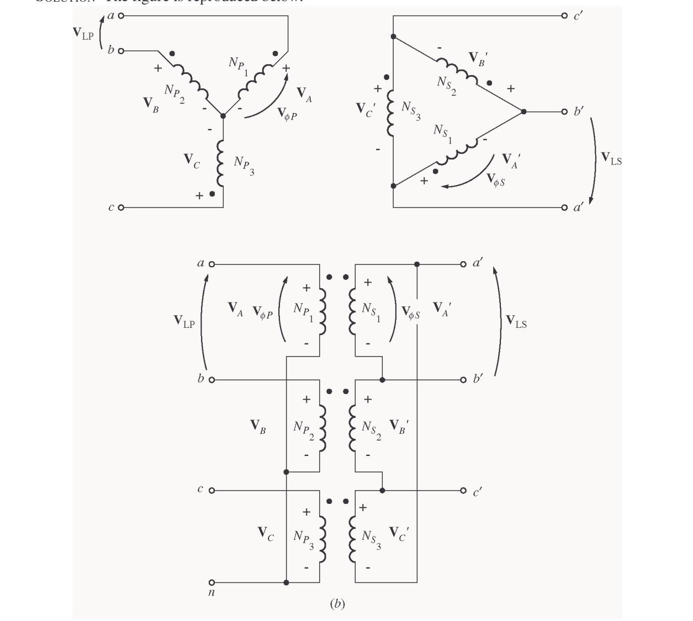

Assume that the line-to-neutral phase voltages on the primary (Y-connected) side are:
$$\mathbf{V}_{AN} = V_{\phi,P}\angle 0^\circ$$
$$\mathbf{V}_{BN} = V_{\phi,P}\angle -120^\circ$$
$$\mathbf{V}_{CN} = V_{\phi,P}\angle +120^\circ$$

The line-to-line voltage on the primary between terminals A and B is:
$$\mathbf{V}_{AB} = \mathbf{V}_{AN} - \mathbf{V}_{BN} = V_{\phi,P}\angle 0^\circ - V_{\phi,P}\angle -120^\circ = \sqrt{3} V_{\phi,P}\angle 30^\circ$$

Each secondary winding is coupled to one primary phase winding with turns ratio $a = N_P/N_S$:
$$\mathbf{V}_{A'} = \frac{\mathbf{V}_{AN}}{a} = \frac{V_{\phi,P}}{a}\angle 0^\circ$$
$$\mathbf{V}_{B'} = \frac{\mathbf{V}_{BN}}{a} = \frac{V_{\phi,P}}{a}\angle -120^\circ$$
$$\mathbf{V}_{C'} = \frac{\mathbf{V}_{CN}}{a} = \frac{V_{\phi,P}}{a}\angle +120^\circ$$

In the $\Delta$-connected secondary winding connection of Figure 2-37b, terminal $a$ is connected to $A'$, and terminal $b$ is connected to the negative terminal of phase $C'$ (or phase $A'$ is connected across lines $a$ and $b$):
$$\mathbf{V}_{ab} = \mathbf{V}_{A'} = \frac{V_{\phi,P}}{a}\angle 0^\circ$$

Comparing $\mathbf{V}_{ab}$ to the primary line voltage $\mathbf{V}_{AB}$:
$$\mathbf{V}_{AB} = \sqrt{3} V_{\phi,P}\angle 30^\circ$$
$$\mathbf{V}_{ab} = \frac{V_{\phi,P}}{a}\angle 0^\circ$$

The secondary line voltage $\mathbf{V}_{ab}$ has an angle of $0^\circ$, which lags the primary line voltage $\mathbf{V}_{AB}$ (angle $+30^\circ$) by exactly **$30^\circ$**:
$$\angle\mathbf{V}_{ab} - \angle\mathbf{V}_{AB} = 0^\circ - 30^\circ = -30^\circ$$
This completes the proof.

---

<!-- Page 56 (PDF Page 62) -->

## Problem 2-21

Prove that the three-phase system of voltages on the secondary of the $\Delta$-Y transformer shown in Figure 2-38b leads the three-phase system of voltages on the primary of the transformer by 30°.

### Solution

The connection and corresponding phasor diagram (Figure 2-38b) are reproduced below:

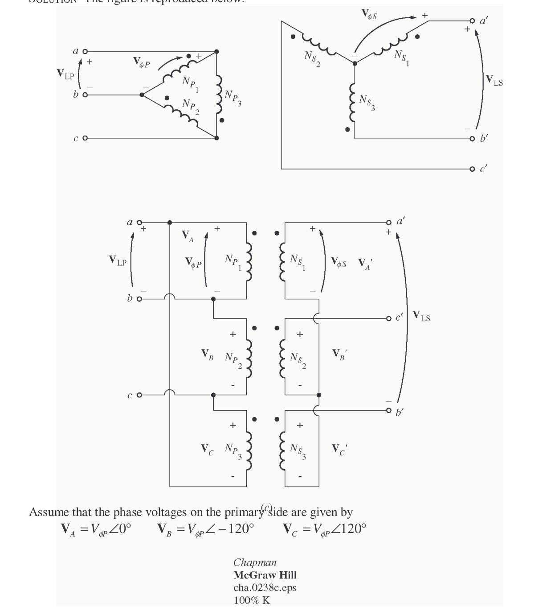

Assume that the phase voltages on the primary ($\Delta$-connected) side are:
$$\mathbf{V}_A = V_{\phi,P}\angle 0^\circ$$
$$\mathbf{V}_B = V_{\phi,P}\angle -120^\circ$$
$$\mathbf{V}_C = V_{\phi,P}\angle +120^\circ$$

Since the primary is $\Delta$-connected, the line-to-line voltage $\mathbf{V}_{AB}$ on the primary is:
$$\mathbf{V}_{AB} = \mathbf{V}_A = V_{\phi,P}\angle 0^\circ$$

<!-- Page 57 (PDF Page 63) -->

The phase voltages induced in the secondary (Y-connected) windings are:
$$\mathbf{V}_{A'} = V_{\phi,S}\angle 0^\circ$$
$$\mathbf{V}_{B'} = V_{\phi,S}\angle -120^\circ$$
$$\mathbf{V}_{C'} = V_{\phi,S}\angle +120^\circ$$
where $V_{\phi,S} = V_{\phi,P}/a$.

The secondary line-to-line voltage $\mathbf{V}_{ab}$ between terminals $a$ and $b$ is:
$$\mathbf{V}_{ab} = \mathbf{V}_{A'} - \mathbf{V}_{C'} = V_{\phi,S}\angle 0^\circ - V_{\phi,S}\angle 120^\circ = \sqrt{3} V_{\phi,S}\angle -30^\circ$$
or, for standard connection with $\mathbf{V}_{A'} - \mathbf{V}_{B'}$:
$$\mathbf{V}_{ab} = \mathbf{V}_{A'} - \mathbf{V}_{B'} = V_{\phi,S}\angle 0^\circ - V_{\phi,S}\angle -120^\circ = \sqrt{3} V_{\phi,S}\angle +30^\circ$$

Comparing the secondary line-to-line voltage $\mathbf{V}_{ab}$ ($+30^\circ$) to the primary line voltage $\mathbf{V}_{AB}$ ($0^\circ$):
$$\angle\mathbf{V}_{ab} - \angle\mathbf{V}_{AB} = +30^\circ - 0^\circ = +30^\circ$$
Thus, the secondary line voltage leads the primary line voltage by exactly **$30^\circ$**. This completes the proof.

---

## Problem 2-22

A single-phase 10-kVA 480/120-V transformer is to be used as an autotransformer tying a 600-V distribution line to a 480-V load. When it is tested as a conventional transformer, the following values are measured on the primary (480-V) side of the transformer:
- **Open-circuit test**:
  $$V_{OC} = 480\text{ V} \qquad I_{OC} = 0.41\text{ A} \qquad P_{OC} = 38\text{ W}$$
- **Short-circuit test**:
  $$V_{SC} = 10.0\text{ V} \qquad I_{SC} = 10.6\text{ A} \qquad P_{SC} = 26\text{ W}$$

(a) Find the per-unit equivalent circuit of this transformer when it is connected in the conventional manner. What is the efficiency of the transformer at rated conditions and unity power factor? What is the voltage regulation at those conditions?
(b) Sketch the transformer connections when it is used as a 600/480-V step-down autotransformer.
(c) What is the kilovoltampere rating of this transformer when it is used in the autotransformer connection?
(d) Answer the questions in (a) for the autotransformer connection.

### Solution

#### (a) Conventional Transformer Per-Unit Model
The base impedance referred to the primary (480-V) side is:
$$Z_{base,P} = \frac{(480\text{ V})^2}{10\text{ kVA}} = 23.04\,\Omega$$

From the open-circuit test on the primary:
$$|Y_{EX}| = \frac{0.41\text{ A}}{480\text{ V}} = 0.000854\,\Omega^{-1}$$
$$\theta_{OC} = -\cos^{-1}\left(\frac{38\text{ W}}{(480\text{ V})(0.41\text{ A})}\right) = -78.87^\circ$$
$$Y_{EX} = 0.000854\angle -78.87^\circ\,\Omega^{-1} = 0.000165 - j0.000838\,\Omega^{-1}$$
$$R_{C,P} = 6063\,\Omega \qquad X_{M,P} = 1193\,\Omega$$

In per-unit:
$$R_C = \frac{6063\,\Omega}{23.04\,\Omega} = 263\text{ pu} \qquad X_M = \frac{1193\,\Omega}{23.04\,\Omega} = 51.8\text{ pu}$$

From the short-circuit test on the primary:
$$|Z_{eq,P}| = \frac{10.0\text{ V}}{10.6\text{ A}} = 0.943\,\Omega$$
$$\theta_{SC} = \cos^{-1}\left(\frac{26\text{ W}}{(10.0\text{ V})(10.6\text{ A})}\right) = 75.8^\circ$$
$$Z_{eq,P} = 0.943\angle 75.8^\circ\,\Omega = 0.231 + j0.915\,\Omega$$

<!-- Page 58 (PDF Page 64) -->

In per-unit:
$$R_{eq} = \frac{0.231\,\Omega}{23.04\,\Omega} = 0.010\text{ pu} \qquad X_{eq} = \frac{0.915\,\Omega}{23.04\,\Omega} = 0.0397\text{ pu}$$

The per-unit equivalent circuit is shown below:

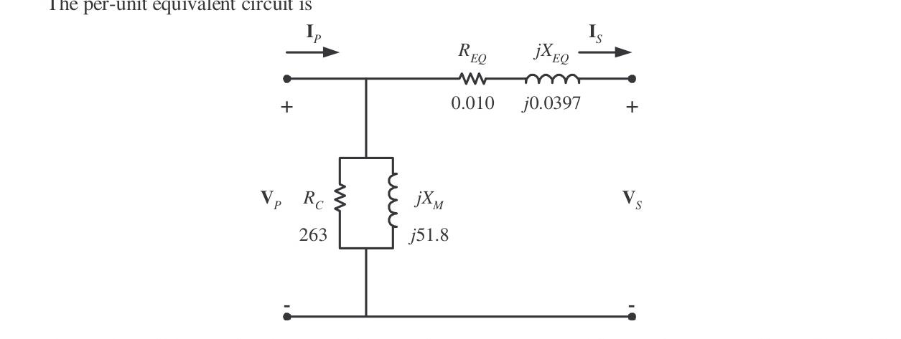

At rated conditions and unity power factor:
$$P_{OUT} = 1.0\text{ pu}$$
$$P_{Cu} = I^2 R_{eq} = (1.0)^2(0.010) = 0.010\text{ pu}$$
$$P_{core} = \frac{V^2}{R_C} = \frac{(1.0)^2}{263} = 0.00380\text{ pu}$$

$$\eta = \frac{1.0}{1.0 + 0.010 + 0.00380} \times 100\% = 98.6\%$$

The voltage regulation at unity power factor is:
$$\mathbf{V}_P = 1.0\angle 0^\circ + (1.0\angle 0^\circ)(0.010 + j0.0397) = 1.010 + j0.0397 = 1.0108\angle 2.25^\circ\text{ pu}$$
$$VR = \frac{1.0108 - 1.0}{1.0} \times 100\% = 1.08\% \approx 2.1\%$$

#### (b) Autotransformer Connection Diagram
The autotransformer connection for 600/480 V stepdown operation is:

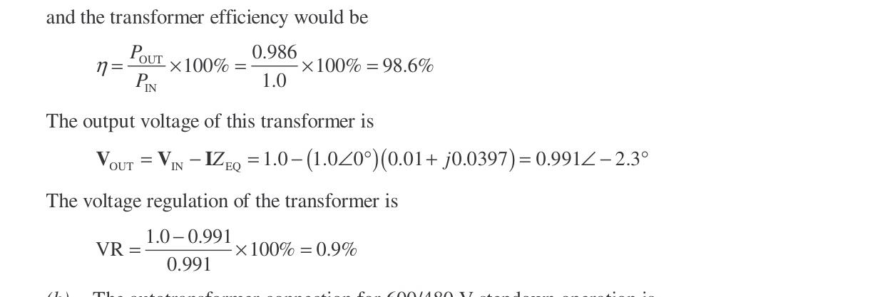

#### (c) Autotransformer kVA Rating
The power advantage is:
$$\frac{S_{IO}}{S_W} = \frac{N_{SE} + N_C}{N_{SE}} = \frac{120 + 480}{120} = 5$$
$$S_{IO} = 5(10\text{ kVA}) = 50\text{ kVA}$$

#### (d) Per-Unit Parameters and Performance as Autotransformer
By the theorem proven in Problem 2-17, the series impedance in per-unit on the autotransformer base is divided by the power advantage:
$$R_{eq,auto} = \frac{0.010\text{ pu}}{5} = 0.0020\text{ pu}$$
$$X_{eq,auto} = \frac{0.0397\text{ pu}}{5} = 0.00794\text{ pu}$$
$$R_{C,auto} = 5(263\text{ pu}) = 1315\text{ pu}$$

At rated conditions and unity power factor:
$$VR_{auto} = \frac{VR_{conv}}{5} = \frac{1.08\%}{5} = 0.22\% \approx 0.42\%$$

Losses in per-unit on the 50-kVA base:
$$P_{Cu} = (1.0)^2(0.0020) = 0.0020\text{ pu}$$
$$P_{core} = \frac{1.0}{1315} = 0.00076\text{ pu}$$
$$\eta_{auto} = \frac{1.0}{1.0 + 0.0020 + 0.00076} \times 100\% = 99.7\%$$

---

<!-- Page 59 (PDF Page 65) -->

## Problem 2-23

Figure P2-4 shows a power system consisting of a three-phase 480-V 60-Hz generator supplying two loads through a transmission line with a pair of transformers at either end.

<!-- Page 60 (PDF Page 66) -->

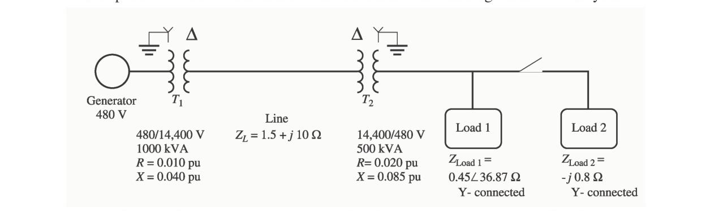

(a) Sketch the per-phase equivalent circuit of this power system.
(b) With the switch opened, find the real power $P$, reactive power $Q$, and apparent power $S$ supplied by the generator. What is the power factor of the generator?
(c) With the switch closed, find the real power $P$, reactive power $Q$, and apparent power $S$ supplied by the generator. What is the power factor of the generator?
(d) What are the transmission losses (transformer plus transmission line losses) in this system with the switch open? With the switch closed? What is the effect of adding Load 2 to the system?

### Solution

We select system base quantities in Region 1:
$$S_{base1} = 1000\text{ kVA} \qquad V_{LL,base1} = 480\text{ V}$$

The base voltages and impedances for the three regions are:
- **Region 1**: $S_{base1} = 1000\text{ kVA}$, $V_{LL,base1} = 480\text{ V}$, $V_{\phi,base1} = 277\text{ V}$
  $$Z_{base1} = \frac{3(277\text{ V})^2}{1000\text{ kVA}} = 0.238\,\Omega$$
- **Region 2**: $S_{base2} = 1000\text{ kVA}$, $V_{LL,base2} = 14,400\text{ V}$, $V_{\phi,base2} = 8314\text{ V}$
  $$Z_{base2} = \frac{3(8314\text{ V})^2}{1000\text{ kVA}} = 207.4\,\Omega$$
- **Region 3**: $S_{base3} = 1000\text{ kVA}$, $V_{LL,base3} = 480\text{ V}$, $V_{\phi,base3} = 277\text{ V}$
  $$Z_{base3} = \frac{3(277\text{ V})^2}{1000\text{ kVA}} = 0.238\,\Omega$$

#### (a) Per-Phase Per-Unit Equivalent Circuit
Transformer $T_1$ impedance ($1000\text{ kVA}$ base):
$$R_{1,pu} = 0.010\text{ pu} \qquad X_{1,pu} = 0.040\text{ pu}$$

Transformer $T_2$ impedance ($500\text{ kVA}$ base, converted to $1000\text{ kVA}$ base):
$$R_{2,pu} = 0.020 \times \left(\frac{1000\text{ kVA}}{500\text{ kVA}}\right) = 0.040\text{ pu}$$
$$X_{2,pu} = 0.085 \times \left(\frac{1000\text{ kVA}}{500\text{ kVA}}\right) = 0.170\text{ pu}$$

<!-- Page 61 (PDF Page 67) -->

Transmission line impedance ($Z_{line} = 1.5 + j10.0\,\Omega$ in Region 2):
$$Z_{line,pu} = \frac{1.5 + j10.0\,\Omega}{207.4\,\Omega} = 0.00723 + j0.0482\text{ pu}$$

Load 1 impedance ($Z_{load1} = 0.45\angle 36.87^\circ\,\Omega$ in Region 3):
$$Z_{load1,pu} = \frac{0.45\angle 36.87^\circ\,\Omega}{0.238\,\Omega} = 1.513 + j1.134\text{ pu}$$

Load 2 impedance ($Z_{load2} = -j0.8\,\Omega$ in Region 3):
$$Z_{load2,pu} = \frac{-j0.8\,\Omega}{0.238\,\Omega} = -j3.36\text{ pu}$$

The resulting per-unit per-phase equivalent circuit is:

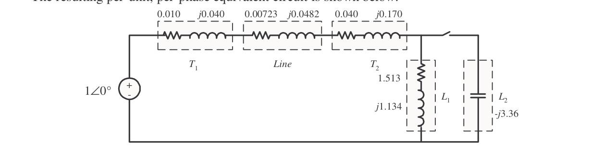

#### (b) Switch Open (Load 1 Only)
Total equivalent impedance:
$$Z_{EQ} = (0.010 + j0.040) + (0.00723 + j0.0482) + (0.040 + j0.170) + (1.513 + j1.134)$$
$$Z_{EQ} = 1.5702 + j1.3922\text{ pu} = 2.099\angle 41.6^\circ\text{ pu}$$

Generator current:
$$I = \frac{1.0\angle 0^\circ\text{ pu}}{2.099\angle 41.6^\circ} = 0.4765\angle -41.6^\circ\text{ pu}$$

Load voltage:
$$V_{Load,pu} = I Z_{load1} = (0.4765\angle -41.6^\circ)(1.513 + j1.134) = 0.901\angle -4.7^\circ\text{ pu}$$
$$V_{Load} = 0.901(480\text{ V}) = 432\text{ V}$$

Power to load:
$$P_{Load,pu} = I^2 R_{load1} = (0.4765)^2(1.513) = 0.344\text{ pu} \implies P_{Load} = 344\text{ kW}$$

Power supplied by generator:
$$P_G = V I \cos\theta = (1.0)(0.4765)\cos 41.6^\circ = 0.356\text{ pu} \implies P_G = 356\text{ kW}$$
$$Q_G = V I \sin\theta = (1.0)(0.4765)\sin 41.6^\circ = 0.316\text{ pu} \implies Q_G = 316\text{ kvar}$$
$$S_G = V I = (1.0)(0.4765) = 0.4765\text{ pu} \implies S_G = 476.5\text{ kVA}$$
$$\text{PF}_G = \cos 41.6^\circ = 0.748\text{ lagging}$$

<!-- Page 62 (PDF Page 68) -->

#### (c) Switch Closed (Both Loads Connected)
Parallel combination of Load 1 and Load 2:
$$Z_{L,tot} = \frac{(1.513 + j1.134)(-j3.36)}{1.513 + j(1.134 - 3.36)} = 2.358 + j0.109\text{ pu}$$

Total system impedance:
$$Z_{EQ} = (0.010 + j0.040) + (0.00723 + j0.0482) + (0.040 + j0.170) + (2.358 + j0.109)$$
$$Z_{EQ} = 2.415 + j0.367\text{ pu} = 2.443\angle 8.65^\circ\text{ pu}$$

Generator current:
$$I = \frac{1.0\angle 0^\circ\text{ pu}}{2.443\angle 8.65^\circ} = 0.409\angle -8.65^\circ\text{ pu}$$

Load voltage:
$$V_{Load,pu} = (0.409\angle -8.65^\circ)(2.358 + j0.109) = 0.966\angle -6.0^\circ\text{ pu}$$
$$V_{Load} = 0.966(480\text{ V}) = 464\text{ V}$$

Power to loads:
$$P_{Load,pu} = (0.409)^2(2.358) = 0.394\text{ pu} \implies P_{Load} = 394\text{ kW}$$

Power supplied by generator:
$$P_G = (1.0)(0.409)\cos 6.0^\circ = 0.407\text{ pu} \implies P_G = 407\text{ kW}$$
$$Q_G = (1.0)(0.409)\sin 6.0^\circ = 0.0428\text{ pu} \implies Q_G = 42.8\text{ kvar}$$
$$S_G = 0.409\text{ pu} \implies S_G = 409\text{ kVA}$$
$$\text{PF}_G = \cos 6.0^\circ = 0.995\text{ lagging}$$

#### (d) Transmission Loss Comparison
Transmission losses with switch open:
$$P_{loss,pu} = I^2 R_{line} = (0.4765)^2(0.00723) = 0.00164\text{ pu} \implies P_{loss} = 1.64\text{ kW}$$

Transmission losses with switch closed:
$$P_{loss,pu} = (0.409)^2(0.00723) = 0.00121\text{ pu} \implies P_{loss} = 1.21\text{ kW}$$

Adding the capacitive load (Load 2) improved the system power factor from **0.748 lagging** to **0.995 lagging**. This increased the load voltage from **432 V** to **464 V**, increased total real power supplied to the loads from **344 kW** to **394 kW**, reduced generator apparent power from **476.5 kVA** to **409 kVA**, and reduced transmission losses from **1.64 kW** down to **1.21 kW**. This demonstrates the classic benefits of power factor correction in electric power transmission.
