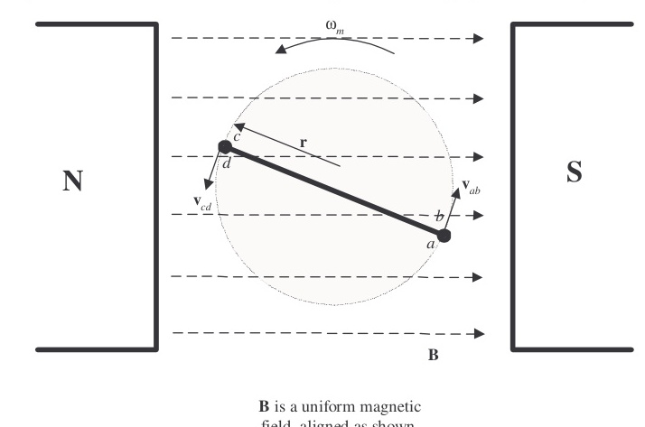
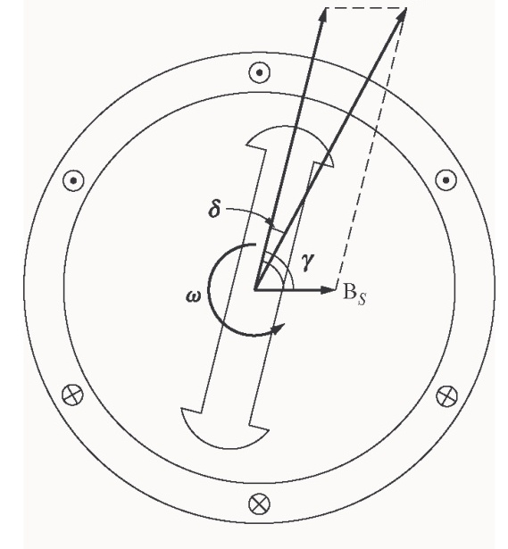
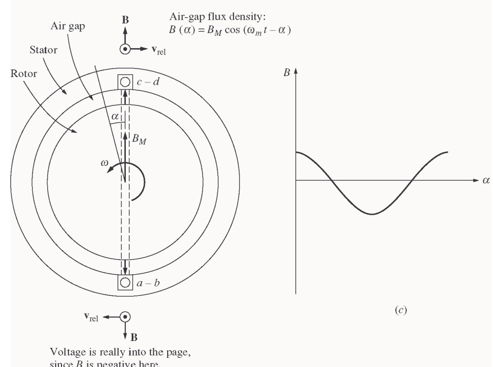

# Chapter 4: AC Machinery Fundamentals

> **Instructor's Manual to accompany *Electric Machinery Fundamentals*, Fourth Edition**  
> Stephen J. Chapman, BAE SYSTEMS Australia  
> Digitized solutions for **ECE 2207: Electrical Machines-I**

---

<!-- Page 103 (PDF Page 109) -->

## Problem 4-1

The simple loop rotating in a uniform magnetic field shown in Figure 4-1 has the following characteristics:

$$\mathbf{B} = 0.5\text{ T to the right} \qquad r = 0.1\text{ m}$$

$$l = 0.5\text{ m} \qquad \omega = 103\text{ rad/s}$$

*(a)* Calculate the voltage $e_{\text{tot}}(t)$ induced in this rotating loop.  
*(b)* Suppose that a $5\ \Omega$ resistor is connected as a load across the terminals of the loop. Calculate the current that would flow through the resistor.  
*(c)* Calculate the magnitude and direction of the induced torque on the loop for the conditions in *(b)*.  
*(d)* Calculate the electric power being generated by the loop for the conditions in *(b)*.  
*(e)* Calculate the mechanical power being consumed by the loop for the conditions in *(b)*. How does this number compare to the amount of electric power being generated by the loop?



### Solution

**(a)** The induced voltage on a simple rotating loop is given by:

$$e_{\text{ind}}(t) = 2r\omega Bl \sin\omega t \tag{4-8}$$

$$e_{\text{ind}}(t) = 2(0.1\text{ m})(103\text{ rad/s})(0.5\text{ T})(0.5\text{ m}) \sin 103t$$

$$e_{\text{ind}}(t) = 5.15 \sin 103t\text{ V}$$

**(b)** If a $5\ \Omega$ resistor is connected as a load across the terminals of the loop, the current flow would be:

$$i(t) = \frac{e_{\text{ind}}}{R} = \frac{5.15 \sin 103t\text{ V}}{5\ \Omega} = 1.03 \sin 103t\text{ A}$$

**(c)** The induced torque would be:

$$\tau_{\text{ind}}(t) = 2rilB \sin\theta \tag{4-17}$$

$$\tau_{\text{ind}}(t) = 2(0.1\text{ m})(1.03 \sin\omega t\text{ A})(0.5\text{ m})(0.5\text{ T}) \sin\omega t$$

$$\tau_{\text{ind}}(t) = 0.0515 \sin^2\omega t\text{ N}\cdot\text{m, counterclockwise}$$

**(d)** The instantaneous power generated by the loop is:

<!-- Page 104 (PDF Page 110) -->

$$P(t) = e_{\text{ind}} i = (5.15 \sin\omega t\text{ V})(1.03 \sin\omega t\text{ A}) = 5.30 \sin^2\omega t\text{ W}$$

The average power generated by the loop is:

$$P_{\text{ave}} = \frac{1}{T} \int_T 5.30 \sin^2\omega t\, dt = 2.65\text{ W}$$

**(e)** The mechanical power being consumed by the loop is:

$$P = \tau_{\text{ind}} \omega = (0.0515 \sin^2\omega t\text{ V})(103\text{ rad/s}) = 5.30 \sin^2\omega t\text{ W}$$

Note that the amount of mechanical power consumed by the loop is equal to the amount of electrical power created by the loop. This machine is acting as a generator, converting mechanical power into electrical power.

---

## Problem 4-2

Develop a table showing the speed of magnetic field rotation in ac machines of $2, 4, 6, 8, 10, 12$, and $14$ poles operating at frequencies of $50, 60$, and $400\text{ Hz}$.

### Solution

The equation relating the speed of magnetic field rotation to the number of poles and electrical frequency is:

$$n_m = \frac{120 f_e}{P}$$

The resulting table is:

| Number of Poles | $f_e = 50\text{ Hz}$ | $f_e = 60\text{ Hz}$ | $f_e = 400\text{ Hz}$ |
| :---: | :---: | :---: | :---: |
| 2 | $3000\text{ r/min}$ | $3600\text{ r/min}$ | $24000\text{ r/min}$ |
| 4 | $1500\text{ r/min}$ | $1800\text{ r/min}$ | $12000\text{ r/min}$ |
| 6 | $1000\text{ r/min}$ | $1200\text{ r/min}$ | $8000\text{ r/min}$ |
| 8 | $750\text{ r/min}$ | $900\text{ r/min}$ | $6000\text{ r/min}$ |
| 10 | $600\text{ r/min}$ | $720\text{ r/min}$ | $4800\text{ r/min}$ |
| 12 | $500\text{ r/min}$ | $600\text{ r/min}$ | $4000\text{ r/min}$ |
| 14 | $428.6\text{ r/min}$ | $514.3\text{ r/min}$ | $3429\text{ r/min}$ |

---

## Problem 4-3

A three-phase four-pole winding is installed in 12 slots on a stator. There are 40 turns of wire in each slot of the windings. All coils in each phase are connected in series, and the three phases are connected in $\Delta$. The flux per pole in the machine is $0.060\text{ Wb}$, and the speed of rotation of the magnetic field is $1800\text{ r/min}$.

*(a)* What is the frequency of the voltage produced in this winding?  
*(b)* What are the resulting phase and terminal voltages of this stator?

### Solution

**(a)** The frequency of the voltage produced in this winding is:

$$f_e = \frac{n_m P}{120} = \frac{(1800\text{ r/min})(4\text{ poles})}{120} = 60\text{ Hz}$$

**(b)** There are 12 slots on this stator, with 40 turns of wire per slot. Since this is a four-pole machine, there are two sets of coils (4 slots) associated with each phase. The voltage in the coils in one pair of slots is:

$$E_A = \sqrt{2}\pi N_c \phi f = \sqrt{2}\pi (40\text{ t})(0.060\text{ Wb})(60\text{ Hz}) = 640\text{ V}$$

There are two sets of coils per phase, since this is a four-pole machine, and they are connected in series, so the total phase voltage is:

<!-- Page 105 (PDF Page 111) -->

$$V_\phi = 2(640\text{ V}) = 1280\text{ V}$$

Since the machine is $\Delta$-connected, $V_L = V_\phi = 1280\text{ V}$.

---

## Problem 4-4

A three-phase Y-connected 50-Hz two-pole synchronous machine has a stator with 2000 turns of wire per phase. What rotor flux would be required to produce a terminal (line-to-line) voltage of $6\text{ kV}$?

### Solution

The phase voltage of this machine should be $V_\phi = V_L / \sqrt{3} = 3464\text{ V}$. The induced voltage per phase in this machine (which is equal to $V_\phi$ at no-load conditions) is given by the equation:

$$E_A = \sqrt{2}\pi N_c \phi f$$

so:

$$\phi = \frac{E_A}{\sqrt{2}\pi N_c f} = \frac{3464\text{ V}}{\sqrt{2}\pi (2000\text{ t})(50\text{ Hz})} = 0.0078\text{ Wb}$$

---

## Problem 4-5

Modify the MATLAB program in Example 4-1 by swapping the currents flowing in any two phases. What happens to the resulting net magnetic field?

### Solution

This modification is very simple—just swap the currents supplied to two of the three phases.

```matlab
% M-file: mag_field2.m
% M-file to calculate the net magnetic field produced
% by a three-phase stator.

% Set up the basic conditions
bmax = 1;               % Normalize bmax to 1
freq = 60;              % 60 Hz
w = 2*pi*freq;          % angular velocity (rad/s)

% First, generate the three component magnetic fields
t = 0:1/6000:1/60;
Baa = sin(w*t) .* (cos(0) + j*sin(0));
Bbb = sin(w*t+2*pi/3) .* (cos(2*pi/3) + j*sin(2*pi/3));
Bcc = sin(w*t-2*pi/3) .* (cos(-2*pi/3) + j*sin(-2*pi/3));

% Calculate Bnet
Bnet = Baa + Bbb + Bcc;

% Calculate a circle representing the expected maximum
% value of Bnet
circle = 1.5 * (cos(w*t) + j*sin(w*t));

% Plot the magnitude and direction of the resulting magnetic
% fields. Note that Baa is black, Bbb is blue, Bcc is
% magenta, and Bnet is red.
for ii = 1:length(t)
    % Plot the reference circle
    plot(circle, 'k');
    hold on;
    
    % Plot the four magnetic fields
    plot([0 real(Baa(ii))], [0 imag(Baa(ii))], 'k', 'LineWidth', 2);
    plot([0 real(Bbb(ii))], [0 imag(Bbb(ii))], 'b', 'LineWidth', 2);
```

<!-- Page 106 (PDF Page 112) -->

```matlab
    plot([0 real(Bcc(ii))], [0 imag(Bcc(ii))], 'm', 'LineWidth', 2);
    plot([0 real(Bnet(ii))], [0 imag(Bnet(ii))], 'r', 'LineWidth', 3);
    axis square;
    axis([-2 2 -2 2]);
    drawnow;
    hold off;
end
```

When this program executes, the net magnetic field rotates clockwise, instead of counterclockwise.

---

## Problem 4-6

If an ac machine has the rotor and stator magnetic fields shown in Figure P4-1, what is the direction of the induced torque in the machine? Is the machine acting as a motor or generator?



### Solution

Since $\boldsymbol{\tau}_{\text{ind}} = k\mathbf{B}_R \times \mathbf{B}_{\text{net}}$, the induced torque is *clockwise*, opposite the direction of motion. The machine is acting as a *generator*.

---

## Problem 4-7

The flux density distribution over the surface of a two-pole stator of radius $r$ and length $l$ is given by:

$$B = B_M \cos(\omega_m t - \alpha) \tag{4-37b}$$

Prove that the total flux under each pole face is:

$$\phi = 2rl B_M$$

<!-- Page 107 (PDF Page 113) -->



### Solution

The total flux under a pole face is given by the equation:

$$\phi = \int \mathbf{B} \cdot d\mathbf{A}$$

Under a pole face, the flux density $\mathbf{B}$ is always parallel to the vector $d\mathbf{A}$, since the flux density is always perpendicular to the surface of the rotor and stator in the air gap. Therefore,

$$\phi = \int B\, dA$$

A differential area on the surface of a cylinder is given by the differential length along the cylinder ($dl$) times the differential width around the radius of the cylinder ($r\, d\theta$).

$$dA = (dl)(r\, d\theta) \qquad \text{where } r \text{ is the radius of the cylinder}$$

Therefore, the flux under the pole face is:

$$\phi = \int B\, dl\, r\, d\theta$$

Since $r$ is constant and $B$ is constant with respect to $l$, this equation reduces to:

$$\phi = rl \int B\, d\theta$$

Now, $B = B_M \cos(\omega t - \alpha) = B_M \cos\theta$ (when we substitute $\theta = \omega t - \alpha$), so:

$$\phi = rl \int B\, d\theta$$

$$\phi = rl \int_{-\pi/2}^{\pi/2} B_M \cos\theta\, d\theta = rl B_M [\sin\theta]_{-\pi/2}^{\pi/2} = rl B_M [1 - (-1)]$$

$$\phi = 2rl B_M$$

---

<!-- Page 108 (PDF Page 114) -->

## Problem 4-8

In the early days of ac motor development, machine designers had great difficulty controlling the core losses (hysteresis and eddy currents) in machines. They had not yet developed steels with low hysteresis, and were not making laminations as thin as the ones used today. To help control these losses, early ac motors in the USA were run from a $25\text{ Hz}$ ac power supply, while lighting systems were run from a separate $60\text{ Hz}$ ac power supply.

*(a)* Develop a table showing the speed of magnetic field rotation in ac machines of $2, 4, 6, 8, 10, 12$, and $14$ poles operating at $25\text{ Hz}$. What was the fastest rotational speed available to these early motors?  
*(b)* For a given motor operating at a constant flux density $B$, how would the core losses of the motor running at $25\text{ Hz}$ compare to the core losses of the motor running at $60\text{ Hz}$?  
*(c)* Why did the early engineers provide a separate $60\text{ Hz}$ power system for lighting?

### Solution

**(a)** The equation relating the speed of magnetic field rotation to the number of poles and electrical frequency is:

$$n_m = \frac{120 f_e}{P}$$

The resulting table is:

| Number of Poles | $f_e = 25\text{ Hz}$ |
| :---: | :---: |
| 2 | $1500\text{ r/min}$ |
| 4 | $750\text{ r/min}$ |
| 6 | $500\text{ r/min}$ |
| 8 | $375\text{ r/min}$ |
| 10 | $300\text{ r/min}$ |
| 12 | $250\text{ r/min}$ |
| 14 | $214.3\text{ r/min}$ |

The highest possible rotational speed was $1500\text{ r/min}$.

**(b)** Core losses scale according to the $1.5^{\text{th}}$ power of the speed of rotation, so the ratio of the core losses at $25\text{ Hz}$ to the core losses at $60\text{ Hz}$ (for a given machine) would be:

$$\text{ratio} = \left(\frac{1500}{3600}\right)^{1.5} = 0.269\text{ or } 26.9\%$$

**(c)** At $25\text{ Hz}$, the light from incandescent lamps would visibly flicker in a very annoying way.
