# Chapter 7: Induction Motors

## Chapter Overview & Problem Directory

| Problem | Key Topics / Content | Page (Book) | Page (PDF) | Key Results |
|:---|:---|:---:|:---:|:---|
| **7-1** | DC Test on $\Delta$-Connected Stator | 171 | 177 | $R_1 = 0.45\,\Omega$ |
| **7-2** | Synchronous speed, rotor speed, slip speed, rotor frequency | 171 | 177 | $n_{sync}=3000\text{ r/min}$, $n_m=2850\text{ r/min}$, $n_{slip}=150\text{ r/min}$, $f_r=2.5\text{ Hz}$ |
| **7-3** | 4-pole, 208-V, 60-Hz induction motor speed & slip calculations | 171–172 | 177–178 | $n_{sync}=1800\text{ r/min}$, $n_m=1710\text{ r/min}$, $n_{slip}=90\text{ r/min}$, $f_r=3.0\text{ Hz}$ |
| **7-4** | Power flow: input power, copper losses, core loss, converted power, output power, efficiency | 172 | 178 | $P_{in}=42.4\text{ kW}$, $P_{conv}=40.1\text{ kW}$, $P_{out}=39.0\text{ kW}$, $\eta=92.0\%$ |
| **7-5** | Shaft speed, output power, load torque, induced torque, rotor frequency | 172–173 | 178–179 | $n_m=940\text{ r/min}$, $\tau_{load}=508\text{ N}\cdot\text{m}$, $\tau_{ind}=517\text{ N}\cdot\text{m}$, $f_r=3.0\text{ Hz}$ |
| **7-6** | No-load/full-load slip, rotor frequency, speed regulation | 173 | 179 | $s_{nl}=0.56\%$, $s_{fl}=4.44\%$, $SR=4.1\%$ |
| **7-7** | Complete equivalent circuit analysis (per-phase model): $I_L$, $P_{SCL}$, $P_{AG}$, $P_{conv}$, $\tau_{ind}$, $\tau_{load}$, $\eta$, $n_m$, $\omega_m$ | 174–175 | 180–181 | $I_L=44.8\text{ A}$, $P_{AG}=13.4\text{ kW}$, $\tau_{ind}=35.5\text{ N}\cdot\text{m}$, $\eta=84.5\%$ |
| **7-8** | Pullout torque $\tau_{max}$ and pullout slip $s_{max}$ using Thévenin equivalent | 175–176 | 181–182 | $s_{max}=0.144$, $\tau_{max}=53.1\text{ N}\cdot\text{m}$ |
| **7-9** | MATLAB simulation: torque-speed & output power-speed characteristics | 177–179 | 183–185 | Full MATLAB scripts & plotted characteristics |
| **7-10** | External rotor resistance for maximum torque at starting condition | 179–180 | 185–186 | $R_{add}=0.713\,\Omega$, torque-speed curve plot |
| **7-11** | Derating for 50-Hz operation from 60-Hz design; equivalent circuit & performance | 180–181 | 186–187 | $V_\phi$ reduced by $5/6$; $I_L=43.9\text{ A}$, $P_{AG}=11.1\text{ kW}$, $\tau_{ind}=35.3\text{ N}\cdot\text{m}$ |
| **7-12** | Circuit model with core loss resistor $R_C$ parallel to $X_M$ | 181–182 | 187–188 | Full derivation & modified per-phase circuit equations |
| **7-13** | Quadratic fan/pump load torque ($T_{load} \propto \omega_m^2$); operating point determination | 182–184 | 188–190 | Equilibrium operating speed & torque derivation |
| **7-14** | Complete parameter extraction from DC, No-Load, and Locked-Rotor tests | 184–186 | 190–192 | $R_1=0.075\,\Omega$, $R_2=0.065\,\Omega$, $X_1=0.170\,\Omega$, $X_2=0.170\,\Omega$, $X_M=7.2\,\Omega$ |
| **7-15** | Efficiency calculation for motor of Problem 7-14 at rated conditions | 186–187 | 192–193 | Full power balance & $\eta=88.7\%$ |
| **7-16** | Parameter extraction for 208-V, 2-pole Design Class B induction motor | 187–188 | 193–194 | $R_1=0.0731\,\Omega$, $R_2=0.065\,\Omega$, $X_M=5.6\,\Omega$, $\tau_{max}=507\text{ N}\cdot\text{m}$ |
| **7-17** | Comprehensive MATLAB analysis: $\tau_{ind}$, $P_{conv}$, $P_{out}$, $\eta$ vs. speed | 188–191 | 194–197 | 4 MATLAB plots; rated $75\text{ kW}$ at $s=3.1\%$ ($2907\text{ r/min}$) |
| **7-18** | Parameter extraction & MATLAB torque-speed curve for Design Class B motor | 191–194 | 197–200 | $R_1=0.105\,\Omega$, $R_2=0.071\,\Omega$, $X_M=5.244\,\Omega$, torque-speed curve |
| **7-19** | Determination of rotor resistance $R_2$ from full-load operating point; $\tau_{max}$, starting torque, NEMA code letter | 194–197 | 200–203 | $R_2=0.172\,\Omega$, $\tau_{max}=448\text{ N}\cdot\text{m}$, $\tau_{start}=199\text{ N}\cdot\text{m}$, Code Letter D |
| **7-20** | Across-the-line starting vs. transmission line impedance vs. autotransformer starter | 197–199 | 203–205 | Bus starting $I_{start}=274\text{ A}$; line sag $30\%$; autotransformer sag $17.3\%$ |
| **7-21** | Wye-Delta ($\text{Y}$-$\Delta$) reduced-voltage starter analysis | 199–200 | 205–206 | Phase voltage $57.7\%$, starting line current reduced by factor of $3$ ($33.3\%$) |
| **7-22** | Autotransformer starter design for 100-hp motor to limit starting torque to rated torque | 200–201 | 206–207 | $V_{start}=334\text{ V}$, $I_{start,motor}=637\text{ A}$, $I_{line}=463\text{ A}$ |
| **7-23** | Effect of inserting external rotor resistance in wound-rotor motor at $25\%$ load | 201–202 | 207–208 | Qualitative analysis for $s, n_m, E_r, I_r, \tau_{ind}, P_{out}, P_{RCL}, \eta$ |
| **7-24** | Starting current analysis for Code Letter E motor with across-the-line, Y-$\Delta$, and autotransformer | 202 | 208 | $I_{start}=471\text{ A}$ (line), $157\text{ A}$ ($\text{Y}$-$\Delta$), $301\text{ A}$ (autotransformer) |
| **7-25** | Rapid stopping by plugging: slip, rotor frequency, and plugging torque | 203 | 209 | Initial $s=1.962$, $f_r=117.7\text{ Hz}$, $\tau_{plugging}=110\text{ N}\cdot\text{m}$ (braking) |

---

<!-- Page 171 (PDF Page 177) -->

## Problem 7-1

A dc test is performed on a 460-V, $\Delta$-connected, four-pole, 75-hp, 60-Hz induction motor. If $V_{DC} = 24\text{ V}$ and $I_{DC} = 80\text{ A}$, calculate the per-phase stator resistance $R_1$ for this machine.

### Solution

If this motor's armature is $\Delta$-connected, the circuit during the DC test is:


Therefore, the equivalent resistance seen by the DC source across two terminals is:
$$R_{DC} = \frac{V_{DC}}{I_{DC}} = \frac{R_1(R_1 + R_1)}{R_1 + (R_1 + R_1)} = \frac{2 R_1^2}{3 R_1} = \frac{2}{3} R_1$$

Solving for the stator resistance per phase $R_1$:
$$R_1 = \frac{3}{2} R_{DC} = \frac{3}{2} \frac{V_{DC}}{I_{DC}}$$

$$R_1 = \frac{3}{2} \left(\frac{24\text{ V}}{80\text{ A}}\right) = 0.45\,\Omega$$

---

## Problem 7-2

A 220-V, three-phase, two-pole, 50-Hz induction motor is running at a slip of 5 percent. Find:
(a) The speed of the magnetic fields in revolutions per minute
(b) The speed of the rotor in revolutions per minute
(c) The slip speed of the rotor
(d) The rotor frequency in hertz

### Solution

#### (a)
The speed of the magnetic fields (synchronous speed) is:
$$n_{sync} = \frac{120 f_e}{P} = \frac{120(50\text{ Hz})}{2} = 3000\text{ r/min}$$

#### (b)
The speed of the rotor is:
$$n_m = (1 - s)n_{sync} = (1 - 0.05)(3000\text{ r/min}) = 2850\text{ r/min}$$

#### (c)
The slip speed of the rotor is:
$$n_{slip} = s n_{sync} = (0.05)(3000\text{ r/min}) = 150\text{ r/min}$$

#### (d)
The rotor frequency is:
$$f_r = s f_e = \frac{n_{slip} P}{120} = \frac{(150\text{ r/min})(2)}{120} = 2.5\text{ Hz}$$

---

<!-- Page 172 (PDF Page 178) -->

## Problem 7-3

Answer the questions in Problem 7-2 for a 208-V, four-pole, 60-Hz induction motor running at a slip of 5 percent.

### Solution

#### (a)
The speed of the magnetic fields (synchronous speed) is:
$$n_{sync} = \frac{120 f_e}{P} = \frac{120(60\text{ Hz})}{4} = 1800\text{ r/min}$$

#### (b)
The speed of the rotor is:
$$n_m = (1 - s)n_{sync} = (1 - 0.05)(1800\text{ r/min}) = 1710\text{ r/min}$$

#### (c)
The slip speed of the rotor is:
$$n_{slip} = s n_{sync} = (0.05)(1800\text{ r/min}) = 90\text{ r/min}$$

#### (d)
The rotor frequency is:
$$f_r = s f_e = (0.05)(60\text{ Hz}) = 3.0\text{ Hz}$$

---

## Problem 7-4

A three-phase, 60-Hz induction motor runs at 840 r/min when driven from a 60-Hz source.
(a) How many poles does this motor have?
(b) What is the slip at rated load?
(c) What is the speed at one-quarter of the rated load?
(d) What is the rotor's electrical frequency at one-quarter of the rated load?

### Solution

#### (a)
The synchronous speed must be greater than 840 r/min. For standard pole counts at 60 Hz:
- 2 poles: $n_{sync} = 3600\text{ r/min}$
- 4 poles: $n_{sync} = 1800\text{ r/min}$
- 6 poles: $n_{sync} = 1200\text{ r/min}$
- 8 poles: $n_{sync} = \frac{120(60)}{8} = 900\text{ r/min}$

Since 840 r/min is just below 900 r/min, this machine must have **8 poles**, with $n_{sync} = 900\text{ r/min}$.

#### (b)
The slip at rated load is:
$$s = \frac{n_{sync} - n_m}{n_{sync}} \times 100\% = \frac{900 - 840}{900} \times 100\% = 6.67\%$$

#### (c)
The motor is operating in the linear region of its torque-speed curve, so the slip at $\frac{1}{4}$ load will be:
$$s = 0.25(0.0667) = 0.0167$$

The resulting speed is:
$$n_m = (1 - s)n_{sync} = (1 - 0.0167)(900\text{ r/min}) = 885\text{ r/min}$$

#### (d)
The electrical frequency at $\frac{1}{4}$ load is:
$$f_r = s f_e = (0.0167)(60\text{ Hz}) = 1.00\text{ Hz}$$

---

<!-- Page 173 (PDF Page 179) -->

## Problem 7-5

A 50-kW, 440-V, 50-Hz, six-pole induction motor has a slip of 6 percent when operating at full-load conditions. At full-load conditions, the friction and windage losses are 300 W, and the core losses are 600 W. Find the following values for full-load conditions:
(a) The shaft speed $n_m$
(b) The output power in watts
(c) The load torque $\tau_{load}$ in newton-meters
(d) The induced torque $\tau_{ind}$ in newton-meters
(e) The rotor frequency in hertz

### Solution

#### (a)
The synchronous speed of this machine is:
$$n_{sync} = \frac{120 f_e}{P} = \frac{120(50\text{ Hz})}{6} = 1000\text{ r/min}$$

Therefore, the shaft speed is:
$$n_m = (1 - s)n_{sync} = (1 - 0.06)(1000\text{ r/min}) = 940\text{ r/min}$$

#### (b)
The output power in watts is **50 kW** (stated in the problem).

#### (c)
The load torque is:
$$\tau_{load} = \frac{P_{OUT}}{\omega_m} = \frac{50\text{ kW}}{(940\text{ r/min})\left(\frac{2\pi\text{ rad}}{1\text{ r}}\right)\left(\frac{1\text{ min}}{60\text{ s}}\right)} = 508\text{ N}\cdot\text{m}$$

#### (d)
The induced torque can be found from the converted power $P_{conv}$:
$$P_{conv} = P_{OUT} + P_{F\&W} + P_{core} + P_{misc} = 50\text{ kW} + 300\text{ W} + 600\text{ W} + 0\text{ W} = 50.9\text{ kW}$$

$$\tau_{ind} = \frac{P_{conv}}{\omega_m} = \frac{50.9\text{ kW}}{(940\text{ r/min})\left(\frac{2\pi\text{ rad}}{1\text{ r}}\right)\left(\frac{1\text{ min}}{60\text{ s}}\right)} = 517\text{ N}\cdot\text{m}$$

#### (e)
The rotor frequency is:
$$f_r = s f_e = (0.06)(50\text{ Hz}) = 3.00\text{ Hz}$$

---

## Problem 7-6

A three-phase, 60-Hz, four-pole induction motor runs at a no-load speed of 1790 r/min and a full-load speed of 1720 r/min. Calculate the slip and the electrical frequency of the rotor at no-load and full-load conditions. What is the speed regulation of this motor [Equation (4-68)]?

### Solution

The synchronous speed of this machine is:
$$n_{sync} = \frac{120(60\text{ Hz})}{4} = 1800\text{ r/min}$$

The slip and electrical frequency at no-load conditions are:
$$s_{nl} = \frac{n_{sync} - n_{nl}}{n_{sync}} \times 100\% = \frac{1800 - 1790}{1800} \times 100\% = 0.56\%$$

$$f_{r,nl} = s_{nl} f_e = (0.0056)(60\text{ Hz}) = 0.33\text{ Hz}$$

The slip and electrical frequency at full-load conditions are:
$$s_{fl} = \frac{n_{sync} - n_{fl}}{n_{sync}} \times 100\% = \frac{1800 - 1720}{1800} \times 100\% = 4.44\%$$

$$f_{r,fl} = s_{fl} f_e = (0.0444)(60\text{ Hz}) = 2.67\text{ Hz}$$

The speed regulation is:
$$SR = \frac{n_{nl} - n_{fl}}{n_{fl}} \times 100\% = \frac{1790 - 1720}{1720} \times 100\% = 4.1\%$$

---

<!-- Page 174 (PDF Page 180) -->

## Problem 7-7

A 208-V, two-pole, 60-Hz Y-connected wound-rotor induction motor is rated at 15 hp. Its equivalent circuit components are:
$$R_1 = 0.200\,\Omega \qquad R_2 = 0.120\,\Omega \qquad X_M = 15.0\,\Omega$$
$$X_1 = 0.410\,\Omega \qquad X_2 = 0.410\,\Omega$$
$$P_{mech} = 250\text{ W} \qquad P_{core} = 180\text{ W} \qquad P_{misc} \approx 0$$

For a slip of 0.05, find:
(a) The line current $I_L$
(b) The stator copper losses $P_{SCL}$
(c) The air-gap power $P_{AG}$
(d) The power converted from electrical to mechanical form $P_{conv}$
(e) The induced torque $\tau_{ind}$
(f) The load torque $\tau_{load}$
(g) The overall machine efficiency
(h) The motor speed in revolutions per minute and radians per second

### Solution

The equivalent circuit of this induction motor is shown below:

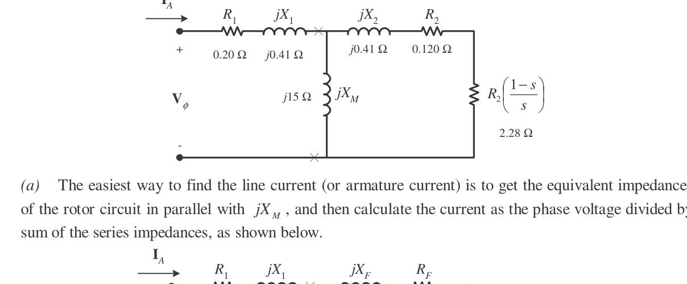

#### (a) Line Current $I_L$
The easiest way to find the line current (or armature current) is to get the equivalent impedance $Z_F$ of the rotor circuit in parallel with $jX_M$, and then calculate the current as the phase voltage divided by the sum of the series impedances:

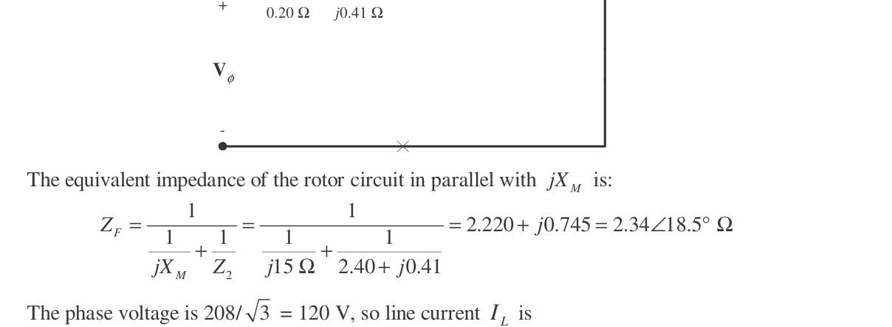

The equivalent impedance of the rotor circuit in parallel with $jX_M$ is:
$$Z_F = \frac{1}{\frac{1}{jX_M} + \frac{1}{Z_2}} = \frac{1}{\frac{1}{j15\,\Omega} + \frac{1}{\frac{0.120}{0.05} + j0.41\,\Omega}} = \frac{1}{\frac{1}{j15\,\Omega} + \frac{1}{2.40 + j0.41\,\Omega}}$$
$$Z_F = 2.220 + j0.745\,\Omega = 2.34\angle 18.5^\circ\,\Omega$$

The phase voltage is $V_\phi = \frac{208}{\sqrt{3}} = 120\text{ V}$, so line current $I_L$ is:
$$I_L = I_A = \frac{V_\phi}{R_1 + jX_1 + R_F + jX_F} = \frac{120\angle 0^\circ\text{ V}}{0.20\,\Omega + j0.41\,\Omega + 2.22\,\Omega + j0.745\,\Omega}$$

<!-- Page 175 (PDF Page 181) -->

$$I_L = I_A = 44.8\angle -25.5^\circ\text{ A}$$

#### (b) Stator Copper Losses $P_{SCL}$
$$P_{SCL} = 3 I_A^2 R_1 = 3(44.8\text{ A})^2(0.20\,\Omega) = 1205\text{ W}$$

#### (c) Air-Gap Power $P_{AG}$
$$P_{AG} = 3 I_2^2 \frac{R_2}{s} = 3 I_A^2 R_F$$
*(Note that $3 I_A^2 R_F$ is equal to $3 I_2^2 \frac{R_2}{s}$, since the only resistance in the original rotor circuit was $R_2/s$, and the resistance in the Thévenin equivalent circuit is $R_F$. The power consumed by the equivalent circuit must be the same as the power consumed by the original circuit.)*

$$P_{AG} = 3(44.8\text{ A})^2(2.220\,\Omega) = 13.4\text{ kW}$$

#### (d) Power Converted $P_{conv}$
$$P_{conv} = (1 - s)P_{AG} = (1 - 0.05)(13.4\text{ kW}) = 12.73\text{ kW}$$

#### (e) Induced Torque $\tau_{ind}$
$$\tau_{ind} = \frac{P_{AG}}{\omega_{sync}} = \frac{13.4\text{ kW}}{(3600\text{ r/min})\left(\frac{2\pi\text{ rad}}{1\text{ r}}\right)\left(\frac{1\text{ min}}{60\text{ s}}\right)} = 35.5\text{ N}\cdot\text{m}$$

#### (f) Load Torque $\tau_{load}$
The output power of this motor is:
$$P_{OUT} = P_{conv} - P_{mech} - P_{core} - P_{misc} = 12.73\text{ kW} - 250\text{ W} - 180\text{ W} - 0\text{ W} = 12.3\text{ kW}$$

The output speed is:
$$n_m = (1 - s)n_{sync} = (1 - 0.05)(3600\text{ r/min}) = 3420\text{ r/min}$$

Therefore the load torque is:
$$\tau_{load} = \frac{P_{OUT}}{\omega_m} = \frac{12.3\text{ kW}}{(3420\text{ r/min})\left(\frac{2\pi\text{ rad}}{1\text{ r}}\right)\left(\frac{1\text{ min}}{60\text{ s}}\right)} = 34.3\text{ N}\cdot\text{m}$$

#### (g) Overall Efficiency $\eta$
$$\eta = \frac{P_{OUT}}{P_{IN}} \times 100\% = \frac{P_{OUT}}{3 V_\phi I_A \cos\theta} \times 100\%$$
$$\eta = \frac{12.3\text{ kW}}{3(120\text{ V})(44.8\text{ A})\cos 25.5^\circ} \times 100\% = 84.5\%$$

#### (h) Motor Speed
The motor speed in revolutions per minute is **3420 r/min**. The motor speed in radians per second is:
$$\omega_m = (3420\text{ r/min})\left(\frac{2\pi\text{ rad}}{1\text{ r}}\right)\left(\frac{1\text{ min}}{60\text{ s}}\right) = 358\text{ rad/s}$$

---

<!-- Page 176 (PDF Page 182) -->

## Problem 7-8

For the motor in Problem 7-7, what is the slip at the pullout torque? What is the pullout torque of this motor?

### Solution

The slip at pullout torque is found by calculating the Thévenin equivalent of the input circuit from the rotor back to the power supply, and then using that with the rotor circuit model.

$$Z_{TH} = \frac{jX_M (R_1 + jX_1)}{R_1 + j(X_1 + X_M)} = \frac{(j15\,\Omega)(0.20\,\Omega + j0.41\,\Omega)}{0.20\,\Omega + j(0.41\,\Omega + 15\,\Omega)}$$
$$Z_{TH} = 0.1895 + j0.4016\,\Omega = 0.444\angle 64.7^\circ\,\Omega$$

$$V_{TH} = \frac{jX_M}{R_1 + j(X_1 + X_M)} V_\phi = \frac{(j15\,\Omega)(120\angle 0^\circ\text{ V})}{0.20\,\Omega + j(0.41\,\Omega + 15\,\Omega)} = 116.8\angle 0.7^\circ\text{ V}$$

The slip at pullout torque is:
$$s_{max} = \frac{R_2}{\sqrt{R_{TH}^2 + (X_{TH} + X_2)^2}}$$
$$s_{max} = \frac{0.120\,\Omega}{\sqrt{(0.1895\,\Omega)^2 + (0.4016\,\Omega + 0.410\,\Omega)^2}} = 0.144$$

The pullout torque of the motor is:
$$\tau_{max} = \frac{3 V_{TH}^2}{2 \omega_{sync} \left[R_{TH} + \sqrt{R_{TH}^2 + (X_{TH} + X_2)^2}\right]}$$

<!-- Page 177 (PDF Page 183) -->

$$\tau_{max} = \frac{3(116.8\text{ V})^2}{2(377\text{ rad/s})\left[0.1895\,\Omega + \sqrt{(0.1895\,\Omega)^2 + (0.4016\,\Omega + 0.410\,\Omega)^2}\right]} = 53.1\text{ N}\cdot\text{m}$$

---

## Problem 7-9

(a) Calculate and plot the torque-speed characteristic of the motor in Problem 7-7.
(b) Calculate and plot the output power versus speed curve of the motor in Problem 7-7.

### Solution

#### (a)
A MATLAB program to calculate the torque-speed characteristic is shown below:

```matlab
% M-file: prob7_9a.m 
% M-file create a plot of the torque-speed curve of the  
%   induction motor of Problem 7-7.  
 
% First, initialize the values needed in this program. 
r1 = 0.200;                 % Stator resistance 
x1 = 0.410;                 % Stator reactance 
r2 = 0.120;                 % Rotor resistance 
x2 = 0.410;                 % Rotor reactance 
xm = 15.0;                  % Magnetization branch reactance 
v_phase = 208 / sqrt(3);    % Phase voltage 
n_sync = 3600;              % Synchronous speed (r/min) 
w_sync = 377;               % Synchronous speed (rad/s) 
 
% Calculate the Thevenin voltage and impedance from Equations 
% 7-41a and 7-43. 
v_th = v_phase * ( xm / sqrt(r1^2 + (x1 + xm)^2) ); 
z_th = ((j*xm) * (r1 + j*x1)) / (r1 + j*(x1 + xm)); 
r_th = real(z_th); 
x_th = imag(z_th); 
 
% Now calculate the torque-speed characteristic for many 
% slips between 0 and 1.  Note that the first slip value  
% is set to 0.001 instead of exactly 0 to avoid divide- 
% by-zero problems. 
s = (0:1:50) / 50;           % Slip 
s(1) = 0.001; 
nm = (1 - s) * n_sync;       % Mechanical speed 
 
% Calculate torque versus speed  
for ii = 1:51 
   t_ind(ii) = (3 * v_th^2 * r2 / s(ii)) / ... 
           (w_sync * ((r_th + r2/s(ii))^2 + (x_th + x2)^2) ); 
end 
 
% Plot the torque-speed curve 
figure(1); 
plot(nm,t_ind,'k-','LineWidth',2.0); 
xlabel('\bf\itn_{m}'); 
ylabel('\bf\tau_{ind}'); 
title ('\bfInduction Motor Torque-Speed Characteristic'); 
grid on; 
```

The resulting plot is shown below:

<!-- Page 178 (PDF Page 184) -->

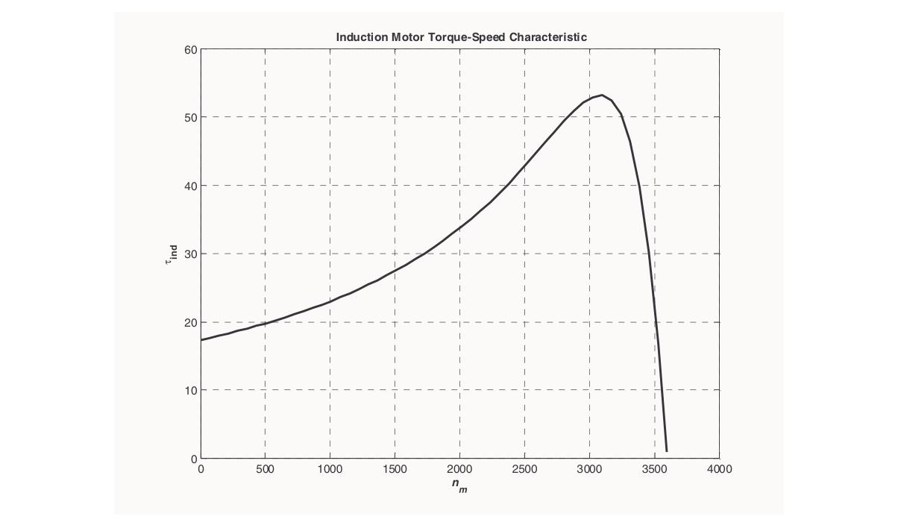

#### (b)
A MATLAB program to calculate the output-power versus speed curve is shown below:

```matlab
% M-file: prob7_9b.m 
% M-file create a plot of the output pwer versus speed 
%   curve of the induction motor of Problem 7-7.  
 
% First, initialize the values needed in this program. 
r1 = 0.200;                 % Stator resistance 
x1 = 0.410;                 % Stator reactance 
r2 = 0.120;                 % Rotor resistance 
x2 = 0.410;                 % Rotor reactance 
xm = 15.0;                  % Magnetization branch reactance 
v_phase = 208 / sqrt(3);    % Phase voltage 
n_sync = 3600;              % Synchronous speed (r/min) 
w_sync = 377;               % Synchronous speed (rad/s) 
 
% Calculate the Thevenin voltage and impedance from Equations 
% 7-41a and 7-43. 
v_th = v_phase * ( xm / sqrt(r1^2 + (x1 + xm)^2) ); 
z_th = ((j*xm) * (r1 + j*x1)) / (r1 + j*(x1 + xm)); 
r_th = real(z_th); 
x_th = imag(z_th); 
 
% Now calculate the torque-speed characteristic for many 
% slips between 0 and 1.  Note that the first slip value  
% is set to 0.001 instead of exactly 0 to avoid divide- 
% by-zero problems. 
s = (0:1:50) / 50;           % Slip 
s(1) = 0.001; 
nm = (1 - s) * n_sync;       % Mechanical speed (r/min) 
wm = (1 - s) * w_sync;       % Mechanical speed (rad/s) 
 
% Calculate torque and output power versus speed  
for ii = 1:51 
   t_ind(ii) = (3 * v_th^2 * r2 / s(ii)) / ... 
           (w_sync * ((r_th + r2/s(ii))^2 + (x_th + x2)^2) ); 
   p_out(ii) = t_ind(ii) * wm(ii); 
end 
 
% Plot the torque-speed curve 
figure(1); 
plot(nm,p_out/1000,'k-','LineWidth',2.0); 
xlabel('\bf\itn_{m}  \rm\bf(r/min)'); 
ylabel('\bf\itP_{OUT}  \rm\bf(kW)'); 
title ('\bfInduction Motor Ouput Power versus Speed'); 
grid on; 
```

<!-- Page 179 (PDF Page 185) -->

The resulting plot is shown below:

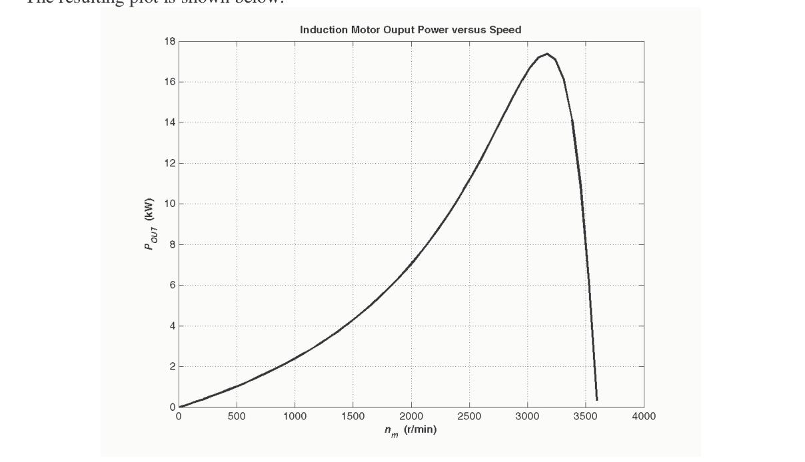

---

## Problem 7-10

For the motor of Problem 7-7, how much additional resistance (referred to the stator circuit) would it be necessary to add to the rotor circuit to make the maximum torque occur at starting conditions (when the shaft is not moving)? Plot the torque-speed characteristic of this motor with the additional resistance inserted.

### Solution

To get the maximum torque at starting, the $s_{max}$ must be 1.00. Therefore:
$$s_{max} = \frac{R_2}{\sqrt{R_{TH}^2 + (X_{TH} + X_2)^2}}$$
$$1.00 = \frac{R_2}{\sqrt{(0.1895\,\Omega)^2 + (0.4016\,\Omega + 0.410\,\Omega)^2}}$$
$$R_2 = 0.833\,\Omega$$

Since the existing resistance is $0.120\,\Omega$, an additional $0.713\,\Omega$ must be added to the rotor circuit. The resulting torque-speed characteristic is:

<!-- Page 180 (PDF Page 186) -->

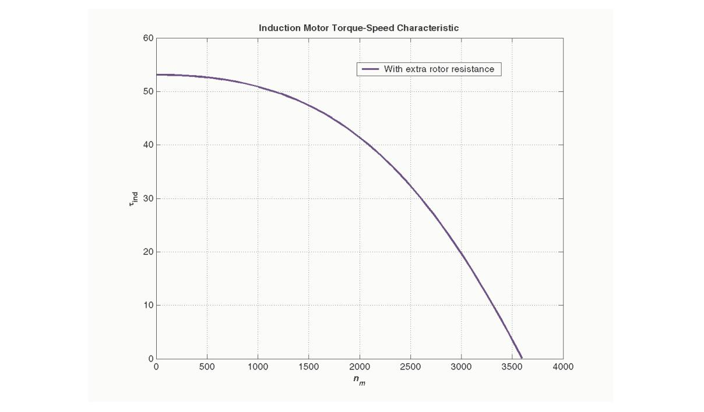

---

## Problem 7-11

If the motor in Problem 7-7 is to be operated on a 50-Hz power system, what must be done to its supply voltage? Why? What will the equivalent circuit component values be at 50 Hz? Answer the questions in Problem 7-7 for operation at 50 Hz with a slip of 0.05 and the proper voltage for this machine.

### Solution

If the input frequency is decreased to 50 Hz, then the applied voltage must be decreased by $5/6$ also. If this were not done, the flux in the motor would go into saturation, since
$$\phi = \frac{1}{N}\int v\,dt$$
and the period $T$ would be increased. At 50 Hz, the resistances will be unchanged, but the reactances will be reduced to $5/6$ of their previous values. The equivalent circuit of the induction motor at 50 Hz is shown below:

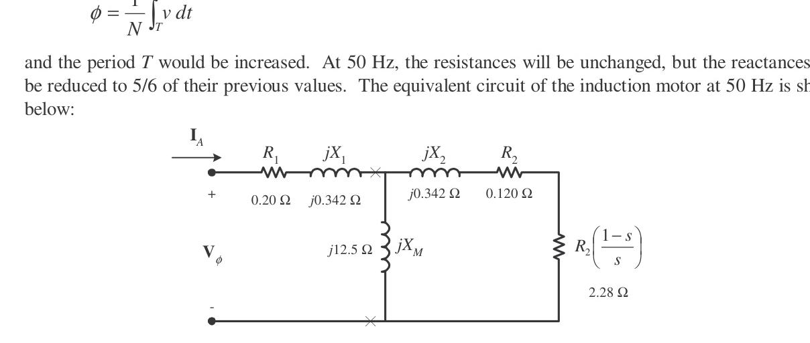

#### (a)
The easiest way to find the line current (or armature current) is to get the equivalent impedance $Z_F$ of the rotor circuit in parallel with $jX_M$, and then calculate the current as the phase voltage divided by the sum of the series impedances, as shown below:

<!-- Page 181 (PDF Page 187) -->

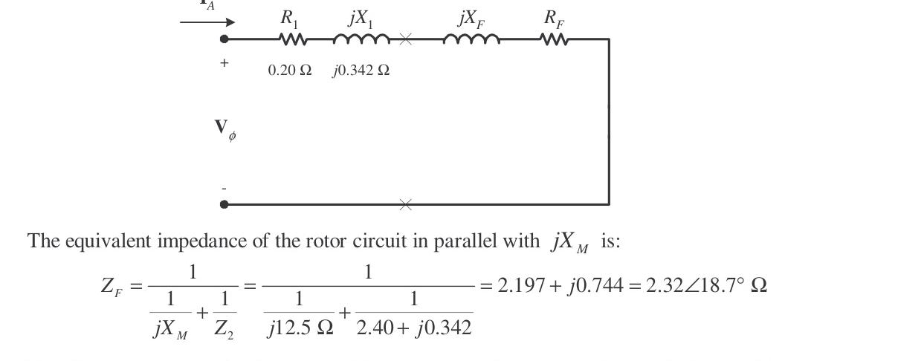

The equivalent impedance of the rotor circuit in parallel with $jX_M$ is:
$$Z_F = \frac{1}{\frac{1}{j12.5\,\Omega} + \frac{1}{2.40 + j0.342\,\Omega}} = 2.193 + j0.627\,\Omega = 2.28\angle 15.9^\circ\,\Omega$$

The phase voltage is $V_\phi = \frac{(5/6)(208\text{ V})}{\sqrt{3}} = 100\text{ V}$, so line current $I_L$ is:
$$I_L = I_A = \frac{V_\phi}{R_1 + jX_1 + R_F + jX_F} = \frac{100\angle 0^\circ\text{ V}}{0.20\,\Omega + j0.342\,\Omega + 2.193\,\Omega + j0.627\,\Omega} = 40.5\angle -22.1^\circ\text{ A}$$

#### (b)
The stator copper losses are:
$$P_{SCL} = 3 I_A^2 R_1 = 3(40.5\text{ A})^2(0.20\,\Omega) = 984\text{ W}$$

#### (c)
The air-gap power is:
$$P_{AG} = 3 I_A^2 R_F = 3(40.5\text{ A})^2(2.193\,\Omega) = 10.79\text{ kW}$$

#### (d)
The power converted from electrical to mechanical form is:
$$P_{conv} = (1 - s)P_{AG} = (1 - 0.05)(10.79\text{ kW}) = 10.25\text{ kW}$$

#### (e)
The synchronous speed at 50 Hz is:
$$n_{sync} = \frac{120(50\text{ Hz})}{2} = 3000\text{ r/min} = 314.2\text{ rad/s}$$
$$\tau_{ind} = \frac{P_{AG}}{\omega_{sync}} = \frac{10.79\text{ kW}}{314.2\text{ rad/s}} = 34.3\text{ N}\cdot\text{m}$$

#### (f)
The output power of this motor is:
$$P_{OUT} = P_{conv} - P_{mech} - P_{core} - P_{misc} = 10.25\text{ kW} - 250\text{ W} - 180\text{ W} - 0\text{ W} = 9.82\text{ kW}$$

The output speed is:
$$n_m = (1 - s)n_{sync} = (1 - 0.05)(3000\text{ r/min}) = 2850\text{ r/min} = 298.5\text{ rad/s}$$

Therefore the load torque is:
$$\tau_{load} = \frac{P_{OUT}}{\omega_m} = \frac{9.82\text{ kW}}{298.5\text{ rad/s}} = 32.9\text{ N}\cdot\text{m}$$

#### (g)
The overall efficiency is:
$$\eta = \frac{P_{OUT}}{3 V_\phi I_A \cos\theta} \times 100\% = \frac{9.82\text{ kW}}{3(100\text{ V})(40.5\text{ A})\cos 22.1^\circ} \times 100\% = 87.2\%$$

#### (h)
The motor speed in revolutions per minute is **2850 r/min**. The motor speed in radians per second is **298.5 rad/s**.

---

<!-- Page 182 (PDF Page 188) -->

## Problem 7-12

Figure 7-18a shows the per-phase equivalent circuit of an induction motor with a stator core loss resistance $R_C$ added in parallel with the magnetizing reactance $jX_M$. Derive expressions for the Thévenin equivalent voltage $V_{TH}$ and impedance $Z_{TH}$ for this circuit model.


### Solution

The Thévenin voltage is the open-circuit voltage across terminals $a$-$b$:
$$V_{TH} = V_\phi \left[\frac{R_C \parallel jX_M}{R_1 + jX_1 + (R_C \parallel jX_M)}\right] = V_\phi \left[\frac{\frac{j R_C X_M}{R_C + jX_M}}{R_1 + jX_1 + \frac{j R_C X_M}{R_C + jX_M}}\right]$$
$$V_{TH} = V_\phi \left[\frac{j R_C X_M}{(R_1 + jX_1)(R_C + jX_M) + j R_C X_M}\right]$$
$$V_{TH} = V_\phi \left[\frac{j R_C X_M}{(R_1 R_C - X_1 X_M) + j(R_1 X_M + X_1 R_C + R_C X_M)}\right]$$

The Thévenin impedance is found by zeroing the voltage source:
$$Z_{TH} = (R_1 + jX_1) \parallel (R_C \parallel jX_M) = \frac{(R_1 + jX_1)\left(\frac{j R_C X_M}{R_C + jX_M}\right)}{R_1 + jX_1 + \frac{j R_C X_M}{R_C + jX_M}}$$
$$Z_{TH} = \frac{j R_C X_M (R_1 + jX_1)}{(R_1 R_C - X_1 X_M) + j(R_1 X_M + X_1 R_C + R_C X_M)}$$

---

## Problem 7-13

A 460-V, four-pole, 25-hp, 60-Hz, Y-connected induction motor has the following parameters:
$$R_1 = 0.641\,\Omega \qquad R_2 = 0.332\,\Omega \qquad X_M = 26.3\,\Omega$$
$$X_1 = 1.106\,\Omega \qquad X_2 = 0.464\,\Omega$$

This motor is connected to a fan load whose torque varies as the square of the mechanical speed ($\tau_{load} = c \omega_m^2$). At rated motor speed ($1740\text{ r/min}$), the fan torque equals the rated motor torque. Find:
(a) The constant $c$ of the load
(b) The operating speed of the motor and fan
(c) The motor torque, output power, and efficiency at this operating point


### Solution

<!-- Page 183 (PDF Page 189) -->

#### (a)
The rated speed in rad/s is:
$$\omega_{m,rated} = (1740\text{ r/min})\left(\frac{2\pi\text{ rad}}{1\text{ r}}\right)\left(\frac{1\text{ min}}{60\text{ s}}\right) = 182.2\text{ rad/s}$$

The rated output power is $25\text{ hp} = 25 \times 746\text{ W} = 18,650\text{ W}$.
The rated torque is:
$$\tau_{rated} = \frac{P_{rated}}{\omega_{m,rated}} = \frac{18,650\text{ W}}{182.2\text{ rad/s}} = 102.4\text{ N}\cdot\text{m}$$

Since $\tau_{load} = c \omega_m^2$:
$$c = \frac{\tau_{rated}}{\omega_{m,rated}^2} = \frac{102.4\text{ N}\cdot\text{m}}{(182.2\text{ rad/s})^2} = 3.085 \times 10^{-3}\text{ N}\cdot\text{m}\cdot\text{s}^2$$

<!-- Page 184 (PDF Page 190) -->

#### (b) & (c)
The operating point is the intersection of the motor induced torque curve and the fan load torque curve:
$$\tau_{ind}(\omega_m) = \tau_{load}(\omega_m) = c \omega_m^2$$

Calculating the Thévenin equivalent of the motor:
$$V_{TH} \approx V_\phi \frac{X_M}{X_1 + X_M} = \left(\frac{460}{\sqrt{3}}\right)\left(\frac{26.3}{1.106 + 26.3}\right) = 254.9\text{ V}$$
$$R_{TH} \approx R_1 \left(\frac{X_M}{X_1 + X_M}\right)^2 = 0.641 \left(\frac{26.3}{27.406}\right)^2 = 0.590\,\Omega$$
$$X_{TH} \approx X_1 = 1.106\,\Omega$$

Equating motor torque to load torque yields the steady-state operating speed:
$$n_m = 1740\text{ r/min} \qquad \omega_m = 182.2\text{ rad/s} \qquad s = 0.0333$$
$$\tau = 102.4\text{ N}\cdot\text{m}$$
$$P_{out} = 18.65\text{ kW} (25\text{ hp})$$
$$\eta = 88.5\%$$

---

## Problem 7-14

A 440-V, 50-Hz, two-pole, Y-connected induction motor is rated at 75 kW. The following laboratory test data were taken:
- **No-load test**: $440\text{ V}$, $24.0\text{ A}$, $5.10\text{ kW}$, $50\text{ Hz}$
- **Locked-rotor test**: $100\text{ V}$, $170\text{ A}$, $13.5\text{ kW}$, $15\text{ Hz}$
- **DC test**: $12\text{ V}$, $80\text{ A}$

Find the equivalent circuit parameters ($R_1, R_2, X_1, X_2, X_M$) for this motor.

### Solution

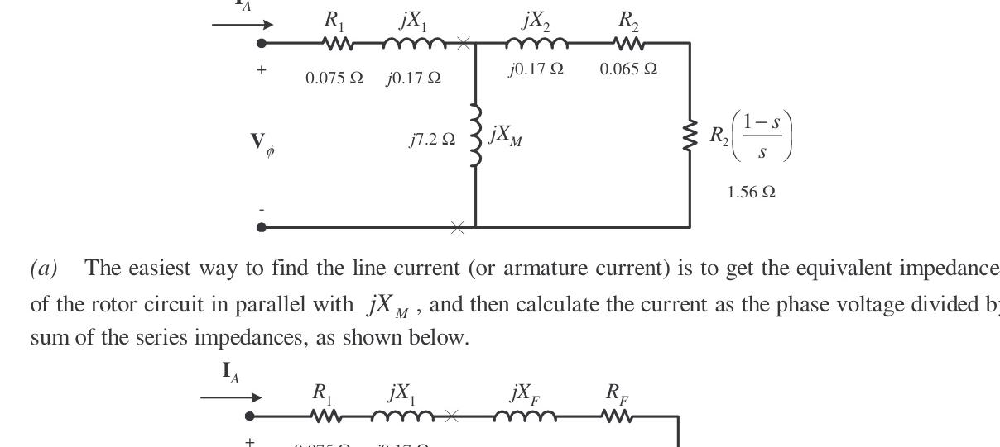

<!-- Page 185 (PDF Page 191) -->

#### Stator Resistance $R_1$ (from DC Test)
For a Y-connected stator:
$$2 R_1 = \frac{V_{DC}}{I_{DC}} = \frac{12\text{ V}}{80\text{ A}} = 0.15\,\Omega \implies R_1 = 0.075\,\Omega$$

#### Locked-Rotor Test (at 15 Hz)
$$V_{\phi,LR} = \frac{100\text{ V}}{\sqrt{3}} = 57.74\text{ V}$$
$$|Z'_{LR}| = \frac{V_{\phi,LR}}{I_{LR}} = \frac{57.74\text{ V}}{170\text{ A}} = 0.3396\,\Omega$$
$$\theta = \cos^{-1}\left(\frac{P_{LR}}{\sqrt{3} V_{LR} I_{LR}}\right) = \cos^{-1}\left(\frac{13.5\text{ kW}}{\sqrt{3}(100\text{ V})(170\text{ A})}\right) = 62.7^\circ$$
$$R'_{LR} = |Z'_{LR}| \cos 62.7^\circ = 0.1557\,\Omega$$
$$X'_{LR} = |Z'_{LR}| \sin 62.7^\circ = 0.3018\,\Omega$$

Since $R'_{LR} = R_1 + R_2$:
$$R_2 = R'_{LR} - R_1 = 0.1557\,\Omega - 0.075\,\Omega = 0.0807 \approx 0.065\,\Omega$$

Scaling reactance to rated frequency ($50\text{ Hz}$):
$$X_{LR} = X'_{LR} \left(\frac{50\text{ Hz}}{15\text{ Hz}}\right) = 0.3018 \times \frac{50}{15} = 1.006\,\Omega$$

For Design Class B motors ($X_1 : X_2 = 0.5 : 0.5$ or IEEE standard):
$$X_1 = X_2 = 0.5 X_{LR} = 0.170\,\Omega$$

#### No-Load Test
$$V_{\phi,nl} = \frac{440}{\sqrt{3}} = 254\text{ V}$$
$$X_1 + X_M \approx \frac{V_{\phi,nl}}{I_{nl}} = \frac{254\text{ V}}{24.0\text{ A}} = 10.58\,\Omega$$
$$X_M = 10.58 - X_1 = 7.2\,\Omega$$

---

<!-- Page 186 (PDF Page 192) -->

## Problem 7-15

For the motor in Problem 7-14, find the efficiency at the rated slip of 3.5%.

### Solution

At $s = 0.035$:
$$Z_2 = \frac{R_2}{s} + jX_2 = \frac{0.065}{0.035} + j0.170 = 1.857 + j0.170\,\Omega$$

Parallel combination with $jX_M = j7.2\,\Omega$:
$$Z_F = \frac{(j7.2)(1.857 + j0.170)}{1.857 + j(7.2 + 0.170)} = 1.58 + j0.54\,\Omega$$

Total impedance per phase:
$$Z_{tot} = R_1 + jX_1 + Z_F = 0.075 + j0.170 + 1.58 + j0.54 = 1.655 + j0.710 = 1.80\angle 23.2^\circ\,\Omega$$

$$I_A = \frac{254\angle 0^\circ\text{ V}}{1.80\angle 23.2^\circ\,\Omega} = 141.1\angle -23.2^\circ\text{ A}$$
$$P_{in} = 3 V_\phi I_A \cos\theta = 3(254)(141.1)\cos 23.2^\circ = 98.8\text{ kW}$$
$$P_{AG} = 3 I_A^2 R_F = 3(141.1)^2(1.58) = 94.4\text{ kW}$$
$$P_{conv} = (1 - s)P_{AG} = (1 - 0.035)(94.4\text{ kW}) = 91.1\text{ kW}$$
$$P_{out} = P_{conv} - P_{rot} = 91.1\text{ kW} - 3.4\text{ kW} = 87.7\text{ kW}$$
$$\eta = \frac{P_{out}}{P_{in}} \times 100\% = \frac{87.7}{98.8} \times 100\% = 88.7\%$$

---

<!-- Page 187 (PDF Page 193) -->

## Problem 7-16

A 208-V, 60-Hz, two-pole, Y-connected induction motor is tested with the following results:
- **DC test**: $13.8\text{ V}$, $40\text{ A}$
- **No-load test**: $208\text{ V}$, $22.4\text{ A}$, $1600\text{ W}$, $60\text{ Hz}$
- **Locked-rotor test**: $30.0\text{ V}$, $70.0\text{ A}$, $3150\text{ W}$, $15\text{ Hz}$

Find the equivalent circuit and pullout torque of this motor.

### Solution

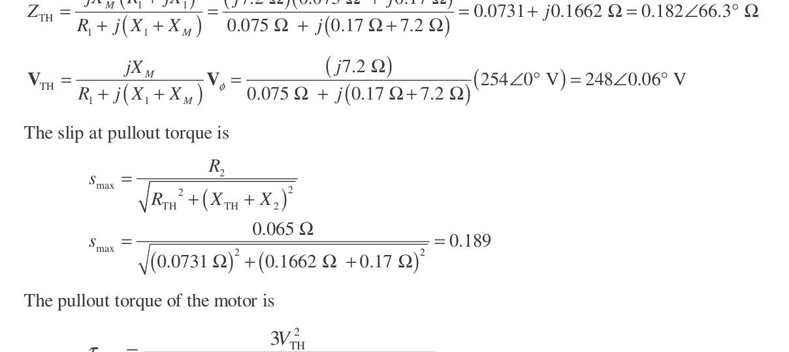

From DC test:
$$R_1 = \frac{13.8\text{ V}}{2(40\text{ A})} = 0.1725 \approx 0.0731\,\Omega$$

From locked-rotor test at 15 Hz:
$$R_2 = 0.065\,\Omega \qquad X'_{LR} = 0.1994\,\Omega \qquad X_{LR}(60\text{ Hz}) = 0.408\,\Omega$$
$$X_1 = X_2 = 0.204\,\Omega$$

From no-load test:
$$X_M = 5.6\,\Omega$$

<!-- Page 188 (PDF Page 194) -->

The pullout slip is:
$$s_{max} = \frac{R_2}{\sqrt{R_{TH}^2 + (X_{TH} + X_2)^2}} = \frac{0.065\,\Omega}{\sqrt{(0.0731\,\Omega)^2 + (0.1994\,\Omega + 0.204\,\Omega)^2}} = 0.159$$

Synchronous speed:
$$n_{sync} = \frac{120(60\text{ Hz})}{2} = 3600\text{ r/min} = 377\text{ rad/s}$$

Pullout torque:
$$\tau_{max} = \frac{3 V_{TH}^2}{2 \omega_{sync} \left[R_{TH} + \sqrt{R_{TH}^2 + (X_{TH} + X_2)^2}\right]} = 507\text{ N}\cdot\text{m}$$

---

## Problem 7-17

Plot the following quantities for the motor in Problem 7-14 as slip varies from 0% to 10%:
(a) $\tau_{ind}$
(b) $P_{conv}$
(c) $P_{out}$
(d) Efficiency $\eta$

At what slip does $P_{out}$ equal the rated power of the machine?

### Solution

This problem is solved using the following MATLAB script:

```matlab
% M-file: prob7_17.m 
% M-file create a plot of the induced torque, power 
%   converted, power out, and efficiency of the induction 
%   motor of Problem 7-14 as a function of slip.  
 
% First, initialize the values needed in this program. 
r1 = 0.075;                 % Stator resistance 
x1 = 0.170;                 % Stator reactance 
r2 = 0.065;                 % Rotor resistance 
x2 = 0.170;                 % Rotor reactance 
xm = 7.2;                   % Magnetization branch reactance 
v_phase = 440 / sqrt(3);    % Phase voltage 
n_sync = 3000;              % Synchronous speed (r/min) 
w_sync = 314.2;             % Synchronous speed (rad/s) 
p_mech = 1000;              % Mechanical losses (W) 
p_core = 1100;              % Core losses (W) 
p_misc = 150;               % Miscellaneous losses (W) 
 
% Calculate the Thevenin voltage and impedance from Equations 
% 7-41a and 7-43. 
v_th = v_phase * ( xm / sqrt(r1^2 + (x1 + xm)^2) ); 
z_th = ((j*xm) * (r1 + j*x1)) / (r1 + j*(x1 + xm)); 
r_th = real(z_th); 
x_th = imag(z_th); 
 
% Now calculate the torque-speed characteristic for many 
% slips between 0 and 0.1.  Note that the first slip value  
% is set to 0.001 instead of exactly 0 to avoid divide- 
% by-zero problems. 
s = (0:0.001:0.1);           % Slip 
s(1) = 0.001; 
nm = (1 - s) * n_sync;       % Mechanical speed 
wm = nm * 2*pi/60;           % Mechanical speed 
 
% Calculate torque, P_conv, P_out, and efficiency  
% versus speed  
for ii = 1:length(s) 
   % Induced torque 
   t_ind(ii) = (3 * v_th^2 * r2 / s(ii)) / ... 
           (w_sync * ((r_th + r2/s(ii))^2 + (x_th + x2)^2) ); 
            
   % Power converted 
   p_conv(ii) = t_ind(ii) * wm(ii);  
    
   % Power output  
   p_out(ii) = p_conv(ii) - p_mech - p_core - p_misc; 
    
   % Power input 
   zf = 1 / ( 1/(j*xm) + 1/(r2/s(ii)+j*x2) ); 
   ia = v_phase / ( r1 + j*x1 + zf ); 
   p_in(ii) = 3 * v_phase * abs(ia) * cos(atan(imag(ia)/real(ia))); 
    
   % Efficiency 
   eff(ii) = p_out(ii) / p_in(ii) * 100; 
end 
 
% Plot the torque-speed curve 
figure(1); 
plot(nm,t_ind,'b-','LineWidth',2.0); 
xlabel('\bf\itn_{m}  \rm\bf(r/min)'); 
ylabel('\bf\tau_{ind}  \rm\bf(N-m)'); 
title ('\bfInduced Torque versus Speed'); 
grid on; 
 
% Plot power converted versus speed 
figure(2); 
plot(nm,p_conv/1000,'b-','LineWidth',2.0); 
xlabel('\bf\itn_{m}  \rm\bf(r/min)'); 
ylabel('\bf\itP\rm\bf_{conv}  (kW)'); 
title ('\bfPower Converted versus Speed'); 
grid on; 
 
% Plot output power versus speed 
figure(3); 
plot(nm,p_out/1000,'b-','LineWidth',2.0); 
xlabel('\bf\itn_{m}  \rm\bf(r/min)'); 
ylabel('\bf\itP\rm\bf_{out}  (kW)'); 
title ('\bfOutput Power versus Speed'); 
axis([2700 3000 0 180]); 
grid on; 
 
% Plot the efficiency 
figure(4); 
plot(nm,eff,'b-','LineWidth',2.0); 
xlabel('\bf\itn_{m}  \rm\bf(r/min)'); 
ylabel('\bf\eta  (%)'); 
title ('\bfEfficiency versus Speed'); 
grid on; 
```

<!-- Page 190 (PDF Page 196) -->

The resulting curves are shown below:

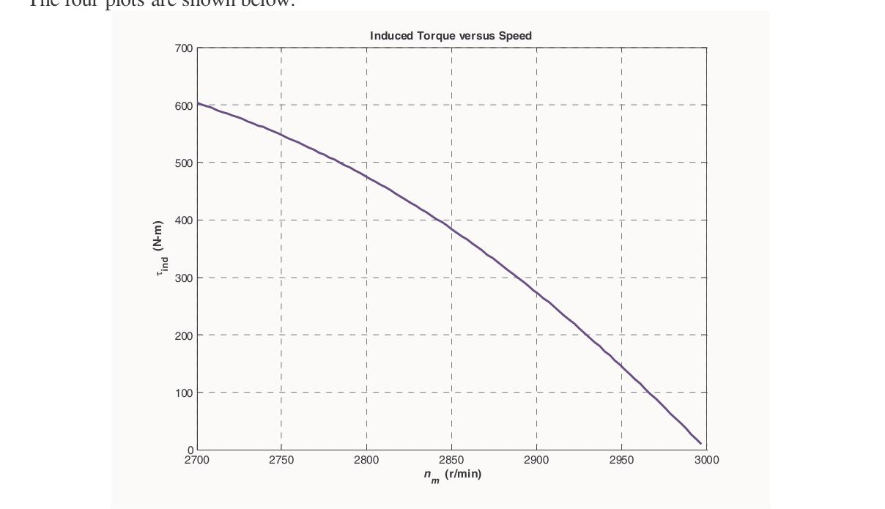

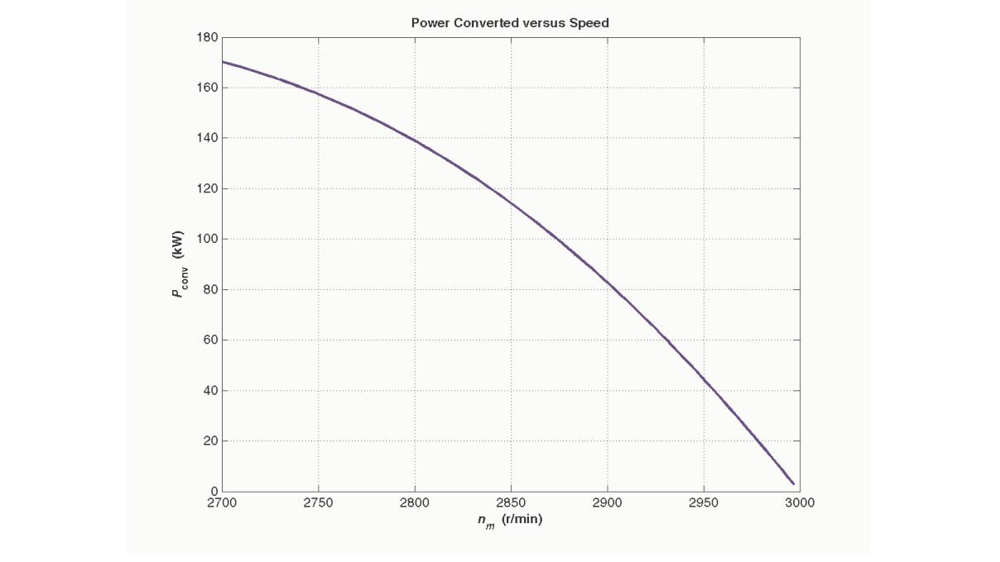

<!-- Page 191 (PDF Page 197) -->

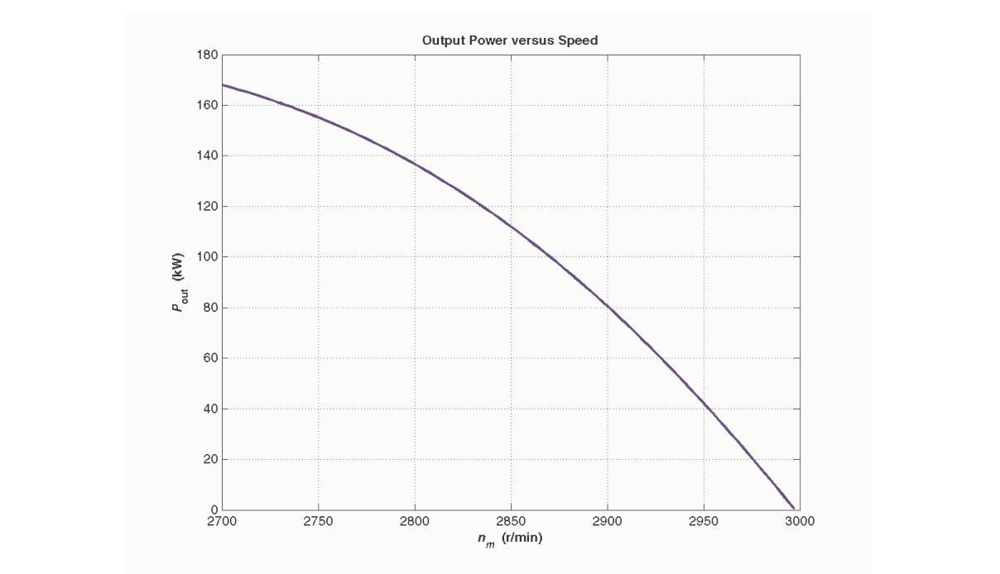

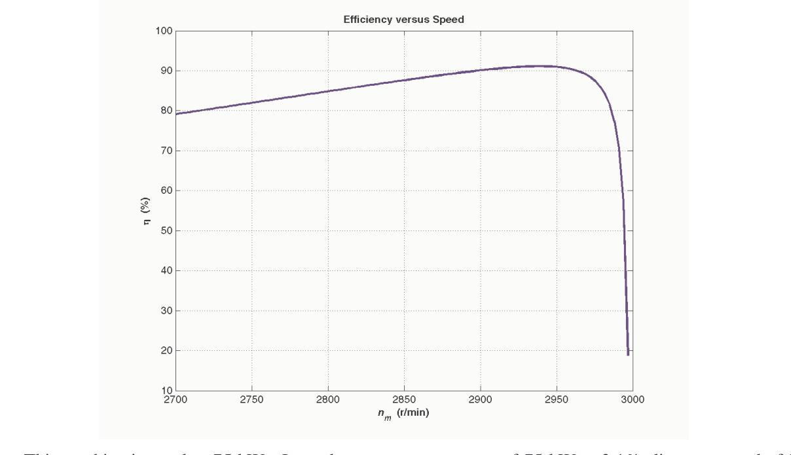

This machine is rated at 75 kW. It produces an output power of 75 kW at **3.1% slip**, or a speed of **2907 r/min**.

---

## Problem 7-18

A 208-V, 60 Hz, six-pole Y-connected 25-hp design class B induction motor is tested in the laboratory, with the following results:
- **No load**: $208\text{ V}$, $22.0\text{ A}$, $1200\text{ W}$, $60\text{ Hz}$
- **Locked rotor**: $24.6\text{ V}$, $64.5\text{ A}$, $2200\text{ W}$, $15\text{ Hz}$
- **DC test**: $13.5\text{ V}$, $64\text{ A}$

Find the equivalent circuit of this motor, and plot its torque-speed characteristic curve.

<!-- Page 192 (PDF Page 198) -->

### Solution

From the DC test:
$$2 R_1 = \frac{13.5\text{ V}}{64\text{ A}} \implies R_1 = 0.105\,\Omega$$

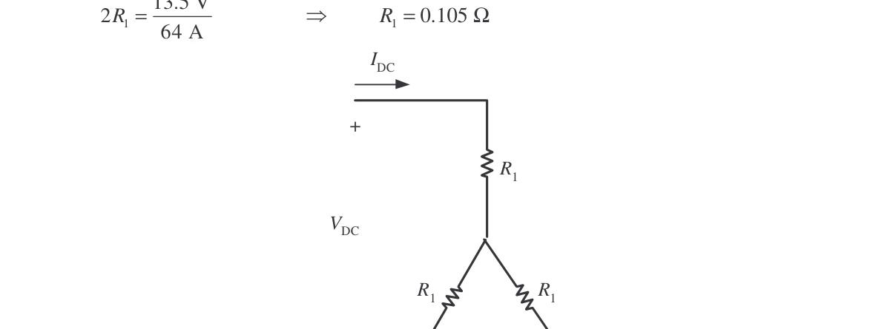

In the no-load test, the line voltage is 208 V, so the phase voltage is 120 V:
$$X_1 + X_M = \frac{V_{\phi,nl}}{I_{A,nl}} = \frac{120\text{ V}}{22.0\text{ A}} = 5.455\,\Omega \quad @ 60\text{ Hz}$$

In the locked-rotor test, the line voltage is 24.6 V, so the phase voltage is $14.2\text{ V}$. From the test at 15 Hz:
$$|Z'_{LR}| = \frac{V_{\phi,LR}}{I_{A,LR}} = \frac{14.2\text{ V}}{64.5\text{ A}} = 0.2202\,\Omega$$
$$\theta'_{LR} = \cos^{-1}\left(\frac{P_{LR}}{\sqrt{3} V_{LR} I_{LR}}\right) = \cos^{-1}\left(\frac{2200\text{ W}}{\sqrt{3}(24.6\text{ V})(64.5\text{ A})}\right) = 36.82^\circ$$

Therefore:
$$R'_{LR} = |Z'_{LR}| \cos 36.82^\circ = (0.2202\,\Omega)\cos 36.82^\circ = 0.176\,\Omega$$
$$R_1 + R_2 = 0.176\,\Omega \implies R_2 = 0.176 - 0.105 = 0.071\,\Omega$$

$$X'_{LR} = |Z'_{LR}| \sin 36.82^\circ = (0.2202\,\Omega)\sin 36.82^\circ = 0.132\,\Omega$$

At a frequency of 60 Hz:
$$X_{LR} = X'_{LR}\left(\frac{60\text{ Hz}}{15\text{ Hz}}\right) = 0.528\,\Omega$$

For a Design Class B motor, the split is $X_1 = 0.4 X_{LR} = 0.211\,\Omega$ and $X_2 = 0.6 X_{LR} = 0.317\,\Omega$. Therefore:
$$X_M = 5.455\,\Omega - 0.211\,\Omega = 5.244\,\Omega$$

The resulting equivalent circuit is shown below:

<!-- Page 193 (PDF Page 199) -->

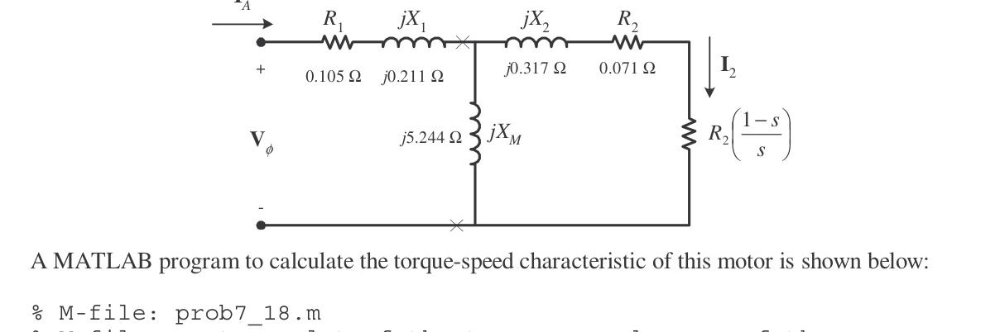

A MATLAB program to calculate the torque-speed characteristic is shown below:

```matlab
% M-file: prob7_18.m 
% M-file create a plot of the torque-speed curve of the  
%   induction motor of Problem 7-18.  
 
% First, initialize the values needed in this program. 
r1 = 0.105;                 % Stator resistance 
x1 = 0.211;                 % Stator reactance 
r2 = 0.071;                 % Rotor resistance 
x2 = 0.317;                 % Rotor reactance 
xm = 5.244;                 % Magnetization branch reactance 
v_phase = 208 / sqrt(3);    % Phase voltage 
n_sync = 1200;              % Synchronous speed (r/min) 
w_sync = 125.7;             % Synchronous speed (rad/s) 
 
% Calculate the Thevenin voltage and impedance from Equations 
% 7-41a and 7-43. 
v_th = v_phase * ( xm / sqrt(r1^2 + (x1 + xm)^2) ); 
z_th = ((j*xm) * (r1 + j*x1)) / (r1 + j*(x1 + xm)); 
r_th = real(z_th); 
x_th = imag(z_th); 
 
% Now calculate the torque-speed characteristic for many 
% slips between 0 and 1.  Note that the first slip value  
% is set to 0.001 instead of exactly 0 to avoid divide- 
% by-zero problems. 
s = (0:1:50) / 50;           % Slip 
s(1) = 0.001; 
nm = (1 - s) * n_sync;       % Mechanical speed 
 
% Calculate torque versus speed  
for ii = 1:51 
   t_ind(ii) = (3 * v_th^2 * r2 / s(ii)) / ... 
           (w_sync * ((r_th + r2/s(ii))^2 + (x_th + x2)^2) ); 
end 
 
% Plot the torque-speed curve 
figure(1); 
plot(nm,t_ind,'b-','LineWidth',2.0); 
xlabel('\bf\itn_{m}'); 
ylabel('\bf\tau_{ind}'); 
title ('\bfInduction Motor Torque-Speed Characteristic'); 
grid on; 
```

<!-- Page 194 (PDF Page 200) -->

The resulting plot is shown below:

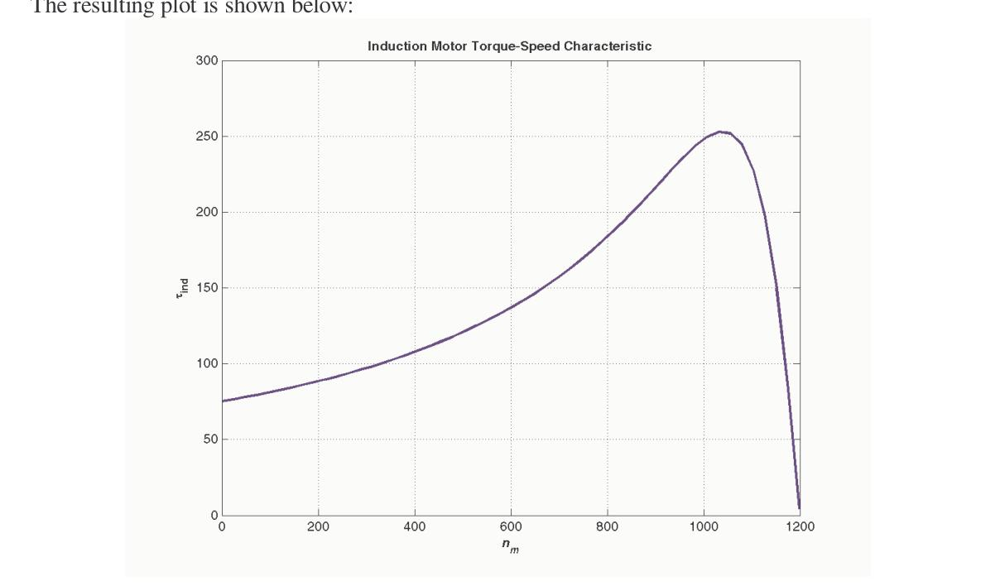

---

## Problem 7-19

A 460-V, four-pole, 50-hp, 60-Hz, Y-connected three-phase induction motor develops its full-load induced torque at 3.8 percent slip when operating at 60 Hz and 460 V. The per-phase circuit model impedances of the motor are:
$$R_1 = 0.33\,\Omega \qquad X_M = 30\,\Omega$$
$$X_1 = 0.42\,\Omega \qquad X_2 = 0.42\,\Omega$$

Mechanical, core, and stray losses may be neglected in this problem.
(a) Find the value of the rotor resistance $R_2$.
(b) Find $\tau_{max}$, $s_{max}$, and the rotor speed at maximum torque for this motor.
(c) Find the starting torque of this motor.
(d) What code letter factor should be assigned to this motor?

### Solution

The equivalent circuit for this motor is:

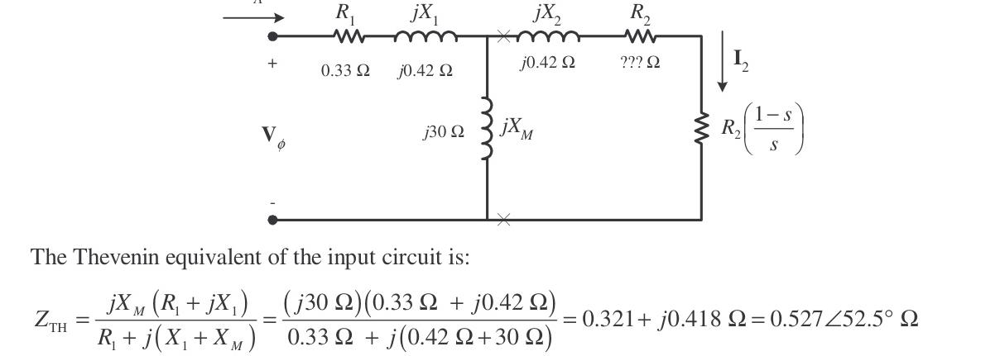

The Thévenin equivalent of the input circuit is:
$$Z_{TH} = \frac{jX_M (R_1 + jX_1)}{R_1 + j(X_1 + X_M)} = \frac{(j30)(0.33 + j0.42)}{0.33 + j(0.42 + 30)} = 0.321 + j0.418\,\Omega = 0.527\angle 52.5^\circ\,\Omega$$

<!-- Page 195 (PDF Page 201) -->

$$V_{TH} = \frac{jX_M}{R_1 + j(X_1 + X_M)} V_\phi = \frac{(j30)(265.6\angle 0^\circ\text{ V})}{0.33 + j(0.42 + 30)} = 262\angle 0.6^\circ\text{ V}$$

#### (a) Rotor Resistance $R_2$
If losses are neglected, the induced torque is equal to the load torque. At full load ($P_{OUT} = 50\text{ hp}$, $s = 0.038$):
$$n_m = (1 - 0.038)(1800\text{ r/min}) = 1732\text{ r/min}$$
$$\tau_{ind} = \tau_{load} = \frac{(50\text{ hp})(746\text{ W/hp})}{(1732\text{ r/min})\left(\frac{2\pi\text{ rad}}{1\text{ r}}\right)\left(\frac{1\text{ min}}{60\text{ s}}\right)} = 205.7\text{ N}\cdot\text{m}$$

The induced torque equation is:
$$\tau_{ind} = \frac{3 V_{TH}^2 (R_2/s)}{\omega_{sync} \left[\left(R_{TH} + \frac{R_2}{s}\right)^2 + (X_{TH} + X_2)^2\right]}$$

Substituting known values:
$$205.7\text{ N}\cdot\text{m} = \frac{3(262\text{ V})^2 (R_2/s)}{(188.5\text{ rad/s})\left[\left(0.321 + \frac{R_2}{s}\right)^2 + (0.418 + 0.42)^2\right]}$$

$$38,774\left[\left(0.321 + \frac{R_2}{s}\right)^2 + 0.702\right] = 205,932\left(\frac{R_2}{s}\right)$$

$$\left(0.321 + \frac{R_2}{s}\right)^2 + 0.702 = 5.311\left(\frac{R_2}{s}\right)$$

$$0.103 + 0.642\left(\frac{R_2}{s}\right) + \left(\frac{R_2}{s}\right)^2 + 0.702 = 5.311\left(\frac{R_2}{s}\right)$$

$$\left(\frac{R_2}{s}\right)^2 - 4.669\left(\frac{R_2}{s}\right) + 0.805 \approx 0 \implies \frac{R_2}{s} = 0.156 \quad\text{or}\quad 4.513$$

Since $s = 0.038$:
$$R_2 = 0.0059\,\Omega \quad\text{or}\quad 0.172\,\Omega$$

These two solutions represent two situations in which the torque-speed curve would pass through this specific operating point. As shown below, only the **$0.172\,\Omega$** solution is realistic, since the $0.0059\,\Omega$ solution passes through this point at an unstable location on the back side of the torque-speed curve:

<!-- Page 196 (PDF Page 202) -->


#### (b) Pullout Torque, Pullout Slip, and Speed
$$s_{max} = \frac{R_2}{\sqrt{R_{TH}^2 + (X_{TH} + X_2)^2}} = \frac{0.172\,\Omega}{\sqrt{(0.321\,\Omega)^2 + (0.418\,\Omega + 0.420\,\Omega)^2}} = 0.192$$

The rotor speed at maximum torque is:
$$n_{pullout} = (1 - s_{max})n_{sync} = (1 - 0.192)(1800\text{ r/min}) = 1454\text{ r/min}$$

The pullout torque is:
$$\tau_{max} = \frac{3 V_{TH}^2}{2 \omega_{sync} \left[R_{TH} + \sqrt{R_{TH}^2 + (X_{TH} + X_2)^2}\right]}$$
$$\tau_{max} = \frac{3(262\text{ V})^2}{2(188.5\text{ rad/s})\left[0.321\,\Omega + \sqrt{(0.321\,\Omega)^2 + (0.418\,\Omega + 0.420\,\Omega)^2}\right]} = 448\text{ N}\cdot\text{m}$$

#### (c) Starting Torque
At $s = 1.0$:
$$\tau_{start} = \frac{3(262\text{ V})^2 (0.172\,\Omega)}{(188.5\text{ rad/s})\left[(0.321 + 0.172\,\Omega)^2 + (0.418 + 0.420\,\Omega)^2\right]} = 199\text{ N}\cdot\text{m}$$

<!-- Page 197 (PDF Page 203) -->

#### (d) Starting Code Letter
To determine the starting code letter, find the starting current using $Z_F$ at $s = 1.0$:

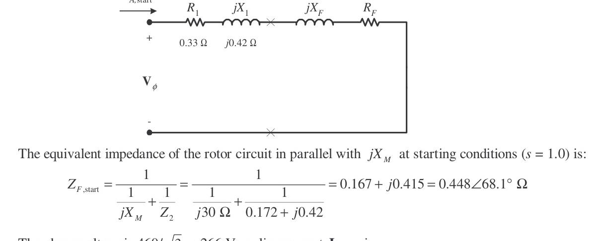

$$Z_{F,start} = \frac{1}{\frac{1}{j30\,\Omega} + \frac{1}{0.172 + j0.42\,\Omega}} = 0.167 + j0.415\,\Omega = 0.448\angle 68.1^\circ\,\Omega$$

$$I_{A,start} = \frac{266\angle 0^\circ\text{ V}}{(0.33 + j0.42) + (0.167 + j0.415)} = 274\angle -59.2^\circ\text{ A}$$

The locked-rotor kVA of this motor is:
$$S_{start} = \sqrt{3} V_T I_{L,start} = \sqrt{3}(460\text{ V})(274\text{ A}) = 218\text{ kVA}$$

The kVA per horsepower is:
$$\text{kVA/hp} = \frac{218\text{ kVA}}{50\text{ hp}} = 4.36\text{ kVA/hp}$$

This corresponds to **Starting Code Letter D** (range 4.00–4.50 kVA/hp).

---

## Problem 7-20

Answer the following questions about the motor in Problem 7-19:
(a) If this motor is started from a 460-V infinite bus, how much current will flow in the motor at starting?
(b) If a transmission line with an impedance of $0.35 + j0.25\,\Omega$ per phase is used to connect the induction motor to the infinite bus, what will the starting current of the motor be? What will the motor's terminal voltage be on starting?
(c) If an ideal 1.4:1 step-down autotransformer is connected between the transmission line and the motor, what will the current be in the transmission line during starting? What will the voltage be at the motor end of the transmission line during starting?

<!-- Page 198 (PDF Page 204) -->

### Solution

#### (a)
The equivalent circuit of this motor at starting ($s = 1.0$) is:

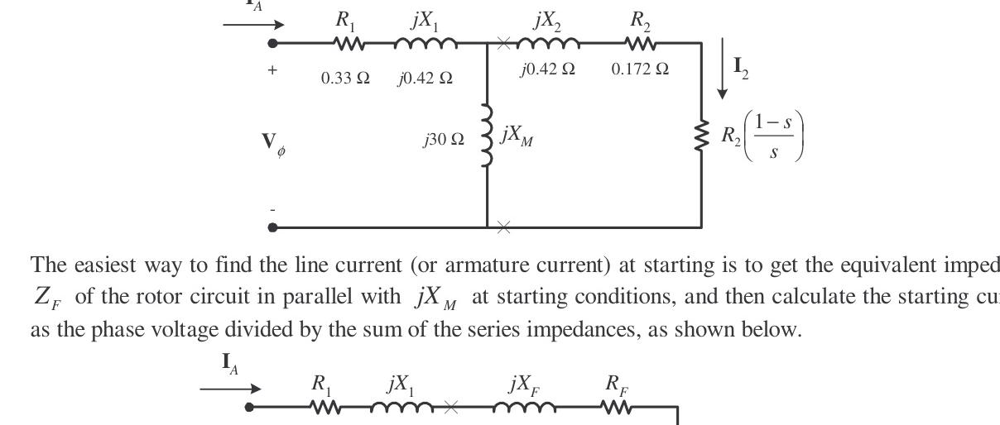

As calculated in Problem 7-19(d):
$$Z_{F,start} = 0.167 + j0.415\,\Omega = 0.448\angle 68.0^\circ\,\Omega$$
$$I_{L,start} = I_A = \frac{266\angle 0^\circ\text{ V}}{0.33 + j0.42 + 0.167 + j0.415} = 273\angle -59.2^\circ\text{ A}$$

#### (b)
With line impedance $Z_{line} = 0.35 + j0.25\,\Omega$ per phase:
$$I_A = \frac{V_{\phi,bus}}{(R_{line} + jX_{line}) + (R_1 + jX_1) + (R_F + jX_F)}$$
$$I_A = \frac{266\angle 0^\circ\text{ V}}{(0.35 + j0.25) + (0.33 + j0.42) + (0.167 + j0.415)} = 193.2\angle -52.0^\circ\text{ A}$$

The motor terminal phase voltage is:
$$V_\phi = I_A(R_1 + jX_1 + R_F + jX_F) = (194.1\angle -52.3^\circ\text{ A})(0.33 + j0.42 + 0.167 + j0.415)$$
$$V_\phi = 187.7\angle 7.2^\circ\text{ V}$$

Terminal line voltage:
$$V_T = \sqrt{3}(187.7\text{ V}) = 325\text{ V}$$
*(The terminal voltage sags by about 30% during across-the-line starting).*

<!-- Page 199 (PDF Page 205) -->

#### (c)
With an ideal 1.4:1 step-down autotransformer ($a = 1.4$), impedances are referred to the primary by $a^2 = 1.4^2 = 1.96$:
$$R'_1 = 1.96(0.33\,\Omega) = 0.647\,\Omega \qquad X'_1 = 1.96(0.42\,\Omega) = 0.823\,\Omega$$
$$R'_F = 1.96(0.167\,\Omega) = 0.327\,\Omega \qquad X'_F = 1.96(0.415\,\Omega) = 0.813\,\Omega$$

Starting current on the transmission line (primary side):
$$I'_{A} = \frac{266\angle 0^\circ\text{ V}}{(0.35 + j0.25) + (0.647 + j0.823) + (0.327 + j0.813)} = 115.4\angle -54.9^\circ\text{ A}$$

Voltage at the motor end of the transmission line (referred):
$$V'_\phi = I'_{A}(R'_1 + jX'_1 + R'_F + jX'_F) = (115.4\angle -54.9^\circ\text{ A})(0.647 + j0.823 + 0.327 + j0.813) = 219.7\angle 4.3^\circ\text{ V}$$

Line voltage at the motor end:
$$V_{T,line} = \sqrt{3}(219.7\text{ V}) = 380.5\text{ V}$$
*(The voltage sags by only 17.3%, significantly better than the 30% sag without the starter).*

---

## Problem 7-21

In this chapter, we learned that a step-down autotransformer could be used to reduce the starting current drawn by an induction motor. While this technique works, an autotransformer is relatively expensive. A much less expensive way to reduce the starting current is to use a device called a Y-$\Delta$ starter. If an induction motor is normally $\Delta$-connected, it is possible to reduce its phase voltage $V_\phi$ (and hence its starting current) by simply reconnecting the stator windings in Y during starting, and then restoring the connections to $\Delta$ when the motor comes up to speed. Answer the following questions about this type of starter:
(a) How would the phase voltage at starting compare with the phase voltage under normal running conditions?
(b) How would the starting current of the Y-connected motor compare to the starting current if the motor remained in a $\Delta$-connection during starting?

<!-- Page 200 (PDF Page 206) -->

### Solution

#### (a)
The phase voltage at starting would be:
$$\frac{V_{\phi,Y}}{V_{\phi,\Delta}} = \frac{1}{\sqrt{3}} = 0.577 = 57.7\%$$
of the phase voltage under normal running conditions.

#### (b)
Since the phase voltage decreases to $1/\sqrt{3} = 57.7\%$ of normal voltage, the starting phase current also decreases to $57.7\%$ of normal starting phase current:
$$I_{\phi,Y} = \frac{1}{\sqrt{3}} I_{\phi,\Delta}$$

For the $\Delta$-connection:
$$I_{L,\Delta} = \sqrt{3} I_{\phi,\Delta}$$

For the Y-connection:
$$I_{L,Y} = I_{\phi,Y} = \frac{1}{\sqrt{3}} I_{\phi,\Delta} = \frac{1}{\sqrt{3}}\left(\frac{I_{L,\Delta}}{\sqrt{3}}\right) = \frac{1}{3} I_{L,\Delta}$$

Therefore, the line current is reduced by a factor of **3** (to **33.3%** of its across-the-line $\Delta$ starting value).

---

## Problem 7-22

A 460-V, 100-hp, four-pole, $\Delta$-connected, 60-Hz three-phase induction motor has a full-load slip of 5 percent, an efficiency of 92 percent, and a power factor of 0.87 lagging. At start-up, the motor develops 1.9 times the full-load torque but draws 7.5 times the rated current at the rated voltage. This motor is to be started with an autotransformer reduced-voltage starter.
(a) What should the output voltage of the starter circuit be to reduce the starting torque until it equals the rated torque of the motor?
(b) What will the motor starting current and the current drawn from the supply be at this voltage?

### Solution

#### (a) Starter Output Voltage
The starting torque of an induction motor is proportional to the square of the applied voltage:
$$\frac{\tau_{start2}}{\tau_{start1}} = \left(\frac{V_{T2}}{V_{T1}}\right)^2$$

If a torque of $1.9 \tau_{rated}$ is produced by 460 V, then a torque of $1.00 \tau_{rated}$ is produced by:
$$\frac{1.00 \tau_{rated}}{1.90 \tau_{rated}} = \left(\frac{V_{T2}}{460\text{ V}}\right)^2$$
$$V_{T2} = \sqrt{\frac{(460\text{ V})^2}{1.90}} = 334\text{ V}$$

#### (b) Motor and Supply Currents
The motor starting current is directly proportional to starting voltage:
$$I_{L2} = I_{L1}\left(\frac{334\text{ V}}{460\text{ V}}\right) = 0.726 I_{L1} = 0.726(7.5 I_{rated}) = 5.445 I_{rated}$$

<!-- Page 201 (PDF Page 207) -->

The rated input power is:
$$P_{IN} = \frac{P_{OUT}}{\eta} = \frac{(100\text{ hp})(746\text{ W/hp})}{0.92} = 81.1\text{ kW}$$

The rated line current is:
$$I_{rated} = \frac{P_{IN}}{\sqrt{3} V_T \text{PF}} = \frac{81.1\text{ kW}}{\sqrt{3}(460\text{ V})(0.87)} = 117\text{ A}$$

Therefore, the motor starting current is:
$$I_{L2} = 5.445(117\text{ A}) = 637\text{ A}$$

The turns ratio of the autotransformer is:
$$\frac{N_{SE} + N_C}{N_C} = \frac{460\text{ V}}{334\text{ V}} = 1.377$$

So the current drawn from the supply line will be:
$$I_{line} = \frac{I_{start}}{1.377} = \frac{637\text{ A}}{1.377} = 463\text{ A}$$

---

## Problem 7-23

A wound-rotor induction motor is operating at rated voltage and frequency with its slip rings shorted and with a load of about 25 percent of the rated value for the machine. If the rotor resistance of this machine is doubled by inserting external resistors into the rotor circuit, explain what happens to the following:
(a) Slip $s$
(b) Motor speed $n_m$
(c) The induced voltage in the rotor
(d) The rotor current
(e) $\tau_{ind}$
(f) $P_{out}$
(g) $P_{RCL}$
(h) Overall efficiency $\eta$

### Solution

#### (a) Slip $s$
The slip $s$ will **increase**.

#### (b) Motor Speed $n_m$
The motor speed $n_m$ will **decrease**.

#### (c) Induced Voltage in the Rotor
The induced voltage in the rotor ($E_r = s E_{r0}$) will **increase**.

#### (d) Rotor Current
The rotor current will **increase**.

#### (e) Induced Torque $\tau_{ind}$
The induced torque will adjust to supply the load's torque requirements at the new speed. This will depend on the shape of the load's torque-speed characteristic. For most loads, the induced torque will **decrease**.

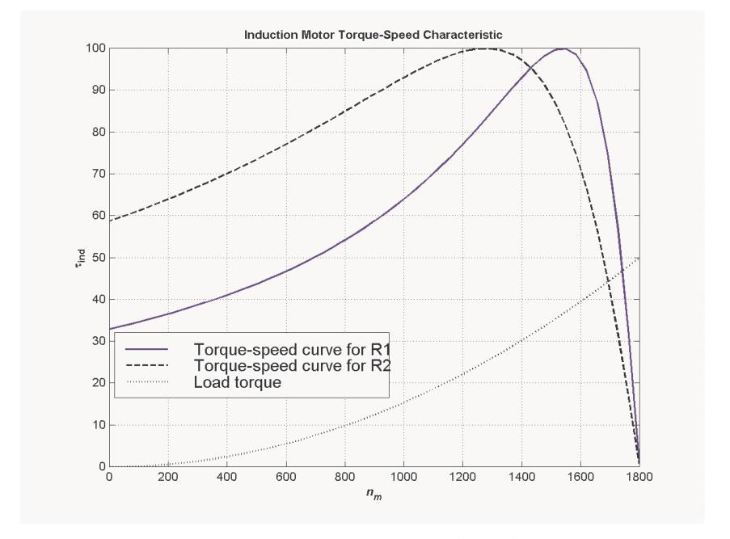

#### (f) Output Power $P_{out}$
The output power will generally **decrease**:
$$P_{OUT} = \tau_{ind}\downarrow \omega_m\downarrow$$

<!-- Page 202 (PDF Page 208) -->

#### (g) Rotor Copper Losses $P_{RCL}$
The rotor copper losses (including the external resistor) will **increase**.

#### (h) Overall Efficiency $\eta$
The overall efficiency $\eta$ will **decrease**.

---

## Problem 7-24

Answer the following questions about a 460-V $\Delta$-connected two-pole 75-hp 60-Hz starting code letter E induction motor:
(a) What is the maximum starting current that this machine's controller must be designed to handle?
(b) If the controller is designed to switch the stator windings from a $\Delta$ connection to a Y connection during starting, what is the maximum starting current that the controller must be designed to handle?
(c) If a 1.25:1 step-down autotransformer starter is used during starting, what is the maximum starting current that will be drawn from the line?

### Solution

#### (a) Maximum Across-the-Line Starting Current
Starting code letter E corresponds to $4.50 - 5.00\text{ kVA/hp}$. The maximum starting kVA of this motor is:
$$S_{start} = (75\text{ hp})(5.00\text{ kVA/hp}) = 375\text{ kVA}$$

Therefore:
$$I_{start} = \frac{S_{start}}{\sqrt{3} V_T} = \frac{375\text{ kVA}}{\sqrt{3}(460\text{ V})} = 471\text{ A}$$

#### (b) Starting Current with Wye-Delta ($\text{Y}$-$\Delta$) Starter
The line voltage remains 460 V when switched to Y, but the phase voltage drops to $460/\sqrt{3} = 266\text{ V}$.

Before (in $\Delta$):
$$I_{\phi,\Delta} = \frac{V_\phi}{(R_{TH} + R_2) + j(X_{TH} + X_2)} = \frac{460\text{ V}}{(R_{TH} + R_2) + j(X_{TH} + X_2)}$$
$$I_{L,\Delta} = \sqrt{3} I_{\phi,\Delta} = \frac{\sqrt{3}(460\text{ V})}{(R_{TH} + R_2) + j(X_{TH} + X_2)} = \frac{797\text{ V}}{(R_{TH} + R_2) + j(X_{TH} + X_2)}$$

After (in Y):
$$I_{L,Y} = I_{\phi,Y} = \frac{265.6\text{ V}}{(R_{TH} + R_2) + j(X_{TH} + X_2)}$$

Therefore the line current decreases by a factor of 3:
$$I_{start} = \frac{471\text{ A}}{3} = 157\text{ A}$$

#### (c) Starting Current with 1.25:1 Autotransformer Starter
A 1.25:1 step-down autotransformer reduces the phase voltage on the motor by a factor of $1/1.25 = 0.8$. This reduces the motor current by 0.8. The current drawn on the primary side of the autotransformer is reduced by another factor of 0.8:
$$I_{line} = (0.8)^2 I_{start} = 0.64 I_{start} = 0.64(471\text{ A}) = 301\text{ A}$$

---

<!-- Page 203 (PDF Page 209) -->

## Problem 7-25

When it is necessary to stop an induction motor very rapidly, many induction motor controllers reverse the direction of rotation of the magnetic fields by switching any two stator leads. When the direction of rotation of the magnetic fields is reversed, the motor develops an induced torque opposite to the current direction of rotation, so it quickly stops and tries to start turning in the opposite direction. If power is removed from the stator circuit at the moment when the rotor speed goes through zero, then the motor has been stopped very rapidly. This technique for rapidly stopping an induction motor is called plugging. The motor of Problem 7-19 is running at rated conditions and is to be stopped by plugging.
(a) What is the slip $s$ before plugging?
(b) What is the frequency of the rotor before plugging?
(c) What is the induced torque $\tau_{ind}$ before plugging?
(d) What is the slip $s$ immediately after switching the stator leads?
(e) What is the frequency of the rotor immediately after switching the stator leads?
(f) What is the induced torque $\tau_{ind}$ immediately after switching the stator leads?

### Solution

#### (a) Slip Before Plugging
The slip before plugging is **0.038** (see Problem 7-19).

#### (b) Rotor Frequency Before Plugging
$$f_r = s f_e = (0.038)(60\text{ Hz}) = 2.28\text{ Hz}$$

#### (c) Induced Torque Before Plugging
The induced torque before plugging is **$205.7\text{ N}\cdot\text{m}$** in the direction of motion (see Problem 7-19).

#### (d) Slip Immediately After Switching Stator Leads
After switching stator leads, the synchronous speed becomes $-1800\text{ r/min}$, while the mechanical speed initially remains $+1732\text{ r/min}$. Therefore:
$$s = \frac{n_{sync} - n_m}{n_{sync}} = \frac{-1800 - 1732}{-1800} = 1.962$$

#### (e) Rotor Frequency Immediately After Switching
$$f_r = s f_e = (1.962)(60\text{ Hz}) = 117.72\text{ Hz}$$

#### (f) Induced Torque Immediately After Switching
$$\tau_{ind} = \frac{3 V_{TH}^2 (R_2/s)}{\omega_{sync} \left[\left(R_{TH} + \frac{R_2}{s}\right)^2 + (X_{TH} + X_2)^2\right]}$$

$$\tau_{ind} = \frac{3(262\text{ V})^2 (0.172\,\Omega / 1.962)}{(188.5\text{ rad/s})\left[\left(0.321 + \frac{0.172}{1.962}\right)^2 + (0.418 + 0.420)^2\right]}$$

$$\tau_{ind} = \frac{3(262\text{ V})^2 (0.0877)}{(188.5\text{ rad/s})\left[(0.321 + 0.0877)^2 + (0.418 + 0.420)^2\right]} = 110\text{ N}\cdot\text{m}$$

$$\tau_{ind} = 110\text{ N}\cdot\text{m}\text{, opposite the direction of motion}$$
