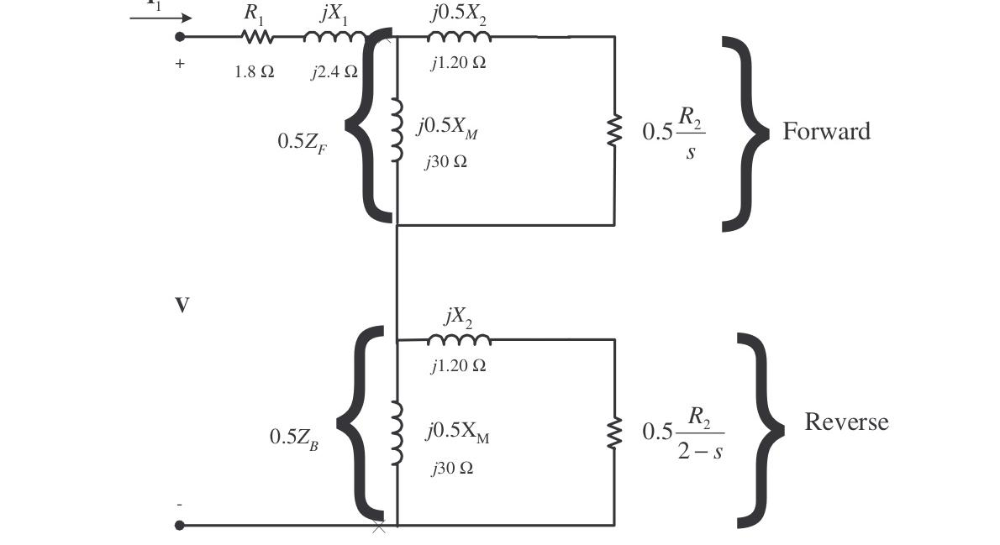
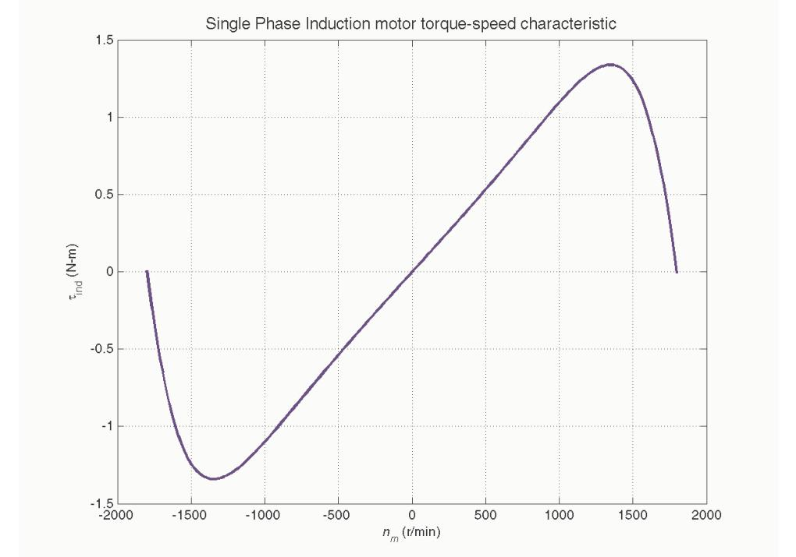
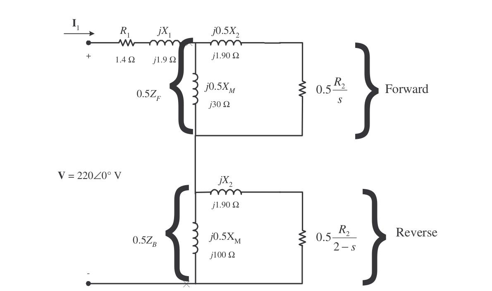

# Chapter 10: Single-Phase and Special-Purpose Motors

<!-- Page 270 (PDF Page 276) -->

## Problem 10-1

A 120-V, 1/3-hp 60-Hz, four-pole, split-phase induction motor has the following impedances:

$$R_1 = 1.80\ \Omega \qquad X_1 = 2.40\ \Omega \qquad X_M = 60\ \Omega$$
$$R_2 = 2.50\ \Omega \qquad X_2 = 2.40\ \Omega$$

At a slip of 0.05, the motor's rotational losses are 51 W. The rotational losses may be assumed constant over the normal operating range of the motor. If the slip is 0.05, find the following quantities for this motor:

*(a)* Input power  
*(b)* Air-gap power  
*(c)* $P_{\text{conv}}$  
*(d)* $P_{\text{out}}$  
*(e)* $\tau_{\text{ind}}$  
*(f)* $\tau_{\text{load}}$  
*(g)* Overall motor efficiency  
*(h)* Stator power factor  

### Solution

The equivalent circuit of the motor is shown below:



$$Z_F = \frac{(R_2 / s + jX_2)(jX_M)}{R_2 / s + jX_2 + jX_M}$$

$$Z_F = \frac{(50 + j2.40)(j60)}{50 + j2.40 + j60} = 28.15 + j24.87\ \Omega$$

$$Z_B = \frac{(R_2 / (2 - s) + jX_2)(jX_M)}{R_2 / (2 - s) + jX_2 + jX_M}$$

<!-- Page 271 (PDF Page 277) -->

$$Z_B = \frac{(1.282 + j2.40)(j60)}{1.282 + j2.40 + j60} = 1.185 + j2.332\ \Omega$$

**(a)** The input current is

$$\mathbf{I}_1 = \frac{\mathbf{V}}{R_1 + jX_1 + 0.5Z_F + 0.5Z_B}$$

$$\mathbf{I}_1 = \frac{120\angle 0^\circ\text{ V}}{(1.80 + j2.40) + 0.5(28.15 + j24.87) + 0.5(1.185 + j2.332)} = 5.23\angle -44.2^\circ\text{ A}$$

$$P_{\text{IN}} = V I \cos\theta = (120\text{ V})(5.23\text{ A})\cos 44.2^\circ = 450\text{ W}$$

**(b)** The air-gap power is

$$P_{AG,F} = I_1^2 (0.5R_F) = (5.23\text{ A})^2(14.1\ \Omega) = 386\text{ W}$$

$$P_{AG,B} = I_1^2 (0.5R_B) = (5.23\text{ A})^2(0.592\ \Omega) = 16.2\text{ W}$$

$$P_{AG} = P_{AG,F} - P_{AG,B} = 386\text{ W} - 14.8\text{ W} = 371\text{ W}$$

**(c)** The power converted from electrical to mechanical form is

$$P_{\text{conv},F} = (1 - s)P_{AG,F} = (1 - 0.05)(386\text{ W}) = 367\text{ W}$$

$$P_{\text{conv},B} = (1 - s)P_{AG,B} = (1 - 0.05)(16.2\text{ W}) = 15.4\text{ W}$$

$$P_{\text{conv}} = P_{\text{conv},F} - P_{\text{conv},B} = 367\text{ W} - 15.4\text{ W} = 352\text{ W}$$

**(d)** The output power is

$$P_{\text{OUT}} = P_{\text{conv}} - P_{\text{rot}} = 352\text{ W} - 51\text{ W} = 301\text{ W}$$

**(e)** The induced torque is

$$\tau_{\text{ind}} = \frac{P_{AG}}{\omega_{\text{sync}}} = \frac{371\text{ W}}{(1800\text{ r/min})\left(\dfrac{2\pi\text{ rad}}{1\text{ r}}\right)\left(\dfrac{1\text{ min}}{60\text{ s}}\right)} = 1.97\text{ N}\cdot\text{m}$$

**(f)** The load torque is

$$\tau_{\text{load}} = \frac{P_{\text{OUT}}}{\omega_m} = \frac{301\text{ W}}{(0.95)(1800\text{ r/min})\left(\dfrac{2\pi\text{ rad}}{1\text{ r}}\right)\left(\dfrac{1\text{ min}}{60\text{ s}}\right)} = 1.68\text{ N}\cdot\text{m}$$

**(g)** The overall efficiency is

$$\eta = \frac{P_{\text{OUT}}}{P_{\text{IN}}} \times 100\% = \frac{301\text{ W}}{450\text{ W}} \times 100\% = 66.9\%$$

**(h)** The stator power factor is

$$\text{PF} = \cos 44.2^\circ = 0.713\text{ lagging}$$

---

## Problem 10-2

Repeat Problem 10-1 for a rotor slip of 0.025.

### Solution

$$Z_F = \frac{(R_2 / s + jX_2)(jX_M)}{R_2 / s + jX_2 + jX_M}$$

$$Z_F = \frac{(100 + j2.40)(j60)}{100 + j2.40 + j60} = 28.91 + j43.83\ \Omega$$

<!-- Page 272 (PDF Page 278) -->

$$Z_B = \frac{(R_2 / (2 - s) + jX_2)(jX_M)}{R_2 / (2 - s) + jX_2 + jX_M}$$

$$Z_B = \frac{(1.282 + j2.40)(j60)}{1.282 + j2.40 + j60} = 1.170 + j2.331\ \Omega$$

**(a)** The input current is

$$\mathbf{I}_1 = \frac{\mathbf{V}}{R_1 + jX_1 + 0.5Z_F + 0.5Z_B}$$

$$\mathbf{I}_1 = \frac{120\angle 0^\circ\text{ V}}{(1.80 + j2.40) + 0.5(25.91 + j43.83) + 0.5(1.170 + j2.331)} = 4.03\angle -59.0^\circ\text{ A}$$

$$P_{\text{IN}} = V I \cos\theta = (120\text{ V})(4.03\text{ A})\cos 59.0^\circ = 249\text{ W}$$

**(b)** The air-gap power is

$$P_{AG,F} = I_1^2 (0.5R_F) = (4.03\text{ A})^2(12.96\ \Omega) = 210.5\text{ W}$$

$$P_{AG,B} = I_1^2 (0.5R_B) = (4.03\text{ A})^2(0.585\ \Omega) = 9.5\text{ W}$$

$$P_{AG} = P_{AG,F} - P_{AG,B} = 210.5\text{ W} - 9.5\text{ W} = 201\text{ W}$$

**(c)** The power converted from electrical to mechanical form is

$$P_{\text{conv},F} = (1 - s)P_{AG,F} = (1 - 0.025)(210.5\text{ W}) = 205\text{ W}$$

$$P_{\text{conv},B} = (1 - s)P_{AG,B} = (1 - 0.025)(9.5\text{ W}) = 9.3\text{ W}$$

$$P_{\text{conv}} = P_{\text{conv},F} - P_{\text{conv},B} = 205\text{ W} - 9.3\text{ W} = 196\text{ W}$$

**(d)** The output power is

$$P_{\text{OUT}} = P_{\text{conv}} - P_{\text{rot}} = 205\text{ W} - 51\text{ W} = 154\text{ W}$$

**(e)** The induced torque is

$$\tau_{\text{ind}} = \frac{P_{AG}}{\omega_{\text{sync}}} = \frac{210.5\text{ W}}{(1800\text{ r/min})\left(\dfrac{2\pi\text{ rad}}{1\text{ r}}\right)\left(\dfrac{1\text{ min}}{60\text{ s}}\right)} = 1.12\text{ N}\cdot\text{m}$$

**(f)** The load torque is

$$\tau_{\text{load}} = \frac{P_{\text{OUT}}}{\omega_m} = \frac{154\text{ W}}{(0.975)(1800\text{ r/min})\left(\dfrac{2\pi\text{ rad}}{1\text{ r}}\right)\left(\dfrac{1\text{ min}}{60\text{ s}}\right)} = 0.84\text{ N}\cdot\text{m}$$

**(g)** The overall efficiency is

$$\eta = \frac{P_{\text{OUT}}}{P_{\text{IN}}} \times 100\% = \frac{154\text{ W}}{249\text{ W}} \times 100\% = 61.8\%$$

**(h)** The stator power factor is

$$\text{PF} = \cos 59.0^\circ = 0.515\text{ lagging}$$

---

## Problem 10-3

Suppose that the motor in Problem 10-1 is started and the auxiliary winding fails open while the rotor is accelerating through 400 r/min. How much induced torque will the motor be able to produce on its main winding alone? Assuming that the rotational losses are still 51 W, will this motor continue accelerating or will it slow down again? Prove your answer.

<!-- Page 273 (PDF Page 279) -->

### Solution

At a speed of 400 r/min, the slip is

$$s = \frac{1800\text{ r/min} - 400\text{ r/min}}{1800\text{ r/min}} = 0.778$$

$$Z_F = \frac{(R_2 / s + jX_2)(jX_M)}{R_2 / s + jX_2 + jX_M}$$

$$Z_F = \frac{(100 + j2.40)(j60)}{100 + j2.40 + j60} = 2.96 + j2.46\ \Omega$$

$$Z_B = \frac{(R_2 / (2 - s) + jX_2)(jX_M)}{R_2 / (2 - s) + jX_2 + jX_M}$$

$$Z_B = \frac{(1.282 + j2.40)(j60)}{1.282 + j2.40 + j60} = 1.90 + j2.37\ \Omega$$

The input current is

$$\mathbf{I}_1 = \frac{\mathbf{V}}{R_1 + jX_1 + 0.5Z_F + 0.5Z_B}$$

$$\mathbf{I}_1 = \frac{120\angle 0^\circ\text{ V}}{(1.80 + j2.40) + 0.5(2.96 + j2.46) + 0.5(1.90 + j2.37)} = 18.73\angle -48.7^\circ\text{ A}$$

The air-gap power is

$$P_{AG,F} = I_1^2 (0.5R_F) = (18.73\text{ A})^2(1.48\ \Omega) = 519.2\text{ W}$$

$$P_{AG,B} = I_1^2 (0.5R_B) = (18.73\text{ A})^2(0.945\ \Omega) = 331.5\text{ W}$$

$$P_{AG} = P_{AG,F} - P_{AG,B} = 519.2\text{ W} - 331.5\text{ W} = 188\text{ W}$$

The power converted from electrical to mechanical form is

$$P_{\text{conv},F} = (1 - s)P_{AG,F} = (1 - 0.778)(519.2\text{ W}) = 115.2\text{ W}$$

$$P_{\text{conv},B} = (1 - s)P_{AG,B} = (1 - 0.778)(331.5\text{ W}) = 73.6\text{ W}$$

$$P_{\text{conv}} = P_{\text{conv},F} - P_{\text{conv},B} = 115.2\text{ W} - 73.6\text{ W} = 41.6\text{ W}$$

The induced torque is

$$\tau_{\text{ind}} = \frac{P_{AG}}{\omega_{\text{sync}}} = \frac{188\text{ W}}{(1800\text{ r/min})\left(\dfrac{2\pi\text{ rad}}{1\text{ r}}\right)\left(\dfrac{1\text{ min}}{60\text{ s}}\right)} = 1.00\text{ N}\cdot\text{m}$$

Assuming that the rotational losses are still 51 W, *this motor is not producing enough torque to keep accelerating*. $P_{\text{conv}}$ is 41.6 W, while the rotational losses are 51 W, so there is not enough power to make up the rotational losses. The motor will slow down[^ch10-fn5].

[^ch10-fn5]: Note that in the real world, rotational losses decrease with decreased shaft speed. Therefore, the losses will really be less than 51 W, and this motor might just be able to keep on accelerating slowly—it is a close thing either way.

---

## Problem 10-4

Use MATLAB to calculate and plot the torque-speed characteristic of the motor in Problem 10-1, ignoring the starting winding.

<!-- Page 274 (PDF Page 280) -->

### Solution

This problem is best solved with MATLAB, since it involves calculating the torque-speed values at many points. A MATLAB program to calculate and display both torque-speed characteristics is shown below. Note that this program shows the torque-speed curve for both positive and negative directions of rotation. Also, note that we had to avoid calculating the slip at exactly 0 or 2, since those numbers would produce divide-by-zero errors in $Z_F$ and $Z_B$ respectively.

```matlab
% M-file: torque_speed_curve3.m
% M-file create a plot of the torque-speed curve of the 
% single-phase induction motor of Problem 10-4.

% First, initialize the values needed in this program.
r1 = 1.80;              % Stator resistance
x1 = 2.40;              % Stator reactance
r2 = 2.50;              % Rotor resistance
x2 = 2.40;              % Rotor reactance
xm = 60;                % Magnetization branch reactance
v = 120;                % Single-Phase voltage
n_sync = 1800;          % Synchronous speed (r/min)
w_sync = 188.5;         % Synchronous speed (rad/s)

% Specify slip ranges to plot
s = 0:0.01:2.0;

% Offset slips at 0 and 2 slightly to avoid divide by zero errors
s(1)   = 0.0001;
s(201) = 1.9999;

% Get the corresponding speeds in rpm
nm = (1 - s) * n_sync;

% Caculate Zf and Zb as a function of slip
zf = (r2 ./ s + j*x2) * (j*xm) ./ (r2 ./ s + j*x2 + j*xm);
zb = (r2 ./(2-s) + j*x2) * (j*xm) ./ (r2 ./(2-s) + j*x2 + j*xm);

% Calculate the current flowing at each slip
i1 = v ./ ( r1 + j*x1 + zf + zb);

% Calculate the air-gap power
p_ag_f = abs(i1).^2 .* 0.5 .* real(zf);
p_ag_b = abs(i1).^2 .* 0.5 .* real(zb);
p_ag = p_ag_f - p_ag_b;

% Calculate torque in N-m.
t_ind = p_ag ./ w_sync;

% Plot the torque-speed curve
figure(1)
plot(nm,t_ind,'Color','b','LineWidth',2.0);
xlabel('\itn_{m} \rm(r/min)');
ylabel('\tau_{ind} \rm(N-m)');
title('Single Phase Induction motor torque-speed characteristic','FontSize',12);
grid on;
hold off;
```

<!-- Page 275 (PDF Page 281) -->

The resulting torque-speed characteristic is shown below:



---

## Problem 10-5

A 220-V, 1.5-hp 50-Hz, two-pole, capacitor-start induction motor has the following main-winding impedances:

$$R_1 = 1.40\ \Omega \qquad X_1 = 2.01\ \Omega \qquad X_M = 105\ \Omega$$
$$R_2 = 1.50\ \Omega \qquad X_2 = 2.01\ \Omega$$

At a slip of 0.05, the motor's rotational losses are 291 W. The rotational losses may be assumed constant over the normal operating range of the motor. Find the following quantities for this motor at 5 percent slip:

*(a)* Stator current  
*(b)* Stator power factor  
*(c)* Input power  
*(d)* $P_{AG}$  
*(e)* $P_{\text{conv}}$  
*(f)* $P_{\text{out}}$  
*(g)* $\tau_{\text{ind}}$  
*(h)* $\tau_{\text{load}}$  
*(i)* Efficiency  

### Solution

The equivalent circuit of the motor is shown below:

<!-- Page 276 (PDF Page 282) -->



$$Z_F = \frac{(R_2 / s + jX_2)(jX_M)}{R_2 / s + jX_2 + jX_M}$$

$$Z_F = \frac{(30 + j1.90)(j100)}{30 + j1.90 + j100} = 26.59 + j9.69\ \Omega$$

$$Z_B = \frac{(R_2 / (2 - s) + jX_2)(jX_M)}{R_2 / (2 - s) + jX_2 + jX_M}$$

$$Z_B = \frac{(0.769 + j1.90)(j100)}{0.769 + j1.90 + j100} = 0.741 + j1.870\ \Omega$$

**(a)** The input stator current is

$$\mathbf{I}_1 = \frac{\mathbf{V}}{R_1 + jX_1 + 0.5Z_F + 0.5Z_B}$$

$$\mathbf{I}_1 = \frac{220\angle 0^\circ\text{ V}}{(1.40 + j1.90) + 0.5(26.59 + j9.69) + 0.5(0.741 + j1.870)} = 13.0\angle -27.0^\circ\text{ A}$$

**(b)** The stator power factor is

$$\text{PF} = \cos 27^\circ = 0.891\text{ lagging}$$

**(c)** The input power is

$$P_{\text{IN}} = V I \cos\theta = (220\text{ V})(13.0\text{ A})\cos 27^\circ = 2548\text{ W}$$

**(d)** The air-gap power is

$$P_{AG,F} = I_1^2 (0.5R_F) = (13.0\text{ A})^2(13.29\ \Omega) = 2246\text{ W}$$

$$P_{AG,B} = I_1^2 (0.5R_B) = (13.0\text{ A})^2(0.370\ \Omega) = 62.5\text{ W}$$

$$P_{AG} = P_{AG,F} - P_{AG,B} = 2246\text{ W} - 62.5\text{ W} = 2184\text{ W}$$

<!-- Page 277 (PDF Page 283) -->

**(e)** The power converted from electrical to mechanical form is

$$P_{\text{conv},F} = (1 - s)P_{AG,F} = (1 - 0.05)(2246\text{ W}) = 2134\text{ W}$$

$$P_{\text{conv},B} = (1 - s)P_{AG,B} = (1 - 0.05)(62.5\text{ W}) = 59\text{ W}$$

$$P_{\text{conv}} = P_{\text{conv},F} - P_{\text{conv},B} = 2134\text{ W} - 59\text{ W} = 2075\text{ W}$$

**(f)** The output power is

$$P_{\text{OUT}} = P_{\text{conv}} - P_{\text{rot}} = 2134\text{ W} - 291\text{ W} = 1843\text{ W}$$

**(g)** The induced torque is

$$\tau_{\text{ind}} = \frac{P_{AG}}{\omega_{\text{sync}}} = \frac{2184\text{ W}}{(3000\text{ r/min})\left(\dfrac{2\pi\text{ rad}}{1\text{ r}}\right)\left(\dfrac{1\text{ min}}{60\text{ s}}\right)} = 6.95\text{ N}\cdot\text{m}$$

**(h)** The load torque is

$$\tau_{\text{load}} = \frac{P_{\text{OUT}}}{\omega_m} = \frac{1843\text{ W}}{(0.95)(3000\text{ r/min})\left(\dfrac{2\pi\text{ rad}}{1\text{ r}}\right)\left(\dfrac{1\text{ min}}{60\text{ s}}\right)} = 6.18\text{ N}\cdot\text{m}$$

**(i)** The overall efficiency is

$$\eta = \frac{P_{\text{OUT}}}{P_{\text{IN}}} \times 100\% = \frac{1843\text{ W}}{2548\text{ W}} \times 100\% = 72.3\%$$

---

## Problem 10-6

Find the induced torque in the motor in Problem 10-5 if it is operating at 5 percent slip and its terminal voltage is *(a)* 190 V, *(b)* 208 V, *(c)* 230 V.

### Solution

$$Z_F = \frac{(R_2 / s + jX_2)(jX_M)}{R_2 / s + jX_2 + jX_M}$$

$$Z_F = \frac{(30 + j1.90)(j100)}{30 + j1.90 + j100} = 26.59 + j9.69\ \Omega$$

$$Z_B = \frac{(R_2 / (2 - s) + jX_2)(jX_M)}{R_2 / (2 - s) + jX_2 + jX_M}$$

$$Z_B = \frac{(0.769 + j1.90)(j100)}{0.769 + j1.90 + j100} = 0.741 + j1.870\ \Omega$$

**(a)** If $\mathbf{V}_T = 190\angle 0^\circ\text{ V}$,

$$\mathbf{I}_1 = \frac{\mathbf{V}}{R_1 + jX_1 + 0.5Z_F + 0.5Z_B}$$

$$\mathbf{I}_1 = \frac{190\angle 0^\circ\text{ V}}{(1.40 + j1.90) + 0.5(26.59 + j9.69) + 0.5(0.741 + j1.870)} = 11.2\angle -27.0^\circ\text{ A}$$

$$P_{AG,F} = I_1^2 (0.5R_F) = (11.2\text{ A})^2(13.29\ \Omega) = 1667\text{ W}$$

$$P_{AG,B} = I_1^2 (0.5R_B) = (11.2\text{ A})^2(0.370\ \Omega) = 46.4\text{ W}$$

$$P_{AG} = P_{AG,F} - P_{AG,B} = 1667\text{ W} - 46.4\text{ W} = 1621\text{ W}$$

<!-- Page 278 (PDF Page 284) -->

$$\tau_{\text{ind}} = \frac{P_{AG}}{\omega_{\text{sync}}} = \frac{1621\text{ W}}{(3000\text{ r/min})\left(\dfrac{2\pi\text{ rad}}{1\text{ r}}\right)\left(\dfrac{1\text{ min}}{60\text{ s}}\right)} = 5.16\text{ N}\cdot\text{m}$$

**(b)** If $\mathbf{V}_T = 208\angle 0^\circ\text{ V}$,

$$\mathbf{I}_1 = \frac{\mathbf{V}}{R_1 + jX_1 + 0.5Z_F + 0.5Z_B}$$

$$\mathbf{I}_1 = \frac{208\angle 0^\circ\text{ V}}{(1.40 + j1.90) + 0.5(26.59 + j9.69) + 0.5(0.741 + j1.870)} = 12.3\angle -27.0^\circ\text{ A}$$

$$P_{AG,F} = I_1^2 (0.5R_F) = (12.3\text{ A})^2(13.29\ \Omega) = 2010\text{ W}$$

$$P_{AG,B} = I_1^2 (0.5R_B) = (12.3\text{ A})^2(0.370\ \Omega) = 56\text{ W}$$

$$P_{AG} = P_{AG,F} - P_{AG,B} = 2010\text{ W} - 56\text{ W} = 1954\text{ W}$$

$$\tau_{\text{ind}} = \frac{P_{AG}}{\omega_{\text{sync}}} = \frac{1954\text{ W}}{(3000\text{ r/min})\left(\dfrac{2\pi\text{ rad}}{1\text{ r}}\right)\left(\dfrac{1\text{ min}}{60\text{ s}}\right)} = 6.22\text{ N}\cdot\text{m}$$

**(c)** If $\mathbf{V}_T = 230\angle 0^\circ\text{ V}$,

$$\mathbf{I}_1 = \frac{\mathbf{V}}{R_1 + jX_1 + 0.5Z_F + 0.5Z_B}$$

$$\mathbf{I}_1 = \frac{230\angle 0^\circ\text{ V}}{(1.40 + j1.90) + 0.5(26.59 + j9.69) + 0.5(0.741 + j1.870)} = 13.6\angle -27.0^\circ\text{ A}$$

$$P_{AG,F} = I_1^2 (0.5R_F) = (13.6\text{ A})^2(13.29\ \Omega) = 2458\text{ W}$$

$$P_{AG,B} = I_1^2 (0.5R_B) = (13.6\text{ A})^2(0.370\ \Omega) = 68\text{ W}$$

$$P_{AG} = P_{AG,F} - P_{AG,B} = 2458\text{ W} - 68\text{ W} = 2390\text{ W}$$

$$\tau_{\text{ind}} = \frac{P_{AG}}{\omega_{\text{sync}}} = \frac{2390\text{ W}}{(3000\text{ r/min})\left(\dfrac{2\pi\text{ rad}}{1\text{ r}}\right)\left(\dfrac{1\text{ min}}{60\text{ s}}\right)} = 7.61\text{ N}\cdot\text{m}$$

Note that the induced torque is proportional to the square of the terminal voltage.

---

## Problem 10-7

What type of motor would you select to perform each of the following jobs? Why?

*(a)* Vacuum cleaner  
*(b)* Refrigerator  
*(c)* Air conditioner compressor  
*(d)* Air conditioner fan  
*(e)* Variable-speed sewing machine  
*(f)* Clock  
*(g)* Electric drill  

### Solution

**(a)** *Universal motor*—for its high torque

**(b)** *Capacitor start* or *Capacitor start and run*—For its high starting torque and relatively constant speed at a wide variety of loads

**(c)** Same as *(b)* above

<!-- Page 279 (PDF Page 285) -->

**(d)** *Split-phase*—Fans are low-starting-torque applications, and a split-phase motor is appropriate

**(e)** *Universal Motor*—Direction and speed are easy to control with solid-state drives

**(f)** *Hysteresis motor*—for its easy starting and operation at $n_{\text{sync}}$. A reluctance motor would also do nicely.

**(g)** *Universal Motor*—for easy speed control with solid-state drives, plus high torque under loaded conditions.

---

## Problem 10-8

For a particular application, a three-phase stepper motor must be capable of stepping in 10° increments. How many poles must it have?

### Solution

From Equation (10-18), the relationship between mechanical angle and electrical angle in a three-phase stepper motor is

$$\theta_m = \frac{2}{P} \theta_e$$

so

$$P = 2 \frac{\theta_e}{\theta_m} = 2 \frac{60^\circ}{10^\circ} = 12\text{ poles}$$

---

## Problem 10-9

How many pulses per second must be supplied to the control unit of the motor in Problem 10-7 to achieve a rotational speed of 600 r/min?

### Solution

From Equation (10-20),

$$n_m = \frac{1}{3P} n_{\text{pulses}}$$

so

$$n_{\text{pulses}} = 3 P n_m = 3(12\text{ poles})(600\text{ r/min}) = 21,600\text{ pulses/min} = 360\text{ pulses/s}$$

---

## Problem 10-10

Construct a table showing step size versus number of poles for three-phase and four-phase stepper motors.

### Solution

For 3-phase stepper motors, $\theta_e = 60^\circ$, and for 4-phase stepper motors, $\theta_e = 45^\circ$. Therefore,

| Number of poles | Mechanical Step Size: 3-phase ($\theta_e = 60^\circ$) | Mechanical Step Size: 4-phase ($\theta_e = 45^\circ$) |
| :---: | :---: | :---: |
| 2 | $60^\circ$ | $45^\circ$ |
| 4 | $30^\circ$ | $22.5^\circ$ |
| 6 | $20^\circ$ | $15^\circ$ |
| 8 | $15^\circ$ | $11.25^\circ$ |
| 10 | $12^\circ$ | $9^\circ$ |
| 12 | $10^\circ$ | $7.5^\circ$ |
