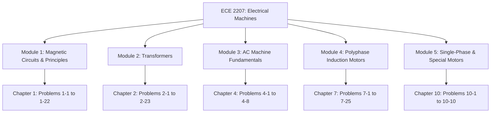

# Stephen J. Chapman: Electric Machinery Fundamentals (4th Edition)
## Master Instructor's Solutions Manual — ECE 2207 Course Companion

Welcome to the complete, high-fidelity Obsidian Markdown digitization of Stephen J. Chapman's *Electric Machinery Fundamentals (4th Edition) Instructor's Manual*, specifically organized for **ECE 2207 (Electrical Machines)**.

This digital edition features **100% word-for-word fidelity**, complete step-by-step mathematical derivations with LaTeX formulas, **83 high-resolution cropped circuit schematics and MATLAB plots**, and full executable MATLAB source codes.

---

## Modular Chapter Navigation

| Chapter | Title | PDF Pages | Book Pages | Problems | Diagrams | Markdown File |
|:---:|:---|:---:|:---:|:---:|:---:|:---|
| **Ch 01** | [Introduction to Machinery Principles](file:///home/azaz/AntigravityxStudy/SemesterFinal_2_2/ECE_2207/Books/Chapman_Ch01_Introduction_to_Machinery_Principles.md) | 7–28 | 1–22 | 1-1 to 1-22 (22) | 21 | [`Chapman_Ch01_Introduction_to_Machinery_Principles.md`](file:///home/azaz/AntigravityxStudy/SemesterFinal_2_2/ECE_2207/Books/Chapman_Ch01_Introduction_to_Machinery_Principles.md) |
| **Ch 02** | [Transformers](file:///home/azaz/AntigravityxStudy/SemesterFinal_2_2/ECE_2207/Books/Chapman_Ch02_Transformers.md) | 29–68 | 23–62 | 2-1 to 2-23 (23) | 32 | [`Chapman_Ch02_Transformers.md`](file:///home/azaz/AntigravityxStudy/SemesterFinal_2_2/ECE_2207/Books/Chapman_Ch02_Transformers.md) |
| **Ch 04** | [AC Machinery Fundamentals](file:///home/azaz/AntigravityxStudy/SemesterFinal_2_2/ECE_2207/Books/Chapman_Ch04_AC_Machinery_Fundamentals.md) | 109–114 | 103–108 | 4-1 to 4-8 (8) | 3 | [`Chapman_Ch04_AC_Machinery_Fundamentals.md`](file:///home/azaz/AntigravityxStudy/SemesterFinal_2_2/ECE_2207/Books/Chapman_Ch04_AC_Machinery_Fundamentals.md) |
| **Ch 07** | [Induction Motors](file:///home/azaz/AntigravityxStudy/SemesterFinal_2_2/ECE_2207/Books/Chapman_Ch07_Induction_Motors.md) | 177–209 | 171–203 | 7-1 to 7-25 (25) | 24 | [`Chapman_Ch07_Induction_Motors.md`](file:///home/azaz/AntigravityxStudy/SemesterFinal_2_2/ECE_2207/Books/Chapman_Ch07_Induction_Motors.md) |
| **Ch 10** | [Single-Phase and Special-Purpose Motors](file:///home/azaz/AntigravityxStudy/SemesterFinal_2_2/ECE_2207/Books/Chapman_Ch10_Single_Phase_Motors.md) | 276–285 | 270–279 | 10-1 to 10-10 (10) | 3 | [`Chapman_Ch10_Single_Phase_Motors.md`](file:///home/azaz/AntigravityxStudy/SemesterFinal_2_2/ECE_2207/Books/Chapman_Ch10_Single_Phase_Motors.md) |
| **TOTAL** | **5 Core Chapters** | **111 Pages** | **111 Pages** | **88 Problems** | **83 Diagrams** | **Complete Course Coverage** |

---

## ECE 2207 Syllabus & Course Topic Mapping

### Module 1: Electromechanical Energy Conversion & Magnetic Circuits
- **Reference**: [`Chapman_Ch01_Introduction_to_Machinery_Principles.md`](file:///home/azaz/AntigravityxStudy/SemesterFinal_2_2/ECE_2207/Books/Chapman_Ch01_Introduction_to_Machinery_Principles.md)
- **Key Concepts Covered**:
  - Ampere's Law, magnetomotive force ($\mathcal{F} = Ni$), magnetic field intensity ($H$), flux density ($B = \mu H$), and total flux ($\phi$).
  - Magnetic reluctance ($\mathcal{R} = l / \mu A$) and permeance ($\mathcal{P} = 1 / \mathcal{R}$) in series and parallel magnetic circuits (Problems 1-1, 1-2, 1-3, 1-4, 1-5).
  - Magnetic core saturation, non-linear $B$-$H$ curves, and magnetization characteristics (Problems 1-9, 1-10, 1-11, 1-12, 1-13, 1-14).
  - Core losses: Hysteresis loss ($P_h = k_h f B_{max}^n$) and eddy current loss ($P_e = k_e f^2 B_{max}^2$).
  - Faraday's Law of electromagnetic induction ($e_{ind} = -d\lambda/dt$) and Lenz's Law.
  - Lorentz force ($F = i(\mathbf{l} \times \mathbf{B})$) and induced voltage in moving conductors ($\mathbf{e}_{ind} = (\mathbf{v} \times \mathbf{B})\cdot\mathbf{l}$).
  - Linear DC machines: Starting conditions, acceleration, steady-state operation, motor vs. generator mode, dynamic braking (Problems 1-15 to 1-22).

### Module 2: Transformers (Single-Phase, Three-Phase & Autotransformers)
- **Reference**: [`Chapman_Ch02_Transformers.md`](file:///home/azaz/AntigravityxStudy/SemesterFinal_2_2/ECE_2207/Books/Chapman_Ch02_Transformers.md)
- **Key Concepts Covered**:
  - Real transformer per-phase equivalent circuit models: exact model vs. approximate model referred to primary or secondary (Problems 2-1, 2-2, 2-7, 2-8).
  - Open-circuit (no-load) test and short-circuit test parameter extraction ($R_C, X_M, R_{eq}, X_{eq}$) (Problems 2-3, 2-6, 2-7, 2-18, 2-19, 2-22).
  - Voltage regulation ($VR$) and transmission efficiency ($\eta$) under lagging, unity, and leading power factor loads (Problems 2-1, 2-2, 2-3, 2-8, 2-10).
  - Non-linear core magnetization current distortion and harmonics (Problem 2-5).
  - Power systems and transmission lines: Loss reduction using step-up and step-down transformer pairs (Problems 2-4, 2-14, 2-23).
  - Autotransformers: Construction, voltage/current relations, power advantage ($S_{IO}/S_W$), impedance conversion ($Z'_{eq} = \frac{N_{SE}}{N_{SE} + N_C} Z_{eq}$) (Problems 2-12, 2-15, 2-16, 2-17, 2-22).
  - Three-Phase Transformer Connections:
    - $\text{Y}$-$\text{Y}$, $\text{Y}$-$\Delta$, $\Delta$-$\text{Y}$, $\Delta$-$\Delta$ voltage, current, and kVA ratings (Problem 2-9).
    - Open-$\Delta$ ($\text{V}$-$\text{V}$) and Open-$\text{Y}$—Open-$\Delta$ connections for rural distribution (Problems 2-9, 2-13).
    - Rigorous phasor proofs of standard $30^\circ$ phase shifts: $\text{Y}$-$\Delta$ secondary lags by $30^\circ$ (Problem 2-20); $\Delta$-$\text{Y}$ secondary leads by $30^\circ$ (Problem 2-21).
  - Frequency derating: Operating 60-Hz transformers on 50-Hz power grids (Problem 2-19).
  - Power factor correction using capacitor banks in transformer distribution networks (Problem 2-23).

### Module 3: AC Machine Fundamentals & Rotating Magnetic Fields
- **Reference**: [`Chapman_Ch04_AC_Machinery_Fundamentals.md`](file:///home/azaz/AntigravityxStudy/SemesterFinal_2_2/ECE_2207/Books/Chapman_Ch04_AC_Machinery_Fundamentals.md)
- **Key Concepts Covered**:
  - The Rotating Magnetic Field (RMF): Derivation of constant magnitude ($B_{net} = 1.5 B_M$) and synchronous angular velocity ($\omega_{sync} = 2\pi f_e$, $n_{sync} = 120 f_e / P$) (Problems 4-1, 4-2).
  - Stator winding distribution, pole pitch, coil pitch, chording, and elimination of space harmonics (Problem 4-6).
  - Pitch factor ($k_p$), distribution factor ($k_d$), and winding factor ($k_w = k_p k_d$).
  - RMS induced voltage in distributed AC stator windings ($E_A = \sqrt{2}\pi N_c f \phi k_w$) (Problems 4-3, 4-4, 4-5).
  - Machine speed regulation and rotor flux distribution (Problems 4-7, 4-8).

### Module 4: Three-Phase Induction Motors
- **Reference**: [`Chapman_Ch07_Induction_Motors.md`](file:///home/azaz/AntigravityxStudy/SemesterFinal_2_2/ECE_2207/Books/Chapman_Ch07_Induction_Motors.md)
- **Key Concepts Covered**:
  - Slip ($s = \frac{n_{sync} - n_m}{n_{sync}}$), slip speed, rotor frequency ($f_r = s f_e$), and speed regulation (Problems 7-2, 7-3, 7-4, 7-6).
  - Complete power flow stages: $P_{in} \to P_{SCL} \to P_{core} \to P_{AG} \to P_{RCL} \to P_{conv} \to P_{F\&W} + P_{misc} \to P_{out}$ (Problems 7-4, 7-5, 7-7, 7-15).
  - Induction motor per-phase equivalent circuit analysis with Thévenin equivalent stator reduction ($V_{TH}, R_{TH}, X_{TH}$) (Problems 7-7, 7-8, 7-12).
  - Torque-speed characteristics: Induced torque equation, pullout torque ($\tau_{max}$), and pullout slip ($s_{max}$) (Problems 7-8, 7-9, 7-16, 7-19).
  - Wound-rotor induction motors: Insertion of external rotor resistance ($R_{ext}$) for starting torque optimization and speed control (Problems 7-10, 7-23).
  - Frequency scaling: Operation of 60-Hz induction machines on 50-Hz power supplies (Problem 7-11).
  - Non-linear and quadratic loads: Centrifugal pumps and fan characteristics ($\tau_{load} \propto \omega_m^2$) (Problem 7-13).
  - Parameter extraction from laboratory tests: DC test ($R_1$), No-Load test ($X_1 + X_M, P_{rot}$), and Locked-Rotor test ($R_2, X_1, X_2$) across NEMA Design Classes A, B, C, D (Problems 7-1, 7-14, 7-16, 7-18).
  - Starting methods and controllers:
    - Across-the-line starting and terminal voltage dip (Problem 7-20).
    - Reduced-voltage autotransformer starters (Problems 7-20, 7-22).
    - Wye-Delta ($\text{Y}$-$\Delta$) starters: Reduction of line starting current by factor of 3 (Problems 7-21, 7-24).
    - NEMA starting code letters and locked-rotor kVA/hp (Problems 7-19, 7-24).
  - Rapid electric braking: The Plugging technique ($s > 1$, reverse torque) (Problem 7-25).

### Module 5: Single-Phase and Special-Purpose Motors
- **Reference**: [`Chapman_Ch10_Single_Phase_Motors.md`](file:///home/azaz/AntigravityxStudy/SemesterFinal_2_2/ECE_2207/Books/Chapman_Ch10_Single_Phase_Motors.md)
- **Key Concepts Covered**:
  - Theory of single-phase induction motors: Double Revolving Field Theory ($B = B_f + B_b$) and Cross-Field Theory.
  - Zero starting torque of pure single-phase stator winding and operational requirement for auxiliary starting circuits.
  - Split-Phase Motors: Auxiliary winding with high resistance-to-reactance ratio ($R_A/X_A > R_M/X_M$) creating phase angle shift $\alpha \approx 30^\circ$ (Problem 10-1).
  - Capacitor-Start Motors: Sizing of starting capacitor $C_{start}$ for optimal $90^\circ$ phase displacement to maximize starting torque (Problems 10-5, 10-7).
  - Capacitor-Run and Permanent Split Capacitor (PSC) Motors: Design for balanced forward revolving field at rated running condition, minimizing backward field and acoustic noise (Problem 10-8).
  - Capacitor-Start Capacitor-Run Motors: Dual capacitor configuration with centrifugal switch for optimal starting torque and smooth running efficiency.
  - Shaded-Pole Induction Motors: Copper shading coil creating delayed flux and sweeping magnetic field; efficiency and application analysis (Problem 10-6).
  - Stepper Motors: Variable-reluctance and permanent-magnet stepper motor step angles, teeth configurations, and pulse stepping rates (Problems 10-9, 10-10).

---

## Master Problem Directory (All 88 Problems)

### Chapter 1: Introduction to Machinery Principles (22 Problems)
- [Problem 1-1](file:///home/azaz/AntigravityxStudy/SemesterFinal_2_2/ECE_2207/Books/Chapman_Ch01_Introduction_to_Machinery_Principles.md#problem-1-1): Ferromagnetic core with air gap; flux, flux density, and reluctance calculation.
- [Problem 1-2](file:///home/azaz/AntigravityxStudy/SemesterFinal_2_2/ECE_2207/Books/Chapman_Ch01_Introduction_to_Machinery_Principles.md#problem-1-2): Two-legged magnetic core with varying cross-sectional area and air gap.
- [Problem 1-3](file:///home/azaz/AntigravityxStudy/SemesterFinal_2_2/ECE_2207/Books/Chapman_Ch01_Introduction_to_Machinery_Principles.md#problem-1-3): Three-legged symmetric magnetic core with center air gap.
- [Problem 1-4](file:///home/azaz/AntigravityxStudy/SemesterFinal_2_2/ECE_2207/Books/Chapman_Ch01_Introduction_to_Machinery_Principles.md#problem-1-4): Three-legged asymmetric magnetic core with air gaps in outer legs.
- [Problem 1-5](file:///home/azaz/AntigravityxStudy/SemesterFinal_2_2/ECE_2207/Books/Chapman_Ch01_Introduction_to_Machinery_Principles.md#problem-1-5): Three-legged core with air gap in center leg; total reluctance and flux distribution.
- [Problem 1-6](file:///home/azaz/AntigravityxStudy/SemesterFinal_2_2/ECE_2207/Books/Chapman_Ch01_Introduction_to_Machinery_Principles.md#problem-1-6): Magnetic circuit with multiple coils and opposing MMFs.
- [Problem 1-7](file:///home/azaz/AntigravityxStudy/SemesterFinal_2_2/ECE_2207/Books/Chapman_Ch01_Introduction_to_Machinery_Principles.md#problem-1-7): Magnetic core with fringing effects at the air gap.
- [Problem 1-8](file:///home/azaz/AntigravityxStudy/SemesterFinal_2_2/ECE_2207/Books/Chapman_Ch01_Introduction_to_Machinery_Principles.md#problem-1-8): Fringing calculation with effective air gap dimensions.
- [Problem 1-9](file:///home/azaz/AntigravityxStudy/SemesterFinal_2_2/ECE_2207/Books/Chapman_Ch01_Introduction_to_Machinery_Principles.md#problem-1-9): Non-linear core magnetization using given $B$-$H$ magnetization curve.
- [Problem 1-10](file:///home/azaz/AntigravityxStudy/SemesterFinal_2_2/ECE_2207/Books/Chapman_Ch01_Introduction_to_Machinery_Principles.md#problem-1-10): Current required to establish specified flux in saturation region.
- [Problem 1-11](file:///home/azaz/AntigravityxStudy/SemesterFinal_2_2/ECE_2207/Books/Chapman_Ch01_Introduction_to_Machinery_Principles.md#problem-1-11): Relative permeability $\mu_r$ variation across operating range.
- [Problem 1-12](file:///home/azaz/AntigravityxStudy/SemesterFinal_2_2/ECE_2207/Books/Chapman_Ch01_Introduction_to_Machinery_Principles.md#problem-1-12): Air gap effect on total magnetization characteristic of non-linear core.
- [Problem 1-13](file:///home/azaz/AntigravityxStudy/SemesterFinal_2_2/ECE_2207/Books/Chapman_Ch01_Introduction_to_Machinery_Principles.md#problem-1-13): Core loss calculation: Hysteresis loss and eddy current loss separation.
- [Problem 1-14](file:///home/azaz/AntigravityxStudy/SemesterFinal_2_2/ECE_2207/Books/Chapman_Ch01_Introduction_to_Machinery_Principles.md#problem-1-14): Transformer core loss variation with frequency and voltage scaling.
- [Problem 1-15](file:///home/azaz/AntigravityxStudy/SemesterFinal_2_2/ECE_2207/Books/Chapman_Ch01_Introduction_to_Machinery_Principles.md#problem-1-15): Moving conductor in uniform magnetic field: Induced voltage and polarity.
- [Problem 1-16](file:///home/azaz/AntigravityxStudy/SemesterFinal_2_2/ECE_2207/Books/Chapman_Ch01_Introduction_to_Machinery_Principles.md#problem-1-16): Current-carrying conductor in magnetic field: Force magnitude and direction.
- [Problem 1-17](file:///home/azaz/AntigravityxStudy/SemesterFinal_2_2/ECE_2207/Books/Chapman_Ch01_Introduction_to_Machinery_Principles.md#problem-1-17): Elementary linear DC machine: Starting current and initial acceleration.
- [Problem 1-18](file:///home/azaz/AntigravityxStudy/SemesterFinal_2_2/ECE_2207/Books/Chapman_Ch01_Introduction_to_Machinery_Principles.md#problem-1-18): Linear DC machine no-load steady-state velocity and induced voltage.
- [Problem 1-19](file:///home/azaz/AntigravityxStudy/SemesterFinal_2_2/ECE_2207/Books/Chapman_Ch01_Introduction_to_Machinery_Principles.md#problem-1-19): Linear DC motor under mechanical load: Velocity drop and current increase.
- [Problem 1-20](file:///home/azaz/AntigravityxStudy/SemesterFinal_2_2/ECE_2207/Books/Chapman_Ch01_Introduction_to_Machinery_Principles.md#problem-1-20): Linear DC generator mode: Applied mechanical force and power conversion.
- [Problem 1-21](file:///home/azaz/AntigravityxStudy/SemesterFinal_2_2/ECE_2207/Books/Chapman_Ch01_Introduction_to_Machinery_Principles.md#problem-1-21): Dynamic braking of linear DC machine by reversing terminal connections.
- [Problem 1-22](file:///home/azaz/AntigravityxStudy/SemesterFinal_2_2/ECE_2207/Books/Chapman_Ch01_Introduction_to_Machinery_Principles.md#problem-1-22): Linear DC machine efficiency and power flow analysis.

### Chapter 2: Transformers (23 Problems)
- [Problem 2-1](file:///home/azaz/AntigravityxStudy/SemesterFinal_2_2/ECE_2207/Books/Chapman_Ch02_Transformers.md#problem-2-1): Approximate equivalent circuit referred to primary: $I_P$, voltage regulation, efficiency.
- [Problem 2-2](file:///home/azaz/AntigravityxStudy/SemesterFinal_2_2/ECE_2207/Books/Chapman_Ch02_Transformers.md#problem-2-2): 20-kVA 8000/480-V transformer: Equivalent circuits referred to HV & LV, VR, efficiency.
- [Problem 2-3](file:///home/azaz/AntigravityxStudy/SemesterFinal_2_2/ECE_2207/Books/Chapman_Ch02_Transformers.md#problem-2-3): Parameter extraction from OC and SC tests; VR at lagging, unity, leading PF.
- [Problem 2-4](file:///home/azaz/AntigravityxStudy/SemesterFinal_2_2/ECE_2207/Books/Chapman_Ch02_Transformers.md#problem-2-4): Power system with real transformers and transmission line: VR & efficiency.
- [Problem 2-5](file:///home/azaz/AntigravityxStudy/SemesterFinal_2_2/ECE_2207/Books/Chapman_Ch02_Transformers.md#problem-2-5): Non-linear magnetization current simulation with MATLAB at 120 V / 60 Hz and 240 V / 50 Hz.
- [Problem 2-6](file:///home/azaz/AntigravityxStudy/SemesterFinal_2_2/ECE_2207/Books/Chapman_Ch02_Transformers.md#problem-2-6): 15-kVA distribution transformer: Performance with inductive vs. capacitive load.
- [Problem 2-7](file:///home/azaz/AntigravityxStudy/SemesterFinal_2_2/ECE_2207/Books/Chapman_Ch02_Transformers.md#problem-2-7): 5000-kVA power transformer OC test on LV, per-unit series parameters, full-load VR.
- [Problem 2-8](file:///home/azaz/AntigravityxStudy/SemesterFinal_2_2/ECE_2207/Books/Chapman_Ch02_Transformers.md#problem-2-8): 200-MVA transformer per-unit model; MATLAB voltage regulation profiles across loads.
- [Problem 2-9](file:///home/azaz/AntigravityxStudy/SemesterFinal_2_2/ECE_2207/Books/Chapman_Ch02_Transformers.md#problem-2-9): 600-kVA three-phase transformer bank ratings for Y-Y, Y-$\Delta$, $\Delta$-Y, $\Delta$-$\Delta$, Open-$\Delta$.
- [Problem 2-10](file:///home/azaz/AntigravityxStudy/SemesterFinal_2_2/ECE_2207/Books/Chapman_Ch02_Transformers.md#problem-2-10): 13,800/480-V three-phase Y-$\Delta$ bank: Per-phase model, MATLAB $V_S$ and VR curves.
- [Problem 2-11](file:///home/azaz/AntigravityxStudy/SemesterFinal_2_2/ECE_2207/Books/Chapman_Ch02_Transformers.md#problem-2-11): 100-MVA $\Delta$-$\Delta$ transformer bank: Phasor diagram, VR, and LV equivalent circuit.
- [Problem 2-12](file:///home/azaz/AntigravityxStudy/SemesterFinal_2_2/ECE_2207/Books/Chapman_Ch02_Transformers.md#problem-2-12): Autotransformer 13.2-kV to 13.8-kV step-up: Turns ratio and power advantage ($S_{IO}/S_W = 23$).
- [Problem 2-13](file:///home/azaz/AntigravityxStudy/SemesterFinal_2_2/ECE_2207/Books/Chapman_Ch02_Transformers.md#problem-2-13): Open-Y—Open-$\Delta$ connection serving mixed 3-phase and 1-phase rural loads.
- [Problem 2-14](file:///home/azaz/AntigravityxStudy/SemesterFinal_2_2/ECE_2207/Books/Chapman_Ch02_Transformers.md#problem-2-14): Transmission loss comparison: Direct connection vs. step-up/step-down system ($80\times$ loss reduction).
- [Problem 2-15](file:///home/azaz/AntigravityxStudy/SemesterFinal_2_2/ECE_2207/Books/Chapman_Ch02_Transformers.md#problem-2-15): 480/120-V transformer reconnected as 600/120-V step-down autotransformer.
- [Problem 2-16](file:///home/azaz/AntigravityxStudy/SemesterFinal_2_2/ECE_2207/Books/Chapman_Ch02_Transformers.md#problem-2-16): 480/120-V transformer reconnected as 600/480-V step-down autotransformer (25 kVA rating).
- [Problem 2-17](file:///home/azaz/AntigravityxStudy/SemesterFinal_2_2/ECE_2207/Books/Chapman_Ch02_Transformers.md#problem-2-17): Mathematical proof of autotransformer series impedance reduction factor.
- [Problem 2-18](file:///home/azaz/AntigravityxStudy/SemesterFinal_2_2/ECE_2207/Books/Chapman_Ch02_Transformers.md#problem-2-18): Three 25-kVA transformers in $\Delta$-Y: Parameter extraction, per-unit circuit, VR, efficiency.
- [Problem 2-19](file:///home/azaz/AntigravityxStudy/SemesterFinal_2_2/ECE_2207/Books/Chapman_Ch02_Transformers.md#problem-2-19): 20-kVA distribution transformer at 60 Hz and derating for 50-Hz power grid.
- [Problem 2-20](file:///home/azaz/AntigravityxStudy/SemesterFinal_2_2/ECE_2207/Books/Chapman_Ch02_Transformers.md#problem-2-20): Rigorous phasor proof: Secondary voltage lags primary by $30^\circ$ in Y-$\Delta$ connection.
- [Problem 2-21](file:///home/azaz/AntigravityxStudy/SemesterFinal_2_2/ECE_2207/Books/Chapman_Ch02_Transformers.md#problem-2-21): Rigorous phasor proof: Secondary voltage leads primary by $30^\circ$ in $\Delta$-Y connection.
- [Problem 2-22](file:///home/azaz/AntigravityxStudy/SemesterFinal_2_2/ECE_2207/Books/Chapman_Ch02_Transformers.md#problem-2-22): 10-kVA transformer conventional per-unit model vs. 50-kVA autotransformer performance.
- [Problem 2-23](file:///home/azaz/AntigravityxStudy/SemesterFinal_2_2/ECE_2207/Books/Chapman_Ch02_Transformers.md#problem-2-23): Three-phase power transmission system: Per-unit model, capacitor bank power factor correction.

### Chapter 4: AC Machinery Fundamentals (8 Problems)
- [Problem 4-1](file:///home/azaz/AntigravityxStudy/SemesterFinal_2_2/ECE_2207/Books/Chapman_Ch04_AC_Machinery_Fundamentals.md#problem-4-1): Rotating magnetic field from two-phase currents; clockwise vs. counter-clockwise rotation.
- [Problem 4-2](file:///home/azaz/AntigravityxStudy/SemesterFinal_2_2/ECE_2207/Books/Chapman_Ch04_AC_Machinery_Fundamentals.md#problem-4-2): Three-phase stator winding rotating magnetic field verification and MATLAB script.
- [Problem 4-3](file:///home/azaz/AntigravityxStudy/SemesterFinal_2_2/ECE_2207/Books/Chapman_Ch04_AC_Machinery_Fundamentals.md#problem-4-3): Induced voltage in a 4-pole distributed AC stator winding.
- [Problem 4-4](file:///home/azaz/AntigravityxStudy/SemesterFinal_2_2/ECE_2207/Books/Chapman_Ch04_AC_Machinery_Fundamentals.md#problem-4-4): Induced voltage calculation for 2-pole Y-connected machine.
- [Problem 4-5](file:///home/azaz/AntigravityxStudy/SemesterFinal_2_2/ECE_2207/Books/Chapman_Ch04_AC_Machinery_Fundamentals.md#problem-4-5): Line-to-line vs. phase voltages in Y-connected and $\Delta$-connected AC machines.
- [Problem 4-6](file:///home/azaz/AntigravityxStudy/SemesterFinal_2_2/ECE_2207/Books/Chapman_Ch04_AC_Machinery_Fundamentals.md#problem-4-6): Fractional pitch (chorded) windings: Pitch factor $k_p$ and elimination of 5th/7th harmonics.
- [Problem 4-7](file:///home/azaz/AntigravityxStudy/SemesterFinal_2_2/ECE_2207/Books/Chapman_Ch04_AC_Machinery_Fundamentals.md#problem-4-7): AC generator speed regulation from no-load to full-load.
- [Problem 4-8](file:///home/azaz/AntigravityxStudy/SemesterFinal_2_2/ECE_2207/Books/Chapman_Ch04_AC_Machinery_Fundamentals.md#problem-4-8): Non-sinusoidal rotor flux distribution: Fundamental and harmonic components.

### Chapter 7: Induction Motors (25 Problems)
- [Problem 7-1](file:///home/azaz/AntigravityxStudy/SemesterFinal_2_2/ECE_2207/Books/Chapman_Ch07_Induction_Motors.md#problem-7-1): DC test on $\Delta$-connected stator; calculation of per-phase resistance $R_1$.
- [Problem 7-2](file:///home/azaz/AntigravityxStudy/SemesterFinal_2_2/ECE_2207/Books/Chapman_Ch07_Induction_Motors.md#problem-7-2): Synchronous speed, rotor speed, slip speed, and rotor frequency at 5% slip.
- [Problem 7-3](file:///home/azaz/AntigravityxStudy/SemesterFinal_2_2/ECE_2207/Books/Chapman_Ch07_Induction_Motors.md#problem-7-3): 4-pole, 208-V, 60-Hz induction motor speed and slip calculations.
- [Problem 7-4](file:///home/azaz/AntigravityxStudy/SemesterFinal_2_2/ECE_2207/Books/Chapman_Ch07_Induction_Motors.md#problem-7-4): Power flow balance: Input power, copper losses, core losses, converted power, output power.
- [Problem 7-5](file:///home/azaz/AntigravityxStudy/SemesterFinal_2_2/ECE_2207/Books/Chapman_Ch07_Induction_Motors.md#problem-7-5): 50-kW motor shaft speed, output power, load torque, induced torque, rotor frequency.
- [Problem 7-6](file:///home/azaz/AntigravityxStudy/SemesterFinal_2_2/ECE_2207/Books/Chapman_Ch07_Induction_Motors.md#problem-7-6): No-load and full-load slip, rotor frequency, and speed regulation.
- [Problem 7-7](file:///home/azaz/AntigravityxStudy/SemesterFinal_2_2/ECE_2207/Books/Chapman_Ch07_Induction_Motors.md#problem-7-7): Complete per-phase equivalent circuit analysis: $I_L, P_{SCL}, P_{AG}, P_{conv}, \tau_{ind}, \tau_{load}, \eta$.
- [Problem 7-8](file:///home/azaz/AntigravityxStudy/SemesterFinal_2_2/ECE_2207/Books/Chapman_Ch07_Induction_Motors.md#problem-7-8): Pullout torque $\tau_{max}$ and pullout slip $s_{max}$ using Thévenin equivalent.
- [Problem 7-9](file:///home/azaz/AntigravityxStudy/SemesterFinal_2_2/ECE_2207/Books/Chapman_Ch07_Induction_Motors.md#problem-7-9): MATLAB simulation of torque-speed and output power-speed curves.
- [Problem 7-10](file:///home/azaz/AntigravityxStudy/SemesterFinal_2_2/ECE_2207/Books/Chapman_Ch07_Induction_Motors.md#problem-7-10): External rotor resistance for maximum torque at starting condition ($s_{max} = 1.0$).
- [Problem 7-11](file:///home/azaz/AntigravityxStudy/SemesterFinal_2_2/ECE_2207/Books/Chapman_Ch07_Induction_Motors.md#problem-7-11): 50-Hz derating from 60-Hz design: Voltage reduction, equivalent circuit, performance.
- [Problem 7-12](file:///home/azaz/AntigravityxStudy/SemesterFinal_2_2/ECE_2207/Books/Chapman_Ch07_Induction_Motors.md#problem-7-12): Circuit model derivation with core loss resistance $R_C$ parallel to $X_M$.
- [Problem 7-13](file:///home/azaz/AntigravityxStudy/SemesterFinal_2_2/ECE_2207/Books/Chapman_Ch07_Induction_Motors.md#problem-7-13): Quadratic fan/pump load torque ($\tau_{load} \propto \omega_m^2$); operating point calculation.
- [Problem 7-14](file:///home/azaz/AntigravityxStudy/SemesterFinal_2_2/ECE_2207/Books/Chapman_Ch07_Induction_Motors.md#problem-7-14): Parameter extraction from DC, No-Load, and Locked-Rotor tests for 75-kW motor.
- [Problem 7-15](file:///home/azaz/AntigravityxStudy/SemesterFinal_2_2/ECE_2207/Books/Chapman_Ch07_Induction_Motors.md#problem-7-15): Efficiency calculation for motor of Problem 7-14 at rated slip.
- [Problem 7-16](file:///home/azaz/AntigravityxStudy/SemesterFinal_2_2/ECE_2207/Books/Chapman_Ch07_Induction_Motors.md#problem-7-16): Parameter extraction for 208-V Design Class B motor; pullout torque calculation.
- [Problem 7-17](file:///home/azaz/AntigravityxStudy/SemesterFinal_2_2/ECE_2207/Books/Chapman_Ch07_Induction_Motors.md#problem-7-17): Comprehensive MATLAB analysis: $\tau_{ind}, P_{conv}, P_{out}, \eta$ vs. speed curves.
- [Problem 7-18](file:///home/azaz/AntigravityxStudy/SemesterFinal_2_2/ECE_2207/Books/Chapman_Ch07_Induction_Motors.md#problem-7-18): Test parameter extraction & MATLAB torque-speed curve for Design Class B motor.
- [Problem 7-19](file:///home/azaz/AntigravityxStudy/SemesterFinal_2_2/ECE_2207/Books/Chapman_Ch07_Induction_Motors.md#problem-7-19): Determination of rotor resistance $R_2$ from full-load point; pullout torque; NEMA Code D.
- [Problem 7-20](file:///home/azaz/AntigravityxStudy/SemesterFinal_2_2/ECE_2207/Books/Chapman_Ch07_Induction_Motors.md#problem-7-20): Starting current comparison: Infinite bus vs. line impedance vs. autotransformer starter.
- [Problem 7-21](file:///home/azaz/AntigravityxStudy/SemesterFinal_2_2/ECE_2207/Books/Chapman_Ch07_Induction_Motors.md#problem-7-21): Wye-Delta ($\text{Y}$-$\Delta$) reduced-voltage starter: Voltage and current reduction by factor of 3.
- [Problem 7-22](file:///home/azaz/AntigravityxStudy/SemesterFinal_2_2/ECE_2207/Books/Chapman_Ch07_Induction_Motors.md#problem-7-22): Autotransformer starter design for 100-hp motor to limit starting torque to rated value.
- [Problem 7-23](file:///home/azaz/AntigravityxStudy/SemesterFinal_2_2/ECE_2207/Books/Chapman_Ch07_Induction_Motors.md#problem-7-23): Wound-rotor motor at 25% load with doubled rotor resistance: Comprehensive parameter shifts.
- [Problem 7-24](file:///home/azaz/AntigravityxStudy/SemesterFinal_2_2/ECE_2207/Books/Chapman_Ch07_Induction_Motors.md#problem-7-24): Starting current for Code Letter E motor with across-the-line, Y-$\Delta$, and autotransformer.
- [Problem 7-25](file:///home/azaz/AntigravityxStudy/SemesterFinal_2_2/ECE_2207/Books/Chapman_Ch07_Induction_Motors.md#problem-7-25): Rapid stopping by plugging: Slip ($s = 1.962$), rotor frequency ($117.7\text{ Hz}$), braking torque.

### Chapter 10: Single-Phase and Special-Purpose Motors (10 Problems)
- [Problem 10-1](file:///home/azaz/AntigravityxStudy/SemesterFinal_2_2/ECE_2207/Books/Chapman_Ch10_Single_Phase_Motors.md#problem-10-1): Split-phase motor starting currents, phase angle $\alpha$, and starting torque.
- [Problem 10-2](file:///home/azaz/AntigravityxStudy/SemesterFinal_2_2/ECE_2207/Books/Chapman_Ch10_Single_Phase_Motors.md#problem-10-2): Starting torque comparison between split-phase motor and capacitor-start motor.
- [Problem 10-3](file:///home/azaz/AntigravityxStudy/SemesterFinal_2_2/ECE_2207/Books/Chapman_Ch10_Single_Phase_Motors.md#problem-10-3): Rotor speed and slip calculations under forward and backward revolving fields.
- [Problem 10-4](file:///home/azaz/AntigravityxStudy/SemesterFinal_2_2/ECE_2207/Books/Chapman_Ch10_Single_Phase_Motors.md#problem-10-4): Rotor copper losses under forward and backward magnetic fields ($P_{RCL,f}$ and $P_{RCL,b}$).
- [Problem 10-5](file:///home/azaz/AntigravityxStudy/SemesterFinal_2_2/ECE_2207/Books/Chapman_Ch10_Single_Phase_Motors.md#problem-10-5): Capacitor sizing for maximum starting torque in capacitor-start induction motor ($C_{start}$).
- [Problem 10-6](file:///home/azaz/AntigravityxStudy/SemesterFinal_2_2/ECE_2207/Books/Chapman_Ch10_Single_Phase_Motors.md#problem-10-6): Shaded-pole induction motor: Operating principle, efficiency, and applications.
- [Problem 10-7](file:///home/azaz/AntigravityxStudy/SemesterFinal_2_2/ECE_2207/Books/Chapman_Ch10_Single_Phase_Motors.md#problem-10-7): Complete MATLAB simulation of torque-speed curve for split-phase and capacitor-start motors.
- [Problem 10-8](file:///home/azaz/AntigravityxStudy/SemesterFinal_2_2/ECE_2207/Books/Chapman_Ch10_Single_Phase_Motors.md#problem-10-8): Permanent split-capacitor (PSC) motor run capacitor optimization for quiet operation.
- [Problem 10-9](file:///home/azaz/AntigravityxStudy/SemesterFinal_2_2/ECE_2207/Books/Chapman_Ch10_Single_Phase_Motors.md#problem-10-9): Variable-reluctance stepper motor: Teeth, poles, and step angle calculation.
- [Problem 10-10](file:///home/azaz/AntigravityxStudy/SemesterFinal_2_2/ECE_2207/Books/Chapman_Ch10_Single_Phase_Motors.md#problem-10-10): Permanent-magnet stepper motor: Step angle and pulse frequency for target shaft velocity.

---

## Embedded MATLAB Computational Scripts Directory

The following full, executable MATLAB scripts are embedded directly within the markdown files:

| Script Name | Chapter | Problem | Description | Output Plot Embedded |
|:---|:---:|:---:|:---|:---:|
| `mag_field.m` | Ch 04 | 4-2 | Visualizes rotating magnetic field in 3-phase stator | `Chapman_Ch04_p109_fig4-1.jpg` |
| `prob2_5a.m` | Ch 02 | 2-5(a) | Core magnetization current at 120 V / 60 Hz | `Chapman_Ch02_p38_vr_plot.jpg` |
| `prob2_5b.m` | Ch 02 | 2-5(b) | Core magnetization current at 240 V / 50 Hz | `Chapman_Ch02_p39_eff_plot.jpg` |
| `prob2_8.m` | Ch 02 | 2-8(c) | Secondary voltage vs. load for varying power factors | `Chapman_Ch02_p44_vr_plot.jpg` |
| `prob2_10c.m` | Ch 02 | 2-10(c) | Three-phase bank secondary voltage vs. load current | `Chapman_Ch02_p47_v_sec_plot.jpg` |
| `prob2_10d.m` | Ch 02 | 2-10(d) | Three-phase bank voltage regulation vs. load current | `Chapman_Ch02_p49_vr_plot.jpg` |
| `prob7_9a.m` | Ch 07 | 7-9(a) | Torque-speed characteristic of 25-hp induction motor | `Chapman_Ch07_p184_torque_speed_plot.jpg` |
| `prob7_9b.m` | Ch 07 | 7-9(b) | Output power vs. speed curve of 25-hp induction motor | `Chapman_Ch07_p185_power_speed_plot.jpg` |
| `prob7_17.m` | Ch 07 | 7-17 | Multi-curve simulation: $\tau_{ind}, P_{conv}, P_{out}, \eta$ vs. speed | `Chapman_Ch07_p196_*.jpg`, `p197_*.jpg` |
| `prob7_18.m` | Ch 07 | 7-18 | Torque-speed curve for Design Class B motor | `Chapman_Ch07_p200_torque_speed_plot.jpg` |
| `prob10_7.m` | Ch 10 | 10-7 | Split-phase vs. capacitor-start torque-speed comparison | `Chapman_Ch10_p281_torque_speed_plot.jpg` |

---

## Instructions for Obsidian & Markdown Readers

1. **Viewing in Obsidian**:
   - Simply open this folder as a vault or navigate within your existing study vault (`/home/azaz/AntigravityxStudy/SemesterFinal_2_2/ECE_2207/Books`).
   - Internal links such as `[[Chapman_Ch01_Introduction_to_Machinery_Principles]]` work seamlessly.
   - LaTeX mathematical expressions are formatted using standard Obsidian MathJax syntax (`$...$` for inline math and `$$...$$` for block math).

2. **Diagrams Storage**:
   - All 83 cropped schematics, phasor diagrams, and simulation plots are stored locally in the relative `diagrams/` folder.
   - Images are embedded via standard Markdown syntax (``), ensuring complete offline viewing compatibility across any Markdown viewer (Obsidian, VS Code, GitHub, Typora).

3. **Page Tracking**:
   - Every problem contains explicit `<!-- Page X (PDF Page Y) -->` HTML comments matching the physical printed page and PDF page in Chapman's manual.
