# Chapter 32: Transformer

## Part 1: Construction, Principles & Ideal Transformer

[⬅️ Back to Chapter 32 Master Index](Ch-32_Index.md) | [Next: Part 2 — Equivalent Circuit & Voltage Drop ➡️](Ch-32_02_Equivalent_Circuit_and_Drop.md)

---

<!-- Page 1 (p. 1115) -->

# TRANSFORMER

### Learning Objectives

- Working Principle of Transformer
- Transformer Construction
- Core-type Transformers
- Shell-type Transformers
- E.M.F. Equation of Transformer
- Voltage Transformation Ratio
- Transformer with losses
- Equivalent Resistance
- Magnetic Leakage
- Transformer with Resistance and Leakage Reactance
- Total Approximate Voltage Drop in Transformer
- Exact Voltage Drop
- Separation of Core Losses
- Short-Circuit or Impedance Test
- Why Transformer Rating in kVA?
- Regulation of a Transformer
- Percentage Resistance, Reactance and Impedance
- Kapp Regulation Diagram
- Sumpner or Back-to-back-Test
- Efficiency of a Transformer
- Auto-transformer

---

<!-- Page 2 (p. 1116) -->

## 32.1. Working Principle of a Transformer

A transformer is a static (or stationary) piece of apparatus by means of which electric power in one circuit is transformed into electric power of the same frequency in another circuit. It can raise or lower the voltage in a circuit but with a corresponding decrease or increase in current. The physical basis of a transformer is **mutual induction** between two circuits linked by a common magnetic flux. In its simplest form, it consists of two inductive coils which are electrically separated but magnetically linked through a path of low reluctance as shown in Fig. 32.1. The two coils possess high mutual inductance. If one coil is connected to a source of alternating voltage, an alternating flux is set up in the laminated core, most of which is linked with the other coil in which it produces mutually-induced e.m.f. (according to Faraday's Laws of Electromagnetic Induction $e = M\,di/dt$). If the second coil circuit is closed, a current flows in it and so electric energy is transferred (entirely magnetically) from the first coil to the second coil. The first coil, in which electric energy is fed from the a.c. supply mains, is called **primary winding** and the other from which energy is drawn out, is called **secondary winding**.

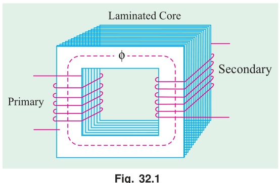

In brief, a transformer is a device that:
1. transfers electric power from one circuit to another
2. it does so without a change of frequency
3. it accomplishes this by electromagnetic induction and
4. where the two electric circuits are in mutual inductive influence of each other.

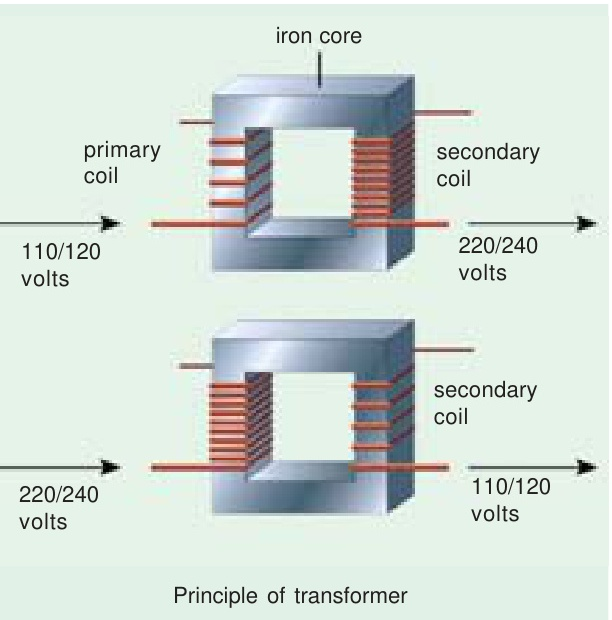

## 32.2. Transformer Construction

The simple elements of a transformer consist of two coils having mutual inductance and a laminated steel core. The two coils are insulated from each other and the steel core. Other necessary parts are: some suitable container for assembled core and windings; a suitable medium for insulating the core and its windings from its container; suitable bushings (either of porcelain, oil-filled or capacitor-type) for insulating and bringing out the terminals of windings from the tank.

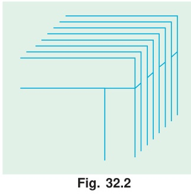

In all types of transformers, the core is constructed of transformer sheet steel laminations assembled to provide a continuous magnetic path with a minimum of air-gap included. The steel used is of high silicon content, sometimes heat treated to produce a high permeability and a low hysteresis loss at the

---

<!-- Page 3 (p. 1117) -->

usual operating flux densities. The eddy current loss is minimised by laminating the core, the laminations being insulated from each other by a light coat of core-plate varnish or by an oxide layer on the surface. The thickness of laminations varies from $0.35\text{ mm}$ for a frequency of $50\text{ Hz}$ to $0.5\text{ mm}$ for a frequency of $25\text{ Hz}$. The core laminations (in the form of strips) are joined as shown in Fig. 32.2. It is seen that the joints in the alternate layers are staggered in order to avoid the presence of narrow gaps right through the cross-section of the core. Such staggered joints are said to be 'imbricated'.

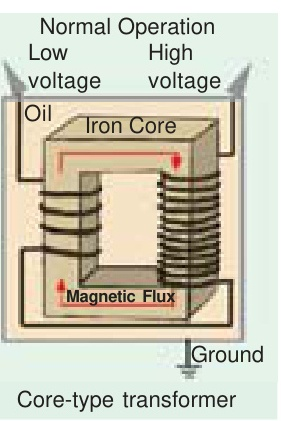

Constructionally, the transformers are of two general types, distinguished from each other merely by the manner in which the primary and secondary coils are placed around the laminated core. The two types are known as **(i) core-type** and **(ii) shell-type**. Another recent development is **spiral-core** or **wound-core type**, the trade name being *spirakore* transformer.

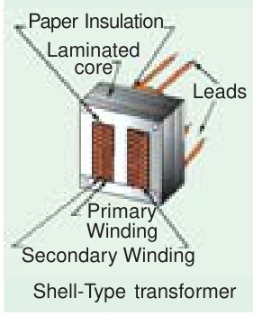

In the so-called core type transformers, the **windings surround a considerable part of the core** whereas in shell-type transformers, the **core surrounds a considerable portion of the windings** as shown schematically in Fig. 32.3 $(a)$ and $(b)$ respectively.

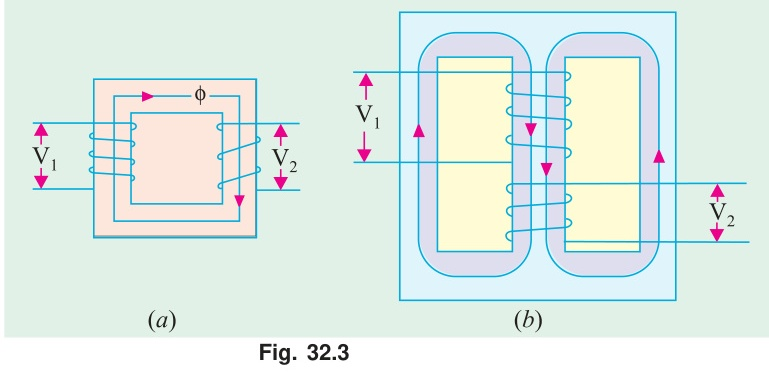

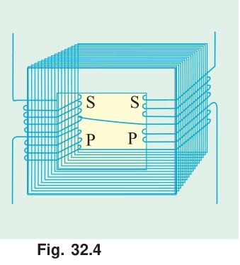

In the simplified diagram for the core type transformers [Fig. 32.3 $(a)$], the primary and secondary winding are shown located on the opposite legs (or limbs) of the core, but in actual construction, these are always interleaved to reduce leakage flux. As shown in Fig. 32.4, half the primary and half the secondary winding have been placed side by side or concentrically on each limb, not primary on one limb (or leg) and the secondary on the other.

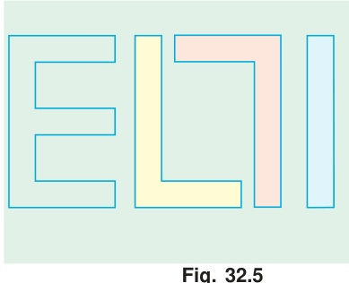

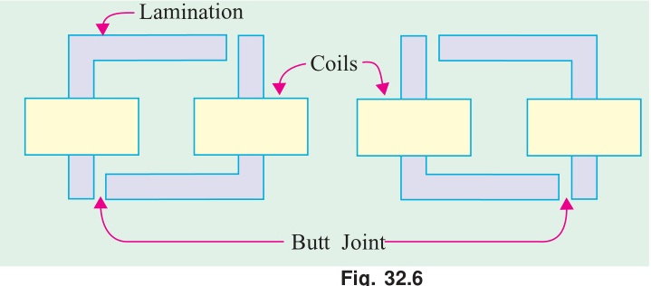

In both core and shell-type transformers, the individual laminations are cut in the form of long strips of $L$'s, $E$'s and $I$'s as shown in Fig. 32.5. The assembly of the complete core for the two types of transformers is shown in Fig. 32.6 and Fig. 32.7.

---

<!-- Page 4 (p. 1118) -->

As said above, in order to avoid high reluctance at the joints where the laminations are butted against each other, the alternate layers are stacked differently to eliminate these joints as shown in Fig. 32.6 and Fig. 32.7.

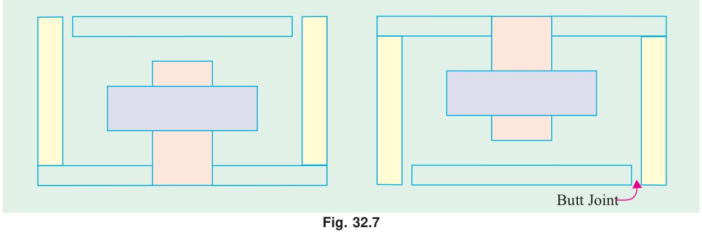

## 32.3. Core-type Transformers

The coils used are form-wound and are of the cylindrical type. The general form of these coils may be circular or oval or rectangular. In small size core-type transformers, a simple rectangular core is used with cylindrical coils which are either circular or rectangular in form. But for large-size core-type transformers, round or circular cylindrical coils are used which are so wound as to fit over a cruciform core section as shown in Fig. 32.8 $(a)$. The circular cylindrical coils are used in most of the core-type transformers because of their mechanical strength. Such cylindrical coils are wound in helical layers with the different layers insulated from each other by paper, cloth, micarta board or cooling ducts. Fig. 32.8 $(c)$ shows the general arrangement of these coils with respect to the core. Insulating cylinders of fuller board are used to separate the cylindrical windings from the core and from each other. Since the low-voltage (LV) winding is easiest to insulate, it is placed nearest to the core (Fig. 32.8).

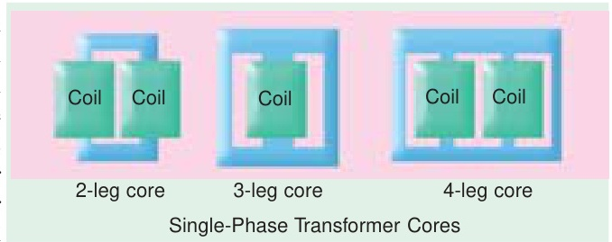

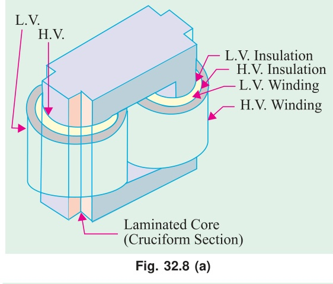

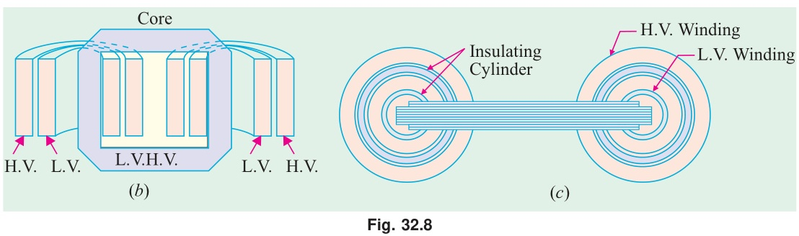

---

<!-- Page 5 (p. 1119) -->

Because of laminations and insulation, the net or effective core area is reduced, due allowance for which has to be made (Ex. 32.6). It is found that, in general, the reduction in core sectional area due to the presence of paper, surface oxide etc. is of the order of $10\%$ approximately.

As pointed out above, rectangular cores with rectangular cylindrical coils can be used for small-size core-type transformers as shown in Fig. 32.9 $(a)$ but for large-sized transformers, it becomes wasteful to use rectangular cylindrical coils and so circular cylindrical coils are preferred. For such purposes, square cores may be used as shown in Fig. 32.9 $(b)$ where circles represent the tubular former carrying the coils. Obviously, a considerable amount of useful space is still wasted. A common improvement on square core is to employ cruciform core as in Fig. 32.9 $(c)$ which demands, at least, two sizes of core strips. For very large transformers, further core-stepping is done as in Fig. 32.9 $(d)$ where at least three sizes of core plates are necessary. Core-stepping not only gives high space factor but also results in reduced length of the mean turn and the consequent $I^2 R$ loss. Three stepped core is the one most commonly used although more steps may be used for very large transformers as in Fig. 32.9 $(e)$. From the geometry of Fig. 32.9, it can be shown that maximum gross core section for Fig. 32.9 $(b)$ is $0.5\,d^2$ and for Fig. 32.9 $(c)$ it is $0.616\,d^2$ where $d$ is the diameter of the cylindrical coil.

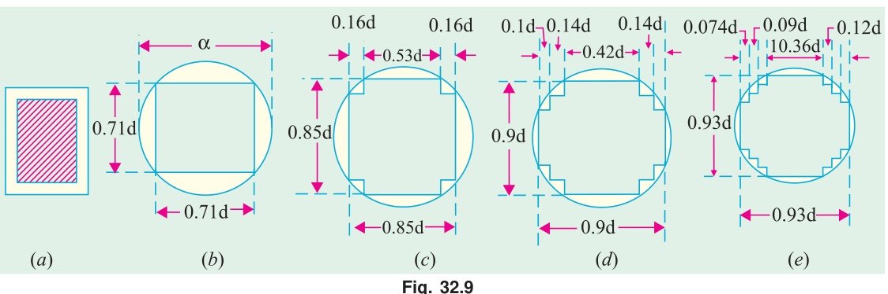

## 32.4. Shell-type Transformers

In these case also, the coils are form-wound but are multi-layer disc type usually wound in the form of pancakes. The different layers of such multi-layer discs are insulated from each other by paper. The complete winding consists of stacked discs with insulation space between the coils—the spaces forming horizontal cooling and insulating ducts. A shell-type transformer may have a simple rectangular form as shown in Fig. 32.10 or it may have distributed form as shown in Fig. 32.11.

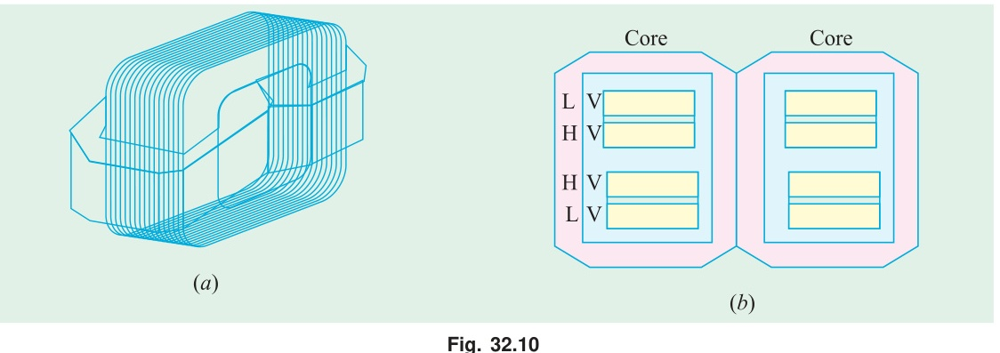

A very commonly-used shell-type transformer is the one known as **Berry Transformer**—so called after the name of its designer and is cylindrical in form. The transformer core consists of laminations arranged in groups which radiate out from the centre as shown in section in Fig. 32.12.

---

<!-- Page 6 (p. 1120) -->

It may be pointed out that cores and coils of transformers must be provided with rigid mechanical bracing in order to prevent movement and possible insulation damage. Good bracing reduces vibration and the objectionable noise—a humming sound—during operation.

The **spiral-core transformer** employs the newest development in core construction. The core is assembled of a continuous strip or ribbon of transformer steel wound in the form of a circular or elliptical cylinder. Such construction allows the core flux to follow the grain of the iron. Cold-rolled steel of high silicon content enables the designer to use considerably higher operating flux densities with lower loss per kg. The use of higher flux density reduces the weight per kVA. Hence, the advantages of such construction are:
- *(i)* a relatively more rigid core
- *(ii)* lesser weight and size per kVA rating
- *(iii)* lower iron losses at higher operating flux densities and
- *(iv)* lower cost of manufacture.

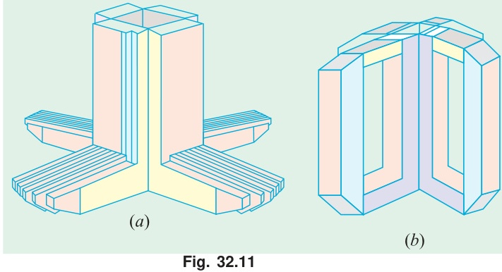

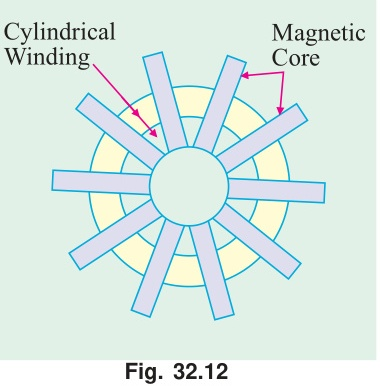

Transformers are generally housed in tightly-fitted sheet-metal tanks filled with special insulating oil\*. This oil has been highly developed and its function is two-fold. By circulation, it not only keeps the coils reasonably cool, but also provides the transformer with additional insulation not obtainable when the transformer is left in the air.

In cases where a smooth tank surface does not provide sufficient cooling area, the sides of the tank are corrugated or provided with radiators mounted on the sides. Good transformer oil should be absolutely free from alkalies, sulphur and particularly from moisture. The presence of even an extremely small percentage of moisture in the oil is highly detrimental from the insulation viewpoint because it lowers the dielectric strength of the oil considerably. The importance of avoiding moisture in the transformer oil is clear from the fact that even an addition of 8 parts of water in 1,000,000 reduces the insulating quality of the oil to a value generally recognized as below standard. Hence, the tanks are sealed air-tight in smaller units. In the case of large-sized transformers where complete air-tight construction is impossible, chambers known as **breathers** are provided to permit the oil inside the tank to expand and contract as its temperature increases or decreases. The atmospheric moisture is entrapped in these breathers and is not allowed to pass on to the oil. Another thing to avoid in the oil is **sledging** which is simply the decomposition of oil with long and continued use. Sledging is caused principally by exposure to oxygen during heating and results in the formation of large deposits of dark and heavy matter that eventually clogs the cooling ducts in the transformer.

No other feature in the construction of a transformer is given more attention and care than the insulating materials, because the life on the unit almost solely depends on the quality, durability and handling of these materials. All the insulating materials are selected on the basis of their high quality and ability to preserve high quality even after many years of normal use.

---
\* *Instead of natural mineral oil, now-a-days synthetic insulating fluids known as ASKARELS (trade name) are used. They are non-inflammable and, under the influence of an electric arc, do not decompose to produce inflammable gases. One such fluid commercially known as PYROCLOR is being extensively used because it possesses remarkable stability as a dielectric and even after long service shows no deterioration through sledging, oxidation, acid or moisture formation. Unlike mineral oil, it shows no rapid burning.*

---

<!-- Page 7 (p. 1121) -->

All the transformer leads are brought out of their cases through suitable bushings. There are many designs of these, their size and construction depending on the voltage of the leads. For moderate voltages, porcelain bushings are used to insulate the leads as they come out through the tank. In general, they look almost like the insulators used on the transmission lines. In high voltage installations, oil-filled or capacitor-type bushings are employed.

The choice of core or shell-type construction is usually determined by cost, because similar characteristics can be obtained with both types. For very high-voltage transformers or for multiwinding design, shell-type construction is preferred by many manufacturers. In this type, usually the mean length of coil turn is longer than in a comparable core-type design. Both core and shell forms are used and the selection is decided by many factors such as voltage rating, kVA rating, weight, insulation stress, heat distribution etc.

Another means of classifying the transformers is according to the type of cooling employed. The following types are in common use:
- **(a) oil-filled self-cooled**
- **(b) oil-filled water-cooled**
- **(c) air-blast type**

Small and medium size distribution transformers—so called because of their use on distribution systems as distinguished from line transmission—are of type $(a)$. The assembled windings and cores of such transformers are mounted in a welded, oil-tight steel tank provided with steel cover. After putting the core at its proper place, the tank is filled with purified, high quality insulating oil. The oil serves to convey the heat from the core and the windings to the case from where it is radiated out to the surroundings. For small size, the tanks are usually smooth-surfaced, but for larger sizes, the cases are frequently corrugated or fluted to get greater heat radiation area without increasing the cubical capacity of the tank. Still larger sizes are provided with radiators or pipes.

Construction of very large self-cooled transformers is expensive, a more economical form of construction for such large transformers is provided in the oil-immersed, water-cooled type. As before, the windings and the core are immersed in the oil, but there is mounted near the surface of oil, a cooling coil through which cold water is kept circulating. The heat is carried away by this water. The largest transformers such as those used with high-voltage transmission lines, are constructed in this manner.

Oil-filled transformers are built for outdoor duty and as these require no housing other than their own, a great saving is thereby effected. These transformers require only periodic inspection.

For voltages below $25,000\text{ V}$, transformers can be built for cooling by means of an air-blast. The transformer is not immersed in oil, but is housed in a thin sheet-metal box open at both ends through which air is blown from the bottom to the top by means of a fan or blower.

## 32.5. Elementary Theory of an Ideal Transformer

An ideal transformer is one which has no losses *i.e.* its windings have no ohmic resistance, there is no magnetic leakage and hence which has no $I^2 R$ and core losses. In other words, an ideal transformer consists of two purely inductive coils wound on a loss-free core. It may, however, be noted **that it is impossible to realize such a transformer in practice, yet for convenience, we will start with such a transformer and step by step approach an actual transformer.**

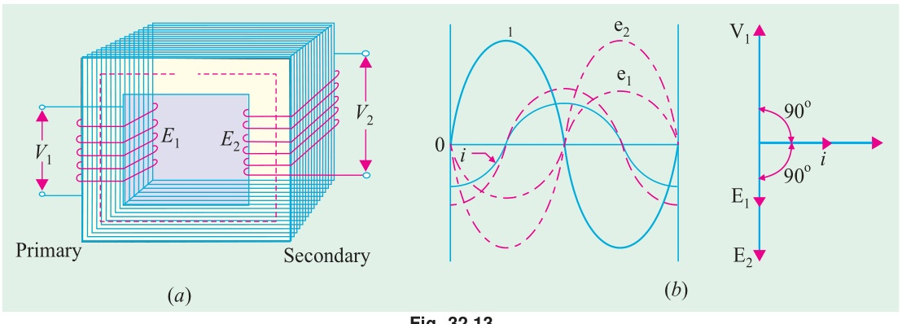

---

<!-- Page 8 (p. 1122) -->

Consider an ideal transformer [Fig. 32.13 $(a)$] whose secondary is open and whose primary is connected to sinusoidal alternating voltage $V_1$. This potential difference causes an alternating current to flow in the primary. Since the primary coil is purely inductive and there is no output (secondary being open) the primary draws the magnetising current $I_\mu$ only. The function of this current is merely to magnetise the core, it is small in magnitude and lags $V_1$ by $90^\circ$. This alternating current $I_\mu$ produces an alternating flux $\phi$ which is, at all times, proportional to the current (assuming permeability of the magnetic circuit to be constant) and, hence, is in phase with it. This changing flux is linked both with the primary and the secondary windings. Therefore, it produces self-induced e.m.f. $E_1$ in the primary. This *self-induced* e.m.f. $E_1$ is, at every instant, equal to and in opposition to $V_1$. It is also known as counter e.m.f. or back e.m.f. of the primary.

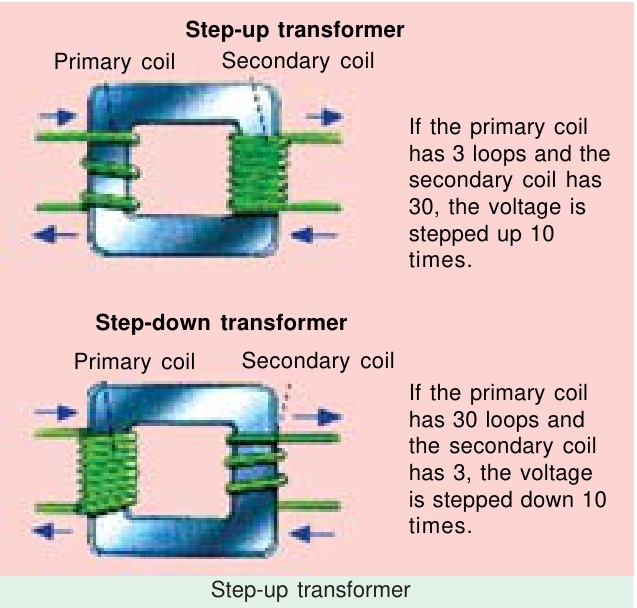

Similarly, there is produced in the secondary an induced e.m.f. $E_2$ which is known as *mutually* induced e.m.f. This e.m.f. is antiphase with $V_1$ and its magnitude is proportional to the rate of change of flux and the number of secondary turns.

The instantaneous values of applied voltage, induced e.m.fs, flux and magnetising current are shown by sinusoidal waves in Fig. 32.13 $(b)$. Fig. 32.13 $(c)$ shows the vectorial representation of the effective values of the above quantities.

## 32.6. E.M.F. Equation of a Transformer

Let
- $N_1$ = No. of turns in primary
- $N_2$ = No. of turns in secondary
- $\Phi_m$ = Maximum flux in core in webers $= B_m \times A$
- $f$ = Frequency of a.c. input in Hz

As shown in Fig. 32.14, flux increases from its zero value to maximum value $\Phi_m$ in one quarter of the cycle *i.e.* in $1/4f$ second.

$$\therefore \quad \text{Average rate of change of flux} = \frac{\Phi_m}{1/4f} = 4f\Phi_m\text{ Wb/s or volt}$$

Now, rate of change of flux per turn means induced e.m.f. in volts.

$$\therefore \quad \text{Average e.m.f./turn} = 4f\Phi_m\text{ volt}$$

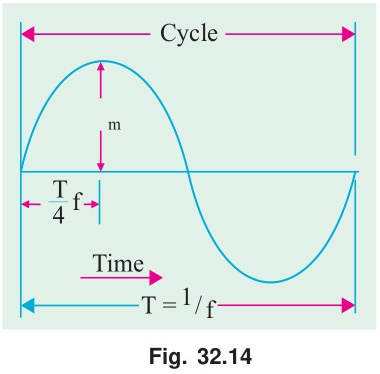

If flux $\Phi$ varies sinusoidally, then r.m.s. value of induced e.m.f. is obtained by multiplying the average value with form factor.

$$\text{Form factor} = \frac{\text{r.m.s. value}}{\text{average value}} = 1.11$$

$$\therefore \quad \text{r.m.s. value of e.m.f./turn} = 1.11 \times 4f\Phi_m = 4.44 f \Phi_m\text{ volt}$$

Now, r.m.s. value of the induced e.m.f. in the whole of primary winding:
$$= (\text{induced e.m.f./turn}) \times \text{No. of primary turns}$$

$$E_1 = 4.44 f N_1 \Phi_m = 4.44 f N_1 B_m A \tag{i}$$

---

<!-- Page 9 (p. 1123) -->

Similarly, r.m.s. value of the e.m.f. induced in secondary is,

$$E_2 = 4.44 f N_2 \Phi_m = 4.44 f N_2 B_m A \tag{ii}$$

It is seen from $(i)$ and $(ii)$ that $E_1 / N_1 = E_2 / N_2 = 4.44 f \Phi_m$. It means that e.m.f./turn is the *same* in both the primary and secondary windings.

In an ideal transformer on no-load, $V_1 = E_1$ and $E_2 = V_2$ where $V_2$ is the terminal voltage (Fig. 32.15).

## 32.7. Voltage Transformation Ratio (K)

From equations $(i)$ and $(ii)$, we get

$$\frac{E_2}{E_1} = \frac{N_2}{N_1} = K$$

This constant $K$ is known as **voltage transformation ratio**.

- *(i)* If $N_2 > N_1$ *i.e.* $K > 1$, then transformer is called **step-up transformer**.
- *(ii)* If $N_2 < N_1$ *i.e.* $K < 1$, then transformer is known as **step-down transformer**.

Again, for an *ideal* transformer, $\text{input VA} = \text{output VA}$.

$$V_1 I_1 = V_2 I_2 \quad \text{or} \quad \frac{I_2}{I_1} = \frac{V_1}{V_2} = \frac{1}{K}$$

Hence, currents are in the inverse ratio of the (voltage) transformation ratio.

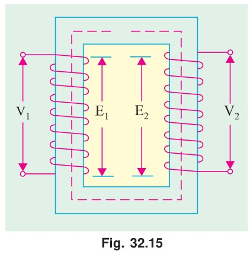

---

### Example 32.1
*The maximum flux density in the core of a $250/3000\text{-volts}$, $50\text{-Hz}$ single-phase transformer is $1.2\text{ Wb/m}^2$. If the e.m.f. per turn is $8\text{ volt}$, determine (i) primary and secondary turns (ii) area of the core.*  
**(Electrical Engg.-I, Nagpur Univ. 1991)**

#### Solution
**(i)**
$$E_1 = N_1 \times \text{e.m.f. induced/turn}$$
$$N_1 = 250 / 8 = \mathbf{32}; \quad N_2 = 3000 / 8 = \mathbf{375}$$

**(ii)** We may use
$$E_2 = 4.44 f N_2 B_m A$$
$$\therefore \quad 3000 = 4.44 \times 50 \times 375 \times 1.2 \times A; \quad \mathbf{A = 0.03\text{ m}^2}$$

---

### Example 32.2
*The core of a $100\text{-kVA}$, $11000/550\text{ V}$, $50\text{-Hz}$, $1\text{-ph}$, core type transformer has a cross-section of $20\text{ cm} \times 20\text{ cm}$. Find (i) the number of H.V. and L.V. turns per phase and (ii) the e.m.f. per turn if the maximum core density is not to exceed $1.3\text{ Tesla}$. Assume a stacking factor of $0.9$. What will happen if its primary voltage is increased by $10\%$ on no-load?*  
**(Elect. Machines, A.M.I.E. Sec. B, 1991)**

#### Solution
**(i)**
$$B_m = 1.3\text{ T}, \quad A = (0.2 \times 0.2) \times 0.9 = 0.036\text{ m}^2$$
$$\therefore \quad 11,000 = 4.44 \times 50 \times N_1 \times 1.3 \times 0.036, \quad N_1 = 1060$$
$$550 = 4.44 \times 50 \times N_2 \times 1.3 \times 0.036; \quad N_2 = 53$$
$$\text{or}, \quad N_2 = K N_1 = (550/11,000) \times 1060 = 53$$

**(ii)**
$$\text{e.m.f./turn} = 11,000/1060 = 10.4\text{ V} \quad \text{or} \quad 550/53 = 10.4\text{ V}$$

Keeping supply frequency constant, if primary voltage is increased by $10\%$, magnetising current will increase by much more than $10\%$. However, due to saturation, flux density will increase only marginally and so will the eddy current and hysteresis losses.

---

### Example 32.3
*A single-phase transformer has $400$ primary and $1000$ secondary turns. The net cross-sectional area of the core is $60\text{ cm}^2$. If the primary winding be connected to a $50\text{-Hz}$ supply at $520\text{ V}$, calculate (i) the peak value of flux density in the core (ii) the voltage induced in the secondary winding.*  
**(Elect. Engg-I, Pune Univ. 1989)**

---

<!-- Page 10 (p. 1124) -->

#### Solution (Example 32.3 Continued)
$$K = N_2/N_1 = 1000/400 = 2.5$$

**(i)**
$$\frac{E_2}{E_1} = K \quad \therefore \quad E_2 = K E_1 = 2.5 \times 520 = \mathbf{1300\text{ V}}$$

**(ii)**
$$E_1 = 4.44 f N_1 B_m A$$
$$\text{or} \quad 520 = 4.44 \times 50 \times 400 \times B_m \times (60 \times 10^{-4}) \quad \therefore \quad \mathbf{B_m = 0.976\text{ Wb/m}^2}$$

---

### Example 32.4
*A $25\text{-kVA}$ transformer has $500$ turns on the primary and $50$ turns on the secondary winding. The primary is connected to $3000\text{-V}$, $50\text{-Hz}$ supply. Find the full-load primary and secondary currents, the secondary e.m.f. and the maximum flux in the core. Neglect leakage drops and no-load primary current.*  
**(Elect. & Electronic Engg., Madras Univ. 1985)**

#### Solution
$$K = N_2/N_1 = 50/500 = 1/10$$

Now, full-load
$$I_1 = 25,000/3000 = \mathbf{8.33\text{ A}}. \quad \text{F.L. } I_2 = I_1/K = 10 \times 8.33 = \mathbf{83.3\text{ A}}$$
$$\text{e.m.f. per turn on primary side} = 3000/500 = 6\text{ V}$$
$$\therefore \quad \text{secondary e.m.f.} = 6 \times 50 = \mathbf{300\text{ V}} \quad (\text{or } E_2 = K E_1 = 3000 \times 1/10 = 300\text{ V})$$

Also,
$$E_1 = 4.44 f N_1 \Phi_m; \quad 3000 = 4.44 \times 50 \times 500 \times \Phi_m \quad \therefore \quad \mathbf{\Phi_m = 27\text{ mWb}}$$

---

### Example 32.5
*The core of a three phase, $50\text{ Hz}$, $11000/550\text{ V}$ delta/star, $300\text{ kVA}$, core-type transformer operates with a flux of $0.05\text{ Wb}$. Find:*  
*(i) number of H.V. and L.V. turns per phase.*  
*(ii) e.m.f. per turn*  
*(iii) full load H.V. and L.V. phase-currents.*  
**(Bharathidasan Univ. April 1997)**

#### Solution
Maximum value of flux has been given as $0.05\text{ Wb}$.

**(ii) e.m.f. per turn:**
$$= 4.44 f \phi_m = 4.44 \times 50 \times 0.05 = \mathbf{11.1\text{ volts}}$$

**(i) Calculations for number of turns on two sides:**
$$\text{Voltage per phase on delta-connected primary winding} = 11000\text{ volts}$$
$$\text{Voltage per phase on star-connected secondary winding} = 550 / \sqrt{3} = 550 / 1.732 = 317.5\text{ volts}$$

$$T_1 = \text{number of turns on primary, per phase} = \frac{\text{voltage per phase}}{\text{e.m.f. per turn}} = \frac{11000}{11.1} = \mathbf{991}$$

$$T_2 = \text{number of turns on secondary, per phase} = \frac{\text{voltage per phase}}{\text{e.m.f. per turn}} = \frac{317.5}{11.1} = \mathbf{28.6}$$

> **Note :** *(i) Generally, Low-voltage-turns are calculated first, the figure is rounded off to next higher even integer. In this case, it will be 30. Then, number of turns on primary side is calculated by turns-ratio.*  
> *In this case,*  
> $$T_1 = T_2 (V_1/V_2) = 30 \times 11000 / 317.5 = 1040$$  
> *This, however, reduces the flux and results into less saturation. This, in fact, is an elementary aspect in Design-calculations for transformers. (Explanation is added here only to overcome a doubt whether a fraction is acceptable as a number of L.V. turns).*

**(iii) Full load H.V. and L.V. phase currents:**
$$\text{Output per phase} = (300/3) = 100\text{ kVA}$$
$$\text{H.V. phase-current} = \frac{100 \times 1000}{11,000} = \mathbf{9.1\text{ Amp}}$$
$$\text{L.V. phase-current} = \frac{100 \times 1000}{317.5} = \mathbf{315\text{ Amp}}$$

---

### Example 32.6
*A single phase transformer has $500$ turns in the primary and $1200$ turns in the secondary. The cross-sectional area of the core is $80\text{ sq. cm}$. If the primary winding is connected to a $50\text{ Hz}$ supply at $500\text{ V}$, calculate (i) Peak flux-density, and (ii) Voltage induced in the secondary.*  
**(Bharathiar University November 1997)**

---

<!-- Page 11 (p. 1125) -->

#### Solution (Example 32.6 Continued)
From the e.m.f. equation for transformer,
$$500 = 4.44 \times 50 \times \phi_m \times 500$$
$$\phi_m = 1/222\text{ Wb}$$

**(i) Peak flux density:**
$$\mathbf{B_m} = \frac{\phi_m}{80 \times 10^{-4}} = \mathbf{0.563\text{ Wb/m}^2}$$

**(ii) Voltage induced in secondary** is obtained from transformation ratio or turns ratio:
$$\frac{V_2}{V_1} = \frac{N_2}{N_1}$$
$$\text{or} \quad \mathbf{V_2} = 500 \times \frac{1200}{500} = \mathbf{1200\text{ volts}}$$

---

### Example 32.7
*A $25\text{ kVA}$, single-phase transformer has $250$ turns on the primary and $40$ turns on the secondary winding. The primary is connected to $1500\text{-volt}$, $50\text{ Hz}$ mains. Calculate:*  
*(i) Primary and Secondary currents on full-load, (ii) Secondary e.m.f., (iii) maximum flux in the core.*  
**(Bharathiar Univ. April 1998)**

#### Solution
**(i) & (ii)** If $V_2$ = Secondary voltage rating = secondary e.m.f.,
$$\frac{V_2}{1500} = \frac{40}{250}, \quad \text{giving } \mathbf{V_2 = 240\text{ volts}}$$

$$\text{Primary current} = \frac{25000}{1500} = \mathbf{16.67\text{ amp}}$$
$$\text{Secondary current} = \frac{25000}{240} = \mathbf{104.2\text{ amp}}$$

**(iii)** If $\phi_m$ is the maximum core-flux in Wb,
$$1500 = 4.44 \times 50 \times \phi_m \times 250, \quad \text{giving } \mathbf{\phi_m = 0.027\text{ Wb or } 27\text{ mWb}}$$

---

### Example 32.8
*A single-phase, $50\text{ Hz}$, core-type transformer has square cores of $20\text{ cm}$ side. Permissible maximum flux-density is $1\text{ Wb/m}^2$. Calculate the number of turns per Limb on the High and Low-voltage sides for a $3000/220\text{ V}$ ratio.*  
**(Manonmaniam Sundaranar Univ. April 1998)**

#### Solution
E.M.F. equation gives the number of turns required on the two sides. We shall first calculate the L.V.-turns, round the figure off to the next higher even number, so that given maximum flux density is not exceeded. With the corrected number of L.V. turns, calculate H.V.-turns by transformation ratio. Further, there are two Limbs. Each Limb accommodates half-L.V. and half H.V. winding from the view-point of reducing leakage reactance.

Starting with calculation for L.V. turns, $T_2$:
$$4.44 \times 50 \times [(20 \times 20 \times 10^{-4}) \times 1] \times T_2 = 220$$
$$T_2 = 220 / 8.88 = 24.77$$
$$\text{Select } T_2 = 26$$
$$\frac{T_1}{T_2} = \frac{V_1}{V_2}$$
$$T_1 = 26 \times \frac{3000}{220} = 354, \quad \text{selecting the nearest even integer.}$$

$$\mathbf{\text{Number of H.V. turns on each Limb}} = 354 / 2 = \mathbf{177}$$
$$\mathbf{\text{Number of L.V. turns on each Limb}} = 26 / 2 = \mathbf{13}$$

---

## 32.8. Transformer with Losses but no Magnetic Leakage

We will consider two cases:
- *(i)* when such a transformer is on no load, and
- *(ii)* when it is loaded.

## 32.9. Transformer on No-load

In the above discussion, we assumed an ideal transformer *i.e.* one in which there were no core losses and copper losses. But practical conditions require that certain modifications be made in the foregoing

---

<!-- Page 12 (p. 1126) -->

theory. When an actual transformer is put on load, there is iron loss in the core and copper loss in the windings (both primary and secondary) and these losses are not entirely negligible.

Even when the transformer is on no-load, the primary input current is not wholly reactive. The primary input current under no-load conditions has to supply:
- *(i)* **iron losses in the core** *i.e.* hysteresis loss and eddy current loss, and
- *(ii)* a very small amount of **copper loss in primary** (there being no Cu loss in secondary as it is open).

Hence, the no-load primary input current $I_0$ is not at $90^\circ$ behind $V_1$ but lags it by an angle $\phi_0 < 90^\circ$. No-load input power:

$$W_0 = V_1 I_0 \cos \phi_0$$

where $\cos \phi_0$ is primary power factor under no-load conditions. No-load condition of an actual transformer is shown vectorially in Fig. 32.16.

As seen from Fig. 32.16, primary current $I_0$ has two components:
1. One in phase with $V_1$. This is known as **active** or **working** or **iron loss component** $I_w$ because it mainly supplies the iron loss plus small quantity of primary Cu loss:
   $$I_w = I_0 \cos \phi_0$$
2. The other component is in quadrature with $V_1$ and is known as **magnetising component** $I_\mu$ because its function is to sustain the alternating flux in the core. It is wattless:
   $$I_\mu = I_0 \sin \phi_0$$

Obviously, $I_0$ is the vector sum of $I_w$ and $I_\mu$, hence:

$$I_0 = \sqrt{I_\mu^2 + I_w^2}$$

The following points should be noted carefully:
1. The no-load primary current $I_0$ is very small as compared to the full-load primary current. It is about $1\text{ per cent}$ of the full-load current.
2. Owing to the fact that the permeability of the core varies with the instantaneous value of the exciting current, the wave of the exciting or magnetising current is not truly sinusoidal. As such it should not be represented by a vector because only sinusoidally varying quantities are represented by rotating vectors. But, in practice, it makes no appreciable difference.
3. As $I_0$ is very small, the no-load primary Cu loss is negligibly small which means that **no-load primary input is practically equal to the iron loss in the transformer.**
4. As it is principally the core-loss which is responsible for shift in the current vector, angle $\phi_0$ is known as **hysteresis angle of advance**.

---

### Example 32.9
*(a) A $2,200/200\text{-V}$ transformer draws a no-load primary current of $0.6\text{ A}$ and absorbs $400\text{ watts}$. Find the magnetising and iron loss currents.*  
*(b) A $2,200/250\text{-V}$ transformer takes $0.5\text{ A}$ at a p.f. of $0.3$ on open circuit. Find magnetising and working components of no-load primary current.*

#### Solution
**(a)**
$$\text{Iron-loss current} = \frac{\text{no-load input in watts}}{\text{primary voltage}} = \frac{400}{2,200} = \mathbf{0.182\text{ A}}$$
$$\text{Now } I_0^2 = I_w^2 + I_\mu^2$$
$$\text{Magnetising component } \mathbf{I_\mu} = \sqrt{0.6^2 - 0.182^2} = \mathbf{0.572\text{ A}}$$

---

<!-- Page 13 (p. 1127) -->

#### Solution (Example 32.9 Continued)
**(b)**
$$I_0 = 0.5\text{ A}, \quad \cos \phi_0 = 0.3$$
$$\therefore \quad \mathbf{I_w} = I_0 \cos \phi_0 = 0.5 \times 0.3 = \mathbf{0.15\text{ A}}$$
$$\mathbf{I_\mu} = \sqrt{0.5^2 - 0.15^2} = \mathbf{0.476\text{ A}}$$

---

### Example 32.10
*A single-phase transformer has $500$ turns on the primary and $40$ turns on the secondary winding. The mean length of the magnetic path in the iron core is $150\text{ cm}$ and the joints are equivalent to an air-gap of $0.1\text{ mm}$. When a p.d. of $3,000\text{ V}$ is applied to the primary, maximum flux density is $1.2\text{ Wb/m}^2$. Calculate (a) the cross-sectional area of the core (b) no-load secondary voltage (c) the no-load current drawn by the primary (d) power factor on no-load. Given that AT/cm for a flux density of $1.2\text{ Wb/m}^2$ in iron to be $5$, the corresponding iron loss to be $2\text{ watt/kg}$ at $50\text{ Hz}$ and the density of iron as $7.8\text{ gram/cm}^3$.*

#### Solution
**(a)**
$$3,000 = 4.44 \times 50 \times 500 \times 1.2 \times A \quad \therefore \quad A = 0.0225\text{ m}^2 = \mathbf{225\text{ cm}^2}$$
*This is the net cross-sectional area. However, the gross area would be about $10\%$ more to allow for the insulation between laminations.*

**(b)**
$$K = N_2/N_1 = 40/500 = 4/50$$
$$\therefore \quad \text{N.L. secondary voltage} = K E_1 = (4/50) \times 3000 = \mathbf{240\text{ V}}$$

**(c)**
$$AT\text{ per cm} = 5 \quad \therefore \quad AT\text{ for iron core} = 150 \times 5 = 750$$
$$AT\text{ for air-gap} = H l = \frac{B}{\mu_0} \times l = \frac{1.2}{4\pi \times 10^{-7}} \times 0.0001 = 95.5$$
$$\text{Total } AT\text{ for given } B_{max} = 750 + 95.5 = 845.5$$
$$\text{Max. value of magnetising current drawn by primary} = 845.5 / 500 = 1.691\text{ A}$$
$$\text{Assuming this current to be sinusoidal, its r.m.s. value is } I_\mu = 1.691 / \sqrt{2} = 1.196\text{ A}$$

$$\text{Volume of iron} = \text{length} \times \text{area} = 150 \times 225 = 33,750\text{ cm}^3$$
$$\text{Density} = 7.8\text{ gram/cm}^3 \quad \therefore \quad \text{Mass of iron} = 33,750 \times 7.8 / 1000 = 263.25\text{ kg}$$
$$\text{Total iron loss} = 263.25 \times 2 = 526.5\text{ W}$$
$$\text{Iron loss component of no-load primary current } I_0 \text{ is } I_w = 526.5 / 3000 = 0.176\text{ A}$$

$$\mathbf{I_0} = \sqrt{I_\mu^2 + I_w^2} = \sqrt{1.196^2 + 0.176^2} = \mathbf{0.208\text{ A}}$$

**(d)**
$$\text{Power factor, } \mathbf{\cos \phi_0} = I_w / I_0 = 0.176 / 1.208 = \mathbf{0.1457}$$

---

### Example 32.11
*A single-phase transformer has $1000$ turns on the primary and $200$ turns on the secondary. The no load current is $3\text{ amp}$ at a p.f. of $0.2$ lagging. Calculate the primary current and power-factor when the secondary current is $280\text{ Amp}$ at a p.f. of $0.80$ lagging.*  
**(Nagpur University, November 1997)**

#### Solution
$V_2$ is taken as reference. $\cos^{-1} 0.80 = 36.87^\circ$
$$I_2 = 280\angle -36.87^\circ\text{ amp}$$
$$I'_2 = (280/5)\angle -36.87^\circ\text{ amp}$$
$$\phi = \cos^{-1} 0.20 = 78.5^\circ, \quad \sin \phi = 0.98$$
$$I_1 = I_0 + I'_2 = 3(0.20 - j\,0.98) + 56(0.80 - j\,0.60)$$
$$= 0.6 - j\,2.94 + 44.8 - j\,33.6$$
$$= 45.4 - j\,36.54 = \mathbf{58.3\angle 38.86^\circ}$$

Thus $I$ lags behind the supply voltage by an angle of $38.86^\circ$.

---

<!-- Page 14 (p. 1128) -->

## Tutorial Problems 32.1

1. The number of turns on the primary and secondary windings of a $1\text{-}\phi$ transformer are $350$ and $35$ respectively. If the primary is connected to a $2.2\text{ kV}$, $50\text{-Hz}$ supply, determine the secondary voltage on no-load.  
   **[220 V] (Elect. Engg.-II, Kerala Univ. 1980)**

2. A $3000/200\text{-V}$, $50\text{-Hz}$, $1\text{-phase}$ transformer is built on a core having an effective cross-sectional area of $150\text{ cm}^2$ and has $80$ turns in the low-voltage winding. Calculate:  
   *(a)* the value of the maximum flux density in the core  
   *(b)* the number of turns in the high-voltage winding.  
   **[(a) 0.75 Wb/m$^2$ (b) 1200]**

3. A $3,300/230\text{-V}$, $50\text{-Hz}$, $1\text{-phase}$ transformer is to be worked at a maximum flux density of $1.2\text{ Wb/m}^2$ in the core. The effective cross-sectional area of the transformer core is $150\text{ cm}^2$. Calculate suitable values of primary and secondary turns.  
   **[830; 58]**

4. A $40\text{-kVA}$, $3,300/240\text{-V}$, $50\text{ Hz}$, $1\text{-phase}$ transformer has $660$ turns on the primary. Determine:  
   *(a)* the number of turns on the secondary  
   *(b)* the maximum value of flux in the core  
   *(c)* the approximate value of primary and secondary full-load currents.  
   Internal drops in the windings are to be ignored.  
   **[(a) 48 (b) 22.5 mWb (c) 12.1 A; 166.7 A]**

5. A double-wound, $1\text{-phase}$ transformer is required to step down from $1900\text{ V}$ to $240\text{ V}$, $50\text{-Hz}$. It is to have $1.5\text{ V}$ per turn. Calculate the required number of turns on the primary and secondary windings respectively. The peak value of flux density is required to be not more than $1.2\text{ Wb/m}^2$. Calculate the required cross-sectional area of the steel core. If the output is $10\text{ kVA}$, calculate the secondary current.  
   **[1,267; 160; 56.4 cm$^2$; 41.75 A]**

6. The no-load voltage ratio in a $1\text{-phase}$, $50\text{-Hz}$, core-type transformer is $1,200/440$. Find the number of turns in each winding if the maximum flux is to be $0.075\text{ Wb}$.  
   **[24 and 74 turns]**

7. A $1\text{-phase}$ transformer has $500$ primary and $1200$ secondary turns. The net cross-sectional area of the core is $75\text{ cm}^2$. If the primary winding be connected to a $400\text{-V}$, $50\text{ Hz}$ supply, calculate:  
   *(i)* the peak value of flux density in the core and  
   *(ii)* voltage induced in the secondary winding.  
   **[0.48 Wb/m$^2$; 60 V]**

8. A $10\text{-kVA}$, $1\text{-phase}$ transformer has a turn ratio of $300/23$. The primary is connected to a $1500\text{-V}$, $60\text{ Hz}$ supply. Find the secondary volts on open-circuit and the approximate values of the currents in the two windings on full-load. Find also the maximum value of the flux.  
   **[115 V; 6.67 A; 87 A; 11.75 mWb]**

9. A $100\text{-kVA}$, $3300/400\text{-V}$, $50\text{ Hz}$, $1\text{ phase}$ transformer has $110$ turns on the secondary. Calculate the approximate values of the primary and secondary full-load currents, the maximum value of flux in the core and the number of primary turns. How does the core flux vary with load?  
   **[30.3 A; 250 A; 16.4 mWb; 907]**

10. The no-load current of a transformer is $5.0\text{ A}$ at $0.3\text{ power factor}$ when supplied at $230\text{-V}$, $50\text{-Hz}$. The number of turns on the primary winding is $200$. Calculate *(i)* the maximum value of flux in the core *(ii)* the core loss *(iii)* the magnetising current.  
    **[5.18 mWb; 345 W; 4.77 A]**

11. The no-load current of a transformer is $15\text{ A}$ at a power factor of $0.2$ when connected to a $460\text{-V}$, $50\text{-Hz}$ supply. If the primary winding has $550$ turns, calculate:  
    *(a)* the magnetising component of no-load current  
    *(b)* the iron loss  
    *(c)* the maximum value of the flux in the core.  
    **[(a) 14.7 A (b) 1,380 W (c) 3.77 mWb]**

12. The no-load current of a transformer is $4.0\text{ A}$ at $0.25\text{ p.f.}$ when supplied at $250\text{-V}$, $50\text{ Hz}$. The number of turns on the primary winding is $200$. Calculate:  
    *(i)* the r.m.s. value of the flux in the core (assume sinusoidal flux)  
    *(ii)* the core loss  
    *(iii)* the magnetising current.  
    **[(i) 3.96 mWb (ii) 250 W (iii) 3.87 A]**

---

<!-- Page 15 (p. 1129) -->

13. The following data apply to a single-phase transformer:  
    output: $100\text{ kVA}$, secondary voltage: $400\text{ V}$; Primary turns: $200$; secondary turns: $40$; Neglecting the losses, calculate: *(i)* the primary applied voltage *(ii)* the normal primary and secondary currents *(iii)* the secondary current, when the load is $25\text{ kW}$ at $0.8\text{ power factor}$.  
    **[Rajiv Gandhi Technical University, Bhopal 2000] [(i) 2000 V, (ii) 50 amp, (iii) 78.125 amp]**

---

## 32.10. Transformer on Load

When the secondary is loaded, the secondary current $I_2$ is set up. The magnitude and phase of $I_2$ with respect to $V_2$ is determined by the characteristics of the load. Current $I_2$ is in phase with $V_2$ if load is non-inductive, it lags if load is inductive and it leads if load is capacitive.

The secondary current sets up its own m.m.f. ($= N_2 I_2$) and hence its own flux $\Phi_2$ which is in opposition to the main primary flux $\Phi$ which is due to $I_0$. The secondary ampere-turns $N_2 I_2$ are known as **demagnetising amp-turns**. The opposing secondary flux $\Phi_2$ weakens the primary flux $\Phi$ momentarily, hence primary back e.m.f. $E_1$ tends to be reduced. For a moment $V_1$ gains the upper hand over $E_1$ and hence causes more current to flow in primary.

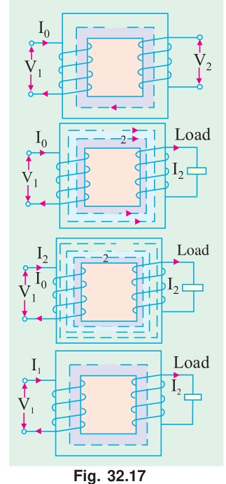

Let the additional primary current be $I'_2$. It is known as **load component of primary current**. This current is antiphase with $I'_2$. The additional primary m.m.f. $N_1 I'_2$ sets up its own flux $\Phi'_2$ which is in opposition to $\Phi_2$ (but is in the same direction as $\Phi$) and is equal to it in magnitude. Hence, the two cancel each other out. So, we find that the magnetic effects of secondary current $I_2$ are immediately neutralized by the additional primary current $I'_2$ which is brought into existence exactly at the same instant as $I_2$. The whole process is illustrated in Fig. 32.17.

Hence, whatever the load conditions, **the net flux passing through the core is approximately the same as at no-load.** An important deduction is that due to the constancy of core flux at all loads, **the core loss is also practically the same under all load conditions.**

$$\text{As} \quad \Phi_2 = \Phi'_2 \quad \therefore \quad N_2 I_2 = N_1 I'_2 \quad \therefore \quad I'_2 = \frac{N_2}{N_1} \times I_2 = K I_2$$

Hence, when transformer is on load, the primary winding has two currents in it; one is $I_0$ and the other is $I'_2$ which is anti-phase with $I_2$ and $K$ times in magnitude. **The total primary current is the vector sum of $I_0$ and $I'_2$.**

---

<!-- Page 16 (p. 1130) -->

In Fig. 32.18 are shown the vector diagrams for a load transformer when load is non-inductive and when it is inductive (a similar diagram could be drawn for capacitive load). Voltage transformation ratio of unity is assumed so that primary vectors are equal to the secondary vectors. With reference to Fig. 32.18 $(a)$, $I_2$ is secondary current in phase with $E_2$ (strictly speaking it should be $V_2$). It causes primary current $I'_2$ which is anti-phase with it and equal to it in magnitude ($\because K = 1$). Total primary current $I_1$ is the vector sum of $I_0$ and $I'_2$ and lags behind $V_1$ by an angle $\phi_1$.

In Fig. 32.18 $(b)$ vectors are drawn for an inductive load. Here $I_2$ lags $E_2$ (actually $V_2$) by $\phi_2$. Current $I'_2$ is again antiphase with $I_2$ and equal to it in magnitude. As before, $I_1$ is the vector sum of $I'_2$ and $I_0$ and lags behind $V_1$ by $\phi_1$.

It will be observed that $\phi_1$ is slightly greater than $\phi_2$. But if we neglect $I_0$ as compared to $I'_2$ as in Fig. 32.18 $(c)$, then $\phi_1 = \phi_2$. Moreover, under this assumption:

$$N_1 I'_2 = N_2 I_1 = N_1 I_2 \quad \therefore \quad \frac{I'_2}{I_2} = \frac{I_1}{I_2} = \frac{N_2}{N_1} = K$$

It shows that under full-load conditions, the ratio of primary and secondary currents is constant. This important relationship is made the basis of current transformer—a transformer which is used with a low-range ammeter for measuring currents in circuits where the direct connection of the ammeter is impracticable.

---

### Example 32.12
*A single-phase transformer with a ratio of $440/110\text{-V}$ takes a no-load current of $5\text{ A}$ at $0.2$ power factor lagging. If the secondary supplies a current of $120\text{ A}$ at a p.f. of $0.8$ lagging, estimate the current taken by the primary.*  
**(Elect. Engg. Punjab Univ. 1991)**

#### Solution
$$\cos \phi_2 = 0.8, \quad \phi_2 = \cos^{-1}(0.8) = 36^\circ 54'$$
$$\cos \phi_0 = 0.2 \quad \therefore \quad \phi_0 = \cos^{-1}(0.2) = 78^\circ 30'$$

Now
$$K = V_2/V_1 = 110/440 = 1/4$$
$$\therefore \quad I'_2 = K I_2 = 120 \times 1/4 = 30\text{ A}$$
$$I_0 = 5\text{ A}.$$

$$\text{Angle between } I_0 \text{ and } I'_2 = 78^\circ 30' - 36^\circ 54' = 41^\circ 36'$$

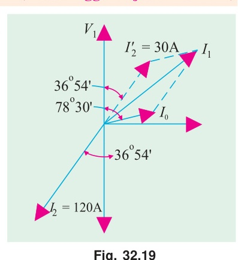

Using parallelogram law of vectors (Fig. 32.19) we get:
$$I_1 = \sqrt{5^2 + 30^2 + 2 \times 5 \times 30 \times \cos 41^\circ 36'} = \mathbf{34.45\text{ A}}$$

*The resultant current could also have been found by resolving $I'_2$ and $I_0$ into their $X$ and $Y$-components.*

---

### Example 32.13
*A transformer has a primary winding of $800$ turns and a secondary winding of $200$ turns. When the load current on the secondary is $80\text{ A}$ at $0.8$ power factor lagging, the primary current is $25\text{ A}$ at $0.707$ power factor lagging. Determine graphically or otherwise the no-load current of the transformer and its phase with respect to the voltage.*

#### Solution
Here $K = 200/800 = 1/4; \quad I'_2 = 80 \times 1/4 = 20\text{ A}$
$$\phi_2 = \cos^{-1}(0.8) = 36.9^\circ; \quad \phi_1 = \cos^{-1}(0.707) = 45^\circ$$

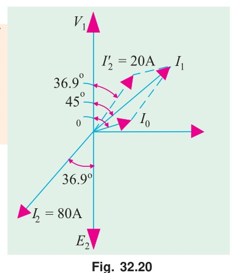

As seen from Fig. 32.20, $I_1$ is the vector sum of $I_0$ and $I'_2$. Let $I_0$ lag behind $V_1$ by an angle $\phi_0$.

$$I_0 \cos \phi_0 + 20 \cos 36.9^\circ = 25 \cos 45^\circ$$

---

<!-- Page 17 (p. 1131) -->

$$\therefore \quad I_0 \cos \phi_0 = 25 \times 0.707 - 20 \times 0.8 = 1.675\text{ A}$$

$$I_0 \sin \phi_0 + 20 \sin 36.9^\circ = 25 \sin 45^\circ$$
$$\therefore \quad I_0 \sin \phi_0 = 25 \times 0.707 - 20 \times 0.6 = 5.675\text{ A}$$

$$\therefore \quad \tan \phi_0 = \frac{5.675}{1.675} = 3.388 \quad \therefore \quad \mathbf{\phi_0 = 73.3^\circ}$$

Now,
$$I_0 \sin \phi_0 = 5.675 \quad \therefore \quad \mathbf{I_0} = \frac{5.675}{\sin 73.3^\circ} = \mathbf{5.93\text{ A}}$$

---

### Example 32.14
*A single phase transformer takes $10\text{ A}$ on no load at p.f. of $0.2$ lagging. The turns ratio is $4 : 1$ (step down). If the load on the secondary is $200\text{ A}$ at a p.f. of $0.85$ lagging. Find the primary current and power factor. Neglect the voltage-drop in the winding.*  
**(Nagpur University November 1999)**

#### Solution
Secondary load of $200\text{ A}$, $0.85\text{ lag}$ is reflected as $50\text{ A}$, $0.85\text{ lag}$ in terms of the primary equivalent current.

$$I_0 = 10\angle -\phi_0, \quad \text{where } \phi_0 = \cos^{-1} 0.20 = 78.5^\circ\text{ lagging}$$
$$= 2 - j\,9.8\text{ amp}$$

$$I'_2 = 50\angle -\phi_L \quad \text{where } \phi_L = \cos^{-1} 0.85 = 31.8^\circ, \text{ lagging}$$
$$I'_2 = 42.5 - j\,26.35$$

Hence primary current $I_1$:
$$I_1 = I_0 + I'_2 = 2 - j\,9.8 + 42.5 - j\,26.35 = 44.5 - j\,36.15$$

$$|I_1| = \mathbf{57.333\text{ amp}}, \quad \mathbf{\cos \phi = 0.776\text{ Lag.}}$$

$$\phi = \cos^{-1}\left(\frac{44.5}{57.333}\right) = \mathbf{39.10^\circ\text{ lagging}}$$

The phasor diagram is shown in Fig. 32.21.

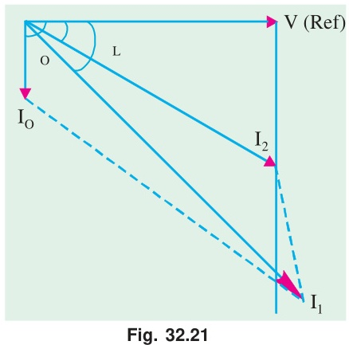

---

## Tutorial Problems 32.2

1. The primary of a certain transformer takes $1\text{ A}$ at a power factor of $0.4$ when it is connected across a $200\text{-V}$, $50\text{-Hz}$ supply and the secondary is on open circuit. The number of turns on the primary is twice that on the secondary. A load taking $50\text{ A}$ at a lagging power factor of $0.8$ is now connected across the secondary. What is now the value of primary current ?  
   **[25.9 A]**

2. The number of turns on the primary and secondary windings of a single-phase transformer are $350$ and $38$ respectively. If the primary winding is connected to a $2.2\text{ kV}$, $50\text{-Hz}$ supply, determine:  
   *(a)* the secondary voltage on no-load,  
   *(b)* the primary current when the secondary current is $200\text{ A}$ at $0.8\text{ p.f.}$ lagging, if the no-load current is $5\text{ A}$ at $0.2\text{ p.f.}$ lagging,  
   *(c)* the power factor of the primary current.  
   **[239 V; 25.65 A; 0.715 lag]**

3. A $400/200\text{-V}$, $1\text{-phase}$ transformer is supplying a load of $25\text{ A}$ at a p.f. of $0.866$ lagging. On no-load the current and power factor are $2\text{ A}$ and $0.208$ respectively. Calculate the current taken from the supply.  
   **[13.9 A lagging V1 by 36.1°]**

4. A transformer takes $10\text{ A}$ on no-load at a power factor of $0.1$. The turn ratio is $4 : 1$ (step down). If

---

<!-- Page 18 (p. 1132 - Tutorial Problems 32.2 Continued) -->

a load is supplied by the secondary at $200\text{ A}$ and p.f. of $0.8$, find the primary current and power factor (internal voltage drops in transformer are to be ignored).  
**[57.2 A; 0.717 lagging]**

5. A $1\text{-phase}$ transformer is supplied at $1,600\text{ V}$ on the h.v. side and has a turn ratio of $8 : 1$. The transformer supplies a load of $20\text{ kW}$ at a power factor of $0.8\text{ lag}$ and takes a magnetising current of $2.0\text{ A}$ at a power factor of $0.2$. Calculate the magnitude and phase of the current taken from the h.v. supply.  
**[17.15 A ; 0.753 lag] (Elect. Engg. Calcutta Univ. 1980)**

6. A $2,200/200\text{-V}$, transformer takes $1\text{ A}$ at the H.T. side on no-load at a p.f. of $0.385$ lagging. Calculate the iron losses.  
If a load of $50\text{ A}$ at a power of $0.8$ lagging is taken from the secondary of the transformer, calculate the actual primary current and its power factor.  
**[847 W; 5.44 A; 0.74 lag]**

7. A $400/200\text{-V}$, $1\text{-phase}$ transformer is supplying a load of $50\text{ A}$ at a power factor of $0.866$ lagging. The no-load current is $2\text{ A}$ at $0.208\text{ p.f.}$ lagging. Calculate the primary current and primary power factor.  
**[26.4 A; 0.838 lag] (Elect. Machines-I, Indore Univ. 1980)**
