# Chapter 32: Transformer

## Part 2: Equivalent Circuit, Leakage Reactance & Voltage Drop

[⬅️ Part 1: Construction & Principles](Ch-32_01_Construction_and_Principles.md) | [Back to Master Index](Ch-32_Index.md) | [Next: Part 3 — Testing & Regulation ➡️](Ch-32_03_Testing_and_Regulation.md)

---

<!-- Page 18 (p. 1132) -->

## 32.11. Transformer with Winding Resistance but No Magnetic Leakage

An ideal transformer was supposed to possess no resistance, but in an actual transformer, there is always present some resistance of the primary and secondary windings. Due to this resistance, there is some voltage drop in the two windings. The result is that :

- *(i)* The secondary terminal voltage $V_2$ is vectorially less than the secondary induced e.m.f. $E_2$ by an amount $I_2 R_2$ where $R_2$ is the resistance of the secondary winding. Hence, $V_2$ is equal to the vector difference of $E_2$ and resistive voltage drop $I_2 R_2$.
  $$\therefore \quad V_2 = E_2 - I_2 R_2 \quad \dots\text{vector difference}$$

- *(ii)* Similarly, primary induced e.m.f. $E_1$ is equal to the vector difference of $V_1$ and $I_1 R_1$ where $R_1$ is the resistance of the primary winding.
  $$E_1 = V_1 - I_1 R_1 \quad \dots\text{vector difference}$$

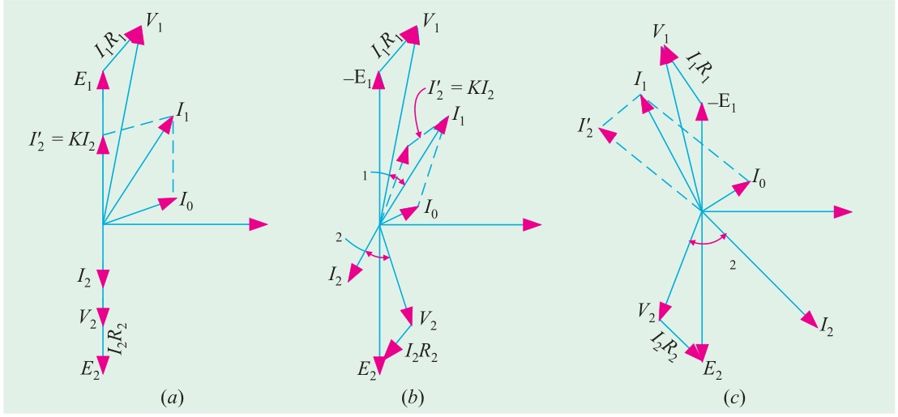

The vector diagrams for non-inductive, inductive and capacitive loads are shown in Fig. 32.22 $(a)$, $(b)$ and $(c)$ respectively.

## 32.12. Equivalent Resistance

In Fig. 32.23 a transformer is shown whose primary and secondary windings have resistances of $R_1$ and $R_2$ respectively. The resistances have been shown external to the windings.

---

<!-- Page 19 (p. 1133) -->

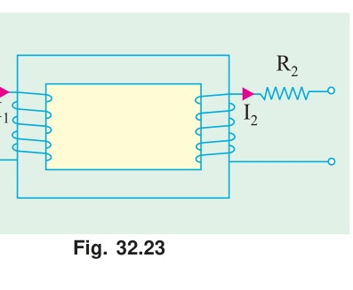

It is clear that the total copper loss in the transformer is:
$$\text{Total Cu loss} = I_1^2 R_1 + I_2^2 R_2$$

Now, if we imagine the secondary winding to have no resistance, but its resistance transferred to the primary side such that total Cu loss remains unchanged, then the new primary resistance is called the **equivalent resistance of the transformer as referred to primary**, denoted by $R_{01}$.

$$I_1^2 R_{01} = I_1^2 R_1 + I_2^2 R_2$$
$$R_{01} = R_1 + \frac{I_2^2}{I_1^2} R_2 = R_1 + \left(\frac{I_2}{I_1}\right)^2 R_2$$

$$\text{Since } \frac{I_2}{I_1} \approx \frac{1}{K}, \quad \text{we have:}$$

$$R_{01} = R_1 + \frac{R_2}{K^2} = R_1 + R'_2$$

where $R'_2 = R_2 / K^2$ is the secondary resistance referred to primary.

Similarly, equivalent primary resistance as referred to secondary side is denoted by $R_{02}$:

$$R_{02} = R_2 + R'_1 = R_2 + K^2 R_1$$

where $R'_1 = K^2 R_1$ is the primary resistance referred to secondary. This fact is shown in Fig. 32.24 and Fig. 32.25.

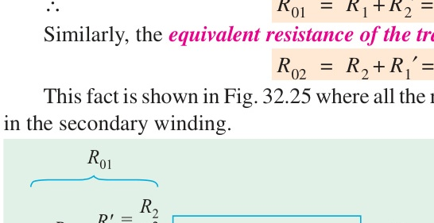

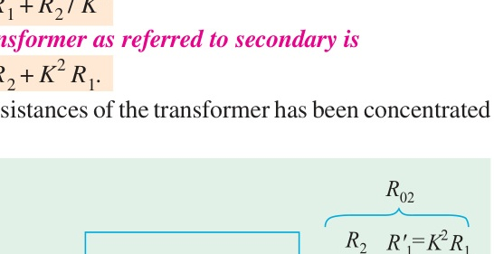

It should be remembered that:
$$R_{02} = K^2 R_{01}$$

---

<!-- Page 20 (p. 1134) -->

## 32.13. Magnetic Leakage

In the preceding discussion, it has been assumed that all the flux linked with primary is also linked with secondary. But, in practice, it is impossible to realize this condition completely. It is found that a small part of the flux created by the primary links with the primary winding alone and does not reach the secondary. This is known as **primary leakage flux** $\phi_{L1}$ (Fig. 32.26). Similarly, a small part of the flux set up by the secondary current links with the secondary winding alone and does not reach the primary. This is called **secondary leakage flux** $\phi_{L2}$.

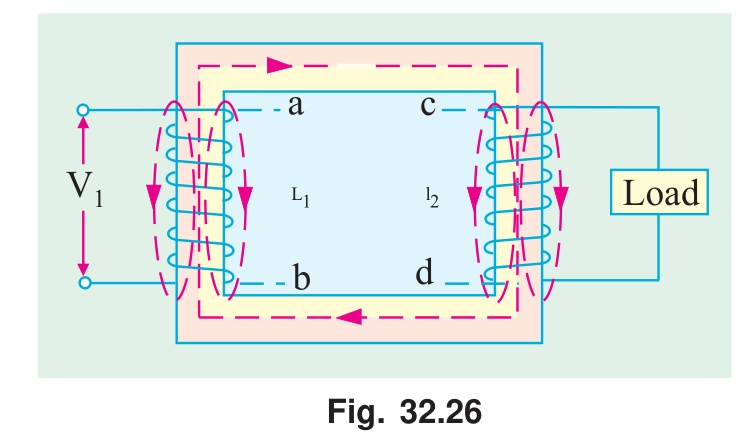

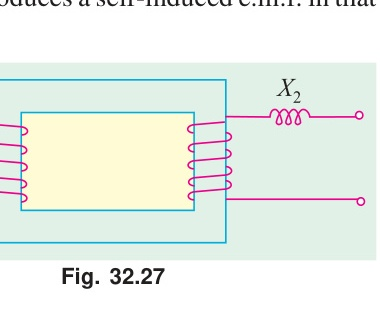

These leakage fluxes are set up through air paths whose reluctance is constant and not subject to saturation. Hence, leakage flux is directly proportional to the respective winding currents and in time phase with them.

The effect of primary leakage flux is to induce a self-induced e.m.f. $e_{L1}$ in the primary winding which lags behind the primary current $I_1$ by $90^\circ$. Hence, primary leakage flux behaves like an inductive reactance $X_1$ in series with the primary winding:
$$X_1 = 2\pi f L_1$$

Similarly, secondary leakage flux induces a self-induced e.m.f. $e_{L2}$ in secondary winding which lags behind secondary current $I_2$ by $90^\circ$. Hence, secondary leakage flux behaves like a leakage reactance $X_2$ in series with the secondary winding:
$$X_2 = 2\pi f L_2$$

---

<!-- Page 21 (p. 1135) -->

## 32.14. Transformer with Resistance and Leakage Reactance

In Fig. 32.28 the primary and secondary windings of a transformer are shown with resistances $R_1$, $R_2$ and leakage reactances $X_1$, $X_2$ connected in series with the windings.

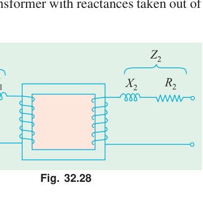

Here:
$$Z_1 = \sqrt{R_1^2 + X_1^2} \quad \text{and} \quad Z_2 = \sqrt{R_2^2 + X_2^2}$$

$$\mathbf{V_1} = \mathbf{-E_1} + \mathbf{I_1 Z_1} = \mathbf{-E_1} + \mathbf{I_1 R_1} + j \mathbf{I_1 X_1}$$
$$\mathbf{E_2} = \mathbf{V_2} + \mathbf{I_2 Z_2} = \mathbf{V_2} + \mathbf{I_2 R_2} + j \mathbf{I_2 X_2}$$

The complete vector diagrams for inductive, non-inductive and capacitive loads are shown in Fig. 32.29.

In these diagrams, vectors for resistive drops are drawn parallel to current vectors whereas reactive drops are perpendicular to the current vectors. The angle $\phi_1$ between $V_1$ and $I_1$ gives the power factor angle of the transformer.

It may be noted that leakage reactances can also be transferred from one winding to the other in the same way as resistance:

$$X'_2 = \frac{X_2}{K^2} \quad \text{and} \quad X'_1 = K^2 X_1$$

$$X_{01} = X_1 + X'_2 = X_1 + \frac{X_2}{K^2} \quad \text{and} \quad X_{02} = X_2 + X'_1 = X_2 + K^2 X_1$$

---

<!-- Page 22 (p. 1136) -->

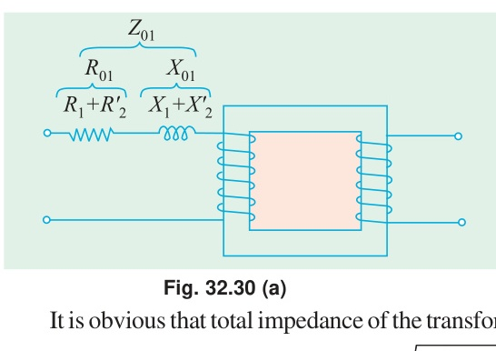

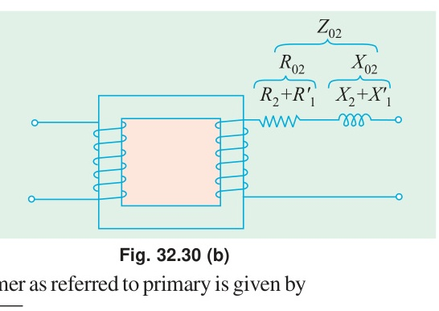

It is obvious that total impedance of the transformer as referred to primary is given by:

$$Z_{01} = \sqrt{R_{01}^2 + X_{01}^2} \quad \dots\text{[Fig. 32.30 (a)]}$$

and total impedance as referred to secondary is:

$$Z_{02} = \sqrt{R_{02}^2 + X_{02}^2} \quad \dots\text{[Fig. 32.30 (b)]}$$

Also:
$$Z_{02} = K^2 Z_{01}$$

---

### Example 32.15
*A $30\text{ kVA}$, $2400/120\text{-V}$, $50\text{-Hz}$ transformer has a high voltage winding resistance of $0.1\ \Omega$ and a leakage reactance of $0.22\ \Omega$. The low voltage winding resistance is $0.035\ \Omega$ and the leakage reactance is $0.012\ \Omega$. Find the equivalent winding resistance, reactance and impedance referred to the (i) high voltage side and (ii) the low-voltage side.*  
**(Electrical Machines-I, Bangalore Univ. 1987)**

#### Solution
$$K = 120 / 2400 = 1/20; \quad R_1 = 0.1\ \Omega, \quad X_1 = 0.22\ \Omega$$
$$R_2 = 0.035\ \Omega, \quad X_2 = 0.012\ \Omega$$

**(i)** Here, high-voltage side is, obviously, the primary side. Hence, values as referred to primary side are:
$$R_{01} = R_1 + R'_2 = R_1 + \frac{R_2}{K^2} = 0.1 + \frac{0.035}{(1/20)^2} = \mathbf{14.1\ \Omega}$$
$$X_{01} = X_1 + X'_2 = X_1 + \frac{X_2}{K^2} = 0.22 + \frac{0.012}{(1/20)^2} = \mathbf{5.02\ \Omega}$$
$$Z_{01} = \sqrt{R_{01}^2 + X_{01}^2} = \sqrt{14.1^2 + 5.02^2} = \mathbf{15.0\ \Omega}$$

**(ii)** Values referred to low-voltage (secondary) side:
$$R_{02} = R_2 + R'_1 = R_2 + K^2 R_1 = 0.035 + (1/20)^2 \times 0.1 = \mathbf{0.03525\ \Omega}$$
$$X_{02} = X_2 + X'_1 = X_2 + K^2 X_1 = 0.012 + (1/20)^2 \times 0.22 = \mathbf{0.01255\ \Omega}$$
$$Z_{02} = \sqrt{R_{02}^2 + X_{02}^2} = \sqrt{0.03525^2 + 0.01255^2} = \mathbf{0.0374\ \Omega}$$
$$\text{or } Z_{02} = K^2 Z_{01} = (1/20)^2 \times 15 = \mathbf{0.0375\ \Omega}$$

---

### Example 32.16
*A $50\text{-kVA}$, $4,400/220\text{-V}$ transformer has $R_1 = 3.45\ \Omega$, $R_2 = 0.009\ \Omega$. The values of reactances are $X_1 = 5.2\ \Omega$ and $X_2 = 0.015\ \Omega$. Calculate for the transformer (i) equivalent resistance as referred to primary (ii) equivalent resistance as referred to secondary (iii) equivalent reactance as referred to both primary and secondary (iv) equivalent impedance as referred to both primary and secondary (v) total Cu loss, first using individual resistances of the two windings and secondly, using equivalent resistances as referred to each side.*  
**(Elect. Engg.-I, Nagpur Univ. 1993)**

#### Solution
$$\text{Full-load } I_1 = 50,000 / 4,400 = 11.36\text{ A (assuming } 100\% \text{ efficiency)}$$
$$\text{Full-load } I_2 = 50,000 / 220 = 227\text{ A}; \quad K = 220 / 4,400 = 1/20$$

**(i)**
$$R_{01} = R_1 + \frac{R_2}{K^2} = 3.45 + \frac{0.009}{(1/20)^2} = 3.45 + 3.6 = \mathbf{7.05\ \Omega}$$

**(ii)**
$$R_{02} = R_2 + K^2 R_1 = 0.009 + (1/20)^2 \times 3.45 = 0.009 + 0.0086 = \mathbf{0.0176\ \Omega}$$
$$\text{Also, } R_{02} = K^2 R_{01} = (1/20)^2 \times 7.05 = \mathbf{0.0176\ \Omega} \quad (\text{check})$$

---

<!-- Page 23 (p. 1137) -->

**(iii)**
$$X_{01} = X_1 + X'_2 = X_1 + \frac{X_2}{K^2} = 5.2 + \frac{0.015}{(1/20)^2} = \mathbf{11.2\ \Omega}$$
$$X_{02} = X_2 + X'_1 = X_2 + K^2 X_1 = 0.015 + \frac{5.2}{20^2} = \mathbf{0.028\ \Omega}$$
$$\text{Also } X_{02} = K^2 X_{01} = \frac{11.2}{400} = \mathbf{0.028\ \Omega} \quad (\text{check})$$

**(iv)**
$$Z_{01} = \sqrt{R_{01}^2 + X_{01}^2} = \sqrt{7.05^2 + 11.2^2} = \mathbf{13.23\ \Omega}$$
$$Z_{02} = \sqrt{R_{02}^2 + X_{02}^2} = \sqrt{0.0176^2 + 0.028^2} = \mathbf{0.03311\ \Omega}$$
$$\text{Also } Z_{02} = K^2 Z_{01} = \frac{13.23}{400} = \mathbf{0.0331\ \Omega} \quad (\text{check})$$

**(v)**
$$\text{Cu loss} = I_1^2 R_1 + I_2^2 R_2 = 11.36^2 \times 3.45 + 227^2 \times 0.009 = \mathbf{910\text{ W}}$$
$$\text{Also Cu loss} = I_1^2 R_{01} = 11.36^2 \times 7.05 = \mathbf{910\text{ W}}$$
$$= I_2^2 R_{02} = 227^2 \times 0.0176 = \mathbf{910\text{ W}}$$

---

### Example 32.17
*A transformer with a $10 : 1$ ratio and rated at $50\text{-kVA}$, $2400/240\text{-V}$, $50\text{-Hz}$ is used to step down the voltage of a distribution system. The low tension voltage is to be kept constant at $240\text{ V}$.*  
*(a) What load impedance connected to low-tension side will be loading the transformer fully at $0.8$ power factor (lag) ?*  
*(b) What is the value of this impedance referred to high tension side ?*  
*(c) What is the value of the current referred to the high tension side ?*  
**(Elect. Engineering-I, Bombay Univ. 1987)**

#### Solution
**(a)**
$$\text{F.L. } I_2 = 50,000 / 240 = 625 / 3\text{ A}; \quad Z_2 = \frac{240}{625/3} = \mathbf{1.142\ \Omega}$$

**(b)**
$$K = 240 / 2400 = 1/10$$
$$\text{The secondary impedance referred to primary side is } Z'_2 = \frac{Z_2}{K^2} = \frac{1.142}{(1/10)^2} = \mathbf{114.2\ \Omega}$$

**(c)**
$$\text{Secondary current referred to primary side is } I'_2 = K I_2 = \left(\frac{1}{10}\right) \times \frac{625}{3} = \mathbf{20.83\text{ A}}$$

---

### Example 32.18
*The full-load copper loss on the h.v. side of a $100\text{-kVA}$, $11000/317\text{-V}$, $1\text{-phase}$ transformer is $0.62\text{ kW}$ and on the L.V. side is $0.48\text{ kW}$.*  
*(i) Calculate $R_1$, $R_2$ and $R'_2$ in ohms*  
*(ii) If the total reactance is $4\text{ per cent}$, find $X_1$, $X_2$ and $X'_2$ in ohms if the reactance is divided in the same proportion as resistance.*  
**(Elect. Machines A.M.I.E., Sec. B, 1991)**

#### Solution
**(i)**
$$\text{F.L. } I_1 = \frac{100 \times 10^3}{11000} = 9.1\text{ A}. \quad \text{F.L. } I_2 = \frac{100 \times 10^3}{317} = 315.5\text{ A}$$
$$I_1^2 R_1 = 0.62\text{ kW} \quad \text{or} \quad \mathbf{R_1} = \frac{620}{9.1^2} = \mathbf{7.5\ \Omega}$$
$$I_2^2 R_2 = 0.48\text{ kW}, \quad \mathbf{R_2} = \frac{480}{315.5^2} = \mathbf{0.00482\ \Omega}$$
$$\mathbf{R'_2} = \frac{R_2}{K^2} = 0.00482 \times \left(\frac{11,000}{317}\right)^2 = \mathbf{5.8\ \Omega}$$

**(ii)**
$$\% \text{ reactance} = \frac{I_1 X_{01}}{V_1} \times 100 \quad \text{or} \quad 4 = \frac{9.1 \times X_{01}}{11000} \times 100, \quad X_{01} = 48.4\ \Omega$$
$$X_1 + X'_2 = 48.4\ \Omega. \quad \text{Given } \frac{R_1}{R'_2} = \frac{X_1}{X'_2}$$
$$\text{or } \frac{R_1 + R'_2}{R'_2} = \frac{X_1 + X'_2}{X'_2} \implies \frac{7.5 + 5.8}{5.8} = \frac{48.4}{X'_2} \quad \therefore \quad \mathbf{X'_2 = 21.1\ \Omega}$$
$$\therefore \quad \mathbf{X_1} = 48.4 - 21.1 = \mathbf{27.3\ \Omega}, \quad \mathbf{X_2} = 21.1 \times \left(\frac{317}{11000}\right)^2 = \mathbf{0.175\ \Omega}$$

---

<!-- Page 24 (p. 1138) -->

### Example 32.19
*The following data refer to a $1\text{-phase}$ transformer:*  
*Turn ratio $19.5 : 1$; $R_1 = 25\ \Omega$; $X_1 = 100\ \Omega$; $R_2 = 0.06\ \Omega$; $X_2 = 0.25\ \Omega$. No-load current = $1.25\text{ A}$ leading the flux by $30^\circ$.*  
*The secondary delivers $200\text{ A}$ at a terminal voltage of $500\text{ V}$ and p.f. of $0.8$ lagging. Determine by the aid of a vector diagram, the primary applied voltage, the primary p.f. and the efficiency.*  
**(Elect. Machinery-I, Madras Univ. 1989)**

#### Solution
The vector diagram is similar to Fig. 32.29 which has been redrawn as Fig. 32.31. Let us take $V_2$ as the reference vector.

$$V_2 = 500\angle 0^\circ = 500 + j0$$
$$I_2 = 200(0.8 - j\,0.6) = 160 - j\,120$$
$$Z_2 = (0.06 + j\,0.25)$$
$$E_2 = V_2 + I_2 Z_2 = (500 + j\,0) + (160 - j\,120)(0.06 + j\,0.25)$$
$$= 500 + (39.6 + j\,32.8) = 539.6 + j\,32.8 = 541\angle 3.5^\circ$$
$$\text{Obviously, } \beta = 3.5^\circ$$

$$E_1 = \frac{E_2}{K} = 19.5\,E_2 = 19.5(539.6 + j\,32.8) = 10,520 + j\,640$$
$$\therefore \quad -E_1 = -10,520 - j\,640 = 10,540\angle 183.5^\circ$$

$$I'_2 = -I_2 K = \frac{-160 + j\,120}{19.5} = -8.21 + j\,6.16$$

As seen from Fig. 32.31, $I_0$ leads $V_2$ by an angle:
$$= 3.5^\circ + 90^\circ + 30^\circ = 123.5^\circ$$
$$I_0 = 1.25\angle 123.5^\circ = 1.25(\cos 123.5^\circ + j\sin 123.5^\circ) = -0.69 + j\,1.04$$

$$I_1 = I'_2 + I_0 = (-8.21 + j\,6.16) + (-0.69 + j\,1.04) = -8.9 + j\,7.2 = 11.45\angle 141^\circ$$

$$V_1 = -E_1 + I_1 Z_1 = -10,520 - j\,640 + (-8.9 + j\,7.2)(25 + j\,100)$$
$$= -10,520 - j\,640 - 942 - j\,710 = -11,462 - j\,1350 = \mathbf{11,540\angle 186.7^\circ}$$

$$\text{Phase angle between } V_1 \text{ and } I_1 = 186.7^\circ - 141^\circ = 45.7^\circ$$
$$\therefore \quad \mathbf{\text{primary p.f.}} = \cos 45.7^\circ = \mathbf{0.698\text{ (lag)}}$$

$$\text{No-load primary input power} = V_1 I_0 \sin \phi_0 = 11,540 \times 1.25 \times \cos 60^\circ = 7,210\text{ W}$$
$$R_{02} = R_2 + K^2 R_1 = 0.06 + 25 / 19.5^2 = 0.1257\ \Omega$$
$$\text{Total Cu loss as referred to secondary} = I_2^2 R_{02} = 200^2 \times 0.1257 = 5,030\text{ W}$$
$$\text{Output} = V_2 I_2 \cos \phi_2 = 500 \times 200 \times 0.8 = 80,000\text{ W}$$
$$\text{Total losses} = 5030 + 7210 = 12,240\text{ W}$$
$$\text{Input} = 80,000 + 12,240 = 92,240\text{ W}$$
$$\mathbf{\eta} = \frac{80,000}{92,240} = 0.8674 \quad \text{or} \quad \mathbf{86.74\%}$$

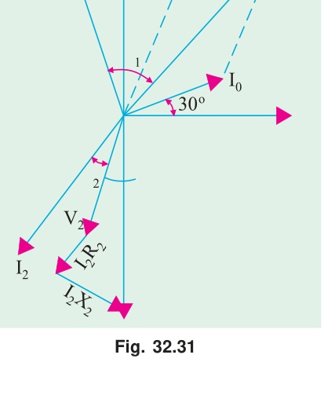

---

### Example 32.20
*A $100\text{ kVA}$, $1100/220\text{ V}$, $50\text{ Hz}$, single-phase transformer has a leakage impedance of $(0.1 + j\,0.40)\text{ ohm}$ for the H.V. winding and $(0.006 + j\,0.015)\text{ ohm}$ for the L.V. winding. Find the equivalent winding resistance, reactance and impedance referred to the H.V. and L.V. sides.*  
**(Bharathiar Univ. Nov. 1997)**

---

<!-- Page 25 (p. 1139) -->

#### Solution (Example 32.20 Continued)
Let H.V. side be primary and L.V. side secondary:
$$K = 220 / 1100 = 1/5$$
$$R_1 = 0.1\ \Omega, \quad X_1 = 0.40\ \Omega; \quad R_2 = 0.006\ \Omega, \quad X_2 = 0.015\ \Omega$$

**(i) Referred to H.V. (primary) side:**
$$R_{01} = R_1 + \frac{R_2}{K^2} = 0.1 + \frac{0.006}{(1/5)^2} = 0.1 + 0.15 = \mathbf{0.25\ \Omega}$$
$$X_{01} = X_1 + \frac{X_2}{K^2} = 0.40 + \frac{0.015}{(1/5)^2} = 0.40 + 0.375 = \mathbf{0.775\ \Omega}$$
$$Z_{01} = \sqrt{R_{01}^2 + X_{01}^2} = \sqrt{0.25^2 + 0.775^2} = \mathbf{0.814\ \Omega}$$

**(ii) Referred to L.V. (secondary) side:**
$$R_{02} = R_2 + K^2 R_1 = 0.006 + (1/5)^2 \times 0.1 = 0.006 + 0.004 = \mathbf{0.010\ \Omega}$$
$$X_{02} = X_2 + K^2 X_1 = 0.015 + (1/5)^2 \times 0.40 = 0.015 + 0.016 = \mathbf{0.031\ \Omega}$$
$$Z_{02} = \sqrt{R_{02}^2 + X_{02}^2} = \sqrt{0.010^2 + 0.031^2} = \mathbf{0.0326\ \Omega}$$

---

## 32.15. Simplified Diagram

The vector diagram of Fig. 32.29 may be considerably simplified by transferring the primary impedance drops to the secondary side or vice-versa. In Fig. 32.32, total resistance $R_{02}$ and total leakage reactance $X_{02}$ are referred to secondary.

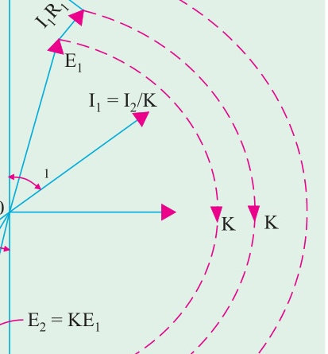

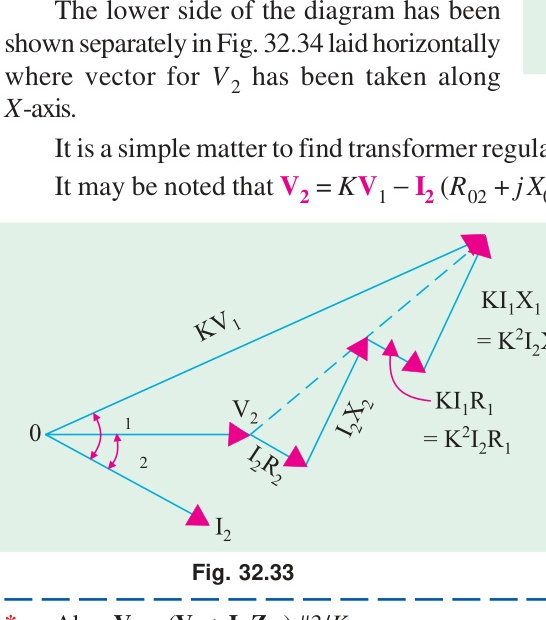

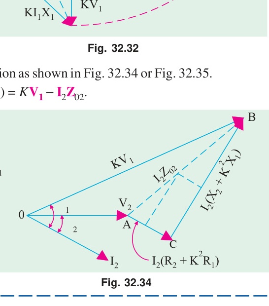

It may be noted that:
$$K V_1 = {}_0V_2$$
where ${}_0V_2$ is the secondary no-load voltage. The secondary terminal voltage $V_2$ is less than ${}_0V_2$ by the impedance drop $I_2 Z_{02}$.

---

<!-- Page 26 (p. 1140) -->

## 32.16. Total Approximate Voltage Drop in a Transformer

When the transformer is on no-load, then $V_1$ is approximately equal to $E_1$. Hence, $E_2 = K E_1 = K V_1 = {}_0V_2$.

From Fig. 32.35, the total approximate voltage drop on load (for a lagging power factor $\cos \phi$) referred to secondary side is given by:

$$\text{Total drop} = {}_0V_2 - V_2 = AC \approx AN$$
$$AN = AD + DN$$
$$AD = AB \cos \phi = I_2 R_{02} \cos \phi$$
$$DN = BC \sin \phi = I_2 X_{02} \sin \phi$$

$$\therefore \quad \text{Approximate drop in secondary} = \mathbf{I_2 R_{02} \cos \phi + I_2 X_{02} \sin \phi}$$

where $\phi_1 \approx \phi_2 = \phi$.

This is the value of approximate voltage drop for a **lagging** power factor.

The different figures for unity and leading power factors are shown in Fig. 32.36 $(a)$ and $(b)$ respectively.

The approximate voltage drop for **leading** power factor becomes:

$$\text{Approximate drop (leading p.f.)} = \mathbf{I_2 R_{02} \cos \phi - I_2 X_{02} \sin \phi}$$

For **unity** power factor, since $\phi = 0^\circ$:
$$\text{Approximate drop (unity p.f.)} = \mathbf{I_2 R_{02}}$$

Similarly, referring all quantities to primary side:
$$\text{Approximate drop in primary (lagging p.f.)} = \mathbf{I_1 R_{01} \cos \phi + I_1 X_{01} \sin \phi}$$
$$\text{Approximate drop in primary (leading p.f.)} = \mathbf{I_1 R_{01} \cos \phi - I_1 X_{01} \sin \phi}$$

---

<!-- Page 27 (p. 1141) -->

## 32.17. Exact Voltage Drop

With reference to Fig. 32.35, it is to be noted that exact voltage drop is:

$${}_0V_2 - V_2 = OC - OA = OC - OD$$
$$OC = \sqrt{OE^2 + EC^2}$$
$$OE = OA + AD = V_2 + I_2 R_{02} \cos \phi + I_2 X_{02} \sin \phi$$
$$EC = BC \cos \phi - AB \sin \phi = I_2 X_{02} \cos \phi - I_2 R_{02} \sin \phi$$

$$OC = \left[(V_2 + I_2 R_{02} \cos \phi + I_2 X_{02} \sin \phi)^2 + (I_2 X_{02} \cos \phi - I_2 R_{02} \sin \phi)^2\right]^{1/2}$$

For all practical calculations, the binomial expansion gives:

$${}_0V_2 \approx V_2 + (I_2 R_{02} \cos \phi \pm I_2 X_{02} \sin \phi) + \frac{(I_2 X_{02} \cos \phi \mp I_2 R_{02} \sin \phi)^2}{2 V_2}$$

$$\therefore \quad \text{Exact drop} = {}_0V_2 - V_2 = (I_2 R_{02} \cos \phi \pm I_2 X_{02} \sin \phi) + \frac{(I_2 X_{02} \cos \phi \mp I_2 R_{02} \sin \phi)^2}{2 V_2}$$

---

### Example 32.21
*A $230/460\text{-V}$ transformer has a primary resistance of $0.2\ \Omega$ and reactance of $0.5\ \Omega$ and the corresponding values for the secondary are $0.75\ \Omega$ and $1.8\ \Omega$ respectively. Find the secondary terminal voltage when supplying $10\text{ A}$ at $0.8\text{ p.f.}$ lagging.*

#### Solution
$$K = 460 / 230 = 2$$
$$R_{02} = R_2 + K^2 R_1 = 0.75 + 2^2 \times 0.2 = 0.75 + 0.8 = 1.55\ \Omega$$
$$X_{02} = X_2 + K^2 X_1 = 1.8 + 2^2 \times 0.5 = 1.8 + 2.0 = 3.8\ \Omega$$

$$\text{Voltage drop} = I_2(R_{02} \cos \phi + X_{02} \sin \phi)$$
$$= 10(1.55 \times 0.8 + 3.8 \times 0.6) = 10(1.24 + 2.28) = 35.2\text{ V}$$

$$\therefore \quad \mathbf{\text{Secondary terminal voltage } V_2} = 460 - 35.2 = \mathbf{424.8\text{ V}}$$

---

### Example 32.22
*Calculate the regulation of a transformer in which the ohmic drop is $1\%$ of the voltage and the reactive drop is $5\%$ of the voltage, when the power factor is (i) $0.8\text{ lagging}$ (ii) unity (iii) $0.8\text{ leading}$.*

#### Solution
Let full-load terminal voltage be $100\text{ V}$.
$$\text{Ohmic drop} = \frac{I_2 R_{02}}{V_2} \times 100 = 1\%; \quad \text{Reactive drop} = \frac{I_2 X_{02}}{V_2} \times 100 = 5\%$$

- **(i) At $0.8$ p.f. lagging:**
  $$\% \text{ reg.} = 1 \times 0.8 + 5 \times 0.6 = 0.8 + 3.0 = \mathbf{+3.8\%}$$
- **(ii) At unity p.f.:**
  $$\% \text{ reg.} = 1 \times 1.0 + 5 \times 0 = \mathbf{+1.0\%}$$
- **(iii) At $0.8$ p.f. leading:**
  $$\% \text{ reg.} = 1 \times 0.8 - 5 \times 0.6 = 0.8 - 3.0 = \mathbf{-2.2\%}$$

---

### Example 32.23
*A transformer has a reactance drop of $5\%$ and a resistance drop of $2.5\%$. Find the lagging power factor at which the voltage regulation will be maximum and also find the value of this regulation.*

#### Solution
Regulation is maximum when:
$$\tan \phi = \frac{X_{02}}{R_{02}} = \frac{5}{2.5} = 2 \quad \implies \quad \phi = \tan^{-1}(2) = 63.4^\circ$$
$$\therefore \quad \mathbf{\cos \phi} = \cos 63.4^\circ = \mathbf{0.447\text{ lagging}}$$

$$\mathbf{\text{Maximum regulation}} = \sqrt{(\% R)^2 + (\% X)^2} = \sqrt{2.5^2 + 5^2} = \mathbf{5.59\%}$$

---

<!-- Page 28 (p. 1142) -->

### Example 32.24
*Calculate the percentage voltage drop for a transformer with a percentage resistance of $2.5\%$ and a percentage reactance of $5\%$ of rating $500\text{ kVA}$ when it is delivering $400\text{ kVA}$ at $0.8\text{ p.f.}$ lagging.*  
**(Elect. Machinery-I, Indore Univ. 1987)**

#### Solution
$$\% \text{ drop} = \left[(\% R) \frac{I}{I_f} \cos \phi + (\% X) \frac{I}{I_f} \sin \phi\right]$$
$$\text{where } I_f \text{ is the full-load current and } I \text{ the actual current.}$$

$$\therefore \quad \% \text{ drop} = (\% R) \frac{\text{kW}}{\text{rating kVA}} + (\% X) \frac{\text{kVAR}}{\text{rating kVA}}$$

In the present case,
$$\text{kW} = 400 \times 0.8 = 320 \quad \text{and} \quad \text{kVAR} = 400 \times 0.6 = 240$$

$$\therefore \quad \mathbf{\% \text{ drop}} = 2.5 \times \frac{320}{500} + 5 \times \frac{240}{500} = 1.6 + 2.4 = \mathbf{4\%}$$

---

## 32.18. Equivalent Circuit

The transformer shown diagrammatically in Fig. 32.37 $(a)$ can be resolved into an equivalent circuit in which the resistance and leakage reactance of the transformer are imagined to be external to the winding whose only function then is to transform the voltage [Fig. 32.37 $(b)$]. The no-load current $I_0$ is simulated by pure inductance $X_0$ taking the magnetising component $I_\mu$ and a non-inductive resistance $R_0$ taking the working component $I_w$ connected in parallel across the primary circuit.

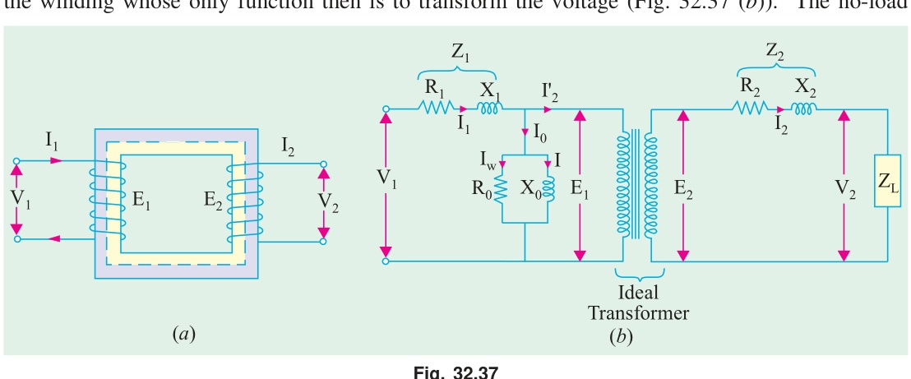

The value of $E_1$ is obtained by subtracting vectorially $I_1 Z_1$ from $V_1$. The value of $X_0 = E_1 / I_\mu$ and of $R_0 = E_1 / I_w$. It is clear that $E_1$ and $E_2$ are related to each other by expression:
$$\frac{E_2}{E_1} = \frac{N_2}{N_1} = K$$

To make transformer calculations simpler, it is preferable to transfer voltage, current and impedance

---

<!-- Page 29 (p. 1143) -->

either to the primary or to the secondary. In that case, we would have to work in one winding only which is more convenient.

- Primary equivalent of the secondary induced voltage is: $E'_2 = E_2 / K = E_1$.
- Primary equivalent of secondary terminal or output voltage is: $V'_2 = V_2 / K$.
- Primary equivalent of the secondary current is: $I'_2 = K I_2$.
- For transferring secondary impedance to primary $K^2$ is used:
  $$R'_2 = \frac{R_2}{K^2}, \quad X'_2 = \frac{X_2}{K^2}, \quad Z'_2 = \frac{Z_2}{K^2}$$

The same relationship is used for shifting an external load impedance to the primary.

The secondary circuit is shown in Fig. 32.38 $(a)$ and its equivalent primary values are shown in Fig. 32.38 $(b)$.

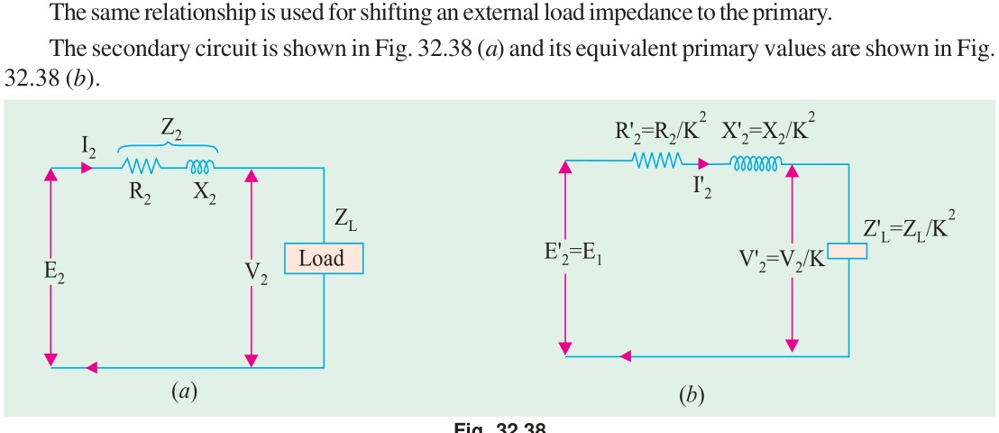

The total equivalent circuit of the transformer is obtained by adding in the primary impedance as shown in Fig. 32.39. This is known as the **exact equivalent circuit** but it presents a somewhat harder circuit problem to solve. A simplification can be made by transferring the exciting circuit across the terminals as in Fig. 32.40 or in Fig. 32.41 $(a)$. It should be noted that in this case $X_0 = V_1 / I_\mu$.

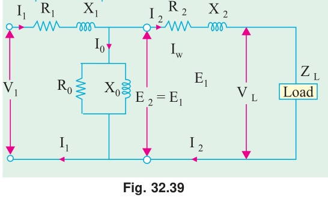

Further simplification may be achieved by omitting $I_0$ altogether as shown in Fig. 32.41 $(b)$.

From Fig. 32.39 it is found that total impedance between the input terminal is:

$$Z = Z_1 + Z_m \parallel (Z'_2 + Z'_L) = Z_1 + \frac{Z_m (Z'_2 + Z'_L)}{Z_m + Z'_2 + Z'_L}$$

where $Z'_2 = R'_2 + j X'_2$ and $Z_m =$ impedance of the exciting circuit.

This is so because there are two parallel circuits, one having an impedance of $Z_m$ and the other having $Z'_2$ and $Z'_L$ in series with each other.

$$\therefore \quad V_1 = I_1 \left[Z_1 + \frac{Z_m (Z'_2 + Z'_L)}{Z_m + Z'_2 + Z'_L}\right]$$

---

<!-- Page 30 (p. 1144) -->

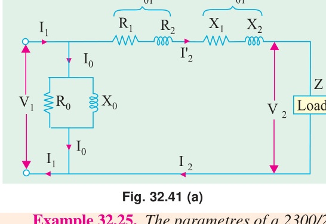

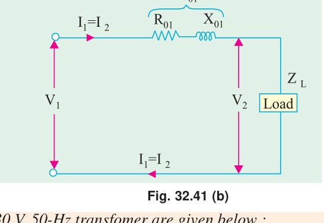

---

### Example 32.25
*The parameters of a $2300/230\text{ V}$, $50\text{-Hz}$ transformer are given below:*  
$$R_1 = 0.286\ \Omega, \quad R'_2 = 0.319\ \Omega, \quad R_0 = 250\ \Omega$$
$$X_1 = 0.73\ \Omega, \quad X'_2 = 0.73\ \Omega, \quad X_0 = 1250\ \Omega$$
*The secondary load impedance $Z_L = 0.387 + j\,0.29\ \Omega$. Solve the exact equivalent circuit with normal voltage across the primary.*

#### Solution
$$K = 230 / 2300 = 1/10; \quad Z_L = 0.387 + j\,0.29$$
$$Z'_L = \frac{Z_L}{K^2} = 100(0.387 + j\,0.29) = 38.7 + j\,29 = 48.4\angle 36.8^\circ\ \Omega$$

$$\therefore \quad Z'_2 + Z'_L = (38.7 + 0.319) + j(29 + 0.73) = 39.02 + j\,29.73 = 49.0\angle 37.3^\circ\ \Omega$$

$$Y_m = \frac{1}{R_0} - j\frac{1}{X_0} = \frac{1}{250} - j\frac{1}{1250} = (0.004 - j\,0.0008)\text{ S}$$
$$Z_m = \frac{1}{Y_m} = 240 + j\,48 = 245\angle 11.3^\circ\ \Omega$$

$$Z_m + (Z'_2 + Z'_L) = (240 + j\,48) + (39 + j\,29.7) = 290\angle 15.6^\circ\ \Omega$$

$$\therefore \quad I_1 = \frac{V_1}{Z_1 + \frac{Z_m (Z'_2 + Z'_L)}{Z_m + Z'_2 + Z'_L}} = \frac{2300\angle 0^\circ}{(0.286 + j\,0.73) + \frac{245\angle 11.3^\circ \times 49.0\angle 37.3^\circ}{290\angle 15.6^\circ}}$$
$$= \frac{2300\angle 0^\circ}{(0.286 + j\,0.73) + 41.4\angle 33^\circ} = \frac{2300\angle 0^\circ}{42\angle 33.7^\circ} = \mathbf{54.8\angle -33.7^\circ\text{ A}}$$

Now:
$$I'_2 = I_1 \times \frac{Z_m}{Z_m + (Z'_2 + Z'_L)} = 54.8\angle -33.7^\circ \times \frac{245\angle 11.3^\circ}{290\angle 15.6^\circ}$$
$$= 54.8\angle -33.7^\circ \times 0.845\angle -4.3^\circ = \mathbf{46.2\angle -38^\circ\text{ A}}$$

$$I_0 = I_1 \times \frac{Z'_2 + Z'_L}{Z_m + (Z'_2 + Z'_L)} = 54.8\angle -33.7^\circ \times \frac{49\angle 37.3^\circ}{290\angle 15.6^\circ}$$
$$= 54.8\angle -33.7^\circ \times 0.169\angle 21.7^\circ = \mathbf{9.26\angle -12^\circ\text{ A}}$$

$$\text{Input power factor} = \cos 33.7^\circ = \mathbf{0.832\text{ lagging}}$$
$$\text{Power input} = V_1 I_1 \cos \phi_1 = 2300 \times 54.8 \times 0.832 = \mathbf{105\text{ kW}}$$
$$\text{Power output} = I_2^{\prime 2} R'_L = 46.2^2 \times 38.7 = \mathbf{82.7\text{ kW}}$$

$$\text{Primary Cu loss} = 54.8^2 \times 0.286 = \mathbf{860\text{ W}}$$
$$\text{Secondary Cu loss} = 46.2^2 \times 0.319 = \mathbf{680\text{ W}}$$
$$\text{Core loss} = 9.26^2 \times 240 = \mathbf{20.6\text{ kW}}$$

$$\mathbf{\eta} = \left(\frac{82.7}{105}\right) \times 100 = \mathbf{78.8\%}$$

$$V'_2 = I'_2 Z'_L = 46.2 \times 48.4 = 2,240\text{ V}$$
$$\therefore \quad \mathbf{\text{Regulation}} = \frac{2300 - 2240}{2240} \times 100 = \mathbf{2.7\%}$$

---

### Example 32.26
*A transformer has a primary winding with a voltage-rating of $600\text{ V}$. Its secondary-voltage rating is $1080\text{ V}$ with an additional tap at $720\text{ V}$. An $8\text{ kW}$ resistive load is connected across $1080\text{-V}$ output terminals. A purely inductive load of $10\text{ kVA}$ is connected across the tapping point and common secondary terminal so as to get $720\text{ V}$. Calculate the primary current and its power-factor. Correlate it with the existing secondary loads. Neglect losses and magnetizing current.*  
**(Nagpur University, Winter 1999)**

---

<!-- Page 31 (p. 1145) -->

#### Solution (Example 32.26 Continued)
Loads are connected as shown in Fig. 32.42.

$$I_{r2} = \frac{8000}{1080} = 7.41\text{ A at unity p.f.}$$
$$I_{L2} = \frac{10000}{720} = 13.89\text{ A at zero lagging p.f.}$$

These are reflected on to the primary sides with appropriate ratios of turns, with corresponding power-factors. If the corresponding transformed currents are represented by the above symbols modified by dashed superscripts:

$$I'_{r2} = 7.41 \times \frac{1080}{600} = 13.34\text{ A at unity p.f.}$$
$$I'_{L2} = 13.89 \times \frac{720}{600} = 16.67\text{ A at zero lag. p.f.}$$

Hence,
$$\mathbf{I_1} = \sqrt{I_{r2}^{\prime 2} + I_{L2}^{\prime 2}} = \sqrt{13.34^2 + 16.67^2} = \mathbf{21.35\text{ A, at 0.625 lag p.f.}}$$

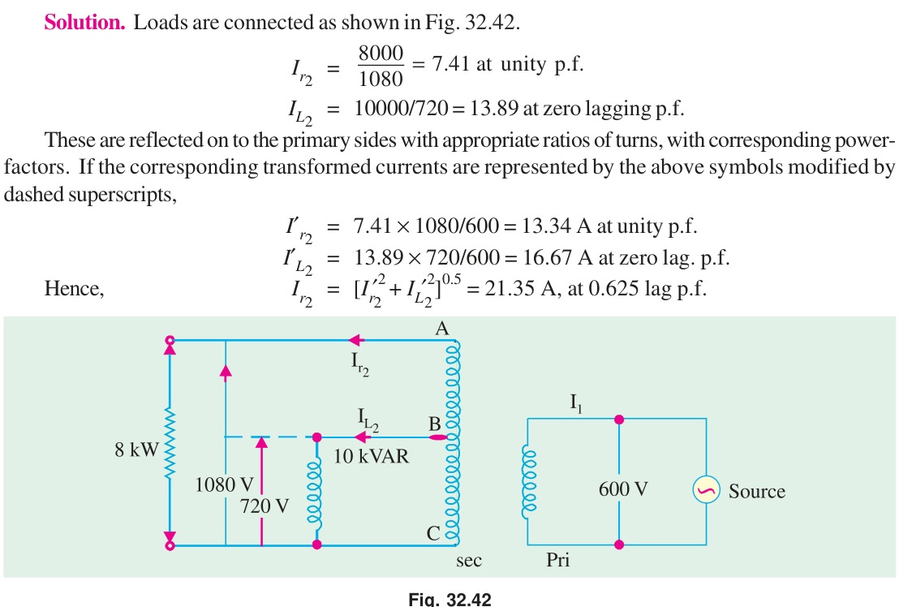

**Correlation :** Since losses and magnetizing current are ignored, the calculations for primary current and its power-factor can also be made with data pertaining to the two Loads (in $\text{kW}/\text{kVAR}$), as supplied by the $600\text{ V}$ source.

$$S = \text{Load to be supplied : } 8\text{ kW at unity p.f. and } 10\text{ kVAR lagging}$$
$$\text{Thus, } \mathbf{S} = P + jQ = 8 - j\,10\text{ kVA}$$
$$|S| = \sqrt{8^2 + 10^2} = 12.8\text{ kVA}$$
$$\mathbf{\text{Power factor}} = \cos \phi = \frac{8}{12.8} = \mathbf{0.625\text{ lag}}$$
$$\mathbf{\text{Primary current}} = \frac{12.8 \times 1000}{600} = \mathbf{21.33\text{ A}}$$
