# Chapter 32: Transformer — Part 3: Testing and Regulation

> **Source:** B.L. Theraja & A.K. Theraja, *A Textbook of Electrical Technology — Volume II (AC & DC Machines)*, Chapter 32, pp. 1145–1168.
> **Scope:** Sections 32.19 to 32.27 (Transformer Tests, Open-Circuit Test, Separation of Core Losses, Short-Circuit Test, kVA Rating, Voltage Regulation, Percentage Values, Kapp Regulation Diagram, Sumpner's Back-to-Back Test), Examples 32.27 to 32.58, Tutorial Problems 32.3.

---

<!-- Page 31 (p. 1145) -->

## 32.19. Transformer Tests

As shown in Ex. 32.25, the performance of a transformer can be calculated on the basis of its equivalent circuit which contains (Fig. 32.41) four main parameters:
1. The equivalent resistance $R_{01}$ as referred to primary (or secondary $R_{02}$),
2. The equivalent leakage reactance $X_{01}$ as referred to primary (or secondary $X_{02}$),
3. The core-loss conductance $G_0$ (or resistance $R_0$), and
4. The magnetising susceptance $B_0$ (or reactance $X_0$).

These constants or parameters can be easily determined by two tests:
1. **Open-circuit test** (or no-load test), and
2. **Short-circuit test** (or impedance test).

These tests are very economical and convenient, because they furnish the required information without actually loading the transformer. In fact, the testing of very large a.c. machinery consists of running two tests similar to the open and short-circuit tests of a transformer.

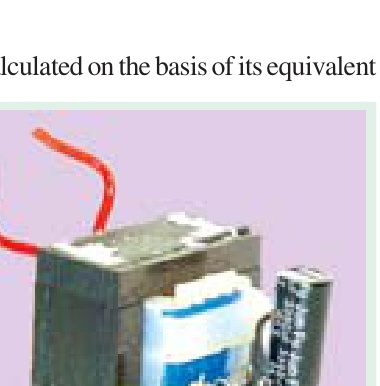

---

<!-- Page 32 (p. 1146) -->

## 32.20. Open-circuit or No-load Test

The purpose of this test is to determine no-load loss or core loss and no-load current $I_0$, which is helpful in finding $X_0$ and $R_0$.

One winding of the transformer—whichever is convenient, but usually the high-voltage winding—is left open, and the other is connected to its supply of normal voltage and frequency. A wattmeter $W$, voltmeter $V$, and an ammeter $A$ are connected in the low-voltage winding, i.e., primary winding in the present case.

With normal voltage applied to the primary, normal flux will be set up in the core, hence normal iron losses will occur which are recorded by the wattmeter. As the primary no-load current $I_0$ (as measured by ammeter) is small (usually 2 to 10% of rated load current), Cu loss is negligibly small in primary and nil in secondary (it being open). Hence, the wattmeter reading represents practically the core loss under no-load condition (and which is the same for all loads as pointed out in Art. 32.9).

> **Note:** Since $I_0$ is itself very small, the pressure coils of the wattmeter and the voltmeter are connected such that the current in them does not pass through the current coil of the wattmeter.

Sometimes, a high-resistance voltmeter is connected across the secondary. The reading of the voltmeter gives the induced e.m.f. in the secondary winding. This helps to find transformation ratio $K$.

The no-load vector diagram is shown in Fig. 32.16. If $W$ is the wattmeter reading (in Fig. 32.43), then:

$$W = V_1 I_0 \cos \phi_0 \implies \cos \phi_0 = \frac{W}{V_1 I_0}$$

$$\therefore I_\mu = I_0 \sin \phi_0, \quad I_w = I_0 \cos \phi_0$$

$$\therefore X_0 = \frac{V_1}{I_\mu} \quad \text{and} \quad R_0 = \frac{V_1}{I_w}$$

Or since the current is practically all-exciting current when a transformer is on no-load (i.e., $I_0 \cong I_\mu$) and as the voltage drop in primary leakage impedance is small, hence the exciting admittance $Y_0$ of the transformer is given by:

$$I_0 = V_1 Y_0 \implies Y_0 = \frac{I_0}{V_1}$$

The exciting conductance $G_0$ is given by:

$$W = V_1^2 G_0 \implies G_0 = \frac{W}{V_1^2}$$

The exciting susceptance:

$$B_0 = \sqrt{Y_0^2 - G_0^2}$$

---

### Example 32.27
*In a no-load test of a single-phase transformer, the following test data were obtained:*
* *Primary voltage: $220\text{ V}$*
* *Secondary voltage: $110\text{ V}$*
* *Primary current: $0.5\text{ A}$*
* *Power input: $30\text{ W}$*

*Find the following:*
1. *The turns ratio*
2. *The magnetising component of no-load current*
3. *Its working (or loss) component*
4. *The iron loss.*

*Resistance of the primary winding $= 0.6\ \Omega$. Draw the no-load phasor diagram to scale.*
*(Elect. Machines, A.M.I.E. 1990)*

#### Solution
**(i)** Turn ratio:
$$\frac{N_1}{N_2} = \frac{220}{110} = 2$$

<!-- Page 33 (p. 1147) -->

**(ii)**
$$\cos \phi_0 = \frac{W}{V_1 I_0} = \frac{30}{220 \times 0.5} = 0.273$$
$$\sin \phi_0 = \sqrt{1 - 0.273^2} = 0.962$$
$$I_\mu = I_0 \sin \phi_0 = 0.5 \times 0.962 = \mathbf{0.481\text{ A}}$$

**(iii)**
$$I_w = I_0 \cos \phi_0 = 0.5 \times 0.273 = \mathbf{0.1365\text{ A}}$$

**(iv)**
$$\text{Primary Cu loss} = I_0^2 R_1 = (0.5)^2 \times 0.6 = 0.15\text{ W}$$
$$\therefore \mathbf{\text{Iron loss}} = 30 - 0.15 = \mathbf{29.85\text{ W}}$$

---

### Example 32.28
*A $5\text{ kVA}$, $200/1000\text{ V}$, $50\text{ Hz}$, single-phase transformer gave the following test results:*
* *O.C. Test (L.V. Side): $200\text{ V}$, $1.2\text{ A}$, $90\text{ W}$*
* *S.C. Test (H.V. Side): $50\text{ V}$, $5\text{ A}$, $110\text{ W}$*

*(i) Calculate the parameters of the equivalent circuit referred to the L.V. side.*
*(ii) Calculate the output secondary voltage when delivering $3\text{ kW}$ at $0.8\text{ p.f.}$ lagging, the input primary voltage being $200\text{ V}$. Find the percentage regulation also.*
*(Nagpur University, November 1998)*

#### Solution
**(i) Shunt branch parameters from O.C. test (L.V. side):**
$$R_0 = \frac{V^2}{P_i} = \frac{200^2}{90} = \mathbf{444\ \Omega}$$
$$I_{w} = \frac{200}{444} = 0.45\text{ A}$$
$$I_\mu = \sqrt{1.2^2 - 0.45^2} = 1.11\text{ A}$$
$$X_m = \frac{200}{1.11} = \mathbf{180.2\ \Omega}$$
All these are referred to the L.V. side.

**(ii) Series-branch Parameters from S.C. test (H.V. side):**
Since the S.C. test has been conducted from the H.V. side, the parameters will refer to the H.V. side:
$$Z_{02} = \frac{V_{sc}}{I_{sc}} = \frac{50}{5} = 10\ \Omega$$
$$R_{02} = \frac{P_{sc}}{I_{sc}^2} = \frac{110}{5^2} = 4.4\ \Omega$$
$$X_{02} = \sqrt{Z_{02}^2 - R_{02}^2} = \sqrt{10^2 - 4.4^2} = 8.98\ \Omega$$

Transformation ratio:
$$K = \frac{1000}{200} = 5$$

Referred to L.V. side:
$$R_{01} = \frac{R_{02}}{K^2} = \frac{4.4}{25} = \mathbf{0.176\ \Omega}$$
$$X_{01} = \frac{X_{02}}{K^2} = \frac{8.98}{25} = \mathbf{0.359\ \Omega}$$
$$Z_{01} = \frac{10}{25} = \mathbf{0.4\ \Omega}$$

**Secondary voltage at $3\text{ kW}$, $0.8\text{ p.f.}$ lagging:**
Secondary current:
$$I_2 = \frac{3000}{V_2 \times 0.8}$$
Taking $V_2 \approx 1000\text{ V}$, $I_2 = \frac{3000}{1000 \times 0.8} = 3.75\text{ A}$.
Referred primary load current $I_2' = K I_2 = 5 \times 3.75 = 18.75\text{ A}$.

Total voltage drop referred to primary:
$$\Delta V_1 = I_2' (R_{01} \cos \phi + X_{01} \sin \phi)$$
$$= 18.75 (0.176 \times 0.8 + 0.359 \times 0.6) = 18.75 (0.1408 + 0.2154) = 6.68\text{ V}$$

$$\therefore V_1' = V_1 - \Delta V_1 = 200 - 6.68 = 193.32\text{ V}$$
$$\mathbf{V_2} = K V_1' = 5 \times 193.32 = \mathbf{966.6\text{ V}}$$

$$\mathbf{\%\text{ Regulation}} = \frac{200 - 193.32}{193.32} \times 100\% = \frac{6.68}{200} \times 100\% = \mathbf{3.34\%}$$

---

<!-- Page 34 (p. 1148) -->

## 32.21. Separation of Core Losses

The core loss $W_i$ consists of hysteresis loss $W_h$ and eddy current loss $W_e$:
$$W_i = W_h + W_e = A f + B f^2$$
where $A = \eta B_{max}^{1.6} V$ and $B = \zeta B_{max}^2 t^2 V$ are constants for a given maximum flux density $B_{max}$.

Dividing both sides by frequency $f$:
$$\frac{W_i}{f} = A + B f$$

If we plot $W_i/f$ against frequency $f$, a straight line is obtained as shown in Fig. 32.44.
* The vertical intercept gives constant $A$, from which the hysteresis loss at any frequency can be calculated: $W_h = A f$.
* The slope of the line gives constant $B$, from which the eddy current loss can be calculated: $W_e = B f^2$.

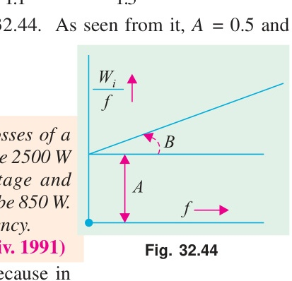

---

### Example 32.29
*In a transformer, the core loss is found to be $52\text{ W}$ at $40\text{ Hz}$ and $90\text{ W}$ at $60\text{ Hz}$ measured at the same peak flux density. Compute the hysteresis and eddy current losses at $50\text{ Hz}$.*
*(Elect. Machines, Nagpur Univ. 1993)*

#### Solution
Since the flux density is the same in both cases, we can use the relation:
$$\text{Total core loss } W_i = A f + B f^2 \implies \frac{W_i}{f} = A + B f$$

At $40\text{ Hz}$:
$$\frac{52}{40} = A + 40 B \implies 1.30 = A + 40 B \quad \text{--- (i)}$$

At $60\text{ Hz}$:
$$\frac{90}{60} = A + 60 B \implies 1.50 = A + 60 B \quad \text{--- (ii)}$$

Subtracting (i) from (ii):
$$20 B = 0.20 \implies B = 0.01$$
$$A = 1.30 - 40(0.01) = 0.90$$

At $50\text{ Hz}$:
$$\mathbf{W_h} = A f = 0.9 \times 50 = \mathbf{45\text{ W}}$$
$$\mathbf{W_e} = B f^2 = 0.01 \times 50^2 = \mathbf{25\text{ W}}$$

---

### Example 32.30
*In a power loss test on a $10\text{ kg}$ specimen of sheet steel laminations, the maximum flux density and waveform factor are maintained constant and the following results were obtained:*

| Frequency (Hz) | 25 | 40 | 50 | 60 | 80 |
|---|---|---|---|---|---|
| Total loss (watt) | 18.5 | 36 | 50 | 66 | 104 |

*Calculate the eddy current loss per kg at a frequency of $50\text{ Hz}$.*
*(Elect. Measur. A.M.I.E. Sec B, 1991)*

#### Solution
When flux density and form factor remain constant:
$$\frac{W_i}{f} = A + B f$$

Let us take two convenient points, say at $f = 25\text{ Hz}$ and $f = 80\text{ Hz}$:
At $f = 25\text{ Hz}$, $W_i/f = 18.5/25 = 0.74$.
At $f = 80\text{ Hz}$, $W_i/f = 104/80 = 1.30$.

$$0.74 = A + 25 B$$
$$1.30 = A + 80 B$$
$$55 B = 0.56 \implies B = \frac{0.56}{55} = 0.01018$$

At $50\text{ Hz}$:
$$\text{Total eddy current loss for } 10\text{ kg} = B f^2 = 0.01018 \times 50^2 = 25.45\text{ W}$$
$$\mathbf{\text{Eddy current loss per kg}} = \frac{25.45}{10} = \mathbf{2.545\text{ W/kg}}$$

---

<!-- Page 35 (p. 1149) -->

### Example 32.31
*In a test for the determination of the losses of a $440\text{ V}$, $50\text{ Hz}$ transformer, the total iron losses on no-load were found to be $2500\text{ W}$ at normal voltage and frequency. When the applied voltage and frequency were $220\text{ V}$ and $25\text{ Hz}$, the iron losses were $850\text{ W}$. Calculate the eddy current loss and hysteresis loss at normal voltage and frequency.*

#### Solution
Here:
$$\text{Ratio } \frac{V_1}{f_1} = \frac{440}{50} = 8.8, \quad \frac{V_2}{f_2} = \frac{220}{25} = 8.8$$
Since $V/f$ is constant, the maximum flux density $B_{max}$ remains constant.
Therefore:
$$W_i = A f + B f^2 \implies \frac{W_i}{f} = A + B f$$

1. At $50\text{ Hz}$:
$$\frac{2500}{50} = A + 50 B \implies 50 = A + 50 B$$

2. At $25\text{ Hz}$:
$$\frac{850}{25} = A + 25 B \implies 34 = A + 25 B$$

Subtracting:
$$25 B = 16 \implies B = \frac{16}{25} = 0.64$$
$$A = 50 - 50(0.64) = 50 - 32 = 18$$

At normal voltage and frequency ($50\text{ Hz}$):
$$\mathbf{W_h} = A f = 18 \times 50 = \mathbf{900\text{ W}}$$
$$\mathbf{W_e} = B f^2 = 0.64 \times 50^2 = \mathbf{1600\text{ W}}$$

---

### Example 32.32
*When a transformer is connected to a $1000\text{-V}$, $50\text{-Hz}$ supply the core loss is $1000\text{ W}$, of which $650\text{ W}$ is hysteresis and $350\text{ W}$ is eddy current loss. If the applied voltage is raised to $2000\text{ V}$ and the frequency to $100\text{ Hz}$, find the new core losses.*

#### Solution
$$W_h \propto B_{max}^{1.6} f = P B_{max}^{1.6} f$$
$$W_e \propto B_{max}^2 f^2 = Q B_{max}^2 f^2$$

From the e.m.f. equation, $E \approx 4.44 f N B_{max} A \implies B_{max} \propto \frac{E}{f}$.
Substituting this in the loss equations:
$$W_h = P \left(\frac{E}{f}
ight)^{1.6} f = P E^{1.6} f^{-0.6}$$
$$W_e = Q \left(\frac{E}{f}
ight)^2 f^2 = Q E^2$$

In the first case: $E_1 = 1000\text{ V}$, $f_1 = 50\text{ Hz}$, $W_{h1} = 650\text{ W}$, $W_{e1} = 350\text{ W}$.
$$650 = P \times 1000^{1.6} \times 50^{-0.6} \implies P = 650 \times 1000^{-1.6} \times 50^{0.6}$$
$$350 = Q \times 1000^2 \implies Q = 350 \times 1000^{-2}$$

In the second case: $E_2 = 2000\text{ V}$, $f_2 = 100\text{ Hz}$.
$$W_{h2} = \left(650 \times 1000^{-1.6} \times 50^{0.6}
ight) \times 2000^{1.6} \times 100^{-0.6}$$
$$= 650 \times \left(\frac{2000}{1000}
ight)^{1.6} \times \left(\frac{100}{50}
ight)^{-0.6} = 650 \times 2^{1.6} \times 2^{-0.6} = 650 \times 2^1 = \mathbf{1300\text{ W}}$$

$$W_{e2} = \left(350 \times 1000^{-2}
ight) \times 2000^2 = 350 \times 2^2 = \mathbf{1400\text{ W}}$$

$$\mathbf{\text{Core loss under new condition}} = 1300 + 1400 = \mathbf{2700\text{ W}}$$

---

<!-- Page 36 (p. 1150) -->

### Example 32.33
*A transformer with normal voltage impressed has a flux density of $1.4\text{ Wb/m}^2$ and a core loss comprising $1000\text{ W}$ eddy current loss and $3000\text{ W}$ hysteresis loss. What do these losses become under the following conditions?*
*(a) Voltage increased by 10% and frequency increased by 10%*
*(b) Voltage increased by 10% and frequency decreased by 10%*
*(c) Voltage decreased by 10% and frequency constant*

#### Solution
From the previous derivations:
$$W_h = P E^{1.6} f^{-0.6} \quad \text{--- (i)}$$
$$W_e = Q E^2 \quad \text{--- (ii)}$$

**(a) Voltage and frequency both increased by 10%:**
$$E_2 = 1.1 E_1, \quad f_2 = 1.1 f_1$$
$$W_{h2} = P (1.1 E_1)^{1.6} (1.1 f_1)^{-0.6} = 3000 \times 1.1^{1.6 - 0.6} = 3000 \times 1.1 = \mathbf{3300\text{ W}}$$
$$W_{e2} = Q (1.1 E_1)^2 = 1000 \times 1.1^2 = \mathbf{1210\text{ W}}$$
$$\text{Total core loss} = 3300 + 1210 = \mathbf{4510\text{ W}}$$

**(b) Voltage increased by 10%, frequency decreased by 10%:**
$$E_2 = 1.1 E_1, \quad f_2 = 0.9 f_1$$
$$W_{h2} = 3000 \times (1.1)^{1.6} \times (0.9)^{-0.6} = 3000 \times 1.1648 \times 1.0654 = \mathbf{3722\text{ W}}$$
$$W_{e2} = 1000 \times (1.1)^2 = \mathbf{1210\text{ W}}$$
$$\text{Total core loss} = 3722 + 1210 = \mathbf{4932\text{ W}}$$

**(c) Voltage decreased by 10%, frequency unchanged:**
$$E_2 = 0.9 E_1, \quad f_2 = f_1$$
$$W_{h2} = 3000 \times (0.9)^{1.6} = 3000 \times 0.8449 = \mathbf{2535\text{ W}}$$
$$W_{e2} = 1000 \times (0.9)^2 = \mathbf{810\text{ W}}$$
$$\text{Total core loss} = 2535 + 810 = \mathbf{3345\text{ W}}$$

---

### Example 32.34
*A transformer is connected to $2200\text{ V}$, $40\text{ Hz}$ supply. The core-loss is $800\text{ watts}$ out of which $600\text{ watts}$ are due to hysteresis and the remaining, eddy current losses. Determine the core-loss if the supply voltage and frequency are $3300\text{ V}$ and $60\text{ Hz}$ respectively.*
*(Bharathiar Univ. Nov. 1997)*

#### Solution
Check the $V/f$ ratio:
$$\frac{V_1}{f_1} = \frac{2200}{40} = 55, \quad \frac{V_2}{f_2} = \frac{3300}{60} = 55$$
Since $V/f$ is constant, the maximum flux density $B_{max}$ remains constant.

Therefore:
$$W_h \propto f \implies W_{h2} = W_{h1} \times \frac{f_2}{f_1} = 600 \times \frac{60}{40} = \mathbf{900\text{ W}}$$
$$W_e \propto f^2 \implies W_{e2} = W_{e1} \times \left(\frac{f_2}{f_1}
ight)^2 = 200 \times \left(\frac{60}{40}
ight)^2 = 200 \times 2.25 = \mathbf{450\text{ W}}$$

$$\mathbf{\text{New core loss}} = W_{h2} + W_{e2} = 900 + 450 = \mathbf{1350\text{ W}}$$

---

<!-- Page 37 (p. 1151) -->

## 32.22. Short-Circuit or Impedance Test

This is an economical method for determining:
1. Equivalent impedance ($Z_{01}$ or $Z_{02}$), leakage reactance ($X_{01}$ or $X_{02}$), and total resistance ($R_{01}$ or $R_{02}$) of the transformer as referred to the winding in which the measuring instruments are placed.
2. Cu loss at full load (and at any desired load). This is used for calculating efficiency.
3. Knowing $Z_{01}$ (or $Z_{02}$), the total voltage drop in the transformer as referred to primary (or secondary) can be calculated and hence regulation determined.

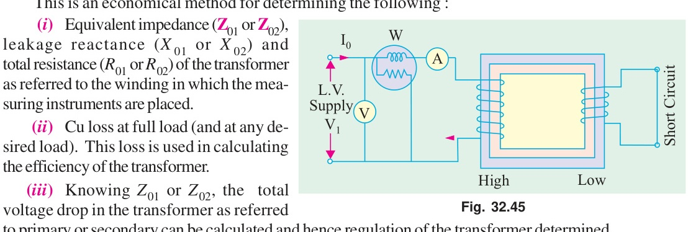

In this test, one winding, usually the low-voltage winding, is solidly short-circuited by a thick conductor (or through an ammeter which may serve the additional purpose of indicating rated full-load current).

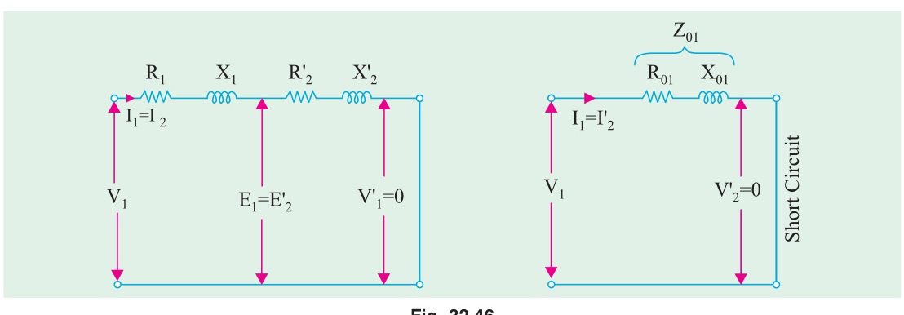
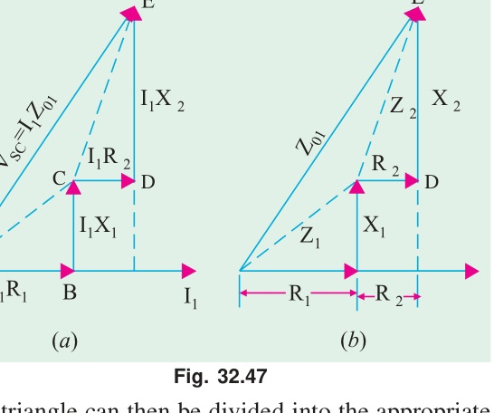

A low voltage (usually 5 to 10% of normal primary voltage) at correct frequency is applied to the primary and is cautiously increased till full-load currents are flowing both in primary and secondary (as indicated by the respective ammeters).

Since, in this test, the applied voltage is a small percentage of the normal voltage, the mutual flux $\Phi$ produced is also a small percentage of its normal value. Hence, core losses are very small with the result that the wattmeter reading represents the full-load Cu loss or $I^2 R$ loss for the whole transformer:

$$W = I_1^2 R_{01}$$

From the test readings $V_{sc}$, $I_1$, and $W$:
$$Z_{01} = \frac{V_{sc}}{I_1}$$
$$R_{01} = \frac{W}{I_1^2}$$
$$X_{01} = \sqrt{Z_{01}^2 - R_{01}^2}$$
$$\text{Short-circuit power factor, } \cos \phi_{sc} = \frac{R_{01}}{Z_{01}} = \frac{W}{V_{sc} I_1}$$

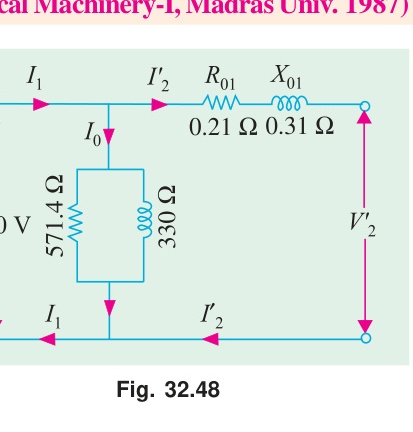

---

<!-- Page 38 (p. 1152) -->

## 32.23. Why Transformer Rating in kVA?

As seen, Cu loss of a transformer depends on current and iron loss on voltage. Hence, total transformer loss depends on volt-ampere (VA) and not on phase angle between voltage and current, i.e., it is independent of load power factor. That is why rating of transformers is in kVA and not in kW.

---

### Example 32.35
*The primary and secondary windings of a $30\text{ kVA}$, $6000/230\text{ V}$, 1-phase transformer have resistances of $10\ \Omega$ and $0.016\ \Omega$ respectively. The leakage reactances of these windings are $17\ \Omega$ and $0.027\ \Omega$ respectively. Find the values of:*
*(i) equivalent resistance, reactance and impedance referred to primary,*
*(ii) the supply voltage required to circulate full-load current on short-circuit, and*
*(iii) the short-circuit power factor.*

#### Solution
Transformation ratio:
$$K = \frac{230}{6000}$$

Equivalent resistance referred to primary:
$$R_{01} = R_1 + \frac{R_2}{K^2} = 10 + \frac{0.016}{(230/6000)^2} = 10 + 10.9 = \mathbf{20.9\ \Omega}$$

Equivalent reactance referred to primary:
$$X_{01} = X_1 + \frac{X_2}{K^2} = 17 + \frac{0.027}{(230/6000)^2} = 17 + 18.4 = \mathbf{35.4\ \Omega}$$

Equivalent impedance referred to primary:
$$Z_{01} = \sqrt{R_{01}^2 + X_{01}^2} = \sqrt{20.9^2 + 35.4^2} = \mathbf{41.1\ \Omega}$$

Full-load primary current:
$$I_1 = \frac{30000}{6000} = 5\text{ A}$$

Supply voltage required to circulate full-load short-circuit current:
$$V_{sc} = I_1 Z_{01} = 5 \times 41.1 = \mathbf{205.5\text{ V}}$$

Short-circuit power factor:
$$\cos \phi_{sc} = \frac{R_{01}}{Z_{01}} = \frac{20.9}{41.1} = \mathbf{0.508}$$

---

### Example 32.36
*Obtain the equivalent circuit of a $200/400\text{-V}$, $50\text{-Hz}$, 1-phase transformer from the following test data:*
* *O.C. test: $200\text{ V}$, $0.7\text{ A}$, $70\text{ W}$ – on L.V. side*
* *S.C. test: $15\text{ V}$, $10\text{ A}$, $85\text{ W}$ – on H.V. side*

*Calculate the secondary voltage when delivering $5\text{ kW}$ at $0.8\text{ p.f.}$ lagging, the primary voltage being $200\text{ V}$.*
*(Electrical Machinery-I, Madras Univ. 1987)*

#### Solution
**From O.C. Test (L.V. side = Primary side):**
$$V_1 I_0 \cos \phi_0 = W_0 \implies 200 \times 0.7 \times \cos \phi_0 = 70$$
$$\cos \phi_0 = \frac{70}{140} = 0.5 \implies \sin \phi_0 = 0.866$$
$$I_w = I_0 \cos \phi_0 = 0.7 \times 0.5 = 0.35\text{ A}$$
$$I_\mu = I_0 \sin \phi_0 = 0.7 \times 0.866 = 0.606\text{ A}$$
$$R_0 = \frac{V_1}{I_w} = \frac{200}{0.35} = \mathbf{571.4\ \Omega}$$
$$X_0 = \frac{V_1}{I_\mu} = \frac{200}{0.606} = \mathbf{330\ \Omega}$$

<!-- Page 39 (p. 1153) -->

**From S.C. Test (H.V. side = Secondary side):**
$$Z_{02} = \frac{V_{sc}}{I_{sc}} = \frac{15}{10} = 1.5\ \Omega$$
$$R_{02} = \frac{W_{sc}}{I_{sc}^2} = \frac{85}{10^2} = 0.85\ \Omega$$
$$X_{02} = \sqrt{Z_{02}^2 - R_{02}^2} = \sqrt{1.5^2 - 0.85^2} = 1.24\ \Omega$$

Transformation ratio $K = 400/200 = 2$.
Referred to primary:
$$R_{01} = \frac{R_{02}}{K^2} = \frac{0.85}{4} = \mathbf{0.21\ \Omega}$$
$$X_{01} = \frac{X_{02}}{K^2} = \frac{1.24}{4} = \mathbf{0.31\ \Omega}$$

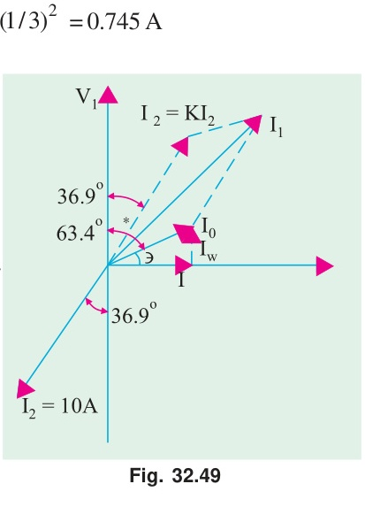
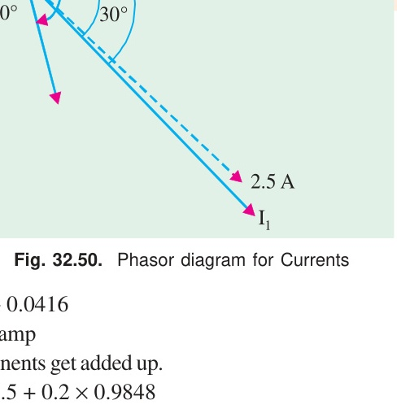

**Secondary voltage calculation:**
Load $P = 5000\text{ W}$ at $\cos \phi = 0.8$ lag.
$$I_2 \approx \frac{5000}{400 \times 0.8} = 15.625\text{ A}$$
Total voltage drop referred to secondary:
$$I_2 (R_{02} \cos \phi + X_{02} \sin \phi) = 15.625 (0.85 \times 0.8 + 1.24 \times 0.6) = 15.625 (0.68 + 0.744) = 22.25\text{ V}$$
$$\mathbf{V_2} = 400 - 22.25 = \mathbf{377.75\text{ V}}$$

---

<!-- Page 40 (p. 1154) -->

### Example 32.37
*Starting from the ideal transformer, obtain the approximate equivalent circuit of a given single phase transformer.*
*A $50\text{ kVA}$, $4400/220\text{-V}$ transformer has $R_1 = 3.45\ \Omega$, $R_2 = 0.009\ \Omega$. The reactances are $X_1 = 5.2\ \Omega$ and $X_2 = 0.015\ \Omega$. Calculate for the transformer:*
*(a) Equivalent resistance, reactance and impedance referred to primary*
*(b) Total Cu loss on full load*
*(c) What will be the read value of voltage on S.C. test with full-load current?*

#### Solution
Transformation ratio $K = 220/4400 = 1/20$.

**(a)**
$$R_{01} = R_1 + \frac{R_2}{K^2} = 3.45 + 0.009 \times 400 = 3.45 + 3.60 = \mathbf{7.05\ \Omega}$$
$$X_{01} = X_1 + \frac{X_2}{K^2} = 5.2 + 0.015 \times 400 = 5.2 + 6.0 = \mathbf{11.2\ \Omega}$$
$$Z_{01} = \sqrt{7.05^2 + 11.2^2} = \mathbf{13.23\ \Omega}$$

**(b)** Full-load primary current:
$$I_1 = \frac{50000}{4400} = 11.36\text{ A}$$
$$\mathbf{\text{Total Cu loss}} = I_1^2 R_{01} = (11.36)^2 \times 7.05 = \mathbf{910\text{ W}}$$

**(c)**
$$\mathbf{V_{sc}} = I_1 Z_{01} = 11.36 \times 13.23 = \mathbf{150.3\text{ V}}$$

---

### Example 32.38
*A 1-phase, $10\text{-kVA}$, $500/250\text{-V}$, $50\text{-Hz}$ transformer has the following constants:*
* *Reactance: primary $0.2\ \Omega$; secondary $0.05\ \Omega$*
* *Resistance: primary $0.4\ \Omega$; secondary $0.1\ \Omega$*
* *Resistance of equivalent exciting circuit referred to primary, $R_0 = 1500\ \Omega$*
* *Reactance of equivalent exciting circuit referred to primary, $X_0 = 750\ \Omega$*

*What would be the reading of the instruments when the transformer is connected for the open-circuit and short-circuit tests?*

#### Solution
**Open-circuit test (on L.V. side, $250\text{ V}$):**
Here, constants are given referred to primary ($500\text{ V}$).
Referred to secondary (L.V.):
$$R_{0}' = R_0 \times K^2 = 1500 \times (250/500)^2 = 375\ \Omega$$
$$X_{0}' = X_0 \times K^2 = 750 \times (1/4) = 187.5\ \Omega$$

$$\text{Voltmeter reading} = \mathbf{250\text{ V}}$$
$$I_w = \frac{250}{375} = 0.67\text{ A}, \quad I_\mu = \frac{250}{187.5} = 1.33\text{ A}$$
$$\text{Ammeter reading } I_0 = \sqrt{0.67^2 + 1.33^2} = \mathbf{1.49\text{ A}}$$
$$\text{Wattmeter reading} = \frac{V^2}{R_0'} = \frac{250^2}{375} = \mathbf{166.7\text{ W}}$$

**Short-circuit test (instruments on H.V. side, $500\text{ V}$):**
$$K = 250/500 = 1/2$$
$$R_{01} = R_1 + \frac{R_2}{K^2} = 0.4 + 0.1 \times 4 = 0.8\ \Omega$$
$$X_{01} = X_1 + \frac{X_2}{K^2} = 0.2 + 0.05 \times 4 = 0.4\ \Omega$$
$$Z_{01} = \sqrt{0.8^2 + 0.4^2} = 0.894\ \Omega$$

Rated full-load primary current:
$$\text{Ammeter reading } I_1 = \frac{10000}{500} = \mathbf{20\text{ A}}$$
$$\text{Voltmeter reading } V_{sc} = I_1 Z_{01} = 20 \times 0.894 = \mathbf{17.88\text{ V}}$$
$$\text{Wattmeter reading } W_{sc} = I_1^2 R_{01} = 20^2 \times 0.8 = \mathbf{320\text{ W}}$$

---

<!-- Page 41 (p. 1155) -->

### Example 32.39
*The efficiency of a $1000\text{-kVA}$, $110/220\text{ V}$, $50\text{-Hz}$, single-phase transformer is 98.5% at half full-load at $0.8\text{ p.f.}$ lagging and 98.8% at full-load at unity power factor. Determine:*
*(i) Iron loss*
*(ii) Full-load copper loss*
*(iii) Maximum efficiency at unity power factor*

#### Solution
Let full-load copper loss be $P_c$ and iron loss be $P_i$.

**Condition 1: Full-load, unity p.f.:**
$$\text{Output} = 1000 \times 1 = 1000\text{ kW}$$
$$\eta = 0.988 \implies \text{Total losses} = 1000 \left(\frac{1}{0.988} - 1
ight) = 12.146\text{ kW}$$
$$P_c + P_i = 12.146 \quad \text{--- (i)}$$

**Condition 2: Half full-load, $0.8\text{ p.f.}$:**
$$\text{Output} = 500 \times 0.8 = 400\text{ kW}$$
$$\eta = 0.985 \implies \text{Total losses} = 400 \left(\frac{1}{0.985} - 1
ight) = 6.091\text{ kW}$$
$$\frac{P_c}{4} + P_i = 6.091 \quad \text{--- (ii)}$$

Subtracting (ii) from (i):
$$\frac{3}{4} P_c = 12.146 - 6.091 = 6.055 \implies \mathbf{P_c = 8.073\text{ kW}}$$
$$\mathbf{P_i} = 12.146 - 8.073 = \mathbf{4.073\text{ kW}}$$

**(iii) Maximum efficiency at unity p.f.:**
Load for maximum efficiency:
$$S_{max} = 1000 \times \sqrt{\frac{P_i}{P_c}} = 1000 \times \sqrt{\frac{4.073}{8.073}} = 710.3\text{ kVA}$$
$$\text{Output at u.p.f.} = 710.3\text{ kW}$$
$$\text{Total losses} = 2 P_i = 2 \times 4.073 = 8.146\text{ kW}$$
$$\mathbf{\eta_{max}} = \frac{710.3}{710.3 + 8.146} \times 100\% = \mathbf{98.87\%}$$

---

### Example 32.40
*The equivalent circuit for a $200/400\text{-V}$ step-up transformer has the following parameters referred to the low-voltage side:*
* *Equivalent resistance $= 0.15\ \Omega$*
* *Equivalent reactance $= 0.37\ \Omega$*
* *Core-loss component resistance $= 600\ \Omega$*
* *Magnetising reactance $= 300\ \Omega$*

*When the transformer is supplying a load at $10\text{ A}$ at a power factor of $0.8\text{ lag}$, calculate (i) the primary current (ii) secondary terminal voltage.*
*(Electrical Machinery-I, Bangalore Univ. 1989)*

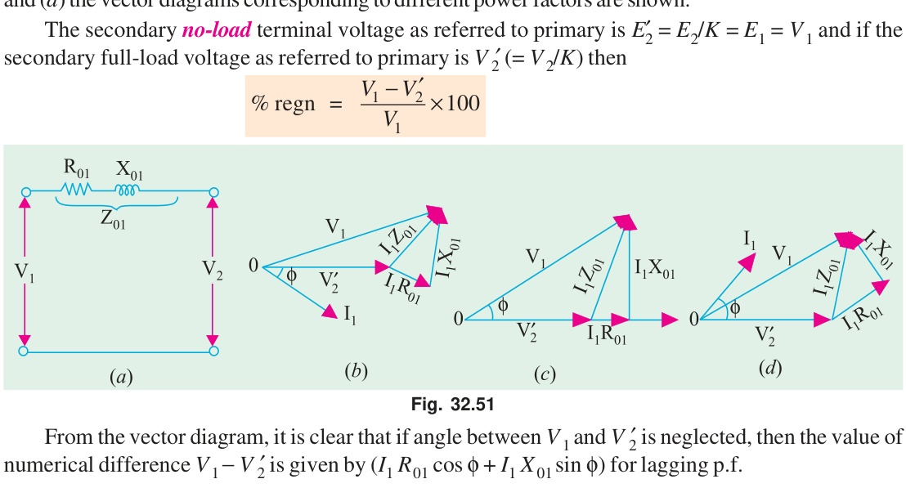

#### Solution
Given: $R_{01} = 0.15\ \Omega$, $X_{01} = 0.37\ \Omega$, $R_0 = 600\ \Omega$, $X_0 = 300\ \Omega$, $K = 400/200 = 2$.
Secondary load current $I_2 = 10\text{ A}$ at $\cos \phi_2 = 0.8$ lagging ($\sin \phi_2 = 0.6$).

Secondary current referred to primary:
$$I_2' = K I_2 = 2 \times 10 = 20\text{ A}$$
In complex form (taking $V_1$ as reference):
$$\mathbf{I_2'} = 20 (0.8 - j 0.6) = 16 - j 12\text{ A}$$

No-load exciting current:
$$I_w = \frac{V_1}{R_0} = \frac{200}{600} = 0.333\text{ A}$$
$$I_\mu = \frac{V_1}{X_0} = \frac{200}{300} = 0.667\text{ A}$$
$$\mathbf{I_0} = 0.333 - j 0.667\text{ A}$$

**(i) Primary current:**
$$\mathbf{I_1} = \mathbf{I_0} + \mathbf{I_2'} = (0.333 - j 0.667) + (16 - j 12) = 16.333 - j 12.667\text{ A}$$
$$I_1 = \sqrt{(16.333)^2 + (12.667)^2} = \mathbf{20.67\text{ A}}$$
$$\text{Primary p.f.} = \cos \phi_1 = \frac{16.333}{20.67} = \mathbf{0.79\text{ lag}}$$

**(ii) Secondary terminal voltage:**
Voltage drop referred to primary:
$$\Delta V_1 = I_2' (R_{01} \cos \phi_2 + X_{01} \sin \phi_2) = 20 (0.15 \times 0.8 + 0.37 \times 0.6) = 20 (0.12 + 0.222) = 6.84\text{ V}$$
$$V_2' = V_1 - \Delta V_1 = 200 - 6.84 = 193.16\text{ V}$$
$$\mathbf{V_2} = K V_2' = 2 \times 193.16 = \mathbf{386.32\text{ V}}$$

---

<!-- Page 42 (p. 1156) -->

### Example 32.41
*The low-voltage winding of a $300\text{-kVA}$, $11000/2500\text{-V}$, $50\text{-Hz}$ transformer has a resistance of $0.06\ \Omega$ and a reactance of $0.39\ \Omega$. The high-voltage winding has a resistance of $1.6\ \Omega$ and a reactance of $10.5\ \Omega$. Find:*
*(a) Equivalent resistance, reactance and impedance referred to high-voltage side*
*(b) Equivalent resistance, reactance and impedance referred to low-voltage side*

#### Solution
Transformation ratio:
$$K = \frac{2500}{11000} = \frac{5}{22}$$

**(a) Referred to H.V. (Primary) side:**
$$R_{01} = R_1 + \frac{R_2}{K^2} = 1.6 + \frac{0.06}{(5/22)^2} = 1.6 + 1.16 = \mathbf{2.76\ \Omega}$$
$$X_{01} = X_1 + \frac{X_2}{K^2} = 10.5 + \frac{0.39}{(5/22)^2} = 10.5 + 7.55 = \mathbf{18.05\ \Omega}$$
$$Z_{01} = \sqrt{2.76^2 + 18.05^2} = \mathbf{18.26\ \Omega}$$

**(b) Referred to L.V. (Secondary) side:**
$$R_{02} = K^2 R_{01} = \left(\frac{5}{22}
ight)^2 \times 2.76 = \mathbf{0.143\ \Omega}$$
$$X_{02} = K^2 X_{01} = \left(\frac{5}{22}
ight)^2 \times 18.05 = \mathbf{0.932\ \Omega}$$
$$Z_{02} = K^2 Z_{01} = \left(\frac{5}{22}
ight)^2 \times 18.26 = \mathbf{0.943\ \Omega}$$

---

### Example 32.42
*A $230/115\text{ volts}$, single phase transformer is supplying a load of $5\text{ Amps}$, at power factor $0.866\text{ lagging}$. The no-load current is $0.2\text{ Amps}$ at power factor $0.208\text{ lagging}$. Calculate the primary current and primary power factor.*
*(Nagpur University Summer 2000)*

#### Solution
Transformation ratio $K = 115/230 = 0.5$.
Load current referred to primary:
$$I_2' = K I_2 = 0.5 \times 5 = 2.5\text{ A at } \cos \phi_2 = 0.866\text{ lag } (\phi_2 = 30^\circ)$$

No-load current:
$$I_0 = 0.2\text{ A at } \cos \phi_0 = 0.208\text{ lag } (\phi_0 = 78^\circ)$$

Resolving into in-phase (active) and quadrature (reactive) components:
$$I_{1x} = I_2' \cos \phi_2 + I_0 \cos \phi_0 = 2.5 \times 0.866 + 0.2 \times 0.208 = 2.165 + 0.0416 = 2.2066\text{ A}$$
$$I_{1y} = I_2' \sin \phi_2 + I_0 \sin \phi_0 = 2.5 \times 0.5 + 0.2 \times \sin(78^\circ) = 1.25 + 0.2 \times 0.978 = 1.25 + 0.1956 = 1.4456\text{ A}$$

$$\mathbf{I_1} = \sqrt{(2.2066)^2 + (1.4456)^2} = \sqrt{4.869 + 2.089} = \mathbf{2.64\text{ A}}$$
$$\mathbf{\cos \phi_1} = \frac{I_{1x}}{I_1} = \frac{2.2066}{2.64} = \mathbf{0.836\text{ lag}}$$

---

## Tutorial Problems 32.3

1. **The S.C. test on a 1-phase transformer**, with the primary winding short-circuited and $30\text{ V}$ applied to the secondary gave a wattmeter reading of $60\text{ W}$ and secondary current of $10\text{ A}$. If the normal applied primary voltage is $200$, the transformation ratio $1:2$ and the full-load secondary current $10\text{ A}$, calculate the secondary terminal p.d. at full-load current for (a) unity power factor (b) power factor $0.8\text{ lagging}$. If any approximations are made, they must be explained.  
   **[Answer: $394\text{ V}$, $377.6\text{ V}$]**

2. **A single-phase transformer** has a turn ratio of 6, the resistances of the primary and secondary windings are $0.9\ \Omega$ and $0.025\ \Omega$ respectively and the leakage reactances of these windings are $5.4\ \Omega$ and $0.15\ \Omega$ respectively. Determine the voltage to be applied to the low-voltage winding to obtain a current of $100\text{ A}$ in the short-circuited high voltage winding. Ignore the magnetising current.  
   **[Answer: $82\text{ V}$]**

3. **Draw the equivalent circuit** for a $3000/400\text{-V}$, 1-phase transformer on which the following test results were obtained. Input to high voltage winding when l.v. winding is open-circuited: $3000\text{ V}$, $0.5\text{ A}$, $500\text{ W}$. Input to l.v. winding when h.v. winding is short-circuited: $11\text{ V}$, $100\text{ A}$, $500\text{ W}$. Insert the appropriate values of resistance and reactance.  
   *(I.E.E. London)*  
   **[Answer: $R_0 = 18000\ \Omega$, $X_0 = 6360\ \Omega$, $R_{01} = 2.81\ \Omega$, $X_{01} = 5.51\ \Omega$]**

4. **The iron loss in a transformer core** at normal flux density was measured at frequencies of $30$ and $50\text{ Hz}$, the results being $30\text{ W}$ and $54\text{ W}$ respectively. Calculate (a) the hysteresis loss and (b) the eddy current loss at $50\text{ Hz}$.  
   **[Answer: $44\text{ W}$, $10\text{ W}$]**

5. **An iron core was magnetised** by passing an alternating current through a winding on it. The power required for a certain value of maximum flux density was measured at a number of different frequencies. Neglecting the effect of resistance of the winding, the power required per kg of iron was $0.8\text{ W}$ at $25\text{ Hz}$ and $2.04\text{ W}$ at $60\text{ Hz}$. Estimate the power needed per kg when the iron is subject to the same maximum flux density but the frequency is $100\text{ Hz}$.  
   **[Answer: $3.63\text{ W}$]**

6. **The ratio of turns of a 1-phase transformer** is 8, the resistances of the primary and secondary windings are $0.85\ \Omega$ and $0.012\ \Omega$ respectively and leakage reactances of these windings are $4.8\ \Omega$ and $0.07\ \Omega$ respectively. Determine the voltage to be applied to the primary to obtain a current of $150\text{ A}$ in the secondary circuit when the secondary terminals are short-circuited. Ignore the magnetising current.  
   **[Answer: $176.4\text{ V}$]**

7. **A transformer has no-load losses** of $55\text{ W}$ with a primary voltage of $250\text{ V}$ at $50\text{ Hz}$ and $41\text{ W}$ with a primary voltage of $200\text{ V}$ at $40\text{ Hz}$. Compute the hysteresis and eddy current losses at a primary voltage of $300\text{ volts}$ at $60\text{ Hz}$ of the above transformer. Neglect small amount of copper loss at no-load.  
   *(Elect. Machines AMIE Sec. B Summer 1992)*  
   **[Answer: $43.5\text{ W}$; $27\text{ W}$]**

8. **A $20\text{ kVA}$, $2500/250\text{ V}$, $50\text{ Hz}$, 1-phase transformer** has the following test results:  
   * O.C. Test (l.v. side): $250\text{ V}$, $1.4\text{ A}$, $105\text{ W}$  
   * S.C. Test (h.v. side): $104\text{ V}$, $8\text{ A}$, $320\text{ W}$  
   Compute the parameters of the approximate equivalent circuit referred to the low voltage side and draw the circuit.  
   *(Elect. Machines A.M.I.E. Sec. B Summer 1990)*  
   **[Answer: $R_0 = 592.5\ \Omega$; $X_0 = 187.2\ \Omega$; $R_{02} = 1.25\ \Omega$; $X_{02} = 3\ \Omega$]**

9. **A $10\text{-kVA}$, $2000/400\text{-V}$, single-phase transformer** has resistances and leakage reactances as follows:  
   $R_1 = 5.2\ \Omega$, $X_1 = 12.5\ \Omega$, $R_2 = 0.2\ \Omega$, $X_2 = 0.5\ \Omega$.  
   Determine the value of secondary terminal voltage when the transformer is operating with rated primary voltage with the secondary current at its rated value with power factor $0.8\text{ lag}$. The no-load current can be neglected. Draw the phasor diagram.  
   *(Elect. Machines, A.M.I.E. Sec B, 1989)*  
   **[Answer: $376.8\text{ V}$]**

10. **A $1000\text{-V}$, $50\text{-Hz}$ supply** to a transformer results in $650\text{ W}$ hysteresis loss and $400\text{ W}$ eddy current loss. If both the applied voltage and frequency are doubled, find the new core losses.  
    *(Elect. Machine, A.M.I.E. Sec. B, 1993)*  
    **[Answer: $W_h = 1300\text{ W}$; $W_e = 1600\text{ W}$]**

11. **A $50\text{ kVA}$, $2200/110\text{ V}$ transformer** when tested gave the following results:  
    * O.C. test (L.V. side): $400\text{ W}$, $10\text{ A}$, $110\text{ V}$  
    * S.C. test (H.V. side): $808\text{ W}$, $20.5\text{ A}$, $90\text{ V}$  
    Compute all the parameters of the equivalent circuit referred to the H.V. side and draw the resultant circuit.  
    *(Rajiv Gandhi Technical University, Bhopal 2000)*  
    **[Answer: Shunt branch: $R_0 = 12.1\text{ k}\Omega$, $X_m = 4.724\text{ k}\Omega$; Series branch: $R_{01} = 1.923\ \Omega$, $X_{01} = 4.39\ \Omega$]**

---

<!-- Page 43 (p. 1157) -->

## 32.24. Regulation of a Transformer

When a transformer is loaded with a constant primary voltage, the secondary terminal voltage decreases (for lagging power factor) or increases (for leading power factor) because of its internal resistance and leakage reactance.

Let:
* $_0V_2 = E_2 = K V_1 =$ secondary terminal voltage on no-load
* $V_2 =$ secondary terminal voltage on full-load

The change in secondary terminal voltage from no-load to full-load is $_0V_2 - V_2$.
* This change divided by $_0V_2$ is known as **regulation 'down'**:
$$\%\text{ regn 'down'} = \frac{_0V_2 - V_2}{_0V_2} \times 100$$
* If this change is divided by $V_2$, i.e., full-load secondary terminal voltage, it is called **regulation 'up'**:
$$\%\text{ regn 'up'} = \frac{_0V_2 - V_2}{V_2} \times 100$$

In further treatment, unless stated otherwise, regulation is taken as **regulation 'down'**.

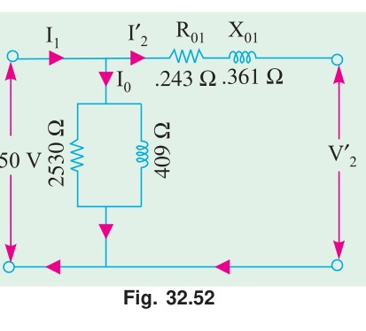

From the phasor diagram (Fig. 32.52):
$$\text{Total drop referred to secondary } = I_2 R_{02} \cos \phi \pm I_2 X_{02} \sin \phi$$
expressed as a percentage of no-load secondary voltage:

$$\mathbf{\%\text{ regn} = v_r \cos \phi \pm v_x \sin \phi} \quad \text{(approximately)}$$

where:
* $v_r = \frac{I_2 R_{02}}{_0V_2} \times 100 = \text{percentage resistive drop}$
* $v_x = \frac{I_2 X_{02}}{_0V_2} \times 100 = \text{percentage reactive drop}$
* The **$+$ sign** is for **lagging power factor**.
* The **$-$ sign** is for **leading power factor**.

Or more accurately:
$$\%\text{ regn} = (v_r \cos \phi \pm v_x \sin \phi) + \frac{1}{200} (v_x \cos \phi \mp v_r \sin \phi)^2$$

<!-- Page 44 (p. 1158) -->

The lesser this value, the better the transformer, because a good transformer should keep its terminal voltage as nearly constant as possible under all conditions of load.

**Primary Voltage Regulation:**
As the transformer is loaded, the secondary terminal voltage falls (for a lagging p.f.). Hence, to keep the output voltage constant, the primary voltage must be increased. The rise in primary voltage required to maintain rated output voltage from no-load to full-load at a given power factor expressed as percentage of rated primary voltage gives the regulation:

$$\%\text{ regn} = \frac{V_1' - V_1}{V_1} \times 100$$

---

### Example 32.43
*A $100\text{-kVA}$ transformer has $400\text{ turns}$ on the primary and $80\text{ turns}$ on the secondary. The primary and secondary resistances are $0.3\ \Omega$ and $0.01\ \Omega$ respectively and the corresponding leakage reactances are $1.1\ \Omega$ and $0.035\ \Omega$ respectively. The supply voltage is $2200\text{ V}$. Calculate:*
*(i) Equivalent impedance referred to primary*
*(ii) The voltage regulation and the secondary terminal voltage for full load having a power factor of $0.8\text{ leading}$.*
*(Elect. Machines, A.M.I.E. Sec. B, 1993)*

#### Solution
Transformation ratio:
$$K = \frac{N_2}{N_1} = \frac{80}{400} = \frac{1}{5}$$

**(i) Equivalent impedance referred to primary:**
$$R_{01} = R_1 + \frac{R_2}{K^2} = 0.3 + 0.01 \times 25 = 0.3 + 0.25 = 0.55\ \Omega$$
$$X_{01} = X_1 + \frac{X_2}{K^2} = 1.1 + 0.035 \times 25 = 1.1 + 0.875 = 1.975\ \Omega$$
$$\mathbf{Z_{01}} = \sqrt{0.55^2 + 1.975^2} = \mathbf{2.05\ \Omega}$$

**(ii) Voltage regulation for full load at $0.8\text{ lead}$:**
Full-load primary current:
$$I_1 = \frac{100 \times 1000}{2200} = 45.45\text{ A}$$

Voltage drop referred to primary:
$$\Delta V_1 = I_1 (R_{01} \cos \phi - X_{01} \sin \phi)$$
$$= 45.45 (0.55 \times 0.8 - 1.975 \times 0.6) = 45.45 (0.44 - 1.185) = 45.45 (-0.745) = -33.86\text{ V}$$

$$\mathbf{\%\text{ Regulation}} = \frac{-33.86}{2200} \times 100\% = \mathbf{-1.54\%}$$

No-load secondary voltage:
$$_0V_2 = K V_1 = \frac{1}{5} \times 2200 = 440\text{ V}$$

Secondary voltage drop:
$$\Delta V_2 = K \Delta V_1 = \frac{1}{5} \times (-33.86) = -6.77\text{ V}$$
$$\mathbf{V_2} = _0V_2 - \Delta V_2 = 440 - (-6.77) = \mathbf{446.77\text{ V}}$$

---

<!-- Page 45 (p. 1159) -->

### Example 32.44
*The corrected instrument readings obtained from open and short-circuit tests on a $10\text{-kVA}$, $450/120\text{-V}$, $50\text{-Hz}$ transformer are:*
* *O.C. test: $V_1 = 120\text{ V}$, $I_1 = 4.2\text{ A}$, $W_1 = 80\text{ W}$ (L.V. side)*
* *S.C. test: $V_1 = 9.65\text{ V}$, $I_1 = 22.2\text{ A}$, $W_1 = 120\text{ W}$ (H.V. side)*

*Calculate:*
*(i) The equivalent circuit constants*
*(ii) Efficiency and voltage regulation on full load at $0.8\text{ p.f.}$ lagging*
*(iii) Efficiency on half full-load at $0.8\text{ p.f.}$ lagging*

#### Solution
**From S.C. test (H.V. side = Primary side, $450\text{ V}$):**
$$Z_{01} = \frac{9.65}{22.2} = 0.435\ \Omega$$
$$R_{01} = \frac{120}{22.2^2} = 0.243\ \Omega$$
$$X_{01} = \sqrt{0.435^2 - 0.243^2} = 0.361\ \Omega$$

**From O.C. test (L.V. side = Secondary side, $120\text{ V}$):**
$$\cos \phi_0 = \frac{80}{120 \times 4.2} = 0.159 \implies \sin \phi_0 = 0.987$$
$$I_w = 4.2 \times 0.159 = 0.668\text{ A}, \quad I_\mu = 4.2 \times 0.987 = 4.15\text{ A}$$
$$R_0' = \frac{120}{0.668} = 179.6\ \Omega, \quad X_0' = \frac{120}{4.15} = 28.9\ \Omega$$
Referred to primary ($K = 120/450 = 4/15$):
$$R_0 = \frac{179.6}{K^2} = 179.6 \times \left(\frac{15}{4}
ight)^2 = \mathbf{2525\ \Omega}$$
$$X_0 = \frac{28.9}{K^2} = 28.9 \times \left(\frac{15}{4}
ight)^2 = \mathbf{406\ \Omega}$$

**(ii) Regulation and efficiency on full load at $0.8\text{ p.f.}$ lagging:**
Full-load primary current:
$$I_1 = \frac{10000}{450} = 22.2\text{ A}$$
$$\text{Drop} = I_1 (R_{01} \cos \phi + X_{01} \sin \phi) = 22.2 (0.243 \times 0.8 + 0.361 \times 0.6) = 9.2\text{ V}$$
$$\mathbf{\%\text{ Regulation}} = \frac{9.2}{450} \times 100\% = \mathbf{2.04\%}$$

Total full-load losses $= P_i + P_c = 80 + 120 = 200\text{ W}$.
$$\text{Output} = 10000 \times 0.8 = 8000\text{ W}$$
$$\mathbf{\eta} = \frac{8000}{8000 + 200} \times 100\% = \mathbf{97.56\%}$$

**(iii) Efficiency on half full-load at $0.8\text{ p.f.}$ lagging:**
$$\text{Output} = 5000 \times 0.8 = 4000\text{ W}$$
$$P_i = 80\text{ W}, \quad P_c = 120 \times (0.5)^2 = 30\text{ W}$$
$$\text{Total losses} = 80 + 30 = 110\text{ W}$$
$$\mathbf{\eta} = \frac{4000}{4000 + 110} \times 100\% = \mathbf{97.32\%}$$

---

### Example 32.45
*Consider a $20\text{ kVA}$, $2200/220\text{ V}$, $50\text{ Hz}$ transformer. The O.C./S.C. test results are as follows:*
* *O.C. test: $220\text{ V}$, $4.2\text{ A}$, $148\text{ W}$ (l.v. side)*
* *S.C. test: $86\text{ V}$, $10.5\text{ A}$, $360\text{ W}$ (h.v. side)*

*Determine the regulation at $0.8\text{ p.f.}$ lagging and at full load. What is the p.f. on short-circuit?*
*(Elect. Machines Nagpur Univ. 1993)*

#### Solution
From S.C. test on H.V. (primary) side:
$$Z_{01} = \frac{86}{10.5} = 8.19\ \Omega$$
$$R_{01} = \frac{360}{10.5^2} = 3.26\ \Omega$$
$$X_{01} = \sqrt{8.19^2 - 3.26^2} = 7.51\ \Omega$$

Short-circuit power factor:
$$\mathbf{\cos \phi_{sc}} = \frac{R_{01}}{Z_{01}} = \frac{3.26}{8.19} = \mathbf{0.398}$$

Rated full-load primary current:
$$I_1 = \frac{20000}{2200} = 9.09\text{ A}$$

Full-load voltage drop referred to primary:
$$\Delta V_1 = I_1 (R_{01} \cos \phi + X_{01} \sin \phi) = 9.09 (3.26 \times 0.8 + 7.51 \times 0.6) = 9.09 (2.608 + 4.506) = 64.67\text{ V}$$

$$\mathbf{\%\text{ Regulation}} = \frac{\Delta V_1}{V_1} \times 100\% = \frac{64.67}{2200} \times 100\% = \mathbf{2.94\%}$$

---

<!-- Page 46 (p. 1160) -->

### Example 32.46
*A short-circuit test when performed on the h.v. side of a $10\text{ kVA}$, $2000/400\text{ V}$ single phase transformer gave the following data:*
*Applied voltage $= 60\text{ V}$, Current $= 5\text{ A}$, Power input $= 150\text{ W}$.*
*Calculate the regulation for full load at $0.8\text{ p.f.}$ lagging.*

#### Solution
Rated primary current $I_1 = \frac{10000}{2000} = 5\text{ A}$.
Since the test current equals full-load current ($5\text{ A}$):
$$Z_{01} = \frac{60}{5} = 12\ \Omega$$
$$R_{01} = \frac{150}{5^2} = 6\ \Omega$$
$$X_{01} = \sqrt{12^2 - 6^2} = 10.39\ \Omega$$

Full-load voltage drop at $0.8\text{ lag}$:
$$\Delta V_1 = I_1 (R_{01} \cos \phi + X_{01} \sin \phi) = 5 (6 \times 0.8 + 10.39 \times 0.6) = 5 (4.8 + 6.235) = 55.18\text{ V}$$

$$\mathbf{\%\text{ Regulation}} = \frac{55.18}{2000} \times 100\% = \mathbf{2.76\%}$$

---

### Example 32.47
*A $250/500\text{-V}$ transformer gave the following test results:*
* *Short-circuit test (with L.V. winding short-circuited): $20\text{ V}$, $12\text{ A}$, $100\text{ W}$*
* *Open-circuit test (L.V. side): $250\text{ V}$, $1\text{ A}$, $80\text{ W}$*

*Determine the numbers of the equivalent circuit and efficiency at full-load $0.8\text{ p.f.}$ lagging.*

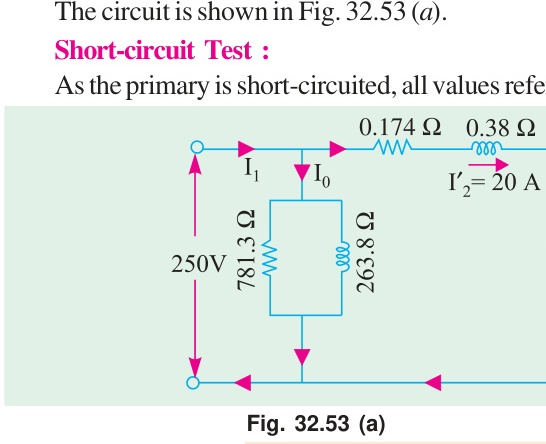
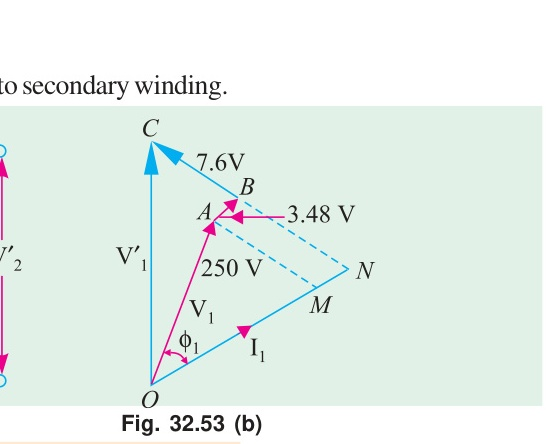

#### Solution
**Open-circuit test (on primary L.V. side):**
$$\cos \phi_0 = \frac{80}{250 \times 1} = 0.32$$
$$I_w = 1 \times 0.32 = 0.32\text{ A}, \quad I_\mu = \sqrt{1^2 - 0.32^2} = 0.95\text{ A}$$
$$R_0 = \frac{250}{0.32} = \mathbf{781.3\ \Omega}, \quad X_0 = \frac{250}{0.95} = \mathbf{263.8\ \Omega}$$

**Short-circuit test (instruments on secondary H.V. side):**
$$Z_{02} = \frac{20}{12} = 1.667\ \Omega$$
$$R_{02} = \frac{100}{12^2} = 0.694\ \Omega$$
$$X_{02} = \sqrt{1.667^2 - 0.694^2} = 1.518\ \Omega$$

Transformation ratio $K = 500/250 = 2$.
Referred to primary:
$$R_{01} = \frac{R_{02}}{K^2} = \frac{0.694}{4} = \mathbf{0.174\ \Omega}$$
$$X_{01} = \frac{X_{02}}{K^2} = \frac{1.518}{4} = \mathbf{0.38\ \Omega}$$
$$Z_{01} = \frac{Z_{02}}{K^2} = \frac{1.667}{4} = \mathbf{0.417\ \Omega}$$

**Efficiency at full load (rated current $12\text{ A}$ on secondary), $0.8\text{ p.f.}$:**
$$\text{Full-load Cu loss} = 100\text{ W}$$
$$\text{Iron loss} = 80\text{ W}$$
$$\text{Output} = 500 \times 12 \times 0.8 = 4800\text{ W}$$
$$\text{Total loss} = 100 + 80 = 180\text{ W}$$
$$\mathbf{\eta} = \frac{4800}{4800 + 180} \times 100\% = \mathbf{96.38\%}$$

---

<!-- Page 47 (p. 1161) -->

### Example 32.48
*A $230/230\text{ V}$, $3\text{ kVA}$ transformer gave the following results:*
* *O.C. test: $230\text{ V}$, $2\text{ A}$, $100\text{ W}$*
* *S.C. test: $15\text{ V}$, $13\text{ A}$, $120\text{ W}$*

*Calculate efficiency and regulation at full load $0.8\text{ p.f.}$ lagging.*

#### Solution
Rated current $= \frac{3000}{230} = 13.04\text{ A}$.
From S.C. test at rated current ($13\text{ A}$):
$$Z = \frac{15}{13} = 1.154\ \Omega$$
$$R = \frac{120}{13^2} = 0.71\ \Omega$$
$$X = \sqrt{1.154^2 - 0.71^2} = 0.91\ \Omega$$

Cu loss at rated load $= 120\text{ W}$
Core loss $= 100\text{ W}$
Output at $0.8\text{ p.f.} = 3000 \times 0.8 = 2400\text{ W}$.
$$\mathbf{\eta} = \frac{2400}{2400 + 120 + 100} \times 100\% = \frac{2400}{2620} \times 100\% = \mathbf{91.6\%}$$

Voltage drop:
$$\Delta V = I (R \cos \phi + X \sin \phi) = 13 (0.71 \times 0.8 + 0.91 \times 0.6) = 13 (0.568 + 0.546) = 14.48\text{ V}$$
$$\mathbf{\%\text{ Regulation}} = \frac{14.48}{230} \times 100\% = \mathbf{6.3\%}$$

---

### Example 32.49
*A $10\text{ kVA}$, $500/250\text{ V}$, single-phase transformer has its maximum efficiency of 94% when delivering 90% of its rated output at unity p.f. Estimate its efficiency when delivering its full-load output at p.f. of $0.8\text{ lagging}$.*
*(Nagpur University, November 1998)*

#### Solution
Rated output at unity p.f. $= 10000\text{ W}$.
At 90% output, output $= 9000\text{ W}$.
Input with 94% efficiency $= 9000/0.94\text{ W}$.
Total losses at 90% load:
$$\text{Losses} = 9000 \left(\frac{1}{0.94} - 1
ight) = 574.5\text{ W}$$

Since efficiency is maximum at this load:
$$\text{Cu loss at 90\% load} = \text{Iron loss } P_i = \frac{574.5}{2} = 287.2\text{ W}$$

Full-load copper loss:
$$P_c = \frac{287.2}{(0.9)^2} = \frac{287.2}{0.81} = 354.6\text{ W}$$

At full load, $0.8\text{ p.f.}$ lagging:
$$\text{Output} = 10000 \times 0.8 = 8000\text{ W}$$
$$\text{Total losses} = P_i + P_c = 287.2 + 354.6 = 641.8\text{ W}$$
$$\mathbf{\eta} = \frac{8000}{8000 + 641.8} \times 100\% = \mathbf{92.58\%}$$

---

<!-- Page 48 (p. 1162) -->

### Example 32.50
*Resistances and Leakage reactance of a $10\text{ kVA}$, $50\text{ Hz}$, $2300/230\text{ V}$ single phase distribution transformer are:*
*$r_1 = 3.96\ \Omega$, $r_2 = 0.0396\ \Omega$, $x_1 = 15.8\ \Omega$, $x_2 = 0.158\ \Omega$.*
*(a) If the transformer is delivering rated current at $0.8\text{ p.f.}$ lagging to a $230\text{-V}$ load, calculate the necessary terminal voltage of the H.V. side.*
*(b) Calculate the power factor for zero regulation and determine the required H.V. terminal voltage.*

#### Solution
Referred to secondary (L.V.):
$$K = \frac{230}{2300} = 0.1$$
$$R_{02} = r_2 + K^2 r_1 = 0.0396 + (0.01 \times 3.96) = 0.0792\ \Omega$$
$$X_{02} = x_2 + K^2 x_1 = 0.158 + (0.01 \times 15.8) = 0.316\ \Omega$$

Rated secondary current:
$$I_2 = \frac{10000}{230} = 43.5\text{ A}$$

**(a) At $0.8\text{ p.f.}$ lagging:**
$$V_1' = V_2 + I_2 (R_{02} \cos \phi + X_{02} \sin \phi)$$
$$= 230 + 43.5 (0.0792 \times 0.8 + 0.316 \times 0.6) = 230 + 43.5 (0.0634 + 0.1896) = 230 + 11.0 = 241\text{ V}$$
$$\mathbf{V_1} = \frac{V_1'}{K} = 241 \times 10 = \mathbf{2410\text{ V}}$$

**(b) Zero voltage regulation:**
For zero regulation, power factor must be leading:
$$R_{02} \cos \phi - X_{02} \sin \phi = 0 \implies \tan \phi = \frac{R_{02}}{X_{02}} = \frac{0.0792}{0.316} = 0.25$$
$$\phi = \tan^{-1}(0.25) \approx 14^\circ$$
$$\mathbf{\cos \phi} = \cos(14^\circ) = \mathbf{0.97\text{ leading}}$$
Since regulation is zero, $V_1' = V_2 = 230\text{ V}$, so:
$$\mathbf{V_1} = \frac{230}{0.1} = \mathbf{2300\text{ V}}$$

---

<!-- Page 49 (p. 1163) -->

### Example 32.51
*A $5\text{ kVA}$, $2200/220\text{ V}$, single-phase transformer has the following parameters:*
*$r_1 = 3.4\ \Omega$, $r_2 = 0.034\ \Omega$, $x_1 = 7.2\ \Omega$, $x_2 = 0.072\ \Omega$.*
*Calculate the secondary terminal voltage on full load at $0.8\text{ p.f.}$ lagging using the exact phasor expression.*

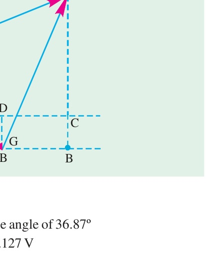

#### Solution
$K = 220/2200 = 0.1$.
$$R_{02} = r_2 + K^2 r_1 = 0.034 + 0.01 \times 3.4 = 0.068\ \Omega$$
$$X_{02} = x_2 + K^2 x_1 = 0.072 + 0.01 \times 7.2 = 0.144\ \Omega$$

Rated secondary current $I_2 = \frac{5000}{220} = 22.73\text{ A}$.
$$I_2 R_{02} = 22.73 \times 0.068 = 1.55\text{ V}$$
$$I_2 X_{02} = 22.73 \times 0.144 = 3.27\text{ V}$$

From the phasor diagram:
$$V_1' = \sqrt{(V_2 \cos \phi + I_2 R_{02})^2 + (V_2 \sin \phi + I_2 X_{02})^2}$$
With $V_1' = 220\text{ V}$, let $V_2$ be the terminal voltage:
Using the approximation $V_2 \approx V_1' - I_2 (R_{02} \cos \phi + X_{02} \sin \phi)$:
$$\Delta V_2 = 1.55 \times 0.8 + 3.27 \times 0.6 = 1.24 + 1.96 = 3.20\text{ V}$$
$$\mathbf{V_2} = 220 - 3.20 = \mathbf{216.8\text{ V}}$$

---

### Example 32.52
*A $4\text{-kVA}$, $200/400\text{ V}$, single-phase transformer takes $0.7\text{ A}$ and $65\text{ W}$ on open-circuit. When the low-voltage winding is short-circuited and $15\text{ V}$ is applied to the high-voltage terminals, the current and power are $10\text{ A}$ and $75\text{ W}$ respectively. Calculate the full-load efficiency at unity power factor and full-load regulation at $0.80\text{ power-factor}$ lagging.*
*(Nagpur University April 1999)*

#### Solution
Rated currents:
* L.V. side: $4000/200 = 20\text{ A}$
* H.V. side: $4000/400 = 10\text{ A}$

The S.C. test was conducted at rated current ($10\text{ A}$ on H.V. side).
$$\text{Full-load Cu loss } P_c = 75\text{ W}$$
$$\text{Iron loss } P_i = 65\text{ W}$$

**Full-load efficiency at unity p.f.:**
$$\text{Output} = 4000 \times 1 = 4000\text{ W}$$
$$\text{Total loss} = 75 + 65 = 140\text{ W}$$
$$\mathbf{\eta} = \frac{4000}{4000 + 140} \times 100\% = \frac{4000}{4140} \times 100\% = \mathbf{96.62\%}$$

**Full-load regulation at $0.8\text{ p.f.}$ lagging:**
From S.C. test on H.V. side:
$$Z_{02} = \frac{15}{10} = 1.5\ \Omega$$
$$R_{02} = \frac{75}{10^2} = 0.75\ \Omega$$
$$X_{02} = \sqrt{1.5^2 - 0.75^2} = 1.30\ \Omega$$

Voltage drop on H.V. side:
$$\Delta V_2 = I_2 (R_{02} \cos \phi + X_{02} \sin \phi) = 10 (0.75 \times 0.8 + 1.30 \times 0.6) = 10 (0.60 + 0.78) = 13.8\text{ V}$$
$$\mathbf{\%\text{ Regulation}} = \frac{13.8}{400} \times 100\% = \mathbf{3.45\%}$$

---

<!-- Page 50 (p. 1164) -->

## 32.25. Percentage Resistance, Reactance and Impedance

These quantities are usually measured by the full-load voltage drop expressed as a percentage of the normal terminal voltage.

1. **Percentage resistance at full-load:**
   $$\%R = \epsilon_r = \frac{I_1 R_{01}}{V_1} \times 100 = \frac{I_2 R_{02}}{V_2} \times 100 = \frac{\text{Full-load Cu loss}}{V_1 I_1} \times 100 = \%\text{ Cu loss}$$

2. **Percentage reactance at full-load:**
   $$\%X = \epsilon_x = \frac{I_1 X_{01}}{V_1} \times 100 = \frac{I_2 X_{02}}{V_2} \times 100$$

3. **Percentage impedance at full-load:**
   $$\%Z = \epsilon_z = \frac{I_1 Z_{01}}{V_1} \times 100 = \frac{I_2 Z_{02}}{V_2} \times 100$$
   $$\%Z = \sqrt{(\%R)^2 + (\%X)^2}$$

The ohmic values of resistance, reactance, and impedance can be obtained directly:
$$R_{01} = \frac{\%R \times V_1}{100 \times I_1} = \frac{\%\text{ Cu loss} \times V_1}{100 \times I_1}, \quad R_{02} = \frac{\%R \times V_2}{100 \times I_2}$$
$$X_{01} = \frac{\%X \times V_1}{100 \times I_1}, \quad X_{02} = \frac{\%X \times V_2}{100 \times I_2}$$
$$Z_{01} = \frac{\%Z \times V_1}{100 \times I_1}, \quad Z_{02} = \frac{\%Z \times V_2}{100 \times I_2}$$

> **Key Rule:** Percentage resistance, reactance, and impedance have the **same numerical value** whether referred to primary or secondary side!

---

### Example 32.53
*A $3300/230\text{ V}$, $50\text{-kVA}$ transformer is found to have impedance of 4% and a Cu loss of 1.8% at full-load. Find its percentage reactance and also the ohmic values of resistance, reactance and impedance as referred to primary. What would be the value of primary short-circuit current if primary voltage is assumed constant?*

#### Solution
Given: $\%Z = 4\%$, $\%R = 1.8\%$.
$$\mathbf{\%X} = \sqrt{(\%Z)^2 - (\%R)^2} = \sqrt{4^2 - 1.8^2} = \sqrt{16 - 3.24} = \mathbf{3.57\%}$$

Full-load primary current:
$$I_1 = \frac{50000}{3300} = 15.15\text{ A}$$

Ohmic values referred to primary:
$$\mathbf{R_{01}} = \frac{\%R \times V_1}{100 \times I_1} = \frac{1.8 \times 3300}{100 \times 15.15} = \mathbf{3.92\ \Omega}$$
$$\mathbf{X_{01}} = \frac{\%X \times V_1}{100 \times I_1} = \frac{3.57 \times 3300}{100 \times 15.15} = \mathbf{7.78\ \Omega}$$
$$\mathbf{Z_{01}} = \frac{\%Z \times V_1}{100 \times I_1} = \frac{4 \times 3300}{100 \times 15.15} = \mathbf{8.71\ \Omega}$$

**Primary short-circuit current with full primary voltage:**
$$\mathbf{I_{sc}} = \frac{V_1}{Z_{01}} = \frac{3300}{8.71} = \mathbf{378.8\text{ A}} \quad \left(\text{or } I_1 \times \frac{100}{\%Z} = 15.15 \times \frac{100}{4} = \mathbf{378.8\text{ A}}
ight)$$

---

<!-- Page 51 (p. 1165) -->

### Example 32.54
*A $20\text{-kVA}$, $2200/220\text{-V}$, $50\text{-Hz}$ distribution transformer is tested for efficiency and regulation as follows:*
* *O.C. test (l.v. side): $220\text{ V}$, $4.2\text{ A}$, $148\text{ W}$*
* *S.C. test (h.v. side): $86\text{ V}$, $10.5\text{ A}$, $360\text{ W}$*

*Determine:*
*(a) Core loss*
*(b) Equivalent resistance referred to primary*
*(c) Equivalent resistance referred to secondary*
*(d) Equivalent reactance referred to primary*
*(e) Equivalent reactance referred to secondary*
*(f) Regulation of transformer at $0.8\text{ p.f.}$ lagging current*
*(g) Efficiency at full load and half full-load at $0.8\text{ p.f.}$ lagging*

#### Solution
**(a)** $\mathbf{\text{Core loss}} = \mathbf{148\text{ W}}$ (measured on O.C. test).

**(b)** From S.C. test on H.V. side:
$$\mathbf{R_{01}} = \frac{360}{(10.5)^2} = \mathbf{3.26\ \Omega}$$

**(c)** Transformation ratio $K = 220/2200 = 0.1$:
$$\mathbf{R_{02}} = K^2 R_{01} = (0.1)^2 \times 3.26 = \mathbf{0.0326\ \Omega}$$

**(d)** Total impedance on H.V. side:
$$Z_{01} = \frac{86}{10.5} = 8.19\ \Omega$$
$$\mathbf{X_{01}} = \sqrt{8.19^2 - 3.26^2} = \mathbf{7.51\ \Omega}$$

**(e)**
$$\mathbf{X_{02}} = K^2 X_{01} = (0.1)^2 \times 7.51 = \mathbf{0.0751\ \Omega}$$

**(f) Regulation at $0.8\text{ p.f.}$ lagging:**
Rated primary current $I_1 = 20000/2200 = 9.09\text{ A}$.
$$\Delta V_1 = I_1 (R_{01} \cos \phi + X_{01} \sin \phi) = 9.09 (3.26 \times 0.8 + 7.51 \times 0.6) = 64.67\text{ V}$$
$$\mathbf{\%\text{ Regulation}} = \frac{64.67}{2200} \times 100\% = \mathbf{2.94\%}$$

**(g) Efficiency at $0.8\text{ p.f.}$:**
* Full-load:
  $$\text{Output} = 20000 \times 0.8 = 16000\text{ W}$$
  $$\text{Full-load Cu loss} = (9.09)^2 \times 3.26 = 269.4\text{ W} \approx 270\text{ W}$$
  $$\text{Iron loss} = 148\text{ W}$$
  $$\mathbf{\eta_{FL}} = \frac{16000}{16000 + 148 + 270} \times 100\% = \mathbf{97.45\%}$$

* Half full-load:
  $$\text{Output} = 10000 \times 0.8 = 8000\text{ W}$$
  $$\text{Cu loss} = 270 / 4 = 67.5\text{ W}$$
  $$\mathbf{\eta_{HL}} = \frac{8000}{8000 + 148 + 67.5} \times 100\% = \mathbf{97.38\%}$$

---

<!-- Page 52 (p. 1166) -->

### Example 32.55
*Calculate the regulation of a transformer in which the ohmic loss is 1% of the output and the reactance drop is 5% of the voltage, when the power factor is (a) $0.80\text{ lag}$ (b) unity (c) $0.80\text{ lead}$.*

#### Solution
Given: $v_r = \%R = 1\%$, $v_x = \%X = 5\%$.

$$\%\text{ Regulation} = v_r \cos \phi \pm v_x \sin \phi$$

**(a) At $0.8\text{ p.f.}$ lagging:**
$$\mathbf{\%\text{ regn}} = 1 \times 0.8 + 5 \times 0.6 = 0.8 + 3.0 = \mathbf{3.8\%}$$

**(b) At unity power factor:**
$$\mathbf{\%\text{ regn}} = 1 \times 1.0 + 5 \times 0 = \mathbf{1.0\%}$$

**(c) At $0.8\text{ p.f.}$ leading:**
$$\mathbf{\%\text{ regn}} = 1 \times 0.8 - 5 \times 0.6 = 0.8 - 3.0 = \mathbf{-2.2\%}$$

---

### Example 32.56
*The maximum efficiency of a $500\text{ kVA}$, $3300/500\text{ V}$, $50\text{ Hz}$, single phase transformer is 97% and occurs at 75% full-load at unity power factor. If the impedance is 10%, calculate the regulation at full-load, power factor $0.8\text{ lag}$.*

#### Solution
At 75% full load, output at unity p.f.:
$$\text{Output} = 500 \times 0.75 = 375\text{ kW}$$
Since efficiency is maximum at this load:
$$\text{Total losses} = 375 \left(\frac{1}{0.97} - 1
ight) = 375 \times \frac{0.03}{0.97} = 11.6\text{ kW}$$
$$P_i = P_{c(75\%)} = \frac{11.6}{2} = 5.8\text{ kW}$$

Full-load copper loss:
$$P_{c(FL)} = \frac{5.8}{(0.75)^2} = \frac{5.8}{0.5625} = 10.31\text{ kW}$$

$$\%R = \frac{P_{c(FL)}}{\text{kVA rating}} \times 100\% = \frac{10.31}{500} \times 100\% = 2.06\%$$
$$\%Z = 10\%$$
$$\%X = \sqrt{(\%Z)^2 - (\%R)^2} = \sqrt{10^2 - (2.06)^2} = \sqrt{100 - 4.24} = 9.785\%$$

At full-load, $0.8\text{ p.f.}$ lagging:
$$\mathbf{\%\text{ Regulation}} = \%R \cos \phi + \%X \sin \phi = 2.06 \times 0.8 + 9.785 \times 0.6 = 1.648 + 5.871 = \mathbf{7.52\%}$$

---

### Example 32.57
*A transformer has copper-loss of 1.5% and reactance-drop of 3.5% when tested at full-load. Calculate its full-load regulation at (i) u.p.f. (ii) $0.8\text{ p.f.}$ Lagging and (iii) $0.8\text{ p.f.}$ Leading.*
*(Bharathidasan Univ. April 1997)*

#### Solution
Given: $v_r = 1.5\%$, $v_x = 3.5\%$.

**(i) At unity power factor:**
$$\mathbf{\%\text{ Regulation}} = 1.5 \times 1.0 + 3.5 \times 0 = \mathbf{1.5\%}$$

**(ii) At $0.8\text{ p.f.}$ lagging:**
$$\mathbf{\%\text{ Regulation}} = 1.5 \times 0.8 + 3.5 \times 0.6 = 1.2 + 2.1 = \mathbf{3.3\%}$$

**(iii) At $0.8\text{ p.f.}$ leading:**
$$\mathbf{\%\text{ Regulation}} = 1.5 \times 0.8 - 3.5 \times 0.6 = 1.2 - 2.1 = \mathbf{-0.9\%}$$

---

<!-- Page 53 (p. 1167) -->

## 32.26. Kapp Regulation Diagram

The Kapp regulation diagram is a graphical method for determining the regulation and secondary terminal voltage of a transformer for any load and power factor.

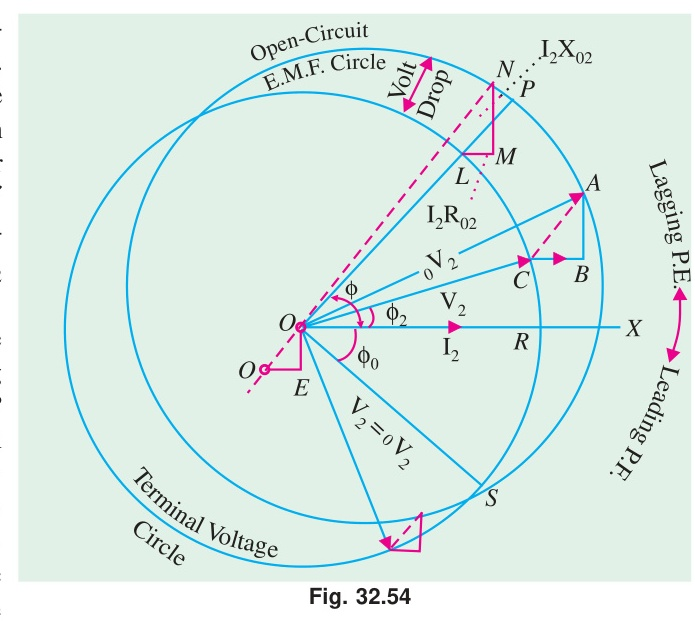

In Fig. 32.54:
* Draw a circle with centre $O$ and radius $ON = OP = {_0V_2}$ (the no-load secondary terminal voltage).
* Draw an impedance triangle $LMN$ where $LM = I_2 R_{02}$ is horizontal and $MN = I_2 X_{02}$ is vertical.
* The locus of point $L$ forms another circle with centre $O'$. Point $O'$ lies at a distance of $I_2 R_{02}$ to the left of $O$ and $I_2 X_{02}$ vertically below $O$.
* For any power factor angle $\phi$, draw a radial line $OLP$ inclined at an angle $\phi$ to the horizontal.
* $OL = V_2$ represents the full-load secondary terminal voltage.
* $OP = {_0V_2}$ represents the no-load terminal voltage.
* The intercept $LP = OP - OL$ directly gives the **voltage drop**.

$$\%\text{ Regulation} = \frac{OP - OL}{OP} \times 100 = \frac{LP}{OP} \times 100$$

The diagram clearly shows how secondary terminal voltage falls as the angle of lag increases, and how it can rise when the load has a leading power factor.

---

<!-- Page 54 (p. 1168) -->

## 32.27. Sumpner or Back-to-Back Test

This test enables full-load temperature rise and total losses of two identical transformers to be determined without requiring full load power from the supply mains.

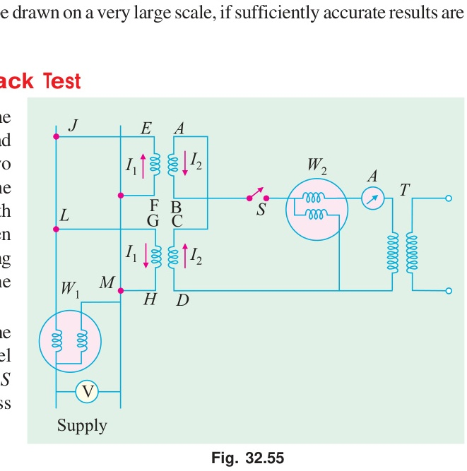

### Working Principle:
1. **Primary Windings:**
   The primaries of the two identical transformers $A$ and $B$ are connected in parallel across the normal supply mains ($V_1$, normal frequency).
   Wattmeter $W_1$ connected in the primary circuit measures the total **iron losses** of both transformers:
   $$W_1 = 2 P_i \implies P_i = \frac{W_1}{2}$$

2. **Secondary Windings:**
   The secondaries are connected in phase opposition to each other. When $V_{AB} = V_{CD}$, and terminal $A$ is joined to $C$ while $B$ is joined to $D$, no current flows in the secondary loop.
   An auxiliary regulating transformer $T$ is connected in series with the secondary circuit to inject a small voltage $V_2$ sufficient to circulate rated full-load current $I_2$ through both secondary windings.
   Wattmeter $W_2$ connected in this auxiliary circuit measures the full-load **copper losses** of both transformers:
   $$W_2 = 2 P_c \implies P_c = \frac{W_2}{2}$$

Because both normal flux and full-load currents are established simultaneously, the transformers operate under full-load conditions for temperature rise testing, while the power drawn from the mains is merely the sum of the losses:
$$\text{Total power drawn} = W_1 + W_2 = 2 (P_i + P_c)$$

---

### Example 32.58
*Two similar $250\text{-kVA}$, single-phase transformers gave the following results when tested by back-to-back method:*
* *Mains wattmeter: $W_1 = 5.0\text{ kW}$*
* *Primary series circuit wattmeter: $W_2 = 7.5\text{ kW}$ (at full-load current).*

*Find out the individual transformer efficiencies at 75% full-load and $0.8\text{ p.f.}$ lead.*
*(Electrical Machines-III, Gujarat Univ. 1986)*

#### Solution
For each transformer:
$$\text{Iron loss } P_i = \frac{W_1}{2} = \frac{5.0}{2} = 2.5\text{ kW}$$
$$\text{Full-load copper loss } P_c = \frac{W_2}{2} = \frac{7.5}{2} = 3.75\text{ kW}$$

Copper loss at 75% full-load:
$$P_{c(75\%)} = (0.75)^2 \times P_c = \left(\frac{3}{4}
ight)^2 \times 3.75 = 0.5625 \times 3.75 = \mathbf{2.11\text{ kW}}$$

Output of each transformer at 75% full load and $0.8\text{ p.f.}$:
$$\text{Output} = (250 \times 0.75) \times 0.8 = 150\text{ kW}$$

Total losses of each transformer at this load:
$$\text{Total losses} = P_i + P_{c(75\%)} = 2.5 + 2.11 = 4.61\text{ kW}$$

Efficiency:
$$\mathbf{\eta} = \frac{\text{Output}}{\text{Output} + \text{Losses}} \times 100\% = \frac{150}{150 + 2.5 + 2.11} \times 100\% = \frac{150}{154.61} \times 100\% = \mathbf{97.02\%}$$

---
