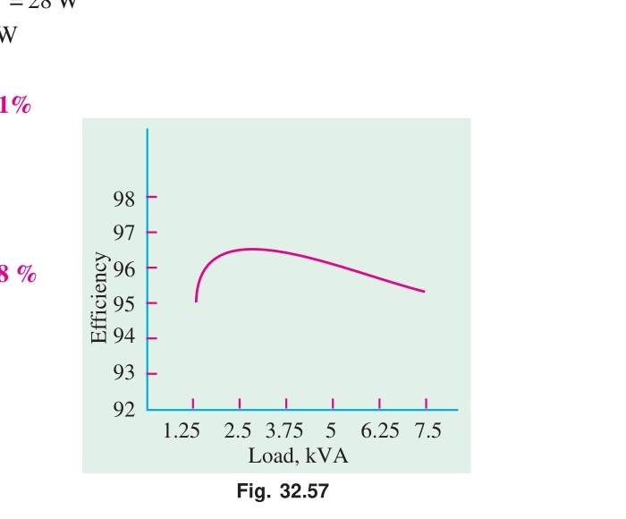
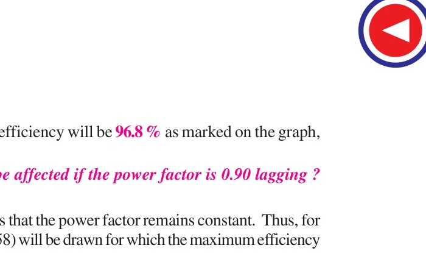
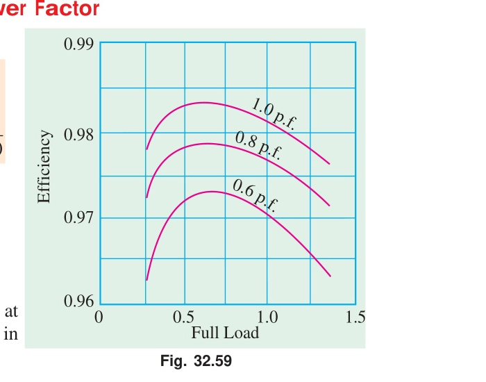
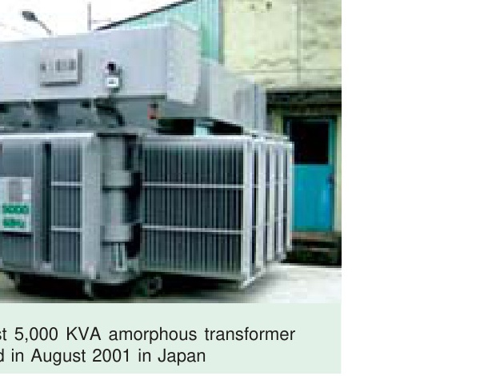
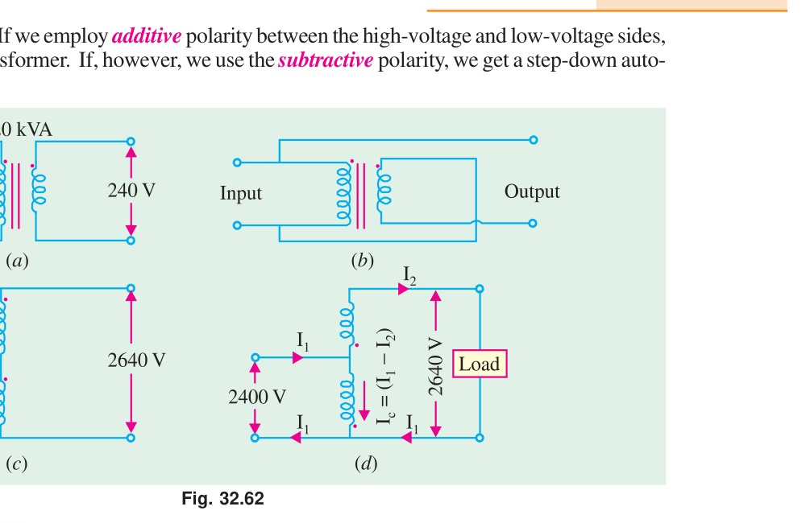
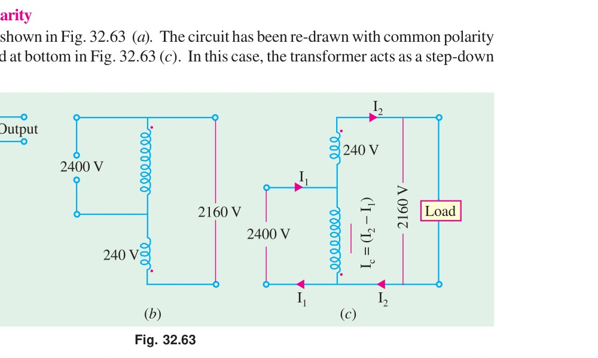
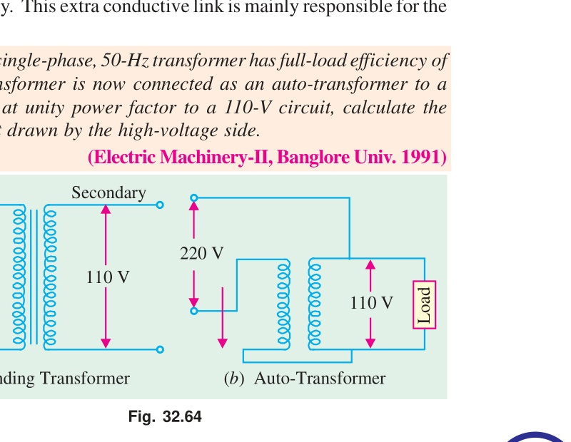
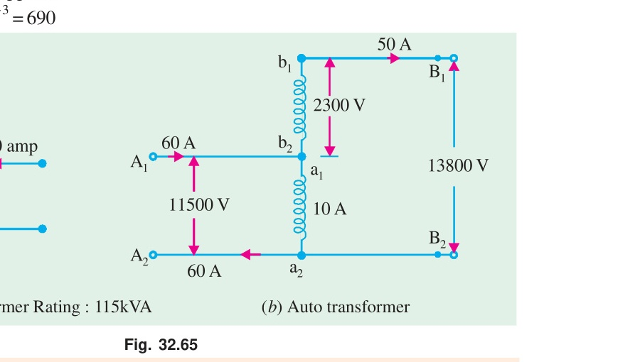
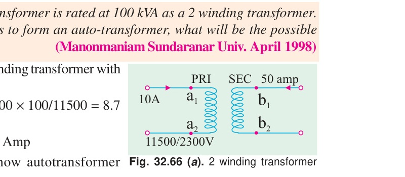
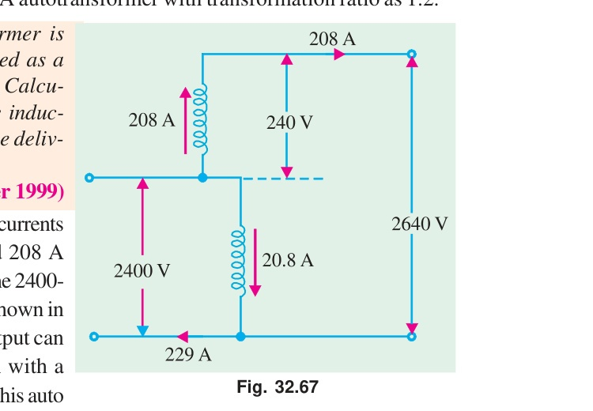

# Chapter 32: Transformer — Part 4: Efficiency and Auto-Transformers

> **Source:** B.L. Theraja & A.K. Theraja, *A Textbook of Electrical Technology — Volume II (AC & DC Machines)*, Chapter 32, pp. 1168–1193.
> **Scope:** Sections 32.28 to 32.34 (Losses in a Transformer, Efficiency, Condition for Maximum Efficiency, Variation of Efficiency with Power Factor, All-Day Efficiency, Auto-Transformers, Conversion of 2-Winding Transformers), Examples 32.59 to 32.95, Tutorial Problems 32.4 & 32.5.

---

<!-- Page 54 (p. 1168) -->

## 32.28. Losses in a Transformer

In a static transformer, there are no friction or windage losses. Hence, the only losses occurring are:

1. **Core or Iron Loss:**
   It includes both **hysteresis loss** and **eddy current loss**. Because the core flux in a transformer remains practically constant for all loads (its variation being only 1 to 3% from no-load to full-load), the core loss is practically the same at all loads.

   $$\text{Hysteresis loss: } W_h = \eta B_{max}^{1.6} f V \quad \text{[W]}$$
   $$\text{Eddy current loss: } W_e = P B_{max}^2 f^2 t^2 \quad \text{[W]}$$

   These losses are minimized by using steel of high silicon content for the core and by using very thin laminations. Iron or core loss is found from the **Open-Circuit (O.C.) test**. The power input of the transformer when on no-load measures the core loss.

<!-- Page 55 (p. 1169) -->

2. **Copper Loss:**
   This loss is due to the ohmic resistance of the transformer windings.
   $$\text{Total Cu loss } = I_1^2 R_1 + I_2^2 R_2 = I_1^2 R_{01} = I_2^2 R_{02}$$

   It is clear that Cu loss is proportional to $\text{(current)}^2$ or $\text{(kVA)}^2$. In other words, Cu loss at half full-load is one-fourth of that at full-load:
   $$W_{cu(x)} = x^2 W_{cu(FL)}$$
   where $x = \text{fraction of full-load}$.

   The value of full-load Cu loss is determined from the **Short-Circuit (S.C.) test**.

---

## 32.29. Efficiency of a Transformer

As is the case with other types of electrical machines, the efficiency of a transformer at a particular load and power factor is defined as the output divided by the input—the two being measured in the same units (either watts or kilowatts):

$$\text{Efficiency } \eta = \frac{\text{Output}}{\text{Input}} = \frac{\text{Output}}{\text{Output} + \text{Losses}} = \frac{\text{Output}}{\text{Output} + \text{Cu loss} + \text{Iron loss}}$$

$$\mathbf{\eta = \frac{V_2 I_2 \cos \phi}{V_2 I_2 \cos \phi + I_2^2 R_{02} + W_i}}$$

where:
* $V_2 I_2 \cos \phi = \text{load output in watts}$
* $I_2^2 R_{02} = \text{total copper loss } W_{cu}$
* $W_i = \text{iron loss}$

---

<!-- Page 56 (p. 1170) -->

## 32.30. Condition for Maximum Efficiency

$$\eta = \frac{V_2 I_2 \cos \phi}{V_2 I_2 \cos \phi + I_2^2 R_{02} + W_i} = \frac{V_2 \cos \phi}{V_2 \cos \phi + I_2 R_{02} + \frac{W_i}{I_2}}$$

Differentiating the denominator with respect to $I_2$ and equating to zero:
$$\frac{d}{dI_2}\left(V_2 \cos \phi + I_2 R_{02} + \frac{W_i}{I_2}
ight) = 0$$

$$R_{02} - \frac{W_i}{I_2^2} = 0 \implies I_2^2 R_{02} = W_i$$

$$\mathbf{\text{Copper loss} = \text{Iron loss}}$$

> **Rule for Maximum Efficiency:** The efficiency of a transformer is maximum when the variable copper loss is equal to the constant iron loss!

The load current corresponding to maximum efficiency:
$$\mathbf{I_{2(\eta_{max})} = \sqrt{\frac{W_i}{R_{02}}}}$$

The load kVA corresponding to maximum efficiency:
$$\mathbf{\text{kVA for } \eta_{max} = \text{Full-load kVA} \times \sqrt{\frac{\text{Iron loss}}{\text{Full-load Cu loss}}}}$$

---

<!-- Page 57 (p. 1171) -->

## 32.31. Variation of Efficiency with Power Factor

The efficiency is given by:
$$\eta = \frac{V_2 I_2 \cos \phi}{V_2 I_2 \cos \phi + \text{Losses}} = \frac{1}{1 + \frac{\text{Losses}}{V_2 I_2 \cos \phi}}$$

For a given load current $I_2$, the losses are constant. Therefore, as the power factor $\cos \phi$ increases, the term $\frac{\text{Losses}}{V_2 I_2 \cos \phi}$ decreases, and consequently the efficiency **increases**.

* The efficiency is maximum at **unity power factor** ($\cos \phi = 1$).
* The lower the power factor, the lower is the efficiency.

---

### Example 32.59
*In a $25\text{-kVA}$, $2000/200\text{ V}$, single-phase transformer, the iron and full-load copper losses are $350\text{ W}$ and $400\text{ W}$ respectively. Calculate the efficiency at (i) full-load, $0.8\text{ p.f.}$ lagging, and (ii) half full-load, unity power factor.*

#### Solution
Given: $S = 25\text{ kVA}$, $W_i = 350\text{ W}$, $W_{cu(FL)} = 400\text{ W}$.

**(i) Full-load, $0.8\text{ p.f.}$ lagging:**
$$\text{Output} = 25 \times 0.8 = 20\text{ kW} = 20000\text{ W}$$
$$\text{Total losses} = W_i + W_{cu(FL)} = 350 + 400 = 750\text{ W}$$
$$\mathbf{\eta} = \frac{20000}{20000 + 750} \times 100\% = \mathbf{96.39\%}$$

**(ii) Half full-load, unity power factor:**
$$\text{Output} = 0.5 \times 25 \times 1.0 = 12.5\text{ kW} = 12500\text{ W}$$
$$\text{Cu loss} = (0.5)^2 \times 400 = 100\text{ W}$$
$$\text{Total losses} = 350 + 100 = 450\text{ W}$$
$$\mathbf{\eta} = \frac{12500}{12500 + 450} \times 100\% = \mathbf{96.53\%}$$

---

### Example 32.60
*If $P_1$ and $P_2$ are the iron and copper losses of a transformer on full-load, find the ratio of $P_1/P_2$ such that maximum efficiency occurs at 75% of full-load.*

#### Solution
Maximum efficiency occurs when:
$$W_i = W_{cu(x)} \implies P_1 = x^2 P_2$$
Here, $x = 0.75 = 3/4$.
$$P_1 = (0.75)^2 P_2 = \frac{9}{16} P_2$$
$$\mathbf{\frac{P_1}{P_2} = \frac{9}{16} = 0.5625}$$

---

### Example 32.61
*A $11000/230\text{-V}$, $150\text{-kVA}$, 1-phase, $50\text{-Hz}$ transformer has core loss of $1.4\text{ kW}$ and full-load Cu loss of $1.6\text{ kW}$. Determine:*
*(a) the kVA load for maximum efficiency and the value of this efficiency at unity power factor*
*(b) the efficiency at half full-load, $0.8\text{ p.f.}$ lagging.*

#### Solution
**(a) kVA load for maximum efficiency:**
$$\text{kVA for } \eta_{max} = \text{Rated kVA} \times \sqrt{\frac{W_i}{W_{cu(FL)}}} = 150 \times \sqrt{\frac{1.4}{1.6}} = 150 \times 0.9354 = \mathbf{140.31\text{ kVA}}$$

At this load and unity power factor:
$$\text{Output} = 140.31 \times 1 = 140.31\text{ kW}$$
$$\text{Total losses} = 2 \times W_i = 2 \times 1.4 = 2.8\text{ kW}$$
$$\mathbf{\eta_{max}} = \frac{140.31}{140.31 + 2.8} \times 100\% = \frac{140.31}{143.11} \times 100\% = \mathbf{98.04\%}$$

**(b) At half full-load, $0.8\text{ p.f.}$ lagging:**
$$\text{Output} = 0.5 \times 150 \times 0.8 = 60\text{ kW}$$
$$\text{Cu loss} = (0.5)^2 \times 1.6 = 0.4\text{ kW}$$
$$\text{Total losses} = 1.4 + 0.4 = 1.8\text{ kW}$$
$$\mathbf{\eta} = \frac{60}{60 + 1.8} \times 100\% = \mathbf{97.09\%}$$

---

### Example 32.62
*A $200\text{-kVA}$ single-phase transformer has an efficiency of 98% at full load. If the maximum efficiency occurs at three quarters of full-load, calculate:*
*(a) the iron loss at full-load*
*(b) the Cu loss at full-load*
*(c) the efficiency at half full-load.*
*Assume power factor of $0.8\text{ lagging}$ at all loads.*

#### Solution
At full-load, $0.8\text{ p.f.}$:
$$\text{Output} = 200 \times 0.8 = 160\text{ kW}$$
$$\eta = 0.98 \implies \text{Total losses} = 160 \left(\frac{1}{0.98} - 1
ight) = 3.265\text{ kW}$$
$$W_i + W_{cu(FL)} = 3.265\text{ kW} \quad \text{--- (i)}$$

Since maximum efficiency occurs at $3/4 = 0.75$ of full-load:
$$W_i = (0.75)^2 W_{cu(FL)} = \frac{9}{16} W_{cu(FL)} = 0.5625 W_{cu(FL)}$$

Substituting in (i):
$$0.5625 W_{cu(FL)} + W_{cu(FL)} = 3.265 \implies 1.5625 W_{cu(FL)} = 3.265$$
$$\mathbf{W_{cu(FL)}} = \frac{3.265}{1.5625} = \mathbf{2.09\text{ kW}}$$
$$\mathbf{W_i} = 3.265 - 2.09 = \mathbf{1.175\text{ kW}}$$

**(c) Efficiency at half full-load, $0.8\text{ p.f.}$:**
$$\text{Output} = 0.5 \times 200 \times 0.8 = 80\text{ kW}$$
$$\text{Cu loss} = (0.5)^2 \times 2.09 = 0.5225\text{ kW}$$
$$\text{Total losses} = 1.175 + 0.5225 = 1.6975\text{ kW}$$
$$\mathbf{\eta} = \frac{80}{80 + 1.6975} \times 100\% = \mathbf{97.92\%}$$

---

### Example 32.63
*A $10\text{-kVA}$, $200/400\text{-V}$, $50\text{-Hz}$ single-phase transformer gave the following test results:*
* *O.C. test (L.V. side): $200\text{ V}$, $1.3\text{ A}$, $120\text{ W}$*
* *S.C. test (H.V. side): $22\text{ V}$, $25\text{ A}$, $200\text{ W}$*

*Calculate:*
*(i) The magnetising current and core-loss component of current*
*(ii) The equivalent circuit parameters referred to L.V. side*
*(iii) Efficiency at full load, $0.8\text{ p.f.}$ lagging*
*(iv) Load for maximum efficiency*

#### Solution
**(i) & (ii) From O.C. Test (L.V. side):**
$$\cos \phi_0 = \frac{120}{200 \times 1.3} = 0.4615 \implies \sin \phi_0 = 0.887$$
$$\mathbf{I_w} = 1.3 \times 0.4615 = \mathbf{0.60\text{ A}}$$
$$\mathbf{I_\mu} = 1.3 \times 0.887 = \mathbf{1.15\text{ A}}$$
$$R_0 = \frac{200}{0.60} = \mathbf{333.3\ \Omega}, \quad X_0 = \frac{200}{1.15} = \mathbf{173.9\ \Omega}$$

**From S.C. Test (H.V. side):**
Rated H.V. current $= 10000/400 = 25\text{ A}$. Thus, the S.C. test was conducted at rated current!
$$Z_{02} = \frac{22}{25} = 0.88\ \Omega, \quad R_{02} = \frac{200}{25^2} = 0.32\ \Omega$$
$$X_{02} = \sqrt{0.88^2 - 0.32^2} = 0.82\ \Omega$$

Transformation ratio $K = 400/200 = 2$.
Referred to L.V. side:
$$\mathbf{R_{01}} = \frac{0.32}{4} = \mathbf{0.08\ \Omega}, \quad \mathbf{X_{01}} = \frac{0.82}{4} = \mathbf{0.205\ \Omega}$$

**(iii) Efficiency at full load, $0.8\text{ p.f.}$:**
$$\text{Output} = 10 \times 0.8 = 8\text{ kW} = 8000\text{ W}$$
$$\text{Losses} = W_i + W_{cu} = 120 + 200 = 320\text{ W}$$
$$\mathbf{\eta} = \frac{8000}{8000 + 320} \times 100\% = \mathbf{96.15\%}$$

**(iv) Load for maximum efficiency:**
$$\mathbf{S_{(\eta_{max})}} = 10 \times \sqrt{\frac{120}{200}} = 10 \times \sqrt{0.6} = \mathbf{7.75\text{ kVA}}$$

---

### Example 32.64
*A $500\text{-kVA}$ transformer has an iron loss of $2.5\text{ kW}$ and full-load Cu loss of $5.5\text{ kW}$. The maximum efficiency occurs at 67.4% full-load. Calculate:*
*(a) The maximum efficiency at unity power factor*
*(b) The efficiency at full load, $0.8\text{ p.f.}$ lagging.*

#### Solution
**(a) Maximum efficiency at unity p.f.:**
Load for maximum efficiency $= 500 \times 0.674 = 337\text{ kVA}$.
At maximum efficiency:
$$\text{Cu loss} = \text{Iron loss} = 2.5\text{ kW}$$
$$\text{Total losses} = 2 \times 2.5 = 5.0\text{ kW}$$
$$\text{Output} = 337 \times 1 = 337\text{ kW}$$
$$\mathbf{\eta_{max}} = \frac{337}{337 + 5.0} \times 100\% = \mathbf{98.54\%}$$

**(b) Efficiency at full-load, $0.8\text{ p.f.}$:**
$$\text{Output} = 500 \times 0.8 = 400\text{ kW}$$
$$\text{Total losses} = 2.5 + 5.5 = 8.0\text{ kW}$$
$$\mathbf{\eta} = \frac{400}{400 + 8.0} \times 100\% = \mathbf{98.04\%}$$

---

<!-- Page 64 (p. 1178) -->

### Example 32.65
*A $40\text{-kVA}$ transformer has iron loss of $450\text{ W}$ and full-load copper loss of $850\text{ W}$. If the power factor of the load is $0.8\text{ lagging}$, calculate (i) full-load efficiency (ii) the load at which maximum efficiency occurs and the value of this efficiency.*

#### Solution
**(i) Full-load efficiency:**
$$\text{Output} = 40 \times 0.8 = 32\text{ kW}$$
$$\text{Losses} = 0.45 + 0.85 = 1.30\text{ kW}$$
$$\mathbf{\eta_{FL}} = \frac{32}{32 + 1.30} \times 100\% = \mathbf{96.10\%}$$

**(ii) Maximum efficiency:**
$$\mathbf{S_{(\eta_{max})}} = 40 \times \sqrt{\frac{450}{850}} = 40 \times 0.7276 = \mathbf{29.1\text{ kVA}}$$
$$\text{Output at } 0.8\text{ p.f.} = 29.1 \times 0.8 = 23.28\text{ kW}$$
$$\text{Total losses} = 2 \times 0.45 = 0.90\text{ kW}$$
$$\mathbf{\eta_{max}} = \frac{23.28}{23.28 + 0.90} \times 100\% = \mathbf{96.28\%}$$

---

### Example 32.66
*A $100\text{-kVA}$, $1000/200\text{-V}$, $50\text{-Hz}$ single phase transformer has a full load copper loss of $1200\text{ W}$ and iron loss of $960\text{ W}$. Calculate:*
*(a) Efficiency at full load and half full-load at $0.8\text{ p.f.}$ lagging*
*(b) Load kVA at which maximum efficiency will occur and the maximum efficiency at unity power factor.*

#### Solution
**(a) Full load efficiency ($0.8\text{ p.f.}$):**
$$\text{Output} = 100 \times 0.8 = 80\text{ kW}$$
$$\text{Losses} = 0.96 + 1.2 = 2.16\text{ kW}$$
$$\mathbf{\eta} = \frac{80}{82.16} \times 100\% = \mathbf{97.37\%}$$

Half load ($0.8\text{ p.f.}$):
$$\text{Output} = 40\text{ kW}, \quad W_{cu} = 1.2 / 4 = 0.3\text{ kW}$$
$$\text{Losses} = 0.96 + 0.3 = 1.26\text{ kW}$$
$$\mathbf{\eta} = \frac{40}{41.26} \times 100\% = \mathbf{96.95\%}$$

**(b) Maximum efficiency:**
$$\mathbf{\text{kVA for } \eta_{max}} = 100 \times \sqrt{\frac{960}{1200}} = 100 \times \sqrt{0.8} = \mathbf{89.44\text{ kVA}}$$
$$\mathbf{\eta_{max(u.p.f.)}} = \frac{89.44}{89.44 + 2(0.96)} \times 100\% = \frac{89.44}{91.36} \times 100\% = \mathbf{97.90\%}$$

---

### Example 32.67
*Consider a $20\text{-kVA}$, $2200/220\text{-V}$ transformer having iron loss of $200\text{ W}$ and full-load Cu loss of $300\text{ W}$. Find:*
*(a) Efficiency at full-load, unity power factor*
*(b) Fraction of full load at which efficiency is maximum, and the maximum efficiency.*

#### Solution
**(a)**
$$\text{Output} = 20 \times 1 = 20\text{ kW}$$
$$\text{Losses} = 0.2 + 0.3 = 0.5\text{ kW}$$
$$\mathbf{\eta} = \frac{20}{20.5} \times 100\% = \mathbf{97.56\%}$$

**(b)**
$$\mathbf{x} = \sqrt{\frac{W_i}{W_{cu}}} = \sqrt{\frac{200}{300}} = \mathbf{0.8165 \quad (81.65\% \text{ of full-load})}$$
$$\text{Output at } \eta_{max} = 20 \times 0.8165 = 16.33\text{ kW}$$
$$\text{Total losses} = 2 \times 0.2 = 0.4\text{ kW}$$
$$\mathbf{\eta_{max}} = \frac{16.33}{16.33 + 0.4} \times 100\% = \mathbf{97.61\%}$$

---

### Example 32.68
*A $5\text{-kVA}$, $230/115\text{-V}$ single-phase transformer has $R_1 = 0.1\ \Omega$, $R_2 = 0.025\ \Omega$, $X_1 = 0.2\ \Omega$, $X_2 = 0.05\ \Omega$. Core loss is $50\text{ W}$. Find the efficiency at full-load, $0.8\text{ p.f.}$ lagging.*

#### Solution
Transformation ratio $K = 115/230 = 0.5$.
Equivalent resistance referred to secondary:
$$R_{02} = R_2 + K^2 R_1 = 0.025 + (0.5)^2 \times 0.1 = 0.025 + 0.025 = 0.05\ \Omega$$

Rated secondary current:
$$I_2 = \frac{5000}{115} = 43.48\text{ A}$$

Full-load Cu loss:
$$W_{cu} = I_2^2 R_{02} = (43.48)^2 \times 0.05 = 94.5\text{ W}$$
$$\text{Iron loss } W_i = 50\text{ W}$$

Output at $0.8\text{ p.f.}$:
$$\text{Output} = 5000 \times 0.8 = 4000\text{ W}$$
$$\text{Total losses} = 94.5 + 50 = 144.5\text{ W}$$
$$\mathbf{\eta} = \frac{4000}{4000 + 144.5} \times 100\% = \mathbf{96.51\%}$$

---

### Example 32.69
*A transformer has maximum efficiency of 98% at $15\text{ kVA}$, unity power factor. Compute its efficiency at (a) $20\text{ kVA}$, $0.8\text{ p.f.}$ lagging, and (b) $10\text{ kVA}$, unity power factor.*

#### Solution
At maximum efficiency ($15\text{ kVA}$, u.p.f.):
$$\text{Output} = 15\text{ kW}$$
$$\text{Total losses} = 15 \left(\frac{1}{0.98} - 1
ight) = 0.3061\text{ kW} = 306.1\text{ W}$$
Since efficiency is maximum:
$$W_i = W_{cu(15)} = \frac{306.1}{2} = 153.05\text{ W}$$

Full-load copper loss at $20\text{ kVA}$:
$$W_{cu(20)} = 153.05 \times \left(\frac{20}{15}
ight)^2 = 153.05 \times \frac{16}{9} = 272.1\text{ W}$$

**(a) At $20\text{ kVA}$, $0.8\text{ p.f.}$:**
$$\text{Output} = 20 \times 0.8 = 16\text{ kW} = 16000\text{ W}$$
$$\text{Total losses} = 153.05 + 272.1 = 425.15\text{ W}$$
$$\mathbf{\eta} = \frac{16000}{16000 + 425.15} \times 100\% = \mathbf{97.41\%}$$

**(b) At $10\text{ kVA}$, unity p.f.:**
$$\text{Output} = 10\text{ kW} = 10000\text{ W}$$
$$W_{cu(10)} = 153.05 \times \left(\frac{10}{15}
ight)^2 = 68.02\text{ W}$$
$$\text{Total losses} = 153.05 + 68.02 = 221.07\text{ W}$$
$$\mathbf{\eta} = \frac{10000}{10000 + 221.07} \times 100\% = \mathbf{97.84\%}$$

---

### Example 32.70
*The maximum efficiency of a $100\text{-kVA}$ single phase transformer is 98% and occurs at 80% of full load at unity power factor. If the transformer is supplying 60% of full load at $0.8\text{ p.f.}$ lagging, calculate its efficiency.*

#### Solution
At $80\text{ kVA}$, unity p.f. ($\eta_{max} = 0.98$):
$$\text{Output} = 80\text{ kW}$$
$$\text{Total losses} = 80 \left(\frac{1}{0.98} - 1
ight) = 1.633\text{ kW}$$
$$W_i = W_{cu(80)} = \frac{1.633}{2} = 0.8165\text{ kW}$$

At 60% full load:
$$W_{cu(60)} = W_{cu(80)} \times \left(\frac{60}{80}
ight)^2 = 0.8165 \times \left(\frac{3}{4}
ight)^2 = 0.4593\text{ kW}$$

Output at 60% full load, $0.8\text{ p.f.}$:
$$\text{Output} = 60 \times 0.8 = 48\text{ kW}$$
$$\text{Total losses} = 0.8165 + 0.4593 = 1.2758\text{ kW}$$
$$\mathbf{\eta} = \frac{48}{48 + 1.2758} \times 100\% = \mathbf{97.41\%}$$

---

### Example 32.71
*A $50\text{-kVA}$, $1000/400\text{-V}$, $50\text{-Hz}$ transformer has full-load copper loss of $800\text{ W}$ and core loss of $500\text{ W}$. Find:*
*(a) Efficiency at full load, $0.8\text{ p.f.}$ lagging*
*(b) Efficiency at 70% full load, $0.85\text{ p.f.}$ lagging*
*(c) Maximum efficiency at $0.8\text{ p.f.}$ lagging.*

#### Solution
**(a)** $\text{Output} = 50 \times 0.8 = 40\text{ kW}$.
$$\text{Total losses} = 0.8 + 0.5 = 1.3\text{ kW} \implies \mathbf{\eta} = \frac{40}{41.3} \times 100\% = \mathbf{96.85\%}$$

**(b)** $\text{Output} = 50 \times 0.7 \times 0.85 = 29.75\text{ kW}$.
$$W_{cu} = (0.7)^2 \times 0.8 = 0.392\text{ kW}$$
$$\text{Losses} = 0.5 + 0.392 = 0.892\text{ kW} \implies \mathbf{\eta} = \frac{29.75}{29.75 + 0.892} \times 100\% = \mathbf{97.09\%}$$

**(c)** Load for maximum efficiency:
$$S = 50 \times \sqrt{\frac{500}{800}} = 50 \times 0.7906 = 39.53\text{ kVA}$$
$$\text{Output} = 39.53 \times 0.8 = 31.62\text{ kW}$$
$$\text{Losses} = 2 \times 0.5 = 1.0\text{ kW} \implies \mathbf{\eta_{max}} = \frac{31.62}{32.62} \times 100\% = \mathbf{96.93\%}$$

---

### Example 32.72
*A $100\text{-kVA}$ lighting transformer has a full-load loss of $3\text{ kW}$, the losses being equally divided between iron and copper. During the day, the transformer operates on full load for 3 hours, one-half load for 4 hours, and no load for the rest of the day. Calculate its all-day efficiency.*

#### Solution
Given: Full-load total loss $= 3\text{ kW}$, equally divided:
$$W_i = 1.5\text{ kW}, \quad W_{cu(FL)} = 1.5\text{ kW}$$

Energy output in 24 hours (lighting load, $\cos \phi = 1$):
* At full load ($100\text{ kW}$) for $3\text{ hours} = 100 \times 3 = 300\text{ kWh}$
* At half load ($50\text{ kW}$) for $4\text{ hours} = 50 \times 4 = 200\text{ kWh}$
* At no load for $17\text{ hours} = 0$
$$\mathbf{\text{Total energy output}} = 300 + 200 = \mathbf{500\text{ kWh}}$$

Energy losses in 24 hours:
1. Iron loss (takes place all 24 hours):
   $$\text{Iron loss energy} = 1.5\text{ kW} \times 24\text{ h} = 36\text{ kWh}$$
2. Copper loss:
   * At full load for 3 hours $= 1.5\text{ kW} \times 3\text{ h} = 4.5\text{ kWh}$
   * At half load for 4 hours $= \left(\frac{1.5}{4}\right) \times 4 = 1.5\text{ kWh}$
   * At no load for 17 hours $= 0$
   $$\text{Total Cu loss energy} = 4.5 + 1.5 = 6\text{ kWh}$$

$$\text{Total energy losses} = 36 + 6 = 42\text{ kWh}$$
$$\text{Total energy input} = 500 + 42 = 542\text{ kWh}$$
$$\mathbf{\eta_{\text{all-day}}} = \frac{500}{542} \times 100\% = \mathbf{92.25\%}$$

---

### Example 32.73
*A single phase transformer is rated at $40\text{ kVA}$. The core loss is $400\text{ W}$ and full load copper loss is $800\text{ W}$. The transformer is loaded during a day as follows:*
* *Full load at unity power factor for 4 hours*
* *Half full load at $0.8\text{ p.f.}$ for 8 hours*
* *No-load for 12 hours*

*Calculate the all-day efficiency.*

#### Solution
Energy output:
* 4 hours at $40\text{ kW} = 160\text{ kWh}$
* 8 hours at $0.5 \times 40 \times 0.8 = 16\text{ kW} = 16 \times 8 = 128\text{ kWh}$
$$\text{Total output} = 160 + 128 = \mathbf{288\text{ kWh}}$$

Energy losses:
* Iron loss: $0.4\text{ kW} \times 24\text{ h} = 9.6\text{ kWh}$
* Cu loss: $0.8 \times 4 + \left(\frac{0.8}{4}\right) \times 8 = 3.2 + 1.6 = 4.8\text{ kWh}$
$$\text{Total losses} = 9.6 + 4.8 = 14.4\text{ kWh}$$

$$\mathbf{\eta_{\text{all-day}}} = \frac{288}{288 + 14.4} \times 100\% = \frac{288}{302.4} \times 100\% = \mathbf{95.24\%}$$

---

### Example 32.74
*A transformer has a resistance of $1.5\%$ and reactance of $4\%$. It is tested for regulation at full load. Find the power factor at which regulation is zero, and determine the regulation at unity power factor and $0.8\text{ p.f.}$ lagging.*

#### Solution
Given: $v_r = 1.5\%$, $v_x = 4\%$.

1. **Zero regulation:**
   Occurs at leading power factor:
   $$\tan \phi = \frac{v_r}{v_x} = \frac{1.5}{4} = 0.375 \implies \phi = 20.56^\circ$$
   $$\mathbf{\cos \phi = \cos(20.56^\circ) = 0.936\text{ leading}}$$

2. **Regulation at unity power factor:**
   $$\mathbf{\%\text{ regn}} = v_r \cos \phi = 1.5 \times 1 = \mathbf{1.5\%}$$

3. **Regulation at $0.8\text{ p.f.}$ lagging:**
   $$\mathbf{\%\text{ regn}} = v_r \cos \phi + v_x \sin \phi = 1.5 \times 0.8 + 4 \times 0.6 = 1.2 + 2.4 = \mathbf{3.6\%}$$

---

### Example 32.75
*A $10\text{-kVA}$, $400/200\text{-V}$ transformer has iron loss of $100\text{ W}$ and full load Cu loss of $250\text{ W}$. Determine:*
*(i) The efficiency at full load, $0.8\text{ p.f.}$ lagging*
*(ii) The load at which maximum efficiency occurs and the value of max efficiency at unity power factor.*

#### Solution
**(i)** $\text{Output} = 10 \times 0.8 = 8\text{ kW}$.
$$\text{Losses} = 0.1 + 0.25 = 0.35\text{ kW} \implies \mathbf{\eta} = \frac{8}{8.35} \times 100\% = \mathbf{95.81\%}$$

**(ii)**
$$S = 10 \times \sqrt{\frac{100}{250}} = 10 \times \sqrt{0.4} = \mathbf{6.32\text{ kVA}}$$
$$\mathbf{\eta_{max}} = \frac{6.32}{6.32 + 2(0.1)} \times 100\% = \frac{6.32}{6.52} \times 100\% = \mathbf{96.93\%}$$

---

### Example 32.76
*A $50\text{-kVA}$ transformer has maximum efficiency of 97% at 80% full load at unity power factor. Determine its all-day efficiency for the following load cycle:*
* *8 hours: $40\text{ kW}$ at unity p.f.*
* *6 hours: $20\text{ kW}$ at $0.8\text{ p.f.}$*
* *10 hours: No load*

#### Solution
At $40\text{ kVA}$ (80% full load) and u.p.f.:
$$\text{Output} = 40\text{ kW}$$
$$\text{Losses} = 40 \left(\frac{1}{0.97} - 1
ight) = 1.237\text{ kW}$$
$$W_i = W_{cu(40)} = \frac{1.237}{2} = 0.6185\text{ kW}$$
Full-load Cu loss:
$$W_{cu(FL)} = \frac{0.6185}{(0.8)^2} = 0.9664\text{ kW}$$

Energy output:
* 8 hours at $40\text{ kW} = 320\text{ kWh}$
* 6 hours at $20\text{ kW} = 120\text{ kWh}$
$$\text{Total output} = 320 + 120 = \mathbf{440\text{ kWh}}$$

Energy losses:
* Iron loss: $0.6185 \times 24 = 14.844\text{ kWh}$
* Cu loss during 8 h ($40\text{ kVA}$): $0.6185 \times 8 = 4.948\text{ kWh}$
* Cu loss during 6 h ($20\text{ kW} / 0.8 = 25\text{ kVA} = 50\% \text{ load}$):
  $$(0.5)^2 \times 0.9664 \times 6 = 0.2416 \times 6 = 1.450\text{ kWh}$$
$$\text{Total losses} = 14.844 + 4.948 + 1.450 = 21.242\text{ kWh}$$

$$\mathbf{\eta_{\text{all-day}}} = \frac{440}{440 + 21.242} \times 100\% = \mathbf{95.39\%}$$

---

### Example 32.77
*A $250\text{-kVA}$ single-phase transformer has $98\%$ efficiency at both full-load and half-load at unity power factor. Determine:*
*(i) The iron loss and full load copper loss*
*(ii) The efficiency at 75% full-load at $0.8\text{ p.f.}$ lagging.*

#### Solution
**(i)** At full-load ($250\text{ kW}$):
$$\text{Total losses} = 250 \left(\frac{1}{0.98} - 1
ight) = 5.102\text{ kW} \implies W_i + W_{cu} = 5.102 \quad \text{--- (1)}$$

At half-load ($125\text{ kW}$):
$$\text{Total losses} = 125 \left(\frac{1}{0.98} - 1
ight) = 2.551\text{ kW} \implies W_i + \frac{W_{cu}}{4} = 2.551 \quad \text{--- (2)}$$

Subtracting (2) from (1):
$$\frac{3}{4} W_{cu} = 2.551 \implies \mathbf{W_{cu} = 3.401\text{ kW}}$$
$$\mathbf{W_i} = 5.102 - 3.401 = \mathbf{1.701\text{ kW}}$$

**(ii) At 75% load, $0.8\text{ p.f.}$:**
$$\text{Output} = 250 \times 0.75 \times 0.8 = 150\text{ kW}$$
$$W_{cu(75\%)} = (0.75)^2 \times 3.401 = 1.913\text{ kW}$$
$$\text{Total losses} = 1.701 + 1.913 = 3.614\text{ kW}$$
$$\mathbf{\eta} = \frac{150}{150 + 3.614} \times 100\% = \mathbf{97.65\%}$$

---

## Tutorial Problems 32.4

1. **A $200\text{-kVA}$ transformer** has an efficiency of 98% at full-load. If the maximum efficiency occurs at three-quarters of full-load, calculate (a) iron loss at F.L. (b) Cu loss at F.L. (c) efficiency at half-load. Ignore magnetising current and assume a p.f. of 0.8 at all loads.  
   **[Answer: (a) $1.777\text{ kW}$ (b) $2.09\text{ kW}$ (c) $97.92\%$]**

2. **A $600\text{ kVA}$, 1-ph transformer** has an efficiency of 92% both at full-load and half-load at unity power factor. Determine its efficiency at 60% of full load at $0.8\text{ power factor lag}$.  
   *(Elect. Machines, A.M.I.E. Sec. B, 1992)*  
   **[Answer: $90.59\%$]**

3. **Find the efficiency** of a $150\text{ kVA}$ transformer at 25% full load at $0.8\text{ p.f. lag}$ if the copper loss at full load is $1600\text{ W}$ and the iron loss is $1400\text{ W}$. Ignore the effects of temperature rise and magnetising current.  
   *(Elect. Machines, A.M.I.E. Sec. B, 1991)*  
   **[Answer: $96.15\%$]**

4. **The F.L. Cu loss and iron loss** of a transformer are $920\text{ W}$ and $430\text{ W}$ respectively. (i) Calculate the loading of the transformer at which efficiency is maximum (ii) What is this maximum efficiency at unity power factor?  
   **[Answer: (i) $68.4\%$ (ii) $98.15\%$]**

5. **A $100\text{-kVA}$, $11000/2200\text{-V}$ transformer** has $W_i = 1000\text{ W}$ and full-load $W_{cu} = 1500\text{ W}$. Determine the efficiency at full load and half load at $0.8\text{ p.f.}$  
   **[Answer: $96.97\%$, $97.03\%$]**

6. **A $20\text{-kVA}$ transformer** has an iron loss of $250\text{ W}$ and full-load Cu loss of $400\text{ W}$. Calculate its efficiency at full-load and half-load at unity and $0.8\text{ p.f.}$  
   **[Answer: $96.85\%, 96.11\%, 96.62\%, 95.82\%$]**

7. **When a $100\text{-kVA}$ single-phase transformer** was tested, the following data were obtained: On open circuit, the power consumed was $1300\text{ W}$ and on short-circuit the power consumed was $1200\text{ W}$. Calculate the efficiency of the transformer on (a) full-load (b) half-load when working at unity power factor.  
   *(London Univ.)*  
   **[Answer: (a) $97.6\%$ (b) $96.9\%$]**

8. **An $11000/230\text{-V}$, $150\text{-kVA}$, $50\text{-Hz}$, 1-phase transformer** has a core loss of $1.4\text{ kW}$ and full-load Cu loss of $1.6\text{ kW}$. Determine (a) the kVA load for maximum efficiency and the maximum efficiency (b) the efficiency at half full-load at $0.8\text{ power factor lagging}$.  
   **[Answer: $140.33\text{ kVA}$, $97.6\%$; $97\%$]**

9. **A single-phase transformer**, working at unity power factor has an efficiency of 90% at both half-load and a full-load of $500\text{ kW}$. Determine the efficiency at 75% of full-load.  
   *(I.E.E. London)*  
   **[Answer: $90.5\%$]**

10. **A $10\text{-kVA}$, $500/250\text{-V}$, single-phase transformer** has its maximum efficiency of 94% when delivering 90% of its rated output at unity power factor. Estimate its efficiency when delivering its full-load output at p.f. of $0.8\text{ lagging}$.  
    *(Elect. Machinery, Mysore Univ, 1979)*  
    **[Answer: $92.6\%$]**

11. **A single-phase transformer** has a voltage ratio on open-circuit of $3300/660\text{-V}$. The primary and secondary resistances are $0.8\ \Omega$ and $0.03\ \Omega$ respectively, the corresponding leakage reactance being $4\ \Omega$ and $0.12\ \Omega$. The load is equivalent to a coil of resistance $4.8\ \Omega$ and inductive reactance $3.6\ \Omega$. Determine the terminal voltage of the transformer and the output in kW.  
    **[Answer: $636\text{ V}$, $54\text{ kW}$]**

12. **A $100\text{-kVA}$, single-phase transformer** has an iron loss of $600\text{ W}$ and a copper loss of $1.5\text{ kW}$ at full-load current. Calculate the efficiency at (a) $100\text{ kVA}$ output at $0.8\text{ p.f. lagging}$ (b) $50\text{ kVA}$ output at unity power factor.  
    **[Answer: (a) $97.44\%$ (b) $98.09\%$]**

13. **A $10\text{-kVA}$, $440/3300\text{-V}$, 1-phase transformer**, when tested on open circuit, gave the following figures on the primary side: $440\text{ V}$; $1.3\text{ A}$; $115\text{ W}$. When tested on short-circuit with full-load current flowing, the power input was $140\text{ W}$. Calculate the efficiency of the transformer at (a) full-load unity p.f. (b) one quarter full-load $0.8\text{ p.f.}$  
    *(Elect. Engg-I, Sd. Patel Univ. June 1977)*  
    **[Answer: (a) $97.51\%$ (b) $94.18\%$]**

14. **A $150\text{-kVA}$ single-phase transformer** has a core loss of $1.5\text{ kW}$ and a full-load Cu loss of $2\text{ kW}$. Calculate the efficiency of the transformer (a) at full-load, $0.8\text{ p.f. lagging}$ (b) at one-half full-load unity p.f. Determine also the secondary current at which the efficiency is maximum if the secondary voltage is maintained at its rated value of $240\text{ V}$.  
    **[Answer: (a) $97.17\%$ (b) $97.4\%$; $541\text{ A}$]**

15. **A $200\text{-kVA}$, 1-phase, $3300/400\text{-V}$ transformer** gave the following results in the short-circuit test. With $200\text{ V}$ applied to the primary and the secondary short-circuited, the primary current was the full-load value and the input power $1650\text{ W}$. Calculate the secondary p.d. and percentage regulation when the secondary load is passing $300\text{ A}$ at $0.707\text{ p.f. lagging}$ with normal primary voltage.  
    **[Answer: $380\text{ V}$; $4.8\%$]**

16. **The primary and secondary windings** of a $40\text{-kVA}$, $6600/250\text{-V}$, single-phase transformer have resistances of $10\ \Omega$ and $0.02\ \Omega$ respectively. The leakage reactance of the transformer referred to the primary is $35\ \Omega$. Calculate:  
    (a) the primary voltage required to circulate full-load current when the secondary is short-circuited.  
    (b) the full-load regulations at (i) unity (ii) $0.8\text{ lagging p.f.}$ Neglect the no-load current.  
    *(Elect. Technology, Kerala Univ. 1979)*  
    **[Answer: (a) $256\text{ V}$ (b) (i) $2.2\%$ (ii) $3.7\%$]**

17. **Calculate:**  
    (a) F.L. efficiency at unity p.f.  
    (b) The secondary terminal voltage when supplying full-load secondary current at p.f. (i) $0.8\text{ lag}$ (ii) $0.8\text{ lead}$ for the $4\text{-kVA}$, $200/400\text{ V}$, $50\text{ Hz}$, 1-phase transformer of which the following are the test figures:  
    Open circuit with $200\text{ V}$ supplied to the primary winding—power $60\text{ W}$. Short-circuit with $16\text{ V}$ applied to the h.v. winding—current $8\text{ A}$, power $40\text{ W}$.  
    **[Answer: $0.97$; $383\text{ V}$; $406\text{ V}$]**

18. **A $100\text{-kVA}$, $6600/250\text{-V}$, $50\text{-Hz}$ transformer** gave the following results:  
    O.C. test: $900\text{ W}$, normal voltage.  
    S.C. test (data on h.v. side): $12\text{ A}$, $290\text{ V}$, $860\text{ W}$.  
    Calculate:  
    (a) the efficiency and percentage regulation at full-load at $0.8\text{ p.f. lagging}$.  
    (b) the load at which maximum efficiency occurs and the value of this efficiency at p.f. of unity, $0.8\text{ lag}$ and $0.8\text{ lead}$.  
    **[Answer: (a) $97.3\%, 4.32\%$ (b) $81\text{ kVA}, 97.8\%, 97.3\%; 97.3\%$]**

19. **The primary resistance** of a $440/110\text{-V}$ transformer is $0.5\ \Omega$ and the secondary resistance is $0.04\ \Omega$. When $440\text{ V}$ is applied to the primary and secondary is left open-circuited, $200\text{ W}$ is drawn from the supply. Find the secondary current which will give maximum efficiency and calculate this efficiency for a load having unity power factor.  
    *(Basic Electricity & Electronics, Bombay Univ. 1981)*  
    **[Answer: $53\text{ A}$; $93.58\%$]**

20. **Two tests were performed** on a $40\text{-kVA}$ transformer to predetermine its efficiency. The results were:  
    Open circuit: $250\text{ V}$ at $500\text{ W}$.  
    Short circuit: $40\text{ V}$ at F.L. current, $750\text{ W}$, both tests from primary side.  
    Calculate the efficiency at rated kVA and $1/2$ rated kVA at (i) unity p.f. (ii) $0.8\text{ p.f.}$  
    **[Answer: $96.97\%; 96.68\%; 96.24\%; 95.87\%$]**

21. **The following figures** were obtained from tests on a $30\text{-kVA}$, $3000/110\text{-V}$ transformer:  
    O.C. test: $3000\text{ V}$, $0.5\text{ A}$, $350\text{ W}$;  
    S.C. test: $150\text{ V}$, $10\text{ A}$, $500\text{ W}$.  
    Calculate the efficiency of the transformer at:  
    (a) full-load, $0.8\text{ p.f.}$  
    (b) half-load, unity p.f.  
    Also, calculate the kVA output at which the efficiency is maximum.  
    **[Answer: $96.56\%; 97\%; 25.1\text{ kVA}$]**

22. **The efficiency of a $400\text{ kVA}$, 1-phase transformer** is 98.77% when delivering full load at $0.8\text{ power factor}$, and 99.13% at half load and unity power factor. Calculate (a) the iron loss, (b) the full load copper loss.  
    *(Rajiv Gandhi Technical University, 2000)*  
    **[Answer: (a) $1012\text{ W}$ (b) $2973\text{ W}$]**

---

<!-- Page 67 (p. 1181) -->

## 32.32. All-Day Efficiency

The ordinary or commercial efficiency of a transformer is given by the ratio:
$$\text{Efficiency} = \frac{\text{Output in watts}}{\text{Input in watts}}$$

But there are certain types of transformers whose performance cannot be judged by this efficiency. Transformers used for supplying lighting and general distribution networks, i.e., **distribution transformers**, have their primaries energised all 24 hours of the day, although their secondaries supply little or no load during the day except during the evening lighting peak hours.

It means that whereas **core loss occurs throughout all 24 hours**, the **copper loss occurs only when the transformer is loaded**. Hence, it is considered good practice to design distribution transformers so that core losses are kept extremely low (by using special low-loss materials like amorphous metal alloys).

The performance of such transformers is judged on the basis of total energy consumed over a 24-hour period:

$$\mathbf{\eta_{\text{all-day}} = \frac{\text{Output in kWh (in 24 hours)}}{\text{Input in kWh (in 24 hours)}} = \frac{\text{Output in kWh (24 hrs)}}{\text{Output in kWh (24 hrs)} + \text{Total Losses in kWh (24 hrs)}}}$$

> **Note:** The all-day efficiency is **always less** than the commercial efficiency of a transformer.

---

### Example 32.78
*Find the all-day efficiency of a $500\text{-kVA}$ distribution transformer whose copper loss and iron loss at full load are $4.5\text{ kW}$ and $3.5\text{ kW}$ respectively and which is loaded as follows during a day of 24 hours:*

| Loading | Duration | Power Factor |
|---|---|---|
| $400\text{ kW}$ | 6 hours | $0.8\text{ lag}$ |
| $300\text{ kW}$ | 10 hours | $0.75\text{ lag}$ |
| $100\text{ kW}$ | 4 hours | $0.8\text{ lag}$ |
| No load | 4 hours | — |

#### Solution
kVA loads:
1. $400\text{ kW}$ at $0.8\text{ p.f.} = 400/0.8 = 500\text{ kVA}$ (Full load)
2. $300\text{ kW}$ at $0.75\text{ p.f.} = 300/0.75 = 400\text{ kVA}$ (80% load)
3. $100\text{ kW}$ at $0.8\text{ p.f.} = 100/0.8 = 125\text{ kVA}$ (25% load)

**Energy output in 24 hours:**
$$E_{out} = (400 \times 6) + (300 \times 10) + (100 \times 4) + 0 = 2400 + 3000 + 400 = \mathbf{5800\text{ kWh}}$$

**Energy losses in 24 hours:**
1. Iron loss energy (all 24 hours):
   $$E_i = 3.5\text{ kW} \times 24\text{ h} = 84\text{ kWh}$$
2. Copper loss energy:
   * At full load ($500\text{ kVA}$) for 6 hours: $4.5 \times 6 = 27\text{ kWh}$
   * At 80% load ($400\text{ kVA}$) for 10 hours: $4.5 \times (0.8)^2 \times 10 = 4.5 \times 0.64 \times 10 = 28.8\text{ kWh}$
   * At 25% load ($125\text{ kVA}$) for 4 hours: $4.5 \times (0.25)^2 \times 4 = 4.5 \times 0.0625 \times 4 = 1.125\text{ kWh}$
   $$\text{Total Cu loss energy } E_{cu} = 27 + 28.8 + 1.125 = 56.925\text{ kWh}$$

$$\text{Total losses} = 84 + 56.925 = 140.925\text{ kWh}$$
$$\text{Total energy input} = 5800 + 140.925 = 5940.925\text{ kWh}$$
$$\mathbf{\eta_{\text{all-day}}} = \frac{5800}{5940.925} \times 100\% = \mathbf{97.63\%}$$

---

### Example 32.79
*A $15\text{-kVA}$, $2000/200\text{-V}$, single-phase transformer has iron loss of $250\text{ W}$ and full-load copper loss of $400\text{ W}$. During a day of 24 hours, it operates on:*
* *Full load at unity power factor for 3 hours*
* *Half full-load at $0.8\text{ p.f.}$ for 4 hours*
* *One-tenth full load at unity power factor for 5 hours*
* *No-load for 12 hours*

*Calculate its all-day efficiency.*

#### Solution
Energy output:
* $15 \times 1 \times 3 = 45\text{ kWh}$
* $0.5 \times 15 \times 0.8 \times 4 = 24\text{ kWh}$
* $0.1 \times 15 \times 1 \times 5 = 7.5\text{ kWh}$
$$\mathbf{\text{Total output}} = 45 + 24 + 7.5 = \mathbf{76.5\text{ kWh}}$$

Energy losses:
* Iron loss: $0.25\text{ kW} \times 24\text{ h} = 6.0\text{ kWh}$
* Cu loss:
  * $0.4 \times 3 = 1.2\text{ kWh}$
  * $0.4 \times (0.5)^2 \times 4 = 0.4\text{ kWh}$
  * $0.4 \times (0.1)^2 \times 5 = 0.02\text{ kWh}$
  $$\text{Total Cu loss energy} = 1.2 + 0.4 + 0.02 = 1.62\text{ kWh}$$

$$\text{Total losses} = 6.0 + 1.62 = 7.62\text{ kWh}$$
$$\mathbf{\eta_{\text{all-day}}} = \frac{76.5}{76.5 + 7.62} \times 100\% = \frac{76.5}{84.12} \times 100\% = \mathbf{90.94\%}$$

---

### Example 32.80
*Two $100\text{-kVA}$ distribution transformers $A$ and $B$ have the following characteristics:*
* *Transformer A: Core loss $= 1000\text{ W}$, Full-load Cu loss $= 1200\text{ W}$*
* *Transformer B: Core loss $= 600\text{ W}$, Full-load Cu loss $= 1600\text{ W}$*

*Compare their all-day efficiencies for a daily load cycle of:*
* *Full load at unity power factor for 4 hours*
* *Half full-load at unity power factor for 6 hours*
* *No load for 14 hours*

#### Solution
Energy output for both transformers:
$$\text{Output} = (100 \times 4) + (50 \times 6) = 400 + 300 = \mathbf{700\text{ kWh}}$$

**Transformer A:**
* Iron loss energy: $1.0\text{ kW} \times 24\text{ h} = 24\text{ kWh}$
* Cu loss energy: $(1.2 \times 4) + (1.2 \times 0.25 \times 6) = 4.8 + 1.8 = 6.6\text{ kWh}$
$$\text{Total losses}_A = 24 + 6.6 = 30.6\text{ kWh}$$
$$\mathbf{\eta_{\text{all-day}, A}} = \frac{700}{700 + 30.6} \times 100\% = \mathbf{95.81\%}$$

**Transformer B:**
* Iron loss energy: $0.6\text{ kW} \times 24\text{ h} = 14.4\text{ kWh}$
* Cu loss energy: $(1.6 \times 4) + (1.6 \times 0.25 \times 6) = 6.4 + 2.4 = 8.8\text{ kWh}$
$$\text{Total losses}_B = 14.4 + 8.8 = 23.2\text{ kWh}$$
$$\mathbf{\eta_{\text{all-day}, B}} = \frac{700}{700 + 23.2} \times 100\% = \mathbf{96.79\%}$$

> **Conclusion:** Transformer $B$ has a significantly higher all-day efficiency ($96.79\%$ vs $95.81\%$) because of its lower iron loss, which operates continuously for 24 hours.

---

### Example 32.81
*A $5\text{-kVA}$ distribution transformer has a full-load efficiency of 95% at unity power factor. The iron loss is $50\text{ W}$. Find the all-day efficiency if it operates on full-load for 4 hours, half-load for 6 hours, and no-load for the remaining 14 hours.*

#### Solution
At full-load:
$$\text{Output} = 5\text{ kW} = 5000\text{ W}$$
$$\text{Total losses} = 5000 \left(\frac{1}{0.95} - 1
ight) = 263.2\text{ W}$$
$$\text{Full-load Cu loss } W_{cu} = 263.2 - 50 = 213.2\text{ W}$$

Energy output:
$$\text{Output} = (5 \times 4) + (2.5 \times 6) = 20 + 15 = \mathbf{35\text{ kWh}}$$

Energy losses:
* Iron loss: $0.05\text{ kW} \times 24\text{ h} = 1.2\text{ kWh}$
* Cu loss: $(0.2132 \times 4) + (0.2132 \times 0.25 \times 6) = 0.8528 + 0.3198 = 1.1726\text{ kWh}$
$$\text{Total losses} = 1.2 + 1.1726 = 2.3726\text{ kWh}$$

$$\mathbf{\eta_{\text{all-day}}} = \frac{35}{35 + 2.3726} \times 100\% = \mathbf{93.65\%}$$

---

### Example 32.82
*Find the all-day efficiency of a $20\text{-kVA}$ transformer having an iron loss of $200\text{ W}$ and full-load Cu loss of $350\text{ W}$. The transformer is loaded as follows:*
* *8 hours at $15\text{ kW}$, $0.8\text{ p.f.}$*
* *6 hours at $10\text{ kW}$, $0.8\text{ p.f.}$*
* *10 hours on no-load.*

#### Solution
Load kVA:
* $15\text{ kW} / 0.8 = 18.75\text{ kVA} \implies \text{fraction } x_1 = 18.75/20 = 0.9375$
* $10\text{ kW} / 0.8 = 12.5\text{ kVA} \implies \text{fraction } x_2 = 12.5/20 = 0.625$

Energy output:
$$\text{Output} = (15 \times 8) + (10 \times 6) = 120 + 60 = \mathbf{180\text{ kWh}}$$

Energy losses:
* Iron loss: $0.2\text{ kW} \times 24\text{ h} = 4.8\text{ kWh}$
* Cu loss:
  * $0.35 \times (0.9375)^2 \times 8 = 0.35 \times 0.8789 \times 8 = 2.461\text{ kWh}$
  * $0.35 \times (0.625)^2 \times 6 = 0.35 \times 0.3906 \times 6 = 0.820\text{ kWh}$
  $$\text{Total Cu loss energy} = 2.461 + 0.820 = 3.281\text{ kWh}$$
$$\text{Total losses} = 4.8 + 3.281 = 8.081\text{ kWh}$$

$$\mathbf{\eta_{\text{all-day}}} = \frac{180}{180 + 8.081} \times 100\% = \mathbf{95.70\%}$$

---

### Example 32.83
*A $50\text{-kVA}$ transformer has full-load copper loss of $600\text{ W}$ and iron loss of $400\text{ W}$. It is loaded during a day as follows:*
* *4 hours at full-load, unity p.f.*
* *6 hours at half full-load, $0.8\text{ p.f.}$*
* *14 hours at no load.*
*Calculate its all-day efficiency.*

#### Solution
Energy output:
$$\text{Output} = (50 \times 1 \times 4) + (25 \times 0.8 \times 6) = 200 + 120 = \mathbf{320\text{ kWh}}$$

Energy losses:
* Iron loss: $0.4\text{ kW} \times 24\text{ h} = 9.6\text{ kWh}$
* Cu loss: $(0.6 \times 4) + (0.6 \times 0.25 \times 6) = 2.4 + 0.9 = 3.3\text{ kWh}$
$$\text{Total losses} = 9.6 + 3.3 = 12.9\text{ kWh}$$

$$\mathbf{\eta_{\text{all-day}}} = \frac{320}{320 + 12.9} \times 100\% = \mathbf{96.12\%}$$

---

### Example 32.84
*Find the all-day efficiency of a $100\text{-kVA}$ distribution transformer whose maximum efficiency is 98% and occurs at 70% of full-load at unity power factor. The daily load cycle is:*
* *3 hours at $100\text{ kVA}$, unity p.f.*
* *5 hours at $70\text{ kVA}$, $0.8\text{ p.f.}$*
* *6 hours at $35\text{ kVA}$, $0.8\text{ p.f.}$*
* *10 hours on no load.*

#### Solution
At $70\text{ kVA}$, u.p.f., $\eta_{max} = 0.98$:
$$\text{Output} = 70\text{ kW}$$
$$\text{Losses} = 70 \left(\frac{1}{0.98} - 1
ight) = 1.428\text{ kW}$$
$$W_i = W_{cu(70)} = \frac{1.428}{2} = 0.714\text{ kW}$$
Full-load Cu loss:
$$W_{cu(FL)} = \frac{0.714}{(0.7)^2} = \frac{0.714}{0.49} = 1.457\text{ kW}$$

Energy output:
$$\text{Output} = (100 \times 1 \times 3) + (70 \times 0.8 \times 5) + (35 \times 0.8 \times 6) = 300 + 280 + 168 = \mathbf{748\text{ kWh}}$$

Energy losses:
* Iron loss: $0.714 \times 24 = 17.136\text{ kWh}$
* Cu loss:
  * At full-load (3 h): $1.457 \times 3 = 4.371\text{ kWh}$
  * At 70% load (5 h): $0.714 \times 5 = 3.570\text{ kWh}$
  * At 35% load (6 h): $1.457 \times (0.35)^2 \times 6 = 1.457 \times 0.1225 \times 6 = 1.071\text{ kWh}$
  $$\text{Total Cu loss energy} = 4.371 + 3.570 + 1.071 = 9.012\text{ kWh}$$
$$\text{Total losses} = 17.136 + 9.012 = 26.148\text{ kWh}$$

$$\mathbf{\eta_{\text{all-day}}} = \frac{748}{748 + 26.148} \times 100\% = \mathbf{96.62\%}$$

---

## Tutorial Problems 32.5

1. **A $100\text{-kVA}$ distribution transformer** has a maximum efficiency of 98% at 50% full-load and unity power factor. Determine its iron losses and full-load copper losses.  
   The transformer undergoes a daily load cycle as follows:  
   * $100\text{ kVA}$ at $1.0\text{ p.f.}$ for 8 hrs  
   * $50\text{ kVA}$ at $0.8\text{ p.f.}$ for 6 hrs  
   * No load for 10 hrs  
   Determine its all-day efficiency.  
   *(Electrical Engineering, MS Univ. Baroda 1979)*  
   **[Answer: $W_i = 1020\text{ W}$, $W_{cu(FL)} = 4080\text{ W}$; All-day efficiency $= 96.08\%$]**

2. **What is meant by energy efficiency of a transformer?**  
   A $20\text{-kVA}$ transformer has a maximum efficiency of 98 percent when delivering three-fourth full-load at u.p.f. If during the day, the transformer is loaded as follows:  
   * 12 hours: No load  
   * 6 hours: $12\text{ kWh}$, $0.8\text{ p.f.}$  
   * 6 hours: $20\text{ kW}$, u.p.f.  
   Calculate the energy efficiency of the transformer.  
   *(Electrical Technology-III, Gwalior Univ., 1980)*  
   **[Answer: $95.3\%$]**

---

<!-- Page 73 (p. 1187) -->

## 32.33. Auto-Transformer

An **auto-transformer** is a transformer with only one winding, a part of which is common to both primary and secondary circuits. In this transformer, the primary and secondary windings are connected electrically as well as coupled magnetically.

As shown in Fig. 32.60:
* **Step-down Auto-transformer:** $AB$ is the primary winding having $N_1$ turns, and $BC$ is the secondary winding having $N_2$ turns.
* **Step-up Auto-transformer:** $BC$ is the primary winding having $N_1$ turns, and $AB$ is the secondary winding having $N_2$ turns.

Transformation ratio:
$$K = \frac{V_2}{V_1} = \frac{N_2}{N_1} = \frac{I_1}{I_2}$$

In a step-down auto-transformer:
* The current in section $BC$ is the vector difference between secondary load current $I_2$ and primary current $I_1$:
$$I_{BC} = I_2 - I_1$$
Because $I_2 > I_1$, the net current in the common winding $BC$ is small. Hence, a much smaller cross-section of copper conductor can be used for section $BC$!

### Saving of Copper in an Auto-Transformer:
The volume and weight of copper in a winding are proportional to the product of current and number of turns ($I \times N$).

In an ordinary 2-winding transformer:
$$\text{Weight of Cu in 2-winding transformer } W_0 \propto (I_1 N_1 + I_2 N_2)$$
Since $I_1 N_1 = I_2 N_2$, $W_0 \propto 2 I_1 N_1$.

In an auto-transformer:
* Weight of Cu in section $AC \propto I_1 (N_1 - N_2)$
* Weight of Cu in section $BC \propto (I_2 - I_1) N_2$

Total weight of Cu in auto-transformer:
$$W_a \propto [I_1 (N_1 - N_2) + (I_2 - I_1) N_2]$$
$$W_a \propto [I_1 N_1 - I_1 N_2 + I_2 N_2 - I_1 N_2] = [2 I_1 N_1 - 2 I_1 N_2] = 2 I_1 N_1 (1 - K)$$

Therefore:
$$\mathbf{\frac{W_a}{W_0} = 1 - K}$$

$$\mathbf{\text{Saving of Copper} = W_0 - W_a = K \times W_0}$$

> **Key Rule:** The saving of copper is directly proportional to the transformation ratio $K$.
> * When $K$ is close to unity (e.g., $K = 0.9$ or $1.1$), the saving of copper is as high as 90%!
> * When $K$ is very small, the saving is negligible.

### Inductive vs Conductive Power Transfer:
In an auto-transformer, total power delivered to the load is transferred by two mechanisms:
1. **Conducted Power (Transferred directly through electrical conduction):**
   $$\mathbf{\text{Power transferred conductively} = K \times \text{Input Power} = V_2 I_1}$$
2. **Transformed / Induced Power (Transferred magnetically across the core):**
   $$\mathbf{\text{Power transferred inductively} = (1 - K) \times \text{Input Power} = V_2 (I_2 - I_1)}$$

---

<!-- Page 76 (p. 1190) -->

## 32.34. Conversion of 2-Winding Transformer into Auto-Transformer

A conventional two-winding transformer can be converted into an auto-transformer by connecting the two windings in series aiding or series opposing.

When reconnected:
* The allowable current in each winding remains limited to its original rated value.
* The kVA rating of the resulting auto-transformer is always **greater** than its rating as a two-winding transformer:

$$\mathbf{\frac{\text{Rating as Auto-transformer}}{\text{Rating as 2-winding transformer}} = \frac{1}{1 - K} \quad \text{(for step-down)} \quad \text{or} \quad \frac{K}{K - 1} \quad \text{(for step-up)}}$$

---

### Example 32.85
*An auto-transformer supplies a load of $3\text{ kW}$ at $115\text{ V}$ at unity power factor. If the applied primary voltage is $230\text{ V}$, calculate the power transferred conductively and inductively.*

#### Solution
$V_1 = 230\text{ V}$, $V_2 = 115\text{ V}$, $K = 115/230 = 0.5$.
Load power $= 3\text{ kW}$.

$$\mathbf{\text{Power transferred conductively}} = K \times \text{Output} = 0.5 \times 3 = \mathbf{1.5\text{ kW}}$$
$$\mathbf{\text{Power transferred inductively}} = (1 - K) \times \text{Output} = (1 - 0.5) \times 3 = \mathbf{1.5\text{ kW}}$$

---

### Example 32.86
*The primary and secondary voltages of an auto-transformer are $500\text{ V}$ and $400\text{ V}$ respectively. Show with the help of a diagram the distribution of current in the winding when the secondary current is $100\text{ A}$. Calculate the economy of copper.*

#### Solution
$V_1 = 500\text{ V}$, $V_2 = 400\text{ V}$, $K = 400/500 = 0.8$.
$$I_2 = 100\text{ A}$$
$$I_1 = K I_2 = 0.8 \times 100 = 80\text{ A}$$

Current in common winding:
$$I_{BC} = I_2 - I_1 = 100 - 80 = \mathbf{20\text{ A}}$$

$$\mathbf{\text{Economy of copper}} = K \times 100\% = 0.8 \times 100\% = \mathbf{80\%}$$

---

### Example 32.87
*An auto-transformer is used to step up voltage from $200\text{ V}$ to $250\text{ V}$. If the load is $10\text{ kW}$ at unity power factor, calculate:*
*(a) Current in each part of the winding*
*(b) Power transferred conductively and inductively*
*(c) Saving of copper compared to a two-winding transformer.*

#### Solution
$V_1 = 200\text{ V}$, $V_2 = 250\text{ V}$, $P = 10\text{ kW}$.
$$I_2 = \frac{10000}{250} = 40\text{ A}$$
$$I_1 = \frac{10000}{200} = 50\text{ A}$$

**(a)**
* Current in section $AC$ (series part) $= I_2 = \mathbf{40\text{ A}}$
* Current in section $BC$ (common part) $= I_1 - I_2 = 50 - 40 = \mathbf{10\text{ A}}$

**(b)**
Transformation ratio $K = 200/250 = 0.8$.
$$\mathbf{\text{Power transferred conductively}} = K \times \text{Power} = 0.8 \times 10 = \mathbf{8\text{ kW}}$$
$$\mathbf{\text{Power transferred inductively}} = (1 - K) \times \text{Power} = 0.2 \times 10 = \mathbf{2\text{ kW}}$$

**(c)**
$$\mathbf{\text{Saving of copper}} = K \times 100\% = 0.8 \times 100\% = \mathbf{80\%}$$

---

### Example 32.88
*The primary and secondary voltages of an auto-transformer are $230\text{ V}$ and $115\text{ V}$ respectively. Calculate the saving of copper if efficiency is neglected.*

#### Solution
$$K = \frac{115}{230} = 0.5$$
$$\mathbf{\text{Saving of copper}} = K \times 100\% = 0.5 \times 100\% = \mathbf{50\%}$$

---

### Example 32.89
*Determine the core area, number of turns and position of the tapping point for a $400/230\text{-V}$, $50\text{-Hz}$, single-phase step-down auto-transformer to supply a load of $10\text{ kVA}$. Maximum flux density is $1.2\text{ Wb/m}^2$ and induced e.m.f. per turn is $1.2\text{ V}$.*

#### Solution
Induced e.m.f. per turn $E_t = 1.2\text{ V}$.
$$E_t = 4.44 f \Phi_m = 4.44 \times 50 \times B_m A = 1.2\text{ V}$$
$$\Phi_m = \frac{1.2}{4.44 \times 50} = 5.405 \times 10^{-3}\text{ Wb}$$
$$\mathbf{A} = \frac{\Phi_m}{B_m} = \frac{5.405 \times 10^{-3}}{1.2} = 4.504 \times 10^{-3}\text{ m}^2 = \mathbf{45.04\text{ cm}^2}$$

Total number of turns:
$$\mathbf{N_1} = \frac{V_1}{E_t} = \frac{400}{1.2} = \mathbf{333\text{ turns}}$$

Number of turns for secondary (tapping point):
$$\mathbf{N_2} = \frac{V_2}{E_t} = \frac{230}{1.2} = \mathbf{192\text{ turns}}$$
The tapping is taken at **192 turns** from the common end.

---

### Example 32.90
*For the transformer of Example 32.89, calculate the full-load current in each section of the winding.*

#### Solution
$$\text{Full-load load current } I_2 = \frac{10000}{230} = \mathbf{43.48\text{ A}}$$
$$\text{Primary current } I_1 = \frac{10000}{400} = \mathbf{25\text{ A}}$$

* Current in top section (series part, $333 - 192 = 141\text{ turns}$) $= I_1 = \mathbf{25\text{ A}}$
* Current in common section ($192\text{ turns}$) $= I_2 - I_1 = 43.48 - 25 = \mathbf{18.48\text{ A}}$

---

### Example 32.91
*Repeat Example 32.89 for a $230/400\text{-V}$ step-up auto-transformer.*

#### Solution
$$E_t = 1.2\text{ V}, \quad A = \mathbf{45.04\text{ cm}^2}$$
Total turns on secondary:
$$\mathbf{N_2} = \frac{400}{1.2} = \mathbf{333\text{ turns}}$$
Primary turns (tapping point from bottom):
$$\mathbf{N_1} = \frac{230}{1.2} = \mathbf{192\text{ turns}}$$

---

### Example 32.92
*A $10\text{-kVA}$, $400/200\text{-V}$ two-winding transformer is reconnected as a step-up auto-transformer to supply $600\text{ V}$ from a $400\text{-V}$ source. Calculate the kVA rating of the auto-transformer.*

#### Solution
Original ratings:
* $400\text{-V}$ winding current $= 10000/400 = 25\text{ A}$
* $200\text{-V}$ winding current $= 10000/200 = 50\text{ A}$

When connected as a $400/600\text{-V}$ step-up auto-transformer:
* The $400\text{-V}$ winding serves as the common winding.
* The $200\text{-V}$ winding is connected in series with it to give $400 + 200 = 600\text{ V}$.
* The series winding can safely carry its rated current of $50\text{ A}$.

Therefore, the output current is $50\text{ A}$ at $600\text{ V}$:
$$\mathbf{\text{Auto-transformer kVA rating}} = \frac{600 \times 50}{1000} = \mathbf{30\text{ kVA}}$$

> The kVA capacity is increased threefold ($30\text{ kVA}$ vs $10\text{ kVA}$)!

---

### Example 32.93
*A $20\text{-kVA}$, $2200/220\text{-V}$ two-winding transformer is reconnected as an auto-transformer to step down from $2420\text{ V}$ to $2200\text{ V}$. Calculate the kVA rating of the auto-transformer.*

#### Solution
Original winding currents:
* $2200\text{-V}$ winding current $= 20000/2200 = 9.09\text{ A}$
* $220\text{-V}$ winding current $= 20000/220 = 90.9\text{ A}$

Reconnected with windings in series aiding:
* Input voltage $= 2200 + 220 = 2420\text{ V}$
* Output voltage $= 2200\text{ V}$
* The series winding carries input current $I_1 = 90.9\text{ A}$.

$$\mathbf{\text{Auto-transformer kVA rating}} = \frac{2420 \times 90.9}{1000} = \mathbf{220\text{ kVA}}$$

> The kVA rating is increased by a factor of 11!

---

### Example 32.94
*An auto-transformer has a nominal ratio of $2:1$. Show that it requires only half the copper of an equivalent two-winding transformer.*

#### Solution
Here $K = 1/2 = 0.5$.
$$\frac{W_a}{W_0} = 1 - K = 1 - 0.5 = 0.5$$
$$\text{Weight of Cu in auto-transformer} = \mathbf{50\% \text{ of two-winding transformer}}$$
$$\mathbf{\text{Saving of Copper}} = \mathbf{50\%}$$

---

<!-- Page 78-79 (pp. 1192-1193) -->

### Example 32.95
*A two-winding transformer is rated at $2400/240\text{ V}$, $50\text{-kVA}$. It is re-connected as a step-up auto-transformer, with $2400\text{ V}$ input. Calculate the rating of the auto-transformer and the inductively and conductively transferred powers while delivering the rated output at unity power-factor.*
*(Nagpur University, Winter 1999)*

#### Solution
With $50\text{ kVA}$ as the rating, the rated currents on the two sides are:
* $2400\text{-V}$ side: $I_1 = 50000/2400 = 20.83\text{ A}$
* $240\text{-V}$ side: $I_2 = 50000/240 = 208.3\text{ A}$

With the required reconnection:
* The $2400\text{-V}$ winding acts as the common winding.
* The $240\text{-V}$ winding is connected in series with it to give an output voltage of $2400 + 240 = 2640\text{ V}$.
* The series winding carries the output current $I_2 = 208.3\text{ A}$.

Output of the auto-transformer:
$$\mathbf{\text{Auto-transformer Rating}} = \frac{2640 \times 208.3}{1000} = \mathbf{550\text{ kVA}}$$

Input current:
$$I_{in} = \frac{550 \times 1000}{2400} = 229.2\text{ A}$$

At unity power-factor, the rated load $= 550\text{ kW}$.

Power transferred inductively:
$$\mathbf{\text{Inductively transferred power}} = \text{Rating as two-winding transformer} = \mathbf{50\text{ kW}}$$

Power transferred conductively:
$$\mathbf{\text{Conductively transferred power}} = 550\text{ kW} - 50\text{ kW} = \mathbf{500\text{ kW}}$$

This $500\text{ kW}$ is transferred conductively directly from the supply mains, while only $50\text{ kW}$ is transformed magnetically through the core.

---
