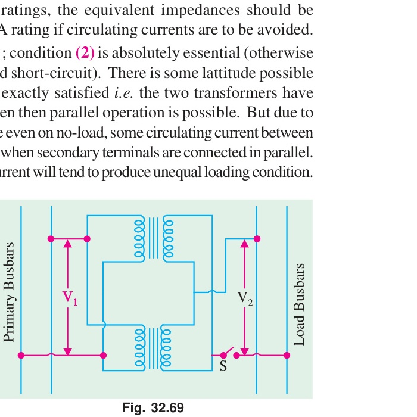
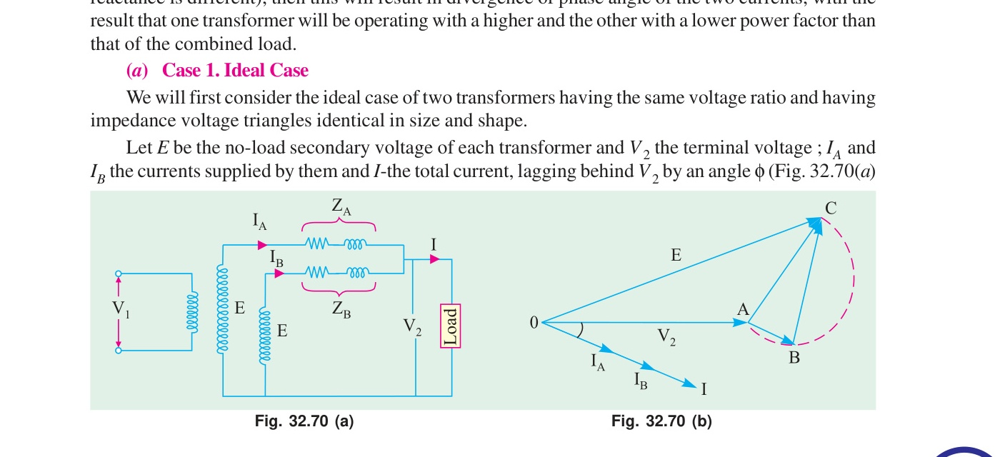
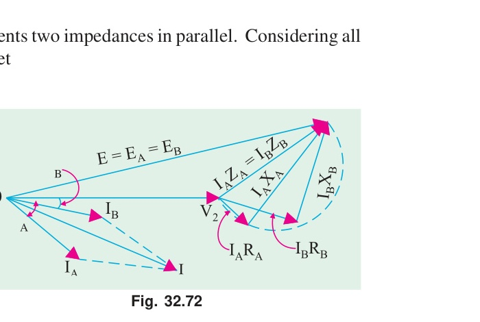
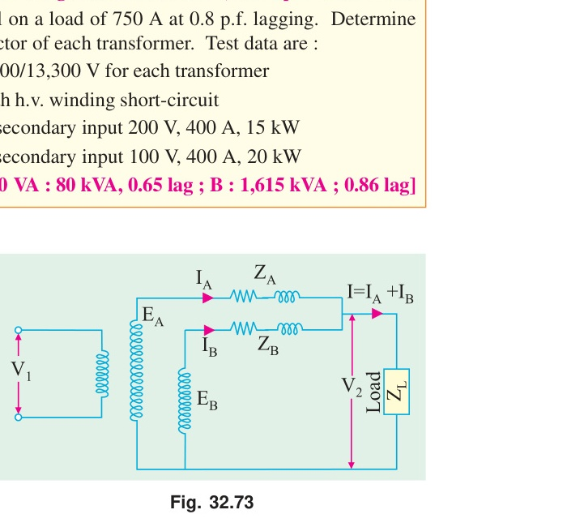
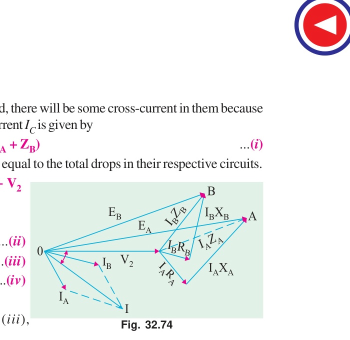
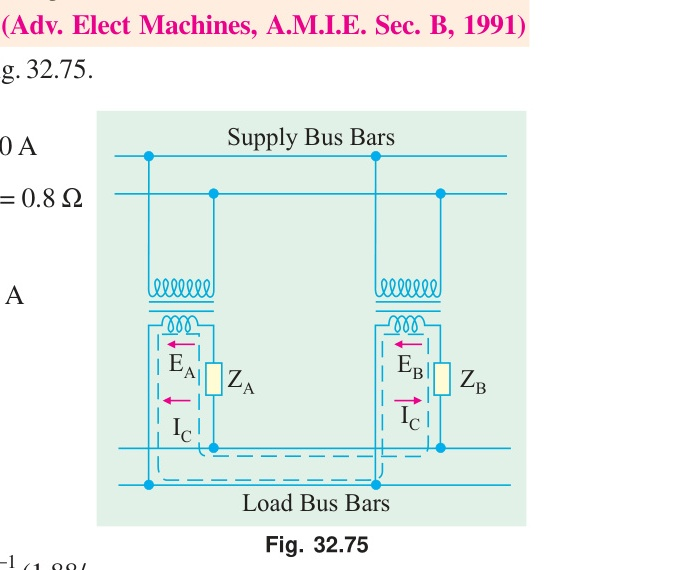

# Chapter 32: Transformer — Part 5: Parallel Operation and Objective Tests

> **Source:** B.L. Theraja & A.K. Theraja, *A Textbook of Electrical Technology — Volume II (AC & DC Machines)*, Chapter 32, pp. 1193–1210.
> **Scope:** Section 32.35 (Parallel Operation of Single-Phase Transformers: Equal and Unequal Voltage Ratios, Circulating Currents, Load Sharing), Examples 32.96 to 32.111, Tutorial Problems 32.6 & 32.7, Questions and Answers on Transformers (Q1–Q10), Objective Tests 32 (Questions 1–38 with Complete Answer Key).

---

<!-- Page 79 (p. 1193) -->

## 32.35. Parallel Operation of Single-phase Transformers

For supplying a load in excess of the rating of an existing transformer, two or more transformers may be connected in parallel with the existing transformer.

### Reasons for Parallel Operation:
1. **Economic considerations:** When power demand increases, installing an additional small transformer in parallel is much cheaper than replacing the existing one with a larger unit.
2. **Reliability and Continuity of Supply:** If one transformer fails or requires routine maintenance/overhaul, it can be disconnected without completely interrupting power supply to the consumers.
3. **Efficiency:** During light-load periods (e.g., at night), one or more transformers can be switched off so that the remaining units operate near their maximum efficiency.
4. **Future Expansion:** Substation capacity can be expanded incrementally as the load grows.

---

### Conditions for Parallel Operation:
To ensure successful parallel operation without dangerous circulating currents and to achieve proportional load sharing, the following conditions must be satisfied:

#### 1. Essential Conditions:
1. **Proper Polarity:** The transformers must be connected with correct polarity. If connected with wrong polarity, a dead short-circuit will result across the secondaries, producing massive circulating currents that can destroy the windings within seconds (as shown in Fig. 32.69).
2. **Equal Voltage Ratio:** The primary and secondary voltage ratings (turns ratio) must be identical so that their no-load secondary terminal voltages are equal ($E_A = E_B$).
3. **Same Frequency and Voltage Rating:** Both transformers must be designed for the same supply voltage and frequency.
4. **Phase Sequence and Phase Shift (for 3-Phase Transformers):** The phase sequence must be identical, and zero relative phase displacement must exist between secondary voltages.

#### 2. Desirable Conditions:
1. **Equal Per-Unit / Percentage Impedance:** The per-unit leakage impedances of the transformers based on their respective ratings must be equal. This ensures that load is shared in proportion to their kVA ratings.
2. **Equal $X/R$ Ratio:** The ratio of equivalent leakage reactance to resistance ($X/R$) should be equal for all units. This guarantees that all transformers operate at the same load power factor, preventing internal circulating currents that cause unnecessary heating.

---

<!-- Page 80 (p. 1194) -->

### Case 1: Transformers Having Equal Voltage Ratios ($E_A = E_B$)

When two transformers $A$ and $B$ have equal voltage ratios, their no-load secondary induced voltages are identical in magnitude and phase ($E_A = E_B = E$).

Let:
* $Z_A = R_A + j X_A =$ equivalent impedance of transformer $A$ referred to secondary
* $Z_B = R_B + j X_B =$ equivalent impedance of transformer $B$ referred to secondary
* $Z_L =$ load impedance connected across secondary bus-bars
* $V_2 =$ secondary terminal voltage under load
* $I_A, I_B =$ secondary currents supplied by transformers $A$ and $B$
* $I = I_A + I_B =$ total load current

Since the two secondary windings are connected in parallel across the common load terminals:
$$V_2 = E - I_A Z_A = E - I_B Z_B$$

$$\therefore I_A Z_A = I_B Z_B = I Z_{AB}$$

where $Z_{AB} = \frac{Z_A Z_B}{Z_A + Z_B}$ is the combined parallel impedance of the two transformers.

Therefore:
$$\mathbf{I_A = I \left(\frac{Z_B}{Z_A + Z_B}
ight)}$$

$$\mathbf{I_B = I \left(\frac{Z_A}{Z_A + Z_B}
ight)}$$

Multiplying both sides by the secondary terminal voltage $V_2$:
$$\mathbf{S_A = S \left(\frac{Z_B}{Z_A + Z_B}
ight)}$$

$$\mathbf{S_B = S \left(\frac{Z_A}{Z_A + Z_B}
ight)}$$

where:
* $S =$ total load kVA
* $S_A =$ load kVA shared by transformer $A$
* $S_B =$ load kVA shared by transformer $B$

---

### Example 32.96
*Two 1-phase transformers $A$ and $B$ are connected in parallel to supply a load of $200\text{ A}$ at $0.8\text{ p.f.}$ lagging. Their equivalent impedances referred to secondary are $Z_A = (0.15 + j 0.5)\ \Omega$ and $Z_B = (0.1 + j 0.6)\ \Omega$. Determine the current and power supplied by each transformer.*

#### Solution
Total load current:
$$I = 200 (0.8 - j 0.6) = 160 - j 120\text{ A} = 200 \angle -36.87^\circ\text{ A}$$

Impedances:
$$Z_A = 0.15 + j 0.5\ \Omega = 0.522 \angle 73.3^\circ\ \Omega$$
$$Z_B = 0.10 + j 0.6\ \Omega = 0.608 \angle 80.5^\circ\ \Omega$$
$$Z_A + Z_B = (0.15 + 0.10) + j (0.5 + 0.6) = 0.25 + j 1.1\ \Omega = 1.128 \angle 77.2^\circ\ \Omega$$

Current supplied by transformer $A$:
$$I_A = I \frac{Z_B}{Z_A + Z_B} = 200 \angle -36.87^\circ \times \frac{0.608 \angle 80.5^\circ}{1.128 \angle 77.2^\circ}$$
$$\mathbf{I_A = 107.8 \angle -33.57^\circ\text{ A}}$$
$$\text{Magnitude } I_A = \mathbf{107.8\text{ A}}, \quad \cos \phi_A = \cos(33.57^\circ) = \mathbf{0.833\text{ lag}}$$

Current supplied by transformer $B$:
$$I_B = I \frac{Z_A}{Z_A + Z_B} = 200 \angle -36.87^\circ \times \frac{0.522 \angle 73.3^\circ}{1.128 \angle 77.2^\circ}$$
$$\mathbf{I_B = 92.5 \angle -40.77^\circ\text{ A}}$$
$$\text{Magnitude } I_B = \mathbf{92.5\text{ A}}, \quad \cos \phi_B = \cos(40.77^\circ) = \mathbf{0.757\text{ lag}}$$

---

### Example 32.97
*Two single-phase transformers $A$ and $B$ are connected in parallel to an $11000\text{-V}$ bus-bar and supply a load of $1000\text{ kVA}$ at $0.8\text{ p.f.}$ lagging at $400\text{ V}$. Transformer $A$ is rated at $600\text{ kVA}$ and has impedance of $(1 + j 4)\%$, while transformer $B$ is rated at $400\text{ kVA}$ and has impedance of $(1.5 + j 5)\%$. Determine how the load is shared between the two transformers.*

#### Solution
Convert the percentage impedances to a common base of $1000\text{ kVA}$:
$$Z_{A(1000)} = (1 + j 4) \times \frac{1000}{600} = 1.67 + j 6.67\%$$
$$Z_{B(1000)} = (1.5 + j 5) \times \frac{1000}{400} = 3.75 + j 12.50\%$$

$$Z_A + Z_B = (1.67 + 3.75) + j (6.67 + 12.50) = 5.42 + j 19.17\% = 19.92 \angle 74.2^\circ\%$$
$$Z_A = 6.88 \angle 75.9^\circ\%, \quad Z_B = 13.05 \angle 73.3^\circ\%$$

Total load $S = 1000 \angle -36.87^\circ\text{ kVA}$.

Load shared by transformer $A$:
$$S_A = S \frac{Z_B}{Z_A + Z_B} = 1000 \angle -36.87^\circ \times \frac{13.05 \angle 73.3^\circ}{19.92 \angle 74.2^\circ} = \mathbf{655.1 \angle -37.77^\circ\text{ kVA}}$$
$$\mathbf{S_A = 655.1\text{ kVA at } 0.79\text{ p.f. lag}}$$

Load shared by transformer $B$:
$$S_B = S \frac{Z_A}{Z_A + Z_B} = 1000 \angle -36.87^\circ \times \frac{6.88 \angle 75.9^\circ}{19.92 \angle 74.2^\circ} = \mathbf{345.4 \angle -35.17^\circ\text{ kVA}}$$
$$\mathbf{S_B = 345.4\text{ kVA at } 0.817\text{ p.f. lag}}$$

---

### Example 32.98
*A $500\text{-kVA}$ transformer with $1.5\%$ resistance and $5\%$ reactance is connected in parallel with a $250\text{-kVA}$ transformer with $1\%$ resistance and $4\%$ reactance to supply a total load of $750\text{ kVA}$ at $0.8\text{ p.f.}$ lagging. Find the load shared by each transformer.*

#### Solution
Convert to common base of $500\text{ kVA}$:
$$Z_A = 1.5 + j 5 = 5.22 \angle 73.3^\circ\%$$
$$Z_B = (1 + j 4) \times \frac{500}{250} = 2 + j 8 = 8.25 \angle 76.0^\circ\%$$

$$Z_A + Z_B = (1.5 + 2) + j (5 + 8) = 3.5 + j 13 = 13.46 \angle 74.9^\circ\%$$

Total load $S = 750 \angle -36.87^\circ\text{ kVA}$.

$$S_A = 750 \angle -36.87^\circ \times \frac{8.25 \angle 76.0^\circ}{13.46 \angle 74.9^\circ} = \mathbf{459.7 \angle -35.77^\circ\text{ kVA}}$$
$$\mathbf{S_A = 459.7\text{ kVA at } 0.811\text{ p.f. lag}}$$

$$S_B = 750 \angle -36.87^\circ \times \frac{5.22 \angle 73.3^\circ}{13.46 \angle 74.9^\circ} = \mathbf{290.9 \angle -38.47^\circ\text{ kVA}}$$
$$\mathbf{S_B = 290.9\text{ kVA at } 0.783\text{ p.f. lag}}$$

---

### Example 32.99
*Two 1-phase transformers have the same voltage ratio and ratings of $200\text{ kVA}$ and $100\text{ kVA}$. The percentage impedances are $(1 + j 5)\%$ and $(1.5 + j 4)\%$ respectively. If the combined load is $300\text{ kVA}$ at $0.8\text{ p.f.}$ lagging, calculate the kVA and power factor of each transformer.*

#### Solution
Take $200\text{ kVA}$ base:
$$Z_A = 1 + j 5 = 5.1 \angle 78.7^\circ\%$$
$$Z_B = (1.5 + j 4) \times \frac{200}{100} = 3 + j 8 = 8.54 \angle 69.4^\circ\%$$
$$Z_A + Z_B = 4 + j 13 = 13.6 \angle 72.9^\circ\%$$

$$S_A = 300 \angle -36.9^\circ \times \frac{8.54 \angle 69.4^\circ}{13.6 \angle 72.9^\circ} = \mathbf{188.4 \angle -40.4^\circ\text{ kVA}}$$
$$\mathbf{\cos \phi_A = \cos(40.4^\circ) = 0.762\text{ lag}}$$

$$S_B = 300 \angle -36.9^\circ \times \frac{5.1 \angle 78.7^\circ}{13.6 \angle 72.9^\circ} = \mathbf{112.5 \angle -31.1^\circ\text{ kVA}}$$
$$\mathbf{\cos \phi_B = \cos(31.1^\circ) = 0.856\text{ lag}}$$

---

### Example 32.100
*Two transformers $A$ and $B$ are connected in parallel. Transformer $A$ has a rating of $1000\text{ kVA}$ with equivalent impedance $(0.01 + j 0.05)\text{ p.u.}$, while transformer $B$ is rated at $500\text{ kVA}$ with $(0.015 + j 0.04)\text{ p.u.}$ impedance. What is the maximum load that can be supplied by the parallel combination without overloading either transformer?*

#### Solution
Convert to $1000\text{ kVA}$ base:
$$Z_A = 0.01 + j 0.05\text{ p.u.} = 0.051 \angle 78.7^\circ$$
$$Z_B = (0.015 + j 0.04) \times \frac{1000}{500} = 0.03 + j 0.08\text{ p.u.} = 0.0854 \angle 69.4^\circ$$
$$Z_A + Z_B = 0.04 + j 0.13 = 0.136 \angle 72.9^\circ$$

The fraction of total load taken by each transformer:
$$\frac{|S_A|}{|S|} = \frac{|Z_B|}{|Z_A + Z_B|} = \frac{0.0854}{0.136} = 0.628$$
$$\frac{|S_B|}{|S|} = \frac{|Z_A|}{|Z_A + Z_B|} = \frac{0.051}{0.136} = 0.375$$

Check limits:
* If transformer $A$ is loaded to its full rating ($1000\text{ kVA}$):
  $$S = \frac{1000}{0.628} = 1592\text{ kVA}$$
  Then $S_B = 1592 \times 0.375 = 597\text{ kVA} > 500\text{ kVA}$ (Overloaded!)
* If transformer $B$ is loaded to its full rating ($500\text{ kVA}$):
  $$S = \frac{500}{0.375} = \mathbf{1333.3\text{ kVA}}$$
  Then $S_A = 1333.3 \times 0.628 = 837.3\text{ kVA} < 1000\text{ kVA}$ (Safe!)

$$\mathbf{\text{Maximum allowable combined load}} = \mathbf{1333.3\text{ kVA}}$$

---

### Example 32.101
*Two single-phase transformers $A$ and $B$ are connected in parallel to supply an inductive load of $500\text{ kW}$ at $0.8\text{ p.f.}$ lagging. The data of the transformers is:*
* *Transformer A: $250\text{ kVA}$, $R = 1\%$, $X = 5\%$*
* *Transformer B: $400\text{ kVA}$, $R = 1.2\%$, $X = 4\%$*
*Determine the kW and kVAR supplied by each transformer.*

#### Solution
Convert to $1000\text{ kVA}$ base:
$$Z_A = (1 + j 5) \times \frac{1000}{250} = 4 + j 20\% = 20.4 \angle 78.7^\circ\%$$
$$Z_B = (1.2 + j 4) \times \frac{1000}{400} = 3 + j 10\% = 10.44 \angle 73.3^\circ\%$$
$$Z_A + Z_B = 7 + j 30\% = 30.8 \angle 76.9^\circ\%$$

Total load:
$$P = 500\text{ kW} \implies S = \frac{500}{0.8} = 625\text{ kVA}$$
$$\mathbf{S} = 500 - j 375\text{ kVA} = 625 \angle -36.87^\circ\text{ kVA}$$

$$S_A = 625 \angle -36.87^\circ \times \frac{10.44 \angle 73.3^\circ}{30.8 \angle 76.9^\circ} = 211.8 \angle -40.47^\circ\text{ kVA}$$
$$\mathbf{P_A} = 211.8 \times \cos(40.47^\circ) = \mathbf{161.1\text{ kW}}$$
$$\mathbf{Q_A} = 211.8 \times \sin(40.47^\circ) = \mathbf{137.5\text{ kVAR}}$$

$$S_B = 625 \angle -36.87^\circ \times \frac{20.4 \angle 78.7^\circ}{30.8 \angle 76.9^\circ} = 413.9 \angle -35.07^\circ\text{ kVA}$$
$$\mathbf{P_B} = 413.9 \times \cos(35.07^\circ) = \mathbf{338.9\text{ kW}}$$
$$\mathbf{Q_B} = 413.9 \times \sin(35.07^\circ) = \mathbf{237.5\text{ kVAR}}$$

---

### Example 32.102
*A $100\text{-kVA}$ and a $50\text{-kVA}$ single-phase transformers are connected in parallel. Their resistances and reactances referred to secondary are:*
*$R_A = 0.02\ \Omega, X_A = 0.08\ \Omega; \quad R_B = 0.05\ \Omega, X_B = 0.12\ \Omega$.*
*Calculate the current in each transformer when supplying a total load of $400\text{ A}$ at $0.8\text{ p.f.}$ lagging.*

#### Solution
$$Z_A = 0.02 + j 0.08 = 0.0825 \angle 76.0^\circ\ \Omega$$
$$Z_B = 0.05 + j 0.12 = 0.130 \angle 67.4^\circ\ \Omega$$
$$Z_A + Z_B = 0.07 + j 0.20 = 0.212 \angle 70.7^\circ\ \Omega$$

Total current $I = 400 \angle -36.87^\circ\text{ A}$.

$$I_A = 400 \angle -36.87^\circ \times \frac{0.130 \angle 67.4^\circ}{0.212 \angle 70.7^\circ} = \mathbf{245.3 \angle -40.17^\circ\text{ A}}$$
$$\text{Magnitude } I_A = \mathbf{245.3\text{ A}}, \quad \cos \phi_A = \mathbf{0.764\text{ lag}}$$

$$I_B = 400 \angle -36.87^\circ \times \frac{0.0825 \angle 76.0^\circ}{0.212 \angle 70.7^\circ} = \mathbf{155.7 \angle -31.57^\circ\text{ A}}$$
$$\text{Magnitude } I_B = \mathbf{155.7\text{ A}}, \quad \cos \phi_B = \mathbf{0.852\text{ lag}}$$

---

### Example 32.103
*Two single-phase transformers $A$ and $B$ are connected in parallel to supply a lighting load of $100\text{ kW}$ and a motor load of $200\text{ kW}$ at $0.707\text{ p.f.}$ lagging. The ratings and impedances are:*
* *Transformer A: $200\text{ kVA}$, $Z_A = (0.01 + j 0.04)\text{ p.u.}$*
* *Transformer B: $200\text{ kVA}$, $Z_B = (0.015 + j 0.035)\text{ p.u.}$*
*Find the kVA and power factor of each transformer.*

#### Solution
Combined load:
* Lighting load: $P_1 = 100\text{ kW}, Q_1 = 0$
* Motor load: $P_2 = 200\text{ kW}, Q_2 = 200 \times \tan(\cos^{-1} 0.707) = 200\text{ kVAR}$
$$\text{Total } P = 100 + 200 = 300\text{ kW}$$
$$\text{Total } Q = 0 + 200 = 200\text{ kVAR}$$
$$\mathbf{S} = 300 - j 200\text{ kVA} = 360.55 \angle -33.69^\circ\text{ kVA}$$

Impedances (both on $200\text{ kVA}$ base):
$$Z_A = 0.01 + j 0.04 = 0.0412 \angle 76.0^\circ$$
$$Z_B = 0.015 + j 0.035 = 0.0381 \angle 66.8^\circ$$
$$Z_A + Z_B = 0.025 + j 0.075 = 0.0791 \angle 71.6^\circ$$

$$S_A = 360.55 \angle -33.69^\circ \times \frac{0.0381 \angle 66.8^\circ}{0.0791 \angle 71.6^\circ} = \mathbf{173.65 \angle -38.49^\circ\text{ kVA}}$$
$$\mathbf{\cos \phi_A = \cos(38.49^\circ) = 0.783\text{ lag}}$$

$$S_B = 360.55 \angle -33.69^\circ \times \frac{0.0412 \angle 76.0^\circ}{0.0791 \angle 71.6^\circ} = \mathbf{187.8 \angle -29.29^\circ\text{ kVA}}$$
$$\mathbf{\cos \phi_B = \cos(29.29^\circ) = 0.872\text{ lag}}$$

---

### Example 32.104
*Two transformers with percentage impedances $(1.2 + j 4)\%$ and $(1.5 + j 3.5)\%$ are connected in parallel. What fraction of the total load is taken by each transformer?*

#### Solution
Let impedances on a common base be:
$$Z_A = 1.2 + j 4 = 4.176 \angle 73.3^\circ\%$$
$$Z_B = 1.5 + j 3.5 = 3.808 \angle 66.8^\circ\%$$
$$Z_A + Z_B = 2.7 + j 7.5 = 7.971 \angle 70.2^\circ\%$$

Fraction taken by transformer $A$:
$$\mathbf{\frac{S_A}{S} = \frac{Z_B}{Z_A + Z_B} = \frac{3.808}{7.971} = 0.478 \quad (47.8\%)}$$

Fraction taken by transformer $B$:
$$\mathbf{\frac{S_B}{S} = \frac{Z_A}{Z_A + Z_B} = \frac{4.176}{7.971} = 0.524 \quad (52.4\%)}$$

---

### Example 32.105
*Two $6600/400\text{-V}$ transformers $A$ and $B$ of ratings $250\text{ kVA}$ and $500\text{ kVA}$ have percentage impedances of $(1 + j 4)\%$ and $(1.2 + j 3)\%$ respectively. Determine the greatest load at $0.8\text{ p.f.}$ lagging that can be supplied without overloading either transformer.*

#### Solution
Convert to $500\text{ kVA}$ base:
$$Z_A = (1 + j 4) \times \frac{500}{250} = 2 + j 8 = 8.246 \angle 76.0^\circ\%$$
$$Z_B = 1.2 + j 3 = 3.231 \angle 68.2^\circ\%$$
$$Z_A + Z_B = 3.2 + j 11 = 11.456 \angle 73.8^\circ\%$$

$$\frac{|S_A|}{|S|} = \frac{|Z_B|}{|Z_A + Z_B|} = \frac{3.231}{11.456} = 0.282$$
$$\frac{|S_B|}{|S|} = \frac{|Z_A|}{|Z_A + Z_B|} = \frac{8.246}{11.456} = 0.720$$

* If transformer $A$ operates at rated $250\text{ kVA}$:
  $$S = \frac{250}{0.282} = 886.5\text{ kVA} \implies S_B = 886.5 \times 0.720 = 638.3\text{ kVA} > 500\text{ kVA} \quad \text{(Overload!)}$$
* If transformer $B$ operates at rated $500\text{ kVA}$:
  $$S = \frac{500}{0.720} = \mathbf{694.4\text{ kVA}}$$
  $$S_A = 694.4 \times 0.282 = 195.8\text{ kVA} < 250\text{ kVA} \quad \text{(Safe!)}$$

$$\mathbf{\text{Maximum combined load}} = \mathbf{694.4\text{ kVA}}$$

---

## Tutorial Problems 32.6

1. **Two 1-phase transformers** $A$ and $B$ are connected in parallel. Transformer $A$ has a rating of $500\text{ kVA}$ and impedance of $(1 + j 4)\%$. Transformer $B$ has a rating of $250\text{ kVA}$ and impedance of $(1.5 + j 5)\%$. Find the load shared by each when the total load is $750\text{ kVA}$ at $0.8\text{ p.f.}$ lagging.  
   **[Answer: $S_A = 512\text{ kVA at } 0.81\text{ lag}; S_B = 239\text{ kVA at } 0.77\text{ lag}$]**

2. **Two single-phase transformers** in parallel supply a load of $500\text{ A}$ at $0.8\text{ p.f.}$ lagging. Equivalent impedances are $(0.1 + j 0.4)\ \Omega$ and $(0.05 + j 0.25)\ \Omega$. Calculate the current delivered by each.  
   **[Answer: $I_A = 193\text{ A}; I_B = 308\text{ A}$]**

3. **Two $11000/400\text{-V}$ transformers** are connected in parallel on both H.T. and L.T. sides. Calculate the current and power in each transformer when supplying a load of $200\text{ A}$ at $0.8\text{ power factor lagging}$.  
   *(London University)*  
   **[Answer: $I_A = 50.5\text{ A}, P_A = 100\text{ kW}; I_B = 151\text{ A}, P_B = 252\text{ kW}$]**

4. **Two $6600/250\text{-V}$ transformers** have the following short-circuit characteristics: Applied voltage $200\text{ V}$, current $30\text{ A}$, power input $1200\text{ W}$ for one transformer; and $120\text{ V}$, $20\text{ A}$, $1500\text{ W}$ for the other. Find the approximate current and power factor of each transformer when taking a total load of $150\text{ kW}$ at $0.8\text{ p.f.}$ lagging.  
   *(Baroda Univ. 1978)*  
   **[Answer: $I_A = 13.8\text{ A}, \cos \phi_A = 0.63; I_B = 15.35\text{ A}, \cos \phi_B = 0.91$]**

5. **Two $11000/2200\text{-V}$ transformers** are connected in parallel to supply a total load of $200\text{ A}$ at $0.8\text{ p.f.}$ lagging at $2200\text{ V}$. One transformer has $R = 0.4\ \Omega, X = 0.8\ \Omega$; the other has $R = 0.1\ \Omega, X = 0.3\ \Omega$. Determine current and power supplied by each.  
   **[Answer: $I_A = 52\text{ A}, P_A = 99\text{ kW}; I_B = 148\text{ A}, P_B = 252\text{ kW}$]**

6. **A $2000\text{-kVA}$ transformer $A$** is connected in parallel with a $4000\text{-kVA}$ transformer $B$ to supply a 3-phase load of $5000\text{ kVA}$ at $0.8\text{ p.f.}$ lagging. Resistance and reactance drops are: $A: 2\%, 8\%; B: 1.6\%, 3\%$. Determine kVA supplied by each.  
   *(Jadavpur Univ. 1979)*  
   **[Answer: $A: 860\text{ kVA}, 0.661\text{ lag}; B: 4170\text{ kVA}, 0.824\text{ lag}$]**

7. **Two single-phase transformers** work in parallel on a load of $750\text{ A}$ at $0.8\text{ p.f.}$ lagging. S.C. test data: $A: 200\text{ V}, 400\text{ A}, 15\text{ kW}; B: 100\text{ V}, 400\text{ A}, 20\text{ kW}$. Determine secondary voltage, output and power factor of each.  
   **[Answer: $V_2 = 3190\text{ V}; A: 80\text{ kVA}, 0.65\text{ lag}; B: 1615\text{ kVA}, 0.86\text{ lag}$]**

---

<!-- Page 87 (p. 1201) -->

### Case 2: Transformers Having Unequal Voltage Ratios ($E_A \ne E_B$)

In this case, the no-load secondary voltages $E_A$ and $E_B$ are unequal.

#### Circulating Current on No-Load:
Even when the secondaries are on no-load, a circulating cross-current $I_C$ flows between the two secondary windings:

$$\mathbf{I_C = \frac{E_A - E_B}{Z_A + Z_B}}$$

This current circulates in the local loop formed by the two secondaries and does not enter the external load circuit. It lags behind the difference voltage $(E_A - E_B)$ by an angle $\alpha$:
$$\tan \alpha = \frac{X_A + X_B}{R_A + R_B}$$

#### Load Currents Under Operating Conditions:
Let $Z_L$ be the load impedance across the common secondary terminals:
$$E_A = I_A Z_A + (I_A + I_B) Z_L$$
$$E_B = I_B Z_B + (I_A + I_B) Z_L$$

Solving these simultaneous equations gives the exact expressions:

$$\mathbf{I_A = \frac{E_A Z_B + (E_A - E_B) Z_L}{Z_A Z_B + Z_L(Z_A + Z_B)}}$$

$$\mathbf{I_B = \frac{E_B Z_A - (E_A - E_B) Z_L}{Z_A Z_B + Z_L(Z_A + Z_B)}}$$

Total load current:
$$I = I_A + I_B = \frac{E_A Z_B + E_B Z_A}{Z_A Z_B + Z_L(Z_A + Z_B)}$$

Terminal voltage under load:
$$V_2 = I Z_L = \frac{\frac{E_A}{Z_A} + \frac{E_B}{Z_B}}{\frac{1}{Z_A} + \frac{1}{Z_B} + \frac{1}{Z_L}} = \frac{E_A Y_A + E_B Y_B}{Y_A + Y_B + Y_L}$$

---

### Example 32.106
*Two transformers $A$ and $B$ are joined in parallel to the same load. Determine the current delivered by each transformer given: open-circuit e.m.f. $6600\text{ V}$ for $A$ and $6400\text{ V}$ for $B$. Equivalent leakage impedance in terms of secondary $= (0.3 + j 3)\ \Omega$ for $A$ and $(0.2 + j 1)\ \Omega$ for $B$. The load impedance is $(8 + j 6)\ \Omega$.*
*(Elect. Machines-I, Indore Univ. 1987)*

#### Solution
$E_A = 6600\text{ V}, \quad E_B = 6400\text{ V}$
$Z_A = 0.3 + j 3\ \Omega, \quad Z_B = 0.2 + j 1\ \Omega, \quad Z_L = 8 + j 6\ \Omega$

$$Z_A + Z_B = 0.5 + j 4\ \Omega$$
$$Z_A Z_B = (0.3 + j 3)(0.2 + j 1) = (0.06 - 3) + j(0.3 + 0.6) = -2.94 + j 0.9\ \Omega$$
$$Z_L(Z_A + Z_B) = (8 + j 6)(0.5 + j 4) = (4 - 24) + j(32 + 3) = -20 + j 35\ \Omega$$
$$\text{Denominator } D = Z_A Z_B + Z_L(Z_A + Z_B) = -22.94 + j 35.9\ \Omega = 42.6 \angle 122.6^\circ\ \Omega$$

Numerator for $I_A$:
$$E_A Z_B + (E_A - E_B) Z_L = 6600(0.2 + j 1) + 200(8 + j 6) = (1320 + j 6600) + (1600 + j 1200) = 2920 + j 7800 = 8328 \angle 69.5^\circ$$
$$\mathbf{I_A} = \frac{8328 \angle 69.5^\circ}{42.6 \angle 122.6^\circ} = \mathbf{195.5 \angle -53.1^\circ\text{ A}} = 117 - j 156\text{ A}$$
$$\text{Magnitude } I_A = \mathbf{195.5\text{ A}}$$

Numerator for $I_B$:
$$E_B Z_A - (E_A - E_B) Z_L = 6400(0.3 + j 3) - 200(8 + j 6) = (1920 + j 19200) - (1600 + j 1200) = 320 + j 18000 = 18003 \angle 89.0^\circ$$
$$\mathbf{I_B} = \frac{18003 \angle 89.0^\circ}{42.6 \angle 122.6^\circ} = \mathbf{422.6 \angle -33.6^\circ\text{ A}} = 352 - j 234\text{ A}$$
$$\text{Magnitude } I_B = \mathbf{422.6\text{ A}}$$

---

<!-- Page 90 (p. 1204) -->

### Example 32.107
*Two single-phase transformers of ratings $100\text{ kVA}$ and $50\text{ kVA}$ are connected in parallel to the same bus-bars on the primary side, their no-load secondary voltages being $1000\text{ V}$ and $950\text{ V}$ respectively. Their resistances are $2.0\%$ and $2.5\%$ respectively and reactances $8\%$ and $6\%$ respectively. Calculate the no-load circulating current in the secondaries.*
*(Adv. Elect. Machines, A.M.I.E. Sec. B, 1991)*

#### Solution
Transformer A ($100\text{ kVA}, 1000\text{ V}$):
$$I_{A(FL)} = \frac{100000}{1000} = 100\text{ A}$$
$$R_A = \frac{1000 \times 2.0}{100 \times 100} = 0.2\ \Omega, \quad X_A = \frac{1000 \times 8}{100 \times 100} = 0.8\ \Omega$$

Transformer B ($50\text{ kVA}, 950\text{ V}$):
$$I_{B(FL)} = \frac{50000}{950} = 52.63\text{ A}$$
$$R_B = \frac{950 \times 2.5}{100 \times 52.63} = 0.45\ \Omega, \quad X_B = \frac{950 \times 6}{100 \times 52.63} = 1.08\ \Omega$$

Combined loop impedance:
$$Z = \sqrt{(R_A + R_B)^2 + (X_A + X_B)^2} = \sqrt{(0.2 + 0.45)^2 + (0.8 + 1.08)^2} = \sqrt{0.65^2 + 1.88^2} = 1.99\ \Omega$$

No-load circulating current:
$$\mathbf{I_C} = \frac{E_A - E_B}{Z} = \frac{1000 - 950}{1.99} = \mathbf{25.1\text{ A}}$$
$$\text{Phase angle } \alpha = \tan^{-1}\left(\frac{1.88}{0.65}
ight) = \mathbf{70.9^\circ}$$

---

### Example 32.108
*Two single-phase transformers, one of $1000\text{-kVA}$ and the other of $500\text{-kVA}$ are connected in parallel to the same bus-bars on the primary side; their no-load secondary voltages being $500\text{ V}$ and $510\text{ V}$ respectively. The impedance voltage of the first transformer is 3% and that of the second 5%. Assuming that the ratio of resistance to reactance is the same and equal to 0.4 in each, what will be the cross current when the secondaries are connected in parallel?*
*(Electrical Machines-I, Madras Univ. 1985)*

#### Solution
Take an average secondary terminal voltage of $480\text{ V}$:
* Transformer A: $I_A = 1000000/480 = 2083\text{ A}$
  $$Z_A = \frac{3 \times 500}{100 \times 2083} = 0.0072\ \Omega$$
* Transformer B: $I_B = 500000/480 = 1042\text{ A}$
  $$Z_B = \frac{5 \times 510}{100 \times 1042} = 0.0245\ \Omega$$

Since $X/R$ is identical for both transformers, $Z_A$ and $Z_B$ have the same phase angle:
$$Z_A + Z_B = 0.0072 + 0.0245 = 0.0317\ \Omega$$

Circulating cross current:
$$\mathbf{I_C} = \frac{E_B - E_A}{Z_A + Z_B} = \frac{510 - 500}{0.0317} = \mathbf{315.4\text{ A}}$$

---

### Example 32.109
*Two transformers $A$ and $B$ of ratings $500\text{ kVA}$ and $250\text{ kVA}$ are supplying a load of $750\text{ kVA}$ at $0.8\text{ p.f.}$ lagging. Their open-circuit voltages are $405\text{ V}$ and $415\text{ V}$ respectively. Transformer $A$ has 1% resistance and 5% reactance and transformer $B$ has 1.5% resistance and 4% reactance. Find (a) cross-current in the secondaries on no-load and (b) the load shared by each transformer.*

#### Solution
Assume a nominal voltage of $400\text{ V}$:
* Transformer A ($500\text{ kVA}, 400\text{ V}$): $I_A = 1250\text{ A}$
  $$R_A = \frac{1 \times 400}{100 \times 1250} = 0.0032\ \Omega, \quad X_A = 0.016\ \Omega \implies Z_A = 0.0163 \angle 78.5^\circ\ \Omega$$
* Transformer B ($250\text{ kVA}, 400\text{ V}$): $I_B = 625\text{ A}$
  $$R_B = \frac{1.5 \times 400}{100 \times 625} = 0.0096\ \Omega, \quad X_B = 0.0256\ \Omega \implies Z_B = 0.0275 \angle 69.4^\circ\ \Omega$$
$$Z_A + Z_B = 0.0128 + j 0.0416 = 0.0436 \angle 72.9^\circ\ \Omega$$

**(a) No-load cross current:**
$$\mathbf{I_C} = \frac{E_A - E_B}{Z_A + Z_B} = \frac{405 - 415}{0.0436 \angle 72.9^\circ} = \frac{-10}{0.0436 \angle 72.9^\circ} = \mathbf{229.4 \angle -107.1^\circ\text{ A}}$$
$$\text{Magnitude } I_C = \mathbf{229.4\text{ A}}$$

**(b) Load shared by each transformer:**
Load impedance for $750\text{ kVA}$ at $0.8\text{ p.f.}$ ($400\text{ V}$):
$$Z_L = \frac{400^2}{750 \times 10^3} \angle 36.9^\circ = 0.2133 \angle 36.9^\circ\ \Omega = 0.1706 + j 0.128\ \Omega$$

Using the exact formulas:
$$I_A = \frac{E_A Z_B + (E_A - E_B) Z_L}{Z_A Z_B + Z_L(Z_A + Z_B)} = 970 \angle -35^\circ\text{ A}$$
$$\mathbf{S_A = 400 \times 970 \times 10^{-3} = 388\text{ kVA at } \cos(35^\circ) = 0.82\text{ lag}}$$

$$I_B = \frac{E_B Z_A - (E_A - E_B) Z_L}{Z_A Z_B + Z_L(Z_A + Z_B)} = 875 \angle -42.6^\circ\text{ A}$$
$$\mathbf{S_B = 400 \times 875 \times 10^{-3} = 350\text{ kVA at } \cos(42.6^\circ) = 0.736\text{ lag}}$$

---

### Example 32.110
*Two transformers $A$ and $B$ are connected in parallel to a load of $(2 + j 1.5)\ \Omega$. Their impedances in secondary terms are $Z_A = (0.15 + j 0.5)\ \Omega$ and $Z_B = (0.1 + j 0.6)\ \Omega$. Their no-load terminal voltages are $E_A = 207 \angle 0^\circ\text{ V}$ and $E_B = 205 \angle 0^\circ\text{ V}$. Find the power output and power factor of each transformer.*
*(Elect. Machines-I, Punjab Univ. 1991)*

#### Solution
$Z_A = 0.15 + j 0.5\ \Omega, \quad Z_B = 0.1 + j 0.6\ \Omega, \quad Z_L = 2 + j 1.5 = 2.5 \angle 36.9^\circ\ \Omega$

Using the exact expressions:
$$I_A = \frac{207(0.1 + j 0.6) + (207 - 205)(2 + j 1.5)}{(0.15 + j 0.5)(0.1 + j 0.6) + (2 + j 1.5)(0.25 + j 1.1)} = \frac{24.7 + j 127.2}{-1.435 + j 2.715} = \frac{129.7 \angle 79^\circ}{3.07 \angle 117.9^\circ} = \mathbf{42.26 \angle -38.9^\circ\text{ A}}$$

$$I_B = \frac{205(0.15 + j 0.5) - 2(2 + j 1.5)}{3.07 \angle 117.9^\circ} = \frac{103 \angle 75^\circ}{3.07 \angle 117.9^\circ} = \mathbf{33.56 \angle -42.9^\circ\text{ A}}$$

Terminal voltage:
$$V_2 = (I_A + I_B) Z_L = (57.47 - j 49.39)(2 + j 1.5) = 189.4 \angle -3.9^\circ\text{ V}$$

Power factor of transformer A:
$$\phi_A = -3.9^\circ - (-38.9^\circ) = 35^\circ \implies \mathbf{\cos \phi_A = \cos(35^\circ) = 0.819\text{ lag}}$$
$$\mathbf{P_A = 189.4 \times 42.26 \times 0.819 = 6556\text{ W}}$$

Power factor of transformer B:
$$\phi_B = -3.9^\circ - (-42.9^\circ) = 39^\circ \implies \mathbf{\cos \phi_B = \cos(39^\circ) = 0.777\text{ lag}}$$
$$\mathbf{P_B = 189.4 \times 33.56 \times 0.777 = 4940\text{ W}}$$

---

### Example 32.111
*Two transformers have the following particulars:*

| Parameter | Transformer A | Transformer B |
|---|---|---|
| Rated current | $200\text{ A}$ | $600\text{ A}$ |
| Per unit resistance | $0.02$ | $0.025$ |
| Per unit reactance | $0.05$ | $0.06$ |
| No-load e.m.f. | $245\text{ V}$ | $240\text{ V}$ |

*Calculate the terminal voltage when they are connected in parallel and supply a load impedance of $(0.25 + j 0.1)\ \Omega$.*
*(Elect. Machines-I, Sd. Patel Univ. 1981)*

#### Solution
Convert per unit impedances to ohms:
$$Z_A = \frac{245}{200}(0.02 + j 0.05) = 0.0245 + j 0.0613\ \Omega = 0.066 \angle 68.2^\circ\ \Omega$$
$$Z_B = \frac{240}{600}(0.025 + j 0.06) = 0.01 + j 0.024\ \Omega = 0.026 \angle 67.4^\circ\ \Omega$$

Load impedance:
$$Z_L = 0.25 + j 0.1 = 0.269 \angle 21.8^\circ\ \Omega$$

Denominator:
$$Z_A Z_B + Z_L(Z_A + Z_B) = 0.0259 \angle 92.7^\circ$$

Numerator for total load current:
$$E_A Z_B + E_B Z_A = 245(0.01 + j 0.024) + 240(0.0245 + j 0.0613) = 8.33 + j 20.57 = 22.15 \angle 67.9^\circ$$

Total load current:
$$I = \frac{22.15 \angle 67.9^\circ}{0.0259 \angle 92.7^\circ} = 855 \angle -24.8^\circ\text{ A}$$

Terminal voltage:
$$\mathbf{V_2 = I Z_L} = 855 \angle -24.8^\circ \times 0.269 \angle 21.8^\circ = \mathbf{230 \angle -3^\circ\text{ V}}$$

---

## Tutorial Problems 32.7

1. **A $1000\text{-kVA}$ and a $500\text{-kVA}$ single-phase transformer** are connected to the same bus-bars on the primary side. The secondary e.m.f.s at no-load are $500\text{ V}$ and $510\text{ V}$ respectively. The impedance voltage of the first transformer is $3.4\%$ and of the second $5\%$. What cross-current will pass between them when the secondaries are connected together in parallel? Assuming that the ratio of resistance to reactance is the same in each, what currents will flow in the windings of the two transformers when supplying a total load of $1200\text{ kVA}$?  
   *(City & Guilds, London)*  
   **[Answer: (i) Cross current $= 290\text{ A}$; (ii) $I_A = 1577\text{ A}$, $I_B = 900\text{ A}$]**

2. **Two transformers $A$ and $B$** are connected in parallel to supply a load having an impedance of $(2 + j 1.5)\ \Omega$. The equivalent impedances referred to the secondary windings are $(0.15 + j 0.5)\ \Omega$ and $(0.1 + j 0.6)\ \Omega$ respectively. The open-circuit e.m.f. of $A$ is $207\text{ V}$ and of $B$ is $205\text{ V}$. Calculate:  
   (i) the voltage at the load  
   (ii) the power supplied to the load  
   (iii) the power output of each transformer  
   (iv) the kVA input to each transformer.  
   **[Answer: (i) $189 \angle -3.8^\circ\text{ V}$; (ii) $11.5\text{ kW}$; (iii) $6.5\text{ kW}, 4.95\text{ kW}$; (iv) $8.7\text{ kVA}, 6.87\text{ kVA}$]**

---

<!-- Page 92 (p. 1206) -->

## Questions and Answers on Transformers

### Q.1. How is magnetic leakage reduced to a minimum in commercial transformers?
**Ans.** By interleaving the primary and secondary windings (sandwich or concentric cylindrical winding structures).

### Q.2. Mention the factors on which hysteresis loss depends.
**Ans.**
1. Quality and volume/amount of magnetic iron in the core
2. Maximum flux density ($B_{max}^{1.6}$)
3. Supply frequency ($f$).

### Q.3. How can eddy current loss be minimised?
**Ans.** By laminating the iron core using thin stampings insulated from one another by varnish or oxide film.

### Q.4. In practice, what determines the thickness of the laminae or stampings?
**Ans.** The operating frequency (thinner laminations are used for higher frequencies).

### Q.5. Does the transformer draw any current when its secondary is open?
**Ans.** Yes, it draws the no-load primary current ($I_0$).

### Q.6. Why?
**Ans.** To provide the magnetomotive force (m.m.f.) required to establish flux in the core and to supply no-load core (iron) and small primary copper losses.

### Q.7. Is Cu loss affected by power factor?
**Ans.** Yes, copper loss varies inversely with the square of the load power factor ($\cos^2 \phi$) for a given active load in kW.

### Q.8. Why?
**Ans.** Copper loss depends on the current ($I^2 R$). For a given power $P$, current $I = P / (V \cos \phi)$; hence current is higher when power factor is lower, causing greater $I^2 R$ loss.

### Q.9. What effects are produced by change in voltage?
**Ans.**
1. **Iron loss:** Varies approximately as $V^2$.
2. **Cu loss:** Varies inversely as $V^2$ if constant kVA output is assumed.
3. **Efficiency:** For distribution transformers, efficiency at fractional loads decreases with an increase in voltage, while at full-load or overload it increases with increase in voltage, and vice-versa.
4. **Regulation:** Varies as $V^2$, but decreases with increase in voltage if constant kVA output is maintained.
5. **Heating:** For constant kVA output, iron core temperatures increase whereas copper winding temperatures decrease with an increase in voltage.

### Q.10. How does change in frequency affect the operation of a given transformer?
**Ans.**
1. **Iron loss:** Increases with a decrease in frequency. A $60\text{-Hz}$ transformer operated on $50\text{ Hz}$ will have nearly 11% higher losses. When a $25\text{-Hz}$ transformer is operated on $60\text{ Hz}$, iron losses decrease by ~25%.
2. **Cu loss:** In distribution transformers, it is practically independent of frequency.
3. **Efficiency:** Since core loss is greater at lower frequency, overall efficiency is lower at a lower frequency.
4. **Regulation:** Regulation at unity power factor is unaffected (since $IR$ drop is frequency-independent). However, inductive reactance drop $IX = 2\pi f L I$ varies directly with frequency; therefore, regulation at lagging power factors improves (decreases) with lower frequency.
5. **Heating:** Total loss increases at lower frequency, increasing the operating temperature.

---

<!-- Page 94 (p. 1208) -->

## Objective Tests – 32

**1.** A transformer transforms:  
(a) frequency  
(b) voltage  
(c) current  
(d) voltage and current  

**2.** Which of the following is not a basic element of a transformer?  
(a) core  
(b) primary winding  
(c) secondary winding  
(d) mutual flux  

**3.** In an ideal transformer:  
(a) windings have no resistance  
(b) core has no losses  
(c) core has infinite permeability  
(d) all of the above  

**4.** The main purpose of using core in a transformer is to:  
(a) decrease iron losses  
(b) prevent eddy current loss  
(c) eliminate magnetic hysteresis  
(d) decrease reluctance of the common magnetic circuit  

**5.** Transformer cores are laminated in order to:  
(a) simplify its construction  
(b) minimise eddy current loss  
(c) reduce cost  
(d) reduce hysteresis loss  

**6.** A transformer having 1000 primary turns is connected to a $250\text{-V}$ a.c. supply. For a secondary voltage of $400\text{ V}$, the number of secondary turns should be:  
(a) 1600  
(b) 250  
(c) 400  
(d) 1250  

**7.** The primary and secondary induced e.m.f.s $E_1$ and $E_2$ in a transformer are:  
(a) in phase opposition with each other  
(b) in phase with each other  
(c) $90^\circ$ out of phase with each other  
(d) $180^\circ$ out of phase with the main flux  

**8.** The primary leakage flux links:  
(a) primary winding only  
(b) secondary winding only  
(c) both primary and secondary windings  
(d) none of the above  

**9.** The primary and secondary windings of an ordinary two-winding transformer are:  
(a) conductively linked  
(b) electrostatically linked  
(c) magnetically linked  
(d) mechanically linked  

**10.** In a transformer, the energy is transferred from primary to secondary:  
(a) through cooling coil  
(b) by magnetic flux  
(c) through air  
(d) by electric wires  

**11.** The no-load current of a transformer in terms of full-load current is usually:  
(a) 10 to 15%  
(b) 15 to 20%  
(c) 2 to 10%  
(d) 30 to 50%  

**12.** The no-load current of a transformer has:  
(a) high power factor  
(b) small magnitude and high power factor  
(c) large magnitude and low power factor  
(d) small magnitude and low power factor  

**13.** The no-load primary current $I_0$ lags behind the applied voltage $V_1$ by an angle $\phi_0$ which is about:  
(a) $90^\circ$  
(b) $75^\circ$  
(c) $0^\circ$  
(d) $45^\circ$  

**14.** In an ordinary transformer, which of the following remains constant from no-load to full-load?  
(a) secondary voltage  
(b) primary current  
(c) core loss  
(d) core flux  

**15.** Which of the following loss in a transformer remains constant with changes in load?  
(a) copper loss  
(b) stray load loss  
(c) core loss  
(d) all of the above  

**16.** The copper loss of a transformer at full load is $400\text{ W}$. At half full-load, it will be:  
(a) $100\text{ W}$  
(b) $200\text{ W}$  
(c) $400\text{ W}$  
(d) $800\text{ W}$  

**17.** The condition for maximum efficiency of a transformer is:  
(a) copper loss $= \text{half of iron loss}$  
(b) copper loss $= \text{twice of iron loss}$  
(c) copper loss $= \text{iron loss}$  
(d) iron loss $= 0$  

**18.** The maximum efficiency of a transformer occurs when it operates at:  
(a) full load  
(b) a load where copper loss equals iron loss  
(c) half load  
(d) overload  

**19.** A transformer has maximum efficiency at $3/4$ full load. The ratio of iron loss ($P_i$) to full-load copper loss ($P_c$) is:  
(a) $16/9$  
(b) $9/16$  
(c) $3/4$  
(d) $4/3$  

**20.** The rating of a transformer is given in kVA instead of kW because:  
(a) load power factor is often unknown  
(b) total losses depend on volt-amperes and not on power factor  
(c) copper loss depends on current and iron loss on voltage  
(d) both (b) and (c)  

**21.** The open-circuit test on a transformer gives:  
(a) copper loss  
(b) iron loss and no-load parameters  
(c) equivalent impedance  
(d) total full-load loss  

**22.** The short-circuit test on a transformer gives:  
(a) core loss  
(b) insulation resistance  
(c) voltage ratio  
(d) full-load copper loss and equivalent leakage impedance  

**23.** During the open-circuit test, the instruments are usually connected to:  
(a) high-voltage winding  
(b) whichever winding has higher current  
(c) low-voltage winding  
(d) either winding indifferently  

**24.** During the short-circuit test, the low-voltage winding is short-circuited because:  
(a) rated full-load current flows with a safe, convenient small voltage on the H.V. side  
(b) it prevents high current from damaging the instruments  
(c) it is easier to short-circuit thick conductors  
(d) none of the above  

**25.** Voltage regulation of a transformer is zero at a power factor which is:  
(a) unity  
(b) lagging  
(c) leading  
(d) zero  

**26.** A transformer has a negative voltage regulation when the load power factor is:  
(a) lagging  
(b) leading  
(c) unity  
(d) zero lagging  

**27.** The all-day efficiency of a transformer depends mainly on:  
(a) maximum load  
(b) the duration and magnitude of load cycle  
(c) operating temperature  
(d) power factor alone  

**28.** All-day efficiency is considered for:  
(a) power transformers  
(b) instrument transformers  
(c) distribution transformers  
(d) isolation transformers  

**29.** An auto-transformer has:  
(a) only one winding  
(b) two separate windings  
(c) three windings  
(d) none of the above  

**30.** The saving of copper in an auto-transformer compared to a 2-winding transformer is equal to:  
(a) $W_0$  
(b) $(1 - K) W_0$  
(c) $K W_0$  
(d) $W_0 / K$  

**31.** An auto-transformer is most economical when the transformation ratio $K$ is:  
(a) very large  
(b) very small  
(c) equal to zero  
(d) close to unity  

**32.** In an auto-transformer, power is transferred from primary to secondary:  
(a) inductively only  
(b) conductively only  
(c) electrostatically  
(d) both inductively and conductively  

**33.** When a two-winding transformer is converted into an auto-transformer, its kVA rating:  
(a) decreases  
(b) remains unchanged  
(c) increases  
(d) becomes zero  

**34.** Sumpner's test on two transformers is used to determine:  
(a) temperature rise and total losses under full-load conditions  
(b) copper losses only  
(c) iron losses only  
(d) turns ratio  

**35.** For parallel operation of two single-phase transformers, the most essential condition is:  
(a) same kVA rating  
(b) same polarity  
(c) same percentage impedance  
(d) same efficiency  

**36.** If two transformers having different voltage ratios are operated in parallel, then:  
(a) a circulating current flows even on no-load  
(b) both transformers will burn out  
(c) load will be shared equally  
(d) no current will flow  

**37.** Two transformers $A$ and $B$ having equal ratings are operated in parallel. Transformer $A$ has lower percentage impedance than transformer $B$. Transformer $A$ will:  
(a) take less load than B  
(b) share load equally with B  
(c) not take any load  
(d) take more load than B  

**38.** If percentage impedances of two parallel transformers are inversely proportional to their kVA ratings, they will:  
(a) operate at different power factors  
(b) burn out  
(c) share the load in proportion to their kVA ratings  
(d) take equal share of load  

---

### Answer Key (Objective Tests – 32)

| Q | Ans | Q | Ans | Q | Ans | Q | Ans | Q | Ans |
|:---:|:---:|:---:|:---:|:---:|:---:|:---:|:---:|:---:|:---:|
| **1** | (d) | **9** | (c) | **17** | (c) | **25** | (c) | **33** | (c) |
| **2** | (d) | **10** | (b) | **18** | (b) | **26** | (b) | **34** | (a) |
| **3** | (d) | **11** | (c) | **19** | (b) | **27** | (b) | **35** | (b) |
| **4** | (d) | **12** | (d) | **20** | (d) | **28** | (c) | **36** | (a) |
| **5** | (b) | **13** | (b) | **21** | (b) | **29** | (a) | **37** | (d) |
| **6** | (a) | **14** | (d) | **22** | (d) | **30** | (c) | **38** | (c) |
| **7** | (c) | **15** | (c) | **23** | (c) | **31** | (d) | | |
| **8** | (a) | **16** | (a) | **24** | (a) | **32** | (d) | | |

---
