# Chapter 34: Induction Motor

## Part 1: Construction & Rotating Magnetic Field

[⬅️ Back to Chapter 34 Master Index](Ch-34_Index.md) | [Next: Part 2 — Torque & Characteristics ➡️](Ch-34_02_Torque_and_Characteristics.md)

---

<!-- Page 1 (p. 1243) -->

# INDUCTION MOTOR

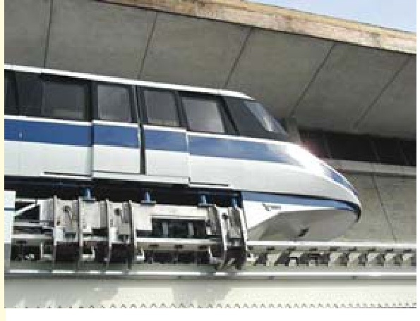

### Learning Objectives

- Classification of AC Motors
- Induction Motor: General Principle
- Construction
- Phase-wound Rotor
- Mathematical Proof
- Relation between Torque and Rotor Power Factor
- Condition for Maximum Starting Torque
- Rotor E.M.F and Reactance under Running Conditions
- Condition for Maximum Torque Under Running Conditions
- Rotor Torque and Breakdown Torque
- Relation between Torque and Slip
- Full-load Torque and Maximum Torque
- Starting Torque and Maximum Torque
- Torque/Speed Characteristic Under Load
- Complete Torque/Speed Curve of a Three-phase Machine
- Power Stages in an Induction Motor
- Torque Developed by an Induction Motor
- Induction Motor Torque Equation
- Variation in Rotor Current
- Sector Induction Motor
- Magnetic Levitation
- Induction Motor as a Generalized Transformer
- Power Balance Equation
- Maximum Power Output

---

<!-- Page 2 (p. 1244) -->

## 34.1. Classification of A.C. Motors

With the almost universal adoption of a.c. system of distribution of electric energy for light and power, the field of application of a.c. motors has widened considerably during recent years. As a result, motor manufactures have tried, over the last few decades, to perfect various types of a.c. motors suitable for all classes of industrial drives and for both single and three-phase a.c. supply. This has given rise to bewildering multiplicity of types whose proper classification often offers considerable difficulty. Different a.c. motors may, however, be classified and divided into various groups from the following different points of view :

### 1. AS REGARDS THEIR PRINCIPLE OF OPERATION

**(A) Synchronous motors**
- *(i)* plain and *(ii)* super—

**(B) Asynchronous motors**
- **(a) Induction motors**
  - *(i)* Squirrel cage: $\begin{cases} \text{single} \\ \text{double} \end{cases}$
  - *(ii)* Slip-ring (external resistance)
- **(b) Commutator motors**
  - *(i)* Series: $\begin{cases} \text{single phase} \\ \text{universal} \end{cases}$
  - *(ii)* Compensated: $\begin{cases} \text{conductively} \\ \text{inductively} \end{cases}$
  - *(iii)* Shunt: $\begin{cases} \text{simple} \\ \text{compensated} \end{cases}$
  - *(iv)* Repulsion: $\begin{cases} \text{straight} \\ \text{compensated} \end{cases}$
  - *(v)* Repulsion-start induction
  - *(vi)* Repulsion induction

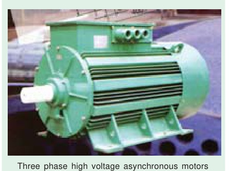

### 2. AS REGARDS THE TYPE OF CURRENT
- *(i)* single phase
- *(ii)* three phase

### 3. AS REGARDS THEIR SPEED
- *(i)* constant speed
- *(ii)* variable speed
- *(iii)* adjustable speed

### 4. AS REGARDS THEIR STRUCTURAL FEATURES
- *(i)* open
- *(ii)* enclosed
- *(iii)* semi-enclosed
- *(iv)* ventilated
- *(v)* pipe-ventilated
- *(vi)* riveted frame eye etc.

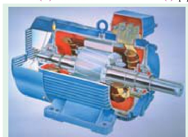

## 34.2. Induction Motor : General Principle

As a general rule, conversion of electrical power into mechanical power takes place in the *rotating* part of an electric motor. In d.c. motors, the electric power is *conducted* directly to the armature (*i.e.* rotating part) through brushes and commutator (Art. 29.1). Hence, in this sense, a d.c. motor can be called a *conduction* motor. However, in a.c. motors, the rotor does not receive electric power by conduction but by *induction* in exactly the same way as the secondary of a 2-winding transformer receives its power from

---

<!-- Page 3 (p. 1245) -->

the primary. That is why such motors are known as *induction* motors. In fact, an induction motor can be treated as a *rotating transformer i.e.* one in which primary winding is stationary but the secondary is free to rotate (Art. 34.47).

Of all the a.c. motors, the polyphase induction motor is the one which is extensively used for various kinds of industrial drives. It has the following main advantages and also some dis-advantages:

### Advantages:
1. It has very simple and extremely rugged, almost unbreakable construction (especially squirrel-cage type).
2. Its cost is low and it is very reliable.
3. It has sufficiently high efficiency. In normal running condition, no brushes are needed, hence frictional losses are reduced. It has a reasonably good power factor.
4. It requires minimum of maintenance.
5. It starts up from rest and needs no extra starting motor and has not to be synchronised. Its starting arrangement is simple especially for squirrel-cage type motor.

### Disadvantages:
1. Its speed cannot be varied without sacrificing some of its efficiency.
2. Just like a d.c. shunt motor, its speed decreases with increase in load.
3. Its starting torque is somewhat inferior to that of a d.c. shunt motor.

---

## 34.3. Construction

An induction motor consists essentially of two main parts :
- *(a)* a stator and
- *(b)* a rotor.

### (a) Stator

The stator of an induction motor is, in principle, the same as that of a synchronous motor or generator. It is made up of a number of stampings, which are slotted to receive the windings [Fig. 34.2 *(a)*]. The stator carries a 3-phase winding [Fig. 34.2 *(b)*] and is fed from a 3-phase supply. It is wound for a definite number of poles\*, the exact number of poles being determined by the requirements of speed. Greater the number of poles, lesser the speed and *vice versa*. It will be shown in Art. 34.6 that the stator windings, when supplied with 3-phase currents, produce a magnetic flux, which is of constant magnitude but which revolves (or rotates) at synchronous speed (given by $N_s = 120 f/P$). This revolving magnetic flux induces an e.m.f. in the rotor by mutual induction.

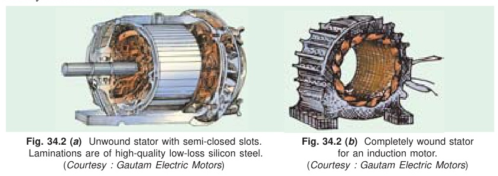

> \* *Note*: The number of poles $P$, produced in the rotating field is $P = 2n$ where $n$ is the number of stator slots/pole/phase.

---

<!-- Page 4 (p. 1246) -->

### (b) Rotor

- *(i)* **Squirrel-cage rotor** : Motors employing this type of rotor are known as squirrel-cage induction motors.
- *(ii)* **Phase-wound or wound rotor** : Motors employing this type of rotor are variously known as ‘phase-wound’ motors or ‘wound’ motors or as ‘slip-ring’ motors.

---

## 34.4. Squirrel-cage Rotor

Almost 90 per cent of induction motors are squirrel-cage type, because this type of rotor has the simplest and most rugged construction imaginable and is almost indestructible. The rotor consists of a cylindrical laminated core with parallel slots for carrying the rotor conductors which, it should be

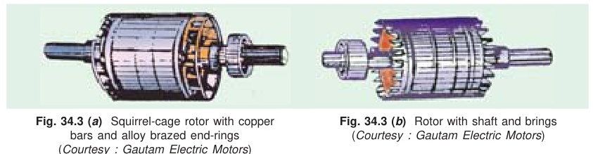

noted clearly, are not wires but consist of heavy bars of copper, aluminium or alloys. One bar is placed in each slot, rather the bars are inserted from the end when semi-closed slots are used. The rotor bars are brazed or electrically welded or bolted to two heavy and stout short-circuiting end-rings, thus giving us, what is so picturesquely called, a squirrel-cage construction (Fig. 34.3).

It should be noted that the *rotor bars are permanently short-circuited on themselves*, hence it is not possible to add any external resistance in series with the rotor circuit for starting purposes.

The rotor slots are usually not quite parallel to the shaft but are purposely given a slight skew (Fig. 34.4). This is useful in two ways :
- *(i)* it helps to make the motor run quietly by reducing the magnetic hum and
- *(ii)* it helps in reducing the locking tendency of the rotor *i.e.* the tendency of the rotor teeth to remain under the stator teeth due to direct magnetic attraction between the two.\*

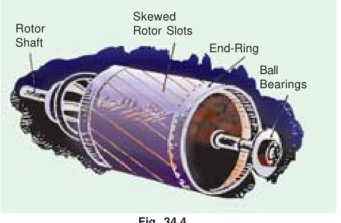

In small motors, another method of construction is used. It consists of placing the entire rotor core in a mould and casting all the bars and end-rings in one piece. The metal commonly used is an aluminium alloy.

Another form of rotor consists of a solid cylinder of steel without any conductors or slots at all. The motor operation depends upon the production of eddy currents in the steel rotor.

> \* *Note*: Other results of skew which may or may not be desirable are (i) increase in the effective ratio of transformation between stator and rotor (ii) increased rotor resistance due to increased length of rotor bars (iii) increased impedance of the machine at a given slip and (iv) increased slip for a given torque.

---

<!-- Page 5 (p. 1247) -->

## 34.5. Phase-wound Rotor

This type of rotor is provided with 3-phase, double-layer, distributed winding consisting of coils as used in alternators. The rotor is wound for as many poles as the number of stator poles and is always wound 3-phase even *when the stator is wound two-phase*.

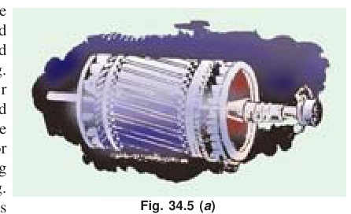

The three phases are starred internally. The other three winding terminals are brought out and connected to three insulated slip-rings mounted on the shaft with brushes resting on them [Fig. 34.5 *(b)*]. These three brushes are further externally connected to a 3-phase star-connected rheostat [Fig. 34.5 *(c)*]. This makes possible the introduction of additional resistance in the rotor circuit during the starting period for increasing the starting torque of the motor, as shown in Fig. 34.6 *(a)* (Ex. 34.7 and 34.10) and for changing its speed-torque/current characteristics. When running under normal conditions, the *slip-rings are automatically short-circuited* by means of a metal collar, which is pushed along the shaft and connects all the rings together. Next, the brushes are automatically lifted from the slip-rings to reduce the frictional losses and the wear and tear. Hence, it is seen that under normal running conditions, the wound rotor is short-circuited on itself just like the squirrel-cage rotor.

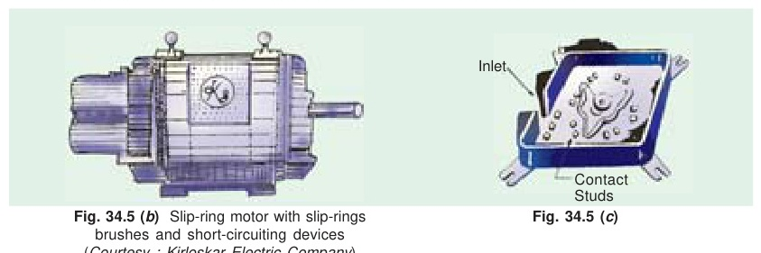

Fig. 34.6 *(b)* shows the longitudinal section of a slip-ring motor, whose structural details are as under :

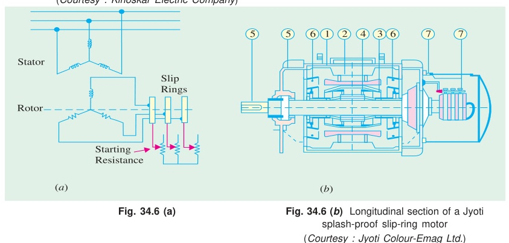

---

<!-- Page 6 (p. 1248) -->

1. **Frame.** Made of close-grained alloy cast iron.
2. **Stator and Rotor Core.** Built from high-quality low-loss silicon steel laminations and flash-enamelled on both sides.
3. **Stator and Rotor Windings.** Have moisture proof tropical insulation embodying mica and high quality varnishes. Are carefully spaced for most effective air circulation and are rigidly braced to withstand centrifugal forces and any short-circuit stresses.
4. **Air-gap.** The stator rabbets and bore are machined carefully to ensure uniformity of air-gap.
5. **Shafts and Bearings.** Ball and roller bearings are used to suit heavy duty, trouble-free running and for enhanced service life.
6. **Fans.** Light aluminium fans are used for adequate circulation of cooling air and are securely keyed onto the rotor shaft.
7. **Slip-rings and Slip-ring Enclosures.** Slip-rings are made of high quality phosphor-bronze and are of moulded construction.

Fig. 34.6 *(c)* shows the disassembled view of an induction motor with squirrel-cage rotor. According to the labelled notation *(a)* represents stator *(b)* rotor *(c)* bearing shields *(d)* fan *(e)* ventilation grill and *(f)* terminal box.

Similarly, Fig. 34.6 *(d)* shows the disassembled view of a slip-ring motor where *(a)* represents stator *(b)* rotor *(c)* bearing shields *(d)* fan *(e)* ventilation grill *(f)* terminal box *(g)* slip-rings *(h)* brushes and brush holders.

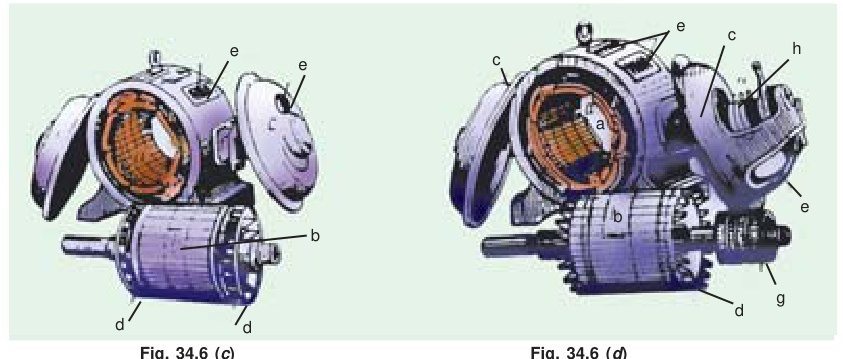

---

## 34.6. Production of Rotating Field

It will now be shown that when stationary coils, wound for two or three phases, are supplied by two or three-phase supply respectively, a uniformly-rotating (or revolving) magnetic flux of constant value is produced.

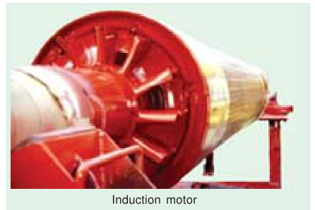

### Two-phase Supply

The principle of a 2-$\phi$, 2-pole stator having two identical windings, 90 space degrees apart, is illustrated in Fig. 34.7.

---

<!-- Page 7 (p. 1249) -->

The flux due to the current flowing in each phase winding is assumed sinusoidal and is represented in Fig. 34.9. The assumed positive directions of fluxes are those shown in Fig. 34.8.

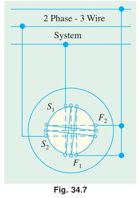

Let $\Phi_1$ and $\Phi_2$ be the instantaneous values of the fluxes set up by the two windings. The resultant flux $\Phi_r$ at any time is the vector sum of these two fluxes ($\Phi_1$ and $\Phi_2$) at that time. We will consider conditions at intervals of 1/8th of a time period *i.e.* at intervals corresponding to angles of $0^\circ, 45^\circ, 90^\circ, 135^\circ$ and $180^\circ$. It will be shown that resultant flux $\Phi_r$ is constant in magnitude *i.e.* equal to $\Phi_m$—the maximum flux due to either phase and is making one revolution/cycle. In other words, it means that the resultant flux rotates synchronously.

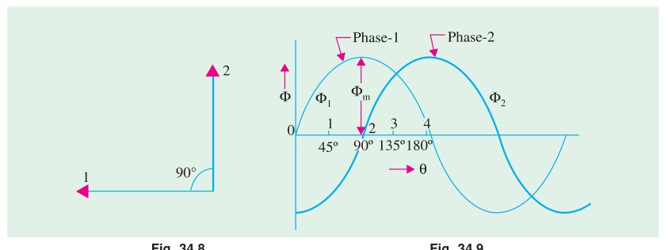

**(a) When $\theta = 0^\circ$** *i.e.* corresponding to point 0 in Fig. 34.9:
$$\Phi_1 = 0, \quad \Phi_2 = -\Phi_m$$
Hence, resultant flux $\Phi_r = \Phi_m$ and, being negative, is shown by a vector pointing downwards [Fig. 34.10 *(i)*].

**(b) When $\theta = 45^\circ$** *i.e.* corresponding to point 1 in Fig. 34.9:
At this instant, $\Phi_1 = \Phi_m/\sqrt{2}$ and is positive; $\Phi_2 = -\Phi_m/\sqrt{2}$ (still negative). Their resultant, as shown in Fig. 34.10 *(ii)*, is:
$$\Phi_r = \sqrt{\left(\frac{\Phi_m}{\sqrt{2}}\right)^2 + \left(\frac{\Phi_m}{\sqrt{2}}\right)^2} = \Phi_m$$
although this resultant has shifted $45^\circ$ clockwise.

**(c) When $\theta = 90^\circ$** *i.e.* corresponding to point 2 in Fig. 34.9:
Here $\Phi_2 = 0$, but $\Phi_1 = \Phi_m$ and is positive. Hence, $\Phi_r = \Phi_m$ and has further shifted by an angle of $45^\circ$ from its position in *(b)* or by $90^\circ$ from its original position in *(a)*.

**(d) When $\theta = 135^\circ$** *i.e.* corresponding to point 3 in Fig. 34.9:
Here, $\Phi_1 = \Phi_m/\sqrt{2}$ and is positive, $\Phi_2 = \Phi_m/\sqrt{2}$ and is also positive. The resultant:
$$\Phi_r = \Phi_m$$
and has further shifted clockwise by another $45^\circ$, as shown in Fig. 34.10 *(iv)*.

**(e) When $\theta = 180^\circ$** *i.e.* corresponding to point 4 in Fig. 34.9:
Here, $\Phi_1 = 0, \Phi_2 = \Phi_m$ and is positive. Hence, $\Phi_r = \Phi_m$ and has shifted clockwise by another $45^\circ$ or has rotated through an angle of $180^\circ$ from its position at the beginning. This is shown in Fig. 34.10 *(v)*.

---

<!-- Page 8 (p. 1250) -->

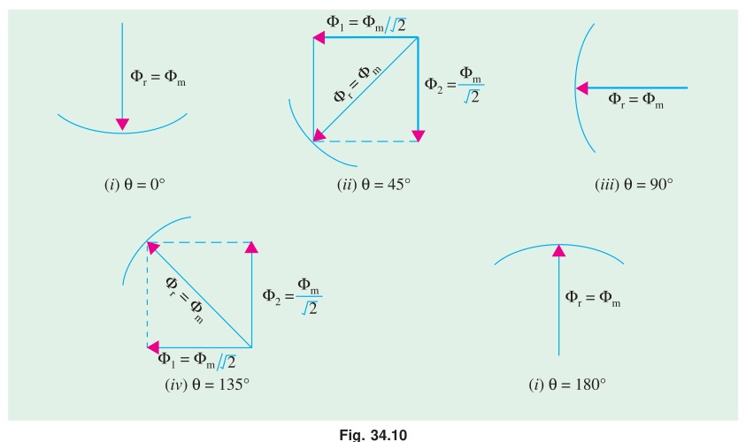

Hence, we conclude:
1. *that the magnitude of the resultant flux is constant and is equal to $\Phi_m$ — the maximum flux due to either phase.*
2. *that the resultant flux rotates at synchronous speed given by $N_s = 120 f/P\text{ rpm}$.*

However, it should be clearly understood that in this revolving field, there is no actual revolution of the flux. The flux due to each phase changes periodically, according to the changes in the phase current, but the magnetic flux itself does not move around the stator. It is only the *seat* of the resultant flux which keeps on shifting synchronously around the stator.

### Mathematical Proof (2-Phase)

Let:
$$\Phi_1 = \Phi_m \sin \omega t \quad \text{and} \quad \Phi_2 = \Phi_m \sin(\omega t - 90^\circ)$$

$$\therefore \Phi_r^2 = \Phi_1^2 + \Phi_2^2$$

$$\Phi_r^2 = (\Phi_m \sin \omega t)^2 + [\Phi_m \sin(\omega t - 90^\circ)]^2 = \Phi_m^2 (\sin^2 \omega t + \cos^2 \omega t) = \Phi_m^2$$

$$\therefore \Phi_r = \Phi_m$$

It shows that the flux is of constant value and does not change with time.

---

## 34.7. Three-phase Supply

It will now be shown that when three-phase windings displaced in space by $120^\circ$, are fed by three-phase currents, displaced in time by $120^\circ$, they produce a resultant magnetic flux, which rotates in space as if actual magnetic poles were being rotated mechanically.

The principle of a 3-phase, two-pole stator having three identical windings placed 120 space degrees apart is shown in Fig. 34.11. The flux (assumed sinusoidal) due to three-phase windings is shown in Fig 34.12.

The assumed positive directions of the fluxes are shown in Fig 34.13. Let the maximum value of flux due to any one of the three phases be $\Phi_m$. The resultant flux $\Phi_r$, at any instant, is given by the vector sum of the individual fluxes, $\Phi_1, \Phi_2$ and $\Phi_3$ due to three phases. We will consider values of $\Phi_r$ at four instants 1/6th time-period apart corresponding to points marked 0, 1, 2 and 3 in Fig. 34.12.

---

<!-- Page 9 (p. 1251) -->

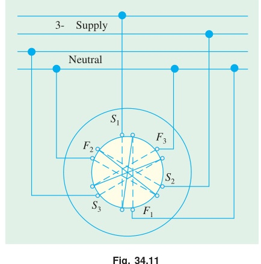

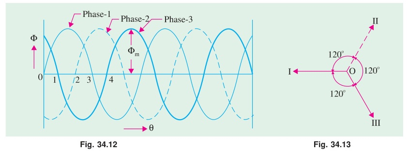

**(i) When $\theta = 0^\circ$** *i.e.* corresponding to point 0 in Fig. 34.12:
Here:
$$\Phi_1 = 0, \quad \Phi_2 = -\frac{\sqrt{3}}{2}\Phi_m, \quad \Phi_3 = \frac{\sqrt{3}}{2}\Phi_m$$

The vector for $\Phi_2$ in Fig. 34.14 *(i)* is drawn in a direction opposite to the direction assumed positive in Fig. 34.13.
$$\therefore \Phi_r = 2 \times \frac{\sqrt{3}}{2}\Phi_m \cos\frac{60^\circ}{2} = \sqrt{3} \times \frac{\sqrt{3}}{2}\Phi_m = \frac{3}{2}\Phi_m$$

**(ii) When $\theta = 60^\circ$** *i.e.* corresponding to point 1 in Fig. 34.12:
Here:
- $\Phi_1 = \frac{\sqrt{3}}{2}\Phi_m$ ...drawn parallel to $OI$ of Fig. 34.13 as shown in Fig. 34.14 *(ii)*
- $\Phi_2 = -\frac{\sqrt{3}}{2}\Phi_m$ ...drawn in opposition to $OII$ of Fig. 34.13.
- $\Phi_3 = 0$

$$\therefore \Phi_r = 2 \times \frac{\sqrt{3}}{2}\Phi_m \times \cos 30^\circ = \frac{3}{2}\Phi_m \quad \text{[Fig. 34.14 (ii)]}$$

It is found that the resultant flux is again $\frac{3}{2}\Phi_m$ but has rotated clockwise through an angle of $60^\circ$.

**(iii) When $\theta = 120^\circ$** *i.e.* corresponding to point 2 in Fig. 34.12:
Here:
$$\Phi_1 = \frac{\sqrt{3}}{2}\Phi_m, \quad \Phi_2 = 0, \quad \Phi_3 = -\frac{\sqrt{3}}{2}\Phi_m$$

It can be again proved that:
$$\Phi_r = \frac{3}{2}\Phi_m$$

So, the resultant is again of the same value, but has further rotated clockwise through an angle of $60^\circ$ [Fig. 34.14 *(iii)*].

---

<!-- Page 10 (p. 1252) -->

**(iv) When $\theta = 180^\circ$** *i.e.* corresponding to point 3 in Fig. 34.12:
$$\Phi_1 = 0, \quad \Phi_2 = \frac{\sqrt{3}}{2}\Phi_m, \quad \Phi_3 = -\frac{\sqrt{3}}{2}\Phi_m$$

The resultant is $\frac{3}{2}\Phi_m$ and has rotated clockwise through an additional angle $60^\circ$ or through an angle of $180^\circ$ from the start.

Hence, we conclude that:
1. *the resultant flux is of constant value = $\frac{3}{2}\Phi_m$ i.e. 1.5 times the maximum value of the flux due to any phase.*
2. *the resultant flux rotates around the stator at synchronous speed given by $N_s = 120 f/P$.*

Fig. 34.15 *(a)* shows the graph of the rotating flux in a simple way. As before, the positive directions of the flux phasors have been shown separately in Fig. 34.15 *(b)*. Arrows on these flux phasors are reversed when each phase passes through zero and becomes negative.

---

<!-- Page 11 (p. 1253) -->

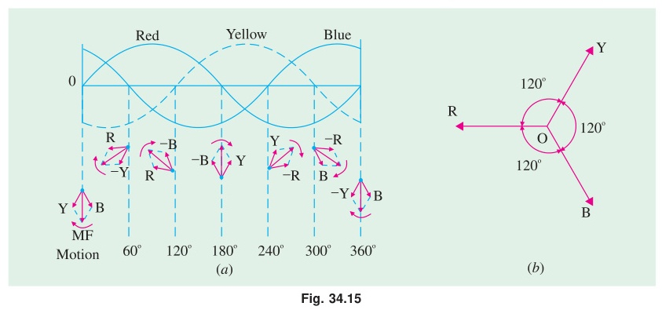

As seen, positions of the resultant flux phasor have been shown at intervals of $60^\circ$ only. The resultant flux produces a field rotating in the clockwise direction.

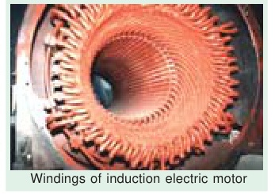

## 34.8. Mathematical Proof (3-Phase)

Taking the direction of flux due to phase 1 as reference direction, we have:
$$\Phi_1 = \Phi_m (\cos 0^\circ + j \sin 0^\circ) \sin \omega t$$

$$\Phi_2 = \Phi_m (\cos 240^\circ + j \sin 240^\circ) \sin(\omega t - 120^\circ)$$

$$\Phi_3 = \Phi_m (\cos 120^\circ + j \sin 120^\circ) \sin(\omega t - 240^\circ)$$

Expanding and adding the above equations, we get:
$$\Phi_r = \frac{3}{2}\Phi_m(\sin \omega t + j \cos \omega t) = \frac{3}{2}\Phi_m \angle(90^\circ - \omega t)$$

The resultant flux is of constant magnitude and does not change with time '$t$'.

---

## 34.9. Why Does the Rotor Rotate ?

The reason why the rotor of an induction motor is set into rotation is as follow:

When the 3-phase stator windings, are fed by a 3-phase supply then, as seen from above, a magnetic flux of constant magnitude, but rotating at synchronous speed, is set up. The flux passes through the air-gap, sweeps past the rotor surface and so cuts the rotor conductors which, as yet, are stationary. Due to the relative speed between the rotating flux and the stationary conductors, an e.m.f. is induced in the latter, according to Faraday’s laws of electro-magnetic induction. *The frequency of the induced e.m.f. is the same as the supply frequency.* Its magnitude is proportional to the relative velocity between the flux and the conductors and its direction is given by Fleming’s Right-hand rule. Since the rotor bars or conductors form a closed circuit, rotor current is produced whose direction, as given by Lenz’s law, is such as to oppose the very cause producing it. In this case, the cause which produces the rotor current is the relative velocity between the rotating flux of the stator and the stationary rotor conductors. Hence, to reduce the relative speed, the rotor starts running in the *same* direction as that of the flux and tries to catch up with the rotating flux.

The setting up of the torque for rotating the rotor is explained below :

---

<!-- Page 12 (p. 1254) -->

In Fig 34.16 *(a)* is shown the stator field which is assumed to be rotating clockwise. The relative motion of the rotor with respect to the stator is *anticlockwise*. By applying Right-hand rule, the direction of the induced e.m.f. in the rotor is found to be outwards. Hence, the direction of the flux due to rotor current *alone*, is as shown in Fig. 34.16 *(b)*. Now, by applying the Left-hand rule, or by the effect of combined field [Fig. 34.16 *(c)*] it is clear that the rotor conductors experience a force tending to rotate them in clockwise direction. Hence, the rotor is set into rotation in the same direction as that of the stator flux (or field).

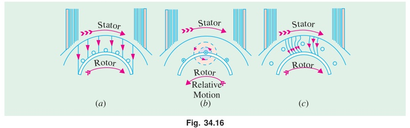

## 34.10. Slip

In practice, the rotor never succeeds in ‘catching up’ with the stator field. If it really did so, then there would be no relative speed between the two, hence no rotor e.m.f., no rotor current and so no torque to maintain rotation. That is why the rotor runs at a speed which is always less than the speed of the stator field. The difference in speeds depends upon the load on the motor.\*

The difference between the synchronous speed $N_s$ and the actual speed $N$ of the rotor is known as *slip*. Though it may be expressed in so many revolutions/second, yet it is usual to express it as a percentage of the synchronous speed. Actually, the term ‘*slip*’ is descriptive of the way in which the rotor ‘slips back’ from synchronism.

$$\% \text{ slip } s = \frac{N_s - N}{N_s} \times 100$$

Sometimes, $N_s - N$ is called the *slip speed*.

Obviously, rotor (or motor) speed is:
$$N = N_s (1 - s)$$

It may be kept in mind that revolving flux is rotating synchronously, relative to the stator (*i.e.* stationary space) but at slip speed relative to the rotor.

> \* *Note*: It may be noted that as the load is applied, the natural effect of the load or braking torque is to slow down the motor. Hence, slip increases and with it increases the current and torque, till the driving torque of the motor balances the retarding torque of the load. This fact determines the speed at which the motor runs on load.

---

## 34.11. Frequency of Rotor Current

When the rotor is stationary, the frequency of rotor current is *the same as the supply frequency*. But when the rotor starts revolving, then the frequency depends upon the relative speed or on slip-speed. Let at any slip-speed, the frequency of the rotor current be $f'$. Then

$$N_s - N = \frac{120 f'}{P} \quad \text{Also, } N_s = \frac{120 f}{P}$$

Dividing one by the other, we get,

$$\frac{f'}{f} = \frac{N_s - N}{N_s} = s \quad \therefore f' = s f$$

As seen, rotor currents have a frequency of $f' = sf$ and when flowing through the individual

---

<!-- Page 13 (p. 1255) -->

phases of rotor winding, give rise to rotor magnetic fields. These individual rotor magnetic fields produce a combined rotating magnetic field, whose speed relative to rotor is

$$= \frac{120 f'}{P} = \frac{120 sf}{P} = s N_s$$

However, the rotor itself is running at speed $N$ with respect to space. Hence,

$$\text{speed of rotor field in space} = \text{speed of rotor magnetic field relative to rotor} + \text{speed of rotor relative to space}$$

$$= s N_s + N = s N_s + N_s (1 - s) = N_s$$

It means that no matter what the value of slip, rotor currents and stator currents each produce a sinusoidally distributed magnetic field of constant magnitude and constant space speed of $N_s$. In other words, both the rotor and stator fields rotate synchronously, which means that they are stationary with respect to each other. These two synchronously rotating magnetic fields, in fact, superimpose on each other and give rise to the actually existing rotating field, which corresponds to the magnetising current of the stator winding.

---

### Numerical Examples (Articles 34.10 – 34.11)

> [!example] Example 34.1
> *A slip-ring induction motor runs at 290 r.p.m. at full load, when connected to 50-Hz supply. Determine the number of poles and slip.*
> *(Utilisation of Electric Power AMIE Sec. B 1991)*
> 
> **Solution.**
> Since $N$ is 290 rpm; $N_s$ has to be somewhere near it, say 300 rpm. If $N_s$ is assumed as 300 rpm, then:
> $$300 = \frac{120 \times 50}{P} \implies P = 20\text{ poles}$$
> $$\therefore s = \frac{300 - 290}{300} = 3.33\%$$

---

> [!example] Example 34.2
> *The stator of a 3-$\phi$ induction motor has 3 slots per pole per phase. If supply frequency is 50 Hz, calculate:*
> *(i) number of stator poles produced and total number of slots on the stator*
> *(ii) speed of the rotating stator flux (or magnetic field).*
> 
> **Solution.**
> **(i)** $P = 2n = 2 \times 3 = 6\text{ poles}$  
> Total No. of slots $= 3\text{ slots/pole/phase} \times 6\text{ poles} \times 3\text{ phases} = 54\text{ slots}$
> 
> **(ii)** $N_s = \frac{120 f}{P} = \frac{120 \times 50}{6} = 1000\text{ r.p.m.}$

---

> [!example] Example 34.3
> *A 4-pole, 3-phase induction motor operates from a supply whose frequency is 50 Hz. Calculate :*
> *(i) the speed at which the magnetic field of the stator is rotating.*
> *(ii) the speed of the rotor when the slip is 0.04.*
> *(iii) the frequency of the rotor currents when the slip is 0.03.*
> *(iv) the frequency of the rotor currents at standstill.*
> *(Electrical Machinery II, Banglore Univ. 1991)*
> 
> **Solution.**
> **(i)** Stator field revolves at synchronous speed, given by:
> $$N_s = \frac{120 f}{P} = \frac{120 \times 50}{4} = 1500\text{ r.p.m.}$$
> 
> **(ii)** Rotor (or motor) speed:
> $$N = N_s (1 - s) = 1500 (1 - 0.04) = 1440\text{ r.p.m.}$$
> 
> **(iii)** Frequency of rotor current:
> $$f' = sf = 0.03 \times 50 = 1.5\text{ r.p.s} = 90\text{ r.p.m} \quad (\text{or } 1.5\text{ Hz})$$
> 
> **(iv)** Since at standstill, $s = 1$:
> $$f' = sf = 1 \times f = f = 50\text{ Hz}$$

---

> [!example] Example 34.4
> *A 3-$\phi$ induction motor is wound for 4 poles and is supplied from 50-Hz system. Calculate (i) the synchronous speed (ii) the rotor speed, when slip is 4% and (iii) rotor frequency when rotor runs at 600 rpm.*
> *(Electrical Engineering-I, Pune Univ. 1991)*
> 
> **Solution.**
> **(i)** Synchronous speed:
> $$N_s = \frac{120 f}{P} = \frac{120 \times 50}{4} = 1500\text{ rpm}$$
> 
> **(ii)** Rotor speed:
> $$N = N_s (1 - s) = 1500 (1 - 0.04) = 1440\text{ rpm}$$
> 
> <!-- Page 14 (p. 1256) Top continuation -->
> **(iii)** When rotor speed is 600 rpm, slip is:
> $$s = \frac{N_s - N}{N_s} = \frac{1500 - 600}{1500} = 0.6$$
> Rotor current frequency:
> $$f' = sf = 0.6 \times 50 = 30\text{ Hz}$$

---

> [!example] Example 34.5
> *A 12-pole, 3-phase alternator driven at a speed of 500 r.p.m. supplies power to an 8-pole, 3-phase induction motor. If the slip of the motor, at full-load is 3%, calculate the full-load speed of the motor.*
> 
> **Solution.**
> Let $N =$ actual motor speed.
> Supply frequency from alternator:
> $$f = \frac{P \times N}{120} = \frac{12 \times 500}{120} = 50\text{ Hz}$$
> Synchronous speed of motor:
> $$N_s = \frac{120 \times 50}{8} = 750\text{ r.p.m.}$$
> $$\% \text{ slip } s = \frac{N_s - N}{N_s} \times 100 \implies 3 = \frac{750 - N}{750} \times 100 \implies N = 727.5\text{ r.p.m.}$$
> 
> > **Note**: Since slip is 3%, actual speed $N$ is less than $N_s$ by 3% of $N_s$ *i.e.* by $3 \times 750/100 = 22.5\text{ r.p.m.}$

---

[⬅️ Back to Chapter 34 Master Index](Ch-34_Index.md) | [Next: Part 2 — Torque & Characteristics ➡️](Ch-34_02_Torque_and_Characteristics.md)
