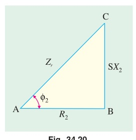
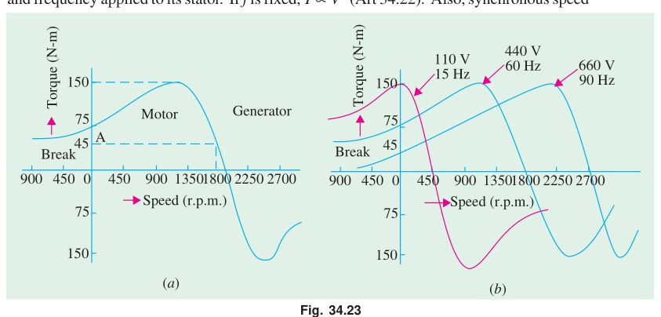
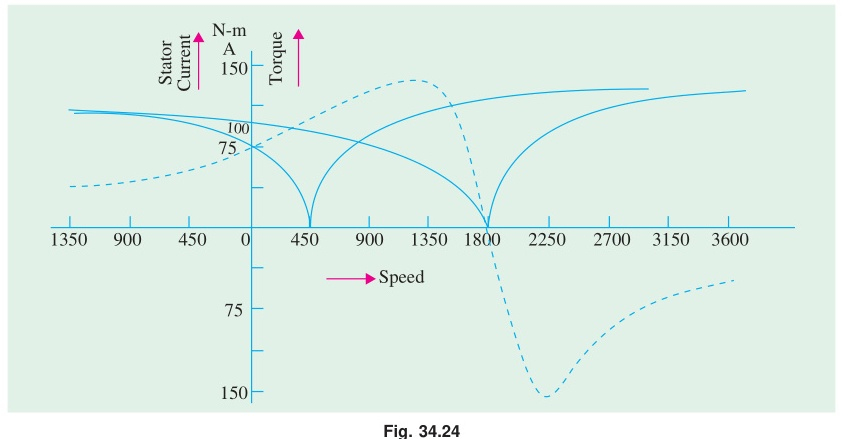
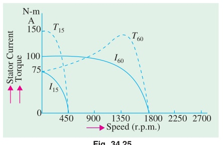
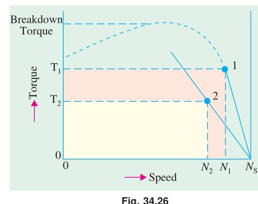
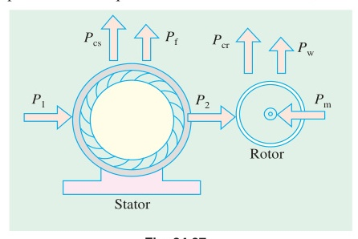
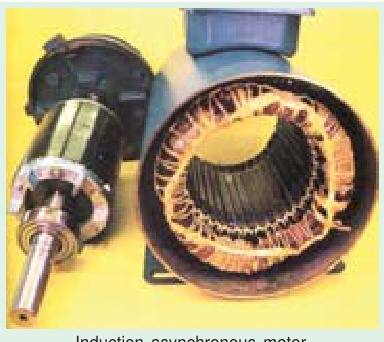

<!-- Chapter 34: Induction Motor (B.L. Theraja Vol-II) -->
<!-- Module 2: Torque Equations, Characteristics & Modes of Operation -->

# Chapter 34: Induction Motor

## Part 2: Torque Equations, Torque-Slip Characteristics & Modes of Operation

[⬅️ Back to Chapter 34 Master Index](Ch-34_Index.md) | [⬅️ Part 1: Construction & RMF](Ch-34_01_Construction_and_RMF.md) | [Next: Part 3 — Power Stages & Torque ➡️](Ch-34_03_Power_Stages_and_Torque.md)

---

<!-- Page 14 (p. 1256) -->

## 34.12. Relation Between Torque and Rotor Power Factor

In Art. 29.7, it has been shown that in the case of a d.c. motor, the torque $T_a$ is proportional to the product of armature current and flux per pole *i.e.* $T_a \propto \Phi I_a$. Similarly, in the case of an induction motor, the torque is also proportional to the product of flux per stator pole and the rotor current. However, there is one more factor that has to be taken into account *i.e.* the power factor of the rotor.

$$\therefore T \propto \Phi I_2 \cos \phi_2 \quad \text{or} \quad T = k \Phi I_2 \cos \phi_2$$

where:
- $I_2 =$ rotor current at standstill
- $\phi_2 =$ angle between rotor e.m.f. and rotor current
- $k =$ a constant

Denoting rotor e.m.f. at *standstill* by $E_2$, we have that $E_2 \propto \Phi$

$$\therefore T \propto E_2 I_2 \cos \phi_2 \quad \text{or} \quad T = k_1 E_2 I_2 \cos \phi_2$$

where $k_1$ is another constant.

The effect of rotor power factor on rotor torque is illustrated in Fig. 34.17 and Fig. 34.18 for various values of $\phi_2$. From the above expression for torque, it is clear that as $\phi_2$ increases (and hence, $\cos \phi_2$ decreases) the torque decreases and *vice versa*.

In the discussion to follow, the stator flux distribution is assumed sinusoidal. This revolving flux induces in each rotor conductor or bar an *e.m.f.* whose value depends on the flux density, in which the conductor is lying at the instant considered ($\because e = B l v\text{ volt}$). Hence, the induced e.m.f. in the rotor is also sinusoidal.

### (i) Rotor Assumed Non-inductive (or $\phi_2 = 0$)

In this case, the rotor current $I_2$ is in phase with the e.m.f. $E_2$ induced in the rotor (Fig. 34.17). The instantaneous value of the torque acting on each rotor conductor is given by the product of instantaneous value of the flux and the rotor current ($\because F \propto B I_2 l$). Hence, torque curve is obtained by plotting the products of flux $\phi$ (or flux density $B$) and $I_2$. It is seen that the torque is always positive *i.e.* unidirectional.

### (ii) Rotor Assumed Inductive

This case is shown in Fig. 34.18. Here, $I_2$ lags behind $E_2$ by an angle $\phi_2 = \tan^{-1}(X_2 / R_2)$ where $R_2 =$ rotor resistance/phase; $X_2 =$ rotor reactance/phase at *standstill*.

---

<!-- Page 15 (p. 1257) -->

It is seen that for a portion '$ab$' of the pole pitch, the torque is negative *i.e.* reversed. Hence, the total torque which is the difference of the forward and the backward torques, is considerably reduced. If $\phi_2 = 90^\circ$, then the total torque is zero because in that case the backward and the forward torques become equal and opposite.

---

## 34.13. Starting Torque

The torque developed by the motor at the instant of starting is called starting torque. In some cases, it is greater than the normal running torque, whereas in some other cases it is somewhat less.

Let:
- $E_2 =$ rotor *e.m.f.* per phase at *standstill*;
- $R_2 =$ rotor resistance/phase
- $X_2 =$ rotor reactance/phase at *standstill*

$$\therefore Z_2 = \sqrt{R_2^2 + X_2^2} = \text{rotor impedance/phase at standstill} \quad \text{...Fig. 34.19}$$

$$\text{Then, } I_2 = \frac{E_2}{Z_2} = \frac{E_2}{\sqrt{R_2^2 + X_2^2}}; \quad \cos \phi_2 = \frac{R_2}{Z_2} = \frac{R_2}{\sqrt{R_2^2 + X_2^2}}$$

Standstill or starting torque:
$$T_{st} = k_1 E_2 I_2 \cos \phi_2 \quad \text{...Art. 34.12}$$

$$\text{or } T_{st} = k_1 E_2 \cdot \frac{E_2}{\sqrt{R_2^2 + X_2^2}} \times \frac{R_2}{\sqrt{R_2^2 + X_2^2}} = \frac{k_1 E_2^2 R_2}{R_2^2 + X_2^2} \quad \text{...(i)}$$

If supply voltage $V$ is constant, then the flux $\Phi$ and hence, $E_2$ both are constant.

$$\therefore T_{st} = k_2 \frac{R_2}{R_2^2 + X_2^2} = k_2 \frac{R_2}{Z_2^2} \quad \text{where } k_2 \text{ is some other constant.}$$

$$\text{Now, } k_1 = \frac{3}{2\pi N_s}, \quad \therefore T_{st} = \frac{3}{2\pi N_s} \cdot \frac{E_2^2 R_2}{R_2^2 + X_2^2}$$

Where $N_s \to$ synchronous speed in rps.

---

## 34.14. Starting Torque of a Squirrel-cage Motor

The resistance of a squirrel-cage motor is fixed and small as compared to its reactance which is very large especially at the start because at standstill, the frequency of the rotor currents equals the supply frequency. Hence, the starting current $I_2$ of the rotor, though very large in magnitude, lags by a very large angle behind $E_2$, with the result that the starting torque per ampere is very poor. It is roughly 1.5 times the full-load torque, although the starting current is 5 to 7 times the full-load current. Hence, such motors are not useful where the motor has to start against heavy loads.

---

## 34.15. Starting Torque of a Slip-ring Motor

The starting torque of such a motor is increased by improving its power factor by adding external resistance in the rotor circuit from the star-connected rheostat, the rheostat resistance being progres-

---

<!-- Page 16 (p. 1258) -->

sively cut out as the motor gathers speed. Addition of external resistance, however, increases the rotor impedance and so reduces the rotor current. At first, the effect of improved power factor predominates the current-decreasing effect of impedance. Hence, starting torque is increased. But after a certain point, the effect of increased impedance predominates the effect of improved power factor and so the torque starts decreasing.

---

## 34.16. Condition for Maximum Starting Torque

It can be proved that starting torque will be maximum when rotor resistance/phase equals rotor reactance/phase.

Now:
$$T_{st} = \frac{k_2 R_2}{R_2^2 + X_2^2}$$

Differentiating with respect to $R_2$ and equating to zero:

$$\frac{d T_{st}}{d R_2} = k_2 \left[ \frac{1}{R_2^2 + X_2^2} - \frac{R_2 \cdot 2 R_2}{(R_2^2 + X_2^2)^2} \right] = 0$$

$$R_2^2 + X_2^2 - 2 R_2^2 = 0 \implies R_2 = X_2$$

---

## 34.17. Effect of Change in Supply Voltage on Starting Torque

We have seen in Art. 34.13 that:

$$T_{st} = \frac{k_1 E_2^2 R_2}{R_2^2 + X_2^2}$$

Since $E_2 \propto \text{supply voltage } V$:

$$T_{st} = \frac{k_3 V^2 R_2}{R_2^2 + X_2^2}$$

where $k_3$ is yet another constant. Hence:
$$T_{st} \propto V^2$$

Clearly, the starting torque is very sensitive to any changes in the supply voltage. A gentle change of 10% in supply voltage will result in:
$$1 - (0.9)^2 = 0.19 \quad \text{or } 19\% \text{ change in starting torque.}$$

This fact is of great importance in starting of induction motors through star-delta or auto-transformer starters.

---

### Numerical Examples (Articles 34.13 – 34.17)

> [!example] Example 34.6
> *A 3-$\phi$ induction motor having a star-connected rotor has an induced e.m.f. of 80 volts between slip-rings at standstill on open-circuit. The rotor has a resistance and standstill reactance of 1 $\Omega$ and 4 $\Omega$ per phase respectively. Calculate rotor current and rotor power factor at starting when (a) slip-rings are short-circuited (b) slip-rings are connected to a star-connected rheostat of 3 $\Omega$ per phase.*
> 
> **Solution.**
> **(a)** Standstill rotor e.m.f./phase $= 80 / \sqrt{3} = 46.2\text{ V}$  
> Rotor impedance/phase $= \sqrt{1^2 + 4^2} = 4.12\ \Omega$  
> Rotor current/phase $= 46.2 / 4.12 = 11.2\text{ A}$  
> Power factor $= \cos \phi_2 = 1 / 4.12 = 0.243\text{ (lagging)}$
> 
> **(b)** Rotor resistance/phase $= 1 + 3 = 4\ \Omega$  
> Rotor impedance/phase $= \sqrt{4^2 + 4^2} = 5.66\ \Omega$  
> Rotor current/phase $= 46.2 / 5.66 = 8.16\text{ A}$  
> Power factor $= \cos \phi_2 = 4 / 5.66 = 0.707\text{ (lagging)}$

---

> [!example] Example 34.7
> *A 3-phase, 400-V, 4-pole, 50-Hz, star-connected induction motor has a star-connected rotor with stator-to-rotor turns ratio of 6.5. The rotor resistance and standstill reactance per phase are 0.05 $\Omega$ and 0.25 $\Omega$ respectively. What should be the value of external resistance per phase to be inserted in the rotor circuit to obtain maximum torque at starting and what will be rotor starting current with this resistance?*
> 
> <!-- Page 17 (p. 1259) -->
> **Solution.**
> Here $K = \frac{1}{6.5}$ because transformation ratio $K = \frac{\text{rotor turns/phase}}{\text{stator turns/phase}}$.  
> Standstill rotor e.m.f./phase:
> $$E_2 = \frac{400}{\sqrt{3}} \times \frac{1}{6.5} = 35.5\text{ volt}$$
> It has been shown in Art. 34.16 that starting torque is maximum when $R_2 = X_2$ *i.e.* when $R_2 = 0.25\ \Omega$ in the present case.
> $$\therefore \text{External resistance/phase required} = 0.25 - 0.05 = 0.2\ \Omega$$
> Rotor impedance/phase:
> $$Z_2 = \sqrt{0.25^2 + 0.25^2} = 0.3535\ \Omega$$
> Rotor current/phase:
> $$I_2 = \frac{35.5}{0.3535} = 100\text{ A}$$

---

> [!example] Example 34.8
> *A 1100-V, 50-Hz delta-connected induction motor has a star-connected slip-ring rotor with a phase transformation ratio of 3.8. The rotor resistance and standstill leakage reactance are 0.012 $\Omega$ and 0.25 $\Omega$ per phase respectively. Neglecting stator impedance and magnetising current, determine:*
> *(i) the rotor current at start with slip-rings shorted*
> *(ii) the rotor power factor at start with slip-rings shorted*
> *(iii) the external resistance per phase required to obtain a starting current of 100 A in the stator supply lines.*
> 
> **Solution.**
> **(i)** Stator phase voltage $= 1100\text{ V}$.  
> Standstill rotor phase voltage:
> $$E_2 = 1100 \times \frac{1}{3.8} = 289.5\text{ V}$$
> Rotor impedance at start:
> $$Z_2 = \sqrt{0.012^2 + 0.25^2} \approx 0.25\ \Omega$$
> Starting rotor current:
> $$I_2 = \frac{289.5}{0.25} = 1158\text{ A}$$
> 
> **(ii)** Starting rotor power factor:
> $$\cos \phi_2 = \frac{R_2}{Z_2} = \frac{0.012}{0.25} = 0.048\text{ (lag)}$$
> 
> **(iii)** Stator line current $= 100\text{ A} \implies \text{Stator phase current } I_1 = \frac{100}{\sqrt{3}} = 57.7\text{ A}$.  
> Rotor current corresponding to this stator current:
> $$I_2 = 57.7 \times 3.8 = 219.3\text{ A}$$
> Total rotor circuit impedance required:
> $$Z = \frac{E_2}{I_2} = \frac{289.5}{219.3} = 1.32\ \Omega$$
> Total rotor resistance required:
> $$R = \sqrt{Z^2 - X_2^2} = \sqrt{1.32^2 - 0.25^2} = 1.296\ \Omega$$
> External resistance per phase required:
> $$r = R - R_2 = 1.296 - 0.012 = 1.284\ \Omega$$

---

> [!example] Example 34.9
> *A 150-kW, 3000-V, 50-Hz, 6-pole star-connected induction motor has a star-connected slip-ring rotor with a transformation ratio of 3.6 (stator to rotor). The rotor resistance per phase is 0.1 $\Omega$ and rotor standstill leakage inductance is 3.61 mH. The stator impedance may be neglected. Find the starting current and starting torque on rated voltage with short-circuited slip rings.*
> *(Elect. Machines, A.M.I.E. Sec. B, 1989)*
> 
> <!-- Page 18 (p. 1260) -->
> **Solution.**
> Standstill rotor reactance:
> $$X_2 = 2\pi \times 50 \times 3.61 \times 10^{-3} = 1.13\ \Omega$$
> Referring parameters to stator ($K = 1/3.6$):
> $$R_2' = \frac{R_2}{K^2} = (3.6)^2 \times 0.1 = 1.3\ \Omega$$
> $$X_2' = (3.6)^2 \times 1.13 = 14.7\ \Omega$$
> Starting current:
> $$I_{st} = \frac{V_1}{\sqrt{(R_2')^2 + (X_2')^2}} = \frac{3000 / \sqrt{3}}{\sqrt{(1.3)^2 + (14.7)^2}} = 117.4\text{ A}$$
> Synchronous speed:
> $$N_s = \frac{120 \times 50}{6} = 1000\text{ rpm} = \frac{50}{3}\text{ rps}$$
> Starting torque:
> $$T_{st} = \frac{3}{2\pi N_s} \cdot \frac{V_1^2 R_2'}{(R_2')^2 + (X_2')^2} = \frac{3}{2\pi (50/3)} \cdot \frac{(3000/\sqrt{3})^2 \times 1.3}{(1.3)^2 + (14.7)^2} = 513\text{ N}\cdot\text{m}$$

---

### Tutorial Problem No. 34.1

1. In the case of an 8-pole induction motor, the supply frequency was 50-Hz and the shaft speed was 735 r.p.m. What were the magnitudes of the following *(Nagpur Univ., Summer 2000)*:
   - *(i)* synchronous speed
   - *(ii)* speed of slip
   - *(iii)* per unit slip
   - *(iv)* percentage slip  
   **[Answers: 750 r.p.m.; 15 r.p.m.; 0.02; 2%]**

2. A 6-pole, 50-Hz squirrel-cage induction motor runs on load at a shaft speed of 970 r.p.m. Calculate:
   - *(i)* the percentage slip
   - *(ii)* the frequency of induced current in the rotor.  
   **[Answers: 3%; 1.5 Hz]**

3. An 8-pole alternator runs at 750 r.p.m. and supplies power to a 6-pole induction motor which has at full-load a slip of 3%. Find the full-load speed of the induction motor and the frequency of its rotor e.m.f.  
   **[Answers: 970 r.p.m.; 1.5 Hz]**

4. A 3-phase, 50-Hz induction motor with its rotor star-connected gives 500 V (r.m.s.) at standstill between the slip-rings on open-circuit. Calculate the current and power factor at standstill when the rotor winding is joined to a star-connected external circuit, each phase of which has a resistance of 10 $\Omega$ and an inductance of 0.04 H. The resistance per phase of the rotor winding is 0.2 $\Omega$ and its inductance is 0.04 H. Also, calculate the current and power factor when the slip-rings are short-circuited and the motor is running with a slip of 5 per cent. Assume the flux to remain constant.  
   **[Answers: 10.67 A; 0.376; 21.95 A; 0.303]**

5. Obtain an expression for the condition of maximum torque of an induction motor. Sketch the torque-slip curves for several values of rotor circuit resistance and indicate the condition for maximum torque to be obtained at starting. If the motor has a rotor resistance of 0.02 $\Omega$ and a standstill reactance of 0.1 $\Omega$, what must be the value of the total resistance of a starter for the rotor circuit for maximum torque to be exerted at starting ? *(City and Guilds, London)*  
   **[Answer: 0.08 $\Omega$]**

6. The rotor of a 6-pole, 50-Hz induction motor is rotated by some means at 1000 r.p.m. Compute (i) rotor voltage (ii) rotor frequency (iii) rotor slip and (iv) torque developed. Can the rotor rotate at this speed by itself ? *(Elect. Engg. Grad I.E.T.E. June 1985)*  
   **[Answers: (i) 0 (ii) 0 (iii) 0 (iv) 0; No]**

7. The rotor resistances per phase of a 4-pole, 50-Hz, 3-phase induction motor are 0.024 ohm and 0.12 ohm respectively. Find the speed at maximum torque. Also find the value of the additional rotor resistance per phase required to develop 80% of maximum torque at starting. *(Elect. Machines, A.M.I.E. Sec. B, 1990)*  
   **[Answers: 1200 r.p.m.; 0.036 $\Omega$]**

8. The resistance and reactance per phase of the rotor of a 3-phase induction motor are 0.6 ohm and 5 ohms respectively. The induction motor has a star-connected rotor and when the stator is connected to a supply of normal voltage, the induced e.m.f. between the slip rings at standstill is 80 V. Calculate the current in each phase and the power factor at starting when (i) the slip-rings are shorted, (ii) slip-rings are connected to a star-connected resistance of 4 ohm per phase. *(Rajiv Gandhi Technical University, Bhopal, 2000)*  
   **[Answers: (i) 9.17 amp, 0.1194 lag (ii) 6.8 amp, 0.6765 lag]**

---

<!-- Page 19 (p. 1261) -->

## 34.18. Rotor E.M.F. and Reactance Under Running Conditions

Let:
- $E_2 =$ *standstill* rotor induced e.m.f./phase
- $X_2 =$ *standstill* rotor reactance/phase, $f_2 =$ rotor current frequency at *standstill*

When rotor is stationary *i.e.* $s = 1$, the frequency of rotor e.m.f. is the same as that of the stator supply frequency. The value of e.m.f. induced in the rotor at standstill is maximum because the relative speed between the rotor and the revolving stator flux is maximum. In fact, the motor is equivalent to a 3-phase transformer with a short-circuited rotating secondary.

When rotor starts running, the relative speed between it and the rotating stator flux is decreased. Hence, the rotor induced e.m.f. which is directly proportional to this relative speed, is also decreased (and may disappear altogether if rotor speed were to become equal to the speed of stator flux). Hence, for a slip $s$, the rotor induced e.m.f. will be $s$ times the induced e.m.f. at standstill.

Therefore, under **running conditions**:
$$E_r = s E_2$$

The frequency of the induced e.m.f. will likewise become:
$$f_r = s f_2$$

Due to decrease in frequency of the rotor e.m.f., the rotor reactance will also decrease.
$$\therefore X_r = s X_2$$

where $E_r$ and $X_r$ are rotor e.m.f. and reactance under *running* conditions.

---

## 34.19. Torque Under Running Conditions

$$T \propto E_r I_r \cos \phi_2 \quad \text{or} \quad T \propto \Phi I_r \cos \phi_2 \quad (\because E_r \propto \Phi)$$

where:
- $E_r =$ rotor e.m.f./phase under *running conditions*
- $I_r =$ rotor current/phase under *running conditions*

Now:
$$E_r = s E_2$$
$$I_r = \frac{E_r}{Z_r} = \frac{s E_2}{\sqrt{R_2^2 + (s X_2)^2}}$$
$$\cos \phi_2 = \frac{R_2}{\sqrt{R_2^2 + (s X_2)^2}} \quad \text{—Fig. 34.20}$$

$$\therefore T \propto \frac{s \Phi E_2 R_2}{R_2^2 + (s X_2)^2} = \frac{k \Phi \cdot s \cdot E_2 R_2}{R_2^2 + (s X_2)^2}$$

$$\text{Also } T = \frac{k_1 \cdot s E_2^2 R_2}{R_2^2 + (s X_2)^2} \quad (\because E_2 \propto \Phi)$$

where $k_1$ is another constant. Its value can be proved to be equal to $3 / (2\pi N_s)$ (Art. 34.38). Hence, in that case, expression for torque becomes:

$$T = \frac{3}{2\pi N_s} \cdot \frac{s E_2^2 R_2}{R_2^2 + (s X_2)^2} = \frac{3}{2\pi N_s} \cdot \frac{s E_2^2 R_2}{Z_r^2}$$

At standstill when $s = 1$, obviously:

$$T_{st} = \frac{k_1 E_2^2 R_2}{R_2^2 + X_2^2} \quad \text{or} \quad T_{st} = \frac{3}{2\pi N_s} \cdot \frac{E_2^2 R_2}{R_2^2 + X_2^2} \quad \text{the same as in Art. 34.13.}$$

---

> [!example] Example 34.10
> *The star connected rotor of an induction motor has a standstill impedance of $(0.4 + j4)$ ohm per phase and the rheostat impedance per phase is $(6 + j2)$ ohm. The motor has an induced emf of 80 V between slip-rings at standstill when connected to its normal supply voltage. Find:*
> *(i) rotor current at standstill with the rheostat is in the circuit.*
> *(ii) when the slip-rings are short-circuited and motor is running with a slip of 3%.*
> *(Elect.Engg. I, Nagpur Univ. 1993)*
> 
> <!-- Page 20 (p. 1262) -->
> **Solution.**
> **(1) Standstill Conditions**  
> Voltage/rotor phase $= 80 / \sqrt{3} = 46.2\text{ V}$  
> Total rotor and starter impedance/phase:
> $$Z = (0.4 + 6) + j(4 + 2) = 6.4 + j6 = 8.77 \angle 43.15^\circ\ \Omega$$
> Rotor current/phase:
> $$I = \frac{46.2}{8.77} = 5.27\text{ A} \quad (\text{p.f.} = \cos 43.15^\circ = 0.729)$$
> 
> **(2) Running Conditions ($s = 0.03$)**  
> Rotor e.m.f./phase:
> $$E_r = s E_2 = 0.03 \times 46.2 = 1.386\text{ V}$$
> Rotor reactance/phase:
> $$X_r = s X_2 = 0.03 \times 4 = 0.12\ \Omega$$
> Rotor impedance/phase:
> $$Z_r = \sqrt{0.4^2 + 0.12^2} = 0.4176\ \Omega$$
> Rotor current/phase:
> $$I_r = \frac{1.386}{0.4176} = 3.3\text{ A} \quad (\text{p.f.} = \frac{0.4}{0.4176} = 0.958)$$

---

## 34.20. Condition for Maximum Torque Under Running Conditions

The torque of a rotor under running conditions is:
$$T = \frac{k \Phi s E_2 R_2}{R_2^2 + (s X_2)^2} \quad \text{...(i)}$$

The condition for maximum torque may be obtained by differentiating $T$ with respect to slip $s$ and equating to zero:

$$\frac{dT}{ds} = k \Phi E_2 R_2 \left[ \frac{1}{R_2^2 + s^2 X_2^2} - \frac{s(2s X_2^2)}{(R_2^2 + s^2 X_2^2)^2} \right] = 0$$

$$R_2^2 + s^2 X_2^2 - 2 s^2 X_2^2 = 0 \implies R_2^2 = s^2 X_2^2 \implies R_2 = s X_2$$

$$\text{or } s = \frac{R_2}{X_2}$$

*Slip corresponding to maximum torque is $s = R_2 / X_2$.*

This slip is sometimes denoted as $s_b$ or $s_m$. Substituting $R_2 = s X_2$ into the torque formula:

$$T_{max} = \frac{k \Phi \cdot s E_2 \cdot (s X_2)}{(s X_2)^2 + (s X_2)^2} = \frac{k \Phi E_2}{2 X_2} \quad \text{...(ii)}$$

Since $k_1 = \frac{3}{2\pi N_s}$:

$$T_{max} = \frac{3}{2\pi N_s} \cdot \frac{E_2^2}{2 X_2}\text{ N}\cdot\text{m}$$

From the above, it is found:
1. *that the maximum torque is independent of rotor resistance as such.*
2. *however, the speed or slip at which maximum torque occurs is determined by the rotor resistance.* By varying rotor resistance (possible with slip-ring motors), maximum torque can be made to occur at any desired slip (or motor speed).
3. *maximum torque varies inversely as standstill reactance.* Hence, it should be kept as small as possible.
4. *maximum torque varies directly as the square of applied voltage.*
5. *to obtain maximum torque at starting ($s = 1$), the condition is $R_2 = X_2$.*

---

<!-- Page 21 (p. 1263) -->

## 34.21. Rotor Torque and Breakdown Torque

The maximum torque $T_{max}$ is also known as **breakdown torque** ($T_b$) or **pull-out torque**.

Let:
- $T =$ torque at slip $s$
- $T_{max} = T_b =$ maximum torque at slip $s_b = R_2 / X_2$

Then from Art. 34.19 and 34.20:
$$T \propto \frac{s R_2}{R_2^2 + (s X_2)^2} \quad \text{and} \quad T_{max} \propto \frac{1}{2 X_2}$$

$$\frac{T}{T_{max}} = \frac{2 s R_2 X_2}{R_2^2 + (s X_2)^2}$$

Dividing numerator and denominator by $X_2^2$:

$$\frac{T}{T_{max}} = \frac{2 s (R_2/X_2)}{(R_2/X_2)^2 + s^2} = \frac{2 s s_b}{s_b^2 + s^2}$$

Dividing both by $s \cdot s_b$:

$$\frac{T}{T_{max}} = \frac{2}{\frac{s}{s_b} + \frac{s_b}{s}}$$

---

> [!example] Example 34.11
> *A 3-phase, slip-ring, induction motor with star-connected rotor has an induced e.m.f. of 120 V between slip-rings at standstill with normal-voltage applied to the stator. The rotor winding has a resistance per phase of 0.3 $\Omega$ and standstill leakage reactance per phase of 1.5 $\Omega$. Calculate (i) rotor current/phase when running short-circuited with 4 percent slip and the power factor (ii) the slip and rotor current corresponding to maximum torque.*
> 
> **Solution.**
> Standstill rotor e.m.f./phase $= 120 / \sqrt{3} = 69.3\text{ V}$.
> 
> **(i) At 4% slip ($s = 0.04$):**
> $$E_r = s E_2 = 0.04 \times 69.3 = 2.77\text{ V}$$
> $$X_r = s X_2 = 0.04 \times 1.5 = 0.06\ \Omega$$
> $$Z_r = \sqrt{0.3^2 + 0.06^2} = 0.306\ \Omega$$
> $$I_r = \frac{2.77}{0.306} = 9.05\text{ A}$$
> $$\cos \phi_r = \frac{0.3}{0.306} = 0.98\text{ (lagging)}$$
> 
> **(ii) At maximum torque:**
> $$s = \frac{R_2}{X_2} = \frac{0.3}{1.5} = 0.2 \quad (20\%)$$
> $$E_r = 0.2 \times 69.3 = 13.86\text{ V}$$
> $$X_r = 0.2 \times 1.5 = 0.3\ \Omega$$
> $$Z_r = \sqrt{0.3^2 + 0.3^2} = 0.424\ \Omega$$
> $$I_r = \frac{13.86}{0.424} = 32.7\text{ A}$$

---

> [!example] Example 34.12
> *An 8-pole, 50-Hz, 3-phase induction motor has rotor resistance and standstill reactance of 0.5 $\Omega$ and 5 $\Omega$ per phase respectively. At what speed does the motor develop maximum torque? Also find the value of external resistance per phase to be inserted in the rotor circuit to obtain maximum torque at starting.*
> 
> **Solution.**
> Synchronous speed:
> $$N_s = \frac{120 \times 50}{8} = 750\text{ rpm}$$
> Slip at maximum torque:
> $$s_b = \frac{R_2}{X_2} = \frac{0.5}{5} = 0.1$$
> Motor speed at maximum torque:
> $$N = N_s(1 - s_b) = 750(1 - 0.1) = 675\text{ rpm}$$
> For maximum torque at starting ($s = 1$):
> $$R_2 + r = X_2 = 5\ \Omega \implies r = 5 - 0.5 = 4.5\ \Omega\text{ per phase}$$

---

> [!example] Example 34.13
> *A 3-phase, 50-Hz, 8-pole induction motor has full-load slip of 4%. The rotor resistance/phase = 0.5 $\Omega$ and standstill reactance/phase = 4.167 $\Omega$. Find the ratio of maximum to full-load torque.*
> 
> <!-- Page 22 (p. 1264) -->
> **Solution.**
> $$s_f = 0.04, \quad s_b = \frac{R_2}{X_2} = \frac{0.5}{4.167} = 0.12$$
> Using the relation from Art. 34.21:
> $$\frac{T_f}{T_b} = \frac{2}{\frac{s_b}{s_f} + \frac{s_f}{s_b}} = \frac{2}{\frac{0.12}{0.04} + \frac{0.04}{0.12}} = \frac{2}{3 + 0.333} = 0.6$$
> $$\therefore \frac{T_{max}}{T_f} = \frac{1}{0.6} = 1.667$$

---

## 34.22. Relation Between Torque and Slip

A family of torque/slip curves is shown in Fig. 34.21 for a range of $s = 0$ to $s = 1$ with $R_2$ as the parameter. We have seen above in Art. 34.19 that:

$$T = \frac{k \Phi s E_2 R_2}{R_2^2 + (s X_2)^2}$$

It is clear that when $s = 0, T = 0$, hence the curve starts from point $O$.

At normal speeds, close to synchronism, the term $(s X_2)$ is small and hence negligible *w.r.t.* $R_2$.

$$\therefore T \propto \frac{s}{R_2} \quad \text{or} \quad T \propto s \quad \text{if } R_2 \text{ is constant.}$$

Hence, for low values of slip, the torque/slip curve is approximately a straight line. As slip increases (for increasing load on the motor), the torque also increases and becomes maximum when $s = R_2 / X_2$. This torque is known as **‘pull-out’** or **‘breakdown’** torque $T_b$ or stalling torque. As the slip further increases (*i.e.* motor speed falls) with further increase in motor load, then $R_2$ becomes negligible as compared to $(s X_2)$. Therefore, for large values of slip:

$$T \propto \frac{s}{(s X_2)^2} \propto \frac{1}{s}$$

Hence, the torque/slip curve is a rectangular hyperbola. So, we see that beyond the point of maximum torque, any further increase in motor load results in decrease of torque developed by the motor. The result is that the motor slows down and eventually stops. The circuit-breakers will be tripped open if the circuit has been so protected. In fact, the stable operation of the motor lies between the values of $s = 0$ and that corresponding to maximum torque. The operating range is shown shaded in Fig. 34.21.

It is seen that although maximum torque does not depend on $R_2$, yet the *exact location* of $T_{max}$ is dependent on it. Greater the $R_2$, greater is the value of slip at which the maximum torque occurs.

---

<!-- Page 23 (p. 1265) -->

## 34.23. Effect of Change in Supply Voltage on Torque and Speed

As seen from Art. 34.19:
$$T = \frac{k \Phi s E_2 R_2}{R_2^2 + (s X_2)^2}$$

As $E_2 \propto \text{supply voltage } V$ and flux $\Phi \propto V$:
$$T \propto s V^2$$

Hence, at any slip $s$, torque is proportional to the square of the supply voltage. If voltage drops by 10%, the torque drops by $(1 - 0.9^2) = 19\%$.

---

## 34.24. Effect of Changes in Supply Frequency on Torque and Speed

Major changes in frequency do not occur on a large system. However, for specialized drives (e.g. variable frequency drives):
- Synchronous speed $N_s \propto f$
- Reactance $X_2 \propto f$
- Flux $\Phi \propto V/f$

If $V/f$ is maintained constant, maximum torque remains virtually constant, but the synchronous speed shifts with frequency.

---

## 34.25. Full-load Torque and Maximum Torque

Let $s_f$ be the full-load slip.

$$T_f \propto \frac{s_f R_2}{R_2^2 + (s_f X_2)^2} \quad \text{and} \quad T_{max} \propto \frac{1}{2 X_2}$$

$$\frac{T_f}{T_{max}} = \frac{2 s_f R_2 X_2}{R_2^2 + (s_f X_2)^2}$$

Dividing both numerator and denominator by $X_2^2$:

$$\frac{T_f}{T_{max}} = \frac{2 s_f (R_2/X_2)}{(R_2/X_2)^2 + s_f^2} = \frac{2 a s_f}{a^2 + s_f^2}$$

where $a = R_2 / X_2 = s_m =$ slip corresponding to maximum torque.

$$\frac{T_f}{T_{max}} = \frac{2 s_m s_f}{s_m^2 + s_f^2}$$

---

<!-- Page 24 (p. 1266) -->

## 34.26. Starting Torque and Maximum Torque

$$T_{st} \propto \frac{R_2}{R_2^2 + X_2^2} \quad \text{and} \quad T_{max} \propto \frac{1}{2 X_2}$$

$$\frac{T_{st}}{T_{max}} = \frac{2 R_2 X_2}{R_2^2 + X_2^2} = \frac{2 (R_2/X_2)}{(R_2/X_2)^2 + 1} = \frac{2 a}{a^2 + 1} = \frac{2 s_m}{s_m^2 + 1}$$

where $a = s_m = R_2 / X_2$.

---

### Numerical Examples (Articles 34.25 – 34.26)

> [!example] Example 34.14 (a)
> *A 3-phase, 400/200-V, Y-Y connected wound-rotor induction motor has 0.06 $\Omega$ rotor resistance and 0.3 $\Omega$ standstill reactance per phase. Find the additional resistance required in the rotor circuit to make the starting torque equal to the maximum torque of the motor.*
> 
> <!-- Page 25 (p. 1267) -->
> **Solution.**
> For maximum starting torque, total rotor resistance must equal standstill reactance:
> $$R_2' = X_2 = 0.3\ \Omega$$
> Existing rotor resistance $R_2 = 0.06\ \Omega$.
> $$\therefore \text{Additional resistance required} = 0.3 - 0.06 = 0.24\ \Omega\text{ per phase}$$

---

> [!example] Example 34.14 (b)
> *A 3-phase, 50-Hz, 8-pole, induction motor has full-load slip of 2%. The rotor resistance and standstill reactance per phase are 0.001 $\Omega$ and 0.005 $\Omega$ respectively. Find the ratio of the maximum to the full-load torque and the speed at which maximum torque occurs.*
> 
> **Solution.**
> $$a = s_m = \frac{R_2}{X_2} = \frac{0.001}{0.005} = 0.2$$
> $$s_f = 0.02$$
> $$\frac{T_{max}}{T_f} = \frac{a^2 + s_f^2}{2 a s_f} = \frac{0.2^2 + 0.02^2}{2 \times 0.2 \times 0.02} = \frac{0.0404}{0.008} = 5.05$$
> Synchronous speed:
> $$N_s = \frac{120 \times 50}{8} = 750\text{ rpm}$$
> Speed at maximum torque:
> $$N_m = N_s(1 - s_m) = 750(1 - 0.2) = 600\text{ rpm}$$

---

> [!example] Example 34.14 (c)
> *A 12-pole, 3-phase, 600-V, 50-Hz, star-connected, induction motor has rotor-resistance and standstill reactance of 0.03 $\Omega$ and 0.5 $\Omega$ per phase respectively. Calculate (i) ratio of starting to maximum torque (ii) ratio of full-load to maximum torque if full-load slip is 3%.*
> 
> **Solution.**
> $$a = s_m = \frac{R_2}{X_2} = \frac{0.03}{0.5} = 0.06$$
> **(i)** Ratio of starting to maximum torque:
> $$\frac{T_{st}}{T_{max}} = \frac{2 a}{a^2 + 1} = \frac{2 \times 0.06}{0.06^2 + 1} = \frac{0.12}{1.0036} = 0.1196$$
> 
> **(ii)** Ratio of full-load to maximum torque ($s_f = 0.03$):
> $$\frac{T_f}{T_{max}} = \frac{2 a s_f}{a^2 + s_f^2} = \frac{2 \times 0.06 \times 0.03}{0.06^2 + 0.03^2} = \frac{0.0036}{0.0045} = 0.8$$

---

> [!example] Example 34.15
> *A 16-pole, 50-Hz, 3-phase induction motor has rotor resistance and standstill reactance of 0.02 $\Omega$ and 0.15 $\Omega$ per phase respectively. If full-load speed is 360 r.p.m., calculate (i) the ratio of maximum torque to full-load torque (ii) speed at maximum torque and (iii) the rotor resistance to be added to get maximum starting torque.*
> *(Elect. Machines, Nagpur Univ. 1993)*
> 
> <!-- Page 26 (p. 1268) -->
> **Solution.**
> Synchronous speed:
> $$N_s = \frac{120 \times 50}{16} = 375\text{ rpm}$$
> Full-load slip:
> $$s_f = \frac{375 - 360}{375} = 0.04$$
> $$a = s_m = \frac{R_2}{X_2} = \frac{0.02}{0.15} = \frac{2}{15} \approx 0.1333$$
> 
> **(i)** Ratio of maximum to full-load torque:
> $$\frac{T_{max}}{T_f} = \frac{a^2 + s_f^2}{2 a s_f} = \frac{(2/15)^2 + (0.04)^2}{2 \times (2/15) \times 0.04} = 1.818$$
> 
> **(ii)** Speed at maximum torque:
> $$N = N_s(1 - s_m) = 375\left(1 - \frac{2}{15}\right) = 325\text{ r.p.m.}$$
> 
> **(iii)** For maximum starting torque:
> $$R_2' = X_2 = 0.15\ \Omega \implies \text{Resistance to be added} = 0.15 - 0.02 = 0.13\ \Omega\text{ per phase}$$

---

> [!example] Example 34.16
> *The rotor resistance and reactance per phase of a 4-pole, 50-Hz, 3-phase induction motor are 0.025 $\Omega$ and 0.12 $\Omega$ respectively. Make simplifying assumptions and find (i) speed at maximum torque (ii) value of additional resistance needed to give 3/4 of maximum torque at starting.*
> 
> **Solution.**
> Synchronous speed:
> $$N_s = \frac{120 \times 50}{4} = 1500\text{ rpm}$$
> **(i)** Slip at maximum torque:
> $$s_m = \frac{R_2}{X_2} = \frac{0.025}{0.12} = 0.2083$$
> Speed at maximum torque:
> $$N = 1500(1 - 0.2083) = 1187.5\text{ rpm}$$
> 
> **(ii)** $\frac{T_{st}}{T_{max}} = \frac{3}{4} = 0.75$:
> $$\frac{2a}{a^2 + 1} = 0.75 \implies 0.75 a^2 - 2a + 0.75 = 0 \implies 3a^2 - 8a + 3 = 0$$
> $$a = \frac{8 \pm \sqrt{64 - 36}}{6} = \frac{8 \pm 5.29}{6} = 0.451\text{ (or } 2.214\text{)}$$
> Taking $a = 0.451$:
> $$R_2' = a X_2 = 0.451 \times 0.12 = 0.0541\ \Omega$$
> Additional resistance required $= 0.0541 - 0.025 = 0.0291\ \Omega\text{ per phase}$.

---

> [!example] Example 34.17
> *A 50-Hz, 8-pole induction motor has F.L. slip of 4%. The rotor resistance/phase = 0.01 $\Omega$ and standstill reactance/phase = 0.1 $\Omega$. Find the ratio of starting to full-load torque.*
> 
> **Solution.**
> $$a = \frac{R_2}{X_2} = \frac{0.01}{0.1} = 0.1, \quad s_f = 0.04$$
> $$\frac{T_{st}}{T_{max}} = \frac{2a}{a^2 + 1} = \frac{2 \times 0.1}{0.1^2 + 1} = \frac{0.2}{1.01} = 0.198$$
> $$\frac{T_f}{T_{max}} = \frac{2 a s_f}{a^2 + s_f^2} = \frac{2 \times 0.1 \times 0.04}{0.1^2 + 0.04^2} = \frac{0.008}{0.0116} = 0.69$$
> $$\frac{T_{st}}{T_f} = \frac{T_{st}/T_{max}}{T_f/T_{max}} = \frac{0.198}{0.69} = 0.287$$

---

> [!example] Example 34.18
> *For a 3-phase slip-ring induction motor, the maximum torque is 2.5 times the full-load torque and the starting torque is 1.6 times the full-load torque. Determine the percentage reduction in rotor circuit resistance to get a full-load slip of 3%. Neglect stator impedance.*
> *(Elect. Machines, A.M.I.E. Sec. B, 1992)*
> 
> <!-- Page 27 (p. 1269) -->
> **Solution.**
> Given $T_{max} = 2.5 T_f, T_{st} = 1.5 T_f \implies \frac{T_{st}}{T_{max}} = \frac{1.5}{2.5} = \frac{3}{5}$.
> $$\frac{2a}{a^2 + 1} = \frac{3}{5} \implies 3a^2 - 10a + 3 = 0 \implies a = \frac{1}{3}$$
> So $R_2 = X_2 / 3$.  
> When F.L. slip is 0.03:
> $$\frac{T_f}{T_{max}} = \frac{1}{2.5} = \frac{2 a s_f}{a^2 + s_f^2} \implies \frac{1}{2.5} = \frac{2 a (0.03)}{a^2 + 0.03^2}$$
> $$a^2 - 0.15 a + 0.0009 = 0 \implies a = 0.1437$$
> If $R_2'$ is the new rotor circuit resistance:
> $$R_2' = 0.1437 X_2$$
> Original $R_2 = \frac{1}{3} X_2 = 0.333 X_2$.  
> Percentage reduction in rotor resistance:
> $$= \frac{0.333 - 0.1437}{0.333} \times 100\% = 56.8\%$$

---

> [!example] Example 34.19
> *An 8-pole, 50-Hz, 3-phase slip-ring induction motor has effective rotor resistance of 0.08 $\Omega$/phase. The maximum torque is developed at 650 r.p.m. What external resistance must be inserted per phase to obtain 2/3 of maximum torque at starting?*
> 
> **Solution.**
> Synchronous speed $N_s = 120 \times 50 / 8 = 750\text{ rpm}$.  
> Speed at maximum torque $N_m = 650\text{ rpm}$.  
> Slip at maximum torque:
> $$s_m = \frac{750 - 650}{750} = \frac{100}{750} = \frac{2}{15}$$
> Since $s_m = R_2 / X_2$:
> $$X_2 = \frac{R_2}{s_m} = \frac{0.08}{2/15} = 0.6\ \Omega$$
> For $T_{st} = \frac{2}{3} T_{max}$:
> $$\frac{2a}{a^2 + 1} = \frac{2}{3} \implies a^2 - 3a + 1 = 0 \implies a = 0.382$$
> Total rotor resistance needed:
> $$R_2' = a X_2 = 0.382 \times 0.6 = 0.229\ \Omega$$
> External resistance to be inserted:
> $$r = R_2' - R_2 = 0.229 - 0.08 = 0.149\ \Omega\text{ per phase}$$

---

> [!example] Example 34.20
> *A 4-pole, 50-Hz, 3-$\phi$ induction motor develops a maximum torque of 162.8 N-m at 1365 r.p.m. The resistance of the star-connected rotor is 0.2 $\Omega$/phase. Calculate the value of the starting torque. What value of resistance must be inserted per phase to give a starting torque equal to half the maximum torque?*
> 
> **Solution.**
> $N_s = 120 \times 50 / 4 = 1500\text{ rpm}$.  
> Speed at max torque $= 1365\text{ rpm} \implies s_m = \frac{1500 - 1365}{1500} = 0.09$.  
> Standstill reactance:
> $$X_2 = \frac{R_2}{s_m} = \frac{0.2}{0.09} = 2.22\ \Omega$$
> Starting torque:
> $$\frac{T_{st}}{T_{max}} = \frac{2 s_m}{s_m^2 + 1} = \frac{2 \times 0.09}{0.09^2 + 1} = 0.1786$$
> $$T_{st} = 0.1786 \times 162.8 = 29.1\text{ N}\cdot\text{m}$$
> For $T_{st} = 0.5 T_{max}$:
> $$\frac{2a}{a^2 + 1} = 0.5 \implies a^2 - 4a + 1 = 0 \implies a = 0.268$$
> Total resistance needed:
> $$R_2' = a X_2 = 0.268 \times 2.22 = 0.595\ \Omega$$
> Resistance to be inserted:
> $$r = 0.595 - 0.2 = 0.395\ \Omega \approx 0.4\ \Omega\text{ per phase}$$

---

> [!example] Example 34.21
> *A 4-pole, 50-Hz, 7.46-kW motor has, at rated voltage and frequency, a starting torque of 160 per cent and a maximum torque of 200 per cent of full-load torque. Determine (i) full-load speed (ii) speed at maximum torque.*
> *(Electrical Technology-I, Osmania Univ. 1988)*
> 
> <!-- Page 28 (p. 1270) -->
> **Solution.**
> Given $T_{st} = 1.6 T_f, T_{max} = 2.0 T_f \implies \frac{T_{st}}{T_{max}} = \frac{1.6}{2.0} = 0.8$.
> $$\frac{2a}{a^2 + 1} = 0.8 \implies 0.8 a^2 - 2a + 0.8 = 0 \implies a = 0.5 \quad (\text{or } 2.0)$$
> Rejecting $a = 2.0$, we have $s_m = a = 0.5$.
> 
> **(ii)** Synchronous speed $N_s = 120 \times 50 / 4 = 1500\text{ rpm}$.  
> Speed at maximum torque:
> $$N_m = 1500(1 - 0.5) = 750\text{ rpm}$$
> 
> **(i)** $\frac{T_f}{T_{max}} = \frac{1}{2.0} = 0.5$:
> $$\frac{2 a s_f}{a^2 + s_f^2} = 0.5 \implies \frac{2(0.5) s_f}{0.5^2 + s_f^2} = 0.5 \implies s_f^2 - 2 s_f + 0.25 = 0$$
> $$s_f = \frac{2 \pm \sqrt{4 - 1}}{2} = 1 - 0.866 = 0.134$$
> Full-load speed:
> $$N = 1500(1 - 0.134) = 1299\text{ rpm}$$

---

> [!example] Example 34.22
> *A 3-phase induction motor having a 6-pole, star-connected stator winding runs on 240-V, 50-Hz supply. The rotor resistance and standstill reactance are 0.12 $\Omega$ and 0.85 $\Omega$ per phase. The ratio of stator to rotor turns is 1.8. Full load slip is 4%. Calculate the developed torque at full load, maximum torque and speed at maximum torque.*
> 
> **Solution.**
> $N_s = 120 \times 50 / 6 = 1000\text{ rpm} = \frac{50}{3}\text{ rps}$.  
> Stator phase voltage $V_1 = 240 / \sqrt{3} = 138.6\text{ V}$.  
> Standstill rotor phase voltage:
> $$E_2 = \frac{138.6}{1.8} = 77\text{ V}$$
> 
> **Full-load torque:**
> $$T_f = \frac{3}{2\pi N_s} \cdot \frac{s_f E_2^2 R_2}{R_2^2 + (s_f X_2)^2} = \frac{3}{2\pi (50/3)} \cdot \frac{0.04 \times 77^2 \times 0.12}{0.12^2 + (0.04 \times 0.85)^2} = 51.8\text{ N}\cdot\text{m}$$
> 
> **Maximum torque:**
> $$T_{max} = \frac{3}{2\pi N_s} \cdot \frac{E_2^2}{2 X_2} = \frac{3}{2\pi (50/3)} \cdot \frac{77^2}{2 \times 0.85} = 99.8\text{ N}\cdot\text{m}$$
> 
> **Speed at maximum torque:**
> $$s_m = \frac{R_2}{X_2} = \frac{0.12}{0.85} = 0.141$$
> $$N_m = 1000(1 - 0.141) = 859\text{ rpm}$$

---

> [!example] Example 34.23
> *A 3-phase induction motor develops full-load torque at 3% slip with normal stator voltage. If stator voltage is reduced to develop full-load torque at half full-load speed, estimate the percentage reduction in stator voltage. The rotor resistance is 0.015 $\Omega$/phase and standstill reactance is 0.09 $\Omega$/phase.*
> *(Adv. Elect. Machines, A.M.I.E. 1989)*
> 
> <!-- Page 29 (p. 1271) -->
> **Solution.**
> Let $N_s = 100\text{ rpm}$. Full-load speed $= (1 - 0.03) \times 100 = 97\text{ rpm}$.  
> Speed in second case $= 97 / 2 = 48.5\text{ rpm}$.  
> Slip in second case:
> $$s_2 = \frac{100 - 48.5}{100} = 0.515$$
> Torque expression:
> $$T = \frac{k s V^2 R_2}{R_2^2 + (s X_2)^2}$$
> Since torque is unchanged:
> $$\frac{V_1^2 s_1 R_2}{R_2^2 + (s_1 X_2)^2} = \frac{V_2^2 s_2 R_2}{R_2^2 + (s_2 X_2)^2}$$
> $$\left(\frac{V_1}{V_2}\right)^2 = \frac{s_2}{s_1} \cdot \frac{R_2^2 + (s_1 X_2)^2}{R_2^2 + (s_2 X_2)^2} = \frac{0.515}{0.03} \cdot \frac{0.015^2 + (0.03 \times 0.09)^2}{0.015^2 + (0.515 \times 0.09)^2} = 1.68$$
> $$\frac{V_1}{V_2} = \sqrt{1.68} = 1.296 \implies \frac{V_1 - V_2}{V_1} = \frac{0.296}{1.296} = 22.84\%$$
> In the second case, power factor angle:
> $$\tan \phi = \frac{s_2 X_2}{R_2} = \frac{0.515 \times 0.09}{0.015} = 3.09 \implies \phi = 72^\circ 4' \implies \text{p.f.} = \cos 72^\circ 4' = 0.31$$

---

## 34.27. Torque/Speed Characteristic Under Load

The torque developed by a conventional 3-phase motor depends on its speed but the relation between the two cannot be represented by a simple equation. It is easier to show the relationship in the form of a curve (Fig. 34.22). In this diagram, $T$ represents the nominal full-load torque of the motor. As seen, the starting torque (at $N = 0$) is $1.5 T$ and the maximum torque (also called breakdown torque) is $2.5 T$.

At full-load, the motor runs at a speed of $N$. When mechanical load increases, motor speed decreases till the motor torque again becomes equal to the load torque. As long as the two torques are in balance, the motor will run at constant (but lower) speed. However, if the load torque exceeds $2.5 T$, the motor will suddenly stop.

---

<!-- Page 30 (p. 1272) -->

## 34.28. Shape of Torque/Speed Curve

For a squirrel-cage induction motor (SCIM), shape of its torque/speed curve depends on the voltage and frequency applied to its stator. If $f$ is fixed, $T \propto V^2$ (Art 34.22). Also, synchronous speed

depends on the supply frequency. Now, let us see what happens when *both* stator voltage and frequency are changed. In practice, supply voltage and frequency are varied in the *same proportion* in order to maintain a constant flux in the air-gap. For example, if voltage is doubled, then frequency is also doubled. Under these conditions, shape of the torque/speed curve remains the same but its position along the X-axis (*i.e.* speed axis) shifts with frequency.

Fig. 34.23 *(a)* shows the torque/speed curve of an 11-kW, 440-V, 60-Hz 3-$\phi$ SCIM. As seen, full-load speed is 1728 rpm and full-load torque is 45 N-m (point-A) whereas breakdown torque is 150 N-m and locked-rotor torque is 75 N-m.

Suppose, we now reduce both the voltage and frequency to *one-fourth* their original values *i.e.* to 110 V and 15 Hz respectively. As seen in Fig. 34.23 *(b)*, the torque/speed curve shifts to the left. Now, the curve crosses the X-axis at the synchronous speed of $120 \times 15 / 4 = 450\text{ rpm}$ (*i.e.* $1800 / 4 = 450\text{ rpm}$). Similarly, if the voltage and frequency are increased by 50% (660 V, 90 Hz), the curve shifts to the right and cuts the X-axis at the synchronous speed of 2700 rpm.

Since the *shape* of the torque/speed curve remains the same at all *frequencies*, it follows that torque developed by a SCIM is the same *whenever slip-speed is the same*.

---

> [!example] Example 34.26 (Part 1 - V/f Control)
> *A 440-V, 50-Hz, 4-pole, 3-phase SCIM develops a torque of 100 N-m at a speed of 1200 rpm. If the stator supply frequency is reduced by half, calculate:*
> *(a) the stator supply voltage required for maintaining the same flux in the machine.*
> *(b) the new speed at a torque of 100 N-m.*
> 
> **Solution.**
> **(a)** The stator voltage must be reduced in proportion to the frequency. Hence, it should also be reduced by half to $440 / 2 = 220\text{ V}$.
> 
> **(b)** Synchronous speed at 50 Hz $= 120 \times 50 / 4 = 1500\text{ rpm}$.  
> Slip speed for a torque of 100 N-m $= 1500 - 1200 = 300\text{ rpm}$.  
> Synchronous speed at 25 Hz $= 1500 / 2 = 750\text{ rpm}$.  
> Since slip-speed has to be the same for the same torque irrespective of the frequency:
> $$\text{New speed at 100 N-m} = 750 - 300 = 450\text{ rpm} \quad (\text{or } 750 + 300 = 1050\text{ rpm in generating mode})$$

---

## 34.29. Current/Speed Curve of an Induction Motor

It is a V-shaped curve having a minimum value at synchronous speed. This minimum is equal to

---

<!-- Page 31 (p. 1273) -->

the magnetising current which is needed to create flux in the machine. Since flux is purposely kept constant, it means that magnetising current is the same at all synchronous speeds.

Fig. 34.24 shows the current/speed curve of the SCIM discussed in Art. 34.28 above. Refer Fig. 34.23 *(b)* and Fig. 34.24, As seen, locked rotor current is 100 A and the corresponding torque is 75 N-m. If stator voltage and frequency are varied in the same proportion, current/speed curve has the same shape, but shifts along the speed axis. Suppose that voltage and frequency are reduced to one-fourth of their previous values *i.e.* to 110 V, 15 Hz respectively. Then, locked rotor current decreases to 75 A but corresponding torque *increases* to 150 N-m which is equal to full breakdown torque (Fig. 34.25). It means that by reducing frequency, we can obtain *a larger torque with a reduced current*. This is one of the big advantages of frequency control method. By progressively increasing the voltage and current during the start-up period, a SCIM can be made to develop close to its breakdown torque all the way from zero to rated speed.

Another advantage of frequency control is that it permits regenerative braking of the motor. In fact, the main reason for the popularity of frequency-controlled induction motor drives is their ability to develop high torque from zero to full speed together with the economy of regenerative braking.

---

## 34.30. Torque/Speed Characteristic Under Load

As stated earlier, stable operation of an induction motor lies over the linear portion of its torque/speed curve. The slope of this straight line depends

---

<!-- Page 32 (p. 1274) -->

mainly on the rotor resistance. Higher the resistance, sharper the slope. This linear relationship between torque and speed (Fig. 34.26) enables us to establish a very simple equation between different parameters of an induction motor. The parameters under two different load conditions are related by the equation:

$$s_2 = s_1 \cdot \frac{T_2}{T_1} \cdot \frac{R_2}{R_1} \left(\frac{V_1}{V_2}\right)^2 \quad \text{...(i)}$$

The only restriction in applying the above equation is that the new torque $T_2$ must not be greater than $T_1 (V_2 / V_1)^2$. In that case, the above equation yields an accuracy of better than 5% which is sufficient for all practical purposes.

---

> [!example] Example 34.24
> *A 400-V, 60-Hz, 8-pole, 3-$\phi$ induction motor runs at a speed of 1140 rpm when connected to a 440-V line. Calculate the speed if voltage increases to 550V.*
> 
> **Solution.**
> Here, $s_1 = (1200 - 1140) / 1200 = 0.05$. Since everything else remains the same in Eq. (i) of Art. 34.30 except the slip and voltage, hence:
> $$s_2 = s_1 \left(\frac{V_1}{V_2}\right)^2 = 0.05 \times \left(\frac{440}{550}\right)^2 = 0.032$$
> $$N_2 = 1200(1 - 0.032) = 1161.6\text{ rpm}$$

---

> [!example] Example 34.25
> *A 450 V, 60.Hz, 8-Pole, 3-phase induction motor runs at 873 rpm when driving a fan. The initial rotor temperature is 23°C. The speed drops to 864 rpm when the motor reaches its final temperature. Calculate (i) increase in rotor resistance and (ii) approximate temperature of the hot rotor if temperature coefficient of resistance is 1/234 per °C.*
> 
> **Solution.**
> $s_1 = (900 - 873) / 900 = 0.03$ and $s_2 = (900 - 864) / 900 = 0.04$.  
> Since voltage and frequency etc. are fixed, the change in speed is entirely due to change in rotor resistance.
> 
> **(i)** $s_2 = s_1 (R_2 / R_1) \implies 0.04 = 0.03 (R_2 / R_1) \implies R_2 = 1.33 R_1$.  
> Obviously, the rotor resistance has increased by **33 percent**.
> 
> **(ii)** Let $t_2$ be temperature of the rotor:
> $$R_2 = R_1 [1 + \alpha(t_2 - 23)] \implies 1.33 R_1 = R_1 \left[1 + \frac{1}{234}(t_2 - 23)\right]$$
> $$\therefore t_2 = 100.2^\circ\text{C}$$

---

## 34.31. Plugging of an Induction Motor

An induction motor can be quickly stopped by simply inter-changing any of its two stator leads. It reverses the direction of the revolving flux which produces a torque in the reverse direction, thus

applying brake on the motor. Obviously, during this so-called plugging period, *the motor acts as a brake*. It absorbs kinetic energy from the still

---

<!-- Page 33 (p. 1275) -->

revolving load causing its speed to fall. The associated Power $P_m$ is dissipated as heat in the rotor. At the same time, the rotor also continues to receive power $P_2$ from the stator (Fig. 34.27) which is also dissipated as heat. Consequently, plugging produces rotor $I^2R$ losses which even exceed those when the rotor is locked.

---

## 34.32. Induction Motor Operating as a Generator

When run *faster than* its synchronous speed, an induction motor runs as a generator called an **Induction generator**. It converts the mechanical energy it receives into electrical energy and this energy is released by the stator (Fig. 34.29). Fig. 34.28 shows an ordinary squirrel-cage motor which is driven by a petrol engine and is connected to a 3-phase line. As soon as motor speed exceeds its synchronous speed, it starts delivering *active* power $P$ to the 3-phase line. However, for creating its own magnetic field, it absorbs *reactive* power $Q$ from the line to which it is connected. As seen, $Q$ flows in the *opposite* direction to $P$.

The active power *is directly proportional to the slip* above the synchronous speed. The reactive power required by the machine can also be supplied by a group of capacitors connected across its terminals (Fig. 34.30). This arrangement can be used to supply a 3-phase load without using an external source. The frequency generated is slightly less than that corresponding to the speed of rotation.

The terminal voltage increases with capacitance. If capacitance is insufficient, the generator voltage will not build up. Hence, capacitor bank must be large enough to supply the reactive power normally drawn by the motor.

---

> [!example] Example 34.26 (Part 2 - Capacitor Sizing for SEIG)
> *A 440-V, 4-pole, 1470 rpm, 30-kW, 3-phase induction motor is to be used as an asynchronous generator. The rated current of the motor is 40 A and full-load power factor is 85%. Calculate:*
> *(a) capacitance required per phase if capacitors are connected in delta.*
> *(b) speed of the driving engine for generating a frequency of 50 Hz.*
> 
> **Solution.**
> Apparent power:
> $$S = \sqrt{3} V I = 1.73 \times 440 \times 40 = 30.4\text{ kVA}$$
> 
> <!-- Page 34 (p. 1276) -->
> Active power:
> $$P = S \cos \phi = 30.4 \times 0.85 = 25.8\text{ kW}$$
> Reactive power:
> $$Q = \sqrt{S^2 - P^2} = \sqrt{30.4^2 - 25.8^2} = 16\text{ kVAR}$$
> 
> Hence, the $\Delta$-connected capacitor bank (Fig. 34.31) must provide $16 / 3 = 5.333\text{ kVAR}$ per phase.
> 
> 
> 
> Capacitor current per phase:
> $$I_c = \frac{5333}{440} = 12.12\text{ A} \approx 12\text{ A}$$
> Capacitive reactance:
> $$X_c = \frac{440}{12} = 36.6\ \Omega$$
> Capacitance per phase:
> $$C = \frac{1}{2\pi f X_c} = \frac{1}{2\pi \times 50 \times 36.6} = 87\ \mu\text{F}$$
> 
> **(ii)** The driving engine must run at slightly more than synchronous speed. The slip speed is usually the same as that when the machine runs as a motor *i.e.* $30\text{ rpm}$.  
> Synchronous speed:
> $$N_s = \frac{120 \times 50}{4} = 1500\text{ rpm}$$
> Hence, engine speed:
> $$N = 1500 + 30 = 1530\text{ rpm}$$

---

## 34.33. Complete Torque/Speed Curve of a Three-Phase Machine

We have already seen that a 3-phase machine can be run as a *motor*, when it takes electric power and supplies mechanical power. The directions of torque and rotor rotation are in the *same* direction. The same machine can be used as an *asynchronous generator* when driven at a speed *greater* than the synchronous speed. In this case, it receives mechanical energy in the rotor and supplies electrical energy from the stator. The torque and speed are *oppositely-directed*.

The same machine can also be used as a *brake* during the plugging period (Art. 34.31). The three modes of operation are depicted in the torque/speed curve shown in Fig. 34.32.

---

### Tutorial Problem No. 34.2

1. In a 3-phase, slip-ring induction motor, the open-circuit voltage across slip-rings is measured to be 110 V with normal voltage applied to the stator. The rotor is star-connected and has a resistance of 1 $\Omega$ and reactance of 4 $\Omega$ at standstill condition. Find the rotor current when the machine is (a) at standstill with slip-rings joined to a star-connected starter with a resistance of 2 $\Omega$ per phase and negligible reactance (b) running normally with 5% slip. State any assumptions made.  
   *(Electrical Technology-I, Bombay Univ. 1978)*  
   **[Answers: 12.7 A ; 3.11 A]**

<!-- Page 35 (p. 1277) -->

2. The star-connected rotor of an induction motor has a standstill impedance of $(0.4 + j4)$ ohm per phase and the rheostat impedance per phase is $(6 + j2)$ ohm. The motor has an induced e.m.f. of 80 V between slip-rings at standstill when connected to its normal supply voltage. Find (a) rotor current at standstill with the rheostat in the circuit (b) when the slip-rings are short-circuited and the motor is running with a slip of 3%.  
   **[Answers: 5.27 A ; 3.3 A]**

3. A 4-pole, 50-Hz induction motor has a full-load slip of 5%. Each rotor phase has a resistance of 0.3 $\Omega$ and a standstill reactance of 1.2 $\Omega$. Find the ratio of maximum torque to full-load torque and the speed at which maximum torque occurs.  
   **[Answers: 2.6 ; 1125 r.p.m.]**

4. A 3-phase, 4-pole, 50-Hz induction motor has a star-connected rotor. The voltage of each rotor phase at standstill and on open-circuit is 121 V. The rotor resistance per phase is 0.3 $\Omega$ and the reactance at standstill is 0.8 $\Omega$. If the rotor current is 15 A, calculate the speed at which the motor is running. Also, calculate the speed at which the torque is a maximum and the corresponding value of the input power to the motor, assuming the flux to remain constant.  
   **[Answers: 1444 r.p.m.; 937.5 r.p.m.]**

5. A 4-pole, 3-phase, 50 Hz induction motor has a voltage between slip-rings on open-circuit of 520 V. The star-connected rotor has a standstill reactance and resistance of 2.0 and 0.4 $\Omega$ per phase respectively. Determine :
   - *(a)* the full-load torque if full-load speed is 1,425 r.p.m.
   - *(b)* the ratio of starting torque to full-load torque
   - *(c)* the additional rotor resistance required to give maximum torque at standstill  
   *(Elect. Machines-II, Vikram Univ. Ujjain 1977)*  
   **[Answers: (a) 200 N-m (b) 0.82 (c) 1.6 $\Omega$]**

6. A 50-Hz, 8-pole induction motor has a full-load slip of 4 per cent. The rotor resistance is 0.001 $\Omega$ per phase and standstill reactance is 0.005 $\Omega$ per phase. Find the ratio of the maximum to the full-load torque and the speed at which the maximum torque occurs.  
   *(City & Guilds, London)*  
   **[Answers: 2.6; 600 r.p.m.]**

7. A 3-$\phi$, 50-Hz induction motor with its rotor star-connected gives 500 V (r.m.s.) at standstill between slip-rings on open circuit. Calculate the current and power factor in each phase of the rotor windings at standstill when joined to a star-connected circuit, each limb of which has a resistance of 10 $\Omega$ and an inductance of 0.03 H. The resistance per phase of the rotor windings is 0.2 $\Omega$ and inductance 0.03 H. Calculate also the current and power factor in each rotor phase when the rings are short-circuited and the motor is running with a slip of 4 per cent.  
   *(London University)*  
   **[Answers: 13.6 A, 0.48; 27.0 A, 0.47]**

8. A 4-pole, 50-Hz, 3-phase induction motor has a slip-ring rotor with a resistance and standstill reactance of 0.04 $\Omega$ and 0.2 $\Omega$ per phase respectively. Find the amount of resistance to be inserted in each rotor phase to obtain full-load torque at starting. What will be the approximate power factor in the rotor at this instant ? The slip at full-load is 3 per cent.  
   *(London University)*  
   **[Answers: 0.084 $\Omega$, 0.516 p.f.]**

9. A 3-$\phi$ induction motor has a synchronous speed of 250 r.p.m. and 4 per cent slip at full-load. The rotor has a resistance of 0.02 $\Omega$/phase and a standstill leakage reactance of 0.15 $\Omega$/phase. Calculate (a) the ratio of maximum and full-load torque (b) the speed at which the maximum torque is developed. Neglect resistance and leakage of the stator winding.  
   *(London University)*  
   **[Answers: (a) 1.82 (b) 217 r.p.m.]**

10. The rotor of an 8-pole, 50-Hz, 3-phase induction motor has a resistance of 0.2 $\Omega$/phase and runs at 720 r.p.m. If the load torque remains unchanged. Calculate the additional rotor resistance that will reduce this speed by 10%.  
    *(City & Guilds, London)*  
    **[Answer: 0.8 $\Omega$]**

11. A 3-phase induction motor has a rotor for which the resistance per phase is 0.1 $\Omega$ and the reactance per phase when stationary is 0.4 $\Omega$. The rotor induced e.m.f. per phase is 100 V when stationary. Calculate the rotor current and rotor power factor (a) when stationary (b) when running with a slip of 5 per cent.  
    **[Answers: (a) 242.5 A; 0.243 (b) 49 A; 0.98]**

12. An induction motor with 3-phase star-connected rotor has a rotor resistance and standstill reactance of 0.1 $\Omega$ and 0.5 $\Omega$ respectively. The slip-rings are connected to a star-connected resistance of 0.2 $\Omega$ per phase. If the standstill voltage between slip-rings is 200 volts, calculate the rotor current per phase when the slip is 5%, the resistance being still in circuit.  
    **[Answer: 19.1 A]**

13. A 3-phase, 50-Hz induction motor has its rotor windings connected in star. At the moment of starting

<!-- Page 36 (p. 1278) Top -->

the rotor, induced e.m.f. between each pair of slip-rings is 350 V. The rotor resistance per phase is 0.2 $\Omega$ and the standstill reactance per phase is 1 $\Omega$. Calculate the rotor starting current if the external starting resistance per phase is 8 $\Omega$ and also the rotor current when running with slip-rings short-circuited, the slip being 3 per cent.  
**[Answers: 24.5 A ; 30.0 A]**

14. In a certain 8-pole, 50-Hz machine, the rotor resistance per phase is 0.04 $\Omega$ and the maximum torque occurs at a speed of 645 r.p.m. Assuming that the air-gap flux is constant at all loads, determine the percentage of maximum torque (a) at starting (b) when the slip is 3%.  
    *(London University)*  
    **[Answers: (a) 0.273 (b) 0.41]**

15. A 6-pole, 3-phase, 50-Hz induction motor has rotor resistance and reactance of 0.02 $\Omega$ and 0.1 $\Omega$ respectively per phase. At what speed would it develop maximum torque ? Find out the value of resistance necessary to give half of maximum torque at starting.  
    *(Elect.Engg. Grad I.E.T.E. June 1988)*  
    **[Answers: 800 rpm; 0.007 $\Omega$]**

---

[⬅️ Back to Chapter 34 Master Index](Ch-34_Index.md) | [⬅️ Part 1: Construction & RMF](Ch-34_01_Construction_and_RMF.md) | [Next: Part 3 — Power Stages & Torque ➡️](Ch-34_03_Power_Stages_and_Torque.md)
