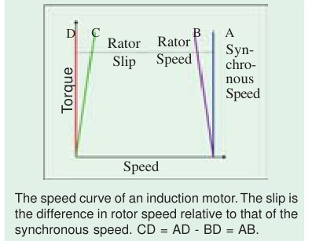
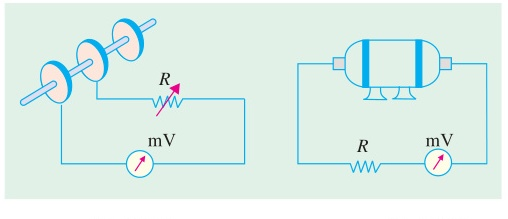
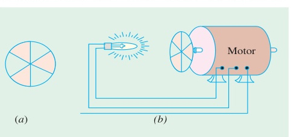
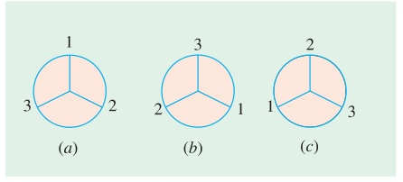
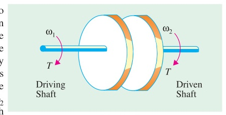
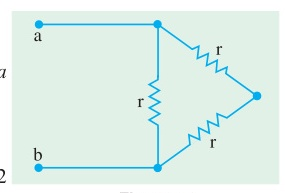

<!-- Chapter 34: Induction Motor (B.L. Theraja Vol-II) -->
<!-- Module 3: Slip Measurement, Power Stages, Torque & Power Balance -->

# Chapter 34: Induction Motor

## Part 3: Slip Measurement, Power Stages, Torque Equations & Power Relations

[⬅️ Back to Chapter 34 Master Index](Ch-34_Index.md) | [⬅️ Part 2: Torque & Characteristics](Ch-34_02_Torque_and_Characteristics.md) | [Next: Part 4 — Linear Motors & Equivalent Circuit ➡️](Ch-34_04_Linear_Motors_and_Equivalent_Circuit.md)

---

<!-- Page 36 (p. 1278) -->

## 34.34. Measurement of Slip

Following are some of the methods used for finding the slip of an induction motor whether squirrel-cage or slip-ring type:

### (i) By actual measurement of motor speed

This method requires measurement of actual motor speed $N$ and calculation of synchronous speed $N_s$. $N$ is measured with the help of a speedometer and $N_s$ calculated from the knowledge of supply frequency and the number of poles of the motor.\* Then slip can be calculated by using the equation:

$$s = \frac{N_s - N}{N_s} \times 100$$

### (ii) By comparing rotor and stator supply frequencies

This method is based on the fact that $s = f_r / f$.

Since $f$ is generally known, $s$ can be found if frequency of rotor current can be measured by some method. In the usual case, where $f$ is 50 Hz, $f_r$ is so low that individual cycles can be easily counted. For this purpose, a d.c. moving-coil millivoltmeter, preferably of centre-zero, is employed as described below :

**(a)** In the case of a slip-ring motor, the leads of the millivoltmeter are lightly pressed against the adjacent slip-rings as they revolve (Fig. 34.33). Usually, there is sufficient voltage drop in the brushes and their short-circuiting strap to provide an indication on the millivoltmeter. The current in the millivoltmeter follows the variations of the rotor current and hence the pointer oscillates about its mean zero position. The number of complete cycles made by the pointer per second can be easily counted (it is worth remembering that one cycle consists of a movement from zero to a maximum to the right, back to zero and on to a maximum to the left and then back to zero).

As an example, consider the case of a 4-pole motor fed from a 50-Hz supply and running at 1,425 r.p.m. Since $N_s = 1500\text{ r.p.m.}$, its slip is 5% or 0.05. The frequency of the rotor current would be:
$$f_r = s f = 0.05 \times 50 = 2.5\text{ Hz}$$
which (being slow enough) can be easily counted.

> \* *Note*: Since an induction motor does not have salient poles, the number of poles is usually inferred from the no-load speed or from the rated speed of the motor.

---

<!-- Page 37 (p. 1279) -->

**(b)** For squirrel-cage motors (which do not have slip-rings) it is not possible to employ the millivoltmeter so *directly*, although it is sometimes possible to pick up some voltage by connecting the millivoltmeter across the ends of the motor shaft (Fig. 34.34).

Another method, sometime employed, is as follows :  
A large flat search coil of many turns is placed centrally against the end plate on the non-driving end of the motor. Quite often, it is possible to pick up sufficient voltage by induction from the leakage fluxes to obtain a reading on the millivoltmeter. Obviously, a large 50-Hz voltage will also be induced in the search coil although it is too rapid to affect the millivoltmeter. Commercial slip-indicators use such a search coil and, in addition, contain a low-pass filter amplifier for eliminating fundamental frequency and a bridge circuit for comparing stator and rotor current frequencies.

### (iii) Stroboscopic Method

In this method, a circular metallic disc is taken and painted with alternately black and white segments. The number of segments (both black and white) is equal to the number of poles of the motor. For a 6-pole motor, there will be six segments, three black and three white, as shown in Fig. 34.35 *(a)*. The painted disc is mounted on the end of the shaft and illuminated by means of a neon-filled stroboscopic lamp, which may be supplied preferably with a combined d.c. and a.c. supply although only a.c. supply will do\*. The connections for combined supply are shown in Fig. 34.36 whereas Fig. 34.35 *(b)* shows the connection for a.c. supply only. It must be noted that with combined d.c. and a.c. supply, the lamp will flash once per cycle\*\*. But with a.c. supply, it will flash twice per cycle.

Consider the case when the revolving disc is seen in the flash light of the bulb which is fed by the combined d.c. and a.c. supply.

If the disc were to rotate at synchronous speed, it would appear to be stationary. Since, in actual practice, its speed is slightly less than the synchronous speed, it appears to rotate slowly backwards. The reason for this apparent backward movement is as follows :

> \* *Note*: When combined d.c. and a.c. supply is used, the lamp should be tried both ways in its socket to see which way it gives better light.  
> \*\* *Note*: It will flash only when the two voltages add and remain extinguished when they oppose.

---

<!-- Page 38 (p. 1280) -->

Let Fig. 34.37 *(a)* represent the position of the white lines when they are illuminated by the first flash. When the next flash comes, they have *nearly* reached positions $120^\circ$ ahead (but not quite), as shown in Fig. 34.37 *(b)*. Hence, line No. 1 has *almost* reached the position previously occupied by line No. 2 and one flash still later [Fig. 34.37 *(c)*] it has *nearly* reached the position previously occupied by line No. 3 in Fig. 34.37 *(a)*.

By counting the number of lines passing a fixed point in, say, a minute and dividing by the number of lines seen (*i.e.* three in the case of a 6-pole motor and so on) the apparent backward speed in r.p.m. can be found. This gives slip-speed in r.p.m. *i.e.* $N_s - N$. The slip may be found from the relation:

$$s = \frac{N_s - N}{N_s} \times 100$$

> **Note**: If the lamp is fed with a.c. supply alone, then it will flash twice per cycle and twice as many lines will be seen rotating as before.

---

## 34.35. Power Stages in an Induction Motor

Stator iron loss (consisting of eddy and hysteresis losses) depends on the supply frequency and the flux density in the iron core. It is practically constant. The iron loss of the rotor is, however, negligible because frequency of rotor currents under normal running conditions is always small. Total rotor Cu loss $= 3 I_2^2 R_2$.

Different stages of power development in an induction motor are as under :

---

<!-- Page 39 (p. 1281) -->

A better visual for power flow, within an induction motor, is given in Fig. 34.38.

---

## 34.36. Torque Developed by an Induction Motor

An induction motor develops gross torque $T_g$ due to gross rotor output $P_m$ (Fig. 34.38). Its value can be expressed either in terms of rotor input $P_2$ or rotor gross output $P_m$ as given below:

$$T_g = \frac{P_2}{\omega_s} = \frac{P_2}{2\pi N_s} \quad \text{...in terms of rotor input}$$

$$T_g = \frac{P_m}{\omega} = \frac{P_m}{2\pi N} \quad \text{...in terms of rotor output}$$

The shaft torque $T_{sh}$ is due to output power $P_{out}$ which is less than $P_m$ because of rotor friction and windage losses:

$$T_{sh} = \frac{P_{out}}{\omega} = \frac{P_{out}}{2\pi N}$$

The difference between $T_g$ and $T_{sh}$ equals the torque lost due to friction and windage loss in the motor.

In the above expressions, $N$ and $N_s$ are in r.p.s. However, if they are in r.p.m., the above expressions for motor torque become:

$$T_g = \frac{P_2}{2\pi N_s / 60} = \frac{60}{2\pi} \frac{P_2}{N_s} = 9.55 \frac{P_2}{N_s}\text{ N}\cdot\text{m}$$

$$= \frac{P_m}{2\pi N / 60} = \frac{60}{2\pi} \frac{P_m}{N} = 9.55 \frac{P_m}{N}\text{ N}\cdot\text{m}$$

$$T_{sh} = \frac{P_{out}}{2\pi N / 60} = \frac{60}{2\pi} \frac{P_{out}}{N} = 9.55 \frac{P_{out}}{N}\text{ N}\cdot\text{m}$$

---

## 34.37. Torque, Mechanical Power and Rotor Output

$$\text{Stator input } P_1 = \text{stator output} + \text{stator losses}$$

The stator output is transferred entirely inductively to the rotor circuit.

<!-- Page 40 (p. 1282) -->

$$\text{Rotor input } P_2 = \text{stator output}$$
$$\text{Rotor gross output } P_m = P_2 - \text{rotor Cu loss}$$

This power is converted into mechanical energy and gives rise to gross torque $T_g$.

$$\text{Now, } T_g = \frac{P_m}{2\pi N} \implies P_m = T_g \cdot 2\pi N$$

$$\text{Also, } P_2 = T_g \cdot 2\pi N_s$$

$$\therefore \text{Rotor Cu loss} = P_2 - P_m = T_g \cdot 2\pi (N_s - N)$$

$$\frac{\text{Rotor Cu loss}}{\text{Rotor input } P_2} = \frac{N_s - N}{N_s} = s$$

$$\therefore \mathbf{\text{Rotor Cu loss} = s \times \text{Rotor input } P_2}$$

$$\mathbf{\text{Gross mechanical power developed } P_m = P_2 - \text{Rotor Cu loss} = P_2(1 - s) = (1 - s) \times \text{Rotor input}}$$

$$\mathbf{\frac{\text{Rotor gross output } P_m}{\text{Rotor input } P_2} = 1 - s = \frac{N}{N_s}}$$

$$\mathbf{\frac{\text{Rotor Cu loss}}{\text{Rotor gross output } P_m} = \frac{s}{1 - s}}$$

$$\mathbf{P_2 : P_m : \text{Rotor Cu loss} = 1 : (1 - s) : s}$$

---

<!-- Page 41 (p. 1283) -->

### Numerical Examples (Articles 34.35 – 34.37)

> [!example] Example 34.27
> *The power input to the rotor of 440 V, 50 Hz, 6-pole, 3-phase, induction motor is 80 kW. The rotor electromotive force is observed to make 100 complete alterations per minute. Calculate (i) the slip (ii) the rotor speed (iii) mechanical power developed (iv) the rotor copper loss per phase.*
> 
> **Solution.**
> **(i)** Rotor frequency:
> $$f' = \frac{100}{60} = \frac{5}{3}\text{ Hz}$$
> Slip:
> $$s = \frac{f'}{f} = \frac{5/3}{50} = \frac{1}{30} = 0.0333 \quad (3.33\%)$$
> 
> **(ii)** Synchronous speed:
> $$N_s = \frac{120 \times 50}{6} = 1000\text{ rpm}$$
> Rotor speed:
> $$N = N_s(1 - s) = 1000\left(1 - \frac{1}{30}\right) = 966.7\text{ rpm}$$
> 
> **(iii)** Mechanical power developed:
> $$P_m = (1 - s) P_2 = \left(1 - \frac{1}{30}\right) \times 80 = 77.33\text{ kW}$$
> 
> **(iv)** Total rotor copper loss:
> $$P_{cr} = s P_2 = \frac{1}{30} \times 80 = 2.667\text{ kW} = 2667\text{ W}$$
> Rotor Cu loss per phase:
> $$= \frac{2667}{3} = 889\text{ W}$$

---

> [!example] Example 34.28
> *A 440-V, 3-$\phi$, 50-Hz, 4-pole, Y-connected induction motor has a full-load speed of 1425 rpm. The stator losses are 1 kW and friction and windage losses are 1.2 kW. Calculate (i) slip (ii) rotor copper loss (iii) output power (iv) efficiency of the motor at full load if the motor takes 50 kW from the mains.*
> 
> **Solution.**
> Synchronous speed $N_s = 120 \times 50 / 4 = 1500\text{ rpm}$.  
> **(i)** Slip:
> $$s = \frac{1500 - 1425}{1500} = 0.05 \quad (5\%)$$
> 
> **(ii)** Rotor input power:
> $$P_2 = \text{Stator input } P_1 - \text{Stator losses} = 50 - 1 = 49\text{ kW}$$
> Rotor copper loss:
> $$P_{cr} = s P_2 = 0.05 \times 49 = 2.45\text{ kW}$$
> 
> **(iii)** Gross mechanical power developed:
> $$P_m = P_2 - P_{cr} = 49 - 2.45 = 46.55\text{ kW}$$
> Net shaft output power:
> $$P_{out} = P_m - \text{Friction and windage losses} = 46.55 - 1.2 = 45.35\text{ kW}$$
> 
> **(iv)** Motor efficiency:
> $$\eta = \frac{P_{out}}{P_{in}} \times 100\% = \frac{45.35}{50} \times 100\% = 90.7\%$$

---

<!-- Page 42 (p. 1284) -->

## 34.38. Induction Motor Torque Equation

We know that:
$$P_2 = T_g \cdot \omega_s = T_g \cdot 2\pi N_s$$
$$T_g = \frac{P_2}{2\pi N_s}$$

Now, rotor input $P_2 = 3 I_2^2 \frac{R_2}{s}$.  
Since:
$$I_2 = \frac{s E_2}{\sqrt{R_2^2 + (s X_2)^2}}$$

$$P_2 = 3 \cdot \frac{s^2 E_2^2}{R_2^2 + (s X_2)^2} \cdot \frac{R_2}{s} = \frac{3 s E_2^2 R_2}{R_2^2 + (s X_2)^2}$$

$$\therefore T_g = \frac{3}{2\pi N_s} \cdot \frac{s E_2^2 R_2}{R_2^2 + (s X_2)^2}\text{ N}\cdot\text{m}$$

where $N_s$ is in r.p.s.

---

## 34.39. Synchronous Watt

Torque developed by an induction motor is often measured in **synchronous watts**.

One synchronous watt is defined as the torque which, at synchronous speed, would develop a power of 1 watt.

$$\text{Torque in synchronous watts} = \text{Rotor input power } P_2 \text{ in watts}$$

$$T_{sync-watt} = P_2\text{ watts}$$

If torque is given in synchronous watts, then torque in Newton-meters is given by:

$$T = \frac{\text{Torque in synchronous watts}}{2\pi N_s}\text{ N}\cdot\text{m}$$

where $N_s$ is in r.p.s.

---

<!-- Page 43 (p. 1285) -->

## 34.40. Variations in Rotor Current

Under locked-rotor condition ($s = 1$), rotor current is:
$$I_2 = \frac{E_2}{\sqrt{R_2^2 + X_2^2}}$$
which is very large because $X_2$ is much greater than $R_2$.

As the motor accelerates, slip $s$ decreases. Both $s E_2$ and $s X_2$ decrease in direct proportion to $s$. In the normal operating region ($s \approx 0.02 - 0.05$):
$$I_2 \approx \frac{s E_2}{R_2}$$
Hence, rotor current is directly proportional to slip $s$ in the stable operating range.

---

## 34.41. Analogy with a Mechanical Clutch

An induction motor may be compared to a mechanical friction plate clutch (Fig. 34.39).

Let $\omega_1$ be the angular velocity of the driving shaft (stator revolving field) and $\omega_2$ be the angular velocity of the driven shaft (rotor). Let $T$ be the transmitted torque.

$$\text{Input power} = T \omega_1$$
$$\text{Output power} = T \omega_2 = T \omega_1 (1 - s) \quad [\because \omega_2 = \omega_1 (1 - s)]$$
$$\text{Loss in clutch} = T \omega_1 - T \omega_2 = T \omega_1 - T \omega_1 (1 - s) = s T \omega_1 = s \times \text{input}$$

---

<!-- Page 44 (p. 1286) -->

## 34.42. Analogy with a D.C. Motor

The above relations could also be derived by comparing an induction motor with a d.c. motor. As shown in Art 29.3, in a d.c. shunt motor, the applied voltage is always opposed by a back e.m.f. $E_b$. The power developed in the motor armature is $E_b I_a$ where $I_a$ is armature current. This power, as we know, is converted into mechanical power in the armature of the motor.

Now, in an induction motor, it is seen that the induced e.m.f in the rotor decreases from its standstill value of $E_2$ to $s E_2$ when in rotation. Obviously, the difference $(1 - s)E_2$ is the e.m.f. called forth by the rotation of the rotor similar to the back e.m.f. in a d.c. motor. Hence, gross power $P_m$ developed in the rotor is given by the product of the back e.m.f., armature current and rotor power factor:

$$P_m = (1 - s)E_2 \times I_2 \cos \phi_2$$

Now:
$$I_2 = \frac{s E_2}{\sqrt{R_2^2 + (s X_2)^2}} \quad \text{and} \quad \cos \phi_2 = \frac{R_2}{\sqrt{R_2^2 + (s X_2)^2}}$$

$$\therefore P_m = (1 - s)E_2 \times \frac{s E_2}{\sqrt{R_2^2 + (s X_2)^2}} \times \frac{R_2}{\sqrt{R_2^2 + (s X_2)^2}} = \frac{s(1 - s)E_2^2 R_2}{R_2^2 + (s X_2)^2}$$

Multiplying the numerator and the denominator by $s$, we get:

$$P_m = \left(\frac{1 - s}{s}\right) R_2 \times \frac{s^2 E_2^2}{[R_2^2 + (s X_2)^2]} = \left(\frac{1 - s}{s}\right) I_2^2 R_2 \quad \left[\because I_2 = \frac{s E_2}{\sqrt{R_2^2 + (s X_2)^2}}\right]$$

Now, $I_2^2 R_2 = \text{rotor Cu loss/phase}$

$$\therefore \frac{\text{Cu loss}}{\text{rotor output}} = \frac{s}{1 - s}$$

This is the same relationship as derived in Art. 34.37.

---

### Numerical Examples (Articles 34.38 – 34.42)

> [!example] Example 34.30
> *The power input to a 3-phase induction motor is 60 kW. The stator losses total 1 kW. Find the mechanical power developed and the rotor copper loss per phase if the motor is running with a slip of 3%.*
> *(Elect. Machines AMIE Sec. E Summer 1991)*
> 
> **Solution.**
> Rotor input:
> $$P_2 = \text{stator input} - \text{stator losses} = 60 - 1 = 59\text{ kW}$$
> Mechanical power developed:
> $$P_m = (1 - s)P_2 = (1 - 0.03) \times 59 = 57.23\text{ kW}$$
> Total rotor Cu loss:
> $$s P_2 = 0.03 \times 59 = 1.77\text{ kW} = 1770\text{ W}$$
> Rotor Cu loss/phase:
> $$= \frac{1770}{3} = 590\text{ W}$$

---

<!-- Page 45 (p. 1287) -->

> [!example] Example 34.31
> *The power input to the rotor of a 400 V, 50-Hz, 6-pole, 3-phase induction motor is 20 kW. The slip is 3%. Calculate (i) the frequency of rotor currents (ii) rotor speed (iii) rotor copper losses and (iv) mechanical power developed.*
> 
> **Solution.**
> **(i)** $f' = sf = 0.03 \times 50 = 1.5\text{ Hz}$  
> **(ii)** $N_s = 120 \times 50 / 6 = 1000\text{ rpm} \implies N = 1000(1 - 0.03) = 970\text{ rpm}$  
> **(iii)** Rotor Cu loss $= s P_2 = 0.03 \times 20\text{ kW} = 0.6\text{ kW} = 600\text{ W}$  
> **(iv)** Mechanical power developed $P_m = (1 - s)P_2 = (1 - 0.03) \times 20 = 19.4\text{ kW}$

---

> [!example] Example 34.32
> *A 3-phase, 6-pole, 50-Hz induction motor develops 3.73 kW at 960 rpm. What will be the stator input if the stator loss is 280 W?*
> 
> **Solution.**
> Synchronous speed $N_s = 120 \times 50 / 6 = 1000\text{ rpm}$.  
> Slip $s = (1000 - 960) / 1000 = 0.04$.  
> Power developed in rotor $P_m = 3.73\text{ kW}$.  
> Rotor input:
> $$P_2 = \frac{P_m}{1 - s} = \frac{3.73}{1 - 0.04} = 3.885\text{ kW} = 3885\text{ W}$$
> Stator input:
> $$P_1 = P_2 + \text{stator losses} = 3885 + 280 = 4165\text{ W} = 4.165\text{ kW}$$

---

> [!example] Example 34.33
> *The power input to the rotor of a 400 V, 50-Hz, 6-pole, 3-$\phi$ induction motor is 75 kW. The rotor electromotive force is observed to make 100 complete cycles per minute. Calculate (i) slip (ii) rotor speed (iii) rotor copper loss per phase (iv) mechanical power developed (v) rotor resistance per phase if rotor current is 60 A.*
> 
> **Solution.**
> **(i)** Rotor frequency $f' = 100 / 60 = 5/3\text{ Hz} \implies s = f'/f = (5/3)/50 = 1/30 = 0.0333$.  
> **(ii)** $N_s = 120 \times 50 / 6 = 1000\text{ rpm} \implies N = 1000(1 - 1/30) = 966.7\text{ rpm}$.  
> **(iii)** Total rotor Cu loss $= s P_2 = (1/30) \times 75\text{ kW} = 2.5\text{ kW} = 2500\text{ W}$.  
> Rotor Cu loss per phase $= 2500 / 3 = 833.3\text{ W}$.  
> **(iv)** Mechanical power developed $P_m = (1 - s)P_2 = (1 - 1/30) \times 75 = 72.5\text{ kW}$.  
> **(v)** Rotor Cu loss per phase $= I_2^2 R_2 \implies 833.3 = (60)^2 R_2 \implies R_2 = 0.231\ \Omega$.

---

> [!example] Example 34.34
> *The power input to a 500 V, 50-Hz, 6-pole, 3-phase induction motor running at 975 rpm is 40 kW. The stator losses are 1 kW and friction and windage losses are 2 kW. Calculate (a) slip (b) rotor copper loss (c) shaft power output (d) efficiency.*
> 
> **Solution.**
> Synchronous speed $N_s = 120 \times 50 / 6 = 1000\text{ rpm}$.  
> **(a)** Slip $s = (1000 - 975) / 1000 = 0.025$.  
> **(b)** Rotor input $P_2 = 40 - 1 = 39\text{ kW}$. Rotor Cu loss $= s P_2 = 0.025 \times 39 = 0.975\text{ kW} = 975\text{ W}$.  
> **(c)** Gross mechanical power developed $P_m = 39 - 0.975 = 38.025\text{ kW}$.  
> Shaft output power $P_{out} = 38.025 - 2 = 36.025\text{ kW}$.  
> **(d)** Efficiency $\eta = (36.025 / 40) \times 100\% = 90.06\%$.

---

> [!example] Example 34.35
> *A 100-kW (output), 3300-V, 50-Hz, 3-phase, star-connected induction motor has a synchronous speed of 500 rpm. The full-load slip is 1.8% and full-load power factor is 0.85. Stator copper loss is 2440 W, iron loss is 3500 W, rotational losses are 1200 W. Calculate (i) rotor copper loss (ii) line current (iii) full-load efficiency.*
> 
> **Solution.**
> Mechanical power developed $P_m = P_{out} + \text{rotational losses} = 100 + 1.2 = 101.2\text{ kW}$.  
> **(i)** Rotor input $P_2 = P_m / (1 - s) = 101.2 / (1 - 0.018) = 103.05\text{ kW}$.  
> Rotor copper loss $= s P_2 = 0.018 \times 103.05 = 1.855\text{ kW} = 1855\text{ W}$.  
> **(ii)** Stator input $P_1 = P_2 + \text{stator losses} = 103.05 + 2.44 + 3.5 = 108.99\text{ kW}$.  
> Line current:
> $$I_L = \frac{P_1}{\sqrt{3} V_L \cos \phi} = \frac{108.99 \times 1000}{\sqrt{3} \times 3300 \times 0.85} = 22.45\text{ A}$$
> **(iii)** Efficiency $\eta = (100 / 108.99) \times 100\% = 91.75\%$.

---

<!-- Page 46 (p. 1288) -->

> [!example] Example 34.36
> *The power input to the rotor of a 440 V, 50-Hz, 6-pole, 3-phase induction motor is 100 kW while running at 960 rpm. Calculate (a) rotor copper loss (b) gross mechanical power developed (c) torque developed in synchronous watts and in N-m.*
> 
> **Solution.**
> $N_s = 120 \times 50 / 6 = 1000\text{ rpm} = 50/3\text{ rps}$. Slip $s = (1000 - 960) / 1000 = 0.04$.  
> **(a)** Rotor copper loss $= s P_2 = 0.04 \times 100\text{ kW} = 4\text{ kW}$.  
> **(b)** Gross power developed $P_m = (1 - s)P_2 = (1 - 0.04) \times 100 = 96\text{ kW}$.  
> **(c)** Torque in synchronous watts $= \text{Rotor input } P_2 = 100\text{ kW} = 100,000\text{ syn-watts}$.  
> Torque in N-m:
> $$T = \frac{P_2}{2\pi N_s} = \frac{100,000}{2\pi \times (50/3)} = 955\text{ N}\cdot\text{m}$$

---

> [!example] Example 34.37
> *An induction motor has an efficiency of 0.9 when delivering an output of 37 kW. At this load, the stator copper loss and the rotor copper loss each equals the iron loss. The mechanical losses are one-third of the no-load losses. Calculate the slip.*
> 
> **Solution.**
> Total losses $= P_{in} - P_{out} = \frac{37}{0.9} - 37 = 41.11 - 37 = 4.111\text{ kW}$.  
> Let $x$ be the iron loss. Then stator Cu loss $= x$, rotor Cu loss $= x$.  
> Mechanical losses $= x / 2$ (or $x/3$ of no-load).  
> Total losses $= 3x + x/2 = 3.5x = 4.111\text{ kW} \implies x = 1175\text{ W}$.  
> Rotor input $P_2 = 37,000 + 1175/2 + 1175 = 38,752\text{ W}$.  
> Slip:
> $$s = \frac{\text{rotor Cu loss}}{\text{rotor input}} = \frac{1175}{38,752} = 0.03 \quad (3\%)$$

---

<!-- Page 47 (p. 1289) -->

> [!example] Example 34.38
> *A 400 V, 50-Hz, 6-pole, $\Delta$-connected, 3-$\phi$ induction motor consumes 45 kW with a line current of 75 A and runs at a slip of 3%. If stator iron loss is 1200 W, windage and friction loss is 900 W and resistance between two stator terminals is 0.12 $\Omega$, calculate (i) power supplied to the rotor $P_2$ (ii) rotor Cu loss $P_{cr}$ (iii) power supplied to load $P_{out}$ (iv) efficiency and (v) shaft torque developed.*
> 
> 
> 
> **Solution.**
> Phase current in delta:
> $$I_{ph} = \frac{75}{\sqrt{3}} = 43.3\text{ A}$$
> Resistance between two terminals of $\Delta$ winding:
> $$R_{ab} = \frac{r \times 2r}{3r} = \frac{2}{3}r = 0.12\ \Omega \implies r = 0.18\ \Omega\text{ per phase}$$
> Total stator copper loss:
> $$= 3 I_{ph}^2 r = 3 \times (43.3)^2 \times 0.18 = 1012\text{ W}$$
> **(i)** Rotor input:
> $$P_2 = P_1 - (\text{Stator Cu loss} + \text{Stator iron loss}) = 45,000 - (1012 + 1200) = 42,788\text{ W}$$
> **(ii)** Rotor Cu loss:
> $$P_{cr} = s P_2 = 0.03 \times 42,788 = 1284\text{ W}$$
> **(iii)** Gross mechanical power $P_m = 42,788 - 1284 = 41,504\text{ W}$.  
> Shaft output power:
> $$P_{out} = P_m - \text{Mech losses} = 41,504 - 900 = 40,604\text{ W}$$
> **(iv)** Efficiency:
> $$\eta = \frac{40,604}{45,000} \times 100\% = 92.23\%$$
> **(v)** $N_s = 120 \times 50 / 6 = 1000\text{ rpm} \implies N = 1000(1 - 0.03) = 970\text{ rpm}$.  
> Shaft torque:
> $$T = \frac{60}{2\pi} \frac{P_{out}}{N} = 9.55 \times \frac{40,604}{970} = 400\text{ N}\cdot\text{m}$$

---

> [!example] Example 34.39 (a)
> *A 3-phase induction motor has a 4-pole, star-connected stator winding and runs on a 220-V, 50-Hz supply. The rotor resistance per phase is 0.1 $\Omega$ and reactance 0.9 $\Omega$. The ratio of stator to rotor turns is 1.75. The full-load slip is 5%. Calculate for this load: (a) the load torque in kg-m (b) speed at maximum torque (c) rotor e.m.f. at maximum torque.*
> *(Electrical Machines-I, South Gujarat Univ. 1985)*
> 
> **Solution.**
> $K = 1/1.75$. Stator phase voltage $E_1 = 220 / \sqrt{3}\text{ V}$.  
> Standstill rotor phase e.m.f.:
> $$E_2 = K E_1 = \frac{220}{\sqrt{3}} \times \frac{1}{1.75} = 72.6\text{ V}$$
> <!-- Page 48 (p. 1290) -->
> Rotor impedance at full load:
> $$Z_r = \sqrt{R_2^2 + (s X_2)^2} = \sqrt{0.1^2 + (0.05 \times 0.9)^2} = 0.11\ \Omega$$
> Full-load rotor current:
> $$I_2 = \frac{s E_2}{Z_r} = \frac{0.05 \times 72.6}{0.11} = 33\text{ A}$$
> Total rotor copper loss $= 3 I_2^2 R_2 = 3 \times 33^2 \times 0.1 = 326.7\text{ W}$.  
> Rotor input $P_2 = 326.7 / 0.05 = 6534\text{ W}$.  
> Gross mechanical power developed $P_m = (1 - 0.05) \times 6534 = 6207\text{ W}$.  
> Synchronous speed $N_s = 120 \times 50 / 4 = 1500\text{ rpm} = 25\text{ rps}$.  
> Rotor speed $N = 1500(1 - 0.05) = 1425\text{ rpm} = 23.75\text{ rps}$.  
> **(a)** Torque:
> $$T = \frac{P_m}{2\pi N} = \frac{6207}{2\pi \times 23.75} = 41.6\text{ N}\cdot\text{m} = \frac{41.6}{9.81} = 4.24\text{ kg}\cdot\text{m}$$
> **(b)** Slip at maximum torque $s_m = R_2 / X_2 = 0.1 / 0.9 = 1/9 = 0.111$.  
> Speed at max torque $N = 1500(1 - 1/9) = 1333\text{ rpm}$.  
> **(c)** Rotor e.m.f. at max torque $= s_m E_2 = (1/9) \times 72.6 = 8.07\text{ V}$.

---

> [!example] Example 34.39 (b)
> *A 400 V, 3-phase, 50 Hz, 4-pole, star-connected induction-motor takes a line current of 10 A with 0.86 p.f. lagging. Its total stator losses are 5% of input. Mechanical losses are 4% of power developed. Slip is 4%. Find (i) gross torque (ii) net torque.*
> 
> **Solution.**
> Total input $P_1 = \sqrt{3} \times 400 \times 10 \times 0.86 = 5958\text{ W}$.  
> Stator losses $= 0.05 \times 5958 = 298\text{ W}$.  
> Rotor input $P_2 = 5958 - 298 = 5660\text{ W}$.  
> Mechanical power developed $P_m = (1 - 0.04) \times 5660 = 5434\text{ W}$.  
> Synchronous speed $N_s = 1500\text{ rpm} \implies \omega_s = 2\pi \times 25 = 157.1\text{ rad/s}$.  
> **(i)** Gross torque:
> $$T_g = \frac{P_2}{\omega_s} = \frac{5660}{157.1} = 36.03\text{ N}\cdot\text{m}$$
> **(ii)** Mechanical losses $= 0.04 \times 5434 = 217\text{ W}$.  
> Net power output $P_{out} = 5434 - 217 = 5217\text{ W}$.  
> Rotor speed $N = 1500(1 - 0.04) = 1440\text{ rpm} \implies \omega = 2\pi \times 24 = 150.8\text{ rad/s}$.  
> Net shaft torque:
> $$T_{sh} = \frac{5217}{150.8} = 34.6\text{ N}\cdot\text{m}$$

---

> [!example] Example 34.40
> *A 3-phase, 440-V, 50-Hz, 4-pole, Y-connected induction motor has rotor resistance and reactance of 0.1 $\Omega$ and 1 $\Omega$ per phase respectively. Ratio of stator to rotor turns is 3.5. Calculate (a) full-load torque if full-load speed is 1440 rpm (b) maximum torque and speed at which it occurs.*
> 
> <!-- Page 49 (p. 1291) -->
> **Solution.**
> $E_1 = 440 / \sqrt{3} = 254\text{ V}$. $E_2 = 254 / 3.5 = 72.6\text{ V}$.  
> $N_s = 120 \times 50 / 4 = 1500\text{ rpm} = 25\text{ rps}$. Slip $s = (1500 - 1440) / 1500 = 0.04$.  
> **(a)** Full-load torque:
> $$T = \frac{3}{2\pi N_s} \cdot \frac{s E_2^2 R_2}{R_2^2 + (s X_2)^2} = \frac{3}{2\pi \times 25} \cdot \frac{0.04 \times 72.6^2 \times 0.1}{0.1^2 + (0.04 \times 1)^2} = 32.3\text{ N}\cdot\text{m}$$
> **(b)** Maximum torque:
> $$T_{max} = \frac{3}{2\pi N_s} \cdot \frac{E_2^2}{2 X_2} = \frac{3}{2\pi \times 25} \cdot \frac{72.6^2}{2 \times 1} = 50.3\text{ N}\cdot\text{m}$$
> Slip at maximum torque $s_m = R_2 / X_2 = 0.1 / 1 = 0.1$.  
> Speed at maximum torque $N = 1500(1 - 0.1) = 1350\text{ rpm}$.

---

> [!example] Example 34.41
> *An 18.65-kW, 4-pole, 50-Hz, 3-phase induction motor has friction and windage losses of 2.5% of the output. The full-load slip is 4%. Compute for full load (a) the rotor Cu loss (b) mechanical power developed (c) rotor input (d) shaft torque.*
> 
> **Solution.**
> Output $P_{out} = 18.65\text{ kW} = 18,650\text{ W}$.  
> Friction and windage loss $= 0.025 \times 18,650 = 466\text{ W}$.  
> **(b)** Mechanical power developed $P_m = 18,650 + 466 = 19,116\text{ W} = 19.116\text{ kW}$.  
> **(c)** Rotor input $P_2 = P_m / (1 - s) = 19,116 / (1 - 0.04) = 19,912\text{ W}$.  
> **(a)** Rotor Cu loss $= s P_2 = 0.04 \times 19,912 = 796.5\text{ W}$.  
> **(d)** $N_s = 1500\text{ rpm} \implies N = 1500(1 - 0.04) = 1440\text{ rpm}$.  
> Shaft torque:
> $$T_{sh} = 9.55 \times \frac{18,650}{1440} = 123.7\text{ N}\cdot\text{m}$$

---

> [!example] Example 34.42
> *An 8-pole, 3-phase, 50 Hz, induction motor is running at a speed of 710 rpm with an input power of 35 kW. The stator losses at this operating condition are known to be 1200 W while the rotational losses are 600 W. Find (a) the rotor copper loss (b) the gross torque developed (c) the gross mechanical power developed (d) the net torque and (e) the mechanical power output to the load.*
> 
> <!-- Page 50 (p. 1292) -->
> **Solution.**
> $N_s = 120 \times 50 / 8 = 750\text{ rpm}$. Slip $s = (750 - 710) / 750 = 0.0533$.  
> Rotor input $P_2 = 35,000 - 1200 = 33,800\text{ W}$.  
> **(a)** Rotor copper loss $= s P_2 = 0.0533 \times 33,800 = 1801.5\text{ W}$.  
> **(c)** Gross mechanical power developed $P_m = 33,800 - 1801.5 = 31,998.5\text{ W} \approx 32\text{ kW}$.  
> **(b)** Gross torque:
> $$T_g = 9.55 \times \frac{P_2}{N_s} = 9.55 \times \frac{33,800}{750} = 430.4\text{ N}\cdot\text{m}$$
> **(e)** Net mechanical power output $P_{out} = 31,998.5 - 600 = 31,398.5\text{ W} = 31.4\text{ kW}$.  
> **(d)** Net torque:
> $$T_{net} = 9.55 \times \frac{31,398.5}{710} = 422.3\text{ N}\cdot\text{m}$$

---

> [!example] Example 34.43
> *A 6-pole, 50-Hz, 3-phase, induction motor running on full-load with 4% slip develops a torque of 149.3 N-m at its pulley rim. The friction and windage losses are 200 W and the stator losses 1620 W. Determine (a) output power (b) the rotor Cu loss and (c) the efficiency at full load.*
> 
> **Solution.**
> $N_s = 120 \times 50 / 6 = 1000\text{ rpm}$. Full-load speed $N = 1000(1 - 0.04) = 960\text{ rpm}$.  
> **(a)** Shaft output power:
> $$P_{out} = \frac{2\pi N T}{60} = \frac{2\pi \times 960 \times 149.3}{60} = 15,008\text{ W} \approx 15\text{ kW}$$
> **(b)** Mechanical power developed $P_m = 15,008 + 200 = 15,208\text{ W}$.  
> Rotor input $P_2 = 15,208 / (1 - 0.04) = 15,842\text{ W}$.  
> Rotor Cu loss $= s P_2 = 0.04 \times 15,842 = 634\text{ W}$.  
> **(c)** Stator input $P_1 = 15,842 + 1620 = 17,462\text{ W}$.  
> Efficiency $\eta = (15,008 / 17,462) \times 100\% = 85.95\%$.

---

> [!example] Example 34.44
> *An 18.65-kW, 6-pole, 50-Hz, 3-$\phi$ slip-ring induction motor runs at 960 r.p.m. on full load with a rotor current of 35 A. Allowing 1 kW for mechanical losses, find the resistance per phase of the 3-phase rotor winding.*
> 
> **Solution.**
> $N_s = 1000\text{ rpm}, N = 960\text{ rpm} \implies s = (1000 - 960) / 1000 = 0.04$.  
> Power developed in rotor $P_m = 18.65 + 1 = 19.65\text{ kW}$.  
> Total rotor Cu loss:
> $$P_{cr} = \frac{s}{1 - s} P_m = \frac{0.04}{1 - 0.04} \times 19.65 = 0.8187\text{ kW} = 818.7\text{ W}$$
> Since total rotor Cu loss $= 3 I_2^2 R_2$:
> $$818.7 = 3 \times (35)^2 \times R_2 \implies R_2 = 0.223\ \Omega\text{ per phase}$$

---

> [!example] Example 34.45
> *A 400 V, 4-pole, 3-phase, 50-Hz induction motor has a rotor resistance and standstill reactance of 0.05 $\Omega$ and 0.1 $\Omega$ per phase respectively. The motor is running at full-load speed of 1440 rpm. Calculate (a) the slip (b) maximum torque and (c) ratio of starting torque to maximum torque.*
> 
> <!-- Page 51 (p. 1293) -->
> **Solution.**
> $N_s = 1500\text{ rpm}$.  
> **(a)** Slip $s = (1500 - 1440) / 1500 = 0.04$.  
> Standstill rotor phase voltage (assuming $K = 1, E_2 = 400/\sqrt{3} = 230.9\text{ V}$):
> **(b)** $T_{max} = \frac{3}{2\pi N_s} \cdot \frac{E_2^2}{2 X_2} = \frac{3}{2\pi \times 25} \cdot \frac{(230.9)^2}{2 \times 0.1} = 509.3\text{ N}\cdot\text{m}$.  
> **(c)** $a = R_2 / X_2 = 0.05 / 0.1 = 0.5$.
> $$\frac{T_{st}}{T_{max}} = \frac{2a}{a^2 + 1} = \frac{2 \times 0.5}{0.5^2 + 1} = \frac{1}{1.25} = 0.8$$

---

> [!example] Example 34.46
> *A 3-phase induction motor has a 4-pole, Y-connected stator winding. The motor runs on a 50-Hz supply with 200 V between lines. The rotor resistance and standstill reactance per phase are 0.1 $\Omega$ and 0.9 $\Omega$ respectively. The ratio of rotor to stator turns is 0.67. Calculate (a) total torque at 4% slip (b) total mechanical power at 4% slip (c) maximum torque (d) speed at maximum torque (e) maximum mechanical power.*
> 
> **Solution.**
> $E_1 = 200 / \sqrt{3} = 115.5\text{ V}$. $E_2 = 115.5 \times 0.67 = 77.4\text{ V}$. $N_s = 1500\text{ rpm} = 25\text{ rps}$.  
> **(a)** At $s = 0.04$:
> $$T = \frac{3}{2\pi \times 25} \cdot \frac{0.04 \times (77.4)^2 \times 0.1}{0.1^2 + (0.04 \times 0.9)^2} = 40\text{ N}\cdot\text{m}$$
> **(b)** $N = 1500(1 - 0.04) = 1440\text{ rpm} = 24\text{ rps}$.  
> Total mechanical power $P_m = 2\pi N T = 2\pi \times 24 \times 40 = 6032\text{ W} \approx 6\text{ kW}$.  
> **(c)** $T_{max} = \frac{3}{2\pi \times 25} \cdot \frac{(77.4)^2}{2 \times 0.9} = 63.7\text{ N}\cdot\text{m}$.  
> **(d)** $s_m = 0.1 / 0.9 = 1/9 = 0.111 \implies N_m = 1500(1 - 1/9) = 1333\text{ rpm}$.  
> **(e)** Maximum mechanical power occurs at slip $s_p = \frac{R_2}{R_2 + X_2} = \frac{0.1}{0.1 + \sqrt{0.1^2 + 0.9^2}} \approx 0.0995 \implies P_{max} = 8.95\text{ kW}$.

---

> [!example] Example 34.47
> *The rotor resistance and standstill reactance of a 3-phase induction motor are respectively 0.015 $\Omega$ and 0.09 $\Omega$ per phase. At normal voltage, the full-load slip is 3%. Estimate the percentage reduction in stator voltage to develop full-load torque at one-half of full-load speed.*
> 
> <!-- Page 52 (p. 1294) -->
> **Solution.**
> As worked out in Example 34.23:
> $$s_1 = 0.03, \quad s_2 = 0.515$$
> $$\left(\frac{V_1}{V_2}\right)^2 = \frac{s_2}{s_1} \frac{R_2^2 + (s_1 X_2)^2}{R_2^2 + (s_2 X_2)^2} = 1.68 \implies \frac{V_1}{V_2} = 1.296$$
> Percentage reduction in voltage:
> $$= \frac{1.296 - 1}{1.296} \times 100\% = 22.84\%$$

---

> [!example] Example 34.48
> *The useful full load torque of 3-phase, 6-pole, 50-Hz induction motor is 162.84 N-m and the rotor e.m.f. makes 90 complete cycles per minute. Calculate the shaft output. If the mechanical torque lost in friction be 13.56 N-m, find the rotor copper loss, the input to the motor and the efficiency. Stator losses total 750 W.*
> 
> **Solution.**
> $f' = 90 / 60 = 1.5\text{ Hz} \implies s = 1.5 / 50 = 0.03$.  
> $N_s = 1000\text{ rpm} \implies N = 1000(1 - 0.03) = 970\text{ rpm}$.  
> Shaft output power:
> $$P_{out} = \frac{2\pi N T_{sh}}{60} = \frac{2\pi \times 970 \times 162.84}{60} = 16.54\text{ kW}$$
> Friction power loss:
> $$= \frac{2\pi \times 970 \times 13.56}{60} = 1.38\text{ kW}$$
> Gross power developed $P_m = 16.54 + 1.38 = 17.92\text{ kW}$.  
> Rotor input $P_2 = 17.92 / (1 - 0.03) = 18.47\text{ kW}$.  
> Rotor copper loss $= 0.03 \times 18.47 = 554\text{ W}$.  
> Stator input $P_1 = 18.47 + 0.75 = 19.22\text{ kW}$.  
> Efficiency $\eta = (16.54 / 19.22) \times 100\% = 86.06\%$.

---

> [!example] Example 34.49
> *Estimate in kg-m the starting torque exerted by an 18.65-kW, 420-V, 6-pole, 50-Hz induction motor when started by means of a star-delta starter, having given that the full-load current is 35 A, the full-load power factor is 0.88 and full-load slip is 3.5%. The short-circuit current with 420 V is 180 A and power factor is 0.35.*
> 
> <!-- Page 53 (p. 1295) -->
> **Solution.**
> When started by a star-delta starter, starting torque is $1/3$ of the direct-on-line starting torque:
> $$\frac{T_{st}}{T_{fl}} = \frac{1}{3} \left(\frac{I_{sc}}{I_{fl}}\right)^2 s_{fl} = \frac{1}{3} \left(\frac{180}{35}\right)^2 \times 0.035 = \frac{1}{3} \times (5.143)^2 \times 0.035 = 0.309$$
> Synchronous speed $N_s = 1000\text{ rpm} \implies N = 1000(1 - 0.035) = 965\text{ rpm}$.  
> Full-load torque:
> $$T_{fl} = 9.55 \times \frac{18,650}{965} = 184.6\text{ N}\cdot\text{m}$$
> Starting torque:
> $$T_{st} = 0.309 \times 184.6 = 57.04\text{ N}\cdot\text{m} = \frac{57.04}{9.81} = 5.81\text{ kg}\cdot\text{m}$$

---

> [!example] Example 34.50
> *An 8-pole, 37.3-kW, 3-phase induction motor has both stator and rotor windings connected in star. The rotor resistance is 0.04 $\Omega$/phase and standstill reactance is 0.2 $\Omega$/phase. When connected to a 400-V supply, the starting current is 100 A. Calculate (a) the starting torque (b) the full-load torque if full-load slip is 3%.*
> 
> **Solution.**
> $N_s = 120 \times 50 / 8 = 750\text{ rpm} = 12.5\text{ rps}$.  
> At start, rotor impedance:
> $$Z_2 = \sqrt{0.04^2 + 0.2^2} = 0.204\ \Omega$$
> Rotor starting current $I_2 = 100\text{ A}$.  
> Rotor input power at start $= 3 I_2^2 R_2 = 3 \times 100^2 \times 0.04 = 1200\text{ W}$.  
> **(a)** Starting torque:
> $$T_{st} = \frac{P_2}{2\pi N_s} = \frac{1200}{2\pi \times 12.5} = 15.28\text{ N}\cdot\text{m}$$
> **(b)** Full-load speed $N = 750(1 - 0.03) = 727.5\text{ rpm}$.  
> Full-load torque:
> $$T_{fl} = 9.55 \times \frac{37,300}{727.5} = 489.6\text{ N}\cdot\text{m}$$

---

> [!example] Example 34.51
> *A 3-phase induction motor, at rated voltage and frequency has a starting torque of 160% and a maximum torque of 200% of full-load torque. If stator resistance and rotational losses are neglected, determine the full-load slip.*
> 
> **Solution.**
> $\frac{T_{st}}{T_{max}} = \frac{1.6}{2.0} = 0.8$.  
> As seen from Example 34.21:
> $$\frac{2a}{a^2 + 1} = 0.8 \implies a = s_m = 0.5$$
> Now $\frac{T_{fl}}{T_{max}} = \frac{1}{2.0} = 0.5$:
> $$\frac{2 a s_f}{a^2 + s_f^2} = 0.5 \implies \frac{2(0.5) s_f}{0.5^2 + s_f^2} = 0.5 \implies s_f^2 - 2 s_f + 0.25 = 0$$
> $$s_f = \frac{2 - \sqrt{4 - 1}}{2} = 1 - 0.866 = 0.134 \quad (13.4\%)$$

---

<!-- Tutorial Problem No. 34.3 (from Pages 56-58, corresponding to Power Stages & Torque) -->

### Tutorial Problem No. 34.3

1. A 500-V, 50-Hz, 3-phase induction motor develops 14.92 kW inclusive of mechanical losses when running at 995 r.p.m., the power factor being 0.87. Calculate (a) the slip (b) the rotor Cu losses (c) total input if the stator losses are 1,500 W (d) line current (e) number of cycles per minute of the rotor e.m.f.  
   *(City & Guilds, London)*  
   **[Answers: (a) 0.005 (b) 75 W (c) 16.5 kW (d) 22 A (e) 15]**

2. The power input to a 3-phase induction motor is 40 kW. The stator losses total 1 kW and the friction and winding losses total 2 kW. If the slip of the motor is 4%, find (a) the mechanical power output (b) the rotor Cu loss per phase and (c) the efficiency.  
   **[Answers: (a) 37.74 kW (b) 0.42 kW (c) 89.4%]**

3. The rotor e.m.f. of a 3-phase, 440-V, 4-pole, 50-Hz induction motor makes 84 complete cycles per minute when the shaft torque is 203.5 newton-metres. Calculate the h.p. of the motor.  
   *(City & Guilds, London)*  
   **[Answer: 41.6 h.p. (31.03 kW)]**

4. The input to a 3-phase induction motor, is 65 kW and the stator loss is 1 kW. Find the total mechanical power developed and the rotor copper loss per phase if the slip is 3%. Calculate also in terms of the mechanical power developed the input to the rotor when the motor yields full-load torque at half speed.  
   *(City & Guilds, London)*  
   **[Answers: 83.2 h.p. (62.067 kW) : 640 W, Double the output]**

5. A 6-pole, 50-Hz, 3-phase induction motor, running on full-load, develops a useful torque of 162 N-m and it is observed that the rotor electromotive force makes 90 complete cycles per min. Calculate the shaft output. If the mechanical torque lost in friction be 13.5 Nm, find the copper loss in the rotor windings, the input to the motor and the efficiency. Stator losses total 750 W.  
   **[Answers: 16.49 kW; 550 W; 19.2 kW; 86%]**

6. The power input to a 500-V, 50-Hz, 6-pole, 3-phase induction motor running at 975 rpm is 40 kW. The stator losses are 1 kW and the friction and windage losses total 2 kW. Calculate (a) the slip (b) the rotor copper loss (c) shaft output (d) the efficiency.  
   **[Answers: (a) 0.025 (b) 975 W (c) 36.1 kW (d) 90%]**

7. A 6-pole, 3-phase induction motor develops a power of 22.38 kW, including mechanical losses which total 1.492 kW at a speed of 950 rpm on 550-V, 50-Hz mains. The power factor is 0.88. Calculate for this load (a) the slip (b) the rotor copper loss (c) the total input if the stator losses are 2000 W (d) the efficiency (e) the line current (f) the number of complete cycles of the rotor electromotive force per minute.  
   **[Answers: (a) 0.05 (b) 1175 W (c) 25.6 kW (d) 82% (e) 30.4 A (f) 150]**

8. A 3-phase induction motor has a 4-pole, star-connected stator winding. The motor runs on a 50-Hz supply with 200 V between lines. The rotor resistance and standstill reactance per phase are 0.1 $\Omega$ and 0.9 $\Omega$ respectively. The ratio of rotor to stator turns is 0.67. Calculate (a) total torque at 4% slip (b) total mechanical power at 4% slip (c) maximum torque (d) speed at maximum torque (e) maximum mechanical power. Prove the formulae employed, neglecting stator impedance.  
   **[Answers: (a) 40 Nm (b) 6 kW (c) 63.7 Nm (d) 1335 rpm (e) 8.952 kW]**

9. A 3-phase induction motor has a 4-pole, star-connected, stator winding and runs on a 220-V, 50-Hz supply. The rotor resistance is 0.1 $\Omega$ and reactance 0.9 $\Omega$. The ratio of stator to rotor turns is 1.75. The full load slip is 5%. Calculate for this load (a) the total torque (b) the shaft output. Find also (c) the maximum torque (d) the speed at maximum torque.  
   **[Answers: (a) 42 Nm (b) 6.266 kW (c) 56 Nm (d) 1330 rpm]**

10. A 3000-V, 24-pole, 50-Hz 3-phase, star-connected induction motor has a slip-ring rotor of resistance 0.016 $\Omega$ and standstill reactance 0.265 $\Omega$ per phase. Full-load torque is obtained at a speed of 247 rpm. Calculate (a) the ratio of maximum to full-load torque (b) the speed at maximum torque. Neglect stator impedance.  
    **[Answers: (a) 2.61 (b) 235 rpm]**

11. The rotor resistance and standstill reactance of a 3-phase induction motor are respectively 0.015 $\Omega$ and 0.09 $\Omega$ per phase. At normal voltage, the full-load slip is 3%. Estimate the percentage reduction in stator voltage to develop full-load torque at one-half of full-load speed. What is then the power factor ?  
    **[Answers: 22.5%; 0.31]**

12. The power input to a 3-phase, 50-Hz induction motor is 60 kW. The total stator loss is 1000 W. Find the total mechanical power developed and rotor copper loss if it is observed that the rotor e.m.f. makes 120 complete cycles per minute.  
    *(AMIE Sec. B Elect. Machine (E-3) Summer 1990)*  
    **[Answers: 56.64 kW; 2.36 kW]**

13. A balanced three phase induction motor has an efficiency of 0.85 when its output is 44.76 kW. At this load both the stator copper loss and the rotor copper loss are equal to the core losses. The mechanical losses are one-fourth of the no-load loss. Calculate the slip.  
    *(AMIE Sec. B Elect. Machines (E-3) Winter 1991)*  
    **[Answer: 4.94%]**

14. An induction motor is running at 20% slip, the output is 36.775 kW and the total mechanical losses are 1500 W. Estimate Cu losses in the rotor circuit. If the stator losses are 3 kW, estimate efficiency of the motor.  
    *(Electrical Engineering-II, Bombay Univ. 1978)*  
    **[Answers: 9,569 W, 72.35%]**

15. A 3-$\phi$, 50-Hz, 500-V, 6-pole induction motor gives an output of 37.3 kW at 955 r.p.m. The power factor is 0.86, frictional and windage losses total 1.492 kW; stator losses amount to 1.5 kW. Determine (i) line current (ii) the rotor Cu loss for this load.  
    *(Electrical Technology, Kerala Univ. 1977)*  
    **[Answers: (i) 56.54 A (ii) 88.6% (iii) 1.828 kW]**

16. Determine the efficiency and the output horse-power of a 3-phase, 400-V induction motor running on load with a slip of 4 per cent and taking a current of 50 A at a power factor of 0.86. When running light at 400 V, the motor has an input current of 15 A and the power taken is 2,000 W, of which 650 W represent the friction, windage and rotor core loss. The resistance per phase of the stator winding (delta-connected) is 0.5 $\Omega$.  
    *(Electrical Engineering-II, M.S. Univ. Baroda 1977)*  
    **[Answers: 85.8 per cent; 34.2 h.p. (25.51 kW)]**

17. The power input to the rotor of a 440-V, 50-Hz, 3-phase, 6-pole induction motor is 60 kW. It is observed that the rotor e.m.f. makes 90 complete cycles per minute. Calculate (a) the slip (b) rotor speed (c) rotor Cu loss per phase (d) the mechanical power developed and (e) the rotor resistance per phase if rotor current is 60 A.  
    **[Answers: (a) 0.03 (b) 970 r.p.m. (c) 600 W (d) 58.2 kW (e) 0.167 $\Omega$]**

18. An induction motor is running at 50% of the synchronous speed with a useful output of 41.03 kW and the mechanical losses total 1.492 kW. Estimate the Cu loss in the rotor circuit of the motor. If the stator losses total 3.5 kW, at what efficiency is the motor working ?  
    *(Electrical Engineering-II, Bombay Univ. 1975)*  
    **[Answers: 42.52 kW; 46.34%]**

19. Plot the torque/speed curve of a 6-pole, 50-Hz, 3-phase induction motor. The rotor resistance and reactance per phase are 0.02 $\Omega$ and 0.1 $\Omega$ respectively. At what speed is the torque a maximum? What must be the value of the external rotor resistance per phase to give two-third of maximum torque at starting ?  
    **[Answers: (a) 800 rpm (b) 0.242 $\Omega$ or 0.018 $\Omega$]**

---

[⬅️ Back to Chapter 34 Master Index](Ch-34_Index.md) | [⬅️ Part 2: Torque & Characteristics](Ch-34_02_Torque_and_Characteristics.md) | [Next: Part 4 — Linear Motors & Equivalent Circuit ➡️](Ch-34_04_Linear_Motors_and_Equivalent_Circuit.md)
