# Chapter 34: Induction Motor
## Part 4: Linear Induction Motors, Magnetic Levitation, Equivalent Circuit & Performance Equations

[⬅️ Back to Chapter 34 Master Index](Ch-34_Index.md) | [⬅️ Part 3: Power Stages & Torque Relations](Ch-34_03_Power_Stages_and_Torque.md)

---

### 34.43. Sector Induction Motor

Consider a standard 3-phase, 4-pole, 50-Hz, Y-connected induction motor. Obviously, its synchronous speed is:

$$N_s = \frac{120 f}{P} = \frac{120 \times 50}{4} = 1500\text{ rpm}$$

Suppose we cut the stator in half i.e. we remove half the stator winding with the result that only two complete $\text{N}$ and $\text{S}$ poles are left behind. Next, let us star the three phases without making any other changes in the existing connections. Finally, let us mount the original rotor above this sector stator leaving a small air-gap between the two. 

When this stator is energised from a 3-phase 50-Hz source, the rotor is found to run at almost 1500 rpm. In order to prevent saturation, the stator voltage should be reduced to half its original value because the sector stator winding has only half the original number of turns. It is found that under these conditions, this half-truncated sector motor still develops about $30\%$ of its original rated power.

The stator flux of the sector motor revolves at the same peripheral speed as the flux in the original motor. But instead of making a complete round, the flux in the sector motor simply travels continuously from one end of the stator to the other.

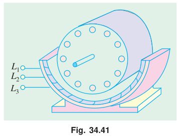

---

### 34.44. Linear Induction Motor

If, in a sector motor, the sector is laid out flat and a flat squirrel-cage winding is brought near to it, we get a **linear induction motor** (Fig. 34.42). 

In practice, instead of a flat squirrel-cage winding, an aluminium or copper or iron plate is used as a 'rotor'. The flat stator produces a flux that moves in a straight line from its one end to the other at a linear synchronous speed given by:

$$v_s = 2 w f$$

where:
* $v_s$ = linear synchronous speed ($\text{m/s}$)
* $w$ = width of one pole-pitch ($\text{m}$)
* $f$ = supply frequency ($\text{Hz}$)

It is worth noting that speed does not depend on the number of poles, but only on the pole-pitch and stator supply frequency. As the flux moves linearly, it drags the rotor plate along with it in the same direction. 

However, in many practical applications, the 'rotor' is stationary, while the stator moves. For example, in high-speed trains, which utilize magnetic levitation (Art. 34.46), the rotor is composed of thick aluminium plate that is fixed to the ground and extends over the full length of the track. The linear stator is bolted to the undercarriage of the train.

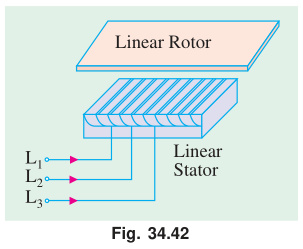

---

### 34.45. Properties of a Linear Induction Motor

These properties are almost identical to those of a standard rotating machine:

1. **Synchronous speed:** It is given by:
   $$v_s = 2 w f$$

2. **Slip:** It is given by:
   $$s = \frac{v_s - v}{v_s}$$
   where $v$ is the actual speed.

3. **Thrust or Force:** It is given by:
   $$F = \frac{P_2}{v_s}$$
   where $P_2$ is the active power supplied to the rotor.

4. **Active Power Flow:** It is similar to that in a rotating motor:
   $$(i)\quad P_{cr} = s P_2$$
   $$(ii)\quad P_m = (1 - s) P_2$$

---

> [!example] Example 34.52
> An electric train, driven by a linear motor, moves with $200\text{ km/h}$, when stator frequency is $100\text{ Hz}$. Assuming negligible slip, calculate the pole-pitch of the linear motor.
> 
> **Solution.**
> 
> $$v_s = 2 w f$$
> 
> $$w = \frac{v_s}{2f} = \frac{200 \times (5/18)}{2 \times 100} = 0.2778\text{ m} = \mathbf{277.8\text{ mm}}$$

---

> [!example] Example 34.53
> An overhead crane in a factory is driven horizontally by means of two similar linear induction motors, whose 'rotors' are the two steel I-beams, on which the crane rolls. The 3-phase, 4-pole linear stators, which are mounted on opposite sides of the crane, have a pole-pitch of $6\text{ cm}$ ($0.06\text{ m}$) and are energised by a variable-frequency electronic source. When one of the motors was tested, it yielded the following results:
> 
> $$\text{Stator frequency} = 25\text{ Hz};\quad \text{Power to stator} = 6\text{ kW}$$
> $$\text{Stator Cu and iron loss} = 1.2\text{ kW};\quad \text{crane speed} = 2.4\text{ m/s}$$
> 
> Calculate:
> 1. synchronous speed and slip
> 2. power input to rotor
> 3. Cu losses in the rotor
> 4. gross mechanical power developed
> 5. thrust.
> 
> **Solution.**
> 
> **(i) Synchronous speed and slip:**
> $$v_s = 2 w f = 2 \times 0.06 \times 25 = \mathbf{3\text{ m/s}}$$
> $$s = \frac{v_s - v}{v_s} = \frac{3 - 2.4}{3} = 0.2\text{ or }\mathbf{20\%}$$
> 
> **(ii) Power input to rotor:**
> $$P_2 = 6 - 1.2 = \mathbf{4.8\text{ kW}}$$
> 
> **(iii) Cu losses in the rotor:**
> $$P_{cr} = s P_2 = 0.2 \times 4.8 = \mathbf{0.96\text{ kW}}$$
> 
> **(iv) Gross mechanical power developed:**
> $$P_m = P_2 - P_{cr} = 4.8 - 0.96 = \mathbf{3.84\text{ kW}}$$
> 
> **(v) Thrust:**
> $$F = \frac{P_2}{v_s} = \frac{4.8 \times 10^3}{3} = 1600\text{ N} = \mathbf{1.60\text{ kN}}$$

---

### 34.46. Magnetic Levitation

As shown in Fig. 34.43 (a), when a moving permanent magnet sweeps across a conducting ladder, it tends to drag the ladder along with it, because it applies a horizontal tractive force $F = B I l$. 

It will now be shown that this horizontal force is also accompanied by a vertical force (particularly, at high magnet speeds), which tends to push the magnet away from the ladder in the upward direction.

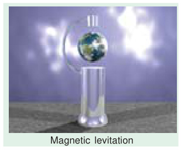

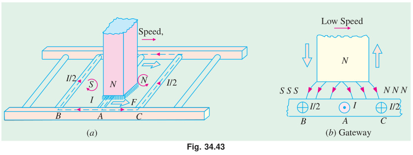

A portion of the conducting ladder of Fig. 34.43 (a) has been shown in Fig. 34.43 (b). The voltage induced in conductor (or bar) $A$ is maximum because flux is greatest at the centre of the $\text{N}$ pole. If the magnet speed is very low, the induced current reaches its maximum value in $A$ at virtually the same time (because delay due to conductor inductance is negligible). As this current flows via conductors $B$ and $C$, it produces induced $\text{SSS}$ and $\text{NNN}$ poles, as shown. Consequently, the front half of the magnet is pushed upwards while the rear half is pulled downwards.

Now, consider the case when the magnet sweeps over conductor $A$ at a sufficiently high speed (Fig. 34.44). Owing to conductor inductance, the current in $A$ reaches its maximum value a fraction of a second ($\Delta t$) after voltage reaches its maximum value.\* Hence, by the time $I$ in conductor $A$ reaches its maximum value, the centre of the magnet is already ahead of $A$ by a distance $= v \cdot \Delta t$ where $v$ is the magnet velocity. 

The induced poles $\text{SSS}$ and $\text{NNN}$ are produced, as before, by the currents returning via conductors $B$ and $C$ respectively. But, by now, the $\text{N}$ pole of the permanent magnet lies over the induced $\text{NNN}$ pole, which pushes it upwards with a strong vertical force. This forms the basis of **magnetic levitation** which literally means *'floating in air'*.

> \* *Note:* The induced current is always delayed (even at low magnet speeds) by an interval of time $\Delta t$ which depends on the $L/R$ time-constant of the conductor circuit. This delay is so brief at slow speed that voltage and the current reach their maximum value virtually at the same time and place. But at high speed, the same delay $\Delta t$ is sufficient to produce large shift in space between the points where the voltage and current achieve their maximum values.

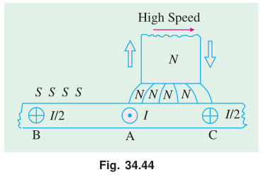

Magnetic levitation is being used in ultrahigh speed trains (up to $300\text{ km/h}$) which float in the air about $100\text{ mm}$ to $300\text{ mm}$ above the metallic track. They do not have any wheels and do not require the traditional steel rail. A powerful electromagnet (whose coils are cooled to about $4\text{ K}$ by liquid helium) fixed underneath the train moves across the conducting rail, thereby inducing current in the rail. This gives rise to vertical force (called force of levitation) which keeps the train pushed up in the air above the track. Linear motors are used to propel the train.

A similar magnetic levitation system of transit is being considered for connecting Vivek Vihar in East Delhi to Vikaspuri in West Delhi. The system popularly known as **Magneto-Bahn (M-Bahn)** completely eliminates the centuries-old 'steel-wheel-over steel rail' traction. The M-Bahn train floats in the air through the principle of magnetic levitation and propulsion is by linear induction motors. There is $50\%$ decrease in the train weight and $60\%$ reduction in energy consumption for propulsion purposes. The system is extraordinarily safe (even during an earthquake) and the operation is fully automatic and computer-based.

---

### 34.47. Induction Motor as a Generalized Transformer

The transfer of energy from stator to the rotor of an induction motor takes place entirely inductively, with the help of a flux mutually linking the two. Hence, an induction motor is essentially a transformer with stator forming the primary and rotor forming (the short-circuited) rotating secondary (Fig. 34.45). The vector diagram is similar to that of a transformer (Art. 32.15).

In the vector diagram of Fig. 34.46:
* $V_1$ is the applied voltage per stator phase
* $R_1$ and $X_1$ are stator resistance and leakage reactance per phase respectively, shown external to the stator winding in Fig. 34.45.

The applied voltage $V_1$ produces a magnetic flux which links both primary and secondary thereby producing a counter e.m.f. of self-induction $E_1$ in primary (i.e. stator) and a mutually-induced e.m.f. $E_r\ (= sE_2)$ in secondary (i.e. rotor). 

There is no secondary terminal voltage $V_2$ in secondary because whole of the induced e.m.f. $E_r$ is used up in circulating the rotor current as the rotor is closed upon itself (which is equivalent to its being short-circuited).

Obviously:

$$V_1 = -E_1 + I_1 R_1 + j I_1 X_1$$

The magnitude of $E_r$ depends on voltage transformation ratio $K$ between stator and rotor and the slip. As it is wholly absorbed in the rotor impedance:

$$\therefore\quad E_r = I_2 Z_2 = I_2 (R_2 + j s X_2)$$

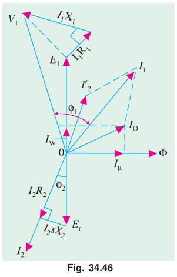

In the vector diagram, $I_0$ is the no-load primary current. It has two components:
1. the working or iron loss component $I_w$ which supplies the no-load motor losses, and
2. the magnetising component $I_\mu$ which sets up magnetic flux in the core and the air-gap.

Obviously:

$$I_0 = \sqrt{I_w^2 + I_\mu^2}$$

In Fig. 34.45, $I_w$ and $I_\mu$ are taken care of by an exciting circuit containing:

$$R_0 = \frac{E_1}{I_w}\quad\text{and}\quad X_0 = \frac{E_1}{I_\mu}\quad\text{respectively.}$$

It should be noted here, in passing that in the usual two-winding transformer, $I_0$ is quite small (about $1\%$ of the full-load current). The reason is that the magnetic flux path lies almost completely in the steel core of low reluctance, hence $I_\mu$ is small, with the result that $I_0$ is small. But in an induction motor, the presence of an air-gap (of high reluctance) necessitates a large $I_\mu$, hence $I_0$ is very large (approximately $40\text{ to }50\%$ of the full-load current).

In the vector diagram, $I_2'$ is the equivalent load current in primary and is equal to $K I_2$. Total primary current is the vector sum of $I_0$ and $I_2'$.

#### Synchronism of Rotor and Stator Fields in Space

At this place, a few words may be said to justify the representation of the stator and rotor quantities on the same vector diagram, even though the frequency of rotor current and e.m.f. is only a fraction of that of the stator. We will now show that even though the frequencies of stator and rotor currents are different, yet **magnetic fields due to them are synchronous with each other, when seen by an observer stationed in space**—both fields rotate at synchronous speed $N_s$ (Art. 34.11).

The current flowing in the short-circuited rotor produces a magnetic field, which revolves round the rotor in the same direction as the stator field. The speed of rotation of the rotor field with respect to the rotor is:

$$= \frac{120 f_r}{P} = \frac{120 (s f)}{P} = s \left(\frac{120 f}{P}\right) = s N_s = (N_s - N)$$

Rotor speed:

$$N = (1 - s) N_s$$

Hence, speed of the rotating field of the rotor with respect to the stationary stator or space is:

$$= s N_s + N = (N_s - N) + N = \mathbf{N_s}$$

---

### 34.48. Rotor Output

Primary current $I_1$ consists of two parts, $I_0$ and $I_2'$. It is the latter which is transferred to the rotor, because $I_0$ is used in meeting the Cu and iron losses in the stator itself. Out of the applied primary voltage $V_1$, some is absorbed in the primary itself ($= I_1 Z_1$) and the remaining $E_1$ is transferred to the rotor. If the angle between $E_1$ and $I_2'$ is $\phi$, then:

$$\text{Rotor input / phase} = E_1 I_2' \cos \phi$$
$$\text{Total rotor input} = 3 E_1 I_2' \cos \phi$$

The electrical input to the rotor which is wasted in the form of heat is:

$$= 3 I_2 E_r \cos \phi\quad (\text{or } = 3 I_2^2 R_2)$$

Now:

$$I_2' = K I_2 \implies I_2 = \frac{I_2'}{K}$$
$$E_r = s E_2 \implies E_2 = K E_1 \implies E_r = s K E_1$$

$$\therefore\quad \text{electrical input wasted as heat} = 3 \times \left(\frac{I_2'}{K}\right) \times s K E_1 \times \cos \phi = 3 E_1 I_2' \cos \phi \times s = \mathbf{\text{rotor input} \times s}$$

Now:

$$\text{rotor output} = \text{rotor input} - \text{losses} = 3 E_1 I_2' \cos \phi - 3 E_1 I_2' \cos \phi \times s = (1 - s) 3 E_1 I_2' \cos \phi = \mathbf{(1 - s) \times \text{rotor input}}$$

$$\therefore\quad \frac{\text{rotor output}}{\text{rotor input}} = 1 - s$$

$$\therefore\quad \text{rotor Cu loss} = s \times \text{rotor input}$$

$$\text{rotor efficiency} = 1 - s = \frac{N}{N_s} = \frac{\text{actual speed}}{\text{synchronous speed}}$$

In the same way, other relations similar to those derived in Art. 34.37 can be found.

---

### 34.49. Equivalent Circuit of the Rotor

When the motor is loaded, the rotor current $I_2$ is given by:

$$I_2 = \frac{s E_2}{\sqrt{R_2^2 + (s X_2)^2}} = \frac{E_2}{\sqrt{(R_2/s)^2 + X_2^2}}$$

From the above relation it appears that the rotor circuit which actually consists of a fixed resistance $R_2$ and a variable reactance $s X_2$ (proportional to slip) connected across $E_r = s E_2$ [Fig. 34.47 (a)] can be looked upon as equivalent to a rotor circuit having a fixed reactance $X_2$ connected in series with a variable resistance $R_2/s$ (inversely proportional to slip) and supplied with constant voltage $E_2$, as shown in Fig. 34.47 (b).

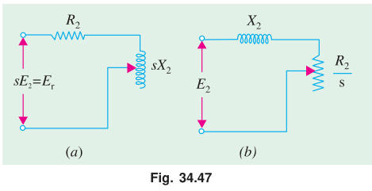

Now, the resistance:

$$\frac{R_2}{s} = R_2 + R_2 \left(\frac{1}{s} - 1\right)$$

It consists of two parts:
1. The first part $R_2$ is the rotor resistance itself and represents the rotor Cu loss.
2. The second part is:
   $$R_L = R_2 \left(\frac{1}{s} - 1\right)$$

This is known as the **load resistance** $R_L$ and is the electrical equivalent of the mechanical load on the motor. In other words, the mechanical load on an induction motor can be represented by a non-inductive resistance of the value $R_2 \left(\frac{1}{s} - 1\right)$. 

The equivalent rotor circuit along with the load resistance $R_L$ is shown in Fig. 34.48.

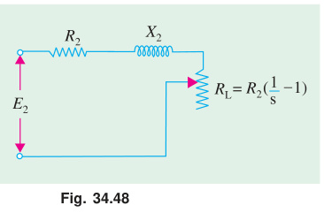

---

### 34.50. Equivalent Circuit of an Induction Motor

As in the case of a transformer (Fig. 32.14), in this case also, the secondary values may be transferred to the primary and vice versa. 

As before, it should be remembered that when shifting impedance or resistance from secondary to primary, it should be divided by $K^2$ whereas current should be multiplied by $K$:

$$R_2' = \frac{R_2}{K^2},\quad X_2' = \frac{X_2}{K^2},\quad I_2' = K I_2,\quad R_L' = \frac{R_L}{K^2} = R_2' \left(\frac{1}{s} - 1\right)$$

The equivalent circuit of an induction motor where all values have been referred to primary (i.e. stator) is shown in Fig. 34.49.

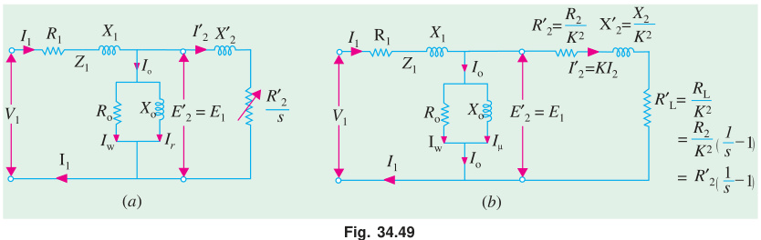

As shown in Fig. 34.50, the exciting circuit may be transferred to the left, because the inaccuracy involved is negligible but the circuit and hence the calculations are very much simplified. This is known as the **approximate equivalent circuit** of the induction motor.

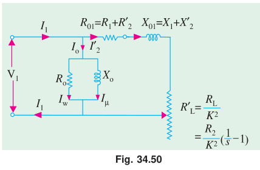

If transformation ratio is assumed unity i.e. $E_2 / E_1 = 1$, then the equivalent circuit is as shown in Fig. 34.51 instead of that in Fig. 34.49.

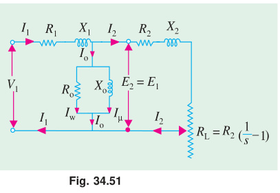

---

### 34.51. Power Balance Equations

With reference to Fig. 34.49 (a), following power relations in an induction motor can be deduced:

$$\text{Input power} = 3 V_1 I_1 \cos \phi_1$$
$$\text{Stator core loss} = I_w^2 R_0$$
$$\text{Stator Cu loss} = 3 I_1^2 R_1$$
$$\text{Power transferred to rotor} = 3 I_2'^2 \frac{R_2'}{s}$$
$$\text{Rotor Cu loss} = 3 I_2'^2 R_2'$$

Mechanical power developed by rotor ($P_m$) or gross power developed by rotor ($P_g$):

$$P_g = \text{rotor input} - \text{rotor Cu losses}$$

$$P_g = 3 I_2'^2 \frac{R_2'}{s} - 3 I_2'^2 R_2' = 3 I_2'^2 R_2' \left(\frac{1 - s}{s}\right)\text{ Watts}$$

If $T_g$ is the gross torque\* developed by the rotor, then:

$$T_g \times \omega = T_g \times \frac{2 \pi N}{60} = 3 I_2'^2 R_2' \left(\frac{1 - s}{s}\right)$$

$$\therefore\quad T_g = \frac{3 I_2'^2 R_2' \left(\frac{1 - s}{s}\right)}{2 \pi N / 60}\text{ N-m}$$

Now, $N = N_s (1 - s)$. Hence gross torque becomes:

$$T_g = \frac{3 I_2'^2 (R_2' / s)}{2 \pi N_s / 60} = \frac{9.55 \times 3 I_2'^2 (R_2' / s)}{N_s}\text{ N-m}$$

Since gross torque in synchronous watts is equal to the power transferred to the rotor across the air-gap:

$$\therefore\quad T_g = 3 I_2'^2 \frac{R_2'}{s}\text{ synch. watt}$$

It is seen from the approximate circuit of Fig. 34.50 that:

$$I_2' = \frac{V_1}{(R_1 + R_2'/s) + j(X_1 + X_2')}$$

$$T_g = \frac{3}{2 \pi N_s / 60} \times \frac{V_1^2 (R_2'/s)}{(R_1 + R_2'/s)^2 + (X_1 + X_2')^2}\text{ N-m}$$

> \* *Note:* It is different from shaft torque, which is less than $T_g$ by the torque required to meet windage and frictional losses.

---

### 34.52. Maximum Power Output

Fig. 34.52 shows the approximate equivalent circuit of an induction motor with the simplification that:
1. exciting circuit is omitted i.e. $I_0$ is neglected, and
2. $K$ is assumed unity.

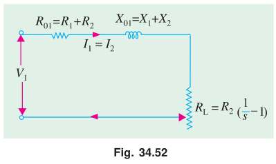

As seen, gross power output for a 3-phase induction motor is:

$$P_g = 3 I_1^2 R_L$$

Now:

$$I_1 = \frac{V_1}{\sqrt{(R_{01} + R_L)^2 + X_{01}^2}}$$

$$\therefore\quad P_g = \frac{3 V_1^2 R_L}{(R_{01} + R_L)^2 + X_{01}^2}$$

The condition for maximum power output can be found by differentiating the above equation with respect to $R_L$ and equating the first derivative to zero:

$$\frac{d P_g}{d R_L} = 0 \implies R_L^2 = R_{01}^2 + X_{01}^2 = Z_{01}^2$$

where $Z_{01}$ = leakage impedance of the motor as referred to primary.

$$\therefore\quad \mathbf{R_L = Z_{01}}$$

> **Theorem:** The power output is maximum when the **equivalent load resistance is equal to the standstill leakage impedance of the motor**.

---

### 34.53. Corresponding Slip

Now:

$$R_L = R_2 \left(\frac{1}{s} - 1\right)$$

$$\therefore\quad Z_{01} = R_L = R_2 \left(\frac{1}{s} - 1\right) \implies \frac{1}{s} = \frac{Z_{01}}{R_2} + 1 = \frac{R_2 + Z_{01}}{R_2}$$

$$\therefore\quad \mathbf{s = \frac{R_2}{R_2 + Z_{01}}}$$

This is the slip corresponding to maximum gross power output. The value of $P_{g\text{ max}}$ is obtained by substituting $R_L$ by $Z_{01}$ in the power equation:

$$P_{g\text{ max}} = \frac{3 V_1^2 Z_{01}}{(R_{01} + Z_{01})^2 + X_{01}^2} = \frac{3 V_1^2 Z_{01}}{R_{01}^2 + 2 R_{01} Z_{01} + Z_{01}^2 + X_{01}^2}$$

Since $R_{01}^2 + X_{01}^2 = Z_{01}^2$:

$$P_{g\text{ max}} = \frac{3 V_1^2 Z_{01}}{2 Z_{01}^2 + 2 R_{01} Z_{01}} = \mathbf{\frac{3 V_1^2}{2 (R_{01} + Z_{01})}}$$

It should be noted that $V_1$ is voltage/phase of the motor and $K$ has been taken as unity.

---

> [!example] Example 34.54
> The maximum torque of a 3-phase induction motor occurs at a slip of $12\%$. The motor has an equivalent secondary resistance of $0.08\ \Omega/\text{phase}$. Calculate the equivalent load resistance $R_L$, the equivalent load voltage $V_L$ and the current at this slip if the gross power output is $9,000\text{ watts}$.
> 
> **Solution.**
> 
> $$R_L = R_2 \left(\frac{1}{s} - 1\right) = 0.08 \left(\frac{1}{0.12} - 1\right) = \mathbf{0.587\ \Omega/\text{phase}}$$
> 
> As shown in the equivalent circuit of the rotor in Fig. 34.53, $V$ is a fictitious voltage drop equivalent to that consumed in the load connected to the secondary i.e. rotor. The value of $V = I_2 R_L$.
> 
> 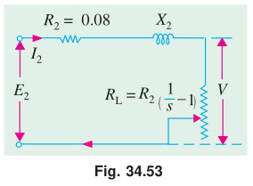
> 
> Now, gross power:
> 
> $$P_g = 3 I_2^2 R_L = \frac{3 V^2}{R_L}$$
> 
> $$V = \sqrt{R_L \times \frac{P_g}{3}} = \sqrt{0.587 \times \frac{9000}{3}} = \mathbf{42\text{ V}}$$
> 
> $$\text{Equivalent load current} = \frac{V}{R_L} = \frac{42}{0.587} = \mathbf{71.6\text{ A}}$$

---

> [!example] Example 34.55
> A 3-phase, star-connected $400\text{ V}$, $50\text{-Hz}$, 4-pole induction motor has the following per phase parameters in ohms, referred to the stators:
> 
> $$R_1 = 0.15\ \Omega,\quad X_1 = 0.45\ \Omega,\quad R_2' = 0.12\ \Omega,\quad X_2' = 0.45\ \Omega,\quad X_m = 28.5\ \Omega$$
> 
> Compute the stator current and power factor when the motor is operated at rated voltage and frequency with $s = 0.04$.
> *(Elect. Machines, A.M.I.E. Sec. B, 1990)*
> 
> **Solution.**
> 
> The equivalent circuit with all values referred to stator is shown in Fig. 34.54.
> 
> 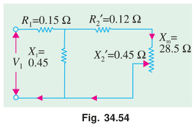
> 
> $$R_L' = R_2' \left(\frac{1}{s} - 1\right) = 0.12 \left(\frac{1}{0.04} - 1\right) = 2.88\ \Omega$$
> 
> $$I_2' = \frac{V_1}{(R_{01} + R_L') + j X_{01}} = \frac{400 / \sqrt{3}}{(0.15 + 0.12 + 2.88) + j(0.45 + 0.45)}$$
> 
> $$I_2' = \frac{231}{3.15 + j 0.90} = 67.78 - j 19.36\text{ A}$$
> 
> $$I_0 = \frac{400 / \sqrt{3}}{j X_m} = \frac{231}{j 28.5} = -j 8.1\text{ A}$$
> 
> Stator current:
> 
> $$I_1 = I_0 + I_2' = (67.78 - j 19.36) - j 8.1 = 67.78 - j 27.46 = \mathbf{73.13 \angle -22^\circ\text{ A}}$$
> 
> $$\text{p.f.} = \cos \phi = \cos 22^\circ = \mathbf{0.927\text{ (lag)}}$$

---

> [!example] Example 34.56
> A $220\text{-V}$, 3-$\phi$, 4-pole, $50\text{-Hz}$, Y-connected induction motor is rated $3.73\text{ kW}$. The equivalent circuit parameters are:
> 
> $$R_1 = 0.45\ \Omega,\quad X_1 = 0.8\ \Omega;\quad R_2' = 0.4\ \Omega,\quad X_2' = 0.8\ \Omega,\quad B_0 = -\frac{1}{30}\text{ mho}$$
> 
> The stator core loss is $50\text{ W}$ and rotational loss is $150\text{ W}$. For a slip of $0.04$, find:
> 1. input current
> 2. p.f.
> 3. air-gap power
> 4. mechanical power
> 5. electro-magnetic torque
> 6. output power and
> 7. efficiency.
> 
> **Solution.**
> 
> The exact equivalent circuit is shown in Fig. 34.55. Since $R_0$ (or $G_0$) is negligible in determining $I_1$, we will consider $B_0$ (or $X_0 = X_m = 30\ \Omega$) only.
> 
> 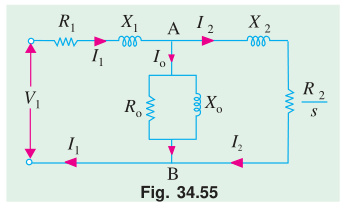
> 
> Here $R_2'/s = 0.4 / 0.04 = 10\ \Omega$.
> 
> $$Z_{AB} = \frac{j X_m [(R_2'/s) + j X_2']}{(R_2'/s) + j(X_2' + X_m)} = \frac{j 30 (10 + j 0.8)}{10 + j 30.8} = 8.58 + j 3.56 = 9.29 \angle 22.5^\circ\ \Omega$$
> 
> $$Z_{01} = Z_1 + Z_{AB} = (0.45 + j 0.8) + (8.58 + j 3.56) = 9.03 + j 4.36 = 10 \angle 25.8^\circ\ \Omega$$
> 
> $$V_{ph} = \frac{220}{\sqrt{3}} \angle 0^\circ = 127 \angle 0^\circ\text{ V}$$
> 
> **(i) Input current:**
> $$I_1 = \frac{V_1}{Z_{01}} = \frac{127 \angle 0^\circ}{10 \angle 25.8^\circ} = \mathbf{12.7 \angle -25.8^\circ\text{ A}}$$
> 
> **(ii) Power factor:**
> $$\text{p.f.} = \cos 25.8^\circ = \mathbf{0.9}$$
> 
> **(iii) Air-gap power:**
> $$P_2 = 3 I_2'^2 (R_2'/s) = 3 I_1^2 R_{AB} = 3 \times 12.7^2 \times 8.58 = \mathbf{4152\text{ W}}$$
> 
> **(iv) Mechanical power:**
> $$P_m = (1 - s) P_2 = (1 - 0.04) \times 4152 = 0.96 \times 4152 = \mathbf{3986\text{ W}}$$
> 
> **(v) Electromagnetic torque (i.e. gross torque):**
> $$T_g = \frac{P_m}{2 \pi N / 60} = \frac{9.55 P_m}{N}\text{ N-m}$$
> 
> Now, $N_s = 1500\text{ rpm}$, $N = 1500 (1 - 0.04) = 1440\text{ rpm}$.
> 
> $$T_g = \frac{9.55 \times 3986}{1440} = \mathbf{26.4\text{ N-m}}$$
> 
> $$\left(\text{or } T_g = \frac{9.55 P_2}{N_s} = \frac{9.55 \times 4152}{1500} = 26.4\text{ N-m}\right)$$
> 
> **(vi) Output power:**
> $$\text{Output power} = P_m - \text{rotational losses} = 3986 - 150 = \mathbf{3836\text{ W}}$$
> 
> **(vii) Efficiency:**
> * Stator core loss $= 50\text{ W}$
> * Stator Cu loss $= 3 I_1^2 R_1 = 3 \times 12.7^2 \times 0.45 = 218\text{ W}$
> * Rotor Cu loss $= 3 I_2'^2 R_2' = s P_2 = 0.04 \times 4152 = 166\text{ W}$
> * Rotational losses $= 150\text{ W}$
> 
> $$\text{Total loss} = 50 + 218 + 166 + 150 = 584\text{ W}$$
> 
> $$\eta = \frac{3836}{3836 + 584} = 0.868\text{ or }\mathbf{86.8\%}$$

---

> [!example] Example 34.57
> A $440\text{-V}$, 3-$\phi$, $50\text{-Hz}$, $37.3\text{ kW}$, Y-connected induction motor has the following parameters:
> 
> $$R_1 = 0.1\ \Omega,\quad X_1 = 0.4\ \Omega,\quad R_2' = 0.15\ \Omega,\quad X_2' = 0.44\ \Omega$$
> 
> Motor has stator core loss of $1250\text{ W}$ and rotational loss of $1000\text{ W}$. It draws a no-load line current of $20\text{ A}$ at a p.f. of $0.09$ (lag). When motor operates at a slip of $3\%$, calculate:
> 1. input line current and p.f.
> 2. electromagnetic torque developed in $\text{N-m}$
> 3. output and
> 4. efficiency of the motor.
> *(Elect. Machines-II, Nagpur Univ. 1992)*
> 
> **Solution.**
> 
> The equivalent circuit of the motor is shown in Fig. 34.49 (a).
> 
> Applied voltage per phase $= \frac{440}{\sqrt{3}} = 254\text{ V}$.
> 
> $$I_2' = \frac{V_1}{(R_1 + R_2'/s) + j(X_1 + X_2')} = \frac{254 \angle 0^\circ}{(0.1 + 0.15/0.03) + j(0.4 + 0.44)} = \frac{254 \angle 0^\circ}{5.1 + j 0.84} = \frac{254 \angle 0^\circ}{5.17 \angle 9.3^\circ}$$
> 
> $$I_2' = 49.1 \angle -9.3^\circ = 48.4 - j 7.9\text{ A}$$
> 
> For all practical purposes, no-load motor current may be taken as equal to magnetising current $I_0$.
> 
> Since $\cos \phi_0 = 0.09 \implies \phi_0 = 84.9^\circ$:
> 
> $$I_0 = 20 \angle -84.9^\circ = 1.78 - j 19.9\text{ A}$$
> 
> **(i) Input line current and p.f.:**
> $$I_1 = I_0 + I_2' = (48.4 - j 7.9) + (1.78 - j 19.9) = 50.2 - j 27.8 = \mathbf{57.4 \angle -29^\circ\text{ A}}$$
> 
> $$\therefore\quad \text{p.f.} = \cos 29^\circ = \mathbf{0.875\text{ (lag)}}$$
> 
> **(ii) Electromagnetic torque developed:**
> $$P_2 = 3 I_2'^2 \left(\frac{R_2'}{s}\right) = 3 \times 49.1^2 \times \left(\frac{0.15}{0.03}\right) = 36,160\text{ W}$$
> 
> $$N_s = \frac{120 \times 50}{4} = 1500\text{ rpm}$$
> 
> $$\therefore\quad T_g = \frac{9.55 \times 36,160}{1500} = \mathbf{230\text{ N-m}}$$
> 
> **(iii) Output:**
> $$P_m = (1 - s) P_2 = (1 - 0.03) \times 36,160 = 0.97 \times 36,160 = 35,075\text{ W}$$
> 
> $$\text{Output power} = 35,075 - 1000 = \mathbf{34,075\text{ W}}$$
> *(Obviously, motor is delivering less than its rated output at this slip).*
> 
> **(iv) Efficiency:**
> Let us total up the losses:
> * Core loss $= 1250\text{ W}$
> * Stator Cu loss $= 3 I_1^2 R_1 = 3 \times 57.4^2 \times 0.1 = 988\text{ W}$
> * Rotor Cu loss $= 3 I_2'^2 R_2' = s P_2 = 0.03 \times 36,160 = 1085\text{ W}$
> * Rotational (friction & windage) losses $= 1000\text{ W}$
> 
> $$\text{Total losses} = 1250 + 988 + 1085 + 1000 = 4323\text{ W}$$
> 
> $$\eta = \frac{34,075}{34,075 + 4323} = 0.887\text{ or }\mathbf{88.7\%}$$
> 
> *Alternatively:*
> $$\text{Input} = \sqrt{3} \times 440 \times 57.4 \times 0.875 = 38,275\text{ W}$$
> $$\therefore\quad \eta = 1 - \frac{4323}{38,275} = 0.887\text{ or }\mathbf{88.7\%}$$

---

> [!example] Example 34.58
> A $400\text{ V}$, 3-$\phi$, star-connected induction motor has a stator exciting impedance of $(0.06 + j 0.2)\ \Omega$ and an equivalent rotor impedance of $(0.06 + j 0.22)\ \Omega$. Neglecting exciting current, find the maximum gross power and the slip at which it occurs.
> *(Elect. Engg.-II, Bombay Univ. 1987)*
> 
> **Solution.**
> 
> The equivalent circuit is shown in Fig. 34.56.
> 
> 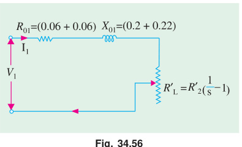
> 
> $$R_{01} = R_1 + R_2' = 0.06 + 0.06 = 0.12\ \Omega$$
> $$X_{01} = X_1 + X_2' = 0.2 + 0.22 = 0.42\ \Omega$$
> 
> $$\therefore\quad Z_{01} = \sqrt{0.12^2 + 0.42^2} = 0.44\ \Omega$$
> 
> As shown in Art. 34.53, slip corresponding to maximum gross power output is given by:
> 
> $$s = \frac{R_2}{R_2 + Z_{01}} = \frac{0.06}{0.06 + 0.44} = 0.12\text{ or }\mathbf{12\%}$$
> 
> Voltage/phase:
> 
> $$V_1 = \frac{400}{\sqrt{3}}\text{ V}$$
> 
> $$P_{g\text{ max}} = \frac{3 V_1^2}{2 (R_{01} + Z_{01})} = \frac{3 (400/\sqrt{3})^2}{2 (0.12 + 0.44)} = \frac{160,000}{1.12} = \mathbf{142,900\text{ W}}$$

---

> [!example] Example 34.59
> A $115\text{-V}$, $60\text{-Hz}$, 3-phase, Y-connected, 6-pole induction motor has an equivalent T-circuit consisting of stator impedance of $(0.07 + j 0.3)\ \Omega$ and an equivalent rotor impedance at standstill of $(0.08 + j 0.3)\ \Omega$. Magnetising branch has $G_0 = 0.022\text{ mho}$, $B_0 = 0.158\text{ mho}$. 
> 
> Find:
> 1. secondary current
> 2. primary current
> 3. primary p.f.
> 4. gross power output
> 5. gross torque
> 6. input
> 7. gross efficiency
> 
> by using approximate equivalent circuit. Assume a slip of $2\%$.
> 
> **Solution.**
> 
> The equivalent circuit is shown in Fig. 34.57.
> 
> 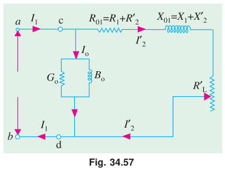
> 
> $$R_L' = R_2' \left(\frac{1}{s} - 1\right) = 0.08 \left(\frac{1}{0.02} - 1\right) = 3.92\ \Omega/\text{phase}$$
> 
> The impedance to the right of terminals $c$ and $d$ is:
> 
> $$Z_{cd} = R_{01} + R_L' + j X_{01} = (0.07 + 0.08) + 3.92 + j 0.6 = 4.07 + j 0.6 = 4.11 \angle 8.4^\circ\ \Omega/\text{phase}$$
> 
> $$V = \frac{115}{\sqrt{3}} = 66.5\text{ V}$$
> 
> **(a) Secondary current $I_2' = I_2$:**
> $$I_2' = \frac{66.5}{4.11 \angle 8.4^\circ} = 16.17 \angle -8.4^\circ = \mathbf{16 - j 2.36\text{ A}}$$
> 
> The exciting current:
> $$I_0 = V (G_0 - j B_0) = 66.5 (0.022 - j 0.158) = 1.46 - j 10.5\text{ A}$$
> 
> **(b) Primary current:**
> $$I_1 = I_0 + I_2' = (1.46 - j 10.5) + (16 - j 2.36) = 17.46 - j 12.86 = \mathbf{21.7 \angle -36.5^\circ\text{ A}}$$
> 
> **(c) Primary p.f.:**
> $$\text{Primary p.f.} = \cos 36.5^\circ = \mathbf{0.804}$$
> 
> **(d) Gross power output:**
> $$P_g = 3 I_2^2 R_L' = 3 \times 16.17^2 \times 3.92 = \mathbf{3075\text{ W}}$$
> 
> **(e) Gross torque:**
> Synchronous speed:
> $$N_s = \frac{120 \times 60}{6} = 1200\text{ rpm}$$
> Actual rotor speed:
> $$N = (1 - s) N_s = (1 - 0.02) \times 1200 = 1176\text{ rpm}$$
> 
> $$\therefore\quad T_g = \frac{9.55 P_m}{N} = \frac{9.55 \times 3075}{1176} = \mathbf{24.97\text{ N-m}}$$
> 
> **(f) Input:**
> $$\text{Primary power input} = \sqrt{3} V_L I_1 \cos \phi_1 = \sqrt{3} \times 115 \times 21.7 \times 0.804 = \mathbf{3450\text{ W}}$$
> 
> **(g) Gross efficiency:**
> $$\text{Gross efficiency} = \frac{3075 \times 100}{3450} = \mathbf{89.5\%}$$
> 
> ---
> 
> #### Alternative Solution
> 
> Instead of using the equivalent circuit of Fig. 34.57, we could use that shown in Fig. 34.49 which is reproduced in Fig. 34.58.
> 
> 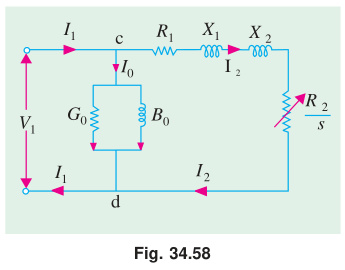
> 
> **(a)**
> $$I_2' = \frac{V_1}{(R_1 + R_2'/s) + j(X_1 + X_2')} = \frac{66.5 \angle 0^\circ}{(0.07 + 0.08/0.02) + j(0.3 + 0.3)} = \frac{66.5}{4.07 + j 0.6} = 16 - j 2.36 = \mathbf{16.17 \angle -8.4^\circ\text{ A}}$$
> 
> **(b)**
> $$I_1 = I_0 + I_2 = \mathbf{21.7 \angle -36.5^\circ\text{ A}}\quad\text{(...as before)}$$
> 
> **(c)**
> $$\text{Primary p.f.} = \mathbf{0.804}\quad\text{(...as before)}$$
> 
> **(d)**
> $$P_g = 3 I_2'^2 R_2' \left(\frac{1 - s}{s}\right) = 3 \times 16.17^2 \times 0.08 \times \left(\frac{1 - 0.02}{0.02}\right) = \mathbf{3075\text{ W}}$$
> 
> The rest of the solution is the same as above.

---

> [!example] Example 34.60
> The equivalent circuit of a $400\text{ V}$, 3-phase induction motor with a star-connected winding has the following impedances per phase referred to the stator at standstill:
> 
> $$\text{Stator : } (0.4 + j 1)\ \Omega;\quad \text{Rotor : } (0.6 + j 1)\ \Omega;\quad \text{Magnetising branch : } (10 + j 50)\ \Omega$$
> 
> Find:
> 1. maximum torque developed
> 2. slip at maximum torque and
> 3. p.f. at a slip of $5\%$.
> 
> Use approximate equivalent circuit.
> *(Elect. Machinery-III, Bangalore Univ. 1987)*
> 
> **Solution.**
> 
> **(ii) Slip at maximum torque:**
> Gap power transferred and hence the mechanical torque developed by rotor would be maximum when there is maximum transfer of power to the resistor $R_2'/s$ shown in the approximate equivalent circuit of the motor in Fig. 34.59. It will happen when $R_2'/s$ equals the impedance looking back into the supply source. Hence:
> 
> 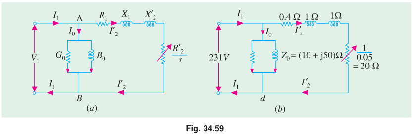
> 
> $$\frac{R_2'}{s_m} = \sqrt{R_1^2 + (X_1 + X_2')^2}$$
> 
> $$\text{or}\quad s_m = \frac{R_2'}{\sqrt{R_1^2 + (X_1 + X_2')^2}} = \frac{0.6}{\sqrt{0.4^2 + 2^2}} = \frac{0.6}{2.04} = 0.29\text{ or }\mathbf{29\%}$$
> 
> **(i) Maximum gross torque developed by rotor:**
> 
> $$T_{g\text{ max}} = \frac{P_{g\text{ max}}}{2 \pi N_s / 60} = \frac{3 I_2'^2 (R_2'/s_m)}{2 \pi N_s / 60}\text{ N-m}$$
> 
> Now, at $s_m$:
> 
> $$I_2' = \frac{V_1}{\sqrt{(R_1 + R_2'/s_m)^2 + (X_1 + X_2')^2}} = \frac{400 / \sqrt{3}}{\sqrt{(0.4 + 0.6/0.29)^2 + (1 + 1)^2}} = \frac{231}{\sqrt{2.47^2 + 2^2}} = \frac{231}{3.18} = 103.3\text{ A}$$
> 
> $$\therefore\quad T_{g\text{ max}} = \frac{3 \times 103.3^2 \times (0.6 / 0.29)}{2 \pi \times 1500 / 60} = \mathbf{351\text{ N-m}}\quad\text{(...assuming } N_s = 1500\text{ rpm)}$$
> 
> **(iii) Power factor at a slip of $0.05$:**
> The equivalent circuit for one phase for a slip of $0.05$ is shown in Fig. 34.59 (b).
> 
> Here $R_2'/s = 1 / 0.05 = 20\ \Omega$.
> 
> $$I_2' = \frac{231}{(20 + 0.4) + j 2} = \frac{231}{20.4 + j 2} = 11.2 - j 1.1\text{ A}$$
> 
> $$I_0 = \frac{231}{10 + j 50} = 0.89 - j 4.4\text{ A}$$
> 
> $$I_1 = I_0 + I_2' = (0.89 - j 4.4) + (11.2 - j 1.1) = 12.09 - j 5.5 = 13.28 \angle -24.4^\circ\text{ A}$$
> 
> $$\text{p.f.} = \cos 24.4^\circ = \mathbf{0.91\text{ (lag)}}$$

---

### Tutorial Problem No. 34.4

1. A 3-phase, 115-volt induction motor has the following constants:
   $$R_1 = 0.07\ \Omega;\quad R_2' = 0.08\ \Omega,\quad X_1 = 0.4\ \Omega\quad\text{and}\quad X_2' = 0.2\ \Omega$$
   All the values are for one phase only. At which slip the gross power output will be maximum and the value of the gross power output?
   $$\mathbf{[11.4\%;\ 8.6\text{ kW}]}$$

2. A 3-phase, 400-V, Y-connected induction motor has an equivalent T-circuit consisting of:
   $$R_1 = 1\ \Omega,\quad X_1 = 2\ \Omega,\quad\text{equivalent rotor values are } R_2' = 1.2\ \Omega,\quad X_2' = 1.5\ \Omega$$
   The exciting branch has an impedance of $(4 + j 40)\ \Omega$. If slip is $5\%$ find:
   1. current
   2. efficiency
   3. power factor
   4. output.
   Assume friction loss to be $250\text{ W}$.
   $$\mathbf{[(i)\ 10.8\text{ A}\ (ii)\ 81\%\ (iii)\ 0.82\ (iv)\ 5\text{ kW}]}$$

3. A $50\text{ HP}$, $440\text{ Volt}$, 3-phase, $50\text{ Hz}$ Induction motor with star-connected stator winding gave the following test results:
   * **(i) No load test:** Applied line voltage $440\text{ V}$, line current $24\text{ A}$, wattmeter reading $5150$ and $3350\text{ watts}$.
   * **(ii) Blocked rotor test:** Applied line voltage $33.6\text{ volt}$, line current $65\text{ A}$, wattmeter reading $2150$ and $766\text{ watts}$.
   Calculate the parameters of the equivalent circuit.
   *(Rajiv Gandhi Technical University, Bhopal, 2000)*
   $$\mathbf{[(i)\ \text{Shunt branch : } R_0 = 107.6\ \Omega,\ X_m = 10.60\ \Omega\quad (ii)\ \text{Series branch : } r = 0.23\ \Omega,\ x = 0.19\ \Omega]}$$

---

## OBJECTIVE TESTS – 34

1. **Regarding skewing of motor bars in a squirrel-cage induction motor (SCIM), which statement is false?**
   - (a) it prevents cogging
   - (b) it increases starting torque
   - (c) it produces more uniform torque
   - (d) it reduces motor 'hum' during its operation.
   > **Answer: (b)**

2. **The principle of operation of a 3-phase induction motor is most similar to that of a:**
   - (a) synchronous motor
   - (b) repulsion-start induction motor
   - (c) transformer with a shorted secondary
   - (d) capacitor-start, induction-run motor.
   > **Answer: (c)**

3. **The magnetising current drawn by transformers and induction motors is the cause of their ......... power factor.**
   - (a) zero
   - (b) unity
   - (c) lagging
   - (d) leading.
   > **Answer: (c)**

4. **The effect of increasing the length of air-gap in an induction motor will be to increase the:**
   - (a) power factor
   - (b) speed
   - (c) magnetising current
   - (d) air-gap flux.
   *(Power App-II, Delhi Univ. Jan. 1987)*
   > **Answer: (c)**

5. **In a 3-phase induction motor, the relative speed of stator flux with respect to .......... is zero.**
   - (a) stator winding
   - (b) rotor
   - (c) rotor flux
   - (d) space.
   > **Answer: (c)**

6. **An eight-pole wound rotor induction motor operating on 60 Hz supply is driven at 1800 r.p.m. by a prime mover in the opposite direction of revolving magnetic field. The frequency of rotor current is:**
   - (a) 60 Hz
   - (b) 120 Hz
   - (c) 180 Hz
   - (d) none of the above.
   *(Elect. Machines, A.M.I.E. Sec. B, 1993)*
   > **Answer: (c)**
   *(Explanation: $N_s = 120 \times 60 / 8 = 900\text{ rpm}$. Opposite direction $\implies N = -1800\text{ rpm}$. Slip $s = (900 - (-1800))/900 = 2700/900 = 3$. Frequency $f_r = s f = 3 \times 60 = 180\text{ Hz}$.)*

7. **A 3-phase, 4-pole, 50-Hz induction motor runs at a speed of 1440 r.p.m. The rotating field produced by the rotor rotates at a speed of ....... r.p.m. with respect to the rotor.**
   - (a) 1500
   - (b) 1440
   - (c) 60
   - (d) 0.
   > **Answer: (c)**
   *(Explanation: $N_s = 1500\text{ rpm}$, $N = 1440\text{ rpm}$. Relative speed $= N_s - N = 1500 - 1440 = 60\text{ rpm}$.)*

8. **In a 3-$\phi$ induction motor, the rotor field rotates at synchronous speed with respect to:**
   - (a) stator
   - (b) rotor
   - (c) stator flux
   - (d) none of the above.
   > **Answer: (a)**

9. **Irrespective of the supply frequency, the torque developed by a SCIM is the same whenever ........ is the same.**
   - (a) supply voltage
   - (b) external load
   - (c) rotor resistance
   - (d) slip speed.
   > **Answer: (d)**

10. **In the case of a 3-$\phi$ induction motor having $N_s = 1500\text{ rpm}$ and running with $s = 0.04$:**
    - (a) revolving speed of the stator flux in space is **1500** rpm
    - (b) rotor speed is **1440** rpm
    - (c) speed of rotor flux relative to the rotor is **60** rpm
    - (d) speed of the rotor flux with respect to the stator is **1500** rpm.
    > **Answer: (i) 1500, (ii) 1440, (iii) 60, (iv) 1500**

11. **The number of stator poles produced in the rotating magnetic field of a 3-$\phi$ induction motor having 3 slots per pole per phase is:**
    - (a) 3
    - (b) 6
    - (c) 2
    - (d) 12
    > **Answer: (b)**

12. **The power factor of a squirrel-cage induction motor is:**
    - (a) low at light loads only
    - (b) low at heavy loads only
    - (c) low at light and heavy loads both
    - (d) low at rated load only.
    *(Elect. Machines, A.M.I.E. Sec. B, 1993)*
    > **Answer: (a)**

13. **Which of the following rotor quantity in a SCIM does NOT depend on its slip?**
    - (a) reactance
    - (b) speed
    - (c) induced emf
    - (d) frequency.
    > **Answer: (b)** *(Note: actual rotor speed is $N = (1-s)N_s$, but standstill inherent parameters like physical dimensions/resistance don't vary with slip, whereas per official Theraja answer key: **b**)*

14. **A 6-pole, 50-Hz, 3-$\phi$ induction motor is running at 950 rpm and has rotor Cu loss of 5 kW. Its rotor input is ...... kW.**
    - (a) 100
    - (b) 10
    - (c) 95
    - (d) 5.3.
    > **Answer: (a)**
    *(Explanation: $N_s = 1000\text{ rpm}$, $s = (1000-950)/1000 = 0.05$. Rotor input $= P_{cr}/s = 5/0.05 = 100\text{ kW}$.)*

15. **The efficiency of a 3-phase induction motor is approximately proportional to:**
    - (a) $(1 - s)$
    - (b) $s$
    - (c) $N$
    - (d) $N_s$.
    > **Answer: (a)**

16. **A 6-pole, 50-Hz, 3-$\phi$ induction motor has a full-load speed of 950 rpm. At half-load, its speed would be ...... rpm.**
    - (a) 475
    - (b) 500
    - (c) 975
    - (d) 1000
    > **Answer: (c)**
    *(Explanation: Full-load slip $= (1000 - 950)/1000 = 5\%$. At half load, slip is approximately halved to $2.5\%$. Speed $= 1000(1 - 0.025) = 975\text{ rpm}$.)*

17. **If rotor input of a SCIM running with a slip of $10\%$ is 100 kW, gross power developed by its rotor is ...... kW.**
    - (a) 10
    - (b) 90
    - (c) 99
    - (d) 80
    > **Answer: (b)**
    *(Explanation: $P_m = (1 - s) P_2 = (1 - 0.10) \times 100 = 90\text{ kW}$.)*

18. **Pull-out torque of a SCIM occurs at that value of slip where rotor power factor equals:**
    - (a) unity
    - (b) 0.707
    - (c) 0.866
    - (d) 0.5
    > **Answer: (b)**
    *(Explanation: At maximum torque, $R_2 = s X_2 \implies \cos \phi_2 = R_2 / \sqrt{R_2^2 + (s X_2)^2} = 1/\sqrt{2} = 0.707$.)*

19. **Fill in the blanks.**
    When load is placed on a 3-phase induction motor, its:
    - (i) speed **decreases**
    - (ii) slip **increases**
    - (iii) rotor induced emf **increases**
    - (iv) rotor current **increases**
    - (v) rotor torque **increases**
    - (vi) rotor continues to rotate at that value of slip at which developed torque equals **applied** torque.
    > **Answers: (i) decreases, (ii) increases, (iii) increases, (iv) increases, (v) increases, (vi) applied**

20. **When applied rated voltage per phase is reduced by one-half, the starting torque of a SCIM becomes ...... of the starting torque with full voltage.**
    - (a) $1/2$
    - (b) $1/4$
    - (c) $1/\sqrt{2}$
    - (d) $3/2$
    > **Answer: (b)**
    *(Explanation: $T_{st} \propto V^2$. If $V$ is halved, $T_{st} \propto (1/2)^2 = 1/4$.)*

21. **If maximum torque of an induction motor is $200\text{ kg-m}$ at a slip of $12\%$, the torque at $6\%$ slip would be ...... kg-m.**
    - (a) 100
    - (b) 160
    - (c) 50
    - (d) 40
    > **Answer: (b)**
    *(Explanation: $\frac{T}{T_{\text{max}}} = \frac{2}{(s/s_m) + (s_m/s)} = \frac{2}{(0.06/0.12) + (0.12/0.06)} = \frac{2}{0.5 + 2} = \frac{2}{2.5} = 0.8$. Torque $= 0.8 \times 200 = 160\text{ kg-m}$.)*

22. **The fractional slip of an induction motor is the ratio:**
    - (a) rotor Cu loss / rotor input
    - (b) stator Cu loss / stator input
    - (c) rotor Cu loss / rotor output
    - (d) rotor Cu loss / stator Cu loss
    > **Answer: (a)**

23. **The torque developed by a 3-phase induction motor depends on the following three factors:**
    - (a) speed, frequency, number of poles
    - (b) voltage, current and stator impedance
    - (c) synchronous speed, rotor speed and frequency
    - (d) rotor emf, rotor current and rotor p.f.
    > **Answer: (d)**

24. **If the stator voltage and frequency of an induction motor are reduced proportionately, its:**
    - (a) locked rotor current is reduced
    - (b) torque developed is increased
    - (c) magnetising current is decreased
    - (d) both (a) and (b)
    > **Answer: (d)**

25. **The efficiency and p.f. of a SCIM increases in proportion to its:**
    - (a) speed
    - (b) mechanical load
    - (c) voltage
    - (d) rotor torque
    > **Answer: (b)**

26. **A SCIM runs at constant speed only so long as:**
    - (a) torque developed by it remains constant
    - (b) its supply voltage remains constant
    - (c) its torque exactly equals the mechanical load
    - (d) stator flux remains constant
    > **Answer: (c)**

27. **The synchronous speed of a linear induction motor does NOT depend on:**
    - (a) width of pole pitch
    - (b) number of poles
    - (c) supply frequency
    - (d) any of the above
    > **Answer: (b)**

28. **Thrust developed by a linear induction motor depends on:**
    - (a) synchronous speed
    - (b) rotor input
    - (c) number of poles
    - (d) both (a) and (b)
    > **Answer: (d)**

---

### Master Answer Key for Objective Tests – 34

| Q. | Ans. | Q. | Ans. | Q. | Ans. | Q. | Ans. |
|:---:|:---:|:---:|:---:|:---:|:---:|:---:|:---:|
| **1** | **b** | **8** | **a** | **15** | **a** | **22** | **a** |
| **2** | **c** | **9** | **d** | **16** | **c** | **23** | **d** |
| **3** | **c** | **10** | (i) 1500, (ii) 1440, (iii) 60, (iv) 1500 | **17** | **b** | **24** | **d** |
| **4** | **c** | **11** | **b** | **18** | **b** | **25** | **b** |
| **5** | **c** | **12** | **a** | **19** | (i) dec, (ii) inc, (iii) inc, (iv) inc, (v) inc, (vi) applied | **26** | **c** |
| **6** | **c** | **13** | **b** | **20** | **b** | **27** | **b** |
| **7** | **c** | **14** | **a** | **21** | **b** | **28** | **d** |

---

[⬅️ Back to Chapter 34 Master Index](Ch-34_Index.md) | [⬅️ Part 3: Power Stages & Torque Relations](Ch-34_03_Power_Stages_and_Torque.md)
