# Chapter 35: Induction Motor — Computations and Circle Diagrams
**Textbook:** *A Textbook of Electrical Technology* (Volume II: AC & DC Machines)  
**Authors:** B.L. Theraja & A.K. Theraja  
**Coverage:** 54 Pages (Book pp. 1313–1366; PDF pp. 1–54)  
**Target Course:** ECE 2207 — Electrical Machines  

---

## Modular Chapter Navigation

The digitized contents of Chapter 35 are organized into 5 modular, cross-referenced Markdown files optimized for Obsidian navigation, LaTeX math rendering, and mobile/desktop reading:

| Module File | Title | Book Pages | PDF Pages | Key Topics Covered |
| :--- | :--- | :--- | :--- | :--- |
| **[01. Circle Diagram and Testing](01_Circle_Diagram_and_Testing.md)** | Circle Diagram, No-Load & Blocked-Rotor Tests | 1313 – 1329 | 1 – 17 | Circular current locus, equivalent circuit derivation, determination of $G_0, B_0$, no-load test, blocked-rotor test, step-by-step graphical circle diagram construction, torque & output lines, maximum power & maximum torque, Examples 35.1–35.9, Tutorial Problems 35.1 (1–9). |
| **[02. Starting Methods of Induction Motors](02_Starting_Methods_of_Induction_Motors.md)** | Starting Methods & Starter Steps | 1329 – 1342 | 17 – 30 | Direct-on-line (DOL) switching, stator resistance/reactance starting, auto-transformer starting, star-delta ($\text{Y}-\Delta$) starting, slip-ring motor rotor rheostat starting, full mathematical derivation of rotor resistance starter step grading ($K, \rho_1 \dots \rho_n$), Examples 35.10–35.22, Tutorial Problems 35.2 & 35.3. |
| **[03. Crawling, Cogging, & Double-Cage Motors](03_Crawling_Cogging_and_Double_Cage_Motors.md)** | Parasitic Torques & Double-Cage Rotors | 1342 – 1349 | 30 – 37 | Space harmonic fields (3rd, 5th, 7th), crawling phenomenon at $N_s/7$, magnetic locking (cogging) between stator and rotor teeth, slot skewing, double squirrel-cage motor construction (outer vs. inner cage), operation at start vs. run, parallel equivalent circuit, Examples 35.23–35.28, Tutorial Problems 35.4. |
| **[04. Speed Control, Commutator Motors, & Types](04_Speed_Control_Commutator_Motors_and_Types.md)** | Speed Control, Schrage Motor, & NEMA Classes | 1349 – 1363 | 37 – 51 | Stator-side speed control ($V$, $f$, pole-changing, consequent poles), rotor rheostat speed control, cascade/concatenation operation (cumulative & differential), Kramer & Scherbius slip-power recovery systems, Schrage 3-$\phi$ a.c. commutator motor (construction, brush shifting, speed & power factor control), motor enclosure classifications, standard NEMA squirrel-cage motor designs (Classes A, B, C, D, E, F), Examples 35.29–35.34, Tutorial Problems 35.5. |
| **[05. Questions & Answers & Objective Tests](05_Questions_and_Answers_on_Induction_Motors.md)** | Conceptual Q&A, Troubleshooting, & Objective Tests | 1363 – 1366 | 51 – 54 | 22 comprehensive technical interview/exam questions (in-depth analysis of single-phasing in star and delta motors, direction reversal, phase-splitters, jogging, plugging, troubleshooting), 18 multiple-choice objective test questions with full solutions and official answer key. |

---

## Master Chapter Syllabus & Topic Breakdown

```mermaid
graph TD
    Ch35["Chapter 35: Induction Motor Computations & Circle Diagrams"]
    
    Ch35 --> M1["Module 01: Circle Diagram & Testing"]
    Ch35 --> M2["Module 02: Starting Methods"]
    Ch35 --> M3["Module 03: Crawling, Cogging & Double Cage"]
    Ch35 --> M4["Module 04: Speed Control & Types"]
    Ch35 --> M5["Module 05: Q&A & Objective Tests"]
    
    M1 --> M1_1["Series Circuit Circle Diagram"]
    M1 --> M1_2["Approximate Equivalent Circuit"]
    M1 --> M1_3["No-Load & Blocked-Rotor Tests"]
    M1 --> M1_4["Circle Diagram Construction & Performance Lines"]
    M1 --> M1_5["Maximum Quantities (Pmax, Tmax)"]
    
    M2 --> M2_1["Need for Starters (High Ist)"]
    M2 --> M2_2["Direct-Switching (DOL)"]
    M2 --> M2_3["Stator Resistors / Reactance"]
    M2 --> M2_4["Auto-Transformer (Compensator)"]
    M2 --> M2_5["Star-Delta Starter"]
    M2 --> M2_6["Rotor Resistance Starter Step Grading"]
    
    M3 --> M3_1["Crawling (7th Harmonic Torque at Ns/7)"]
    M3 --> M3_2["Cogging (Magnetic Locking & Skewing)"]
    M3 --> M3_3["Double Squirrel-Cage Motor"]
    M3 --> M3_4["Parallel Equivalent Circuit Analysis"]
    
    M4 --> M4_1["Speed Control (Stator & Rotor)"]
    M4 --> M4_2["Cascade / Tandem Operation"]
    M4 --> M4_3["Kramer & Scherbius Systems"]
    M4 --> M4_4["Schrage Brush-Shifting Motor"]
    M4 --> M4_5["Motor Enclosure Standards"]
    M4 --> M4_6["NEMA Classes A, B, C, D, E, F"]
    
    M5 --> M5_1["22 Comprehensive Technical Q&A"]
    M5 --> M5_2["Single-Phasing Delta vs Star Analysis"]
    M5 --> M5_3["18 Objective Multiple-Choice Questions"]
```

---

## Key Formulas & Engineering Quick Reference

### 1. Circle Diagram & Equivalent Circuit Parameters
- **Circle Diameter:**
  $$\text{Diameter} = \frac{V_1}{X_{01}}$$
- **No-Load Exciting Parameters:**
  $$W_{\text{core}} = W_0 - 3 I_0^2 R_1 - W_{f+w} \implies G_0 = \frac{W_{\text{core}}}{3 V_1^2}, \quad Y_0 = \frac{I_0}{V_1}, \quad B_0 = \sqrt{Y_0^2 - G_0^2}$$
  $$\cos\phi_0 = \frac{W_0}{\sqrt{3} V_L I_0}$$
- **Blocked-Rotor Parameters (Short-Circuit):**
  $$I_{SN} = I_s \left(\frac{V}{V_s}\right), \qquad \cos\phi_{sc} = \frac{W_s}{\sqrt{3} V_{sL} I_{sL}}$$
  $$Z_{01} = \frac{V_s / \sqrt{3}}{I_s}, \qquad R_{01} = \frac{W_s - W_{CL}}{3 I_s^2}, \qquad X_{01} = \sqrt{Z_{01}^2 - R_{01}^2}$$
  $$X_1 = X_2' = \frac{X_{01}}{2}, \qquad R_2' = R_{01} - R_1$$
- **Torque & Output Lines:**
  - **Output line:** Joins point $O'$ (no-load working point) to point $B$ (full-voltage short-circuit point).
  - **Torque line:** Joins point $O'$ to point $D$ on the short-circuit vertical line $BG$ such that:
    $$\frac{BD}{DG} = \frac{\text{Rotor Cu Loss}}{\text{Stator Cu Loss}} = \frac{R_2'}{R_1}$$

---

### 2. Starting Methods Comparison
- **Direct-on-Line (DOL) Starting:**
  $$\frac{T_{\text{st}}}{T_f} = \left(\frac{I_{sc}}{I_f}\right)^2 \times s_f$$
- **Auto-Transformer Starting (tapping ratio $K = V_2/V_1$):**
  $$I_{\text{st(line)}} = K^2 I_{sc}, \qquad \frac{T_{\text{st}}}{T_f} = K^2 \left(\frac{I_{sc}}{I_f}\right)^2 \times s_f$$
- **Star-Delta ($\text{Y}-\Delta$) Starting:**
  $$I_{\text{st(line)}} = \frac{1}{3} I_{sc}, \qquad \frac{T_{\text{st}}}{T_f} = \frac{1}{3} \left(\frac{I_{sc}}{I_f}\right)^2 \times s_f$$
  *(Identical to an auto-transformer with tapping $K = 1/\sqrt{3} = 57.7\%$)*
- **Rotor Resistance Starter Step Grading ($n$ studs, $n-1$ sections):**
  $$K = (s_{\max})^{1/(n-1)}$$
  $$R_1 = \frac{r_2}{s_{\max}}, \quad R_2 = K R_1, \quad R_3 = K R_2, \quad \dots, \quad R_m = K^{m-1} R_1$$
  $$\rho_1 = R_1 - R_2 = (1 - K)R_1, \quad \rho_2 = K \rho_1, \quad \rho_m = K^{m-1} \rho_1$$

---

### 3. Double-Cage Induction Motors
- **Parallel Rotor Branch Impedance:**
  $$Z_2' = \frac{Z_o' \cdot Z_i'}{Z_o' + Z_i'} = \frac{\left(\frac{R_o'}{s} + j X_o'\right)\left(\frac{R_i'}{s} + j X_i'\right)}{\left(\frac{R_o' + R_i'}{s}\right) + j (X_o' + X_i')}$$
- **Torque Ratio of Outer to Inner Cage:**
  $$\frac{T_o}{T_i} = \frac{P_o}{P_i} = \left(\frac{I_o}{I_i}\right)^2 \times \frac{R_o/s}{R_i/s} = \left(\frac{Z_i}{Z_o}\right)^2 \left(\frac{R_o}{R_i}\right)$$

---

### 4. Speed Control & Cascading
- **Rotor Resistance Control:**
  $$\frac{s_1}{s_2} = \frac{R_2}{R_2 + R_{\text{ext}}} \quad (\text{for constant torque})$$
- **Concatenation / Cascaded Operation:**
  $$\text{Cumulative Cascade: } N_{sc} = \frac{120 f}{P_a + P_b}, \qquad \text{Differential Cascade: } N_{sc} = \frac{120 f}{P_a - P_b}$$
  $$\text{Power Division: } \frac{P_{\text{mech},A}}{P_{\text{mech},B}} = \frac{P_a}{P_b}, \qquad \text{Overall slip: } s = s_a \cdot s_b = \frac{f''}{f}$$
- **Schrage Motor No-Load Speed:**
  $$N \cong N_s (1 - K \sin 0.5\beta)$$
  *(where $\beta$ is brush separation angle in electrical degrees)*

---

## NEMA Classification Quick Summary

| Class | Starting Torque | Starting Current | Full-Load Slip | Rotor Slot Construction | Typical Applications |
| :---: | :---: | :---: | :---: | :---: | :---: |
| **A** | Normal ($1.5-2.0\times$) | Normal ($>6\times$) | Low ($<5\%$) | Shallow bars, low $R$, low $X$ | Low-inertia fans, centrifugal pumps, blowers |
| **B** | Normal ($1.5\times$) | Low ($5.0-5.5\times$) | Low ($<5\%$) | Deep-bar, high starting $X$ | General industrial workhorse, machine tools |
| **C** | High ($2.0-2.75\times$) | Low ($5.0-5.5\times$) | Normal ($<5\%$) | Double squirrel-cage | Crushers, compression pumps, large refrigerators |
| **D** | Very High ($2.75-3.0\times$) | Low ($5\times$) | High ($5-20\%$) | High-resistance alloy bars | Punch presses, shearing machines, hoists, flywheels |
| **E** | Low ($1.0-1.2\times$) | Normal ($6-7\times$) | Very Low ($<3\%$) | Optimized low-loss cage | Continuous steady-load high-efficiency drives |
| **F** | Low ($1.25\times$) | Very Low ($4-5\times$) | Normal ($<5\%$) | High reactance starting slot | Low-torque direct-on-line applications |

---

## Index of Worked Examples & Exam Attributions

| Example # | Module | Topic | University / Exam Source |
| :--- | :--- | :--- | :--- |
| **Ex. 35.1** | Module 01 | No-load test calculation ($G_0, B_0$) | Textbook Standard |
| **Ex. 35.2** | Module 01 | Blocked-rotor test parameters ($Z_{01}, R_1, R_2'$) | Madras Univ. 1987 |
| **Ex. 35.3** | Module 01 | Circle diagram complete graphical construction | London Univ. |
| **Ex. 35.4** | Module 01 | Graphical determination of FLC, slip, PF, torque | Textbook Standard |
| **Ex. 35.5** | Module 01 | Circle diagram performance from no-load & SC tests | AMIE Sec. B |
| **Ex. 35.6** | Module 01 | Full-load quantities and maximum torque from circle | Textbook Standard |
| **Ex. 35.7** | Module 01 | Maximum power factor, efficiency, & slip from circle | Textbook Standard |
| **Ex. 35.8** | Module 01 | Maximum power output and maximum torque | Textbook Standard |
| **Ex. 35.9** | Module 01 | Graphical analysis of line current, PF, and slip | Textbook Standard |
| **Ex. 35.10** | Module 02 | Direct-switching starting torque ratio | Textbook Standard |
| **Ex. 35.11** | Module 02 | Auto-transformer tapping calculation | AMIE Sec. B |
| **Ex. 35.12** | Module 02 | Auto-transformer starting vs. direct switching | Textbook Standard |
| **Ex. 35.13** | Module 02 | Star-delta starter torque & current ratios | Textbook Standard |
| **Ex. 35.14** | Module 02 | Auto-transformer tapping for specified line current | Textbook Standard |
| **Ex. 35.15** | Module 02 | Star-delta vs. auto-transformer starting | Textbook Standard |
| **Ex. 35.16** | Module 02 | Stator resistance starting torque calculation | Textbook Standard |
| **Ex. 35.17** | Module 02 | Starting current & torque with series resistor | Textbook Standard |
| **Ex. 35.18** | Module 02 | Maximum starting torque with external rotor resistance | Textbook Standard |
| **Ex. 35.19** | Module 02 | Rotor starter step grading (3-step starter) | Textbook Standard |
| **Ex. 35.20** | Module 02 | 4-step rotor starter resistance calculation | Textbook Standard |
| **Ex. 35.21** | Module 02 | 6-stud starter resistance grading | Textbook Standard |
| **Ex. 35.22** | Module 02 | 5-step starter resistance calculation | Textbook Standard |
| **Ex. 35.23** | Module 03 | Double-cage equivalent circuit starting & running torque | Textbook Standard |
| **Ex. 35.24** | Module 03 | Double-cage torque ratio at standstill & 5% slip | Punjab Univ. 1989 |
| **Ex. 35.25** | Module 03 | Double-cage torque in synchronous watts | Textbook Standard |
| **Ex. 35.26** | Module 03 | Slip for equal cage torques in double-cage motor | Osmania Univ. 1991 |
| **Ex. 35.27** | Module 03 | Double-cage starting torque with stator impedance | I.E.E. London |
| **Ex. 35.28** | Module 03 | Double-cage starting & running torque with primary delta | South Gujarat Univ. 1987 |
| **Ex. 35.29** | Module 04 | Rotor rheostat speed reduction for constant torque | Textbook Standard |
| **Ex. 35.30** | Module 04 | Rotor rheostat speed control (constant vs. fan load) | Textbook Standard |
| **Ex. 35.31** | Module 04 | Cumulative cascade slips and secondary frequencies | Madras Univ. 1987 |
| **Ex. 35.32** | Module 04 | Cascade speed and slips from secondary frequency | Madras Univ. 1986 |
| **Ex. 35.33** | Module 04 | Cascade power sharing between 6-pole and 4-pole motors | Textbook Standard |
| **Ex. 35.34** | Module 04 | Cascade power transfer and speed | Utkal Univ. 1990 |

---

## Complete Diagrams List

All diagrams were cropped from the textbook pages at high resolution (200 DPI) and stored in `diagrams/`:

- **Module 01 Diagrams:**
  - `ch35_p01_fig_motor.jpg` — Industrial 3-phase induction motor photo
  - `ch35_p02_fig35_01_02.jpg` — Figs. 35.1 & 35.2: Series circuit vector diagram and impedance triangle
  - `ch35_p02_fig35_03.jpg` — Fig. 35.3: Circle locus for series circuit
  - `ch35_p02_fig35_04.jpg` — Fig. 35.4: Approximate equivalent circuit
  - `ch35_p03_fig35_05.jpg` — Fig. 35.5: Induction motor circle locus derivation
  - `ch35_p03_fig35_06.jpg` — Fig. 35.6: Equivalent circuit at synchronous speed ($s = 0$)
  - `ch35_p03_fig35_07_08.jpg` — Figs. 35.7 & 35.8: No-load test circuit & separation of fixed losses curves
  - `ch35_p04_fig_teststand.jpg` — Vertical test stand for locked-rotor testing
  - `ch35_p06_fig_windings.jpg` — Stator winding coil heads photo
  - `ch35_p06_fig35_09.jpg` — Fig. 35.9: Blocked-rotor test equivalent circuit
  - `ch35_p08_fig35_10.jpg` — Fig. 35.10: Complete step-by-step construction of circle diagram
  - `ch35_p08_fig35_11.jpg` — Fig. 35.11: Maximum quantities ($P_{\max}, T_{\max}, \eta_{\max}$) on circle diagram
  - `ch35_p09_fig35_12.jpg` — Fig. 35.12: Example 35.3 circle diagram
  - `ch35_p11_fig35_13.jpg` — Fig. 35.13: Example 35.4 circle diagram
  - `ch35_p12_fig35_14.jpg` — Fig. 35.14: Example 35.5 circle diagram
  - `ch35_p13_fig35_15.jpg` — Fig. 35.15: Example 35.6 circle diagram
  - `ch35_p14_fig35_16.jpg` — Fig. 35.16: Example 35.7 circle diagram
  - `ch35_p16_fig35_17.jpg` — Fig. 35.17: Example 35.9 circle diagram
- **Module 02 Diagrams:**
  - `ch35_p19_fig_sc_rotor.jpg` — Squirrel-cage rotor construction photo
  - `ch35_p19_fig35_18.jpg` — Fig. 35.18: Stator resistor starting circuit
  - `ch35_p19_fig_autoxmer.jpg` — Industrial auto-transformer starter photo
  - `ch35_p20_fig35_19.jpg` — Fig. 35.19: Auto-transformer starter circuit diagram
  - `ch35_p20_fig35_20.jpg` — Fig. 35.20: Star-Delta ($\text{Y}-\Delta$) starter schematic
  - `ch35_p23_fig35_21.jpg` — Fig. 35.21: Push-button automatic star-delta contactor circuit
  - `ch35_p27_fig_slipring_motor.jpg` — Slip-ring induction motor rotor photo
  - `ch35_p28_fig_rheostat.jpg` — Rotor resistance starter bank photo
  - `ch35_p28_fig35_22.jpg` — Fig. 35.22: Rotor rheostat starter circuit diagram
  - `ch35_p29_fig35_23.jpg` — Fig. 35.23: Graphical current variation across starter studs
  - `ch35_p30_fig35_24.jpg` — Fig. 35.24: Resistance grading across 5 starter sections
- **Module 03 Diagrams:**
  - `ch35_p31_fig35_25.jpg` — Fig. 35.25: Crawling torque-speed characteristic ($N_s/7$)
  - `ch35_p31_fig35_26.jpg` — Fig. 35.26: Double-cage rotor slot punching
  - `ch35_p31_fig35_27.jpg` — Fig. 35.27: Double-cage 30-kW motor photo (Jyoti Ltd.)
  - `ch35_p32_fig35_28.jpg` — Fig. 35.28: Double-cage torque-speed characteristics
  - `ch35_p33_fig35_29.jpg` — Fig. 35.29: Rotor equivalent circuit per phase
  - `ch35_p33_fig35_30.jpg` — Fig. 35.30: Simplified rotor equivalent circuit
  - `ch35_p33_fig35_31.jpg` — Fig. 35.31: Example 35.23 circuit diagram
  - `ch35_p34_fig35_32.jpg` — Fig. 35.32: Example 35.24 circuit diagram
  - `ch35_p35_fig35_33.jpg` — Fig. 35.33: Example 35.25 circuit diagram
  - `ch35_p36_fig35_34.jpg` — Fig. 35.34: Example 35.27 circuit diagram
  - `ch35_p36_fig35_35.jpg` — Fig. 35.35: Example 35.28 circuit diagram
- **Module 04 Diagrams:**
  - `ch35_p39_fig35_36.jpg` — Fig. 35.36: Rotor rheostat speed control circuit
  - `ch35_p40_fig35_37.jpg` — Fig. 35.37: Cascade / tandem motor operation
  - `ch35_p42_fig35_38.jpg` — Fig. 35.38: Cascaded motor set schematic
  - `ch35_p43_fig35_39.jpg` — Fig. 35.39: Kramer slip-power speed control system
  - `ch35_p44_fig35_40.jpg` — Fig. 35.40: Scherbius slip-power speed control system
  - `ch35_p45_fig35_41.jpg` — Fig. 35.41: Schrage 3-phase commutator motor schematic
  - `ch35_p46_fig35_42.jpg` — Fig. 35.42: Schrage motor brush shifting positions
  - `ch35_p47_fig35_43.jpg` — Fig. 35.43: Schrage motor power factor improvement vector diagram
  - `ch35_p47_fig35_44.jpg` — Fig. 35.44: Cross-sectional construction of commercial Schrage motor
  - `ch35_p48_fig35_45.jpg` — Fig. 35.45: Totally-enclosed surface-cooled motor photo (Jyoti Ltd.)
  - `ch35_p48_fig35_46_47.jpg` — Figs. 35.46 & 35.47: TEFC motor and fan cowl photo (Jyoti / GEC)
  - `ch35_p49_fig35_48.jpg` — Fig. 35.48: Protected squirrel-cage motor photo
  - `ch35_p49_fig35_49.jpg` — Fig. 35.49: Protected slip-ring motor photo (GEC)
  - `ch35_p49_fig35_50.jpg` — Fig. 35.50: Splash-proof squirrel-cage motor photo
  - `ch35_p50_fig35_51.jpg` — Fig. 35.51: Drip-proof slip-ring motor photo (Jyoti Ltd.)
  - `ch35_p50_fig35_52_53.jpg` — Figs. 35.52 & 35.53: Class A shallow slot and Class B deep-bar slot
  - `ch35_p51_fig35_54_55.jpg` — Figs. 35.54 & 35.55: Class C double-cage slot and Class D high-resistance slot
  - `ch35_p51_fig35_56.jpg` — Fig. 35.56: Class E and Class F rotor slot profiles
- **Module 05 Diagrams:**
  - `ch35_p51_fig35_57.jpg` — Fig. 35.57: Phase reversal schematic (reversing lines $L_1$ and $L_2$)
  - `ch35_p53_fig35_58.jpg` — Fig. 35.58: Single-phasing current distribution in delta-connected motor
  - `ch35_p53_fig35_59.jpg` — Fig. 35.59: Single-phasing current distribution in star-connected motor

---

## Study & Exam Preparation Strategy for ECE 2207

1. **For Circle Diagram Problems (Module 01):**
   - Practice drawing the diagram to scale on millimeter graph paper using no-load ($V_0, I_0, W_0$) and short-circuit ($V_{sc}, I_{sc}, W_{sc}$) test data.
   - Master finding the center $C$, drawing the torque line $O'D$, and measuring full-load current vector, power factor $\cos\phi_1$, slip $s = CD/ED$, efficiency $\eta = AL/AP$, and maximum torque $T_{\max}$.
2. **For Starting Methods (Module 02):**
   - Memorize the relationship between starting torque and full-load torque for direct switching, auto-transformer ($K^2$), and star-delta ($1/3$).
   - Practice calculating starter resistance section values ($\rho_1, \rho_2 \dots \rho_n$) using $K = (s_{\max})^{1/(n-1)}$.
3. **For Parasitic Effects & Double-Cage Rotors (Module 03):**
   - Be prepared to explain crawling with the 7th harmonic rotating field at $N_s/7$ and cogging with magnetic locking ($S_1 = S_2$), along with slot skewing.
   - Solve parallel branch impedance problems for double-cage motors at standstill ($s = 1$) and full load ($s \approx 0.04-0.05$).
4. **For Speed Control & Machine Types (Module 04):**
   - Understand the derivation of cumulative cascade synchronous speed $N_{sc} = 120f/(P_a + P_b)$ and mechanical power division ($P_a/P_b$).
   - Understand the Schrage motor: why the primary is on the rotor, how the commutator acts as a frequency converter delivering slip-frequency voltage to the stator, and how brush shifting controls speed and power factor.
   - Learn the characteristics and slot geometries of NEMA Classes A, B, C, D, E, F.
5. **For Troubleshooting & Single-Phasing (Module 05):**
   - Understand why a delta-connected motor burns out phase $Y$ under single-phasing ($3\times$ normal current).
   - Review all 18 objective questions and technical Q&A before semester finals and viva-voce examinations.
