# Chapter 35: Induction Motor — Computations and Circle Diagrams

## Module 01: Circle Diagram and Motor Testing

<!-- Page 1 (Book p. 1313) -->

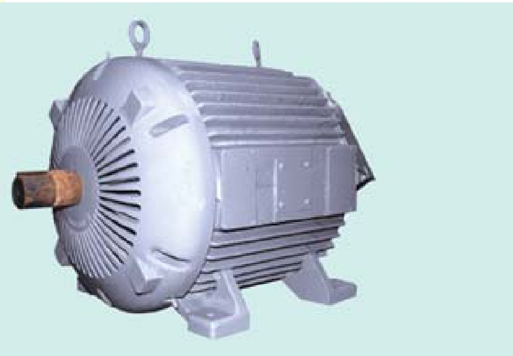
*This chapter explains how to derive performance characteristics of induction motors using circular diagrams.*

---

### Learning Objectives
- General
- Circle Diagram for a Series Circuit
- Circle Diagram of the Approximate Equivalent Circuit
- Determination of $G_0$ and $B_0$
- No-load Test
- Blocked Rotor Test
- Construction of the Circle Diagram
- Maximum Quantities

---

<!-- Page 2 (Book p. 1314) -->

### 35.1. General
In this chapter, it will be shown that the performance characteristics of an induction motor are derivable from a circular locus. The data necessary to draw the circle diagram may be found from no-load and blocked-rotor tests, corresponding to the open-circuit and short-circuit tests of a transformer. The stator and rotor Cu losses can be separated by drawing a torque line. The parameters of the motor, in the equivalent circuit, can be found from the above tests, as shown below.

---

### 35.2. Circle Diagram for a Series Circuit
It will be shown that the end of the current vector for a series circuit with constant reactance and voltage, but with a variable resistance is a circle. With reference to Fig. 35.1, it is clear that

$$I = \frac{V}{Z} = \frac{V}{\sqrt{R^2 + X^2}} = \frac{V}{X} \times \frac{X}{\sqrt{R^2 + X^2}} = \frac{V}{X} \sin \phi$$

$$\therefore \sin \phi = \frac{X}{\sqrt{R^2 + X^2}} \quad \text{– Fig. 35.2}$$

$$\therefore I = (V/X) \sin \phi$$

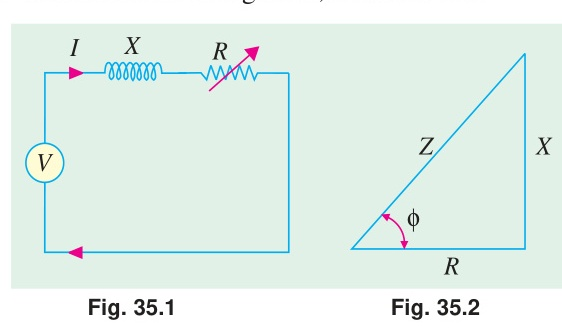
*Fig. 35.1: Series R-L circuit with variable resistance. Fig. 35.2: Impedance triangle.*

It is the equation of a circle in polar co-ordinates, with diameter equal to $V/X$. Such a circle is drawn in Fig. 35.3, using the magnitude of the current and power factor angle $\phi$ as polar co-ordinates of the point $A$. In other words, as resistance $R$ is varied (which means, in fact, $\phi$ is changed), the end of the current vector lies on a circle with diameter equal to $V/X$. For a lagging current, it is usual to orientate the circle of Fig. 35.3 ($a$) such that its diameter is horizontal and the voltage vector takes a vertical position, as shown in Fig. 35.3 ($b$). There is no difference between the two so far as the magnitude and phase relationships are concerned.

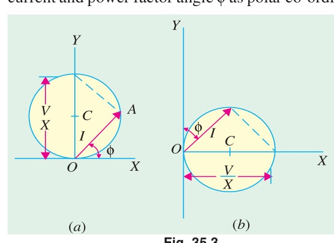
*Fig. 35.3: ($a$) Polar circular locus with vertical diameter; ($b$) Conventional orientation with horizontal diameter and vertical voltage reference.*

---

### 35.3. Circle Diagram for the Approximate Equivalent Circuit
The approximate equivalent diagram is redrawn in Fig. 35.4. It is clear that the circuit to the right of points $ab$ is similar to a series circuit, having a constant voltage $V_1$ and reactance $X_{01}$ but variable resistance (corresponding to different values of slip $s$).

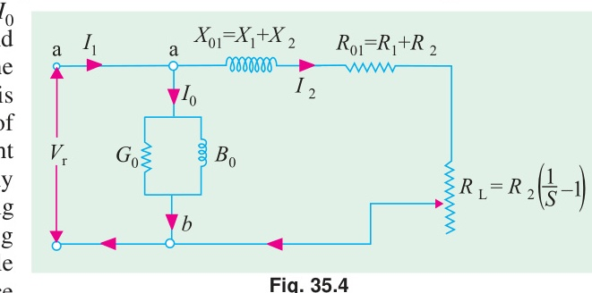
*Fig. 35.4: Approximate equivalent circuit referred to stator.*

Hence, the end of current vector for $I_2'$ will lie on a circle with a diameter of $V/X_{01}$. In Fig. 35.5, $I_2'$ is the rotor current referred to stator, $I_0$ is no-load current (or exciting current) and $I_1$ is the total stator current and is the vector sum of the first two. When $I_2'$ is lagging and $\phi_2 = 90^\circ$, then the position of vector for $I_2'$ will be along $OC$ *i.e.* at right angles to the voltage vector $OE$. For any other value of $\phi_2$, point $A$ will move along the circle shown dotted. The exciting current $I_0$ is drawn lagging $V$ by an angle $\phi_0$. If conductance $G_0$ and susceptance

<!-- Page 3 (Book p. 1315) -->

$B_0$ of the exciting circuit are assumed constant, then $I_0$ and $\phi_0$ are also constant. The end of current vector for $I_1$ is also seen to lie on another circle which is displaced from the dotted circle by an amount $I_0$. Its diameter is still $V/X_{01}$ and is parallel to the horizontal axis $OC$. Hence, we find that if an induction motor is tested at various loads, the locus of the end of the vector for the current (drawn by it) is a circle.

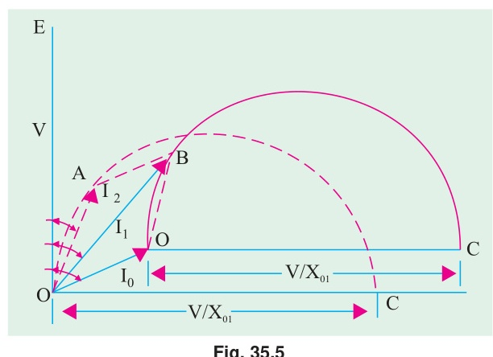
*Fig. 35.5: Shifting of current locus circle by no-load current $I_0$.*

---

### 35.4. Determination of $G_0$ and $B_0$
If the total leakage reactance $X_{01}$ of the motor, exciting conductance $G_0$ and exciting susceptance $B_0$ are found, then the position of the circle $O'BC'$ is determined uniquely. One method of finding $G_0$ and $B_0$ consists in running the motor synchronously so that slip $s = 0$. In practice, it is impossible for an induction motor to run at synchronous speed, due to the inevitable presence of friction and windage losses. However, the induction motor may be run at synchronous speed by another machine which supplies the friction and windage losses. In that case, the circuit to the right of points $ab$ behaves like an open circuit, because with $s = 0$, $R_L = \infty$ (Fig. 35.6). Hence, the current drawn by the motor is $I_0$ only. Let

$$\begin{aligned}
V &= \text{applied voltage/phase}; \quad I_0 = \text{motor current / phase} \\
W &= \text{wattmeter reading } i.e. \text{ input in watt} ; \quad Y_0 = \text{exciting admittance of the motor.}
\end{aligned}$$

Then, for a 3-phase induction motor

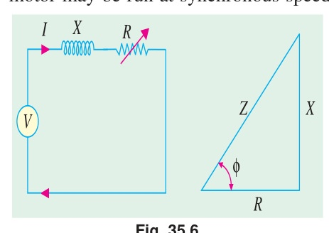
*Fig. 35.6: Equivalent circuit under synchronous run with $s = 0$.*

$$W = 3 G_0 V^2 \quad \text{or} \quad G_0 = \frac{W}{3 V^2}$$

$$\text{Also, } I_0 = V Y_0 \quad \text{or} \quad Y_0 = I_0 / V$$

$$B_0 = \sqrt{Y_0^2 - G_0^2} = \sqrt{(I_0/V)^2 - G_0^2}$$

Hence, $G_0$ and $B_0$ can be found.

---

### 35.5. No-load Test
In practice, it is neither necessary nor feasible to run the induction motor synchronously for getting $G_0$ and $B_0$. Instead, the motor is run without any external mechanical load on it. The speed of the rotor would not be synchronous, but very much near to it ; so that, for all practical purposes, the speed may be assumed synchronous. The no load test is carried out with different values of applied voltage, below and above the value of normal voltage. The power input is measured by two wattmeters,

*Fig. 35.7: Circuit connection for no-load test. Fig. 35.8: Separation of iron loss and mechanical losses vs. voltage.*

<!-- Page 4 (Book p. 1316) -->

$I_0$ by an ammeter and $V$ by a voltmeter, which are included in the circuit of Fig. 35.7. As motor is running on light load, the p.f. would be low *i.e.* less than 0.5, hence total power input will be the difference of the two wattmeter readings $W_1$ and $W_2$. The readings of the total power input $W_0$, $I_0$ and voltage $V$ are plotted as in Fig. 35.8. If we extend the curve for $W_0$, it cuts the vertical axis at point $A$. $OA$ represents losses due to friction and windage. If we subtract loss corresponding to $OA$ from $W_0$, then we get the no-load electrical and magnetic losses in the machine, because the no-load input $W_0$ to the motor consists of
- ($i$) small stator Cu loss $3 I_0^2 R_1$
- ($ii$) stator core loss $W_{CL} = 3 G_0 V^2$
- ($iii$) loss due to friction and windage.

The losses ($ii$) and ($iii$) are collectively known as fixed losses, because they are independent of load. $OB$ represents normal voltage. Hence, losses at normal voltage can be found by drawing a vertical line from $B$.

$$BD = \text{loss due to friction and windage} \qquad DE = \text{stator Cu loss} \qquad EF = \text{core loss}$$

Hence, knowing the core loss $W_{CL}$, $G_0$ and $B_0$ can be found, as discussed in Art. 35.4.

Additionally, $\phi_0$ can also be found from the relation $W_0 = \sqrt{3} V_L I_0 \cos \phi_0$

$$\therefore \cos \phi_0 = \frac{W_0}{\sqrt{3} V_L I_0} \qquad \text{where } V_L = \text{line voltage and } W_0 \text{ is no-load stator input.}$$

---

#### Example 35.1
*In a no-load test, an induction motor took 10 A and 450 watts with a line voltage of 110 V. If stator resistance/phase is $0.05\ \Omega$ and friction and windage losses amount to 135 watts, calculate the exciting conductance and susceptance/phase.*

**Solution:**
$$\text{stator Cu loss} = 3 I_0^2 R_1 = 3 \times 10^2 \times 0.05 = 15\text{ W}$$
$$\therefore \text{stator core loss} = 450 - 135 - 15 = 300\text{ W}$$
$$\text{Voltage/phase } V = 110 / \sqrt{3}\text{ V} ; \quad \text{Core loss} = 3 G_0 V^2$$
$$300 = 3 G_0 \times (110 / \sqrt{3})^2 ; \quad G_0 = \frac{300}{3 \times (110 / \sqrt{3})^2} = \mathbf{0.025\text{ siemens/phase}}$$
$$Y_0 = I_0 / V = (10 \times \sqrt{3}) / 110 = 0.158\text{ siemens/phase}$$
$$B_0 = \sqrt{Y_0^2 - G_0^2} = \sqrt{0.158^2 - 0.025^2} = \mathbf{0.156\text{ siemens/phase}}.$$

---

### 35.6. Blocked Rotor Test
It is also known as locked-rotor or short-circuit test. This test is used to find—
1. short-circuit current with *normal* voltage applied to stator
2. power factor on short-circuit  
   Both the values are used in the construction of circle diagram
3. total leakage reactance $X_{01}$ of the motor as referred to primary (*i.e.* stator)
4. total resistance of the motor $R_{01}$ as referred to primary.

In this test, the rotor is locked (or allowed very slow rotation)

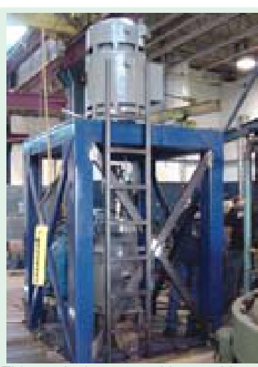
*This vertical test stand is capable of absorbing up to 10,000 N-m of torque at continuous load rating (max 150.0 hp at 1800 rpm). It helps to develop speed torque curves and performs locked rotor testing.*

<!-- Page 5 (Book p. 1317) -->

and the rotor windings are short-circuited at slip-rings, if the motor has a wound rotor. Just as in the case of a short-circuit test on a transformer, a reduced voltage (up to 15 or 20 per cent of normal value) is applied to the stator terminals and is so adjusted that full-load current flows in the stator. As in this case $s = 1$, the equivalent circuit of the motor is exactly like a transformer, having a short-circuited secondary. The values of current, voltage and power input on short-circuit are measured by the ammeter, voltmeter and wattmeter connected in the circuits as before. Curves connecting the above quantities may also be drawn by taking two or three additional sets of readings at progressively reduced voltages of the stator.

($a$) It is found that relation between the short-circuit current and voltage is approximately a straight line. Hence, if $V$ is normal stator voltage, $V_s$ the short-circuit voltage (a fraction of $V$), then short-circuit or standstill rotor current, if normal voltage were applied to stator, is found from the relation

$$I_{SN} = I_s \times V / V_s$$

$$\text{where } I_{SN} = \text{short-circuit current obtainable with normal voltage}$$
$$I_s = \text{short-circuit current with voltage } V_s$$

($b$) Power factor on short-circuit is found from

$$W_s = \sqrt{3} V_{SL} I_{SL} \cos \phi_s ; \qquad \therefore \cos \phi_s = W_s / (\sqrt{3} V_{SL} I_{SL})$$

$$\text{where } W_s = \text{total power input on short-circuit}$$
$$V_{SL} = \text{line voltage on short-circuit}$$
$$I_{SL} = \text{line current on short-circuit.}$$

($c$) Now, the motor input on short-circuit consists of
- ($i$) mainly stator and rotor Cu losses
- ($ii$) core-loss, which is small due to the fact that applied voltage is only a small percentage of the normal voltage. This core-loss (if found appreciable) can be calculated from the curves of Fig. 35.8.

$$\therefore \text{Total Cu loss} = W_s - W_{CL}$$
$$3 I_s^2 R_{01} = W_s - W_{CL} : \quad R_{01} = (W_s - W_{CL}) / 3 I_s^2$$

($d$) With reference to the approximate equivalent circuit of an induction motor (Fig. 35.4), motor leakage reactance per phase $X_{01}$ as referred to the stator may be calculated as follows :

$$Z_{01} = V_s / I_s \qquad X_{01} = \sqrt{Z_{01}^2 - R_{01}^2}$$

Usually, $X_1$ is assumed equal to $X_2'$ where $X_1$ and $X_2$ are stator and rotor reactances per phase respectively as referred to stator. $X_1 = X_2' = X_{01} / 2$

If the motor has a wound rotor, then stator and rotor resistances are separated by dividing $R_{01}$ in the ratio of the d.c. resistances of stator and rotor windings.

In the case of squirrel-cage rotor, $R_1$ is determined as usual and after allowing for 'skin effect' is subtracted from $R_{01}$ to give $R_2'$ — the effective rotor resistance as referred to stator.

$$\therefore R_2' = R_{01} - R_1$$

---

#### Example 35.2
*A 110-V, 3-$\phi$, star-connected induction motor takes 25 A at a line voltage of 30 V with rotor locked. With this line voltage, power input to motor is 440 W and core loss is 40 W. The d.c. resistance between a pair of stator terminals is $0.1\ \Omega$. If the ratio of a.c. to d.c. resistance is 1.6, find the equivalent leakage reactance/phase of the motor and the stator and rotor resistance per phase.*  
*(Electrical Technology, Madras Univ. 1987)*

**Solution:**
$$\text{S.C. voltage/phase, } V_s = 30 / \sqrt{3} = 17.3\text{ V} : I_s = 25\text{ A per phase}$$
$$Z_{01} = 17.3 / 25 = 0.7\ \Omega \text{ (approx.) per phase}$$

<!-- Page 6 (Book p. 1318) -->

$$\text{Stator and rotor Cu losses} = \text{input} - \text{core loss} = 440 - 40 = 400\text{ W}$$
$$\therefore 3 \times 25^2 \times R_{01} = 400 \qquad \therefore R_{01} = 400 / 3 \times 625 = \mathbf{0.21\ \Omega}$$
$$\text{where } R_{01} \text{ is equivalent resistance/phase of motor as referred to stator.}$$

$$\text{Leakage reactance/phase } X_{01} = \sqrt{(0.7^2 - 0.21^2)} = \mathbf{0.668\ \Omega}$$

$$\text{d.c. resistance/phase of stator} = 0.1 / 2 = 0.05\ \Omega$$
$$\text{a.c. resistance/phase } R_1 = 0.05 \times 1.6 = \mathbf{0.08\ \Omega}$$
$$\text{Hence, effective resistance/phase of rotor as referred to stator}$$
$$R_2' = 0.21 - 0.08 = \mathbf{0.13\ \Omega}$$

---

### 35.7. Construction of the Circle Diagram
Circle diagram of an induction motor can be drawn by using the data obtained from **(1) no-load (2) short-circuit test** and **(3) stator resistance test**, as shown below.

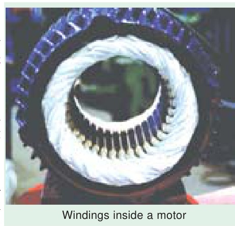
*Windings inside a motor.*

#### Step No. 1
From no-load test, $I_0$ and $\phi_0$ can be calculated. Hence, as shown in Fig. 35.9, vector for $I_0$ can be laid off lagging $\phi_0$ behind the applied voltage $V$.

#### Step No. 2
Next, from blocked rotor test or short-circuit test, short-circuit current $I_{SN}$ *corresponding to normal voltage* and $\phi_s$ are found. The vector $OA$ represents $I_{SN} = (I_s V / V_s)$ in magnitude and phase. Vector $O'A$ represents rotor current $I_2'$ as referred to stator.

Clearly, the two points $O'$ and $A$ lie on the required circle. For finding the centre $C$ of this circle, chord $O'A$ is bisected at right angles—its bisector giving point $C$. The diameter $O'D$ is drawn perpendicular to the voltage vector.

*Fig. 35.9: Geometric construction of the Circle Diagram for an induction motor.*

As a matter of practical contingency, it is recommended that the scale of current vectors should be so chosen that the diameter is more than 25 cm, in order that the performance data of the motor may be read with reasonable accuracy from the circle diagram. With centre $C$ and radius $= CO'$, the circle can be drawn. The line $O'A$ is known as **output line**.

It should be noted that as the voltage vector is drawn vertically, all vertical distances represent the active or power or energy components of the currents.

For example, the vertical component $O'P$ of no-load current $OO'$ represents the no-load input, which supplies core loss, friction and windage loss and a negligibly small amount of stator $I^2 R$ loss. Similarly, the vertical component $AG$ of short-circuit current $OA$ is proportional to the motor input on short-circuit or if measured to a proper scale, may be said to equal power input.

#### Step No. 3
**Torque line.** *This is the line which separates the stator and the rotor copper losses.* When the

<!-- Page 7 (Book p. 1319) -->

rotor is locked, then all the power supplied to the motor goes to meet core losses and Cu losses in the stator and rotor windings. The power input is proportional to $AG$. Out of this, $FG$ ($= O'P$) represents fixed losses *i.e.* stator core loss and friction and windage losses. $AF$ is proportional to the sum of the stator and rotor Cu losses. The point $E$ is such that

$$\frac{AE}{EF} = \frac{\text{rotor Cu loss}}{\text{stator Cu loss}}$$

As said earlier, line $O'E$ is known as torque line.

##### How to locate point $E$ ?
**(i) Squirrel-cage Rotor.** Stator resistance/phase *i.e.* $R_1$ is found from stator-resistance test. Now, the short-circuit motor input $W_s$ is approximately equal to motor Cu losses (neglecting iron losses).

$$\text{Stator Cu loss} = 3 I_s^2 R_1 \qquad \therefore \text{rotor Cu loss} = W_s - 3 I_s^2 R_1 \qquad \therefore \frac{AE}{EF} = \frac{W_s - 3 I_s^2 R_1}{3 I_s^2 R_1}$$

**(ii) Wound Rotor.** In this case, rotor and stator resistances per phase $r_2$ and $r_1$ can be easily computed. For any values of stator and rotor currents $I_1$ and $I_2$ respectively, we can write

$$\frac{AE}{EF} = \frac{I_2^2 r_2}{I_1^2 r_1} = \frac{r_2}{r_1} \left(\frac{I_2}{I_1}\right)^2 ; \qquad \text{Now, } \frac{I_1}{I_2} = K = \text{transformation ratio}$$

$$\frac{AE}{EF} = \frac{r_2}{r_1} \times \frac{1}{K^2} = \frac{r_2 / K^2}{r_1} = \frac{r_2'}{r_1} = \frac{\text{equivalent rotor resistance per phase}}{\text{stator resistance per phase}}$$

Value of $K$ may be found from short-circuit test itself by using two ammeters, both in stator and rotor circuits.

Let us assume that the motor is running and taking a current $OL$ (Fig. 35.9). Then, the perpendicular $JK$ represents fixed losses, $JN$ is stator Cu loss, $NL$ is the rotor input, $NM$ is rotor Cu loss, $ML$ is rotor output and $LK$ is the total motor input.

From our knowledge of the relations between the above-given various quantities, we can write :
$$\begin{aligned}
\sqrt{3} \cdot V_L \cdot LK &= \text{motor input} & \sqrt{3} \cdot V_L \cdot JK &= \text{fixed losses} \\
\sqrt{3} \cdot V_L \cdot JN &= \text{stator copper loss} & \sqrt{3} \cdot V_L \cdot MN &= \text{rotor copper loss} \\
\sqrt{3} \cdot V_L \cdot MK &= \text{total loss} & \sqrt{3} \cdot V_L \cdot ML &= \text{mechanical output} \\
\sqrt{3} \cdot V_L \cdot NL &= \text{rotor input} \propto \text{torque}
\end{aligned}$$

1. $ML / LK = \text{output/input} = \text{efficiency}$
2. $MN / NL = (\text{rotor Cu loss})/(\text{rotor input}) = \text{slip, } s$.
3. $\frac{ML}{NL} = \frac{\text{rotor output}}{\text{rotor input}} = 1 - s = \frac{N}{N_S} = \frac{\text{actual speed}}{\text{synchronous speed}}$
4. $\frac{LK}{OL} = \text{power factor}$

Hence, it is seen that, at least, theoretically, it is possible to obtain all the characteristics of an induction motor from its circle diagram. As said earlier, for drawing the circle diagram, we need ($a$) stator-resistance test for separating stator and rotor Cu losses and ($b$) the data obtained from ($i$) no-load test and ($ii$) short-circuit test.

---

### 35.8. Maximum Quantities
It will now be shown from the circle diagram (Fig. 35.10) that the maximum values occur at the positions stated below :

#### (i) Maximum Output
It occurs at point $M$ where the tangent is parallel to output line $O'A$. Point $M$ may be located by

<!-- Page 8 (Book p. 1320) -->

drawing a line $CM$ from point $C$ such that it is perpendicular to the output line $O'A$. Maximum output is represented by the vertical $MP$.

*Fig. 35.10: Determination of Maximum Output, Maximum Torque, and Maximum Input Power.*

#### (ii) Maximum Torque or Rotor Input
It occurs at point $N$ where the tangent is parallel to torque line $O'E$. Again, point $N$ may be found by drawing $CN$ perpendicular to the torque line. Its value is represented by $NQ$. Maximum torque is also known as **stalling or pull-out torque**.

#### (iii) Maximum Input Power
It occurs at the highest point of the circle *i.e.* at point $R$ where the tangent to the circle is horizontal. It is proportional to $RS$. As the point $R$ is beyond the point of maximum torque, the induction motor will be unstable here. However, the maximum input is a measure of the size of the circle and is an indication of the ability of the motor to carry short-time over-loads. Generally, $RS$ is twice or thrice the motor input at rated load.

---

#### Example 35.3
*A 3-ph, 400-V induction motor gave the following test readings;*  
*No-load : 400 V, 1250 W, 9 A, Short-circuit : 150 V, 4 kW, 38 A*  
*Draw the circle diagram.*  
*If the normal rating is 14.9 kW, find from the circle diagram, the full-load value of current, p.f. and slip.*  
*(Electrical Machines-I, Gujarat Univ. 1985)*

**Solution:**
$$\cos \phi_0 = \frac{1250}{\sqrt{3} \times 400 \times 9} = 0.2004 ; \quad \phi_0 = 78.5^\circ$$

*Fig. 35.11: Circle diagram constructed for Example 35.3.*

$$\cos \phi_S = \frac{4000}{\sqrt{3} \times 150 \times 38} = 0.405 ; \quad \phi_S = 66.1^\circ$$

$$\text{Short-circuit current with normal voltage is } I_{SN} = 38 (400/150) = 101.3\text{ A.}$$
$$\text{Power taken would be } = 4000 (400/150)^2 = 28,440\text{ W.}$$
In Fig. 35.11, $OO'$ represents $I_0$ of 9 A. If current scale is $1\text{ cm} = 5\text{ A}$,

<!-- Page 9 (Book p. 1321) -->

then vector $OO' = 9/5 = 1.8\text{ cm}$ and is drawn at an angle of $\phi_0 = 78.5^\circ$ with the vertical $OV$ (which represents voltage). Similarly, $OA$ represents $I_{SN}$ (S.C. current with normal voltage applied) equal to 101.3 A. It measures $101.3/5 = 20.26\text{ cm}$ and is drawn at an angle of $66.1^\circ$, with the vertical $OV$.

Line $O'D$ is drawn parallel to $OX$. $NC$ is the right-angle bisector of $O'A$. The semi-circle $O'AD$ is drawn with $C$ as the centre. This semi-circle is the locus of the current vector for all load conditions from no-load to short-circuit. Now, $AF$ represents 28,440 W and measures 8.1 cm. Hence, power scale becomes : $1\text{ cm} = 28,440 / 8.1 = 3,510\text{ W}$. Now, full-load motor output $= 14.9 \times 10^3 = 14,900\text{ W}$. According to the above calculated power scale, the intercept between the semi-circle and output line $O'A$ should measure $= 14,900 / 3510 = 4.25\text{ cm}$. For locating full-load point $P$, $BA$ is extended. $AS$ is made equal to 4.25 cm and $SP$ is drawn parallel to output line $O'A$. $PL$ is perpendicular to $OX$.

$$\begin{aligned}
\text{Line current} &= OP = 6\text{ cm} = 6 \times 5 = \mathbf{30\text{ A}} ; \quad \phi = 30^\circ \text{ (by measurement)} \\
\text{p.f.} &= \cos 30^\circ = \mathbf{0.886} \text{ (or } \cos \phi = PL/OP = 5.2/6 = 0.865) \\
\text{Now,} \quad \text{slip} &= \frac{\text{rotor Cu loss}}{\text{rotor input}}
\end{aligned}$$

In Fig. 35.11, $EK$ represents rotor Cu loss and $PK$ represents rotor input.
$$\therefore \text{slip} = \frac{EK}{PK} = \frac{0.3}{4.5} = 0.067 \text{ or } \mathbf{6.7\%}$$

---

#### Example 35.4
*Draw the circle diagram for a 3.73 kW, 200-V, 50-Hz, 4-pole, 3-$\phi$ star-connected induction motor from the following test data :*  
*No-load : Line voltage 200 V, line current 5 A; total input 350 W*  
*Blocked rotor : Line voltage 100 V, line current 26 A; total input 1700 W*  
*Estimate from the diagram for full-load condition, the line current, power factor and also the maximum torque in terms of the full-load torque. The rotor Cu loss at standstill is half the total Cu loss.*  
*(Electrical Engineering, Bombay Univ. 1987)*

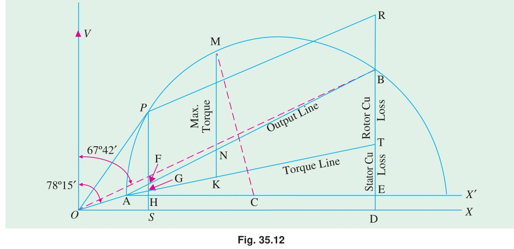
*Fig. 35.12: Circle diagram constructed for Example 35.4.*

**Solution. No-load test**
$$I_0 = 5\text{ A}, \cos \phi_0 = \frac{350}{\sqrt{3} \times 200 \times 5} = 0.202 ; \quad \phi_0 = 78^\circ 15'$$

---
*\* The actual lengths are different from these values, due to reduction in block making.*

<!-- Page 10 (Book p. 1322) -->

**Blocked-rotor test :**
$$\cos \phi_s = \frac{1700}{\sqrt{3} \times 100 \times 26} = 0.378 ; \quad \phi_s = 67^\circ 42'$$
$$\text{Short-circuit current with normal voltage, } I_{SN} = 26 \times 200/100 = 52\text{ A}$$
$$\text{Short-circuit/blocked rotor input with normal voltage} = 1700(52/26)^2 = 6,800\text{ W}$$

In the circle diagram of Fig. 35.12, voltage is represented along $OV$ which is drawn perpendicular to $OX$. Current scale is $1\text{ cm} = 2\text{ A}$

Line $OA$ is drawn at an angle of $\phi_0 = 78^\circ 15'$ with $OV$ and 2.5 cm in length. Line $A X'$ is drawn parallel to $OX$. Line $OB$ represents short-circuit current with normal voltage *i.e.* 52 A and measures $52/2 = 26\text{ cm}$. $AB$ represents output line. Perpendicular bisector of $AB$ is drawn to locate the centre $C$ of the circle. With $C$ as centre and radius $= CA$, a circle is drawn which passes through points $A$ and $B$. From point $B$, a perpendicular is drawn to the base. $BD$ represents total input of 6,800 W for blocked rotor test. Out of this, $ED$ represents no-load loss of 350 W and $BE$ represents $6,800 - 350 = 6,450\text{ W}$. Now $BD = 9.8\text{ cm}$ and represents 6,800 W

$$\therefore \text{power scale } = 6,800 / 9.8 = 700\text{ watt/cm} \quad \text{or} \quad \mathbf{1\text{ cm} = 700\text{ W}}$$

$BE$ which represents total copper loss in rotor and stator, is bisected at point $T$ to separate the two losses. $AT$ represents torque line.

Now, motor output $= 3,730\text{ watt}$. It will be represented by a line $= 3,730 / 700 = 5.33\text{ cm}$

The output point $P$ on the circle is located thus :
$DB$ is extended and $BR$ is cut $= 5.33\text{ cm}$. Line $RP$ is drawn parallel to output line $AB$ and cuts the circle at point $P$. Perpendicular $PS$ is drawn and $P$ is joined to origin $O$.

Point $M$ corresponding to maximum torque is obtained thus :
From centre $C$, a line $CM$ is drawn such that it is perpendicular to torque line $AT$. It cuts the circle at $M$ which is the required point. Point $M$ could also have been located by drawing a line parallel to the torque line. $MK$ is drawn vertical and it represents maximum torque.

Now, in the circle diagram, $OP = \text{line current on full-load} = 7.6\text{ cm}$. Hence, $OP$ represents $7.6 \times 2 = \mathbf{15.2\text{ A}}$

$$\text{Power factor on full-load} = \frac{SP}{OP} = \frac{6.45}{7.6} = \mathbf{0.86}$$
$$\frac{\text{Max. torque}}{\text{F.L. torque}} = \frac{MK}{PG} = \frac{10}{5.6} = \mathbf{1.8}$$
$$\therefore \text{Max. torque} = \mathbf{180\%\text{ of full-load torque.}}$$

---

#### Example 35.5
*Draw the circle diagram from no-load and short-circuit test of a 3-phase, 14.92 kW, 400-V, 6-pole induction motor from the following test results (line values).*  
*No-load : 400-V, 11 A, p.f. = 0.2*  
*Short-circuit : 100-V, 25 A, p.f. = 0.4*  
*Rotor Cu loss at standstill is half the total Cu loss.*  
*From the diagram, find (a) line current, slip, efficiency and p.f. at full-load (b) the maximum torque.*  
*(Electrical Machines-I, Gujarat Univ. 1985)*

**Solution:**
$$\text{No-load p.f.} = 0.2 ; \phi_0 = \cos^{-1}(0.2) = 78.5^\circ$$
$$\text{Short-circuit p.f.} = 0.4 ; \phi_s = \cos^{-1}(0.4) = 66.4^\circ$$
$$\text{S.C. current } I_{SN} \text{ if normal voltage were applied} = 25 (400/100) = 100\text{ A}$$
$$\text{S.C. power input with this current} = \sqrt{3} \times 400 \times 100 \times 0.4 = 27,710\text{ W}$$

<!-- Page 11 (Book p. 1323) -->

Assume a current scale of $1\text{ cm} = 5\text{ A}$.\* The circle diagram of Fig. 35.13 is constructed as follows :
- ($i$) No-load current vector $OO'$ represents 11 A. Hence, it measures $11/5 = 2.2\text{ cm}$ and is drawn at an angle of $78.5^\circ$ with $OY$.
- ($ii$) Vector $OA$ represents 100 A and measures $100/5 = 20\text{ cm}$. It is drawn at an angle of $66.4^\circ$ with $OY$.
- ($iii$) $O'D$ is drawn parallel to $OX$. $NC$ is the right angle bisector of $O'A$.
- ($iv$) With $C$ as the centre and $CO'$ as radius, a semicircle is drawn as shown.
- ($v$) $AF$ represents power input on short-circuit with normal voltage applied. It measures 8 cm and (as calculated above) represents 27,710 W. Hence, power scale becomes
$$1\text{ cm} = 27,710 / 8 = 3,465\text{ W}$$

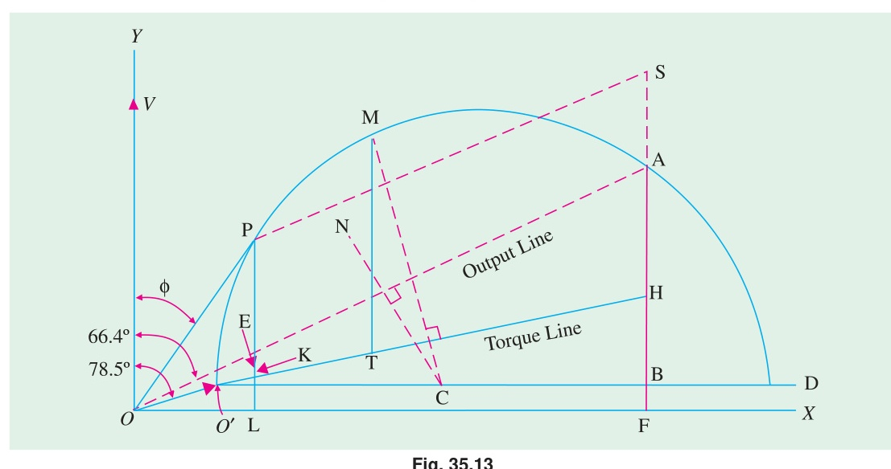
*Fig. 35.13: Circle diagram constructed for Example 35.5.*

($a$) F.L motor output $= 14,920\text{ W}$. According to the above power scale, the intercept between the semicircle and the output line $O'A$ should measure $= 14,920 / 3,465 = 4.31\text{ cm}$. Hence, vertical line $PL$ is found which measures 4.31 cm. Point P represents the full-load operating point.\*\*

$$\begin{aligned}
(a) \qquad \text{Line current} &= OP = 6.5\text{ cm which means that full-load line current} \\
&= 6.5 \times 5 = \mathbf{32.5\text{ A}}. \qquad \phi = 32.9^\circ \text{ (by measurement)} \\
\therefore \cos 32.9^\circ &= \mathbf{0.84} \text{ (or } \cos \phi = PL/OP = 5.4/6.5 = 0.84) \\
\text{slip} &= \frac{EK}{PK} = \frac{0.3}{5.35} = 0.056 \text{ or } \mathbf{5.6\%} ; \quad \eta = \frac{PE}{PL} = \frac{4.3}{5.4} = 0.8 \text{ or } \mathbf{80\%}
\end{aligned}$$

($b$) For finding maximum torque, line $CM$ is drawn $\perp$ to torque line $O'H$. $MT$ is the vertical intercept between the semicircle and the torque line and represents the maximum torque of the motor in synchronous watts
$$\text{Now, } MT = 7.8\text{ cm (by measurement)} \qquad \therefore T_{max} = 7.8 \times 3465 = \mathbf{27,030\text{ synch. watt}}$$

---
*\* The actual scale of the book diagram is different because it has been reduced during block making.*  
*\*\* The operating point may also be found by making $AS = 4.31\text{ cm}$ and drawing $SP$ parallel to $O'A$.*

---

#### Example 35.6
*A 415-V, 29.84 kW, 50-Hz, delta-connected motor gave the following test data :*  
*No-load test : 415 V, 21 A, 1,250 W*  
*Locked rotor test : 100 V, 45 A, 2,730 W*  
*Construct the circle diagram and determine :*  
*(a) the line current and power factor for rated output (b) the maximum torque.*  
*Assume stator and rotor Cu losses equal at standstill.*  
*(A.C. Machines-I, Jadavpur Univ. 1990)*

<!-- Page 12 (Book p. 1324) -->

**Solution:**
$$\text{Power factor on no-load is} = \frac{1250}{\sqrt{3} \times 415 \times 21} = 0.0918$$
$$\therefore \phi_0 = \cos^{-1}(0.0918) = 84^\circ 44'$$
$$\text{Power factor with locked rotor is} = \frac{2,730}{\sqrt{3} \times 100 \times 45} = 0.3503$$
$$\therefore \phi_S = \cos^{-1}(0.3503) = 69^\circ 30'$$
$$\text{The input current } I_{SN} \text{ on short-circuit if normal voltage were applied} = 45 (415/100) = 186.75\text{ A}$$
$$\text{and power taken would be} = 2,730 (415/100)^2 = 47,000\text{ W.}$$

Let the current scale be $1\text{ cm} = 10\text{ A}$. The circle diagram of Fig. 35.14 is constructed as follows :

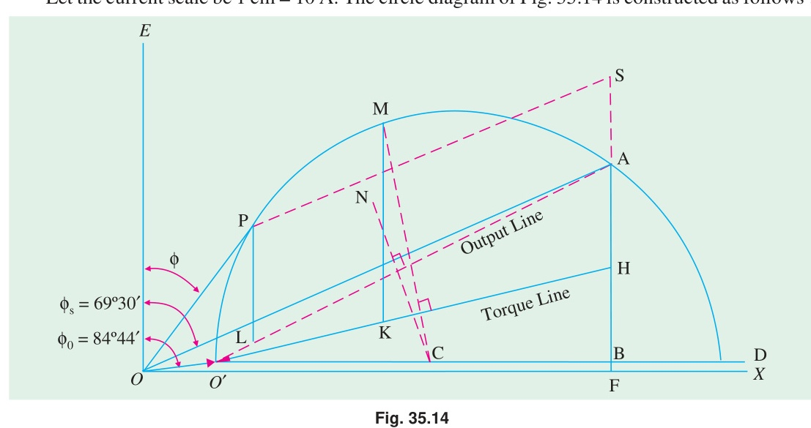
*Fig. 35.14: Circle diagram constructed for Example 35.6.*

- ($i$) Vector $OO'$ represents 21 A so that it measures 2.1 cm and is laid at an angle of $84^\circ 44'$ with $OE$ (which is vertical *i.e.* along $Y$-axis).
- ($ii$) Vector $OA$ measures $186.75/10 = 18.675\text{ cm}$ and is drawn at an angle of $69^\circ 30'$ with $OE$.
- ($iii$) $O'D$ is drawn parallel to $OX$. $NC$ is the right-angle bisector of $O'A$
- ($iv$) With $C$ as the centre and $CO'$ as radius, a semi-circle is drawn as shown. This semi-circle is the locus of the current vector for all load conditions from no-load to short-circuit.
- ($v$) The vertical $AF$ represents power input on short-circuit with normal voltage applied. $AF$ measures 6.6 cm and (as calculated above) represents 47,000 W. Hence, power scale becomes,
$$1\text{ cm} = 47,000 / 6.6 = 7,120\text{ W}$$

($a$) Full-load output $= 29,840\text{ W}$. According to the above power scale, the intercept between the semicircle and output line $O'A$ should measure $29,840 / 7,120 = 4.19\text{ cm}$. Hence, line $PL$ is found which measures 4.19 cm. Point P represents the full-load operating point.\*

$$\text{Phase current} = OP = 6\text{ cm} = 6 \times 10 = 60\text{ A}; \quad \text{Line current} = \sqrt{3} \times 60 = \mathbf{104\text{ A}}$$
$$\text{Power factor} = \cos \angle POE = \cos 35^\circ = \mathbf{0.819}$$

($b$) For finding the maximum torque, line $CM$ is drawn $\perp$ to the torque line $O'H$. Point $H$ is such that

$$\frac{AH}{BH} = \frac{\text{rotor Cu loss}}{\text{stator Cu loss}}$$

---
*\* The operating point may also by found be making $AS = 4.19\text{ cm}$ and drawing $SP$ parallel to $O'A$.*

<!-- Page 13 (Book p. 1325) -->

Since the two Cu losses are equal, point $H$ is the mid-point of $A B$.
Line $MK$ represents the maximum torque of the motor in synchronous watts
$$MK = 7.3\text{ cm (by measurement)} = 7.3 \times 7,120 = \mathbf{51,980\text{ synch. watt.}}$$

---

#### Example 35.7
*Draw the circle diagram for a 5.6 kW, 400-V, 3-$\phi$, 4-pole, 50-Hz, slip-ring induction motor from the following data :*  
*No-load readings : 400 V, 6 A, $\cos \phi_0 = 0.087$ ; Short-circuit test : 100 V, 12 A, 720 W.*  
*The ratio of primary to secondary turns = 2.62, stator resistance per phase is $0.67\ \Omega$ and of the rotor is $0.185\ \Omega$. Calculate*  
*(i) full-load current (ii) full-load slip (iii) full-load power factor (iv) $\frac{\text{maximum torque}}{\text{full - load torque}}$ (v) maximum power.*

**Solution. No-load condition**
$$\phi_0 = \cos^{-1}(0.087) = 85^\circ$$

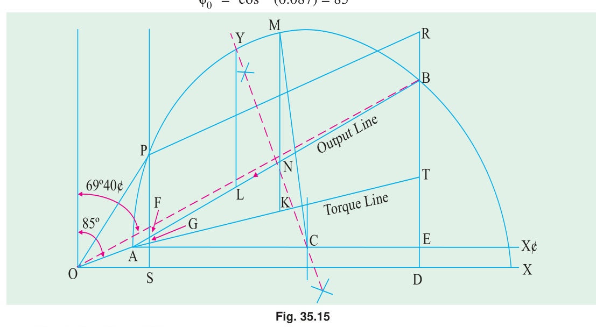
*Fig. 35.15: Circle diagram constructed for Example 35.7.*

**Short-circuit condition**
$$\text{Short-circuit current with normal voltage} = 12 \times 400 / 100 = 48\text{ A}$$
$$\text{Total input} = 720 \times (48/12)^2 = 11.52\text{ kW}$$
$$\cos \phi_s = \frac{720}{\sqrt{3} \times 100 \times 12} = 0.347 \quad \text{or} \quad \phi_s = 69^\circ 40'$$

$$\text{Current scale is,} \qquad 1\text{ cm} = 2\text{ A}$$
In the circle diagram of Fig. 35.15, $OA = 3\text{ cm}$ and inclined at $85^\circ$ with $OV$. Line $OB$ represents short-circuit current with normal voltage. It measures $48/2 = 24\text{ cm}$ and represent 48 A. $BD$ is perpendicular to $OX$.

**For Drawing Torque Line**
$$K = 2.62 \qquad R_1 = 0.67\ \Omega \qquad R_2 = 0.185\ \Omega$$
$$\text{(in practice, an allowance of 10% is made for skin effect)}$$
$$\therefore \frac{\text{rotor Cu loss}}{\text{stator Cu loss}} = 2.62^2 \times \frac{0.185}{0.67} = 1.9 \qquad \therefore \frac{\text{rotor Cu loss}}{\text{total Cu loss}} = \frac{1.9}{2.9} = 0.655$$
$$\text{Now } BD = 8.25\text{ cm and represents } 11.52\text{ kW}$$
$$\text{power scale } = 11.52 / 8.25 = 1.4\text{ kW/cm}$$

<!-- Page 14 (Book p. 1326) -->

$$\therefore 1\text{ cm} = 1.4\text{ kW}$$
$BE$ represents total Cu loss and is divided at point $T$ in the ratio $1.9 : 1$.
$$BT = BE \times 1.9 / 2.9 = 0.655 \times 8 = 5.24\text{ cm}$$
$AT$ is the torque line.
$$\text{Full-load output} = 5.6\text{ kW}$$
It is represented by a line $= 5.6 / 1.4 = 4\text{ cm}$
$DB$ is produced to $R$ such that $BR = 4\text{ cm}$. Line $RP$ is parallel to output line and cuts the circle at $P$. $OP$ represents full-load current.
$PS$ is drawn vertically. Points $M$ and $Y$ represent points of maximum torque and maximum output respectively.

$$\begin{aligned}
(i) \qquad \text{F.L. current} &= OP = 5.75\text{ cm} = 5.75 \times 2 = \mathbf{11.5\text{ A}} \\
(ii) \qquad \text{F.L. slip} &= \frac{FG}{PG} = \frac{0.2}{4.25} = 0.047 \quad \text{or} \quad \mathbf{4.7\%} \\
(iii) \qquad \text{p.f.} &= \frac{SP}{OP} = \frac{4.6}{5.75} = \mathbf{0.8} \\
(iv) \qquad \frac{\text{max. torque}}{\text{full-load torque}} &= \frac{MK}{PG} = \frac{10.05}{4.25} = \mathbf{2.37} \\
(v) \qquad \text{Maximum output is represented by } YL = 7.75\text{ cm.} \\
\therefore \text{Max. output} &= 7.75 \times 1.4 = \mathbf{10.8\text{ kW}}
\end{aligned}$$

---

#### Example 35.8
*A 440-V, 3-$\phi$, 4-pole, 50-Hz slip-ring motor gave the following test results :*  
*No-load reading : 440 V, 9 A, p.f. = 0.2*  
*Blocked rotor test : 110 V, 22 A, p.f. = 0.3*  
*The ratio of stator to rotor turns per phase is 3.5/1. The stator and rotor Cu losses are divided equally in the blocked rotor test. The full-load current is 20 A. Draw the circle diagram and obtain the following :*  
*(a) power factor, output power, efficiency and slip at full-load*  
*(b) standstill torque or starting torque.*  
*(c) resistance to be inserted in the rotor circuit for giving a starting torque 200 % of the full-load torque. Also, find the current and power factor under these conditions.*

**Solution:**
$$\text{No-load } p.f. = 0.2 \quad \therefore \phi_0 = \cos^{-1}(0.2) = 78.5^\circ$$
$$\text{Short-circuit } p.f. = 0.3 \quad \therefore \phi_s = 72.5^\circ$$
$$\text{Short-circuit current at normal voltage} = 22 \times 440 / 110 = 88\text{ A}$$
$$\text{S.C. input} = \sqrt{3} \times 440 \times 88 \times 0.3 = 20,120\text{ W} = 20.12\text{ kW}$$

Take a current scale of $1\text{ cm} = 4\text{ A}$

In the circle diagram of Fig. 35.16, $OA = 2.25\text{ cm}$ drawn at an angle of $78.5^\circ$ behind $OV$. Similarly, $OB = 88/4 = 22\text{ cm}$ and is drawn at an angle of $72.5^\circ$ behind $OV$. The semi-circle is drawn as usual. Point $T$ is such that $BT = TD$. Hence, torque line $AT$ can be drawn. $BC$ represents 20.12 kW. By measurement $BC = 6.6\text{ cm}$.

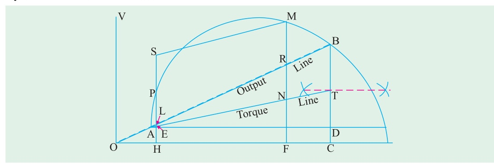
*Fig. 35.16: Circle diagram constructed for Example 35.8.*

<!-- Page 15 (Book p. 1327) -->

$$\therefore \text{power scale } = 20.12 / 6.6 = 3.05$$
$$\therefore 1\text{ cm} = 3.05\text{ kW}$$

Full-load current $= 20\text{ A}$. Hence, it is represented by a length of $20/4 = 5\text{ cm}$. With $O$ as centre and 5 cm as radius, an arc is drawn which cuts the semi-circle at point $P$. This point represents full-load condition. $PH$ is drawn perpendicular to the base $OC$.

$$\begin{aligned}
(a) \quad (i) \quad \text{p.f.} &= \cos \phi = PH / OP = 4.05 / 5 = \mathbf{0.81} \\
(ii) \quad \text{Torque can be found by measuring the input.} \\
\text{Rotor input} &= PE = 3.5\text{ cm} = 3.5 \times 3.05 = 10.67\text{ kW} \\
\text{Now } N_s &= 120 \times 50 / 4 = 1500\text{ r.p.m.} \\
\therefore T_g &= 9.55\, P_2 / N_s = 9.55 \times 10,670 / 1500 = \mathbf{61\text{ N-m}} \\
(iii) \quad \text{output} &= PL = 3.35 \times 3.05 = \mathbf{10.21\text{ kW}} \\
(iv) \quad \text{efficiency} &= \frac{\text{output}}{\text{input}} = \frac{PL}{PH} = \frac{3.35}{4.05} = 0.83 \quad \text{or} \quad \mathbf{83\%} \\
(v) \quad \text{slip } s &= \frac{\text{rotor Cu loss}}{\text{rotor input}} = \frac{LE}{PE} = \frac{0.1025}{3.5} = 0.03 \quad \text{or} \quad \mathbf{3\%}
\end{aligned}$$

($b$) Standstill torque is represented by $BT$.
$$BT = 3.1\text{ cm} = 3.1 \times 3.05 = 9.45\text{ kW} \qquad \therefore T_{st} = 9.55 \times \frac{9.45 \times 10^3}{1500} = \mathbf{60.25\text{ N-m}}$$

($c$) We will now locate point $M$ on the semi-circle which corresponds to a starting torque twice the full-load torque *i.e.* 200% of F.L. torque.

$$\text{Full-load torque} = PE.$$
Produce $EP$ to point $S$ such that $PS = PE$. From point $S$ draw a line parallel to torque line $AT$ cutting the semi-circle at $M$. Draw $MN$ perpendicular to the base.
At starting when rotor is stationary, $MN$ represents total rotor copper losses.
$NR = \text{Cu loss in rotor itself as before}$ ; $RM = \text{Cu loss in external resistance}$
$$RM = 4.5\text{ cm} = 4.5 \times 3.05 = 13.716\text{ kW} = 13,716\text{ watt.}$$
$$\text{Cu loss/phase} = 13,716 / 3 = 4,572\text{ watt}$$
$$\text{Rotor current } AM = 17.5\text{ cm} = 17.5 \times 4 = 70\text{ A}$$
Let $r_2'$ be the additional external resistance in the rotor circuit (as referred to stator) then
$$r_2' \times 70^2 = 4,572 \quad \text{or} \quad r_2' = 4,572 / 4,900 = 0.93\ \Omega$$
$$\text{Now } K = 1/3.5$$
$$\therefore \text{rotor resistance/phase, } r_2 = r_2' \times K^2 = 0.93 / 3.5^2 = \mathbf{0.076\ \Omega}$$
$$\text{Stator current } = OM = 19.6 \times 4 = \mathbf{78.4\text{ A}} ; \quad \text{power factor} = \frac{MF}{OM} = \frac{9.75}{18.7} = \mathbf{0.498}$$

---

#### Example 35.9
*Draw the circle diagram of a 7.46 kW, 200-V, 50-Hz, 3-phase slip-ring induction motor with a star-connected stator and rotor, a winding ratio of unity, a stator resistance of 0.38 ohm/phase and a rotor resistance of 0.24 ohm/phase. The following are the test readings :*  
*No-load : 200 V, 7.7 A, $\cos \phi_0 = 0.195$*  
*Short-circuit : 100 V, 47.6 A, $\cos \phi_s = 0.454$*  
*Find (a) starting torque and (b) maximum torque, both in synchronous watts (c) the maximum power factor (d) the slip for maximum torque (e) the maximum output.*  
*(Elect. Tech.-II, Madras Univ. 1989)*

**Solution:**
$$\phi_0 = \cos^{-1}(0.195) = 78^\circ 45' ; \quad \phi_s = \cos^{-1}(0.454) = 63^\circ$$
The short-circuit $I_{SN}$ with normal voltage applied is $= 47.6 \times (200/100) = 95.2\text{ A}$
The circle diagram is drawn as usual and is shown in Fig. 35.17.
With a current scale of $1\text{ cm} = 5\text{ A}$, vector $OO'$ measures $7.7 / 5 = 1.54\text{ cm}$ and represents the no-load current of 7.7 A.

<!-- Page 16 (Book p. 1328) -->

Similarly, vector $OA$ represents $I_{SN}$ *i.e.* short-circuit current with normal voltage and measures $95.2 / 5 = 19.04\text{ cm}$
Both vectors are drawn at their respective angles with $OE$.
The vertical line $AF$ measures the power input on short-circuit with normal voltage and is
$$= \sqrt{3} \times 200 \times 95.2 \times 0.454 = 14,970\text{ W.}$$
Since $AF$ measures 8.6 cm, the power scale is $1\text{ cm} = 14,970 / 8.6 = 1740\text{ W}$
The point $H$ is such that

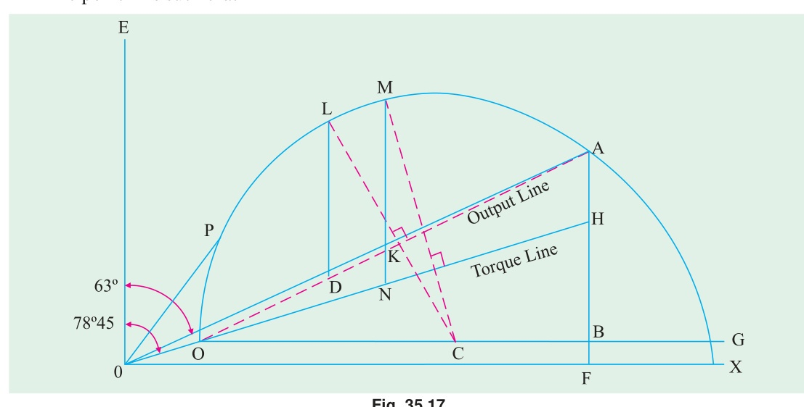
*Fig. 35.17: Circle diagram constructed for Example 35.9.*

$$\frac{AH}{AB} = \frac{\text{rotor Cu loss}}{\text{total Cu loss}} = \frac{\text{rotor resistance}*}{\text{rotor + stator resistance}} = \frac{0.24}{0.62}$$
$$\text{Now } AB = 8.2\text{ cm (by measurement)} \quad \therefore AH = 8.2 \times 0.24 / 0.62 = 3.2\text{ cm}$$

($a$) Starting torque $= AH = 3.2\text{ cm} = 3.2 \times 1740 = \mathbf{5,570\text{ synch. watt.}}$

($b$) Line $CM$ is drawn perpendicular to the torque line $O'H$. The intercept $MN$ represents the maximum torque in synchronous watts.
$$\text{Maximum torque} = MN = 7.15\text{ cm} = 7.15 \times 1740 = \mathbf{12,440\text{ synch. watts.}}$$

($c$) For finding the maximum power, line $OP$ is drawn tangential to the semi-circle.
$$\angle POE = 28.5^\circ \qquad \therefore \text{maximum p.f.} = \cos 28.5^\circ = \mathbf{0.879}$$

($d$) The slip for maximum torque is $= KN / MN = 1.4 / 7.15 = \mathbf{0.195}$

($e$) Line $CL$ is drawn perpendicular to the output line $O'A$. From $L$ is drawn the vertical line $LD$. It measures 5.9 cm and represents the maximum output.
$$\therefore \text{maximum output} = 5.9 \times 1740 = \mathbf{10,270\text{ W}}$$

---

### Tutorial Problems 35.1

1. A 300 h.p. (223.8 kW), 3000-V, 3-$\phi$, induction motor has a magnetising current of 20 A at 0.10 p.f. and a short-circuit (or locked) current of 240 A at 0.25 p.f. Draw the circuit diagram, determine the p.f. at full-load and the maximum horse-power.  
   **[0.85 p.f. 621 h.p. (463.27 kW)]** *(I.E.E. London)*

2. The following are test results for a 18.65 kW, 3-$\phi$, 440-V slip-ring induction motor :  
   Light load : 440-V, 7.5 A, 1350 W (including 650 W friction loss).  
   Short-circuit : 100-V, 35 A, 2100 W.  
   Rotor copper loss at standstill is 55% of the total copper loss. The star-connected stator has a resistance per phase of $0.4\ \Omega$.  
   Find the full-load current, power factor and slip.  
   **[32 A, 0.88, 3.8%]** *(London Univ.)*

<!-- Page 17 (Book p. 1329) -->

3. Draw the circle diagram for 20 h.p. (14.92 kW), 440-V, 50-Hz, 3-$\phi$ induction motor from the following test figures (line values) :  
   No-load : 440 V, 10 A, p.f. 0.2; Short-circuit : 200 V, 50 A, p.f. 0.4  
   From the diagram, estimate (a) the line current and p.f. at full-load (b) the maximum power developed (c) the starting torque. Assume the rotor and stator $I^2 R$ losses on short-circuit to be equal.  
   **[(a) 28.1 A at 0.844 p.f. (b) 27.75 kW (c) 11.6 synchronous kW/phase]** *(London Univ.)*

4. A 40 h.p. (29.84 kW), 440-V, 50-Hz, 3-phase induction motor gave the following test results :  
   No load : 440 V, 16 A, p.f. = 0.15; S.C. test : 100 V, 55 A, p.f. = 0.225  
   Ratio of rotor to stator losses on short-circuit = 0.9. Find the full-load current and p.f., the pull-out torque and the maximum output power developed.  
   **[49 A at 0.88 p.f. ; 78.5 synch. kW or 2.575 times F.L. torque ; 701.2 kW]** *(I.E.E. London)*

5. A 40 h.p. (29.84 kW), 50-Hz, 6-pole, 420-V, 3-$\phi$, slip-ring induction motor furnished the following test figures :  
   No-load : 420 V, 18 A, p.f. = 0.15; S.C. test : 210 V, 140 A, p.f. = 0.25  
   The ratio of stator to rotor Cu losses on short-circuit was $7 : 6$. Draw the circle diagram and find from it (a) the full-load current and power factor (b) the maximum torque and power developed.  
   **[(a) 70 A at 0.885 p.f. (b) 89.7 kg.m ; 76.09 kW]** *(I.E.E. London)*

6. A 500 h.p. (373 kW), 8-pole, 3-$\phi$, 6,000-V, 50-Hz induction motor gives on test the following figures :  
   Running light at 6000 V, 14 A/phase, 20,000 W ; Short-circuit at 2000 V, 70 A/phase, 30,500 W  
   The resistance/phase of the star-connected stator winding is $1.1\ \Omega$, ratio of transformation is $4 : 1$. Draw the circle diagram of this motor and calculate how much resistance must be connected in each phase of the rotor to make it yield full-load torque at starting.  
   **[0.138 $\Omega$]** *(London Univ.)*

7. A 3-phase induction motor has full-load output of 18.65 kW at 220 V, 720 r.p.m. The full-load p.f. is 0.83 and efficiency is 85%. When running light, the motor takes 5 A at 0.2 p.f. Draw the circle diagram and use it to determine the maximum torque which the motor can exert (a) in N-m (b) in terms of full-load torque and (c) in terms of the starting torque.  
   **[(a) 268.7 N-m (b) 1.08 (c) 7.2 approx.]** *(London Univ.)*

8. A 415-V, 40 h.p. (29.84 kW), 50 Hz, $\Delta$-connected motor gave the following test data :  
   No-load test : 415 V, 21 A, 1250 W ; Locked rotor test : 100 V, 45 A, 2,730 W  
   Construct the circle diagram and determine (a) the line current and power factor for rated output (b) the maximum torque. Assume stator and rotor Cu losses equal at standstill.  
   **[(a) 104 A : 0.819 (b) 51,980 synch watt]** *(A.C. Machines-I, Jadavpur Univ. 1978)*

9. Draw the no-load and short circuit diagram for a 14.92 kW, 400-V, 50-Hz, 3-phase star-connected induction motor from the following data (line values) :  
   No load test : 400 V, 9 A, $\cos \phi = 0.2$  
   Short circuit test : 200 V, 50 A, $\cos \phi = 0.4$  
   From the diagram find (a) the line current and power factor at full load, and (b) the maximum output power.  
   **[(a) 32.0 A, 0.85 (b) 21.634 kW]**

---
*\* Because $K = 1$, otherwise it should be $R_2' = R_2 / K^2$.*
