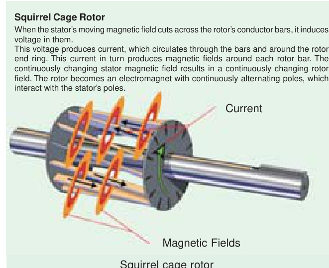
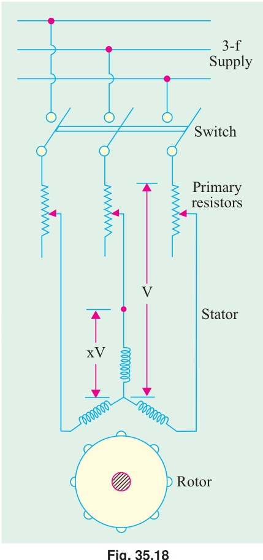
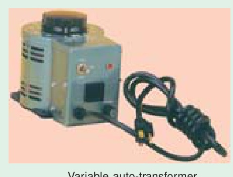
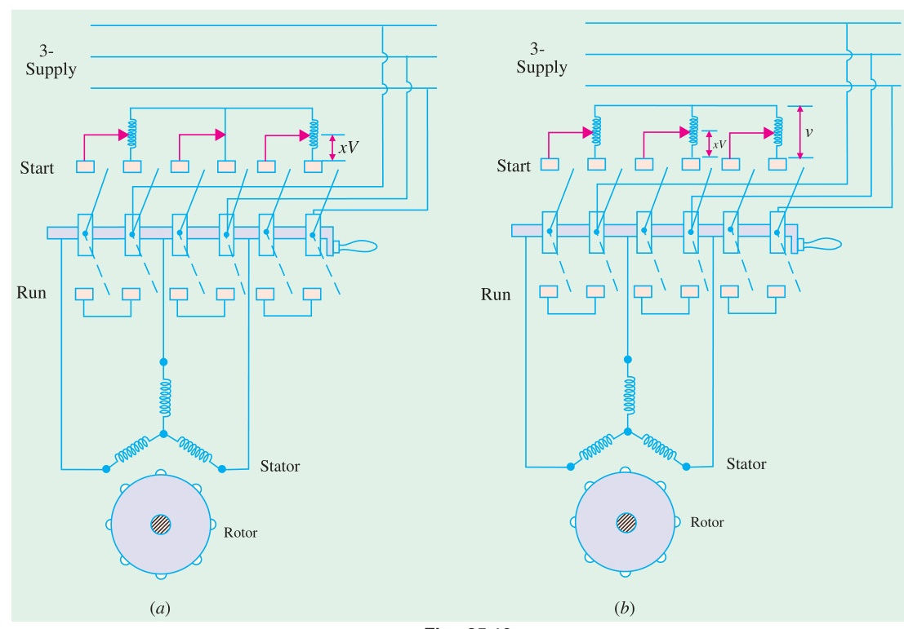
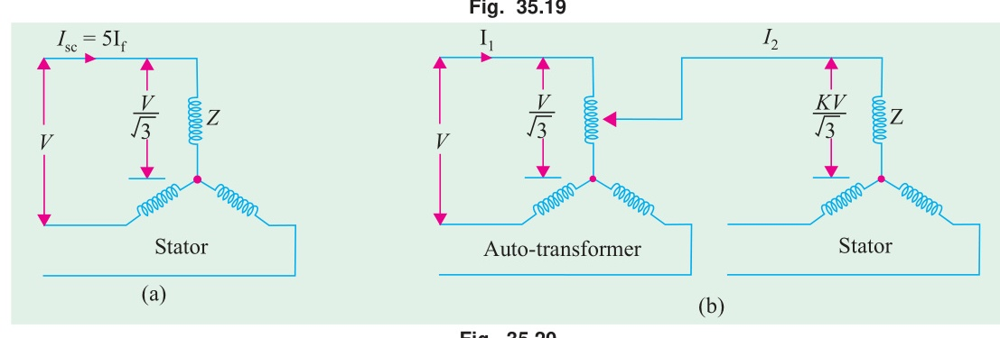
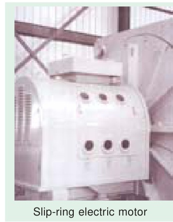
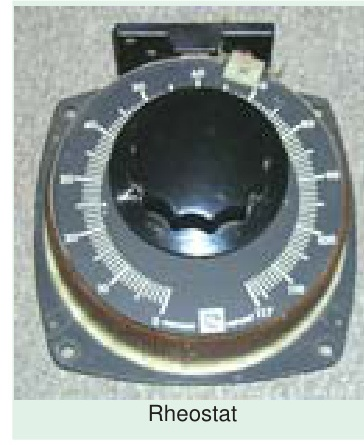
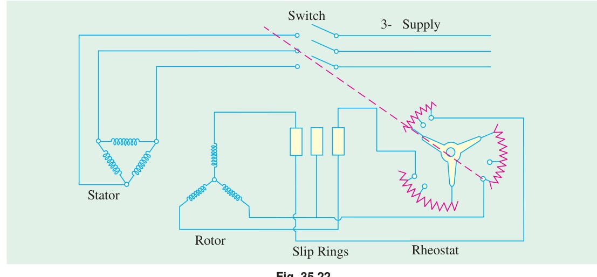
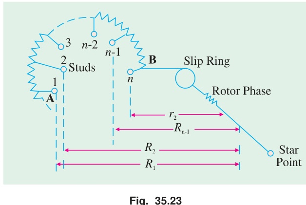
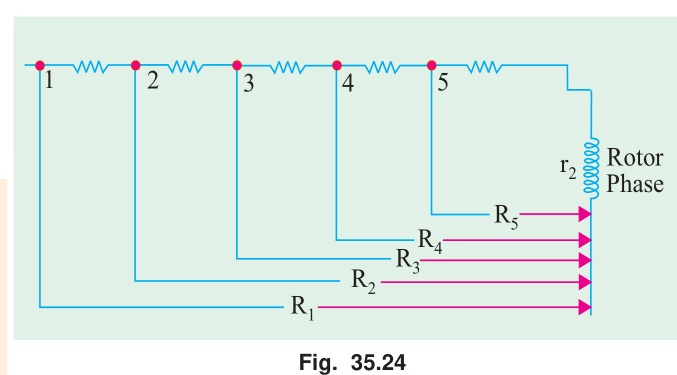

# Chapter 35: Induction Motor — Computations and Circle Diagrams

## Module 02: Starting Methods of Induction Motors

<!-- Page 17 (Book p. 1329) -->

### 35.9. Starting of Induction Motors
It has been shown earlier that a plain induction motor is similar in action to a polyphase transformer with a short-circuited rotating secondary. Therefore, if normal supply voltage is applied to the stationary motor, then, as in the case of a transformer, a very large initial current is taken by the primary, at least for a short while. It would be remembered that exactly similar conditions exist in the case of a d.c. motor, if it is thrown directly across the supply lines, because at the time of starting it, there is no back e.m.f. to oppose the initial inrush of current.

<!-- Page 18 (Book p. 1330) -->

Induction motors, when direct-switched, take five to seven times their full-load current and develop only 1.5 to 2.5 times their full-load torque. This initial excessive current is objectionable because it will produce large line-voltage drop that, in turn, will affect the operation of other electrical equipment connected to the same lines. Hence, it is not advisable to line-start motors of rating above 25 kW to 40 kW.

It was seen in Art. 34.15 that the starting torque of an induction motor can be improved by increasing the resistance of the rotor circuit. This is easily feasible in the case of slip-ring motors but not in the case of squirrel-cage motors. However, in their case, the initial in-rush of current is controlled by applying a reduced voltage to the stator during the starting period, full normal voltage being applied when the motor has run up to speed.

---

### 35.10. Direct-switching or Line starting of Induction Motors
It has been shown earlier that

$$\text{Rotor input} = 2\pi N_s T = k T \qquad \text{–Art. 34.36}$$

$$\text{Also,} \quad \text{rotor Cu loss} = s \times \text{rotor input}$$

$$\therefore 3 I_2^2 R_2 = s \times k T \qquad \therefore T \propto I_2^2 / s \quad (\text{if } R_2 \text{ is the same})$$

$$\text{Now } I_2 \propto I_1 \qquad \therefore T \propto I_1^2 / s \quad \text{or} \quad T = K I_1^2 / s$$

$$\text{At starting moment } s = 1 \qquad \therefore T_{st} = K I_{st}^2 \quad \text{where } I_{st} = \text{starting current}$$

$$\text{If } I_f = \text{normal full-load current and } s_f = \text{full-load slip}$$

$$\text{then } T_f = K I_f^2 / s_f \qquad \therefore \frac{T_{st}}{T_f} = \left(\frac{I_{st}}{I_f}\right)^2 \cdot s_f$$

When motor is direct-switched onto normal voltage, then starting current is the short-circuit current $I_{sc}$.

$$\therefore \frac{T_{st}}{T_f} = \left(\frac{I_{sc}}{I_f}\right)^2 \cdot s_f = a^2 \cdot s_f \quad \text{where } a = I_{sc} / I_f$$

$$\text{Suppose in a case,} \quad I_{sc} = 7 I_f, \quad s_f = 4\% = 0.04, \quad \text{the } T_{st} / T_f = 7^2 \times 0.04 = 1.96$$

$$\therefore \text{starting torque} = 1.96 \times \text{full-load torque}$$

Hence, we find that with a current as great as seven times the full-load current, the motor develops a starting torque which is only 1.96 times the full-load value.

Some of the methods for starting induction motors are discussed below :

#### Squirrel-cage Motors
- ($a$) Primary resistors (or rheostat) or reactors
- ($b$) Auto-transformer (or autostarter)
- ($c$) Star-delta switches

In all these methods, terminal voltage of the squirrel-cage motor is reduced during starting.

#### Slip-ring Motors
- ($a$) Rotor rheostat

---

### 35.11. Squirrel-cage Motors

#### (a) Primary resistors
Their purpose is to drop some voltage and hence reduce the voltage applied across the motor terminals. In this way, the initial current drawn by the motor is reduced. However, it should be noted that whereas current varies directly as the voltage, the torque varies as square of applied voltage.\*

---
*\* When applied voltage is reduced, the rotating flux $\Phi$ is reduced which, in turn, decreases rotor e.m.f. and hence rotor current $I_2$. Starting torque, which depends both on $\Phi$ and $I_2$ suffers on two counts when impressed voltage is reduced.*

<!-- Page 19 (Book p. 1331) -->

*Squirrel Cage Rotor: When the stator's moving magnetic field cuts across the rotor's conductor bars, it induces voltage in them. This voltage produces current, which circulates through the bars and around the rotor end ring. This current in turn produces magnetic fields around each rotor bar. The continuously changing stator magnetic field results in a continuously changing rotor field. The rotor becomes an electromagnet with continuously alternating poles, which interact with the stator's poles.*

(Art 34.17). If the voltage applied across the motor terminals is reduced by 50%, starting current is reduced by 50%, but torque is reduced to 25% of the full-voltage value.

*Fig. 35.18: Stator primary resistors starter.*

By using primary resistors (Fig. 35.18), the applied voltage/phase can be reduced by a fraction '$x$' (and it additionally improves the power factor of the line slightly).

$$I_{st} = x I_{sc} \quad \text{and} \quad T_{st} = x^2 T_{sc}$$

As seen from Art 35.10, above,

$$\frac{T_{st}}{T_f} = \left(\frac{I_{st}}{I_f}\right)^2 \cdot s_f = \left(\frac{x I_{sc}}{I_f}\right)^2 s_f = x^2 \left(\frac{I_{sc}}{I_f}\right)^2 s_f = x^2 \cdot a^2 \cdot s_f$$

It is obvious that the ratio of the starting torque to full-load torque is $x^2$ of that obtained with direct switching or across-the-line starting. This method is useful for the smooth starting of small machines only.

*Variable auto-transformer.*

#### (b) Auto-transformers
Such starters, known variously as **auto-starters or compensators**, consist of an auto-transformer, with necessary switches. We may use either two auto-transformers connected as usual [Fig. 35.19 ($b$)] or 3 auto-transformers connected in open delta [Fig. 35.19 ($a$)]. **This method can be used both for star-and delta-connected motors.** As shown in Fig. 35.20 with starting connections, a reduced voltage is applied across the motor terminals. When the motor has ran up to say, 80% of its normal speed, connections are so changed that auto-transformers are cut out and full supply voltage is applied across the motor. The switch making these changes from 'start' to 'run' may be airbreak (for small motors) or may be oil-immersed (for large motors) to reduce sparking. There is also provision for no-voltage and over-load protection, along with a time-delay device, so that momentary interruption of voltage or momentary over-load do not disconnect the motor from supply line. Most of the auto-starters are provided with 3 sets of taps, so as to reduce voltage to 80, 65 or 50 per cent of the line voltage, to suit the local conditions of supply. The

<!-- Page 20 (Book p. 1332) -->

$V$-connected auto-transformer is commonly used, because it is cheaper, although the currents are unbalanced during starting period. This is, however, not much objectionable firstly, because the current imbalance is about 15 per cent and secondly, because balance is restored as soon as running conditions are attained.

The quantitative relationships between the motor current, line current, and torque developed can be understood from Fig. 35.20.

In Fig 35.20 ($a$) is shown the case when the motor is direct-switched to lines. The motor current is, say, 5 times the full-load current. If $V$ is the line voltage, then voltage/phase across motor is $V/\sqrt{3}$.

$$\therefore I_{sc} = 5 I_f = \frac{V}{\sqrt{3} Z} \quad \text{where } Z \text{ is stator impedance/phase.}$$

In the case of auto-transformer, if a tapping of transformation ratio $K$ is used, then phase voltage across motor is $K V / \sqrt{3}$, as marked in Fig. 35.20 ($b$).

$$\therefore \text{motor current at starting } I_2 = \frac{K V}{\sqrt{3} Z} = K \cdot \frac{V}{\sqrt{3} Z} = K \cdot I_{sc} = K \cdot 5 I_f$$

*Fig. 35.19: Auto-transformer starting connections: ($a$) Open-delta connection (2 auto-transformers); ($b$) Star connection (3 auto-transformers).*

*Fig. 35.20: ($a$) Direct-switching; ($b$) Auto-transformer starting showing motor and line currents.*

<!-- Page 21 (Book p. 1333) -->

The current taken from supply or by auto-transformer is $I_1 = K I_2 = K^2 \times 5 I_f = K^2 I_{sc}$ if magnetising current of the transformer is ignored. Hence, we find that although motor current per phase is reduced only $K$ times the direct-switching current ($\because K < 1$), the current taken by the line is reduced $K^2$ times.

Now, remembering that torque is proportional to the square of the voltage, we get
$$\text{With direct-switching,} \quad T_1 \propto (V / \sqrt{3})^2 ; \quad \text{With auto-transformer, } T_2 \propto (K V / \sqrt{3})^2$$
$$\therefore T_2 / T_1 = (K V / \sqrt{3})^2 / (V / \sqrt{3})^2 \quad \text{or} \quad T_2 = K^2 T_1 \quad \text{or} \quad T_{st} = K^2 \cdot T_{sc}$$
$$\therefore \text{torque with auto-starter} = K^2 \times \text{torque with direct-switching.}$$

#### Relation Between Starting and F.L. Torque
It is seen that voltage across motor phase on direct-switching is $V / \sqrt{3}$ and starting current is $I_{st} = I_{sc}$. With auto-starter, voltage across motor phase is $K V / \sqrt{3}$ and $I_{st} = K I_{sc}$

$$\text{Now,} \quad T_{st} \propto I_{st}^2 \ (s = 1) \quad \text{and} \quad T_f \propto \frac{I_f^2}{s_f}$$

$$\therefore \frac{T_{st}}{T_f} = \left(\frac{I_{st}}{I_f}\right)^2 s_f \quad \text{or} \quad \frac{T_{st}}{T_f} = K^2 \left(\frac{I_{sc}}{I_f}\right)^2 s_f = K^2 \cdot a^2 \cdot s_f \qquad (\because I_{st} = K I_{sc})$$

Note that this expression is similar to the one derived in Art. 34.11. ($a$) except that $x$ has been replaced by transformation ratio $K$.

---

#### Example 35.10
*Find the percentage tapping required on an auto-transformer required for a squirrel-cage motor to start the motor against 1/4 of full-load torque. The short-circuit current on normal voltage is 4 times the full-load current and the full-load slip is 3%.*

**Solution:**
$$\frac{T_{st}}{T_f} = \frac{1}{4}, \qquad \frac{I_{sc}}{I_f} = 4, \qquad s_f = 0.03$$
$$\therefore \text{Using } \frac{T_{st}}{T_f} = K^2 \left(\frac{I_{sc}}{I_f}\right)^2 s_f \;, \text{ we get } \frac{1}{4} = K^2 \times 4^2 \times 0.03$$
$$\therefore K^2 = \frac{1}{64 \times 0.03} \qquad \therefore K = 0.722 \quad \text{or} \quad K = \mathbf{72.2\%}$$

---

#### Example 35.11
*A 20 h.p. (14.92 kW), 400-V, 950 r.p.m., 3-$\phi$, 50-Hz, 6-pole cage motor with 400 V applied takes 6 times full-load current at standstill and develops 1.8 times full-load running torque. The full-load current is 30 A.*  
*(a) what voltage must be applied to produce full-load torque at starting ?*  
*(b) what current will this voltage produce ?*  
*(c) if the voltage is obtained by an auto-transformer, what will be the line current ?*  
*(d) if starting current is limited to full-load current by an auto-transformer, what will be the starting torque as a percentage of full-load torque ?*  
*Ignore the magnetising current and stator impedance drops.*

**Solution:**
($a$) Remembering that $T \propto V^2$, we have
In the first case, $1.8\, T_f \propto 400^2$ ; In the second case, $T_f \propto V^2$
$$\therefore \left(\frac{V}{400}\right)^2 = \frac{1}{1.8} \quad \text{or} \quad V = \frac{400}{\sqrt{1.8}} = \mathbf{298.1\text{ V}}$$

($b$) Currents are proportional to the applied voltage.
$$\therefore 6 I_f \propto 400 ; I \propto 298.1 \qquad \therefore I = 6 \times \frac{298.1}{400}, I_f = \frac{6 \times 298.1 \times 30}{400} = \mathbf{134.2\text{ A}}$$

<!-- Page 22 (Book p. 1334) -->

($c$) Here $K = 298.1 / 400$
$$\text{Line current} = K^2 I_{sc} = (298.1/400)^2 \times 6 \times 30 = \mathbf{100\text{ A}}$$

($d$) We have seen in Art. 33.11 ($b$) that $\text{line current} = K^2 I_{sc}$
$$\text{Now,} \quad \text{line current} = \text{full-load current } I_f \text{ (given)}$$
$$\therefore 30 = K^2 \times 6 \times 30 \qquad \therefore K^2 = 1/6$$
$$\text{Now, using } \frac{T_{st}}{T_f} = K^2 \left(\frac{I_{sc}}{I_f}\right)^2 \times s_f \quad \text{we get } \frac{T_{st}}{T_f} = \frac{1}{6} \times \left(\frac{6 I_f}{I_f}\right)^2 \times 0.05 = 0.3$$
$$\text{Here } N_s = 120 \times 50 / 6 = 1000\text{ r.p.m.} \quad N = 950\text{ r.p.m.} ; \quad s_f = 50/1000 = 0.05$$
$$\therefore T_{st} = 0.3\, T_f \quad \text{or} \quad \mathbf{30\%\text{ F.L. torque}}$$

---

#### Example 35.12
*Determine the suitable auto-transformation ratio for starting a 3-phase induction motor with line current not exceeding three times the full-load current. The short-circuit current is 5 times the full-load current and full-load slip is 5%.*  
*Estimate also the starting torque in terms of the full-load torque.*  
*(Elect. Engg. II, Bombay Univ. 1987)*

**Solution:**
$$\text{Supply line current} = K^2 I_{sc}$$
$$\text{It is given that supply line current at start equals } 3 I_f \text{ and short-circuit current } I_{sc} = 5 I_f \text{ where } I_f \text{ is the full-load current}$$
$$\therefore 3 I_f = K^2 \times 5 I_f \quad \text{or} \quad K^2 = 0.6 \qquad \therefore K = 0.775 \quad \text{or} \quad \mathbf{77.5\%}$$

In the case of an auto starter,
$$\frac{T_{st}}{T_f} = K^2 \left(\frac{I_{sc}}{I_f}\right)^2 \times s_f \qquad \therefore \frac{T_{st}}{T_f} = 0.6 \times \left(\frac{5 I_f}{I_f}\right)^2 \times 0.05 = 0.75$$
$$\therefore T_{st} = 0.75\, T_f = \mathbf{75\%\text{ of full-load torque.}}$$

---

#### Example 35.13
*The full-load slip of a 400-V, 3-phase cage induction motor is 3.5% and with locked rotor, full-load current is circulated when 92 volt is applied between lines. Find necessary tapping on an auto-transformer to limit the starting current to twice the full-load current of the motor. Determine also the starting torque in terms of the full-load torque.*  
*(Elect. Machines, Bangalore Univ. 1991)*

**Solution:**
$$\text{Short-circuit current with full normal voltage applied is } I_{sc} = (400/92) I_f = (100/23) I_f$$
$$\text{Supply line current} = I_{st} = 2 I_f$$
$$\text{Now, line current } I_{st} = K^2 I_{sc}$$
$$\therefore 2 I_f = K^2 \times (100/23) I_f \qquad \therefore K^2 = 0.46 ; \quad K = 0.678 \quad \text{or} \quad \mathbf{67.8\%}$$
$$\text{Also,} \quad \frac{T_{st}}{T_f} = K^2 \left(\frac{I_{sc}}{I_f}\right)^2 \times s_f = 0.46 \times (100/23)^2 \times 0.035 = 0.304$$
$$\therefore T_{st} = \mathbf{30.4\%\text{ of full-load torque}}$$

---

### Tutorial Problems 35.2

1. A 3-$\phi$ motor is designed to run at 5% slip on full-load. If motor draws 6 times the full-load current at starting at the rated voltage, estimate the ratio of starting torque to the full-load torque.  
   **[1.8]** *(Electrical Engineering Grad, I.E.T.E. Dec. 1986)*

2. A squirrel-cage induction motor has a short-circuit current of 4 times the full-load value and has a full-load slip of 5%. Determine a suitable auto-transformer ratio if the supply line current is not to

<!-- Page 23 (Book p. 1335) -->

   exceed twice the full-load current. Also, express the starting torque in terms of the full-load torque. Neglect magnetising current.  
   **[70.7%, 0.4]**

3. A 3-$\phi$, 400-V, 50-Hz induction motor takes 4 times the full-load current and develops twice the full-load torque when direct-switched to 400-V supply. Calculate in terms of full-load values ($a$) the line current, the motor current and starting torque when started by an auto-starter with 50% tap and ($b$) the voltage that has to be applied and the motor current, if it is desired to obtain full-load torque on starting.  
   **[(a) 100%, 200%, 50% (b) 228 V, 282%]**

---

#### (c) Star-delta Starter
This method is used in the case of motors which are built to run normally with a delta-connected stator winding. It consists of a two-way switch which connects the motor in star for starting and then in delta for normal running. The usual connections are shown in Fig. 35.21. When star-connected, the applied voltage over each motor phase is reduced by a factor of $1 / \sqrt{3}$ and hence the torque developed becomes 1/3 of that which would have been developed if motor were directly connected in delta. The line current is reduced to 1/3. Hence, during starting period when motor is $Y$-connected, it takes 1/3rd as much starting current and develops 1/3rd as much torque as would have been developed were it directly connected in delta.

#### Relation Between Starting and F.L. Torque
$$I_{st} \text{ per phase} = \frac{1}{\sqrt{3}} I_{sc} \text{ per phase}$$

*Fig. 35.21: Wiring and circuit diagrams for star-delta starting.*

where $I_{sc}$ is the current/phase which $\Delta$-connected motor would have taken if switched on to the supply directly (however, line current at start = 1/3 of line $I_{sc}$)

<!-- Page 24 (Book p. 1336) -->

$$\text{Now} \quad T_{st} \propto I_{st}^2 \quad (s = 1) \qquad \text{– Art. 35.10}$$
$$T_f \propto I_f^2 / s_f$$

$$\therefore \frac{T_{st}}{T_f} = \left(\frac{I_{st}}{I_f}\right)^2 s_f = \left(\frac{I_{sc}}{\sqrt{3} I_f}\right)^2 s_f = \frac{1}{3} \left(\frac{I_{sc}}{I_f}\right)^2 s_f = \frac{1}{3} a^2 s_f$$

Here, $I_{st}$ and $I_{sc}$ represent phase values.

*It is clear that the star-delta switch is equivalent\* to an auto-transformer of ratio $1/\sqrt{3}$ or 58% approximately.*

This method is cheap and effective provided the starting torque is required not to be more than 1.5 times the full-load torque. Hence, it is used for machine tools, pumps and motor-generators etc.

---
*\* By comparing it with the expression given in Art. 35.11 (b)*

---

#### Example 35.14
*The full-load efficiency and power factor of a 12-kW, 440-V, 3-phase induction motor are 85% and 0.8 lag respectively. The blocked rotor line current is 45 A at 220 V. Calculate the ratio of starting to full-load current, if the motor is provided with a star-delta starter. Neglect magnetising current.*  
*(Elect. Machines, A.M.I.E. Sec. B, 1991)*

**Solution:**
$$\text{Blocked rotor current with full voltage applied} = I_{sc} = 45 \times 440 / 220 = 90\text{ A}$$
$$\text{Now,} \quad \sqrt{3} \times 440 \times I_f \times 0.8 = 12,000 / 0.85, \qquad \therefore I_f = 23.1\text{ A}$$
$$\text{In star-delta starter,} \quad I_{st} = I_{sc} / \sqrt{3} = 90 / \sqrt{3} = 52\text{ A}$$
$$\therefore I_{st} / I_f = 52 / 23.1 = \mathbf{2.256}$$

---

#### Example 35.15
*A 3-phase, 6-pole, 50-Hz induction motor takes 60 A at full-load speed of 940 r.p.m. and develops a torque of 150 N-m. The starting current at rated voltage is 300 A. What is the starting torque? If a star/delta starter is used, determine the starting torque and starting current.*  
*(Electrical Machinery-II, Mysore Univ. 1988)*

**Solution:**
As seen from Art. 33.10, for direct-switching of induction motors
$$\frac{T_{st}}{T_f} = \left(\frac{I_{sc}}{I_f}\right)^2 s_f \;. \quad \text{Here,} \quad I_{st} = I_{sc} = 300\text{ A (line value)} ; \quad I_f = 60\text{ A (line value)},$$
$$s_f = (1000 - 940)/1000 = 0.06 ; \quad T_f = 150\text{ N-m}$$
$$\therefore T_{st} = 150 (300/60)^2 \times 0.06 = \mathbf{225\text{ N-m}}$$

**When star/delta starter is used**
$$\text{Starting current} = 1/3 \times \text{starting current with direct starting} = 300 / 3 = \mathbf{100\text{ A}}$$
$$\text{Starting torque} = 225 / 3 = \mathbf{75\text{ N-m}} \qquad \text{– Art 35-11 (c)}$$

---

#### Example 35.16
*Determine approximately the starting torque of an induction motor in terms of full-load torque when started by means of (a) a star-delta switch (b) an auto-transformer with 70.7 % tapping. The short-circuit current of the motor at normal voltage is 6 times the full-load current and the full-load slip is 4%. Neglect the magnetising current.*  
*(Electrotechnics, M.S. Univ. Baroda 1986)*

**Solution. (a)**
$$\frac{T_{st}}{T_f} = \frac{1}{3} \left(\frac{I_{sc}}{I_f}\right)^2 s_f = \frac{1}{3} \times 6^2 \times 0.04 = 0.48$$
$$\therefore T_{st} = 0.48\, T_f \quad \text{or} \quad \mathbf{48\%\text{ of F.L. value}}$$

**(b) Here**
$$K = 0.707 = 1 / \sqrt{2} ; \quad K^2 = 1/2$$

<!-- Page 25 (Book p. 1337) -->

$$\text{Now,} \quad \frac{T_{st}}{T_f} = K^2 \left(\frac{I_{sc}}{I_f}\right)^2 s_f = \frac{1}{2} \times 6^2 \times 0.04 = 0.72$$
$$\therefore T_{st} = 0.72\, T_f \quad \text{or} \quad \mathbf{72\%\text{ of } T_f}$$

---

#### Example 35.17
*A 15 h.p. (11.2 kW), 3-$\phi$, 6-pole, 50-Hz, 400-V, $\Delta$-connected induction motor runs at 960 r.p.m. on full-load. If it takes 86.4 A on direct starting, find the ratio of starting torque to full-load torque with a star-delta starter. Full-load efficiency and power factor are 88% and 0.85 respectively.*

**Solution:**
$$\text{Here,} \quad I_{sc}/\text{phase} = 86.4 / \sqrt{3}\text{ A}$$
$$I_{st}\text{ per phase} = \frac{1}{\sqrt{3}} \cdot I_{sc}\text{ per phase} = \frac{86.4}{\sqrt{3} \times \sqrt{3}} = 28.8\text{ A}$$
$$\text{Full-load input line current may be found from}$$
$$\sqrt{3} \times 400 \times I_L \times 0.85 = 11.2 \times 10^3 / 0.88 \qquad \therefore \text{Full-load } I_L = 21.59\text{ A}$$
$$\text{F.L. } I_{ph} = 21.59 / \sqrt{3}\text{ A} ; \qquad I_f = 21.59 / \sqrt{3}\text{ A per phase}$$
$$N_s = 120 \times 50 / 6 = 1000\text{ r.p.m.,} \qquad N = 950 ; \quad s_f = 0.05$$
$$\frac{T_{st}}{T_f} = \left(\frac{I_{st}}{I_f}\right)^2 s_f = \left(\frac{28.8 \times \sqrt{3}}{21.59}\right)^2 \times 0.05 \quad \therefore T_{st} = 0.267\, T_f \quad \text{or} \quad \mathbf{26.7\%\text{ F.L. torque}}$$

---

#### Example 35.18
*Find the ratio of starting to full-load current in a 10 kW (output), 400-V, 3-phase induction motor with star/delta starter, given that full-load p.f. is 0.85, the full-load efficiency is 0.88 and the blocked rotor current at 200 V is 40 A. Ignore magnetising current.*  
*(Electrical Engineering, Madras Univ. 1985)*

**Solution:**
$$\text{F.L. line current drawn by the } \Delta\text{-connected motor may be found from}$$
$$\sqrt{3} \times 400 \times I_L \times 0.85 = 10 \times 1000 / 0.88 \qquad \therefore I_L = 19.3\text{ A}$$
$$\text{Now, with 200 V, the line value of S.C. current of the } \Delta\text{-connected motor is 40 A. If full normal}$$
$$\text{voltage were applied, the line value of S.C. current would be } = 40 \times (400/200) = 80\text{ A.}$$
$$\therefore I_{sc}\text{ (line value)} = 80\text{ A} ; \qquad I_{sc}\text{ (phase value)} = 80 / \sqrt{3}\text{ A}$$
$$\text{When connected in star across 400 V, the starting current per phase drawn by the motor stator during starting is}$$
$$I_{st}\text{ per phase} = \frac{1}{\sqrt{3}} \times I_{sc}\text{ per phase} = \frac{1}{\sqrt{3}} \times \frac{80}{\sqrt{3}} = \frac{80}{3}\text{ A} \qquad \text{– Art. 35.10}$$
$$\text{Since during starting, motor is star-connected, } I_{st}\text{ per phase} = \text{line value of } I_{sc} = 80/3\text{ A}$$
$$\therefore \frac{\text{line value of starting current}}{\text{line value of F.L. current}} = \frac{80/3}{19.3} = \mathbf{1.38}$$

---

#### Example 35.19
*A 5 h.p. (3.73 kW), 400-V, 3-$\phi$, 50-Hz cage motor has a full-load slip of 4.5%. The motor develops 250% of the rated torque and draws 650% of the rated current when thrown directly on the line. What would be the line current, motor current and the starting torque if the motor were started (i) be means of a star/delta starter and (ii) by connecting across 60% taps of a starting compensator.*  
*(Elect. Machines-II, Indore Univ. 1989)*

**Solution. (i)**
$$\text{Line current} = (1/3) \times 650 = \mathbf{216.7\%}$$
$$\text{Motor being star-connected, line current is equal to phase current.}$$
$$\therefore \text{motor current} = 650/3 = \mathbf{216.7\%}$$
$$\text{As shown earlier, starting torque developed for star-connection is one-third of that developed on direct switching with delta-connection} \quad \therefore T_{st} = 250 / 3 = \mathbf{83.3\%}$$

**(ii)**
$$\text{Line current} = K^2 \times I_{sc} = (60/100)^2 \times 650 = \mathbf{234\%}$$

<!-- Page 26 (Book p. 1338) -->

$$\text{Motor current} = K \times I_{sc} = (60/100) \times 650 = \mathbf{390\%}$$
$$T_{st} = K^2 \times T_{sc} = (60/100)^2 \times 250 = \mathbf{90\%}$$

---

#### Example 35.20
*A squirrel-cage type induction motor when started by means of a star/delta starter takes 180% of full-load line current and develops 35% of full-load torque at starting. Calculated the starting torque and current in terms of full-load values, if an auto-transformer with 75% tapping were employed.*  
*(Utilization of Elect. Power, A.M.I.E. 1987)*

**Solution. With star-delta starter,**
$$\frac{T_{st}}{T_f} = \frac{1}{3} \left(\frac{I_{sc}}{I_f}\right)^2 s_f$$
$$\text{Line current on line-start } I_{sc} = 3 \times 180\%\text{ of } I_f = 3 \times 1.8\, I_f = 5.4\, I_f$$
$$\text{Now,} \quad T_{st}/T_f = 0.35\text{ (given)} ; \quad I_{sc}/I_f = 5.4$$
$$\therefore 0.35 = (1/3) \times 5.4^2\, s_f \quad \text{or} \quad 5.4^2\, s_f = 1.05$$

**Autostarter :** Here, $K = 0.75$
$$\text{Line starting current} = K^2 I_{sc} = (0.75)^2 \times 5.4\, I_f = \mathbf{3.04\, I_f = 304\%\text{ of F.L. current}}$$
$$\frac{T_{st}}{T_f} = K^2 \left(\frac{I_{sc}}{I_f}\right)^2 s_f ; \quad \frac{T_{st}}{T_f} = (0.75)^2 \times 5.4^2\, s_f = (0.75)^2 \times 1.05 = 0.59$$
$$T_{st} = 0.59\, T_f = \mathbf{59\%\text{ F.L. torque}}$$

---

#### Example 35.21
*A 10 h.p. (7.46 kW) motor when started at normal voltage with a star-delta switch in the star position is found to take an initial current of $1.7 \times \text{full-load current}$ and gave an initial starting torque of 35% of full-load torque. Explain what happens when the motor is started under the following conditions : (a) an auto-transformer giving 60% of normal voltage (b) a resistance in series with the stator reducing the voltage to 60% of the normal and calculate in each case the value of starting current and torque in terms of the corresponding quantities at full-load.*  
*(Elect. Machinery-III, Kerala Univ. 1987)*

**Solution:**
If the motor were connected in delta and direct-switched to the line, then it would take a line current three times that which it takes when star-connected.
$$\therefore \text{line current on line start or } I_{sc} = 3 \times 1.7\, I_f = 5.1\, I_f$$
$$\text{We know } \frac{T_{st}}{T_f} = \frac{1}{3} \left(\frac{I_{sc}}{I_f}\right)^2 s_f$$
$$\text{Now } \frac{T_{st}}{T_f} = 0.35 \quad \text{...given} ; \qquad \frac{I_{sc}}{I_f} = 5.1 \quad \text{...calculated}$$
$$\therefore 0.35 = (1/3) \times 5.1^2 \times s_f$$
$$\text{We can find } s_f \text{ from } 5.1^2 \times s_f = 1.05$$

**($a$) When it is started with an auto-starter, then $K = 0.6$**
$$\text{Line starting current} = K^2 \times I_{sc} = 0.6^2 \times 5.1\, I_f = \mathbf{0.836\, I_f}$$
$$T_{st}/T_f = 0.6^2 \times 5.1^2 \times s_f = 0.6^2 \times 1.05 = 0.378 \qquad \therefore T_{st} = \mathbf{37.8\%\text{ of F.L. torque}}$$

**($b$) Here, voltage across motor is reduced to 60% of normal value.** In this case *motor* current is the same as line current but it decreases in proportion to the decrease in voltage.
$$\text{As voltage across motor} = 0.6\text{ of normal voltage}$$
$$\therefore \text{line starting current} = 0.6 \times 5.1\, I_f = \mathbf{3.06\, I_f}$$
$$\text{Torque at starting would be the same as before.}$$
$$T_{st}/T_f = 0.6^2 \times 5.1^2 \times s_f = 0.378 \qquad \therefore T_{st} = \mathbf{37.8\%\text{ of F.L. torque.}}$$

<!-- Page 27 (Book p. 1339) -->

---

### Tutorial Problems 35.3

1. A 3-phase induction motor whose full-load slip is 4 per cent, takes six times full-load current when switched directly on to the supply. Calculate the approximate starting torque in terms of the full-load torque when started by means of an auto-transformer starter, having a 70 percent voltage tap.  
   **[$0.7\, T_f$]**

2. A 3-phase, cage induction motor takes a starting current at normal voltage of 5 times the full-load value and its full-load slip is 4 per cent. What auto-transformer ratio would enable the motor to be started with not more than twice full-load current drawn from the supply ?  
   What would be the starting torque under these conditions and how would it compare with that obtained by using a stator resistance starter under the same limitations of line current ?  
   **[63.3% tap ; $0.4\, T_f$ ; $0.16\, T_f$]**

3. A 3-phase, 4-pole, 50-Hz induction motor takes 40 A at a full-load speed of 1440 r.p.m. and develops a torque of 100 N-m at full-load. The starting current at rated voltage is 200 A. What is the starting torque ? If a star-delta starter is used, what is the starting torque and starting current ? Neglect magnetising current.  
   **[100 N-m; 33.3 N-m; 66.7 A]** *(Electrical Machines-IV, Bangalore Univ. Aug. 1978)*

4. Determine approximately the starting torque of an induction motor in terms of full-load torque when started by means of ($a$) a star-delta switch ($b$) an auto-transformer with 50% tapping. Ignore magnetising current. The short-circuit current of the motor at normal voltage is 5 times the full-load current and the full-load slip is 4 per cent.  
   **[(a) 0.33 (b) 0.25]** *(A.C. Machines, Madras Univ. 1976)*

5. Find the ratio of starting to full-load current for a 7.46 kW, 400-V, 3-phase induction motor with star/delta starter, given that the full-load efficiency is 0.87, the full-load p.f. is 0.85 and the short-circuit current is 15 A at 100 V.  
   **[1.37]** *(Electric Machinery-II, Madras Univ. April 1978)*

6. A four-pole, 3-phase, 50-Hz, induction motor has a starting current which is 5 times its full-load current when directly switched on. What will be the percentage reduction in starting torque if ($a$) star-delta switch is used for starting ($b$) auto-transformer with a 60 per cent tapping is used for starting ?  
   *(Electrical Technology-III, Gwalior Univ. Nov. 1917)*

7. Explain how the performance of induction motor can be predicted by circle diagram. Draw the circle diagram for a 3-phase, mesh-connected, 22.38 kW, 500-V, 4-pole, 50-Hz induction motor. The data below give the measurements of line current, voltage and reading of two wattmeters connected to measure the input :  
   No load : 500 V, 8.3 A, 2.85 kW, – 1.35 kW  
   Short circuit : 100 V, 32 A, – 0.75 kW, 2.35 kW  
   From the diagram, find the line current, power factor, efficiency and the maximum output.  
   **[83 A, 0.9, 88%, 50.73 kW]** *(Electrical Machines-II, Vikram Univ. Ujjan 1977)*

---

### 35.12. Starting of Slip-ring Motors
These motors are practically always started with full line voltage applied across the stator terminals. The value of starting current is adjusted by introducing a variable resistance in the rotor circuit. The controlling resistance is in the form of a rheostat, connected in star (Fig. 35.22), the resistance being gradually cut-out of the rotor circuit, as the motor gathers speed. It has been already shown that by increasing the rotor resistance, not only is the rotor (and hence stator) current reduced at starting, but at the same time, the starting torque is also increased due to improvement in power factor.

*Slip-ring electric motor.*

The controlling rheostat is either of stud or contactor type and

<!-- Page 28 (Book p. 1340) -->

may be hand-operated or automatic. The starter unit usually includes a line switching contactor for the stator along with no-voltage (or low-voltage) and over-current protective devices. There is some form of interlocking to ensure proper sequential operation of the line contactor and the starter. This interlocking prevents the closing of stator contactor unless the starter is 'all in'.

*Rotor starting rheostat.*

As said earlier, the introduction of additional external resistance in the rotor circuit enables a slip-ring motor to develop a high starting torque with reasonably moderate starting current. Hence, such motors can be started under load. This additional resistance is for starting purpose only. It is gradually cut out as the motor comes up to speed.

*Fig. 35.22: Stator switch and 3-phase rotor rheostat starting connections.*

The rings are, later on, short-circuited and brushes lifted from them when motor runs under normal conditions.

---

### 35.13. Starter Steps
Let it be assumed, as usually it is in the case of starters, that ($i$) the motor starts against a constant torque and ($ii$) that the rotor current fluctuates between fixed maximum and minimum values of $I_{2max}$ and $I_{2min}$ respectively.

In Fig. 35.23 is shown one phase of the 3-phase rheostat $AB$ having $n$ steps and the rotor circuit. Let $R_1, R_2 \dots$ etc. be the *total* resistances of the rotor circuit on the first, second step...etc. respectively. The resistances $R_1, R_2 \dots$, etc. consist of rotor resistance per phase $r_2$ and the external resistances $\rho_1, \rho_2 \dots$ etc. Let the corresponding values of slips be $s_1, s_2 \dots$ etc. at stud No.1, 2...etc. At the commencement of each step, the current is $I_{2max}$ and at the instant of leaving it, the current is $I_{2min}$. Let $E_2$ be the standstill e.m.f. induced in each phase of the rotor. When the handle touches first stud, the current rises to a maximum value $I_{2max}$, so that

$$I_{2max} = \frac{s_1 E_2}{\sqrt{R_1^2 + (s_1 X_2)^2}} = \frac{E_2}{\sqrt{(R_1 / s_1)^2 + X_2^2}}$$

where $s_1 = \text{slip at starting } i.e. \text{ unity and } X_2 = \text{rotor reactance/phase}$

Then, *before* moving to stud No. 2, the current is reduced to $I_{2min}$ and slip changes to $s_2$ such that

<!-- Page 29 (Book p. 1341) -->

$$I_{2min} = \frac{E_2}{\sqrt{(R_1 / s_2)^2 + X_2^2}}$$

As we now move to stud No. 2, the speed momentarily remains the same, but current rises to $I_{2max}$ because some resistance is cut out.

$$\text{Hence,} \quad I_{2max} = \frac{E_2}{\sqrt{(R_2 / s_2)^2 + X_2^2}}$$

After some time, the current is again reduced to $I_{2min}$ and the slip changes to $s_3$ such that

$$I_{2min} = \frac{E_2}{\sqrt{(R_2 / s_3)^2 + X_2^2}}$$

*Fig. 35.23: Schematic of rotor starter resistance steps.*

As we next move over to stud No. 3, again current rises to $I_{2max}$ although speed remains momentarily the same.

$$\therefore I_{2max} = \frac{E_2}{\sqrt{(R_2 / s_3)^2 + X_2^2}} \qquad \text{Similarly } I_{2min} = \frac{E_2}{\sqrt{(R_3 / s_4)^2 + X_2^2}}$$

At the last stud *i.e.* $n$th stud,

$$I_{2max} = \frac{E_2}{\sqrt{(r_2 / s_{max})^2 + X_2^2}} \quad \text{where } s_{max} = \text{slip under normal running}$$

conditions, when external resistance is completely cut out.

It is found from above that
$$I_{2max} = \frac{E_2}{\sqrt{(R_1 / s_1)^2 + X_2^2}} = \frac{E_2}{\sqrt{(R_2 / s_2)^2 + X_2^2}} = \dots = \frac{E_2}{\sqrt{(r_2 / s_{max})^2 + X_2^2}}$$

$$\text{or} \quad \frac{R_1}{s_1} = \frac{R_2}{s_2} = \frac{R_3}{s_3} = \dots = \frac{R_{n-1}}{s_{n-1}} = \frac{R_n}{s_n} = \frac{r_2}{s_{max}} \qquad \dots(i)$$

Similarly,
$$I_{2min} = \frac{E_2}{\sqrt{(R_1 / s_2)^2 + X_2^2}} = \frac{E_2}{\sqrt{(R_2 / s_3)^2 + X_2^2}} = \dots = \frac{E_2}{\sqrt{(R_{n-1} / s_{max})^2 + X_2^2}}$$

$$\text{or} \quad \frac{R_1}{s_2} = \frac{R_2}{s_3} = \frac{R_3}{s_4} = \dots = \frac{R_{n-1}}{s_{max}} \qquad \dots(ii)$$

From ($i$) and ($ii$), we get

$$\frac{s_2}{s_1} = \frac{s_3}{s_2} = \frac{s_4}{s_3} = \dots = \frac{R_2}{R_1} = \frac{R_3}{R_2} = \frac{R_4}{R_3} = \dots = \frac{r_2}{R_{n-1}} = K \text{ (say)} \qquad \dots(iii)$$

$$\text{Now, from (i) it is seen that } R_1 = \frac{s_1 \times r_2}{s_{max}} \;.$$

$$\text{Now, } s_1 = 1 \text{ at starting, when rotor is stationary.}$$
$$\therefore R_1 = r_2 / s_{max} \;. \quad \text{Hence, } R_1 \text{ becomes known in terms of rotor resistance/phase and normal slip.}$$

From ($iii$), we obtain
$$R_2 = K R_1 ; \quad R_3 = K R_2 = K^2 R_1 ; \quad R_4 = K R_3 = K^3 R_1 \quad \text{and} \quad r_2 = K R_{n-1} = K^{n-1} \cdot R_1$$

$$\text{or} \quad r_2 = K^{n-1} \cdot \frac{r_2}{s_{max}} \qquad \text{(putting the value of } R_1\text{)}$$

<!-- Page 30 (Book p. 1342) -->

$$K = (s_{max})^{1/(n-1)} \quad \text{where } n \text{ is the number of starter studs.}$$

The resistances of various sections can be found as given below :
$$\rho_1 = R_1 - R_2 = R_1 - K R_1 = (1 - K) R_1 ; \quad \rho_2 = R_2 - R_3 = K R_1 - K^2 R_1 = K \rho_1$$
$$\rho_3 = R_3 - R_4 = K^2 \rho_1 \text{ etc.}$$

Hence, it is seen from above that if $s_{max}$ is known for the assumed value $I_{2max}$ of the starting current, then $n$ can be calculated.

*Fig. 35.24: Resistance grading across 5 sections of rotor starter.*

---

#### Example 35.22
*Calculate the steps in a 5-step rotor resistance starter for a 3 phase induction motor. The slip at the maximum starting current is 2% with slip-ring short-circuited and the resistance per rotor phase is $0.02\ \Omega$.*

**Solution:**
Here,
$$s_{max} = 2\% = 0.02 ; \quad r_2 = 0.02\ \Omega, \quad n = 6$$
$$R_1 = \text{total resistance in rotor circuit/phase on first stud}$$
$$= r_2 / s_{max} = 0.02 / 0.02 = 1\ \Omega$$
$$\text{Now,} \quad K = (s_{max})^{1/(n-1)} = (0.02)^{1/5} = \mathbf{0.4573}$$
$$R_1 = 1\ \Omega ; \quad R_2 = K R_1 = 0.4573 \times 1 = \mathbf{0.4573\ \Omega}$$
$$R_3 = K R_2 = 0.4573 \times 0.4573 = \mathbf{0.2091\ \Omega} ; \quad R_4 = K R_3 = 0.4573 \times 0.2091 = \mathbf{0.0956\ \Omega}$$
$$R_5 = K R_4 = 0.4573 \times 0.0956 = \mathbf{0.0437\ \Omega} ; \quad r_2 = K R_5 = 0.4573 \times 0.0437 = 0.02\ \Omega \text{ (as given)}$$

The resistances of various starter sections are as found below :
$$\rho_1 = R_1 - R_2 = 1 - 0.4573 = \mathbf{0.5427\ \Omega} ; \qquad \rho_2 = R_2 - R_3 = 0.4573 - 0.2091 = \mathbf{0.2482\ \Omega}$$
$$\rho_3 = R_3 - R_4 = 0.2091 - 0.0956 = \mathbf{0.1135\ \Omega} ; \qquad \rho_4 = R_4 - R_5 = 0.0956 - 0.0437 = \mathbf{0.0519\ \Omega}$$
$$\rho_5 = R_5 - r_2 = 0.0437 - 0.02 = \mathbf{0.0237\ \Omega}$$

The resistances of various sections are shown in Fig. 35.24.
