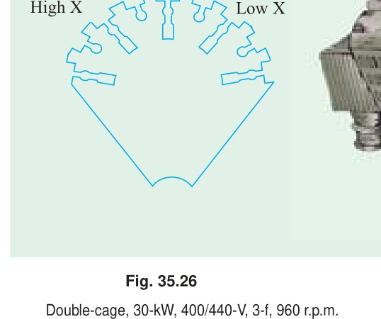
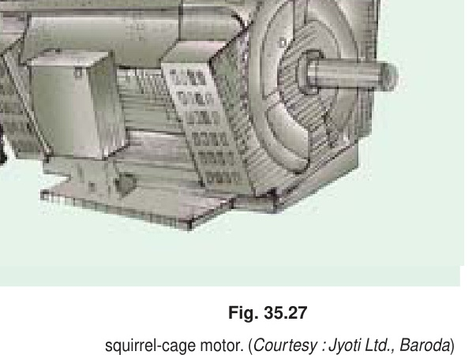
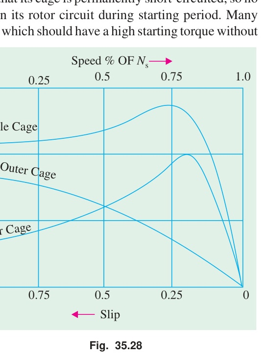
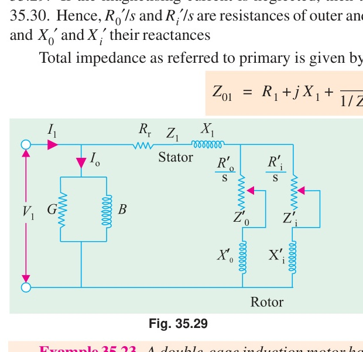
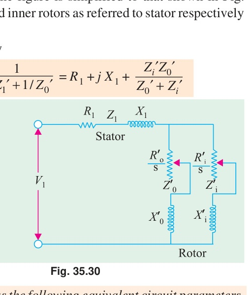
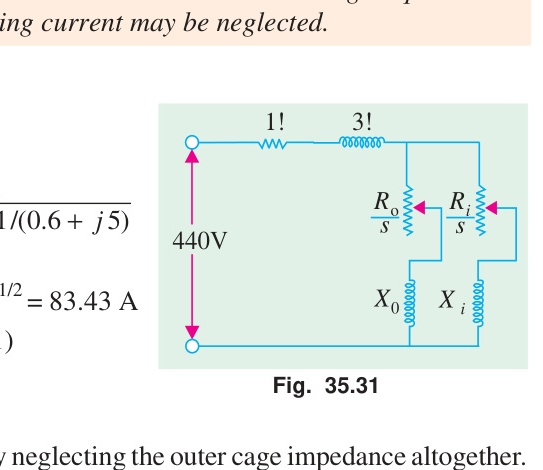
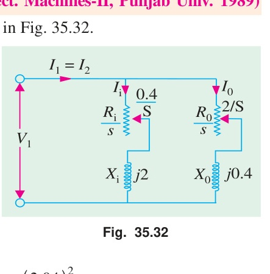
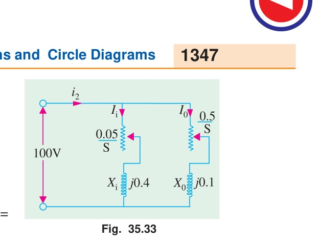
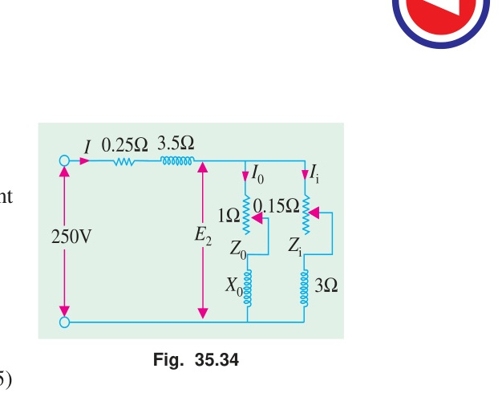
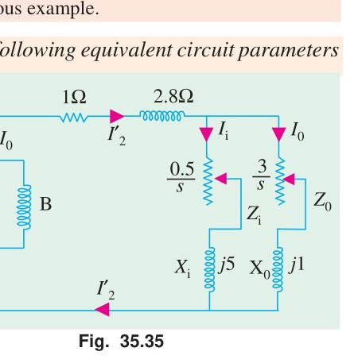

# Chapter 35: Induction Motor — Computations and Circle Diagrams

[<< 02. Starting Methods of Induction Motors](02_Starting_Methods_of_Induction_Motors.md) | [Master Index](00_Index_and_Topic_Map.md) | [04. Speed Control, Commutator Motors, and Types >>](04_Speed_Control_Commutator_Motors_and_Types.md)

---

<!-- Page 30 (Book p. 1342) -->

## 35.14. Crawling

It has been found that induction motors, particularly the squirrel-cage type, sometimes exhibit a tendency to run stably at speeds as low as one-seventh of their synchronous speed $N_s$. This phenomenon is known as **crawling** of an induction motor.

This action is due to the fact that the a.c. winding of the stator produces a flux wave, which is not a pure sine wave. It is a complex wave consisting of a fundamental wave, which revolves synchronously, and odd harmonics like 3rd, 5th, and 7th etc. which rotate either in the forward or backward direction at $N_s / 3$, $N_s / 5$ and $N_s / 7$ speeds respectively. As a result, in addition to the fundamental torque, harmonic torques are also developed, whose synchronous speeds are $1/n\text{th}$ of the speed for the fundamental torque i.e. $N_s / n$, where $n$ is the order of the harmonic torque.

Since 3rd harmonic currents are absent in a balanced 3-phase system, they produce no rotating field and, therefore, no torque. Hence, total motor torque has three main components:
1. The **fundamental torque**, rotating with the synchronous speed $N_s$.
2. **5th harmonic torque**\*, rotating at $N_s / 5$ speed in the *reverse* direction.
3. **7th harmonic torque**, having a forward speed of $N_s / 7$.

> \* **Footnote:** The magnitude of the harmonic torques is $1/n^2$ of the fundamental torque.

---

<!-- Page 31 (Book p. 1343) -->

Now, the 5th harmonic currents have a phase difference of:
$$5 \times 120^\circ = 600^\circ = -120^\circ$$
in the three stator windings. The revolving field set up by them rotates in the **reverse direction** at $N_s / 5$. The forward speed of the rotor corresponds to a slip greater than 100%. Hence, the 5th harmonic torque acts as a *braking torque* (opposing the motor rotation) and does not cause crawling.

The 7th harmonic currents have a phase difference of:
$$7 \times 120^\circ = 840^\circ = +120^\circ$$
in the stator phases. The rotating field created by the 7th harmonic rotates in the **forward direction** at a synchronous speed of:
$$N_{s7} = \frac{N_s}{7}$$

The 7th harmonic torque-speed curve passes through zero at $N = N_s/7$, as shown in Fig. 35.25. It reaches its maximum positive value just before $1/7\text{th}$ synchronous speed and then falls to zero at that speed. Beyond $N_s/7$, it becomes negative (braking).

Consequently, the resultant torque characteristic of the motor (which is the algebraic sum of the fundamental and harmonic torques) exhibits a pronounced **dip** just below $N_s / 7$.

*Fig. 35.25: Torque-speed characteristics showing the effect of 7th space harmonic producing a dip and crawling around $N_s/7$.*

If the load torque curve intersects the resultant motor torque characteristic in the region of the dip (at point $C$ where the motor torque is equal to the load torque and the torque curve has a stable operating slope), the motor will accelerate up to this speed and then continue to run stably at a speed slightly less than $N_s / 7$ instead of accelerating to its normal operating speed (point $A$). The motor is then said to **crawl** at about $1/7\text{th}$ of its rated speed.

---

## 35.15. Cogging or Magnetic Locking

The rotor of a squirrel-cage motor sometimes refuses to start at all, particularly when the applied voltage is low. This happens when the number of stator teeth $S_1$ is equal to the number of rotor teeth $S_2$ (or an integral multiple thereof) and is due to the **magnetic locking** between the stator and rotor teeth. That is why this phenomenon is also known as **cogging** or **magnetic locking**.

When $S_1 = S_2$, the reluctance of the magnetic path across the air-gap is minimum when the stator teeth are directly opposite the rotor teeth. The rotor tends to lock in this position of minimum reluctance, creating a strong alignment force that opposes rotation. If the starting torque developed by the motor is less than this alignment torque, the motor fails to start.

### Remedies for Cogging
1. **Unequal Number of Teeth:** The number of rotor slots is made prime to the stator slots or chosen such that their ratio is not an integer.
2. **Skewing:** The rotor slots are skewed (placed at an angle to the axis of rotation) rather than being parallel to the shaft. Skewing produces several major benefits:
   - It prevents magnetic locking (cogging) between stator and rotor teeth.
   - It suppresses higher tooth-ripple harmonics, eliminating harmonic torques and minimizing crawling.
   - It results in quieter operation and reduced magnetic hum.

---

<!-- Page 32 (Book p. 1344) -->

  

    
     <em>Fig. 35.26: Punching for double-cage rotor showing outer and inner slots.</em>
  

  

    
     <em>Fig. 35.27: Double-cage, 30-kW, 400/440-V, 3-phase, 960 r.p.m. squirrel-cage motor. (Courtesy: Jyoti Ltd., Baroda)</em>
  

---

## 35.16. Double Squirrel Cage Motor

The ordinary squirrel-cage motor has low starting torque because of its low rotor resistance. Although high starting torque can be achieved by using a high-resistance rotor, such a motor has high running losses, poor operating efficiency, and poor speed regulation (high full-load slip).

To combine the advantages of a **high-resistance rotor at starting** (high starting torque, low starting current) and a **low-resistance rotor under running conditions** (high efficiency, small slip, good speed regulation), a **double squirrel-cage rotor** is employed.

### Rotor Construction
As shown in Fig. 35.26, the rotor core has two separate sets of slots arranged in two concentric layers:
1. **Outer Cage:**
   - Composed of bars of smaller cross-section or made of a high-resistivity metal such as brass, bronze, or aluminium.
   - Located very close to the rotor surface with a narrow slit opening to the air gap.
   - Hence, it has **high resistance** and **low leakage inductance** (low leakage reactance).
2. **Inner Cage:**
   - Composed of large cross-section copper bars.
   - Deeply embedded into the iron core, connected to the outer slot via a narrow constriction.
   - Hence, it has **low resistance** and **high leakage inductance** (high leakage reactance) because its magnetic flux links a large iron cross-section.

### Principle of Operation
1. **At Standstill / Starting ($s = 1$):**
   - The rotor frequency is equal to line frequency: $f_2 = f = 50\text{ Hz}$.
   - The leakage reactance of the inner cage is very high:
     $$X_i = 2\pi f L_i \gg R_i$$
   - Consequently, the inner cage offers very high impedance ($Z_i = \sqrt{R_i^2 + X_i^2}$), choking the current.
   - The outer cage has a much lower reactance ($X_o \ll X_i$). Its impedance is largely resistive ($Z_o \approx R_o$).
   - Therefore, the starting current is predominantly confined to the **outer cage**, producing a **high starting torque** with a low starting power factor angle and modest starting current.

2. **Under Normal Running Conditions ($s \approx 0.02 - 0.05$):**
   - The rotor frequency becomes very small:
     $$f_2 = s f \approx 1\text{ to }2\text{ Hz}$$
   - The leakage reactances of both cages ($s X_o$ and $s X_i$) become negligible compared to their resistances.
   - The current divides between the two cages purely in inverse proportion to their resistances:
     $$\frac{I_i}{I_o} \approx \frac{R_o}{R_i}$$
   - Since $R_i \ll R_o$, the vast majority of the rotor current flows through the **inner cage**.
   - As a result, the motor operates with high efficiency, low copper loss, and minimal speed regulation, just like a standard high-efficiency low-resistance squirrel-cage motor.

---

<!-- Page 33 (Book p. 1345) -->

### Torque-Speed Characteristics

The resultant torque-speed characteristic of a double-cage motor is approximately the algebraic sum of the characteristics of two independent motors:
- A high-resistance rotor motor (outer cage) developing maximum torque at standstill.
- A low-resistance rotor motor (inner cage) developing maximum torque at high speed (low slip).

*Fig. 35.28: Torque-speed characteristics of outer cage, inner cage, and resultant double-cage induction motor.*

---

## 35.17. Equivalent Circuit of a Double Cage Motor

A double-cage rotor can be represented by two parallel branches connected across the secondary induced EMF $E_2$:
- **Outer cage branch:** Resistance $R_o'/s$ in series with leakage reactance $X_o'$.
- **Inner cage branch:** Resistance $R_i'/s$ in series with leakage reactance $X_i'$.

All values are per phase and referred to the primary (stator).

  

    
     <em>Fig. 35.29: Rotor equivalent circuit per phase referred to stator.</em>
  

  

    
     <em>Fig. 35.30: Simplified equivalent circuit neglecting magnetizing branch.</em>
  

The equivalent rotor impedance referred to stator is:
$$Z_2' = \frac{Z_o' \cdot Z_i'}{Z_o' + Z_i'}$$
where:
$$Z_o' = \frac{R_o'}{s} + j X_o', \qquad Z_i' = \frac{R_i'}{s} + j X_i'$$

Total motor impedance per phase referred to primary is:
$$Z_{01} = Z_1 + Z_2' = (R_1 + j X_1) + Z_2'$$

---

#### Example 35.23
*A double-cage induction motor has the following equivalent circuit parameters, all of which are phase values referred to the primary:*
$$\text{Primary: } R_1 = 1\ \Omega, \quad X_1 = 3\ \Omega$$
$$\text{Outer cage: } R_o' = 3\ \Omega, \quad X_o' = 1\ \Omega$$
$$\text{Inner cage: } R_i' = 0.6\ \Omega, \quad X_i' = 5\ \Omega$$
*The primary is delta-connected and supplied from $440\text{ V}$. Calculate the starting torque and the torque when running at a slip of 4%. The magnetising current may be neglected.*

*Fig. 35.31: Circuit for Example 35.23.*

**Solution:**
Refer to Fig. 35.31.

**(i) At start ($s = 1$):**
$$Z_{01} = 1 + j 3 + \frac{1}{\frac{1}{3 + j 1} + \frac{1}{0.6 + j 5}} = 2.68 + j 4.538\ \Omega$$
$$\text{Current / phase } I_1 = \frac{440}{\sqrt{2.68^2 + 4.538^2}} = \frac{440}{5.274} = \mathbf{83.43\text{ A}}$$
$$\text{Total equivalent resistance } R_{01} = 2.68\ \Omega \implies \text{Equivalent rotor resistance } R_2' = 2.68 - 1 = 1.68\ \Omega$$
$$\text{Torque} = 3 \times I_1^2 \times R_2' = 3 \times (83.43)^2 \times (2.68 - 1) = \mathbf{35,000\text{ synch. watts}}$$

<!-- Page 34 (Book p. 1346) -->

**(ii) When $s = 4\% = 0.04$:**
$$Z_o' = \frac{3}{0.04} + j 1 = 75 + j 1\ \Omega$$
$$Z_i' = \frac{0.6}{0.04} + j 5 = 15 + j 5\ \Omega$$
$$Z_{01} = 1 + j 3 + \frac{1}{\frac{1}{75 + j 1} + \frac{1}{15 + j 5}} = 13.65 + j 6.45\ \Omega$$
$$\text{Current / phase } I_1 = \frac{440}{\sqrt{13.65^2 + 6.45^2}} = \mathbf{29.14\text{ A}}$$
$$\text{Torque} = 3 \times I_1^2 \times (R_{01} - R_1) = 3 \times (29.14)^2 \times (13.65 - 1) = \mathbf{32,000\text{ synch. watts}}$$

---

#### Example 35.24
*At standstill, the equivalent impedance of inner and outer cages of a double-cage rotor are $(0.4 + j2)\ \Omega$ and $(2 + j0.4)\ \Omega$ respectively. Calculate the ratio of torques produced by the two cages (i) at standstill (ii) at 5% slip.*
*(Elect. Machines-II, Punjab Univ. 1989)*

*Fig. 35.32: Equivalent circuit for Example 35.24.*

**Solution:**
The equivalent circuit for one phase is shown in Fig. 35.32.

**(i) At standstill ($s = 1$):**
$$\text{Impedance of inner cage: } Z_i = \sqrt{0.4^2 + 2^2} = \mathbf{2.04\ \Omega}$$
$$\text{Impedance of outer cage: } Z_o = \sqrt{2^2 + 0.4^2} = \mathbf{2.04\ \Omega}$$

If $I_o$ and $I_i$ are the current inputs of the two cages across common induced voltage $E_2$:
$$\text{Power input of inner cage, } P_i = I_i^2 R_i = 0.4 I_i^2\text{ W}$$
$$\text{Power input of outer cage, } P_o = I_o^2 R_o = 2 I_o^2\text{ W}$$
$$\frac{\text{Torque of outer cage, } T_o}{\text{Torque of inner cage, } T_i} = \frac{P_o}{P_i} = \frac{2 I_o^2}{0.4 I_i^2} = 5 \left(\frac{I_o}{I_i}\right)^2$$

Since $I_o / I_i = Z_i / Z_o = 2.04 / 2.04 = 1$:
$$\frac{T_o}{T_i} = 5 \left(\frac{2.04}{2.04}\right)^2 = \mathbf{5}$$
$$\therefore \mathbf{T_o : T_i :: 5 : 1}$$

**(ii) When $s = 0.05$:**
$$Z_o = \sqrt{\left(\frac{R_o}{s}\right)^2 + X_o^2} = \sqrt{\left(\frac{2}{0.05}\right)^2 + 0.4^2} = \sqrt{40^2 + 0.4^2} \approx \mathbf{40\ \Omega}$$
$$Z_i = \sqrt{\left(\frac{R_i}{s}\right)^2 + X_i^2} = \sqrt{\left(\frac{0.4}{0.05}\right)^2 + 2^2} = \sqrt{8^2 + 2^2} = \mathbf{8.25\ \Omega}$$
$$\frac{I_o}{I_i} = \frac{Z_i}{Z_o} = \frac{8.25}{40} = 0.206$$
$$P_o = I_o^2 \frac{R_o}{s} = 40 I_o^2 ; \qquad P_i = I_i^2 \frac{R_i}{s} = 8 I_i^2$$
$$\frac{T_o}{T_i} = \frac{P_o}{P_i} = \frac{40 I_o^2}{8 I_i^2} = 5 \left(\frac{I_o}{I_i}\right)^2 = 5 \times (0.206)^2 = \mathbf{0.21}$$
$$\therefore \mathbf{T_o : T_i :: 0.21 : 1}$$

*It is seen from above that the outer cage provides maximum torque at starting, whereas the inner cage does so under normal running conditions.*

---

#### Example 35.25
*A double-cage rotor has two independent cages. Ignoring mutual coupling between cages, estimate the torque in synchronous watts per phase (i) at standstill and (ii) at 5 per cent slip, given that the equivalent standstill impedance of the inner cage is $(0.05 + j 0.4)\ \Omega$ per phase and of the outer cage $(0.5 + j 0.1)\ \Omega$ per phase, and that the rotor equivalent induced e.m.f. per phase is $100\text{ V}$ at standstill.*

*Fig. 35.33: Circuit for Example 35.25.*

**Solution:**
The equivalent circuit of the double-cage rotor is shown in Fig. 35.33.

<!-- Page 35 (Book p. 1347) -->

**(i) At standstill ($s = 1$):**
The combined impedance of the two cages in parallel is:
$$Z = \frac{Z_o \cdot Z_i}{Z_o + Z_i} = \frac{(0.5 + j 0.1)(0.05 + j 0.4)}{(0.5 + 0.05) + j(0.1 + 0.4)} = \frac{(0.5 + j 0.1)(0.05 + j 0.4)}{0.55 + j 0.5} = \mathbf{0.1705 + j 0.191\ \Omega}$$
$$|Z| = \sqrt{0.1705^2 + 0.191^2} = \mathbf{0.256\ \Omega}$$
$$\text{Rotor current } I_2 = \frac{E_2}{|Z|} = \frac{100}{0.256}\text{ A} ; \qquad \text{Combined resistance } R_2 = 0.1705\ \Omega$$
$$\text{Torque at standstill in synchronous watts per phase} = I_2^2 R_2 = \left(\frac{100}{0.256}\right)^2 \times 0.1705 = \mathbf{26,000\text{ synch. watts}}$$

**(ii) At $s = 0.05$:**
$$Z_o = \frac{0.5}{0.05} + j 0.1 = 10 + j 0.1\ \Omega$$
$$Z_i = \frac{0.05}{0.05} + j 0.4 = 1.0 + j 0.4\ \Omega$$
$$Z = \frac{(10 + j 0.1)(1.0 + j 0.4)}{11.0 + j 0.5} = \mathbf{1.01 + j 0.326\ \Omega}$$
$$|Z| = \sqrt{(1.01)^2 + (0.326)^2} = \mathbf{1.06\ \Omega}$$
$$\text{Combined resistance } R_2 = 1.01\ \Omega ; \qquad \text{Rotor current } I_2 = \frac{100}{1.06}\text{ A}$$
$$\text{Torque in synchronous watts per phase} = I_2^2 R_2 = \left(\frac{100}{1.06}\right)^2 \times 1.01 = \mathbf{9,000\text{ synch. watts}}$$

---

#### Example 35.26
*In a double-cage induction motor, if the outer cage has an impedance at standstill of $(2 + j 1.2)\ \Omega$, determine the slip at which the two cages develop equal torques if the inner cage has an impedance of $(0.5 + j 3.5)\ \Omega$ at standstill.*
*(Electric Machines, Osmania Univ. 1991)*

**Solution:**
Let $s$ be the slip at which the two cages develop equal torques.
$$Z_1 = \sqrt{\left(\frac{2}{s}\right)^2 + (1.2)^2} \qquad \text{and} \qquad Z_2 = \sqrt{\left(\frac{0.5}{s}\right)^2 + (3.5)^2}$$
$$\left(\frac{I_1}{I_2}\right)^2 = \left(\frac{Z_2}{Z_1}\right)^2 = \frac{\frac{0.25}{s^2} + 12.25}{\frac{4}{s^2} + 1.44}$$

Power input to outer cage: $P_1 = I_1^2 \frac{R_1}{s} = I_1^2 \frac{2}{s}$
Power input to inner cage: $P_2 = I_2^2 \frac{R_2}{s} = I_2^2 \frac{0.5}{s}$

$$\frac{T_1}{T_2} = \frac{P_1}{P_2} = \left(\frac{I_1}{I_2}\right)^2 \times \frac{2/s}{0.5/s} = 4 \left(\frac{I_1}{I_2}\right)^2 = 4 \left[\frac{\frac{0.25}{s^2} + 12.25}{\frac{4}{s^2} + 1.44}\right]$$

Since $T_1 = T_2 \implies \frac{T_1}{T_2} = 1$:
$$1 = 4 \left[\frac{\frac{0.25}{s^2} + 12.25}{\frac{4}{s^2} + 1.44}\right] \implies \frac{4}{s^2} + 1.44 = \frac{1}{s^2} + 49$$
$$\frac{3}{s^2} = 49 - 1.44 = 47.56 \implies s^2 = \frac{3}{47.56} = 0.06308$$
$$\therefore \mathbf{s = 0.251 = 25.1\%}$$

---

#### Example 35.27
*The resistance and reactance (equivalent) values of a double-cage induction motor for stator, outer and inner cage are $0.25, 1.0$ and $0.15\ \Omega$ resistance and $3.5, 0$ and $3.0\ \Omega$ reactance respectively. Find the starting torque if the phase voltage is $250\text{ V}$ and the synchronous speed is $1000\text{ r.p.m.}$*
*(I.E.E. London)*

<!-- Page 36 (Book p. 1348) -->

*Fig. 35.34: Circuit for Example 35.27.*

**Solution:**
The equivalent circuit is shown in Fig. 35.34 where magnetising current has been neglected.
At starting, $s = 1$:
$$\text{Impedance of outer cage: } Z_o' = (1 + j 0)\ \Omega$$
$$\text{Impedance of inner cage: } Z_i' = (0.15 + j 3)\ \Omega$$

The two cage impedances are in parallel. Hence, their equivalent impedance is:
$$Z_2' = \frac{Z_o' Z_i'}{Z_o' + Z_i'} = \frac{(1 + j 0)(0.15 + j 3)}{(1 + 0.15) + j(0 + 3)} = \frac{0.15 + j 3}{1.15 + j 3} = \mathbf{0.889 + j 0.29\ \Omega}$$
$$\text{Stator impedance: } Z_1 = (0.25 + j 3.5)\ \Omega$$
$$\therefore \text{Total impedance } Z_{01} = (0.889 + j 0.29) + (0.25 + j 3.5) = (1.14 + j 3.79)\ \Omega$$
$$|Z_{01}| = \sqrt{1.14^2 + 3.79^2} = 3.96\ \Omega$$
$$\text{Current } I = \frac{\text{phase voltage}}{\text{total phase impedance}} = \frac{250}{1.14 + j 3.79} = 18.2 - j 60.5 = \mathbf{66.15\text{ A}}$$
$$\text{Rotor Cu loss / phase} = I^2 \times R_2' = (66.15)^2 \times 0.889 = \mathbf{3,890\text{ W}}$$
$$\text{Total Cu loss in 3 phases} = 3 \times 3890 = \mathbf{11,670\text{ W}}$$

Now, $\text{rotor input} = \frac{\text{rotor Cu loss}}{s}$. At starting, $s = 1$:
$$\text{Rotor input} = 11,670\text{ W}$$
$$\therefore T_{\text{start}} = \mathbf{11,670\text{ synchronous watts}}$$

Also, $T_{\text{start}} \times 2\pi N_s = 11,670$:
$$T_{\text{start}} = \frac{11,670}{2\pi \times (1000/60)} = \mathbf{111.6\text{ N-m (approx.)}}$$

> **Note:** If torques developed by the two rotors separately are required, find $E_2$ (Fig. 35.34), then $I_1$ and $I_2$. Knowing these values, $T_1$ and $T_2$ can be found as given in previous examples.

---

#### Example 35.28
*A double-cage induction motor has the following equivalent circuit parameters all of which are phase values referred to the primary:*
$$\text{Primary: } R_1 = 1\ \Omega, \quad X_1 = 2.8\ \Omega$$
$$\text{Outer cage: } R_o' = 3\ \Omega, \quad X_o' = 1.0\ \Omega$$
$$\text{Inner cage: } R_i' = 0.5\ \Omega, \quad X_i' = 5\ \Omega$$
*The primary is delta-connected and supplied from $440\text{ V}$. Calculate the starting torque and the torque when running at a slip of 4 per cent. The magnetizing branch can be assumed connected across the primary terminals.*
*(Electrical Machines-II, South Gujarat Univ. 1987)*

*Fig. 35.35: Circuit for Example 35.28.*

**Solution:**
The equivalent circuit for one phase is shown in Fig. 35.35. Magnetising impedance $Z_0$ is connected across the primary terminals, so it has no bearing on the torque and rotor currents, and can be omitted for torque calculation.

<!-- Page 37 (Book p. 1349) -->

**(i) At standstill ($s = 1$):**
$$Z_2' = \frac{Z_o' Z_i'}{Z_o' + Z_i'} = \frac{(3 + j 1.0)(0.5 + j 5)}{(3 + 0.5) + j(1.0 + 5)} = \frac{(3 + j 1.0)(0.5 + j 5)}{3.5 + j 6} = \mathbf{1.67 + j 1.56\ \Omega}$$
$$Z_{01} = Z_1 + Z_2' = (1 + j 2.8) + (1.67 + j 1.56) = 2.67 + j 4.36 = \mathbf{5.1 \angle 58.5^\circ\ \Omega}$$
$$\text{Voltage per phase } V_1 = 440\text{ V (delta-connected)}$$
$$I_2' = \frac{V_1}{Z_{01}} = \frac{440}{5.1 \angle 58.5^\circ} = \mathbf{86.27 \angle -58.5^\circ\text{ A}}$$
$$\text{Combined rotor resistance } R_2' = 1.67\ \Omega$$
$$\therefore \text{Starting torque per phase} = (I_2')^2 R_2' = (86.27)^2 \times 1.67 = \mathbf{12,430\text{ synch. watts}}$$

**(ii) When $s = 0.04$:**
$$Z_o' = \frac{3}{0.04} + j 1.0 = 75 + j 1.0\ \Omega$$
$$Z_i' = \frac{0.5}{0.04} + j 5 = 12.5 + j 5\ \Omega$$
$$Z_2' = \frac{(75 + j 1.0)(12.5 + j 5)}{87.5 + j 6} = \mathbf{10.3 + j 3.67\ \Omega}$$
$$Z_{01} = Z_1 + Z_2' = (1 + j 2.8) + (10.3 + j 3.67) = 11.3 + j 6.47 = \mathbf{13.03 \angle 29.8^\circ\ \Omega}$$
$$I_2' = \frac{V_1}{Z_{01}} = \frac{440}{13.03 \angle 29.8^\circ} = \mathbf{33.76 \angle -29.8^\circ\text{ A}}$$
$$\text{Combined rotor resistance } R_2' = 10.3\ \Omega$$
$$\therefore \text{Full-load torque per phase} = (I_2')^2 R_2' = (33.76)^2 \times 10.3 = \mathbf{11,740\text{ synch. watts}}$$

*Obviously, the starting torque ($12,430\text{ synch. W}$) is higher than the full-load torque ($11,740\text{ synch. W}$).*

---

## Tutorial Problems 35.4

1. Calculate the steps in a 5-section rotor starter of a 3-phase induction motor for which the starting current should not exceed the full-load current, the full-load slip is 0.018 and the rotor resistance is $0.015\ \Omega$ per phase.
   $$\mathbf{[\rho_1 = 0.46\ \Omega ; \ \rho_2 = 0.206\ \Omega ; \ \rho_3 = 0.092\ \Omega ; \ \rho_4 = 0.042\ \Omega ; \ \rho_5 = 0.0185\ \Omega]}$$
   *(Electrical Machinery-III, Kerala Univ. Apr. 1976)*

2. The full-load slip of a 3-phase double-cage induction motor is 6% and the two cages have impedances of $(3.5 + j 1.5)\ \Omega$ and $(0.6 + j 7.0)\ \Omega$ respectively. Neglecting stator impedances and magnetising current, calculate the starting torque in terms of full-load torque.
   $$\mathbf{[79\%]}$$

3. In a double-cage induction motor, if the outer cage has an impedance at standstill of $(2 + j 2)\ \Omega$ and the inner cage an impedance of $(0.5 + j 5)\ \Omega$, determine the slip at which the two cages develop equal torques.
   $$\mathbf{[17.7\%]}$$

4. The two independent cages of a rotor have the respective standstill impedance of $(3 + j 1)\ \Omega$ and $(1 + j 4)\ \Omega$. What proportion of the total torque is due to the outer cage:
   (a) at starting, and
   (b) at a fractional slip of 0.05?
   $$\mathbf{[(a)\ 83.6\% \quad (b)\ 25.8\%]}$$
   *(Principle of Elect. Engg.-I, Jadavpur Univ. 1975)*

5. An induction motor has a double cage rotor with equivalent impedance at standstill of $(1.0 + j 1.0)$ and $(0.2 + j 4.0)\ \Omega$. Find the relative value of torque given by each cage at a slip of 5%.
   $$\mathbf{[(a)\ 40.1 \quad (b)\ 0.4 : 1]}$$
   *(Electrical Machines-I, Gwalior Univ. Nov. 1977)*

---

[<< 02. Starting Methods of Induction Motors](02_Starting_Methods_of_Induction_Motors.md) | [Master Index](00_Index_and_Topic_Map.md) | [04. Speed Control, Commutator Motors, and Types >>](04_Speed_Control_Commutator_Motors_and_Types.md)
