# Chapter 35: Induction Motor — Computations and Circle Diagrams

[<< 03. Crawling, Cogging, and Double Squirrel-Cage Motors](03_Crawling_Cogging_and_Double_Cage_Motors.md) | [Master Index](00_Index_and_Topic_Map.md) | [05. Questions and Answers on Induction Motors >>](05_Questions_and_Answers_on_Induction_Motors.md)

---

<!-- Page 37 (Book p. 1349) -->

## 35.18. Speed Control of Induction Motors\*

A 3-phase induction motor is practically a constant-speed machine, more or less like a d.c. shunt motor. The speed regulation of an induction motor (having low resistance) is usually less than 5% at full-load. However, there is one difference of practical importance between the two. Whereas d.c. shunt motors can be made to run at any speed within wide limits, with good efficiency and speed regulation, merely by manipulating a simple field rheostat, the same is not possible with induction motors. In their case, speed reduction is accompanied by a corresponding loss of efficiency and poor speed regulation. That is why it is much easier to build a good adjustable-speed d.c. shunt motor than an adjustable-speed induction motor.

The synchronous speed of an induction motor is given by:
$$N_s = \frac{120 f}{P}$$
and the rotor speed is:
$$N = N_s (1 - s) = \frac{120 f}{P}(1 - s)$$

Different methods by which speed control of induction motors is achieved may be grouped under two main headings:

### (A) Control from Stator Side
1. **By changing the applied voltage:**
   Since torque $T \propto V^2$, reducing the applied voltage decreases the torque developed at any given slip. For a constant load torque, the motor must operate at a higher slip (lower speed). However, this method allows only a very limited range of speed variation, because reducing voltage sharply increases stator and rotor currents for a given power output, leading to severe motor overheating. Hence, it is rarely used except for small fan motors.
2. **By changing the applied frequency:**
   Since $N_s \propto f$, varying the supply frequency directly varies synchronous speed. To maintain constant air-gap flux density and avoid magnetic saturation or excessive magnetizing current, the applied voltage must be varied in proportion to frequency ($V/f = \text{constant}$).
3. **By changing the number of stator poles:**
   Since $N_s = 120 f / P$, the synchronous speed can be stepped by changing the number of poles $P$. This is achieved by:
   - **Multiple Stator Windings:** Providing two independent windings on the stator, each wound for a different number of poles (e.g., 4-pole and 8-pole), giving two discrete synchronous speeds.
   - **Method of Consequent Poles:** By switching the interconnections of coil groups in a single stator winding so as to reverse the current in half of the coils, the number of poles can be changed in the ratio $2:1$ (e.g., 4 poles to 8 poles).

---

<!-- Page 38 (Book p. 1350) -->

### (B) Control from Rotor Side

#### (d) Rotor Rheostat Control
This method is applicable **only to slip-ring (wound-rotor) induction motors**. By inserting external three-phase balanced resistances into the rotor circuit through the slip-rings (Fig. 35.36), the total rotor resistance is increased from $R_2$ to $(R_2 + R_{\text{ext}})$.

Since torque at any slip $s$ in the normal operating range is approximately given by:
$$T \propto \frac{s E_2^2}{R_2}$$
to maintain the same load torque when resistance is increased, the slip must increase in direct proportion:
$$s \propto R_2$$
Consequently, adding rotor resistance causes the speed to drop.

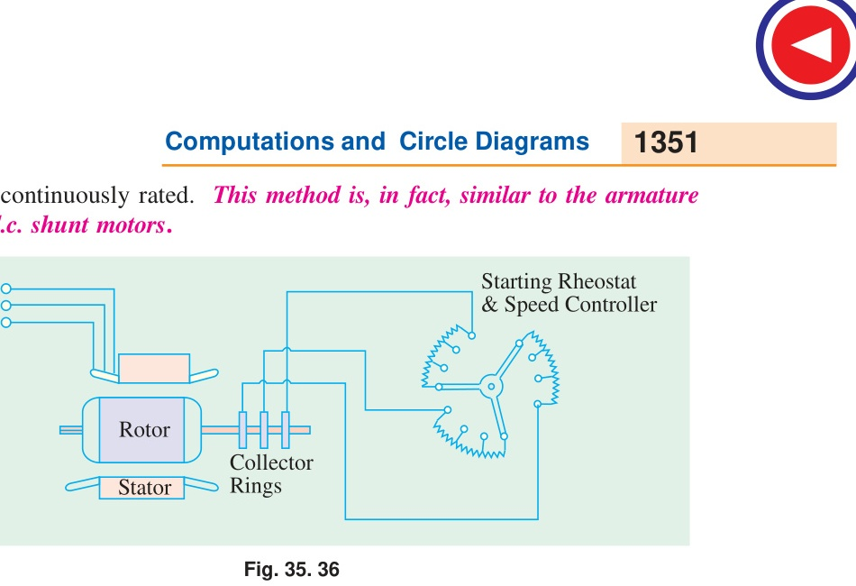
*Fig. 35.36: Rotor rheostat speed control for slip-ring induction motor.*

**Disadvantages of Rotor Rheostat Control:**
1. **Low Efficiency:** The large electrical energy represented by slip power ($s \times P_2$) is entirely dissipated as heat ($I_2^2 R$) in the external rheostat. At half-speed ($s = 0.5$), 50% of the rotor input power is wasted.
2. **Poor Speed Regulation:** The operating speed drops sharply with load. If load torque decreases, the motor speeds up towards synchronous speed.
3. **Sub-synchronous Speeds Only:** Speeds can only be decreased below synchronous speed, never above.

---

<!-- Page 39 (Book p. 1351) -->

#### Example 35.29
*The rotor of a 4-pole, 50-Hz slip-ring induction motor has a resistance of $0.30\ \Omega$ per phase and runs at $1440\text{ r.p.m.}$ at full load. Calculate the external resistance per phase which must be added to lower the speed to $1296\text{ r.p.m.}$, the torque being the same as before.*

**Solution:**
$$N_s = \frac{120 \times 50}{4} = 1500\text{ r.p.m.}$$
$$\text{Full-load slip } s_1 = \frac{1500 - 1440}{1500} = \frac{60}{1500} = 0.04$$
$$\text{Lowered speed } N_2 = 1296\text{ r.p.m.}$$
$$\text{New slip } s_2 = \frac{1500 - 1296}{1500} = \frac{204}{1500} = 0.136$$

Since torque remains constant:
$$\frac{s_1}{R_2} = \frac{s_2}{R_2 + R_{\text{ext}}}$$
$$\frac{0.04}{0.30} = \frac{0.136}{0.30 + R_{\text{ext}}}$$
$$0.30 + R_{\text{ext}} = \frac{0.136 \times 0.30}{0.04} = 1.02\ \Omega$$
$$\mathbf{R_{\text{ext}} = 1.02 - 0.30 = 0.72\ \Omega\text{ per phase}}$$

---

#### Example 35.30
*A certain 3-phase, 6-pole, 50-Hz induction motor when fully-loaded, runs with a slip of 5%. The rotor resistance per phase is $0.4\ \Omega$. Determine the resistance per phase to be added to the rotor circuit to reduce the speed to $850\text{ r.p.m.}$ when:*
*(a) the torque remains constant*
*(b) the torque varies as the square of the speed.*

**Solution:**
$$N_s = \frac{120 \times 50}{6} = 1000\text{ r.p.m.}$$
$$N_1 = 1000(1 - 0.05) = 950\text{ r.p.m.} ; \qquad s_1 = 0.05$$
$$\text{New speed } N_2 = 850\text{ r.p.m.} \implies s_2 = \frac{1000 - 850}{1000} = 0.15$$

**(a) When torque remains constant ($T_1 = T_2$):**
$$\frac{s_1}{R_2} = \frac{s_2}{R_2 + R_{\text{ext}}} \implies \frac{0.05}{0.4} = \frac{0.15}{0.4 + R_{\text{ext}}}$$
$$0.4 + R_{\text{ext}} = \frac{0.15 \times 0.4}{0.05} = 1.2\ \Omega$$
$$\mathbf{R_{\text{ext}} = 1.2 - 0.4 = 0.8\ \Omega\text{ per phase}}$$

**(b) When torque varies as the square of the speed ($T \propto N^2$):**
$$\frac{T_2}{T_1} = \left(\frac{N_2}{N_1}\right)^2 = \left(\frac{850}{950}\right)^2 = (0.8947)^2 = 0.80$$
Now, $T \propto \frac{s}{R_t}$:
$$\frac{T_2}{T_1} = \frac{s_2}{s_1} \times \frac{R_2}{R_t} \implies 0.80 = \frac{0.15}{0.05} \times \frac{0.4}{R_t} = 3 \times \frac{0.4}{R_t} = \frac{1.2}{R_t}$$
$$R_t = \frac{1.2}{0.80} = 1.5\ \Omega$$
$$\mathbf{R_{\text{ext}} = R_t - R_2 = 1.5 - 0.4 = 1.1\ \Omega\text{ per phase}}$$

---

<!-- Page 40 (Book p. 1352) -->

#### (e) Cascade or Concatenation or Tandem Operation

In this method, two motors $A$ and $B$ are mechanically coupled to the same shaft (or geared together). Motor $A$ must be a slip-ring motor, while Motor $B$ may be either a slip-ring or squirrel-cage motor.

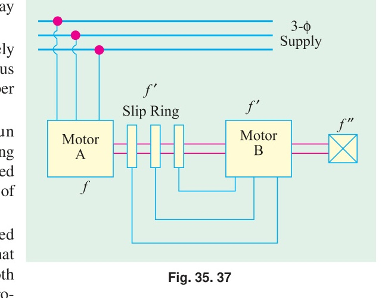
*Fig. 35.37: Cascade or concatenation operation of two induction motors.*

- The stator of Motor $A$ is connected to the primary 3-phase supply of frequency $f$.
- The rotor of Motor $A$ produces slip-frequency voltage $f' = s_a f$ at its slip-rings, which is fed directly to the stator of Motor $B$.
- The secondary of Motor $B$ is connected to a starting rheostat during starting and is short-circuited during running.

Let:
- $P_a$ = number of poles of Motor $A$
- $P_b$ = number of poles of Motor $B$
- $f$ = supply frequency
- $N_{sc}$ = synchronous speed of the cascaded set
- $N$ = actual operating speed of the set
- $s_a = \frac{N_{sa} - N}{N_{sa}}$ = slip of Motor $A$
- $s_b = \frac{N' - N}{N'}$ = slip of Motor $B$

Four distinct operating speeds can be obtained from the combination:

1. **Motor $A$ alone:** (Motor $B$ disconnected)
   $$N_{sa} = \frac{120 f}{P_a}$$
2. **Motor $B$ alone:** (Motor $A$ disconnected, stator of $B$ fed from line $f$)
   $$N_{sb} = \frac{120 f}{P_b}$$

<!-- Page 41 (Book p. 1353) -->

3. **Cumulative Cascade (Concatenation):**
   When the stator field of Motor $B$ is arranged to rotate in the **same direction** as that of Motor $A$:
   $$\text{Synchronous speed of Motor } A: \quad N_{sa} = \frac{120 f}{P_a}$$
   $$\text{Frequency of rotor output of Motor } A: \quad f' = s_a f$$
   $$\text{Synchronous speed of Motor } B: \quad N' = \frac{120 f'}{P_b} = \frac{120 s_a f}{P_b}$$

   Since both rotors are rigidly mounted on the same shaft, neglecting slip under no-load gives $N = N_{sa}(1 - s_a) = N'$:
   $$(1 - s_a) \frac{120 f}{P_a} = s_a \frac{120 f}{P_b} \implies \frac{1 - s_a}{P_a} = \frac{s_a}{P_b} \implies P_b(1 - s_a) = P_a s_a$$
   $$s_a = \frac{P_b}{P_a + P_b}$$
   Substituting $s_a$ into the speed expression:
   $$N_{sc} = (1 - s_a) N_{sa} = \left(1 - \frac{P_b}{P_a + P_b}\right) \frac{120 f}{P_a} = \frac{P_a}{P_a + P_b} \times \frac{120 f}{P_a}$$
   $$\mathbf{N_{sc} = \frac{120 f}{P_a + P_b}}$$

   **Important Conclusions for Cumulative Cascade:**
   - **Mechanical Power Division:** The mechanical power developed by the two machines is divided in direct proportion to their number of poles:
     $$\frac{\text{Mechanical Output of Motor } A}{\text{Mechanical Output of Motor } B} = \frac{P_a}{P_b}$$
   - **Secondary Frequency:** $f'' = s \cdot f$ where $s$ is the overall slip of the set.
   - **Combined Slip:** $s = s_a \cdot s_b$.

4. **Differential Cascade:**
   When the phase rotation of the stator field of Motor $B$ is reversed (by interchanging any two leads connecting the rotor of $A$ to the stator of $B$), its torque opposes the rotation initially:
   $$\mathbf{N_{sc} = \frac{120 f}{P_a - P_b}}$$
   *Note:* The differentially-cascaded set has very little or zero starting torque, so this connection is rarely used. Furthermore, if $P_a = P_b$, the synchronous speed would be infinite, which is physically meaningless.

---

<!-- Page 42 (Book p. 1354) -->

#### Example 35.31
*Two 50-Hz, 3-$\phi$ induction motors having six and four poles respectively are cumulatively cascaded, the 6-pole motor being connected to the main supply. Determine the frequencies of the rotor currents and the slips referred to each stator field if the set has a slip of 2 per cent.*
*(Elect. Machinery-II, Madras Univ. 1987)*

**Solution:**
Here, $P_a = 6, P_b = 4, f = 50\text{ Hz}, s = 0.02$.
$$\text{Synchronous speed of set: } N_{sc} = \frac{120 \times 50}{6 + 4} = \frac{6000}{10} = \mathbf{600\text{ r.p.m.}}$$
$$\text{Actual shaft speed: } N = (1 - s) N_{sc} = (1 - 0.02) \times 600 = \mathbf{588\text{ r.p.m.}}$$

For Motor $A$ (6 poles):
$$N_{sa} = \frac{120 \times 50}{6} = 1000\text{ r.p.m.}$$
$$s_a = \frac{N_{sa} - N}{N_{sa}} = \frac{1000 - 588}{1000} = \mathbf{0.412 = 41.2\%}$$
$$\text{Frequency of rotor currents of Motor } A: \quad f' = s_a f = 0.412 \times 50 = \mathbf{20.6\text{ Hz}}$$

For Motor $B$ (4 poles):
This rotor frequency $f' = 20.6\text{ Hz}$ feeds the stator of Motor $B$.
$$N' = \frac{120 \times f'}{P_b} = \frac{120 \times 20.6}{4} = \mathbf{618\text{ r.p.m.}}$$
$$s_b = \frac{N' - N}{N'} = \frac{618 - 588}{618} = \frac{30}{618} = \mathbf{0.0485 = 4.85\%}$$
$$\text{Frequency of rotor currents of Motor } B: \quad f'' = s_b f' = 0.0485 \times 20.6 = \mathbf{1.0\text{ Hz (approx.)}}$$

*Check:* $f'' = s \cdot f = 0.02 \times 50 = 1.0\text{ Hz}$.

---

#### Example 35.32
*A 4-pole induction motor and a 6-pole induction motor are connected in cumulative cascade. The frequency in the secondary circuit of the 6-pole motor is observed to be $1.0\text{ Hz}$. Determine the slip in each machine and the combined speed of the set. Take supply frequency as $50\text{ Hz}$.*
*(Electrical Machinery-II, Madras Univ. 1986)*

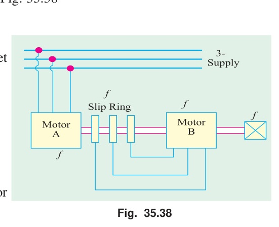
*Fig. 35.38: Cascade connection of Motor A (4-pole) and Motor B (6-pole).*

**Solution:**
Refer to Fig. 35.38. Motor $A$ has $P_a = 4$, Motor $B$ has $P_b = 6$.
$$N_{sc} = \frac{120 \times 50}{4 + 6} = \mathbf{600\text{ r.p.m.}}$$
$$\text{Combined slip } s = \frac{f''}{f} = \frac{1.0}{50} = \mathbf{0.02}$$
$$\text{Actual speed of set } N = (1 - s) N_{sc} = (1 - 0.02) \times 600 = \mathbf{588\text{ r.p.m.}}$$

For Motor $A$:
$$N_{sa} = \frac{120 \times 50}{4} = 1500\text{ r.p.m.}$$
$$s_a = \frac{1500 - 588}{1500} = \mathbf{0.608 = 60.8\%}$$
$$f' = s_a f = 0.608 \times 50 = 30.4\text{ Hz}$$

For Motor $B$:
$$N' = \frac{120 \times 30.4}{6} = 608\text{ r.p.m.}$$
$$s_b = \frac{608 - 588}{608} = \mathbf{0.033 = 3.3\%}$$

---

#### Example 35.33
*The stator of a 6-pole motor is joined to a 50-Hz supply and the machine is mechanically coupled and joined in cascade with a 4-pole motor. Neglecting all losses, determine the speed and output of the 4-pole motor when the total load on the combination is $74.6\text{ kW}$.*

**Solution:**
As losses are neglected, actual speed $N = N_{sc}$:
$$N_{sc} = \frac{120 \times 50}{6 + 4} = \mathbf{600\text{ r.p.m.}}$$
Mechanical outputs are in the ratio of the number of poles:
$$\text{Output of 4-pole motor} = 74.6 \times \frac{4}{6 + 4} = 74.6 \times 0.4 = \mathbf{29.84\text{ kW}}$$

---

<!-- Page 43 (Book p. 1355) -->

#### Example 35.34
*A cascaded set consists of two motors A and B with 4 poles and 6 poles respectively. The motor A is connected to a 50-Hz supply. Find:*
*(i) the speed of the set*
*(ii) the electric power transferred to motor B when the input to motor A is $25\text{ kW}$. Neglect losses.*
*(Electric Machines-I, Utkal Univ. 1990)*

**Solution:**
(Assuming cumulative cascade):
**(i) Synchronous speed:**
$$N_{sc} = \frac{120 f}{P_a + P_b} = \frac{120 \times 50}{4 + 6} = \mathbf{600\text{ r.p.m.}}$$

**(ii) Power transferred to Motor B:**
The mechanical outputs of the two motors are proportional to their number of poles:
$$\text{Output of Motor } B = 25 \times \frac{6}{4 + 6} = \mathbf{10\text{ kW}}$$
*(or electric power transferred from rotor $A$ to stator $B = 25 \times \frac{4}{10} = 10\text{ kW}$ depending on pole designation).*

---

#### (f) Injecting an E.M.F. in the Rotor Circuit

In this method, speed is controlled by injecting an external voltage into the rotor circuit. To interact smoothly with the induced secondary voltage, the injected voltage **must have the exact same frequency as the slip frequency** ($s f$).

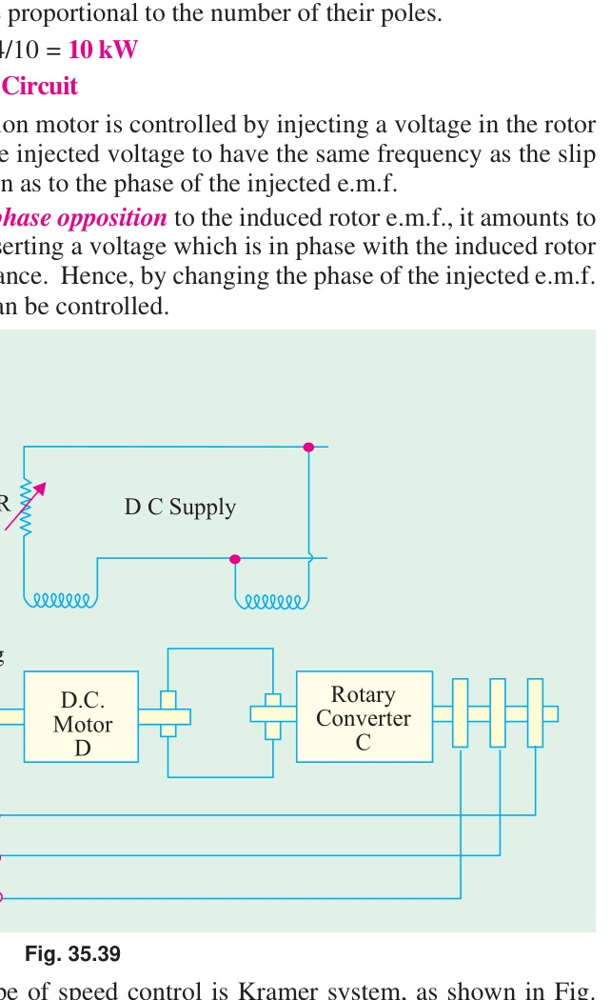
*Fig. 35.39: Kramer system for speed control and power factor improvement of large induction motors.*

- **Phase Opposition:** Injecting a voltage in phase opposition to the rotor induced e.m.f. effectively increases rotor circuit resistance, causing the motor to **slow down**.
- **Phase Assisting:** Injecting a voltage in phase with the rotor induced e.m.f. effectively decreases rotor resistance, allowing the motor to **speed up**.
- **Quadrature Component:** Injecting a voltage with a component leading the rotor e.m.f. by $90^\circ$ improves the **power factor** of the motor.

##### 1. Kramer System (Fig. 35.39)
Used for large induction motors of $4000\text{ kW}$ or higher rating.
- The slip-frequency a.c. power from the slip-rings of main induction motor $M$ is fed to a **rotary converter** $C$, which converts it into direct current (d.c.).
- This d.c. power drives a **d.c. shunt motor** $D$, which is mechanically coupled to the shaft of main motor $M$.
- Both $C$ and $D$ are separately excited from a d.c. exciter.
- By adjusting the field rheostat of d.c. motor $D$, its back e.m.f. $E_b$ is varied, which adjusts the d.c. voltage of $C$ and therefore the slip-ring voltage of $M$, giving **smooth, continuous, stepless speed control**.
- Furthermore, by over-exciting rotary converter $C$, it draws a leading current that neutralizes the lagging reactive current of motor $M$, raising the **system power factor to near unity**.

---

<!-- Page 44 (Book p. 1356) -->

##### 2. Scherbius System (Fig. 35.40)
In this system, slip energy is not converted into d.c.; instead, it is fed directly into a specialized 3-phase a.c. commutator motor called a **Scherbius machine** $C$.

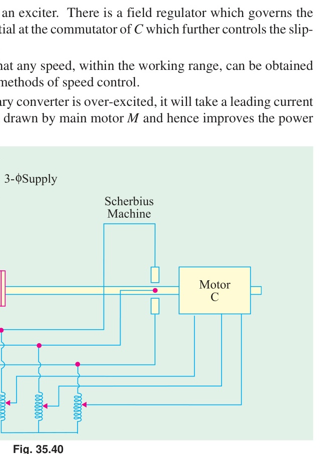
*Fig. 35.40: Scherbius system for speed control of large induction motors.*

- The slip-rings of main motor $M$ supply the polyphase winding of machine $C$ through a **regulating transformer** $RT$.
- Motor $C$ is a variable-speed machine mechanically coupled to an auxiliary induction generator (which pumps slip power back into the a.c. mains) or to the main motor shaft.
- Speed is smoothly controlled by changing the tappings on regulating transformer $RT$ or by adjusting brush positions on $C$.

---

## Tutorial Problems 35.5

1. An induction motor has a double-cage rotor with equivalent impedances at standstill of $(1.0 + j 1.0)$ and $(0.2 + j 4.0)\ \Omega$. Find the relative values of torque given by each cage:
   (a) at starting, and
   (b) at 5% slip.
   $$\mathbf{[(a)\ 40:1 \quad (b)\ 0.4:1]}$$
   *(Adv. Elect. Machines AMIE Sec. B 1991)*

2. The cages of a double-cage induction motor have standstill impedances of $(3.5 + j 1.5)\ \Omega$ and $(0.6 + j 7.0)\ \Omega$ respectively. The full-load slip is 6%. Find the starting torque at normal voltage in terms of full-load torque. Neglect stator impedance and magnetizing current.
   $$\mathbf{[300\%]}$$
   *(Elect. Machines-I, Nagpur Univ. 1993)*

3. The rotor of a 4-pole, 50-Hz, slip-ring induction motor has a resistance of $0.25\ \Omega$ per phase and runs at $1440\text{ r.p.m.}$ at full-load. Calculate the external resistance per phase which must be added to lower the speed to $1200\text{ r.p.m.}$, the torque being the same as before.
   $$\mathbf{[1\ \Omega]}$$
   *(Utilisation of Electric Power (E-8) AMIE Sec. B Summer 1992)*

---

<!-- Page 45 (Book p. 1357) -->

## 35.19. Three-Phase A.C. Commutator Motors

A.C. commutator motors possess the high starting torque and flexible speed characteristics of d.c. motors combined with the convenience of an a.c. supply. They are classified into:
1. **Series Motors:** Single-phase and 3-phase series commutator motors.
2. **Shunt Motors:** Rotor-fed or stator-fed shunt commutator motors with brush-shifting devices, of which the **Schrage motor** is the most celebrated example.

---

## 35.20. Schrage Motor\*

The **Schrage motor** is a rotor-fed, shunt-type, brush-shifting, 3-phase commutator induction motor that incorporates a built-in arrangement for both wide-range speed control and power factor improvement. In effect, it is an induction motor with an integrated slip regulator.

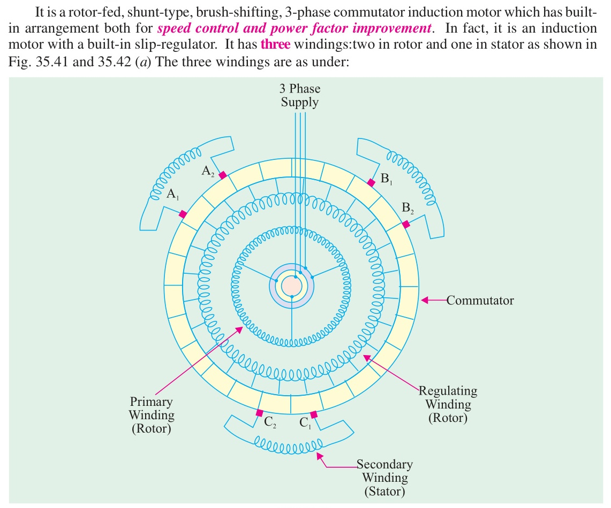
*Fig. 35.41: Schematic winding connection of a 3-phase Schrage motor.*

### Motor Windings
The motor has three distinct windings (two in the rotor, one in the stator):
1. **Primary Winding (Rotor):**
   - Located in the **lower part of the rotor slots**.
   - Supplied from the 3-phase supply mains through three slip-rings and brushes at line frequency $f$.
   - Produces the main revolving magnetic field in the air gap rotating at synchronous speed $N_s$ relative to the rotor.
2. **Regulating (Tertiary) Winding (Rotor):**
   - Located in the **upper part of the same rotor slots**.
   - Connected to a standard commutator on the shaft.
   - Being in the same slots as the primary, it acts as the secondary of a transformer and has voltage induced in it by transformer action.
3. **Secondary Winding (Stator):**
   - Housed in the **stator slots**.
   - Each phase is electrically isolated from the others.
   - The ends of each stator phase winding are brought out and connected across a pair of brushes ($A_1-A_2$, $B_1-B_2$, $C_1-C_2$) resting on the commutator.

---

<!-- Page 46 (Book p. 1358) -->

### Principle of Operation

The brushes are mounted on two separate brush rockers designed to be geared to a handwheel (via a rack and pinion) such that turning the wheel causes the two sets of brushes to move **in opposite directions** relative to each stator phase axis.
- Brushes $A_1, B_1, C_1$ are mounted on one rocker and spaced $120^\circ$ electrical apart.
- Brushes $A_2, B_2, C_2$ are mounted on the second rocker and also spaced $120^\circ$ electrical apart.

The commutator acts as a **frequency converter**: although the voltage induced in the regulating winding is at line frequency $f$, the commutator delivers voltage at the brush contacts at **slip frequency** ($s f$), regardless of the motor speed! This matches the induced frequency in the stator secondary winding, permitting direct voltage injection.

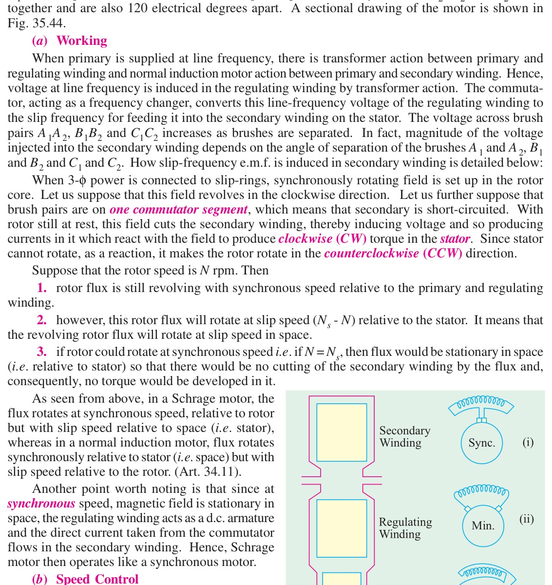
*Fig. 35.42: Relative brush positions and injected voltages: (i) Synchronous speed, (ii) Sub-synchronous speed, (iii) Super-synchronous speed.*

### Speed Control (Fig. 35.42)
1. **Synchronous Speed ($s = 0$):**
   When brush pairs $A_1$ and $A_2$ are moved onto the **same commutator segment** [Fig. 35.42 (b)(i)], the secondary stator winding is short-circuited. No voltage is injected ($E_j = 0$). The machine operates as an *inverted plain induction motor* running with a small normal slip near synchronous speed.
2. **Sub-synchronous Speeds ($s > 0$):**
   When the brushes are parted in one direction [Fig. 35.42 (b)(ii)], the voltage $E_j$ tapped from the commutator is injected into the stator winding in **phase opposition** to the stator induced voltage. The net secondary voltage is reduced, causing the motor to slow down.
3. **Super-synchronous Speeds ($s < 0$):**
   When the brushes are parted in the opposite direction [Fig. 35.42 (b)(iii)], the polarity of the injected voltage $E_j$ reverses. It now **assists** the stator induced voltage, driving secondary current and speeding the motor up above synchronous speed.

The no-load speed is approximately given by:
$$N \cong N_s (1 - K \sin 0.5\beta)$$
where $\beta$ is the brush separation in electrical degrees and $K$ is a design constant.

Schrage motors achieve smooth speed variation over a wide range (typically $3:1$ or even up to twice synchronous speed) with shunt-type characteristics (speed drops very little under load).

---

<!-- Page 47 (Book p. 1359) -->

### Power Factor Improvement (Fig. 35.43)

Power factor control is achieved by shifting the brush rockers **asymmetrically** (one brush rocker moved faster than the other or shifted bodily).

*Fig. 35.43: Phase diagram showing injected quadrature voltage component leading the induced e.m.f., improving power factor.*

When the brushes are shifted bodily, the injected voltage $E_j$ is given a **quadrature phase displacement** relative to the induced e.m.f. This injects a leading component of current into the stator secondary winding, neutralizing the magnetizing lagging current drawn from the supply. As a result:
- The power factor of the motor can be raised to **unity** or made **leading** across its normal operating range!

---

### Sectional Construction (Fig. 35.44)

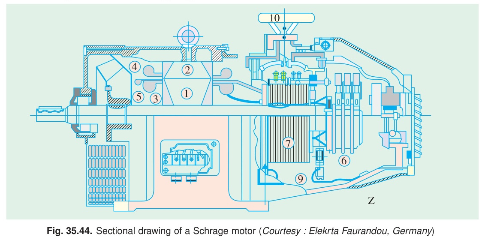
*Fig. 35.44: Cross-sectional construction of a commercial Schrage motor (Courtesy: Elektra Faurandou, Germany).*

<!-- Page 48 (Book p. 1360) -->

**Key Parts Labelled in Fig. 35.44:**
1. Rotor laminations
2. Stator laminations
3. Primary winding (rotor bottom)
4. Secondary winding (stator)
5. Regulating winding (rotor top)
6. Slip-ring unit
7. Commutator
8. Cable feed for outer brush yoke
9. Cable feed for inner brush yoke
10. Hand wheel for brush adjustment

#### Starting and Characteristics
Schrage motors are started with the brushes set to the **lowest speed position** using direct-on-line contactor starters. In this position, the motor develops high starting torque with low starting current. Electrical interlocks ensure the contactor cannot close if brushes are in any other position. Operating voltage is typically limited to $\le 700\text{ V}$ due to slip-rings. Common ratings range up to $40\text{ kW}$ on $220\text{ V}, 440\text{ V}$, or $550\text{ V}$ supplies.

---

## 35.21. Motor Enclosures

To protect the internal windings and bearings from environmental hazards, diverse enclosure types are standardized:

  

    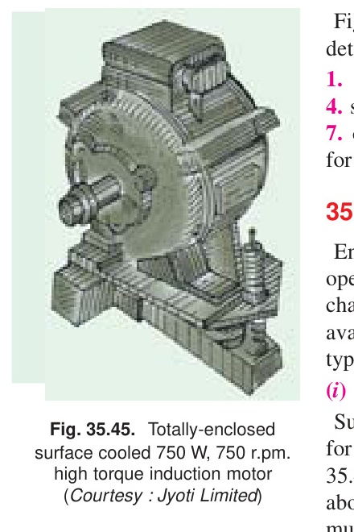
     <em>Fig. 35.45: Totally-enclosed surface-cooled induction motor (Courtesy: Jyoti Limited).</em>
  

  

    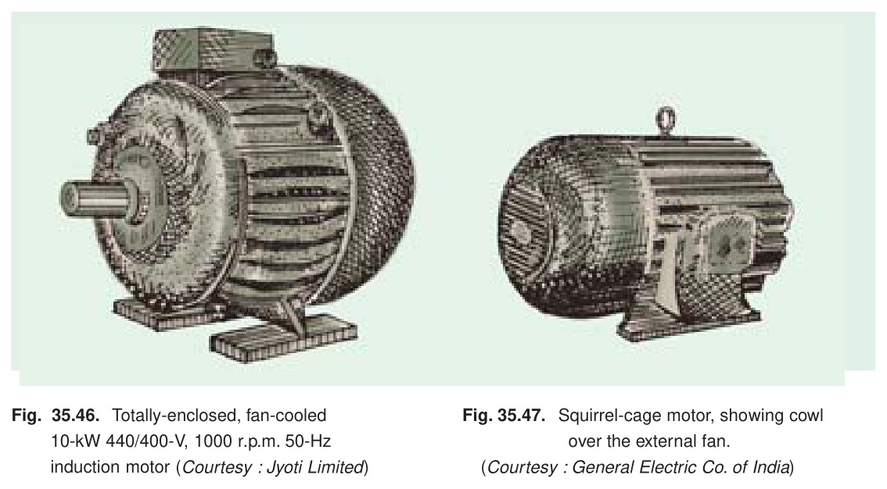
     <em>Fig. 35.46 & 35.47: Totally-enclosed fan-cooled (TEFC) motor and fan cowl (Courtesy: Jyoti Limited / GEC).</em>
  

1. **Open Type:**
   End shields and frame have large ventilation openings with no special protection. Air passes freely over windings. Used only in clean, dry indoor locations.
2. **Totally-Enclosed Non-Ventilated (TENV) (Fig. 35.45):**
   Has solid frames and end shields with zero openings. Heat is dissipated solely by radiation and surface convection. Seldom built in ratings above $2\text{ to }3\text{ kW}$ due to thermal limitations.
3. **Totally-Enclosed Fan-Cooled (TEFC) (Fig. 35.46):**
   Cooling air is driven by an external fan mounted on the motor shaft under a protective cowl. The fan blows air across exterior ribs of the enclosing shell, providing excellent cooling without admitting dust, fumes, or moisture. Widely used in industry.
4. **Cowl-Covered Motor (Fig. 35.47):**
   A robust, streamlined fan cowl directs cooling air smoothly across the frame without internal passages that could clog. Ideal for cement mills, chemical plants, quarries, and gas works.

---

<!-- Page 49 (Book p. 1361) -->

  

    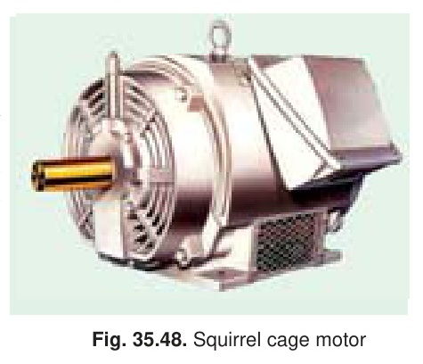
     <em>Fig. 35.48: Protected squirrel-cage motor.</em>
  

  

    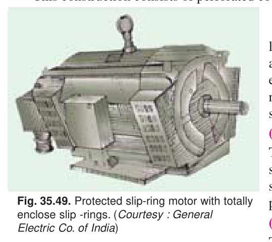
     <em>Fig. 35.49: Protected slip-ring motor with enclosed rings (Courtesy: GEC).</em>
  

  

    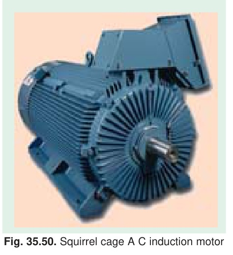
     <em>Fig. 35.50: Splash-proof squirrel-cage motor.</em>
  

5. **Protected Type (Fig. 35.48, Fig. 35.49):**
   Perforated metal mesh covers ventilating apertures to prevent accidental finger contact or entry of objects $> 12\text{ mm}$.
6. **Drip-Proof Type (Fig. 35.51):**
   Ventilation openings prevent falling drops of liquid or dirt entering at angles greater than $15^\circ$ from the vertical.
7. **Splash-Proof Type (Fig. 35.50):**
   Openings prevent liquid drops entering at angles up to $100^\circ$ from the vertical (e.g., splashing from floor or washing hose).
8. **Pipe-Ventilated Type:**
   Closed shields provided with pipe ducts connected to clean exterior air sources. Motor fan draws air through ducts.
9. **Separately (Forced) Ventilated Type:**
   Ventilation air is driven through pipes by an independent external blower.
10. **Flame-Proof / Explosion-Proof Type:**
    Heavy-duty robust cast iron casings designed to withstand an internal gas explosion without igniting flammable ambient atmospheres (coal mines, petrochemical refineries).

---

<!-- Page 50 (Book p. 1362) -->

## 35.22. Standard Types of Squirrel-Cage Motors

Squirrel-cage induction motors are standardized by NEMA into six distinct design classes (A, B, C, D, E, F) based on starting torque, starting current, and operating slip.

  

    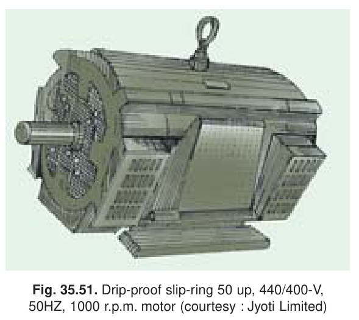
     <em>Fig. 35.51: Drip-proof slip-ring induction motor, 50 hp, 1000 r.p.m. (Courtesy: Jyoti Limited).</em>
  

  

    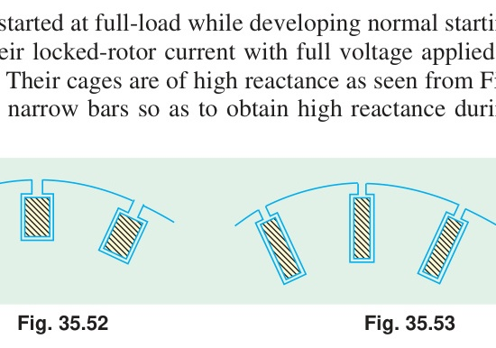
     <em>Fig. 35.52: Class A shallow slot. Fig. 35.53: Class B deep-bar slot.</em>
  

---

### 35.23. Class A Motors
- **Characteristics:** Normal starting torque, normal starting current, normal slip ($< 5\%$).
- **Starting Current:** $> 6 \times I_{\text{FL}}$ at full voltage.
- **Starting Torque:** $\approx 1.5 - 2.0 \times T_{\text{FL}}$ for smaller sizes; $\approx 1.1 \times T_{\text{FL}}$ for larger sizes.
- **Rotor Slot Construction (Fig. 35.52):** Employs shallow, wide copper/aluminium bars placed close to the rotor surface. Low rotor resistance and low leakage reactance.
- **Applications:** Fans, blowers, centrifugal pumps, machine tools, and conveyors started infrequently with low inertia.

---

### 35.24. Class B Motors
- **Characteristics:** Normal starting torque, **low starting current**, normal slip ($< 5\%$).
- **Starting Current:** $5.0 - 5.5 \times I_{\text{FL}}$ at full voltage.
- **Starting Torque:** Normal ($\approx 1.5 \times T_{\text{FL}}$). Suitable for direct-on-line starting.
- **Rotor Slot Construction (Fig. 35.53):** Uses **deep and narrow bars**. At starting ($50\text{ Hz}$ rotor frequency), skin effect forces rotor current into the top portion of the bar, drastically increasing effective resistance and providing high leakage reactance to limit starting current. At rated speed ($1-2\text{ Hz}$), current distributes uniformly, restoring low resistance and high running efficiency.
- **Applications:** General industrial workhorse: large fans, machine tools, centrifugal pumps, compressors, and motor-generator sets.

---

### 35.25. Class C Motors
- **Characteristics:** **High starting torque**, low starting current, normal slip ($< 5\%$).
- **Starting Current:** $5.0 - 5.5 \times I_{\text{FL}}$.
- **Starting Torque:** High ($\approx 2.0 - 2.75 \times T_{\text{FL}}$).
- **Rotor Slot Construction (Fig. 35.54):** Built with **double squirrel-cage rotors** (high-resistance outer cage, low-resistance high-reactance inner cage).
- **Applications:** High-inertia and hard-starting loads: crushers, plunger pumps, compressors, large commercial refrigerators, boring mills, textile machinery, and reciprocating conveyors.

---

<!-- Page 51 (Book p. 1363) -->

  

    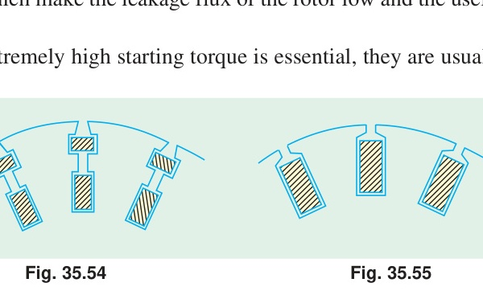
     <em>Fig. 35.54: Class C double-cage slot. Fig. 35.55: Class D high-resistance slot.</em>
  

  

    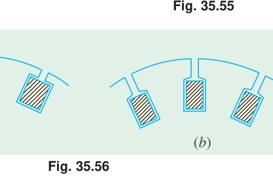
     <em>Fig. 35.56: Rotor slot structures for Class E (a) and Class F (b) motors.</em>
  

---

### 35.26. Class D Motors
- **Characteristics:** **Extremely high starting torque**, low starting current, **high slip ($5\% - 20\%$)**.
- **Starting Torque:** $2.75 - 3.0 \times T_{\text{FL}}$.
- **Rotor Slot Construction (Fig. 35.55):** Single cage with thin rotor bars made of high-resistivity brass or alloy. High resistance gives peak torque at or near standstill ($s \approx 1$).
- **Applications:** High-inertia intermittent duty loads subjected to severe cyclic shock loading: punch presses, shearing machines, stamping presses, bulldozers, hoists, elevators, and laundry extractors. Often coupled with heavy flywheels.

---

### 35.27. Class E Motors
- **Characteristics:** Low starting torque, normal starting current, very low slip.
- **Features:** For ratings $> 5\text{ kW}$, high starting current requires a star-delta starter or auto-transformer compensator.
- **Rotor Slot Construction (Fig. 35.56a):** Standard shallow slots optimized for maximum full-load operating efficiency.

---

### 35.28. Class F Motors
- **Characteristics:** Low starting torque ($\approx 1.25 \times T_{\text{FL}}$), **low starting current**, normal slip.
- **Rotor Slot Construction (Fig. 35.56b):** Rotor designed with very high leakage reactance during starting to safely allow direct full-voltage line starting without drawing excessive line current.

---

### Summary Comparison Table of NEMA Motor Classes

| Class | Starting Torque (% FLT) | Starting Current (% FLC) | Slip (%) | Typical Rotor Construction | Typical Applications |
| :--- | :--- | :--- | :--- | :--- | :--- |
| **Class A** | Normal (150–200%) | Normal (600–800%) | Low (< 5%) | Shallow bars, low $R$, low $X$ | Fans, blowers, centrifugal pumps |
| **Class B** | Normal (150%) | Low (500–550%) | Low (< 5%) | Deep-bar, high starting $X$ | General industrial workhorse, machine tools |
| **Class C** | High (200–275%) | Low (500–550%) | Normal (< 5%) | Double squirrel-cage | Crushers, compressors, conveyors |
| **Class D** | Very High (275–300%) | Low (500%) | High (5–20%) | High-resistance brass/alloy bars | Punch presses, shears, hoists, flywheels |
| **Class E** | Low (100–120%) | Normal (600–700%) | Very Low (< 3%) | Optimized low-loss cage | Continuous steady-load pumps, high efficiency |
| **Class F** | Low (125%) | Very Low (400–500%) | Normal (< 5%) | High leakage reactance bars | Low-torque direct-on-line drives |

---

[<< 03. Crawling, Cogging, and Double Squirrel-Cage Motors](03_Crawling_Cogging_and_Double_Cage_Motors.md) | [Master Index](00_Index_and_Topic_Map.md) | [05. Questions and Answers on Induction Motors >>](05_Questions_and_Answers_on_Induction_Motors.md)
