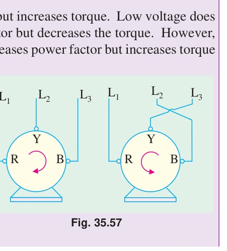
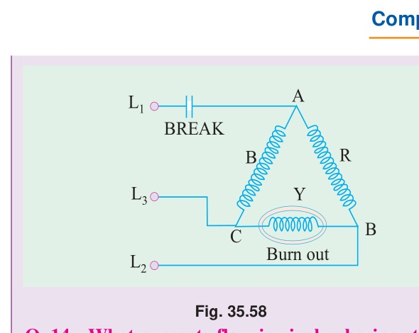
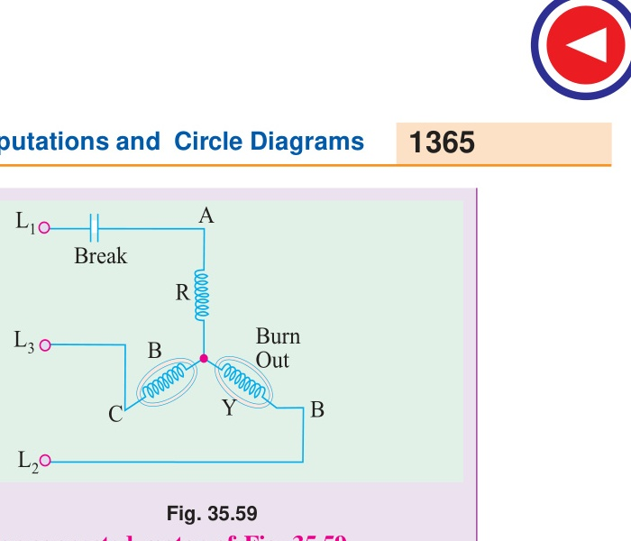

# Chapter 35: Induction Motor — Computations and Circle Diagrams

[<< 04. Speed Control, Commutator Motors, and Types](04_Speed_Control_Commutator_Motors_and_Types.md) | [Master Index](00_Index_and_Topic_Map.md)

---

<!-- Page 51 (Book p. 1363) -->

## Questions and Answers on Three-Phase Induction Motors

### Q. 1. How do changes in supply voltage and frequency affect the performance of an induction motor?
**Ans.**
- **Supply Voltage:**
  - **High Voltage:** Decreases both power factor and slip, but increases torque (since torque $T \propto V^2$).
  - **Low Voltage:** Decreases torque and increases slip and full-load current (leading to overheating), but slightly increases power factor.
- **Supply Frequency:**
  - **Increase in Frequency:** Increases power factor and synchronous speed, but decreases torque. Per cent slip remains practically unchanged.
  - **Decrease in Frequency:** Decreases power factor and synchronous speed, but increases torque, leaving per cent slip unaffected as before.

---

### Q. 2. What is, in brief, the basis of operation of a 3-phase induction motor?
**Ans.**
The revolving magnetic field (RMF), which is produced when a balanced 3-phase stator winding is fed from a balanced 3-phase a.c. supply. This field rotates at synchronous speed $N_s = 120 f / P$, cutting the rotor conductors and inducing currents that interact with the field to generate driving torque in the direction of field rotation (Lenz's law).

---

### Q. 3. What factors determine the direction of rotation of the motor?
**Ans.**
1. The **phase sequence** of the 3-phase supply lines (e.g., $R-Y-B$).
2. The **order in which these line leads are connected** to the stator winding terminals ($U-V-W$).

---

<!-- Page 52 (Book p. 1364) -->

### Q. 4. How can the direction of rotation of the motor be reversed?
**Ans.**
By transposing or interchanging **any two of the three supply line leads** connected to the stator terminals, as shown in Fig. 35.57. This reverses the phase sequence of currents entering the stator windings, causing the rotating magnetic field to reverse its direction of rotation.

*Fig. 35.57: Reversing the direction of rotation of a 3-phase induction motor by swapping lines $L_1$ and $L_2$.*

---

### Q. 5. Why are induction motors called asynchronous?
**Ans.**
Because their rotors can **never run at the synchronous speed** of the revolving stator magnetic field. If the rotor ever reached synchronous speed, the relative velocity between the stator field and rotor conductors would become zero, inducing zero rotor e.m.f., zero rotor current, and hence zero torque.

---

### Q. 6. How does the slip vary with load?
**Ans.**
The greater the mechanical load on the motor, the greater is the required torque, and therefore the **greater is the slip** (i.e., the slower is the rotor operating speed).

---

### Q. 7. What modifications would be necessary if a motor is required to operate on a voltage different from that for which it was originally designed?
**Ans.**
The number of turns/conductors per slot will have to be changed in the same ratio as the change in voltage:
$$\frac{N_2}{N_1} = \frac{V_2}{V_1}$$
If the applied voltage is doubled, the number of conductors per slot will have to be doubled (and their wire cross-sectional area halved to fit the slot).

---

### Q. 8. Enumerate the possible reasons if a 3-phase motor fails to start.
**Ans.**
Any one of the following reasons could be responsible:
1. One or more line fuses may be blown (single-phasing at standstill).
2. Applied supply voltage may be too low.
3. The starting mechanical load may be excessively heavy.
4. Worn bearings due to which the rotor may be touching or rubbing against the stator core laminae, introducing excessive friction.
5. In squirrel-cage motors, **magnetic locking (cogging)** due to equality of stator and rotor slot numbers.
6. Open-circuit in rotor circuit (in slip-ring motors).

---

### Q. 9. A motor stops after starting i.e. it fails to carry load. What could be the causes?
**Ans.**
Any one of the following:
1. Hot bearings, which increase friction load progressively.
2. Excessive tension on drive belt, which causes bearing overheating and binding.
3. Failure or premature tripping of short-circuit or overload cutout switches.
4. Single-phasing occurring when switching to the 'run' position of the starter.

---

### Q. 10. Which is the usual cause of blow-outs in induction motors?
**Ans.**
The commonest and most frequent cause is **single-phasing**.

---

### Q. 11. What is meant by 'single-phasing' and what are its causes?
**Ans.**
By **single-phasing** is meant the accidental opening or disconnection of one wire (or leg) of a 3-phase circuit, whereupon the remaining circuit at once becomes single-phase.

When a 3-phase circuit functions normally, three balanced currents flow in the circuit, with any two wires acting as the return path for the third. An open-circuit in one line wire kills two phases; only one single-phase current loop remains active through the surviving two wires, and the remaining active windings attempt to carry the entire mechanical load.

The usual cause of single-phasing is a **blown running fuse**, loose terminal connection, broken contact in a switch/starter, or an open-circuited cable conductor.

---

### Q. 12. What happens if single-phasing occurs when the motor is running? And when it is stationary?
**Ans.**
1. **If already running:**
   - **Light Load ($\le 50\%$ load):** The motor will continue to run as a single-phase induction motor on the remaining two lines without stalling or blowing fuses, though with increased hum, slip, and temperature rise.
   - **Heavy Load ($> 50\%$ load):** The motor cannot develop sufficient single-phase breakdown torque to sustain the load; it slows down rapidly and **stalls**. Since it can neither restart nor develop rotation, the standstill current is very heavy, and a prompt **burn-out** occurs unless the motor is quickly disconnected by protective relays.
2. **If stationary:**
   - A stationary 3-phase motor produces **zero starting torque** when energized with one line open. It hums loudly, refuses to rotate, draws high locked-rotor current, and will burn out within seconds unless disconnected immediately.

---

### Q. 13. Which phase is likely to burn out in a single-phasing delta-connected motor shown in Fig. 35.58?
**Ans.**
Refer to Fig. 35.58:

*Fig. 35.58: Current distribution in a single-phasing delta-connected motor with Line $L_1$ broken.*

When line $L_1$ opens:
- Phase $Y$ is connected directly across the operative live lines $L_2$ and $L_3$. It carries nearly **three times its rated normal current** and is the phase **most likely to burn out**!
- The other two phases ($R$ and $B$) are in series with each other across lines $L_2$ and $L_3$, carrying slightly more than their full-load currents.

---

<!-- Page 53 (Book p. 1365) -->

### Q. 14. What currents flow in a single-phasing star-connected motor of Fig. 35.59?
**Ans.**
Refer to Fig. 35.59:

*Fig. 35.59: Current distribution in a single-phasing star-connected motor with Line $L_1$ broken.*

With line $L_1$ disabled:
- The phase connected to line $L_1$ carries zero current.
- The remaining two phases ($Y$ and $B$) are connected in series across lines $L_2$ and $L_3$.
- The currents flowing in lines $L_2$ and $L_3$ will be of the order of:
  - **$250\%$** of normal full-load current on full load.
  - **$160\%$** of normal full-load current on $3/4$ load.
  - **$100\%$** of normal full-load current on $1/2$ load.

---

### Q. 15. How can motors be protected against single-phasing?
**Ans.**
1. By incorporating a **combined thermal overload and single-phasing relay** in the starter (differential bimetallic type).
2. By incorporating an **electronic phase-failure relay** (voltage-sensing or current-sensing) in the control gear that trips the contactor instantly upon loss of any phase.

---

### Q. 16. Can a 3-phase motor be run on a single-phase line?
**Ans.**
Yes, it can be run on a single-phase supply, provided an appropriate **phase-splitter** (using capacitors/inductors) is connected to produce an auxiliary phase for starting.

---

### Q. 17. What is meant by a phase-splitter?
**Ans.**
It is an electrical network comprising capacitors (or combinations of capacitors and inductors) connected in the motor circuit so as to split a single-phase input voltage into three separate phase voltages displaced from one another, enabling a 3-phase motor to start and run from a single-phase source.

---

### Q. 18. What is the standard direction of rotation of an induction motor?
**Ans.**
**Counter-clockwise (CCW)**, when looking at the front end (i.e. the non-driving end) of the motor.

---

### Q. 19. Can a wound-rotor motor be reversed by transposing any two leads from the slip-rings?
**Ans.**
**No.** Transposing the rotor slip-ring leads does not change the direction of rotation, because the direction of rotation is governed entirely by the revolving field created by the stator. Reversal is achieved **only by transposing any two stator line leads**.

---

### Q. 20. What is jogging?
**Ans.**
**Jogging** (also called *inching*) means making the motor rotate slightly a little bit at a time by momentary, repeated pressing of a push-button to facilitate machine positioning, tool setup, or crane alignment.

---

### Q. 21. What is meant by plugging?
**Ans.**
**Plugging** means bringing an electric motor to an electric emergency stop by instantaneously transposing two stator supply leads while the motor is running, thereby applying reverse electric torque (braking torque). Power is cut off the instant the shaft reaches zero speed.

---

### Q. 22. What are the indications of winding faults in an induction motor?
**Ans.**
1. Excessive, abnormal, or unbalanced line currents.
2. Unusual growling or humming noises and mechanical vibrations.
3. Rapid localized or general overheating of the motor frame.

---

<!-- Page 54 (Book p. 1366) -->

## OBJECTIVE TESTS — 35

### 1. In the circle diagram for a 3-$\phi$ induction motor, the diameter of the circle is determined by:
(a) rotor current  
(b) exciting current  
(c) total stator current  
(d) rotor current referred to stator.  

### 2. Point out the WRONG statement. Blocked rotor test on a 3-$\phi$ induction motor helps to find:
(a) short-circuit current with normal voltage  
(b) short-circuit power factor  
(c) fixed losses  
(d) motor resistance as referred to stator.  

### 3. In the circle diagram of an induction motor, point of maximum input lies on the tangent drawn parallel to:
(a) output line  
(b) torque line  
(c) vertical axis  
(d) horizontal axis.  

### 4. An induction motor has a short-circuit current 7 times the full-load current and a full-load slip of 4 per cent. Its line-starting torque is ....... times the full-load torque.
(a) 7  
(b) 1.96  
(c) 4  
(d) 49  

> *Hint:* $\frac{T_{\text{st}}}{T_f} = \left(\frac{I_{\text{sc}}}{I_f}\right)^2 \times s_f = 7^2 \times 0.04 = 49 \times 0.04 = \mathbf{1.96}$.

### 5. In a SCIM, torque with autostarter is ....... times the torque with direct-switching.
(a) $K^2$  
(b) $K$  
(c) $1/K^2$  
(d) $1/K$  
*where $K$ is the transformation ratio of the autostarter.*

### 6. If stator voltage of a SCIM is reduced to 50 per cent of its rated value, torque developed is reduced by ....... per cent of its full-load value.
(a) 50  
(b) 25  
(c) 75  
(d) 57.7  

> *Hint:* $T \propto V^2$. If $V$ becomes $0.5 V$, torque becomes $(0.5)^2 = 0.25$ of initial value, meaning torque is reduced by $100\% - 25\% = \mathbf{75\%}$.

### 7. For the purpose of starting an induction motor, a Y-$\Delta$ switch is equivalent to an auto-starter of ratio ....... per cent.
(a) 33.3  
(b) 57.7  
(c) 73.2  
(d) 60  

> *Hint:* $K = 1/\sqrt{3} \approx \mathbf{57.7\%}$.

### 8. A double squirrel-cage motor (DSCM) scores over SCIM in the matter of:
(a) starting torque  
(b) high efficiency under running conditions  
(c) speed regulation under normal operating conditions  
(d) all of the above.  

### 9. In a DSCM, outer cage is made of high resistance metal bars primarily for the purpose of increasing its:
(a) speed regulation  
(b) starting torque  
(c) efficiency  
(d) starting current.  

### 10. A SCIM with 36-slot stator has two separate windings: one with 3 coil groups/phase/pole and the other with 2 coil groups/phase/pole. The obtainable two motor speeds would be in the ratio of:
(a) $3 : 2$  
(b) $2 : 3$  
(c) $2 : 1$  
(d) $1 : 2$  

### 11. A 6-pole 3-$\phi$ induction motor taking 25 kW from a 50-Hz supply is cumulatively-cascaded to a 4-pole motor. Neglecting all losses, speed of the 4-pole motor would be ....... r.p.m.:
(a) 1500  
(b) 1000  
(c) 600  
(d) 3000  
**and its output would be ....... kW:**  
(e) 15  
(f) 10  
(g) 50/3  
(h) 2.5  

> *Hint:* $N_{sc} = \frac{120 \times 50}{6 + 4} = \mathbf{600\text{ r.p.m.}}$ Output of 4-pole motor $= 25 \times \frac{4}{10} = \mathbf{10\text{ kW}}$.

### 12. Which class of induction motor will be well suited for large refrigerators?
(a) Class E  
(b) Class B  
(c) Class F  
(d) Class C  

### 13. In a Schrage motor operating at supersynchronous speed, the injected emf and the standstill secondary induced emf:
(a) are in phase with each other  
(b) are at 90º in time phase with each other  
(c) are in phase opposition  
(d) none of the above.  
*(Power App.-III, Delhi Univ. July 1987)*

### 14. For starting a Schrage motor, 3-$\phi$ supply is connected to:
(a) stator  
(b) rotor via slip-rings  
(c) regulating winding  
(d) secondary winding via brushes.  

### 15. Two separate induction motors, having 6 poles and 4 poles respectively and their cascade combination from 60 Hz, 3-phase supply can give the following synchronous speeds in rpm:
(a) 720, 1200, 1500 and 3600  
(b) 720, 1200, 1800  
(c) 600, 1000, 15000  
(d) 720 and 3000  
*(Power App.-II, Delhi Univ. Jan 1987)*

> *Hint:* Speeds are: $N_{sa} = \frac{120 \times 60}{6} = 1200$; $N_{sb} = \frac{120 \times 60}{4} = 1800$; $N_{\text{cum}} = \frac{120 \times 60}{6+4} = 720$; $N_{\text{diff}} = \frac{120 \times 60}{6-4} = 3600\text{ rpm}$. Correct choice is **(a)** (or with poles 6 and 4: 720, 1200, 1800, 3600).

### 16. Mark the WRONG statement. A Schrage motor is capable of behaving as a/an:
(a) inverted induction motor  
(b) slip-ring induction motor  
(c) shunt motor  
(d) series motor  
(e) synchronous motor.  

### 17. When a stationary 3-phase induction motor is switched on with one phase disconnected:
(a) it is likely to burn out quickly unless immediately disconnected  
(b) it will start but very slowly  
(c) it will make jerky start with loud growing noise  
(d) remaining intact fuses will be blown out due to heavy inrush of current.  

### 18. If single-phasing of a 3-phase induction motor occurs under running conditions, it:
(a) will stall immediately  
(b) will keep running though with slightly increased slip  
(c) may either stall or keep running depending on the load carried by it  
(d) will become noisy while it still keeps running.  

---

### Official Answer Key

| Q# | Answer | Q# | Answer | Q# | Answer |
| :---: | :---: | :---: | :---: | :---: | :---: |
| **1** | **c** | **7** | **b** | **13** | **a** |
| **2** | **c** | **8** | **d** | **14** | **b** |
| **3** | **d** | **9** | **b** | **15** | **a** |
| **4** | **b** | **10** | **a** | **16** | **d** |
| **5** | **a** | **11** | **c, f** | **17** | **a** |
| **6** | **c** | **12** | **d** | **18** | **c** |

---

[<< 04. Speed Control, Commutator Motors, and Types](04_Speed_Control_Commutator_Motors_and_Types.md) | [Master Index](00_Index_and_Topic_Map.md)
