# Chapter 7: Transformer
**Textbook:** *Principles of Electrical Machines* by V.K. Mehta & Rohit Mehta (Chapter 7, Pages 129–186)  
**Course:** ECE 2207 — Electrical Machine-I  
**Syllabus Coverage:** Ideal Transformer, Transformation Ratio, Phasor/Vector Diagrams (No-Load & Loaded), Practical Transformer Equivalent Circuit, Voltage Regulation, Transformer Testing (OC, SC, Sumpner/Back-to-Back), Losses & Efficiency, Maximum Efficiency Condition, All-Day Efficiency, Autotransformers, Parallel Operation, 3-Phase Transformers, Open-Delta (V-V), Scott Connection (T-T), Instrument Transformers.

---

<!-- Page 129 -->
<!-- Printed Page 124 -->

## Introduction

The transformer is probably one of the most useful electrical devices ever invented. It can change the magnitude of alternating voltage or current from one value to another. This useful property of transformer is mainly responsible for the widespread use of alternating currents rather than direct currents i.e., electric power is generated, transmitted and distributed in the form of alternating current. Transformers have no moving parts, rugged and durable in construction, thus requiring very little attention. They also have a very high efficiency—as high as 99%. In this chapter, we shall study some of the basic properties of transformers.

## 7.1 Transformer

A transformer is a static piece of equipment used either for raising or lowering the voltage of an a.c. supply with a corresponding decrease or increase in current. It essentially consists of two windings, the primary and secondary, wound on a common laminated magnetic core as shown in **Fig. (7.1)**.

The winding connected to the a.c. source is called **primary winding** (or primary) and the one connected to load is called **secondary winding** (or secondary). The alternating voltage $V_1$ whose magnitude is to be changed is applied to the primary. Depending upon the number of turns of the primary ($N_1$) and secondary ($N_2$), an alternating e.m.f. $E_2$ is induced in the secondary. This induced e.m.f. $E_2$ in the secondary causes a secondary current $I_2$. Consequently, terminal voltage $V_2$ will appear across the load.

- If $V_2 > V_1$, it is called a **step-up transformer**.
- On the other hand, if $V_2 < V_1$, it is called a **step-down transformer**.

*Fig. (7.1): Elementary transformer consisting of two windings on a common magnetic core.*

<!-- Page 130 -->
<!-- Printed Page 125 -->

### Working Principle

When an alternating voltage $V_1$ is applied to the primary, an alternating flux $\phi$ is set up in the core. This alternating flux links both the windings and induces e.m.f.s $E_1$ and $E_2$ in them according to Faraday's laws of electromagnetic induction. The e.m.f. $E_1$ is termed as primary e.m.f. and e.m.f. $E_2$ is termed as secondary e.m.f.

Clearly, by Faraday's law:
$$E_1 = -N_1 \frac{d\phi}{dt} \quad \text{and} \quad E_2 = -N_2 \frac{d\phi}{dt}$$

$$\therefore \frac{E_2}{E_1} = \frac{N_2}{N_1}$$

Note that magnitudes of $E_2$ and $E_1$ depend upon the number of turns on the secondary and primary respectively.
- If $N_2 > N_1$, then $E_2 > E_1$ and the transformer is a **step-up transformer**.
- If $N_2 < N_1$, then $E_2 < E_1$ and the transformer is a **step-down transformer**.

The following points may be noted carefully:
1. **Electromagnetic induction**: The transformer action is based on the laws of electromagnetic induction i.e., on mutual induction between two circuits linked by a common magnetic flux.
2. **Frequency preservation**: The frequency of induced e.m.f. is the same as that of the applied voltage.
3. **Electrical isolation**: The two windings are not electrically connected to each other; they are magnetically coupled.
4. **Conservation of power**: Electrical power is transferred from primary to secondary circuit with only a negligible loss (negligible copper loss and iron loss). In practice, these losses are very small so that output power is nearly equal to input power:
   $$\text{Power Input} \approx \text{Power Output}$$

## 7.2 Theory of an Ideal Transformer

An **ideal transformer** is one that has:
1. **No winding resistance**: The windings have zero resistance, meaning there is no ohmic voltage drop ($I_1 R_1 = 0$, $I_2 R_2 = 0$) and no copper loss ($I^2 R = 0$).
2. **No magnetic leakage flux**: All the flux produced by primary links the secondary; there is no leakage flux ($\phi_1 = 0$, $\phi_2 = 0$). Hence leakage reactances are zero ($X_1 = 0$, $X_2 = 0$).
3. **No core / iron loss**: The core has infinite permeability and zero hysteresis and eddy-current losses. Consequently, the magnetizing current required to establish flux $\phi$ is extremely small (practically zero), and core loss is zero.

<!-- Page 131 -->
<!-- Printed Page 126 -->

Although an ideal transformer cannot be physically realized, yet its study provides a very powerful tool in the analysis of a practical transformer. In fact, practical transformers have properties that approach very close to an ideal transformer.

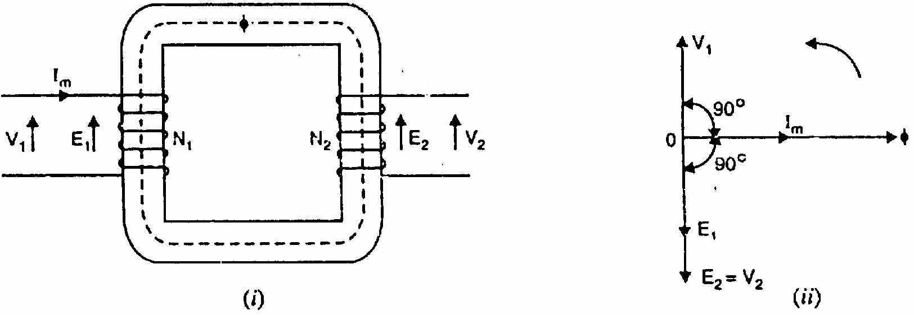
*Fig. (7.2): (i) Ideal transformer on no-load. (ii) Phasor diagram on no-load.*

### Ideal Transformer on No Load

Consider an ideal transformer on no load i.e., secondary is open-circuited as shown in **Fig. (7.2 (i))**. Under such conditions, the primary is simply a pure inductive coil of high inductance.

When alternating voltage $V_1$ is applied to the primary, it draws a very small current $I_m$ (magnetizing current) which establishes alternating flux $\phi$ in the core. Since the primary has zero resistance and zero iron loss, the magnetizing current $I_m$ is purely reactive and lags the applied voltage $V_1$ by $90^\circ$.

The alternating flux $\phi$ links both primary and secondary windings, inducing self-induced e.m.f. $E_1$ in primary and mutually-induced e.m.f. $E_2$ in secondary:
- By Lenz's law, the primary induced e.m.f. $E_1$ opposes the applied voltage $V_1$ and is equal and opposite to $V_1$ at every instant ($V_1 = -E_1$).
- Both $E_1$ and $E_2$ lag the alternating flux $\phi$ by $90^\circ$.
- Thus, $E_1$ and $E_2$ are in phase with each other, and both are $180^\circ$ out of phase with the applied voltage $V_1$.

**Fig. (7.2 (ii))** shows the phasor diagram of an ideal transformer on no load:
- Applied voltage $V_1$ is taken along the vertical axis.
- Flux $\phi$ lags $V_1$ by $90^\circ$ (horizontal axis).
- Magnetizing current $I_m$ is in phase with $\phi$.
- Primary e.m.f. $E_1$ and secondary e.m.f. $E_2$ lag flux $\phi$ by $90^\circ$, and therefore are $180^\circ$ out of phase with $V_1$.

## 7.3 E.M.F. Equation of a Transformer

Consider that an alternating voltage $V_1$ of frequency $f$ is applied to the primary as shown in Fig. (7.2 (i)). The sinusoidal flux $\phi$ produced by the primary can be represented as:
$$\phi = \phi_m \sin \omega t$$

The instantaneous e.m.f. $e_1$ induced in the primary is:
$$e_1 = -N_1 \frac{d\phi}{dt} = -N_1 \frac{d}{dt}(\phi_m \sin \omega t) = -N_1 \omega \phi_m \cos \omega t$$

$$e_1 = -2\pi f N_1 \phi_m \cos \omega t = 2\pi f N_1 \phi_m \sin(\omega t - 90^\circ) \quad \ldots (i)$$

<!-- Page 132 -->
<!-- Printed Page 127 -->

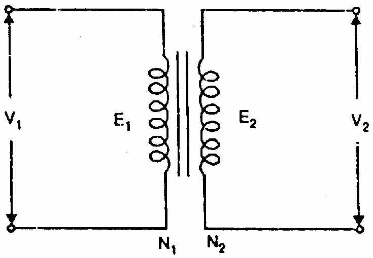
*Fig. (7.3): Sinusoidal variation of magnetic flux $\phi$ with time.*

It is clear from equation (i) that the maximum value of induced e.m.f. in the primary is:
$$E_{1m} = 2\pi f N_1 \phi_m$$

The r.m.s. value $E_1$ of the primary e.m.f. is:
$$E_1 = \frac{E_{1m}}{\sqrt{2}} = \frac{2\pi f N_1 \phi_m}{\sqrt{2}} = \sqrt{2} \pi f N_1 \phi_m$$

$$\mathbf{E_1 = 4.44 f N_1 \phi_m}$$

Similarly, the r.m.s. value $E_2$ of the secondary e.m.f. is:
$$\mathbf{E_2 = 4.44 f N_2 \phi_m}$$

In an ideal transformer, $E_1 = V_1$ and $E_2 = V_2$.

> **Note:** It is clear from exp. (i) above that e.m.f. $E_1$ induced in the primary lags behind the flux $\phi$ by $90^\circ$. Likewise, e.m.f. $E_2$ induced in the secondary lags behind flux $\phi$ by $90^\circ$.

## 7.4 Voltage Transformation Ratio ($K$)

From the above equations of induced e.m.f., we have:
$$\frac{E_2}{E_1} = \frac{4.44 f N_2 \phi_m}{4.44 f N_1 \phi_m} = \frac{N_2}{N_1} = K$$

The constant $K$ is called the **voltage transformation ratio**.
- If $K > 1$ ($N_2 > N_1$), the transformer is **step-up**.
- If $K < 1$ ($N_2 < N_1$), the transformer is **step-down**.

For an ideal transformer:
1. Since there is no voltage drop in the windings:
   $$E_1 = V_1 \quad \text{and} \quad E_2 = V_2$$
   $$\therefore \frac{E_2}{E_1} = \frac{V_2}{V_1} = \frac{N_2}{N_1} = K$$
2. Since there are no losses, volt-amperes input to the primary are equal to output volt-amperes:
   $$V_1 I_1 = V_2 I_2$$

<!-- Page 133 -->
<!-- Printed Page 128 -->

$$\frac{I_1}{I_2} = \frac{V_2}{V_1} = K \quad \text{or} \quad \frac{I_2}{I_1} = \frac{V_1}{V_2} = \frac{1}{K}$$

$$\mathbf{\frac{V_2}{V_1} = \frac{E_2}{E_1} = \frac{N_2}{N_1} = \frac{I_1}{I_2} = K}$$

Hence, currents are in the **inverse ratio** of voltage transformation ratio. This simply means that if we raise the voltage, there is a corresponding decrease of current.

## 7.5 Practical Transformer

A practical transformer differs from the ideal transformer in many respects. The practical transformer has:
1. Iron losses
2. Winding resistances
3. Magnetic leakage, giving rise to leakage reactances

### (i) Iron Losses
Since the iron core is subjected to alternating flux, there occurs eddy current and hysteresis loss in it. These two losses together are known as **iron losses** or **core losses**. The iron losses depend upon the supply frequency, maximum flux density in the core, volume of the core, etc. The magnitude of iron losses is quite small in a well-designed transformer (about 1–2%).

### (ii) Winding Resistances
Since the windings consist of copper conductors, both primary and secondary windings possess electrical resistance. The primary resistance $R_1$ and secondary resistance $R_2$ act in series with the respective windings as shown in **Fig. (7.4)**. When current flows through the windings, there will be power loss ($I^2 R$) as well as a loss in voltage due to $IR$ drop. This affects the terminal voltages: $E_1$ will be slightly less than $V_1$, while $V_2$ will be slightly less than $E_2$.

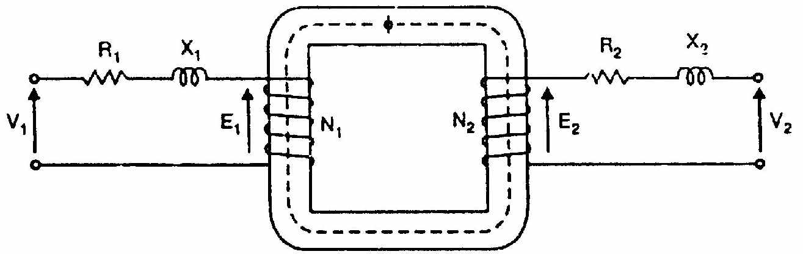
*Fig. (7.4): Practical transformer representation showing winding resistances $R_1, R_2$ and leakage reactances $X_1, X_2$.*

### (iii) Leakage Reactances
Both primary and secondary currents produce magnetic flux. The flux $\phi$ which links both the windings is the useful flux and is called **mutual flux**. However, primary current produces some flux $\phi_1$ which does not link the secondary winding (See **Fig. 7.5**). Similarly, secondary current produces some flux $\phi_2$ that does not link the primary winding. The flux such as $\phi_1$ or $\phi_2$ which links only one winding is called **leakage flux**.

<!-- Page 134 -->
<!-- Printed Page 129 -->

The leakage flux paths are mainly through the air. The effect of these leakage fluxes is the same as though inductive reactances were connected in series with each winding of an ideal transformer having no leakage flux, as shown in **Fig. (7.4)**:
- Primary leakage flux $\phi_1$ introduces an inductive reactance $X_1 = 2\pi f L_1$ in series with primary winding.
- Secondary leakage flux $\phi_2$ introduces an inductive reactance $X_2 = 2\pi f L_2$ in series with secondary winding.

There is no power loss due to leakage reactance ($IX$ drop is in quadrature with current). However, the presence of leakage reactance changes the power factor and causes a reactive voltage drop ($IX$ drop).

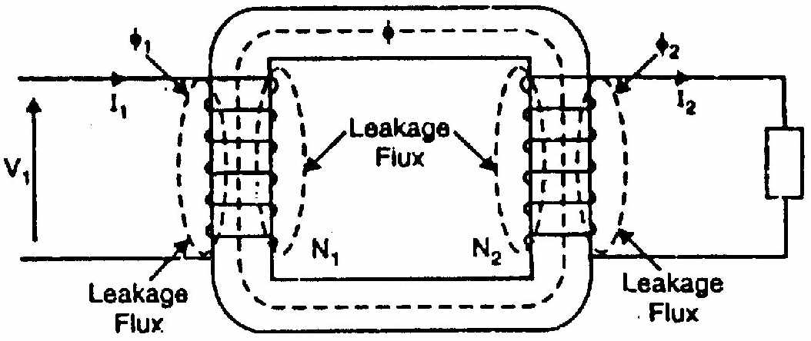
*Fig. (7.5): Mutual flux $\phi$ linking both windings, and leakage fluxes $\phi_1, \phi_2$ passing through air.*

> **Note:** Although leakage flux in a transformer is quite small (about 5% of $\phi$) compared to mutual flux $\phi$, yet it cannot be ignored because leakage flux paths are through air of high reluctance, thus requiring considerable magnetomotive force (m.m.f.).

## 7.6 Practical Transformer on No Load

Consider a practical transformer on no load i.e., secondary on open-circuit as shown in **Fig. (7.6 (i))**. The primary will draw a small current $I_0$ to supply:
1. The iron losses (hysteresis and eddy-current losses in the core).
2. A very small amount of copper loss in the primary ($I_0^2 R_1$).

Hence the primary no-load current $I_0$ is not $90^\circ$ behind the applied voltage $V_1$, but lags it by an angle $\phi_0 < 90^\circ$ as shown in the phasor diagram in **Fig. (7.6 (ii))**.

$$\text{No-load input power}, \quad W_0 = V_1 I_0 \cos \phi_0$$

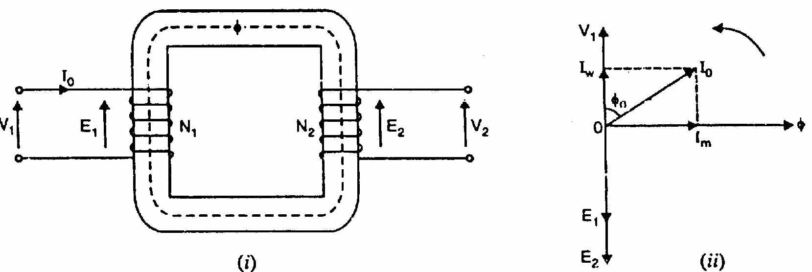
*Fig. (7.6): (i) Practical transformer on no load. (ii) No-load phasor diagram.*

<!-- Page 135 -->
<!-- Printed Page 130 -->

As seen from the phasor diagram in **Fig. (7.6 (ii))**, the no-load primary current $I_0$ can be resolved into two rectangular components:
1. **Working or Core Loss Component ($I_w$ or $I_c$):**
   In phase with the applied voltage $V_1$. It supplies the iron losses and the very small primary copper loss:
   $$I_w = I_0 \cos \phi_0$$
2. **Magnetizing Component ($I_m$):**
   Lags behind $V_1$ by $90^\circ$ (in phase with core flux $\phi$). It is this component which sets up the mutual flux $\phi$ in the core:
   $$I_m = I_0 \sin \phi_0$$

Clearly, $I_0$ is the phasor sum of $I_w$ and $I_m$:
$$\mathbf{I_0 = \sqrt{I_w^2 + I_m^2}}$$

$$\text{No-load power factor}, \quad \cos \phi_0 = \frac{I_w}{I_0}$$

It is emphasized here that no-load primary copper loss ($I_0^2 R_1$) is negligible because $I_0$ is typically only 2% to 5% of full-load primary current. Therefore, no-load primary input power is practically equal to iron loss:
$$\mathbf{W_0 = \text{Iron Loss} = P_i}$$

> **Note:** At no load, $I_2 = 0$, so $V_2 = E_2$. On the primary side, the voltage drops $I_0 R_1$ and $I_0 X_1$ are very small due to the smallness of $I_0$. Hence, at no load:
> $$V_1 \approx E_1$$

## 7.7 Ideal Transformer on Load

Let us connect a load $Z_L$ across the secondary of an ideal transformer as shown in **Fig. (7.7 (i))**. The secondary e.m.f. $E_2$ will cause a secondary current $I_2$ to flow through the load:
$$I_2 = \frac{E_2}{Z_L} = \frac{V_2}{Z_L}$$

The angle at which $I_2$ leads or lags $V_2$ (or $E_2$) depends upon the nature of the load (resistive, inductive, or capacitive). In **Fig. (7.7)**, an inductive load is considered, so $I_2$ lags $V_2$ by angle $\phi_2$.

The secondary current $I_2$ sets up an m.m.f. $N_2 I_2$ which produces a demagnetizing secondary flux $\phi_2$ opposing the main mutual flux $\phi$. This would weaken the core flux. However, the flux in the core must remain constant at its no-load value $\phi_m$ to balance the applied voltage $V_1$.

<!-- Page 136 -->
<!-- Printed Page 131 -->

In order to counteract this demagnetizing secondary m.m.f., the primary immediately draws an additional current $I_2'$ from the supply such that:
$$N_1 I_2' = N_2 I_2 \implies I_2' = \frac{N_2}{N_1} I_2 = K I_2$$

This load-balancing current $I_2'$ is called the **primary load component of current** (or reflected secondary current). It sets up an m.m.f. $N_1 I_2'$ equal and opposite to $N_2 I_2$, neutralizing the demagnetizing effect of secondary current. Thus, mutual flux $\phi$ remains constant at all loads!

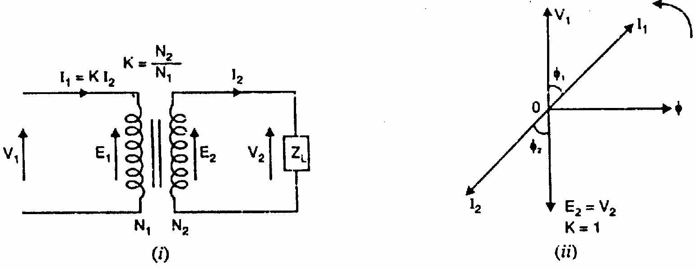
*Fig. (7.7): (i) Ideal transformer on load. (ii) Phasor diagram on load (inductive load).*

In an ideal transformer (where no-load current $I_0 = 0$):
$$I_1 = I_2' = K I_2$$

**Phasor Diagram Analysis (Fig. 7.7 (ii)):**
- Assuming $K = 1$ for simplicity of the phasor diagram so that primary and secondary phasors have equal lengths.
- Secondary current $I_2$ lags $V_2$ (or $E_2$) by $\phi_2$.
- The reflected primary current $I_2' = K I_2$ is in direct antiphase ($180^\circ$) with $I_2$.
- Therefore, primary current $I_1$ lags applied voltage $V_1$ by angle $\phi_1 = \phi_2$.
- Power factor on primary side equals power factor on secondary side: $\cos \phi_1 = \cos \phi_2$.
- Input power = Output power:
  $$V_1 I_1 \cos \phi_1 = V_2 I_2 \cos \phi_2$$

<!-- Page 137 -->
<!-- Printed Page 132 -->

## 7.8 Practical Transformer on Load

In a practical transformer, we must take into account both:
1. The finite no-load current $I_0$ (which supplies core losses and sets up mutual flux).
2. The winding resistances ($R_1, R_2$) and leakage reactances ($X_1, X_2$).

### (i) Practical Transformer with Winding Resistances and Leakage Reactances Neglected (Ideal Winding Approximation)

Here, only no-load current $I_0$ is considered. When loaded with secondary current $I_2$:
- Primary must supply $I_0$ (to maintain flux and supply iron loss).
- Primary must supply $I_2' = K I_2$ (in antiphase with $I_2$, to balance secondary m.m.f.).

The total primary current $I_1$ is the phasor sum of $I_0$ and $I_2'$:
$$\mathbf{I_1 = I_0 + I_2' = I_0 + (-K I_2)}$$

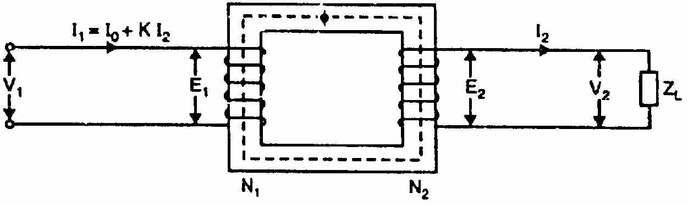
*Fig. (7.8): Circuit representation of practical transformer neglecting winding resistances and leakages.*

**Phasor Diagram (Fig. 7.9):**
- $E_1$ and $E_2$ lag mutual flux $\phi$ by $90^\circ$.
- $I_2$ lags $V_2 = E_2$ by load phase angle $\phi_2$.
- $I_2'$ is drawn equal to $K I_2$ in exact opposition ($180^\circ$) to $I_2$.
- $I_0$ is the phasor sum of $I_w$ (along $V_1$) and $I_m$ (along $\phi$).
- Total primary current $I_1$ is obtained by completing the parallelogram of $I_0$ and $I_2'$.
- Primary power factor = $\cos \phi_1$.

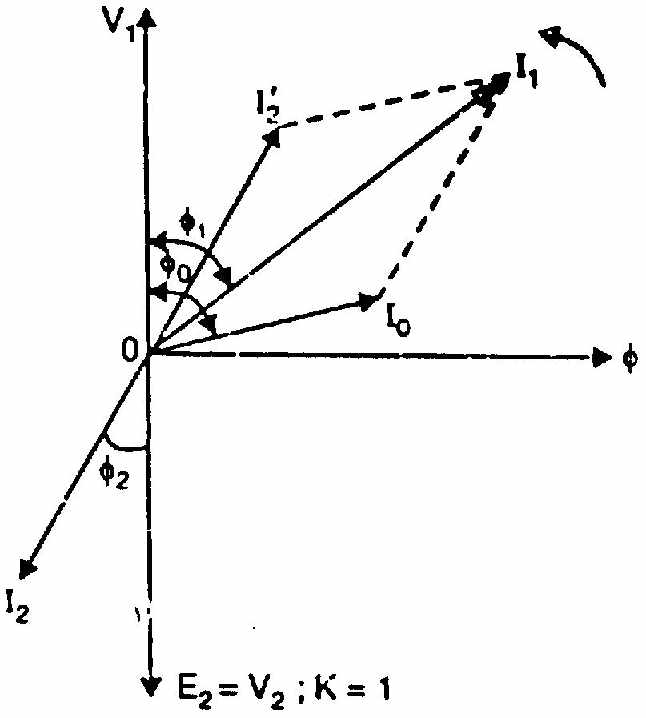
*Fig. (7.9): Phasor diagram of a practical transformer on inductive load (assuming negligible impedance drops).*

<!-- Page 138 -->
<!-- Printed Page 133 -->

$$\text{Primary p.f.} = \cos \phi_1$$
$$\text{Secondary p.f.} = \cos \phi_2$$
$$\text{Primary input power} = V_1 I_1 \cos \phi_1$$
$$\text{Secondary output power} = V_2 I_2 \cos \phi_2$$

### (ii) Complete Practical Transformer (With Winding Resistances and Leakage Reactances)

In actual operating conditions:
- Primary induced e.m.f. $E_1$ differs from applied voltage $V_1$ due to primary impedance drop:
  $$\mathbf{V_1 = -E_1 + I_1 R_1 + j I_1 X_1 = -E_1 + I_1 Z_1}$$
- Secondary terminal voltage $V_2$ differs from secondary induced e.m.f. $E_2$ due to secondary internal drop:
  $$\mathbf{V_2 = E_2 - I_2 R_2 - j I_2 X_2 = E_2 - I_2 Z_2}$$

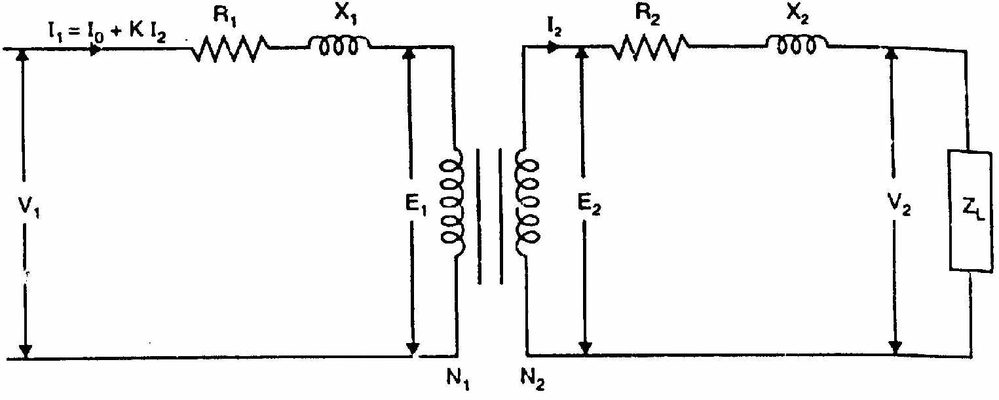
*Fig. (7.10): Practical transformer circuit showing primary impedance $Z_1 = R_1 + jX_1$ and secondary impedance $Z_2 = R_2 + jX_2$.*

Total primary current is the phasor sum:
$$\mathbf{I_1 = I_2' + I_0}$$
where $I_2' = -K I_2$.

<!-- Page 139 -->
<!-- Printed Page 134 -->

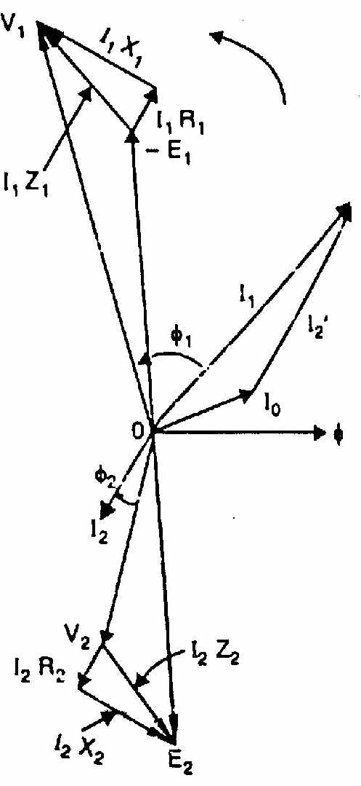
*Fig. (7.11): Complete phasor diagram of a loaded practical transformer on inductive load.*

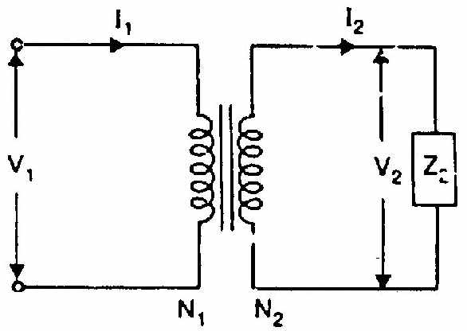
*Fig. (7.12): Transformer delivering power to secondary load impedance $Z_2$.*

**Step-by-step construction of the Complete Phasor Diagram (Fig. 7.11):**
1. Take mutual flux $\phi$ along the horizontal reference axis.
2. Induced e.m.f.s $E_1$ and $E_2$ lag flux $\phi$ by $90^\circ$.
3. Draw $-E_1$ leading $\phi$ by $90^\circ$ (equal and opposite to $E_1$).
4. For an inductive load, secondary terminal voltage $V_2$ is established, and secondary current $I_2$ lags $V_2$ by load angle $\phi_2$.
5. Add $I_2 R_2$ (parallel to $I_2$) and $I_2 X_2$ (leading $I_2$ by $90^\circ$) to $V_2$ to obtain secondary induced e.m.f. $E_2$.
6. Draw primary load-balancing current $I_2' = K I_2$ in exact opposition ($180^\circ$) to $I_2$.
7. Add no-load current $I_0$ to $I_2'$ to find total primary current $I_1$.
8. To $-E_1$, add primary resistance drop $I_1 R_1$ (parallel to $I_1$) and leakage reactance drop $I_1 X_1$ (leading $I_1$ by $90^\circ$) to obtain applied voltage $V_1$.
9. Angle $\phi_1$ between $V_1$ and $I_1$ gives the primary operating power factor $\cos \phi_1$.

## 7.9 Impedance Ratio

Consider a transformer having load impedance $Z_2$ in the secondary as shown in **Fig. (7.12)**:
$$Z_2 = \frac{V_2}{I_2} \quad \text{and} \quad Z_1 = \frac{V_1}{I_1}$$

$$\frac{Z_2}{Z_1} = \frac{V_2 / I_2}{V_1 / I_1} = \left(\frac{V_2}{V_1}\right) \times \left(\frac{I_1}{I_2}\right) = K \times K = K^2$$

$$\mathbf{\frac{Z_2}{Z_1} = K^2}$$

<!-- Page 140 -->
<!-- Printed Page 135 -->

That is, the **impedance ratio** $(Z_2 / Z_1)$ is equal to the square of the voltage transformation ratio $K^2$:
- An impedance $Z_2$ in the secondary becomes $\mathbf{Z_2 / K^2}$ when transferred to the primary.
- An impedance $Z_1$ in the primary becomes $\mathbf{K^2 Z_1}$ when transferred to the secondary.

Similarly, for resistances and reactances:
$$\mathbf{R_2' = \frac{R_2}{K^2}}, \quad \mathbf{X_2' = \frac{X_2}{K^2}}$$
$$\mathbf{R_1' = K^2 R_1}, \quad \mathbf{X_1' = K^2 X_1}$$

> **Golden Rules of Parameter Transformation:**
> 1. When transferring resistance, reactance, or impedance from **primary to secondary**, multiply by $K^2$.
> 2. When transferring resistance, reactance, or impedance from **secondary to primary**, divide by $K^2$.
> 3. When transferring **voltage or current**, use $K$ (voltage multiplies by $K$, current divides by $K$).

## 7.10 Shifting Impedances in a Transformer

By shifting all resistances and reactances to one side (either primary or secondary), the ideal transformer is eliminated, resulting in a single equivalent electrical circuit. This simplifies calculations considerably.

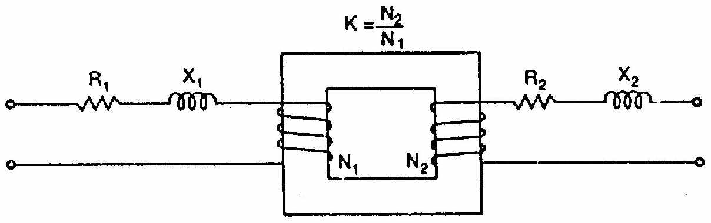
*Fig. (7.13): Practical transformer with winding parameters represented outside the ideal windings.*

<!-- Page 141 -->
<!-- Printed Page 136 -->

### (i) Equivalent Parameters Referred to Primary

Transferring secondary resistance and reactance to the primary side:
$$\mathbf{R_{01} = R_1 + R_2' = R_1 + \frac{R_2}{K^2}}$$
$$\mathbf{X_{01} = X_1 + X_2' = X_1 + \frac{X_2}{K^2}}$$
$$\mathbf{Z_{01} = \sqrt{R_{01}^2 + X_{01}^2}}$$

where:
- $R_{01}$ = Total equivalent resistance of the transformer referred to primary
- $X_{01}$ = Total equivalent leakage reactance of the transformer referred to primary
- $Z_{01}$ = Total equivalent leakage impedance of the transformer referred to primary

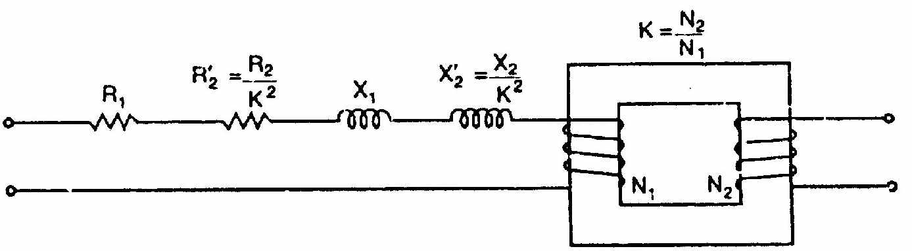
*Fig. (7.14): Secondary resistance and reactance referred to primary.*

### (ii) Equivalent Parameters Referred to Secondary

Transferring primary resistance and reactance to the secondary side:
$$\mathbf{R_{02} = R_2 + R_1' = R_2 + K^2 R_1}$$
$$\mathbf{X_{02} = X_2 + X_1' = X_2 + K^2 X_1}$$
$$\mathbf{Z_{02} = \sqrt{R_{02}^2 + X_{02}^2}}$$

Note the relation between primary and secondary equivalent values:
$$\mathbf{R_{02} = K^2 R_{01}}, \quad \mathbf{X_{02} = K^2 X_{01}}, \quad \mathbf{Z_{02} = K^2 Z_{01}}$$

<!-- Page 142 -->
<!-- Printed Page 137 -->

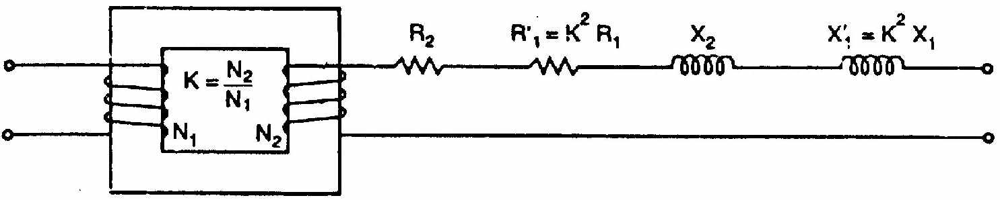
*Fig. (7.15): Primary resistance and reactance referred to secondary.*

## 7.11 Importance of Shifting Impedances

If all impedances are shifted to one side, the transformer is eliminated, and we obtain a simple series circuit.

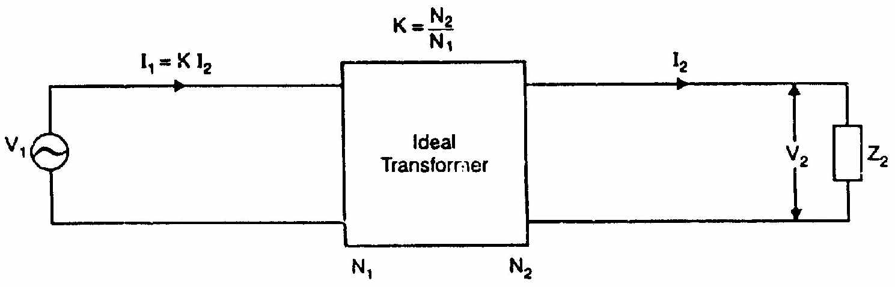
*Fig. (7.16): Ideal transformer feeding a secondary load impedance $Z_2$.*

### (i) Referred to Primary
When impedance $Z_2$ in the secondary is transferred to the primary, it becomes $Z_2 / K^2$ as shown in **Fig. (7.17 (i))**. Since the secondary winding is now on open circuit, the ideal transformer can be removed entirely, yielding the equivalent circuit in **Fig. (7.17 (ii))**.

The primary current is directly:
$$I_1 = \frac{V_1}{Z_2 / K^2} = K^2 \frac{V_1}{Z_2} = K \left(\frac{K V_1}{Z_2}\right) = K \left(\frac{V_2}{Z_2}\right) = K I_2$$
which confirms exact electrical equivalence!

<!-- Page 143 -->
<!-- Printed Page 138 -->

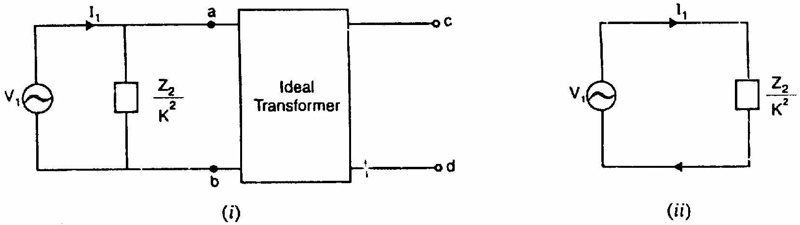
*Fig. (7.17): (i) Secondary load impedance transferred to primary. (ii) Transformer removed, yielding pure electrical circuit.*

### (ii) Referred to Secondary
Transferring source voltage $V_1$ to secondary gives $K V_1 = V_2$. The equivalent circuit is shown in **Fig. (7.18 (ii))**:
$$I_2 = \frac{K V_1}{Z_2} = \frac{V_2}{Z_2}$$

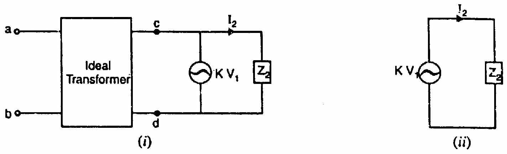
*Fig. (7.18): (i) Source voltage transferred to secondary. (ii) Equivalent secondary electrical circuit.*

<!-- Page 144 -->
<!-- Printed Page 139 -->

## 7.12 Exact Equivalent Circuit of a Loaded Transformer

In a practical transformer, the complete electrical circuit must represent:
1. Primary winding resistance $R_1$ and leakage reactance $X_1$.
2. Secondary winding resistance $R_2$ and leakage reactance $X_2$.
3. The magnetizing and core-loss branch (exciting branch) connected across primary voltage $-E_1$:
   - Non-inductive resistance $R_0$ carrying core-loss current $I_w$:
     $$R_0 = \frac{V_1}{I_w}$$
   - Pure inductive reactance $X_0$ carrying magnetizing current $I_m$:
     $$X_0 = \frac{V_1}{I_m}$$
4. An ideal transformer of ratio $1:K$ coupling the primary and secondary.

*Fig. (7.19): Exact equivalent circuit of a practical transformer on load.*

<!-- Page 145 -->
<!-- Printed Page 140 -->

In the exact equivalent circuit of **Fig. (7.19)**:
- Total primary current is:
  $$I_1 = I_0 + I_2'$$
- No-load current is:
  $$I_0 = I_w + I_m$$
- Primary induced e.m.f.:
  $$E_1 = V_1 - I_1(R_1 + jX_1)$$
- Secondary induced e.m.f.:
  $$E_2 = K E_1$$
- Secondary terminal voltage:
  $$V_2 = E_2 - I_2(R_2 + jX_2)$$

## 7.13 Simplified Equivalent Circuit of a Loaded Transformer

In **Fig. (7.19)**, the ideal transformer still separates primary and secondary. By transferring all secondary quantities to the primary side, the ideal transformer is eliminated, yielding the single-loop equivalent circuit in **Fig. (7.20)**:
- Secondary resistance referred to primary: $R_2' = R_2 / K^2$
- Secondary reactance referred to primary: $X_2' = X_2 / K^2$
- Load impedance referred to primary: $Z_L' = Z_L / K^2$
- Secondary terminal voltage referred to primary: $V_2' = V_2 / K$
- Secondary current referred to primary: $I_2' = K I_2$

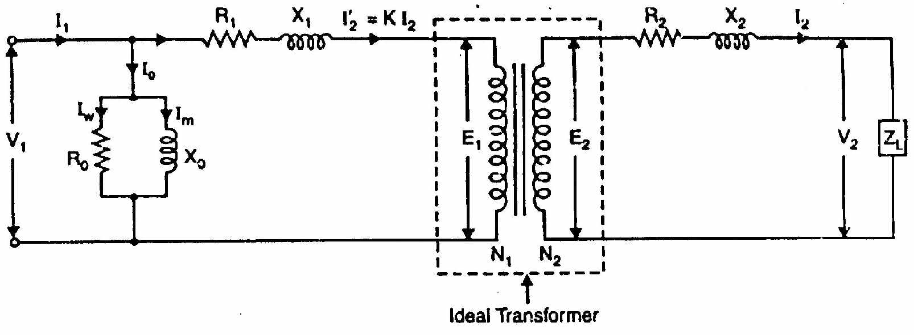
*Fig. (7.20): Simplified equivalent circuit with all parameters referred to primary side.*

<!-- Page 146 -->
<!-- Printed Page 141 -->

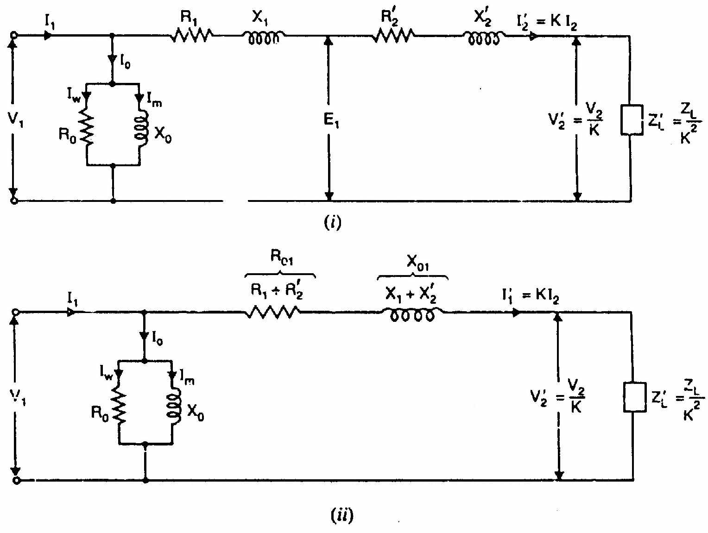
*Fig. (7.21): Approximate equivalent circuit moving shunt exciting branch directly across input terminals $V_1$.*

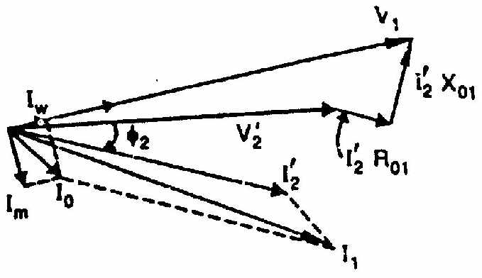
*Fig. (7.22): Approximate equivalent circuit referred to secondary side.*

## 7.14 Approximate Equivalent Circuit of a Loaded Transformer

Because the no-load current $I_0$ is extremely small (only 2% to 5% of full-load current $I_1$), the voltage drop across $R_1$ and $X_1$ caused by $I_0$ is negligible. Therefore, without introducing significant error, the parallel exciting branch ($R_0$ and $X_0$) can be shifted to the input terminals as shown in **Fig. (7.21)**!

This simplifies calculations enormously:
- Primary resistance $R_1$ and referred secondary resistance $R_2'$ are now in direct series:
  $$\mathbf{R_{01} = R_1 + R_2' = R_1 + \frac{R_2}{K^2}}$$
- Primary reactance $X_1$ and referred secondary reactance $X_2'$ are in direct series:
  $$\mathbf{X_{01} = X_1 + X_2' = X_1 + \frac{X_2}{K^2}}$$

<!-- Page 147 -->
<!-- Printed Page 142 -->

When calculating voltage regulation or current distribution under load, the shunt exciting branch $I_0$ can often be neglected entirely, giving the ultimate simplified series equivalent circuit in **Fig. (7.23)**:
- Referred to Primary: Total series impedance $Z_{01} = R_{01} + j X_{01}$ (**Fig. 7.23 (ii)**).
- Referred to Secondary: Total series impedance $Z_{02} = R_{02} + j X_{02}$ (**Fig. 7.24**).

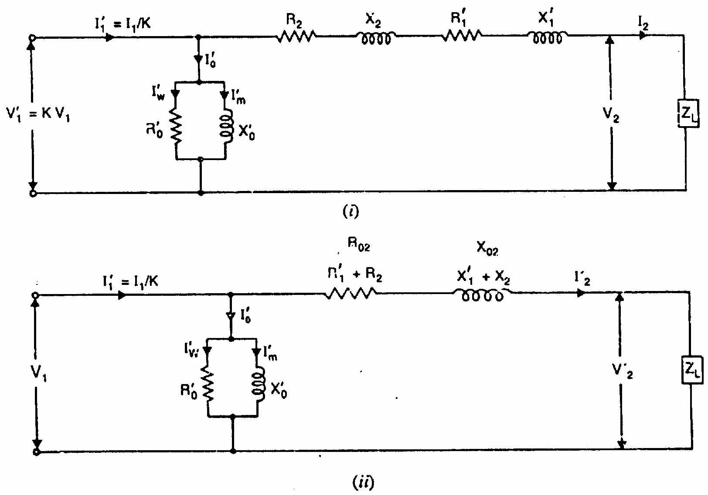
*Fig. (7.23): Simplified series equivalent circuit referred to primary with exciting branch omitted.*

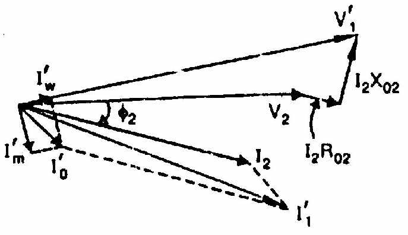
*Fig. (7.24): Simplified series equivalent circuit referred to secondary.*

<!-- Page 148 -->
<!-- Printed Page 143 -->

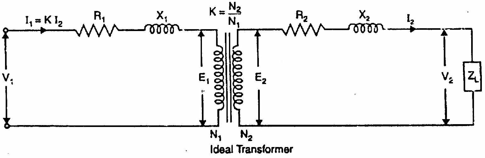
*Fig. (7.25): Phasor diagram referred to secondary for deriving approximate voltage drop.*

## 7.15 Approximate Voltage Drop in a Transformer

Referring to the simplified equivalent circuit referred to secondary (**Fig. 7.24**) and its phasor diagram (**Fig. 7.25**):
- Secondary terminal voltage is $V_2$.
- Secondary load current is $I_2$, lagging $V_2$ by $\phi_2$.
- Secondary no-load induced e.m.f. is $E_2$ (or no-load terminal voltage $0V_2$).

From the phasor diagram geometry in **Fig. (7.25)**:
$$E_2 \approx V_2 + I_2 R_{02} \cos \phi_2 + I_2 X_{02} \sin \phi_2 \quad (\text{for lagging p.f.})$$

$$\mathbf{\text{Approximate Voltage Drop } \Delta V_2 = E_2 - V_2 = I_2 R_{02} \cos \phi_2 \pm I_2 X_{02} \sin \phi_2}$$

where:
- Use **$+$ sign** for **lagging power factor** (inductive load).
- Use **$-$ sign** for **leading power factor** (capacitive load).
- For **unity power factor** ($\cos \phi_2 = 1, \sin \phi_2 = 0$): $\Delta V_2 = I_2 R_{02}$.

Similarly, referred to the primary side:
$$\mathbf{\Delta V_1 = I_1 R_{01} \cos \phi_1 \pm I_1 X_{01} \sin \phi_1}$$

<!-- Page 149 -->
<!-- Printed Page 144 -->

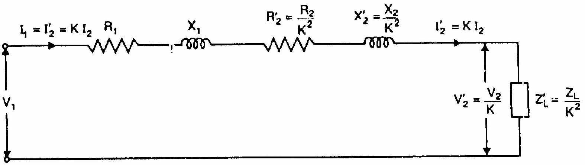
*Fig. (7.26): Detailed geometric construction for exact vs. approximate voltage drop.*

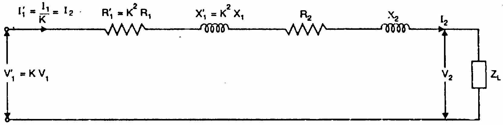
*Fig. (7.27): Phasor diagrams showing voltage drop for: (i) Leading power factor. (ii) Unity power factor.*

<!-- Page 150 -->
<!-- Printed Page 145 -->

## 7.16 Voltage Regulation

The **voltage regulation** of a transformer is defined as the change in secondary terminal voltage from no-load to full-load, expressed as a percentage of the full-load secondary terminal voltage (or sometimes no-load voltage), with primary voltage held constant.

$$\mathbf{\% \text{ Voltage Regulation} = \frac{V_{2(NL)} - V_{2(FL)}}{V_{2(FL)}} \times 100 = \frac{E_2 - V_2}{V_2} \times 100}$$

Using the approximate voltage drop expression:
$$\mathbf{\% VR = \frac{I_2 R_{02} \cos \phi_2 \pm I_2 X_{02} \sin \phi_2}{V_2} \times 100}$$

Alternatively, in fractional terms:
$$\% VR = v_r \cos \phi_2 \pm v_x \sin \phi_2$$
where:
- $v_r = \frac{I_2 R_{02}}{V_2} \times 100$ is percentage resistance drop.
- $v_x = \frac{I_2 X_{02}}{V_2} \times 100$ is percentage reactance drop.

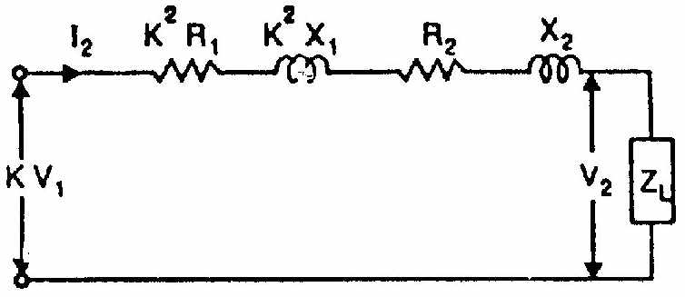
*Fig. (7.28): Voltage regulation curves showing variation of terminal voltage with load current for lagging, unity, and leading power factors.*

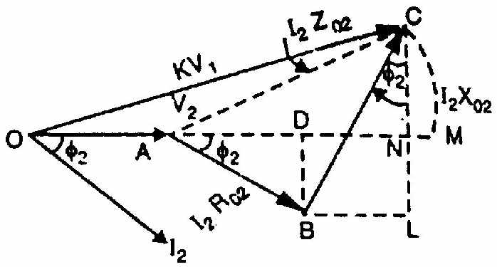
*Fig. (7.29): Phasor diagram illustrating condition for zero voltage regulation (leading power factor).*

### Important Conditions for Voltage Regulation:

1. **Condition for Zero Voltage Regulation ($\Delta V_2 = 0$):**
   $$I_2 R_{02} \cos \phi_2 - I_2 X_{02} \sin \phi_2 = 0$$
   $$\tan \phi_2 = \frac{R_{02}}{X_{02}} \quad \text{(leading p.f.)}$$
   $$\cos \phi_2 = \frac{X_{02}}{\sqrt{R_{02}^2 + X_{02}^2}} = \frac{X_{02}}{Z_{02}} \quad \text{(leading)}$$
   Zero regulation (terminal voltage unchanged from no-load to full-load) is only possible at a **leading power factor**!

2. **Condition for Maximum Voltage Regulation:**
   Differentiating $\Delta V_2$ with respect to $\phi_2$ and setting to zero:
   $$\frac{d}{d\phi_2}(I_2 R_{02} \cos \phi_2 + I_2 X_{02} \sin \phi_2) = 0$$
   $$-I_2 R_{02} \sin \phi_2 + I_2 X_{02} \cos \phi_2 = 0$$
   $$\tan \phi_2 = \frac{X_{02}}{R_{02}} \quad \text{(lagging p.f.)}$$
   $$\mathbf{\cos \phi_2 = \frac{R_{02}}{Z_{02}} \quad (\text{lagging})}$$
   $$\text{Maximum Voltage Drop} = I_2 Z_{02}$$

<!-- Page 151 -->
<!-- Printed Page 146 -->

## 7.17 Transformer Tests

The circuit constants ($R_{01}, X_{01}, R_0, X_0$), efficiency, and voltage regulation of a transformer can be determined accurately without directly loading the transformer, by conducting two simple tests:
1. **Open-Circuit Test (or No-Load Test)**
2. **Short-Circuit Test (or Impedance Test)**

These tests consume very little power and can be conducted easily on transformers of any capacity.

## 7.18 Open-Circuit or No-Load Test

**Purpose:** To determine the iron loss (core loss) $P_i$ and the no-load parameters $R_0$ and $X_0$.

**Connections:**
- The test is usually performed on the **Low Voltage (LV) winding**, while the **High Voltage (HV) winding is left open-circuited**.
- Instruments used: A voltmeter, an ammeter, and a low-power-factor (LPF) wattmeter are connected on the LV side.
- Rated voltage $V_1$ at rated frequency is applied to the LV winding.

<!-- Page 152 -->
<!-- Printed Page 147 -->

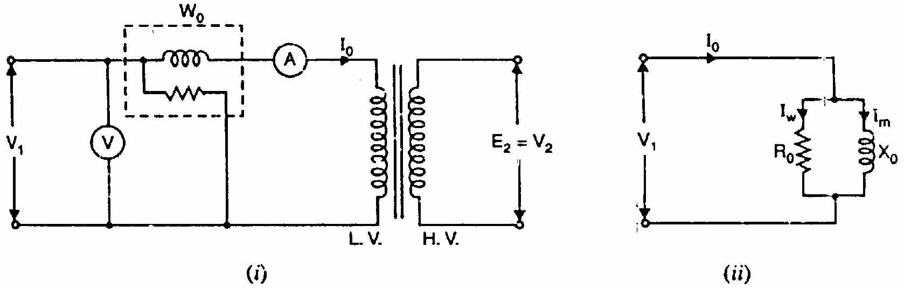
*Fig. (7.30): Connection diagram for Open-Circuit (No-Load) Test on LV winding.*

### Test Calculations:
Since the HV winding is open-circuited, the secondary current is zero ($I_2 = 0$). The primary draws only the small no-load current $I_0$ (2% to 5% of full-load current).
- The primary copper loss is $I_0^2 R_1 \approx 0$ (negligible).
- Therefore, the wattmeter reading $W_0$ represents purely the **iron loss (core loss) $P_i$** of the transformer at rated voltage:
  $$\mathbf{W_0 = \text{Iron Loss } P_i}$$

From the meter readings ($V_1$, $I_0$, $W_0$):
$$\text{No-load power factor}, \quad \cos \phi_0 = \frac{W_0}{V_1 I_0}$$
$$\text{Core loss component}, \quad I_w = I_0 \cos \phi_0$$
$$\text{Magnetizing component}, \quad I_m = I_0 \sin \phi_0 = \sqrt{I_0^2 - I_w^2}$$
$$\mathbf{R_0 = \frac{V_1}{I_w} = \frac{V_1^2}{W_0}}$$
$$\mathbf{X_0 = \frac{V_1}{I_m}}$$

## 7.19 Short-Circuit or Impedance Test

**Purpose:** To determine full-load copper loss $P_c$ and equivalent leakage parameters $R_{01}, X_{01}$ (or $R_{02}, X_{02}$).

**Connections:**
- The test is conducted on the **High Voltage (HV) winding**, while the **Low Voltage (LV) winding is solidly short-circuited** by a thick conductor.
- Instruments used: Voltmeter, ammeter, and wattmeter connected on the HV side.
- A low variable voltage (usually only 5% to 10% of rated HV voltage) is applied to the HV winding and gradually increased until **rated full-load current** $I_{sc} = I_{1(FL)}$ circulates.

<!-- Page 153 -->
<!-- Printed Page 148 -->

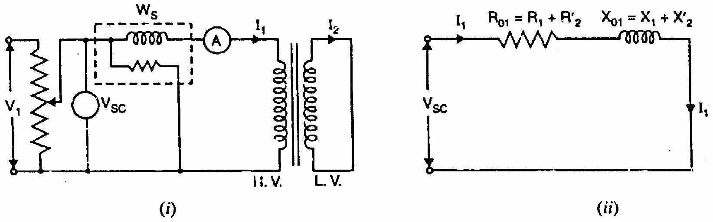
*Fig. (7.31): Connection diagram for Short-Circuit Test on HV winding.*

### Test Calculations:
Because the applied voltage $V_{sc}$ is very small (5–10% of rated voltage), the core flux $\phi$ is extremely small ($\approx 5\%$).
- Since iron loss is proportional to $B_m^{1.6}$ and $B_m^2$, the core loss at this reduced voltage is less than $(0.05)^2 \approx 0.25\%$ and is completely negligible!
- Therefore, the wattmeter reading $W_{sc}$ represents exclusively the **full-load copper loss** in both windings:
  $$\mathbf{W_{sc} = \text{Full-load Copper Loss } P_c = I_{sc}^2 R_{01}}$$

From the meter readings ($V_{sc}$, $I_{sc}$, $W_{sc}$):
$$\mathbf{R_{01} = \frac{W_{sc}}{I_{sc}^2}}$$
$$\mathbf{Z_{01} = \frac{V_{sc}}{I_{sc}}}$$
$$\mathbf{X_{01} = \sqrt{Z_{01}^2 - R_{01}^2}}$$
$$\text{Short-circuit power factor}, \quad \cos \phi_{sc} = \frac{W_{sc}}{V_{sc} I_{sc}} = \frac{R_{01}}{Z_{01}}$$

## 7.20 Advantages of Transformer Tests

1. **Very low power consumption**: The tests require only enough power to supply the losses (a few percent of full load).
2. **Complete equivalent circuit determined**: Parameters $R_0, X_0, R_{01}, X_{01}$ are fully established.
3. **Efficiency predetermination**: Full-load and fractional-load efficiency at any power factor can be calculated without actual loading.
4. **Regulation predetermination**: Voltage regulation for any load and power factor can be determined accurately.

<!-- Page 154 -->
<!-- Printed Page 149 -->

## 7.21 Separation of Components of Core Losses

Core loss consists of hysteresis loss and eddy-current loss:
$$P_i = P_h + P_e$$
$$P_h = k_h f B_m^{1.6} \quad \text{and} \quad P_e = k_e f^2 B_m^2 t^2$$

If the test is carried out at varying frequency $f$ while keeping $V/f$ constant (which keeps $B_m$ constant):
$$P_h = A f \quad \text{and} \quad P_e = B f^2$$
$$P_i = A f + B f^2 \implies \mathbf{\frac{P_i}{f} = A + B f}$$

Plotting $P_i / f$ against frequency $f$ yields a straight line:
- The vertical intercept at $f = 0$ gives $A$ (hysteresis loss coefficient).
- The slope of the line gives $B$ (eddy-current loss coefficient).

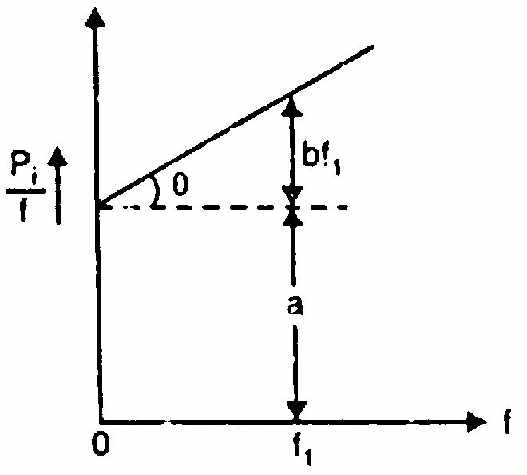
*Fig. (7.32): Plot of $P_i / f$ versus frequency $f$ to separate hysteresis loss and eddy-current loss.*

## 7.22 Why Transformer Rating in kVA?

Copper loss depends on current ($I^2 R$), while iron loss depends on voltage ($V$). Neither loss depends on the phase angle between voltage and current (i.e., power factor $\cos \phi$). Since heating and temperature rise depend on total losses, the permissible loading of a transformer is limited by the product of voltage and current ($V \times I$) and not by power ($V I \cos \phi$). Therefore, transformers are always rated in **kVA** (or MVA), never in kW.

<!-- Page 155 -->
<!-- Printed Page 150 -->

## 7.23 Sumpner or Back-to-Back Test

**Purpose:** To determine the temperature rise, efficiency, and regulation of two identical transformers under full-load conditions simultaneously, while drawing only the power required to supply the losses!

**Operating Principle:**
Two identical transformers are connected such that their primaries are in parallel across the main supply, while their secondaries are connected in phase opposition (back-to-back) through an auxiliary regulating transformer.

<!-- Page 156 -->
<!-- Printed Page 151 -->

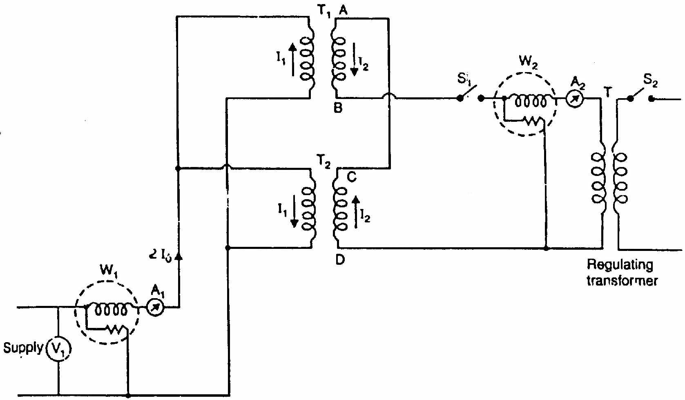
*Fig. (7.33): Complete connection diagram for Sumpner's back-to-back test on two identical transformers.*

### Test Operation:
1. **With switch $S_2$ open:**
   The secondaries are in series opposition. Since the induced e.m.f.s $E_2$ of both transformers are identical in magnitude and opposite in direction around the loop, the net secondary voltage is zero, and no secondary current flows ($I_2 = 0$).
   - This represents an open-circuit test on both transformers.
   - The primary draws $2 I_0$.
   - Wattmeter $W_1$ measures the **total iron losses of both transformers**:
     $$\mathbf{W_1 = 2 P_i \implies P_i = \frac{W_1}{2}}$$
2. **With switch $S_2$ closed:**
   A small auxiliary voltage is injected into the secondary circuit via the regulating transformer. This voltage is adjusted until **full-load secondary current $I_2$** circulates through the secondary windings.
   - Full-load secondary current causes full-load current $I_1 = K I_2$ to circulate in the primary windings.
   - This circulating current flows entirely through the closed primary loop and does not pass through wattmeter $W_1$.
   - Wattmeter $W_2$ measures the **full-load copper losses of both transformers**:
     $$\mathbf{W_2 = 2 P_{c(FL)} \implies P_{c(FL)} = \frac{W_2}{2}}$$

$$\mathbf{\text{Total Full-Load Losses of Both Transformers} = W_1 + W_2}$$

<!-- Page 157 -->
<!-- Printed Page 152 -->

## 7.24 Losses in a Transformer

Power losses in a transformer consist of:
1. **Core or Iron Losses ($P_i$):**
   - Hysteresis loss: $P_h = k_h f B_m^{1.6} V_{core}$
   - Eddy current loss: $P_e = k_e f^2 B_m^2 t^2 V_{core}$
   - Since $V_1$ and $f$ are constant, $P_i$ is **constant at all loads**.
2. **Copper Losses ($P_c$):**
   - Ohmic $I^2 R$ losses in primary and secondary windings:
     $$P_c = I_1^2 R_1 + I_2^2 R_2 = I_2^2 R_{02} = I_1^2 R_{01}$$
   - Copper loss is a **variable loss** that varies with the square of the load current ($P_c \propto I^2$).

<!-- Page 158 -->
<!-- Printed Page 153 -->

$$\mathbf{\text{Total Losses} = P_i + P_c = \text{Constant Losses} + \text{Variable Losses}}$$

Copper losses account for about 85–90% of total losses at full load.

## 7.25 Efficiency of a Transformer

$$\mathbf{\text{Efficiency } \eta = \frac{\text{Output Power}}{\text{Input Power}} = \frac{\text{Output Power}}{\text{Output Power} + \text{Losses}} = \frac{V_2 I_2 \cos \phi_2}{V_2 I_2 \cos \phi_2 + P_i + P_c}}$$

Direct loading is unsuitable for measuring transformer efficiency because:
1. Efficiencies are very high (95–99%), so slight instrument errors cause huge errors in loss determination.
2. Huge power would be wasted on large units.
3. Loading devices for large transformers are impractical.

<!-- Page 159 -->
<!-- Printed Page 154 -->

## 7.26 Efficiency from Transformer Tests

From the OC test ($P_i$) and SC test ($P_{c(FL)}$):
- Full-load efficiency at power factor $\cos \phi$:
  $$\mathbf{\eta_{FL} = \frac{\text{kVA} \times 10^3 \times \cos \phi}{\text{kVA} \times 10^3 \times \cos \phi + P_i + P_{c(FL)}} \times 100}$$
- At fraction $x$ of full load ($x = \text{Actual Load} / \text{Full Load}$):
  $$\text{Iron loss} = P_i \quad (\text{constant})$$
  $$\text{Copper loss} = x^2 P_{c(FL)}$$
  $$\mathbf{\eta_x = \frac{x \times \text{kVA} \times 10^3 \times \cos \phi}{x \times \text{kVA} \times 10^3 \times \cos \phi + P_i + x^2 P_{c(FL)}} \times 100}$$

## 7.27 Condition for Maximum Efficiency

$$\eta = \frac{V_2 I_2 \cos \phi_2}{V_2 I_2 \cos \phi_2 + P_i + I_2^2 R_{02}} = \frac{V_2 \cos \phi_2}{V_2 \cos \phi_2 + \frac{P_i}{I_2} + I_2 R_{02}}$$

For maximum efficiency, the denominator must be minimum. Differentiating with respect to $I_2$:
$$\frac{d}{dI_2}\left(V_2 \cos \phi_2 + \frac{P_i}{I_2} + I_2 R_{02}\right) = 0 \implies -\frac{P_i}{I_2^2} + R_{02} = 0$$

$$\mathbf{P_i = I_2^2 R_{02} = P_c}$$

$$\mathbf{\text{Iron Losses } (P_i) = \text{Copper Losses } (P_c)}$$

> **Theorem:** The efficiency of a transformer is maximum when the **variable copper loss equals the constant iron loss**.

<!-- Page 160 -->
<!-- Printed Page 155 -->

The load current for maximum efficiency is:
$$\mathbf{I_{2(\eta_{max})} = \sqrt{\frac{P_i}{R_{02}}}}$$

## 7.28 Output kVA Corresponding to Maximum Efficiency

Let $x$ be the fraction of full-load kVA at which maximum efficiency occurs:
$$x^2 P_{c(FL)} = P_i \implies \mathbf{x = \sqrt{\frac{P_i}{P_{c(FL)}}}}$$

$$\mathbf{\text{kVA for } \eta_{max} = \text{Full-load kVA} \times \sqrt{\frac{P_i}{P_{c(FL)}}}}$$

<!-- Page 161 -->
<!-- Printed Page 156 -->

## 7.29 All-Day (or Energy) Efficiency

Commercial efficiency measures power ratio ($\text{kW output} / \text{kW input}$) at a given instant. But distribution transformers have their primaries energized 24 hours a day, while their secondaries supply load only intermittently during the day:
- **Iron loss occurs continuously for all 24 hours**.
- **Copper loss occurs only when the transformer is loaded**.

Therefore, the performance of distribution transformers is judged by **All-Day Efficiency** (or energy efficiency):
$$\mathbf{\eta_{\text{all-day}} = \frac{\text{Energy output in 24 hours (kWh)}}{\text{Energy input in 24 hours (kWh)}} = \frac{\text{Output (kWh)}}{\text{Output (kWh)} + \text{Iron Loss (kWh in 24h)} + \text{Cu Loss (kWh in 24h)}}}$$

> **Design Consideration:** Distribution transformers are designed to have their maximum efficiency at around 50% to 70% of full load, with very low iron loss to maximize all-day efficiency.

<!-- Page 162 -->
<!-- Printed Page 157 -->

## 7.30 Construction of a Transformer

A transformer consists of two essential parts:
1. **Laminated Steel Core**: Made of high-grade silicon steel laminations (0.35 mm to 0.5 mm thick) insulated from each other by varnish or oxide coating to reduce eddy current loss.
2. **Windings**: Made of high-conductivity electrolytic copper insulated by paper, enamel, or cloth tape.

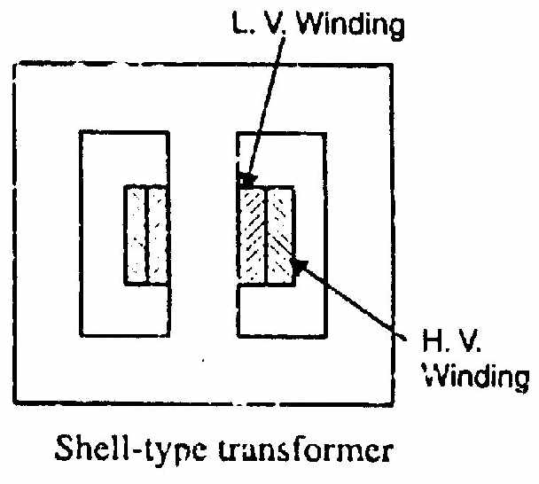
*Fig. (7.34): (i) Core-type transformer. (ii) Shell-type transformer.*

## 7.31 Types of Transformers

According to construction, transformers are classified as:
1. **Core-Type Transformer:**
   - Windings surround a considerable part of the core.
   - Two vertical limbs connected by top and bottom yokes.
   - Low-voltage winding is placed closest to the core (reduces required insulation), and high-voltage winding is placed concentrically outside it.
2. **Shell-Type Transformer:**
   - The core surrounds a considerable part of the windings.
   - Central limb has twice the cross-sectional area of outer limbs.
   - Windings are interleaved (sandwich coils).
3. **Berry-Type (Spiral Core):**
   - Core distributed like spokes of a wheel.

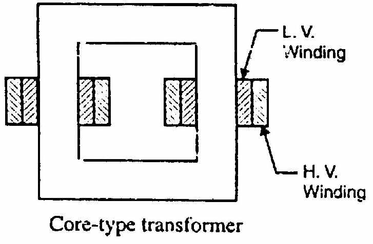
*Fig. (7.35): Stepped core cross-sections to reduce copper length and weight.*

<!-- Page 163 -->
<!-- Printed Page 158 -->

## 7.32 Cooling of Transformers

Transformers are cooled to dissipate heat produced by internal losses:
1. **Air-Natural (AN)** or **Air-Blast (AB)**: Used for small dry-type transformers up to 25 kVA.
2. **Oil-Immersed Natural-Cooled (ONAN)**: Core and windings immersed in insulating mineral oil inside a tank. Oil transfers heat to tank walls and radiator tubes.
3. **Oil-Immersed Air-Forced (ONAF)**: External fans blow air over radiator fins.
4. **Oil-Immersed Water-Forced (OFWF)**: Cold water circulated through internal cooling coils.

## 7.33 Autotransformer

An **autotransformer** is a transformer in which a part of the winding is common to both the primary and the secondary circuits. Unlike a two-winding transformer, there is direct electrical connection between primary and secondary, in addition to magnetic coupling.

<!-- Page 164 -->
<!-- Printed Page 159 -->

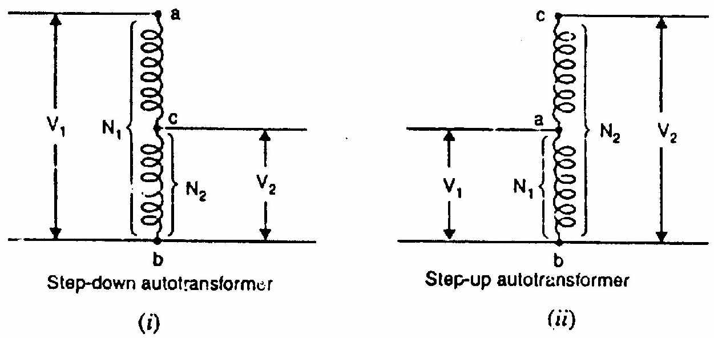
*Fig. (7.36): Autotransformer configurations: (i) Step-down. (ii) Step-up.*

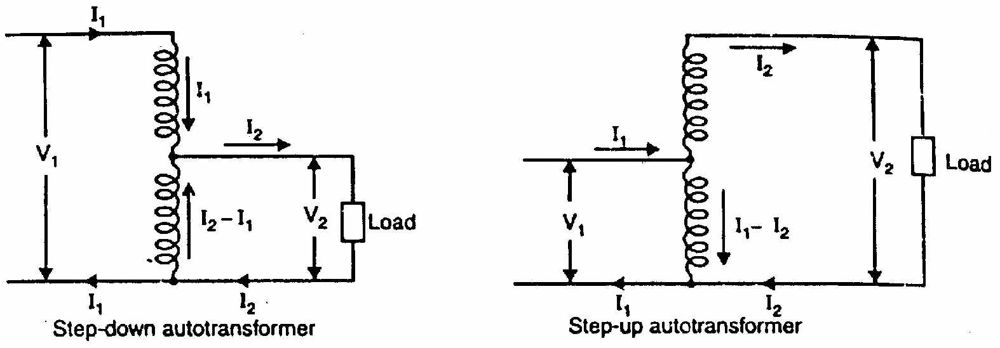
*Fig. (7.37): Current distribution in an autotransformer on load.*

<!-- Page 165 -->
<!-- Printed Page 160 -->

## 7.34 Theory of Autotransformer

Consider an ideal step-down autotransformer shown in **Fig. (7.38)**:
- Total winding $1-3$ has $N_1$ turns (primary, applied voltage $V_1$).
- Tapped section $2-3$ has $N_2$ turns (secondary, load voltage $V_2$).
- Upper section $1-2$ has $N_1 - N_2$ turns, across which voltage is $V_1 - V_2$.
- The current in section $1-2$ is primary current $I_1$.
- The current in common section $2-3$ is the difference $(I_2 - I_1)$.

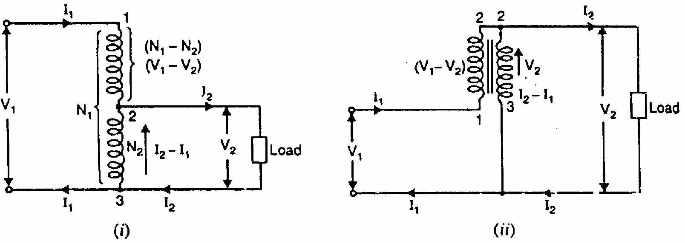
*Fig. (7.38): (i) Ideal autotransformer on load. (ii) Equivalent circuit.*

From the m.m.f. balance in common and upper sections:
$$(N_1 - N_2) I_1 = N_2 (I_2 - I_1) \implies N_1 I_1 = N_2 I_2$$

$$\mathbf{\frac{V_2}{V_1} = \frac{N_2}{N_1} = \frac{I_1}{I_2} = K}$$

### Power Transfer in Autotransformer:
Power is transferred from primary to secondary by two mechanisms:
1. **Inductively** (by transformer action):
   $$\mathbf{\text{Inductive Power} = V_2 (I_2 - I_1) = V_2 I_2 \left(1 - \frac{I_1}{I_2}\right) = \text{Output} \times (1 - K)}$$
2. **Conductively** (by direct conduction through common winding):
   $$\mathbf{\text{Conducted Power} = V_2 I_1 = V_2 I_2 \left(\frac{I_1}{I_2}\right) = \text{Output} \times K}$$

$$\mathbf{\text{Total Output} = \text{Inductive Power} + \text{Conducted Power} = (1 - K) \times \text{Input} + K \times \text{Input}}$$

<!-- Page 166 -->
<!-- Printed Page 161 -->

<!-- Page 167 -->
<!-- Printed Page 162 -->

## 7.35 Saving of Copper in Autotransformer

The weight of copper in any winding is proportional to the product of number of turns and rated current ($W \propto N \times I$).

In an **ordinary 2-winding transformer**:
$$W_o \propto N_1 I_1 + N_2 I_2$$
Since $N_2 I_2 = N_1 I_1$:
$$W_o \propto 2 N_1 I_1$$

In an **autotransformer**:
- Section $1-2$: turns $(N_1 - N_2)$, current $I_1$.
- Section $2-3$: turns $N_2$, current $(I_2 - I_1)$.
$$W_a \propto (N_1 - N_2) I_1 + N_2 (I_2 - I_1)$$
$$W_a \propto N_1 I_1 - N_2 I_1 + N_2 I_2 - N_2 I_1 = 2 N_1 I_1 - 2 N_2 I_1 = 2 N_1 I_1 (1 - K)$$

$$\mathbf{\frac{W_a}{W_o} = 1 - K \implies W_a = (1 - K) W_o}$$

$$\mathbf{\text{Saving of Copper} = W_o - W_a = K \times W_o}$$

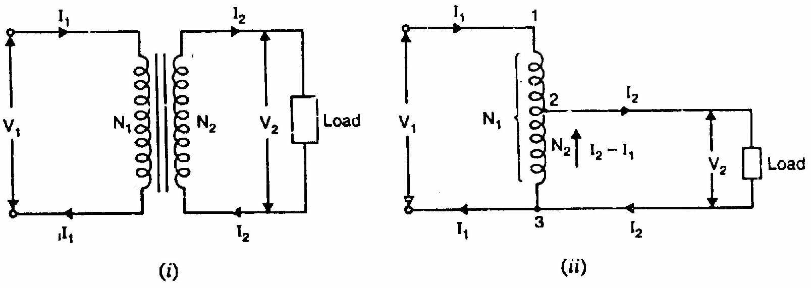
*Fig. (7.39): Comparison of copper requirement between two-winding transformer and autotransformer.*

<!-- Page 168 -->
<!-- Printed Page 163 -->

> **Significance:** When transformation ratio $K$ is close to unity (e.g., $K = 0.9$), the copper saving is $90\%$! Autotransformers become increasingly economical as $K \to 1$.

## 7.36 Advantages and Disadvantages of Autotransformers

### Advantages:
1. **Less copper required**: Weight of copper saved is $K \times W_o$.
2. **Lower cost and smaller size**: Less iron and copper.
3. **Higher efficiency**: Ohmic losses and core losses are significantly reduced.
4. **Superior voltage regulation**: Lower leakage reactance and lower resistance.

### Disadvantages:
1. **Loss of electrical isolation**: Primary and secondary are directly connected electrically. A high voltage on primary can appear on secondary if common winding breaks.
2. **Higher short-circuit current**: Because leakage impedance is low, short-circuit current is much larger.

<!-- Page 169 -->
<!-- Printed Page 164 -->

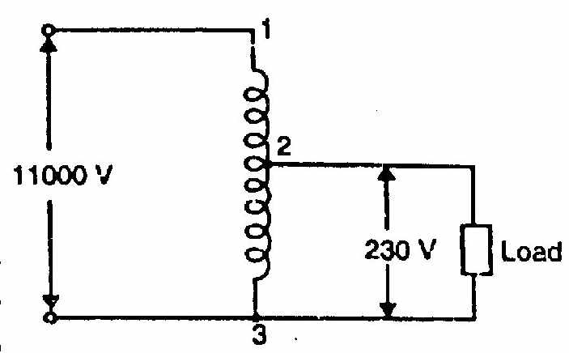
*Fig. (7.40): Danger of using autotransformer for large step-down voltages without isolation.*

## 7.37 Applications of Autotransformers

1. Interconnecting power systems operating at nearby high-voltage levels (e.g., 400 kV to 220 kV).
2. Starting of 3-phase induction motors (autotransformer starters).
3. Variable a.c. voltage supply in laboratories (Variac / Dimmerstat).
4. Boosters to raise voltage at ends of long transmission lines.

## 7.38 Conversion of Two-Winding Transformer into Autotransformer

Any standard two-winding transformer can be reconnected as an autotransformer by connecting primary and secondary windings in series aiding or series opposing. The kVA rating of the resulting autotransformer is much higher than the original two-winding rating!

$$\mathbf{\text{kVA}_{\text{auto}} = \text{kVA}_{\text{2-wdg}} \times \frac{1}{1 - K}}$$

<!-- Page 170 -->
<!-- Printed Page 165 -->

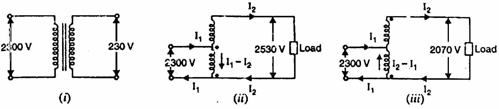
*Fig. (7.41): Reconnection of two-winding transformer into high-capacity autotransformer.*

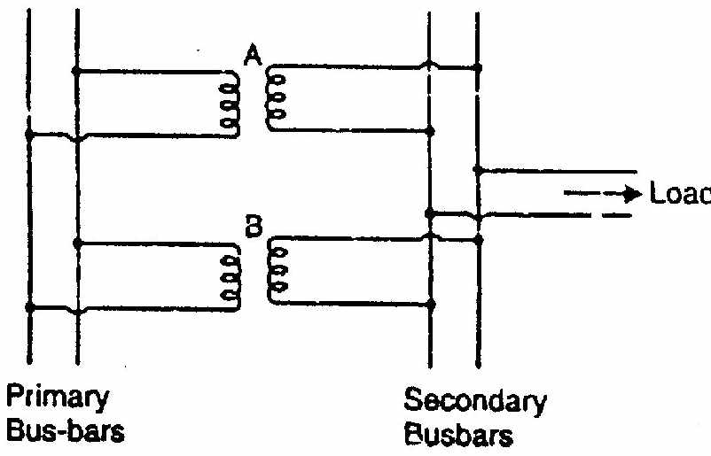
*Fig. (7.42): Two single-phase transformers connected in parallel across common busbars.*

## 7.39 Parallel Operation of Single-Phase Transformers

Two or more transformers are said to be connected in parallel if their primary windings are connected to common supply busbars and their secondary windings are connected to common load busbars.

### Conditions for Parallel Operation:
1. **Essential Conditions:**
   - **Correct polarity**: Secondaries must be connected with identical instantaneous polarity. Wrong polarity causes dead short-circuit!
   - **Equal voltage ratios**: Primary and secondary voltage ratings must be identical to avoid circulating currents at no load.
2. **Desirable Conditions (for ideal load sharing):**
   - **Identical per-unit impedance**: Transformers share load proportional to their kVA ratings.
   - **Equal $X/R$ ratio**: Both transformers operate at the same power factor as the load.

<!-- Page 171 -->
<!-- Printed Page 166 -->

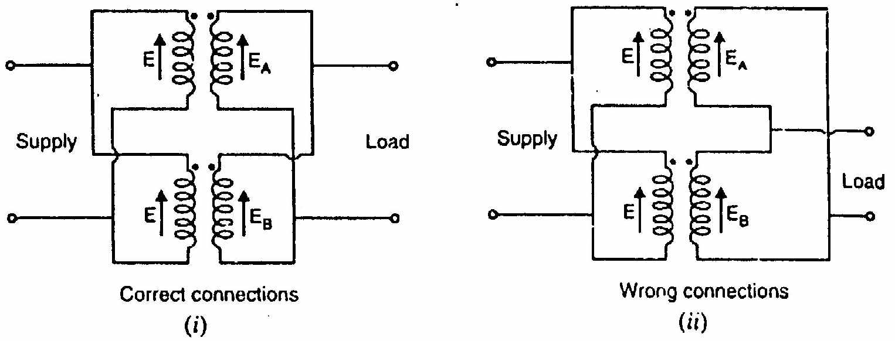
*Fig. (7.43): (i) Correct polarity connection. (ii) Wrong polarity causing dead short-circuit.*

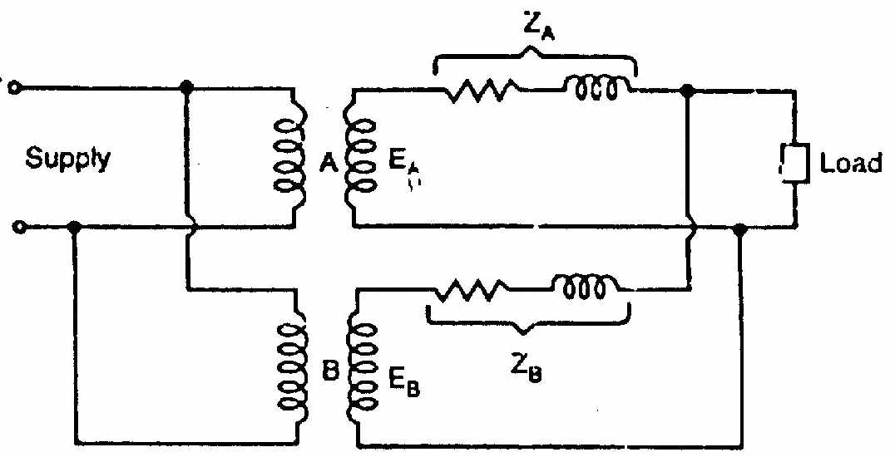
*Fig. (7.44): Circulating current between secondaries due to voltage imbalance.*

<!-- Page 172 -->
<!-- Printed Page 167 -->

## 7.40 Single-Phase Equal Voltage Ratio Transformers in Parallel

When voltage ratios are equal, no-load secondary e.m.f.s are identical ($E_A = E_B = E_2$), so there is zero circulating current at no load.

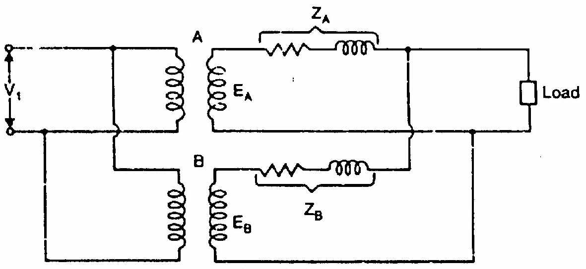
*Fig. (7.45): Equivalent circuit of two equal-ratio transformers sharing load.*

<!-- Page 173 -->
<!-- Printed Page 168 -->

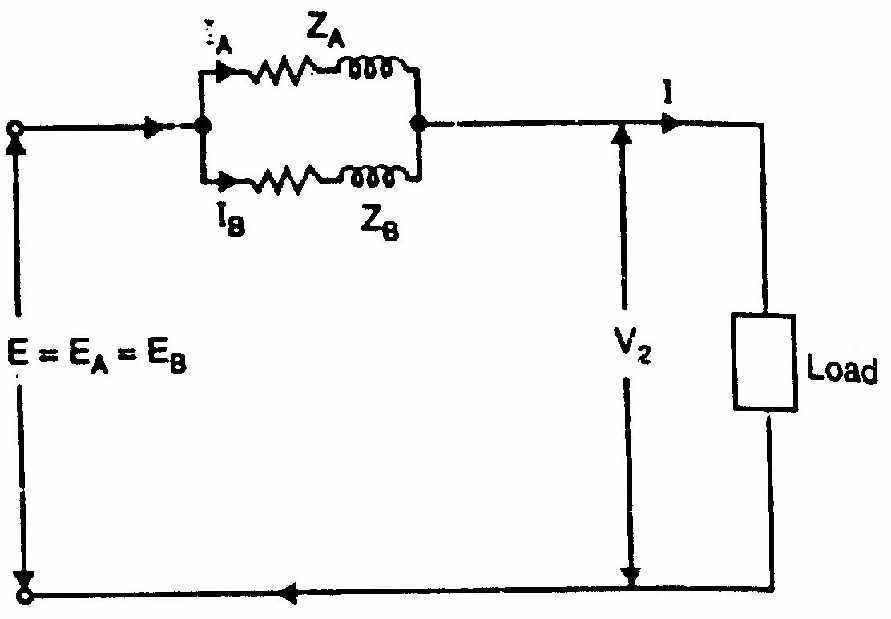
*Fig. (7.46): Parallel impedance model for load current division.*

Let $Z_A$ and $Z_B$ be the impedances referred to secondary:
$$\mathbf{I_A = I \frac{Z_B}{Z_A + Z_B}}$$
$$\mathbf{I_B = I \frac{Z_A}{Z_A + Z_B}}$$

Multiplying both sides by terminal voltage $V_2 \times 10^{-3}$:
$$\mathbf{S_A = S \frac{Z_B}{Z_A + Z_B}}$$
$$\mathbf{S_B = S \frac{Z_A}{Z_A + Z_B}}$$

where $S$ is total load kVA, $S_A$ and $S_B$ are kVA shared by transformers A and B.

<!-- Page 174 -->
<!-- Printed Page 169 -->

If ohmic impedances are in inverse proportion to their kVA ratings, both transformers will operate at full load simultaneously without overloading either.

## 7.41 Single-Phase Unequal Voltage Ratio Transformers in Parallel

When voltage ratios are unequal ($E_A \neq E_B$), a **circulating current** $I_c$ flows between secondaries even on no load:
$$\mathbf{I_c = \frac{E_A - E_B}{Z_A + Z_B}}$$

<!-- Page 175 -->
<!-- Printed Page 170 -->

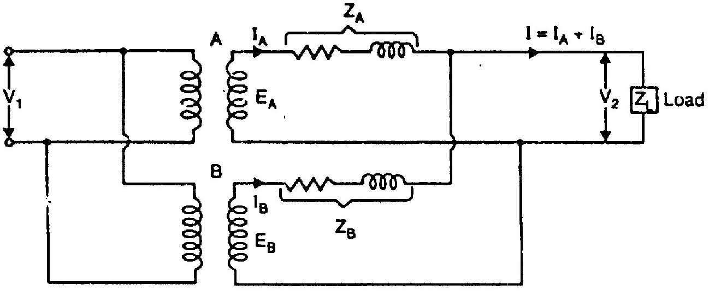
*Fig. (7.47): Parallel operation with unequal secondary e.m.f.s $E_A$ and $E_B$.*

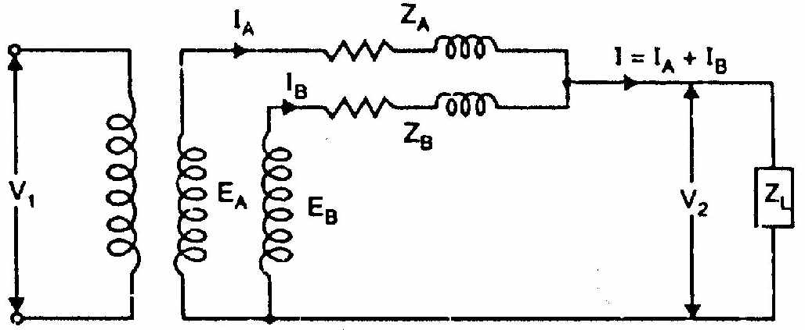
*Fig. (7.48): Equivalent network for determining load currents $I_A$ and $I_B$.*

<!-- Page 176 -->
<!-- Printed Page 171 -->

Under load, by applying Kirchhoff's Voltage Law:
$$\mathbf{I_A = \frac{E_A Z_B + (E_A - E_B) Z_L}{Z_A Z_B + Z_L(Z_A + Z_B)} = \frac{(E_A - E_B) + I Z_B}{Z_A + Z_B}}$$
$$\mathbf{I_B = \frac{E_B Z_A - (E_A - E_B) Z_L}{Z_A Z_B + Z_L(Z_A + Z_B)} = \frac{(E_B - E_A) + I Z_A}{Z_A + Z_B}}$$

The common terminal voltage on load is:
$$\mathbf{V_2 = I Z_L = (I_A + I_B) Z_L = \frac{E_A Z_B + E_B Z_A}{Z_A + Z_B + \frac{Z_A Z_B}{Z_L}}}$$

## 7.42 Three-Phase Transformer

Three-phase transformation can be accomplished either by:
1. A **bank of three separate single-phase transformers**.
2. A single **three-phase transformer** on a common three-limbed core.

<!-- Page 177 -->
<!-- Printed Page 172 -->

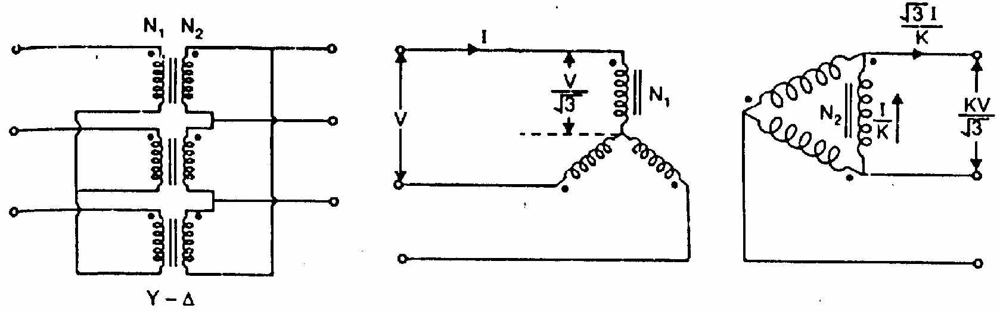
*Fig. (7.49): Bank of three single-phase transformers connected in Y-$\Delta$.*

<!-- Page 178 -->
<!-- Printed Page 173 -->

A single 3-phase unit weighs about 15% less, occupies 30% less floor area, and costs about 15% less than a bank of three separate single-phase units.

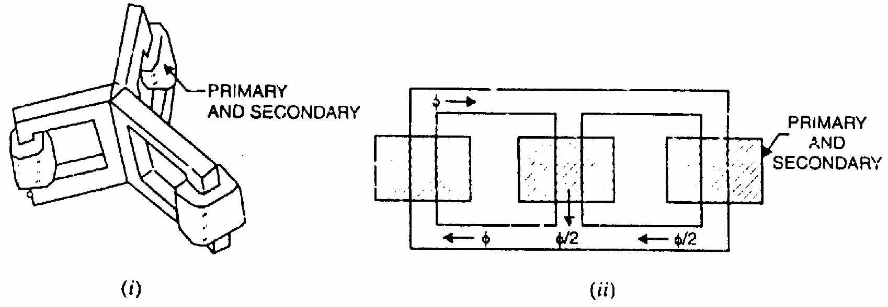
*Fig. (7.50): Three-legged core construction showing how any two limbs provide return path for the third.*

<!-- Page 179 -->
<!-- Printed Page 174 -->

## 7.43 Three-Phase Transformer Connections

The four standard 3-phase connections are:
1. **Star-Star ($Y-Y$):**
   - Line voltage is $\sqrt{3} \times$ phase voltage: $V_L = \sqrt{3} V_{ph}$.
   - Line current equals phase current: $I_L = I_{ph}$.
   - Requires neutral connection; prone to 3rd harmonic distortion unless tertiary delta winding is added.
2. **Delta-Delta ($\Delta-\Delta$):**
   - $V_L = V_{ph}$ and $I_L = \sqrt{3} I_{ph}$.
   - Excellent for large low-voltage currents.
   - If one transformer fails, remaining two can operate in **Open-Delta ($V-V$)** at 58% capacity.
3. **Star-Delta ($Y-\Delta$):**
   - Commonly used for **stepping down** high transmission voltages at distribution substations.
4. **Delta-Star ($\Delta-Y$):**
   - Commonly used for **stepping up** at generating stations, and for 4-wire secondary distribution systems (providing 3-phase power and single-phase lighting from neutral).

*Fig. (7.51): Standard 3-phase connections: (i) Y-Y, (ii) $\Delta-\Delta$, (iii) Y-$\Delta$, (iv) $\Delta$-Y.*

<!-- Page 180 -->
<!-- Printed Page 175 -->

<!-- Page 181 -->
<!-- Printed Page 176 -->

## 7.44 Three-Phase Transformation with Two Single-Phase Transformers

Two single-phase transformers can transform three-phase power using:
1. **Open-Delta or V-V Connection**
2. **Scott Connection or T-T Connection**

## 7.45 Open-Delta or V-V Connection

If one transformer of a $\Delta-\Delta$ bank is removed or damaged, the remaining two transformers continue to provide balanced 3-phase voltages across the load. This is called the **Open-Delta (or V-V) connection**.

*Fig. (7.52): (i) Open-Delta (V-V) connection. (ii) Phasor diagram showing phase relations.*

### Capacity of Open-Delta (V-V) Connection:
In a complete $\Delta-\Delta$ bank with three transformers:
$$S_{\Delta-\Delta} = 3 V_{ph} I_{ph} = \sqrt{3} V_L I_L = 3 V I$$

In the $V-V$ bank with two transformers:
- The line current is limited to the rated winding current $I$ of one transformer ($I_L = I$).
- Therefore, total 3-phase kVA capacity is:
  $$\mathbf{S_{V-V} = \sqrt{3} V_L I_L = \sqrt{3} V I}$$

Comparing capacities:
$$\mathbf{\frac{S_{V-V}}{S_{\Delta-\Delta}} = \frac{\sqrt{3} V I}{3 V I} = \frac{1}{\sqrt{3}} = 0.577 = 57.7\%}$$

The combined capacity of the two transformers is:
$$\frac{\sqrt{3} V I}{2 V I} = \frac{\sqrt{3}}{2} = 0.866 = 86.6\% \text{ of their installed rating}$$

<!-- Page 182 -->
<!-- Printed Page 177 -->

## 7.46 Power Factor of Transformers in V-V Circuit

Even when the load operates at unity power factor, the two transformers in V-V operate at different power factors:
$$\text{p.f. of Transformer 1} = \cos(30^\circ - \phi)$$
$$\text{p.f. of Transformer 2} = \cos(30^\circ + \phi)$$

1. **When load p.f. = 1 ($\phi = 0^\circ$):**
   - Each transformer operates at $\cos 30^\circ = 0.866$ power factor.
2. **When load p.f. = 0.866 lagging ($\phi = 30^\circ$):**
   - Transformer 1 operates at $\cos(30^\circ - 30^\circ) = 1.0$.
   - Transformer 2 operates at $\cos(30^\circ + 30^\circ) = 0.5$.
3. **When load p.f. = 0.5 lagging ($\phi = 60^\circ$):**
   - Transformer 1 operates at $\cos(30^\circ - 60^\circ) = 0.866$.
   - Transformer 2 operates at $\cos(30^\circ + 60^\circ) = \cos 90^\circ = 0$ (delivers zero power!).

<!-- Page 183 -->
<!-- Printed Page 178 -->

## 7.47 Applications of Open-Delta (V-V) Connection

1. Emergency service when one transformer of a $\Delta-\Delta$ bank fails.
2. Supplying a temporary load which is expected to grow in the future (third transformer added later).

## 7.48 Scott Connection (or T-T Connection)

The **Scott connection** uses two single-phase transformers to convert:
- **3-Phase to 2-Phase** (or vice-versa).
- **3-Phase to 3-Phase** at another voltage level.

### Transformer Design:
1. **Main Transformer ($M$):**
   - Primary has $N_1$ turns with a center-tap $C$ ($50\%$ tap).
   - Connected directly across two lines of the 3-phase supply ($B$ and $Y$).
2. **Teaser Transformer ($T$):**
   - Primary has **$0.866 N_1$ turns** ($\frac{\sqrt{3}}{2} N_1 = 86.6\%$ tap).
   - Connected between line $R$ and the center-tap $C$ of the main transformer.
3. Secondaries of both transformers have identical turns $N_2$.

<!-- Page 184 -->
<!-- Printed Page 179 -->

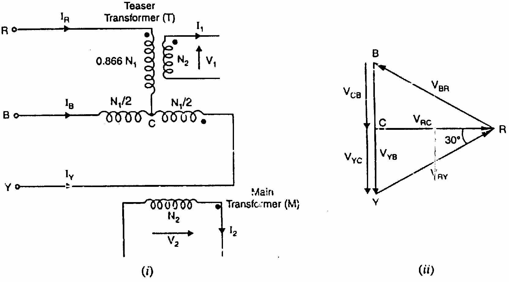
*Fig. (7.53): (i) Scott connection schematic. (ii) Primary phasor relations.*

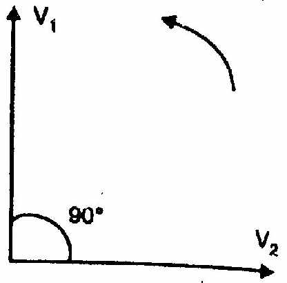
*Fig. (7.54): Balanced two-phase secondary voltages $V_1$ and $V_2$ in quadrature ($90^\circ$).*

<!-- Page 185 -->
<!-- Printed Page 180 -->

### Proof of Balanced Two-Phase Output:
Voltage across main primary is line voltage $V_L$:
$$V_{BY} = V_L$$

Voltage between terminal $R$ and center-tap $C$ is:
$$V_{RC} = V_L \cos 30^\circ = \frac{\sqrt{3}}{2} V_L = 0.866 V_L$$

Since teaser primary has $0.866 N_1$ turns:
$$\frac{V_{RC}}{\text{Teaser Turns}} = \frac{0.866 V_L}{0.866 N_1} = \frac{V_L}{N_1} = \text{Volts per turn of Main Transformer}$$

The secondary voltages are:
$$V_1 = V_{M(sec)} = V_L \left(\frac{N_2}{N_1}\right)$$
$$V_2 = V_{T(sec)} = (0.866 V_L) \left(\frac{N_2}{0.866 N_1}\right) = V_L \left(\frac{N_2}{N_1}\right)$$

Furthermore, $V_{RC}$ is in space and time quadrature ($90^\circ$) with $V_{BY}$. Thus:
$$\mathbf{V_1 = V_2 \quad \text{and they are in } 90^\circ \text{ phase quadrature!}}$$
This establishes a **balanced two-phase system**!

<!-- Page 186 -->
<!-- Printed Page 181 -->

## 7.49 Applications of Transformers: Instrument Transformers

In high-voltage AC power systems, ordinary ammeters and voltmeters cannot be connected directly to high-voltage lines. **Instrument transformers** step down high currents and voltages to standard low values (5 A and 110 V) for safe measurement:

1. **Current Transformer (C.T.):**
   - Primary consists of a single turn (or very few turns of heavy conductor) connected in **series** with the power line.
   - Secondary has many turns of fine wire connected across a standard 5 A a.c. ammeter.
   - Secondary current:
     $$\mathbf{I_S = I_P \times \left(\frac{N_P}{N_S}\right)}$$
   - **Crucial Safety Rule:** The secondary of a C.T. must **NEVER be open-circuited** while primary is energized! An open secondary produces dangerously high core flux and lethal voltages across secondary terminals.
2. **Potential Transformer (P.T.):**
   - High-precision step-down transformer connected in **parallel** across the high voltage line.
   - Secondary is designed for standard 110 V connected across a standard a.c. voltmeter.

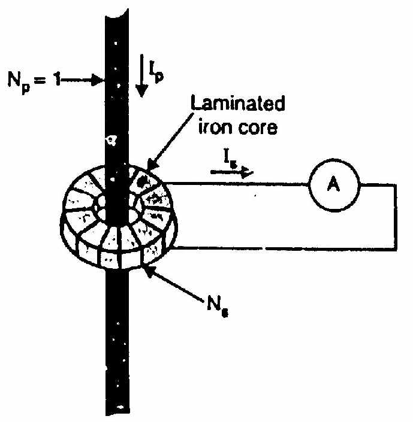
*Fig. (7.55): Current Transformer (C.T.) connection in high-current AC line.*

*Fig. (7.56): Potential Transformer (P.T.) connection across high-voltage AC line.*

---
*End of Chapter 7: Transformer*
