# Chapter 8: Three Phase Induction Motors
**Textbook:** *Principles of Electrical Machines* by V.K. Mehta & Rohit Mehta (Chapter 8, Pages 187–232)  
**Course:** ECE 2207 — Electrical Machine-I  
**Syllabus Coverage:** Rotating Magnetic Field (RMF) Mathematical & Graphical Analysis, Construction (Squirrel-Cage and Slip-Ring / Wound Rotor), Principle of Operation, Slip and Rotor Frequency, Standstill vs Running Conditions, Torque Equations, Starting Torque, Maximum Torque Condition, Torque-Slip Characteristics, Power Flow Stages ($1 : s : 1-s$), Equivalent Circuit of Induction Motor, Load Representation ($R_L' = R_2'(1-s)/s$), Starting Methods (DOL, Stator Resistor, Autotransformer, Star-Delta, Rotor Resistance), Double Squirrel-Cage Motors.

---

<!-- Page 187 -->
<!-- Printed Page 181 -->

## Introduction

The three-phase induction motors are the most widely used electric motors in industry. They run at essentially constant speed from no-load to full-load. However, the speed is frequency dependent and consequently these motors are not easily adapted to speed control. We usually prefer d.c. motors when large speed variations are required. Nevertheless, 3-phase induction motors have simple and rugged construction, low initial cost, high efficiency, and reasonably good power factor.

### Advantages and Disadvantages of Induction Motors

**Advantages:**
1. Simple and extremely rugged construction.
2. Low cost and minimum maintenance requirements (no brushes or commutators in squirrel-cage type).
3. Reasonably high efficiency (85% to 95%).
4. Reasonably good power factor at normal loads (0.8 to 0.88 lagging).
5. Self-starting with fairly good starting torque.

**Disadvantages:**
1. Speed cannot be varied easily without sacrificing efficiency.
2. Speed decreases slightly with increase in load.
3. Starting torque is somewhat inferior to that of a d.c. shunt motor.
4. Draws high lagging magnetizing current at light loads, leading to very low power factor (0.1 to 0.2 lagging at no load).

## 8.1 Three-Phase Induction Motor

An induction motor is an asynchronous a.c. motor in which electric power is supplied to the stator by conduction, and to the rotor by induction (transformer action). It functions on the principle of mutual induction between stator and rotor windings.

<!-- Page 188 -->
<!-- Printed Page 182 -->

## 8.2 Construction

A 3-phase induction motor has two main parts:
1. **Stator** (stationary part)
2. **Rotor** (rotating part)

The rotor is separated from the stator by a very small air-gap, ranging from 0.4 mm in small motors to 4 mm in large motors.

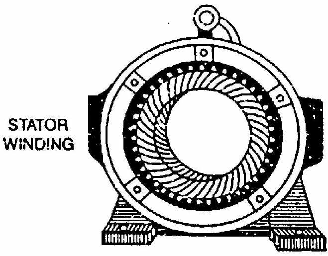
*Fig. (8.1): Exploded view showing stator frame, stator core with 3-phase winding, squirrel-cage rotor, and end-shields.*

### 1. Stator
The stator consists of:
- **Stator Frame:** Cast iron or fabricated steel outer housing that supports the stator core and encloses the machine.
- **Stator Core:** Built up of high-grade silicon steel stampings (laminations of 0.4 mm to 0.5 mm thickness), slotted on the inner periphery to carry the stator winding. Laminated construction reduces hysteresis and eddy-current losses.
- **Stator Winding:** A balanced 3-phase distributed winding placed in the stator slots and insulated with high-grade varnish and mica. The winding is arranged for a definite number of poles ($P$), determined by the required synchronous speed ($N_s = 120f/P$). The windings may be star ($\text{Y}$) or delta ($\Delta$) connected.

### 2. Rotor
There are two distinct types of rotors used in 3-phase induction motors:
- **Squirrel-Cage Rotor**
- **Phase-Wound or Slip-Ring Rotor**

<!-- Page 189 -->
<!-- Printed Page 183 -->

#### (i) Squirrel-Cage Rotor
The squirrel-cage rotor consists of a laminated cylindrical core with parallel slots on its outer periphery.
- Thick, heavy copper, aluminium, or alloy bars are placed in each slot.
- All bars are permanently short-circuited at both ends by heavy metallic rings called **end-rings**, forming a completely closed cage structure resembling a squirrel cage (**Fig. 8.2**).
- The rotor slots are not parallel to the shaft axis but are deliberately **skewed** at a slight angle.

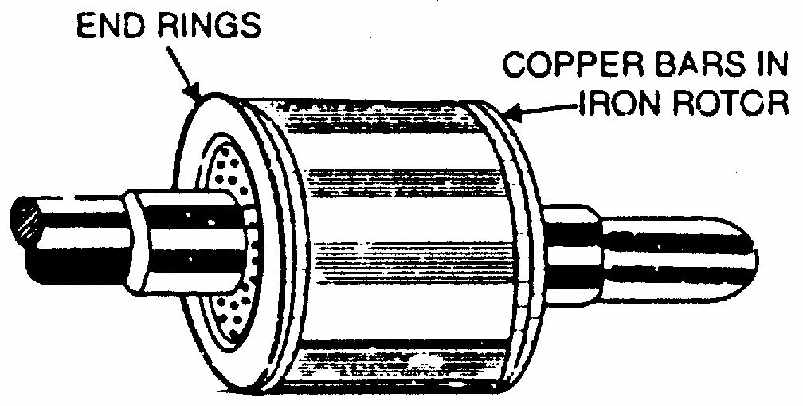
*Fig. (8.2): Squirrel-cage rotor construction showing copper/aluminium bars short-circuited by end rings.*

**Purpose of Skewing Rotor Slots:**
1. Reduces magnetic humming noise during operation.
2. Prevents **cogging** (magnetic locking between stator and rotor teeth at standstill).
3. Produces a more uniform torque and smoother operation.

#### (ii) Phase-Wound or Slip-Ring Rotor
A wound rotor consists of a laminated cylindrical core slotted on its outer periphery, carrying a balanced 3-phase distributed winding similar to the stator winding (**Fig. 8.3**).
- The rotor winding is wound for the **same number of poles** as the stator winding.
- The rotor coils are always star-connected.
- The three free terminals are brought out through the hollow shaft and connected to **three insulated bronze slip rings** mounted on the rotor shaft.
- Stationary carbon brushes press against the slip rings, allowing **external variable three-phase resistors** to be inserted into the rotor circuit during starting (**Fig. 8.4**).

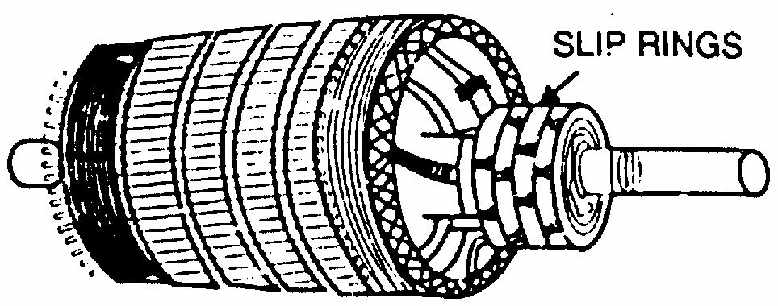
*Fig. (8.3): Slip-ring (wound) rotor showing 3-phase winding brought out to three insulated slip rings.*

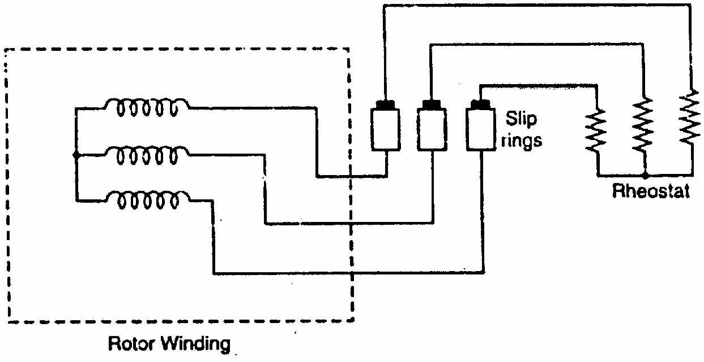
*Fig. (8.4): Connection of external 3-phase variable resistor to slip-ring rotor for starting.*

<!-- Page 190 -->
<!-- Printed Page 184 -->

## 8.3 Rotating Magnetic Field Due to 3-Phase Currents

When a balanced 3-phase supply is connected to a balanced 3-phase stator winding, it produces a **Rotating Magnetic Field (RMF)** in the air gap:
1. The resultant magnetic field has a **constant magnitude** equal to $1.5 \Phi_m$ (where $\Phi_m$ is the maximum flux produced by any individual phase).
2. It rotates in space at a constant speed called the **synchronous speed** ($N_s$):
   $$\mathbf{N_s = \frac{120 f}{P} \quad \text{r.p.m.}}$$

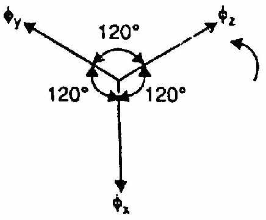
*Fig. (8.5): Two-pole balanced 3-phase stator winding carrying sinusoidal currents.*


*Fig. (8.6): (i) Stator layout. (ii) Sinusoidal waveforms of phase fluxes. (iii) Phasor positions at successive time instants.*

Consider three sinusoidal phase currents producing magnetic fluxes:
$$\phi_X = \Phi_m \sin \omega t$$
$$\phi_Y = \Phi_m \sin(\omega t - 120^\circ)$$
$$\phi_Z = \Phi_m \sin(\omega t - 240^\circ) = \Phi_m \sin(\omega t + 120^\circ)$$

<!-- Page 191 -->
<!-- Printed Page 185 -->

### Mathematical Proof of Rotating Magnetic Field at Successive Instants:

#### 1. At Instant 1 ($\omega t = 0^\circ$):
$$\phi_X = \Phi_m \sin 0^\circ = 0$$
$$\phi_Y = \Phi_m \sin(-120^\circ) = -\frac{\sqrt{3}}{2} \Phi_m = -0.866 \Phi_m$$
$$\phi_Z = \Phi_m \sin(-240^\circ) = \Phi_m \sin 120^\circ = +\frac{\sqrt{3}}{2} \Phi_m = +0.866 \Phi_m$$

The resultant flux $\Phi_r$ is obtained by resolving vectors along horizontal and vertical axes (**Fig. 8.7**):
$$\Phi_r = 2 \times \left(0.866 \Phi_m \cos 30^\circ\right) = 2 \times 0.866 \Phi_m \times \frac{\sqrt{3}}{2} = 1.5 \Phi_m$$
The resultant flux points horizontally to the right ($0^\circ$).

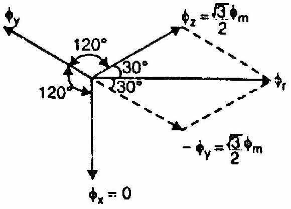
*Fig. (8.7): Vector addition of phase fluxes at: (i) Instant 1 ($\omega t = 0^\circ$). (ii) Instant 2 ($\omega t = 30^\circ$).*

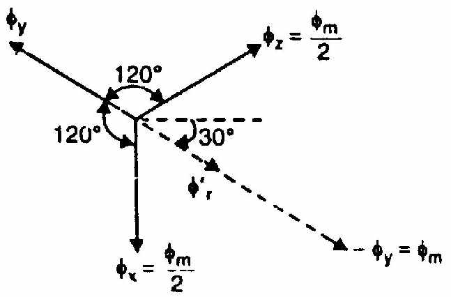
*Fig. (8.8): Vector addition of phase fluxes at Instant 3 ($\omega t = 60^\circ$).*

<!-- Page 192 -->
<!-- Printed Page 186 -->

#### 2. At Instant 2 ($\omega t = 30^\circ$):
$$\phi_X = \Phi_m \sin 30^\circ = +0.5 \Phi_m$$
$$\phi_Y = \Phi_m \sin(-90^\circ) = -\Phi_m$$
$$\phi_Z = \Phi_m \sin(150^\circ) = +0.5 \Phi_m$$
Resolving horizontally and vertically:
$$\Phi_r = 1.5 \Phi_m \quad \text{directed at } -30^\circ \text{ (rotated by } 30^\circ \text{ clockwise!)}$$

#### 3. At Instant 3 ($\omega t = 60^\circ$):
$$\phi_X = \Phi_m \sin 60^\circ = +0.866 \Phi_m$$
$$\phi_Y = \Phi_m \sin(-60^\circ) = -0.866 \Phi_m$$
$$\phi_Z = \Phi_m \sin 180^\circ = 0$$
$$\Phi_r = 1.5 \Phi_m \quad \text{directed at } -60^\circ \text{ (rotated by } 60^\circ \text{ clockwise!)}$$

#### 4. At Instant 4 ($\omega t = 90^\circ$):
$$\Phi_r = 1.5 \Phi_m \quad \text{directed at } -90^\circ \text{ (pointing vertically downwards)}.$$

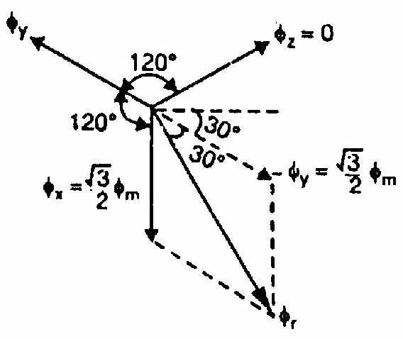
*Fig. (8.9): Vector addition of phase fluxes at Instant 4 ($\omega t = 90^\circ$), pointing vertically downward.*

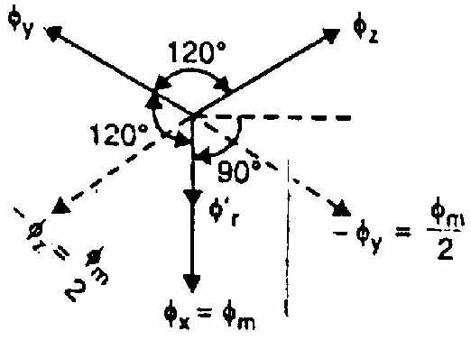
*Fig. (8.10): Complete rotational progression of resultant magnetic flux vector through one electrical cycle.*

<!-- Page 193 -->
<!-- Printed Page 187 -->

### Conclusions:
1. The resultant magnetic field has a **strictly constant magnitude**:
   $$\mathbf{\Phi_r = \frac{3}{2} \Phi_m = 1.5 \Phi_m}$$
2. The resultant field **rotates continuously in space** at uniform angular velocity.
3. In one complete electrical cycle ($T = 1/f$ seconds), the field rotates through $360^\circ$ electrical (one pair of poles).

### Synchronous Speed ($N_s$):
For a machine with $P$ poles:
$$1 \text{ mechanical revolution} = \frac{P}{2} \text{ electrical cycles}$$
Therefore, in $f$ cycles/sec, the speed of rotation is:
$$n_s = \frac{f}{P/2} = \frac{2f}{P} \text{ rev/sec}$$

$$\mathbf{N_s = \frac{120 f}{P} \quad \text{r.p.m.}}$$

<!-- Page 194 -->
<!-- Printed Page 188 -->

### Reversal of Direction of Rotation:
To reverse the direction of rotation of a 3-phase induction motor, simply **interchange any two of the three supply lines** (e.g., swap Phase $Y$ and Phase $Z$). This changes the phase sequence from $R-Y-B$ to $R-B-Y$, reversing the rotation of the magnetic field from clockwise to counter-clockwise.

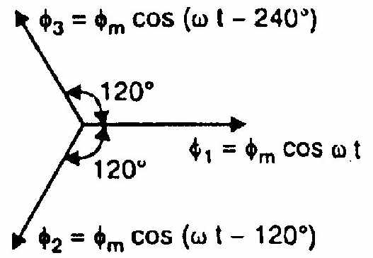
*Fig. (8.11): Reversing rotation by swapping line leads $L_2$ and $L_3$.*

## 8.4 Alternate Mathematical Analysis for Rotating Magnetic Field

The space distribution of flux produced by each phase along the air-gap circumference at angle $\theta$ can be expressed as:
$$\phi_1(\theta, t) = \Phi_m \sin(\omega t) \cos \theta$$
$$\phi_2(\theta, t) = \Phi_m \sin(\omega t - 120^\circ) \cos(\theta - 120^\circ)$$
$$\phi_3(\theta, t) = \Phi_m \sin(\omega t - 240^\circ) \cos(\theta - 240^\circ)$$

Using the trigonometric identity $2 \sin A \cos B = \sin(A - B) + \sin(A + B)$:
$$\phi_1 = \frac{\Phi_m}{2}[\sin(\omega t - \theta) + \sin(\omega t + \theta)]$$
$$\phi_2 = \frac{\Phi_m}{2}[\sin(\omega t - \theta) + \sin(\omega t + \theta - 240^\circ)]$$
$$\phi_3 = \frac{\Phi_m}{2}[\sin(\omega t - \theta) + \sin(\omega t + \theta - 480^\circ)]$$

Adding the three phase fluxes:
$$\phi_r(\theta, t) = \phi_1 + \phi_2 + \phi_3$$
Notice that the terms $\sin(\omega t + \theta)$, $\sin(\omega t + \theta - 240^\circ)$, and $\sin(\omega t + \theta - 120^\circ)$ form a balanced 3-phase set whose sum is identically zero!

$$\mathbf{\phi_r(\theta, t) = \frac{3}{2} \Phi_m \sin(\omega t - \theta) = 1.5 \Phi_m \sin(\omega t - \theta)}$$

This is the standard equation of a **forward travelling sinusoidal wave** of constant amplitude $1.5 \Phi_m$ rotating with angular velocity $\omega = 2\pi f$ radians/second!

<!-- Page 195 -->
<!-- Printed Page 189 -->

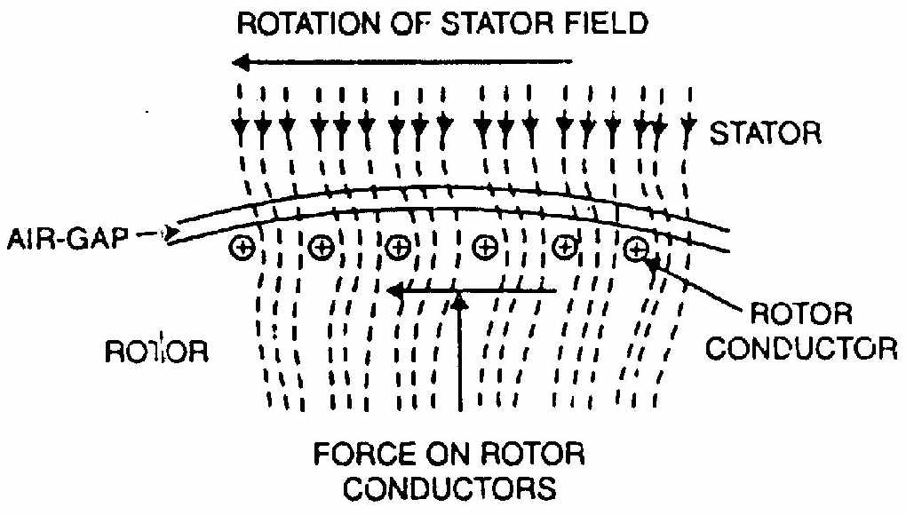
*Fig. (8.13): Travelling wave of resultant flux density moving around the stator bore.*

## 8.5 Principle of Operation

When the 3-phase stator winding is energized from a 3-phase AC source:
1. A rotating magnetic field revolving at synchronous speed $N_s = 120f/P$ is set up in the stator bore.
2. The rotating field sweeps across the stationary rotor conductors, cutting them and inducing e.m.f. in them according to Faraday's law of electromagnetic induction.
3. Since the rotor conductors form a closed circuit (either shorted by end rings in squirrel-cage, or connected externally in slip-ring), the induced e.m.f. drives circulating **rotor currents**.
4. According to **Lenz's law**, the direction of induced rotor current is such as to oppose the cause producing it. The cause of induced current is the relative motion between the rotating field and the rotor conductors.
5. Consequently, the rotor accelerates in the **same direction as the rotating magnetic field** in an effort to reduce the relative speed!

<!-- Page 196 -->
<!-- Printed Page 190 -->

### Why the Rotor Can Never Catch Up With Synchronous Speed ($N < N_s$):
If the rotor were to reach synchronous speed ($N = N_s$):
- The relative velocity between the stator field and rotor conductors would become zero ($N_s - N = 0$).
- No magnetic flux would be cut by the rotor conductors.
- No e.m.f. would be induced, no rotor current would flow, and developed electromagnetic torque would drop to **zero**!
- Mechanical friction and windage would immediately slow the rotor down below $N_s$.

Therefore, an induction motor can **never run at synchronous speed**. It must always run at a speed $N < N_s$.

## 8.6 Slip

The difference between the synchronous speed ($N_s$) of the rotating stator field and the actual speed ($N$) of the rotor is called the **slip speed**:
$$\text{Slip speed} = N_s - N$$

The **fractional slip** ($s$) is defined as the ratio of slip speed to synchronous speed:
$$\mathbf{s = \frac{N_s - N}{N_s}}$$

$$\mathbf{\% \text{ Slip} = \frac{N_s - N}{N_s} \times 100}$$

Rotor speed in terms of slip:
$$\mathbf{N = N_s (1 - s)}$$

- At standstill ($N = 0$): $s = \frac{N_s - 0}{N_s} = 1$ ($100\%$ slip).
- At synchronous speed ($N = N_s$): $s = 0$.
- In normal running conditions, full-load slip is small: typically **2% to 5%** ($s = 0.02 \text{ to } 0.05$).

## 8.7 Rotor Current Frequency

Let $P$ be the number of poles and $f$ be the supply frequency. At any rotor speed $N$, the relative speed of the rotating field with respect to the rotor conductors is $(N_s - N)$.

The frequency of the induced rotor e.m.f. and current ($f'$) is:
$$f' = \frac{(N_s - N) P}{120} = \left(\frac{N_s - N}{N_s}\right) \times \left(\frac{N_s P}{120}\right)$$

$$\mathbf{f' = s f}$$

<!-- Page 197 -->
<!-- Printed Page 191 -->

- At standstill ($s = 1$): $f' = f$ (rotor frequency equals stator supply frequency).
- At full-load speed ($s = 0.04$, $f = 50\text{ Hz}$): $f' = 0.04 \times 50 = 2\text{ Hz}$ (rotor frequency is very low!).

## 8.8 Effect of Slip on the Rotor Circuit

Let the standstill ($s = 1$) parameters per phase of the rotor be:
- $E_2$ = Standstill induced e.m.f. per phase
- $R_2$ = Rotor resistance per phase (independent of frequency/slip)
- $X_2 = 2\pi f L_2$ = Standstill rotor leakage reactance per phase
- $Z_2 = \sqrt{R_2^2 + X_2^2}$ = Standstill rotor impedance per phase

When running at slip $s$:
1. **Rotor Induced E.M.F. per Phase ($E_2'$):**
   $$\mathbf{E_2' = s E_2}$$
2. **Rotor Reactance per Phase ($X_2'$):**
   $$X_2' = 2\pi f' L_2 = 2\pi (s f) L_2 = s (2\pi f L_2)$$
   $$\mathbf{X_2' = s X_2}$$
3. **Rotor Impedance per Phase ($Z_2'$):**
   $$\mathbf{Z_2' = \sqrt{R_2^2 + (s X_2)^2}}$$

<!-- Page 198 -->
<!-- Printed Page 192 -->

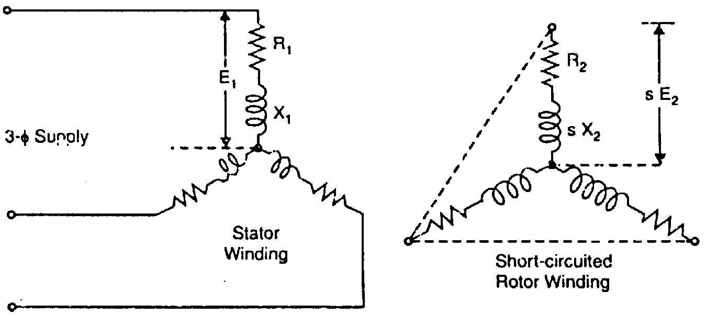
*Fig. (8.14): Rotor circuit representation at slip $s$, showing induced e.m.f. $sE_2$ and reactance $sX_2$.*

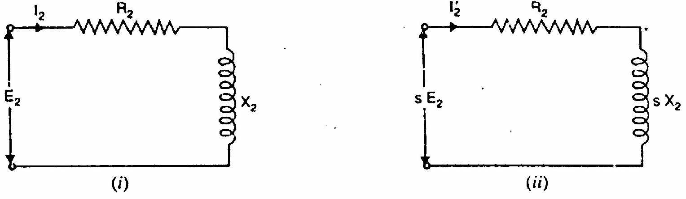
*Fig. (8.15): Rotor impedance triangle at slip $s$.*

## 8.9 Rotor Current

Under running conditions at slip $s$:
$$\mathbf{I_2' = \frac{E_2'}{Z_2'} = \frac{s E_2}{\sqrt{R_2^2 + (s X_2)^2}}}$$

Rotor circuit power factor:
$$\mathbf{\cos \theta_2' = \frac{R_2}{Z_2'} = \frac{R_2}{\sqrt{R_2^2 + (s X_2)^2}}}$$

<!-- Page 199 -->
<!-- Printed Page 193 -->

## 8.10 Rotor Torque

The electromagnetic torque $T$ developed by an induction motor is proportional to:
1. The stator mutual flux per pole $\Phi$.
2. The rotor current $I_2'$.
3. The power factor of the rotor circuit $\cos \theta_2'$.

$$T \propto \Phi I_2' \cos \theta_2'$$

Since stator flux $\Phi$ is proportional to induced e.m.f. $E_2$ ($\Phi \propto E_2$):
$$T \propto E_2 I_2' \cos \theta_2'$$

## 8.11 Starting Torque ($T_s$)

At starting, the motor is at standstill, so speed $N = 0$ and slip $s = 1$:
$$E_2' = E_2, \quad X_2' = X_2$$
$$I_2 = \frac{E_2}{\sqrt{R_2^2 + X_2^2}}, \quad \cos \theta_2 = \frac{R_2}{\sqrt{R_2^2 + X_2^2}}$$

Substituting into the torque equation:
$$T_s \propto E_2 \times \frac{E_2}{\sqrt{R_2^2 + X_2^2}} \times \frac{R_2}{\sqrt{R_2^2 + X_2^2}}$$

$$\mathbf{T_s = \frac{k E_2^2 R_2}{R_2^2 + X_2^2}}$$
where $k = \frac{3}{2\pi N_s}$ is a constant.

<!-- Page 200 -->
<!-- Printed Page 194 -->

## 8.12 Condition for Maximum Starting Torque

To find the rotor resistance $R_2$ that maximizes starting torque $T_s$, differentiate $T_s$ with respect to $R_2$ and set to zero:
$$\frac{d T_s}{d R_2} = k E_2^2 \left[\frac{(R_2^2 + X_2^2)(1) - R_2(2 R_2)}{(R_2^2 + X_2^2)^2}\right] = 0$$
$$R_2^2 + X_2^2 - 2 R_2^2 = 0 \implies X_2^2 - R_2^2 = 0$$

$$\mathbf{R_2 = X_2}$$

> **Key Rule:** The starting torque of an induction motor is maximum when **rotor resistance per phase equals standstill rotor reactance per phase** ($R_2 = X_2$).

<!-- Page 201 -->
<!-- Printed Page 195 -->

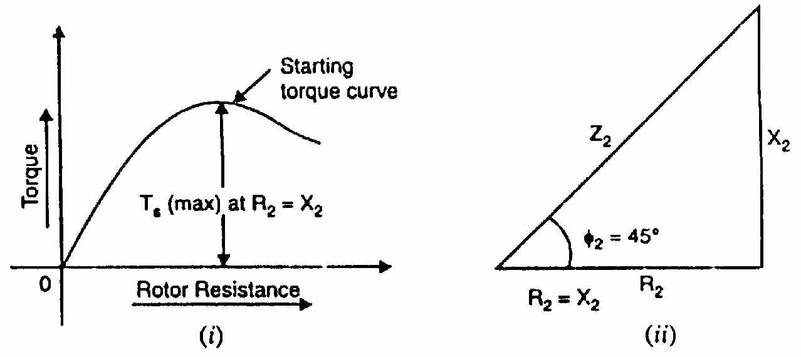
*Fig. (8.16): Variation of starting torque with rotor resistance $R_2$. Maximum starting torque occurs at $R_2 = X_2$.*

## 8.13 Effect of Change of Supply Voltage

Since induced e.m.f. $E_2$ is directly proportional to applied stator terminal voltage $V$ ($E_2 \propto V$):
$$T_s \propto V^2$$

$$\mathbf{T \propto V^2}$$

> **Important Consequence:** The torque developed by an induction motor is proportional to the **square of the applied voltage**. A 10% reduction in supply voltage results in an approximately $(0.9)^2 = 0.81$, or **19% reduction in torque**!

<!-- Page 202 -->
<!-- Printed Page 196 -->

## 8.14 Starting Torque of 3-Phase Induction Motors

1. **Squirrel-Cage Motor:**
   Rotor resistance $R_2$ is fixed and very low ($R_2 \ll X_2$), designed to ensure low copper losses and high running efficiency. Consequently, the starting power factor is low, and starting torque is modest ($1.5$ to $2$ times full-load torque), while starting current is high ($5$ to $8$ times full-load current).
2. **Slip-Ring Motor:**
   External resistance can be inserted into the rotor circuit through the slip rings at standstill to make $R_2 + R_{ext} = X_2$, achieving **maximum possible starting torque** with reduced starting current. As the motor accelerates, the external resistance is gradually cut out until slip rings are short-circuited.

## 8.15 Motor Under Load

As mechanical load is applied to the motor shaft:
1. The load causes the rotor to slow down slightly; hence **slip $s$ increases**.
2. Increased slip causes higher relative speed between rotating field and rotor, increasing rotor induced e.m.f. $E_2' = s E_2$.
3. Rotor current $I_2'$ increases, producing higher electromagnetic torque to balance the mechanical load.
4. Higher rotor current creates an increased demagnetizing m.m.f. on the stator. The stator responds by drawing higher primary current $I_1$ from the supply (exactly like a loaded transformer!).

<!-- Page 203 -->
<!-- Printed Page 197 -->

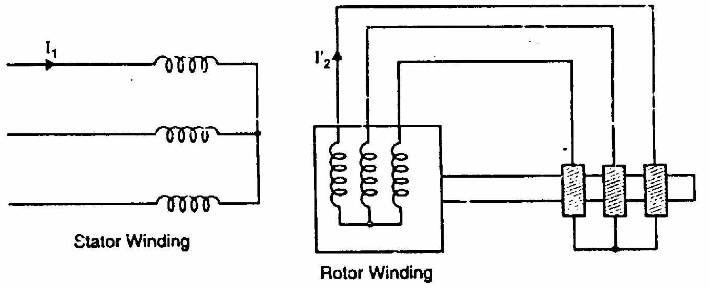
*Fig. (8.17): Torque production under running conditions.*

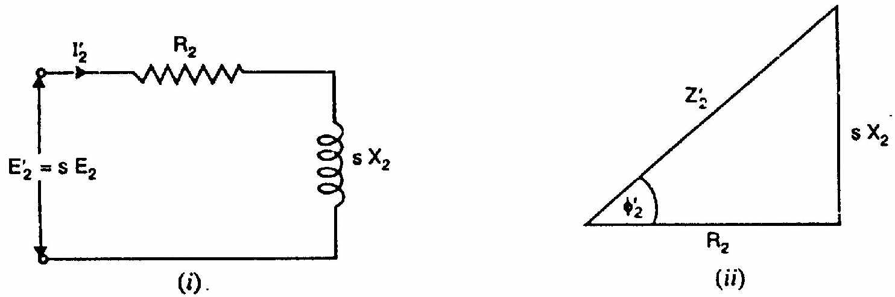
*Fig. (8.18): Rotor phasor relations under running conditions.*

## 8.16 Torque Under Running Conditions

Under running conditions at slip $s$:
$$E_2' = s E_2, \quad X_2' = s X_2$$
$$I_2' = \frac{s E_2}{\sqrt{R_2^2 + (s X_2)^2}}, \quad \cos \theta_2' = \frac{R_2}{\sqrt{R_2^2 + (s X_2)^2}}$$

$$T \propto E_2 I_2' \cos \theta_2' \propto E_2 \left[\frac{s E_2}{\sqrt{R_2^2 + (s X_2)^2}}\right] \left[\frac{R_2}{\sqrt{R_2^2 + (s X_2)^2}}\right]$$

$$\mathbf{T = \frac{k \cdot s \cdot E_2^2 \cdot R_2}{R_2^2 + (s X_2)^2}}$$

<!-- Page 204 -->
<!-- Printed Page 198 -->

If supply voltage $V$ is constant ($E_2 = \text{constant}$):
$$\mathbf{T \propto \frac{s R_2}{R_2^2 + (s X_2)^2}}$$

### Operating Regimes:
1. **Low-Slip Region (Normal Running Load, $s \ll 1$):**
   The term $(s X_2)^2$ is very small compared to $R_2^2$ and can be neglected:
   $$T \propto \frac{s R_2}{R_2^2} \propto \frac{s}{R_2}$$
   $$\mathbf{T \propto s}$$
   In the normal operating zone, **torque is directly proportional to slip**! The torque-slip curve is a straight line.
2. **High-Slip Region (Breakdown and Starting, $s \to 1$):**
   $(s X_2)^2$ is much larger than $R_2^2$:
   $$T \propto \frac{s R_2}{(s X_2)^2} \propto \frac{R_2}{s X_2^2}$$
   $$\mathbf{T \propto \frac{1}{s}}$$
   Here, torque is inversely proportional to slip (hyperbolic curve).

<!-- Page 205 -->
<!-- Printed Page 199 -->

## 8.17 Maximum Torque Under Running Conditions

To find the slip $s_m$ at which running torque is maximum, differentiate torque with respect to slip $s$:
$$\frac{d T}{ds} = 0 \implies \frac{d}{ds}\left[\frac{s R_2}{R_2^2 + s^2 X_2^2}\right] = 0$$
$$(R_2^2 + s^2 X_2^2)(R_2) - (s R_2)(2 s X_2^2) = 0 \implies R_2^2 - s^2 X_2^2 = 0$$

$$\mathbf{s_m = \frac{R_2}{X_2}}$$

Substituting $s = R_2 / X_2$ into the torque equation:
$$T_{max} \propto \frac{(R_2 / X_2) R_2}{R_2^2 + (R_2 / X_2)^2 X_2^2} = \frac{R_2^2 / X_2}{2 R_2^2} = \frac{1}{2 X_2}$$

$$\mathbf{T_{max} = \frac{k E_2^2}{2 X_2}}$$

### Fundamental Conclusions Regarding Maximum Torque ($T_{max}$):
1. **Independent of Rotor Resistance:** Maximum torque ($T_{max}$, also called **breakdown torque** or **pull-out torque**) is **independent of rotor resistance $R_2$**!
2. **Slip at Maximum Torque:** The slip $s_m$ at which maximum torque occurs is **directly proportional to rotor resistance** ($s_m = R_2 / X_2$).
3. **Adding rotor resistance** shifts the maximum torque peak toward higher slip (lower speed) without changing the peak magnitude of $T_{max}$!

<!-- Page 206 -->
<!-- Printed Page 200 -->

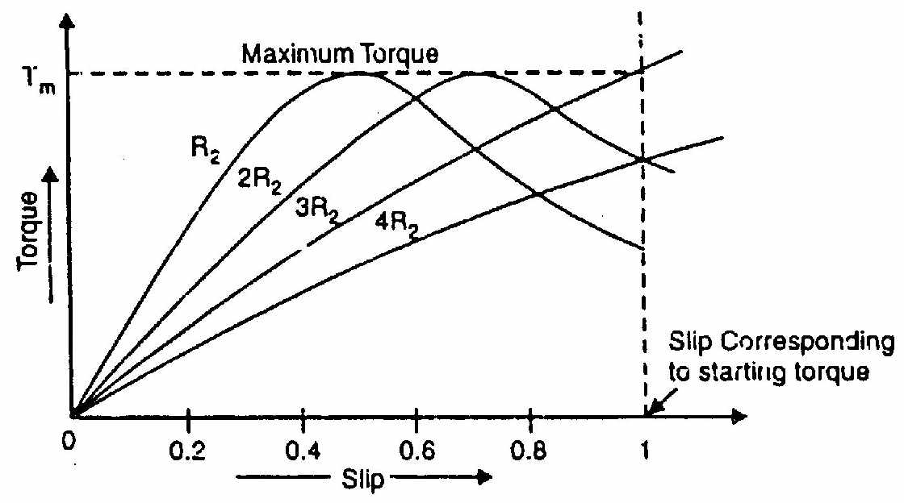
*Fig. (8.19): Complete torque-slip characteristic of a 3-phase induction motor showing stable and unstable regions.*

## 8.18 Torque-Slip Characteristics

The complete characteristic (**Fig. 8.19**) displays three distinct regions:
1. **Stable Operating Zone ($0 \le s \le s_m$):**
   - Extends from synchronous speed ($s = 0$) up to breakdown slip $s_m$.
   - Torque increases as speed drops (positive slope of $T$ vs $s$). The motor is stable; any increase in load is matched by an increase in developed torque.
2. **Breakdown Point ($s = s_m = R_2 / X_2$):**
   - Motor develops its maximum torque $T_{max}$.
   - If load torque exceeds $T_{max}$, the motor stalls (pulls out).
3. **Unstable Zone ($s_m < s \le 1$):**
   - Beyond $s_m$, torque decreases as slip increases. The motor cannot operate continuously in this region.

<!-- Page 207 -->
<!-- Printed Page 201 -->

## 8.19 Full-Load, Starting, and Maximum Torques

Let:
- $T_{FL}$ = Full-load torque at full-load slip $s_f$
- $T_s$ = Starting torque ($s = 1$)
- $T_{max}$ = Maximum breakdown torque ($s_m = R_2 / X_2 = a$)

### Ratio of Starting Torque to Maximum Torque:
$$\frac{T_s}{T_{max}} = \frac{\frac{k E_2^2 R_2}{R_2^2 + X_2^2}}{\frac{k E_2^2}{2 X_2}} = \frac{2 R_2 X_2}{R_2^2 + X_2^2} = \frac{2 (R_2 / X_2)}{1 + (R_2 / X_2)^2}$$

$$\mathbf{\frac{T_s}{T_{max}} = \frac{2 a}{1 + a^2} \quad \text{where } a = \frac{R_2}{X_2} = s_m}$$

### Ratio of Full-Load Torque to Maximum Torque:
$$\frac{T_{FL}}{T_{max}} = \frac{\frac{k s_f E_2^2 R_2}{R_2^2 + (s_f X_2)^2}}{\frac{k E_2^2}{2 X_2}} = \frac{2 s_f R_2 X_2}{R_2^2 + s_f^2 X_2^2} = \frac{2 s_f (R_2 / X_2)}{(R_2 / X_2)^2 + s_f^2}$$

$$\mathbf{\frac{T_{FL}}{T_{max}} = \frac{2 a s_f}{a^2 + s_f^2} = \frac{2 s_m s_f}{s_m^2 + s_f^2}}$$

<!-- Page 208 -->
<!-- Printed Page 202 -->

## 8.20 Induction Motor and Transformer Compared

| Feature | Transformer | 3-Phase Induction Motor |
|:---|:---|:---|
| **Type of Machine** | Static electromagnetic device | Rotating electromechanical machine |
| **Magnetic Circuit** | Continuous closed iron core | Core has an air gap (0.4–4 mm) between stator & rotor |
| **Magnetizing Current** | Very small (2% to 5% of full load) | Relatively large (30% to 50% of full load) due to air gap |
| **Leakage Reactance** | Small (windings share same core) | Much larger due to distributed slots and air gap |
| **Operating Power Factor** | High on load (0.8 to 0.95) | Lower: 0.1–0.2 lagging at no load, 0.8–0.88 at full load |
| **Energy Conversion** | Electrical $\to$ Electrical | Electrical $\to$ Mechanical |
| **Secondary Frequency** | Constant ($f_2 = f_1$) | Variable ($f' = s f$) depending on rotor speed |

## 8.21 Speed Regulation of Induction Motors

$$\mathbf{\% \text{ Speed Regulation} = \frac{N_{NL} - N_{FL}}{N_{FL}} \times 100}$$

Since no-load speed is very close to $N_s$ and full-load slip is only 2% to 5%, the induction motor has very low speed regulation (typically 3% to 5%). It is essentially a **constant-speed motor**.

<!-- Page 209 -->
<!-- Printed Page 203 -->

## 8.22 Speed Control of 3-Phase Induction Motors

Since $N = N_s(1 - s) = \frac{120 f}{P}(1 - s)$, speed can be controlled by:
1. **From Stator Side:**
   - **Varying Supply Frequency ($f$):** Requires variable-frequency inverter (V/f control).
   - **Changing Number of Stator Poles ($P$):** Pole-changing windings (gives discrete speed steps).
   - **Varying Supply Voltage ($V$):** Reduces torque ($T \propto V^2$), limited speed range.
2. **From Rotor Side (Slip-Ring Motors only):**
   - **Rotor Resistance Control:** Adding external resistance to rotor decreases speed for a given torque. Disadvantage: high $I^2 R$ power loss in resistors.
   - **Cascade Control:** Two motors coupled mechanically and electrically.
   - **Injecting EMF into Rotor Circuit:** Modern slip-power recovery schemes (Kramer and Scherbius drives).

<!-- Page 210 -->
<!-- Printed Page 204 -->

## 8.23 Power Factor of Induction Motor

- **At No-Load:** The motor draws rated magnetizing current across the air gap. Since active current is minimal (only supplying friction, windage, and core losses), power factor is very poor: **0.1 to 0.2 lagging**.
- **At Full-Load:** The active load current increases substantially, while magnetizing current remains approximately constant. Hence the power factor improves to **0.8 to 0.88 lagging**.

<!-- Page 211 -->
<!-- Printed Page 205 -->

## 8.24 Power Stages in an Induction Motor

The sequence of power transmission through an induction motor is shown in **Fig. (8.20)**:

```
Stator Input Power (P_1 = √3 V_L I_L cos φ_1)
        │
        ├──► Stator Losses: Stator Copper Loss (3 I_1^2 R_1) + Stator Core Loss (P_i)
        ▼
Rotor Power Input (P_2 = Power Transferred Across Air Gap)
        │
        ├──► Rotor Copper Loss (P_cu = 3 I_2'^2 R_2 = s · P_2)
        ▼
Gross Mechanical Power Developed (P_m = (1 - s) P_2)
        │
        ├──► Mechanical Losses: Friction and Windage Losses
        ▼
Net Shaft Output Power (P_out = P_m - P_mech = T_shaft · ω)
```

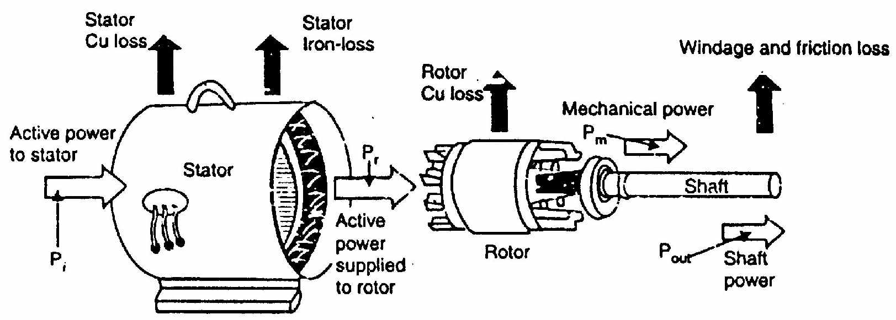
*Fig. (8.20): Power flow diagram from stator electrical input to rotor mechanical shaft output.*

<!-- Page 212 -->
<!-- Printed Page 206 -->

### Fundamental Power Equations:
1. **Rotor Power Input ($P_2$):**
   $$P_2 = \text{Stator Input} - (\text{Stator Cu loss} + \text{Stator Core loss})$$
   $$P_2 = T_g \times \omega_s = T_g \times \frac{2\pi N_s}{60}$$
2. **Rotor Copper Loss ($P_{cu}$):**
   $$P_{cu} = 3 (I_2')^2 R_2$$
   $$\mathbf{P_{cu} = s \times P_2}$$
3. **Gross Mechanical Power Developed ($P_m$):**
   $$P_m = P_2 - P_{cu} = P_2 - s P_2$$
   $$\mathbf{P_m = (1 - s) P_2}$$

$$\mathbf{P_2 : P_{cu} : P_m = 1 : s : (1 - s)}$$

$$\mathbf{\frac{\text{Rotor Cu Loss}}{\text{Rotor Input}} = s}$$
$$\mathbf{\frac{\text{Gross Mechanical Power}}{\text{Rotor Input}} = 1 - s = \frac{N}{N_s}}$$
$$\mathbf{\frac{\text{Rotor Cu Loss}}{\text{Gross Mechanical Power}} = \frac{s}{1 - s}}$$

<!-- Page 213 -->
<!-- Printed Page 207 -->

## 8.25 Induction Motor Torque Equation

The gross electromagnetic torque $T_g$ developed by the rotor is:
$$T_g = \frac{P_m}{\omega} = \frac{P_m}{2\pi N / 60} = \frac{(1 - s) P_2}{\frac{2\pi N_s (1 - s)}{60}} = \frac{P_2}{2\pi N_s / 60}$$

$$\mathbf{T_g = \frac{P_2}{\omega_s} = \frac{60 P_2}{2\pi N_s} = \frac{9.55 P_2}{N_s} \quad \text{N-m}}$$

Expressing $P_2$ in terms of rotor parameters:
$$P_2 = \frac{P_{cu}}{s} = \frac{3 (I_2')^2 R_2}{s}$$
$$I_2' = \frac{s E_2}{\sqrt{R_2^2 + (s X_2)^2}}$$
$$P_2 = \frac{3}{s} \left[\frac{s^2 E_2^2}{R_2^2 + (s X_2)^2}\right] R_2 = \frac{3 s E_2^2 R_2}{R_2^2 + (s X_2)^2}$$

$$\mathbf{T_g = \frac{3}{2\pi N_s} \left[\frac{s E_2^2 R_2}{R_2^2 + (s X_2)^2}\right] \quad \text{N-m}}$$

<!-- Page 214 -->
<!-- Printed Page 208 -->

## 8.28 Performance Curves of Squirrel-Cage Motor

The performance curves illustrate how torque, current, speed, power factor, and efficiency vary with percentage load (**Fig. 8.21** & **Fig. 8.22**).

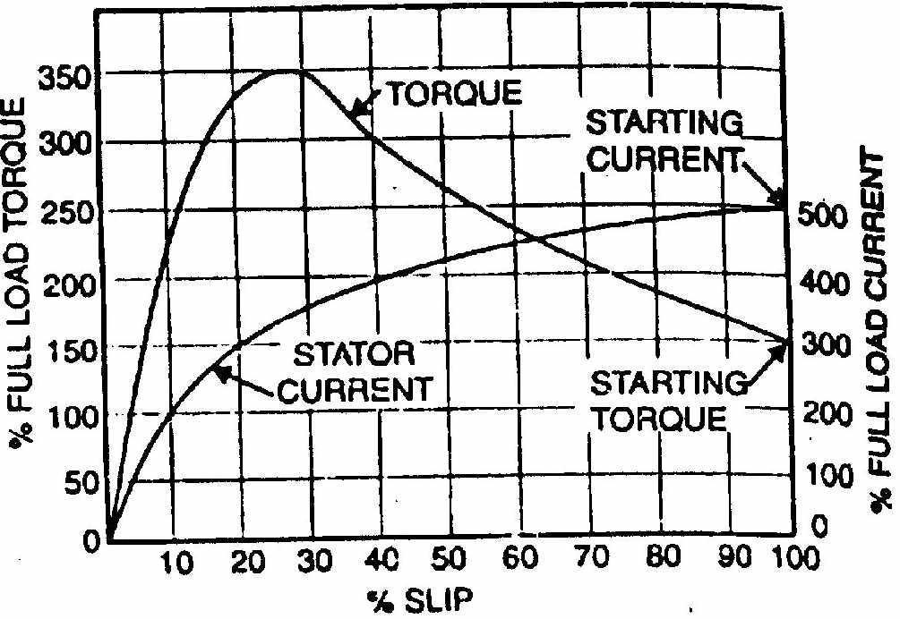
*Fig. (8.21): Variation of developed torque and stator current with percentage slip.*

<!-- Page 215 -->
<!-- Printed Page 209 -->

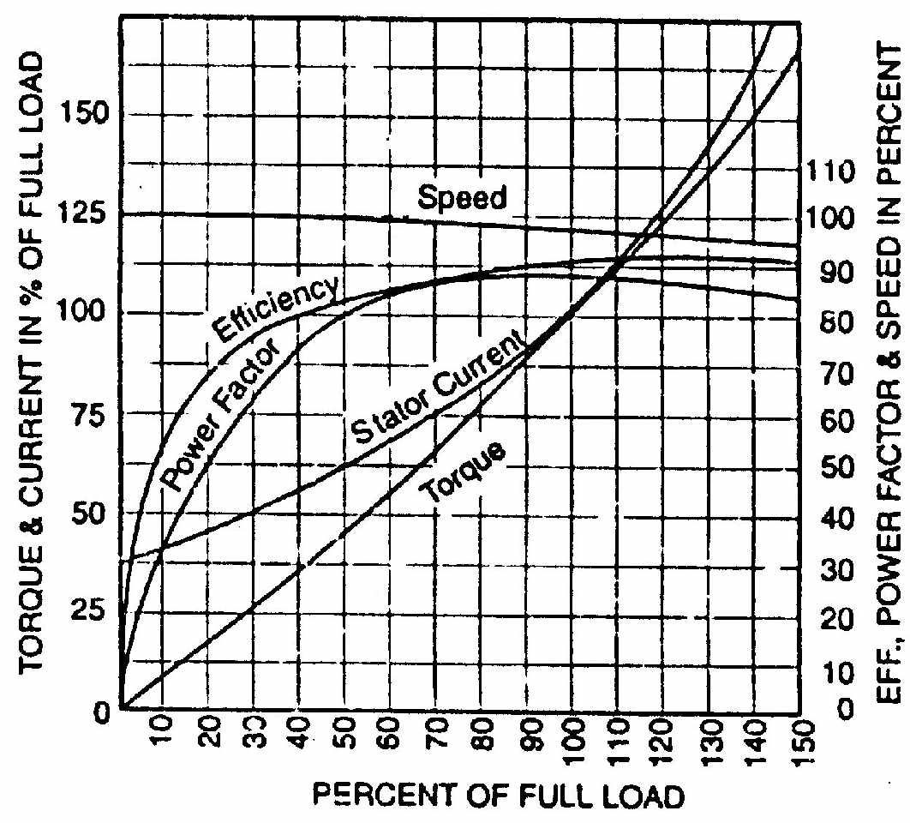
*Fig. (8.22): Operating performance curves of squirrel-cage motor showing speed, efficiency, power factor, and line current.*

<!-- Page 216 -->
<!-- Printed Page 210 -->

<!-- Page 217 -->
<!-- Printed Page 211 -->

## 8.29 Equivalent Circuit of 3-Phase Induction Motor

Like a transformer, the induction motor has a stator winding (primary) and a rotor winding (secondary) coupled across the air gap.

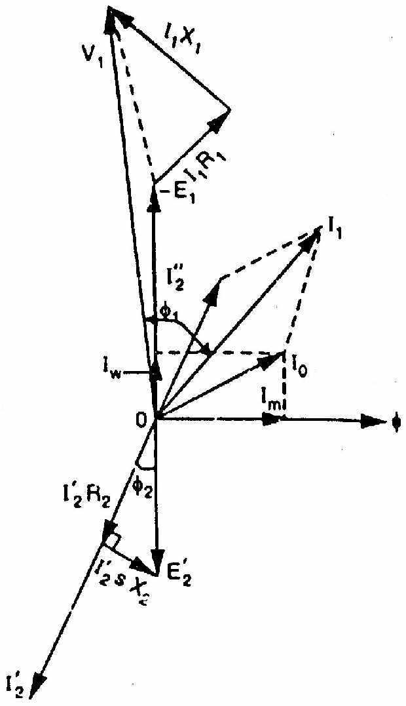
*Fig. (8.24): Electrical circuit per phase showing stator impedance $R_1 + jX_1$, shunt exciting branch $R_c, X_m$, and rotor circuit at slip $s$.*

Stator voltage equation:
$$V_1 = -E_1 + I_1(R_1 + j X_1)$$
The stator current is:
$$I_1 = I_0 + I_2'$$

<!-- Page 218 -->
<!-- Printed Page 212 -->

Rotor circuit current at slip $s$:
$$I_2' = \frac{s E_2}{\sqrt{R_2^2 + (s X_2)^2}} = \frac{E_2}{\sqrt{(R_2 / s)^2 + X_2^2}}$$

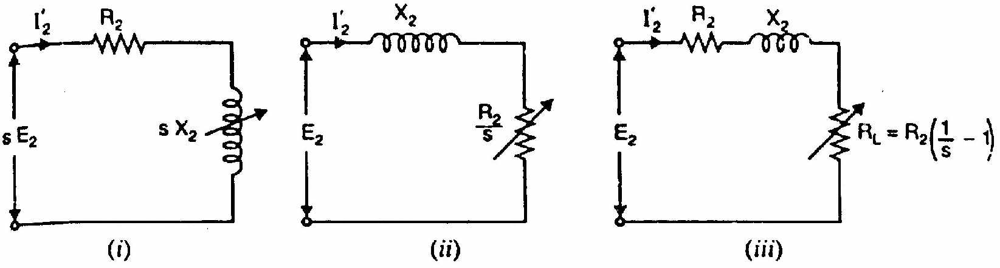
*Fig. (8.25): Rotor circuit transformation: (i) At slip $s$. (ii) Divided by $s$. (iii) Splitting $R_2/s$ into internal copper loss resistance $R_2$ and mechanical load resistance $R_L$.*

<!-- Page 219 -->
<!-- Printed Page 213 -->

## 8.30 Equivalent Circuit of the Rotor: Load Representation

Notice that:
$$\frac{R_2}{s} = R_2 + R_2 \left(\frac{1}{s} - 1\right) = R_2 + R_2 \left(\frac{1 - s}{s}\right)$$

This remarkable decomposition splits the total rotor resistance $\frac{R_2}{s}$ into two components (**Fig. 8.25 (iii)**):
1. **$R_2$**: The actual ohmic resistance of the rotor winding per phase, representing **rotor copper loss** ($I_2^2 R_2$).
2. **$R_L = R_2 \left(\frac{1 - s}{s}\right)$**: A fictitious variable resistance that represents the **electrical equivalent of mechanical load** developed by the motor!

$$\mathbf{R_L = R_2 \left(\frac{1 - s}{s}\right)}$$

Mechanical power developed:
$$P_m = 3 I_2^2 R_L = 3 I_2^2 R_2 \left(\frac{1 - s}{s}\right)$$

<!-- Page 220 -->
<!-- Printed Page 214 -->

## 8.31 Transformer Equivalent Circuit of Induction Motor

Referring all rotor parameters to the stator side by transformation ratio $K = N_2 / N_1$:
- $R_2' = R_2 / K^2$
- $X_2' = X_2 / K^2$
- $R_L' = R_L / K^2 = R_2' \left(\frac{1 - s}{s}\right)$
- $I_2' = K I_2$

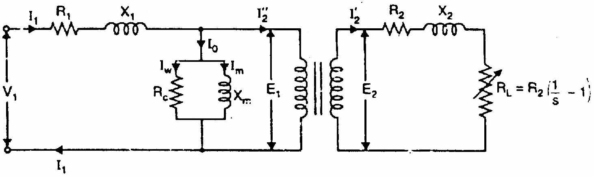
*Fig. (8.26): Exact equivalent circuit of induction motor per phase referred to stator.*

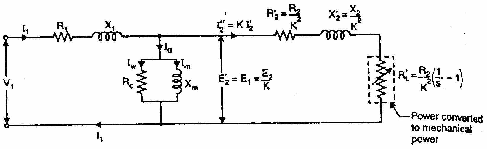
*Fig. (8.27): Equivalent circuit showing mechanical load resistor $R_L' = R_2'(1-s)/s$.*

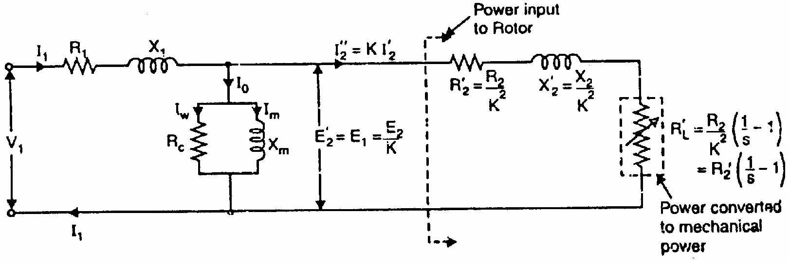
*Fig. (8.28): Phasor diagram of an induction motor on load.*

<!-- Page 221 -->
<!-- Printed Page 215 -->

## 8.32 Power Relations from Equivalent Circuit

- Stator input power: $P_1 = \sqrt{3} V_L I_L \cos \phi_1 = 3 V_1 I_1 \cos \phi_1$
- Air-gap power (rotor input): $P_2 = 3 (I_2')^2 \left(\frac{R_2'}{s}\right)$
- Rotor copper loss: $P_{cu} = 3 (I_2')^2 R_2' = s P_2$
- Mechanical power developed: $P_m = 3 (I_2')^2 R_L' = 3 (I_2')^2 R_2' \left(\frac{1 - s}{s}\right) = (1 - s) P_2$

<!-- Page 222 -->
<!-- Printed Page 216 -->

## 8.33 Approximate Equivalent Circuit of Induction Motor

By shifting the shunt exciting branch ($R_c, X_m$) directly to the input terminals $V_1$, we obtain the **approximate equivalent circuit** (**Fig. 8.29**):

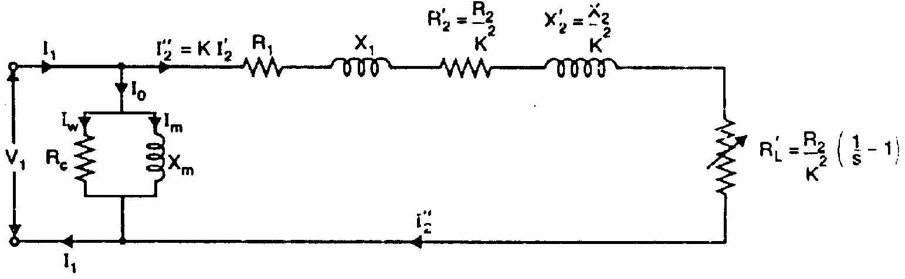
*Fig. (8.29): Approximate equivalent circuit per phase of a 3-phase induction motor.*

Total equivalent resistance:
$$R_{01} = R_1 + R_2'$$
Total equivalent leakage reactance:
$$X_{01} = X_1 + X_2'$$
Total impedance:
$$Z_{01} = \sqrt{\left(R_1 + \frac{R_2'}{s}\right)^2 + (X_1 + X_2')^2}$$

<!-- Page 223 -->
<!-- Printed Page 217 -->

## 8.34 Starting of 3-Phase Induction Motors

At standstill ($s = 1$), the rotor has no back e.m.f. and acts like a short-circuited secondary of a transformer.
- The starting current is very large: **5 to 8 times rated full-load current** ($I_{sc} = 5 \text{ to } 8 I_{FL}$).
- Because rotor resistance is low compared to standstill reactance ($R_2 \ll X_2$), the power factor is very low ($\cos \theta_2 \approx 0.2$), resulting in modest starting torque despite the huge current!
- A starter is required to **reduce starting current** to prevent severe line voltage dips.

## 8.35 Methods of Starting 3-Phase Induction Motors

- **For Squirrel-Cage Motors:**
  1. Direct-on-line (DOL) starting (up to 5 HP)
  2. Stator resistance (or reactance) starter
  3. Autotransformer starter
  4. Star-Delta ($\text{Y}-\Delta$) starter
- **For Slip-Ring Motors:**
  - Rotor resistance starter

<!-- Page 224 -->
<!-- Printed Page 218 -->

## 8.36 Methods of Starting Squirrel-Cage Motors

### 1. Direct-on-Line (DOL) Starting
The motor is connected directly across the supply lines:
$$I_{st} = I_{sc}$$

Starting torque relation:
$$T \propto s I_2^2 \implies T_s \propto (1) I_{sc}^2$$
$$T_{FL} \propto s_f I_{FL}^2$$

$$\mathbf{\frac{T_{st}}{T_{FL}} = \left(\frac{I_{sc}}{I_{FL}}\right)^2 \times s_f}$$

<!-- Page 225 -->
<!-- Printed Page 219 -->

### 2. Stator Resistance Starter
Resistors are added in series with each stator phase to reduce the starting voltage to $x V$ ($x < 1$):
- Starting current: $I_{st} = x I_{sc}$
- Starting torque:
  $$\mathbf{\frac{T_{st}}{T_{FL}} = x^2 \left(\frac{I_{sc}}{I_{FL}}\right)^2 \times s_f}$$
- Torque is reduced by factor $x^2$ while drawing $x I_{sc}$ from the line.

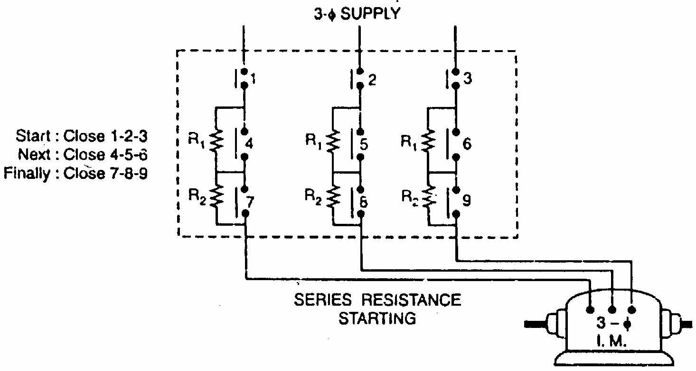
*Fig. (8.30): Stator resistance starter connection.*

<!-- Page 226 -->
<!-- Printed Page 220 -->

### 3. Autotransformer Starter
A 3-phase autotransformer with tapping ratio $x$ (typically 50%, 65%, or 80%) steps down the voltage applied to the motor to $x V$:
- Motor voltage: $V_{motor} = x V$
- Motor starting current: $I_{motor} = x I_{sc}$
- Line starting current drawn from supply: $I_{line} = x \times I_{motor} = x^2 I_{sc}$!
- Starting torque:
  $$\mathbf{\frac{T_{st}}{T_{FL}} = x^2 \left(\frac{I_{sc}}{I_{FL}}\right)^2 \times s_f}$$

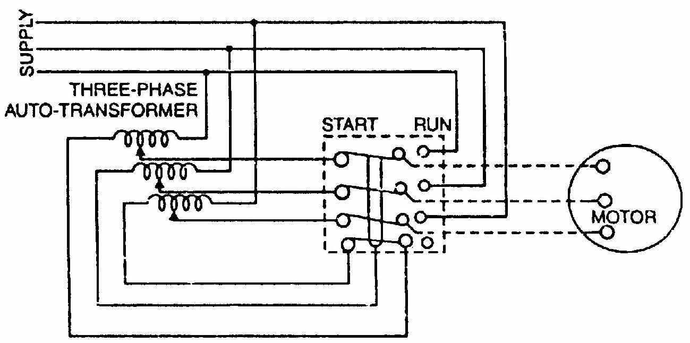
*Fig. (8.31): Autotransformer starter connection showing "Start" and "Run" positions.*

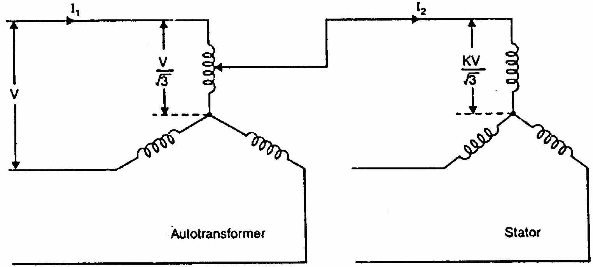
*Fig. (8.32): Line vs motor current in autotransformer starting.*

<!-- Page 227 -->
<!-- Printed Page 221 -->

> **Advantage:** For a given reduction in starting torque, the autotransformer draws **far less current from the supply lines** ($x^2 I_{sc}$) than a stator resistance starter ($x I_{sc}$)!

<!-- Page 228 -->
<!-- Printed Page 222 -->

### 4. Star-Delta ($\text{Y}-\Delta$) Starting
The motor stator is designed to run in **Delta ($\Delta$)**. During starting, it is connected in **Star ($\text{Y}$)**; once accelerated to ~80% speed, a changeover switch reconnects it in **Delta ($\Delta$)**.


*Fig. (8.33): Star-Delta starter wiring diagram.*

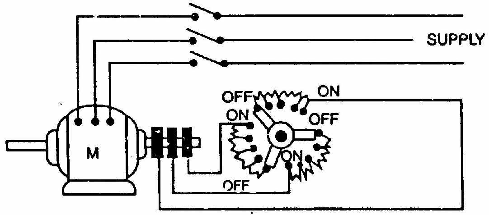
*Fig. (8.34): Phasor and circuit comparison of Star vs Delta starting.*

**Analysis of Star-Delta Starter:**
- Phase voltage in Star is $V_{ph(Y)} = \frac{V_L}{\sqrt{3}}$.
- Starting phase current in Star: $I_{ph(Y)} = \frac{V_L / \sqrt{3}}{Z_{sc}} = \frac{1}{\sqrt{3}} I_{ph(\Delta)}$.
- Line current in Star: $I_{L(Y)} = I_{ph(Y)} = \frac{1}{\sqrt{3}} I_{ph(\Delta)} = \frac{1}{3} \left(\sqrt{3} I_{ph(\Delta)}\right) = \mathbf{\frac{1}{3} I_{L(\Delta)}}$!
- Starting torque:
  $$\mathbf{T_{st(Y)} = \frac{1}{3} T_{st(\Delta)}}$$
  $$\mathbf{\frac{T_{st}}{T_{FL}} = \frac{1}{3} \left(\frac{I_{sc}}{I_{FL}}\right)^2 \times s_f}$$

Both starting line current and starting torque are reduced to **exactly one-third ($33.3\%$)** of their direct-on-line values!

## 8.37 Starting of Slip-Ring Motors: Rotor Resistance Starter

For wound-rotor motors, an external 3-phase star-connected variable resistor is connected to the rotor via slip rings.
- Standstill rotor resistance is increased so that $R_2 + R_{ext} \approx X_2$.
- This achieves **maximum starting torque** ($T_{st} = T_{max}$) while simultaneously **reducing the starting current**!
- As the motor speeds up, the external resistors are cut out in steps until the slip rings are completely short-circuited.

<!-- Page 229 -->
<!-- Printed Page 223 -->

## 8.38 Slip-Ring Motors Versus Squirrel-Cage Motors

| Comparison Factor | Squirrel-Cage Motor | Slip-Ring (Wound Rotor) Motor |
|:---|:---|:---|
| **Rotor Construction** | Uninsulated bars shorted by end rings; simple, rugged | 3-phase insulated winding connected to 3 slip rings |
| **Slip Rings & Brushes** | None | Required (adds maintenance and wear) |
| **Starting Torque** | Modest (1.5 to 2 times $T_{FL}$) | Very high (up to $T_{max}$ by adding rotor resistance) |
| **Starting Current** | High (5 to 8 times $I_{FL}$) | Low (2 to 2.5 times $I_{FL}$) |
| **Speed Control** | Difficult and expensive | Easy by inserting rotor external resistance |
| **Efficiency & Cost** | Higher efficiency, lower cost | Slightly lower efficiency, higher initial cost |
| **Applications** | Pumps, fans, lathes, conveyors (constant speed) | Cranes, hoists, elevators, lifts (high starting torque) |

## 8.39 Induction Motor Rating

Nameplate ratings specify: rated power output in kW or HP (mechanical output at shaft), line-to-line voltage, full-load line current, frequency, number of poles, full-load speed, and insulation class.

<!-- Page 230 -->
<!-- Printed Page 224 -->

## 8.40 Double Squirrel-Cage Motors

To achieve both **high starting torque** and **high running efficiency** without requiring slip rings or external resistors, a **double squirrel-cage rotor** has two concentric cages in the same core (**Fig. 8.35**):

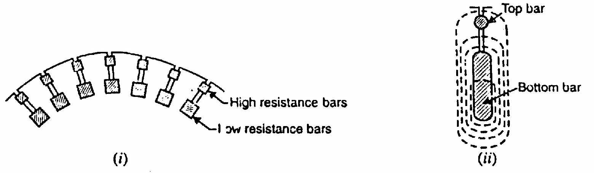
*Fig. (8.35): Double squirrel-cage slot profiles: (i) Outer cage of high resistance, (ii) Inner cage of low resistance.*

1. **Outer Cage:**
   - Made of high-resistance brass or aluminium bars with smaller cross-section.
   - Located close to the rotor surface with a wide slot opening $\to$ **High Resistance ($R_o$), Low Leakage Reactance ($X_o$)**.
2. **Inner Cage:**
   - Made of low-resistance copper bars with large cross-section.
   - Embedded deep inside the core with a narrow slit $\to$ **Low Resistance ($R_i$), High Leakage Reactance ($X_i$)**.

<!-- Page 231 -->
<!-- Printed Page 225 -->

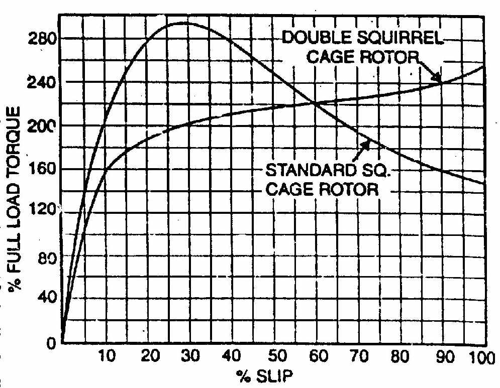
*Fig. (8.36): Torque-speed curves of outer cage, inner cage, and combined double-cage motor.*

### Operation:
- **At Starting ($s = 1$, $f' = 50\text{ Hz}$):**
  Due to high frequency, the leakage reactance of the deep inner cage ($2\pi f X_i$) is very large. Hence, current is forced to flow almost entirely through the **high-resistance outer cage**. This produces a **high starting torque with low starting current**!
- **Under Normal Running ($s \approx 0.03$, $f' \approx 1.5\text{ Hz}$):**
  Rotor frequency is extremely low. Reactances become negligible ($s X \approx 0$), and current divides between the two cages in inverse proportion to their resistances. The bulk of current now flows through the **low-resistance inner cage**, ensuring **low $I^2 R$ loss and high operating efficiency**!

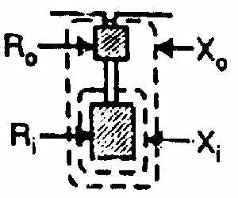
*Fig. (8.37): Detail of outer and inner cage bars embedded in rotor lamination.*

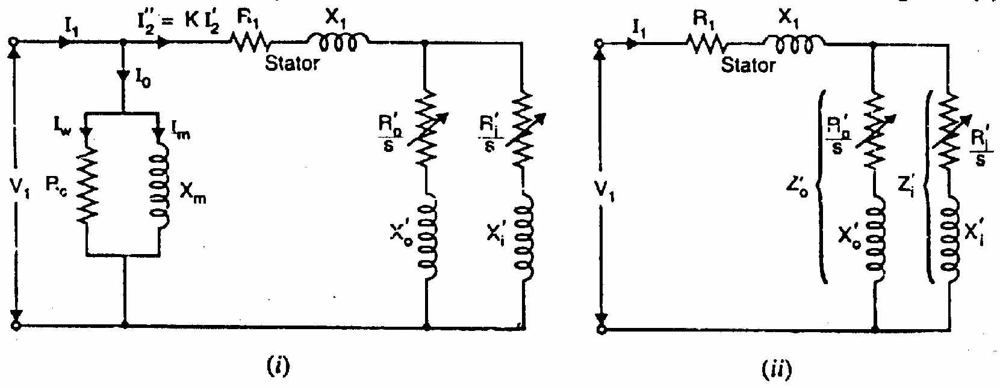
*Fig. (8.38): Equivalent circuit of double squirrel-cage motor showing parallel outer and inner cage branches.*

<!-- Page 232 -->
<!-- Printed Page 226 -->

## 8.41 Equivalent Circuit of Double Squirrel-Cage Motor

The two rotor cages act as two parallel circuits fed from the common air-gap voltage:
- Outer cage impedance:
  $$Z_o' = \frac{R_o'}{s} + j X_o'$$
- Inner cage impedance:
  $$Z_i' = \frac{R_i'}{s} + j X_i'$$

Total equivalent rotor impedance referred to stator:
$$\mathbf{Z_r' = \frac{Z_o' Z_i'}{Z_o' + Z_i'}}$$

Total motor input impedance:
$$\mathbf{Z_{in} = (R_1 + j X_1) + \frac{1}{\frac{1}{R_c} + \frac{1}{j X_m} + \frac{1}{Z_r'}}}$$

---
*End of Chapter 8: Three Phase Induction Motors*
