# Chapter 9: Single-Phase Motors
**Textbook:** *Principles of Electrical Machines* by V.K. Mehta & Rohit Mehta (Chapter 9, Pages 233–258)  
**Course:** ECE 2207 — Electrical Machine-I  
**Syllabus Coverage:** Types of Single-Phase Motors, Single-Phase Induction Motors, Double-Field Revolving Theory (Forward and Backward Fields), Starting Methods, 2-Phase RMF Production, Split-Phase Motor, Capacitor-Start Motor, Capacitor-Start Capacitor-Run Motor, Shaded-Pole Motor, Equivalent Circuit Based on Double-Field Revolving Theory ($s$ and $2-s$), Universal Motor, Repulsion Motors, Single-Phase Synchronous Motors (Reluctance & Hysteresis).

---

<!-- Page 233 -->
<!-- Printed Page 227 -->

## Introduction

As the name suggests, single-phase motors operate from a single-phase a.c. supply. Single-phase motors are the most familiar of all electric motors because they are extensively used in home appliances, shops, offices, refrigerators, fans, washing machines, hair dryers, portable tools, and recording instruments. While 3-phase motors are more efficient and have superior operating characteristics, 3-phase power is generally not available in domestic and light-commercial premises.

## 9.1 Types of Single-Phase Motors

Single-phase motors are broadly classified into four major categories:
1. **Single-Phase Induction Motors:**
   - Split-phase motor
   - Capacitor-start motor
   - Capacitor-start capacitor-run motor (two-value capacitor motor)
   - Permanent-split capacitor (PSC) motor
   - Shaded-pole motor
2. **A.C. Series Motors (Universal Motors):**
   - Can operate on either single-phase a.c. or d.c.
3. **Repulsion Motors:**
   - Plain repulsion motor
   - Repulsion-start induction-run motor
   - Repulsion-induction motor
4. **Single-Phase Synchronous Motors:**
   - Reluctance motor
   - Hysteresis motor

## 9.2 Single-Phase Induction Motors

A single-phase induction motor consists of:
1. A **stator** carrying a single-phase distributed winding in slots.
2. A **squirrel-cage rotor** identical to that of a 3-phase induction motor.

<!-- Page 234 -->
<!-- Printed Page 228 -->

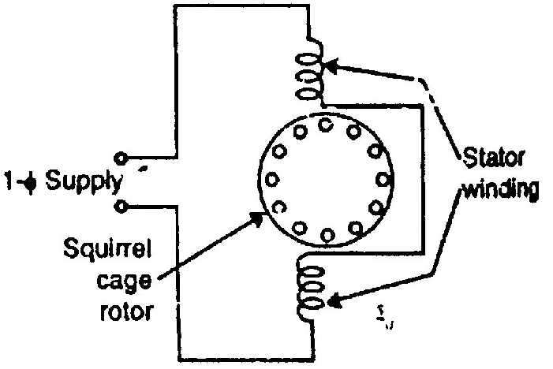
*Fig. (9.1): Construction of a single-phase induction motor.*

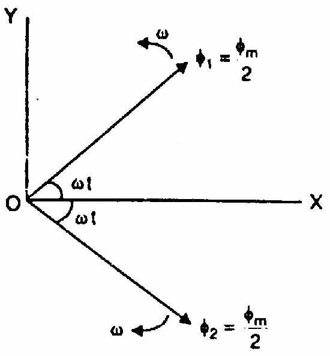
*Fig. (9.2): Pulsating stationary flux produced by single-phase stator winding.*

### The Non-Self-Starting Dilemma
Unlike a 3-phase induction motor, a single-phase induction motor has **zero starting torque** and is **not self-starting**:
1. When a single-phase winding is energized by alternating current, it produces a magnetic field that is **stationary in space but alternating in time** (pulsating flux along the stator axis).
2. The field polarity reverses every half-cycle, but the field does not rotate in space!
3. Across the standstill rotor, this pulsating field induces equal and opposite currents in the two halves of the squirrel-cage winding. The opposing torques developed by the two halves cancel each other exactly:
   $$\mathbf{T_{\text{start}} = 0}$$
4. However, if the rotor is given an initial push or spin in **either direction** by external means, it immediately picks up speed, accelerates, and develops running torque in that direction!

To explain this physical phenomenon, two theories are widely used:
1. **Double-Field Revolving Theory** (Ferraris)
2. **Cross-Field Theory**

<!-- Page 235 -->
<!-- Printed Page 229 -->

## 9.3 Double-Field Revolving Theory

The **Double-Field Revolving Theory** states that any alternating pulsating magnetic flux $\Phi = \Phi_m \cos \omega t$ can be resolved into two rotating magnetic fields:
1. A **forward rotating field ($\Phi_f$)** of constant magnitude $\frac{1}{2} \Phi_m$, rotating in the forward (say clockwise) direction at synchronous speed $N_s = 120f/P$.
2. A **backward rotating field ($\Phi_b$)** of constant magnitude $\frac{1}{2} \Phi_m$, rotating in the backward (counter-clockwise) direction at synchronous speed $N_s = 120f/P$.

*Fig. (9.3): Resolution of pulsating flux $\Phi = \Phi_m \cos \omega t$ into two oppositely rotating vectors of magnitude $\Phi_m / 2$.*

### Mathematical Proof:
Let the alternating flux along the horizontal axis be:
$$\Phi(t) = \Phi_m \cos \omega t$$

From trigonometry:
$$\Phi_m \cos \omega t = \frac{\Phi_m}{2} e^{j\omega t} + \frac{\Phi_m}{2} e^{-j\omega t}$$

Resolving the two rotating vectors along the X-axis and Y-axis at any time $t$:
- Total X-component:
  $$\Phi_X = \frac{\Phi_m}{2} \cos \omega t + \frac{\Phi_m}{2} \cos(-\omega t) = \Phi_m \cos \omega t$$
- Total Y-component:
  $$\Phi_Y = \frac{\Phi_m}{2} \sin \omega t + \frac{\Phi_m}{2} \sin(-\omega t) = \frac{\Phi_m}{2} \sin \omega t - \frac{\Phi_m}{2} \sin \omega t = 0$$

$$\mathbf{\Phi_{\text{resultant}} = \sqrt{\Phi_X^2 + \Phi_Y^2} = \Phi_m \cos \omega t \quad \text{along X-axis}}$$

Thus, an alternating pulsating flux is mathematically identical to two equal fields rotating in opposite directions at synchronous speed!

<!-- Page 236 -->
<!-- Printed Page 230 -->

### Torque Production Under Double-Field Revolving Theory

Each revolving field acts on the squirrel-cage rotor independently, just like the rotating field of a 3-phase induction motor:

#### 1. At Standstill ($N = 0$):
- Slip with respect to forward field:
  $$s_f = \frac{N_s - 0}{N_s} = 1$$
- Slip with respect to backward field:
  $$s_b = \frac{N_s - (-0)}{N_s} = 1$$
- Since $s_f = s_b = 1$, the forward torque $T_f$ and backward torque $T_b$ are equal in magnitude and opposite in direction:
  $$T_f = T_b$$
  $$\mathbf{T_{\text{net}} = T_f - T_b = 0}$$
  Hence, the motor develops **zero starting torque** at standstill.

*Fig. (9.4): Forward torque $T_f$, backward torque $T_b$, and net resultant torque curve.*

#### 2. When Rotor is Running at Speed $N$ in Forward Direction:
- **Forward Slip ($s$):**
  $$\mathbf{s_f = s = \frac{N_s - N}{N_s}}$$
- **Backward Slip ($s_b$):**
  Since the backward field rotates at $-N_s$ while the rotor moves at $+N$:
  $$s_b = \frac{-N_s - N}{-N_s} = \frac{N_s + N}{N_s} = \frac{N_s + N_s(1 - s)}{N_s}$$
  $$\mathbf{s_b = 2 - s}$$

For normal operating speeds, $s$ is very small ($s \approx 0.05$):
- Forward slip is small: $s_f = 0.05$.
- Backward slip is very large: $s_b = 2 - 0.05 = 1.95$.

<!-- Page 237 -->
<!-- Printed Page 231 -->

Because torque at low slip is high, the forward field develops a **large forward driving torque $T_f$**. Conversely, at high slip ($s_b \approx 2$), the backward field produces a very small opposing torque $T_b$ and high rotor copper loss:
$$\mathbf{T_{\text{net}} = T_f - T_b > 0}$$

The net torque accelerates the motor in the forward direction until motor torque equals load torque!

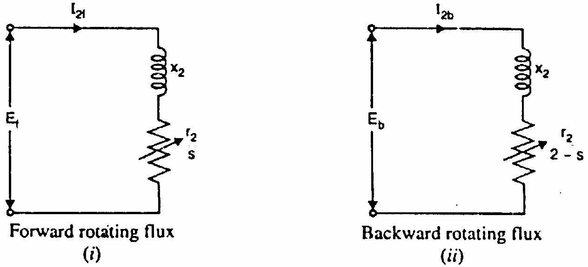
*Fig. (9.5): Rotor equivalent circuits for forward and backward rotating fields.*

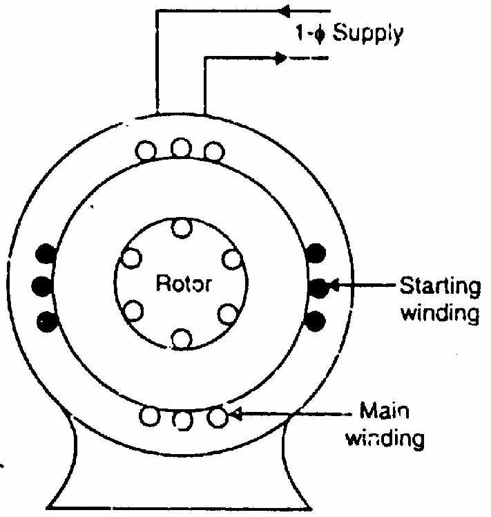
*Fig. (9.6): Net torque-slip characteristic of single-phase induction motor.*

<!-- Page 238 -->
<!-- Printed Page 232 -->

## 9.4 Making Single-Phase Induction Motor Self-Starting

To make a single-phase induction motor self-starting, we must convert the single-phase pulsating stator field into a **revolving magnetic field** at starting. This is achieved by **phase-splitting**:
1. An auxiliary or **starting winding** is added to the stator, placed in space quadrature ($90^\circ$ electrical) with the main running winding.
2. The currents in the two windings are made to have a **phase difference** $\alpha$ (ideally $90^\circ$) by altering their impedances (using resistance, inductance, or capacitance).
3. The two phase-displaced currents flowing through the two space-displaced windings produce a **revolving magnetic field**, just like a 2-phase motor!
4. Once the rotor accelerates to about 75% to 80% of synchronous speed, a **centrifugal switch** automatically disconnects the auxiliary winding. The motor then runs as a pure single-phase induction motor.

*Fig. (9.7): Schematic of stator showing Main winding ($M$) and Starting winding ($S$) in space quadrature.*

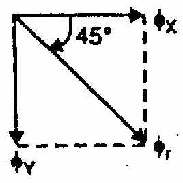
*Fig. (9.8): Phasor diagram showing phase angle $\alpha$ between main winding current $I_m$ and starting winding current $I_s$.*

Starting torque is directly proportional to the phase displacement $\alpha$:
$$\mathbf{T_s \propto I_m I_s \sin \alpha}$$
For maximum starting torque, $\alpha$ should be as close to $90^\circ$ as possible.

<!-- Page 239 -->
<!-- Printed Page 233 -->

## 9.5 Rotating Magnetic Field from 2-Phase Supply

Consider two stator windings $X$ and $Y$ displaced $90^\circ$ in space, fed by two currents displaced $90^\circ$ in time:
$$\phi_X = \Phi_m \cos \omega t$$
$$\phi_Y = \Phi_m \sin \omega t$$

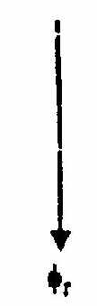
*Fig. (9.9): Two-phase winding layout with currents in time quadrature.*

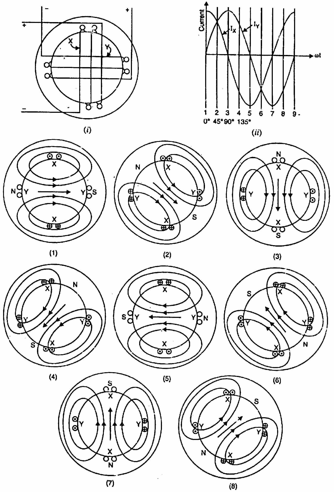
*Fig. (9.10): Progression of resultant flux vector in 2-phase system.*

<!-- Page 240 -->
<!-- Printed Page 234 -->

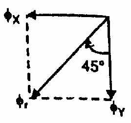
*Fig. (9.11): Vector addition of fluxes at successive instants showing clockwise rotation.*

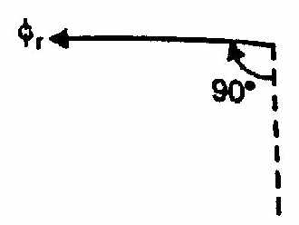
*Fig. (9.12): Constant amplitude resultant vector $\Phi_r = \Phi_m$ revolving at synchronous speed.*

At any instant:
$$\Phi_r = \sqrt{\phi_X^2 + \phi_Y^2} = \sqrt{(\Phi_m \cos \omega t)^2 + (\Phi_m \sin \omega t)^2} = \Phi_m \sqrt{\cos^2 \omega t + \sin^2 \omega t}$$

$$\mathbf{\Phi_r = \Phi_m = \text{Constant}}$$
$$\theta = \tan^{-1}\left(\frac{\phi_Y}{\phi_X}\right) = \tan^{-1}(\tan \omega t) = \omega t$$

Thus, a balanced 2-phase system produces a rotating magnetic field of **constant magnitude $\Phi_m$** revolving at synchronous speed $N_s = 120f/P$.

<!-- Page 241 -->
<!-- Printed Page 235 -->

## 9.6 Split-Phase Induction Motor (Resistance Split-Phase)

In a **resistance split-phase induction motor** (**Fig. 9.13**):
- **Main Winding ($M$):** Made of thick wire placed deep in slots $\to$ **Low Resistance, High Inductance** ($R_m \ll X_m$). Current $I_m$ lags applied voltage $V$ by a large angle (about $70^\circ$ to $80^\circ$).
- **Starting Winding ($S$):** Made of thin wire placed near surface $\to$ **High Resistance, Low Inductance** ($R_s \gg X_s$). Current $I_s$ lags applied voltage $V$ by a small angle (about $30^\circ$ to $40^\circ$).
- The phase angle between $I_m$ and $I_s$ is about $\alpha \approx 30^\circ \text{ to } 40^\circ$.

*Fig. (9.13): (i) Wiring schematic with centrifugal switch. (ii) Phasor diagram. (iii) Torque-speed curve.*

<!-- Page 242 -->
<!-- Printed Page 236 -->

### Operating Characteristics of Split-Phase Motor:
1. **Starting Torque:** Moderate, about $1.5$ to $2$ times full-load torque ($T_s \approx 1.5 - 2 T_{FL}$).
2. **Starting Current:** High, about $6$ to $8$ times full-load current ($I_{st} \approx 6 - 8 I_{FL}$).
3. **Centrifugal Switch:** Disconnects starting winding at ~75% rated speed.
4. **Reversal of Rotation:** Reversing either the main winding leads OR the starting winding leads (never both) reverses the direction of rotation.
5. **Applications:** Fans, blowers, centrifugal pumps, washing machines, small machine tools (1/20 to 1/3 HP).

## 9.7 Capacitor-Start Motor

In a **capacitor-start motor** (**Fig. 9.14**), an electrolytic capacitor $C$ is connected in series with the auxiliary starting winding:
- The capacitor makes starting current $I_s$ **lead** the applied voltage $V$ by about $15^\circ$ to $20^\circ$.
- Main winding current $I_m$ lags voltage $V$ by about $70^\circ$ to $75^\circ$.
- Consequently, the phase angle between $I_m$ and $I_s$ approaches **$\alpha \approx 90^\circ$**!

<!-- Page 243 -->
<!-- Printed Page 237 -->

*Fig. (9.14): (i) Capacitor-start connection diagram. (ii) Phasor diagram showing near-quadrature currents ($\alpha \approx 90^\circ$).*

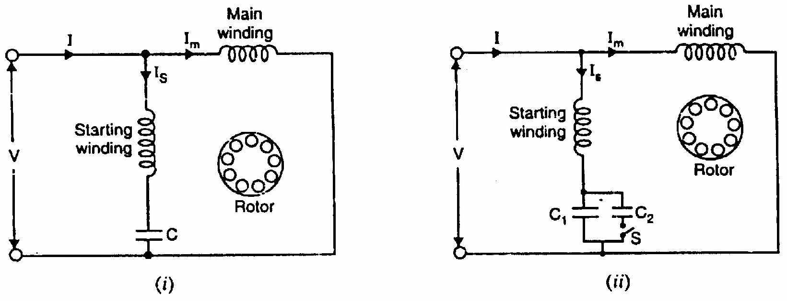
*Fig. (9.15): Torque-speed characteristic of capacitor-start motor.*

### Operating Characteristics:
1. **Starting Torque:** Very high, about **$3.5$ to $4.5$ times full-load torque** ($T_s \approx 3.5 - 4.5 T_{FL}$).
2. **Starting Current:** Moderate, about $3.5$ to $5$ times full-load current (much lower than resistance split-phase).
3. **Capacitor Rating:** Short-time rated electrolytic capacitor (typically $200\ \mu\text{F}$ to $400\ \mu\text{F}$ for 230 V).
4. **Centrifugal Switch:** Opens at ~75% synchronous speed, disconnecting capacitor and starting winding.
5. **Applications:** High-inertia and heavy-starting loads: compressors, refrigerators, air conditioners, conveyors, positive displacement pumps (1/8 to 5 HP).

<!-- Page 244 -->
<!-- Printed Page 238 -->

## 9.8 Capacitor-Start Capacitor-Run Motor (Two-Value Capacitor Motor)

This motor uses **two capacitors** in the auxiliary circuit (**Fig. 9.16**):
1. A large-value **electrolytic starting capacitor ($C_s$)** (around $200\text{--}300\ \mu\text{F}$), designed for short duty.
2. A smaller-value **oil-filled running capacitor ($C_r$)** (around $20\text{--}40\ \mu\text{F}$), designed for continuous duty.

*Fig. (9.16): (i) Wiring circuit showing starting capacitor $C_s$ and running capacitor $C_r$. (ii) Torque-speed curve.*

### Operation:
- **At Starting:** Both capacitors $C_s$ and $C_r$ are in parallel, providing high total capacitance ($C_s + C_r$), ensuring high starting torque ($T_s \approx 3 T_{FL}$) with near $90^\circ$ phase shift.
- **At Running Speed:** The centrifugal switch opens and takes out starting capacitor $C_s$. The running capacitor $C_r$ remains permanently in series with the auxiliary winding.
- **Running Benefits:** Because the auxiliary winding and $C_r$ remain in circuit, the motor operates as a **balanced 2-phase motor** under running conditions! This produces:
  - Higher running efficiency (up to 75%).
  - Higher running power factor (approaching 0.95 lagging or unity!).
  - Exceptionally quiet, vibration-free operation without pulsating torque.

## 9.9 Shaded-Pole Motor

A **shaded-pole motor** is an extremely simple, robust, single-phase induction motor that requires **no centrifugal switch and no capacitors**.

### Construction:
- Stator has **salient poles** (projecting poles) energized by single-phase concentrated coils.
- Each pole is slotted into two unequal parts: an **unshaded portion** (about 2/3 pole width) and a **shaded portion** (about 1/3 pole width).
- A heavy, short-circuited single-turn copper band called a **shading ring** (or shading coil) surrounds the shaded portion (**Fig. 9.17**).
- The rotor is a standard squirrel-cage rotor.

<!-- Page 245 -->
<!-- Printed Page 239 -->

*Fig. (9.17): (i) Salient pole with copper shading ring. (ii)–(iv) Flux shifting mechanism from unshaded to shaded region during an AC cycle.*

### Principle of Operation (Shifting Flux):
1. **During Portion $0A$ (Current Increasing Rapidly):**
   The expanding stator flux induces a strong circulating current in the shading coil. By Lenz's law, the shading coil current opposes the flux increase. Consequently, the flux is crowded into the **unshaded portion**, and shaded portion has very little flux (**Fig. 9.17 (ii)**).
2. **During Portion $AB$ (Current Near Peak, $d\phi/dt \approx 0$):**
   The rate of flux change is negligible, so induced shading current is near zero. Flux distributes **uniformly** across both unshaded and shaded portions (**Fig. 9.17 (iii)**).
3. **During Portion $BC$ (Current Decreasing Rapidly):**
   The collapsing stator flux induces current in the shading ring that opposes the decrease of flux. Hence, flux persists in the **shaded portion** while falling to zero in the unshaded portion (**Fig. 9.17 (iv)**).

> **Conclusion:** The net magnetic flux continuously sweeps across each pole face **from the unshaded portion to the shaded portion**! This shifting flux acts like a weak rotating magnetic field, driving the rotor in the direction:
> $$\mathbf{\text{Unshaded Region } \longrightarrow \text{ Shaded Region}}$$

### Characteristics & Applications:
- Very low starting torque (30% to 50% of full load).
- Low efficiency (5% to 35%) due to continuous copper loss in shading rings.
- Direction of rotation cannot be reversed electrically (mechanically fixed).
- Applications: Small desk fans, blowers, phonographs, microwave ovens, vending machines, hair dryers, timing devices (up to 1/20 HP).

<!-- Page 246 -->
<!-- Printed Page 240 -->

## 9.10 Equivalent Circuit of Single-Phase Induction Motor

Based on the **Double-Field Revolving Theory**, the single-phase motor stator winding produces two revolving fields:
1. **Forward Field:** Rotates at synchronous speed $N_s$, rotor slip is $s$.
2. **Backward Field:** Rotates at $-N_s$, rotor slip is $2 - s$.

The single stator winding can be regarded as two imaginary half-windings connected in series:
- Each winding is associated with half the total magnetizing reactance ($X_m / 2$).
- The standstill rotor resistance referred to stator ($R_2'$) is divided into two halves ($R_2' / 2$).
- The standstill rotor leakage reactance referred to stator ($X_2'$) is divided into two halves ($X_2' / 2$).

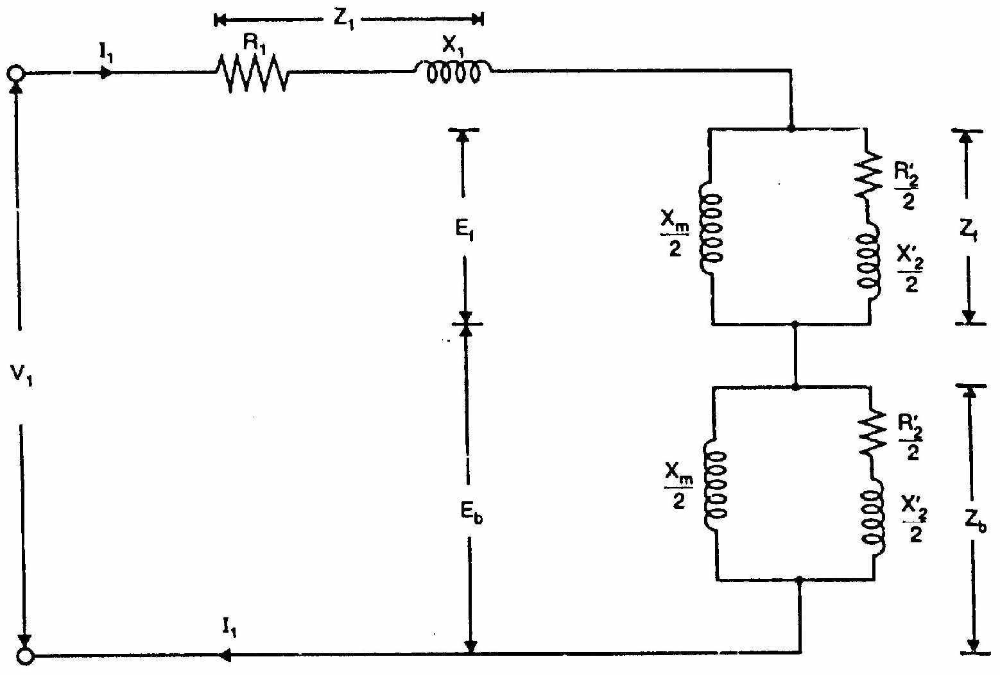
*Fig. (9.18): Complete equivalent circuit of single-phase induction motor per phase.*

<!-- Page 247 -->
<!-- Printed Page 241 -->

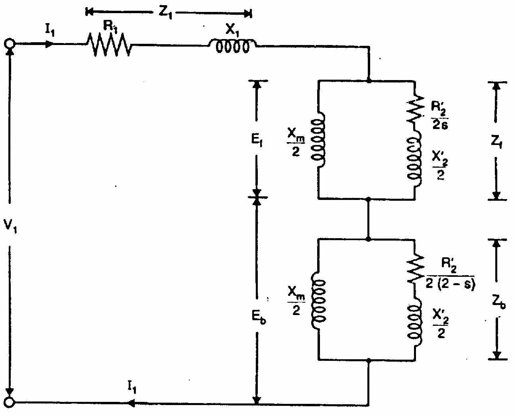
*Fig. (9.19): Simplified representation showing stator impedance $Z_1$, forward impedance $Z_f$, and backward impedance $Z_b$.*

### Forward Branch Impedance ($Z_f$):
The forward rotating field produces a rotor circuit with slip $s$:
$$\mathbf{Z_f = R_f + j X_f = \frac{j \frac{X_m}{2} \left(\frac{R_2'}{2s} + j \frac{X_2'}{2}\right)}{\frac{R_2'}{2s} + j \left(\frac{X_m}{2} + \frac{X_2'}{2}\right)}}$$

### Backward Branch Impedance ($Z_b$):
The backward rotating field produces a rotor circuit with slip $(2 - s)$:
$$\mathbf{Z_b = R_b + j X_b = \frac{j \frac{X_m}{2} \left(\frac{R_2'}{2(2-s)} + j \frac{X_2'}{2}\right)}{\frac{R_2'}{2(2-s)} + j \left(\frac{X_m}{2} + \frac{X_2'}{2}\right)}}$$

<!-- Page 248 -->
<!-- Printed Page 242 -->

### Total Input Impedance:
$$\mathbf{Z_{\text{total}} = Z_1 + Z_f + Z_b = (R_1 + j X_1) + (R_f + j X_f) + (R_b + j X_b)}$$

Input current:
$$\mathbf{I_1 = \frac{V_1}{Z_{\text{total}}}}$$

### Torque and Power Relations:
- Power transferred to forward field: $P_{2f} = I_1^2 R_f$
- Power transferred to backward field: $P_{2b} = I_1^2 R_b$
- Net mechanical power developed:
  $$\mathbf{P_m = (1 - s) P_{2f} - (1 - s_b) P_{2b} = (1 - s) I_1^2 R_f - (s - 1) I_1^2 R_b = (1 - s) I_1^2 (R_f - R_b)}$$
- Net electromagnetic torque developed:
  $$\mathbf{T_{\text{net}} = \frac{P_{2f} - P_{2b}}{\omega_s} = \frac{I_1^2 (R_f - R_b)}{\frac{2\pi N_s}{60}} \quad \text{N-m}}$$

## 9.11 A.C. Series Motor or Universal Motor

A d.c. series motor rotates in the same direction regardless of supply polarity because reversing line polarity reverses both armature current and field current simultaneously ($T \propto \Phi I_a$). Therefore, a series motor can be adapted to operate on single-phase a.c. supply.

<!-- Page 249 -->
<!-- Printed Page 243 -->

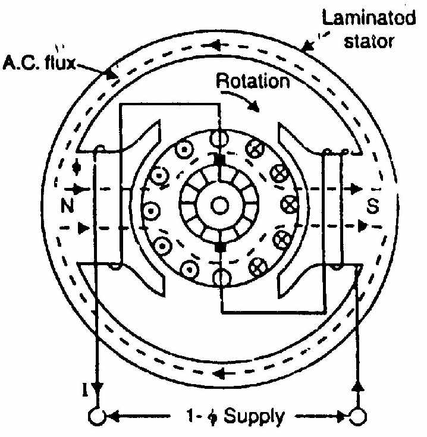
*Fig. (9.20): Schematic and connection diagram of a universal (a.c. series) motor.*

### Modifications Required for A.C. Operation:
1. **Laminated Stator Frame:** The entire magnetic frame and pole cores must be laminated to reduce eddy current losses.
2. **Low Inductance Field Winding:** Field winding is wound with fewer turns to reduce inductive reactance ($X_L = 2\pi f L$) and improve power factor.
3. **High Armature Turns:** Armature turns are increased to maintain required torque.
4. **Compensating Winding:** Placed in stator slots $90^\circ$ electrical to the main field winding to neutralize armature reaction and reduce brush sparking.
5. **High Resistance Brushes:** Used to limit transformer-induced circulating currents during commutation.

### Characteristics & Applications:
- High speed at light load (up to 20,000 r.p.m.) and high starting torque.
- Speed varies inversely with load.
- Operates on both AC and DC (hence called **Universal Motor**).
- Applications: Vacuum cleaners, food blenders, sewing machines, portable hand drills, electric grinders.

<!-- Page 250 -->
<!-- Printed Page 244 -->

## 9.12 Single-Phase Repulsion Motor

A repulsion motor consists of:
1. Stator carrying a single-phase distributed winding.
2. Armature (rotor) with standard d.c. winding connected to a commutator.
3. **Short-circuited brushes:** The brushes are not connected to the supply, but are connected together with a jumper wire (**Fig. 9.21**).

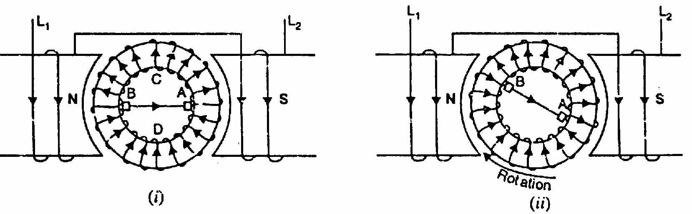
*Fig. (9.21): Repulsion motor showing short-circuited brushes on commutator.*

<!-- Page 251 -->
<!-- Printed Page 245 -->

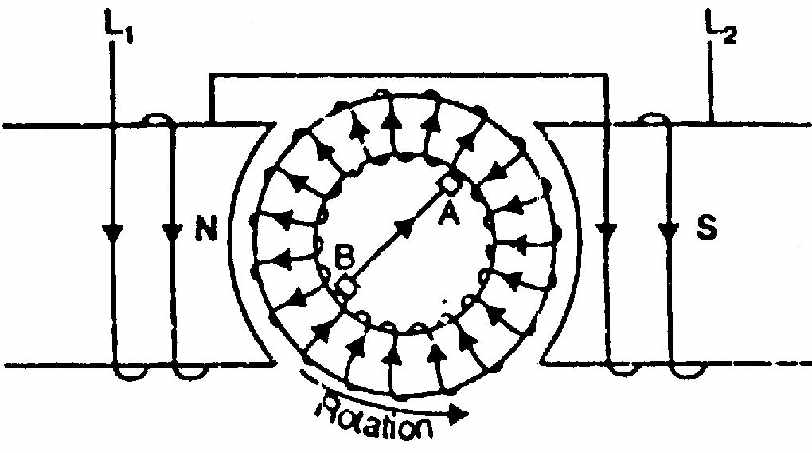
*Fig. (9.22): (i) Brushes on magnetic axis ($\alpha = 0^\circ$, zero torque). (ii) Brushes at $90^\circ$ ($\alpha = 90^\circ$, zero torque). (iii) Brushes shifted by angle $\alpha$ (high torque).*

### Working Principle:
1. **Brushes aligned with stator field axis ($\alpha = 0^\circ$):**
   Voltages induced in the two armature halves are equal and opposite; net e.m.f. across brushes is maximum, producing heavy current, but current produces magnetic poles directly opposing stator poles. Net torque = 0 (**Fig. 9.22 (i)**).
2. **Brushes perpendicular to stator field axis ($\alpha = 90^\circ$):**
   Voltages induced in the conductors cancel around the commutator; net brush current is zero. Net torque = 0 (**Fig. 9.22 (ii)**).
3. **Brushes shifted by angle $\alpha$ ($0^\circ < \alpha < 90^\circ$, typically $\alpha \approx 20^\circ \text{ to } 25^\circ$):**
   Current flows through short-circuited brushes. The armature develops a magnetic field inclined at angle $\alpha$ to the stator field. The north pole of the stator repels the like north pole of the armature, producing a **strong unidirectional torque**!

<!-- Page 252 -->
<!-- Printed Page 246 -->

- Direction of rotation depends on the direction of brush shift. Shifting brushes to the other side of stator axis reverses rotation!
- Maximum starting torque occurs at $\alpha \approx 45^\circ$.

## 9.13 Repulsion-Start Induction-Run Motor

Starts as a repulsion motor to develop high starting torque (350% to 400% full-load torque).
- When the motor reaches about 75% rated speed, a centrifugal mechanism pushes a short-circuiting necklace ring against the commutator segments, **short-circuiting all commutator bars together**!
- The rotor then acts as a conventional squirrel-cage induction motor.
- Brushes may be lifted off the commutator to eliminate friction and wear.

<!-- Page 253 -->
<!-- Printed Page 247 -->

## 9.14 Repulsion-Induction Motor

Combines a repulsion motor and an induction motor in a single rotor:
- Rotor has **two independent windings**: an outer wound armature with commutator (repulsion winding) and an inner squirrel-cage winding.

<!-- Page 254 -->
<!-- Printed Page 248 -->

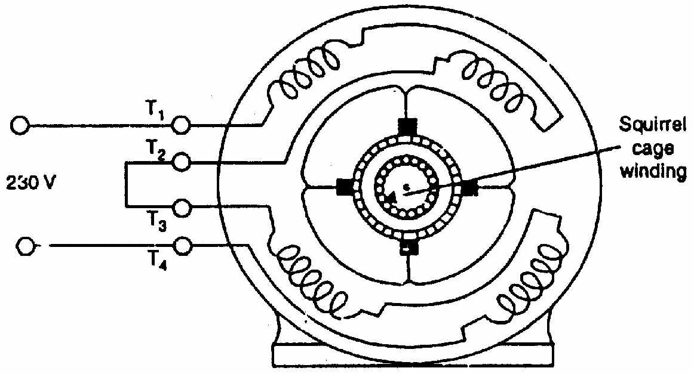
*Fig. (9.23): Connection diagram of 4-pole repulsion-induction motor.*

<!-- Page 255 -->
<!-- Printed Page 249 -->

- At starting, the squirrel-cage winding has very high reactance, so starting torque is produced entirely by repulsion winding action ($T_s \approx 2.5 - 3 T_{FL}$).
- At full speed, the squirrel-cage winding takes over, maintaining essentially constant induction-motor speed with excellent regulation (~6%).

## 9.15 Single-Phase Synchronous Motors

Single-phase synchronous motors run at strictly constant speed ($N = N_s = 120f/P$) without requiring external DC excitation:
1. **Reluctance Motor**
2. **Hysteresis Motor**

<!-- Page 256 -->
<!-- Printed Page 250 -->

## 9.16 Reluctance Motor

A reluctance motor is a single-phase induction motor with a modified squirrel-cage rotor where salient poles are formed by cutting away selected rotor teeth (**Fig. 9.24**).

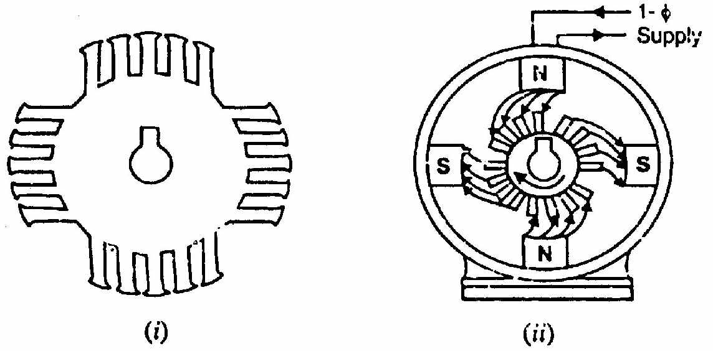
*Fig. (9.24): (i) 4-pole salient rotor construction. (ii) Alignment with rotating magnetic field.*

### Operation:
1. Starts as a normal squirrel-cage induction motor via auxiliary phase-splitting winding.
2. As it nears synchronous speed ($s \approx 0.05$), the salient rotor poles attempt to align themselves with the rotating magnetic field along the path of minimum magnetic reluctance.
3. The reluctance torque pulls the rotor into step (**synchronism**). The motor continues to run at synchronous speed $N_s$ purely on reluctance torque!

<!-- Page 257 -->
<!-- Printed Page 251 -->

## 9.17 Hysteresis Motor

The operation of a **hysteresis motor** depends entirely on the magnetic hysteresis loop of a special high-retentivity ferromagnetic rotor material (chrome steel, cobalt steel, or alnico).

### Construction:
- **Stator:** Balanced 2-phase or permanent-split capacitor stator producing a smooth, uniform revolving magnetic field.
- **Rotor:** A smooth, unslotted solid cylinder of high-hysteresis hard magnetic alloy mounted over an aluminium or brass sleeve. There are no slots, teeth, or rotor windings!

<!-- Page 258 -->
<!-- Printed Page 252 -->

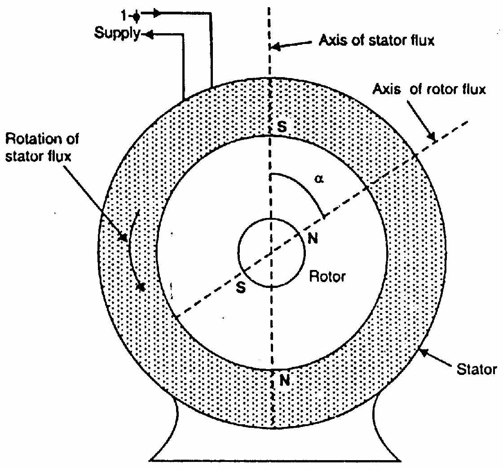
*Fig. (9.25): Smooth solid alloy rotor showing hysteresis lag angle $\alpha$ and torque production.*

### Principle of Operation:
1. The revolving stator field induces eddy currents and magnetized poles in the smooth alloy cylinder.
2. Due to magnetic hysteresis, the magnetic axis of the rotor poles **lags behind the stator magnetic field axis** by a constant hysteresis angle $\alpha$ (**Fig. 9.25**).
3. The stator field attracts the lagging rotor poles, developing a **pure hysteresis torque**:
   $$\mathbf{T_h = k \cdot V_{\text{rotor}} \cdot \text{Hysteresis Loop Area}}$$
4. Because the hysteresis loop area is independent of frequency/speed, **hysteresis torque is strictly constant from standstill all the way up to synchronous speed**!
5. At synchronous speed ($N = N_s$), eddy current losses vanish, and the motor runs as a permanent-magnet synchronous motor locked into step with the rotating stator field.

### Outstanding Advantages & Applications:
1. **Completely Silent Operation:** Zero mechanical or magnetic hum (unslotted, toothless rotor).
2. **Smooth Acceleration:** Can pull high-inertia loads into synchronism effortlessly.
3. **Constant Speed:** Strictly locked to synchronous frequency.
4. **Applications:** Sound-recording and reproduction equipment, tape recorders, turntables, electric clocks, precision gyroscopes, timing devices.

---
*End of Chapter 9: Single-Phase Motors*
