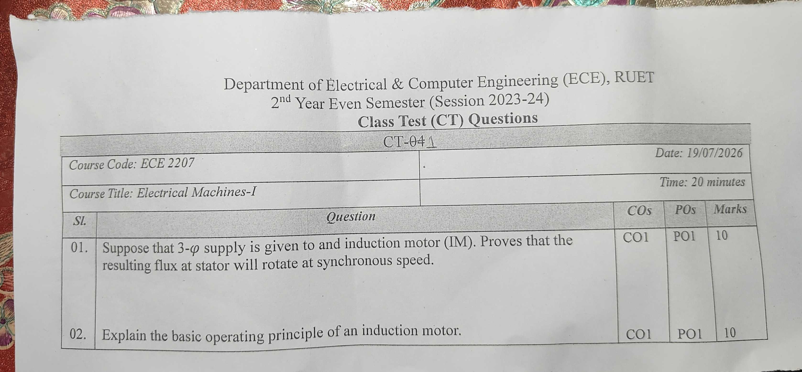

*(start)* | [🏠 Index](README.md) | [CT-02 →](CT_02.md)

---

# Department of Electrical & Computer Engineering (ECE), RUET
## 2nd Year Even Semester (Session 2023-24)
### Class Test (CT) Questions — CT-01

**Course Code:** ECE 2207  
**Course Title:** Electrical Machines-I  
**Date:** 19/07/2026  
**Time:** 20 minutes  
**Total Marks:** 20 (10 marks per question)  

---

## Question Paper Scan

> [!NOTE]
> The printed question paper had "CT-04" typed in the title banner. The course teacher crossed out "04" and wrote "1" by hand, confirming this as CT-01 held on 19/07/2026.

---

## Question Paper Transcript

| Sl. | Question | COs | POs | Marks |
| :---: | :---| :---: | :---: | :---: |
| **01.** | Suppose that 3-$\phi$ supply is given to and induction motor (IM). Proves that the resulting flux at stator will rotate at synchronous speed. | CO1 | PO1 | 10 |
| **02.** | Explain the basic operating principle of an induction motor. | CO1 | PO1 | 10 |

*(Note: In Question 01, "to and induction motor" and "Proves that" appear verbatim as printed on the original exam sheet).*

---

## Comprehensive Solutions & Analysis

### Question 01: Rotating Magnetic Field (RMF) Proof

**Question:** Suppose that 3-$\phi$ supply is given to an induction motor (IM). Prove that the resulting flux at stator will rotate at synchronous speed. **[Marks: 10, CO: 1, PO: 1]**

#### 1. Setup & Assumptions
A three-phase stator winding has three identical coils. These coils are placed $120^\circ$ apart in space. 

When a balanced three-phase AC supply feeds these windings, balanced alternating currents flow:
$$i_R = I_m \sin(\omega t)$$
$$i_Y = I_m \sin(\omega t - 120^\circ)$$
$$i_B = I_m \sin(\omega t - 240^\circ) = I_m \sin(\omega t + 120^\circ)$$

Each phase current sets up a pulsating magnetic flux along its winding axis. The peak flux in each phase is $\Phi_m$:
$$\Phi_R = \Phi_m \sin(\omega t)$$
$$\Phi_Y = \Phi_m \sin(\omega t - 120^\circ)$$
$$\Phi_B = \Phi_m \sin(\omega t + 120^\circ)$$

The three flux axes are separated by $120^\circ$ in physical space.

---

#### 2. Evaluation at Four Successive Time Instants

We calculate the resultant flux vector $\Phi_r$ at four different moments.

##### Case 1: At $\omega t = 0^\circ$
Substitute $\omega t = 0^\circ$ into the flux expressions:
$$\Phi_R = \Phi_m \sin(0^\circ) = 0$$
$$\Phi_Y = \Phi_m \sin(-120^\circ) = -\frac{\sqrt{3}}{2} \Phi_m$$
$$\Phi_B = \Phi_m \sin(120^\circ) = \frac{\sqrt{3}}{2} \Phi_m$$

- The R-phase flux is zero.
- The Y-phase flux is negative. It points opposite to the positive Y-axis.
- The B-phase flux is positive. It points along the positive B-axis.
- The angle between the negative Y-axis and positive B-axis is $60^\circ$.

The resultant flux $\Phi_r$ bisects these two vectors:
$$\Phi_r = 2 \left(\frac{\sqrt{3}}{2} \Phi_m\right) \cos\left(\frac{60^\circ}{2}\right) = 2 \cdot \frac{\sqrt{3}}{2} \Phi_m \cdot \frac{\sqrt{3}}{2} = \frac{3}{2}\Phi_m = 1.5\,\Phi_m$$

The resultant vector points vertically upward along the bisector.

---

##### Case 2: At $\omega t = 60^\circ$
Substitute $\omega t = 60^\circ$:
$$\Phi_R = \Phi_m \sin(60^\circ) = \frac{\sqrt{3}}{2}\Phi_m$$
$$\Phi_Y = \Phi_m \sin(60^\circ - 120^\circ) = \Phi_m \sin(-60^\circ) = -\frac{\sqrt{3}}{2}\Phi_m$$
$$\Phi_B = \Phi_m \sin(60^\circ + 120^\circ) = \Phi_m \sin(180^\circ) = 0$$

- The B-phase flux is now zero.
- $\Phi_R$ is positive along the R-axis.
- $\Phi_Y$ is negative, directed opposite to the Y-axis.
- The angle between positive R-axis and negative Y-axis is $60^\circ$.

The resultant flux is:
$$\Phi_r = 2 \left(\frac{\sqrt{3}}{2} \Phi_m\right) \cos(30^\circ) = 1.5\,\Phi_m$$

The resultant vector has rotated by $60^\circ$ clockwise from its position at $\omega t = 0^\circ$.

---

##### Case 3: At $\omega t = 120^\circ$
Substitute $\omega t = 120^\circ$:
$$\Phi_R = \Phi_m \sin(120^\circ) = \frac{\sqrt{3}}{2}\Phi_m$$
$$\Phi_Y = \Phi_m \sin(0^\circ) = 0$$
$$\Phi_B = \Phi_m \sin(240^\circ) = -\frac{\sqrt{3}}{2}\Phi_m$$

- The Y-phase flux is zero.
- The resultant of positive $\Phi_R$ and negative $\Phi_B$ gives:
$$\Phi_r = 2 \left(\frac{\sqrt{3}}{2}\Phi_m\right) \cos(30^\circ) = 1.5\,\Phi_m$$

The resultant vector has rotated by another $60^\circ$ clockwise. That makes $120^\circ$ total rotation.

---

##### Case 4: At $\omega t = 180^\circ$
Substitute $\omega t = 180^\circ$:
$$\Phi_R = \Phi_m \sin(180^\circ) = 0$$
$$\Phi_Y = \Phi_m \sin(60^\circ) = \frac{\sqrt{3}}{2}\Phi_m$$
$$\Phi_B = \Phi_m \sin(300^\circ) = -\frac{\sqrt{3}}{2}\Phi_m$$

The resultant flux remains:
$$\Phi_r = 1.5\,\Phi_m$$

The vector has now rotated by $180^\circ$ in space.

---

#### 3. General Analytical Proof
Take the horizontal axis along the R-phase axis. Resolve all three pulsating fluxes into horizontal ($X$) and vertical ($Y$) space components:

$$\Phi_x = \Phi_R + \Phi_Y \cos(120^\circ) + \Phi_B \cos(240^\circ)$$
$$\Phi_y = 0 + \Phi_Y \sin(120^\circ) + \Phi_B \sin(240^\circ)$$

Substitute the instantaneous values:
$$\Phi_x = \Phi_m \sin(\omega t) + \Phi_m \sin(\omega t - 120^\circ)\left(-\frac{1}{2}\right) + \Phi_m \sin(\omega t + 120^\circ)\left(-\frac{1}{2}\right)$$
$$\Phi_x = \Phi_m \sin(\omega t) - \frac{1}{2}\Phi_m \left[2\sin(\omega t)\cos(120^\circ)\right] = \Phi_m \sin(\omega t) + \frac{1}{2}\Phi_m \sin(\omega t) = \frac{3}{2}\Phi_m \sin(\omega t)$$

Now resolve the vertical component:
$$\Phi_y = \Phi_m \sin(\omega t - 120^\circ)\left(\frac{\sqrt{3}}{2}\right) + \Phi_m \sin(\omega t + 120^\circ)\left(-\frac{\sqrt{3}}{2}\right)$$
$$\Phi_y = \frac{\sqrt{3}}{2}\Phi_m \left[\sin(\omega t - 120^\circ) - \sin(\omega t + 120^\circ)\right] = \frac{\sqrt{3}}{2}\Phi_m \left[-2\cos(\omega t)\sin(120^\circ)\right]$$
$$\Phi_y = \frac{\sqrt{3}}{2}\Phi_m \left[-2\cos(\omega t)\left(\frac{\sqrt{3}}{2}\right)\right] = -\frac{3}{2}\Phi_m \cos(\omega t)$$

Find the magnitude of the resultant flux vector:
$$\Phi_r = \sqrt{\Phi_x^2 + \Phi_y^2} = \sqrt{\left(\frac{3}{2}\Phi_m \sin\omega t\right)^2 + \left(-\frac{3}{2}\Phi_m \cos\omega t\right)^2} = \frac{3}{2}\Phi_m = 1.5\,\Phi_m$$

Find the space angle $\theta$:
$$\tan\theta = \frac{\Phi_y}{\Phi_x} = \frac{-\cos(\omega t)}{\sin(\omega t)} = -\cot(\omega t) = \tan(\omega t - 90^\circ)$$
$$\theta = \omega t - 90^\circ$$

The angular velocity of rotation is:
$$\frac{d\theta}{dt} = \omega = 2\pi f \text{ rad/s (electrical)}$$

For a machine with $P$ poles:
$$\text{Mechanical speed } N_s = \frac{120 f}{P}\text{ rpm}$$

#### Conclusion
1. The resultant stator flux maintains a constant magnitude equal to $1.5\,\Phi_m$ at all times.
2. The flux vector rotates steadily in space at synchronous speed $N_s = \frac{120f}{P}$. *(Proved)*

---

### Question 02: Operating Principle of an Induction Motor

**Question:** Explain the basic operating principle of an induction motor. **[Marks: 10, CO: 1, PO: 1]**

#### Step-by-Step Working Mechanism

1. **Production of Rotating Magnetic Field (RMF):**
   A three-phase balanced AC supply connects to the three-phase stator winding. This produces a magnetic field in the air gap. The field has constant magnitude ($1.5\,\Phi_m$) and rotates at synchronous speed:
   $$N_s = \frac{120f}{P}$$

2. **Relative Speed & Flux Cutting:**
   At standstill, the rotor speed is $N = 0$. The stator magnetic field sweeps across the stationary rotor conductors at speed $N_s$. This relative speed cuts the rotor conductors:
   $$\text{Relative speed} = N_s - N$$

3. **Electromotive Force (EMF) Induction:**
   By Faraday's Law of Electromagnetic Induction, cutting of flux induces an EMF in the rotor bars:
   $$e = B \cdot l \cdot v_{\text{rel}}$$
   Here $B$ is air gap flux density, $l$ is active conductor length, and $v_{\text{rel}}$ is relative velocity.

4. **Circulation of Rotor Currents:**
   The rotor conductors form a closed electrical path. In a squirrel-cage motor, end rings short-circuit the bars. In a slip-ring motor, external resistors or shorting rings close the path. The induced EMF drives circulating three-phase currents through the rotor conductors.

5. **Electromagnetic Torque Generation:**
   Current-carrying rotor conductors sit inside the stator magnetic field. By the Lorentz force principle, each conductor experiences a mechanical force:
   $$\vec{F} = I (\vec{l} \times \vec{B})$$

6. **Direction of Rotation (Lenz's Law):**
   By Lenz's Law, the induced current opposes the cause that produces it. The cause is the relative motion between the stator field and the rotor conductors. 
   To reduce this relative motion, the rotor begins to spin in the same direction as the stator rotating field. The developed electromagnetic torque accelerates the rotor.

7. **Why the Motor Cannot Reach Synchronous Speed:**
   Suppose the rotor speed reached synchronous speed ($N = N_s$). 
   The relative speed $(N_s - N)$ would become zero. 
   The rotor conductors would no longer cut any magnetic flux. 
   Induced EMF would drop to zero. Rotor current would fall to zero. 
   Torque would become zero. 
   Mechanical friction and windage would immediately slow the rotor down below $N_s$.
   Therefore, an induction motor must always run at a speed $N$ strictly less than $N_s$.

8. **Slip & Rotor Frequency:**
   The difference between synchronous speed and actual rotor speed is the slip speed. Slip $s$ is defined as:
   $$s = \frac{N_s - N}{N_s}$$
   The frequency of induced rotor EMF and current depends on slip:
   $$f_r = s \cdot f$$
   At standstill ($N = 0$), $s = 1$, and $f_r = f$. At normal full load, $s \approx 0.02 \text{ to } 0.05$, so $f_r$ is very small (around 1 to 2.5 Hz).

---

## Cross-References & Study Vault Links

- **Classroom Board Derivation:** [ClassNoteByRaidah/Class_04.md](file:///home/azaz/AntigravityxStudy/SemesterFinal_2_2/ECE_2207/ClassNoteByRaidah/Class_04.md)
- **Teacher Lecture Slides:** [SlidesByMaam/L-01_ECE-2207.md](file:///home/azaz/AntigravityxStudy/SemesterFinal_2_2/ECE_2207/SlidesByMaam/L-01_ECE-2207.md)
- **Textbook Chapter:** [Books/B.L._Theraja/Ch-34_Induction_Motor.md](file:///home/azaz/AntigravityxStudy/SemesterFinal_2_2/ECE_2207/Books/B.L._Theraja/Ch-34_Induction_Motor.md)
- **Past Final Exam Repeats:** [PrevYearQuestions/2024.md](file:///home/azaz/AntigravityxStudy/SemesterFinal_2_2/ECE_2207/PrevYearQuestions/2024.md), [PrevYearQuestions/2023.md](file:///home/azaz/AntigravityxStudy/SemesterFinal_2_2/ECE_2207/PrevYearQuestions/2023.md) (RMF proof has appeared in 6 out of 7 semester finals).
- **Exam Pattern Analysis:** [ECE_2207_Question_Analysis.md](file:///home/azaz/AntigravityxStudy/SemesterFinal_2_2/ECE_2207/ECE_2207_Question_Analysis.md#section-b--induction-motor-topics)

---

*(start)* | [🏠 Index](README.md) | [CT-02 →](CT_02.md)
