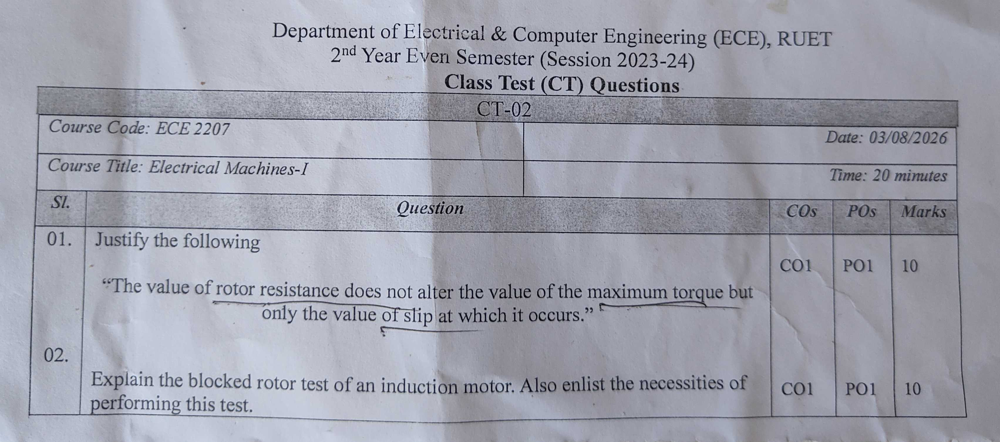

[← CT-01](CT_01.md) | [🏠 Index](README.md) | [CT-03 →](CT_03.md)

---

# Department of Electrical & Computer Engineering (ECE), RUET
## 2nd Year Even Semester (Session 2023-24)
### Class Test (CT) Questions — CT-02

**Course Code:** ECE 2207  
**Course Title:** Electrical Machines-I  
**Date:** 03/08/2026  
**Time:** 20 minutes  
**Total Marks:** 20 (10 marks per question)  

---

## Question Paper Scan



---

## Question Paper Transcript

| Sl. | Question | COs | POs | Marks |
| :---: | :---| :---: | :---: | :---: |
| **01.** | Justify the following:<br>"The value of rotor resistance does not alter the value of the maximum torque but only the value of slip at which it occurs." | CO1 | PO1 | 10 |
| **02.** | Explain the blocked rotor test of an induction motor. Also enlist the necessities of performing this test. | CO1 | PO1 | 10 |

---

## Comprehensive Solutions & Analysis

### Question 01: Maximum Torque and Rotor Resistance Independence

**Statement to Justify:** "The value of rotor resistance does not alter the value of the maximum torque but only the value of slip at which it occurs." **[Marks: 10, CO: 1, PO: 1]**

#### 1. Mathematical Derivation of Rotor Torque
Let:
- $E_2$ = Rotor induced EMF per phase at standstill
- $X_2$ = Standstill rotor leakage reactance per phase
- $R_2$ = Rotor circuit resistance per phase
- $s$ = Operating slip of the motor

At any running slip $s$:
- Induced rotor EMF per phase: $E_{2s} = s E_2$
- Rotor leakage reactance per phase: $X_{2s} = s X_2$
- Rotor impedance per phase:
$$Z_{2s} = \sqrt{R_2^2 + (s X_2)^2}$$

The rotor current per phase is:
$$I_2 = \frac{s E_2}{\sqrt{R_2^2 + (s X_2)^2}}$$

The rotor power factor is:
$$\cos\theta_2 = \frac{R_2}{Z_{2s}} = \frac{R_2}{\sqrt{R_2^2 + (s X_2)^2}}$$

The developed electromagnetic torque is proportional to the rotor power input:
$$T = k_t \cdot E_2 \cdot I_2 \cdot \cos\theta_2$$
$$T = \frac{k \cdot s E_2^2 R_2}{R_2^2 + s^2 X_2^2}$$

Here $k = \frac{3}{2\pi N_s}$ is a machine constant.

---

#### 2. Slip for Maximum Torque ($s_{mT}$)
To find the slip at which torque reaches its peak, differentiate $T$ with respect to slip $s$ and set it to zero:
$$\frac{dT}{ds} = 0$$

Using the quotient rule:
$$\frac{d}{ds}\left[\frac{s R_2}{R_2^2 + s^2 X_2^2}\right] = \frac{(R_2^2 + s^2 X_2^2)(R_2) - (s R_2)(2s X_2^2)}{(R_2^2 + s^2 X_2^2)^2} = 0$$

Set the numerator to zero:
$$R_2(R_2^2 + s^2 X_2^2) - 2 s^2 R_2 X_2^2 = 0$$
$$R_2^2 - s^2 X_2^2 = 0$$
$$s^2 = \frac{R_2^2}{X_2^2}$$
$$s_{mT} = \frac{R_2}{X_2}$$

This shows that the slip at maximum torque $s_{mT}$ is directly proportional to rotor resistance $R_2$:
$$s_{mT} \propto R_2$$

If rotor resistance increases, maximum torque occurs at a higher slip (a lower rotor speed).

---

#### 3. Value of Maximum Torque ($T_{\text{max}}$)
Substitute the condition $s = s_{mT} = \frac{R_2}{X_2}$ into the general torque equation:

$$T_{\text{max}} = \frac{k \left(\frac{R_2}{X_2}\right) E_2^2 R_2}{R_2^2 + \left(\frac{R_2}{X_2}\right)^2 X_2^2}$$
$$T_{\text{max}} = \frac{k \left(\frac{R_2^2}{X_2}\right) E_2^2}{R_2^2 + R_2^2} = \frac{k \left(\frac{R_2^2}{X_2}\right) E_2^2}{2 R_2^2}$$
$$T_{\text{max}} = \frac{k E_2^2}{2 X_2}$$

---

#### 4. Physical Justification & Conclusion
1. **$T_{\text{max}}$ is independent of $R_2$:**
   The term $R_2$ cancels out completely from the final expression for $T_{\text{max}}$. Maximum torque depends only on supply voltage ($E_2 \propto V$) and standstill rotor leakage reactance $X_2$.
2. **Peak position shifts with $R_2$:**
   The slip at which the peak occurs is $s_{mT} = \frac{R_2}{X_2}$. Adding external resistance to the rotor circuit shifts the torque peak toward higher slip (lower speed). 
3. **Starting torque improves:**
   If we insert external rotor resistance such that $R_2 = X_2$, then $s_{mT} = 1$. The motor develops its maximum possible torque right at start ($N = 0$).
4. **Summary:**
   Varying rotor resistance changes the location of the maximum torque on the speed axis. But it never alters the magnitude of the peak itself. *(Justified)*


---

### Question 02: Blocked Rotor Test of an Induction Motor

**Question:** Explain the blocked rotor test of an induction motor. Also enlist the necessities of performing this test. **[Marks: 10, CO: 1, PO: 1]**

#### 1. Test Description & Operating Setup
The blocked rotor test is analogous to the short-circuit test of a transformer. The rotor is held stationary so that it cannot rotate ($N = 0$, slip $s = 1$).

```
3-Phase AC    3-Phase        Wattmeters      Stator Terminals
Supply -----> Variac -------> [ W1, W2 ] ------> [ A1, B1, C1 ]
                              Ammeters [A]
                              Voltmeter [V]        Rotor Shaft
                                                    [ LOCKED / BLOCKED ]
```

##### Procedure:
1. Lock the rotor shaft mechanically using a clamp or brake band so it cannot rotate.
2. Short-circuit the slip rings if using a wound rotor motor.
3. Connect a three-phase autotransformer (variac) to the stator through a voltmeter, ammeters, and two wattmeters.
4. Start with zero applied voltage.
5. Gradually increase the voltage until rated full-load stator current flows through the ammeters.
6. Record the applied line voltage $V_{br}$, line current $I_{br}$, and total input power $P_{br} = W_1 + W_2$.
7. Keep the test brief to avoid overheating the rotor and stator windings.

##### Why Core Loss is Neglected:
The applied voltage $V_{br}$ during this test is small. It is typically only 10% to 15% of rated line voltage. 
Core loss is proportional to voltage squared ($V^2$). 
Because the test voltage is very low, the iron losses in the stator and rotor are negligible. 
The measured input power $P_{br}$ is taken entirely as full-load copper loss of both windings.

---

#### 2. Parameter Calculations
Assuming a star-connected stator:

1. **Per-phase values:**
   $$V_{\text{phase}} = \frac{V_{br}}{\sqrt{3}}, \quad I_{\text{phase}} = I_{br}$$

2. **Total equivalent impedance referred to stator:**
   $$Z_{01} = \frac{V_{br} / \sqrt{3}}{I_{br}}$$

3. **Total equivalent resistance referred to stator:**
   $$P_{br} = 3 \cdot I_{br}^2 \cdot R_{01} \implies R_{01} = \frac{P_{br}}{3 I_{br}^2}$$

4. **Total equivalent leakage reactance referred to stator:**
   $$X_{01} = \sqrt{Z_{01}^2 - R_{01}^2}$$

5. **Separating stator and rotor parameters:**
   Measure DC resistance of stator winding $R_{1,\text{dc}}$ and multiply by 1.2 to 1.3 for AC skin effect to get $R_1$.
   The rotor resistance referred to stator is:
   $$R_2' = R_{01} - R_1$$
   The leakage reactance is usually split equally:
   $$X_1 = X_2' = 0.5\,X_{01}$$

---

#### 3. Necessities of Performing the Blocked Rotor Test
The blocked rotor test is necessary for the following engineering reasons:

1. **Measurement of Full-Load Copper Losses:**
   It gives the total $I^2 R$ loss of the stator and rotor windings at rated current. This is required to determine motor efficiency.
2. **Extraction of Equivalent Circuit Series Parameters:**
   It supplies $R_{01}$, $X_{01}$, and $Z_{01}$. These values form the series branch of the exact and approximate equivalent circuits.
3. **Calculation of Short-Circuit Current at Rated Voltage:**
   Because impedances are linear, the starting current with full rated voltage applied across the terminals is:
   $$I_{sc} = I_{br} \times \left(\frac{V_{\text{rated}}}{V_{br}}\right)$$
4. **Estimation of Starting Torque:**
   Starting torque depends directly on short-circuit current and rotor resistance ($T_{st} \propto I_{sc}^2 R_2$). The test values help determine starting torque without running the motor at full voltage.
5. **Construction of Circle Diagram:**
   The short-circuit power factor $\cos\phi_{sc} = \frac{P_{br}}{\sqrt{3} V_{br} I_{br}}$ and short-circuit current $I_{sc}$ are needed to draw the short-circuit line and complete the circle diagram of the induction motor.

---

## Cross-References & Study Vault Links

- **Classroom Board Notes on Torque Derivation:** [ClassNoteByRaidah/Class_07.md](file:///home/azaz/AntigravityxStudy/SemesterFinal_2_2/ECE_2207/ClassNoteByRaidah/Class_07.md)
- **Classroom Board Notes on Maximum Torque:** [ClassNoteByRaidah/Class_08.md](file:///home/azaz/AntigravityxStudy/SemesterFinal_2_2/ECE_2207/ClassNoteByRaidah/Class_08.md)
- **Classroom Notes on Motor Testing:** [ClassNoteByRaidah/Class_09.md](file:///home/azaz/AntigravityxStudy/SemesterFinal_2_2/ECE_2207/ClassNoteByRaidah/Class_09.md)
- **Faculty Lecture Slides:** [SlidesByMaam/L-03_ECE-2107.md](file:///home/azaz/AntigravityxStudy/SemesterFinal_2_2/ECE_2207/SlidesByMaam/L-03_ECE-2107.md), [SlidesByMaam/L-04_ECE-2107.md](file:///home/azaz/AntigravityxStudy/SemesterFinal_2_2/ECE_2207/SlidesByMaam/L-04_ECE-2107.md)
- **Textbook Chapter:** [Books/B.L._Theraja/Ch-34_Induction_Motor.md](file:///home/azaz/AntigravityxStudy/SemesterFinal_2_2/ECE_2207/Books/B.L._Theraja/Ch-34_Induction_Motor.md), [Books/B.L._Theraja/Ch-35_Computation_and_Tests_on_Induction_Motors.md](file:///home/azaz/AntigravityxStudy/SemesterFinal_2_2/ECE_2207/Books/B.L._Theraja/Ch-35_Computation_and_Tests_on_Induction_Motors.md)
- **Semester Final Repeats:** [PrevYearQuestions/2023.md](file:///home/azaz/AntigravityxStudy/SemesterFinal_2_2/ECE_2207/PrevYearQuestions/2023.md), [PrevYearQuestions/2020.md](file:///home/azaz/AntigravityxStudy/SemesterFinal_2_2/ECE_2207/PrevYearQuestions/2020.md)

---

[← CT-01](CT_01.md) | [🏠 Index](README.md) | [CT-03 →](CT_03.md)
