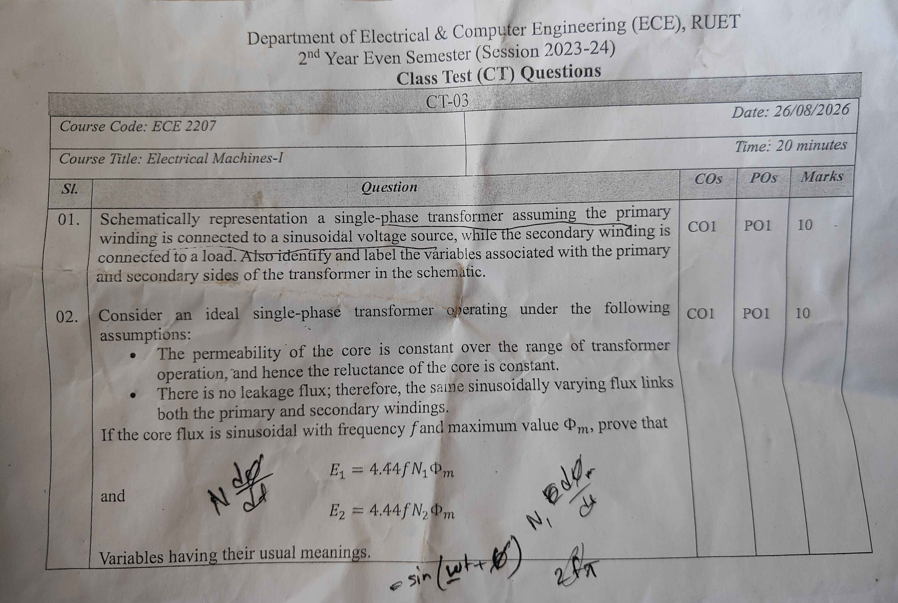

[← CT-02](CT_02.md) | [🏠 Index](README.md) | [CT-04 →](CT_04.md)

---

# Department of Electrical & Computer Engineering (ECE), RUET
## 2nd Year Even Semester (Session 2023-24)
### Class Test (CT) Questions — CT-03

**Course Code:** ECE 2207  
**Course Title:** Electrical Machines-I  
**Date:** 26/08/2026  
**Time:** 20 minutes  
**Total Marks:** 20 (10 marks per question)  

---

## Question Paper Scan

> [!NOTE]
> The original sheet contains minor student pencil scribbles ($N \frac{d\phi}{dt}$, $-\sin(\omega t)$, $2\pi f$) made during the exam. The questions below reflect the exact printed text.

---

## Question Paper Transcript

| Sl. | Question | COs | POs | Marks |
| :---: | :---| :---: | :---: | :---: |
| **01.** | Schematically representation a single-phase transformer assuming the primary winding is connected to a sinusoidal voltage source, while the secondary winding is connected to a load. Also identify and label the variables associated with the primary and secondary sides of the transformer in the schematic. | CO1 | PO1 | 10 |
| **02.** | Consider an ideal single-phase transformer operating under the following assumptions: • The permeability of the core is constant over the range of transformer operation, and hence the reluctance of the core is constant. • There is no leakage flux; therefore, the same sinusoidally varying flux links both the primary and secondary windings. If the core flux is sinusoidal with frequency $f$ and maximum value $\Phi_m$, prove that $$E_1 = 4.44 f N_1 \Phi_m$$ and $$E_2 = 4.44 f N_2 \Phi_m$$ Variables having their usual meanings. | CO1 | PO1 | 10 |

*(Note: "Schematically representation a single-phase transformer" appears verbatim from the original printed question sheet).*

---

## Comprehensive Solutions & Analysis

### Question 01: Schematic Representation of a Single-Phase Transformer

**Question:** Schematically represent a single-phase transformer assuming the primary winding is connected to a sinusoidal voltage source, while the secondary winding is connected to a load. Also identify and label the variables associated with the primary and secondary sides of the transformer in the schematic. **[Marks: 10, CO: 1, PO: 1]**

#### 1. Schematic Circuit Diagram

##### Core and Winding Schematic:

---

#### 2. Identification and Labeling of Variables

##### Primary Side Variables:
1. **$v_1(t)$ or $V_1$:** Instantaneous and RMS primary applied terminal voltage (V).
2. **$i_1(t)$ or $I_1$:** Instantaneous and RMS primary current drawn from the sinusoidal AC source (A).
3. **$N_1$:** Number of turns on the primary winding.
4. **$e_1(t)$ or $E_1$:** Instantaneous and RMS counter electromotive force (self-induced EMF) in the primary winding (V).
5. **Polarity Dots ($\bullet$):** Mark terminal polarity according to the right-hand rule.

##### Secondary Side Variables:
1. **$N_2$:** Number of turns on the secondary winding.
2. **$e_2(t)$ or $E_2$:** Instantaneous and RMS mutually induced electromotive force in the secondary winding (V).
3. **$v_2(t)$ or $V_2$:** Instantaneous and RMS secondary terminal voltage across the connected load (V).
4. **$i_2(t)$ or $I_2$:** Instantaneous and RMS secondary load current (A).
5. **$Z_L$:** Load impedance connected across the secondary terminals ($\Omega$), where $Z_L = R_L + j X_L$.

##### Core and Magnetic Variables:
1. **$\Phi(t)$:** Instantaneous mutual magnetic flux linking both primary and secondary windings (Wb).
2. **$\Phi_m$:** Maximum (peak) value of mutual magnetic flux in the core (Wb).
3. **$B_m$:** Maximum flux density in the core material ($B_m = \Phi_m / A$, in $\text{Wb/m}^2$ or Tesla).
4. **$A$:** Effective cross-sectional area of the core limb ($\text{m}^2$).
5. **$f$:** Supply frequency (Hz), where $\omega = 2\pi f$ (rad/s).
6. **$K$:** Voltage transformation ratio ($K = \frac{N_2}{N_1} = \frac{E_2}{E_1}$).

---

### Question 02: Derivation of the Transformer EMF Equation

**Question:** Under the assumptions of constant core permeability and zero leakage flux, prove that $E_1 = 4.44 f N_1 \Phi_m$ and $E_2 = 4.44 f N_2 \Phi_m$. **[Marks: 10, CO: 1, PO: 1]**

#### 1. Basis and Assumptions
- Constant permeability ($\mu = \text{constant}$): The magnetic core does not saturate. Core reluctance $\mathcal{R} = \frac{l}{\mu A}$ remains constant.
- Zero leakage flux: All magnetic flux remains confined to the iron core. Exactly the same flux $\Phi(t)$ links all $N_1$ primary turns and all $N_2$ secondary turns.

Let the sinusoidal core flux be:
$$\Phi(t) = \Phi_m \sin(\omega t) = \Phi_m \sin(2\pi f t)$$

Here:
- $\Phi_m$ = Maximum flux in the core (Wb)
- $f$ = Frequency of the AC supply (Hz)
- $\omega = 2\pi f$ = Angular frequency (rad/s)

---

#### 2. Derivation for Primary Induced EMF ($E_1$)
By Faraday's Law of Electromagnetic Induction, the instantaneous EMF induced in the primary winding is:
$$e_1(t) = -N_1 \frac{d\Phi}{dt}$$

Differentiate the flux expression:
$$\frac{d\Phi}{dt} = \frac{d}{dt}\left[\Phi_m \sin(\omega t)\right] = \omega \Phi_m \cos(\omega t)$$

Substitute into the EMF equation:
$$e_1(t) = -N_1 \omega \Phi_m \cos(\omega t)$$

Using trigonometric identity $-\cos(\theta) = \sin(\theta - 90^\circ)$:
$$e_1(t) = N_1 \omega \Phi_m \sin\left(\omega t - \frac{\pi}{2}\right)$$

This shows that the induced EMF lags the core flux by $90^\circ$.

The maximum value (peak amplitude) of the primary induced EMF is:
$$E_{m1} = N_1 \omega \Phi_m = 2\pi f N_1 \Phi_m$$

For a pure sine wave, the Root-Mean-Square (RMS) value is:
$$E_1 = \frac{E_{m1}}{\sqrt{2}} = \frac{2\pi f N_1 \Phi_m}{\sqrt{2}} = \sqrt{2}\pi f N_1 \Phi_m$$

Substitute the numerical value of $\sqrt{2}\pi$:
$$\sqrt{2}\pi \approx 1.4142 \times 3.1416 \approx 4.44288 \approx 4.44$$

Therefore:
$$E_1 = 4.44 f N_1 \Phi_m$$

---

#### 3. Derivation for Secondary Induced EMF ($E_2$)
Because there is no leakage flux, the identical flux $\Phi(t)$ links all $N_2$ turns of the secondary winding. 

By Faraday's Law:
$$e_2(t) = -N_2 \frac{d\Phi}{dt} = -N_2 \omega \Phi_m \cos(\omega t) = N_2 \omega \Phi_m \sin\left(\omega t - \frac{\pi}{2}\right)$$

The maximum secondary induced EMF is:
$$E_{m2} = N_2 \omega \Phi_m = 2\pi f N_2 \Phi_m$$

The RMS value of the secondary induced EMF is:
$$E_2 = \frac{E_{m2}}{\sqrt{2}} = \frac{2\pi f N_2 \Phi_m}{\sqrt{2}} = \sqrt{2}\pi f N_2 \Phi_m$$
$$E_2 = 4.44 f N_2 \Phi_m$$

*(Both equations proved)*

---

#### 4. Alternative Method: Average EMF & Form Factor
In one quarter cycle of duration $\Delta t = \frac{T}{4} = \frac{1}{4f}$ seconds:
- Core flux increases from $0$ to $\Phi_m$.
- Change in flux $\Delta\Phi = \Phi_m - 0 = \Phi_m$ Wb.

The average rate of change of flux is:
$$\frac{\Delta\Phi}{\Delta t} = \frac{\Phi_m}{1 / (4f)} = 4 f \Phi_m \text{ Wb/s}$$

The average EMF induced per turn is:
$$\text{Average EMF per turn} = 4 f \Phi_m \text{ Volts}$$

For a sine wave, the Form Factor $K_f$ is:
$$K_f = \frac{\text{RMS Value}}{\text{Average Value}} = 1.11$$

Therefore:
$$\text{RMS value of EMF per turn} = 1.11 \times 4 f \Phi_m = 4.44 f \Phi_m \text{ Volts}$$

Multiplying by the number of turns:
- For primary winding ($N_1$ turns):
$$E_1 = 4.44 f N_1 \Phi_m$$
- For secondary winding ($N_2$ turns):
$$E_2 = 4.44 f N_2 \Phi_m$$

---

## Cross-References & Study Vault Links

- **Classroom Board Notes:** [ClassNoteByRaidah/Class_13.md](../ClassNoteByRaidah/Class_13_Transformer_Principles_and_Construction.md)
- **Faculty Lecture Slides:** [SlidesByMaam/L-06_ECE-2207.md](../SlidesByMaam/L-06_ECE-2107.md)
- **Textbook Chapter:** [Books/B.L._Theraja/Ch-32_Transformer.md](../Books/Theraja/Ch-32/Ch-32_Index.md)
- **Semester Final Repeats:** [PrevYearQuestions/2024.md](../PrevYearQuestions/2024.md), [PrevYearQuestions/2023.md](../PrevYearQuestions/2023.md), [PrevYearQuestions/2021.md](../PrevYearQuestions/2021.md), [PrevYearQuestions/2019.md](../PrevYearQuestions/2019.md) (EMF equation is a primary repeat topic).

---

[← CT-02](CT_02.md) | [🏠 Index](README.md) | [CT-04 →](CT_04.md)
