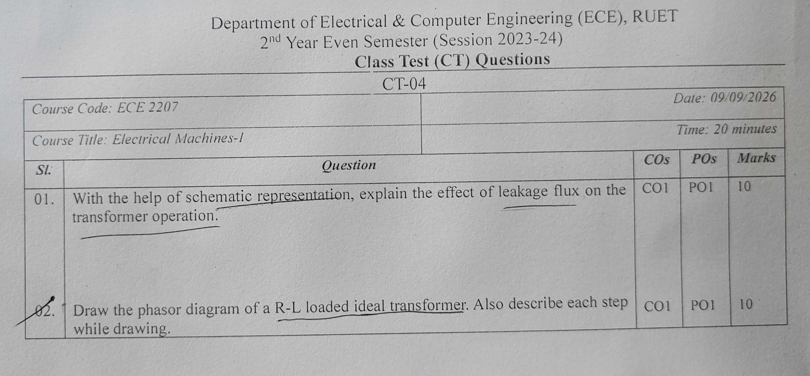

[← CT-03](CT_03.md) | [🏠 Index](README.md) | [CT Exam Answers →](CT_answers_exam_style.md)

---

# Department of Electrical & Computer Engineering (ECE), RUET
## 2nd Year Even Semester (Session 2023-24)
### Class Test (CT) Questions — CT-04

**Course Code:** ECE 2207  
**Course Title:** Electrical Machines-I  
**Date:** 09/09/2026  
**Time:** 20 minutes  
**Total Marks:** 20 (10 marks per question)  

---

## Question Paper Scan

---

## Question Paper Transcript

| Sl. | Question | COs | POs | Marks |
| :---: | :---| :---: | :---: | :---: |
| **01.** | With the help of schematic representation, explain the effect of leakage flux on the transformer operation. | CO1 | PO1 | 10 |
| **02.** | Draw the phasor diagram of a R-L loaded ideal transformer. Also describe each step while drawing. | CO1 | PO1 | 10 |

---

## Comprehensive Solutions & Analysis

### Question 01: Leakage Flux and Its Effect on Transformer Operation

**Question:** With the help of schematic representation, explain the effect of leakage flux on the transformer operation. **[Marks: 10, CO: 1, PO: 1]**

#### 1. What is Leakage Flux?
In an actual transformer, not all magnetic flux stays within the iron core.
- **Mutual Flux ($\Phi_m$):** The portion of flux that links both primary and secondary windings through the magnetic core. This flux transfers power between the windings.
- **Primary Leakage Flux ($\Phi_{l1}$):** Flux set up by primary current $I_1$ that links only the primary winding. It completes its path through the surrounding air and insulation.
- **Secondary Leakage Flux ($\Phi_{l2}$):** Flux set up by secondary current $I_2$ that links only the secondary winding. It also completes its path through air.

---

#### 2. Schematic Representation of Leakage Flux

---

#### 3. Physical Behavior of Leakage Flux
1. The leakage paths lie mostly through air and insulating spaces.
2. Air has constant magnetic permeability and does not saturate.
3. Therefore, leakage flux is directly proportional to its respective winding current:
   $$\Phi_{l1} \propto I_1 \quad \text{and} \quad \Phi_{l2} \propto I_2$$
4. Each leakage flux is in phase with the current producing it.

---

#### 4. Effects on Transformer Operation

##### 1. Induction of Self-Leakage EMFs:
Because the leakage fluxes alternate with time, they induce self-EMFs in their own windings by Faraday's Law:
$$e_{l1} = -N_1 \frac{d\Phi_{l1}}{dt}$$
$$e_{l2} = -N_2 \frac{d\Phi_{l2}}{dt}$$
Each self-induced leakage EMF lags its respective leakage flux (and current) by $90^\circ$.

##### 2. Representation as Leakage Reactances:
To supply current, the applied voltage must overcome this counter-EMF. The required opposing voltage leads the current by $90^\circ$. 
This behaves like an inductive voltage drop across a series inductor:
$$X_1 = 2\pi f L_{l1} = \frac{E_{l1}}{I_1} \quad \text{(Primary leakage reactance)}$$
$$X_2 = 2\pi f L_{l2} = \frac{E_{l2}}{I_2} \quad \text{(Secondary leakage reactance)}$$

##### 3. Internal Voltage Drops:
When the transformer is loaded, reactive voltage drops appear inside the windings:
- Primary internal reactive drop: $j I_1 X_1$
- Secondary internal reactive drop: $j I_2 X_2$

The terminal voltage equations become:
$$V_1 = -E_1 + I_1 R_1 + j I_1 X_1$$
$$V_2 = E_2 - I_2 R_2 - j I_2 X_2$$

##### 4. Impact on Voltage Regulation:
Under inductive (lagging power factor) loads, the leakage reactance drop subtracts directly from $E_2$. 
This causes secondary terminal voltage $V_2$ to decrease as load current increases. It worsens the voltage regulation of the transformer.

##### 5. Fault Current Limitation:
Leakage reactance is not entirely harmful. During a secondary short circuit, the leakage reactances $X_1$ and $X_2$ provide the main impedance that limits fault current. This protects the transformer from mechanical destruction.

---

### Question 02: Phasor Diagram of an R-L Loaded Ideal Transformer

**Question:** Draw the phasor diagram of a R-L loaded ideal transformer. Also describe each step while drawing. **[Marks: 10, CO: 1, PO: 1]**

#### 1. Ideal Transformer Assumptions
1. Winding resistances are zero ($R_1 = R_2 = 0$).
2. Leakage flux is zero ($X_1 = X_2 = 0$).
3. Core permeability is infinite ($\mu \to \infty$). No magnetizing current is needed to set up core flux ($I_m = 0$).
4. Core losses are zero (no hysteresis or eddy current losses, $I_c = 0$).
5. Therefore, no-load current is negligible ($I_0 = 0$). The primary current balances the secondary load current:
   $$\vec{I}_1 = \vec{I}_2' = \frac{N_2}{N_1} \vec{I}_2 = K \vec{I}_2$$

For an R-L load, secondary load current $I_2$ lags secondary terminal voltage $V_2$ by load impedance angle $\theta_2$:
$$\theta_2 = \tan^{-1}\left(\frac{X_L}{R_L}\right)$$

---

#### 2. Step-by-Step Construction Procedure

Follow these seven steps to draw the phasor diagram:

- **Step 1: Choose the Reference Phasor**  
  Draw the mutual core flux phasor $\vec{\Phi}_m$ horizontally along the positive X-axis.

- **Step 2: Draw the Induced EMFs ($E_1$ and $E_2$)**  
  By Faraday's Law, the induced EMFs lag the mutual flux $\vec{\Phi}_m$ by $90^\circ$. Draw $\vec{E}_1$ and $\vec{E}_2$ vertically downwards along the negative Y-axis. The relative lengths depend on the transformation ratio $K = N_2 / N_1$.

- **Step 3: Draw the Secondary Terminal Voltage ($V_2$)**  
  Because the transformer is ideal, there are no internal resistance or leakage reactance drops. Therefore, secondary terminal voltage equals secondary induced EMF:
  $$\vec{V}_2 = \vec{E}_2$$
  Draw $\vec{V}_2$ directly coinciding with $\vec{E}_2$, pointing vertically downward.

- **Step 4: Draw the Secondary Load Current ($I_2$)**  
  The load has resistance and inductance (R-L). The load current $\vec{I}_2$ lags secondary terminal voltage $\vec{V}_2$ by phase angle $\theta_2$. Draw $\vec{I}_2$ clockwise from the downward vertical axis by angle $\theta_2$.

- **Step 5: Draw the Primary Reflected Current ($I_1 = I_2'$)**  
  To keep core flux constant, primary ampere-turns must cancel secondary ampere-turns:
  $$N_1 \vec{I}_1 + N_2 \vec{I}_2 = 0 \implies \vec{I}_1 = -\frac{N_2}{N_1}\vec{I}_2$$
  Draw $\vec{I}_1$ exactly $180^\circ$ opposite to $\vec{I}_2$. Its magnitude is $K I_2$. It points into the second quadrant.

- **Step 6: Draw the Primary Applied Voltage ($V_1$)**  
  By Lenz's Law and Kirchhoff's Voltage Law, the applied primary voltage must balance the counter-EMF $\vec{E}_1$. Since there are no primary internal drops, $\vec{V}_1 = -\vec{E}_1$. 
  Draw $\vec{V}_1$ vertically upward along the positive Y-axis, exactly $180^\circ$ out of phase with $\vec{E}_1$.

- **Step 7: Mark the Primary Power Factor Angle ($\theta_1$)**  
  Mark the angle between primary voltage $\vec{V}_1$ and primary current $\vec{I}_1$. 
  Because $\vec{V}_1$ is opposite to $\vec{V}_2$ and $\vec{I}_1$ is opposite to $\vec{I}_2$, the primary phase angle equals the load phase angle:
  $$\theta_1 = \theta_2$$
  The primary side operates at the same lagging power factor ($\cos\theta_1 = \cos\theta_2$) as the secondary load.

---

#### 3. Complete Phasor Diagram

##### Vector Relationship Summary:
- $\vec{\Phi}_m = \Phi_m \angle 0^\circ$ (Reference)
- $\vec{E}_1 = E_1 \angle -90^\circ$
- $\vec{E}_2 = \vec{V}_2 = E_2 \angle -90^\circ$
- $\vec{I}_2 = I_2 \angle (-90^\circ - \theta_2)$
- $\vec{V}_1 = V_1 \angle +90^\circ$
- $\vec{I}_1 = I_1 \angle (90^\circ - \theta_1)$ where $\theta_1 = \theta_2$

---

## Cross-References & Study Vault Links

- **Classroom Board Notes on Leakage Reactance:** [ClassNoteByRaidah/Class_13.md](../ClassNoteByRaidah/Class_13_Transformer_Principles_and_Construction.md)
- **Classroom Board Notes on Transformer Phasors:** [ClassNoteByRaidah/Class_14.md](../ClassNoteByRaidah/Class_14_Equivalent_Circuit_and_Parameter_Shifting.md)
- **Faculty Lecture Slides:** [SlidesByMaam/L-06_ECE-2207.md](../SlidesByMaam/L-06_ECE-2107.md), [SlidesByMaam/L-07_ECE-2207.md](../SlidesByMaam/L-07_ECE-2107.md)
- **Textbook Reference:** [Books/B.L._Theraja/Ch-32_Transformer.md](../Books/Theraja/Ch-32/Ch-32_Index.md)
- **Semester Final Repeats:** [PrevYearQuestions/2024.md](../PrevYearQuestions/2024.md) (Question 2b asked for the R-L loaded transformer phasor diagram), [PrevYearQuestions/2021.md](../PrevYearQuestions/2021.md), [PrevYearQuestions/2018.md](../PrevYearQuestions/2018.md)

---

[← CT-03](CT_03.md) | [🏠 Index](README.md) | [CT Exam Answers →](CT_answers_exam_style.md)
