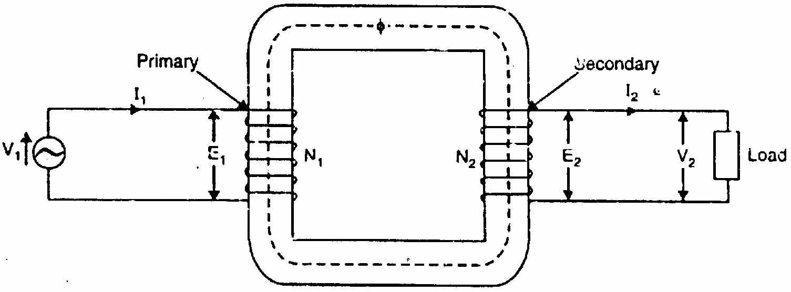
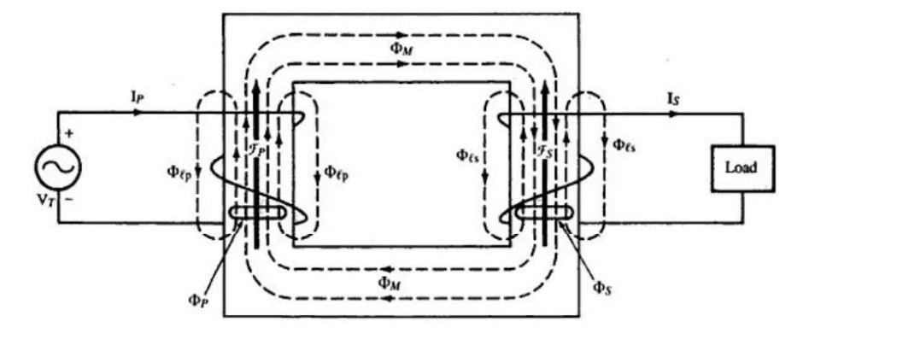
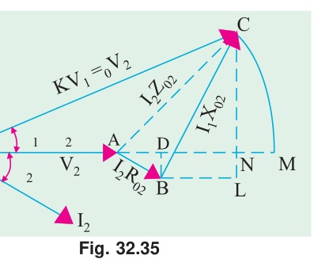

[← CT Exam Answers](CT_answers_exam_style.md) | [🏠 Index](README.md) | *(end)*

---

# ECE 2207: Electrical Machines I
## CT Questions: All Answers: Explained Style
**Department:** ECE, RUET | **Session:** 2023-24

> **How to use this file:** Full explanations for each CT question. Derivations show every intermediate step. Each answer explains *why* things work, not just *what* to write. Cross-references to textbooks, class notes, and slides are included after each answer.

---

## CT-01 (19/07/2026): Induction Motors

### Q1. Prove that the 3-φ stator flux rotates at synchronous speed. [10 Marks]

#### Why this matters
A 3-phase induction motor has no magnets on the rotor. The only reason the rotor spins is because the stator creates a magnetic field that rotates on its own. This question asks you to prove, step by step, that this rotation actually happens and that it happens at a specific speed called synchronous speed.

#### Setup and Assumptions
The stator has three identical windings, one for each phase. They are wound 120° apart in physical space around the stator circumference. When we connect a balanced 3-phase AC supply, three sinusoidal currents flow, each shifted by 120° in time:

$$i_R = I_m \sin(\omega t)$$
$$i_Y = I_m \sin(\omega t - 120°)$$
$$i_B = I_m \sin(\omega t + 120°)$$

Each phase current creates a pulsating magnetic flux along the axis of its own winding. The word "pulsating" means the flux alternates in magnitude and direction. It does not rotate on its own. The peak flux produced by each phase is $\Phi_m$:

$$\Phi_R = \Phi_m \sin(\omega t)$$
$$\Phi_Y = \Phi_m \sin(\omega t - 120°)$$
$$\Phi_B = \Phi_m \sin(\omega t + 120°)$$

These three fluxes act along axes 120° apart in space. The total flux at any instant is their vector sum.

#### Step 1: Evaluate the resultant at four time instants

We pick four moments separated by 60° of electrical time and find the resultant vector each time.

**At ωt = 0°:**
$$\Phi_R = 0, \quad \Phi_Y = -\frac{\sqrt{3}}{2}\Phi_m, \quad \Phi_B = +\frac{\sqrt{3}}{2}\Phi_m$$

The R-phase flux is zero. The Y-phase flux is negative (points away from the positive Y-axis). The B-phase flux is positive (points along positive B-axis). These two equal vectors are separated by 60°. Their resultant:
$$\Phi_r = 2 \cdot \frac{\sqrt{3}}{2}\Phi_m \cdot \cos(30°) = \sqrt{3}\Phi_m \cdot \frac{\sqrt{3}}{2} = \frac{3}{2}\Phi_m = 1.5\,\Phi_m$$

The resultant points upward (bisecting the two active vectors).

**At ωt = 60°:**
$$\Phi_R = +\frac{\sqrt{3}}{2}\Phi_m, \quad \Phi_Y = -\frac{\sqrt{3}}{2}\Phi_m, \quad \Phi_B = 0$$

By the same calculation, $\Phi_r = 1.5\Phi_m$. But now the vector has rotated 60° clockwise from its position at $\omega t = 0°$.

**At ωt = 120°:**
$$\Phi_R = +\frac{\sqrt{3}}{2}\Phi_m, \quad \Phi_Y = 0, \quad \Phi_B = -\frac{\sqrt{3}}{2}\Phi_m$$

Again $\Phi_r = 1.5\Phi_m$. The vector has now rotated 120° total.

**At ωt = 180°:**
$$\Phi_R = 0, \quad \Phi_Y = +\frac{\sqrt{3}}{2}\Phi_m, \quad \Phi_B = -\frac{\sqrt{3}}{2}\Phi_m$$

Again $\Phi_r = 1.5\Phi_m$. Total rotation = 180°.

**Pattern:** Every 60° of electrical time → 60° of spatial rotation. The field rotates.

#### Step 2: General Analytical Proof

To prove this for all time (not just four instants), resolve all three pulsating fluxes into horizontal (X) and vertical (Y) components. Take the R-phase axis as the reference (+X axis).

**Horizontal component:**
$$\Phi_x = \Phi_R \cdot 1 + \Phi_Y \cdot \cos(120°) + \Phi_B \cdot \cos(240°)$$
$$\Phi_x = \Phi_m\sin\omega t + \Phi_m\sin(\omega t - 120°)\cdot\left(-\frac{1}{2}\right) + \Phi_m\sin(\omega t + 120°)\cdot\left(-\frac{1}{2}\right)$$

Using $\sin(A-B) + \sin(A+B) = 2\sin A \cos B$:
$$\Phi_x = \Phi_m\sin\omega t - \frac{1}{2}\Phi_m \cdot 2\sin\omega t\cos 120° = \Phi_m\sin\omega t + \frac{1}{2}\Phi_m\sin\omega t = \frac{3}{2}\Phi_m\sin\omega t$$

**Vertical component:**
$$\Phi_y = \Phi_Y \cdot \sin(120°) + \Phi_B \cdot \sin(240°)$$
$$\Phi_y = \frac{\sqrt{3}}{2}\Phi_m[\sin(\omega t - 120°) - \sin(\omega t + 120°)]$$

Using $\sin(A-B) - \sin(A+B) = -2\cos A \sin B$:
$$\Phi_y = \frac{\sqrt{3}}{2}\Phi_m \cdot (-2\cos\omega t \cdot \sin 120°) = \frac{\sqrt{3}}{2}\Phi_m \cdot \left(-2\cos\omega t \cdot \frac{\sqrt{3}}{2}\right) = -\frac{3}{2}\Phi_m\cos\omega t$$

**Magnitude:**
$$\Phi_r = \sqrt{\Phi_x^2 + \Phi_y^2} = \sqrt{\left(\frac{3}{2}\Phi_m\right)^2(\sin^2\omega t + \cos^2\omega t)} = \frac{3}{2}\Phi_m = 1.5\,\Phi_m$$

This is constant for all time. The field never weakens or strengthens.

**Space angle:**
$$\tan\theta = \frac{\Phi_y}{\Phi_x} = \frac{-\cos\omega t}{\sin\omega t} = -\cot\omega t = \tan(\omega t - 90°)$$
$$\theta = \omega t - 90°$$

The rate of angular rotation:
$$\frac{d\theta}{dt} = \omega = 2\pi f \text{ rad/s (electrical)}$$

For a machine with $P$ poles, the mechanical synchronous speed is:
$$N_s = \frac{120f}{P} \text{ rpm}$$

#### Conclusion
1. The resultant flux has a **constant magnitude** equal to $1.5\Phi_m$ at all times.
2. It rotates at **synchronous speed** $N_s = 120f/P$.
3. The rotation is smooth and continuous, not jerky.
*(Proved)*

> **Source:** [Books/Ch-34_01_Construction_and_RMF.md](../Books/Theraja/Ch-34/Ch-34_01_Construction_and_RMF.md) · [ClassNoteByRaidah/Class_04.md](../ClassNoteByRaidah/Class_04_Rotating_Magnetic_Field_RMF_Proof.md) · [SlidesByMaam/L-01_ECE-2207.md](../SlidesByMaam/L-01_ECE-2207.md)
> **Semester final appearances:** 2024 Q5a, 2023 Q5c, 2021 Q5c, 2018 Q6b, 2017 Q1b: appears in 6 out of 7 papers.

---

### Q2. Explain the basic operating principle of an induction motor. [10 Marks]

#### The Core Idea
An induction motor works because of electromagnetic induction between a rotating magnetic field in the stator and short-circuited conductors in the rotor. No electrical connection goes to the rotor. Power transfers entirely through the air gap by magnetic induction, just like in a transformer.

#### Step-by-Step Mechanism

**Step 1: Rotating Magnetic Field (RMF) is created.**
Three-phase AC supply to the stator creates a rotating magnetic field of constant magnitude $1.5\Phi_m$. This field revolves at synchronous speed:
$$N_s = \frac{120f}{P} \text{ rpm}$$

**Step 2: The field cuts rotor conductors.**
At the instant of starting, the rotor is stationary ($N = 0$). The RMF rotates at $N_s$ while the rotor stays still. There is a relative motion between the field and the rotor:
$$\text{Relative speed} = N_s - N = N_s \text{ (at start)}$$
This relative motion is exactly equivalent to moving the rotor conductors through the stator magnetic field.

**Step 3: EMF is induced in rotor bars.**
By Faraday's Law of Electromagnetic Induction, any conductor moving relative to a magnetic field has an EMF induced in it:
$$e = B l v_{\text{rel}}$$
where $B$ is air-gap flux density, $l$ is active conductor length, and $v_{\text{rel}}$ is the relative velocity.

**Step 4: Rotor current flows.**
The rotor bars form a closed electrical circuit. In a squirrel-cage rotor, copper or aluminium end rings short-circuit all the bars at both ends. In a wound (slip-ring) rotor, external resistors can be added and then shorted. The induced EMF drives three-phase currents through these short-circuited paths.

**Step 5: Electromagnetic torque is developed.**
The rotor now has current-carrying conductors sitting inside the stator magnetic field. The Lorentz force law gives the mechanical force on each conductor:
$$\vec{F} = I(\vec{l} \times \vec{B})$$
All these forces on all rotor bars combine to produce a net rotational torque.

**Step 6: Rotor spins in the same direction as the RMF (Lenz's Law).**
The direction of induced current (by Lenz's Law) is such that it opposes the cause producing it. The cause is the relative motion between the RMF and the rotor. To reduce this relative motion, the rotor must spin in the same direction as the RMF. So the rotor accelerates in the direction of the rotating field.

**Step 7: Why the rotor cannot reach synchronous speed.**
Imagine the rotor somehow reaches $N_s$. Then:
- Relative speed = $N_s - N_s = 0$
- No flux is being cut by rotor conductors
- Induced EMF = 0
- Rotor current = 0
- Electromagnetic torque = 0

With zero torque, friction and windage losses immediately slow the rotor. It drops below $N_s$. So the motor must always run at $N < N_s$.

#### Slip and Rotor Frequency
The fractional difference between synchronous and actual speed is called slip:
$$s = \frac{N_s - N}{N_s}$$

The frequency of the induced rotor EMF and current equals:
$$f_r = s \cdot f$$

At standstill: $s = 1$, so $f_r = f$ (same as supply frequency).
At full load: $s \approx 0.02$ to $0.05$, so $f_r \approx 1$ to $2.5$ Hz (very small).

This low rotor frequency at running speed means the rotor reactance $X_{2s} = sX_2$ is also very small, allowing large rotor current even with small rotor resistance.

> **Source:** [Books/Ch-34_01_Construction_and_RMF.md](../Books/Theraja/Ch-34/Ch-34_01_Construction_and_RMF.md) · [ClassNoteByRaidah/Class_03.md](../ClassNoteByRaidah/Class_03_Induction_Motor_Basics_and_Stator_Rotor.md) and [Class_06.md](../ClassNoteByRaidah/Class_06_Slip_Rotor_Frequency_and_Transformer_Analogy.md)
> **Semester final appearances:** 2019 Q5a, 2020 Q5b: a fundamental question that appears in various forms across all years.

---

## CT-02 (03/08/2026): Induction Motors

### Q1. Justify: "Maximum torque does not depend on R₂, only the slip at which it occurs does." [10 Marks]

#### Why this is important
In a wound-rotor (slip-ring) induction motor, you can add external resistance to the rotor circuit. This is used for speed control and to improve starting torque. But a natural question arises: does adding resistance change the maximum torque the motor can develop? This question asks you to prove mathematically that it does not.

#### Step 1: Rotor current and torque at running slip s

At any slip $s$, the rotor quantities are:
- Rotor induced EMF: $E_{2s} = sE_2$ (where $E_2$ is standstill EMF)
- Rotor reactance: $X_{2s} = sX_2$
- Rotor impedance: $Z_{2s} = \sqrt{R_2^2 + (sX_2)^2}$

Rotor current per phase:
$$I_2 = \frac{sE_2}{\sqrt{R_2^2 + s^2 X_2^2}}$$

Rotor power factor:
$$\cos\theta_2 = \frac{R_2}{\sqrt{R_2^2 + s^2 X_2^2}}$$

The electromagnetic torque is proportional to rotor power input (power transferred across the air gap):
$$T \propto E_2 I_2 \cos\theta_2 = E_2 \cdot \frac{sE_2}{\sqrt{R_2^2 + s^2 X_2^2}} \cdot \frac{R_2}{\sqrt{R_2^2 + s^2 X_2^2}}$$

$$\boxed{T = \frac{k \cdot sE_2^2 R_2}{R_2^2 + s^2 X_2^2}}, \qquad k = \frac{3}{2\pi N_s}$$

#### Step 2: Find the slip at maximum torque

To find the slip where torque is maximum, differentiate $T$ with respect to $s$ and set to zero. The function to differentiate is $f(s) = \frac{sR_2}{R_2^2 + s^2 X_2^2}$.

Using the quotient rule:
$$\frac{df}{ds} = \frac{(R_2^2 + s^2 X_2^2)(R_2) - (sR_2)(2sX_2^2)}{(R_2^2 + s^2 X_2^2)^2} = 0$$

Set the numerator to zero:
$$R_2(R_2^2 + s^2 X_2^2) - 2s^2 R_2 X_2^2 = 0$$
$$R_2^2 + s^2 X_2^2 - 2s^2 X_2^2 = 0$$
$$R_2^2 = s^2 X_2^2$$

$$\boxed{s_{mT} = \frac{R_2}{X_2}}$$

This shows that $s_{mT}$ is directly proportional to $R_2$. If you double $R_2$, the maximum torque peak shifts to twice the slip.

#### Step 3: Calculate the value of maximum torque

Substitute $s = s_{mT} = R_2/X_2$ into the torque equation:

Numerator: $s_{mT} \cdot E_2^2 \cdot R_2 = \frac{R_2}{X_2} \cdot E_2^2 \cdot R_2 = \frac{R_2^2 E_2^2}{X_2}$

Denominator: $R_2^2 + s_{mT}^2 X_2^2 = R_2^2 + \frac{R_2^2}{X_2^2} \cdot X_2^2 = R_2^2 + R_2^2 = 2R_2^2$

Therefore:
$$T_{\max} = k \cdot \frac{R_2^2 E_2^2 / X_2}{2R_2^2} = \boxed{\frac{kE_2^2}{2X_2}}$$

$R_2$ cancels completely from numerator and denominator. $T_{\max}$ contains no $R_2$ term at all.

#### Step 4: Physical Justification

Think about what happens as you increase rotor resistance:
- At low slip (near synchronous speed), higher $R_2$ means more $I^2R$ loss per unit torque. The motor runs less efficiently.
- The peak of the torque curve slides toward higher slip (lower speed).
- But the height of the peak stays exactly the same, because $T_{\max} = kE_2^2/(2X_2)$ is fixed by the supply voltage and the standstill reactance.

A useful special case: if you insert external resistance such that total $R_2 = X_2$, then $s_{mT} = 1$. The motor produces its maximum possible torque exactly at standstill. This is why wound-rotor motors are used for heavy starting loads.

#### Conclusion
1. Slip at max torque: $s_{mT} = R_2/X_2$: depends on $R_2$.
2. Value of max torque: $T_{\max} = kE_2^2/(2X_2)$: independent of $R_2$.
*(Justified)*

> **Source:** [Books/Ch-34_02_Torque_and_Characteristics.md](../Books/Theraja/Ch-34/Ch-34_02_Torque_and_Characteristics.md) · [ClassNoteByRaidah/Class_08.md](../ClassNoteByRaidah/Class_08_Maximum_Torque_and_Torque_Slip_Curve.md)
> **Semester final appearances:** 2024 Q7b (Tmax derivation), 2017 Q2b (related), CT-02 solutions above are the teacher's expected model answer.

---

### Q2. Explain the blocked rotor test of an induction motor. [10 Marks]


#### What is the blocked rotor test?
The blocked rotor test is one of the two main tests used to find the parameters of an induction motor's equivalent circuit. It is performed with the rotor held completely stationary, just like the short-circuit test of a transformer. At $N = 0$, slip $s = 1$, so the rotor circuit has its maximum impedance effect on the stator.

The test is called "blocked rotor" because the rotor shaft is physically blocked or clamped so it cannot rotate.

#### Test Circuit and Setup

```
3-Phase     3-Phase       Power        Stator
AC Supply → Autotransformer → Wattmeters → Terminals
(Mains)     (Variac)        W1, W2
                           + Voltmeter V
                           + Ammeters A
                                          Rotor Shaft
                                          [BLOCKED / CLAMPED]
```

**Equipment needed:** Variable 3-phase autotransformer (variac), two wattmeters (for 2-wattmeter method), one voltmeter (line-to-line), one ammeter per phase (or one on one phase for balanced supply).

#### Procedure Step by Step

1. **Mechanically lock the rotor.** Use a clamp, brake band, or a block wedged into the rotor. The shaft must not move at all during the test.

2. **Short the slip rings.** If the motor is a wound-rotor type, connect the slip rings directly (external resistors removed). For squirrel-cage motors, no slip ring exists: just proceed.

3. **Connect measuring instruments.** Voltmeter across the stator line terminals. Ammeters in the line. Wattmeters for total 3-phase power (two-wattmeter method: $P_{br} = W_1 + W_2$).

4. **Start with zero applied voltage.** Set the variac to minimum.

5. **Slowly increase voltage** until the stator ammeter reads rated full-load current.

6. **Record three readings:**
   - Line voltage: $V_{br}$
   - Line current: $I_{br}$
   - Total power input: $P_{br} = W_1 + W_2$

7. **End the test quickly.** At rated current with the rotor locked, no mechanical work is done. All electrical input becomes heat in the windings. The test is brief (30–60 seconds) to prevent overheating.

#### Why Can We Ignore Core Loss?

At rated voltage, iron (core) losses account for about 1–3% of total losses. But the blocked rotor test uses only 10–15% of rated voltage. Since core loss is proportional to $V^2$:

$$P_{\text{iron}} \propto V^2 \implies P_{\text{iron (test)}} = P_{\text{iron (rated)}} \times \left(\frac{V_{br}}{V_{\text{rated}}}\right)^2 \approx 0 \text{ (negligible)}$$

So all of $P_{br}$ goes into copper ($I^2R$) losses in the stator and rotor windings.

#### Parameter Calculations

Assume star-connected stator. Per-phase values:

**Equivalent impedance:**
$$Z_{01} = \frac{V_{br}/\sqrt{3}}{I_{br}}$$

**Equivalent resistance (from copper losses):**
$$P_{br} = 3 I_{br}^2 R_{01} \implies R_{01} = \frac{P_{br}}{3 I_{br}^2}$$

**Equivalent leakage reactance:**
$$X_{01} = \sqrt{Z_{01}^2 - R_{01}^2}$$

**Separate into stator and rotor parts:**

Measure stator DC winding resistance $R_{1,DC}$ separately, then multiply by 1.2 to 1.3 for AC skin-effect correction → $R_1$.

Rotor resistance referred to stator:
$$R_2' = R_{01} - R_1$$

Leakage reactance is usually split equally:
$$X_1 = X_2' = \frac{X_{01}}{2}$$

#### Why This Test is Necessary: Five Reasons

1. **Copper loss measurement:** The test directly gives full-load copper losses. Without this, you cannot calculate efficiency.

2. **Equivalent circuit parameters:** $R_{01}$, $X_{01}$, and $Z_{01}$ define the series branch of the equivalent circuit. These cannot be measured from a nameplate.

3. **Starting current prediction:** Short-circuit current at rated voltage is:
   $$I_{sc} = I_{br} \times \frac{V_{\text{rated}}}{V_{br}}$$
   This tells you whether direct-on-line starting is safe or if a starter is needed.

4. **Starting torque estimation:** $T_{st} \propto I_{sc}^2 R_2$. Knowing rotor resistance $R_2'$ from this test allows calculation of starting torque without running the motor under full-voltage starting conditions.

5. **Circle diagram construction:** The circle diagram needs the short-circuit current $I_{sc}$ and power factor $\cos\phi_{sc}$ at rated voltage. Both come from the blocked rotor test.

> **Source:** [Books/Ch-35/01_Circle_Diagram_and_Testing.md](../Books/Theraja/Ch-35/01_Circle_Diagram_and_Testing.md) · [Books/Ch-34_03_Power_Stages_and_Torque.md](../Books/Theraja/Ch-34/Ch-34_03_Power_Stages_and_Torque.md) · [ClassNoteByRaidah/Class_09.md](../ClassNoteByRaidah/Class_09_Induction_Motor_Testing.md)
> **Semester final appearances:** 2023 Q7a, 2020 Q7b, 2019 Q7a, 2018 Q7b

---

## CT-03 (26/08/2026): Transformers

### Q1. Schematic of a 1-φ transformer with all variables labeled. [10 Marks]

#### What this question asks
Draw a clear, labeled schematic showing a single-phase transformer connected to a sinusoidal source on the primary and a load on the secondary. Label every electrical and magnetic variable on both sides.

#### Physical Schematic



#### Primary Side: Complete Variable List

| Symbol | Full Name | Unit | Description |
|:---:|:---|:---:|:---|
| $v_1(t)$ | Applied terminal voltage | V | Instantaneous sinusoidal source voltage |
| $V_1$ | RMS primary terminal voltage | V | RMS of $v_1(t)$ |
| $i_1(t)$ | Primary current | A | Instantaneous current drawn from source |
| $I_1$ | RMS primary current | A | RMS of $i_1(t)$ |
| $N_1$ | Primary turns |: | Number of turns in primary winding |
| $e_1(t)$ | Self-induced counter-EMF | V | Faraday-induced EMF opposing $v_1(t)$ |
| $E_1$ | RMS primary induced EMF | V | $= 4.44 f N_1 \Phi_m$ |
| $R_1$ | Primary winding resistance | Ω | Causes $I_1^2 R_1$ copper loss |
| $X_1$ | Primary leakage reactance | Ω | Due to primary leakage flux |

#### Secondary Side: Complete Variable List

| Symbol | Full Name | Unit | Description |
|:---:|:---|:---:|:---|
| $N_2$ | Secondary turns |: | Number of turns in secondary winding |
| $e_2(t)$ | Mutually induced EMF | V | Faraday-induced from mutual flux $\Phi$ |
| $E_2$ | RMS secondary induced EMF | V | $= 4.44 f N_2 \Phi_m$ |
| $v_2(t)$ | Secondary terminal voltage | V | Voltage available to the load |
| $V_2$ | RMS secondary terminal voltage | V | $= E_2 - I_2 R_2 - jI_2 X_2$ (actual) |
| $i_2(t)$ | Secondary load current | A | Determined by load impedance |
| $I_2$ | RMS secondary current | A | RMS of $i_2(t)$ |
| $R_2$ | Secondary winding resistance | Ω | Causes $I_2^2 R_2$ copper loss |
| $X_2$ | Secondary leakage reactance | Ω | Due to secondary leakage flux |
| $Z_L$ | Load impedance | Ω | $Z_L = R_L + jX_L$ |

#### Core and Magnetic Variables

| Symbol | Full Name | Unit | Description |
|:---:|:---|:---:|:---|
| $\Phi(t)$ | Mutual flux | Wb | Flux linking both windings through core |
| $\Phi_m$ | Peak mutual flux | Wb | Maximum value of $\Phi(t)$ |
| $B_m$ | Peak flux density | T | $B_m = \Phi_m / A$ |
| $A$ | Core cross-section | m² | Effective area of magnetic core |
| $f$ | Supply frequency | Hz | $\omega = 2\pi f$ |
| $K$ | Transformation ratio |: | $K = N_2/N_1 = E_2/E_1 = V_2/V_1$ (ideal) |

#### Key Relationships

For an ideal transformer: $V_1/V_2 = N_1/N_2 = I_2/I_1 = 1/K$

The induced EMF lags the mutual flux by 90°. The applied voltage $V_1$ is nearly equal and opposite to $E_1$ (in an ideal transformer, exactly opposite).

> **Source:** [Books/Ch-32_01_Construction_and_Principles.md](../Books/Theraja/Ch-32/Ch-32_01_Construction_and_Principles.md) · [ClassNoteByRaidah/Class_13.md](../ClassNoteByRaidah/Class_13_Transformer_Principles_and_Construction.md) · [SlidesByMaam/L-02_ECE-2207.md](../SlidesByMaam/L-02_ECE-2207.md)
> **Semester final appearances:** 2024 Q1b asks for transformer excitation schematic (same concept), CT-03 Q1 is the teacher's standard template for this.

---

### Q2. Prove $E_1 = 4.44 f N_1 \Phi_m$ and $E_2 = 4.44 f N_2 \Phi_m$. [10 Marks]

#### Starting Point: The Assumptions
Two assumptions make this derivation clean:
1. **Constant permeability:** The core does not saturate. Reluctance is constant. So $\Phi \propto I_1$ (linear).
2. **No leakage flux:** Every magnetic flux line passes through the core and links all $N_1$ primary turns and all $N_2$ secondary turns.

Under these assumptions, the mutual flux is a pure sinusoid:
$$\Phi(t) = \Phi_m \sin(\omega t) = \Phi_m \sin(2\pi ft)$$

#### Method 1: Faraday's Law (Standard Derivation)

**For primary EMF $E_1$:**

By Faraday's Law, the EMF induced in a coil of $N_1$ turns when flux $\Phi(t)$ changes:
$$e_1(t) = -N_1 \frac{d\Phi}{dt}$$

Differentiate the flux:
$$\frac{d\Phi}{dt} = \frac{d}{dt}[\Phi_m \sin\omega t] = \omega \Phi_m \cos\omega t$$

Substitute:
$$e_1(t) = -N_1 \omega \Phi_m \cos\omega t$$

Write in sine form using $-\cos\theta = \sin(\theta - 90°)$:
$$e_1(t) = N_1 \omega \Phi_m \sin(\omega t - 90°)$$

This tells us the induced EMF is a sinusoid that lags the core flux $\Phi(t)$ by exactly 90°.

The peak (maximum) value:
$$E_{m1} = N_1 \omega \Phi_m = N_1 \cdot 2\pi f \cdot \Phi_m$$

For a pure sinusoidal waveform, the RMS value is peak divided by $\sqrt{2}$:
$$E_1 = \frac{E_{m1}}{\sqrt{2}} = \frac{2\pi f N_1 \Phi_m}{\sqrt{2}} = \pi\sqrt{2} \cdot f N_1 \Phi_m$$

Compute the numerical constant:
$$\pi\sqrt{2} = 3.14159 \times 1.41421 = 4.4429 \approx 4.44$$

$$\boxed{E_1 = 4.44\, f N_1 \Phi_m}$$

**For secondary EMF $E_2$:**

The same flux $\Phi(t)$ links all $N_2$ turns of the secondary winding. By the same Faraday's Law derivation:
$$e_2(t) = -N_2 \frac{d\Phi}{dt} = N_2 \omega \Phi_m \sin(\omega t - 90°)$$

Peak: $E_{m2} = N_2 \omega \Phi_m = 2\pi f N_2 \Phi_m$

RMS:
$$\boxed{E_2 = \frac{E_{m2}}{\sqrt{2}} = 4.44\, f N_2 \Phi_m}$$

Both are proved.

#### Method 2: Average EMF and Form Factor (Alternative)

In one quarter-cycle, duration $T/4 = 1/(4f)$ seconds, the flux rises from 0 to $\Phi_m$:

$$\text{Average rate of change} = \frac{\Delta\Phi}{\Delta t} = \frac{\Phi_m}{1/(4f)} = 4f\Phi_m \text{ Wb/s}$$

By Faraday's Law, average EMF per turn = $4f\Phi_m$ volts.

For a sine wave, the form factor (ratio of RMS to average) is:
$$K_f = \frac{\text{RMS}}{\text{Average}} = \frac{\pi}{2\sqrt{2}} = 1.11$$

So RMS EMF per turn = $1.11 \times 4f\Phi_m = 4.44f\Phi_m$ volts per turn.

Multiply by turns:
$$E_1 = 4.44 f N_1 \Phi_m, \qquad E_2 = 4.44 f N_2 \Phi_m$$

#### What the equation tells you

If you want higher secondary voltage, you need more secondary turns $N_2$. If supply frequency drops (say from 50 Hz to 25 Hz) but the same voltage is applied, the core flux $\Phi_m$ must increase by 2× to maintain EMF balance: which can push the core into saturation. This is why transformers are designed for a specific frequency.

> **Source:** [Books/Ch-32_01_Construction_and_Principles.md](../Books/Theraja/Ch-32/Ch-32_01_Construction_and_Principles.md) · [ClassNoteByRaidah/Class_13.md](../ClassNoteByRaidah/Class_13_Transformer_Principles_and_Construction.md) · [SlidesByMaam/L-02_ECE-2207.md](../SlidesByMaam/L-02_ECE-2207.md)
> **Semester final appearances:** 2023 Q1a, 2021 Q1b, 2019 Q1b: appears in 4 out of 7 papers.

---

## CT-04 (09/09/2026): Transformers

### Q1. Explain the effect of leakage flux on transformer operation (with schematic). [10 Marks]

#### The Problem with Real Transformers
An ideal transformer assumes all magnetic flux stays inside the core and links both windings perfectly. But in a real transformer, some flux escapes. This escaped flux is called leakage flux. Understanding it explains why real transformers have voltage drops and why their equivalent circuits have series reactances.

#### Three Types of Flux in a Real Transformer

**1. Mutual Flux ($\Phi_m$):**
This is the useful flux. It stays confined within the iron core and links both the primary winding ($N_1$ turns) and the secondary winding ($N_2$ turns). Mutual flux is the mechanism of power transfer. Without it, the transformer would not work at all.

**2. Primary Leakage Flux ($\Phi_{l1}$):**
When primary current $I_1$ flows, it creates magnetic flux. Most of this stays in the core. But a small portion leaks out through the air around the primary coil and returns through the surrounding space without passing through the secondary winding. This is $\Phi_{l1}$.

**3. Secondary Leakage Flux ($\Phi_{l2}$):**
Similarly, secondary current $I_2$ creates $\Phi_{l2}$, which only links the secondary turns and not the primary.

#### Schematic Representation



#### Physical Behaviour of Leakage Flux

Since the leakage paths are mostly through air (not iron), they have constant magnetic permeability. Air does not saturate. So leakage flux is directly proportional to the current creating it:

$$\Phi_{l1} \propto I_1, \qquad \Phi_{l2} \propto I_2$$

Each leakage flux is in phase with its respective current. As the current alternates, the leakage flux alternates too.

#### Effects on Transformer Operation

**Effect 1: Leakage EMFs are induced.**
Each alternating leakage flux induces a self-EMF in its own winding by Faraday's Law:
$$e_{l1}(t) = -N_1 \frac{d\Phi_{l1}}{dt}, \qquad e_{l2}(t) = -N_2 \frac{d\Phi_{l2}}{dt}$$

Because the leakage flux is in phase with current, its rate of change is 90° ahead of current. So the induced leakage EMF lags the current by 90°.

**Effect 2: Leakage reactances appear.**
The leakage EMF opposes current flow. This opposition behaves exactly like a series inductive reactance. We model it as:

$$X_1 = \frac{E_{l1}}{I_1} = 2\pi f L_{l1} \quad \text{(primary leakage reactance)}$$
$$X_2 = \frac{E_{l2}}{I_2} = 2\pi f L_{l2} \quad \text{(secondary leakage reactance)}$$

These appear as series elements in the transformer equivalent circuit.

**Effect 3: Internal voltage drops.**
The terminal voltage equations for a loaded transformer become:

Primary side (voltage balance):
$$V_1 = E_1 + I_1 R_1 + jI_1 X_1$$

Secondary side (voltage available to load):
$$V_2 = E_2 - I_2 R_2 - jI_2 X_2$$

In an ideal transformer, $X_1 = X_2 = 0$ so $V_2 = E_2$. In a real transformer, load current causes a voltage drop inside, so $V_2 < E_2$.

**Effect 4: Worsens voltage regulation.**
Voltage regulation measures how much the secondary terminal voltage drops between no-load and full-load:

$$\text{VR\%} = \frac{V_{2,\text{no-load}} - V_{2,\text{full-load}}}{V_{2,\text{rated}}} \times 100\%$$

Under inductive (lagging power factor) load, the reactive drop $jI_2 X_2$ adds to the resistive drop $I_2 R_2$ and makes $V_2$ drop significantly. Poor voltage regulation is a direct consequence of leakage flux.

**Effect 5: Beneficial during short circuits.**
During a secondary terminal short circuit ($V_2 = 0$), the fault current is limited by the total leakage impedance:
$$I_{fault} = \frac{V_1}{Z_{01}} = \frac{V_1}{\sqrt{R_{01}^2 + X_{01}^2}}$$

Without leakage reactance, fault current would be catastrophically large. The reactances protect the transformer mechanically and thermally.

> **Source:** [Books/Ch-32_02_Equivalent_Circuit_and_Drop.md](../Books/Theraja/Ch-32/Ch-32_02_Equivalent_Circuit_and_Drop.md) · [ClassNoteByRaidah/Class_13.md](../ClassNoteByRaidah/Class_13_Transformer_Principles_and_Construction.md) · [ClassNoteByRaidah/Class_14.md](../ClassNoteByRaidah/Class_14_Equivalent_Circuit_and_Parameter_Shifting.md)
> **Semester final appearances:** 2024 Q2a (equivalent circuit derivation), 2020 Q1b: leakage reactance is embedded in every equivalent circuit question.

---

### Q2. Draw the phasor diagram of an R-L loaded ideal transformer, step by step. [10 Marks]


#### What an Ideal Transformer Assumes

Before drawing anything, be clear on the simplifications:
- Winding resistances are zero: $R_1 = R_2 = 0$
- Leakage reactances are zero: $X_1 = X_2 = 0$
- Core permeability is infinite: no magnetizing current needed ($I_m = 0$)
- Core losses are zero: no eddy or hysteresis loss ($I_c = 0$)
- No-load current is zero: $I_0 = 0$

Consequences: $V_2 = E_2$ (no secondary drop), $V_1 = -E_1$ (no primary drop), and primary ampere-turns exactly cancel secondary ampere-turns.

The load is R-L type. So the secondary current $I_2$ lags the secondary terminal voltage $V_2$ by angle:
$$\theta_2 = \tan^{-1}\!\left(\frac{X_L}{R_L}\right)$$

#### Step-by-Step Phasor Construction

**Step 1: Choose the reference phasor: mutual core flux $\vec{\Phi}_m$.**

The core flux is the starting point because everything else is derived from it. Draw $\vec{\Phi}_m$ horizontally along the positive X-axis. Give it a convenient length.

> *Why flux as reference?* The induced EMFs are derived from $\frac{d\Phi}{dt}$, so they depend on the flux. The flux is the root cause; voltage and current follow from it.

**Step 2: Draw the induced EMFs $\vec{E}_1$ and $\vec{E}_2$.**

From Faraday's Law: $e = -N\frac{d\Phi}{dt}$. When $\Phi = \Phi_m \sin\omega t$, then $e \propto -\cos\omega t = \sin(\omega t - 90°)$.

So both induced EMFs lag the mutual flux by 90°.

Draw $\vec{E}_1$ and $\vec{E}_2$ pointing straight downward (−Y direction). Their lengths are proportional to their magnitudes: $E_1/E_2 = N_1/N_2$.

**Step 3: Draw the secondary terminal voltage $\vec{V}_2$.**

For an ideal transformer there are no secondary drops. Therefore:
$$\vec{V}_2 = \vec{E}_2$$

Draw $\vec{V}_2$ coinciding with $\vec{E}_2$, pointing downward.

**Step 4: Draw the secondary load current $\vec{I}_2$.**

The load is R-L. Current lags voltage in an inductive circuit. Draw $\vec{I}_2$ at angle $\theta_2$ clockwise from $\vec{V}_2$ (further into the third quadrant, since $\vec{V}_2$ already points down).

**Step 5: Draw the primary current $\vec{I}_1$.**

For an ideal transformer, the net magnetomotive force must be zero (infinite permeability, no magnetizing current needed):
$$N_1 \vec{I}_1 + N_2 \vec{I}_2 = 0$$
$$\vec{I}_1 = -\frac{N_2}{N_1}\vec{I}_2$$

So $\vec{I}_1$ is exactly opposite to $\vec{I}_2$ in direction, and its magnitude is $\frac{N_2}{N_1} I_2$.

Draw $\vec{I}_1$ pointing 180° from $\vec{I}_2$: it goes into the upper half of the diagram.

**Step 6: Draw the primary applied voltage $\vec{V}_1$.**

No primary drops in ideal transformer. By Kirchhoff's Voltage Law:
$$V_1 = -E_1 + I_1 R_1 + jI_1 X_1 = -E_1 + 0 + 0 = -E_1$$

So $\vec{V}_1 = -\vec{E}_1$. Since $\vec{E}_1$ points downward (−Y), $\vec{V}_1$ points upward (+Y).

**Step 7: Mark the power factor angles.**

Primary power factor angle $\theta_1$ = angle between $\vec{V}_1$ and $\vec{I}_1$.

$\vec{V}_1$ points upward (+Y). $\vec{I}_1$ points opposite to $\vec{I}_2$, which itself was $\theta_2$ below the downward direction. By symmetry, $\vec{I}_1$ is $\theta_1$ to the left of the upward direction, where $\theta_1 = \theta_2$.

So the primary power factor equals the load power factor. This makes physical sense: an ideal transformer is lossless and simply transforms voltage and current levels without changing the power factor.

#### Complete Phasor Diagram



#### Phasor Angle Summary Table

| Phasor | Direction | Angle from +X |
|:---:|:---|:---:|
| $\vec{\Phi}_m$ | Reference | 0° |
| $\vec{E}_1$, $\vec{E}_2$, $\vec{V}_2$ | Downward | −90° |
| $\vec{V}_1$ | Upward | +90° |
| $\vec{I}_2$ | Below −Y, right side | $−90° − \theta_2$ |
| $\vec{I}_1$ | Above +Y, left side | $+90° − \theta_1$ |

Note: $\theta_1 = \theta_2$ (primary and load power factor angles are equal for ideal transformer).

#### What this phasor diagram tells us

- Primary draws lagging current because the load is inductive. The transformer just reflects this to the primary side.
- The transformation ratio $K = N_2/N_1$ scales voltages ($V_1/V_2 = N_1/N_2$) and currents ($I_1/I_2 = N_2/N_1$) but not the power factor.
- All of $\vec{V}_1$ is the counter-EMF $-\vec{E}_1$. There is no resistive or reactive drop in an ideal transformer.

> **Source:** [Books/Ch-32_01_Construction_and_Principles.md](../Books/Theraja/Ch-32/Ch-32_01_Construction_and_Principles.md) · [ClassNoteByRaidah/Class_14.md](../ClassNoteByRaidah/Class_14_Equivalent_Circuit_and_Parameter_Shifting.md) · [SlidesByMaam/L-06_ECE-2107.md](../SlidesByMaam/L-06_ECE-2107.md)
> **Semester final appearances:** 2024 Q2b, 2021 Q2a, 2018 Q1c: appears in 3 out of 7 papers. High-priority question.

---

*Source questions:* [CT_01.md](CT_01.md) · [CT_02.md](CT_02.md) · [CT_03.md](CT_03.md) · [CT_04.md](CT_04.md)

---

[← CT Exam Answers](CT_answers_exam_style.md) | [🏠 Index](README.md) | *(end)*
