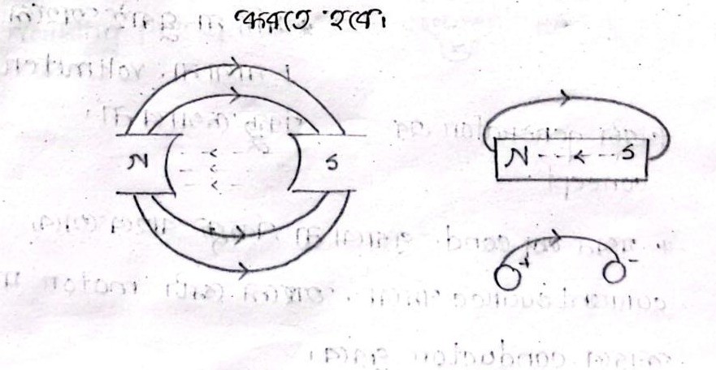
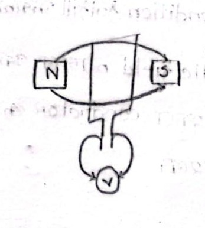

# Class 01: Introduction & Machine Working Principles

> **Date**: 23.06.2026 | **Instructor**: FARIHA MAM (Fariya Tabassum)  
> **Source Scan Pages**: P01, P02, P03  
> [📚 Index](00_Index_and_Topic_Map.md) | [Next Class: Class 02 →](Class_02_Electromagnetic_Fields_and_Hand_Rules.md)

---

## 1. Course Roadmap: Electrical Machine 01

The course is divided into two primary machine categories:

```text
Electrical Machine 01
├── (1) Induction Motor
│    ├── Starting & Operating Principle
│    ├── Running
│    ├── Braking
│    └── Testing
└── (2) Transformer
     ├── Single Phase
     └── Three Phase
```

---

## 2. Motor's Working Principles

The foundational principle governing all electric motors is:
$$\text{Faraday's Law of Electromagnetic Induction}$$

> **Condition for Machine Action**: When there is relative motion between a conductor and a magnetic field such that magnetic flux lines are cut $\longrightarrow$ **Machine Action Occurs**.

### Core Criteria
1. **An active magnetic field must exist** ($\mathbf{B}$).
2. **A conductor must cut the magnetic flux lines** ($l, v$).



---

## 3. Fundamental Properties of Magnetic & Electric Fields

<!-- Page 2 -->

- **Magnetic Monopoles**:
  > **Absence of Magnetic Monopoles**: The North pole and South pole of a magnet can never be isolated; magnetic poles always exist in dipole pairs ($\nabla \cdot \mathbf{B} = 0$).

- **Electric Field Monopoles**:
  > **Electric Monopoles**: Unlike magnetic fields, an electric field can originate from an isolated positive ($+$) or negative ($-$) charge monopole ($\nabla \cdot \mathbf{E} = \rho / \varepsilon_0$).

- **Vector Field Characteristics**:
  - **Magnetic Field**:
    $$\nabla \times \mathbf{B} \neq 0 \quad (\text{curl is possible}), \quad \nabla \cdot \mathbf{B} = 0 \quad (\text{divergence is zero / solenoidal})$$
  - **Electric Field**:
    $$\nabla \cdot \mathbf{E} \neq 0 \quad (\text{divergence is possible}), \quad \nabla \times \mathbf{E} = 0 \quad (\text{curl is zero for electrostatics})$$

> [!NOTE]
> **Physical Meaning of "Cutting" Flux**
> To cut magnetic flux, the conductor must continuously cross the trajectory of magnetic field lines with relative velocity ($v \neq 0$). If held stationary without relative motion, no change in flux linkage occurs ($\frac{d\Phi}{dt} = 0$), so no EMF is induced. Therefore, either the conductor or the magnetic field must maintain continuous motion.

---

## 4. Generator vs. Motor Energy Conversion

<!-- Page 2 - Bottom & Page 3 -->



### Conductor Loop Behavior in Magnetic Field:
- **Rotating the conductor via shaft drive (Mechanical Energy Input):**
  - An induced voltage $E$ (electromotive force, EMF) appears across the loop terminals.
  - If the conductor is not rotated ($v = 0$), no voltage is induced ($E = 0$) and a connected voltmeter reads zero.
  - **This is the fundamental principle of an Electric Generator.**
- **Supplying external electrical current without rotating the conductor (Electrical Energy Input):**
  - An electromagnetic Lorentz force acts on the current-carrying conductor, forcing it to rotate mechanically.
  - **This is the fundamental principle of an Electric Motor.**

```text
Generator ──> Mechanical Force (Energy) to Electrical Energy
Motor     ──> Electrical Energy to Mechanical Force
```

### Methods to Fulfill Faraday's Induction Criteria:
1. **Rotate the conductor inside a stationary magnetic field** (e.g., conventional DC machine / small generator).
2. **Rotate the magnetic field around a stationary conductor** (e.g., modern 3-phase synchronous alternators and induction motor stators).

> [!IMPORTANT]
> **First Topic: Generator Action**
> By driving the shaft through mechanical work, mechanical energy is converted into electrical energy, producing a terminal voltage known as **induced EMF**.

### Core Elements for Working Principle:
- **What are the three essential elements of machine action?**
  1. Magnetic field ($\mathbf{B}$)
  2. Conductor / Coil active length ($l$)
  3. Relative velocity between field and conductor ($v$)
  $$\mathcal{E} = B \cdot l \cdot v \sin\theta$$

---

[📚 Back to Index](00_Index_and_Topic_Map.md) | [Next Class: Class 02 →](Class_02_Electromagnetic_Fields_and_Hand_Rules.md)
