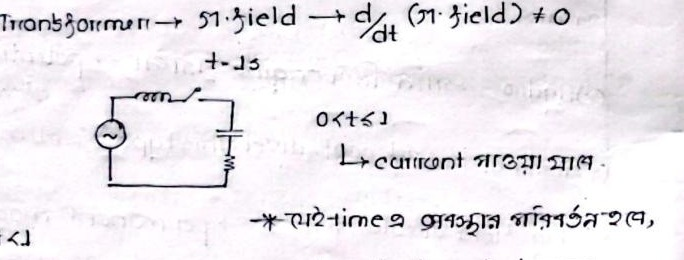
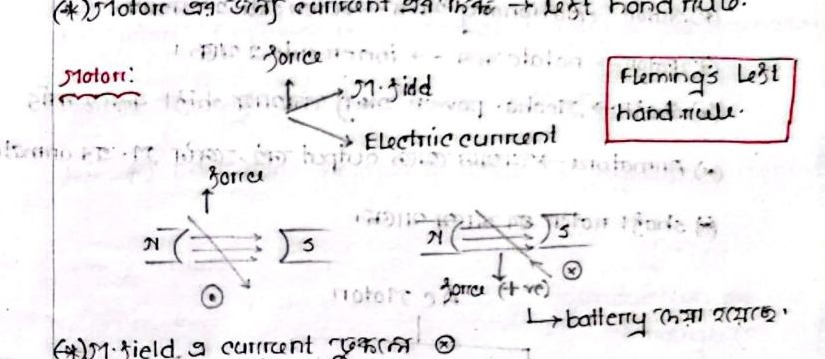

# Class 02: Electromagnetic Fields, Induced Voltage & Hand Rules

> **Instructor**: Fariya Tabassum (FT Mam)  
> **Source Scan Pages**: P04 (Left/Right), P05 (Left/Right)  
> [← Previous Class: Class 01](Class_01_Introduction_and_Working_Principles.md) | [📚 Index](00_Index_and_Topic_Map.md) | [Next Class: Class 03 →](Class_03_Induction_Motor_Basics_and_Stator_Rotor.md)

---

## 1. Electromagnetic Fields & Induced Voltage

<!-- Page 04_L -->

- **Permanent Magnet**:
  > **Permanent Magnet**: Its magnetic field strength and polarity remain constant and time-invariant.
- **Load Concepts**:
  - In electrical systems, load is represented by $\longrightarrow$ **Current** ($I$)
  - In magnetic circuits, load is represented by $\longrightarrow$ **Magnetic Flux** ($\Phi$) / Mechanical Weight
- **Induced Voltage Formula**:
  $$\boxed{E \propto B \cdot l \cdot v \sin\theta}$$
  - $B$: Magnetic field density
  - $l$: Active length of conductor
  - $v$: Relative linear velocity between field $B$ and conductor $l$
  - $\theta$: Angle between magnetic field vector $\mathbf{B}$ and conductor motion vector $\mathbf{v}$

- **Voltage & Frequency Regulation**:
  - The terminal voltage cannot always be maintained strictly constant.
  - Even with constant generation, load fluctuations cause terminal voltage variations.
  - **For Bangladesh power grid**:
    - Nominal Voltage: $220\text{ V} - 240\text{ V}$ (Single Phase), $400\text{ V}$ (Three Phase)
    - Grid Frequency: $\approx 50\text{ Hz}$
- **Current vs Field Strength**:
  > **Current vs. Magnetic Field**: The greater the current passing through a coil, the stronger the generated magnetic field; conversely, lower current yields a weaker magnetic field ($B \propto I$).

---

## 2. Generator vs. Alternator Configurations & Prime Movers

<!-- Page 04_R -->

- **Rotating Elements**:
  - **Generator (Small Scale / DC Machines)**: Conductor rotates while the magnetic field remains stationary.
  - **Alternator (Large Scale / AC Power Plants)**: Conductor (armature) is kept stationary while the magnetic field rotates.  
    *(Standard utility practice in heavy industry and power plants for superior high-voltage insulation).*

- **Power Plant Classification by Prime Mover**:
  - **Generator** $\longrightarrow$ **Shaft drive required** $\longrightarrow$ **Engine / Turbine**
  - *Power generating stations are named after the primary energy source used to spin the turbine:*
  - **Hydroelectric Power Plant**: Falling water drives the turbine $\longrightarrow$ Gravitational potential energy of water.
  - **Thermal Power Plant**: Combustion of Coal, Diesel, or Natural Gas produces high-pressure steam to drive the turbine.

- **Magnetic Field Generation**:
  - Via permanent magnets, or
  - By passing electric current through a coil (Electromagnet — AC or DC).
  - The magnetic field polarity always obeys the **Right-Hand Grip Rule**.

---

## 3. Right-Hand Grip Rule & Machine Actions

<!-- Page 05_L -->

- **Coil Polarity & Thumb Rule**:
  - When curling the four fingers of the right hand in the direction of coil winding current, the extended **thumb** points in the direction of the magnetic field (North pole, $N$).
  - The rule must be applied using conventional current flowing outward from the battery's positive ($+$) terminal.

- **Summary of Machine Operating Equations**:
  - **Motor**:
    $$\text{Magnetic Field} + \text{Conductor} + \text{External Current} \longrightarrow \mathbf{F} \text{ (Mechanical Motion)}$$
    *(A current-carrying conductor placed in a magnetic field experiences a mechanical Lorentz force, producing continuous rotation)*
  - **Generator**:
    $$\text{Magnetic Field} + \text{Conductor Motion (Mechanical Drive)} \longrightarrow \mathcal{E} \text{ (Induced EMF)}$$
    *(Moving a conductor through a magnetic field induces an electromotive force via Faraday's Law, causing electrical current to flow)*
  - **Transformer**:
    $$\text{Magnetic Field} + \frac{d}{dt}(\text{Magnetic Field}) \neq 0 \longrightarrow \text{Stationary Induction}$$

### Transients and DC Saturation



- For $0 < t \le t_1$: Current rises dynamically during switching.
- **Transient Period**: The finite time interval during which circuit electrical variables transition from one steady state to another.
- **DC Saturation**: Sustained application of DC voltage across an iron-core inductor leads to $\frac{d\Phi}{dt} = 0$, driving the core into deep magnetic saturation, eliminating back-EMF, and causing severe overheating and destructive current surge.

---

## 4. Direction Rules: Fleming's Left & Right Hand Rules

<!-- Page 05_R -->

```text
Direction of Induced Current / EMF in Generator ──> Fleming's Right-Hand Rule
Direction of Force / Motion in Motor           ──> Fleming's Left-Hand Rule
```

### Motor Action: Fleming's Left-Hand Rule
Used to determine the direction of mechanical force exerted on a current-carrying conductor:
- **Thumb**: Direction of Force / Motion ($\mathbf{F}$)
- **Forefinger**: Direction of Magnetic Field ($\mathbf{B}$, North to South)
- **Middle Finger**: Direction of Current ($\mathbf{I}$)



> [!IMPORTANT]
> **Current Direction Notation**
> - Current entering into the page / plane: $\otimes$ *(cross)*
> - Current exiting out of the page / plane: $\odot$ *(dot)*

### Generator Action: Fleming's Right-Hand Rule
Used to determine the direction of induced EMF / current:
- **Thumb**: Motion of conductor
- **Forefinger**: Magnetic Field direction
- **Centre / Middle Finger**: Induced current / EMF direction

> [!NOTE]
> **Scientific Foundations**
> **Faraday's Law**, the **Right-Hand Grip Rule**, and **Fleming's Rules** are physical manifestations of classical electromagnetism rigorously unified under **Maxwell's four governing equations**.

---

[← Previous Class: Class 01](Class_01_Introduction_and_Working_Principles.md) | [📚 Back to Index](00_Index_and_Topic_Map.md) | [Next Class: Class 03 →](Class_03_Induction_Motor_Basics_and_Stator_Rotor.md)
