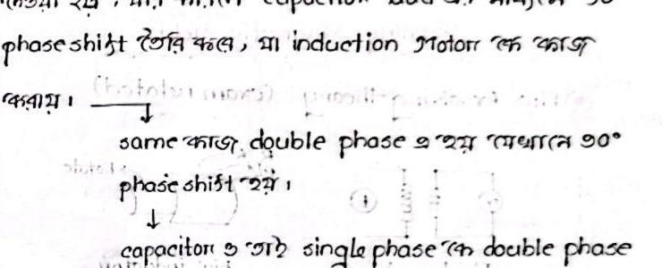

# Class 03: Induction Motor Fundamentals, Terminology & Losses

> **Date**: 30.06.2026 | **Instructor**: Fariya Tabassum (FT Mam)  
> **Source Scan Pages**: P06 (Left/Right), P07 (Left/Right), P08_L (top)  
> [← Previous Class: Class 02](Class_02_Electromagnetic_Fields_and_Hand_Rules.md) | [📚 Index](00_Index_and_Topic_Map.md) | [Next Class: Class 04 →](Class_04_Rotating_Magnetic_Field_RMF_Proof.md)

---

## 1. Important Terms Used in Electrical Machines

<!-- Page 06_L -->

- **Stator**: The stationary part of the machine, located on the outer frame.
- **Rotor**: The rotating part of the machine, located inside the stator bore.
- **Shaft**: The mechanical axle solidly coupled to the rotor, used to transmit developed mechanical power to the external load.
- **Armature**: The machine winding where main electrical power interaction / energy conversion takes place.
  *(Note: The shaft is always rigidly coupled to the rotor).*

---

## 2. Classification of AC Motors

```text
AC Motor
├── Synchronous Motor
└── Asynchronous Motor
     ├── Induction Motor
     │    ├── Squirrel Cage Induction Motor (SCIM)
     │    └── Slip Ring Induction Motor (SRIM / Wound Rotor)
     └── Commutator Motor
```

> [!IMPORTANT]
> **Terminology Note**
> In electrical machinery, the term **Asynchronous Motor** always refers specifically to the **Induction Motor** (because its rotor can never run at synchronous speed in motoring mode).

---

## 3. Induction Motor vs. DC Motor: Conduction vs. Induction

<!-- Page 06_R -->

- **DC Motor**:
  - Electrical power is conducted **directly** to the armature (rotor) through **brushes & commutator segments**.
  - Stator and Rotor are not physically isolated; they are connected via sliding electrical contacts.
- **AC Motor (Induction Motor)**:
  - Stator and Rotor are **completely physically isolated** from each other.
  - Energy transfer across the air gap occurs entirely through **electromagnetic induction** (air-gap flux).

### Induction Motor as a "Rotating Transformer"
> **Nature of the Induction Motor**: An Induction Motor (IM) is fundamentally a **"Rotating Transformer"**.
- If windings are separated only by air, it is an *air-core transformer*; if coupled via a laminated ferromagnetic core, it is an *iron-core transformer*.
- In a conventional transformer, the secondary winding is stationary.
- In an induction motor, the secondary winding (rotor) is mounted on bearings and **free to rotate**; hence it is designated a **Rotating Transformer**.

---

## 4. Advantages & Disadvantages of Induction Motors

<!-- Page 07_L -->

### Advantages:
1. **Simple, rugged and compact** in construction.
2. **Cost is low & reliable** (economical with long operational lifespan).
3. **High efficiency & low frictional losses**: Absence of brushes and mechanical commutators eliminates sliding contact friction and sparking.
4. **Minimum maintenance** required.
5. **Self-starting**: 3-phase induction motors are inherently self-starting (unlike synchronous motors which require auxiliary starting methods and synchronization).

### Disadvantages:
1. **Speed cannot be varied easily without sacrificing efficiency**: Speed control is complex compared to DC motors.
2. **Speed drop with load**: Just like a DC shunt motor, its speed drops slightly as mechanical load increases.
3. **Inferior starting torque**: Starting torque is inferior to DC series/compound motors.

---

## 5. Single-Phase Induction Motor & Fan Operation

<!-- Page 07_R -->

- **Starting Dilemma**:
  **A standard single-phase induction motor is not inherently self-starting because a single-phase alternating winding produces a pulsating, rather than revolving, magnetic field.**
- **Capacitor Role in Ceiling Fans**:
  - Common domestic ceiling fans operate as **Permanent-Split Capacitor (PSC) single-phase induction motors**.
  - A running capacitor is connected in series with an auxiliary (starting) winding, placed in parallel with the main winding across the AC line.
  - The capacitor forces the current in the auxiliary winding to lead the main winding current by $90^\circ$ electrical.
  - This artificial $90^\circ$ phase shift converts the single-phase supply into an equivalent **two-phase balanced supply**, establishing a forward rotating magnetic field that produces starting torque.

```text
Single-Phase Supply + Capacitor ──> 90° Phase Shift ──> Two-Phase Equivalent ──> RMF Created ──> Fan Starts Rotating
```



> [!TIP]
> **Fan Starting Mechanism**
> - The capacitor creates a $90^\circ$ phase lead in the auxiliary winding current relative to the main winding.
> - This spatial and temporal quadrature produces a true rotating magnetic field (RMF), enabling the motor to develop starting torque and accelerate up to speed.

---

## 6. Core Losses & Mitigation

<!-- Page 07_R & Page 08_L (top) -->

Two distinct categories of iron/core losses occur in magnetic cores subjected to alternating flux:

$$\text{Core Losses } (P_i) = P_e \text{ (Eddy Current Loss)} + P_h \text{ (Hysteresis Loss)}$$

1. **Eddy Current Loss ($P_e$)**:
   - Alternating magnetic flux induces circulating eddy currents within the conductive iron core body, causing $I^2 R$ heat dissipation.
   - **Mitigation**: Stator and transformer cores are constructed from thin, stacked silicon-steel **laminations** coated with insulating varnish, which break up circulating eddy current loops and drastically increase electrical resistance.
2. **Hysteresis Loss ($P_h$)**:
   - Continuous cyclic reversal of magnetic domains during alternating magnetization causes molecular friction and energy loss.
   - **Mitigation**: Using high-permeability, cold-rolled grain-oriented (CRGO) silicon steel with a narrow hysteresis B-H loop.
   - **Note**: Hysteresis loss depends inherently on the metallurgical and magnetic properties of the core material; it cannot be modified by external circuit switching.

---

[← Previous Class: Class 02](Class_02_Electromagnetic_Fields_and_Hand_Rules.md) | [📚 Back to Index](00_Index_and_Topic_Map.md) | [Next Class: Class 04 →](Class_04_Rotating_Magnetic_Field_RMF_Proof.md)
